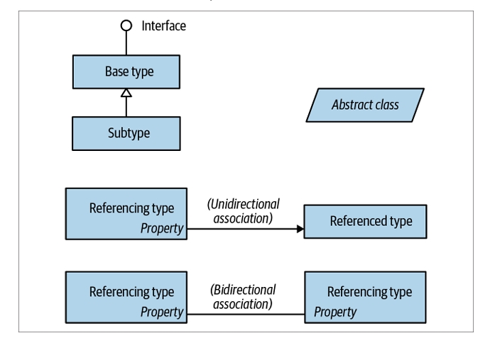

# معرفی کتاب

نسخه دوازدهم زبان برنامه‌نویسی سی شارپ، نهمین به‌روزرسانی بزرگ این زبان قدرتمند از مایکروسافت محسوب می‌شود. سی شارپ حالا به زبانی با انعطاف‌پذیری و گستردگی فوق‌العاده تبدیل شده.
از یک طرف، امکاناتی در سطح بالا مثل عبارات پرس‌وجو (query expressions) و ادامه‌های ناهمگام (asynchronous continuations) را ارائه می‌دهد، و از طرف دیگر، با ویژگی‌هایی مثل انواع مقدار سفارشی (custom value types) و اشاره‌گرهای اختیاری (optional pointers)، امکان برنامه‌نویسی سطح پایین و بهینه را هم فراهم می‌کند.

اما هزینه این رشد و پیشرفت، این است که حالا مطالب بیشتری برای یاد گرفتن وجود دارد. البته ابزارهایی مثل IntelliSense مایکروسافت یا منابع آنلاین بسیار خوب‌اند و هنگام کدنویسی کمک بزرگی هستند، اما این ابزارها پیش‌فرض‌شان این است که شما یک درک اولیه و نقشه ذهنی از مفاهیم اصلی دارید.

این کتاب دقیقاً همان نقشه مفهومی را در اختیار شما می‌گذارد؛ آن هم به‌صورتی خلاصه، منسجم، و بدون حاشیه‌پردازی و مقدمه‌چینی‌های طولانی.

مثل هفت نسخه قبلی، کتاب C# 12 به‌صورت مبتنی بر مفاهیم و کاربردها تنظیم شده، که باعث می‌شود هم برای مطالعه پیوسته مناسب باشد و هم برای مرور و جستجوی موضوعی.
در عین حال، کتاب وارد عمق مباحث می‌شود، در حالی که فقط دانش اولیه برنامه‌نویسی را فرض می‌گیرد؛ بنابراین هم برای برنامه‌نویس‌های سطح متوسط قابل فهم است، و هم برای مخاطبان پیشرفته.

در این کتاب، تمرکز روی سه چیز است:

**زبان #C**

**محیط اجرای زبان مشترک (CLR)**

**کتابخانه کلاس پایه دات‌نت نسخه ۸ (BCL)**

ما این تمرکز را برای این انتخاب کرده‌ایم که بتوانیم وارد مباحث سخت و پیشرفته شویم، بدون اینکه از عمق یا خوانایی کم کنیم.
قابلیت‌هایی که اخیراً به #C اضافه شده‌اند در متن مشخص شده‌اند، بنابراین اگر با نسخه‌های قبلی مثل C# 11 یا C# 10 کار می‌کنید، همچنان می‌توانید از این کتاب به‌عنوان یک مرجع استفاده کنید.
## مخاطبان مورد نظر

این کتاب برای مخاطبان سطح متوسط تا پیشرفته نوشته شده است.
برای خواندن آن، نیازی نیست قبلاً با C# کار کرده باشید، اما باید تجربه عمومی در برنامه‌نویسی داشته باشید.
اگر مبتدی هستید، این کتاب به‌تنهایی کافی نیست، ولی می‌تواند در کنار یک منبع آموزشی مبتنی بر آموزش گام‌به‌گام، بسیار مفید باشد.

این کتاب مکمل بسیار خوبی است برای بسیاری از کتاب‌هایی که روی فناوری‌های کاربردی تمرکز دارند، مثل ASP.NET Core یا Windows Presentation Foundation (WPF).
مطالبی که این کتاب پوشش می‌دهد، معمولاً در آن کتاب‌ها جا نمی‌گیرد، و بالعکس.

اگر دنبال کتابی هستید که همه فناوری‌های دات‌نت را به‌صورت سطحی معرفی کند، این کتاب مناسب شما نیست.
همچنین اگر قصد دارید درباره APIهای اختصاصی توسعه اپلیکیشن‌های موبایل یاد بگیرید، این کتاب گزینه مناسبی نخواهد بود.

## ساختار کلی کتاب
فصل دوم تا فصل چهارم به‌طور کامل روی زبان #C تمرکز دارند. این فصل‌ها از مبانی اولیه مثل نحو (syntax)، انواع داده (types)، و متغیرها (variables) شروع می‌شوند و تا موضوعات پیشرفته‌ای مثل کد ناامن (unsafe code) و دستورات پیش‌پردازنده (preprocessor directives) ادامه پیدا می‌کنند.
اگر با این زبان تازه آشنا شده‌اید، بهتر است این فصل‌ها را به‌ترتیب بخوانید.

بقیه فصل‌ها روی کتابخانه کلاس پایه دات‌نت ۸ (Base Class Library یا BCL) تمرکز دارند. این فصل‌ها موضوعاتی را پوشش می‌دهند مثل:

+ LINQ (پرس‌وجوی یکپارچه با زبان)

+ XML

+ کالکشن‌ها (Collections)

+ هم‌زمانی (Concurrency)

+ ورودی/خروجی و شبکه (I/O and Networking)

+ مدیریت حافظه

+ بازتاب (Reflection)

+ برنامه‌نویسی داینامیک

+ اتریبیوت‌ها (Attributes)

+ رمزنگاری (Cryptography)

+ ارتباط با کدهای Native (Interoperability)

بیشتر این فصل‌ها را می‌توانید به‌صورت پراکنده و مستقل بخوانید.
اما توصیه می‌کنیم فصل‌های ۵ و ۶ را حتماً به‌ترتیب بخوانید، چون پایه‌ای برای درک فصل‌های بعدی هستند.
همچنین اگر می‌خواهید با LINQ کار کنید، بهتر است سه فصل مربوط به LINQ را به‌ترتیب دنبال کنید.
چند فصل از کتاب هم فرض را بر این گذاشته‌اند که شما با مفهوم هم‌زمانی (Concurrency) آشنا هستید، که آن را در فصل ۱۴ توضیح می‌دهیم.

## آنچه برای استفاده از این کتاب نیاز دارید

چه چیزهایی برای استفاده از این کتاب نیاز دارید
برای اجرای مثال‌های این کتاب، باید .NET 8 را نصب کرده باشید.
همچنین پیشنهاد می‌کنیم از مستندات رسمی دات‌نت مایکروسافت استفاده کنید تا بتوانید نوع‌ها (Types) و اعضای (Members) مختلف را راحت‌تر جستجو کنید (این مستندات آنلاین هستند).

درسته که می‌توانید کدهای خود را در یک ویرایشگر ساده متنی بنویسید و با خط فرمان اجرا کنید،
اما برای اینکه بهره‌وری بیشتری داشته باشید، بهتر است از یک محیط آزمایشی (scratchpad) برای تست سریع قطعه‌کدها و همچنین یک محیط توسعه یکپارچه (IDE) برای ساخت برنامه‌ها و کتابخانه‌ها استفاده کنید.

برای ویندوز، پیشنهاد می‌کنیم از LINQPad 8 استفاده کنید. این نرم‌افزار رایگان است و از www.linqpad.net قابل دانلود است.
LINQPad به‌طور کامل از #C 12 پشتیبانی می‌کند و توسط نویسنده همین کتاب نگهداری می‌شود.

برای محیط توسعه (IDE) در ویندوز، می‌توانید از Visual Studio 2022 استفاده کنید؛ هر نسخه‌ای از آن برای مطالب این کتاب مناسب است.
اگر به یک IDE چندسکویی (Cross-platform) نیاز دارید، از Visual Studio Code استفاده کنید.

تمام مثال‌های کدی که در این کتاب آمده، به‌صورت نمونه‌های تعاملی (قابل ویرایش) برای LINQPad نیز موجود است.
می‌توانید همه این مثال‌ها را تنها با یک کلیک دانلود کنید:

در گوشه پایین سمت چپ LINQPad، روی تب Samples کلیک کنید، سپس روی Download more samples بزنید و گزینه
“C# 12 in a Nutshell” را انتخاب کنید.

## قراردادهای استفاده‌شده در این کتاب
در این کتاب از نمودارهای ساده UML برای نمایش روابط بین انواع داده (Types) استفاده شده، همان‌طور که در شکل P-1 می‌بینید.

یک مستطیل کج‌شده نشان‌دهنده یک کلاس انتزاعی (abstract class) است.

یک دایره نشان‌دهنده یک اینترفیس (interface) است.

یک خط با یک مثلث توخالی نمایانگر ارث‌بری (Inheritance) است؛ به‌طوری‌که مثلث به سمت نوع پایه (base type) اشاره دارد.

یک خط با یک فلش نشان‌دهنده یک ارتباط یک‌طرفه (one-way association) است.

یک خط بدون فلش نشان‌دهنده یک ارتباط دوطرفه (two-way association) است.

تصویر P-1: نمودار نمونه

  
   
  

در این کتاب از نشانه‌گذاری‌های خاصی برای نمایش انواع مختلف محتوا استفاده شده. در ادامه، این قراردادهای تایپوگرافی آورده شده‌اند:

+ کج (Italic)

برای معرفی اصطلاحات جدید، آدرس‌های اینترنتی (URI)، نام فایل‌ها و پوشه‌ها به کار می‌رود.

+ عرض ثابت (Constant width)

برای نمایش کدهای #C، کلمات کلیدی (keywords)، شناسه‌ها (identifiers) و خروجی برنامه‌ها استفاده می‌شود.

+ عرض ثابت و پررنگ (Constant width bold)

برای برجسته‌کردن بخش خاصی از کد در مثال‌ها استفاده می‌شود.

+ عرض ثابت و کج (Constant width italic)

برای نشان‌دادن مقدارهایی که باید توسط کاربر جایگزین شوند به کار می‌رود.
## استفاده از نمونه کدها
مطالب تکمیلی این کتاب، شامل مثال‌های کد، تمرین‌ها و سایر منابع، از طریق لینک زیر قابل دانلود است:
🔗 http://www.albahari.com/nutshell

هدف این کتاب این است که به شما کمک کند کارتان را انجام دهید. به‌طور کلی، شما می‌توانید از کدهای موجود در این کتاب در برنامه‌ها و مستندات خود استفاده کنید، بدون اینکه نیاز به گرفتن اجازه خاصی داشته باشید — مگر اینکه بخواهید بخش بزرگی از کدها را بازتولید کنید.

برای مثال:

✅ نوشتن یک برنامه که از چند تکه کد این کتاب استفاده می‌کند، نیازی به مجوز ندارد.
🚫 اما فروش یا توزیع مستقیم مثال‌های کد کتاب‌های O’Reilly نیاز به اجازه دارد.
✅ پاسخ دادن به یک سؤال با ارجاع به این کتاب و نقل قول از کدهای آن، نیازی به مجوز ندارد (گرچه ما همیشه قدردان ذکر منبع هستیم).
🚫 گنجاندن مقدار زیادی از مثال‌های کد این کتاب در مستندات محصول‌تان، نیاز به کسب اجازه دارد.

ما از اینکه به کتاب ارجاع بدهید خوشحال می‌شویم، ولی معمولاً الزامی برای ذکر منبع نیست.
اگر خواستید منبع را ذکر کنید، بهتر است شامل اطلاعات زیر باشد:

"C# 12 in a Nutshell by Joseph Albahari (O’Reilly). Copyright 2024 Joseph Albahari, 978-1-098-14744-0."

اگر فکر می‌کنید استفاده‌تان از کدهای این کتاب خارج از حدود استفاده منصفانه (Fair Use) یا مجوز داده‌شده در اینجا است، با خیال راحت با ما تماس بگیرید:
📧 permissions@oreilly.com

## نحوه تماس با ما

چطور با ما تماس بگیرید
لطفاً نظرات و سؤالات خود درباره این کتاب را با ناشر درمیان بگذارید:

ناشر: O’Reilly Media, Inc.

نشانی:
1005 Gravenstein Highway North
Sebastopol, CA 95472

📞 800-889-8969 (در آمریکا یا کانادا)

📞 707-829-7019 (بین‌المللی یا تماس محلی)

📠 707-829-0104 (فکس)
📧 support@oreilly.com

🌐 https://www.oreilly.com/about/contact.html

ما برای این کتاب یک صفحه اختصاصی وب داریم که در آن خطاها، مثال‌ها، و اطلاعات تکمیلی را منتشر می‌کنیم:
🔗 https://oreil.ly/c-sharp-nutshell-12

مثال‌های کد و منابع دیگر را نیز می‌توانید از این آدرس دریافت کنید:
🔗 http://www.albahari.com/nutshell/

برای دریافت جدیدترین اخبار درباره کتاب‌ها و دوره‌های ما به سایت زیر سر بزنید:
🌐 https://oreilly.com

و در شبکه‌های اجتماعی دنبال‌مان کنید

ما را در لینکدین بیابید: https://linkedin.com/company/oreilly-media

ما را در توییتر دنبال کنید: https://twitter.com/oreillymedia

ویدیوهای ما را در یوتیوب تماشا کنید: https://youtube.com/oreillymedia

## قدردانی‌ها

جوزف آلباهاری

از زمان اولین انتشار این کتاب در سال ۲۰۰۷، همواره از نظرات ارزشمند بررسی‌کنندگان فنی حرفه‌ای بهره برده‌ام.
برای نسخه‌های اخیر کتاب، به‌طور ویژه از افراد زیر تشکر می‌کنم:

Stephen Toub, Paulo Morgado, Fred Silberberg, Vitek Karas, Aaron Robinson, Jan Vorlicek, Sam Gentile, Rod Stephens, Jared Parsons, Matthew Groves, Dixin Yan, Lee Coward, Bonnie DeWitt, Wonseok Chae, Lori Lalonde, و James Montemagno

همچنین برای همکاری در نسخه‌های پیشین کتاب، از صمیم قلب از افراد زیر قدردانی می‌کنم:

Eric Lippert, Jon Skeet, Stephen Toub, Nicholas Paldino, Chris Burrows, Shawn Farkas, Brian Grunkemeyer, Maoni Stephens, David DeWinter, Mike Barnett, Melitta Andersen, Mitch Wheat, Brian Peek, Krzysztof Cwalina, Matt Warren, Joel Pobar, Glyn Griffiths, Ion Vasilian, Brad Abrams، و Adam Nathan

بسیاری از این بررسی‌کنندگان فنی، از چهره‌های برجسته در شرکت مایکروسافت هستند. از اینکه وقت گذاشتید و کمک کردید تا کیفیت این کتاب به سطحی بالاتر برسد، صمیمانه سپاسگزارم.

همچنین از بن آلباهاری و اریک یوهانسن که در نسخه‌های قبلی همکاری داشتند، و نیز از تیم انتشارات O’Reilly — به‌ویژه ویراستار دقیق و پاسخ‌گوی من، کُربین کالینز — تشکر می‌کنم.

و در پایان، عمیق‌ترین قدردانی‌ام را نثار همسر فوق‌العاده‌ام، لی آلباهاری، می‌کنم که حضورش در کنارم، در تمام طول این پروژه، منبع شادی و آرامش من بود.

</dir>