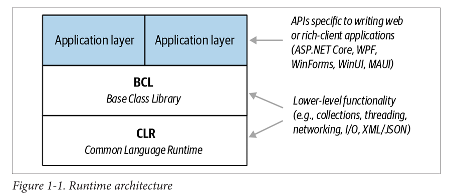
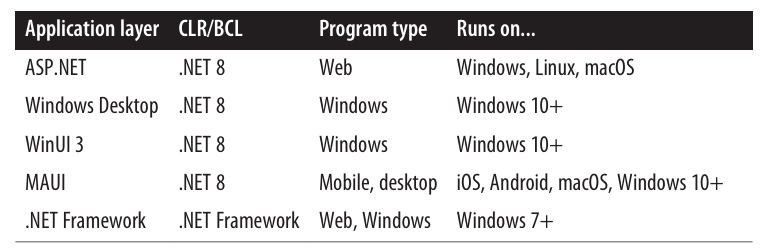
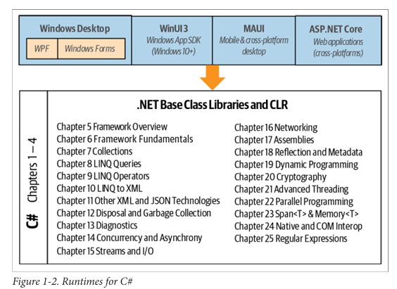

<div dir="rtl">
# فصل اول: آشنایی با سی‌شارپ و دات‌نت

سی شارپ یک زبان برنامه‌نویسی همه‌منظوره (general-purpose)، ایمن از نظر نوع داده (type-safe)، و شی‌گرا (object-oriented) است.

هدف اصلی این زبان، افزایش بهره‌وری برنامه‌نویس است.
برای رسیدن به این هدف، #C تلاش می‌کند میان سادگی، قدرت بیان (expressiveness)، و کارایی (performance) تعادل برقرار کند.

طراح اصلی زبان #C از همان نسخه اول، آندرس هایلسبرگ (Anders Hejlsberg) بوده؛ کسی که قبلاً Turbo Pascal را خلق کرده و معمار زبان Delphi نیز بوده است.

زبان #C به‌گونه‌ای طراحی شده که وابسته به هیچ پلتفرم خاصی نیست (platform-neutral) و می‌تواند با اجراکننده‌های خاص پلتفرم‌های مختلف (platform-specific runtimes) کار کند.

## شی‌ءگرایی

زبان #C یک پیاده‌سازی قدرتمند از الگوی برنامه‌نویسی شی‌گرا (Object-Oriented Programming) است.
این الگو شامل سه اصل اصلی است:

+ کپسوله‌سازی (Encapsulation)

+ ارث‌بری (Inheritance)

+ چندریختی (Polymorphism)

🔹 کپسوله‌سازی یعنی اینکه برای هر شی (Object) یک مرز مشخص تعریف کنیم تا رفتار خارجی (عمومی) آن را از جزئیات پیاده‌سازی داخلی (خصوصی) جدا کنیم.

#### ویژگی‌های منحصربه‌فرد #C در شی‌گرایی

🔸 سیستم نوع یکپارچه (Unified Type System)
در #C، واحد اصلی ساخت برنامه، نوع (Type) است — یعنی یک واحد کپسوله‌شده از داده و توابع.

در این زبان، همه نوع‌ها در نهایت زیرمجموعه‌ای از یک نوع پایه مشترک هستند.
این یعنی فرقی نمی‌کند با یک شی تجاری (Business Object) کار می‌کنید یا با یک عدد ساده، همه این نوع‌ها از یک سری قابلیت‌های پایه برخوردارند.

برای مثال:

می‌تونید روی هر شیئی در #C متد ToString را صدا بزنید و نسخه متنی (رشته‌ای) از آن دریافت کنید — چون همه نوع‌ها این متد را دارند.

🔸 کلاس‌ها و اینترفیس‌ها (Classes and Interfaces)
در مدل سنتی شی‌گرایی، تنها نوع موجود کلاس (Class) است. اما در #C انواع دیگری هم وجود دارد، از جمله:

اینترفیس (Interface)
اینترفیس‌ها شبیه کلاس‌ها هستند با این تفاوت که نمی‌توانند داده نگه دارند. یعنی فقط رفتار تعریف می‌کنند، نه وضعیت.

این ویژگی چند مزیت دارد:

+ پشتیبانی از ارث‌بری چندگانه (Multiple Inheritance)

+ جدا کردن تعریف (specification) از پیاده‌سازی (implementation)

🔸 ویژگی‌ها، متدها، و رویدادها
(Properties, Methods, and Events)

در الگوی شی‌گرایی ناب، همه توابع به شکل متد (Method) هستند. اما در #C، متدها تنها یک نوع از اعضای تابعی (Function Members) محسوب می‌شوند.
نوع‌های دیگر شامل:

+ ویژگی‌ها (Properties):
+ 
اعضایی که بخشی از وضعیت یک شی را کپسوله می‌کنند، مثل رنگ یک دکمه یا متن یک برچسب.

+ رویدادها (Events):
+ 
اعضایی که برای ساده‌تر کردن واکنش به تغییرات وضعیت شی‌ها طراحی شده‌اند.

تأثیرات برنامه‌نویسی تابعی در #C

با اینکه #C به‌طور عمده یک زبان شی‌گراست، اما از الگوهای برنامه‌نویسی تابعی (Functional Programming) هم الهام گرفته. برخی از این ویژگی‌ها عبارت‌اند از:

🔹 توابع به‌عنوان مقدار (Functions as Values)
با استفاده از نماینده‌ها (Delegates) در #C، می‌توانید توابع را مانند داده، به دیگر توابع ارسال یا از آن‌ها بازگردانید.

🔹 پشتیبانی از الگوهای برنامه‌نویسی تابعی
در برنامه‌نویسی تابعی، ترجیح داده می‌شود که مقدار متغیرها تغییر نکند، و به‌جای آن از الگوهای اعلانی (Declarative Patterns) استفاده شود.

زبان #C ابزارهایی برای این سبک برنامه‌نویسی فراهم کرده، از جمله:

+ توابع بی‌نام (Lambda Expressions):
+ 
می‌توان توابعی را در لحظه تعریف کرد که به متغیرهای اطرافشان دسترسی دارند (یعنی آن‌ها را "capture" می‌کنند).

+ عبارات پرس‌وجو (Query Expressions):
+ 
برای برنامه‌نویسی لیستی یا واکنشی (Reactive Programming) به‌کار می‌روند.

+ رکوردها (Records):
+ 
نوع‌هایی هستند که به‌سادگی می‌توان با آن‌ها اشیایی فقط‌خواندنی و تغییرناپذیر (Immutable) ساخت.

## ایمنی نوع در #C
(Type Safety)

زبان #C در اصل یک زبان ایمن از نظر نوع (Type-Safe) است. این یعنی اشیای مختلف (یعنی نمونه‌هایی از انواع مختلف داده‌ها) فقط از طریق سازوکارهایی که خود نوع آن‌ها تعریف کرده، می‌توانند با هم تعامل داشته باشند.

این کار باعث می‌شود که انسجام داخلی هر نوع (Type) حفظ شود.

برای مثال:

در #C نمی‌توانید با یک مقدار از نوع رشته (string) طوری رفتار کنید که انگار یک عدد صحیح (int) است — زبان جلوی این کار را می‌گیرد.

**تایپ ایستا (Static Typing)**

زبان #C از تایپ ایستا پشتیبانی می‌کند.
یعنی بررسی نوع داده‌ها نه فقط در زمان اجرا، بلکه در زمان کامپایل (ساخت برنامه) هم انجام می‌شود.

🔹 این یعنی بسیاری از خطاهای احتمالی قبل از اجرای برنامه شناسایی می‌شوند.
🔹 به‌جای اینکه فقط با نوشتن تست‌های واحد (Unit Tests) در زمان اجرا به دنبال خطاها باشید، کامپایلر خودش بررسی می‌کند که همه نوع‌ها در برنامه درست به‌کار رفته‌اند یا نه.

این ویژگی چند مزیت مهم داره:

+ برنامه‌های بزرگ راحت‌تر قابل مدیریت هستند

+ کدها قابل پیش‌بینی‌تر و مطمئن‌تر (Robust) می‌شن

+ ابزارهایی مثل IntelliSense در ویژوال استودیو می‌تونن کمک کنن کدها رو سریع‌تر و بهتر بنویسید، چون دقیقاً می‌دونن که هر متغیر از چه نوعیه و چه متدهایی می‌تونید روش اجرا کنید

+ همچنین این ابزارها می‌تونن بررسی کنن که یک متغیر یا متد یا نوع، در کجای برنامه استفاده شده — که این موضوع برای بازسازی و تغییر ساختار کد (Refactoring) بسیار مهمه

**تایپ پویا با dynamic**

در عین حال که #C عمدتاً یک زبان با تایپ ایستاست، اجازه می‌ده که بخش‌هایی از کد را به‌صورت پویا تایپ کنید.
برای این کار می‌تونید از کلیدواژه‌ی dynamic استفاده کنید.

اما با این وجود، #C در ذات خود همچنان یک زبان با تایپ ایستا باقی می‌مونه.

**تایپ قوی (Strong Typing)**

زبان #C همچنین به عنوان یک زبان با تایپ قوی (Strongly Typed) شناخته می‌شود.
یعنی قوانین مربوط به نوع‌ها به‌شدت رعایت می‌شن — چه در زمان کامپایل و چه در زمان اجرا.

مثلاً:
شما نمی‌تونید تابعی که انتظار داره یک عدد صحیح (int) دریافت کنه، با یک عدد اعشاری (float) صدا بزنید — مگر اینکه صراحتاً عدد اعشاری رو به عدد صحیح تبدیل (Cast) کرده باشید.

این موضوع کمک می‌کنه تا از بروز خطاهای رایج و پنهان جلوگیری بشه.

✅ این ویژگی‌ها باعث می‌شن زبان #C هم قدرتمند باشه و هم امن و قابل اعتماد — مخصوصاً برای ساخت برنامه‌های بزرگ و پیچیده.

## مدیریت حافظه

(Memory Management)

در زبان #C، مدیریت حافظه به‌صورت خودکار توسط زمان اجرای مشترک (Common Language Runtime یا CLR) انجام می‌شود.

به عبارت ساده‌تر:
در هنگام اجرای برنامه، یک زباله‌روب (Garbage Collector) وجود دارد که به‌طور خودکار حافظه اشیایی را که دیگر استفاده نمی‌شوند آزاد می‌کند.

✅ این یعنی برنامه‌نویس دیگر نیازی ندارد خودش به‌صورت دستی حافظه اشیاء را آزاد کند — چیزی که در زبان‌هایی مثل ++C ضروری بود.

❌ در ++C اگر فراموش می‌کردید حافظه‌ای را آزاد کنید، یا اشتباه آن را دوباره آزاد می‌کردید، برنامه‌تان با خطاهای خطرناک مثل اشاره‌گرهای نامعتبر (Dangling Pointers) روبه‌رو می‌شد.
اما در #C این مشکل به‌طور کامل از بین رفته.

آیا در #C اصلاً اشاره‌گر (Pointer) وجود ندارد؟
❌ خیر، زبان #C اشاره‌گرها را کاملاً حذف نکرده؛ فقط استفاده از آن‌ها را برای اکثر کارها غیرضروری کرده است.

در برخی موارد خاص که:

+ عملکرد (Performance) خیلی حیاتی باشد

+ یا نیاز به تعامل با کدهای Native یا کتابخانه‌های سطح پایین باشد

می‌توانید از اشاره‌گرها و مدیریت حافظه دستی استفاده کنید — اما فقط در بخش‌هایی از کد که با کلیدواژه unsafe علامت‌گذاری شده‌اند.

✅ بنابراین:

+ در استفاده روزمره، شما بدون اشاره‌گر هم می‌توانید همه کارها را به‌سادگی انجام دهید.

+ اما اگر لازم باشد، #C امکان نوشتن کدهای سطح پایین و بهینه را هم در اختیار شما قرار می‌دهد — با آگاهی کامل و در محیطی ایزوله.

## پشتیبانی از پلتفرم‌ها
(Platform Support)

زبان #C اجراکننده‌هایی (Runtimes) دارد که از پلتفرم‌های زیر پشتیبانی می‌کنند:

+ ویندوز 7 به بعد (Windows 7+)
برای ساخت اپلیکیشن‌های:

   + دسکتاپ با رابط گرافیکی (Rich Client)

   + تحت وب (Web)

   + سمت سرور (Server)

   + خط فرمان (Command-Line)

+ سیستم‌عامل macOS
برای ساخت:

   + برنامه‌های تحت وب و خط فرمان

   + همچنین برنامه‌های گرافیکی از طریق فناوری Mac Catalyst

+ لینوکس (Linux)
برای اپلیکیشن‌های:

   + تحت وب

   + خط فرمان

+ اندروید و iOS
برای توسعه برنامه‌های موبایل

+ دستگاه‌های ویندوز 10
مثل:

   + Xbox

   + Surface Hub

   + HoloLens
(از طریق فناوری UWP یا Universal Windows Platform)

علاوه بر این، فناوری‌ای به نام Blazor وجود دارد که می‌تواند کدهای #C را به WebAssembly تبدیل کند تا مستقیماً در مرورگر اجرا شوند.

✅ این یعنی می‌توانید با استفاده از #C حتی برنامه‌های تحت وب مدرن و بدون نیاز به جاوااسکریپت بنویسید — و کدتان در مرورگر اجرا شود!
## محیط‌های زمان اجرا (CLRs)، کتابخانه‌های کلاس پایه (BCLs) و رانتایم‌ها

برای اجرای برنامه‌های نوشته‌شده با زبان #C، به دو بخش اصلی نیاز داریم:

1. یک زمان اجرای مشترک (Common Language Runtime یا CLR)

2. یک کتابخانه کلاس پایه (Base Class Library یا BCL)

علاوه بر این‌ها، یک زمان اجرا (Runtime) ممکنه شامل لایه‌های سطح بالاتر هم باشه؛
مثلاً کتابخانه‌هایی برای توسعه:

+ برنامه‌های دسکتاپ با رابط گرافیکی (Rich-Client)

+ برنامه‌های موبایل

+ یا برنامه‌های تحت وب

📊 این ساختار معمولاً در قالب نموداری مثل شکل 1-1 نمایش داده می‌شه (که در ادامه کتاب میاد).

**چرا چند نوع Runtime وجود داره؟**
💡 دلیلش اینه که:

+ انواع مختلفی از اپلیکیشن‌ها وجود دارن (وب، موبایل، دسکتاپ، بازی و...)

+ و این اپلیکیشن‌ها باید روی پلتفرم‌های مختلف (مثل ویندوز، لینوکس، اندروید و...) اجرا بشن

بنابراین برای پشتیبانی از این تنوع، نسخه‌های مختلفی از Runtimes وجود دارن —
ولی همه‌ی اون‌ها بر پایه مفاهیم CLR و BCL ساخته شده‌اند.
<div align="center">
  
   
  
</div>

## زمان اجرای مشترک (CLR)
(Common Language Runtime)

این CLR یا زمان اجرای مشترک، بخشی از زیرساخت #C است که خدمات حیاتی زمان اجرا را فراهم می‌کند — از جمله:

+ مدیریت خودکار حافظه (Garbage Collection)

+ مدیریت خطاها یا استثناها (Exception Handling)

🔹 واژه‌ی "مشترک" در نام CLR به این نکته اشاره دارد که زبان‌های مختلفی از یک Runtime یکسان استفاده می‌کنند.
برای مثال، زبان‌هایی مثل:

+ F#

+ Visual Basic

+ Managed C++

همه از همین CLR استفاده می‌کنند و با آن سازگار هستند.

**کد مدیریت‌شده (Managed Code) و زبان میانی (IL)**

زبان #C به‌عنوان یک زبان مدیریت‌شده (Managed Language) شناخته می‌شود، چون کد منبع آن ابتدا به کد مدیریت‌شده کامپایل می‌شود.

این کد مدیریت‌شده به‌صورت زبان میانی (Intermediate Language یا IL) ذخیره می‌شود.

سپس CLR این کد IL را به کد ماشین (مثلاً X64 یا X86) تبدیل می‌کند تا توسط سیستم اجرا شود.
این فرآیند تبدیل درست قبل از اجرای برنامه انجام می‌شود و به آن کامپایل در لحظه (Just-In-Time یا JIT) گفته می‌شود.

🔸 در برخی موارد (مثل برنامه‌های حجیم یا دستگاه‌های ضعیف‌تر)، می‌توان پیش از زمان اجرا کل برنامه را کامپایل کرد — که به آن کامپایل پیش‌زمانی (Ahead-of-Time) گفته می‌شود.
برای مثال، در اپلیکیشن‌های iOS، این روش اجباری است تا با قوانین اپ‌استور سازگار باشد.

**اسمبلی چیست؟**
(Assembly)

کد مدیریت‌شده درون یک واحد به نام اسمبلی (Assembly) قرار می‌گیرد.

یک اسمبلی شامل موارد زیر است:

+ کد IL

+ و اطلاعات نوع (Type Metadata)

وجود متادیتا باعث می‌شود که اسمبلی‌ها بتوانند به نوع‌های موجود در اسمبلی‌های دیگر ارجاع دهند — بدون اینکه نیازی به فایل‌های اضافی باشد.

**ابزارهای بررسی و بازگردانی کد**

برای مشاهده و تحلیل محتوای یک اسمبلی، می‌توانید از ابزارهایی استفاده کنید:

+ ildasm از مایکروسافت
(برای بررسی ساختار اسمبلی و IL)

ابزارهایی مثل:

+ ILSpy

+ dotPeek از JetBrains

این ابزارها می‌توانند حتی IL را به کد #C بازگردانند (Decompile).
چرا؟ چون IL نسبت به کد ماشین سطح بالاتری دارد، و بنابراین بازسازی کد #C از روی آن کار شدنی و مؤثری است.

**بازتاب (Reflection) و تولید کد در زمان اجرا**

برنامه‌های نوشته‌شده با #C می‌توانند:

+ متادیتای خود را در زمان اجرا بررسی کنند — این قابلیت را Reflection می‌نامند.

+ حتی می‌توانند در زمان اجرا کد جدید تولید کنند — با استفاده از reflection.emit

✅ این ویژگی‌ها قدرت بسیار زیادی به برنامه‌نویسان می‌دهند تا برنامه‌هایی انعطاف‌پذیر، پویا، و قابل تحلیل بنویسند.

## کتابخانه کلاس پایه

(Base Class Library)

هر CLR (زمان اجرای مشترک) همیشه همراه با مجموعه‌ای از اسمبلی‌ها عرضه می‌شود که به آن‌ها کتابخانه کلاس پایه (Base Class Library یا BCL) گفته می‌شود.

🔹 این کتابخانه، امکانات پایه و ضروری را برای برنامه‌نویسان فراهم می‌کند؛ از جمله:

+ کالکشن‌ها (Collections) مثل لیست‌ها و دیکشنری‌ها

+ ورودی/خروجی (I/O) مثل خواندن و نوشتن فایل

+ پردازش متن

+ کار با XML و JSON

+ شبکه (Networking)

+ رمزنگاری (Encryption)

+ برقراری ارتباط با کدهای Native (Interop)

+ برنامه‌نویسی هم‌زمان (Concurrency) و پردازش موازی (Parallel Programming)

**پشتیبانی از ویژگی‌های خود زبان #C**

کتابخانه BCL فقط امکانات عمومی نیست — بلکه نوع‌هایی را هم پیاده‌سازی می‌کند که خود زبان #C برای عملکرد درست به آن‌ها نیاز دارد؛ مثلاً:

+ شمردن (Enumeration)

+ پرس‌وجو (Querying)

+ برنامه‌نویسی ناهمگام (Asynchrony)

همچنین BCL این امکان را به شما می‌دهد که:

به‌صورت مستقیم به قابلیت‌های CLR دسترسی داشته باشید، مثل:

+ بازتاب (Reflection)

+ مدیریت حافظه (Memory Management)

✅ به زبان ساده‌تر:

BCL جعبه‌ابزار اصلی شما در برنامه‌نویسی با #C و دات‌نت است؛ تمام چیزهایی که برای ساخت برنامه‌های واقعی نیاز دارید در همین کتابخانه پایه وجود دارد.

## زمان اجرا (Runtime) چیست؟

(Runtimes)

Runtime — که گاهی به آن فریم‌ورک (Framework) هم گفته می‌شود — یک بسته قابل نصب است که شما آن را دانلود و نصب می‌کنید.

هر Runtime شامل دو بخش اصلی است:

1. یک CLR (زمان اجرای مشترک)

2. یک کتابخانه کلاس پایه (BCL)

و در صورت نیاز، ممکنه شامل یک لایه‌ی مخصوص برای نوع خاصی از اپلیکیشن هم باشد، مثل:

+ برنامه‌های وب

+ اپلیکیشن‌های موبایل

+ برنامه‌های دسکتاپ با رابط گرافیکی (Rich Client)

🔹 اگر دارید یک برنامه خط فرمان (Command-Line) یا یک کتابخانه بدون واسط کاربری (Non-UI Library) می‌نویسید،
نیازی به این لایه‌های اضافه نخواهید داشت.

**وقتی برنامه‌ای می‌نویسید، چه Runtimeی را هدف قرار می‌دهید؟**

وقتی برنامه‌ای می‌نویسید، مشخص می‌کنید که کدام Runtime هدف برنامه‌ی شماست.
این یعنی:

+ برنامه‌ی شما از امکاناتی استفاده می‌کند که آن Runtime در اختیارش می‌گذارد

+ برنامه‌تان به همان Runtime وابسته است

همچنین، نوع Runtimeی که انتخاب می‌کنید تعیین می‌کند برنامه‌تان روی چه پلتفرم‌هایی قابل اجراست.

✅ مثلاً:

اگر از .NET MAUI استفاده کنید، می‌تونید برنامه‌تان را برای اندروید، iOS، ویندوز و مک بسازید.
ولی اگر از ASP.NET Core استفاده کنید، برنامه‌ی شما برای تحت‌وب بودن طراحی می‌شه.

جدول زیر گزینه‌های اصلی محیط‌های اجرایی را فهرست می‌کند:

<div align="center">
  
   
  
</div>

تصویر ۱-۲ این اطلاعات را به صورت گرافیکی نمایش می‌دهد و همچنین به عنوان راهنمایی برای مطالبی که در کتاب پوشش داده شده‌اند، عمل می‌کند.

<div align="center">
  
   
  
</div>

## .NET 8 چیست؟
(.NET 8)

.NET 8 زمان اجرای اصلی و متن‌باز مایکروسافت محسوب می‌شود.

با استفاده از .NET 8 می‌توانید انواع مختلفی از برنامه‌ها بنویسید، از جمله:

+ برنامه‌های وب و خط فرمان (Console)
که روی سیستم‌عامل‌های:

   + ویندوز

   + لینوکس

   + macOS
قابل اجرا هستند.

+ برنامه‌های دسکتاپ با رابط کاربری غنی (Rich-Client Applications)
که روی:

   + ویندوز 10 و نسخه‌های جدیدتر

   + macOS
اجرا می‌شوند.

+ برنامه‌های موبایل
که روی:

   + iOS

   + Android
اجرا می‌شوند.

📘 این کتاب تمرکز اصلی‌اش بر روی CLR و BCL در .NET 8 است.

**تفاوت با .NET Framework**

برخلاف .NET Framework که به‌صورت پیش‌فرض روی ویندوز نصب بود،
.NET 8 به‌صورت پیش‌فرض روی ویندوز نصب نیست.

❗ بنابراین، اگر برنامه‌ای با .NET 8 بنویسید و بخواهید روی سیستمی اجرا کنید که .NET 8 نصب ندارد، پیامی نمایش داده می‌شود که از شما می‌خواهد Runtime را از یک صفحه وب دانلود کنید.

✅ برای جلوگیری از این مشکل، می‌توانید برنامه را به‌صورت Self-Contained Deployment منتشر کنید؛
یعنی تمام اجزای موردنیاز از Runtime داخل فایل برنامه گنجانده می‌شوند.

تاریخچه نسخه‌های .NET
تاریخچه انتشار نسخه‌های اصلی به این صورت است:
</div>

```
.NET Core 1.x  
→ .NET Core 2.x  
→ .NET Core 3.x  
→ .NET 5  
→ .NET 6  
→ .NET 7  
→ .NET 8
```

<div dir="rtl">
🔹 بعد از .NET Core 3، مایکروسافت واژه‌ی "Core" را از نام نسخه‌ها حذف کرد.
🔹 همچنین نسخه‌ی 4 را کاملاً رد کرد تا با .NET Framework 4.x که نسخه‌ای کاملاً متفاوت و قدیمی‌تر است اشتباه گرفته نشود.

**سازگاری نسخه‌ها**

+ اسمبلی‌هایی که با .NET Core 1 تا .NET 7 ساخته شده‌اند، در بیشتر موارد بدون تغییر روی .NET 8 اجرا می‌شوند.

+ اما اسمبلی‌هایی که با .NET Framework (هر نسخه‌ای) ساخته شده‌اند، معمولاً با .NET 8 ناسازگار هستند.

## برنامه‌های دسکتاپ ویندوز و WinUI 3
(Windows Desktop and WinUI 3)

برای نوشتن برنامه‌های دسکتاپ با رابط کاربری غنی که روی ویندوز 10 و نسخه‌های جدیدتر اجرا شوند، می‌توانید از بین دو گزینه انتخاب کنید:

+ رابط‌های برنامه‌نویسی کلاسیک دسکتاپ ویندوز (Windows Desktop APIs)
مانند:

   + Windows Forms

   + WPF (Windows Presentation Foundation)

   + WinUI 3

**تفاوت‌ها و نکات مهم**

+ Windows Desktop APIs جزئی از Runtime دسکتاپ دات‌نت (.NET Desktop Runtime) هستند.

+ اما WinUI 3 بخشی از Windows App SDK است که باید به‌صورت جداگانه دانلود و نصب شود.

**تاریخچه و پشتیبانی**

+ رابط‌های کلاسیک دسکتاپ ویندوز از سال ۲۰۰۶ وجود دارند و از نظر کتابخانه‌های شخص ثالث بسیار قوی هستند.

+ همچنین سوالات و پاسخ‌های زیادی درباره‌ی آن‌ها در سایت‌هایی مثل StackOverflow وجود دارد که یادگیری و رفع اشکال را آسان می‌کند.

+ WinUI 3 در سال ۲۰۲۲ منتشر شده و هدف آن نوشتن برنامه‌های مدرن و جذاب است که از آخرین کنترل‌ها و امکانات ویندوز ۱۰ و بالاتر بهره می‌برند.

+ این فناوری جانشین Universal Windows Platform (UWP) به‌شمار می‌رود.

✅ اگر می‌خواهید برنامه‌های دسکتاپی با ظاهر و قابلیت‌های به‌روز بسازید، WinUI 3 انتخاب مناسبی است، ولی اگر دنبال راه‌حلی پایدار و با پشتیبانی گسترده هستید، می‌توانید از Windows Forms یا WPF استفاده کنید.

## MAUI

(Multi-platform App UI)

MAUI بیشتر برای ساخت برنامه‌های موبایل روی iOS و اندروید طراحی شده است، اما می‌توان از آن برای ساخت برنامه‌های دسکتاپ روی macOS و ویندوز نیز استفاده کرد،
که این کار از طریق فناوری‌هایی مانند Mac Catalyst و WinUI 3 انجام می‌شود.

MAUI ادامه و تکامل پروژه Xamarin است و به شما اجازه می‌دهد که با یک پروژه، برنامه‌تان را برای چند پلتفرم مختلف بسازید.

**Avalonia**

برای ساخت برنامه‌های دسکتاپ چندسکویی (Cross-platform)،
کتابخانه‌ی شخص ثالثی به نام Avalonia وجود دارد که جایگزینی برای MAUI به شمار می‌رود.

ویژگی‌های Avalonia:

+ روی لینوکس نیز اجرا می‌شود

+ معماری ساده‌تری نسبت به MAUI دارد (چون از لایه‌های میانی مانند Catalyst یا WinUI استفاده نمی‌کند)

+ API آن شبیه به WPF است

+ یک افزونه تجاری به نام XPF دارد که تقریباً سازگاری کامل با WPF را فراهم می‌کند.

**.NET Framework**

.NET Framework نسخه‌ی اولیه و قدیمی‌تر مایکروسافت است که فقط برای برنامه‌های تحت ویندوز طراحی شده:

+ برنامه‌های وب

+ برنامه‌های دسکتاپ و سرور ویندوز

مایکروسافت برنامه‌ای برای انتشار نسخه‌های جدید این فریم‌ورک ندارد، ولی همچنان نسخه‌ی 4.8 را پشتیبانی و نگهداری می‌کند،
چون تعداد زیادی برنامه قدیمی بر اساس آن ساخته شده‌اند.

**تفاوت‌های مهم درباره .NET Framework و .NET 8**

+ در .NET Framework، CLR و BCL با لایه‌ی اپلیکیشن کاملاً یکپارچه هستند.

+ برنامه‌هایی که با .NET Framework نوشته شده‌اند، می‌توانند تحت .NET 8 مجدداً کامپایل شوند،
ولی معمولاً به تغییراتی نیاز دارند.

+ برخی قابلیت‌های .NET Framework در .NET 8 وجود ندارند، و بالعکس.

**نصب و نسخه‌های C#**

+ .NET Framework به‌صورت پیش‌فرض روی ویندوز نصب است و از طریق Windows Update به‌روزرسانی می‌شود.

+ اگر برنامه‌تان را روی .NET Framework 4.8 هدف قرار دهید، می‌توانید از ویژگی‌های زبان C# 7.3 و نسخه‌های قبل استفاده کنید.

+ البته می‌توانید نسخه‌ی زبان جدیدتر را در فایل پروژه تنظیم کنید تا برخی قابلیت‌های جدید فعال شود (البته به جز ویژگی‌هایی که به Runtime جدید نیاز دارند).

**توضیح اصطلاحات “.NET”**

واژه‌ی “.NET” همیشه به عنوان اصطلاح کلی برای همه‌ی فناوری‌هایی که این کلمه را در نامشان دارند استفاده شده، مثل:

+ .NET Framework

+ .NET Core

+ .NET Standard

+ و غیره

این باعث شده که نامگذاری جدید مایکروسافت (که .NET Core را به صرفه .NET تغییر داده) گاهی اوقات گیج‌کننده باشد.

📌 در این کتاب:

+ وقتی به نسخه‌های جدید اشاره می‌کنیم، از عبارت “.NET 5+” استفاده می‌کنیم.

+ و برای اشاره به کل دنباله‌ی .NET Core و نسخه‌های جدیدتر، می‌گوییم “.NET Core و .NET 5+”.

همچنین، اگرچه .NET (5+) یک فریم‌ورک است،
اما با .NET Framework قدیمی کاملاً متفاوت است،
پس تا جایی که ممکن است در این کتاب از اصطلاح runtime به جای framework استفاده می‌کنیم تا ابهام کمتر شود.

## محیط‌های اجرایی خاص Niche Runtimes

علاوه بر Runtimeهای اصلی، چند Runtime خاص و تخصصی نیز وجود دارد:

**Unity**

Unity یک پلتفرم توسعه بازی است که به شما امکان می‌دهد منطق بازی را با زبان #C بنویسید.

**Universal Windows Platform (UWP)**

UWP برای نوشتن برنامه‌هایی طراحی شده که اولویت‌شان صفحه‌نمایش لمسی (Touch-First) است و روی ویندوز ۱۰ به بالا اجرا می‌شوند،
از جمله دستگاه‌هایی مثل:

+ Xbox

+ Surface Hub

+ HoloLens

برنامه‌های UWP در محیطی ایزوله (Sandbox) اجرا می‌شوند و معمولاً از طریق Windows Store منتشر می‌شوند.

UWP از نسخه‌ای از CLR/BCL دات‌نت کور 2.2 استفاده می‌کند،
و به‌احتمال زیاد این نسخه به‌روزرسانی نخواهد شد.
مایکروسافت به کاربران توصیه کرده به جای UWP از جایگزین مدرن آن، یعنی WinUI 3 استفاده کنند.

اما چون WinUI 3 فقط از برنامه‌های دسکتاپ ویندوز پشتیبانی می‌کند،
UWP هنوز برای هدف‌گذاری روی Xbox، Surface Hub و HoloLens کاربرد خاص خود را دارد.

**.NET Micro Framework**

.NET Micro Framework برای اجرای کد دات‌نت روی دستگاه‌های بسیار محدود از نظر منابع طراحی شده است،
مثلاً دستگاه‌هایی که کمتر از یک مگابایت حافظه دارند.

**اجرای کد مدیریت شده داخل SQL Server**

امکان اجرای کدهای مدیریت شده (#C) داخل SQL Server هم وجود دارد.
با استفاده از قابلیت SQL Server CLR integration، می‌توانید:

+ توابع سفارشی

+ روال‌های ذخیره شده (Stored Procedures)

+ و عملگرهای جمعی (Aggregations)

را با زبان #C بنویسید و سپس در کوئری‌های SQL خود فراخوانی کنید.

این ویژگی با .NET Framework و یک CLR ویژه که در محیطی ایزوله (Sandbox) اجرا می‌شود کار می‌کند،
تا از صحت و امنیت پردازش‌های SQL Server محافظت کند.

## تاریخچه‌ای کوتاه از سی‌شارپ

در ادامه، ویژگی‌های جدید هر نسخه از زبان #C به ترتیب زمانی معکوس فهرست شده‌اند،
تا برای خوانندگانی که با نسخه‌های قدیمی‌تر زبان آشنا هستند، مفید باشد.

## ویژگی‌های جدید در #C 12

نسخه‌ی ۱۲ زبان #C همراه با Visual Studio 2022 عرضه شده است و زمانی استفاده می‌شود که هدف برنامه،
نسخه‌ی .NET 8 باشد.

## عبارات مجموعه‌ای (Collection Expressions)

قبلاً برای مقداردهی اولیه یک آرایه، مثلاً آرایه‌ای از حروف صدادار، از این شکل استفاده می‌کردید:
</div>

```csharp
char[ ] vowels = {'a','e','i','o','u'};
```

<div dir="rtl">
اما حالا می‌توانید از براکت‌های مربعی (علامت []) به این صورت استفاده کنید:
</div>

```csharp
char[ ] vowels = ['a','e','i','o','u'];
```

<div dir="rtl">
**مزایای عبارات مجموعه‌ای**

عبارات مجموعه‌ای دو مزیت بزرگ دارند:

1. قابلیت استفاده در انواع دیگر مجموعه‌ها

همین نگارش می‌تواند برای انواع مختلف مجموعه‌ها استفاده شود، مثل لیست‌ها، مجموعه‌ها (Set) و حتی نوع‌های پایین‌رده مثل Span:
</div>

```csharp
List<char> list         = ['a','e','i','o','u'];
HashSet<char> set       = ['a','e','i','o','u'];
ReadOnlySpan<char> span = ['a','e','i','o','u'];
```

<div dir="rtl">
2. هدف‌مند بودن نوع (Target-typed)

یعنی کامپایلر می‌تواند نوع مجموعه را در بسیاری از موقعیت‌ها حدس بزند، و شما نیازی به نوشتن نوع ندارید، مثل وقتی که آرایه را به عنوان آرگومان به یک متد می‌دهید:
</div>

```csharp
Foo(['a','e','i','o','u']);

void Foo(char[] letters) { ... }
```

<div dir="rtl">
برای جزئیات بیشتر، می‌توانید به بخش «Collection Initializers and Collection Expressions» در صفحه ۲۰۵ مراجعه کنید.

## سازنده‌های اولیه در کلاس‌ها و استراکچرها  Primary constructors in classes and structs


(Primary Constructors in Classes and Structs)

از نسخه #C 12 به بعد، می‌تونید لیست پارامترهای سازنده رو مستقیم بعد از تعریف کلاس یا استراکچر بنویسید.
برای مثال:
</div>

```csharp
class Person (string firstName, string lastName)
{
    public void Print() => Console.WriteLine(firstName + " " + lastName);
}
```

<div dir="rtl">
در اینجا، کامپایلر به‌طور خودکار یک سازنده اولیه (Primary Constructor) برای کلاس Person می‌سازه.
بنابراین می‌تونید مثل زیر ازش استفاده کنید:
</div>

```csharp
Person p = new Person("Alice", "Jones");
p.Print();    // خروجی: Alice Jones
```

<div dir="rtl">
**تفاوت با Recordها**

این قابلیت از #C 9 برای record‌ها وجود داشت،
اما در recordها، کامپایلر به‌صورت پیش‌فرض برای هر پارامتر یک property عمومی فقط‌خواندنی (init-only) هم می‌سازه.

اما در کلاس‌ها و استراکچرها این اتفاق نمی‌افته.
اگر بخواهید پارامترهای سازنده اولیه را به صورت Property در اختیار داشته باشید، باید خودتان به‌طور صریح آن‌ها را تعریف کنید:
</div>

```csharp
class Person (string firstName, string lastName)
{
    public string FirstName { get; set; } = firstName;
    public string LastName { get; set; } = lastName;
}
```

<div dir="rtl">
✅ سازنده‌های اولیه برای سناریوهای ساده، بسیار مفید و تمیز هستند.
جزئیات بیشتر درباره تفاوت‌ها و محدودیت‌های آن‌ها در بخش
“Primary Constructors (C# 12)” در صفحه ۱۱۹ ارائه شده است.

## پارامتر پیش‌فرض در لامبداها Default lambda parameters

در #C، مثل همیشه می‌تونید برای پارامترهای یک متد مقدار پیش‌فرض تعیین کنید:
</div>

```csharp
void Print(string message = "") => Console.WriteLine(message);
```

<div dir="rtl">
حالا در نسخه #C 12، همین امکان برای لامبداها (Lambda Expressions) هم فراهم شده:
</div>

```csharp
var print = (string message = "") => Console.WriteLine(message);

print("Hello");  // خروجی: Hello  
print();         // خروجی: (هیچ‌چیز)
```

<div dir="rtl">
✅ این قابلیت خصوصاً در کتابخانه‌هایی مثل ASP.NET Minimal API بسیار مفید است،
چون اجازه می‌دهد تابع‌ها انعطاف‌پذیرتر باشند و پارامترهای اختیاری داشته باشند.
## تعریف نام مستعار (Alias) برای هر نوع

قبلاً در #C فقط می‌تونستید با استفاده از دستور using برای نوع‌های ساده یا جنریک نام مستعار تعریف کنید.
برای مثال:
</div>

```csharp
using ListOfInt = System.Collections.Generic.List<int>;
var list = new ListOfInt();
```

<div dir="rtl">
ولی حالا در #C 12، می‌تونید برای انواع دیگری مثل آرایه‌ها و Tupleها هم alias تعریف کنید:
</div>

```csharp
using NumberList = double[];
using Point = (int X, int Y);

NumberList numbers = { 2.5, 3.5 };
Point p = (3, 4);
```

<div dir="rtl">
✅ این باعث می‌شه کد خواناتر و قابل نگهداری‌تر بشه — مخصوصاً وقتی از نوع‌های پیچیده به دفعات استفاده می‌کنید.


## سایر ویژگی‌های جدید

سی‌شارپ ۱۲ همچنین از ویژگی جدیدی به نام آرایه‌های درون‌خطی (Inline Arrays) پشتیبانی می‌کند.
این ویژگی از طریق اتریبیوت:
</div>

```csharp
[System.Runtime.CompilerServices.InlineArray]
```

<div dir="rtl">
قابل استفاده است.

🔹 با استفاده از آن می‌توانید درون یک struct، آرایه‌هایی با اندازه ثابت بسازید — بدون اینکه نیاز به قرار دادن کد در بلاک unsafe داشته باشید.
🔹 این قابلیت بیشتر برای استفاده در APIهای سطح پایین و داخلیِ runtime طراحی شده است.


## ویژگی‌های جدید در C# 11
(What’s New in C# 11)

#C 11 همراه با Visual Studio 2022 منتشر شد،
و زمانی به‌صورت پیش‌فرض استفاده می‌شود که هدف پروژه، .NET 7 باشد.

**رشته‌های خام (Raw String Literals)**

در C# 11، اگر یک رشته را با سه علامت نقل قول یا بیشتر (مثل """) بنویسید،
به آن رشته خام (Raw String Literal) گفته می‌شود.

✅ این نوع رشته می‌تواند هر کاراکتری را شامل شود — بدون اینکه نیاز به Escape کردن یا تکرار نقل قول‌ها داشته باشید.

برای مثال، تعریف یک رشته خام برای نمایش XML:
</div>

```csharp
string raw = """<file path="c:\temp\test.txt"></file>""";
```

<div dir="rtl">
🟢 رشته‌های خام می‌توانند چندخطی باشند، و حتی می‌توانند از درج مقادیر (String Interpolation) با پیشوند $ پشتیبانی کنند:
</div>

```csharp
string multiLineRaw = $"""
  Line 1
  Line 2
  The date and time is {DateTime.Now}
""";
```

<div dir="rtl">
**درج آکولاد داخل رشته‌های خام**

اگر بخواهید آکولاد {} واقعی را داخل رشته نگه دارید، می‌توانید با استفاده از دو $ یا بیشتر در ابتدای رشته،
الگوی درج مقادیر را تغییر دهید (تا به جای {} از {{}} یا {{{}}} استفاده شود):
</div>

```csharp
Console.WriteLine($$"""{ "TimeStamp": "{{DateTime.Now}}" }""");
```

<div dir="rtl">
// خروجی: { "TimeStamp": "01/01/2024 12:13:25 PM" }
📘 برای توضیح کامل‌تر این ویژگی، به بخش‌های:

+ «رشته‌های خام (Raw String Literals)» در صفحه ۵۹

+ «درج مقادیر در رشته‌ها (String Interpolation)» در صفحه ۶۰
مراجعه کنید.

### رشته‌های UTF-8
(UTF-8 Strings)

از نسخه #C 11، می‌توانید رشته‌هایی را با پسوند u8 تعریف کنید،
که به‌جای اینکه به‌صورت پیش‌فرض در قالب UTF-16 باشند، به‌صورت UTF-8 کدگذاری می‌شوند.

🔹 این ویژگی برای سناریوهای پیشرفته طراحی شده،
مثلاً وقتی می‌خواهید متن JSON را با عملکرد بالا و مصرف کم حافظه پردازش کنید.

مثال:
</div>

```csharp
ReadOnlySpan<byte> utf8 = "ab→cd"u8;  // → سه بایت مصرف می‌کند
Console.WriteLine(utf8.Length);      // خروجی: 7
```

<div dir="rtl">
نوع این مقدار، ReadOnlySpan<byte> است (توضیح آن در فصل ۲۳ آمده).
برای تبدیل آن به آرایه بایت می‌توانید از ToArray() استفاده کنید.

### الگوهای لیستی (List Patterns)

الگوهای لیستی اجازه می‌دهند که ساختار و محتوای یک مجموعه را بررسی (Pattern Match) کنید.
این الگوها با براکت‌های مربعی [] تعریف می‌شن و روی هر مجموعه‌ای قابل استفاده‌اند که:

+ دارای تعداد عناصر (Count یا Length) باشد

+ و از طریق ایندکس (Indexer) قابل دسترسی باشد (مثل آرایه‌ها یا لیست‌ها)

مثال:
</div>

```csharp
int[] numbers = { 0, 1, 2, 3, 4 };
Console.WriteLine(numbers is [0, 1, 2, 3, 4]);  // خروجی: True
```

<div dir="rtl">
🔸 علامت _ با هر مقدار دلخواه در یک موقعیت مطابقت دارد:
</div>

```csharp
Console.WriteLine(numbers is [_, 1, .., 4]);    // خروجی: True
```

<div dir="rtl">
🔸 دو نقطه .. نشان‌دهنده‌ی یک بُرش (Slice) است — یعنی صفر یا چند عنصر در وسط.

📘 همچنین می‌توانید از var بعد از slice برای گرفتن بخش میانی استفاده کنید.
توضیحات کامل در بخش «List Patterns» در صفحه ۲۴۳ ارائه شده است.

### اعضای اجباری (Required Members)

با استفاده از کلیدواژه‌ی required در تعریف یک فیلد یا Property،
کامپایلر مجبور می‌کنه که هر کسی این کلاس یا struct رو می‌سازه،
حتماً آن عضو را مقداردهی کند — مثلاً از طریق Object Initializer.

مثال:
</div>

```csharp
class Asset { public required string Name; }

Asset a1 = new Asset { Name = "House" };  // ✅ مجاز  
Asset a2 = new Asset();                   // ❌ خطا — مقداردهی نشده!
```

<div dir="rtl">
✅ این ویژگی کمک می‌کنه نیازی به نوشتن سازنده‌هایی با پارامترهای زیاد نداشته باشید،
که این موضوع در کلاس‌های فرزند (Subclasses) ساده‌سازی بزرگی به‌حساب می‌آد.

🔸 اگه خواستید هم سازنده (Constructor) بنویسید و هم از required استفاده کنید،
می‌تونید از اتریبیوت [SetsRequiredMembers] روی سازنده استفاده کنید تا از محدودیت عبور کنید.

📘 توضیحات بیشتر در بخش «Required members (C# 11)» در صفحه ۱۳۶ موجوده.

### اعضای استاتیک مجازی/انتزاعی در اینترفیس‌ها Static virtual/abstract interface members

از نسخه C# 11، امکان جدیدی اضافه شده که به شما اجازه می‌دهد درون یک Interface، متدهای استاتیک با نوع virtual یا abstract تعریف کنید.

مثال:
</div>

```csharp
public interface IParsable<TSelf>
{
    static abstract TSelf Parse(string s);
}
```

<div dir="rtl">
🔹 این یعنی کلاس یا structی که این اینترفیس را پیاده‌سازی می‌کند، باید یک تابع استاتیک با همین امضا ارائه دهد.

📌 مزیت اصلی:
می‌توان این توابع را به‌صورت پلی‌مورفیک (چندریخت) فراخوانی کرد، با استفاده از یک پارامتر generic که محدود به آن Interface شده:
</div>

```csharp
T ParseAny<T>(string s) where T : IParsable<T> => T.Parse(s);
```

<div dir="rtl">
✅ حتی می‌توانید توابع عملگر (Operators) مثل +, -, *, / را هم به صورت static virtual یا static abstract در اینترفیس‌ها تعریف کنید.

📘 برای اطلاعات بیشتر:

+ «Static virtual/abstract interface members» در صفحه ۱۵۳

+ «Static Polymorphism» در صفحه ۲۶۰

+ و همچنین نحوه‌ی فراخوانی این متدهای استاتیک از طریق Reflection در صفحه ۸۲۶

### ریاضی عمومی (Generic Math)
از نسخه .NET 7، اینترفیس جدیدی به نام:
</div>

```csharp
System.Numerics.INumber<TSelf>
```

<div dir="rtl">
معرفی شده که امکان انجام عملیات ریاضی روی نوع‌های عددی به‌صورت Generic را فراهم می‌کند.

مثلاً می‌توان یک متد جمع‌زن (Sum) نوشت که برای هر نوع عددی کار کند:
</div>

```csharp
T Sum<T>(T[] numbers) where T : INumber<T>
{
    T total = T.Zero;
    foreach (T n in numbers)
        total += n;  // عملگر + برای هر نوع عددی فراخوانی می‌شود
    return total;
}
```

<div dir="rtl">
و حالا می‌توانید این تابع را روی انواع مختلفی صدا بزنید:
</div>

```csharp
int intSum = Sum(new[] { 3, 5, 7 });
double doubleSum = Sum(new[] { 3.2, 5.3, 7.1 });
decimal decimalSum = Sum(new[] { 3.2m, 5.3m, 7.1m });
```

<div dir="rtl">
✅ رابط INumber<TSelf> توسط تمام انواع عددی حقیقی و صحیح در دات‌نت (و حتی char) پیاده‌سازی شده است.

این رابط شامل تعاریف عملگرها به‌صورت static abstract هم هست، مثل:
</div>

```csharp
static abstract TResult operator + (TSelf left, TOther right);
```

<div dir="rtl">
📘 این موضوعات در بخش‌های:

+ «Polymorphic Operators» در صفحه ۲۶۱

+ و «Generic Math» در صفحه ۲۶۲
به‌طور کامل توضیح داده شده‌اند.

### سایر ویژگی‌های جدید در C# 11
(Other New Features in C# 11)

🔸 دسترسی فایل (File Accessibility Modifier)

از نسخه #C 11 می‌توانید با استفاده از کلمه کلیدی file، یک کلاس یا نوع را فقط در همان فایل منبع قابل دسترس کنید:
</div>

```csharp
file class Foo { ... }
```

<div dir="rtl">
✅ این ویژگی مخصوصاً برای source generator‌ها طراحی شده،
جایی که نیاز دارید نوع‌هایی بسازید که فقط در محدوده همان فایل قابل استفاده باشند و به بیرون درز نکنند.

**🔸 عملگرهای بررسی‌شده (Checked Operators)**

در C# 11 امکان تعریف عملگرهایی که داخل بلاک‌های checked فراخوانی می‌شوند فراهم شده است.
این قابلیت برای پیاده‌سازی کامل ریاضی generic ضروری بود.

📘 برای اطلاعات بیشتر، به بخش "Checked operators" در صفحه ۲۵۸ مراجعه کنید.

**🔸 تسهیل مقداردهی اولیه در سازنده Structها**

در نسخه‌های قبلی، سازنده‌های Struct باید تمام فیلدها را مقداردهی می‌کردند.
در C# 11 این محدودیت سبک‌تر شده و اجباری نیست که همه فیلدها درون سازنده مقداردهی شوند.

📘 توضیح کامل در "Struct Construction Semantics" در صفحه ۱۴۲ آمده است.

**🔸 بهبود در نوع‌های عددی هم‌اندازه با معماری سیستم (nint و nuint)**

در نسخه C# 9، دو نوع جدید معرفی شده بود:

+ nint (عدد صحیح native-size)

+ nuint (عدد صحیح بدون علامت native-size)

این نوع‌ها بسته به سیستم عامل، به‌اندازه‌ی فضای آدرس‌دهی اجرا در زمان اجرا هستند:
مثلاً در سیستم‌های ۶۴ بیتی، این عددها ۶۴ بیتی‌اند و در سیستم‌های ۳۲ بیتی، ۳۲ بیتی.

در C# 11 (در صورتی که هدف پروژه .NET 7 یا بالاتر باشد)، تفاوت در زمان کامپایل بین این نوع‌ها و نوع‌های پایه‌شان:

+ IntPtr

+ UIntPtr

عملاً از بین رفته است، و رفتارشان یکپارچه‌تر شده.

📘 برای توضیح کامل به بخش "Native-Sized Integers" در صفحه ۲۶۶ مراجعه کنید.

## ✨ چه چیزهایی در C# 10 جدید هستند؟

(What’s New in C# 10)

### 📁 فضای نام در سطح فایل (File-Scoped Namespaces)
در شرایطی که تمام کلاس‌ها یا نوع‌ها در یک فایل، داخل یک فضای نام (namespace) قرار دارند، C# 10 به شما اجازه می‌ده با یک اعلان کوتاه‌تر و ساده‌تر، از تورفتگی‌های اضافی جلوگیری کنید:
</div>

```csharp
namespace MyNamespace;  // این فضای نام برای کل فایل اعمال می‌شود

class Class1 {}         // درون MyNamespace
class Class2 {}         // درون MyNamespace
```

<div dir="rtl">
✅ این کار، کد شما رو مرتب‌تر، کوتاه‌تر و خواناتر می‌کنه.

### 🌍 دستور global using

با اضافه کردن کلیدواژه‌ی global قبل از دستور using،
می‌تونید اون namespace رو به تمام فایل‌های پروژه اعمال کنید:
</div>

```csharp
global using System;
global using System.Collections.Generic;
```

<div dir="rtl">
✅ به این ترتیب، دیگه نیازی نیست توی هر فایل دوباره using بنویسید.

🔹 حتی می‌تونید از global using static هم استفاده کنید.

🛠 علاوه بر این، در پروژه‌های .NET 6، یک ویژگی جدید به نام Implicit Global Usings اضافه شده.
اگه در فایل پروژه (csproj) بنویسید:
</div>

```xml
<ImplicitUsings>true</ImplicitUsings>
```

<div dir="rtl">
تعدادی از namespaceهای پرکاربرد، به‌صورت خودکار وارد پروژه می‌شن (بسته به نوع پروژه‌تون).
📘 جزئیات بیشتر در صفحه ۹۶: «The global using Directive»

### ✍️ تغییر بدون تخریب روی نوع‌های ناشناس
(Nondestructive Mutation for Anonymous Types)

در C# 9، با کلیدواژه‌ی with می‌تونستید مقادیر جدیدی به recordها بدید بدون اینکه شیء اصلی تغییر کنه.

در C# 10، این قابلیت برای نوع‌های ناشناس (anonymous types) هم اضافه شده:
</div>

```csharp
var a1 = new { A = 1, B = 2, C = 3, D = 4, E = 5 };
var a2 = a1 with { E = 10 };

Console.WriteLine(a2);  // خروجی: { A = 1, B = 2, C = 3, D = 4, E = 10 }
```

<div dir="rtl">
✅ شیء a1 بدون تغییر باقی می‌مونه، و a2 نسخه‌ی جدیدی از همون با مقدار E = 10 هست.

### 🧮 سینتکس جدید برای Deconstruction

در C# 7، امکان بازکردن مقدارهای Tuple یا Struct به متغیرها (Deconstruct) اضافه شد.

در C# 10، می‌تونید اعلان و مقداردهی را ترکیب کنید، یعنی همزمان یک متغیر جدید تعریف کنید و به یک متغیر قدیمی مقدار بدهید:
</div>

```csharp
var point = (3, 4);
double x = 0;

(x, double y) = point;
```

<div dir="rtl">
در این مثال:

+ متغیر x از قبل وجود داشته و مقدار جدیدی می‌گیره.

+ متغیر y همون‌جا تعریف و مقداردهی می‌شه.
+ 
### 🧱 مقداردهی اولیه فیلدها و سازنده‌ی بدون پارامتر در Structها
(Field Initializers and Parameterless Constructors in Structs)

از نسخه‌ی #C 10 به بعد، Structها هم می‌تونن:

+ فیلدهاشون رو همون موقع تعریف، مقداردهی اولیه کنن

+ سازنده بدون پارامتر (parameterless constructor) داشته باشن

🟡 توجه: این سازنده فقط وقتی اجرا می‌شه که به‌صورت صریح فراخوانی بشه
(مثلاً با new MyStruct())، و نه وقتی از default استفاده می‌کنید.

🎯 این قابلیت بیشتر برای پشتیبانی از record struct‌ها طراحی شده.

📘 جزئیات بیشتر: «Structs» در صفحه ۱۴۲

**🧾 Struct به عنوان Record**
(Record Structs)


در نسخه C# 9، نوع جدیدی به نام record معرفی شد که نسخه‌ای ساده‌شده و بهینه‌شده از کلاس‌ها بود.

در C# 10، حالا می‌تونید همون قابلیت رو برای structها هم داشته باشید:
</div>

```csharp
record struct Point(int X, int Y);
```

<div dir="rtl">
📌 شباهت‌ها و تفاوت‌ها:

+ تقریباً همه ویژگی‌های record برای record struct هم وجود دارن

+ تنها تفاوت اصلی:
در record structها، ویژگی‌های (property) ساخته‌شده توسط کامپایلر به صورت قابل‌تغییر (writable) هستن
مگر اینکه قبل از record از کلمه‌ی readonly استفاده کنید.

### 🔁 بهبودهای مربوط به عبارت‌های Lambda
(Lambda Expression Enhancements)

عبارت‌های lambda در C# 10 چند قابلیت جدید و کاربردی دریافت کردن:

✅ ۱. پشتیبانی از تایپ ضمنی (var)
حالا می‌تونید از var برای تعریف lambda استفاده کنید:
</div>

```csharp
var greeter = () => "Hello, world";  // نوع: Func<string>
```

<div dir="rtl">
در اینجا، greeter به‌طور خودکار به Func<string> تبدیل می‌شه.

🔸 اگر پارامتر داشته باشید، باید نوع اون رو صراحتاً مشخص کنید:
</div>

```csharp
var square = (int x) => x * x;
```

<div dir="rtl">
📌 ۲. امکان تعیین نوع بازگشتی (explicit return type)
می‌تونید نوع بازگشتی یک lambda رو مشخص کنید:
</div>

```csharp
var sqr = int (int x) => x;
```

<div dir="rtl">
✳️ این کار به ساده‌سازی فرآیند کامپایل در lambdaهای تو در تو کمک می‌کنه.

📥 ۳. پذیرش lambda در متدهایی با نوع پارامتر عمومی
حالا می‌تونید lambda رو به‌عنوان آرگومان به متدهایی بدید که نوع پارامترشون object یا Delegate یا Expression هست:
</div>

```csharp
M1(() => "test");   // تبدیل به Func<string>
M2(() => "test");
M3(() => "test");

void M1(object x) {}
void M2(Delegate x) {}
void M3(Expression x) {}
```

<div dir="rtl">
🏷 ۴. افزودن Attribute به lambda
حالا می‌تونید به خود lambda، به پارامترهاش یا حتی به مقدار بازگشتی اون، attribute اضافه کنید:
</div>

```csharp
Action a = [Description("test")] () => { };
```

<div dir="rtl">
📘 جزئیات کامل در «Applying Attributes to Lambda Expressions» صفحه ۲۴۵

### 🧩 سایر ویژگی‌های جدید در C# 10
(Nested Property Patterns, Caller Argument Expressions, and More)

### 🧬 الگوی تطبیق در ویژگی‌های تو در تو (Nested Property Patterns)

در C# 10، برای بررسی ویژگی‌های تو در تو (nested properties) می‌تونید از سینتکس ساده‌تری استفاده کنید. مثلاً:
</div>

```csharp
var obj = new Uri("https://www.linqpad.net");

if (obj is Uri { Scheme.Length: 5 })
  Console.WriteLine("طول Scheme برابر ۵ است");
```

<div dir="rtl">
⬅️ این معادل با کدی با ساختار پیچیده‌تر در نسخه‌های قبلی است:
</div>

```csharp
if (obj is Uri { Scheme: { Length: 5 } })
```

<div dir="rtl">
🔹 این روش به نوشتن شرط‌ها با خوانایی بیشتر کمک می‌کنه.
📘 برای اطلاعات بیشتر: «Property Patterns» صفحه ۲۴۱

### 🧾 ویژگی CallerArgumentExpression

اگه بخواید عبارت اصلی‌ای که برای یک پارامتر متد استفاده شده رو بگیرید، می‌تونید از CallerArgumentExpression استفاده کنید:
</div>

```csharp
Print(Math.PI * 2);

void Print(
    double number,
    [CallerArgumentExpression("number")] string expr = null)
    => Console.WriteLine(expr);
```

<div dir="rtl">
🟢 خروجی:
</div>

```javascript
Math.PI * 2
```

<div dir="rtl">
✅ این قابلیت بیشتر برای کتابخانه‌های اعتبارسنجی (validation) و assertion کاربرد داره.
📘 جزئیات: صفحه ۲۴۷، بخش «CallerArgumentExpression»

### 📌 سایر ویژگی‌های جدید

🧵 رشته‌های درون‌تابی (Interpolated Strings) می‌تونن ثابت (const) باشن
به شرطی که مقادیری که درون‌شون استفاده شده هم const باشه:
</div>

```csharp
const string name = "Ali";
const string message = $"Hello, {name}!";
```

<div dir="rtl">
**📏 دستور #line پیشرفته‌تر شده**

حالا می‌تونید شماره ستون و بازه (range) هم تعیین کنید — مخصوصاً برای ابزارهای آنالیز کد مفیده.

📛 در Recordها می‌تونید متد ToString() رو ببندید (seal کنید)
یعنی نذارید کلاس‌های مشتق‌شده بتونن اون رو override کنن:
</div>

```csharp
public record Person
{
    public sealed override string ToString() => "Hidden";
}
```

<div dir="rtl">
**🧠 تجزیه و تحلیل انتساب قطعی (Definite Assignment) بهبود پیدا کرده**

در نسخه‌های قبلی C#، این کد باعث خطا می‌شد چون کامپایلر فکر می‌کرد متغیر number ممکنه مقدار نگرفته باشه:
</div>

```csharp
if (foo?.TryParse("123", out var number) ?? false)
    Console.WriteLine(number);
```

<div dir="rtl">
اما از C# 10 به بعد، این کد کاملاً مجازه و کامپایل می‌شه.

## 🚀 چه چیزهایی در C# 9.0 جدید است؟
🔸 C# 9.0 همراه با Visual Studio 2019 عرضه شد و زمانی استفاده می‌شود که پروژه‌ی شما برای .NET 5 هدف‌گذاری شده باشد.

**🧾 دستورات سطح بالا (Top-Level Statements)**

با استفاده از Top-Level Statements، می‌تونی برنامه‌ای بنویسی بدون اینکه مجبور باشی کلاس Program و متد Main رو تعریف کنی:
</div>

```csharp
using System;
Console.WriteLine("Hello, world");
```

<div dir="rtl">
✅ این ویژگی باعث می‌شه کدهای نمونه و آموزشی خیلی ساده‌تر و مختصرتر نوشته بشن.

🔍 نکات تکمیلی:

+ می‌تونی در این بخش، متد هم تعریف کنی (مثل متد محلی یا local method).

+ به متغیر جادویی args برای گرفتن آرگومان‌های خط فرمان دسترسی داری.

+ می‌تونی مقداری رو به فراخوان (caller) برگردونی.

+ بعد از دستورات سطح بالا، همچنان می‌تونی کلاس‌ها و فضای نام (namespace) تعریف کنی.

📘 جزئیات بیشتر در صفحه ۴۱: «Top-Level Statements»

**🧷 ست‌کننده فقط-در-ابتدا (Init-Only Setters)**

در C# 9.0، می‌تونی در تعریف ویژگی (property)، به جای set از init استفاده کنی:
</div>

```csharp
class Foo
{
    public int ID { get; init; }
}
```

<div dir="rtl">
این یعنی ویژگی فقط در زمان مقداردهی اولیه قابل تنظیم هست، و بعد از اون فقط خواندنیه.

👨‍💻 استفاده از init بهت این امکان رو می‌ده که نوع‌هایی تغییرناپذیر (immutable) بسازی و با استفاده از initializer اون‌ها رو مقداردهی کنی، بدون نیاز به تعریف چندین سازنده (constructor):
</div>

```csharp
var foo = new Foo { ID = 123 };
```

<div dir="rtl">
🔄 در کنار رکوردها (records)، این قابلیت باعث می‌شه بتونی تغییرات غیرویرانگر (non-destructive mutation) انجام بدی — یعنی به جای تغییر شیء فعلی، یه نمونه‌ی جدید بسازی با مقادیر تغییر یافته.

📘 جزئیات بیشتر در صفحه ۱۱۶: «Init-only Setters»

### 🧾 رکوردها (Records)

🔹 یک record (بخش کامل در صفحه ۲۲۷: «Records») نوع خاصی از کلاس است که برای داده‌های تغییرناپذیر (immutable) طراحی شده است.

✨ مهم‌ترین ویژگی آن، پشتیبانی از تغییر غیرویرانگر (nondestructive mutation) از طریق کلمه‌ی کلیدی جدید with است:
</div>

```csharp
Point p1 = new Point(2, 3);
Point p2 = p1 with { Y = 4 };   // p2 کپی‌ای از p1 است با مقدار جدید Y
Console.WriteLine(p2);         // خروجی: Point { X = 2, Y = 4 }
```

<div dir="rtl">
🔸 تعریف کلاس رکورد ما می‌تونه به این شکل باشه:
</div>

```csharp
record Point
{
    public Point(double x, double y) => (X, Y) = (x, y);
    public double X { get; init; }
    public double Y { get; init; }
}
```

<div dir="rtl">
🔹 در موارد ساده، رکوردها می‌تونن ما رو از نوشتن کدهای تکراری (مثل تعریف ویژگی‌ها، سازنده و deconstructor) بی‌نیاز کنن. برای مثال، تعریف بالا رو می‌تونیم این‌طور خلاصه کنیم بدون از دست دادن قابلیت‌ها:
</div>

```csharp
record Point(double X, double Y);
```

<div dir="rtl">
📌 رکوردها مشابه تاپل‌ها (tuples)، به طور پیش‌فرض از برابری ساختاری (structural equality) استفاده می‌کنن، نه فقط مرجع (reference equality).

+ رکوردها می‌تونن از رکوردهای دیگه ارث‌بری کنن.

+ می‌تونن شامل همه‌ی اجزایی باشن که کلاس‌ها می‌تونن داشته باشن.

+ در زمان اجرا، توسط کامپایلر به کلاس تبدیل می‌شن.

**🧩 بهبودهای تطبیق الگو (Pattern Matching)**

**🔸 الگوهای رابطه‌ای (Relational Patterns)**
از نسخه 9.0، می‌تونی عملگرهای <، >، <= و >= رو داخل الگوها استفاده کنی:
</div>

```csharp
string GetWeightCategory(decimal bmi) => bmi switch
{
    < 18.5m => "underweight",
    < 25m   => "normal",
    < 30m   => "overweight",
    _       => "obese"
};
```

<div dir="rtl">
**🔸 ترکیب‌گرهای الگو (Pattern Combinators)**
حالا می‌تونی الگوها رو با استفاده از کلمات کلیدی and، or و not ترکیب کنی:
</div>

```csharp
bool IsVowel(char c) => c is 'a' or 'e' or 'i' or 'o' or 'u';

bool IsLetter(char c) =>
    c is >= 'a' and <= 'z'
    or >= 'A' and <= 'Z';
```

<div dir="rtl">
📌 درست مثل عملگرهای && و ||:

+ and اولویت بالاتری از or دارد.

+ می‌تونی با استفاده از پرانتزها اولویت رو تغییر بدی.

🔍 از not هم می‌تونی با الگوی نوع (type pattern) استفاده کنی، برای مثال بررسی اینکه یک شیء از نوع خاصی نیست:
</div>

```csharp
if (obj is not string) ...
```

<div dir="rtl">
📘 برای جزئیات بیشتر، به صفحه ۲۳۸: «Patterns» مراجعه کن.

**🆕 عبارات new با نوع هدف (Target-Typed new Expressions)**
در C# 9.0 می‌تونی در جایی که کامپایلر می‌تونه نوع رو حدس بزنه، اسم نوع رو در new حذف کنی:
</div>

```csharp
System.Text.StringBuilder sb1 = new();
System.Text.StringBuilder sb2 = new("Test");
```

<div dir="rtl">
📌 این ویژگی وقتی خیلی مفیده که تعریف متغیر و مقداردهی اولیه در دو بخش متفاوت از کدت باشه:
</div>

```csharp
class Foo
{
    System.Text.StringBuilder sb;

    public Foo(string initialValue) => sb = new(initialValue);
}
```

<div dir="rtl">
یا مثلاً وقتی می‌خوای مستقیماً به متد آرگومان بدی:
</div>

```csharp
MyMethod(new("test"));

void MyMethod(System.Text.StringBuilder sb) { ... }
```

<div dir="rtl">
📘 جزئیات بیشتر در صفحه ۷۷: «Target-Typed new Expressions»

### بهبودهای بین‌زبانی (Interop)
C# 9 قابلیت اشاره‌گرهای تابع (function pointers) را معرفی می‌کند (رجوع شود به صفحات 268 و 991، «اشاره‌گرهای تابع» و «Callbackها با استفاده از اشاره‌گرهای تابع»). هدف اصلی آن‌ها این است که کدهای غیرمدیریت‌شده (unmanaged) بتوانند متدهای ایستا (static) در C# را بدون سربار ناشی از نمونه‌ی delegate فراخوانی کنند، و در صورتی که نوع آرگومان‌ها و مقادیر بازگشتی به صورت blittable باشند (یعنی در هر دو سمت به‌طور یکسان نمایش داده شوند)، بتوانند لایه‌ی P/Invoke را دور بزنند.

C# 9 همچنین نوع‌های صحیح با اندازه‌ی بومی (nint و nuint) را معرفی می‌کند (رجوع شود به صفحه 266، «صحیح‌های بومی‌سایز»). این نوع‌ها در زمان اجرا به System.IntPtr و System.UIntPtr نگاشته می‌شوند. در زمان کامپایل، آن‌ها مانند نوع‌های عددی عمل می‌کنند و از عملیات‌های حسابی پشتیبانی می‌کنند.

**سایر ویژگی‌های جدید**

همچنین، C# 9 به شما اجازه می‌دهد:

+ بازنویسی یک متد یا ویژگی فقط-خواندنی را طوری انجام دهید که مقدار بازگشتی آن نوعی مشتق‌شده‌تر باشد
(رجوع شود به صفحه 131، «نوع‌های هم‌ریخت بازگشتی» / Covariant Return Types).

+ اعمال ویژگی‌ها (attribute) را بر روی توابع محلی انجام دهید
(رجوع شود به صفحه 243، «Attributes»).

+ از کلمه‌ی کلیدی static برای عبارت‌های لامبدا یا توابع محلی استفاده کنید تا از گرفتن تصادفی متغیرهای محلی یا نمونه‌ای جلوگیری شود
(رجوع شود به صفحه 192، «لامبداهای ایستا» / Static Lambdas).

+ کاری کنید که هر نوعی با دستور foreach کار کند، با تعریف یک متد GetEnumerator به صورت extension method.

+ یک متد initialization ماژول تعریف کنید که تنها یک‌بار و در هنگام بارگذاری اسمبلی اجرا می‌شود، با اعمال ویژگی [ModuleInitializer] به یک متد ایستا، بدون پارامتر و void.

+ از نشانه‌ی دورریختنی (_) به عنوان آرگومان یک عبارت لامبدا استفاده کنید.

+ متدهای partial توسعه‌یافته (extended partial methods) بنویسید که اجباری برای پیاده‌سازی دارند — این امکان سناریوهایی مانند تولیدکننده‌های جدید کد سورس در Roslyn را فراهم می‌کند
(رجوع شود به صفحه 125، «متدهای partial توسعه‌یافته»).

+ یک attribute به متدها، نوع‌ها یا ماژول‌ها اعمال کنید تا از مقداردهی اولیه‌ی متغیرهای محلی توسط زمان اجرا جلوگیری شود
(رجوع شود به صفحه 269، ویژگی [SkipLocalsInit]).
## چه چیزهایی در C# 8.0 جدید هستند

C# 8.0 نخستین‌بار همراه با Visual Studio 2019 عرضه شد و هنوز هم در حال استفاده است، زمانی که شما هدف را بر روی .NET Core 3 یا .NET Standard 2.1 تنظیم می‌کنید.

**اندیس‌ها و بازه‌ها (Indices and Ranges)**

اندیس‌ها و بازه‌ها کار با عناصر یا بخش‌هایی از یک آرایه (یا نوع‌های سطح پایین‌تر مانند Span<T> و ReadOnlySpan<T>) را ساده می‌کنند.

اندیس‌ها به شما اجازه می‌دهند به عناصری نسبت به انتهای یک آرایه اشاره کنید، با استفاده از عملگر ^.
^1 به عنصر آخر اشاره می‌کند، ^2 به دومی از انتها، و به همین ترتیب:
</div>

```csharp
char[] vowels = new char[] {'a','e','i','o','u'};
char lastElement  = vowels [^1];   // 'u'
char secondToLast = vowels [^2];   // 'o'
```

<div dir="rtl">
بازه‌ها (ranges) به شما اجازه می‌دهند یک آرایه را با استفاده از عملگر .. «برش» دهید:
</div>

```csharp
char[] firstTwo   = vowels [..2];     // 'a', 'e'
char[] lastThree  = vowels [2..];     // 'i', 'o', 'u'
char[] middleOne  = vowels [2..3];    // 'i'
char[] lastTwo    = vowels [^2..];    // 'o', 'u'
```

<div dir="rtl">
C# اندیس‌ها و بازه‌ها را با کمک نوع‌های Index و Range پیاده‌سازی می‌کند:
</div>

```csharp
Index last = ^1;
Range firstTwoRange = 0..2;
char[] firstTwo = vowels [firstTwoRange];   // 'a', 'e'
```

<div dir="rtl">
شما می‌توانید پشتیبانی از اندیس‌ها و بازه‌ها را در کلاس‌های خودتان نیز فراهم کنید،
با تعریف یک ایندکسر (indexer) که نوع پارامتر آن Index یا Range باشد:
</div>

```csharp
class Sentence
{
    string[] words = "The quick brown fox".Split();
    public string   this[Index index] => words[index];
    public string[] this[Range range] => words[range];
}
```

<div dir="rtl">
برای اطلاعات بیشتر، رجوع کنید به صفحه 63، «Indices and Ranges».

### ✅ عملگر نسبت‌دهی در صورت تهی بودن (Null-coalescing assignment)

عملگر ??= تنها زمانی به یک متغیر مقدار می‌دهد که مقدار فعلی آن null باشد. به‌جای نوشتن کد زیر:
</div>

```csharp
if (s == null) s = "Hello, world";
```

<div dir="rtl">
اکنون می‌توان ساده‌تر نوشت:
</div>

```csharp
s ??= "Hello, world";
```

<div dir="rtl">
این نوشتار کد را کوتاه‌تر و خواناتر می‌کند. 📏🧹

#### 🧹 اعلان‌های using (Using declarations)

اگر پس از یک دستور using، از آکولاد و بلوک کدی استفاده نکنید، آن‌وقت به آن اعلان using گفته می‌شود. منبع (resource) مربوطه در این حالت، زمانی آزاد (dispose) می‌شود که اجرای برنامه از بلوک محاط‌کننده خارج شود:
</div>

```csharp
if (File.Exists("file.txt"))
{
    using var reader = File.OpenText("file.txt");
    Console.WriteLine(reader.ReadLine());
}
```

<div dir="rtl">
در این مثال، شیء reader هنگام خروج از بلوک if به‌طور خودکار از بین می‌رود. ♻️📄

#### 🛡️ اعضای فقط‌خواندنی (Read-only members)

در C# 8 می‌توانید به توابع موجود در یک struct، ویژگی readonly بدهید. این کار تضمین می‌کند که تابع مذکور نتواند هیچ یک از فیلدها را تغییر دهد، وگرنه خطای زمان کامپایل رخ خواهد داد:
</div>

```csharp
struct Point
{
    public int X, Y;
    public readonly void ResetX() => X = 0;  // Error!
}
```

<div dir="rtl">
اگر یک تابع readonly، تابعی غیرـ‌readonly را فراخوانی کند، کامپایلر یک هشدار می‌دهد و برای جلوگیری از تغییر احتمالی، ساختار را کپی می‌کند. 🚫✍️

#### 🧩 توابع محلی ایستا (Static local methods)

اضافه کردن کلیدواژه static به یک تابع محلی، باعث می‌شود که این تابع نتواند به متغیرها و پارامترهای محلی تابع بالادست دسترسی داشته باشد. این ویژگی باعث کاهش وابستگی شده و به تابع اجازه می‌دهد متغیرهای خودش را بدون تداخل با سایر بخش‌ها تعریف کند. ⚙️📦

#### 🧱 اعضای پیش‌فرض در واسط‌ها (Default interface members)

C# 8 امکان افزودن پیاده‌سازی پیش‌فرض به اعضای واسط‌ها (interfaces) را فراهم کرده است. این بدان معناست که پیاده‌سازی آن عضو، برای کلاس‌هایی که از آن واسط استفاده می‌کنند اختیاری است:
</div>

```csharp
interface ILogger
{
    void Log(string text) => Console.WriteLine(text);
}
```

<div dir="rtl">
برای فراخوانی پیاده‌سازی پیش‌فرض، باید آن را به‌صورت صریح از طریق واسط صدا زد:
</div>

```csharp
((ILogger)new Logger()).Log("message");
```

<div dir="rtl">
علاوه بر این، واسط‌ها می‌توانند اعضای ایستا مانند متدها و فیلدها را نیز تعریف کنند. این اعضا می‌توانند از درون پیاده‌سازی پیش‌فرض یا حتی از بیرون واسط استفاده شوند:
</div>

```csharp
interface ILogger
{
    void Log(string text) => Console.WriteLine(Prefix + text);
    static string Prefix = "";
}

// استفاده از بیرون واسط:
ILogger.Prefix = "File log: ";
```

<div dir="rtl">
⚠️ فیلدهای نمونه (instance fields) همچنان در واسط‌ها ممنوع هستند. برای جزئیات بیشتر، به بخش «اعضای پیش‌فرض واسط‌ها» در صفحه 151 مراجعه کنید. 📘📌

#### ✨ عبارات سوییچ (Switch Expressions)

از نسخه C# 8 به بعد، می‌توانید از switch به‌عنوان یک عبارت (expression) استفاده کنید، نه صرفاً یک ساختار شرطی:
</div>

```csharp
string cardName = cardNumber switch
{
    13 => "King",
    12 => "Queen",
    11 => "Jack",
    _ => "Pip card" // معادل default
};
```

<div dir="rtl">
🔄 این قابلیت، نگارش کدهای تصمیم‌گیری را ساده‌تر و خواناتر می‌کند. برای مثال‌های بیشتر به بخش «Switch expressions» در صفحه ۹۰ مراجعه کنید.

#### 🧩 الگوهای Tuple، موقعیتی و ویژگی‌ها
از C# 8، سه الگوی جدید معرفی شده‌اند که بیشتر در عبارات و دستورات switch استفاده می‌شوند:

🔹 الگوی Tuple (تاپل)
اجازه می‌دهد هم‌زمان بر اساس چند مقدار تصمیم‌گیری کنید:
</div>

```csharp
int cardNumber = 12; 
string suite = "spades";

string cardName = (cardNumber, suite) switch
{
    (13, "spades") => "King of spades",
    (13, "clubs") => "King of clubs",
    _ => "Unknown card"
};
```

<div dir="rtl">
**🔹 الگوهای موقعیتی (Positional Patterns)**

اگر شیء شما یک deconstructor داشته باشد، می‌توانید با همین ساختار سوییچ کنید.

**🔹 الگوی ویژگی‌ها (Property Patterns)**

به شما امکان می‌دهد بر اساس ویژگی‌های داخلی یک شیء تصمیم بگیرید. برای مثال:
</div>

```csharp
if (obj is string { Length: 4 }) ...
```

<div dir="rtl">
👆 بررسی می‌کند آیا obj یک رشته با طول ۴ است یا نه.

#### ❓ نوع‌های مرجع nullable (Nullable Reference Types)

همان‌طور که nullable بودن قبلاً فقط برای نوع‌های مقدار (value types) ممکن بود، اکنون در C# 8 به نوع‌های مرجع (reference types) نیز گسترش یافته است.

🎯 هدف از این ویژگی، جلوگیری از بروز خطای معروف NullReferenceException است.

📌 این ویژگی صرفاً توسط کامپایلر کنترل می‌شود و اگر احتمال دهد که دسترسی به مقدار null ممکن است، اخطار یا خطا صادر می‌کند.

**فعال‌سازی**
می‌توان از طریق فایل پروژه (.csproj) یا با دستور #nullable در کد فعالش کرد:
</div>

```csharp
#nullable enable

string s1 = null;   // ⚠️ اخطار! s1 به طور پیش‌فرض nullable نیست
string? s2 = null;  // ✅ مجاز است چون نوع nullable دارد
```

<div dir="rtl">
اگر فیلدی را که nullable نیست مقداردهی اولیه نکنید، یا از یک مقدار nullable استفاده کنید بدون بررسی null بودن، کامپایلر هشدار می‌دهد:
</div>

```csharp
void Foo(string? s) => Console.Write(s.Length);  // ⚠️ هشدار
```

<div dir="rtl">
برای رفع هشدار می‌توان از عملگر اطمینان از عدم null بودن (!) استفاده کرد:
</div>

```csharp
void Foo(string? s) => Console.Write(s!.Length); // ✅ بدون هشدار
```

<div dir="rtl">
📖 برای اطلاعات کامل‌تر، به بخش «Nullable Reference Types» در صفحه ۲۱۵ مراجعه کنید.

#### 🌀 جریان‌های ناهمزمان (Asynchronous Streams)

تا پیش از C# 8، می‌توانستید با استفاده از yield return یک ایتراتور (iterator) بنویسید یا با استفاده از await یک تابع ناهمزمان (asynchronous function). اما نمی‌توانستید هر دو را با هم ترکیب کنید — یعنی ایتراتوری بنویسید که درون آن await استفاده شود و مقدارها را به‌صورت ناهمزمان بازگرداند.

🔥 در C# 8 این امکان با معرفی جریان‌های ناهمزمان (asynchronous streams) فراهم شده است:
</div>

```csharp
async IAsyncEnumerable<int> RangeAsync(int start, int count, int delay)
{
    for (int i = start; i < start + count; i++)
    {
        await Task.Delay(delay);
        yield return i;
    }
}
```

<div dir="rtl">
⬅️ متد بالا، اعدادی را از start تا start + count به‌صورت ناهمزمان و با تأخیر مشخص بازمی‌گرداند.

برای مصرف کردن یک جریان ناهمزمان از ساختار await foreach استفاده می‌کنیم:
</div>

```csharp
await foreach (var number in RangeAsync(0, 10, 100))
    Console.WriteLine(number);
```

<div dir="rtl">
✅ این کد، ۱۰ عدد را با تأخیر ۱۰۰ میلی‌ثانیه‌ای چاپ می‌کند، و هر بار منتظر مقدار جدید می‌ماند.

📖 برای اطلاعات بیشتر، به بخش «Asynchronous Streams» در صفحه ۶۷۲ مراجعه کنید.

### 🔹 چه چیزهایی در C# نسخه 7.x جدید است

C# 7.x نخستین بار همراه با Visual Studio 2017 منتشر شد. نسخه C# 7.3 همچنان در Visual Studio 2019 استفاده می‌شود، زمانی که هدف شما .NET Core 2، .NET Framework 4.6 تا 4.8 یا .NET Standard 2.0 باشد.

🚀 C# 7.3
C# 7.3 بهبودهای کوچکی در ویژگی‌های موجود ایجاد کرد، مانند:

+امکان استفاده از عملگرهای برابری با تاپل‌ها

+بهبود در انتخاب نسخه مناسب متد (Overload Resolution)

+قابلیت اعمال Attribute روی فیلد پشتیبان (Backing Field) در ویژگی‌های خودکار:
</div>

```csharp
[field:NonSerialized]
public int MyProperty { get; set; }
```

<div dir="rtl">
همچنین این نسخه ویژگی‌های برنامه‌نویسی با تخصیص حافظه کم را که در C# 7.2 معرفی شده بود، گسترش داد:

+ توانایی تخصیص مجدد متغیرهای محلی با ref

+ عدم نیاز به Pin کردن هنگام ایندکس‌گذاری روی فیلدهای ثابت (fixed fields)

+ پشتیبانی از مقداردهی اولیه فیلدها با stackalloc:
</div>

```csharp
int* pointer  = stackalloc int[] { 1, 2, 3 };
Span<int> arr = stackalloc[] { 1, 2, 3 };
```

<div dir="rtl">
📌 توجه: حافظه اختصاص‌یافته با stackalloc را می‌توان مستقیماً به یک Span<T> نسبت داد (توضیحات بیشتر در فصل 23).

#### 🔐 C# 7.2
تغییرات مهم این نسخه:

+ اضافه شدن کلیدواژه private protected (ترکیبی از internal و protected)

+ امکان استفاده از آرگومان‌های موقعیتی پس از آرگومان‌های نام‌گذاری‌شده هنگام فراخوانی متدها

+ معرفی ساختارهای فقط‌خواندنی (readonly struct) که باعث می‌شود تمام فیلدها readonly باشند:
</div>

```csharp
readonly struct Point
{
    public readonly int X, Y; // هر دو باید readonly باشند
}
```

<div dir="rtl">
این ویژگی باعث بیان واضح‌تر قصد برنامه‌نویس و فراهم شدن بهینه‌سازی بیشتر توسط کامپایلر می‌شود.

همچنین امکاناتی برای ریزبهینه‌سازی (micro-optimization) و برنامه‌نویسی با تخصیص حافظه کم افزوده شد:

+ in modifier

+ Ref Locals

+ Ref Returns

+ Ref Structs

#### ⚡ C# 7.1
از نسخه 7.1 به بعد:

+ می‌توان نوع داده را هنگام استفاده از default حذف کرد، اگر قابل استنتاج باشد:
</div>

```csharp
decimal number = default; // نوع decimal است
```

<div dir="rtl">
+ قوانین switch ساده‌تر شدند (امکان الگوگیری از پارامترهای نوع عمومی)

+ متد اصلی برنامه (Main) می‌تواند asynchronous باشد

+ امکان استنتاج نام عناصر تاپل از نام متغیرها:
</div>

```csharp
var now = DateTime.Now;
var tuple = (now.Hour, now.Minute, now.Second);
```

<div dir="rtl">
### بهبودهای مربوط به اعداد (Numeric Literal Improvements) 🔢
در نسخه‌ی C# 7، می‌توانیم داخل عددها از کاراکتر زیرخط (_) استفاده کنیم تا خوانایی‌شان بهتر شود. به این‌ها جداکننده ارقام (digit separators) می‌گویند و کامپایلر این زیرخط‌ها را نادیده می‌گیرد:
</div>

```csharp
int million = 1_000_000;
```

<div dir="rtl">
همچنین می‌توانیم اعداد باینری را با پیشوند 0b بنویسیم:
</div>

```csharp
var b = 0b1010_1011_1100_1101_1110_1111;
```

<div dir="rtl">
#### متغیرهای Out و Discardها 🎯
در C# 7 کار با متدهایی که پارامتر out دارند راحت‌تر شده است.
حالا می‌توانید متغیرهای out را در لحظه تعریف کنید (بخش «Out variables and discards» در صفحه 72 را ببینید):
</div>

```csharp
bool successful = int.TryParse("123", out int result);
Console.WriteLine(result);
```

<div dir="rtl">
اگر متدی چند پارامتر out داشته باشد و شما فقط به بعضی از آن‌ها نیاز داشته باشید، می‌توانید بقیه را با کاراکتر زیرخط (_) نادیده بگیرید:
</div>

```csharp
SomeBigMethod(out _, out _, out _, out int x, out _, out _, out _);
Console.WriteLine(x);
```

<div dir="rtl">
#### الگوهای نوع و متغیرهای Pattern 🧩
می‌توانید با استفاده از عملگر is، متغیرهایی را در لحظه معرفی کنید. به این‌ها متغیرهای الگو (pattern variables) می‌گویند (بخش «Introducing a pattern variable» در صفحه 130 را ببینید):
</div>

```csharp
void Foo(object x)
{
    if (x is string s)
        Console.WriteLine(s.Length);
}
```

<div dir="rtl">
#### دستور Switch با پشتیبانی از الگوهای نوع 🔀
دستور switch حالا می‌تواند علاوه بر ثابت‌ها، بر اساس نوع داده هم تصمیم‌گیری کند (بخش «Switching on types» در صفحه 89 را ببینید).
همچنین می‌توانید با استفاده از عبارت when شرط اضافه کنید و حتی روی مقدار null هم سوئیچ کنید:
</div>

```csharp
switch (x)
{
    case int i:
        Console.WriteLine("It's an int!");
        break;
    case string s:
        Console.WriteLine(s.Length); // می‌توانیم از متغیر s استفاده کنیم
        break;
    case bool b when b == true: // فقط وقتی b برابر true باشد
        Console.WriteLine("True");
        break;
    case null:
        Console.WriteLine("Nothing");
        break;
}
```

<div dir="rtl">
#### متدهای محلی 🛠️
متد محلی (Local Method) متدی است که داخل یک تابع دیگر تعریف می‌شود (نگاه کنید به بخش «متدهای محلی» در صفحه 106).
</div>

```csharp
void WriteCubes()
{
    Console.WriteLine(Cube(3));
    Console.WriteLine(Cube(4));
    Console.WriteLine(Cube(5));

    int Cube(int value) => value * value * value;
}
```

<div dir="rtl">
🔹 متدهای محلی فقط برای همان تابعی که در آن تعریف شده‌اند قابل مشاهده هستند و می‌توانند متغیرهای محلی همان تابع را بگیرند و استفاده کنند، درست مثل عبارات لامبدا.

#### اعضای بدنه-بیان بیشتر ➡️
در C# 6، سینتکس expression-bodied یا همان «پیکان چاق» (=>) برای متدها، پراپرتی‌های فقط-خواندنی، عملگرها و ایندکسرها معرفی شد.
در C# 7 این قابلیت گسترش یافت و شامل سازنده‌ها، پراپرتی‌های خواندنی/نوشتنی و فاینالایزرها هم شد:
</div>

```csharp
public class Person
{
    string name;

    public Person(string name) => Name = name;

    public string Name
    {
        get => name;
        set => name = value ?? "";
    }

    ~Person() => Console.WriteLine("finalize");
}
```

<div dir="rtl">
#### دی‌کانستراکتورها 🔄
در C# 7، الگوی Deconstructor معرفی شد (بخش «دی‌کانستراکتورها» در صفحه 110).
🔹 برعکس سازنده (Constructor) که معمولاً یک سری مقادیر را به‌عنوان پارامتر گرفته و در فیلدها ذخیره می‌کند، یک دی‌کانستراکتور برعکس عمل می‌کند و مقدار فیلدها را به مجموعه‌ای از متغیرها برمی‌گرداند.

برای مثال، می‌توانیم برای کلاس Person بالا یک دی‌کانستراکتور به این صورت بنویسیم:
</div>

```csharp
public void Deconstruct(out string firstName, out string lastName)
{
    int spacePos = name.IndexOf(' ');
    firstName = name.Substring(0, spacePos);
    lastName = name.Substring(spacePos + 1);
}
```

<div dir="rtl">
📌 دی‌کانستراکتورها با سینتکس خاصی صدا زده می‌شوند:
</div>

```csharp
var joe = new Person("Joe Bloggs");
var (first, last) = joe;   // دی‌کانستراکشن
Console.WriteLine(first);  // Joe
Console.WriteLine(last);   // Bloggs
```

<div dir="rtl">
#### تاپل‌ها (Tuples) 🧩
شاید مهم‌ترین بهبود در C# 7، پشتیبانی مستقیم و واضح از تاپل‌ها باشد (نگاه کنید به بخش «Tuples» در صفحه 222 📖).
تاپل‌ها یک روش ساده برای ذخیره یک مجموعه از مقادیر مرتبط فراهم می‌کنند:
</div>

```csharp
var bob = ("Bob", 23);
Console.WriteLine(bob.Item1);   // Bob
Console.WriteLine(bob.Item2);   // 23
```

<div dir="rtl">
تاپل‌های جدید در C# در واقع نوعی syntactic sugar (شیرینی语 نحوی 😄) برای استفاده از ساختارهای جنریک System.ValueTuple<…> هستند.
اما به لطف قابلیت‌های کامپایلر، می‌توان به عناصر تاپل نام هم داد:
</div>

```csharp
var tuple = (name: "Bob", age: 23);
Console.WriteLine(tuple.name);   // Bob
Console.WriteLine(tuple.age);    // 23
```

<div dir="rtl">
با استفاده از تاپل‌ها، توابع می‌توانند چند مقدار را برگردانند، بدون اینکه مجبور باشیم از پارامترهای out یا انواع اضافه و پیچیده استفاده کنیم:
</div>

```csharp
static (int row, int column) GetFilePosition() => (3, 10);

static void Main()
{
    var pos = GetFilePosition();
    Console.WriteLine(pos.row);      // 3
    Console.WriteLine(pos.column);   // 10
}
```

<div dir="rtl">
تاپل‌ها به‌طور ضمنی از الگوی deconstruction پشتیبانی می‌کنند، بنابراین می‌توان آن‌ها را به‌راحتی به متغیرهای جداگانه تجزیه کرد:
</div>

```csharp
static void Main()
{
    (int row, int column) = GetFilePosition(); // ایجاد دو متغیر محلی
    Console.WriteLine(row);      // 3
    Console.WriteLine(column);   // 10
}
```

<div dir="rtl">
#### عبارت‌های throw 🚨
قبل از نسخه C# 7، دستور throw همیشه یک statement (دستور مستقل) بود.
اما اکنون می‌تواند به عنوان یک expression (عبارت) هم استفاده شود، مثلاً در توابع expression-bodied:
</div>

```csharp
public string Foo() => throw new NotImplementedException();
```

<div dir="rtl">
همچنین می‌توان از throw در یک عبارت شرطی سه‌تایی (ternary conditional expression) استفاده کرد:
</div>

```csharp
string Capitalize(string value) =>
    value == null ? throw new ArgumentException("value") :
    value == "" ? "" :
    char.ToUpper(value[0]) + value.Substring(1);
```

<div dir="rtl">
💡 این ویژگی باعث می‌شود بتوانید پرتاب استثنا (Exception) را در جاهایی انجام دهید که قبلاً فقط می‌توانستید یک مقدار برگردانید یا عملیات انجام دهید، و این انعطاف‌پذیری کد را افزایش می‌دهد.

### چه چیزهایی در ‎C# 6.0‎ جدید است

C# ‎6.0‎ که همراه با Visual Studio 2015 عرضه شد، یک کامپایلر نسل جدید دارد که به‌طور کامل با خود زبان C# نوشته شده است. این کامپایلر که با نام پروژه Roslyn شناخته می‌شود، کل فرایند کامپایل را از طریق کتابخانه‌ها در اختیار شما قرار می‌دهد و این امکان را فراهم می‌کند که روی هر کدی که بخواهید، آنالیز انجام دهید. خود کامپایلر متن‌باز (Open Source) است و کد منبع آن در این آدرس موجود است:
https://github.com/dotnet/roslyn

علاوه بر این، C# ‎6.0‎ شامل چند بهبود کوچک اما مهم است که بیشتر برای کاهش شلوغی و طول کد طراحی شده‌اند:

**1. عملگر شرطی تهی (Null-Conditional) یا «Elvis»**

(بخش Null Operators در صفحه 82)
با این عملگر دیگر لازم نیست قبل از فراخوانی یک متد یا دسترسی به یک عضو، مقدار null را بررسی کنید. در مثال زیر، متغیر result به جای پرتاب کردن خطای NullReferenceException، برابر null می‌شود:
</div>

```csharp
System.Text.StringBuilder sb = null;
string result = sb?.ToString(); // result برابر null است
```

<div dir="rtl">
**2. توابع بدنه‌-بیان (Expression-Bodied)**

(بخش Methods در صفحه 106)
اجازه می‌دهد متدها، پراپرتی‌ها، عملگرها و ایندکسرهایی که فقط شامل یک عبارت هستند، کوتاه و شبیه به lambda expression نوشته شوند:
</div>

```csharp
public int TimesTwo(int x) => x * 2;
public string SomeProperty => "Property value";
```

<div dir="rtl">
**3. مقداردهی اولیه به پراپرتی‌ها (Property Initializers)**

(فصل 3)
قابلیت مقداردهی اولیه به یک پراپرتی خودکار هنگام تعریف آن:
</div>

```csharp
public DateTime TimeCreated { get; set; } = DateTime.Now;
```

<div dir="rtl">
حتی می‌توان پراپرتی‌های فقط‌خواندنی را مقداردهی کرد:
</div>

```csharp
public DateTime TimeCreated { get; } = DateTime.Now;
```

<div dir="rtl">
این پراپرتی‌های فقط‌خواندنی همچنین می‌توانند در سازنده (Constructor) مقداردهی شوند، که ایجاد نوع‌های تغییرناپذیر (Immutable) را ساده‌تر می‌کند.

**4. مقداردهی اولیه اندیس‌ها (Index Initializers)**

(فصل 4)
اجازه می‌دهد هر نوعی که ایندکسر دارد را در یک مرحله مقداردهی کنید:
</div>

```csharp
var dict = new Dictionary<int, string>()
{
    [3] = "three",
    [10] = "ten"
};
```

<div dir="rtl">
**5. درون‌گذاری رشته‌ای (String Interpolation)**

(بخش String Type در صفحه 58)
جایگزینی خلاصه‌تر برای string.Format:
</div>

```csharp
string s = $"It is {DateTime.Now.DayOfWeek} today";
```

<div dir="rtl">
**6. فیلترهای استثنا (Exception Filters)**

(بخش try Statements and Exceptions در صفحه 195)
امکان تعیین شرط برای یک بلوک catch:
</div>

```csharp
string html;
try
{
    html = await new HttpClient().GetStringAsync("http://asef");
}
catch (WebException ex) when (ex.Status == WebExceptionStatus.Timeout)
{
    ...
}
```

<div dir="rtl">
**7. دستور using static**

(بخش Namespaces در صفحه 95)
تمام اعضای استاتیک یک نوع را وارد می‌کند تا بتوانید بدون نام‌گذاری کامل از آن‌ها استفاده کنید:
</div>

```csharp
using static System.Console;

WriteLine("Hello, world"); // به‌جای Console.WriteLine
```

<div dir="rtl">
**8. عملگر nameof**

(فصل 3)
نام یک متغیر، نوع، یا نماد دیگر را به‌صورت رشته برمی‌گرداند. این کار باعث می‌شود در هنگام تغییر نام نمادها در Visual Studio، کد خراب نشود:
</div>

```csharp
int capacity = 123;
string x = nameof(capacity);   // "capacity"
string y = nameof(Uri.Host);   // "Host"
```

<div dir="rtl">
**9. امکان await داخل بلوک‌های catch و finally**

اکنون مجاز هستید داخل catch و finally از await استفاده کنید.

### چه چیزهای جدیدی در C# 5.0 وجود دارد
بزرگ‌ترین ویژگی جدید در C# 5.0، پشتیبانی از توابع ناهمگام (Asynchronous Functions) از طریق دو کلمه کلیدی جدید async و await بود.

توابع ناهمگام این امکان را فراهم می‌کنند که ادامهٔ اجرای برنامه به صورت ناهمگام انجام شود، که این موضوع باعث می‌شود نوشتن برنامه‌های کلاینت قدرتمند، واکنش‌گرا و ایمن از نظر رشته‌ای (Thread-Safe) بسیار ساده‌تر شود.

همچنین، این قابلیت کمک می‌کند تا بتوانید به راحتی برنامه‌های ورودی/خروجی (I/O) محور بنویسید که همزمانی (Concurrency) بالایی دارند و کارآمد هستند، بدون اینکه برای هر عملیات، یک رشته (Thread) جداگانه اشغال شود.

در فصل ۱۴، این موضوع یعنی توابع ناهمگام را به طور کامل بررسی خواهیم کرد. 🚀

### چه چیزهای جدیدی در C# 4.0 وجود دارد
در C# 4.0، چهار بهبود مهم معرفی شدند:

1. اتصال داینامیک (Dynamic Binding)
اتصال داینامیک باعث می‌شود که تعیین نوع و اعضای یک متغیر به جای زمان کامپایل، در زمان اجرا انجام شود. این قابلیت در مواقعی که باید از کدهای پیچیده ریفلکشن استفاده کنیم، بسیار کاربردی است. همچنین، برای تعامل با زبان‌های داینامیک و کامپوننت‌های COM بسیار مفید است. 🌀

2. پارامترهای اختیاری و پارامترهای نام‌گذاری‌شده (Optional and Named Parameters)
پارامترهای اختیاری اجازه می‌دهند تا در تعریف تابع، برای پارامترها مقدار پیش‌فرض تعیین کنید و هنگام فراخوانی، نیازی به ارسال همه پارامترها نباشد. پارامترهای نام‌گذاری‌شده نیز به شما امکان می‌دهند که هنگام فراخوانی، آرگومان‌ها را بر اساس نامشان مشخص کنید، نه صرفاً موقعیتشان. 🎯

3. قوانین واریانس نوع (Type Variance)
در C# 4.0، قوانین واریانس برای پارامترهای نوع در رابط‌های عمومی (Generic Interfaces) و نماینده‌های عمومی (Generic Delegates) شل‌تر شدند. به این معنی که می‌توان این پارامترها را به صورت کوواریانت (covariant) یا کانتر واریانت (contravariant) علامت‌گذاری کرد و این اجازه می‌دهد تبدیل‌های طبیعی‌تری بین انواع انجام شود. 🔄

4. بهبود تعامل با COM
در سه جنبه:

+ امکان ارسال آرگومان‌ها به صورت ارجاعی بدون نیاز به کلیدواژه ref (مخصوصاً هنگام استفاده از پارامترهای اختیاری).

+ امکان لینک کردن اسمبلی‌های حاوی نوع‌های interop COM به جای ارجاع مستقیم، که باعث کاهش مشکلات نسخه‌بندی و استقرار می‌شود.

+ توابعی که نوع Variant کامپوننت‌های COM را باز می‌گردانند، حالا به صورت dynamic نگاشت می‌شوند، نه object، که نیاز به تبدیل نوع (cast) را از بین می‌برد. ⚙️

این ویژگی‌ها به توسعه‌دهندگان کمک می‌کنند کدهای انعطاف‌پذیرتر و قابل استفاده‌تر بنویسند، به خصوص هنگام کار با محیط‌های ترکیبی و دینامیک.

### چه چیزهای جدیدی در C# 3.0 وجود دارد 🎉
تمرکز اصلی ویژگی‌هایی که در C# 3.0 اضافه شدند، بر روی قابلیت‌های Language-Integrated Query (LINQ) بود. LINQ به شما اجازه می‌دهد تا بتوانید کوئری‌ها را مستقیماً درون برنامه‌ی C# بنویسید و در زمان کامپایل هم صحت آنها بررسی شود. این کوئری‌ها می‌توانند روی مجموعه‌های محلی مثل لیست‌ها یا اسناد XML، یا منابع داده‌ای راه دور مثل دیتابیس اجرا شوند. 🔍

ویژگی‌های C# 3.0 که برای پشتیبانی از LINQ اضافه شدند عبارتند از:

+ متغیرهای محلی با نوع استنباط شده (Implicitly typed local variables)
با کلیدواژه var می‌توانید نوع متغیر را در هنگام تعریف ذکر نکنید و کامپایلر خودش نوع را حدس می‌زند. این کار باعث کاهش شلوغی کد می‌شود و همچنین امکان استفاده از انواع ناشناس را فراهم می‌کند که کلاس‌های ساده‌ای هستند که در لحظه ساخته می‌شوند و معمولاً در نتایج نهایی کوئری‌های LINQ استفاده می‌شوند.

+ مقداردهی اولیه به اشیا (Object initializers)
این امکان به شما اجازه می‌دهد بعد از فراخوانی سازنده (constructor)، به‌صورت مستقیم خصوصیات (properties) یک شیء را مقداردهی کنید. این ویژگی هم برای انواع نام‌گذاری شده و هم برای انواع ناشناس کاربرد دارد.

+ عبارات لامبدا (Lambda expressions)
این‌ها توابع کوچک و سرراستی هستند که کامپایلر در لحظه می‌سازد و در کوئری‌های LINQ به خصوص در حالت "fluent" خیلی کاربردی هستند.

+ متدهای الحاقی (Extension methods)
به شما امکان می‌دهد که بدون تغییر تعریف اصلی یک نوع، متدهای جدیدی به آن اضافه کنید. متدهای الحاقی در واقع متدهای استاتیکی هستند که مثل متدهای نمونه‌ای به نظر می‌رسند. بسیاری از اپراتورهای کوئری LINQ به صورت متدهای الحاقی پیاده‌سازی شده‌اند.

+ عبارات کوئری (Query expressions)
این‌ها نحو سطح بالاتری برای نوشتن کوئری‌های LINQ فراهم می‌کنند که وقتی با چند مجموعه یا متغیر دامنه کار می‌کنید، کد شما بسیار ساده‌تر و خواناتر می‌شود.

+ درخت‌های عبارت (Expression trees)
این‌ها مدل‌های کوچکی از کد (Document Object Models یا DOM) هستند که عبارات لامبدا را توصیف می‌کنند. با استفاده از درخت‌های عبارت، امکان اجرای کوئری‌های LINQ در محیط‌های راه دور مثل سرور دیتابیس وجود دارد، چون می‌توان آنها را در زمان اجرا بررسی و به زبان‌های دیگری مثل SQL ترجمه کرد.

علاوه بر این‌ها، در C# 3.0 دو ویژگی مهم دیگر هم اضافه شدند:

+ ویژگی‌های خودکار (Automatic properties)
این ویژگی نوشتن خصوصیات ساده که فقط یک فیلد خصوصی را دریافت و تنظیم می‌کنند، بسیار آسان‌تر می‌کند، چون کامپایلر خودش این فیلد پشتیبان را می‌سازد.

+ متدهای جزئی (Partial methods)
این متدها به کلاسی که به صورت خودکار تولید شده، امکان می‌دهند نقاط قابل تنظیمی برای کد دستی اضافه کنند که اگر استفاده نشوند، کاملاً حذف می‌شوند.

### چه چیزهای جدیدی در C# 2.0 وجود دارد 🎉
ویژگی‌های بزرگ و مهمی که در C# 2.0 اضافه شدند، شامل موارد زیر هستند:

+ جنریک‌ها (Generics)
این قابلیت به شما اجازه می‌دهد تا بتوانید کلاس‌ها، متدها و ساختارهایی بنویسید که نوع داده‌ای آنها به صورت پارامتریک تعریف می‌شود. یعنی می‌توانید یکبار کد بنویسید و با انواع مختلف آن را استفاده کنید، بدون نیاز به کپی کردن یا تبدیل نوع. این ویژگی به طور قابل توجهی باعث افزایش انعطاف‌پذیری و کارایی کد می‌شود.
نکته مهم: پشتیبانی از جنریک‌ها نیازمند یک نسخه جدید از CLR بود (نسخه 2.0) تا بتواند در زمان اجرا هم نوع داده را حفظ کند.

+ نوع‌های nullable برای مقادیر (Nullable value types)
این امکان به شما می‌دهد تا نوع‌های مقداردهی‌شده مثل int یا bool بتوانند مقدار null هم داشته باشند. این ویژگی برای مواقعی که داده ممکن است مقدار نداشته باشد، خیلی کاربردی است.

+ ایتراتورها (Iterators)
امکان نوشتن کدهای تکرارشونده به شکل ساده‌تر و خواناتر، با استفاده از کلیدواژه yield برای بازگرداندن عناصر به صورت یکی‌یکی.

+ متدهای ناشناس (Anonymous methods)
این قابلیت پیش‌نیاز عبارات لامبدا بود و به شما اجازه می‌داد که توابع کوچک و بدون نام را به صورت مستقیم تعریف و استفاده کنید.

علاوه بر این‌ها، C# 2.0 ویژگی‌های دیگری مثل:

+ کلاس‌های جزئی (Partial classes)
که امکان تقسیم تعریف یک کلاس به چند فایل را می‌دهند.

+ کلاس‌های استاتیک (Static classes)
که فقط شامل اعضای استاتیک هستند و نمی‌توان از آنها نمونه ساخت.

+ و مجموعه‌ای از ویژگی‌های کوچک‌تر و متنوع مانند مخفف‌های فضای نام (namespace alias qualifier)، دوستان اسمبلی (friend assemblies)، و بافرهای با اندازه ثابت (fixed-size buffers)

را نیز اضافه کرد.
</div>

