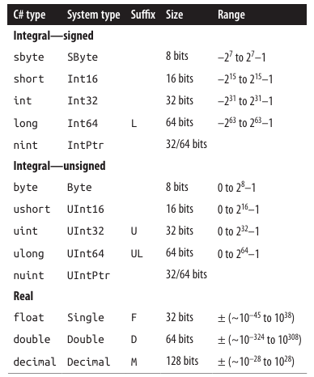
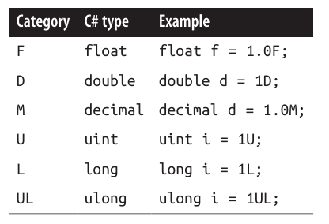
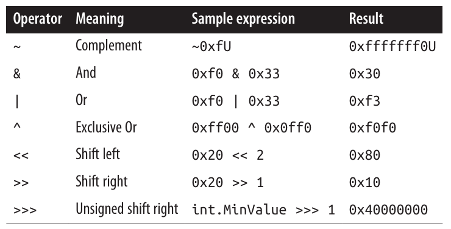
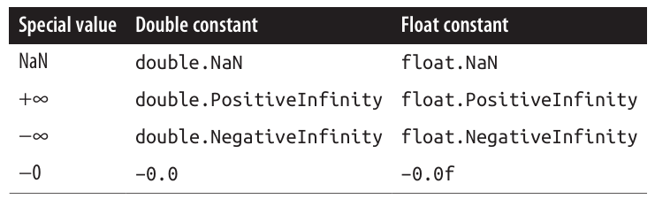
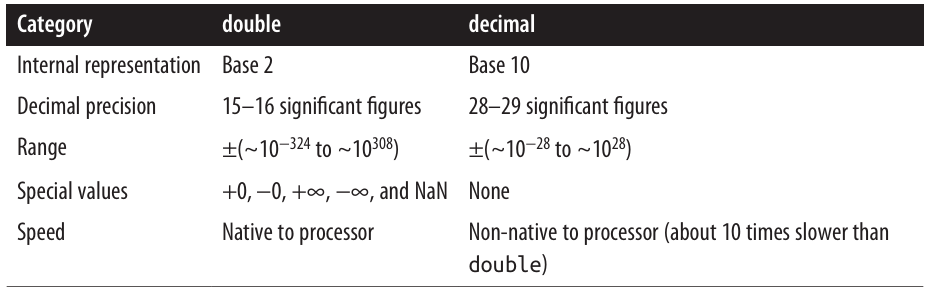
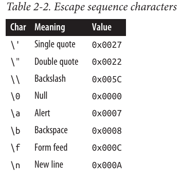
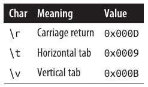
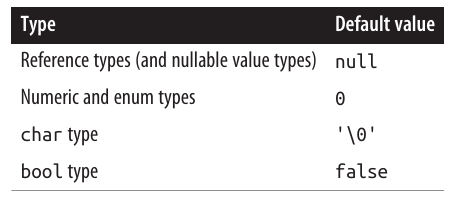
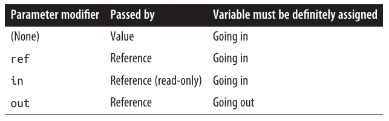
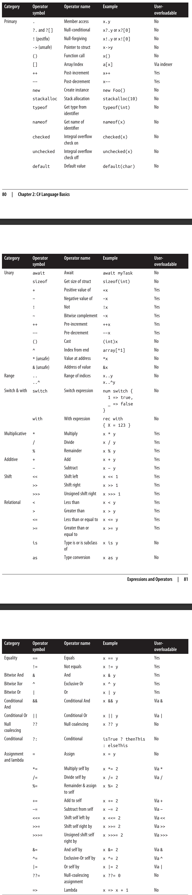

<div dir="rtl">

# فصل دوم: مبانی زبان سی شارپ
در این فصل، با مبانی زبان سی شارپ آشنا می‌شویم.

تقریباً تمام مثال‌های کدی که در این کتاب آمده‌اند، به صورت نمونه‌های تعاملی (Interactive Samples) در LINQPad در دسترس هستند. کار کردن با این نمونه‌ها در کنار مطالعه کتاب، باعث می‌شود یادگیری شما بسیار سریع‌تر شود، چون می‌توانید کدها را ویرایش کرده و نتیجه را فوراً ببینید، بدون اینکه نیازی به ساخت پروژه‌ها و راه‌حل‌ها (Solutions) در Visual Studio داشته باشید.

برای دانلود نمونه‌ها، در LINQPad روی تب Samples کلیک کنید و سپس گزینه Download more samples را انتخاب نمایید.

💡 نکته:
LINQPad رایگان است. می‌توانید آن را از این آدرس دانلود کنید:
http://www.linqpad.net

## اولین برنامه سی‌شارپ
در ادامه، برنامه‌ای را می‌بینید که عدد ۱۲ را در ۳۰ ضرب کرده و نتیجه‌ی ۳۶۰ را روی صفحه چاپ می‌کند. علامت دو اسلش (//) نشان می‌دهد که بقیه‌ی خط یک توضیح (کامنت) است:

```csharp
int x = 12 * 30;                  // دستور 1
System.Console.WriteLine(x);      // دستور 2
```
برنامه‌ی ما از دو دستور تشکیل شده است. در سی شارپ، دستورات به ترتیب اجرا می‌شوند و با یک سمی‌کالن (;) پایان می‌یابند.

🔹 دستور اول عبارت 12 * 30 را محاسبه کرده و نتیجه را در متغیری به نام x ذخیره می‌کند که نوع آن یک عدد صحیح ۳۲ بیتی (int) است.

🔹 دستور دوم متد WriteLine را از کلاسی به نام Console فراخوانی می‌کند که در یک فضای نام (namespace) به نام System تعریف شده است. این دستور مقدار متغیر x را در یک پنجره متنی روی صفحه نمایش چاپ می‌کند.

یک متد یک وظیفه انجام می‌دهد؛ یک کلاس اعضای تابعی و اعضای داده‌ای را گروه‌بندی می‌کند تا یک بلوک ساختاری شیء‌گرا شکل گیرد. کلاس **Console** اعضایی را گروه‌بندی می‌کند که وظیفه‌ی مدیریت ورودی/خروجی (I/O) خط فرمان را دارند، مانند متد **WriteLine**. یک کلاس نوعی از **type** است که در بخش «Type Basics» در صفحه ۳۶ بررسی می‌کنیم. 🏗️

در بالاترین سطح، انواع (types) در **namespace**ها سازمان‌دهی شده‌اند. بسیاری از انواع پرکاربرد — از جمله کلاس **Console** — در **System namespace** قرار دارند. کتابخانه‌های .NET در **nested namespaces** سازمان‌دهی شده‌اند. برای مثال، **System.Text namespace** شامل انواعی برای مدیریت متن است و **System.IO** شامل انواعی برای ورودی/خروجی می‌باشد. 📚

هر بار که کلاس **Console** را با **System namespace** صدا بزنید، کد شما شلوغ می‌شود. دستور **using** به شما اجازه می‌دهد این شلوغی را حذف کنید و یک namespace را وارد کنید:

```csharp
using System;   // وارد کردن System namespace
int x = 12 * 30;
Console.WriteLine(x);    // نیازی به نوشتن System. نیست
```

یک شکل پایه‌ای از **code reuse** این است که توابع سطح بالاتر بنویسیم که توابع سطح پایین‌تر را صدا می‌زنند. می‌توانیم برنامه خود را با یک متد قابل استفاده مجدد به نام **FeetToInches** بازسازی کنیم که یک عدد صحیح را در ۱۲ ضرب می‌کند، به صورت زیر:

```csharp
using System;

Console.WriteLine(FeetToInches(30));      // 360
Console.WriteLine(FeetToInches(100));     // 1200

int FeetToInches(int feet)
{
    int inches = feet * 12;
    return inches;
}
```

متد ما شامل مجموعه‌ای از دستورات است که توسط یک جفت آکولاد احاطه شده‌اند. به این مجموعه، **statement block** گفته می‌شود.

یک متد می‌تواند داده ورودی را از فراخواننده دریافت کند با مشخص کردن **parameters** و داده خروجی را به فراخواننده برگرداند با مشخص کردن **return type**. متد **FeetToInches** ما یک پارامتر برای ورودی **feet** دارد و یک نوع بازگشتی برای خروجی **inches**:

```csharp
int FeetToInches(int feet)
...
```

🟠 اعداد ۳۰ و ۱۰۰ مقادیری هستند که به متد **FeetToInches** ارسال شده‌اند و به آن **arguments** گفته می‌شود.

اگر یک متد ورودی دریافت نمی‌کند، از پرانتز خالی استفاده کنید. اگر هیچ مقداری باز نمی‌گرداند، از کلیدواژه **void** استفاده کنید:

```csharp
using System;

SayHello();

void SayHello()
{
    Console.WriteLine("Hello, world");
}
```

متدها یکی از انواع مختلف **functions** در سی شارپ هستند. نوع دیگری از توابع که در برنامه نمونه ما استفاده شد، عملگر `*` بود که **ضرب** را انجام می‌دهد. 🔢

همچنین **constructors**، **properties**، **events**، **indexers** و **finalizers** نیز وجود دارند.

### 🛠️ کامپایل (Compilation)
کامپایلر زبان سی شارپ، کد منبع (مجموعه‌ای از فایل‌ها با پسوند .cs) را به یک Assembly تبدیل می‌کند.
یک Assembly واحد اصلی بسته‌بندی و انتشار در .NET است.

📦 **اسمبلی** می‌تواند:

🔹 یک برنامه (Application) باشد.

🔹 یک کتابخانه (Library) باشد.

یک برنامه معمولی کنسول یا ویندوز، دارای نقطه شروع (Entry Point) است، در حالی که کتابخانه این نقطه شروع را ندارد. هدف کتابخانه این است که توسط یک برنامه یا کتابخانه‌های دیگر فراخوانی (Reference) شود.
خود .NET نیز مجموعه‌ای از کتابخانه‌ها (و همچنین یک محیط اجرایی Runtime) است.

---

**✏️ Top-Level Statements**

تمام برنامه‌های بخش قبلی، مستقیماً با مجموعه‌ای از دستورات شروع می‌شدند که به آن‌ها Top-Level Statements گفته می‌شود.
وجود این نوع دستورات، به طور ضمنی یک نقطه شروع برای برنامه کنسول یا ویندوز ایجاد می‌کند.

بدون Top-Level Statements، متد Main به‌عنوان نقطه شروع برنامه در نظر گرفته می‌شود. (توضیحات بیشتر در بخش Custom Types صفحه 37 آمده است.)

**📂 تفاوت پسوندها در .NET 8**

برخلاف .NET Framework، اسمبلی‌های .NET 8 هرگز پسوند .exe ندارند.
فایلی که پس از ساخت یک برنامه .NET 8 با پسوند .exe می‌بینید، در واقع یک بارگذار (Loader) بومی و وابسته به پلتفرم است که مسئول اجرای اسمبلی اصلی شما با پسوند .dll می‌باشد.

**📦 انتشار Self-Contained**

در .NET 8 می‌توانید یک Self-Contained Deployment ایجاد کنید که شامل:

🔹 Loader

🔹 اسمبلی‌های شما

🔹 بخش‌های لازم از Runtime

همه این موارد در قالب یک فایل .exe تکی قرار می‌گیرند.

همچنین .NET 8 از کامپایل AOT (Ahead-Of-Time) نیز پشتیبانی می‌کند که باعث:

🔹 شروع سریع‌تر برنامه 🚀

🔹 مصرف کمتر حافظه 💾
می‌شود.

**💻 ابزار dotnet**

ابزار dotnet (یا dotnet.exe در ویندوز) برای مدیریت کد منبع و فایل‌های باینری .NET از خط فرمان استفاده می‌شود.

با این ابزار می‌توانید:

🔹 برنامه خود را بسازید (Build)

🔹 آن را اجرا کنید (Run)

این کار جایگزینی برای استفاده از محیط‌های توسعه یکپارچه مثل Visual Studio یا Visual Studio Code است.

**📍 محل نصب پیش‌فرض:**

🔹 ویندوز: %ProgramFiles%\dotnet

🔹 لینوکس (Ubuntu): /usr/bin/dotnet

**📝 ساخت یک پروژه کنسول جدید**

برای کامپایل برنامه، ابزار dotnet به یک فایل پروژه و حداقل یک فایل C# نیاز دارد.
دستور زیر ساختار اولیه یک پروژه کنسول را ایجاد می‌کند:

```bash
dotnet new Console -n MyFirstProgram
```
🔹 این دستور یک پوشه به نام MyFirstProgram ایجاد می‌کند که شامل:

🔹 فایل پروژه: MyFirstProgram.csproj

🔹 فایل کد: Program.cs (که پیام "Hello world" را چاپ می‌کند)

**▶️ اجرای برنامه**

برای ساخت و اجرای برنامه از پوشه پروژه:

```bash
dotnet run MyFirstProgram
```
فقط برای ساخت (بدون اجرا):

```bash
dotnet build MyFirstProgram.csproj
```
📌 خروجی اسمبلی در یک زیرپوشه از مسیر bin\debug ذخیره می‌شود.

توضیحات کامل در مورد اسمبلی‌ها در فصل 17 خواهد آمد. 📖

### نحو (Syntax)
نحو یا Syntax در C# از زبان‌های C و C++ الهام گرفته شده است. در این بخش، ما اجزای نحو زبان C# را با استفاده از برنامه‌ی زیر توضیح می‌دهیم:

```csharp
using System;
int x = 12 * 30;
Console.WriteLine(x);
```
#### شناسه‌ها (Identifiers) و کلمات کلیدی (Keywords)
شناسه‌ها (Identifiers) همان نام‌هایی هستند که برنامه‌نویس برای کلاس‌ها، متدها، متغیرها و سایر اجزای برنامه انتخاب می‌کند. در مثال بالا، شناسه‌ها به ترتیب ظاهر شدن عبارتند از:

```arduino
System   x   Console   WriteLine
```
یک شناسه باید یک کلمه کامل باشد که اساساً از کاراکترهای یونیکد (Unicode) ساخته شده و با یک حرف یا خط زیرین (_) شروع شود.
شناسه‌ها در C# به بزرگی و کوچکی حروف حساس هستند.

به صورت قراردادی:

🔹 پارامترها، متغیرهای محلی و فیلدهای خصوصی باید به شکل camelCase نوشته شوند. مثال:

```nginx
myVariable
```
🔹 سایر شناسه‌ها (مثل نام کلاس‌ها و متدها) باید به شکل PascalCase باشند. مثال:

```nginx
MyMethod
```
**کلمات کلیدی (Keywords)**

کلمات کلیدی، نام‌هایی هستند که برای کامپایلر معنای خاصی دارند. در مثال ما، دو کلمه کلیدی وجود دارد:

```cpp
using   int
```
بیشتر کلمات کلیدی رزرو شده هستند، به این معنی که شما نمی‌توانید آن‌ها را به عنوان شناسه استفاده کنید. در اینجا لیست کامل کلمات کلیدی رزرو شده سی‌شارپ آمده است:

```csharp
abstract    do          protected     sbyte
as          double      public        sealed
base        else        readonly      short
bool        enum        record        sizeof
break       event       ref           stackalloc
byte        explicit    return        static
case        extern      float         string
catch       false       for           struct
char        finally     foreach       switch
checked     fixed       goto          this
class       if          throw         true
const       implicit    try           typeof
continue    in          uint          ulong
decimal     int         unchecked     unsafe
default     interface   ushort        using
delegate    internal    virtual       void
            is          volatile      while
            lock
            long
            namespace
            new
            null
            object
            operator
            out
            override
            params
            private
```
اگر واقعاً بخواهید از یک شناسه استفاده کنید که با یک کلمه کلیدی رزرو شده تداخل دارد، می‌توانید با استفاده از پیشوند @ این کار را انجام دهید. مثال:

```csharp
int using = 123;      // غیرمجاز ❌
int @using = 123;     // مجاز ✅
```
علامت @ بخشی از خود شناسه محسوب نمی‌شود. بنابراین:

```css
@myVariable
```
و

```nginx
myVariable
```
کاملاً یکسان هستند. 🖋️

### کلمات کلیدی متنی

برخی از کلمات کلیدی متنی (contextual) هستند، به این معنی که می‌توانید از آن‌ها به عنوان شناسه نیز استفاده کنید—بدون نماد @:

```csharp
add         descending  global        notnull     remove      var
alias       dynamic     group         nuint       required    with
and         equals      init          on          select      when
ascending   file        into          or          set         where
async       from        join          orderby     unmanaged   yield
await       get         let           partial     value
by          managed     nameof
```
با کلمات کلیدی متنی، ابهام نمی‌تواند در متنی که در آن استفاده می‌شوند، ایجاد شود.

### ثابت‌ها (Literals)، نشانه‌گذارها (Punctuators)، و عملگرها (Operators)
ثابت‌ها، داده‌های اولیه‌ای هستند که به صورت مستقیم و نوشتاری درون برنامه قرار می‌گیرند.
برای مثال، در برنامه نمونه ما، 12 و 30 نمونه‌هایی از ثابت‌ها هستند.

نشانه‌گذارها به ساختاربندی و جدا کردن بخش‌های مختلف برنامه کمک می‌کنند.
یک مثال، سمی‌کالن (;) است که یک دستور را خاتمه می‌دهد.
دستورات می‌توانند در چند خط نوشته شوند:

```csharp
Console.WriteLine
    (1 + 2 + 3 + 4 + 5 + 6 + 7 + 8 + 9 + 10);
```
عملگرها عبارت‌ها را تغییر داده یا با هم ترکیب می‌کنند. بیشتر عملگرها در C# با یک نماد مشخص می‌شوند؛
مثلاً عملگر ضرب *.

ما عملگرها را در ادامه این فصل به‌طور کامل بررسی خواهیم کرد.
در برنامه نمونه‌مان، عملگرهای زیر را استفاده کردیم:

```
=   *   .   ()
```
🔹 نقطه (.) یک عضو از چیزی را مشخص می‌کند (یا در اعداد اعشاری، نقش ممیز را دارد).

🔹 پرانتزها (()) هنگام تعریف یا فراخوانی یک متد استفاده می‌شوند؛ پرانتز خالی یعنی متد هیچ آرگومانی نمی‌گیرد. (پرانتزها کاربردهای دیگری هم دارند که در ادامه این فصل خواهید دید.)

🔹 علامت مساوی (=) برای انتساب مقدار به کار می‌رود.

🔹 علامت مساوی دوتایی (==) برای مقایسه برابری استفاده می‌شود.

### توضیحات (Comments)
زبان C# دو روش برای نوشتن توضیحات در کد ارائه می‌دهد:

1. توضیحات تک‌خطی (Single-line)
با دو خط مورب (//) شروع می‌شوند و تا پایان همان خط ادامه دارند:

```csharp
int x = 3;   // توضیحی درباره مقداردهی 3 به x
```
2. توضیحات چندخطی (Multiline)
با /* آغاز و با */ پایان می‌یابند:

```csharp
int x = 3;   /* این یک توضیح است
                که در دو خط نوشته شده */
```
همچنین، توضیحات می‌توانند شامل برچسب‌های مستندسازی XML باشند که در بخش «XML Documentation» در صفحه ۲۷۲ توضیح داده خواهد شد. 📝

## اصول اولیه نوع داده 🧩 Types

یک نوع داده (Type) در واقع نقشه یا قالبی است که برای یک مقدار تعریف می‌شود.

در این مثال، ما دو لیترال (literal) از نوع int با مقادیر 12 و 30 داریم. همچنین یک متغیر از نوع int به نام x تعریف می‌کنیم:

```csharp
int x = 12 * 30;
Console.WriteLine(x);
```
🟡 از آنجا که بیشتر نمونه‌کدهای این کتاب به نوع‌هایی از فضای نام (namespace) System نیاز دارند، از این به بعد عبارت using System را نمی‌آوریم، مگر این‌که بخواهیم مفهومی مرتبط با فضای نام‌ها را توضیح دهیم.

🔹 متغیر (Variable) به یک محل ذخیره‌سازی اشاره دارد که می‌تواند در طول زمان مقادیر متفاوتی بگیرد.
در مقابل، ثابت (Constant) همیشه یک مقدار ثابت و تغییر‌ناپذیر دارد (در ادامه مفصل توضیح می‌دهیم):

```csharp
const int y = 360;
```
📌 در زبان سی شارپ، تمام مقادیر، نمونه‌ای از یک نوع داده هستند.
نوع داده تعیین می‌کند که:

🔹 مقدار چه معنایی دارد 📝

🔹 و یک متغیر چه مقادیر ممکنی می‌تواند داشته باشد 🎯

### 📌 نمونه‌هایی از انواع از پیش تعریف‌شده (Predefined Type Examples)
انواع از پیش تعریف‌شده، نوع‌هایی هستند که به شکل ویژه توسط کامپایلر پشتیبانی می‌شوند.
به‌عنوان مثال، نوع int یک نوع از پیش تعریف‌شده برای نمایش مجموعه‌ای از اعداد صحیح است که در ۳۲ بیت حافظه جای می‌گیرند؛ این محدوده از  2³¹ تا 2³¹- را پوشش می‌دهد. همچنین، برای مقادیر عددی که در این بازه هستند، نوع پیش‌فرض int استفاده می‌شود.
شما می‌توانید روی متغیرهایی از نوع int عمل‌هایی مانند محاسبات ریاضی انجام دهید، به شکل زیر:

```csharp
int x = 12 * 30;
```
نوع از پیش تعریف‌شده دیگر در C#، نوع string است. این نوع نشان‌دهنده‌ی یک دنباله از کاراکترهاست، مثل ".NET" یا "http://oreilly.com". شما می‌توانید با استفاده از متدهای این نوع، روی رشته‌ها کار کنید:

```csharp
string message = "Hello world";
string upperMessage = message.ToUpper();
Console.WriteLine(upperMessage); // HELLO WORLD

int x = 2022;
message = message + x.ToString();
Console.WriteLine(message); // Hello world2022
```
در این مثال، ما از x.ToString() استفاده کردیم تا یک نمایش رشته‌ای از عدد صحیح x به دست آوریم.
جالب است بدانید که شما می‌توانید روی تقریباً هر نوع داده‌ای متد ToString() را فراخوانی کنید.

**✅ نوع بولی (bool)**

نوع از پیش تعریف‌شده bool فقط دو مقدار ممکن دارد: true و false.
این نوع معمولاً همراه با دستور if برای اجرای شرطی کد استفاده می‌شود:

```csharp
bool simpleVar = false;
if (simpleVar)
    Console.WriteLine("This will not print");

int x = 5000;
bool lessThanAMile = x < 5280;
if (lessThanAMile)
    Console.WriteLine("This will print");
```
**🛠 انواع سفارشی (Custom Types)**

در C#، انواع از پیش تعریف‌شده (که به آن‌ها Built-in Types هم گفته می‌شود) با یک کلیدواژه‌ی C# شناخته می‌شوند.
فضای نام System در .NET شامل بسیاری از انواع مهم است که در C# از پیش تعریف نشده‌اند (مثلاً DateTime).

همان‌طور که می‌توانیم متدهای خودمان را بنویسیم، می‌توانیم انواع (کلاس‌ها) را هم بسازیم.
در مثال زیر، ما یک نوع سفارشی به نام UnitConverter تعریف کرده‌ایم؛ یک کلاس که به عنوان الگو برای تبدیل واحدها عمل می‌کند:

```csharp
UnitConverter feetToInchesConverter = new UnitConverter(12);
UnitConverter milesToFeetConverter  = new UnitConverter(5280);

Console.WriteLine(feetToInchesConverter.Convert(30));    // 360
Console.WriteLine(feetToInchesConverter.Convert(100));   // 1200
Console.WriteLine(feetToInchesConverter.Convert(
                  milesToFeetConverter.Convert(1)));     // 63360

public class UnitConverter
{
    int ratio; // فیلد (Field)

    public UnitConverter(int unitRatio) // سازنده (Constructor)
    {
        ratio = unitRatio;
    }

    public int Convert(int unit) // متد (Method)
    {
        return unit * ratio;
    }
}
```
در این مثال، تعریف کلاس ما در همان فایلی قرار دارد که دستورات سطح بالا (Top-level statements) نوشته شده‌اند.
این کار قانونی است—به شرطی که دستورات سطح بالا قبل از تعریف کلاس بیایند—و در برنامه‌های کوچک آزمایشی، کاملاً پذیرفته‌شده است.
اما در برنامه‌های بزرگ‌تر، رویکرد استاندارد این است که تعریف کلاس را در یک فایل جداگانه قرار دهیم؛ مثلاً در UnitConverter.cs.

#### اعضای یک نوع (Members of a Type) 🧩
یک نوع (Type) شامل دو دسته عضو است:

1️⃣ اعضای داده‌ای (Data Members) → داده‌ها را نگهداری می‌کنند.

2️⃣ اعضای تابعی (Function Members) → عملیات و رفتار مرتبط با داده‌ها را انجام می‌دهند.

در مثال UnitConverter:

🔹 عضو داده‌ای → فیلدی به نام ratio که نسبت تبدیل را ذخیره می‌کند.

🔹 اعضای تابعی → متد Convert و سازنده‌ی (Constructor) کلاس UnitConverter.

#### تقارن بین انواع از پیش تعریف‌شده و انواع سفارشی ⚖️

یکی از ویژگی‌های زیبا در C# این است که انواع از پیش تعریف‌شده (مثل int) و انواع سفارشی (مثل UnitConverter) از نظر ساختار، تفاوت کمی دارند:

🔹 نوع int → یک نقشه (Blueprint) برای اعداد صحیح است. داده ذخیره می‌کند (۳۲ بیت) و توابعی مثل ToString برای کار با آن دارد.

🔹 نوع UnitConverter → یک نقشه برای تبدیل واحدها است. داده‌ای (نسبت تبدیل) را نگهداری می‌کند و توابعی برای استفاده از آن دارد.

#### سازنده‌ها و نمونه‌سازی (Constructors & Instantiation) 🏗️
🔹 ایجاد داده‌ها با نمونه‌سازی (Instantiation) انجام می‌شود.

🔹 انواع از پیش تعریف‌شده را می‌توان با یک لیترال ایجاد کرد، مثل:

```csharp
"Hello world"
```
🔹 برای ایجاد نمونه از یک نوع سفارشی باید از عملگر new استفاده کنیم:

```csharp
UnitConverter feetToInchesConverter = new UnitConverter(12);
```
🔹 بعد از اجرای new، سازنده‌ی آن نوع فراخوانی می‌شود تا داده‌ها مقداردهی اولیه شوند.

**تعریف یک سازنده 🛠️**

یک سازنده درست مثل یک متد نوشته می‌شود، با این تفاوت که:

🔹 نام آن دقیقا همان نام نوع است.

🔹 نوع بازگشتی ندارد.

مثال:

```csharp
public UnitConverter(int unitRatio) 
{
    ratio = unitRatio;
}
```
### 🆚 اعضای نمونه (Instance) در برابر اعضای ایستا (Static)
اعضای داده‌ای و اعضای تابعی که روی نمونه‌ای از یک نوع (Type) عمل می‌کنند، «اعضای نمونه» (Instance Members) نام دارند.
مثلاً متد Convert در کلاس UnitConverter و متد ToString در نوع int نمونه‌هایی از اعضای نمونه هستند.
به‌طور پیش‌فرض، اعضا در سی‌شارپ «نمونه‌ای» هستند.

در مقابل، اعضای داده‌ای و تابعی که روی نمونه خاصی از نوع عمل نمی‌کنند، می‌توانند با کلمه کلیدی static علامت‌گذاری شوند.
برای دسترسی به یک عضو ایستا از بیرونِ نوع، به جای یک نمونه، نام خودِ نوع را مشخص می‌کنیم.
مثلاً متد WriteLine در کلاس Console یک عضو ایستا است، بنابراین آن را این‌طور فراخوانی می‌کنیم:

```csharp
Console.WriteLine();
```
و نه این‌طور:

```csharp
new Console().WriteLine();
```
📌 کلاس Console در واقع به‌عنوان یک کلاس ایستا (Static Class) تعریف شده است. این یعنی تمام اعضای آن ایستا هستند و شما هرگز نمی‌توانید نمونه‌ای از Console بسازید.

**📍 مثال — تفاوت عضو نمونه و ایستا**

در کد زیر، فیلد نمونه‌ای Name به یک نمونه خاص از کلاس Panda مربوط می‌شود،
در حالی که فیلد ایستای Population به مجموع همه نمونه‌های Panda ارتباط دارد:

```csharp
Panda p1 = new Panda("Pan Dee");
Panda p2 = new Panda("Pan Dah");

Console.WriteLine(p1.Name);      // Pan Dee
Console.WriteLine(p2.Name);      // Pan Dah
Console.WriteLine(Panda.Population); // 2

public class Panda
{
    public string Name;             // 🐼 فیلد نمونه‌ای
    public static int Population;   // 🌍 فیلد ایستا

    public Panda(string n)          // 🔹 سازنده (Constructor)
    {
        Name = n;                   // مقداردهی فیلد نمونه‌ای
        Population = Population + 1; // افزایش فیلد ایستا
    }
}
```
📌 اگر بخواهید p1.Population یا Panda.Name را ارزیابی کنید،
کامپایلر یک خطای زمان کامپایل (Compile-time Error) تولید خواهد کرد.

#### 🔑 کلیدواژه public
کلیدواژه public اعضای یک کلاس را برای دسترسی توسط سایر کلاس‌ها قابل مشاهده می‌کند.
در این مثال، اگر فیلد Name در کلاس Panda با public علامت‌گذاری نشده بود، به‌صورت خصوصی (private) در نظر گرفته می‌شد و امکان دسترسی به آن از خارج کلاس وجود نداشت.

علامت‌گذاری یک عضو به‌صورت public، روشی است که یک نوع (type) این پیام را منتقل می‌کند:

«اینجا چیزهایی است که می‌خواهم بقیه‌ی انواع ببینند — بقیه‌اش جزئیات داخلی و شخصی خودم است.»

در اصطلاحات برنامه‌نویسی شیءگرا (OOP)، می‌گوییم اعضای عمومی (public members)، اعضای خصوصی (private members) کلاس را کپسوله‌سازی (encapsulate) می‌کنند.

#### 📦 تعریف فضای نام (Namespace)
به‌خصوص در برنامه‌های بزرگ، منطقی است که انواع (Types) را در قالب فضای نام (namespace)‌ها سازمان‌دهی کنیم.
مثال: تعریف کلاس Panda درون فضای نامی به نام Animals 👇

```csharp
using System;
using Animals;

Panda p = new Panda("Pan Dee");
Console.WriteLine(p.Name);

namespace Animals
{
    public class Panda
    {
        ...
    }
}
```
در این مثال، ما فضای نام Animals را وارد (import) کردیم تا بتوانیم در کدهای سطح بالا (Top-level statements) به انواع داخل آن بدون پیشوند کامل دسترسی داشته باشیم.

بدون این وارد کردن، مجبور بودیم به این شکل بنویسیم:

```csharp
Animals.Panda p = new Animals.Panda("Pan Dee");
```
📖 یادداشت: ما مبحث فضای نام‌ها را به‌طور کامل در انتهای این فصل بررسی می‌کنیم (بخش Namespaces در صفحه ۹۵).

#### 📌 تعریف متد Main
تا اینجای کار، تمام مثال‌های ما از دستورات سطح بالا (Top-Level Statements) استفاده کرده‌اند؛ این قابلیت از نسخه C# 9 معرفی شد.

🔹 بدون استفاده از دستورات سطح بالا، یک برنامه‌ی ساده‌ی کنسول یا ویندوز به این شکل نوشته می‌شود:

```csharp
using System;

class Program
{
    static void Main()   // نقطه شروع برنامه
    {
        int x = 12 * 30;
        Console.WriteLine(x);
    }
}
```
💡 در نبود دستورات سطح بالا، زبان C# به دنبال یک متد ایستا (static) به نام Main می‌گردد که نقطه‌ی شروع برنامه محسوب می‌شود.

🔹 متد Main می‌تواند در هر کلاسی تعریف شود (اما فقط یک متد Main می‌تواند وجود داشته باشد).

🔹 این متد می‌تواند به‌صورت اختیاری به جای void یک عدد صحیح (int) برگرداند تا نتیجه‌ای به محیط اجرای برنامه (Execution Environment) ارسال کند. معمولاً یک مقدار غیر صفر نشان‌دهنده‌ی وقوع خطاست.

🔹 همچنین متد Main می‌تواند به صورت اختیاری یک آرایه از رشته‌ها (string[]) به‌عنوان پارامتر بگیرد که شامل آرگومان‌هایی است که به فایل اجرایی پاس داده شده‌اند.

📌 مثال:

```csharp
static int Main (string[] args) { ... }
```
**📚 نکته: آرایه‌ها در C#**

آرایه (مثل string[]) مجموعه‌ای ثابت از عناصر یک نوع خاص را نشان می‌دهد.
برای تعریف آرایه، براکت مربع ([]) را بعد از نوع داده قرار می‌دهیم.
(آرایه‌ها به طور کامل در بخش "آرایه‌ها" در صفحه 61 توضیح داده می‌شوند.)

💡 همچنین متد Main می‌تواند با کلمه‌ی کلیدی async تعریف شود و مقدار Task یا Task<int> برگرداند تا از برنامه‌نویسی غیرهمزمان (Asynchronous Programming) پشتیبانی کند. این موضوع را در فصل 14 بررسی می‌کنیم.

### 🏷 دستورات سطح بالا (Top-Level Statements)
دستورات سطح بالا که در C# 9 معرفی شدند، به شما اجازه می‌دهند بدون نیاز به نوشتن متد Main استاتیک و یک کلاس حاوی آن، برنامه را شروع کنید.
یک فایل شامل دستورات سطح بالا از سه بخش تشکیل می‌شود که به همین ترتیب می‌آیند:

1️⃣ (اختیاری) — دستورهای using

2️⃣ یک‌سری دستورات که می‌توانند با تعریف متدها مخلوط شوند (اختیاری)

3️⃣ (اختیاری) — اعلان نوع‌ها و فضای‌نام‌ها (Types & Namespaces)

📌 مثال:

```csharp
using System;                           // بخش ۱
Console.WriteLine("Hello, world");      // بخش ۲
void SomeMethod1() { ... }              // بخش ۲
Console.WriteLine("Hello again!");      // بخش ۲
void SomeMethod2() { ... }              // بخش ۲
class SomeClass { ... }                 // بخش ۳
namespace SomeNamespace { ... }         // بخش ۳
```
💡 چون CLR (ماشین مجازی دات‌نت) به طور مستقیم از دستورات سطح بالا پشتیبانی نمی‌کند، کامپایلر کد شما را به شکلی مشابه زیر ترجمه می‌کند:

```csharp
using System;                           // بخش ۱
static class Program$   // نام خاص تولیدشده توسط کامپایلر
{
    static void Main$(string[] args)    // نام خاص تولیدشده توسط کامپایلر
    {
        Console.WriteLine("Hello, world");  // بخش ۲
        void SomeMethod1() { ... }          // بخش ۲
        Console.WriteLine("Hello again!");  // بخش ۲
        void SomeMethod2() { ... }          // بخش ۲
    }
}
class SomeClass { ... }                     // بخش ۳
namespace SomeNamespace { ... }             // بخش ۳
```
🔍 نکته مهم این است که تمام بخش ۲ درون متد Main قرار می‌گیرد.
به این معنا که SomeMethod1 و SomeMethod2 در عمل متدهای محلی هستند.
ما اثرات کامل این موضوع را در بخش متدهای محلی (صفحه ۱۰۶) بررسی می‌کنیم. مهم‌ترین نکته این است که متدهای محلی (مگر اینکه به صورت static تعریف شوند) می‌توانند به متغیرهای تعریف‌شده در همان متد دسترسی داشته باشند:

```csharp
int x = 3;
LocalMethod();
void LocalMethod() { Console.WriteLine(x); }  // می‌توانیم به x دسترسی داشته باشیم
```
⚠️ نتیجه دیگر این است که متدهای سطح بالا را نمی‌توان از کلاس‌ها یا نوع‌های دیگر فراخوانی کرد.

📌 ویژگی‌های دیگر:

🔹 متد سطح بالا می‌تواند به صورت اختیاری یک مقدار عدد صحیح (int) به فراخواننده برگرداند.

🔹 همچنین می‌تواند به یک متغیر جادویی به نام args (از نوع string[]) دسترسی داشته باشد که شامل آرگومان‌های خط فرمانی است که توسط فراخواننده ارسال شده‌اند.

❗ از آنجایی که یک برنامه فقط می‌تواند یک نقطه ورود (Entry Point) داشته باشد، در هر پروژه C# حداکثر می‌توان یک فایل با دستورات سطح بالا داشت.

### انواع و تبدیل‌ها (Types and Conversions)

زبان C# می‌تواند بین نمونه‌های انواع (Types) سازگار، تبدیل انجام دهد. هر تبدیل همیشه یک مقدار جدید را از یک مقدار موجود ایجاد می‌کند.

تبدیل‌ها می‌توانند ضمنی (Implicit) یا صریح (Explicit) باشند:

🔹 تبدیل ضمنی به‌طور خودکار انجام می‌شود.

🔹 تبدیل صریح نیاز به عملیات Cast دارد.

در مثال زیر:

🔹 یک int به‌صورت ضمنی به long (که دو برابر ظرفیت بیتی int را دارد) تبدیل می‌شود.

🔹 یک int به‌صورت صریح به short (که نصف ظرفیت بیتی int را دارد) Cast می‌شود:

```csharp
int x = 12345;       // int یک عدد صحیح ۳۲ بیتی است
long y = x;          // تبدیل ضمنی به عدد صحیح ۶۴ بیتی
short z = (short)x;  // تبدیل صریح به عدد صحیح ۱۶ بیتی
```
✅ تبدیل ضمنی زمانی مجاز است که هر دو شرط زیر برقرار باشند:

1️⃣ کامپایلر بتواند تضمین کند که تبدیل همیشه موفق خواهد شد.

2️⃣ هیچ اطلاعاتی در فرآیند تبدیل از دست نرود.

⚠ تبدیل صریح زمانی لازم است که یکی از شرایط زیر برقرار باشد:

1️⃣ کامپایلر نتواند تضمین کند که تبدیل همیشه موفق خواهد شد.

2️⃣ ممکن است اطلاعات در فرآیند تبدیل از دست برود.

📌 اگر کامپایلر تشخیص دهد که یک تبدیل همیشه شکست خواهد خورد، هر دو نوع تبدیل (ضمنی و صریح) ممنوع می‌شوند.
همچنین، تبدیل‌های مربوط به جنریک‌ها (Generics) هم ممکن است در شرایط خاص شکست بخورند (بخش Type Parameters and Conversions در صفحه 166 توضیح داده شده است).

🔹 تبدیل‌های عددی که در بالا دیدیم، در خود زبان به‌صورت داخلی پشتیبانی می‌شوند.

🔹 سی شارپ همچنین از موارد زیر پشتیبانی می‌کند:

🔹 تبدیل‌های ارجاعی (Reference Conversions)

🔹 تبدیل‌های Boxing (در فصل ۳ توضیح داده شده)

🔹 تبدیل‌های سفارشی (Custom Conversions) (بخش Operator Overloading در صفحه 256)

⚠ در تبدیل‌های سفارشی، کامپایلر قوانین بالا را اجرا نمی‌کند، بنابراین اگر نوع‌ها به‌درستی طراحی نشده باشند، می‌توانند رفتار غیرمنتظره داشته باشند.

### انواع مقدار (Value Types) در مقابل انواع مرجع (Reference Types)
تمام انواع (Type)‌های C# در یکی از دسته‌بندی‌های زیر قرار می‌گیرند:

🔹 انواع مقدار (Value Types)

🔹 انواع مرجع (Reference Types)

🔹 پارامترهای نوع کلی (Generic Type Parameters)

🔹 انواع اشاره‌گر (Pointer Types)

در این بخش، ما فقط به انواع مقدار و انواع مرجع می‌پردازیم.
پارامترهای نوع کلی را در بخش "Generics" (صفحه 159) و انواع اشاره‌گر را در بخش "Unsafe Code and Pointers" (صفحه 263) بررسی خواهیم کرد.


#### انواع مقدار
محتوای یک متغیر یا ثابت از نوع مقدار، فقط خودِ مقدار است.
به‌عنوان مثال، محتوای یک متغیر int (که نوع مقداری از پیش تعریف‌شده است) صرفاً ۳۲ بیت داده می‌باشد.

شما می‌توانید یک نوع مقدار سفارشی را با کلیدواژه‌ی struct تعریف کنید:

```csharp
public struct Point { public int X; public int Y; }
```
یا به شکل خلاصه‌تر:

```csharp
public struct Point { public int X, Y; }
```

📌 شکل ۲-۱. نمونه‌ای از یک نوع مقداری در حافظه
<div align="center">
  
 
  
</div>

وقتی یک نمونه از نوع مقداری را به متغیری دیگر انتساب می‌دهید، کل داده کپی می‌شود، نه فقط یک اشاره‌گر. مثال:

```csharp
Point p1 = new Point();
p1.X = 7;

Point p2 = p1;             // 📄 انتساب باعث ایجاد یک کپی از p1 می‌شود

Console.WriteLine(p1.X);   // 🔢 خروجی: 7
Console.WriteLine(p2.X);   // 🔢 خروجی: 7

p1.X = 9;                  // ✏️ تغییر مقدار X در p1

Console.WriteLine(p1.X);   // 🔢 خروجی: 9
Console.WriteLine(p2.X);   // 🔢 خروجی: 7
```
💡 همانطور که می‌بینید، تغییر در متغیر p1 بعد از کپی شدن، هیچ تاثیری روی p2 ندارد. این ویژگی، تفاوت اصلی انواع مقداری با انواع ارجاعی است.

📌 شکل ۲-۲ نشان می‌دهد که `p1` و `p2` فضای ذخیره‌سازی مستقلی دارند.
<div align="center">
    
 
  
</div>

📌 یعنی هر کدام در حافظه جداگانه نگهداری می‌شوند و تغییر یکی روی دیگری اثری ندارد.

### انواع ارجاعی (Reference Types) 🧭

یک نوع ارجاعی از یک نوع مقداری پیچیده‌تر است، زیرا از دو بخش تشکیل شده است: یک شیء (Object) و ارجاع (Reference) به آن شیء.
محتوای یک متغیر یا ثابت از نوع ارجاعی، در واقع یک ارجاع به شیئی است که مقدار را در خود نگه می‌دارد.

در اینجا همان نوع Point که در مثال قبلی داشتیم، این بار به جای ساختار (struct) به صورت کلاس (class) نوشته شده است (مطابق شکل 2-3):

```csharp
public class Point { public int X, Y; }
```

<div align="center">
  
 
  
</div>

📌 نکته مهم: وقتی یک متغیر از نوع ارجاعی را مقداردهی می‌کنیم، ارجاع (آدرس شیء) کپی می‌شود، نه خود شیء.
این موضوع باعث می‌شود چندین متغیر بتوانند به یک شیء واحد اشاره کنند — چیزی که در انواع مقداری به طور معمول امکان‌پذیر نیست.

اگر همان مثال قبلی را تکرار کنیم اما این بار Point یک کلاس باشد، تغییر در p1 روی p2 نیز اثر می‌گذارد:

```c#
Point p1 = new Point();
p1.X = 7;

Point p2 = p1;             // کپی شدن ارجاع p1
Console.WriteLine(p1.X);   // خروجی: 7
Console.WriteLine(p2.X);   // خروجی: 7

p1.X = 9;                  // تغییر مقدار p1.X
Console.WriteLine(p1.X);   // خروجی: 9
Console.WriteLine(p2.X);   // خروجی: 9

```
💡 نتیجه: در انواع ارجاعی، همه متغیرهایی که به یک شیء اشاره می‌کنند، در واقع یک نسخه مشترک از داده‌ها را می‌بینند.

📌 شکل ۲-۴ نشان می‌دهد که `p1` و `p2` دو ارجاع هستند که به یک شیء مشترک اشاره می‌کنند.

<div align="center">
  
 
  
</div>

📌 در نتیجه تغییر یکی، روی دیگری هم تأثیر دارد.

### Null
یک مرجع (reference) می‌تواند به مقدار ثابت (literal) null نسبت داده شود، که نشان می‌دهد این مرجع به هیچ شیءی اشاره نمی‌کند:

```csharp
Point p = null;
Console.WriteLine(p == null);   // True

// خط زیر باعث ایجاد خطای زمان اجرا می‌شود
// (یک استثنای NullReferenceException پرتاب می‌شود):
Console.WriteLine(p.X);

class Point { ... }
```
در بخش "نوع‌های مرجع قابل تهی" (صفحه 215)، یک قابلیت در C# توضیح داده شده است که به کاهش خطاهای اتفاقی NullReferenceException کمک می‌کند.

در مقابل، یک نوع مقداری (value type) معمولاً نمی‌تواند مقدار null داشته باشد:

```csharp
Point p = null;  // خطای زمان کامپایل
int x = null;    // خطای زمان کامپایل

struct Point { ... }
```
C# یک ساختار به نام نوع‌های مقداری قابل تهی (nullable value types) نیز دارد که برای نمایش مقدار null در نوع‌های مقداری استفاده می‌شود. برای اطلاعات بیشتر به بخش "نوع‌های مقداری قابل تهی" (صفحه 210) مراجعه کنید.

#### سربار حافظه (Storage overhead)
نمونه‌های نوع مقداری دقیقاً به اندازه‌ای از حافظه اشغال می‌کنند که برای ذخیره فیلدهایشان لازم است. در این مثال، ساختار Point دقیقاً 8 بایت حافظه می‌گیرد:

```csharp
struct Point
{
    int x;  // 4 بایت
    int y;  // 4 بایت
}
```
از نظر فنی، CLR فیلدها را در آدرسی قرار می‌دهد که مضربی از اندازه فیلد باشد (حداکثر تا 8 بایت).
به همین دلیل، ساختار زیر در واقع 16 بایت حافظه مصرف می‌کند (7 بایت بعد از فیلد اول «هدر» می‌رود):

```csharp
struct A
{
    byte b;
    long l;
}
```
می‌توان این رفتار را با اعمال ویژگی StructLayout تغییر داد (به بخش "نگاشت یک struct به حافظه unmanaged" در صفحه 997 مراجعه کنید).

نوع‌های مرجعی نیاز به تخصیص جداگانه حافظه برای مرجع و شیء دارند.
شیء به اندازه فیلدهایش حافظه مصرف می‌کند به اضافه سربار مدیریتی اضافی.
میزان دقیق این سربار وابسته به پیاده‌سازی داخلی زمان‌اجرای .NET است، اما حداقل 8 بایت است که برای ذخیره کلیدی به نوع شیء، و همچنین اطلاعات موقتی مانند وضعیت قفل برای چندنخی و یک فلگ برای مشخص کردن اینکه آیا شیء توسط garbage collector از جابجایی قفل شده یا خیر، استفاده می‌شود.

هر مرجع به یک شیء، بسته به اینکه .NET روی پلتفرم 32بیتی یا 64بیتی اجرا شود، به ترتیب 4 یا 8 بایت اضافی نیاز دارد.

### Predefined Type Taxonomy

Predefined Types در C# به شرح زیر هستند:

* Value Types

     * Numeric

           Signed integer (sbyte, short, int, long)

           Unsigned integer (byte, ushort, uint, ulong)

           Real number (float, double, decimal)

    * Logical (bool)

    * Character (char)

* Reference Types

    * String (string)

    * Object (object)

Predefined Types در C# در واقع Alias برای .NET Types در Namespace System هستند. تنها یک تفاوت Syntactic بین این دو دستور وجود دارد:

```C#

int i = 5;
System.Int32 i = 5;
```
در دات‌نت، مجموعه‌ای از انواع مقداری (Value Types) که به‌جز decimal هستند، به‌عنوان انواع اولیه (Primitive Types) شناخته می‌شوند. 🧩

به آن‌ها «اولیه» گفته می‌شود چون به‌طور مستقیم از طریق دستورالعمل‌های موجود در کد کامپایل‌شده پشتیبانی می‌شوند، و این معمولاً به معنی پشتیبانی مستقیم در پردازنده‌ی سخت‌افزاری است. 💻⚡

برای مثال:

```csharp
// نمایش زیرساختی (نمایش هگزادسیمال)
int i = 7;        // 0x7
bool b = true;    // 0x1
char c = 'A';     // 0x41
float f = 0.5f;   // استفاده از کدگذاری IEEE برای اعداد اعشاری شناور
```
همچنین، انواع System.IntPtr و System.UIntPtr نیز جزو انواع اولیه محسوب می‌شوند. (به فصل ۲۴ مراجعه کنید) 📖

Numeric Types

C# دارای Predefined Numeric Types است که در Table 2-1 نشان داده شده‌اند.

Table 2-1. Predefined numeric types in C#

<div align="center">
  
 
  
</div>
از بین انواع عدد صحیح (Integral Types)، نوع‌های int و long در زبان C# و در زمان اجرای برنامه (Runtime) جایگاه ویژه‌ای دارند و بیشترین استفاده را دارند. سایر انواع عدد صحیح معمولاً زمانی استفاده می‌شوند که یا نیاز به سازگاری و تعامل با سیستم‌ها و کتابخانه‌های دیگر (Interoperability) وجود دارد یا بهینه‌سازی در مصرف حافظه اهمیت دارد.
نوع‌های عدد صحیح با اندازه بومی سیستم یعنی nint و nuint بیشتر هنگام کار با اشاره‌گرها (Pointers) مفید هستند که توضیح آن‌ها در فصل بعدی خواهد آمد (بخش «اعداد صحیح با اندازه بومی» در صفحه 266).

از بین انواع اعداد حقیقی (Real Number Types)، دو نوع float و double که به آن‌ها انواع شناور (Floating-Point Types) گفته می‌شود، معمولاً در محاسبات علمی و گرافیکی استفاده می‌شوند.
نوع decimal بیشتر در محاسبات مالی و اقتصادی به کار می‌رود، چون محاسبات آن دقیق بر پایه مبنای ۱۰ بوده و دقت بالایی دارد.

علاوه بر این، ‌**.NET** چند نوع عددی تخصصی نیز ارائه می‌دهد، از جمله:

+ Int128 و UInt128 برای اعداد صحیح علامت‌دار و بدون علامت ۱۲۸ بیتی

+ BigInteger برای اعداد صحیح بسیار بزرگ (بدون محدودیت اندازه)

+ Half برای اعداد اعشاری ۱۶ بیتی (نقطه شناور)

نوع Half عمدتاً برای تعامل با پردازنده‌های کارت گرافیک استفاده می‌شود و اغلب پشتیبانی سخت‌افزاری مستقیم در CPUها ندارد، به همین دلیل float و double برای استفاده عمومی انتخاب‌های بهتری هستند.

### اعداد ثابت (Numeric Literals)
اعداد ثابت از نوع صحیح (Integral-type literals) می‌توانند از نمادگذاری ده‌دهی (decimal) یا شانزده‌شانزدهی (hexadecimal) استفاده کنند؛ حالت شانزده‌شانزدهی با پیشوند 0x مشخص می‌شود.
برای مثال:

```csharp
int x = 127;
long y = 0x7F;
```
شما می‌توانید برای خواناتر کردن یک عدد ثابت، در هرجای آن یک خط زیرین (underscore) قرار دهید:

```csharp
int million = 1_000_000;
```
همچنین می‌توانید اعداد را به صورت دودویی (binary) با پیشوند 0b بنویسید:

```csharp
var b = 0b1010_1011_1100_1101_1110_1111;
```
اعداد ثابت اعشاری (Real literals) می‌توانند از نمادگذاری ده‌دهی و/یا نمادگذاری نمایی (exponential notation) استفاده کنند:

```csharp
double d = 1.5;
double million = 1E06;
```
#### نتیجه‌گیری نوع عدد ثابت (Numeric literal type inference)
به طور پیش‌فرض، کامپایلر نوع یک عدد ثابت را یا double یا یکی از انواع صحیح در نظر می‌گیرد:

+ اگر عدد شامل نقطه اعشار یا نماد نمایی E باشد، نوع آن double خواهد بود.

+ در غیر این صورت، نوع عدد اولین نوع در لیست زیر خواهد بود که بتواند مقدار آن را در خود جای دهد:
int → uint → long → ulong

برای مثال:

```csharp
Console.WriteLine(       1.0.GetType());   // Double  (double)
Console.WriteLine(      1E06.GetType());   // Double  (double)
Console.WriteLine(         1.GetType());   // Int32   (int)
Console.WriteLine(0xF0000000.GetType());   // UInt32  (uint)
Console.WriteLine(0x100000000.GetType());  // Int64   (long)
```
نکته: از نظر فنی، decimal نیز یک نوع اعشاری (floating-point type) محسوب می‌شود، اما در مشخصات زبان C# به این صورت معرفی نشده است.

### پسوندهای عددی (Numeric Suffixes) 🔤
پسوندهای عددی به‌طور صریح نوع یک مقدار ثابت (literal) را مشخص می‌کنند. این پسوندها می‌توانند با حروف کوچک یا بزرگ نوشته شوند.

<div align="center">
  
 
  
</div>
📌 نکته:
پسوندهای U و L به ندرت لازم می‌شوند، چون نوع‌های uint، long و ulong معمولاً یا به‌طور خودکار حدس زده می‌شوند (inferred) یا می‌توانند به‌طور ضمنی (implicitly) از int تبدیل شوند:

```csharp
long i = 5; // تبدیل ضمنی بدون از دست دادن داده از int به long
```
💡 پسوند D از نظر فنی اضافی است، چون هر عددی که یک نقطه اعشار داشته باشد به‌طور پیش‌فرض به عنوان double در نظر گرفته می‌شود. حتی می‌توانید با افزودن یک نقطه اعشار این کار را انجام دهید:

```csharp
double x = 4.0;
```
**⭐ پسوندهای F و M** بیشترین کاربرد را دارند و باید همیشه وقتی نوع float یا decimal را مشخص می‌کنید، استفاده شوند.

🔹 بدون پسوند F، کد زیر کامپایل نمی‌شود، چون 4.5 به‌طور پیش‌فرض از نوع double است و تبدیل ضمنی به float وجود ندارد:

```csharp
float f = 4.5F;
```
🔹 همین اصل برای decimal هم صدق می‌کند:

```csharp
decimal d = -1.23M; // بدون M کامپایل نمی‌شود
```
📖 در بخش بعدی، به‌طور کامل مفهوم تبدیل‌های عددی (numeric conversions) را توضیح خواهیم داد.

### تبدیل‌های عددی (Numeric Conversions)

#### تبدیل بین نوع‌های صحیح (Integral Types)
تبدیل نوع‌های صحیح به‌صورت ضمنی (implicit) انجام می‌شود، زمانی که نوع مقصد بتواند تمام مقادیر ممکن نوع مبدأ را نمایش دهد. در غیر این صورت، یک تبدیل صریح (explicit) لازم است؛ برای مثال:

```csharp
int x = 12345;       // int یک عدد صحیح 32 بیتی است
long y = x;          // تبدیل ضمنی به نوع صحیح 64 بیتی
short z = (short)x;  // تبدیل صریح به نوع صحیح 16 بیتی
```
#### تبدیل بین نوع‌های اعشاری شناور (Floating-Point Types)
یک مقدار float می‌تواند به‌صورت ضمنی به یک double تبدیل شود، چون double قادر است همه مقادیر ممکن یک float را نمایش دهد.
برعکس این تبدیل باید به‌صورت صریح انجام شود.

#### تبدیل بین نوع‌های اعشاری شناور و صحیح (Floating-Point ↔ Integral Types)
همه نوع‌های صحیح می‌توانند به‌صورت ضمنی به همه نوع‌های اعشاری شناور تبدیل شوند:

```csharp
int i = 1;
float f = i;
```
اما برعکس این تبدیل باید صریح باشد:

```csharp
int i2 = (int)f;
```
هنگامی که یک عدد اعشاری شناور را به یک نوع صحیح تبدیل می‌کنید، هر بخش کسری (fractional portion) حذف می‌شود و هیچ گرد شدنی (rounding) انجام نمی‌شود.
کلاس ایستای System.Convert متدهایی فراهم می‌کند که هنگام تبدیل بین نوع‌های عددی مختلف، عملیات گرد کردن را انجام می‌دهند (به فصل ۶ مراجعه کنید).

#### دقت (Precision) در تبدیل اعداد بزرگ
تبدیل ضمنی یک نوع صحیح بزرگ به یک نوع اعشاری شناور، مقدار کلی (magnitude) را حفظ می‌کند اما گاهی ممکن است دقت (precision) از دست برود.
این به این دلیل است که نوع‌های اعشاری شناور همیشه بازه عددی (magnitude) بیشتری نسبت به نوع‌های صحیح دارند، اما ممکن است دقت کمتری داشته باشند.

بازنویسی مثال با یک عدد بزرگ:

```csharp
int i1 = 100000001;
float f = i1;          // مقدار کلی حفظ شده، اما دقت از دست رفته
int i2 = (int)f;       // خروجی: 100000000
```
#### تبدیل‌های Decimal
همه نوع‌های صحیح را می‌توان به‌صورت ضمنی به نوع decimal تبدیل کرد، زیرا decimal می‌تواند همه مقادیر ممکن نوع‌های صحیح C# را نمایش دهد.
تمام تبدیل‌های عددی دیگر به/از نوع decimal باید به‌صورت صریح انجام شوند، زیرا این تبدیل‌ها می‌توانند باعث شوند مقدار خارج از محدوده (out of range) شود یا دقت آن از دست برود.

### عملگرهای حسابی (Arithmetic Operators) 🔢
عملگرهای حسابی در C# برای همه نوع‌های عددی به جز نوع‌های صحیح 8 و 16 بیتی تعریف شده‌اند:

عملگر	توضیح
+ ➕	جمع (Addition)
- ➖	تفریق (Subtraction)
* ✖️	ضرب (Multiplication)
/ ➗	تقسیم (Division)
%	باقیمانده بعد از تقسیم (Remainder)

### عملگرهای افزایش و کاهش (Increment & Decrement Operators) ⬆️⬇️
عملگر ++ مقدار متغیر را ۱ واحد افزایش و عملگر -- مقدار را ۱ واحد کاهش می‌دهد.
این عملگرها می‌توانند قبل یا بعد از متغیر بیایند:

```csharp
int x = 0, y = 0;
Console.WriteLine(x++); // خروجی: 0  → سپس x می‌شود 1
Console.WriteLine(++y); // خروجی: 1  → y قبل از چاپ افزایش می‌یابد
```
📌 نکته: قبل گذاشتن (++y) یعنی اول تغییر، بعد استفاده.
بعد گذاشتن (y++) یعنی اول استفاده، بعد تغییر.

### عملیات ویژه روی نوع‌های صحیح (Specialized Operations on Integral Types) 🧮
نوع‌های صحیح شامل:
int, uint, long, ulong, short, ushort, byte, sbyte

#### تقسیم (Division) ➗
+ در نوع‌های صحیح، نتیجه تقسیم همیشه بخش اعشاری را حذف می‌کند (گرد کردن به صفر).

+ تقسیم بر ۰ در زمان اجرا (runtime) باعث خطا (DivideByZeroException) می‌شود.

+ تقسیم بر ثابت یا مقدار صفر در زمان کامپایل (compile-time) خطا می‌دهد.

```csharp
int a = 2 / 3; // خروجی: 0
int b = 0;
int c = 5 / b; // خطای DivideByZeroException
```
#### سرریز (Overflow) ⚠️
در عملیات عددی روی نوع‌های صحیح، اگر مقدار از محدوده نوع داده فراتر برود، به‌طور پیش‌فرض خطایی رخ نمی‌دهد، بلکه مقدار دور می‌زند (wraparound).

```csharp
int a = int.MinValue;
a--;
Console.WriteLine(a == int.MaxValue); // True
```
#### بررسی سرریز با checked ✅
اگر بخواهید در صورت سرریز خطا (OverflowException) دریافت کنید، از checked استفاده کنید. این دستور روی عملگرهای:
++, --, +, -, *, / و تبدیل‌های صریح بین نوع‌های صحیح اثر دارد.

```csharp
int a = 1000000;
int b = 1000000;
int c = checked(a * b); // بررسی فقط همین عبارت
```
یا می‌توانید یک بلوک کامل را بررسی کنید:

```csharp
checked
{
    c = a * b; // همه عبارات این بلوک بررسی می‌شوند
}
```
📌 نکات مهم:

+ روی double و float بی‌اثر است (این نوع‌ها در سرریز مقدار "بی‌نهایت" می‌گیرند).

+ روی decimal همیشه بررسی انجام می‌شود.

+ می‌توانید در تنظیمات پروژه (Advanced Build Settings) حالت checked را به‌طور پیش‌فرض فعال کنید.

+ اگر checked پیش‌فرض فعال باشد، با unchecked می‌توان بررسی را غیرفعال کرد:

```csharp
int x = int.MaxValue;
int y = unchecked(x + 1); // خطا نمی‌دهد
```
### بررسی سرریز (Overflow) برای عبارت‌های ثابت 📏💥

فارغ از این‌که تنظیم «checked» در پروژه فعال باشد یا نه، تمام عبارت‌هایی که در زمان کامپایل ارزیابی می‌شوند، همیشه از نظر سرریز بررسی می‌شوند—مگر این‌که از عملگر unchecked استفاده کنید:

```csharp
int x = int.MaxValue + 1;               // ❌ خطای زمان کامپایل
int y = unchecked(int.MaxValue + 1);    // ✅ بدون خطا
```
🔍 نکته:
در حالت اول، چون محاسبه در زمان کامپایل انجام می‌شود و مقدار فراتر از int.MaxValue می‌رود، کامپایلر جلوی اجرای آن را می‌گیرد. اما با unchecked به کامپایلر می‌گویید که بررسی سرریز را انجام ندهد و اجازه دهد عملیات بدون خطا انجام شود—even اگر نتیجه wrap-around شود.

### Bitwise Operators 
C# از Bitwise Operators زیر پشتیبانی می‌کند:

 

عملگر شیفت به راست >> و تفاوتش با >>> ⚙️

وقتی عملگر شیفت به راست (>>) روی اعداد صحیح علامت‌دار (signed integers) اعمال می‌شود، بیت پرارزش (بیت علامت) را تکرار می‌کند.
اما عملگر شیفت به راست بدون علامت (>>>) این کار را انجام نمی‌دهد و همیشه بیت‌های خالی را با صفر پر می‌کند.

📌 مثال ساده:

```csharp
int a = -8;     // در باینری: 11111111 11111111 11111111 11111000
int b = a >> 2; // تکرار بیت علامت: 11111111 11111111 11111111 11111110
int c = a >>> 2;// بدون تکرار بیت علامت: 00111111 11111111 11111111 11111110
```
علاوه بر این عملگرها، عملیات بیتی پیشرفته‌تری از طریق کلاس BitOperations در فضای نام System.Numerics ارائه شده است
(نگاه کنید به بخش “BitOperations” در صفحه 340 📖).

### 🔢 انواع عدد صحیح ۸ و ۱۶ بیتی
انواع عدد صحیح ۸ و ۱۶ بیتی شامل byte، sbyte، short و ushort هستند.
این نوع‌ها عملگرهای حسابی مخصوص به خود را ندارند، بنابراین #C به‌طور ضمنی آن‌ها را در صورت نیاز به انواع بزرگ‌تر تبدیل می‌کند.

این موضوع می‌تواند باعث خطای زمان کامپایل شود وقتی بخواهید نتیجه عملیات را دوباره به یک نوع کوچک اختصاص دهید:

```csharp
short x = 1, y = 1;
short z = x + y;   // ❌ خطای زمان کامپایل
```
در این مثال، x و y به‌طور ضمنی به نوع int تبدیل می‌شوند تا عمل جمع انجام شود.
این یعنی نتیجه نیز یک int خواهد بود که نمی‌تواند به‌طور ضمنی به short تبدیل شود (چون احتمال از دست رفتن داده وجود دارد).

برای رفع خطا باید تبدیل (Cast) صریح انجام دهید:

```csharp
short z = (short)(x + y);  // ✅ صحیح
```
### 🌊 مقادیر خاص float و double
برخلاف انواع عدد صحیح، انواع اعشاری (float و double) مقادیری دارند که برخی عملیات‌ها آن‌ها را به‌طور ویژه پردازش می‌کنند. این مقادیر خاص عبارتند از:

+ NaN (عدد نامعتبر یا Not a Number) 🌀

+ +∞ (مثبت بی‌نهایت) ♾️

+ −∞ (منفی بی‌نهایت) ♾️

+ −0 (منفی صفر)

کلاس‌های float و double ثابت‌هایی برای NaN، +∞ و −∞ دارند، همچنین مقادیر دیگری مثل MaxValue، MinValue و Epsilon نیز موجود است.

مثال:

```csharp
Console.WriteLine(double.NegativeInfinity); // -Infinity
```
Constants که special values را برای double و float نشان می‌دهند، به شرح زیر هستند:

 

تقسیم یک عدد ناصفر بر صفر منجر به یک مقدار بی‌نهایت می‌شود:

```csharp
Console.WriteLine ( 1.0 /  0.0);                  //  Infinity
Console.WriteLine (−1.0 /  0.0);                  // -Infinity
Console.WriteLine ( 1.0 / −0.0);                  // -Infinity
Console.WriteLine (−1.0 / −0.0);                  //  Infinity
```
تقسیم صفر بر صفر، یا کم کردن بی‌نهایت از بی‌نهایت، منجر به یک مقدار NaN می‌شود:

```csharp
Console.WriteLine ( 0.0 /  0.0);                  //  NaN
Console.WriteLine ((1.0 /  0.0) − (1.0 / 0.0));   //  NaN
```
وقتی از عملگر == استفاده می‌کنید، یک مقدار NaN هرگز برابر با مقدار دیگری نیست، حتی اگر آن مقدار NaN دیگری باشد:

```csharp
Console.WriteLine (0.0 / 0.0 == double.NaN);    // False
```
برای بررسی اینکه آیا یک مقدار NaN است، باید از متد float.IsNaN یا double.IsNaN استفاده کنید:

```csharp
Console.WriteLine (double.IsNaN (0.0 / 0.0));   // True
```
با این حال، هنگام استفاده از object.Equals، دو مقدار NaN برابر در نظر گرفته می‌شوند:

```csharp
Console.WriteLine (object.Equals (0.0 / 0.0, double.NaN));   // True
```
مقادیر NaN گاهی برای نمایش مقادیر خاص مفید هستند.
در Windows Presentation Foundation (WPF)، مقدار double.NaN نمایانگر یک اندازه‌گیری با مقدار «خودکار» (Automatic) است.
راه دیگر برای نمایش چنین مقداری، استفاده از یک نوع تهی‌پذیر (nullable type) است (فصل ۴)؛
و یا استفاده از یک ساختار سفارشی (custom struct) که یک نوع عددی را در خود نگه داشته و یک فیلد اضافی به آن اضافه می‌کند (فصل ۳).

نوع‌های float و double از مشخصات قالب IEEE 754 پیروی می‌کنند که تقریباً توسط تمام پردازنده‌ها به صورت بومی پشتیبانی می‌شود.
می‌توانید اطلاعات دقیق‌تر درباره رفتار این نوع‌ها را در http://www.ieee.org پیدا کنید.

### 🔍 مقایسه‌ی double و decimal

🔹 double برای محاسبات علمی مفید است (مانند محاسبه‌ی مختصات فضایی 🛰️).
🔹 decimal برای محاسبات مالی 💰 و مقادیری که ساخته‌شده‌اند و نه نتیجه‌ی اندازه‌گیری‌های دنیای واقعی، مناسب است.

📌 در اینجا خلاصه‌ای از تفاوت‌ها آورده شده است.

 

### خطاهای گرد کردن اعداد حقیقی 🧮

نوع داده‌های float و double به‌صورت داخلی اعداد را در مبنای ۲ ذخیره می‌کنند.
به همین دلیل، فقط اعدادی که در مبنای ۲ قابل بیان باشند، دقیق نمایش داده می‌شوند.

در عمل، این یعنی بیشتر عددهای اعشاری که ما به‌صورت مبنای ۱۰ می‌نویسیم، دقیق ذخیره نمی‌شوند.
مثلاً:

```csharp
float x = 0.1f;  // دقیقاً 0.1 نیست
Console.WriteLine (x + x + x + x + x + x + x + x + x + x);
// خروجی: 1.0000001
```
به همین دلیل، float و double برای محاسبات مالی انتخاب خوبی نیستند.
در مقابل، نوع داده‌ی decimal در مبنای ۱۰ کار می‌کند و می‌تواند اعدادی را که در مبنای ۱۰ قابل بیان هستند، دقیق ذخیره کند (همچنین مقسوم‌علیه‌های آن یعنی مبنای ۲ و ۵ را هم).

چون عددهای اعشاری که ما می‌نویسیم در مبنای ۱۰ هستند، decimal می‌تواند عددهایی مثل 0.1 را دقیق نمایش دهد.

با این حال، حتی double و decimal هم نمی‌توانند عددهای کسری‌ای را که در مبنای ۱۰ نمایش دوره‌ای دارند، دقیق ذخیره کنند:

```csharp
decimal m = 1M / 6M;     // 0.1666666666666666666666666667M
double  d = 1.0 / 6.0;   // 0.16666666666666666
```
این موضوع باعث ایجاد خطاهای تجمعی در گرد کردن می‌شود:

```csharp
decimal notQuiteWholeM = m+m+m+m+m+m;  // 1.0000000000000000000000000002M
double  notQuiteWholeD = d+d+d+d+d+d;  // 0.99999999999999989
```
که می‌تواند باعث شکست در عملیات مقایسه و برابری شود:

```csharp
Console.WriteLine (notQuiteWholeM == 1M);   // False
Console.WriteLine (notQuiteWholeD < 1.0);   // True
```
### نوع بولی و عملگرها (Boolean Type and Operators)

نوع bool در زبان C# (که نام مستعار نوع System.Boolean است) یک مقدار منطقی را نشان می‌دهد که می‌تواند مقدار ثابت true یا false داشته باشد.

اگرچه یک مقدار بولی از نظر تئوری فقط به یک بیت حافظه نیاز دارد، اما در زمان اجرا (runtime) یک بایت کامل حافظه استفاده می‌شود، چون این کوچک‌ترین واحدی است که پردازنده و زمان اجرا می‌توانند به شکل کارآمد با آن کار کنند.

برای جلوگیری از هدر رفت حافظه در مواقعی مثل آرایه‌های بزرگ از مقادیر بولی، دات‌نت کلاسی به نام BitArray در فضای نام System.Collections ارائه می‌دهد که طوری طراحی شده است که برای هر مقدار بولی فقط یک بیت استفاده کند.

#### تبدیل‌های نوع بولی (bool Conversions)
هیچ نوع تبدیلی (casting) بین bool و انواع عددی (numeric types) وجود ندارد؛ یعنی شما نمی‌توانید یک عدد را مستقیم به bool تبدیل کنید یا برعکس.

#### عملگرهای برابری و مقایسه (Equality and Comparison Operators)
عملگرهای == و != برای بررسی برابری و نابرابری همه نوع‌ها به کار می‌روند و همیشه یک مقدار بولی برمی‌گردانند.

برای انواع مقداری (Value Types) مثل int، مفهوم برابری معمولاً ساده است:

```csharp
int x = 1;
int y = 2;
int z = 1;

Console.WriteLine(x == y); // False
Console.WriteLine(x == z); // True
```
📌 نکته: در تئوری می‌توان این عملگرها را overload کرد تا نوعی غیر از bool برگردانند (فصل 4)، ولی در عمل تقریباً هرگز این کار انجام نمی‌شود.

#### برابری در انواع ارجاعی (Reference Types)
برای انواع ارجاعی، برابری به طور پیش‌فرض بر اساس آدرس مرجع بررسی می‌شود، نه مقدار واقعی شیء:

```csharp
Dude d1 = new Dude("John");
Dude d2 = new Dude("John");
Console.WriteLine(d1 == d2); // False

Dude d3 = d1;
Console.WriteLine(d1 == d3); // True

public class Dude
{
    public string Name;
    public Dude(string n) { Name = n; }
}
```
**نکات تکمیلی**

+ عملگرهای ==، !=، <، >، >= و <= روی همه انواع عددی کار می‌کنند.

+ ولی باید هنگام استفاده با اعداد اعشاری (real numbers) دقت کنید، چون خطاهای گرد کردن (rounding errors) می‌تواند نتایج مقایسه را تحت تأثیر قرار دهد (همان‌طور که در بخش «خطاهای گرد کردن اعداد حقیقی» صفحه 54 دیدیم).

+ این عملگرها همچنین روی مقادیر enum هم کار می‌کنند، چون مقادیر آن‌ها بر اساس نوع عددی زیرین‌شان مقایسه می‌شود (توضیح کامل در بخش «Enums» صفحه 154).

+ جزئیات بیشتر در مورد این عملگرها در فصل‌های «Operator Overloading» صفحه 256، «Equality Comparison» صفحه 344 و «Order Comparison» صفحه 355 آمده است.

#### عملگرهای شرطی (Conditional Operators)
عملگرهای && و || برای بررسی شرایط و (and) و یا (or) استفاده می‌شوند. این عملگرها معمولاً همراه با عملگر ! که بیانگر not (نقیض) است، به کار می‌روند.

در مثال زیر، متد UseUmbrella مقدار true برمی‌گرداند اگر هوا بارانی یا آفتابی باشد (برای محافظت از باران یا آفتاب)، البته به شرطی که هم‌زمان باد هم نوزد (چون چتر در باد بی‌فایده است):

```csharp
static bool UseUmbrella (bool rainy, bool sunny, bool windy)
{
    return !windy && (rainy || sunny);
}
```
عملگرهای && و || ارزیابی کوتاه‌مدت (short-circuit evaluation) انجام می‌دهند؛ یعنی وقتی ممکن باشد، از ادامه ارزیابی جلوگیری می‌کنند.

در مثال بالا، اگر windy برابر true باشد، عبارت (rainy || sunny) حتی ارزیابی هم نمی‌شود.

این ویژگی بسیار مهم است، چون اجازه می‌دهد کدهایی مانند نمونه زیر بدون ایجاد NullReferenceException اجرا شوند:

csharp
Copy
Edit
if (sb != null && sb.Length > 0) ...
**عملگرهای & و |**

عملگرهای & و | هم برای بررسی شرایط و و یا به کار می‌روند:

```csharp
return !windy & (rainy | sunny);
```
تفاوتشان با && و || این است که ارزیابی کوتاه‌مدت انجام نمی‌دهند. به همین دلیل، به‌ندرت به جای عملگرهای شرطی اصلی استفاده می‌شوند.

برخلاف زبان‌های C و ++C، وقتی عملگرهای & و | روی عبارت‌های bool به کار می‌روند، مقایسه‌های منطقی (Boolean comparisons) انجام می‌دهند و عملیات بیتی (bitwise) تنها زمانی اتفاق می‌افتد که روی اعداد اعمال شوند.

##### عملگر شرطی سه‌تایی (Ternary Operator)
عملگر شرطی (که معمولاً به آن عملگر سه‌تایی می‌گویند، چون تنها عملگری است که سه عملوند می‌گیرد) به شکل زیر است:

```less
q ? a : b
```
اگر شرط q برابر true باشد، عبارت a ارزیابی می‌شود؛ در غیر این صورت، عبارت b ارزیابی می‌شود:

```csharp
static int Max (int a, int b)
{
    return (a > b) ? a : b;
}
```
این عملگر در عبارات LINQ (فصل ۸) به‌خصوص کاربرد زیادی دارد. ✅

### رشته‌ها و کاراکترها 📝
نوع داده char در #C (که نام مستعار System.Char است) یک کاراکتر یونیکد را نمایش می‌دهد و ۲ بایت (با استاندارد UTF-16) فضا اشغال می‌کند.
یک مقدار کاراکتر به‌صورت تک‌نقل‌قول نوشته می‌شود:

```csharp
char c = 'A';       // کاراکتر ساده
```
کاراکترهای ویژه یا همان Escape Sequences کاراکترهایی هستند که نمی‌توان آن‌ها را به‌طور مستقیم نوشت یا تفسیر کرد.
برای نوشتن این کاراکترها، یک بک‌اسلش (\) به‌علاوه‌ی یک حرف با معنی خاص استفاده می‌شود.
مثال:

```csharp
char newLine = '\n';   // خط جدید
char backSlash = '\\'; // بک‌اسلش
```
📌 جدول ۲-۲ کاراکترهای Escape Sequence را نشان می‌دهد.
Table 2-2 escape sequence characters را نشان می‌دهد.

<div align="center">
    
 <br>
 
</div>

دستورات \u یا \x این امکان را می‌دهند که هر کاراکتر یونیکد را با استفاده از کد هگزادسیمال چهاررقمی مشخص کنید:

```csharp
char copyrightSymbol = '\u00A9';
char omegaSymbol     = '\u03A9';
char newLine         = '\u000A';
```
#### تبدیل‌های کاراکتر 🔄
یک تبدیل ضمنی (Implicit Conversion) از نوع char به یک نوع عددی، در صورتی انجام می‌شود که نوع عددی بتواند یک مقدار unsigned short را در خود جای دهد.
برای سایر انواع عددی، یک تبدیل صریح (Explicit Conversion) لازم است.

#### 📝 رشته‌ها (Strings) و نوع string 
در C#، نوع داده‌ی string (که در واقع نام مستعار System.String است و به‌طور کامل در فصل ۶ توضیح داده می‌شود) نمایانگر یک دنباله‌ی غیرقابل تغییر (Immutable) از کاراکترهای یونیکد است.

1. ایجاد رشته
برای تعریف یک رشته، از دابل کوتیشن (" ") استفاده می‌کنیم:

```csharp
string a = "Heat";
```
2. نوع مرجع (Reference Type) با رفتار مقایسه‌ی مقداری
نوع string از نوع مرجع است، اما عملگرهای مقایسه (== و !=) مثل نوع‌های مقداری رفتار می‌کنند:

```csharp
string a = "test";
string b = "test";
Console.Write(a == b);  // خروجی: True
```
این یعنی مقایسه، مقدار رشته را بررسی می‌کند نه محل ذخیره‌سازی در حافظه.

3. استفاده از سکانس‌های فرار (Escape Sequences)
همان سکانس‌های فرار که برای char معتبر بودند، در string هم کار می‌کنند:

```csharp
string a = "Here's a tab:\t";
```
4. مشکل بک‌اسلش و راه‌حل آن
به‌دلیل استفاده از بک‌اسلش \ در سکانس‌های فرار، برای نوشتن یک بک‌اسلش واقعی باید آن را دو بار بنویسید:

```csharp
string a1 = "\\\\server\\fileshare\\helloworld.cs";
```
5. رشته‌های حرف‌به‌حرف (Verbatim Strings)
برای راحت‌تر نوشتن رشته‌ها، می‌توانیم از پیشوند @ استفاده کنیم که:

سکانس‌های فرار را نادیده می‌گیرد

امکان نوشتن رشته‌ها در چند خط را می‌دهد

مثال:

```csharp
string a2 = @"\\server\fileshare\helloworld.cs";
```
همچنین:

```csharp
string escaped  = "First Line\r\nSecond Line";
string verbatim = @"First Line
Second Line";

Console.WriteLine(escaped == verbatim); // True (اگر ویرایشگر از CR-LF استفاده کند)
```
6. قرار دادن کوتیشن دوتایی داخل رشته‌ی حرف‌به‌حرف
برای گذاشتن " داخل یک رشته‌ی verbatim، باید آن را دو بار بنویسید:

```csharp
string xml = @"<customer id=""123""></customer>";
```
#### 🔹 لیترال‌های رشته‌ای خام (Raw String Literals) در #C 11
اگر یک رشته را در سه یا بیشتر علامت نقل‌قول دوتایی (""") قرار دهید، یک رشته‌ی خام ایجاد می‌شود. رشته‌های خام می‌توانند تقریباً هر دنباله‌ای از کاراکترها را شامل شوند، بدون نیاز به فرار دادن (escaping) یا دوبل‌کردن کاراکترها:

```csharp
string raw = """<file path="c:\temp\test.txt"></file>""";
```
رشته‌های خام نوشتن متن‌هایی مثل JSON، XML و HTML را بسیار راحت می‌کنند، همچنین برای عبارات منظم (Regex) و کد منبع هم مفید هستند.

اگر لازم باشد که سه یا بیشتر علامت نقل‌قول دوتایی در خود رشته داشته باشید، کافیست رشته را با چهار یا بیشتر علامت نقل‌قول دوتایی بپیچید:

```csharp
string raw = """"The """ sequence denotes raw string literals."""";
```
**📜 رشته‌های خام چندخطی**

رشته‌های خام چندخطی قوانین خاصی دارند. برای مثال، می‌توان رشته‌ی "Line 1\r\nLine 2" را اینگونه نوشت:

```csharp
string multiLineRaw = """
  Line 1
  Line 2
""";
```
🔹 توجه کنید: علامت‌های شروع (""") و پایان (""") باید در خطوط جداگانه از محتوای رشته باشند.

همچنین:

+ فضای خالی (Whitespace) بعد از علامت شروع """ (در همان خط) نادیده گرفته می‌شود.

+ فضای خالی قبل از علامت پایان """ (در همان خط) به‌عنوان تورفتگی مشترک (common indentation) در نظر گرفته شده و از همه‌ی خطوط رشته حذف می‌شود. این کار باعث می‌شود تورفتگی کد منبع برای خوانایی حفظ شود، اما بخشی از رشته نشود.

📌 نمونه‌ی دیگر
```csharp
if (true)
    Console.WriteLine("""
        {
          "Name" : "Joe"
        }
    """);
```
📤 خروجی:

```json
{
  "Name" : "Joe"
}
```
⚠️ اگر در یک رشته‌ی خام چندخطی، هر خط تورفتگی مشترک مشخص‌شده در علامت پایان را نداشته باشد، کامپایلر خطا می‌دهد.

💡 رشته‌های خام می‌توانند قابل درون‌گذاری (Interpolated) هم باشند، البته با قوانین خاصی که در بخش «درون‌گذاری رشته» توضیح داده شده است.

#### الحاق رشته‌ها (String Concatenation)
عملگر + می‌تواند دو رشته را به هم متصل کند:

```csharp
string s = "a" + "b";
```
اگر یکی از عملوندها رشته نباشد، متد ToString روی آن فراخوانی می‌شود:

```csharp
string s = "a" + 5;  // خروجی: a5
```
استفاده مکرر از + برای ساخت یک رشته طولانی غیر بهینه است. راه‌حل بهتر استفاده از کلاس System.Text.StringBuilder است (که در فصل ۶ توضیح داده می‌شود).

#### درون‌گذاری رشته‌ها (String Interpolation)
اگر یک رشته با علامت $ شروع شود، به آن رشته درون‌گذاری‌شده می‌گویند. این رشته‌ها می‌توانند شامل عبارات C# درون {} باشند:

```csharp
int x = 4;
Console.Write ($"A square has {x} sides");

// خروجی: A square has 4 sides
```
هر عبارت معتبر C# از هر نوع داده‌ای می‌تواند درون {} قرار گیرد و C# آن را با استفاده از ToString یا معادل آن به رشته تبدیل می‌کند.

قالب‌دهی درون رشته
می‌توان بعد از عبارت، یک علامت : و رشته قالب (Format String) نوشت:

```csharp
string s = $"255 in hex is {byte.MaxValue:X2}";  
// X2 = نمایش هگزادسیمال دو رقمی
// خروجی: 255 in hex is FF
```
اگر لازم باشد از : در جای دیگری استفاده کنید (مثل عملگر شرطی سه‌تایی ?:)، باید کل عبارت را داخل پرانتز بگذارید:

```csharp
bool b = true;
Console.WriteLine ($"The answer in binary is {(b ? 1 : 0)}");
```
**قابلیت‌های جدید C# در رشته‌های درون‌گذاری‌شده**

+ از C# 10: رشته‌های درون‌گذاری‌شده می‌توانند const باشند، به شرطی که تمام مقادیر درون‌گذاری نیز ثابت باشند:

```csharp
const string greeting = "Hello";
const string message = $"{greeting}, world";
```
+ از C# 11: رشته‌های درون‌گذاری‌شده می‌توانند چندخطی باشند (چه معمولی، چه verbatim):

```csharp
string s = $"this interpolation spans {1 + 1} lines";
```
+ رشته‌های خام (Raw String Literals) نیز می‌توانند درون‌گذاری شوند:

```csharp
string s = $"""The date and time is {DateTime.Now}""";
```
**قرار دادن آکولاد به‌صورت ثابت در رشته درون‌گذاری‌شده**

+ در رشته‌های معمولی و verbatim: کاراکتر آکولاد ({ یا }) را دوبار بنویسید.

+ در رشته‌های خام: با تکرار علامت $ در ابتدای رشته، طول توالی آکولاد تغییر می‌کند.

مثال:

```csharp
Console.WriteLine ($$"""{ "TimeStamp": "{{DateTime.Now}}" }""");
// خروجی: { "TimeStamp": "01/01/2024 12:13:25 PM" }
```
این روش باعث می‌شود بتوانید متن را مستقیماً کپی و در رشته خام قرار دهید، بدون نیاز به تغییر آکولادها.

#### مقایسه‌ی رشته‌ها (String comparisons)
برای انجام مقایسه برابری رشته‌ها، می‌توانید از عملگر == (یا یکی از متدهای Equals کلاس string) استفاده کنید.
برای مقایسه‌ی ترتیب، باید از متد CompareTo رشته استفاده کنید؛ عملگرهای < و > در این زمینه پشتیبانی نمی‌شوند. ما جزئیات مربوط به برابری و مقایسه‌ی ترتیب را در بخش «Comparing Strings» در صفحه ۲۹۷ توضیح داده‌ایم.

### رشته‌های UTF-8
از نسخه‌ی C# 11، می‌توانید با استفاده از پسوند u8 رشته‌هایی ایجاد کنید که به جای UTF-16 در UTF-8 رمزگذاری شده‌اند.
این ویژگی برای سناریوهای پیشرفته، مانند مدیریت سطح پایین متن JSON در بخش‌هایی که عملکرد (Performance) بسیار مهم است، طراحی شده است:

```csharp
ReadOnlySpan<byte> utf8 = "ab→cd"u8;  // علامت فلش ۳ بایت مصرف می‌کند
Console.WriteLine(utf8.Length);       // خروجی: 7
```
نوع زیرین آن ReadOnlySpan<byte> است که در فصل ۲۳ بررسی خواهیم کرد.
برای تبدیل آن به آرایه، می‌توانید متد ToArray() را فراخوانی کنید.

### آرایه‌ها (Arrays)
آرایه یک تعداد ثابت از متغیرها (که به آن‌ها عنصر یا element گفته می‌شود) از یک نوع مشخص را نشان می‌دهد. عناصر یک آرایه همیشه به صورت پشت‌سرهم در یک بلوک پیوسته از حافظه ذخیره می‌شوند، که این باعث دسترسی بسیار کارآمد به آن‌ها می‌شود.

آرایه با قرار دادن کروشه ([]) بعد از نوع عنصر تعریف می‌شود:

```csharp
char[] vowels = new char[5];    // تعریف یک آرایه ۵ کاراکتری
```
کروشه‌ها همچنین برای اندیس‌دهی (indexing) استفاده می‌شوند تا به یک عنصر مشخص بر اساس موقعیتش دسترسی پیدا کنیم:

```csharp
vowels[0] = 'a';
vowels[1] = 'e';
vowels[2] = 'i';
vowels[3] = 'o';
vowels[4] = 'u';

Console.WriteLine(vowels[1]);   // e
```
در اینجا خروجی e چاپ می‌شود، چون اندیس‌های آرایه از ۰ شروع می‌شوند.

می‌توانید از حلقه for برای پیمایش (iterate) تمام عناصر یک آرایه استفاده کنید. کد زیر متغیر i را از ۰ تا ۴ پیمایش می‌کند:

```csharp
for (int i = 0; i < vowels.Length; i++)
    Console.Write(vowels[i]);   // خروجی: aeiou
```
ویژگی (property)‌ Length در یک آرایه، تعداد عناصر آن را برمی‌گرداند. بعد از ایجاد یک آرایه، طول آن قابل تغییر نیست.
فضای نام (namespace) System.Collections و زیرمجموعه‌های آن، ساختارهای داده پیشرفته‌تری مانند آرایه‌های با اندازه پویا (dynamic arrays) و دیکشنری‌ها را ارائه می‌کنند.

یک عبارت مقداردهی اولیه (initialization expression) به شما این امکان را می‌دهد که آرایه را در یک مرحله تعریف و پر کنید:

```csharp
char[] vowels = new char[] { 'a', 'e', 'i', 'o', 'u' };
```
یا به شکل کوتاه‌تر:

```csharp
char[] vowels = { 'a', 'e', 'i', 'o', 'u' };
```
از C# 12 می‌توانید به جای آکولاد {} از کروشه [] استفاده کنید:

```csharp
char[] vowels = ['a', 'e', 'i', 'o', 'u'];
```
به این روش عبارت مجموعه‌ای (Collection Expression) گفته می‌شود و مزیت آن این است که هنگام ارسال آرایه به متدها نیز کاربرد دارد:

```csharp
Foo(['a', 'e', 'i', 'o', 'u']);

void Foo(char[] letters) { ... }
```
عبارت‌های مجموعه‌ای همچنین با سایر نوع‌های مجموعه‌ای مثل لیست‌ها (lists) و مجموعه‌ها (sets) نیز کار می‌کنند — بخش "Collection Initializers and Collection Expressions" در صفحه 205 را ببینید.

تمام آرایه‌ها از کلاس System.Array ارث‌بری می‌کنند که سرویس‌های مشترکی برای تمام آرایه‌ها ارائه می‌دهد. این قابلیت‌ها شامل متدهایی برای گرفتن یا تنظیم عناصر صرف‌نظر از نوع آرایه هستند. توضیحات کامل‌تر در بخش "The Array Class" در صفحه 377 آمده است.
#### مقداردهی پیش‌فرض به عناصر (Default Element Initialization)
هنگام ایجاد یک آرایه، همیشه تمام عناصر آن به مقادیر پیش‌فرض (default values) مقداردهی اولیه می‌شوند. مقدار پیش‌فرض یک نوع، حاصل صفر کردن بیتی (bitwise zeroing) حافظه است.

به عنوان مثال، در نظر بگیرید که یک آرایه از اعداد صحیح (int) ایجاد می‌کنیم. از آنجایی که int یک نوع مقداری (value type) است، این کار باعث تخصیص ۱۰۰۰ عدد صحیح در یک بلوک پیوسته از حافظه می‌شود. مقدار پیش‌فرض برای هر عنصر صفر خواهد بود:

```csharp
int[] a = new int[1000];
Console.Write(a[123]); // خروجی: 0
```
##### انواع مقداری در برابر انواع ارجاعی (Value Types vs Reference Types)
اینکه نوع عنصر یک آرایه مقداری باشد یا ارجاعی، تأثیر مهمی بر عملکرد برنامه دارد.

اگر نوع عنصر یک نوع مقداری باشد، هر مقدار مستقیماً به عنوان بخشی از آرایه تخصیص داده می‌شود، مانند مثال زیر:

```csharp
Point[] a = new Point[1000];
int x = a[500].X; // خروجی: 0

public struct Point { public int X, Y; }
```
اما اگر Point یک کلاس بود، ایجاد آرایه تنها باعث ایجاد ۱۰۰۰ ارجاع null می‌شد:

```csharp
Point[] a = new Point[1000];
int x = a[500].X; // خطای زمان اجرا: NullReferenceException

public class Point { public int X, Y; }
```
برای جلوگیری از این خطا، باید بعد از ایجاد آرایه، به‌طور صریح ۱۰۰۰ شیء Point ایجاد و به عناصر نسبت دهیم:

```csharp
Point[] a = new Point[1000];
for (int i = 0; i < a.Length; i++) // تکرار از 0 تا 999
    a[i] = new Point(); // مقداردهی عنصر i با یک Point جدید
```
توجه: خود آرایه، همیشه یک شیء از نوع ارجاعی است، صرف‌نظر از اینکه نوع عناصر آن مقداری باشد یا ارجاعی.
به عنوان مثال، دستور زیر معتبر است:

```csharp
int[] a = null;
```
### ایندکس‌ها (Indices) و بازه‌ها (Ranges) 🔢📏

ایندکس‌ها و بازه‌ها (که در نسخه‌ی C# 8 معرفی شدند) کار با عناصر یا بخش‌هایی از یک آرایه را ساده‌تر می‌کنند.


ایندکس‌ها و بازه‌ها همچنین با انواع CLR مانند Span<T> و ReadOnlySpan<T> نیز کار می‌کنند (به فصل ۲۳ مراجعه کنید 📖).
شما حتی می‌توانید انواع دلخواه خودتان را هم طوری طراحی کنید که با ایندکس‌ها و بازه‌ها کار کنند؛ برای این کار باید یک ایندکسر (Indexer) از نوع Index یا Range تعریف کنید (بخش "Indexers" در صفحه ۱۱۸ را ببینید).

#### ایندکس‌ها (Indices)
ایندکس‌ها این امکان را می‌دهند که به عناصر یک آرایه نسبت به انتهای آن ارجاع دهید، با استفاده از عملگر ^.

+ ^1 به آخرین عنصر اشاره می‌کند.

+ ^2 به عنصر ماقبل آخر اشاره می‌کند.

+ و همین‌طور ادامه پیدا می‌کند.

مثال:
```csharp
char[] vowels = new char[] {'a','e','i','o','u'};
char lastElement  = vowels[^1];   // 'u'
char secondToLast = vowels[^2];   // 'o'
```


نکته: مقدار ^0 برابر با طول آرایه است، بنابراین vowels[^0] باعث ایجاد خطا می‌شود. ⚠️

زبان C# ایندکس‌ها را با کمک نوع Index پیاده‌سازی می‌کند، بنابراین می‌توانید کد زیر را هم بنویسید:
```csharp
Index first = 0;
Index last = ^1;
char firstElement = vowels[first];   // 'a'
char lastElement  = vowels[last];    // 'u'
```

#### بازه‌ها (Ranges)

بازه‌ها به شما امکان می‌دهند با استفاده از عملگر .. یک آرایه را برش بزنید:
```
char[] firstTwo  = vowels[..2];   // 'a', 'e'
char[] lastThree = vowels[2..];   // 'i', 'o', 'u'
char[] middleOne = vowels[2..3];  // 'i'
```


عدد دوم در بازه انحصاری است، یعنی ..2 عناصری را برمی‌گرداند که قبل از vowels[2] قرار دارند.

همچنین می‌توانید در بازه‌ها از نماد ^ استفاده کنید. مثال زیر دو کاراکتر آخر را برمی‌گرداند:
```csharp
char[] lastTwo = vowels[^2..];   // 'o', 'u'
```


زبان C# بازه‌ها را با کمک نوع Range پیاده‌سازی می‌کند، بنابراین کد زیر هم ممکن است:
```csharp
Range firstTwoRange = 0..2;
char[] firstTwo = vowels[firstTwoRange];   // 'a', 'e'
```
### آرایه‌های چندبعدی Multidimensional Arrays 🧮

آرایه‌های چندبعدی در زبان #C به دو نوع اصلی تقسیم می‌شوند: آرایه‌های مستطیلی و آرایه‌های دندانه‌دار (Jagged).

آرایه‌های مستطیلی یک بلوک n-بعدی از حافظه را نمایش می‌دهند.

آرایه‌های دندانه‌دار در واقع آرایه‌ای از آرایه‌ها هستند.

#### 📏 آرایه‌های مستطیلی (Rectangular Arrays)

آرایه‌های مستطیلی با استفاده از ویرگول ( , ) بین هر بُعد تعریف می‌شوند. مثال زیر یک آرایه دو‌بعدی 3×3 ایجاد می‌کند:
```c#
int[,] matrix = new int[3,3];
```


متد GetLength طول یک بُعد خاص از آرایه را برمی‌گرداند (شماره‌گذاری از 0 شروع می‌شود):
```c#
for (int i = 0; i < matrix.GetLength(0); i++)
    for (int j = 0; j < matrix.GetLength(1); j++)
        matrix[i,j] = i * 3 + j;
```


همچنین می‌توان آرایه مستطیلی را به‌طور مستقیم با مقادیر مشخص مقداردهی اولیه کرد:

```c#
int[,] matrix = new int[,]
{
    {0,1,2},
    {3,4,5},
    {6,7,8}
};
```

#### 🪢 آرایه‌های دندانه‌دار (Jagged Arrays)

آرایه‌های دندانه‌دار با استفاده از براکت‌های متوالی [ ] برای نمایش هر بُعد تعریف می‌شوند. مثال زیر یک آرایه دو‌بعدی دندانه‌دار با بُعد بیرونی 3 ایجاد می‌کند:
```c#
int[][] matrix = new int[3][];
```


نکته: این تعریف new int[3][] است، نه new int[][3].
اریک لیپرت (Eric Lippert) مقاله بسیار خوبی درباره دلیل این موضوع نوشته است.

در این نوع آرایه، اندازه بُعد داخلی در زمان تعریف مشخص نمی‌شود، زیرا هر آرایه داخلی می‌تواند طول متفاوتی داشته باشد. در ابتدا هر آرایه داخلی به‌طور پیش‌فرض مقدار null می‌گیرد (نه یک آرایه خالی). بنابراین باید به صورت دستی آرایه داخلی را ایجاد کنید:
```c#
for (int i = 0; i < matrix.Length; i++)
{
    matrix[i] = new int[3];   // ایجاد آرایه داخلی
    for (int j = 0; j < matrix[i].Length; j++)
        matrix[i][j] = i * 3 + j;
}
```

همچنین می‌توان یک آرایه دندانه‌دار را به‌طور مستقیم مقداردهی اولیه کرد:
```c#
int[][] matrix = new int[][]
{
    new int[] {0,1,2},
    new int[] {3,4,5},
    new int[] {6,7,8,9}
};
```
### 📝 مقداردهی ساده‌شده به آرایه‌ها (Simplified Array Initialization Expressions)

در #C دو روش برای کوتاه‌کردن عبارات مقداردهی اولیه به آرایه‌ها وجود دارد.

**1️⃣ حذف new و نوع داده**

در این روش، می‌توانیم عملگر new و مشخصه نوع داده را حذف کنیم:
```c#
char[] vowels = {'a','e','i','o','u'};

int[,] rectangularMatrix =
{
    {0,1,2},
    {3,4,5},
    {6,7,8}
};

int[][] jaggedMatrix =
{
    new int[] {0,1,2},
    new int[] {3,4,5},
    new int[] {6,7,8,9}
};
```

💡 نکته: از نسخه C# 12 به بعد، برای آرایه‌های یک‌بعدی می‌توانید از براکت مربع [] به‌جای آکولاد {} استفاده کنید.

**2️⃣ استفاده از کلیدواژه var**

کلمه کلیدی var به کامپایلر می‌گوید که نوع متغیر را به صورت ضمنی تشخیص دهد:
```
var i = 3;         // i به‌صورت ضمنی int است
var s = "sausage"; // s به‌صورت ضمنی string است
```

برای آرایه‌ها هم می‌توانیم از این قابلیت استفاده کنیم و حتی یک گام جلوتر برویم: با حذف نوع داده بعد از new، کامپایلر نوع آرایه را تشخیص می‌دهد:
```
var vowels = new[] {'a','e','i','o','u'}; // نوع char[] است
```
**🧮 اعمال در آرایه‌های چندبعدی**
```c#
var rectMatrix = new[,]
{
    {0,1,2},
    {3,4,5},
    {6,7,8}
}; // نوع int[,]

var jaggedMat = new int[][]
{
    new[] {0,1,2},
    new[] {3,4,5},
    new[] {6,7,8,9}
}; // نوع int[][]
```

**⚠️ محدودیت‌ها**

برای این که این روش کار کند:

+ تمام عناصر باید به‌طور ضمنی قابل تبدیل به یک نوع داده واحد باشند.

+ حداقل یک عنصر باید دقیقاً از آن نوع باشد.

+ باید تنها یک نوع بهترین انتخاب وجود داشته باشد.

مثال:
```c#
var x = new[] {1, 10000000000}; // همه به long قابل تبدیل‌اند
```
### 🛡 بررسی محدوده آرایه‌ها (Bounds Checking)

در #C، تمام دسترسی‌ها به عناصر آرایه‌ها توسط زمان اجرا (runtime) بررسی می‌شود.
اگر از یک ایندکس نامعتبر استفاده کنید، استثنای IndexOutOfRangeException پرتاب می‌شود:
```c#
int[] arr = new int[3];
arr[3] = 1; // IndexOutOfRangeException رخ می‌دهد
```

🔍 بررسی محدوده آرایه‌ها برای ایمنی نوع داده (type safety) ضروری است و همچنین کار اشکال‌زدایی (debugging) را ساده‌تر می‌کند.

**⚡ تأثیر بر کارایی**

به‌طور کلی، کاهش کارایی ناشی از این بررسی‌ها بسیار جزئی است.
کامپایلر JIT (Just-In-Time) می‌تواند بهینه‌سازی‌هایی انجام دهد؛ مثلاً قبل از ورود به یک حلقه، تشخیص دهد که تمام ایندکس‌ها ایمن هستند و به این ترتیب، نیاز به بررسی در هر تکرار حلقه را حذف کند.

**🚫 کد Unsafe**

همچنین، زبان #C قابلیت کد ناایمن (unsafe code) را فراهم کرده که می‌تواند این بررسی‌ها را به‌طور صریح دور بزند.
(برای جزئیات بیشتر، بخش "Unsafe Code and Pointers" در صفحه 263 را ببینید.)
### 🗃 متغیرها و پارامترها (Variables and Parameters)

یک متغیر (variable) نمایانگر یک مکان ذخیره‌سازی است که مقدار آن قابل تغییر است.
متغیر می‌تواند یکی از انواع زیر باشد:

+ متغیر محلی (local variable)

+ پارامتر (parameter) — که می‌تواند به شکل value، یا با کلیدواژه‌های ref، out، یا in باشد

+ فیلد (field) — چه نمونه‌ای (instance) و چه ایستا (static)

+ عنصر آرایه (array element)

#### 🏛 پشته و هیپ (The Stack and the Heap)

در #C، متغیرها در یکی از دو مکان اصلی حافظه ذخیره می‌شوند:

1. پشته (stack)

2. هیپ (heap)

هرکدام از این مکان‌ها قوانین و چرخه عمر (lifetime) متفاوتی دارند.

##### 📦 پشته (Stack)

پشته یک بخش از حافظه است که برای ذخیره متغیرهای محلی و پارامترها استفاده می‌شود.
پشته به‌صورت منطقی رشد و کوچک می‌شود؛ یعنی وقتی یک متد یا تابع وارد می‌شود، فضا اضافه می‌شود و وقتی از آن خارج می‌شویم، آن فضا آزاد می‌گردد.

🔹 به مثال زیر توجه کنید:
(برای جلوگیری از حواس‌پرتی، بررسی ورودی‌ها را نادیده گرفته‌ایم)
```c#
static int Factorial(int x)
{
    if (x == 0) return 1;
    return x * Factorial(x - 1);
}
```

این متد بازگشتی (recursive) است، یعنی خودش را صدا می‌زند.

هر بار که این متد اجرا می‌شود:

+ یک مقدار int جدید روی پشته اختصاص داده می‌شود.

+ و هر بار که متد پایان می‌یابد، آن مقدار از پشته آزاد می‌شود.

##### 🗄 هیپ (Heap)

هیپ بخشی از حافظه است که در آن اشیاء (objects) یا همان نمونه‌های نوع مرجع (reference-type instances) ذخیره می‌شوند.

هر زمان که یک شیء جدید ایجاد می‌شود:

1. فضای آن روی هیپ اختصاص داده می‌شود.

2. یک مرجع (reference) به آن شیء برگردانده می‌شود.

**♻ جمع‌آوری زباله (Garbage Collection)**

در طول اجرای برنامه، هیپ کم‌کم با ایجاد اشیاء جدید پر می‌شود.
زمان اجرا (runtime) یک مکانیزم به نام جمع‌آورندهٔ زباله (garbage collector - GC) دارد که به‌طور دوره‌ای اشیاء بلااستفاده را از هیپ آزاد می‌کند تا برنامه با مشکل کمبود حافظه مواجه نشود.

یک شیء زمانی واجد شرایط پاک شدن است که دیگر هیچ مرجعی از سوی داده‌های زنده (alive) به آن وجود نداشته باشد.

🔍 مثال
```c#
using System;
using System.Text;

StringBuilder ref1 = new StringBuilder("object1");
Console.WriteLine(ref1);
// شیء StringBuilder که توسط ref1 ارجاع داده شده، اکنون واجد شرایط GC است.

StringBuilder ref2 = new StringBuilder("object2");
StringBuilder ref3 = ref2;
// شیء StringBuilder که توسط ref2 ارجاع داده شده، هنوز واجد شرایط GC نیست
// چون ref3 همچنان به آن اشاره می‌کند.

Console.WriteLine(ref3); // خروجی: object2
```

در این مثال:

+ ابتدا یک شیء از نوع StringBuilder ایجاد می‌کنیم که توسط متغیر ref1 ارجاع داده شده است.
بعد از خط Console.WriteLine(ref1)، دیگر چیزی به آن شیء ارجاع نمی‌دهد، پس می‌تواند توسط GC جمع‌آوری شود.

+ سپس یک شیء دیگر به نام ref2 ایجاد کرده و مرجع آن را در ref3 ذخیره می‌کنیم.
حتی اگر ref2 دیگر استفاده نشود، وجود ref3 باعث می‌شود شیء همچنان زنده بماند.

**📌 نکات مهم دربارهٔ هیپ:**

+ نمونه‌های نوع مقداری (value-type instances) و مراجع اشیاء در همان جایی ذخیره می‌شوند که متغیرشان تعریف شده است.
اگر نمونهٔ نوع مقداری به‌عنوان یک فیلد درون یک نوع کلاس یا به‌عنوان یک عنصر آرایه تعریف شود، روی هیپ ذخیره می‌شود.

+ در C#، برخلاف C++، شما نمی‌توانید یک شیء را به‌صورت دستی حذف کنید.
شیء بدون مرجع در نهایت توسط جمع‌آورندهٔ زباله پاک می‌شود.

+ هیپ همچنین فیلدهای ایستا (static fields) را ذخیره می‌کند.
برخلاف اشیاء معمولی روی هیپ که می‌توانند جمع‌آوری شوند، این فیلدها تا پایان اجرای فرآیند زنده می‌مانند.

### ✅ انتساب قطعی (Definite Assignment)

در زبان C# یک قانون به نام انتساب قطعی وجود دارد.
به زبان ساده، این قانون تضمین می‌کند که (خارج از حالت‌های unsafe یا interop) شما نمی‌توانید به‌طور تصادفی به حافظهٔ مقداردهی‌نشده دسترسی پیدا کنید.

**📌 سه نتیجهٔ اصلی این قانون:**

1. متغیرهای محلی (Local Variables) باید قبل از خواندن یک مقدار به آن‌ها اختصاص داده شود.

2. پارامترهای متد (Function Arguments) باید هنگام فراخوانی متد ارسال شوند (مگر این که به‌عنوان اختیاری مشخص شده باشند – بخش Optional Parameters صفحه 74).

2. تمام متغیرهای دیگر (مثل فیلدها و عناصر آرایه) به‌طور خودکار توسط زمان اجرا (runtime) مقداردهی اولیه می‌شوند.

**🛑 مثال خطای زمان کامپایل**
```c#
int x;
Console.WriteLine(x); // خطا در زمان کامپایل: متغیر مقداردهی نشده
```

اینجا x یک متغیر محلی است و چون قبل از استفاده مقداری به آن نداده‌ایم، کامپایلر خطا می‌دهد.

**🗄 مقداردهی پیش‌فرض برای آرایه‌ها**

عناصر آرایه‌ها به‌صورت پیش‌فرض با مقدار پیش‌فرض نوعشان (default value) مقداردهی می‌شوند:
```c#
int[] ints = new int[2];
Console.WriteLine(ints[0]); // خروجی: 0
```

در اینجا، نوع int پیش‌فرضش 0 است، پس تمام خانه‌های آرایه به این مقدار مقداردهی می‌شوند.

**🏷 مقداردهی پیش‌فرض برای فیلدها**

فیلدها (چه ایستا و چه نمونه‌ای) به‌طور خودکار با مقدار پیش‌فرضشان مقداردهی می‌شوند:
```c#
Console.WriteLine(Test.X); // خروجی: 0

class Test
{
    public static int X; // به‌طور پیش‌فرض 0
}
```
### 🎯 مقادیر پیش‌فرض (Default Values)

تمام نمونه‌های نوع داده‌ها یک مقدار پیش‌فرض دارند.
برای نوع‌های از پیش تعریف‌شده (predefined types)، مقدار پیش‌فرض نتیجهٔ صفر شدن بیت به بیت حافظه است:

<div align="center">
    
 <br>
</div>
می‌توانی مقدار پیش‌فرض هر نوع داده‌ای را با استفاده از کلیدواژه‌ی default به دست بیاوری:

```c#
Console.WriteLine(default(decimal));   // 0
```

در صورتی که نوع داده قابل استنباط باشد، می‌توانی نوع را هم نیاوری:
```c#
decimal d = default;
```

مقدار پیش‌فرض در نوع‌های سفارشی از نوع value (یعنی struct) همان مقدار پیش‌فرض هر فیلد تعریف‌شده در آن نوع است. ✅

### Parameters پارامترها
یک متد می‌تواند یک دنباله از پارامترها داشته باشد. پارامترها مجموعه‌ای از آرگومان‌ها را تعریف می‌کنند که باید برای آن متد فراهم شوند.

در مثال زیر، متد Foo یک پارامتر به نام p از نوع int دارد:
```c#
Foo(8);                        // 8 یک آرگومان است
static void Foo(int p) {...}   // p یک پارامتر است
```

می‌توانی نحوه‌ی ارسال پارامترها را با استفاده از مقداردهنده‌های ref، in و out کنترل کنی. 🔄
<div align="center">
    
 <br>
</div>

##### عبور آرگومان‌ها به صورت مقدار (Passing arguments by value)
به طور پیش‌فرض، در C# آرگومان‌ها به صورت مقدار (by value) ارسال می‌شوند، که رایج‌ترین حالت است. ✨

این یعنی وقتی مقداری به متد داده می‌شود، یک کپی از آن مقدار ساخته شده و به متد داده می‌شود:
```c#
int x = 8;
Foo(x);                    // یک کپی از x ساخته می‌شود
Console.WriteLine(x);      // x همچنان 8 خواهد بود

static void Foo(int p)
{
    p = p + 1;             // مقدار p یک واحد افزایش می‌یابد
    Console.WriteLine(p);  // مقدار p نمایش داده می‌شود
}
```

اینجا تغییر مقدار p هیچ اثری روی x ندارد، چون p و x در مکان‌های متفاوتی از حافظه ذخیره شده‌اند. 🧩

🔹 حالا اگر آرگومان از نوع مرجع (reference type) باشد، ماجرا کمی فرق می‌کند:
در این حالت، هنگام ارسال آرگومان، خود شیء کپی نمی‌شود، بلکه مرجع (آدرس حافظه) شیء کپی می‌شود.
```c#
StringBuilder sb = new StringBuilder();
Foo(sb);
Console.WriteLine(sb.ToString());    // خروجی: test

static void Foo(StringBuilder fooSB)
{
    fooSB.Append("test");
    fooSB = null;
}
```

اینجا هم sb و هم fooSB هر دو به یک شیء مشترک از نوع StringBuilder اشاره می‌کنند.
به همین دلیل، وقتی در متد Foo عبارت "test" اضافه می‌کنیم، تغییر روی شیء اصلی (sb) هم اعمال می‌شود.

اما زمانی که در Foo مقدار fooSB = null; انجام می‌دهیم، فقط کپی مرجع را تغییر می‌دهیم و شیء اصلی (sb) همچنان به همان StringBuilder اشاره می‌کند.

(البته اگر fooSB با کلیدواژه‌ی ref تعریف و فراخوانی شده بود، تغییر آن به null باعث می‌شد که sb هم null شود.) ⚡

##### کلیدواژه‌ی ref 

برای اینکه یک آرگومان به‌صورت مرجع (by reference) به متد داده شود، در C# از کلیدواژه‌ی ref استفاده می‌کنیم. 🔗

در این حالت، پارامتر متد و متغیر اصلی، هر دو به یک مکان حافظه اشاره می‌کنند:
```c#
int x = 8;
Foo(ref x);               // از Foo می‌خواهیم مستقیماً روی x کار کند
Console.WriteLine(x);     // خروجی: 9

static void Foo(ref int p)
{
    p = p + 1;            // مقدار p یک واحد زیاد می‌شود
    Console.WriteLine(p); // نمایش مقدار p
}
```

✅ در اینجا وقتی p تغییر می‌کند، مقدار x هم تغییر می‌کند.
توجه کن که کلیدواژه‌ی ref هم در تعریف متد و هم در هنگام فراخوانی باید ذکر شود؛ این کار باعث می‌شود خیلی واضح باشد که آرگومان با مرجعش ارسال شده است.

📌 استفاده‌ی مهم ref در پیاده‌سازی متدهایی مثل جابجایی (Swap) است:
```c#
string x = "Penn";
string y = "Teller";

Swap(ref x, ref y);

Console.WriteLine(x);   // خروجی: Teller
Console.WriteLine(y);   // خروجی: Penn

static void Swap(ref string a, ref string b)
{
    string temp = a;
    a = b;
    b = temp;
}
```
##### کلیدواژه‌ی out 

پارامترها می‌توانند چه به‌صورت مقدار (by value) و چه به‌صورت مرجع (by reference) ارسال شوند،
اما کلیدواژه‌ی out یک تفاوت ظریف با ref دارد: ✨

1. ✅ مقدار متغیر قبل از ورود به متد لازم نیست مقداردهی شود.

2. ✅ اما قبل از خروج از متد حتماً باید مقداردهی شود.

📌 این ویژگی معمولاً برای برگرداندن چند مقدار از یک متد استفاده می‌شود:
```c#
string a, b;
Split("Stevie Ray Vaughn", out a, out b);

Console.WriteLine(a);   // خروجی: Stevie Ray
Console.WriteLine(b);   // خروجی: Vaughn

void Split(string name, out string firstNames, out string lastName)
{
    int i = name.LastIndexOf(' ');
    firstNames = name.Substring(0, i);
    lastName = name.Substring(i + 1);
}
```

اینجا پارامترهای firstNames و lastName با کلیدواژه‌ی out ارسال شده‌اند.
این یعنی متد Split باید حتماً قبل از پایان اجرا به هر دو مقدار اختصاص دهد.

📍 نکته‌ی مهم: درست مثل ref، یک پارامتر out هم به‌صورت مرجع (by reference) ارسال می‌شود.
پس تغییرش درون متد، روی متغیر اصلی بیرون از متد هم اثر می‌گذارد.

##### متغیرهای out و Discards 

گاهی اوقات وقتی متدی پارامترهای out دارد، می‌توانیم متغیرها را همان لحظه (on the fly) در زمان فراخوانی متد تعریف کنیم. 🎯

به جای این:
```c#
string a, b;
Split("Stevie Ray Vaughan", out a, out b);
```

می‌توانیم مستقیم بنویسیم:
```c#
Split("Stevie Ray Vaughan", out string a, out string b);
```
**Discards (نادیده گرفتن مقادیر)**

اگر متدی چندین پارامتر out داشته باشد، ولی به همه‌ی خروجی‌ها نیاز نداشته باشیم، می‌توانیم بعضی را نادیده بگیریم.
این کار با علامت _ انجام می‌شود:
```c#
Split("Stevie Ray Vaughan", out string a, out _); // پارامتر دوم نادیده گرفته می‌شود
Console.WriteLine(a);   // خروجی: Stevie Ray
```

✅ علامت _ در اینجا نقش یک متغیر خاص به نام discard را دارد.
می‌توان چندین بار از آن در یک فراخوانی استفاده کرد:
```c#
SomeBigMethod(out _, out _, out _, out int x, out _, out _, out _);
```

اینجا فقط پارامتر چهارم (x) را نگه داشته‌ایم و بقیه را نادیده گرفته‌ایم.

**⚠️ یک نکته‌ی مهم:**

به‌خاطر سازگاری با نسخه‌های قدیمی‌تر C#، اگر در همان محدوده‌ی کد واقعاً متغیری با نام _ تعریف کرده باشید، آن دیگر discard محسوب نمی‌شود.

مثال:
```c#
string _;
Split("Stevie Ray Vaughan", out string a, out _);
Console.WriteLine(_);   // خروجی: Vaughan
```

اینجا چون _ به عنوان متغیر واقعی تعریف شده، مقدار پارامتر دوم (Vaughan) در آن ریخته می‌شود.

##### پیامدهای ارسال پارامتر به‌صورت مرجع (by reference)

وقتی آرگومانی را با ref یا out ارسال می‌کنیم، در واقع یک آدرس (مرجع) به متد داده می‌شود،
نه یک کپی جداگانه. یعنی پارامتر متد و متغیر اصلی، هردو به یک مکان حافظه اشاره دارند.

مثال:
```c#
class Test
{
    static int x;

    static void Main() 
    { 
        Foo(out x); 
    }

    static void Foo(out int y)
    {
        Console.WriteLine(x);  // خروجی: 0
        y = 1;                 // مقدار y تغییر داده می‌شود
        Console.WriteLine(x);  // خروجی: 1
    }
}
```

اینجا x و y در واقع به همان مکان حافظه اشاره می‌کنند.
وقتی y = 1 می‌شود، مقدار x هم همزمان تغییر می‌کند.

##### 🔹 پارامترهای in 

پارامتر in شبیه به پارامتر ref است، با این تفاوت مهم که:
👉 متد نمی‌تواند مقدار آن پارامتر را تغییر دهد.
اگر سعی کنیم داخل متد مقدارش را تغییر دهیم، ❌ خطای کامپایل خواهیم گرفت.

**📌 کاربرد اصلی in**

وقتی یک ساختار بزرگ (struct) را به متدی پاس می‌دهیم، به‌طور پیش‌فرض یک کپی کامل از آن ساخته می‌شود.
این کار می‌تواند هزینه‌ی زیادی برای حافظه و کارایی داشته باشد.

✅ استفاده از in باعث می‌شود:

+ مقدار by reference پاس داده شود (بدون کپی اضافه).

+ ولی همچنان محافظت شود تا متد نتواند مقدار اصلی را تغییر دهد.

**📍 اورلودینگ بر اساس in**

می‌توان یک متد را فقط بر اساس وجود in اورلود کرد:
```c#
void Foo(SomeBigStruct a) { ... }
void Foo(in SomeBigStruct a) { ... }
```

حالا برای فراخوانی:
```c#
SomeBigStruct x = ...;

Foo(x);     // فراخوانی متد اول (بدون in)
Foo(in x);  // فراخوانی متد دوم (با in)
```
**📍 زمانی که ابهامی وجود ندارد**

اگر فقط یک متد داشته باشیم که in استفاده می‌کند:
```c#
void Bar(in SomeBigStruct a) { ... }
```

در این صورت، هنگام فراخوانی نوشتن in اختیاری است:
```c#
Bar(x);     // اوکی ✔ (همان متد با in صدا زده می‌شود)
Bar(in x);  // اوکی ✔
```
**📌 نکته مهم**

این ویژگی بیشتر برای زمانی معنا دارد که SomeBigStruct یک struct بزرگ باشد (مثل یک struct با چندین فیلد یا داده‌ی حجیم).
چون در غیر این صورت استفاده از in خیلی تفاوتی ایجاد نمی‌کند.

##### 🔹 پارامترهای params 

کلمه کلیدی params به ما اجازه می‌دهد که یک متد را طوری تعریف کنیم که تعداد نامحدودی آرگومان از یک نوع خاص بپذیرد.

📌 شرایط:

+ باید فقط روی آخرین پارامتر متد اعمال شود.

+ نوع آن باید آرایه تک‌بعدی باشد.

📍 مثال
```c#
int total = Sum(1, 2, 3, 4);
Console.WriteLine(total);   // خروجی: 10

int Sum(params int[] ints)
{
    int sum = 0;
    for (int i = 0; i < ints.Length; i++)
        sum += ints[i];
    return sum;
}
```

🔸 در اینجا متد Sum هر تعداد عدد صحیح را می‌پذیرد و جمع آن‌ها را برمی‌گرداند.

**📌 معادل بدون params**

فراخوانی بالا در واقع معادل است با:
```c#
int total = Sum(new int[] { 1, 2, 3, 4 });
```

یعنی کامپایلر به صورت خودکار یک آرایه می‌سازد.

**📍 حالت بدون آرگومان**

اگر هیچ آرگومانی داده نشود، یک آرایه خالی ساخته می‌شود:
```c#
int total = Sum();   // آرایه‌ای با Length = 0
```
**🔹 پارامترهای اختیاری (Optional Parameters)**

در C#، متدها، سازنده‌ها و ایندکسرها می‌توانند پارامتر اختیاری داشته باشند.
یعنی در تعریف متد برای آن پارامتر یک مقدار پیش‌فرض مشخص می‌کنیم.

📍 مثال ساده
```c#
void Foo(int x = 23) 
{ 
    Console.WriteLine(x); 
}

Foo();    // 23
```

✅ وقتی آرگومان را حذف کنیم، مقدار پیش‌فرض 23 پاس داده می‌شود.
در حقیقت، کامپایلر مقدار 23 را در کد کامپایل‌شده جایگزین می‌کند.

پس این دو فراخوانی معادل هستند:
```c#
Foo();    // 23
Foo(23);  // 23
```
**📌 قوانین پارامترهای اختیاری**

1. مقدار پیش‌فرض باید یک عبارت ثابت (constant expression)، سازنده بدون پارامتر یک نوع مقداری (مثل new DateTime())، یا یک عبارت default باشد.
```c#
void Bar(int x = 5, string s = "Hello", DateTime d = default) { }
```

2. پارامترهای اختیاری نمی‌توانند با ref یا out علامت‌گذاری شوند. ❌

3. پارامترهای اجباری باید همیشه قبل از پارامترهای اختیاری بیایند.

4. استثنا: اگر params داشته باشیم، همیشه باید در آخر قرار بگیرد.

**📍 مثال ترکیب پارامتر اجباری و اختیاری**
```c#
void Foo(int x = 0, int y = 0) 
{ 
    Console.WriteLine(x + ", " + y); 
}

Foo(1);    // خروجی: 1, 0
Foo();     // خروجی: 0, 0
```
**📌 ترکیب با Named Arguments**

اگر بخواهیم مقدار پیش‌فرض x را نگه داریم ولی برای y مقدار مشخصی بفرستیم، می‌توانیم از named arguments استفاده کنیم:
```c#
Foo(y: 5);   // خروجی: 0, 5
```
##### آرگومان‌های نام‌گذاری‌شده (Named Arguments) 🎯

به‌جای اینکه یک آرگومان را بر اساس موقعیتش مشخص کنید، می‌توانید آن را بر اساس نام پارامتر صدا بزنید:
```c#
Foo (x: 1, y: 2);  // خروجی: 1, 2
void Foo (int x, int y) { Console.WriteLine (x + ", " + y); }
```

✅ آرگومان‌های نام‌گذاری‌شده می‌توانند به هر ترتیبی بیایند. فراخوانی‌های زیر کاملاً معادل هستند:
```c#
Foo (x: 1, y: 2);
Foo (y: 2, x: 1);
```
**ترتیب ارزیابی (Evaluation Order) ⚡**

یک نکته‌ی ظریف این است که عبارت‌های آرگومان‌ها به ترتیبی که در محل فراخوانی نوشته شده‌اند، ارزیابی می‌شوند.

مثلاً کد زیر 0, 1 چاپ می‌کند:
```c#
int a = 0;
Foo (y: ++a, x: --a);  // اول ++a اجرا می‌شود، بعد --a
```

البته نوشتن چنین کدی در عمل به‌هیچ‌وجه توصیه نمی‌شود! 🚫

**ترکیب آرگومان‌های نامی و موقعیتی 📝**

شما می‌توانید آرگومان‌های موقعیتی و نام‌گذاری‌شده را ترکیب کنید:
```c#
Foo (1, y: 2);   // مجاز ✅
```

اما یک محدودیت وجود دارد:

+ آرگومان‌های موقعیتی باید قبل از آرگومان‌های نامی بیایند، مگر اینکه دقیقاً در موقعیت درست قرار گیرند.

مثلاً:
```c#
Foo (x: 1, 2);   // مجاز ✅ (هر کدام در جای درستشان هستند)
Foo (y: 2, 1);   // خطای کامپایل ❌ (y در جای اول نیست)
```
**کاربرد عملی 💡**

آرگومان‌های نامی به‌ویژه زمانی مفید هستند که همراه با پارامترهای اختیاری (optional parameters) استفاده شوند.

مثلاً اگر متدی این‌طور تعریف شده باشد:
```c#
void Bar (int a = 0, int b = 0, int c = 0, int d = 0) { ... }
```

می‌توانید فقط مقدار d را مشخص کنید:
```c#
Bar (d: 3);
```

این ویژگی مخصوصاً هنگام کار با COM APIs (که در فصل ۲۴ توضیح داده می‌شوند) بسیار کاربردی است.
### 🟢 Ref Locals

یکی از ویژگی‌های کمتر شناخته‌شده‌ی #C (اضافه شده از نسخه‌ی 7) امکان استفاده از متغیرهای محلی ارجاعی (ref locals) و بازگشت ارجاعی (ref returns) است. این قابلیت‌ها بیشتر برای بهینه‌سازی‌های خاص (micro-optimizations) استفاده می‌شوند.

یک ref local متغیری است که به یک عنصر آرایه، فیلد یا متغیر محلی دیگر اشاره می‌کند.
```c#
int[] numbers = { 0, 1, 2, 3, 4 };

// numRef یک اشاره‌گر به عنصر سوم آرایه است
ref int numRef = ref numbers[2];

numRef *= 10;

Console.WriteLine(numRef);      // 20
Console.WriteLine(numbers[2]);  // 20
```

✔ تغییر numRef باعث تغییر مستقیم روی numbers[2] شد.
❌ توجه: هدف یک ref local نمی‌تواند یک property باشد (به خاطر اینکه property در واقع یک متد است، نه یک متغیر ذخیره‌شده).

### 🟢 Ref Returns

گاهی می‌خواهیم متدی یک ارجاع به یک متغیر یا فیلد برگرداند، نه یک کپی از مقدار آن. این کار با ref return انجام می‌شود.
```c#
class Program
{
    static string x = "Old Value";

    static ref string GetX() => ref x;   // متد یک ارجاع برمی‌گرداند

    static void Main()
    {
        ref string xRef = ref GetX();    // نتیجه را در یک ref local می‌گیریم
        xRef = "New Value";
        
        Console.WriteLine(x);  // خروجی: New Value
    }
}
```

🔹 اگر ref در سمت گیرنده استفاده نشود، یک کپی معمولی از مقدار برگردانده می‌شود:
```c#
string localX = GetX();  // localX فقط یک مقدار معمولی است
```
**🟢 Ref Properties و Ref Indexers**

می‌توانیم یک property یا indexer را به‌صورت ref تعریف کنیم:
```c#
static ref string Prop => ref x;

Prop = "New Value";   // مجاز است، حتی بدون set accessor!
```

اما اگر بخواهیم تغییر مقدار جلوگیری شود، می‌توانیم از ref readonly استفاده کنیم:
```c#
static ref readonly string Prop => ref x;
```

✔ این کار اجازه‌ی خواندن مستقیم بدون کپی‌برداری می‌دهد، اما جلوی تغییر مقدار را می‌گیرد.

**⚡ نکته‌ی مهم درباره‌ی Performance**

+ در نوع‌های مرجع (مثل string)، سود زیادی از ref returns به‌دست نمی‌آید، چون فقط یک آدرس (۳۲ یا ۶۴ بیتی) کپی می‌شود.

+ اما در نوع‌های مقداری (structs)، به‌ویژه اگر بزرگ باشند و به‌صورت readonly struct تعریف شوند، استفاده از ref می‌تواند جلوی کپی‌های پرهزینه را بگیرد.

❌ تعریف یک set accessor صریح روی property یا indexer که ref return دارد، غیرقانونی است.

####  متغیرهای ضمنی (Implicitly Typed Locals) با var 

اغلب پیش می‌آید که متغیری را همزمان با تعریف، مقداردهی اولیه کنیم. اگر کامپایلر بتواند نوع متغیر را از روی عبارت مقداردهی تشخیص دهد، می‌توانیم به‌جای نام نوع، از کلمه کلیدی var استفاده کنیم:
```c#
var x = "hello";
var y = new System.Text.StringBuilder();
var z = (float)Math.PI;
```

این دقیقاً معادل کد زیر است:
```c#
string x = "hello";
System.Text.StringBuilder y = new System.Text.StringBuilder();
float z = (float)Math.PI;
```

✅ به همین دلیل، متغیرهای ضمنی همچنان استاتیک تایپ (دارای نوع مشخص در زمان کامپایل) هستند.

مثال خطا:
```c#
var x = 5;       // نوع x، int است
x = "hello";     // ❌ خطا در زمان کامپایل
```
**⚠️ نکته درباره‌ی خوانایی کد**

استفاده از var گاهی باعث می‌شود خوانایی کد پایین بیاید، به‌خصوص وقتی نوع متغیر از روی عبارت مقداردهی مشخص نیست:
```c#
Random r = new Random();
var x = r.Next();   // 🤔 نوع x چیست؟ (int)
```

📌 در بعضی موارد مثل Anonymous Types (صفحه 220 کتاب)، استفاده از var اجباری است.

####  عبارات new با نوع هدف (Target-Typed new Expressions) در #C 9

ویژگی دیگری که برای کم کردن تکرار نوع معرفی شد، Target-Typed new Expressions است.
```c#
System.Text.StringBuilder sb1 = new();
System.Text.StringBuilder sb2 = new("Test");
```

این دقیقاً معادل است با:
```c#
System.Text.StringBuilder sb1 = new System.Text.StringBuilder();
System.Text.StringBuilder sb2 = new System.Text.StringBuilder("Test");
```

اصل موضوع این است که اگر کامپایلر بتواند نوع شیء را بدون ابهام از روی زمینه (context) تشخیص دهد، دیگر نیاز نیست نوع را دوباره در سمت راست بنویسیم.

**📌 کاربردهای مهم Target-Typed new**

1. مقداردهی فیلدها در سازنده‌ها
```c#
class Foo
{
    System.Text.StringBuilder sb;

    public Foo(string initialValue)
    {
        sb = new(initialValue);   // نوع از روی فیلد sb مشخص است
    }
}
```

2. ارسال مستقیم مقدار به متدها
```c#
MyMethod(new("test"));

void MyMethod(System.Text.StringBuilder sb) { ... }
```

👉 به‌طور خلاصه:

+ var → وقتی نوع از روی مقداردهی مشخص است، دیگر نیازی به نوشتن نام نوع ندارید.

+ target-typed new → وقتی کامپایلر نوع را از روی سمت چپ یا پارامتر متد می‌فهمد، دیگر نیاز نیست سمت راست بنویسید.
  
### عبارت‌ها و عملگرها (Expressions and Operators)

یک عبارت (expression) در اصل نشان‌دهنده‌ی یک مقدار است. ساده‌ترین نوع عبارت‌ها شامل ثابت‌ها (constants) و متغیرها (variables) هستند.
عبارت‌ها می‌توانند با استفاده از عملگرها (operators) تغییر داده شده یا ترکیب شوند.

🔹 یک عملگر (operator) یک یا چند عملوند (operand) را گرفته و یک عبارت جدید خروجی می‌دهد.

برای نمونه، این یک عبارت ثابت (constant expression) است:
```
12
```

می‌توانیم از عملگر * برای ترکیب دو عملوند (یعنی دو مقدار ثابت 12 و 30) استفاده کنیم:
```
12 * 30
```

همچنین می‌توانیم عبارت‌های پیچیده‌تر بسازیم؛ چون یک عملوند خودش می‌تواند یک عبارت باشد، مثل (12 * 30) در مثال زیر:
```
1 + (12 * 30)
```

عملگرها در C# بر اساس تعداد عملوندها دسته‌بندی می‌شوند:

+ یکانی (unary) → روی یک عملوند کار می‌کنند.

+ دوتایی (binary) → روی دو عملوند کار می‌کنند.

+ سه‌تایی (ternary) → روی سه عملوند کار می‌کنند.

عملگرهای دوتایی همیشه از نشانه‌گذاری میانی (infix notation) استفاده می‌کنند؛ یعنی عملگر بین دو عملوند قرار می‌گیرد.

#### عبارت‌های اصلی (Primary Expressions)

عبارت‌های اصلی شامل عملگرهایی می‌شوند که جزو بخش‌های پایه‌ای زبان هستند.
مثال:
```
Math.Log(1)
```

این عبارت شامل دو عبارت اصلی است:

عملگر . که یک جستجوی عضو (member lookup) انجام می‌دهد.

عملگر () که یک فراخوانی متد (method call) انجام می‌دهد.

#### عبارت‌های void

یک عبارت void عبارتی است که هیچ مقداری ندارد؛ مثلاً:
```c#
Console.WriteLine(1)
```

چون مقداری ندارد، نمی‌توان از آن به‌عنوان عملوند در عبارات پیچیده‌تر استفاده کرد:
```c#
1 + Console.WriteLine(1)   // خطای کامپایل
```
#### عبارت‌های انتسابی (Assignment Expressions)

یک عبارت انتسابی با عملگر = نتیجه‌ی یک عبارت را به یک متغیر اختصاص می‌دهد. مثال:
```
x = x * 5
```

🔹 عبارت انتسابی یک عبارت void نیست؛ بلکه مقدار آن همان چیزی است که اختصاص داده شده.
پس می‌توان آن را درون یک عبارت دیگر به کار برد:
```
y = 5 * (x = 2)   // مقداردهی همزمان به x و y
```

می‌توانید این سبک را برای مقداردهی همزمان چند متغیر استفاده کنید:
```
a = b = c = d = 0
```
عملگرهای ترکیبی (Compound Assignment Operators)

این عملگرها میانبرهایی هستند که انتساب را با عملگر دیگری ترکیب می‌کنند:
```c#
x *= 2    // معادل x = x * 2
x <<= 1   // معادل x = x << 1
```

⚠️ یک استثنای ظریف اینجاست: برای eventها در C# عملگرهای += و -= رفتار خاصی دارند و در واقع به متدهای add و remove آن event نگاشت می‌شوند (فصل ۴ توضیح داده شده).

#### تقدم و وابستگی عملگرها (Operator Precedence and Associativity)

وقتی یک عبارت شامل چند عملگر باشد، ترتیب اجرای آن‌ها با دو قانون مشخص می‌شود:

تقدم (Precedence) → عملگرهایی با تقدم بالاتر زودتر اجرا می‌شوند.

وابستگی (Associativity) → اگر دو عملگر تقدم یکسانی داشته باشند، وابستگی تعیین می‌کند که از چپ به راست اجرا می‌شوند یا برعکس.

##### تقدم (Precedence)

مثال:
```
1 + 2 * 3
```

اینجا عملگر * تقدم بیشتری دارد، پس ابتدا ضرب انجام می‌شود:
```
1 + (2 * 3)
```
#### وابستگی به چپ (Left-associative)

بیشتر عملگرهای دوتایی (به‌جز =, =>, و ??) چپ‌گرا هستند؛ یعنی از چپ به راست ارزیابی می‌شوند.

مثال:
```
8 / 4 / 2
```

به این صورت اجرا می‌شود:
```
(8 / 4) / 2   // نتیجه: 1
```

اما با پرانتز می‌توانید ترتیب واقعی اجرا را تغییر دهید:
```
8 / (4 / 2)   // نتیجه: 4
```
#### اپراتورهای راست‌همبند (Right-associative operators) ⚡

در زبان #C، بعضی از اپراتورها به‌جای چپ‌همبندی، راست‌همبند هستند. یعنی وقتی چند بار پشت سر هم بیایند، از راست به چپ ارزیابی می‌شوند.

📌 این اپراتورها عبارت‌اند از:

+ اپراتورهای انتساب (=, +=, -=, *=, …)

+ اپراتور lambda (=>)

+ اپراتور null-coalescing (??)

+ اپراتور شرطی (?:)

مثال: چندین انتساب
```
x = y = 3;
```

✔️ ابتدا مقدار 3 به y نسبت داده می‌شود.
✔️ سپس نتیجه‌ی همان عبارت (که 3 است) به x نسبت داده می‌شود.

به همین دلیل، این نوع کد به‌درستی کامپایل می‌شود.

جدول اپراتورها  🧮

کتاب در ادامه یک جدول (Table 2-3) ارائه می‌دهد که تمام اپراتورهای C# را به‌ترتیب اولویت (precedence) نشان می‌دهد.

+ اپراتورهایی که در یک دسته قرار می‌گیرند، اولویت یکسان دارند.

+ ترتیب دسته‌ها مشخص می‌کند کدام عملگرها زودتر اجرا می‌شوند.

📖 نکته: در فصل “Operator Overloading” (صفحه 256) توضیح داده شده که کدام اپراتورها را می‌توان برای کلاس‌ها و ساختارهای خودتان بازتعریف (overload) کنید.

Table 2-3. C# operators (categories in order of precedence)

<div align="center">
    
 <br>
</div>

### اپراتورهای null  🟰

زبان #C سه اپراتور پرکاربرد برای راحت‌تر کار کردن با مقادیر null دارد:

1. اپراتور ادغام با null (??)

2. اپراتور انتساب ادغام با null (??=)

2. اپراتور شرطی null (Elvis) (?.)

#### اپراتور Null-Coalescing (??)

این اپراتور می‌گوید:
👉 «اگر مقدار سمت چپ null نبود، همان را بده؛ در غیر این صورت مقدار سمت راست را بده.»

مثال:
```c#
string s1 = null;
string s2 = s1 ?? "nothing";   // s2 برابر می‌شود با "nothing"
```

📌 نکته: اگر سمت چپ غیر null باشد، سمت راست اصلاً اجرا نمی‌شود.

این اپراتور همچنین با انواع Nullable هم کار می‌کند (توضیح کامل در فصل "Nullable Value Types").

#### اپراتور Null-Coalescing Assignment (??=)

(اضافه شده در C# 8)

این اپراتور می‌گوید:
👉 «اگر مقدار سمت چپ null بود، مقدار سمت راست را به آن انتساب بده.»

مثال:
```c#
myVariable ??= someDefault;
```

معادل است با:
```c#
if (myVariable == null) 
    myVariable = someDefault;
```

📌 این اپراتور مخصوصاً در پیاده‌سازی ویژگی‌های محاسبه‌ای تنبل (lazy evaluation) خیلی کاربردی است.

#### اپراتور Null-Conditional (Elvis) (?.)

این اپراتور (به خاطر شباهت به شکلک Elvis ?.) به شما اجازه می‌دهد مثل اپراتور نقطه (.) به اعضای یک شیء دسترسی پیدا کنید،
اما اگر شیء سمت چپ null باشد، به جای پرتاب خطای NullReferenceException، مقدار کل عبارت null می‌شود.

مثال:
```c#
System.Text.StringBuilder sb = null;
string s = sb?.ToString();   // خطایی نمی‌دهد، s برابر null می‌شود
```

این معادل است با:
```c#
string s = (sb == null ? null : sb.ToString());
```

📌 استفاده با ایندکسرها:
```c#
string[] words = null;
string word = words?[1];   // word برابر null می‌شود
```

📌 کوتاه‌سازی (short-circuiting):
```c#
System.Text.StringBuilder sb = null;
string s = sb?.ToString().ToUpper();   // باز هم s برابر null می‌شود، بدون خطا
```
🔹 تکرار Elvis فقط زمانی لازم است که هر بخش ممکن است null باشد:
```
x?.y?.z
```

معادل است با:
```c#
x == null ? null 
          : (x.y == null ? null : x.y.z)
```
**⚠️ خطا در استفاده با نوع غیرnullable**
```c#
System.Text.StringBuilder sb = null;
int length = sb?.ToString().Length;   // ❌ خطا: int نمی‌تواند null باشد
```

✅ راه‌حل: استفاده از Nullable
```c#
int? length = sb?.ToString().Length;  // درست: int? می‌تواند null باشد
```
📌 استفاده برای متدهای void
```c#
someObject?.SomeVoidMethod();
```

اگر someObject مقدار null داشته باشد، این دستور هیچ کاری نمی‌کند (no-op).

**🌀 ترکیب با اپراتور Null-Coalescing**

خیلی وقت‌ها ترکیب این دو اپراتور کاربردی است:
```c#
System.Text.StringBuilder sb = null;
string s = sb?.ToString() ?? "nothing";   // s می‌شود "nothing"
```
### جملات (Statements)

توابع (Functions) از جملات (statements) تشکیل می‌شوند که به ترتیب متنی که ظاهر شده‌اند، اجرا می‌شوند.
یک بلوک جمله (statement block) مجموعه‌ای از جملات است که بین آکولادها ({}) نوشته می‌شوند.

#### جملات اعلان (Declaration Statements)

یک اعلان متغیر (variable declaration) یک متغیر جدید معرفی می‌کند و در صورت نیاز می‌تواند آن را با یک عبارت مقداردهی اولیه کند.
شما می‌توانید چند متغیر از یک نوع را در یک لیست جداشده با ویرگول اعلان کنید:
```c#
string someWord = "rosebud";
int someNumber = 42;
bool rich = true, famous = false;
```

یک اعلان ثابت (constant declaration) شبیه به اعلان متغیر است، با این تفاوت که پس از تعریف دیگر قابل تغییر نیست و مقداردهی اولیه باید همان موقع اعلام صورت بگیرد (به بخش «ثابت‌ها (Constants)» در صفحه 104 مراجعه کنید):
```c#
const double c = 2.99792458E08;
c += 10;   // خطای زمان کامپایل
```
##### متغیرهای محلی (Local variables)

دامنه (scope) یک متغیر یا ثابت محلی در کل بلوک جاری برقرار است.
شما نمی‌توانید متغیر دیگری با همان نام در همان بلوک یا بلوک‌های تو در تو اعلان کنید:
```c#
int x;
{
    int y;
    int x;   // خطا - x قبلاً تعریف شده
}
{
    int y;   // مجاز - y در اینجا در دامنه نیست
}
Console.Write(y);  // خطا - y خارج از دامنه است
```

دامنه‌ی یک متغیر در هر دو جهت در سراسر بلوک کدی‌اش گسترش دارد.
این یعنی اگر در مثال بالا اعلان x را به پایین متد منتقل کنیم، باز همان خطا را خواهیم گرفت.
این موضوع در تضاد با زبان ++C است و کمی عجیب به نظر می‌رسد، چون شما نمی‌توانید قبل از تعریف یک متغیر یا ثابت به آن ارجاع دهید.

#### جملات عبارت (Expression Statements)

جملات عبارت، عبارت‌هایی هستند که به‌عنوان جمله نیز معتبر هستند.
یک جمله‌ی عبارت باید یا وضعیت (state) را تغییر دهد یا چیزی را فراخوانی کند که ممکن است وضعیت را تغییر دهد.

منظور از تغییر وضعیت همان تغییر دادن مقدار یک متغیر است.

انواع جملات عبارت عبارت‌اند از:

+ عبارت‌های انتساب (assignment expressions) → شامل افزایش (++) و کاهش (--)

+ عبارت‌های فراخوانی متد (method call expressions) → چه متدهای void و چه غیر void

+ عبارت‌های نمونه‌سازی شیء (object instantiation expressions)

مثال‌ها
```c#
// جملات اعلان:
string s;
int x, y;
System.Text.StringBuilder sb;

// جملات عبارت:
x = 1 + 2;                 // عبارت انتساب
x++;                       // عبارت افزایش
y = Math.Max(x, 5);        // عبارت انتساب
Console.WriteLine(y);      // عبارت فراخوانی متد
sb = new StringBuilder();  // عبارت انتساب
new StringBuilder();       // عبارت نمونه‌سازی شیء
```

وقتی یک سازنده (constructor) یا متدی که مقداری برمی‌گرداند را فراخوانی می‌کنید، الزامی نیست از نتیجه‌ی آن استفاده کنید.
اما اگر سازنده یا متد هیچ تغییری در وضعیت ایجاد نکند، جمله‌ی حاصل کاملاً بی‌فایده خواهد بود:
```c#
new StringBuilder();     // مجاز، اما بی‌فایده
new string('c', 3);      // مجاز، اما بی‌فایده
x.Equals(y);             // مجاز، اما بی‌فایده
```
#### جملات انتخابی (Selection Statements)

زبان C# مکانیزم‌های مختلفی برای کنترل شرطی جریان اجرای برنامه دارد:

+ جملات انتخابی (if, switch)

+ عملگر شرطی (?:)

+ جملات حلقه (while, do-while, for, foreach)

در این بخش، دو ساختار ساده‌تر یعنی دستور if و دستور switch توضیح داده می‌شوند.

**دستور if**

یک دستور if یک جمله را فقط در صورتی اجرا می‌کند که یک عبارت بولی (bool) مقدار true داشته باشد:
```c#
if (5 < 2 * 3)
    Console.WriteLine("true");   // true
```

جمله می‌تواند یک بلوک کدی هم باشد:
```c#
if (5 < 2 * 3)
{
    Console.WriteLine("true");
    Console.WriteLine("Let’s move on!");
}
```
**بخش else**

یک دستور if می‌تواند به صورت اختیاری دارای بخش else هم باشد:
```c#
if (2 + 2 == 5)
    Console.WriteLine("Does not compute");
else
    Console.WriteLine("False");   // False
```

داخل بخش else می‌توان یک دستور if دیگر قرار داد:
```c#
if (2 + 2 == 5)
    Console.WriteLine("Does not compute");
else
    if (2 + 2 == 4)
        Console.WriteLine("Computes");   // Computes
```
#### تغییر جریان اجرا با آکولادها (Braces)

بخش else همیشه به نزدیک‌ترین دستور if قبل از خودش تعلق دارد:
```c#
if (true)
    if (false)
        Console.WriteLine();
    else
        Console.WriteLine("executes");
```

این دقیقاً معادل است با:
```c#
if (true)
{
    if (false)
        Console.WriteLine();
    else
        Console.WriteLine("executes");
}
```

اما اگر جای آکولادها را تغییر دهیم، جریان اجرا عوض می‌شود:
```c#
if (true)
{
    if (false)
        Console.WriteLine();
}
else
    Console.WriteLine("does not execute");
```
**چرا آکولادها مهم هستند؟**

استفاده از آکولادها باعث می‌شود قصد شما شفاف‌تر شود و خوانایی کد در ساختارهای تو در تو بهتر گردد—even اگر کامپایلر به آنها نیازی نداشته باشد.

یک استثنای مهم الگوی زیر است:
```c#
void TellMeWhatICanDo(int age)
{
    if (age >= 35)
        Console.WriteLine("You can be president!");
    else if (age >= 21)
        Console.WriteLine("You can drink!");
    else if (age >= 18)
        Console.WriteLine("You can vote!");
    else
        Console.WriteLine("You can wait!");
}
```

اینجا دستورهای if و else طوری پشت سر هم قرار گرفته‌اند که شبیه به دستور elseif در زبان‌های دیگر باشد (یا مثل دستور پیش‌پردازنده #elif در C#).
ویژوال استودیو این الگو را تشخیص می‌دهد و فرمت‌بندی خودکارش را مطابق همین حالت حفظ می‌کند.
با این حال، از نظر معنایی هر دستور if بعد از یک else در واقع داخل بخش else قبلی تو در تو است.

#### دستور switch

دستورهای switch به شما اجازه می‌دهند جریان اجرای برنامه را بر اساس مجموعه‌ای از مقادیر ممکن که یک متغیر می‌تواند داشته باشد، شاخه‌بندی کنید.
کدهایی که از switch استفاده می‌کنند معمولاً خواناتر و تمیزتر از استفاده از چندین دستور if پشت سر هم هستند، چون عبارت فقط یک بار ارزیابی می‌شود.

مثال ساده
```c#
void ShowCard(int cardNumber)
{
    switch (cardNumber)
    {
        case 13:
            Console.WriteLine("King");
            break;
        case 12:
            Console.WriteLine("Queen");
            break;
        case 11:
            Console.WriteLine("Jack");
            break;
        case -1:                       // کارت Joker معادل -1
            goto case 12;              // در این بازی Joker معادل Queen حساب می‌شود
        default:                       // اجرا می‌شود برای هر مقدار دیگری
            Console.WriteLine(cardNumber);
            break;
    }
}
```

🔹 در این مثال، از رایج‌ترین حالت استفاده شده است: سوئیچ روی مقادیر ثابت.
وقتی یک مقدار ثابت (constant) مشخص می‌کنید، نوع آن باید یکی از موارد زیر باشد:

+ انواع عددی داخلی (int, byte, long, …)

+ bool

+ char

+ string

+ enum

**پایان هر case**

در انتهای هر بخش case باید صراحتاً مشخص کنید که اجرای برنامه به کجا برود (مگر اینکه کد شما به حلقه بی‌نهایت ختم شود).
گزینه‌ها عبارت‌اند از:

+ break → پرش به انتهای دستور switch

+ goto case x → پرش به بخش یک case دیگر

+ goto default → پرش به بخش default

+ سایر دستورات پرش مثل: return، throw، continue یا goto label

**اجرای یک کد مشترک برای چند مقدار**

اگر بیش از یک مقدار باید همان کد را اجرا کند، می‌توانید آنها را پشت سر هم بنویسید:
```c#
switch (cardNumber)
{
    case 13:
    case 12:
    case 11:
        Console.WriteLine("Face card");
        break;
    default:
        Console.WriteLine("Plain card");
        break;
}
```

در اینجا برای مقادیر 13، 12 و 11 همان کد مشترک اجرا می‌شود.

✅ این قابلیت یکی از ویژگی‌های مهم دستور switch است که باعث می‌شود کد شما خیلی خواناتر و تمیزتر از چندین if-else پشت سر هم باشد.
#### سوئیچ روی نوع داده (Switching on Types)

سوئیچ روی نوع داده یک حالت خاص از سوئیچ روی الگو (pattern matching) است.
از نسخه‌های جدیدتر C#، الگوهای بیشتری معرفی شده‌اند (برای توضیح کامل به بخش Patterns در صفحه 238 مراجعه کنید).

مثال: سوئیچ روی نوع داده
```c#
TellMeTheType(12);
TellMeTheType("hello");
TellMeTheType(true);

void TellMeTheType(object x)   // object می‌تواند هر نوع داده‌ای را بپذیرد
{
    switch (x)
    {
        case int i:
            Console.WriteLine("It's an int!");
            Console.WriteLine($"The square of {i} is {i * i}");
            break;
        case string s:
            Console.WriteLine("It's a string");
            Console.WriteLine($"The length of {s} is {s.Length}");
            break;
        case DateTime:
            Console.WriteLine("It's a DateTime");
            break;
        default:
            Console.WriteLine("I don't know what x is");
            break;
    }
}
```

🔹 نوع object این امکان را می‌دهد که پارامتر هر نوع داده‌ای را بپذیرد.
(این موضوع در بخش‌های Inheritance صفحه 126 و The object Type صفحه 138 توضیح داده می‌شود.)

در هر بخش case:

+ یک نوع داده مشخص می‌کنید.

+ اگر تطبیق برقرار شود، مقدار متغیر به یک متغیر الگو (pattern variable) اختصاص داده می‌شود.

برخلاف مقادیر ثابت، اینجا هیچ محدودیتی برای نوع داده وجود ندارد.

**شرط‌گذاری روی case با when**

می‌توانید یک شرط اضافه کنید:
```c#
switch (x)
{
    case bool b when b == true:
        Console.WriteLine("True!");
        break;
    case bool b:
        Console.WriteLine("False!");
        break;
}
```

🔸 توجه: ترتیب caseها در سوئیچ روی نوع اهمیت دارد (برخلاف ثابت‌ها).
اگر ترتیب را برعکس کنید، کد حتی کامپایل نمی‌شود چون بخش دوم غیرقابل دسترسی (unreachable) خواهد شد.
استثنا: بخش default که همیشه در آخر اجرا می‌شود (مهم نیست کجا نوشته شده باشد).

**چندین case روی هم (Stacking Cases)**

می‌توانید چند نوع داده را پشت سر هم قرار دهید تا یک کد مشترک اجرا شود:
```c#
switch (x)
{
    case float f when f > 1000:
    case double d when d > 1000:
    case decimal m when m > 1000:
        Console.WriteLine("We can refer to x here but not f or d or m");
        break;
}
```

🔹 در اینجا متغیرهای f، d و m فقط داخل شرط‌های when در دسترس هستند.
وقتی به Console.WriteLine می‌رسیم، چون معلوم نیست کدام یک از این متغیرها مقدار گرفته، همه آنها خارج از محدوده (out of scope) محسوب می‌شوند.

**ترکیب ثابت‌ها و الگوها**

شما می‌توانید مقادیر ثابت و الگوها (patterns) را در یک دستور switch ترکیب کنید.
همچنین می‌توانید روی مقدار null هم سوئیچ کنید:
```c#
case null:
    Console.WriteLine("Nothing here");
    break;
```

✅ پس در نسخه‌های جدید C#، switch فقط محدود به مقادیر ثابت نیست،
بلکه می‌تواند بر اساس نوع داده، مقدار null، یا حتی الگوهای پیچیده‌تر تصمیم بگیرد.
#### عبارت‌های Switch (Switch Expressions)

از C# 8 به بعد، می‌توان از switch در قالب یک عبارت (expression) هم استفاده کرد.
برخلاف حالت عادی که switch یک بلوک دستور (statement block) است، اینجا مقدار بازمی‌گرداند و می‌تواند مستقیماً در انتساب‌ها یا پرس‌وجوهای LINQ به‌کار برود.

**مثال ساده**

فرض کنید متغیر cardNumber از نوع int است:
```c#
string cardName = cardNumber switch
{
    13 => "King",
    12 => "Queen",
    11 => "Jack",
    _  => "Pip card"   // معادل 'default'
};
```

🔹 نکات مهم:

+ کلمه کلیدی switch بعد از نام متغیر می‌آید.

+ هر بخش case در قالب یک عبارت نوشته می‌شود و با کاما جدا می‌شود (نه break;).

+ بخش _ نقش default را دارد.

+ اگر _ (یا هر حالت پیش‌فرض دیگری) حذف شود و تطبیق انجام نشود → یک استثنا (exception) پرتاب می‌شود.

**مزایا**

+ کوتاه‌تر و خواناتر از switch معمولی.

+ قابل استفاده در عبارت‌های LINQ و جاهایی که نیاز به یک مقدار بازگشتی دارید.

**سوئیچ روی چند مقدار (Tuple Pattern)**

می‌توانید روی بیش از یک مقدار همزمان سوئیچ کنید:
```c#
int cardNumber = 12;
string suite = "spades";

string cardName = (cardNumber, suite) switch
{
    (13, "spades") => "King of spades",
    (13, "clubs")  => "King of clubs",
    (12, "spades") => "Queen of spades",
    _              => "Some other card"
};
```

🔹 در اینجا (cardNumber, suite) یک تاپل (tuple) است و هر case هم یک الگوی تاپل مشخص می‌کند.

**جمع‌بندی**

✅ Switch Expressions یک نسخه ساده‌تر و قدرتمندتر از switch هستند که:

+ از C# 8 معرفی شدند.

+ می‌توانند روی یک مقدار یا چند مقدار (تاپل) عمل کنند.

+ به‌طور مستقیم مقدار بازمی‌گردانند.

+ از الگوها (patterns) پشتیبانی می‌کنند.

#### دستورهای تکرار (Iteration Statements)

در زبان C#، می‌توان یک بلوک از دستورات را به‌طور تکراری اجرا کرد.
این کار با استفاده از چهار نوع حلقه (loop) امکان‌پذیر است:

+ while

+ do-while

+ for

+ foreach

**🔹 حلقه while**

حلقه while یک بلوک کد را تا زمانی که شرط بولی برقرار باشد تکرار می‌کند.
در این حالت، شرط قبل از اجرای بدنه بررسی می‌شود.

مثال:
```c#
int i = 0;
while (i < 3)
{
    Console.Write(i);
    i++;
}
```

🔸 خروجی:
```
012
```

✅ توضیح:

ابتدا مقدار i بررسی می‌شود.

تا زمانی که i < 3 باشد، بدنه حلقه اجرا می‌شود.

در هر بار اجرا، i++ مقدار را یکی افزایش می‌دهد.

##### حلقه do-while

حلقه do-while تقریباً شبیه به while است، اما با یک تفاوت مهم:

شرط بعد از اجرای بدنه بررسی می‌شود.

بنابراین بدنه حداقل یک بار اجرا خواهد شد، حتی اگر شرط در ابتدا نادرست باشد.

مثال:
```c#
int i = 0;
do
{
    Console.WriteLine(i);
    i++;
}
while (i < 3);
```

🔸 خروجی:
```
0
1
2
```

✅ تفاوت کلیدی:

+ در while، اگر شرط از همان ابتدا نادرست باشد، هیچ‌وقت بدنه اجرا نمی‌شود.

+ در do-while، بدنه حداقل یک بار اجرا می‌شود، حتی اگر شرط از ابتدا نادرست باشد.
###### 🔹 حلقه for

حلقه for شبیه به while است، با این تفاوت که بخش‌های مقداردهی اولیه، شرط و به‌روزرسانی متغیر در یک خط قرار می‌گیرند.

ساختار کلی:
```c#
for (initialization-clause; condition-clause; iteration-clause)
    statement-or-statement-block;
```

+ initialization-clause → قبل از شروع حلقه اجرا می‌شود؛ معمولاً برای مقداردهی متغیر شمارنده.

+ condition-clause → یک عبارت بولی است که شرط ادامه‌ی حلقه را مشخص می‌کند.

+ iteration-clause → بعد از هر بار اجرای بدنه حلقه اجرا می‌شود؛ معمولاً برای به‌روزرسانی شمارنده.

مثال ساده:
```c#
for (int i = 0; i < 3; i++)
    Console.WriteLine(i);
```

🔸 خروجی:

0
1
2

**مثال محاسبه‌ی دنباله فیبوناچی (۱۰ عدد اول):**
```c#
for (int i = 0, prevFib = 1, curFib = 1; i < 10; i++)
{
    Console.WriteLine(prevFib);
    int newFib = prevFib + curFib;
    prevFib = curFib; 
    curFib = newFib;
}
```

🔸 خروجی:
```
1
1
2
3
5
8
13
21
34
55
```
**حلقه‌ی بی‌نهایت با for**

در حلقه‌ی for، هر سه بخش (init, condition, iteration) می‌توانند حذف شوند.
این باعث می‌شود یک حلقه بی‌نهایت ساخته شود:
```c#
for (;;)
    Console.WriteLine("interrupt me");
```

(مشابه با while (true))

###### حلقه foreach

حلقه‌ی foreach برای پیمایش روی عناصر یک شیء قابل شمارش (Enumerable) استفاده می‌شود.
بسیاری از مجموعه‌ها در .NET مثل آرایه‌ها، لیست‌ها و حتی رشته‌ها (string) قابل شمارش هستند.

مثال پیمایش روی کاراکترهای یک رشته:
```c#
foreach (char c in "beer")   // c متغیر تکرار است
    Console.WriteLine(c);
```

🔸 خروجی:
```
b
e
e
r
```

✅ نکته: foreach به شما کمک می‌کند بدون نیاز به شمارنده (i) روی عناصر مجموعه حرکت کنید.

#### 🚀 دستورات پرش (Jump Statements) 

در زبان C# چند دستور وجود دارد که باعث تغییر ناگهانی جریان اجرای برنامه می‌شوند. این‌ها به نام jump statements شناخته می‌شوند و شامل موارد زیر هستند:

+ break

+ continue

+ goto

+ return

+ throw

**⚖️ قوانین مهم پرش‌ها در کنار بلوک‌های try/finally**

اگر از داخل یک بلوک try پرش (jump) انجام شود، قبل از رسیدن به مقصد، بلوک finally همیشه اجرا می‌شود.

پرش از داخل finally به بیرون ممنوع است (مگر با استفاده از throw).

##### دستور break

🔸 break اجرای بدنه‌ی یک حلقه (for, while, do-while, foreach) یا یک switch را متوقف کرده و جریان برنامه را به اولین خط بعد از آن منتقل می‌کند.

مثال:
```c#
int x = 0;
while (true)
{
    if (x++ > 5)
        break;   // خروج از حلقه
}
Console.WriteLine("بعد از break");
```

📌 وقتی شرط برقرار شود، حلقه متوقف شده و اجرای برنامه از خط بعد از حلقه ادامه پیدا می‌کند.

##### دستور continue

🔸 continue باعث می‌شود اجرای باقی‌مانده‌ی کد در همان تکرار جاری از حلقه متوقف شود و بلافاصله به سراغ تکرار بعدی حلقه برود.

مثال: پرش از روی اعداد زوج
```c#
for (int i = 0; i < 10; i++)
{
    if ((i % 2) == 0)   // اگر عدد زوج بود
        continue;       // برو سراغ تکرار بعدی

    Console.Write(i + " ");
}
```

🔸 خروجی:
```
1 3 5 7 9
```

📌 اینجا همه‌ی اعداد زوج نادیده گرفته می‌شوند و فقط اعداد فرد چاپ می‌شوند.
#####  دستور goto

🔸 دستور goto باعث می‌شود اجرای برنامه به یک برچسب (label) منتقل شود.

📌 فرمت کلی:
```c#
goto statement-label;
```

یا در switch‎:
```c#
goto case case-constant;   // فقط برای مقادیر ثابت
```

🔸 برچسب یک نام در بلوک کد است که با علامت : تعریف می‌شود.

مثال: شبیه‌سازی یک حلقه با goto
```c#
int i = 1;
startLoop:
if (i <= 5)
{
    Console.Write(i + " ");
    i++;
    goto startLoop;   // پرش به برچسب
}
```

🔸 خروجی:
```
1 2 3 4 5
```

📌 اینجا عملاً رفتاری مثل یک for ساخته‌ایم، ولی به روش قدیمی و کمتر خوانا.

⚠️ نکته: استفاده از goto معمولاً توصیه نمی‌شود چون باعث سخت‌خوانی کد می‌شود، مگر در شرایط خاص (مثل خروج از چند حلقه تو در تو یا پرش در switch).

##### دستور return

🔸 دستور return باعث می‌شود اجرای متد متوقف شده و کنترل به متدی که آن را صدا زده بازگردد.

اگر متد مقداری برنگرداند (void)، فقط return; کافی است.

اگر متد مقدار برمی‌گرداند (مثل int یا decimal)، باید مقدار مناسب برگردانده شود.

مثال:
```c#
decimal AsPercentage(decimal d)
{
    decimal p = d * 100m;
    return p;   // بازگشت همراه با مقدار
}
```

📌 این متد یک عدد را گرفته و درصد آن را برمی‌گرداند.

⚠️ return می‌تواند در هر جای متد نوشته شود (به‌جز داخل finally).

##### دستور throw

🔸 دستور throw برای پرتاب یک Exception (استثنا/خطا) استفاده می‌شود. این کار اجرای عادی برنامه را متوقف کرده و کنترل را به مکان مدیریت خطا (معمولاً یک بلوک try/catch) منتقل می‌کند.

مثال:
```c#
if (w == null)
    throw new ArgumentNullException("w cannot be null");
```

📌 اگر متغیر w مقدار null داشته باشد، یک استثنا پرتاب می‌شود تا به برنامه‌نویس یا کاربر اعلام کند خطایی رخ داده است.
#### دستورات متفرقه ✨

دستور using یک نحو (syntax) شیک و ساده برای فراخوانی متد Dispose روی اشیائی که رابط IDisposable را پیاده‌سازی کرده‌اند، درون یک بلوک finally فراهم می‌کند (بخش “try Statements and Exceptions” در صفحه 195 و “IDisposable, Dispose, and Close” در صفحه 581 را ببینید).

در زبان C#، کلمه‌ی کلیدی using بیش‌بارگذاری (overload) شده تا در زمینه‌های مختلف، معانی مستقلی داشته باشد. به طور مشخص، using directive با using statement متفاوت است.

دستور lock یک میان‌بر (shortcut) برای فراخوانی متدهای Enter و Exit از کلاس Monitor است (به فصل‌های 14 و 23 مراجعه کنید). 🔒

### فضای نام‌ها (Namespaces) 🗂️

یک فضای نام (namespace) در واقع یک دامنه برای نام انواع (types) است. انواع معمولاً در قالب فضای نام‌های سلسله‌مراتبی (hierarchical) سازمان‌دهی می‌شوند تا پیدا کردن آن‌ها آسان‌تر باشد و از بروز تداخل جلوگیری شود.

برای نمونه، نوع (type) RSA که وظیفه‌ی مدیریت رمزنگاری کلید عمومی را بر عهده دارد، در فضای نام زیر تعریف شده است:
```c#
System.Security.Cryptography
```

فضای نام، بخش جدایی‌ناپذیری از نام یک نوع به‌شمار می‌رود. کد زیر متد Create از نوع RSA را فراخوانی می‌کند:
```c#
System.Security.Cryptography.RSA rsa =
    System.Security.Cryptography.RSA.Create();
```

فضاهای نام (namespaces) مستقل از assemblies هستند. اسمبلی‌ها همان فایل‌های .dll‌ای هستند که به عنوان واحدهای استقرار (deployment units) عمل می‌کنند (در فصل 17 توضیح داده شده است).
همچنین، فضاهای نام هیچ تأثیری بر روی سطح دسترسی اعضا (مانند public، internal، private و غیره) ندارند.

کلمه‌ی کلیدی namespace یک فضای نام برای انواع درون یک بلوک تعریف می‌کند؛ برای مثال:
```c#
namespace Outer.Middle.Inner
{
    class Class1 {}
    class Class2 {}
}
```

نقطه‌ها (.) در نام فضای نام نشان‌دهنده‌ی سلسله‌مراتبی از فضاهای نام تو‌در‌تو هستند. کدی که در ادامه می‌آید، از نظر معنایی دقیقاً معادل نمونه‌ی قبلی است:
```c#
namespace Outer
{
    namespace Middle
    {
        namespace Inner
        {
            class Class1 {}
            class Class2 {}
        }
    }
}
```

شما می‌توانید به یک نوع با نام کاملش (fully qualified name) اشاره کنید؛ نامی که شامل همه‌ی فضاهای نام از بیرونی‌ترین تا درونی‌ترین است. به عنوان مثال، می‌توانیم به Class1 در نمونه‌ی قبلی به صورت زیر ارجاع دهیم:
```c#
Outer.Middle.Inner.Class1
```

انواعی که در هیچ فضای نامی تعریف نشده‌اند، در فضای نام global قرار می‌گیرند. فضای نام global همچنین شامل فضای نام‌های سطح بالا (top-level namespaces) مانند Outer در مثال ما هم می‌شود. 🌍


#### فضای نام با محدوده فایل (File-Scoped Namespaces) 📄

اغلب اوقات، می‌خواهید همه‌ی انواع (types) در یک فایل، در یک فضای نام تعریف شوند:
```c#
namespace MyNamespace
{
    class Class1 {}
    class Class2 {}
}
```

از C# 10 به بعد، می‌توانید این کار را با استفاده از فضای نام با محدوده فایل (file-scoped namespace) انجام دهید:
```c#
namespace MyNamespace;  // برای همه چیز در ادامه فایل اعمال می‌شود
class Class1 {}         // داخل MyNamespace
class Class2 {}         // داخل MyNamespace
```

استفاده از فضای نام با محدوده فایل باعث کاهش شلوغی کد و حذف یک سطح اضافی از تورفتگی (indentation) می‌شود. ✨

#### دستور using 🧩

دستور using یک فضای نام را وارد (import) می‌کند و به شما اجازه می‌دهد بدون استفاده از نام کامل (fully qualified name) به انواع آن فضای نام دسترسی داشته باشید.

مثال زیر فضای نام Outer.Middle.Inner که قبلاً تعریف شده بود را وارد می‌کند:
```c#
using Outer.Middle.Inner;

Class1 c;  // نیازی به نام کامل نیست
```

قانوناً (و اغلب به صورت مطلوب) می‌توانید نام یک نوع را در فضای نام‌های مختلف دوباره تعریف کنید. اما معمولاً این کار تنها زمانی انجام می‌شود که احتمال کمی وجود داشته باشد که کسی بخواهد هر دو فضای نام را همزمان وارد کند.
یک مثال خوب کلاس TextBox است که هم در System.Windows.Controls (WPF) و هم در System.Windows.Forms (Windows Forms) تعریف شده است.

همچنین، یک دستور using می‌تواند درون یک فضای نام دیگر قرار گیرد تا محدوده‌ی دسترسی آن محدود شود. 🛡️
#### دستور global using 🌐

از C# 10 به بعد، اگر یک دستور using را با کلمه‌ی کلیدی global پیشوند کنید، این دستور برای تمام فایل‌های پروژه یا واحد کامپایل اعمال می‌شود:
```c#
global using System;
global using System.Collections.Generic;
```

این کار به شما اجازه می‌دهد تا واردات رایج (common imports) را متمرکز کنید و از تکرار همان دستورات در هر فایل جلوگیری کنید.
توجه داشته باشید که دستورهای global using باید قبل از دستورهای معمولی (nonglobal) قرار بگیرند و نمی‌توانند داخل تعریف یک namespace بیایند. همچنین، می‌توان از global همراه با using static نیز استفاده کرد. ⚡

##### واردات ضمنی global (Implicit global usings) 🔄

از .NET 6، فایل‌های پروژه اجازه می‌دهند تا دستورهای global using به صورت ضمنی تعریف شوند. اگر عنصر ImplicitUsings در فایل پروژه روی true تنظیم شود (که برای پروژه‌های جدید پیش‌فرض است)، فضای نام‌های زیر به طور خودکار وارد می‌شوند:
```c#
System

System.Collections.Generic

System.IO

System.Linq

System.Net.Http

System.Threading

System.Threading.Tasks
```
همچنین، بسته به نوع SDK پروژه (Web، Windows Forms، WPF و غیره)، فضای نام‌های اضافی نیز به طور خودکار وارد می‌شوند.

#### دستور using static ⚙️

دستور using static یک نوع (type) را وارد می‌کند، نه یک namespace. پس از آن، تمام اعضای static آن نوع بدون نیاز به نوشتن نام نوع، قابل استفاده هستند.

مثال:
```c#
using static System.Console;

WriteLine("Hello");  // نیازی به Console.WriteLine نیست
```

دستور using static همه‌ی اعضای static قابل دسترسی نوع، شامل فیلدها، ویژگی‌ها (properties) و انواع تو در تو (nested types) را وارد می‌کند (فصل 3).
همچنین می‌توان این دستور را روی enumها نیز اعمال کرد، که در این صورت اعضای آن‌ها وارد می‌شوند.

مثال:
```c#
using static System.Windows.Visibility;

var textBox = new TextBox { Visibility = Hidden };  // به جای Visibility.Hidden
```

اگر بین چندین واردات static ابهام ایجاد شود، کامپایلر C# به اندازه کافی هوشمند نیست تا نوع صحیح را از زمینه استنتاج کند و خطا ایجاد می‌کند. ⚠️
### قواعد درون یک فضای نام (Rules Within a Namespace) 📚
#### محدوده‌ی نام‌ها (Name Scoping) 🏷️

نام‌هایی که در فضای نام‌های بیرونی تعریف شده‌اند، می‌توانند بدون نیاز به نام کامل در فضای نام‌های درونی استفاده شوند.
در مثال زیر، Class1 نیازی به نام کامل ندارد و می‌توان مستقیماً در Inner استفاده کرد:
```c#
namespace Outer
{
    class Class1 {}

    namespace Inner
    {
        class Class2 : Class1 {}  // Class1 از Outer استفاده می‌شود
    }
}
```

اگر بخواهید به نوعی در شاخه‌ی دیگری از سلسله‌مراتب فضای نام خود ارجاع دهید، می‌توانید از نام نیمه‌کامل (partially qualified name) استفاده کنید.
مثال زیر، SalesReport را بر اساس Common.ReportBase تعریف می‌کند:
```c#
namespace MyTradingCompany
{
    namespace Common
    {
        class ReportBase {}
    }

    namespace ManagementReporting
    {
        class SalesReport : Common.ReportBase {}
    }
}
```
##### مخفی شدن نام‌ها (Name Hiding) 🕵️‍♂️

اگر نام یک نوع در هر دو فضای نام درونی و بیرونی ظاهر شود، نام درونی برنده است و استفاده می‌شود.
برای ارجاع به نوع در فضای نام بیرونی، باید نام کامل آن را مشخص کنید:
```c#
namespace Outer
{
    class Foo { }

    namespace Inner
    {
        class Foo { }

        class Test
        {
            Foo f1;         // = Outer.Inner.Foo
            Outer.Foo f2;   // = Outer.Foo
        }
    }
}
```

تمام نام‌های انواع در زمان کامپایل به نام کامل (fully qualified name) تبدیل می‌شوند.
کد Intermediate Language (IL) هیچ نام ناکامل یا نیمه‌کامل ندارد و همه چیز به صورت کامل مشخص است. ⚡

#### تکرار فضای نام‌ها (Repeated Namespaces) 🔁

می‌توانید یک اعلامیه‌ی فضای نام را تکرار کنید، تا زمانی که نام‌های انواع (types) داخل آن‌ها با هم تداخل نداشته باشند:
```c#
namespace Outer.Middle.Inner
{
    class Class1 {}
}

namespace Outer.Middle.Inner
{
    class Class2 {}
}
```

حتی می‌توان مثال بالا را به دو فایل جداگانه تقسیم کرد، به طوری که هر کلاس بتواند در یک assembly متفاوت کامپایل شود.

فایل منبع 1:
```c#
namespace Outer.Middle.Inner
{
    class Class1 {}
}
```

فایل منبع 2:
```c#
namespace Outer.Middle.Inner
{
    class Class2 {}
}
```
#### دستور using تو در تو (Nested Using Directives) 📦

می‌توانید یک دستور using را درون یک فضای نام قرار دهید. این کار به شما اجازه می‌دهد تا دامنه‌ی استفاده از دستور using را محدود به همان فضای نام کنید.
در مثال زیر، Class1 در یک محدوده قابل مشاهده است ولی در محدوده‌ی دیگر نه:
```c#
namespace N1
{
    class Class1 {}
}

namespace N2
{
    using N1;
    class Class2 : Class1 {}  // قابل مشاهده
}

namespace N2
{
    class Class3 : Class1 {}  // خطای زمان کامپایل
}
```

⚠️ نکته: اگر دستور using داخل یک فضای نام تعریف نشود، اعضای آن به همه‌ی فضای نام‌های بعدی در همان فایل قابل دسترسی خواهند بود، اما با تو در تو کردن آن، می‌توان کنترل دقیقی روی دامنه‌ی دید (scope) داشت.
#### ایجاد نام مستعار برای انواع و فضای نام‌ها (Aliasing Types and Namespaces) 🎭

گاهی اوقات وارد کردن یک فضای نام کامل می‌تواند باعث تداخل نام‌ها (type-name collision) شود.
به جای وارد کردن کل فضای نام، می‌توانید فقط انواع خاص مورد نیاز خود را وارد کرده و برای هر نوع یک نام مستعار (alias) تعریف کنید:
```c#
using PropertyInfo2 = System.Reflection.PropertyInfo;

class Program
{
    PropertyInfo2 p;
}
```

همچنین می‌توان کل یک فضای نام را به یک نام مستعار تبدیل کرد:
```c#
using R = System.Reflection;

class Program
{
    R.PropertyInfo p;
}
```
##### نام مستعار برای هر نوع (C# 12) ✨

از C# 12 به بعد، دستور using می‌تواند برای هر نوعی نام مستعار تعریف کند، حتی برای آرایه‌ها:
```c#
using NumberList = double[];

NumberList numbers = { 2.5, 3.5 };
```

همچنین می‌توان tupleها را نیز نام مستعار داد که در بخش “Aliasing Tuples (C# 12)” در صفحه 225 توضیح داده شده است.

#### ویژگی‌های پیشرفته فضای نام (Advanced Namespace Features) 🛠️
##### Extern

نام‌های مستعار extern به برنامه اجازه می‌دهند تا به دو نوع با نام کامل یکسان ارجاع دهد (یعنی هم نام فضای نام و هم نام نوع یکسان باشد). این سناریو نادر است و تنها زمانی رخ می‌دهد که دو نوع از اسمبلی‌های مختلف آمده باشند.

مثال:

Library 1، کامپایل شده به Widgets1.dll:
```c#
namespace Widgets
{
    public class Widget {}
}
```

Library 2، کامپایل شده به Widgets2.dll:
```c#
namespace Widgets
{
    public class Widget {}
}
```

برنامه‌ای که به هر دو اسمبلی ارجاع دارد:
```c#
using Widgets;

Widget w = new Widget();  // خطا: نام Widget مبهم است
```

برای حل این ابهام، ابتدا فایل پروژه (.csproj) را تغییر داده و برای هر ارجاع یک نام مستعار منحصر به فرد اختصاص می‌دهیم:
```c#
<ItemGroup>
    <Reference Include="Widgets1">
        <Aliases>W1</Aliases>
    </Reference>
    <Reference Include="Widgets2">
        <Aliases>W2</Aliases>
    </Reference>
</ItemGroup>
```

سپس از دستور extern alias استفاده می‌کنیم:
```c#
extern alias W1;
extern alias W2;

W1.Widgets.Widget w1 = new W1.Widgets.Widget();
W2.Widgets.Widget w2 = new W2.Widgets.Widget();
```
##### مشخص کردن نام فضاها با نام مستعار (Namespace Alias Qualifiers) 🏷️

همانطور که قبلاً گفتیم، نام‌ها در فضای نام‌های درونی، نام‌های فضای نام بیرونی را پنهان می‌کنند.
با این حال، گاهی حتی استفاده از نام کامل نوع هم مشکل را حل نمی‌کند.

مثال:
```c#
namespace N
{
    class A
    {
        static void Main() => new A.B();  // کدام B؟
        public class B {}                  // نوع تو در تو
    }
}

namespace A
{
    class B {}
}
```

در این مثال، کامپایلر همیشه اولویت بالاتر را به نوع موجود در فضای نام جاری می‌دهد (در اینجا B تو در تو).

برای رفع این ابهام، می‌توان نام فضای نام را با یک مرجع مشخص تعیین کرد:

+ فضای نام global — ریشه همه فضاهای نام (با کلیدواژه‌ی global)

+ مجموعه‌ی نام‌های مستعار extern

نماد :: برای تعیین نام مستعار فضای نام (namespace alias qualification) استفاده می‌شود.

مثال با فضای نام global:
```c#
namespace N
{
    class A
    {
        static void Main()
        {
            System.Console.WriteLine(new A.B());        // B تو در تو
            System.Console.WriteLine(new global::A.B()); // B در فضای نام A
        }

        public class B {}
    }
}

namespace A
{
    class B {}
}
```

مثال با نام مستعار extern (از بخش Extern در صفحه 100):
```c#
extern alias W1;
extern alias W2;

W1::Widgets.Widget w1 = new W1::Widgets.Widget();
W2::Widgets.Widget w2 = new W2::Widgets.Widget();
```

⚠️ استفاده از نام مستعار و :: کمک می‌کند ابهام بین انواع مشابه در فضاهای نام مختلف برطرف شود.


</div>