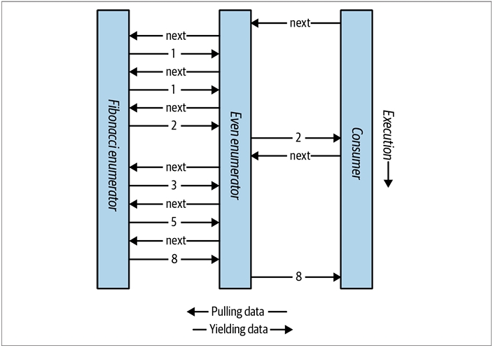
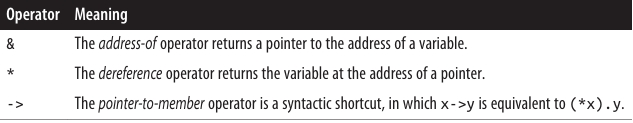
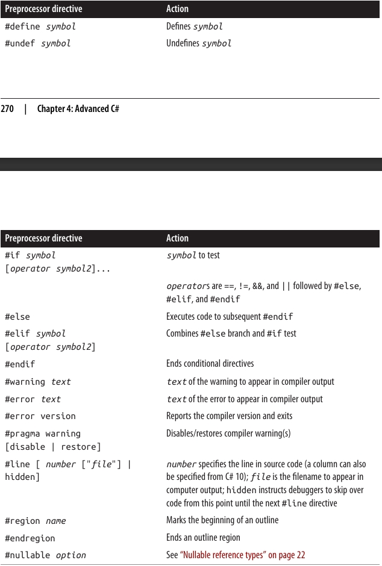
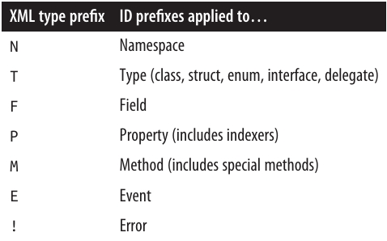

<div dir="rtl">

# فصل چهارم: سی شارپ پیشرفته

در این فصل، به سراغ مباحث پیشرفته زبان C# می‌رویم که بر پایه مفاهیمی بنا شده‌اند که در فصل‌های 2 و 3 بررسی کردیم.
چهار بخش اول را باید به صورت پیوسته و پشت سر هم مطالعه کنید؛ اما بخش‌های باقی‌مانده را می‌توانید به هر ترتیبی بخوانید.

### Delegates (نمایندگان) 📨

یک delegate یک شیء است که می‌داند چگونه یک متد را فراخوانی کند.

نوع delegate تعیین می‌کند که نمونه‌های delegate می‌توانند چه نوع متدهایی را فراخوانی کنند. به طور مشخص، یک delegate نوع بازگشتی متد و انواع پارامترهای متد را تعریف می‌کند.

مثال: تعریف یک نوع delegate به نام Transformer:
```c#
delegate int Transformer(int x);
```

این delegate با هر متدی که بازگشتی از نوع int داشته باشد و یک پارامتر int بگیرد سازگار است. مثل این:
```c#
int Square(int x) { return x * x; }
```

یا به صورت کوتاه‌تر (expression-bodied):
```c#
int Square(int x) => x * x;
```
**ساختن و استفاده از یک delegate 🛠️**

اختصاص یک متد به یک متغیر delegate، باعث ایجاد یک نمونه delegate می‌شود:
```c#
Transformer t = Square;
```

فراخوانی یک نمونه delegate دقیقاً مثل فراخوانی یک متد است:
```c#
int answer = t(3);   // answer برابر با 9
```

مثال کامل:
```c#
Transformer t = Square;   // ایجاد نمونه delegate
int result = t(3);        // فراخوانی delegate
Console.WriteLine(result); // خروجی: 9

int Square(int x) => x * x;

delegate int Transformer(int x);  // تعریف نوع delegate
```
**مفهوم اصلی delegate 🎯**

یک نمونه delegate واقعاً به عنوان نماینده‌ی caller عمل می‌کند:
caller (فراخواننده) delegate را فراخوانی می‌کند و سپس delegate، متد هدف را فراخوانی می‌کند.

این واسطه‌گری (indirection) باعث می‌شود که caller از متد هدف جدا و مستقل باشد.

**نکته‌های مهم ✅**

دستور:
```
Transformer t = Square;
```

در واقع یک میان‌بُر (shorthand) برای این است:
```c#
Transformer t = new Transformer(Square);
```

عبارت:
```
t(3)
```

میان‌بُری است برای:
```
t.Invoke(3)
```

از نظر فنی، وقتی به Square بدون پرانتز و آرگومان اشاره می‌کنیم، در حال مشخص کردن یک method group هستیم.
اگر متد overload شده باشد، کامپایلر C# بر اساس امضای delegate انتخاب می‌کند که کدام overload مناسب است.

**Delegate شبیه به Callback 📞**


یک delegate مشابه چیزی است که در اصطلاح عمومی callback نامیده می‌شود.
این مفهوم سازه‌هایی مثل function pointers در زبان C را نیز در بر می‌گیرد.

### نوشتن متدهای پلاگین با استفاده از Delegateها ✨

یک متغیر از نوع delegate در زمان اجرا (runtime) به یک متد نسبت داده می‌شود. این ویژگی برای نوشتن متدهای پلاگین (plug-in methods) بسیار کاربردی است.

در مثال زیر، ما یک متد کمکی (utility method) به نام Transform داریم که یک عمل transform را روی هر عضو از یک آرایه‌ی عددی (integer array) اعمال می‌کند. این متد Transform یک پارامتر از نوع delegate دارد که می‌توانید برای مشخص کردن پلاگین transform از آن استفاده کنید:
```c#
int[] values = { 1, 2, 3 };
Transform (values, Square);      // اتصال متد Square به Transform
foreach (int i in values)
  Console.Write (i + "  ");      // خروجی: 1   4   9

void Transform (int[] values, Transformer t)
{
  for (int i = 0; i < values.Length; i++)
    values[i] = t (values[i]);
}

int Square (int x) => x * x;
int Cube (int x) => x * x * x;

delegate int Transformer (int x);
```

🔹 در اینجا اگر در خط دوم به‌جای Square از Cube استفاده کنیم، تبدیل روی اعداد به‌صورت مکعب (توان سوم) انجام می‌شود.

🔹 متد Transform یک higher-order function است، چون یک تابع (delegate) را به‌عنوان آرگومان می‌گیرد. (هر متدی که یک delegate را برگرداند نیز یک higher-order function محسوب می‌شود.)

### اهداف متد در Delegateها: Instance و Static ⚡

یک متد هدف (target method) برای یک delegate می‌تواند محلی (local)، ایستا (static) یا نمونه‌ای (instance) باشد.

مثال یک متد static به‌عنوان هدف delegate:
```c#
Transformer t = Test.Square;
Console.WriteLine (t(10));      // 100

class Test 
{ 
    public static int Square (int x) => x * x; 
}

delegate int Transformer (int x);
```
مثال یک متد instance به‌عنوان هدف delegate:
```c#
Test test = new Test();
Transformer t = test.Square;
Console.WriteLine (t(10));      // 100

class Test 
{ 
    public int Square (int x) => x * x; 
}

delegate int Transformer (int x);
```

🔑 زمانی که یک متد instance به یک delegate اختصاص داده می‌شود، آن delegate فقط به خود متد اشاره نمی‌کند، بلکه نمونه‌ای از کلاس که متد به آن تعلق دارد را هم نگه‌داری می‌کند.

**خاصیت Target در کلاس System.Delegate 🎯**

کلاس System.Delegate یک ویژگی به نام Target دارد که این نمونه (instance) را نشان می‌دهد (و اگر delegate به یک متد static اشاره کند، مقدارش null خواهد بود).

مثال:
```c#
MyReporter r = new MyReporter();
r.Prefix = "%Complete: ";

ProgressReporter p = r.ReportProgress;
p(99);                                 // %Complete: 99

Console.WriteLine (p.Target == r);     // True
Console.WriteLine (p.Method);          // Void ReportProgress(Int32)

r.Prefix = "";
p(99);                                 // 99

public delegate void ProgressReporter (int percentComplete);

class MyReporter
{
  public string Prefix = "";
  public void ReportProgress (int percentComplete)
    => Console.WriteLine (Prefix + percentComplete);
}
```

✅ چون نمونه (instance) در خاصیت Target ذخیره می‌شود، طول عمر آن حداقل به اندازه طول عمر delegate گسترش می‌یابد.

🔖 جمع‌بندی:

+ Delegateها به ما اجازه می‌دهند که متدها را مثل متغیرها پاس بدهیم.

+ می‌توانند به متدهای static یا instance متصل شوند.

+ خاصیت Target تضمین می‌کند که نمونه مربوط به متد instance تا وقتی delegate زنده است، باقی بماند.

💡 این مفهوم پایه‌ای در طراحی پلاگین‌ها، کال‌بک‌ها و برنامه‌نویسی شیءگراست.
### نمایندگان چندپخشی (Multicast Delegates) 🎯

تمام نمونه‌های delegate در سی‌شارپ دارای قابلیت چندپخشی (multicast) هستند. این یعنی یک نمونه‌ی delegate می‌تواند نه فقط به یک متد، بلکه به یک لیست از متدها اشاره کند.

عملگرهای + و += برای ترکیب کردن نمونه‌های delegate استفاده می‌شوند:
```c#
SomeDelegate d = SomeMethod1;
d += SomeMethod2;
```

خط آخر از نظر عملکرد دقیقاً معادل این است:
```c#
d = d + SomeMethod2;
```

اکنون وقتی d فراخوانی شود، هم SomeMethod1 و هم SomeMethod2 اجرا می‌شوند.
✅ توجه داشته باشید که متدها به ترتیبی که اضافه شده‌اند فراخوانی می‌شوند.

عملگرهای - و -= هم برای حذف یک متد از لیست متدهای یک delegate استفاده می‌شوند:
```
d -= SomeMethod1;
```

اکنون فراخوانی d باعث می‌شود فقط SomeMethod2 اجرا شود.

📌 نکته مهم:

+ وقتی روی یک متغیر delegate که مقدارش null است، عمل + یا += انجام دهید، باز هم کار می‌کند و معادل این است که به آن مقدار جدید بدهید:
```c#
SomeDelegate d = null;
d += SomeMethod1;   // معادل با: d = SomeMethod1 وقتی d برابر null است
```

+ به طور مشابه، اگر روی یک delegate که فقط یک متد را نگه داشته باشد عمل -= کنید، نتیجه‌اش معادل اختصاص مقدار null به آن متغیر خواهد بود.

⚡ یک نکته مهم دیگر:
Delegates در سی‌شارپ immutable هستند. یعنی وقتی شما += یا -= را استفاده می‌کنید، در واقع یک نمونه‌ی جدید از delegate ساخته می‌شود و به متغیر موجود اختصاص داده می‌شود.

📢 اگر یک delegate چندپخشی (multicast delegate) دارای نوع بازگشتی غیر از void باشد، مقدار بازگشتی که شما دریافت می‌کنید مربوط به آخرین متدی است که اجرا شده است. متدهای قبلی همچنان اجرا می‌شوند، اما مقدار بازگشتی آن‌ها نادیده گرفته می‌شود.
(به همین دلیل، در بیشتر مواردی که از multicast delegate استفاده می‌شود، آن‌ها void برمی‌گردانند.)

🧩 تمام انواع delegate به طور ضمنی از System.MulticastDelegate ارث‌بری می‌کنند که خودش از System.Delegate ارث‌بری می‌کند.
کامپایلر سی‌شارپ تمام عملیات +، -، += و -= روی delegateها را به متدهای استاتیک Combine و Remove از کلاس System.Delegate تبدیل می‌کند.
#### مثال Multicast Delegate 🛠️

فرض کنید یک متدی نوشته‌اید که اجرای آن زمان زیادی می‌برد. این متد می‌تواند به طور منظم میزان پیشرفت کار را به فراخواننده گزارش دهد؛ این کار با فراخوانی یک delegate انجام می‌شود.

در مثال زیر، متد HardWork یک پارامتر از نوع delegate به نام ProgressReporter دریافت می‌کند و از آن برای نشان دادن پیشرفت استفاده می‌کند:
```c#
public delegate void ProgressReporter(int percentComplete);

public class Util
{
    public static void HardWork(ProgressReporter p)
    {
        for (int i = 0; i < 10; i++)
        {
            p(i * 10);                           // فراخوانی delegate
            System.Threading.Thread.Sleep(100);  // شبیه‌سازی کار سنگین
        }
    }
}
```

برای مانیتور کردن میزان پیشرفت، می‌توانیم یک نمونه‌ی Multicast Delegate به نام p بسازیم تا پیشرفت هم‌زمان توسط دو متد مستقل بررسی شود:
```c#
ProgressReporter p = WriteProgressToConsole;
p += WriteProgressToFile;

Util.HardWork(p);

void WriteProgressToConsole(int percentComplete)
    => Console.WriteLine(percentComplete);

void WriteProgressToFile(int percentComplete)
    => System.IO.File.WriteAllText("progress.txt",
                                    percentComplete.ToString());
```

🔍 در اینجا چه اتفاقی می‌افتد؟

1. ابتدا یک delegate از نوع ProgressReporter ساخته می‌شود و به متد WriteProgressToConsole اشاره می‌کند.

2. سپس با عملگر +=، متد WriteProgressToFile هم به آن اضافه می‌شود.
یعنی delegate p اکنون یک multicast delegate است.

3. هر بار که متد HardWork پیشرفت را گزارش می‌دهد (p(i * 10))، هر دو متد اجرا می‌شوند:

+ WriteProgressToConsole مقدار پیشرفت را روی کنسول چاپ می‌کند.

+ WriteProgressToFile مقدار پیشرفت را در یک فایل progress.txt ذخیره می‌کند.

📊 نتیجه نهایی:

+ شما همزمان در کنسول می‌بینید که پیشرفت کار چند درصد است.

+ یک فایل متنی هم دارید که همان اطلاعات را ذخیره می‌کند.

### انواع Delegate عمومی (Generic Delegate Types) ⚡

یک delegate می‌تواند شامل پارامترهای عمومی (Generic Type Parameters) باشد:
```c#
public delegate T Transformer<T>(T arg);
```

با چنین تعریفی می‌توانیم یک متد ابزار عمومی (Utility Method) بنویسیم که روی هر نوع داده‌ای کار کند:
```c#
int[] values = { 1, 2, 3 };
Util.Transform(values, Square);      // اتصال متد Square

foreach (int i in values)
    Console.Write(i + "  ");         // خروجی: 1   4   9

int Square(int x) => x * x;

public class Util
{
    public static void Transform<T>(T[] values, Transformer<T> t)
    {
        for (int i = 0; i < values.Length; i++)
            values[i] = t(values[i]);
    }
}
```
### Delegates آماده: Func و Action ✅

با معرفی generic delegates، این امکان فراهم شد که مجموعه‌ای کوچک از delegateها طراحی شوند که آن‌قدر عمومی و انعطاف‌پذیر باشند که برای متدهایی با هر نوع خروجی و هر تعداد (معقول) آرگومان قابل استفاده باشند.

این delegateها همان Func و Action هستند که در فضای نام System تعریف شده‌اند:
```c#
delegate TResult Func<out TResult>();                
delegate TResult Func<in T, out TResult>(T arg);          
delegate TResult Func<in T1, in T2, out TResult>(T1 arg1, T2 arg2);
// ... ادامه دارد تا 16 پارامتر

delegate void Action();
delegate void Action<in T>(T arg);
delegate void Action<in T1, in T2>(T1 arg1, T2 arg2);
// ... ادامه دارد تا 16 پارامتر
```


📌 این‌ها بسیار عمومی و قدرتمند هستند.

**جایگزینی Transformer با Func 🔄**

در مثال قبلی، به جای تعریف delegate اختصاصی Transformer، می‌توانستیم از Func استفاده کنیم:
```c#
public static void Transform<T>(T[] values, Func<T, T> transformer)
{
    for (int i = 0; i < values.Length; i++)
        values[i] = transformer(values[i]);
}
```

در اینجا:

+ Func<T, T> یعنی یک delegate که یک ورودی از نوع T می‌گیرد و خروجی هم از همان نوع T برمی‌گرداند.

+ دقیقاً همان چیزی است که قبلاً با Transformer<T> ساخته بودیم.

**محدودیت‌ها 🚧**

تنها سناریوهای عملی که Func و Action پوشش نمی‌دهند، مواردی هستند که شامل پارامترهای ref/out یا pointer باشند.

**نکته تاریخی 🕰️**

زمانی که C# برای اولین بار معرفی شد، هنوز generics وجود نداشت. به همین دلیل، Func و Action هم وجود نداشتند.
به همین خاطر، بخش زیادی از کتابخانه‌ی .NET از delegateهای سفارشی استفاده می‌کند، نه از Func و Action.

### مقایسه Delegate‌ها و Interface‌ها ⚔️

هر مسئله‌ای که با یک delegate حل می‌شود، می‌تواند با یک interface هم حل شود.

به‌عنوان مثال، می‌توانیم نمونه‌ی اولیه‌مان را با استفاده از یک interface به نام ITransformer بازنویسی کنیم، به جای اینکه از delegate استفاده کنیم:
```c#
int[] values = { 1, 2, 3 };
Util.TransformAll(values, new Squarer());

foreach (int i in values)
    Console.WriteLine(i);

public interface ITransformer
{
    int Transform(int x);
}

public class Util
{
    public static void TransformAll(int[] values, ITransformer t)
    {
        for (int i = 0; i < values.Length; i++)
            values[i] = t.Transform(values[i]);
    }
}

class Squarer : ITransformer
{
    public int Transform(int x) => x * x;
}
```
چه زمانی delegate انتخاب بهتری از interface است؟ ✅

طراحی با delegate ممکن است انتخاب بهتری باشد اگر یک یا چند مورد زیر برقرار باشند:

+ 🔹 interface فقط یک متد تعریف کرده باشد.

+ 🔹 نیاز به multicast (اتصال چند متد به یک delegate) داشته باشیم.

+ 🔹 یک subscriber مجبور باشد چند بار یک interface را پیاده‌سازی کند.

**بررسی مثال 🔍**

در مثال ITransformer:

+ ما نیازی به multicast نداریم.

+ اما interface فقط یک متد (Transform) تعریف کرده است.

+ از طرفی ممکن است بخواهیم چندین تبدیل مختلف (مثلاً مربع یا مکعب) را پیاده‌سازی کنیم.

در چنین حالتی، اگر از interface استفاده کنیم، مجبور می‌شویم برای هر تبدیل یک کلاس جداگانه بسازیم، چون یک کلاس فقط یک بار می‌تواند ITransformer را پیاده‌سازی کند. این کار دست‌وپاگیر و تکراری می‌شود.

مثلاً:
```c#
int[] values = { 1, 2, 3 };
Util.TransformAll(values, new Cuber());

foreach (int i in values)
    Console.WriteLine(i);

class Squarer : ITransformer
{
    public int Transform(int x) => x * x;
}

class Cuber : ITransformer
{
    public int Transform(int x) => x * x * x;
}
```

📌 نتیجه:

+ با delegateها، پیاده‌سازی ساده‌تر و منعطف‌تر است (می‌توانیم به‌راحتی متدهای مختلفی مثل مربع یا مکعب را پاس بدهیم).

+ با interfaceها، مجبوریم برای هر عملگر یک کلاس جدید بسازیم.
  
### سازگاری Delegate ها ⚖️

#### سازگاری نوع (Type Compatibility) 🏷️

تمام نوع‌های delegate با هم ناسازگار هستند، حتی اگر امضا (signature) آن‌ها یکی باشد:
```c#
D1 d1 = Method1;
D2 d2 = d1;   // ❌ خطای زمان کامپایل

void Method1() { }

delegate void D1();
delegate void D2();
```

🔹 اما این حالت مجاز است:
```
D2 d2 = new D2(d1);   // ✅ درست
```
**مقایسه‌ی برابری (Equality) ✅**

دو نمونه‌ی delegate وقتی برابر محسوب می‌شوند که به یک متد یکسان اشاره کنند:
```c#
D d1 = Method1;
D d2 = Method1;

Console.WriteLine(d1 == d2);   // True

void Method1() { }

delegate void D();
```

🔹 در مورد multicast delegate‌ها هم، برابری وقتی برقرار است که به همان متدها و به همان ترتیب اشاره کنند.

#### سازگاری پارامتر (Parameter Compatibility) 🔄

وقتی یک متد را فراخوانی می‌کنید، می‌توانید آرگومانی بدهید که از نوع خاص‌تر از پارامتر متد باشد. این رفتار معمولی polymorphism است.

به همین دلیل، یک delegate هم می‌تواند پارامترهایی خاص‌تر از متد هدف خود داشته باشد. این ویژگی را contravariance می‌نامند.

مثال:
```c#
StringAction sa = new StringAction(ActOnObject);
sa("hello");

void ActOnObject(object o) => Console.WriteLine(o);   // خروجی: hello

delegate void StringAction(string s);
```

🔹 در اینجا StringAction یک متد را با پارامتر string فراخوانی می‌کند.
🔹 اما متدی که واقعا اجرا می‌شود (ActOnObject) پارامترش از نوع object است.
🔹 در این حالت، آرگومان string به‌طور خودکار تبدیل به object (upcast) می‌شود.

**3. ارتباط با الگوی استاندارد Event 🎯**

الگوی استاندارد event در C# طوری طراحی شده است که از contravariance استفاده کند.

+ همه‌ی کلاس‌های رویداد از کلاس پایه‌ی مشترک EventArgs ارث‌بری می‌کنند.

+ بنابراین می‌توانید یک متد داشته باشید که توسط دو delegate مختلف فراخوانی شود:

     + یکی رویداد MouseEventArgs پاس بدهد 🖱️

     + دیگری KeyEventArgs پاس بدهد ⌨️

این کار انعطاف‌پذیری بالایی در مدیریت رویدادها به شما می‌دهد.

📌 خلاصه:

+ delegate type ها حتی با امضای یکسان هم ناسازگار هستند.

+ multicast delegateها برابرند اگر دقیقا همان متدها و ترتیب را داشته باشند.

+ contravariance اجازه می‌دهد متد هدف، پارامتر عام‌تر از delegate داشته باشد.

+ event pattern از همین ویژگی برای پشتیبانی از انواع مختلف رویدادها استفاده می‌کند.

#### سازگاری نوع بازگشتی در Delegateها (Return Type Compatibility) 🔄

همان‌طور که وقتی یک متد را فراخوانی می‌کنید ممکن است نوعی خاص‌تر از چیزی که انتظار داشتید برگردد (رفتار معمولی polymorphism)؛ در مورد delegate‌ها هم همین موضوع صادق است.

یعنی متد هدف یک delegate می‌تواند نوع بازگشتی خاص‌تر از چیزی که delegate تعریف کرده داشته باشد.
این ویژگی را covariance می‌نامند.

مثال: Covariance در نوع بازگشتی 📝
```c#
ObjectRetriever o = new ObjectRetriever(RetrieveString);
object result = o();
Console.WriteLine(result);   // hello

string RetrieveString() => "hello";

delegate object ObjectRetriever();
```

🔹 اینجا ObjectRetriever انتظار دارد متدی که به آن متصل است، یک object برگرداند.
🔹 اما در واقعیت، متد RetrieveString یک string برمی‌گرداند.
🔹 چون string زیرکلاس object است، این مجاز است ✅.

📌 پس: نوع بازگشتی delegate ها covariant است.

#### واریانس در Delegateهای جنریک ⚙️

در فصل ۳ گفتیم که اینترفیس‌های جنریک می‌توانند از covariant و contravariant استفاده کنند.
این قابلیت برای delegate‌های جنریک هم وجود دارد.

**قوانین خوب برای تعریف delegate جنریک:**

اگر پارامتر نوع (Type Parameter) فقط در خروجی استفاده می‌شود → با out (covariant) علامت‌گذاری شود.

اگر پارامتر نوع فقط در ورودی استفاده می‌شود → با in (contravariant) علامت‌گذاری شود.

**مثال ۱: Covariance در جنریک‌ها (با Func) 📤**

در فضای نام System داریم:
```c#
delegate TResult Func<out TResult>();
```

این باعث می‌شود بتوانیم بنویسیم:
```c#
Func<string> x = () => "Hello!";
Func<object> y = x;   // ✅ مجاز به خاطر covariance
```

🔹 یعنی می‌توانیم Func<string> را به Func<object> تبدیل کنیم چون string زیرکلاس object است.

**مثال ۲: Contravariance در جنریک‌ها (با Action) 📥**

باز هم در فضای نام System:
```c#
delegate void Action<in T>(T arg);
```

این باعث می‌شود:
```c#
Action<object> x = obj => Console.WriteLine(obj);
Action<string> y = x;   // ✅ مجاز به خاطر contravariance
```

🔹 یعنی می‌توانیم Action<object> را به Action<string> تبدیل کنیم چون متدی که انتظار دریافت object دارد، می‌تواند string هم بگیرد.

📌 خلاصه:

+ نوع بازگشتی delegate می‌تواند خاص‌تر از نوع تعریف‌شده باشد → این covariance است.

+ در delegate جنریک:

     + نوع خروجی (out) → covariant 📤

     + نوع ورودی (in) → contravariant 📥

این باعث می‌شود تبدیل‌ها بین delegateها به‌صورت طبیعی و بر اساس ارث‌بری انجام شوند.
### رویدادها (Events)

هنگام استفاده از **delegates**، دو نقش معمولاً ظاهر می‌شوند: **broadcaster** و **subscriber**.

* **Broadcaster** نوعی است که دارای یک فیلد delegate می‌باشد. این نوع تصمیم می‌گیرد که چه زمانی پیام را پخش کند، با **invoke** کردن delegate.
* **Subscribers** دریافت‌کنندگان هدف متد هستند. یک subscriber تصمیم می‌گیرد چه زمانی شروع به گوش دادن کند و چه زمانی آن را متوقف کند، با استفاده از عملگرهای `+=` و `-=` روی delegate مربوط به broadcaster. یک subscriber درباره دیگر subscribers اطلاعی ندارد و در عملکرد آن‌ها دخالتی نمی‌کند.

### رویدادها در C# پیشرفته ⚡

رویدادها یک ویژگی زبانی هستند که این الگو را رسمی می‌کنند. یک **event** یک ساختار است که تنها زیرمجموعه‌ای از قابلیت‌های delegate را که برای مدل **broadcaster/subscriber** لازم است، در معرض قرار می‌دهد. هدف اصلی رویدادها جلوگیری از دخالت subscribers در عملکرد یکدیگر است.

ساده‌ترین روش برای تعریف یک رویداد، استفاده از کلیدواژه **event** قبل از یک عضو delegate است:

```csharp
// تعریف delegate
public delegate void PriceChangedHandler(decimal oldPrice, decimal newPrice);

public class Broadcaster
{
    // تعریف رویداد
    public event PriceChangedHandler PriceChanged;
}
```

کدی که داخل نوع **Broadcaster** قرار دارد، دسترسی کامل به **PriceChanged** دارد و می‌تواند آن را مانند یک delegate معمولی مدیریت کند. کدهای خارج از **Broadcaster** تنها می‌توانند عملیات `+=` و `-=` را روی رویداد **PriceChanged** انجام دهند.

✅ ادامه‌ی متن را ارسال کنید تا ترجمه بعدی را آماده کنم.


### چگونه رویدادها در درون کار می‌کنند؟ 🔍

وقتی یک رویداد به شکل زیر تعریف می‌کنید:

```csharp
public class Broadcaster
{
    public event PriceChangedHandler PriceChanged;
}
```

سه اتفاق در پشت صحنه رخ می‌دهد:

1️⃣ ابتدا، **کامپایلر** تعریف رویداد را به چیزی شبیه به کد زیر ترجمه می‌کند:

```csharp
PriceChangedHandler priceChanged;   // delegate خصوصی

public event PriceChangedHandler PriceChanged
{
    add    { priceChanged += value; }
    remove { priceChanged -= value; }
}
```

کلیدواژه‌های **add** و **remove** نشان‌دهنده **accessorهای رویداد صریح** هستند—که عملکردی شبیه به **accessorهای property** دارند. بعداً درباره نحوه نوشتن این‌ها توضیح خواهیم داد.

2️⃣ دوم، کامپایلر داخل کلاس **Broadcaster** به دنبال ارجاعات به **PriceChanged** می‌گردد که عملیات دیگری غیر از `+=` یا `-=` انجام می‌دهند و آن‌ها را به فیلد delegate زیرین یعنی **priceChanged** هدایت می‌کند.

3️⃣ سوم، کامپایلر عملیات `+=` و `-=` روی رویداد را به فراخوانی **add** و **remove** accessorهای رویداد ترجمه می‌کند. جالب است بدانید که این کار باعث می‌شود رفتار `+=` و `-=` وقتی روی رویدادها اعمال می‌شوند، منحصربه‌فرد باشد: برخلاف سایر سناریوها، این‌ها تنها یک میانبر برای `+` و `-` به همراه انتساب نیستند.

مثالی را در نظر بگیرید 📈

کلاس **Stock** رویداد **PriceChanged** خود را هر بار که قیمت سهام تغییر می‌کند، فعال می‌کند:

```csharp
public delegate void PriceChangedHandler(decimal oldPrice, decimal newPrice);

public class Stock
{
    string symbol;
    decimal price;
    public Stock(string symbol) => this.symbol = symbol;
    public event PriceChangedHandler PriceChanged;
    public decimal Price
    {
        get => price;
        set
        {
            if (price == value) return;   // خروج اگر چیزی تغییر نکرده
            decimal oldPrice = price;
            price = value;
            if (PriceChanged != null)      // اگر لیست فراخوانی خالی نیست
                PriceChanged(oldPrice, price); // رویداد فعال شود
        }
    }
}
```

اگر کلیدواژه **event** را حذف کنیم و **PriceChanged** به یک فیلد معمولی delegate تبدیل شود، باز هم مثال ما همان نتایج را خواهد داد. اما کلاس **Stock** کمتر مقاوم خواهد بود، زیرا subscribers می‌توانند با یکدیگر تداخل ایجاد کنند، مثلاً:

* جایگزین کردن دیگر subscribers با انتساب مجدد **PriceChanged** به جای استفاده از عملگر `+=`.
* پاک کردن تمام subscribers با انتساب **PriceChanged** به `null`.
* ارسال پیام به subscribers دیگر با invoke کردن delegate.

### الگوی استاندارد رویدادها 🛠️

در تقریباً همه مواردی که رویدادها در کتابخانه‌های .NET تعریف می‌شوند، تعریف آن‌ها مطابق یک الگوی استاندارد است تا یکپارچگی بین کدهای کتابخانه و کاربر حفظ شود. در مرکز این الگو، کلاس **System.EventArgs** قرار دارد؛ یک کلاس از پیش تعریف‌شده در .NET که هیچ عضوی ندارد (به جز فیلد استاتیک **Empty**). **EventArgs** کلاس پایه‌ای برای انتقال اطلاعات مربوط به یک رویداد است.

در مثال Stock ما، برای انتقال قیمت قدیمی و جدید هنگام فعال شدن رویداد **PriceChanged**، کلاس EventArgs را به صورت زیر subclass می‌کنیم:

```csharp
public class PriceChangedEventArgs : System.EventArgs
{
    public readonly decimal LastPrice;
    public readonly decimal NewPrice;

    public PriceChangedEventArgs(decimal lastPrice, decimal newPrice)
    {
        LastPrice = lastPrice;
        NewPrice = newPrice;
    }
}
```

برای استفاده مجدد، subclass EventArgs معمولاً بر اساس اطلاعاتی که شامل می‌شود نامگذاری می‌شود، نه بر اساس رویدادی که برای آن استفاده می‌شود. داده‌ها معمولاً به صورت property یا فیلد فقط‌خواندنی ارائه می‌شوند.

### انتخاب یا تعریف delegate برای رویداد 🎯

سه قاعده وجود دارد:

1️⃣ نوع بازگشتی باید **void** باشد.
2️⃣ دو آرگومان دریافت کند: آرگومان اول از نوع **object** و آرگومان دوم یک subclass از **EventArgs**. آرگومان اول نشان‌دهنده broadcaster و آرگومان دوم شامل اطلاعات اضافی برای انتقال است.
3️⃣ نام delegate باید با **EventHandler** پایان یابد.

.NET یک delegate عمومی به نام **System.EventHandler<>** برای کمک به این کار تعریف کرده است:

```csharp
public delegate void EventHandler<TEventArgs>(object source, TEventArgs e);
```

قبل از وجود genericها در زبان (قبل از C# 2.0)، باید delegate سفارشی را به صورت زیر می‌نوشتیم:

```csharp
public delegate void PriceChangedHandler(object sender, PriceChangedEventArgs e);
```

به دلایل تاریخی، بیشتر رویدادها در کتابخانه‌های .NET از این روش استفاده می‌کنند.

### تعریف رویداد با delegate انتخاب‌شده 🔧

```csharp
public class Stock
{
    ...
    public event EventHandler<PriceChangedEventArgs> PriceChanged;
}
```

### نوشتن متد محافظت‌شده و virtual برای فعال کردن رویداد

نام این متد باید همان نام رویداد باشد، با پیشوند **On**، و یک آرگومان **EventArgs** دریافت کند:

```csharp
public class Stock
{
    ...
    public event EventHandler<PriceChangedEventArgs> PriceChanged;

    protected virtual void OnPriceChanged(PriceChangedEventArgs e)
    {
        if (PriceChanged != null) PriceChanged(this, e);
    }
}
```

برای عملکرد مقاوم در سناریوهای چندنخی (multithreaded)، بهتر است delegate را قبل از تست و فراخوانی به یک متغیر موقت انتساب دهید:

```csharp
var temp = PriceChanged;
if (temp != null) temp(this, e);
```

همچنین می‌توان با استفاده از **null-conditional operator** همان کار را بدون متغیر موقت انجام داد:

```csharp
PriceChanged?.Invoke(this, e);
```

این روش هم **thread-safe** و هم مختصر است و بهترین روش عمومی برای فراخوانی رویدادها محسوب می‌شود.

### مثال کامل 💻

```csharp
using System;

Stock stock = new Stock("THPW");
stock.Price = 27.10M;

// ثبت برای رویداد PriceChanged
stock.PriceChanged += stock_PriceChanged;
stock.Price = 31.59M;

void stock_PriceChanged(object sender, PriceChangedEventArgs e)
{
    if ((e.NewPrice - e.LastPrice) / e.LastPrice > 0.1M)
        Console.WriteLine("Alert, 10% stock price increase!");
}

public class PriceChangedEventArgs : EventArgs
{
    public readonly decimal LastPrice;
    public readonly decimal NewPrice;

    public PriceChangedEventArgs(decimal lastPrice, decimal newPrice)
    {
        LastPrice = lastPrice; NewPrice = newPrice;
    }
}

public class Stock
{
    string symbol;
    decimal price;
    public Stock(string symbol) => this.symbol = symbol;
    public event EventHandler<PriceChangedEventArgs> PriceChanged;

    protected virtual void OnPriceChanged(PriceChangedEventArgs e)
    {
        PriceChanged?.Invoke(this, e);
    }

    public decimal Price
    {
        get => price;
        set
        {
            if (price == value) return;
            decimal oldPrice = price;
            price = value;
            OnPriceChanged(new PriceChangedEventArgs(oldPrice, price));
        }
    }
}
```

### استفاده از EventHandler غیر عمومی

وقتی رویداد نیاز به انتقال اطلاعات اضافی ندارد، می‌توان از **EventHandler** غیر generic استفاده کرد. در این مثال، کلاس **Stock** بازنویسی شده تا رویداد **PriceChanged** پس از تغییر قیمت فعال شود و تنها نیاز است بدانیم رویداد رخ داده است، بدون نیاز به اطلاعات اضافی. همچنین از **EventArgs.Empty** استفاده می‌کنیم تا از ایجاد غیرضروری یک نمونه EventArgs جلوگیری شود:

```csharp
public class Stock
{
    string symbol;
    decimal price;

    public Stock(string symbol) { this.symbol = symbol; }
    public event EventHandler PriceChanged;

    protected virtual void OnPriceChanged(EventArgs e)
    {
        PriceChanged?.Invoke(this, e);
    }

    public decimal Price
    {
        get { return price; }
        set
        {
            if (price == value) return;
            price = value;
            OnPriceChanged(EventArgs.Empty);
        }
    }
}
```

**Accessorهای رویدادها 🔑**

Accessorهای یک رویداد، پیاده‌سازی‌های عملگرهای `+=` و `-=` آن هستند. به طور پیش‌فرض، این accessors به صورت ضمنی توسط کامپایلر پیاده‌سازی می‌شوند. به مثال زیر توجه کنید:

```csharp
public event EventHandler PriceChanged;
```

کامپایلر این را به شکل زیر تبدیل می‌کند:

* یک فیلد delegate خصوصی
* یک جفت تابع accessor عمومی برای رویداد (**add\_PriceChanged** و **remove\_PriceChanged**) که عملیات `+=` و `-=` را به فیلد delegate خصوصی هدایت می‌کنند

شما می‌توانید این روند را با تعریف **explicit event accessors** به دست بگیرید. در اینجا پیاده‌سازی دستی رویداد **PriceChanged** از مثال قبلی آمده است:

```csharp
private EventHandler priceChanged;   // تعریف یک delegate خصوصی
public event EventHandler PriceChanged
{
    add    { priceChanged += value; }
    remove { priceChanged -= value; }
}
```

این مثال از نظر عملکرد با پیاده‌سازی پیش‌فرض C# یکسان است (به جز اینکه C# همچنین ایمنی در برابر چندنخی را با الگوریتم lock-free compare-and-swap تضمین می‌کند). با تعریف دستی accessors، به C# می‌گوییم که منطق پیش‌فرض فیلد و accessor را تولید نکند.

با استفاده از explicit event accessors، می‌توان استراتژی‌های پیچیده‌تری برای ذخیره و دسترسی به delegate زیرین اعمال کرد. سه سناریو که این کاربرد دارد:

1️⃣ وقتی accessors تنها به عنوان واسطه برای کلاس دیگری هستند که رویداد را پخش می‌کند.
2️⃣ وقتی کلاس تعداد زیادی رویداد دارد اما اغلب تنها تعداد کمی subscriber وجود دارد، مثل کنترل‌های ویندوز. در این موارد بهتر است delegateهای subscribers را در یک **dictionary** ذخیره کنیم، زیرا dictionary حافظه کمتری نسبت به ده‌ها فیلد delegate خالی مصرف می‌کند.
3️⃣ هنگام پیاده‌سازی explicit یک interface که رویدادی را تعریف کرده است.

نمونه‌ای برای مورد سوم:

```csharp
public interface IFoo { event EventHandler Ev; }

class Foo : IFoo
{
    private EventHandler ev;
    event EventHandler IFoo.Ev
    {
        add    { ev += value; }
        remove { ev -= value; }
    }
}
```

بخش‌های **add** و **remove** یک رویداد به متدهای **add\_XXX** و **remove\_XXX** کامپایل می‌شوند.

---

**Modifierهای رویدادها ⚡**

مثل متدها، رویدادها می‌توانند **virtual**، **overridden**، **abstract** یا **sealed** باشند. همچنین می‌توانند **static** باشند:

```csharp
public class Foo
{
    public static event EventHandler<EventArgs> StaticEvent;
    public virtual event EventHandler<EventArgs> VirtualEvent;
}
```

---

**Lambda Expressions λ**

یک **lambda expression** متدی بدون نام است که به جای یک instance delegate نوشته می‌شود. کامپایلر بلافاصله آن را به یکی از موارد زیر تبدیل می‌کند:

* یک instance delegate
* یا یک **expression tree** از نوع `Expression<TDelegate>` که کد داخل lambda را به صورت یک مدل شیء قابل پیمایش نمایش می‌دهد. این اجازه می‌دهد lambda بعداً در زمان اجرا تفسیر شود.

مثال:

```csharp
Transformer sqr = x => x * x;
Console.WriteLine(sqr(3));   // خروجی: 9
delegate int Transformer(int i);
```

کامپایلر lambdaهای این نوع را با نوشتن یک متد خصوصی و انتقال کد expression به آن متد حل می‌کند.

فرم کلی یک lambda:

```
(parameters) => expression-or-statement-block
```

اگر فقط یک پارامتر با نوع قابل استنتاج داشته باشیم، می‌توان پرانتزها را حذف کرد.

مثال:

```csharp
x => x * x;
```

هر پارامتر lambda متناظر با پارامتر delegate است و نوع expression (که ممکن است **void** باشد) متناظر با نوع بازگشتی delegate است.

می‌توان expression را به صورت یک بلوک statement نیز نوشت:

```csharp
x => { return x * x; };
```

اغلب lambdaها همراه با **Func** و **Action** استفاده می‌شوند:

```csharp
Func<int,int> sqr = x => x * x;
```

مثال با دو پارامتر:

```csharp
Func<string,string,int> totalLength = (s1, s2) => s1.Length + s2.Length;
int total = totalLength("hello", "world");   // total = 10
```

اگر نیازی به استفاده از پارامترها نیست، می‌توان آن‌ها را با underscore دور انداخت (از C# 9):

```csharp
Func<string,string,int> totalLength = (_,_) => ...
```

مثال بدون آرگومان:

```csharp
Func<string> greeter = () => "Hello, world";
```

از C# 10 به بعد، می‌توان از **implicit typing** برای lambda استفاده کرد:

```csharp
var greeter = () => "Hello, world";
```

### مشخص کردن صریح نوع پارامتر و نوع بازگشتی Lambda 🔧

کامپایلر معمولاً می‌تواند نوع پارامترهای lambda را به صورت زمینه‌ای استنتاج کند. وقتی این امکان وجود نداشته باشد، باید نوع هر پارامتر را به صورت صریح مشخص کنید. به دو متد زیر توجه کنید:

```csharp
void Foo<T>(T x) { }
void Bar<T>(Action<T> a) { }
```

کد زیر **کامپایل نمی‌شود**، زیرا کامپایلر نمی‌تواند نوع `x` را استنتاج کند:

```csharp
Bar(x => Foo(x));   // نوع x چیست؟
```

می‌توان با مشخص کردن صریح نوع `x` مشکل را حل کرد:

```csharp
Bar((int x) => Foo(x));
```

این مثال ساده را می‌توان به دو روش دیگر نیز اصلاح کرد:

```csharp
Bar<int>(x => Foo(x));  // مشخص کردن type parameter برای Bar
Bar<int>(Foo);          // همانند بالا، با استفاده از method group
```

مثالی دیگر از استفاده explicit برای نوع پارامتر (C# 10):

```csharp
var sqr = (int x) => x * x;
```

کامپایلر `sqr` را به نوع `Func<int,int>` استنتاج می‌کند. بدون مشخص کردن `int`، استنتاج نوع شکست می‌خورد: کامپایلر می‌داند که sqr باید از نوع `Func<T,T>` باشد، اما نمی‌داند T چیست.

از C# 10 به بعد می‌توان نوع بازگشتی lambda را نیز مشخص کرد:

```csharp
var sqr = int (int x) => x;
```

مشخص کردن نوع بازگشتی می‌تواند عملکرد کامپایلر را در lambdaهای پیچیده و تو در تو بهبود دهد.

---

### پارامترهای پیش‌فرض Lambda (C# 12) 🎯

مانند متدهای معمولی که می‌توانند پارامتر اختیاری داشته باشند:

```csharp
void Print(string message = "") => Console.WriteLine(message);
```

lambdaها نیز می‌توانند پارامتر اختیاری داشته باشند:

```csharp
var print = (string message = "") => Console.WriteLine(message);
print("Hello");
print();
```

این ویژگی برای کتابخانه‌هایی مانند **ASP.NET Minimal API** مفید است.

---

### دسترسی به متغیرهای خارجی (Outer Variables) 🌐

یک lambda می‌تواند به هر متغیری که در محل تعریفش قابل دسترسی است، ارجاع دهد. این متغیرها **outer variables** نامیده می‌شوند و می‌توانند شامل متغیرهای محلی، پارامترها و فیلدها باشند:

```csharp
int factor = 2;
Func<int, int> multiplier = n => n * factor;
Console.WriteLine(multiplier(3));   // خروجی: 6
```

متغیرهایی که توسط lambda ارجاع می‌شوند، **captured variables** نامیده می‌شوند. lambda که متغیرها را capture می‌کند، **closure** نامیده می‌شود.

متغیرهای capture شده هنگام فراخوانی delegate ارزیابی می‌شوند، نه هنگام capture شدن:

```csharp
int factor = 2;
Func<int, int> multiplier = n => n * factor;
factor = 10;
Console.WriteLine(multiplier(3));  // خروجی: 30
```

lambdaها می‌توانند خودشان متغیرهای capture شده را به‌روزرسانی کنند:

```csharp
int seed = 0;
Func<int> natural = () => seed++;
Console.WriteLine(natural());  // 0
Console.WriteLine(natural());  // 1
Console.WriteLine(seed);       // 2
```

متغیرهای capture شده طول عمرشان تا طول عمر delegate ادامه پیدا می‌کند. مثال:

```csharp
static Func<int> Natural()
{
    int seed = 0;
    return () => seed++;  // برمی‌گرداند یک closure
}

static void Main()
{
    Func<int> natural = Natural();
    Console.WriteLine(natural()); // 0
    Console.WriteLine(natural()); // 1
}
```

اگر متغیر محلی را داخل خود lambda بسازیم، هر فراخوانی delegate یک متغیر جدید ایجاد می‌کند:

```csharp
static Func<int> Natural()
{
    return () => { int seed = 0; return seed++; };
}

static void Main()
{
    Func<int> natural = Natural();
    Console.WriteLine(natural());  // 0
    Console.WriteLine(natural());  // 0
}
```

پیاده‌سازی capture داخلی با **hoisting** انجام می‌شود: متغیرهای capture شده به فیلدهای یک کلاس خصوصی منتقل می‌شوند و هنگام فراخوانی متد، کلاس ایجاد شده و به delegate وابسته می‌شود.

---

### Lambdaهای استاتیک ⚡

زمانی که lambda متغیرهای محلی، پارامترها، فیلدهای instance یا **this** را capture می‌کند، کامپایلر ممکن است کلاس خصوصی ایجاد کند تا ارجاع به داده‌ها ذخیره شود. این باعث مصرف حافظه می‌شود.

از C# 9 به بعد می‌توان با **static** کردن lambda، local function یا anonymous method، از capture شدن state جلوگیری کرد:

```csharp
Func<int, int> multiplier = static n => n * 2;
```

اگر بعداً lambda بخواهد متغیری را capture کند، کامپایلر خطا می‌دهد:

```csharp
int factor = 2;
Func<int, int> multiplier = static n => n * factor;  // کامپایل نمی‌شود
```

lambda بدون capture، یک instance delegate کش شده را مجدداً استفاده می‌کند و هزینه‌ای ندارد.

lambdaهای استاتیک هنوز می‌توانند به متغیرها و ثابت‌های static دسترسی داشته باشند. **static** تنها نقش بررسی دارد و تاثیری بر IL تولیدشده ندارد؛ بدون آن، کامپایلر در صورت نیاز closure تولید می‌کند، اما حتی آن زمان ترفندهایی برای کاهش هزینه دارد.

### گرفتن متغیرهای تکرار (Capturing iteration variables) 🔄

وقتی در یک حلقه‌ی `for` متغیر تکرار (iteration variable) را **Capture** می‌کنید، زبان C# با آن طوری رفتار می‌کند که انگار **بیرون از حلقه تعریف شده باشد**. یعنی در هر تکرار، همان متغیر گرفته می‌شود. به همین دلیل برنامه‌ی زیر به‌جای نمایش `012`، مقدار `333` را چاپ می‌کند:

```csharp
Action[] actions = new Action[3];
for (int i = 0; i < 3; i++)
    actions[i] = () => Console.Write(i);

foreach (Action a in actions) a();     // 333
```

هر **closure** (بخش پررنگ شده) همان متغیر `i` را می‌گیرد. این منطقی است، چون `i` متغیری است که مقدارش بین تکرارهای حلقه باقی می‌ماند؛ حتی می‌توانید داخل بدنه‌ی حلقه، مقدار `i` را تغییر دهید. نتیجه این است که وقتی **delegate**ها بعداً فراخوانی می‌شوند، همگی مقدار `i` در لحظه‌ی فراخوانی را می‌بینند، یعنی `3`. برای درک بهتر، حلقه را این‌طور بازنویسی کنید:

```csharp
Action[] actions = new Action[3];
int i = 0;
actions[0] = () => Console.Write(i);
i = 1;
actions[1] = () => Console.Write(i);
i = 2;
actions[2] = () => Console.Write(i);
i = 3;
foreach (Action a in actions) a();    // 333
```

راه‌حل برای نمایش `012` این است که متغیر تکرار را به یک **متغیر محلی جدید** که در همان محدوده‌ی حلقه قرار دارد، انتساب دهیم:

```csharp
Action[] actions = new Action[3];
for (int i = 0; i < 3; i++)
{
    int loopScopedi = i;
    actions[i] = () => Console.Write(loopScopedi);
}
foreach (Action a in actions) a();     // 012
```

چون در هر تکرار، یک متغیر جدید `loopScopedi` ساخته می‌شود، هر **closure** یک متغیر متفاوت را می‌گیرد. ✨

> **نکته:** قبل از نسخه‌ی C# 5.0، حلقه‌های `foreach` هم همین رفتار را داشتند و باعث سردرگمی می‌شدند. چون متغیر در `foreach` تغییرناپذیر است، انتظار می‌رفت محلی باشد، ولی نبود. خوشبختانه این موضوع اصلاح شده و حالا می‌توانید متغیرهای `foreach` را بدون نگرانی Capture کنید. ✅

---

### مقایسه‌ی **Lambda Expressions** و **Local Methods** 🆚

عملکرد **local methods** (بخش «Local methods» در صفحه 106) شباهت زیادی به **lambda expressions** دارد، اما سه مزیت دارند:

1. می‌توانند **بازگشتی (recursive)** باشند (خودشان را صدا بزنند) بدون نیاز به روش‌های پیچیده.
2. نیاز به مشخص کردن نوع delegate ندارند و کد شلوغ نمی‌شود.
3. **کارایی بیشتری** دارند چون سربار delegate را حذف می‌کنند.

**Local methods** بهینه‌تر هستند چون از واسطه‌ی delegate استفاده نمی‌کنند (این کار باعث صرف مقداری CPU و حافظه می‌شود). همچنین می‌توانند به متغیرهای محلی متد والد دسترسی داشته باشند بدون اینکه کامپایلر مجبور به **hoist کردن** آن‌ها در یک کلاس مخفی باشد.

اما در بسیاری از موارد شما به delegate نیاز دارید؛ مثل وقتی که می‌خواهید متدی با پارامتر از نوع delegate را صدا بزنید:

```csharp
public void Foo(Func<int, bool> predicate) { ... }
```

(نمونه‌های بیشتری در فصل 8 خواهید دید.) در این مواقع، استفاده از **lambda** معمولاً کوتاه‌تر و تمیزتر است.

---

### متدهای ناشناس (Anonymous Methods) 🕶️

**Anonymous methods** قابلیتی در C# 2.0 بودند که تا حد زیادی با **lambda expressions** در C# 3.0 جایگزین شدند. متدهای ناشناس مثل lambda هستند، اما امکانات زیر را ندارند:

* **پارامترهای نوع‌دهی ضمنی (implicitly typed)**
* **نوشتار به شکل expression** (همیشه باید به صورت بلوک بیانیه باشند)
* توانایی **تبدیل به Expression Tree** با `Expression<T>`

مثال:

```csharp
delegate int Transformer(int i);
Transformer sqr = delegate (int x) { return x * x; };
Console.WriteLine(sqr(3));  // 9
```

این معادل نوشتار زیر با lambda است:

```csharp
Transformer sqr = (int x) => { return x * x; };
// یا ساده‌تر:
Transformer sqr = x => x * x;
```

متدهای ناشناس هم مثل lambdaها متغیرهای بیرونی را Capture می‌کنند و حتی می‌توانند با کلمه‌ی کلیدی `static` شبیه lambdaهای استاتیک رفتار کنند.

ویژگی خاص آن‌ها این است که **می‌توان پارامترها را کاملاً حذف کرد**، حتی اگر delegate آن‌ها را انتظار داشته باشد. این برای تعریف event با handler خالی مفید است:

```csharp
public event EventHandler Clicked = delegate { };
```

این کار باعث می‌شود قبل از صدا زدن event نیازی به بررسی null نداشته باشید. همچنین نوشتن زیر هم معتبر است:

```csharp
// پارامترها حذف شده‌اند:
Clicked += delegate { Console.WriteLine("clicked"); };
```

---

### دستورات try و مدیریت استثناها (try Statements and Exceptions) ⚠️

یک دستور `try` یک بلوک کد را مشخص می‌کند که ممکن است خطا رخ دهد یا نیاز به پاکسازی داشته باشد. بلوک `try` باید حداقل با یک `catch` یا یک `finally` (یا هر دو) همراه باشد:

* **catch** زمانی اجرا می‌شود که خطا در بلوک try رخ دهد.
* **finally** همیشه بعد از خروج از try (یا catch) اجرا می‌شود و معمولاً برای کارهای پاکسازی مثل بستن اتصالات شبکه است.

`catch` به شیء `Exception` دسترسی دارد که اطلاعات خطا را نگه می‌دارد. شما می‌توانید خطا را مدیریت کنید یا دوباره پرتاب کنید (برای لاگ کردن یا بالا بردن سطح خطا).

مثال:

```csharp
try
{
    // ممکن است خطا رخ دهد
}
catch (ExceptionA ex)
{
    // مدیریت خطای نوع ExceptionA
}
catch (ExceptionB ex)
{
    // مدیریت خطای نوع ExceptionB
}
finally
{
    // پاکسازی
}
```

برنامه‌ی زیر را در نظر بگیرید:

```csharp
int y = Calc(0);
Console.WriteLine(y);

int Calc(int x) => 10 / x;
```

چون `x` صفر است، خطای `DivideByZeroException` رخ می‌دهد و برنامه متوقف می‌شود. حالا با `try/catch`:

```csharp
try
{
    int y = Calc(0);
    Console.WriteLine(y);
}
catch (DivideByZeroException ex)
{
    Console.WriteLine("x cannot be zero");
}
Console.WriteLine("program completed");

int Calc(int x) => 10 / x;
```

خروجی:

```
x cannot be zero
program completed
```

در عمل، بهتر است **خطاهای قابل پیشگیری را قبل از وقوع بررسی کنید**، مثلاً تقسیم بر صفر را چک کنید، چون **exceptionها هزینه‌بر هستند** (صدها سیکل پردازنده یا بیشتر).

وقتی exception رخ می‌دهد، CLR بررسی می‌کند:

* اگر `catch` سازگار پیدا شد: همان را اجرا می‌کند، سپس `finally` و برنامه ادامه می‌یابد.
* اگر پیدا نشد: `finally` اجرا می‌شود (اگر باشد) و CLR به عقب در stack دنبال `try` می‌گردد.
* اگر هیچ تابعی مسئولیت نگرفت: برنامه متوقف می‌شود.

---

### بخش catch (بخش گرفتن استثناها) 🛡️

یک **catch clause** مشخص می‌کند که چه نوع استثنایی (**Exception**) باید گرفته شود. این نوع باید یا **System.Exception** باشد یا یک زیرکلاس از **System.Exception**.

اگر **System.Exception** را بگیرید، تمام خطاهای ممکن را خواهید گرفت. این کار در شرایط زیر مفید است:

* وقتی برنامه‌تان می‌تواند بدون توجه به نوع خاص استثنا، بهبود یابد.
* وقتی قصد دارید استثنا را دوباره پرتاب کنید (مثلاً بعد از ثبت یا **Log** کردن آن).
* وقتی هندلر خطای شما آخرین خط دفاعی قبل از پایان برنامه است.

اما در حالت معمول، بهتر است نوع‌های خاص استثنا را بگیرید تا مجبور نشوید با شرایطی روبه‌رو شوید که هندلر شما برای آن طراحی نشده است (مثلاً **OutOfMemoryException**).

برای مدیریت چند نوع استثنا، می‌توانید از چندین بخش **catch** استفاده کنید (هرچند در این مثال می‌توان به جای مدیریت استثنا، بررسی ورودی‌ها را انجام داد):

```csharp
class Test
{
  static void Main (string[] args)
  {
    try
    {
      byte b = byte.Parse (args[0]);
      Console.WriteLine (b);
    }
    catch (IndexOutOfRangeException)
    {
      Console.WriteLine ("Please provide at least one argument");
    }
    catch (FormatException)
    {
      Console.WriteLine ("That's not a number!");
    }
    catch (OverflowException)
    {
      Console.WriteLine ("You've given me more than a byte!");
    }
  }
}
```

برای هر استثنا فقط یک **catch** اجرا می‌شود. اگر می‌خواهید یک هندلر کلی مثل **System.Exception** داشته باشید، باید هندلرهای خاص‌تر را قبل از آن قرار دهید.

گاهی نیاز ندارید به ویژگی‌های استثنا دسترسی داشته باشید. در این حالت می‌توانید متغیر را حذف کنید:

```csharp
catch (OverflowException)   // بدون متغیر
{
  ...
}
```

حتی می‌توانید هم متغیر و هم نوع را حذف کنید (به این معنی که همه استثناها گرفته می‌شوند):

```csharp
catch { ... }
```

---

### Exception filters (فیلترهای استثنا) 🔍

می‌توانید در بخش **catch** یک فیلتر استثنا با استفاده از کلمه **when** مشخص کنید:

```csharp
catch (WebException ex) when (ex.Status == WebExceptionStatus.Timeout)
{
  ...
}
```

در این مثال، اگر **WebException** پرتاب شود، عبارت بولی بعد از **when** ارزیابی می‌شود. اگر نتیجه **false** باشد، این **catch** نادیده گرفته شده و به سراغ **catch**های بعدی می‌رود.

با **exception filters** می‌توان یک نوع استثنا را چند بار با شرایط متفاوت گرفت:

```csharp
catch (WebException ex) when (ex.Status == WebExceptionStatus.Timeout)
{ ... }
catch (WebException ex) when (ex.Status == WebExceptionStatus.SendFailure)
{ ... }
```

عبارت بولی در **when** حتی می‌تواند شامل متدهایی باشد که عملیات جانبی انجام می‌دهند، مانند ثبت خطا برای اهداف عیب‌یابی.

---

### بخش finally (بخش پایانی) 🧹

بخش **finally** همیشه اجرا می‌شود—چه استثنا رخ دهد چه نه، و چه **try** به طور کامل اجرا شود یا خیر. معمولاً از **finally** برای کدهای پاک‌سازی استفاده می‌کنیم.

بخش **finally** بعد از هر یک از این حالت‌ها اجرا می‌شود:

* بعد از اتمام یک **catch** (یا زمانی که یک استثنای جدید پرتاب شود).
* بعد از اتمام بلوک **try** (یا زمانی که استثنایی رخ دهد که هندلری برایش وجود ندارد).
* زمانی که کنترل با یک دستور پرش (مثل **return** یا **goto**) از بلوک **try** خارج شود.

تنها مواردی که می‌توانند مانع اجرای **finally** شوند، یک حلقه بی‌نهایت یا پایان ناگهانی پردازش است.

بخش **finally** به برنامه‌تان نظم و قطعیت اضافه می‌کند. در مثال زیر، فایلی که باز شده همیشه بسته می‌شود، صرف‌نظر از اینکه:

* بلوک **try** به طور عادی تمام شود.
* اجرا به دلیل خالی بودن فایل (**EndOfStream**) زودتر بازگردد.
* یک **IOException** هنگام خواندن فایل رخ دهد:

```csharp
void ReadFile()
{
  StreamReader reader = null;    // در فضای نام System.IO
  try
  {
    reader = File.OpenText ("file.txt");
    if (reader.EndOfStream) return;
    Console.WriteLine (reader.ReadToEnd());
  }
  finally
  {
    if (reader != null) reader.Dispose();
  }
}
```

در این مثال، فایل را با فراخوانی **Dispose** روی **StreamReader** بستیم. فراخوانی **Dispose** روی یک شیء در داخل **finally** یک روش استاندارد است و در #C با دستور **using** نیز پشتیبانی می‌شود.

---

### دستور `using` ♻️

بسیاری از کلاس‌ها منابع مدیریت‌نشده (Unmanaged Resources) مانند **دستگیره‌های فایل (File Handles)**، **دستگیره‌های گرافیکی (Graphics Handles)** یا **اتصالات پایگاه داده (Database Connections)** را در خود جای می‌دهند. این کلاس‌ها اینترفیس **`System.IDisposable`** را پیاده‌سازی می‌کنند که تنها یک متد بدون پارامتر به نام **`Dispose`** دارد و برای پاک‌سازی این منابع استفاده می‌شود.

دستور **`using`** یک نگارش ساده و شکیل برای فراخوانی **`Dispose`** روی یک شیء پیاده‌ساز **`IDisposable`**، درون یک بلوک **`finally`** فراهم می‌کند.

به‌عنوان مثال:

```csharp
using (StreamReader reader = File.OpenText("file.txt"))
{
    ...
}
```

این قطعه‌کد دقیقاً معادل زیر است:

```csharp
StreamReader reader = File.OpenText("file.txt");
try
{
    ...
}
finally
{
    if (reader != null)
        ((IDisposable)reader).Dispose();
}
```

---

### اعلان‌های `using` (Using Declarations) ✍️

اگر در **C# 8 و نسخه‌های بالاتر**، براکت‌ها و بلوک کد بعد از دستور **`using`** حذف شوند، این دستور تبدیل به **اعلان using** می‌شود. در این حالت، منبع زمانی آزاد می‌شود که اجرای برنامه از بلوک محصورکننده خارج گردد.

مثال:

```csharp
if (File.Exists("file.txt"))
{
    using var reader = File.OpenText("file.txt");
    Console.WriteLine(reader.ReadLine());
    ...
}
```

در این حالت، **`reader`** زمانی Dispose می‌شود که اجرای برنامه از بلوک **`if`** خارج شود.

---

### پرتاب استثنا (Throwing Exceptions) 🚀

استثناها (Exceptions) می‌توانند هم توسط **زمان اجرا (Runtime)** و هم در **کدهای کاربر** پرتاب شوند. در مثال زیر، متد **`Display`** یک استثنای **`System.ArgumentNullException`** را پرتاب می‌کند:

```csharp
try { Display(null); }
catch (ArgumentNullException ex)
{
    Console.WriteLine("Caught the exception");
}

void Display(string name)
{
    if (name == null)
        throw new ArgumentNullException(nameof(name));
    Console.WriteLine(name);
}
```

از آن‌جایی که بررسی آرگومان برای مقدار **null** و پرتاب **`ArgumentNullException`** بسیار رایج است، از **.NET 6** یک میان‌بر ارائه شده است:

```csharp
void Display(string name)
{
    ArgumentNullException.ThrowIfNull(name);
    Console.WriteLine(name);
}
```

توجه کنید که در این روش، نیازی به مشخص کردن نام پارامتر نداریم. دلیل این موضوع در بخش **CallerArgumentExpression** (صفحه 247) توضیح داده خواهد شد.

---

### عبارت‌های `throw` (Throw Expressions) 🎯

عبارت **`throw`** می‌تواند به‌عنوان یک **عبارت (Expression)** در متدهای **Expression-bodied** استفاده شود:

```csharp
public string Foo() => throw new NotImplementedException();
```

همچنین می‌تواند در یک **عبارت شرطی سه‌تایی (Ternary Conditional Expression)** ظاهر شود:

```csharp
string ProperCase(string value) =>
    value == null ? throw new ArgumentException("value") :
    value == "" ? "" :
    char.ToUpper(value[0]) + value.Substring(1);
```

---

### پرتاب دوباره استثنا (Rethrowing an Exception) 🔄

می‌توانید یک استثنا را گرفته و دوباره پرتاب کنید:

```csharp
try
{
    ...
}
catch (Exception ex)
{
    // Log error
    ...
    throw; // پرتاب دوباره همان استثنا
}
```

اگر به‌جای **`throw`** از **`throw ex`** استفاده کنیم، برنامه همچنان کار می‌کند اما خاصیت **`StackTrace`** دیگر مسیر خطای اصلی را نشان نمی‌دهد.

پرتاب دوباره به شما اجازه می‌دهد خطا را **ثبت (Log)** کنید بدون اینکه آن را نادیده بگیرید، یا زمانی که شرایط فراتر از انتظار است، از ادامه مدیریت خطا صرف‌نظر کنید.

یکی دیگر از سناریوهای رایج، پرتاب یک استثنای **خاص‌تر** است:

```csharp
try
{
    // Parse a DateTime from XML element data
}
catch (FormatException ex)
{
    throw new XmlException("Invalid DateTime", ex);
}
```

دقت کنید که هنگام ساخت **`XmlException`**، استثنای اصلی **`ex`** را به‌عنوان آرگومان دوم پاس دادیم. این آرگومان خاصیت **`InnerException`** را مقداردهی می‌کند و در اشکال‌زدایی کمک زیادی می‌کند. تقریباً همه انواع استثنا چنین سازنده‌ای دارند.

---

### پرتاب یک استثنای کلی‌تر (Less-Specific Exception)

این روش زمانی مفید است که در حال عبور از یک **مرز اعتماد (Trust Boundary)** هستید تا از افشای اطلاعات فنی برای مهاجمان بالقوه جلوگیری کنید.

---

### ویژگی‌های کلیدی **System.Exception** ⚙️

مهم‌ترین ویژگی‌های **System.Exception** به شرح زیر هستند:

* **StackTrace**
  رشته‌ای (**string**) که تمام متدهایی را که از نقطه شروع رخداد استثنا تا بلوک **catch** فراخوانی شده‌اند، نمایش می‌دهد.

* **Message**
  رشته‌ای که توضیح خطا را در خود نگه می‌دارد.

* **InnerException**
  استثنای داخلی (در صورت وجود) که باعث ایجاد استثنای بیرونی شده است. این استثنا خود می‌تواند شامل **InnerException** دیگری نیز باشد.

> در زبان C# تمام استثناها در زمان اجرا (**runtime exceptions**) اتفاق می‌افتند و معادلی برای استثناهای بررسی‌شده در زمان کامپایل (**compile-time checked exceptions**) مانند Java وجود ندارد.

---

### انواع رایج استثناها 🚨

انواع زیر از استثناها به‌طور گسترده در سراسر **CLR** و کتابخانه‌های **.NET** استفاده می‌شوند. شما می‌توانید آن‌ها را خودتان پرتاب کنید یا از آن‌ها به‌عنوان کلاس پایه برای ساخت انواع سفارشی استثنا استفاده نمایید:

* **System.ArgumentException**
  زمانی پرتاب می‌شود که یک تابع با آرگومان نامعتبر فراخوانی شود. معمولاً نشان‌دهنده یک خطای برنامه‌نویسی است.

* **System.ArgumentNullException**
  زیرکلاس **ArgumentException** که وقتی یک آرگومان تابع به‌طور غیرمنتظره **null** باشد، پرتاب می‌شود.

* **System.ArgumentOutOfRangeException**
  زیرکلاس **ArgumentException** که وقتی یک آرگومان (معمولاً عددی) خیلی بزرگ یا خیلی کوچک باشد، پرتاب می‌شود. برای مثال، ارسال یک عدد منفی به تابعی که فقط مقادیر مثبت را می‌پذیرد.

* **System.InvalidOperationException**
  زمانی پرتاب می‌شود که وضعیت یک شیء برای اجرای موفقیت‌آمیز متد مناسب نباشد، بدون توجه به مقدار آرگومان‌ها. مثال‌ها شامل خواندن یک فایل بازنشده یا دریافت عنصر بعدی از یک شمارنده (**Enumerator**) است که لیست زیرین آن در میانه اجرا تغییر کرده است.

* **System.NotSupportedException**
  زمانی پرتاب می‌شود که یک قابلیت خاص پشتیبانی نمی‌شود. مثالی مناسب: فراخوانی متد **Add** روی مجموعه‌ای که **IsReadOnly** آن **true** است.

* **System.NotImplementedException**
  زمانی پرتاب می‌شود که یک تابع هنوز پیاده‌سازی نشده است.

* **System.ObjectDisposedException**
  زمانی پرتاب می‌شود که روی شیئی که قبلاً **Dispose** شده، متدی فراخوانی شود.

یکی دیگر از استثناهای رایج **NullReferenceException** است. این استثنا توسط **CLR** زمانی پرتاب می‌شود که تلاش کنید به عضوی از شیئی که مقدار آن **null** است دسترسی پیدا کنید (که نشان‌دهنده وجود باگ در کد شماست). برای تست، می‌توانید به‌طور مستقیم این استثنا را پرتاب کنید:

```csharp
throw null;
```

---

### الگوی متدهای **TryXXX** 🔄

هنگام نوشتن یک متد، زمانی که مشکلی پیش می‌آید، دو انتخاب دارید: یا یک کد خطا برگردانید یا یک استثنا پرتاب کنید. به‌طور کلی، زمانی که خطا خارج از روند عادی برنامه باشد یا زمانی که انتظار ندارید فراخواننده بتواند با آن مقابله کند، استثنا پرتاب می‌کنید.

بااین‌حال، گاهی بهتر است هر دو انتخاب را به مصرف‌کننده ارائه دهید. مثالی از این مورد نوع **int** است که دو نسخه از متد **Parse** را ارائه می‌دهد:

```csharp
public int Parse(string input);
public bool TryParse(string input, out int returnValue);
```

اگر **Parse** شکست بخورد، یک استثنا پرتاب می‌کند؛ اما **TryParse** در این حالت مقدار **false** برمی‌گرداند.

می‌توانید این الگو را با این روش پیاده‌سازی کنید که متد **XXX** در نهایت متد **TryXXX** را فراخوانی کند:

```csharp
public return-type XXX(input-type input)
{
    return-type returnValue;
    if (!TryXXX(input, out returnValue))
        throw new YYYException(...);
    return returnValue;
}
```

---

### جایگزین‌های استثناها 🛠️

همانند **int.TryParse**، یک تابع می‌تواند با برگرداندن یک کد خطا از طریق مقدار بازگشتی یا پارامتر به تابع فراخواننده، شکست را اطلاع دهد. اگرچه این روش برای خطاهای ساده و قابل پیش‌بینی کارآمد است، اما هنگام مواجهه با خطاهای غیرمعمول یا غیرقابل پیش‌بینی دست‌وپاگیر می‌شود، امضای متدها را شلوغ می‌کند و پیچیدگی‌های غیرضروری ایجاد می‌نماید.

همچنین این روش برای توابعی که متد نیستند (مانند عملگرها مثل عملگر تقسیم یا ویژگی‌ها **Properties**) قابل استفاده نیست. یک جایگزین دیگر قرار دادن خطا در یک محل مشترک است که تمام توابع در زنجیره فراخوانی بتوانند آن را ببینند (مثلاً یک متد **static** که خطای فعلی را در هر نخ ذخیره کند). با این حال، این روش نیازمند مشارکت هر تابع در الگوی انتشار خطا است که هم دست‌وپاگیر و هم مستعد خطا خواهد بود.

---

### شمارش (Enumeration) و پیمایشگرها (Iterators) 🔄

#### شمارش (Enumeration)

**Enumerator (شمارش‌گر)** یک مکان‌نما (cursor) **فقط خواندنی** و **فقط رو به جلو** روی یک دنباله از مقادیر است. در زبان #C، یک نوع (type) به‌عنوان شمارش‌گر شناخته می‌شود اگر یکی از شرایط زیر را داشته باشد:

* یک متد عمومی (public) بدون پارامتر به نام `MoveNext` و یک ویژگی (property) به نام `Current` داشته باشد.
* واسط `System.Collections.Generic.IEnumerator<T>` را پیاده‌سازی کند.
* واسط `System.Collections.IEnumerator` را پیاده‌سازی کند.

**عبارت foreach** روی یک **Enumerable object (شیء شمارش‌پذیر)** پیمایش می‌کند.
یک **Enumerable object** نمایش منطقی یک دنباله است. این شیء خودش مکان‌نما نیست، بلکه **مکان‌نما تولید می‌کند**. در #C، یک نوع به‌عنوان شمارش‌پذیر شناخته می‌شود اگر یکی از شرایط زیر را داشته باشد (بررسی‌ها به همین ترتیب انجام می‌شود):

* یک متد عمومی بدون پارامتر به نام `GetEnumerator` داشته باشد که یک شمارش‌گر برگرداند.
* واسط `System.Collections.Generic.IEnumerable<T>` را پیاده‌سازی کند.
* واسط `System.Collections.IEnumerable` را پیاده‌سازی کند.
* (از #C نسخه 9 به بعد) بتواند به یک متد توسعه‌ای (extension method) به نام `GetEnumerator` که یک شمارش‌گر برمی‌گرداند، متصل شود (بخش **"Extension Methods"** در صفحه 217 را ببینید).

**الگوی شمارش** به شکل زیر است:

```csharp
class Enumerator   // معمولاً واسط IEnumerator یا IEnumerator<T> را پیاده‌سازی می‌کند
{
  public IteratorVariableType Current { get {...} }
  public bool MoveNext() {...}
}

class Enumerable   // معمولاً واسط IEnumerable یا IEnumerable<T> را پیاده‌سازی می‌کند
{
  public Enumerator GetEnumerator() {...}
}
```

**نمونه پیمایش سطح بالا** روی کاراکترهای کلمه `"beer"` با استفاده از `foreach`:

```csharp
foreach (char c in "beer")
  Console.WriteLine(c);
```

**نمونه پیمایش سطح پایین** روی کاراکترهای `"beer"` بدون استفاده از `foreach`:

```csharp
using (var enumerator = "beer".GetEnumerator())
  while (enumerator.MoveNext())
  {
    var element = enumerator.Current;
    Console.WriteLine(element);
  }
```

> اگر شمارش‌گر واسط `IDisposable` را پیاده‌سازی کند، عبارت `foreach` مانند یک عبارت `using` عمل کرده و **به‌طور ضمنی** شیء شمارش‌گر را آزاد (dispose) می‌کند.

جزئیات بیشتر در مورد واسط‌های شمارش در **فصل 7** توضیح داده شده است.

---

#### مقداردهی اولیه مجموعه‌ها (Collection Initializers) و عبارات مجموعه‌ای (Collection Expressions) 📝

شما می‌توانید در یک مرحله، یک شیء شمارش‌پذیر را ایجاد و مقداردهی کنید:

```csharp
using System.Collections.Generic;
var list = new List<int> { 1, 2, 3 };
```

از نسخه #C 12 به بعد، می‌توانید این کار را کوتاه‌تر انجام دهید (با استفاده از **براکت‌ها**):

```csharp
using System.Collections.Generic;
List<int> list = [1, 2, 3];
```

**عبارات مجموعه‌ای** **هدف‌نوعی (target-typed)** هستند؛ یعنی نوع `[1, 2, 3]` به نوع متغیری که به آن انتساب داده می‌شود بستگی دارد. مثال:

```csharp
int[] array = [1, 2, 3];
Span<int> span = [1, 2, 3];
```

حتی می‌توانید هنگام فراخوانی متدها هم نوع را حذف کنید اگر کامپایلر بتواند آن را استنباط کند:

```csharp
Foo([1, 2, 3]);

void Foo(List<int> numbers) { ... }
```

کامپایلر این کد را به این شکل ترجمه می‌کند:

```csharp
using System.Collections.Generic;
List<int> list = new List<int>();
list.Add(1);
list.Add(2);
list.Add(3);
```

این موضوع نیازمند این است که شیء شمارش‌پذیر واسط `System.Collections.IEnumerable` را پیاده‌سازی کند و یک متد `Add` با تعداد پارامتر مناسب داشته باشد. (در عبارات مجموعه‌ای، کامپایلر از الگوهای دیگر هم برای ایجاد مجموعه‌های فقط خواندنی پشتیبانی می‌کند.)

همچنین می‌توانید دیکشنری‌ها را هم به همین شکل مقداردهی کنید (بخش **"Dictionaries"** در صفحه 394 را ببینید):

```csharp
var dict = new Dictionary<int, string>()
{
  { 5, "five" },
  { 10, "ten" }
};
```

یا به شکل کوتاه‌تر:

```csharp
var dict = new Dictionary<int, string>()
{
  [3] = "three",
  [10] = "ten"
};
```

این روش نه تنها برای دیکشنری‌ها، بلکه برای هر نوعی که **Indexer** داشته باشد، معتبر است.

---

#### پیمایشگرها (Iterators) ⚙️

در حالی که عبارت `foreach` **مصرف‌کننده** یک شمارش‌گر است، **Iterator (پیمایشگر)** **تولیدکننده** یک شمارش‌گر است.
مثال زیر یک پیمایشگر است که یک دنباله از اعداد فیبوناچی را تولید می‌کند (هر عدد حاصل جمع دو عدد قبلی است):

```csharp
using System;
using System.Collections.Generic;
foreach (int fib in Fibs(6))
  Console.Write(fib + "  ");

IEnumerable<int> Fibs(int fibCount)
{
  for (int i = 0, prevFib = 1, curFib = 1; i < fibCount; i++)
  {
    yield return prevFib;
    int newFib = prevFib + curFib;
    prevFib = curFib;
    curFib = newFib;
  }
}
```

**خروجی:**

```
1  1  2  3  5  8
```

در حالی که دستور `return` می‌گوید: **"این مقداری است که از این متد خواسته بودی"**، دستور `yield return` می‌گوید: **"این عنصر بعدی است که از این شمارش‌گر خواسته بودی"**.
در هر دستور `yield`، کنترل به فراخواننده برمی‌گردد، اما **وضعیت متد حفظ می‌شود** تا وقتی فراخواننده عنصر بعدی را درخواست کرد، متد از همان‌جا ادامه یابد. این وضعیت به عمر شمارش‌گر وابسته است و بعد از اتمام پیمایش آزاد می‌شود.

کامپایلر متدهای پیمایشگر را به کلاس‌های خصوصی تبدیل می‌کند که واسط‌های `IEnumerable<T>` و/یا `IEnumerator<T>` را پیاده‌سازی می‌کنند.
منطق موجود در بلوک پیمایشگر در متد `MoveNext` و ویژگی `Current` کلاس تولیدشده توسط کامپایلر قرار داده می‌شود. **این یعنی وقتی متد پیمایشگر را صدا می‌زنید، هیچ کدی اجرا نمی‌شود؛ تنها یک نمونه از کلاس ساخته می‌شود!**
کد شما تنها وقتی اجرا می‌شود که پیمایش شروع شود، معمولاً با یک عبارت `foreach`.

> پیمایشگرها می‌توانند متدهای محلی (local methods) هم باشند (بخش **"Local methods"** در صفحه 106 را ببینید).

---

### معنای **Iterator** (تکرارکننده) 🔄

یک **Iterator** یا «تکرارکننده» متدی، ویژگی (Property) یا ایندکسری است که شامل یک یا چند دستور `yield` است. یک **Iterator** باید یکی از چهار رابط (Interface) زیر را برگرداند، در غیر این صورت کامپایلر خطا تولید می‌کند:

```csharp
// رابط‌های Enumerable
System.Collections.IEnumerable
System.Collections.Generic.IEnumerable<T>

// رابط‌های Enumerator
System.Collections.IEnumerator
System.Collections.Generic.IEnumerator<T>
```

**Iterator** بسته به اینکه یک رابط **Enumerable** یا **Enumerator** برمی‌گرداند، رفتار متفاوتی دارد. توضیح کامل این موضوع در فصل ۷ آمده است.

---

### استفاده از چندین دستور `yield`

در یک **Iterator** می‌توان چندین دستور `yield` استفاده کرد:

```csharp
foreach (string s in Foo())
    Console.WriteLine(s); // چاپ می‌کند: "One", "Two", "Three"

IEnumerable<string> Foo()
{
    yield return "One";
    yield return "Two";
    yield return "Three";
}
```

---

### استفاده از `yield break`

در یک بلوک **Iterator** استفاده از دستور `return` مجاز نیست. برای خروج زودهنگام از **Iterator** (بدون برگرداندن عناصر بیشتر) باید از `yield break` استفاده کنید:

```csharp
IEnumerable<string> Foo(bool breakEarly)
{
    yield return "One";
    yield return "Two";
    if (breakEarly)
        yield break;
    yield return "Three";
}
```

---

### **Iteratorها** و بلوک‌های **try/catch/finally** ⚠️

* استفاده از `yield return` در یک بلوک `try` که شامل بخش `catch` باشد، **مجاز نیست**:

```csharp
IEnumerable<string> Foo()
{
    try { yield return "One"; } // غیرمجاز
    catch { ... }
}
```

* همچنین استفاده از `yield return` در بخش‌های `catch` یا `finally` نیز مجاز نیست.
  دلیل این محدودیت‌ها این است که کامپایلر باید **Iteratorها** را به کلاس‌های معمولی با متدهای `MoveNext`، `Current` و `Dispose` تبدیل کند و مدیریت بلاک‌های خطا پیچیدگی زیادی ایجاد می‌کند.

* اما می‌توانید در بلوک `try` که **فقط** شامل یک بخش `finally` است از `yield return` استفاده کنید:

```csharp
IEnumerable<string> Foo()
{
    try { yield return "One"; } // مجاز
    finally { ... }
}
```

کد موجود در بلوک `finally` زمانی اجرا می‌شود که شمارنده (**Enumerator**) مصرف‌کننده به انتهای توالی برسد یا از بین برود. دستور `foreach` به‌صورت ضمنی شمارنده را Dispose می‌کند اگر زودتر از حلقه خارج شوید، بنابراین این روش امنی برای استفاده از شمارنده‌هاست.

---

### احتیاط هنگام استفاده از **Enumeratorها** به‌صورت دستی 🔍

اگر شمارنده را به‌صورت دستی استفاده می‌کنید و قبل از پایان کار آن را رها کنید بدون اینکه Dispose کنید، بلوک `finally` اجرا نمی‌شود. برای جلوگیری از این مشکل، شمارنده‌ها را درون یک دستور `using` قرار دهید:

```csharp
string firstElement = null;
var sequence = Foo();
using (var enumerator = sequence.GetEnumerator())
    if (enumerator.MoveNext())
        firstElement = enumerator.Current;
```

---

### ترکیب توالی‌ها (Composing Sequences) 🧩

**Iteratorها** قابلیت ترکیب بالایی دارند. مثال زیر تنها اعداد **فیبوناچی زوج** را تولید می‌کند:

```csharp
using System;
using System.Collections.Generic;

foreach (int fib in EvenNumbersOnly(Fibs(6)))
    Console.WriteLine(fib);

IEnumerable<int> Fibs(int fibCount)
{
    for (int i = 0, prevFib = 1, curFib = 1; i < fibCount; i++)
    {
        yield return prevFib;
        int newFib = prevFib + curFib;
        prevFib = curFib;
        curFib = newFib;
    }
}

IEnumerable<int> EvenNumbersOnly(IEnumerable<int> sequence)
{
    foreach (int x in sequence)
        if ((x % 2) == 0)
            yield return x;
}
```

نکته مهم این است که **هر عنصر دقیقاً زمانی محاسبه می‌شود که درخواست شود**، یعنی فقط هنگام فراخوانی متد `MoveNext()` مقدار جدید تولید می‌شود. (شکل ۴-۱ فرآیند درخواست و خروجی داده‌ها را در طول زمان نشان می‌دهد.)

<div align="center">
    
 
</div>

### ترکیب‌پذیری الگوی Iterator در LINQ و انواع مقدار تهی (Nullable Value Types) ✨

ترکیب‌پذیری یا **Composability** در الگوی **Iterator** (تکرارکننده) بسیار مفید و کاربردی است، مخصوصاً در **LINQ**. ما این موضوع را دوباره در فصل ۸ به‌طور کامل بررسی خواهیم کرد.

---

## انواع مقدار تهی (Nullable Value Types) 📝

در زبان C#، **Reference Types** (انواع مرجع) می‌توانند نشان‌دهنده یک مقدار موجود نباشند، یعنی مقدار آن‌ها می‌تواند `null` باشد:

```csharp
string s = null;   // مشکلی ندارد، نوع مرجع
```

اما **Value Types** (انواع مقداری) به‌صورت عادی نمی‌توانند `null` باشند و اگر تلاش کنید، خطای کامپایل دریافت می‌کنید:

```csharp
int i = null;   // خطای کامپایل، نوع مقداری نمی‌تواند null باشد
```

برای این‌که یک **Value Type** قابلیت داشتن مقدار تهی را داشته باشد، باید از یک ساختار خاص به نام **Nullable Type** استفاده کنید. برای تعریف یک نوع Nullable کافی است بعد از نوع داده از علامت `?` استفاده کنید:

```csharp
int? i = null;                  // صحیح، نوع Nullable
Console.WriteLine(i == null);   // خروجی True
```

---

## ساختار Nullable<T> 🛠

در واقع `T?` معادل `System.Nullable<T>` است. این یک **Struct** سبک و تغییرناپذیر (**Immutable**) است که فقط شامل دو فیلد است:

* **Value**: مقدار ذخیره شده
* **HasValue**: نشان می‌دهد که آیا مقداری موجود است یا خیر

تعریف ساده آن به شکل زیر است:

```csharp
public struct Nullable<T> where T : struct
{
    public T Value { get; }
    public bool HasValue { get; }
    public T GetValueOrDefault();
    public T GetValueOrDefault(T defaultValue);
    ...
}
```

نمونه کد:

```csharp
int? i = null;
Console.WriteLine(i == null);  // True
```

این کد در پشت صحنه به شکل زیر ترجمه می‌شود:

```csharp
Nullable<int> i = new Nullable<int>();
Console.WriteLine(!i.HasValue);   // True
```

> توجه: اگر مقدار **HasValue** برابر **false** باشد و شما بخواهید **Value** را بخوانید، یک **InvalidOperationException** رخ می‌دهد.
> متد **GetValueOrDefault()** در صورتی که **HasValue = true** باشد مقدار **Value** را برمی‌گرداند، وگرنه مقدار پیش‌فرض یا مقداری که شما مشخص کرده‌اید را برمی‌گرداند.

**نکته مهم**: مقدار پیش‌فرض برای هر **T?** برابر `null` است.

---

## تبدیل‌های ضمنی و صریح (Implicit و Explicit Conversions) 🔄

تبدیل یک مقدار `T` به `T?` **ضمنی** است (احتیاجی به عمل خاصی ندارد).
اما تبدیل از `T?` به `T` **صریح** است و نیاز به **Cast** دارد:

```csharp
int? x = 5;         // تبدیل ضمنی
int y = (int)x;     // تبدیل صریح
```

در واقع، تبدیل صریح دقیقاً معادل دسترسی به ویژگی **Value** است.
بنابراین، اگر **HasValue = false** باشد و شما بخواهید Cast کنید، استثنای **InvalidOperationException** ایجاد می‌شود.

---

## Boxing و Unboxing در Nullable Types 🎁

هنگامی که یک **T?** جعبه‌بندی (**Box**) می‌شود، مقدار ذخیره‌شده در **Heap** فقط **T** است، نه **T?**. این بهینه‌سازی ممکن است زیرا **Reference Types** می‌توانند به‌طور طبیعی `null` را نمایش دهند.

همچنین می‌توانید **Unboxing** یا خارج کردن از جعبه را با عملگر `as` انجام دهید. اگر عملیات ناموفق باشد، نتیجه `null` خواهد بود:

```csharp
object o = "string";
int? x = o as int?;
Console.WriteLine(x.HasValue);   // False
```

### عملگرهای ارتقا (Operator Lifting) 🛠️

ساختار **Nullable<T>** عملگرهایی مثل `<`، `>` یا حتی `==` را تعریف نمی‌کند. با این حال، کد زیر بدون هیچ مشکلی کامپایل و اجرا می‌شود:

```csharp
int? x = 5;
int? y = 10;
bool b = x < y;      // true
```

این موضوع به این دلیل است که کامپایلر عملگر **کمتر از** را از نوع پایه (در اینجا `int`) قرض گرفته یا به اصطلاح **ارتقا داده** است. از نظر مفهومی، عبارت مقایسه بالا به شکل زیر ترجمه می‌شود:

```csharp
bool b = (x.HasValue && y.HasValue) ? (x.Value < y.Value) : false;
```

به عبارت دیگر، اگر هر دو متغیر `x` و `y` مقدار داشته باشند، مقایسه با استفاده از عملگر کمتر از نوع `int` انجام می‌شود؛ در غیر این صورت، نتیجه `false` خواهد بود.

ارتقای عملگر به این معناست که شما می‌توانید به طور ضمنی از عملگرهای نوع `T` روی نوع `T?` استفاده کنید. همچنین می‌توانید عملگرهای مخصوص به `T?` تعریف کنید تا رفتار خاصی در برابر مقادیر `null` داشته باشند، اما در بیشتر مواقع بهتر است به کامپایلر اعتماد کنید تا به طور خودکار منطق مربوط به `nullable` را پیاده‌سازی کند. چند مثال:

```csharp
int? x = 5;
int? y = null;

// مثال‌های عملگر برابری
Console.WriteLine (x == y);    // False
Console.WriteLine (x == null); // False
Console.WriteLine (x == 5);    // True
Console.WriteLine (y == null); // True
Console.WriteLine (y == 5);    // False
Console.WriteLine (y != 5);    // True

// مثال‌های عملگر مقایسه‌ای
Console.WriteLine (x < 6);     // True
Console.WriteLine (y < 6);     // False
Console.WriteLine (y > 6);     // False

// مثال‌های سایر عملگرها
Console.WriteLine (x + 5);     // 10
Console.WriteLine (x + y);     // null (خط خالی چاپ می‌شود)
```

---

### رفتار عملگرها با مقادیر `null` در Nullable 🧩

کامپایلر بسته به نوع عملگر، منطق متفاوتی برای برخورد با مقادیر `null` در نظر می‌گیرد. در ادامه، قوانین مربوط به هر دسته از عملگرها توضیح داده شده است.

#### 1. عملگرهای برابری (`==` و `!=`)

این عملگرها دقیقاً مشابه نوع‌های **Reference** با مقادیر `null` رفتار می‌کنند:

* دو مقدار `null` برابر هستند:

```csharp
Console.WriteLine (null == null);                       // True
Console.WriteLine ((bool?)null == (bool?)null);         // True
```

* اگر فقط یکی از عملوندها `null` باشد، برابر نیستند.
* اگر هر دو مقدار داشته باشند، مقادیر آن‌ها مقایسه می‌شود.

---

#### 2. عملگرهای مقایسه‌ای (`<`, `<=`, `>=`, `>`)

مقایسه مقادیر `null` بی‌معنا است؛ بنابراین مقایسه هر مقدار `null` با `null` یا مقدار غیر `null` نتیجه **false** خواهد بود:

```csharp
bool b = x < y;    // ترجمه شده:
bool b = (x.HasValue && y.HasValue) 
         ? (x.Value < y.Value)
         : false;
// b برابر false است (با فرض x=5 و y=null)
```

---

#### 3. سایر عملگرها (`+`, `-`, `*`, `/`, `%`, `&`, `|`, `^`, `<<`, `>>`, `+`, `++`, `--`, `!`, `~`)

هرگاه یکی از عملوندها `null` باشد، نتیجه نیز `null` خواهد بود. این الگو برای کاربران SQL آشناست:

```csharp
int? c = x + y;   // ترجمه شده:
int? c = (x.HasValue && y.HasValue)
         ? (int?) (x.Value + y.Value) 
         : null;
// c برابر null است (با فرض x=5 و y=null)
```

تنها استثنا زمانی است که عملگرهای `&` و `|` روی نوع `bool?` اعمال شوند که به‌زودی توضیح داده می‌شود.

---

### ترکیب انواع Nullable و Non-Nullable 🧮

شما می‌توانید انواع `nullable` و `non-nullable` را با هم ترکیب کنید، چون تبدیل ضمنی از `T` به `T?` وجود دارد:

```csharp
int? a = null;
int b = 2;
int? c = a + b;   // c برابر null است - معادل a + (int?)b
```

---

### نوع‌های Nullable و عملگرهای `&` و `|` برای `bool?` 🔹

هنگامی که عملگرهای `&` و `|` برای عملوندهایی از نوع **bool?** استفاده می‌شوند، مقدار `null` به‌عنوان یک **مقدار ناشناخته** در نظر گرفته می‌شود. بنابراین:

* `null | true` برابر **true** است، زیرا:

  * اگر مقدار ناشناخته false باشد، نتیجه true است.
  * اگر مقدار ناشناخته true باشد، نتیجه true است.

* به‌طور مشابه، `null & false` برابر **false** است. این رفتار برای کاربران SQL آشناست.

مثال دیگر:

```csharp
bool? n = null;
bool? f = false;
bool? t = true;

Console.WriteLine (n | n);    // (null)
Console.WriteLine (n | f);    // (null)
Console.WriteLine (n | t);    // True
Console.WriteLine (n & n);    // (null)
Console.WriteLine (n & f);    // False
Console.WriteLine (n & t);    // (null)
```

---

### Nullable Value Types و عملگرهای کمکی (`??` و Null-Conditional) ⚡

نوع‌های **nullable** به‌خوبی با عملگر **Null Coalescing (`??`)** کار می‌کنند:

```csharp
int? x = null;
int y = x ?? 5;        // y برابر 5

int? a = null, b = 1, c = 2;
Console.WriteLine (a ?? b ?? c);  // 1 (اولین مقدار غیر-null)
```

استفاده از `??` روی یک مقدار nullable معادل فراخوانی متد `GetValueOrDefault` با یک مقدار پیش‌فرض است، با این تفاوت که اگر متغیر null نباشد، عبارت پیش‌فرض هرگز ارزیابی نمی‌شود.

همچنین **Null-Conditional Operator (`?.`)** با نوع‌های nullable به خوبی کار می‌کند:

```csharp
System.Text.StringBuilder sb = null;
int? length = sb?.ToString().Length;  // length برابر null می‌شود
```

می‌توانیم این را با `??` ترکیب کنیم تا به جای null مقدار صفر برگردانیم:

```csharp
int length = sb?.ToString().Length ?? 0;  // اگر sb null باشد، نتیجه 0 است
```

---

### سناریوهای استفاده از نوع‌های Nullable 💡

یکی از رایج‌ترین کاربردها برای **nullable value types** نمایش مقادیر ناشناخته است. این حالت به‌ویژه در برنامه‌نویسی پایگاه داده رایج است، جایی که یک کلاس به جدول با ستون‌های nullable نگاشت می‌شود.

اگر ستون‌ها از نوع **string** باشند، مشکلی وجود ندارد زیرا string نوع مرجع است و می‌تواند null باشد. اما اکثر ستون‌های SQL به نوع struct در CLR نگاشت می‌شوند، بنابراین استفاده از نوع‌های nullable بسیار مفید است:

```csharp
// نگاشت به جدول Customer در پایگاه داده
public class Customer
{
  ...
  public decimal? AccountBalance;
}
```

همچنین، نوع nullable می‌تواند برای نمایش **فیلد پشتیبان (backing field)** یک property محیطی (ambient property) استفاده شود. یک **ambient property** اگر null باشد، مقدار parent خود را بازمی‌گرداند:

```csharp
public class Row
{
  ...
  Grid parent;
  Color? color;

  public Color Color
  {
    get { return color ?? parent.Color; }
    set { color = value == parent.Color ? (Color?)null : value; }
  }
}
```

---

### جایگزین‌ها برای Nullable Value Types ⚖️

قبل از اینکه nullable value types بخشی از زبان C# باشند (قبل از C# 2.0)، استراتژی‌های مختلفی برای مدیریت آن‌ها وجود داشت. یکی از این استراتژی‌ها این بود که یک مقدار خاص غیر-null را به‌عنوان **magic value** یا مقدار null فرض کنیم.

مثال‌ها:

```csharp
// String.IndexOf وقتی کاراکتر پیدا نشود، -1 برمی‌گرداند
int i = "Pink".IndexOf('b');
Console.WriteLine(i);  // -1

// Array.IndexOf وقتی عنصر پیدا نشود (و آرایه از اندیس 1 شروع شود):
Array a = Array.CreateInstance(typeof(string), new int[] {2}, new int[] {1});
a.SetValue("a", 1);
a.SetValue("b", 2);
Console.WriteLine(Array.IndexOf(a, "c"));  // 0
```

مشکل انتخاب **magic value**:

* هر نوع مقداری می‌تواند null را به شیوه متفاوت نمایش دهد. در مقابل، nullable value types یک الگوی یکنواخت برای همه نوع‌ها ارائه می‌کند.
* ممکن است مقدار مشخصی برای null وجود نداشته باشد.
* فراموش کردن تست مقدار (مثل HasValue) باعث بروز خطا می‌شود، اما با nullable value types این خطا به‌صورت **InvalidOperationException** روی همان خط رخ می‌دهد.
* قابلیت null بودن یک مقدار در نوع آن لحاظ نمی‌شود. نوع‌ها هدف برنامه را مشخص می‌کنند و به کامپایلر امکان بررسی صحت و رعایت قواعد یکنواخت را می‌دهند.
### نوع‌های Nullable Reference Types 🟢

در حالی که **nullable value types** امکان null بودن را به نوع‌های مقدار (value types) اضافه می‌کنند، **nullable reference types** (از C# 8 به بعد) برعکس عمل می‌کنند: آن‌ها مقداری از **non-nullability** را به نوع‌های مرجع (reference types) اضافه می‌کنند تا از بروز **NullReferenceException** جلوگیری کنند.

این قابلیت یک **سطح ایمنی** اضافه می‌کند که صرفاً توسط **کامپایلر** اعمال می‌شود و به صورت **هشدارها (warnings)** زمانی ظاهر می‌شود که کامپایلر تشخیص دهد کدی ممکن است باعث NullReferenceException شود.

---

### فعال‌سازی Nullable Reference Types ⚙️

برای فعال کردن nullable reference types، می‌توانید یکی از این روش‌ها را استفاده کنید:

1. اضافه کردن عنصر `<Nullable>` به فایل `.csproj` پروژه (برای کل پروژه):

```xml
<PropertyGroup>
  <Nullable>enable</Nullable>
</PropertyGroup>
```

2. یا/و استفاده از دستورالعمل‌های زیر در کد، در مکان‌هایی که می‌خواهید اعمال شود:

```csharp
#nullable enable    // فعال‌سازی nullable reference types از این نقطه به بعد
#nullable disable   // غیرفعال‌سازی nullable reference types از این نقطه به بعد
#nullable restore   // بازگرداندن تنظیمات به حالت پروژه
```

---

### تعریف نوع‌های Nullable Reference

پس از فعال شدن، **non-nullability** به صورت پیش‌فرض اعمال می‌شود. برای اینکه یک **reference type** بتواند مقدار null بگیرد، باید از علامت `?` استفاده کنید. مثال:

```csharp
#nullable enable

string s1 = null;   // هشدار کامپایلر! ❌
string? s2 = null;  // صحیح ✅: s2 یک nullable reference type است
```

توجه کنید که **string و string?** در زمان اجرا تفاوتی ندارند، بر خلاف **nullable value types** که چیزی واقعی به سیستم نوع اضافه می‌کنند (`Nullable<T>`).

---

### هشدارها و مقداردهی اولیه

اگر یک فیلد non-nullable بدون مقداردهی اولیه تعریف شود، کامپایلر هشدار می‌دهد:

```csharp
class Foo { string x; }   // هشدار: x مقداردهی نشده
```

هشدار با مقداردهی اولیه فیلد یا مقداردهی در سازنده حذف می‌شود.

---

### عملگر Null-Forgiving (`!`) ⚠️

کامپایلر هنگام دسترسی به یک **nullable reference type** که احتمال NullReferenceException دارد، هشدار می‌دهد:

```csharp
void Foo(string? s) => Console.Write(s.Length);  // هشدار
```

برای حذف هشدار، می‌توان از **null-forgiving operator** استفاده کرد:

```csharp
void Foo(string? s) => Console.Write(s!.Length);
```

⚠️ این روش خطرناک است و ممکن است همان **NullReferenceException** که می‌خواستیم جلوگیری کنیم را ایجاد کند. روش ایمن‌تر:

```csharp
void Foo(string? s)
{
    if (s != null) 
        Console.Write(s.Length);
}
```

کامپایلر با تحلیل جریان برنامه (static flow analysis) می‌تواند تشخیص دهد که دسترسی ایمن است و هشدارها را ندهد.

---

### محدودیت‌ها و تحلیل کامپایلر

کامپایلر توانایی کامل برای تشخیص خطر NullReferenceException ندارد. مثلاً نمی‌تواند تشخیص دهد که عناصر یک آرایه مقداردهی شده‌اند یا نه:

```csharp
var strings = new string[10];
Console.WriteLine(strings[0].Length);  // هیچ هشداری تولید نمی‌شود
```

---

### تفکیک Annotation و Warning Contexts 🛠️

فعال کردن nullable reference types با دستور `#nullable enable` یا `<Nullable>enable</Nullable>` دو کار انجام می‌دهد:

1. **nullable annotation context**: همه متغیرهای reference-type را non-nullable فرض می‌کند مگر آنکه با `?` مشخص شوند.
2. **nullable warning context**: کامپایلر هنگام مواجهه با کدی که احتمال NullReferenceException دارد، هشدار می‌دهد.

می‌توان این دو مورد را جداگانه فعال کرد:

```csharp
#nullable enable annotations  // فقط annotation context فعال است
#nullable enable warnings     // فقط warning context فعال است
```

یا در فایل پروژه:

```xml
<Nullable>annotations</Nullable>
<!-- OR -->
<Nullable>warnings</Nullable>
```

فعال کردن فقط **annotation context** برای کلاس یا اسمبلی قدیمی می‌تواند اولین گام مناسب برای افزودن nullable reference types بدون مواجهه با هشدارها باشد.

---

### تبدیل هشدارها به خطا ⚡

در پروژه‌های جدید، می‌توان nullable context را از ابتدا فعال کرد و حتی هشدارها را به خطا تبدیل نمود تا پروژه تا زمانی که تمام هشدارهای null رفع نشده‌اند، **قابل کامپایل نباشد**:

```xml
<PropertyGroup>
  <Nullable>enable</Nullable>
  <WarningsAsErrors>CS8600;CS8602;CS8603</WarningsAsErrors>
</PropertyGroup>
```
### متدهای توسعه‌یافته (Extension Methods) ✨

**متدهای توسعه‌یافته** امکان افزودن متدهای جدید به یک نوع موجود را بدون تغییر در تعریف اصلی آن نوع فراهم می‌کنند.

---

### تعریف Extension Method

یک **extension method** در واقع یک **متد static** در یک کلاس **static** است که **پارامتر اول آن با کلیدواژه `this` مشخص شده** و نوع این پارامتر، همان نوعی است که می‌خواهیم گسترش دهیم:

```csharp
public static class StringHelper
{
    public static bool IsCapitalized(this string s)
    {
        if (string.IsNullOrEmpty(s)) return false;
        return char.IsUpper(s[0]);
    }
}
```

این متد را می‌توان به صورت **متد نمونه (instance method)** روی رشته‌ها فراخوانی کرد:

```csharp
Console.WriteLine("Perth".IsCapitalized());  // True
```

کامپایلر این کد را به فراخوانی معمولی **static** تبدیل می‌کند:

```csharp
Console.WriteLine(StringHelper.IsCapitalized("Perth"));
```

---

### گسترش اینترفیس‌ها

می‌توان این متدها را روی **interface**ها نیز اعمال کرد:

```csharp
public static T First<T>(this IEnumerable<T> sequence)
{
    foreach (T element in sequence)
        return element;
    throw new InvalidOperationException("No elements!");
}

Console.WriteLine("Seattle".First());  // S
```

---

### زنجیره‌سازی متدهای توسعه‌یافته (Extension Method Chaining)

مثل متدهای نمونه، می‌توان extension methodها را **زنجیره‌ای** فراخوانی کرد:

```csharp
public static class StringHelper
{
    public static string Pluralize(this string s) { ... }
    public static string Capitalize(this string s) { ... }
}

string x = "sausage".Pluralize().Capitalize();   // "Sausages"
string y = StringHelper.Capitalize(StringHelper.Pluralize("sausage")); // معادل x
```

---

### حل ابهام و قواعد دسترسی

1. **Namespace**:
   برای دسترسی به extension method، کلاس آن باید در **scope** باشد (معمولاً با import namespace):

```csharp
using Utils;  // کلاس StringHelper در namespace Utils قرار دارد
```

2. **Extension method vs Instance method**:
   هر متد نمونه‌ی سازگار، **اولویت بیشتری نسبت به extension method دارد**. برای فراخوانی extension method در این شرایط، باید از **فراخوانی static** استفاده کرد:

```csharp
class Test
{
    public void Foo(object x) { }   // همیشه برنده است
}

static class Extensions
{
    public static void Foo(this Test t, int x) { }
}

// فراخوانی:
Extensions.Foo(new Test(), 42);   // باید از روش static استفاده شود
```

3. **Extension method vs Extension method**:
   اگر دو متد extension با امضای یکسان وجود داشته باشد، برای رفع ابهام باید به صورت **static** فراخوانی شود.
   اگر یکی از متدها آرگومان‌های خاص‌تری داشته باشد، متد خاص‌تر برنده است.

```csharp
static class StringHelper
{
    public static bool IsCapitalized(this string s) { ... }
}
static class ObjectHelper
{
    public static bool IsCapitalized(this object s) { ... }
}

bool test1 = "Perth".IsCapitalized();  // فراخوانی StringHelper
```

---

### کاهش سطح یک متد توسعه‌یافته (Demoting an Extension Method)

فرض کنید یک متد توسعه‌یافته در کتابخانه شخص ثالث با یک متد جدید در کتابخانه .NET تداخل دارد. می‌توان بدون حذف آن، آن را **به یک متد static معمولی تبدیل کرد**:

* کافی است `this` را از پارامتر اول حذف کنیم.
* همه‌ی فراخوانی‌هایی که قبلاً با extension method بوده‌اند، هنگام کامپایل دوباره به **فراخوانی static** تبدیل می‌شوند.
* مصرف‌کنندگان کتابخانه فقط زمانی تحت تأثیر قرار می‌گیرند که دوباره پروژه را کامپایل کنند.

---

### نوع‌های ناشناس (Anonymous Types) و تاپل‌ها (Tuples) در C# 🟢

---

## ۱. نوع‌های ناشناس (Anonymous Types) ✨

یک **نوع ناشناس**، کلاس ساده‌ای است که **کامپایلر به صورت خودکار ایجاد می‌کند** تا مجموعه‌ای از مقادیر را ذخیره کند.

### نحوه تعریف

```csharp
var dude = new { Name = "Bob", Age = 23 };
```

کامپایلر تقریباً این را به صورت زیر ترجمه می‌کند:

```csharp
internal class AnonymousGeneratedTypeName
{
    private string name;
    private int age;
    public AnonymousGeneratedTypeName(string name, int age)
    {
        this.name = name; this.age = age;
    }
    public string Name => name;
    public int Age => age;
    // متدهای Equals، GetHashCode و ToString بازنویسی شده‌اند
}
```

> ⚠️ باید همیشه از `var` برای ارجاع به نوع ناشناس استفاده کرد، چون **نام ندارد**.

---

### قواعد و نکات مهم

1. **استنتاج نام ویژگی‌ها:**
   اگر یک عبارت شامل **شناسه‌ای موجود** باشد، نام ویژگی می‌تواند از آن استخراج شود:

```csharp
int Age = 23;
var dude = new { Name = "Bob", Age, Age.ToString().Length };
// معادل:
var dude = new { Name = "Bob", Age = Age, Length = Age.ToString().Length };
```

2. **برابر بودن نوع ناشناس:**
   دو نمونه ناشناس با **ویژگی‌های یکسان در همان اسمبلی**، نوع یکسان دارند:

```csharp
var a1 = new { X = 2, Y = 4 };
var a2 = new { X = 2, Y = 4 };
Console.WriteLine(a1.GetType() == a2.GetType());  // True
```

3. **مقایسه مقادیر:**

   * `Equals` → مقایسه داده‌ها (ساختاری)
   * `==` → مقایسه مرجع (referential)

```csharp
Console.WriteLine(a1.Equals(a2));  // True
Console.WriteLine(a1 == a2);       // False
```

4. **آرایه‌ای از نوع ناشناس:**

```csharp
var dudes = new[]
{
    new { Name = "Bob", Age = 30 },
    new { Name = "Tom", Age = 40 }
};
```

5. **غیر قابل تغییر بودن (Immutable)**
   از C# 10 به بعد می‌توان با `with` یک نسخه جدید با تغییرات ساخت بدون تخریب نسخه اصلی:

```csharp
var a1 = new { A = 1, B = 2, C = 3, D = 4, E = 5 };
var a2 = a1 with { E = 10 };
Console.WriteLine(a2);  // { A = 1, B = 2, C = 3, D = 4, E = 10 }
```

> نوع‌های ناشناس بسیار کاربردی در **LINQ** هستند.

---

## ۲. تاپل‌ها (Tuples) 🔹

**تاپل‌ها** مشابه نوع‌های ناشناس هستند، اما امکان بازگرداندن چند مقدار از یک متد را بدون پارامتر `out` می‌دهند.

### تعریف ساده

```csharp
var bob = ("Bob", 23);  // المان‌ها نام‌گذاری نشده‌اند
Console.WriteLine(bob.Item1);  // Bob
Console.WriteLine(bob.Item2);  // 23
```

* تاپل‌ها **Value Type** هستند و المان‌هایشان قابل تغییر است:

```csharp
var joe = bob;    // کپی از bob
joe.Item1 = "Joe";
Console.WriteLine(bob);  // (Bob, 23)
Console.WriteLine(joe);  // (Joe, 23)
```

### تعریف با نوع مشخص

```csharp
(string, int) bob = ("Bob", 23);
```

* می‌توان تاپل را از متد بازگرداند:

```csharp
(string, int) GetPerson() => ("Bob", 23);
(string, int) person = GetPerson();
Console.WriteLine(person.Item1);  // Bob
Console.WriteLine(person.Item2);  // 23
```

### سازگاری با جنریک‌ها

```csharp
Task<(string,int)>
Dictionary<(string,int), Uri>
IEnumerable<(int id, string name)>   // امکان نام‌گذاری المان‌ها
```

---
### نام‌گذاری المان‌های تاپل و نکات پیشرفته 🟢

---

## ۱. نام‌گذاری المان‌ها هنگام ایجاد تاپل

می‌توان المان‌ها را با نام‌های معنی‌دار مشخص کرد:

```csharp
var tuple = (name: "Bob", age: 23);
Console.WriteLine(tuple.name);  // Bob
Console.WriteLine(tuple.age);   // 23
```

همین کار هنگام **مشخص کردن نوع تاپل** نیز ممکن است:

```csharp
(string name, int age) GetPerson() => ("Bob", 23);
var person = GetPerson();
Console.WriteLine(person.name);  // Bob
Console.WriteLine(person.age);   // 23
```

---

## ۲. استفاده از رکوردها (Records) برای نوع بازگشتی قوی‌تر

به جای تاپل می‌توان از **رکوردها** استفاده کرد تا نوع بازگشتی **قوی و قابل تغییر** داشته باشیم:

```csharp
record Person(string Name, int Age);

Person GetPerson() => new("Bob", 23);
var person = GetPerson();
Console.WriteLine(person.Name);  // Bob
Console.WriteLine(person.Age);   // 23
```

مزایا:

* نوع بازگشتی نام‌گذاری شده و قابل بازسازی/refactor است.
* کاهش تکرار کد.
* تشویق به طراحی خوب و اصول OOP.

---

## ۳. استنتاج خودکار نام المان‌ها

مثال:

```csharp
var now = DateTime.Now;
var tuple = (now.Day, now.Month, now.Year);
Console.WriteLine(tuple.Day);  // OK
```

> کامپایلر از نام فیلد یا پراپرتی برای المان‌ها استفاده می‌کند.

---

## ۴. سازگاری نوعی (Type Compatibility) و اشتباهات محتمل

تاپل‌ها فقط از نظر **نوع المان‌ها** با هم سازگارند؛ **نام المان‌ها اهمیتی ندارد**:

```csharp
(string name, int age, char sex) bob1 = ("Bob", 23, 'M');
(string age, int sex, char name) bob2 = bob1;  // بدون خطا!
Console.WriteLine(bob2.name);  // M
Console.WriteLine(bob2.age);   // Bob
Console.WriteLine(bob2.sex);   // 23
```

> ⚠️ این می‌تواند منجر به نتایج گیج‌کننده شود.

---

## ۵. حذف نام المان‌ها در زمان اجرا (Type Erasure)

* تاپل‌ها از `ValueTuple<>` استفاده می‌کنند و در runtime **نام المان‌ها را ندارند**.
* فقط در سورس کد و کامپایلر وجود دارند.
* در بیشتر ابزارها مثل **Debugging** یا **Reflection** نام‌ها قابل مشاهده نیستند.

---

## ۶. ایجاد alias برای تاپل‌ها (C# 12)

می‌توان با `using` برای تاپل‌ها نام مستعار تعریف کرد:

```csharp
using Point = (int, int);
Point p = (3, 4);

// با نام المان:
using Point = (int X, int Y);  // Legal
Point p2 = (3, 4);
```

---

## ۷. استفاده از ValueTuple.Create

می‌توان تاپل را با متد کارخانه‌ای نیز ساخت:

```csharp
ValueTuple<string,int> bob1 = ValueTuple.Create("Bob", 23);
(string,int) bob2           = ValueTuple.Create("Bob", 23);
(string name,int age) bob3  = ValueTuple.Create("Bob", 23);
```

---
### تجزیه (Deconstructing) تاپل‌ها 🧩

تاپل‌ها به‌صورت ضمنی از **الگوی تجزیه (deconstruction pattern)** پشتیبانی می‌کنند (رجوع کنید به بخش «Deconstructors» در صفحه ۱۱۰)، بنابراین می‌توانید به راحتی یک تاپل را به متغیرهای جداگانه تقسیم کنید. به مثال زیر توجه کنید:

```csharp
var bob = ("Bob", 23);
string name = bob.Item1;
int age = bob.Item2;
```

با استفاده از **deconstructor تاپل**، می‌توان کد را ساده‌تر نوشت:

```csharp
var bob = ("Bob", 23);
(string name, int age) = bob;   // تجزیه تاپل bob به
                                // متغیرهای جداگانه (name و age)
Console.WriteLine(name);
Console.WriteLine(age);
```

نحو (syntax) تجزیه شبیه به نحو اعلام تاپل با **عناصر نام‌گذاری‌شده** است، اما تفاوت دارد:

```csharp
(string name, int age)      = bob;   // تجزیه یک تاپل
(string name, int age) bob2 = bob;   // اعلام یک تاپل جدید
```

مثال دیگری هنگام فراخوانی یک متد با **استفاده از استنتاج نوع (var)**:

```csharp
var (name, age, sex) = GetBob();
Console.WriteLine(name);  // Bob
Console.WriteLine(age);   // 23
Console.WriteLine(sex);   // M

(string name, int age, char sex) GetBob() => ("Bob", 23, 'M');
```

همچنین می‌توانید مستقیماً **مقداردهی به فیلدها و خصوصیات** (fields and properties) انجام دهید، که یک روش کوتاه برای مقداردهی چندین فیلد یا property در سازنده (constructor) فراهم می‌کند:

```csharp
class Point
{
    public readonly int X, Y;
    public Point(int x, int y) => (X, Y) = (x, y);
}
```

---

### مقایسه برابری (Equality Comparison) ⚖️

مانند **anonymous types**، متد **Equals** در تاپل‌ها یک مقایسه ساختاری (structural equality) انجام می‌دهد؛ یعنی داده‌های داخلی مقایسه می‌شوند نه مراجع (references):

```csharp
var t1 = ("one", 1);
var t2 = ("one", 1);
Console.WriteLine(t1.Equals(t2));  // True
```

علاوه بر این، **ValueTuple<>** عملگرهای `==` و `!=` را بازتعریف کرده است:

```csharp
Console.WriteLine(t1 == t2);  // True (از C# 7.3 به بعد)
```

تاپل‌ها همچنین **متد GetHashCode** را بازتعریف می‌کنند، بنابراین می‌توان از آن‌ها به‌عنوان **کلید در دیکشنری‌ها** استفاده کرد. مقایسه برابری را در بخش «Equality Comparison» صفحه ۳۴۴ و دیکشنری‌ها را در فصل ۷ به‌طور مفصل بررسی کرده‌ایم.

نوع‌های **ValueTuple<>** همچنین رابط **IComparable** را پیاده‌سازی می‌کنند (رجوع کنید به «Order Comparison» صفحه ۳۵۵)، بنابراین می‌توان از آن‌ها به‌عنوان کلید مرتب‌سازی استفاده کرد.

---

### کلاس‌های System.Tuple 🗂️

در فضای نام **System**، خانواده‌ای از نوع‌های generic به نام **Tuple** وجود دارد (نه ValueTuple). این‌ها از سال ۲۰۱۰ معرفی شدند و به‌صورت کلاس تعریف شده‌اند، در حالی که **ValueTuple** به‌صورت struct هستند.

در عمل، تعریف تاپل‌ها به‌صورت کلاس، اشتباه محسوب شد؛ چرا که در سناریوهای رایج استفاده از تاپل، **struct** کمی بهتر عمل می‌کند و از تخصیص حافظه اضافی جلوگیری می‌کند. به همین دلیل، وقتی مایکروسافت پشتیبانی زبانی برای تاپل‌ها در C# 7 اضافه کرد، **Tuple** قدیمی را کنار گذاشت و به **ValueTuple** جدید روی آورد.

با این حال، هنوز ممکن است در کدهای قبل از C# 7 با کلاس‌های Tuple برخورد کنید. این‌ها پشتیبانی زبانی خاصی ندارند و به شکل زیر استفاده می‌شوند:

```csharp
Tuple<string, int> t = Tuple.Create("Bob", 23);  // متد کارخانه‌ای (Factory method)
Console.WriteLine(t.Item1);  // Bob
Console.WriteLine(t.Item2);  // 23
```

---

### رکوردها (Records) 📄

رکورد یک نوع خاص از **کلاس یا struct** است که برای کار با داده‌های **غیرقابل تغییر (immutable/read-only)** طراحی شده است.

ویژگی مفید آن، **تغییر غیرمخرب (nondestructive mutation)** است؛ با این حال، رکوردها برای ایجاد انواعی که صرفاً داده‌ها را نگه می‌دارند یا ترکیب می‌کنند نیز مفید هستند. در موارد ساده، رکوردها **کدهای اضافی را حذف می‌کنند** و در عین حال، **مقایسه برابری مناسب برای انواع غیرقابل تغییر** را رعایت می‌کنند.

رکوردها صرفاً یک **مفهوم زمان کامپایل در C#** هستند و در زمان اجرا، CLR آن‌ها را به‌صورت کلاس یا struct معمولی می‌بیند (با چند عضو اضافی «ترکیب‌شده» توسط کامپایلر).

---

### مقدمه 📝

نوشتن **انواع غیرقابل تغییر (immutable types)** که در آن‌ها فیلدها پس از مقداردهی اولیه قابل تغییر نباشند، یک استراتژی رایج برای ساده‌تر کردن نرم‌افزار و کاهش باگ‌ها است. این موضوع همچنین بخش اصلی **برنامه‌نویسی تابعی (functional programming)** است، جایی که از حالت قابل تغییر اجتناب می‌شود و توابع به‌عنوان داده در نظر گرفته می‌شوند. LINQ نیز از این اصل الهام گرفته است.

برای «تغییر» یک شیء غیرقابل تغییر، باید یک نمونه جدید بسازید و داده‌ها را با تغییرات مورد نظر خود منتقل کنید (**تغییر غیرمخرب – nondestructive mutation**). از نظر کارایی، این کار به اندازه‌ای که فکر می‌کنید ناکارآمد نیست، زیرا **کپی سطحی (shallow copy)** همیشه کافی است و نیازی به **کپی عمیق (deep copy)** که شامل زیرشی‌ها و مجموعه‌ها نیز باشد، نیست؛ چرا که داده‌ها غیرقابل تغییر هستند. اما از نظر حجم کدنویسی، پیاده‌سازی تغییر غیرمخرب می‌تواند بسیار پرزحمت باشد، به‌ویژه وقتی تعداد زیادی property وجود داشته باشد. **رکوردها (records)** این مشکل را با یک **الگوی پشتیبانی‌شده توسط زبان** حل می‌کنند.

مسئله دوم این است که برنامه‌نویسان—به‌ویژه برنامه‌نویسان تابعی—گاهی از انواع غیرقابل تغییر صرفاً برای **ترکیب داده‌ها** استفاده می‌کنند (بدون افزودن رفتار). تعریف چنین انواعی کاری بیشتر از آنچه باید باشد می‌برد، زیرا لازم است **یک سازنده (constructor)** داشته باشید تا هر پارامتر را به هر property عمومی اختصاص دهد (یک **deconstructor** نیز ممکن است مفید باشد). با رکوردها، کامپایلر این کار را برای شما انجام می‌دهد.

در نهایت، یکی از نتایج غیرقابل تغییر بودن یک شیء این است که **هویت آن تغییر نمی‌کند**؛ بنابراین برای این نوع‌ها، پیاده‌سازی **برابری ساختاری (structural equality)** بیشتر مفید است تا **برابری مرجع (referential equality)**. برابری ساختاری یعنی دو نمونه زمانی برابرند که **داده‌های آن‌ها یکسان باشد** (مانند تاپل‌ها). رکوردها به‌صورت پیش‌فرض برابری ساختاری را فراهم می‌کنند—صرف‌نظر از این‌که نوع زیرین کلاس باشد یا struct—بدون هیچ کد اضافی.

---

### تعریف رکورد 🏷️

تعریف یک رکورد شبیه تعریف **کلاس یا struct** است و می‌تواند شامل همان نوع اعضا باشد، از جمله فیلدها، propertyها، متدها و غیره. رکوردها می‌توانند **interfaceها** را پیاده‌سازی کنند و رکوردهای مبتنی بر کلاس می‌توانند از رکوردهای دیگر ارث‌بری کنند.

به‌صورت پیش‌فرض، **نوع زیرین رکورد کلاس است**:

```csharp
record Point { }   // Point یک کلاس است
```

از C# 10 به بعد، نوع زیرین رکورد می‌تواند struct نیز باشد:

```csharp
record struct Point { }   // Point یک struct است
```

(استفاده از `record class` نیز قانونی است و همان معنی `record` را دارد.)

یک رکورد ساده ممکن است فقط تعدادی **property با init-only** داشته باشد و احتمالاً یک **سازنده**:

```csharp
record Point
{
    public Point(double x, double y) => (X, Y) = (x, y);
    public double X { get; init; }
    public double Y { get; init; }    
}
```

سازنده ما از یک **میانبر (shortcut)** استفاده می‌کند که در بخش قبل توضیح داده شد:

```csharp
(X, Y) = (x, y);
```

این در واقع معادل است با:

```csharp
{ this.X = x; this.Y = y; }
```

---

### کارهای کامپایلر هنگام تعریف رکورد ⚙️

پس از کامپایل، C# تعریف رکورد را به کلاس (یا struct) تبدیل می‌کند و مراحل اضافی زیر را انجام می‌دهد:

* نوشتن **سازنده کپی (copy constructor)** محافظت‌شده و یک **متد Clone پنهان** برای تسهیل تغییر غیرمخرب
* بازتعریف/بارگذاری مجدد متدهای مرتبط با برابری برای پیاده‌سازی **برابری ساختاری**
* بازتعریف متد **ToString()** (برای نمایش propertyهای عمومی، مشابه anonymous types)

مثال تقریباً برابر با آنچه بالا تعریف شد:

```csharp
class Point
{  
    public Point(double x, double y) => (X, Y) = (x, y);
    public double X { get; init; }
    public double Y { get; init; }    

    protected Point(Point original)  // سازنده کپی
    {
        this.X = original.X; this.Y = original.Y;
    }

    // نام عجیب تولید شده توسط کامپایلر
    public virtual Point <Clone>$() => new Point(this);  // متد Clone

    // کد اضافی برای بازتعریف Equals, ==, !=, GetHashCode, ToString()
    // ...
}
```

---

### لیست پارامترها 📝

هیچ چیزی مانع قرار دادن **پارامترهای اختیاری (optional)** در سازنده نمی‌شود، اما یک الگوی خوب (به‌ویژه در کتابخانه‌های عمومی) این است که آن‌ها را **از سازنده حذف کرده و صرفاً به‌صورت propertyهای init-only** ارائه دهید:

```csharp
new Foo(123, 234) { Optional2 = 345 };

record Foo
{
    public Foo(int required1, int required2) { ... }
    public int Required1 { get; init; }
    public int Required2 { get; init; }
    public int Optional1 { get; init; }
    public int Optional2 { get; init; }
}
```

مزیت این الگو این است که می‌توان **propertyهای init-only جدید** اضافه کرد بدون اینکه **سازگاری باینری با نسخه‌های قدیمی** را مختل کنید.

---

### کوتاه‌سازی تعریف رکورد با لیست پارامترها ⚡

تعریف رکورد را می‌توان با **لیست پارامترها** کوتاه کرد:

```csharp
record Point(double X, double Y)
{
    // می‌توانید اعضای کلاس اضافی نیز تعریف کنید...
}
```

پارامترها می‌توانند شامل **modifiers** مانند `in` و `params` باشند، اما نه `out` یا `ref`. اگر لیست پارامتر مشخص شود، کامپایلر کارهای اضافی زیر را انجام می‌دهد:

* نوشتن یک property **init-only** برای هر پارامتر
* نوشتن **سازنده اصلی (primary constructor)** برای مقداردهی propertyها
* نوشتن یک **deconstructor**

بنابراین اگر رکورد خود را ساده تعریف کنیم:

```csharp
record Point(double X, double Y);
```

کامپایلر تقریباً همان کدی را تولید می‌کند که در بخش قبل دیدیم. تنها تفاوت جزئی این است که نام پارامترها در سازنده اصلی `X` و `Y` خواهد بود، نه `x` و `y`:

```csharp
public Point(double X, double Y)  // سازنده اصلی
{
    this.X = X; this.Y = Y;
}
```

---

### قابلیت‌های اضافی لیست پارامترها

* پارامترهای `X` و `Y` به‌صورت جادویی در هر **initializer** فیلد یا property در رکورد در دسترس هستند
* کامپایلر **یک deconstructor** نیز تولید می‌کند:

```csharp
public void Deconstruct(out double X, out double Y)
{
    X = this.X; Y = this.Y;
}
```

* رکوردهایی با لیست پارامتر را می‌توان **به‌عنوان subclass** تعریف کرد:

```csharp
record Point3D(double X, double Y, double Z) : Point(X, Y);
```

که کامپایلر تولید می‌کند:

```csharp
class Point3D : Point
{
    public double Z { get; init; }
    public Point3D(double X, double Y, double Z) : base(X, Y)
        => this.Z = Z;
}
```

لیست پارامترها یک **میانبر عالی** برای کلاس‌هایی هستند که صرفاً **چند مقدار را گروه‌بندی می‌کنند (product type در برنامه‌نویسی تابعی)** و برای **نمونه‌سازی سریع (prototyping)** مفید هستند. البته هنگام نیاز به **اضافه کردن منطق به accessors init** (مثلاً اعتبارسنجی پارامتر) چندان مناسب نیستند.
### قابلیت تغییرپذیری در رکوردهای Struct 🔄

وقتی که **لیست پارامتر** در یک **record struct** تعریف می‌کنید، کامپایلر به‌صورت پیش‌فرض **propertyهای قابل نوشتن (writable)** ایجاد می‌کند، نه propertyهای **init-only**، مگر اینکه تعریف رکورد را با کلمه کلیدی `readonly` پیش‌فرض کنید:

```csharp
readonly record struct Point(double X, double Y);
```

دلیل این رفتار این است که در **سناریوهای معمولی**، مزایای ایمنی **غیرقابل تغییر بودن (immutability)** از این ناشی می‌شود که **خانه یا محیط نگهدارنده struct غیرقابل تغییر است**، نه خود struct.

در مثال زیر، حتی اگر فیلد `X` قابل نوشتن باشد، قادر به تغییر آن نیستیم:

```csharp
var test = new Immutable();
test.Field.X++;  // غیرمجاز، زیرا Field readonly است
test.Prop.X++;   // غیرمجاز، زیرا Prop فقط { get; } دارد

class Immutable
{
    public readonly Mutable Field;
    public Mutable Prop { get; }
}

struct Mutable { public int X, Y; }
```

و اگر بخواهیم کاری مانند زیر انجام دهیم:

```csharp
var test = new Immutable();
Mutable m = test.Prop;
m.X++;
```

تمام کاری که انجام می‌دهیم این است که یک **متغیر محلی (local variable)** را تغییر می‌دهیم، که نسخه‌ای کپی از `test.Prop` است. تغییر یک متغیر محلی می‌تواند یک **بهینه‌سازی مفید** باشد و مزایای **سیستم نوع غیرقابل تغییر** را نقض نمی‌کند.

از طرف دیگر، اگر `Field` یک فیلد قابل نوشتن و `Prop` یک property قابل نوشتن باشد، می‌توانیم به راحتی **محتویات آن‌ها را جایگزین کنیم**—صرف‌نظر از اینکه struct `Mutable` چگونه تعریف شده است.
### تغییرات غیرمخرب (Nondestructive Mutation) 🔄✨

مهم‌ترین کاری که کامپایلر با **تمام رکوردها** انجام می‌دهد، ایجاد یک **کپی‌کننده (copy constructor)** و یک **متد پنهان Clone** است. این امکان را فراهم می‌کند که بتوانید با استفاده از **کلمه کلیدی `with`**، یک تغییر غیرمخرب روی رکورد انجام دهید:

```csharp
Point p1 = new Point(3, 3);
Point p2 = p1 with { Y = 4 };
Console.WriteLine(p2);       // Point { X = 3, Y = 4 }

record Point(double X, double Y);
```

در این مثال، `p2` نسخه‌ای **کپی از `p1`** است، ولی با مقدار **Y = 4**. مزیت این روش وقتی واضح‌تر می‌شود که رکورد تعداد زیادی property داشته باشد:

```csharp
Test t1 = new Test(1,2,3,4,5,6,7,8);
Test t2 = t1 with { A = 10, C = 30 };
Console.WriteLine(t2);

record Test(int A, int B, int C, int D, int E, int F, int G, int H);
```

خروجی به شکل زیر خواهد بود:

```
Test { A = 10, B = 2, C = 30, D = 4, E = 5, F = 6, G = 7, H = 8 }
```

### مراحل تغییر غیرمخرب 🛠️

1️⃣ ابتدا، **کپی‌کننده** رکورد را clone می‌کند. به‌طور پیش‌فرض، هر یک از فیلدهای داخلی رکورد کپی می‌شوند، که یک **نسخه دقیق** ایجاد می‌کند و از اجرای منطق در accessorهای init جلوگیری می‌کند. تمام فیلدها شامل **عمومی، خصوصی و فیلدهای پنهان پشت propertyهای اتوماتیک** در کپی گنجانده می‌شوند.

2️⃣ سپس، هر property در **لیست مقداردهی اعضا (member initializer)** به‌روزرسانی می‌شود، این بار با استفاده از **init accessor**.

کامپایلر کد زیر را:

```csharp
Test t2 = t1 with { A = 10, C = 30 };
```

به چیزی شبیه به این تبدیل می‌کند:

```csharp
Test t2 = new Test(t1);  // استفاده از copy constructor برای clone کردن t1 فیلد به فیلد
t2.A = 10;               // به‌روزرسانی property A
t2.C = 30;               // به‌روزرسانی property C
```

> ⚠️ همان‌طور که می‌بینید، نوشتن مستقیم این کد در حالت عادی **کامپایل نمی‌شود** چون A و C propertyهای **init-only** هستند. علاوه بر این، copy constructor **protected** است و C# برای دور زدن این محدودیت، آن را از طریق متد پنهان `<Clone>$` فراخوانی می‌کند.

### تعریف کپی‌کننده سفارشی ✍️

اگر لازم باشد، می‌توانید **copy constructor خودتان** را تعریف کنید. کامپایلر از تعریف شما استفاده خواهد کرد:

```csharp
protected Point(Point original)
{
    this.X = original.X; 
    this.Y = original.Y;
}
```

نوشتن کپی‌کننده سفارشی مفید است اگر رکورد شما حاوی **زیر-اشیاء یا مجموعه‌های قابل تغییر** باشد که باید clone شوند، یا فیلدهای محاسبه‌شده‌ای داشته باشید که می‌خواهید پاک شوند. ⚠️ توجه کنید که تنها می‌توانید **جایگزین** کنید، نه **بهبود دهید**.

در **Subclass کردن رکورد دیگر**، copy constructor مسئول **کپی فقط فیلدهای خودش** است. برای کپی فیلدهای رکورد پایه، از **delegate به base** استفاده کنید:

```csharp
protected Point(Point original) : base(original)
{
    ...
}
```

### اعتبارسنجی propertyها ✅

با propertyهای **صریح**، می‌توانید منطق اعتبارسنجی را در **init accessor** بنویسید. به عنوان مثال، مطمئن می‌شویم X هیچ‌گاه **NaN** نباشد:

```csharp
record Point
{
    public Point(double x, double y) => (X, Y) = (x, y);
    double _x;
    public double X
    { 
        get => _x;
        init
        {
            if (double.IsNaN(value))
                throw new ArgumentException("X Cannot be NaN");
            _x = value;
        }
    }
    public double Y { get; init; }    
}
```

با این طراحی، اعتبارسنجی هم **در زمان ساخت رکورد** و هم **در زمان تغییر غیرمخرب** انجام می‌شود:

```csharp
Point p1 = new Point(2,3);
Point p2 = p1 with { X = double.NaN };   // پرتاب Exception
```

کپی‌کننده خودکار، **تمام فیلدها و propertyهای اتوماتیک** را کپی می‌کند:

```csharp
protected Point(Point original)
{
    _x = original._x; 
    Y = original.Y;
}
```

کپی کردن `_x` از طریق **accessor** انجام نمی‌شود، ولی مشکلی ایجاد نمی‌کند چون مقدار قبلاً با **init accessor** به‌صورت امن مقداردهی شده است.

### فیلدهای محاسبه‌شده و ارزیابی Lazy ⚡

یکی از الگوهای رایج در **برنامه‌نویسی تابعی (Functional)** که با رکوردهای غیرقابل تغییر خوب کار می‌کند، **lazy evaluation** است: مقدار تنها وقتی محاسبه می‌شود که لازم باشد و سپس برای استفاده بعدی **کش** می‌شود.

مثلاً می‌خواهیم propertyی در رکورد Point تعریف کنیم که فاصله از مبدأ (0,0) را برگرداند:

```csharp
record Point(double X, double Y)
{
    public double DistanceFromOrigin => Math.Sqrt(X*X + Y*Y);
}
```

برای بهینه‌سازی و جلوگیری از محاسبه مکرر، می‌توانیم مقدار آن را **lazy** در یک فیلد ذخیره کنیم:

```csharp
record Point
{
    double? _distance;
    public double X { get; init; }
    public double Y { get; init; }
    public double DistanceFromOrigin => _distance ??= Math.Sqrt(X*X + Y*Y);
}
```

✅ در این حالت، `_distance` تنها **یک بار محاسبه** می‌شود و تغییر `X` یا `Y` باعث پاک شدن مقدار کش شده می‌شود.

```csharp
Point p1 = new Point(2,3);
Console.WriteLine(p1.DistanceFromOrigin);   // 3.605551275463989
Point p2 = p1 with { Y = 4 };
Console.WriteLine(p2.DistanceFromOrigin);   // 4.47213595499958
```

مزیت دیگر این است که **copy constructor خودکار** نیز فیلد کش شده `_distance` را کپی می‌کند، بنابراین اگر propertyهای دیگری که در محاسبات دخیل نیستند، تغییر کنند، **مقدار کش شده از بین نمی‌رود**.

اگر نخواهید این رفتار را داشته باشید، می‌توانید در **init accessor** مقدار کش را پاک کنید یا یک **copy constructor سفارشی** بنویسید که فیلد کش را نادیده بگیرد.

---

### سازنده‌های اولیه (Primary Constructors) 🏗️✨

وقتی یک **رکورد** با **لیست پارامترها** تعریف می‌کنید، کامپایلر به‌طور خودکار **propertyها** را تعریف می‌کند و یک **سازنده اولیه (primary constructor)** و یک **deconstructor** ایجاد می‌کند. همان‌طور که دیدیم، این روش در موارد ساده خوب کار می‌کند و در موارد پیچیده‌تر می‌توانید لیست پارامترها را حذف کرده و propertyها و سازنده را به‌صورت دستی بنویسید.

C# همچنین یک گزینه **میان‌راه مفید** ارائه می‌دهد؛ اگر بخواهید با **معنای عجیب سازنده‌های اولیه** کنار بیایید، می‌توانید یک **لیست پارامتر تعریف کنید** و در عین حال برخی یا همه propertyها را خودتان تعریف کنید:

```csharp
record Student(string ID, string LastName, string GivenName)
{
    public string ID { get; } = ID;
}
```

در این حالت، ما property **ID** را **به‌طور دستی مدیریت کردیم** و آن را به صورت **read-only** تعریف کردیم (به جای init-only)، بنابراین این property دیگر در **تغییر غیرمخرب (nondestructive mutation)** شرکت نمی‌کند.

اگر هیچ‌وقت نیازی به تغییر غیرمخرب یک property ندارید، تعریف آن به صورت **read-only** اجازه می‌دهد داده‌های محاسبه‌شده را بدون نیاز به نوشتن مکانیسم تازه‌سازی ذخیره کنید.

⚠️ دقت کنید که لازم بود **یک مقداردهی اولیه برای property** ارائه دهیم:

```csharp
public string ID { get; } = ID;
```

زمانی که **تعریف property را به عهده می‌گیرید**، مسئول مقداردهی آن هستید و **سازنده اولیه دیگر به‌صورت خودکار آن را مقداردهی نمی‌کند**. (این دقیقاً مشابه رفتار کلاس‌ها و structها با سازنده‌های اولیه است.) همچنین توجه کنید که **ID در اینجا به پارامتر سازنده اولیه اشاره دارد، نه به property.**

---

### رکوردهای struct و بازتعریف property به عنوان field 🧱

با **record struct**، قانونی است که property را به عنوان **field** بازتعریف کنید:

```csharp
record struct Student(string ID)
{
    public string ID = ID;
}
```

طبق **معنای سازنده‌های اولیه در کلاس‌ها و structها**، پارامترهای سازنده اولیه (مثل ID، LastName و GivenName) **به‌طور جادویی در تمام initializerهای field و property قابل دسترس هستند**. مثال:

```csharp
record Student(string ID, string LastName, string FirstName)
{
    public string ID { get; } = ID;
    readonly int _enrollmentYear = int.Parse(ID.Substring(0, 4));
}
```

در این مثال، `_enrollmentYear` از چهار رقم اول **ID** محاسبه شده است. چون property **ID read-only** است، می‌توان آن را امن در یک **field read-only** ذخیره کرد، بدون اینکه تغییر غیرمخرب مشکلی ایجاد کند.

⚠️ اما در دنیای واقعی، بدون **سازنده صریح**، هیچ مکان مرکزی برای اعتبارسنجی ID و پرتاب **exception معنی‌دار** وجود ندارد.

---

### اعتبارسنجی با init-only accessors ✅

برای انجام **اعتبارسنجی** روی propertyها، باید از **init-only accessor صریح** استفاده کنید:

```csharp
record Person(string Name)
{
    string _name = Name;
    public string Name
    {
        get => _name;
        init => _name = value ?? throw new ArgumentNullException("Name");
    }
}
```

⚠️ چون **Name یک property اتوماتیک نیست**، نمی‌توان initializer تعریف کرد. بهترین کار این است که initializer را روی **field پشت property** قرار دهید، اما این باعث می‌شود که **check null نادیده گرفته شود**:

```csharp
var p = new Person(null);    // موفقیت‌آمیز! (check نادیده گرفته شد)
```

مشکل اصلی این است که **نمی‌توان بدون نوشتن سازنده، پارامتر سازنده اولیه را به property اختصاص داد**. راه‌حل ساده این است که **لیست پارامتر را حذف کرده و یک سازنده معمولی بنویسید**:

```csharp
record Person
{
    public Person(string name) => Name = name;  // اختصاص به PROPERTY
    string _name;
    public string Name { get => _name; init => ... }
}
```

---

### رکوردها و مقایسه برابری (Equality) ⚖️

مانند **structها، anonymous types و tuples**، رکوردها **structural equality** را به صورت پیش‌فرض ارائه می‌کنند؛ یعنی دو رکورد **برابرند اگر فیلدها و propertyهای اتوماتیک آنها برابر باشند**:

```csharp
var p1 = new Point(1,2);
var p2 = new Point(1,2);
Console.WriteLine(p1.Equals(p2));   // True

record Point(double X, double Y);
```

عملگر **==** نیز با رکوردها کار می‌کند (مانند tuples):

```csharp
Console.WriteLine(p1 == p2);         // True
```

⚠️ اجرای پیش‌فرض برابری برای رکوردها ممکن است آسیب‌پذیر باشد، به‌خصوص اگر رکورد حاوی **مقادیر lazy، transient، آرایه‌ها یا collectionها** باشد که نیاز به مدیریت ویژه برای مقایسه دارند. خوشبختانه، اصلاح آن نسبتاً ساده است و نیاز به کار زیادی ندارد.

---

### نوشتن Equals سفارشی 🖋️

بر خلاف کلاس‌ها و structها، **نمی‌توانید object.Equals را override کنید**؛ در عوض باید یک متد **public Equals** با این **امضا** تعریف کنید:

```csharp
record Point(double X, double Y)
{
    double _someOtherField;
    public virtual bool Equals(Point other) =>
        other != null && X == other.X && Y == other.Y;
}
```

* متد **Equals** باید **virtual** باشد، نه override.
* نوع پارامتر باید **نوع رکورد واقعی** باشد (در این مثال Point، نه object).
* وقتی امضا درست باشد، کامپایلر به صورت خودکار متد شما را patch می‌کند.

در مثال بالا، منطق برابری را تغییر دادیم تا فقط **X و Y** مقایسه شوند و `_someOtherField` نادیده گرفته شود.

اگر رکورد دیگری را **subclass** کنید، می‌توانید **base.Equals** را فراخوانی کنید:

```csharp
public virtual bool Equals(Point other) => base.Equals(other) && ...
```

✅ نکته مهم: اگر منطق برابری را خودتان پیاده کنید، باید **GetHashCode** را نیز override کنید. خوشبختانه در رکوردها نیازی به overload کردن **!= یا ==** و پیاده‌سازی **IEquatable<T>** نیست؛ همه این‌ها به‌صورت خودکار انجام می‌شود.

موضوع **مقایسه برابری رکوردها** به صورت کامل در بخش «Equality Comparison» صفحه 344 پوشش داده شده است.
### الگوها (Patterns) 🧩✨

در فصل ۳، نشان دادیم که چگونه می‌توان از عملگر **is** برای بررسی موفقیت **تبدیل مرجع (reference conversion)** استفاده کرد:

```csharp
if (obj is string)
    Console.WriteLine(((string)obj).Length);
```

یا به شکل کوتاه‌تر:

```csharp
if (obj is string s)
    Console.WriteLine(s.Length);
```

این روش کوتاه، یکی از **الگوها (type pattern)** را به کار می‌گیرد. عملگر **is** همچنین از الگوهای دیگری پشتیبانی می‌کند که در نسخه‌های اخیر C# معرفی شده‌اند، مانند **property pattern**:

```csharp
if (obj is string { Length: 4 })
    Console.WriteLine("A string with 4 characters");
```

الگوها در زمینه‌های زیر پشتیبانی می‌شوند:

* بعد از عملگر **is** `(variable is pattern)`
* در **switch statements**
* در **switch expressions**

ما قبلاً **type pattern** (و به طور خلاصه، **tuple pattern**) را در بخش‌های «Switching on types» صفحه 89 و «The is operator» صفحه 130 پوشش داده‌ایم. در این بخش، الگوهای پیشرفته‌تر معرفی شده در نسخه‌های جدید C# را بررسی می‌کنیم.

برخی از الگوهای تخصصی‌تر عمدتاً برای استفاده در **switch statements/expressions** طراحی شده‌اند و نیاز به **when clauses** را کاهش می‌دهند و امکان استفاده از **switch** را در مواقعی فراهم می‌کنند که قبلاً امکان آن نبود.

⚠️ به یاد داشته باشید که همیشه می‌توانید **switch expressionهای پیچیده** را با **if ساده** جایگزین کنید، یا در برخی موارد از **عملگر شرطی سه‌تایی (ternary operator)** استفاده کنید، معمولاً بدون نیاز به کد اضافی زیاد.

---

### الگوی ثابت (Constant Pattern) 🔢

الگوی ثابت به شما امکان می‌دهد مستقیماً با یک **ثابت (constant)** مطابقت دهید و هنگام کار با نوع **object** مفید است:

```csharp
void Foo(object obj)
{
    if (obj is 3) ...
}
```

این عبارت با کد زیر معادل است:

```csharp
obj is int && (int)obj == 3
```

⚠️ چون این یک عملگر **static** است، C# اجازه نمی‌دهد که مستقیماً با **==** یک object را با یک constant مقایسه کنید، زیرا کامپایلر باید نوع‌ها را از قبل بداند.

به تنهایی، این الگو کاربرد محدودی دارد، زیرا جایگزین منطقی آن این است:

```csharp
if (3.Equals(obj)) ...
```

به زودی خواهیم دید که **الگوی ثابت** با **pattern combinators** بسیار کاربردی‌تر می‌شود.

---

### الگوهای رابطه‌ای (Relational Patterns) 📏

از C# 9 به بعد، می‌توانید از عملگرهای `<`, `>`, `<=`, `>=` در الگوها استفاده کنید:

```csharp
if (x is > 100) Console.WriteLine("x is greater than 100");
```

این الگو در **switch** بسیار مفید می‌شود:

```csharp
string GetWeightCategory(decimal bmi) => bmi switch
{
    < 18.5m => "underweight",
    < 25m => "normal",
    < 30m => "overweight",
    _ => "obese"
};
```

⚠️ الگوهای رابطه‌ای حتی زمانی که متغیر از نوع **object** باشد کار می‌کنند، اما باید در استفاده از **ثابت‌های عددی** بسیار دقت کنید:

```csharp
object obj = 2m;                  // obj از نوع decimal است
Console.WriteLine(obj is < 3m);   // True
Console.WriteLine(obj is < 3);    // False
```

---

### ترکیب‌کننده‌های الگو (Pattern Combinators) 🔗

از C# 9 به بعد، می‌توانید از کلیدواژه‌های **and, or, not** برای ترکیب الگوها استفاده کنید:

```csharp
bool IsJanetOrJohn(string name) => name.ToUpper() is "JANET" or "JOHN";
bool IsVowel(char c) => c is 'a' or 'e' or 'i' or 'o' or 'u';
bool Between1And9(int n) => n is >= 1 and <= 9;
bool IsLetter(char c) => c is >= 'a' and <= 'z' or >= 'A' and <= 'Z';
```

* مانند عملگرهای `&&` و `||`، **and** اولویت بالاتری نسبت به **or** دارد و می‌توان با پرانتز این ترتیب را تغییر داد.

یک ترفند مفید این است که **not combinator** را با **type pattern** ترکیب کنید تا بررسی کنید آیا یک object **از نوع خاصی نیست**:

```csharp
if (obj is not string) ...
```

این حالت زیباتر از نوشتن زیر است:

```csharp
if (!(obj is string)) ...
```
### الگوی `var` 🟢

الگوی **var** نوعی **type pattern** است که در آن به جای نام نوع، از کلمه کلیدی **var** استفاده می‌کنید. این تبدیل همیشه موفق است و هدف آن فقط **امکان استفاده مجدد از متغیری است که پس از آن می‌آید**:

```csharp
bool IsJanetOrJohn(string name) => 
    name.ToUpper() is var upper && (upper == "JANET" || upper == "JOHN");
```

این معادل کد زیر است:

```csharp
bool IsJanetOrJohn(string name)
{
    string upper = name.ToUpper();
    return upper == "JANET" || upper == "JOHN";
}
```

💡 توانایی **معرفی و استفاده مجدد یک متغیر میانی** (مثل `upper`) در یک متد با **expression-bodied** بسیار کاربردی است، به ویژه در **lambda expressions**.
⚠️ متأسفانه، این الگو عمدتاً زمانی مفید است که متد مورد نظر **نوع بازگشتی bool** داشته باشد.

---

### الگوهای Tuple و Positional 🟦

**Tuple pattern** (معرفی‌شده در C# 8) برای مطابقت با **tuples** استفاده می‌شود:

```csharp
var p = (2, 3);
Console.WriteLine(p is (2, 3));  // True
```

می‌توانید از آن برای **switch** روی چند مقدار استفاده کنید:

```csharp
int AverageCelsiusTemperature(Season season, bool daytime) =>
    (season, daytime) switch
    {
        (Season.Spring, true) => 20,
        (Season.Spring, false) => 16,
        (Season.Summer, true) => 27,
        (Season.Summer, false) => 22,
        (Season.Fall, true) => 18,
        (Season.Fall, false) => 12,
        (Season.Winter, true) => 10,
        (Season.Winter, false) => -2,
        _ => throw new Exception("Unexpected combination")
    };

enum Season { Spring, Summer, Fall, Winter };
```

⚡ **Tuple pattern** در واقع یک **حالت ویژه از positional pattern** است (C# 8+) که با هر نوعی که متد **Deconstruct** ارائه دهد، کار می‌کند.

مثال با **record Point** و **deconstructor تولید شده توسط کامپایلر**:

```csharp
var p = new Point(2, 2);
Console.WriteLine(p is (2, 2));  // True
record Point(int X, int Y);      // دارای deconstructor تولید شده توسط کامپایلر
```

می‌توانید هنگام **match**، متغیرها را **deconstruct** کنید:

```csharp
Console.WriteLine(p is (var x, var y) && x == y);  // True
```

مثال **switch expression** که **type pattern** را با **positional pattern** ترکیب می‌کند:

```csharp
string Print(object obj) => obj switch 
{
    Point(0, 0) => "Empty point",
    Point(var x, var y) when x == y => "Diagonal",
    ...
};
```

---

### الگوهای Property 🏷️

**Property pattern** (C# 8+) بر اساس یک یا چند **مقدار property** یک object مطابقت می‌دهد.
مثال ساده قبلاً با **is operator** داشتیم:

```csharp
if (obj is string { Length:4 }) ...
```

⚠️ این تنها کمی از نوشتن کد زیر صرفه‌جویی می‌کند:

```csharp
if (obj is string s && s.Length == 4) ...
```

با **switch statements** و **expressions**، property patterns کاربرد بیشتری پیدا می‌کنند.

مثال با کلاس **System.Uri**:

```csharp
bool ShouldAllow(Uri uri) => uri switch
{
    { Scheme: "http",  Port: 80  } => true,
    { Scheme: "https", Port: 443 } => true,
    { Scheme: "ftp",   Port: 21  } => true,
    { IsLoopback: true } => true,
    _ => false
};
```

می‌توانید **propertyها را تو در تو (nested)** کنید، که از C# 10 به بعد می‌توان ساده‌سازی کرد:

```csharp
{ Scheme.Length: 4, Port: 80 } => true,
```

همچنین می‌توان از **الگوهای دیگر داخل property patterns** استفاده کرد، مثل **relational patterns**:

```csharp
{ Host: { Length: < 1000 }, Port: > 0 } => true,
```

شرایط پیچیده‌تر را می‌توان با **when clause** بیان کرد:

```csharp
{ Scheme: "http" } when string.IsNullOrWhiteSpace(uri.Query) => true,
```

می‌توانید **property pattern را با type pattern ترکیب کنید** و متغیر معرفی کنید:

```csharp
Uri { Scheme: "http", Port: 80 } httpUri => httpUri.Host.Length < 1000,
```

و همین متغیر را می‌توان در **when clause** استفاده کرد:

```csharp
Uri { Scheme: "http", Port: 80 } httpUri 
    when httpUri.Host.Length < 1000 => true,
```

نکته جالب: می‌توان متغیرها را در سطح property نیز معرفی کرد:

```csharp
{ Scheme: "http", Port: 80, Host: string host } => host.Length < 1000,
```

تایپ ضمنی نیز مجاز است، یعنی می‌توانید **string** را با **var** جایگزین کنید:

```csharp
bool ShouldAllow(Uri uri) => uri switch
{
    { Scheme: "http",  Port: 80, Host: var host } => host.Length < 1000,
    { Scheme: "https", Port: 443 } => true,
    { Scheme: "ftp",   Port: 21  } => true,
    { IsLoopback: true } => true,
    _ => false
};
```

⚠️ در بسیاری از موارد، صرفه‌جویی در تعداد کاراکترها زیاد نیست. جایگزین ساده‌تر می‌تواند این باشد:

```csharp
{ Scheme: "http", Port: 80 } => uri.Host.Length < 1000,
```

یا:

```csharp
{ Scheme: "http", Port: 80, Host: { Length: < 1000 } } => ...
```
### الگوهای List 📋

**List patterns** (معرفی‌شده در C# 11) روی هر نوع collection قابل شمارش (**Count** یا **Length**) و با **indexer عددی** کار می‌کنند.

یک **list pattern** با استفاده از براکت‌ها `[ ]` تعریف می‌شود:

```csharp
int[] numbers = { 0, 1, 2, 3, 4 };
Console.Write(numbers is [0, 1, 2, 3, 4]);   // True
```

* علامت **underscore `_`** برای مطابقت با یک عنصر با هر مقداری استفاده می‌شود:

```csharp
Console.Write(numbers is [0, 1, _, _, 4]);   // True
```

* می‌توانید از **var pattern** برای گرفتن یک عنصر استفاده کنید:

```csharp
Console.Write(numbers is [0, 1, var x, 3, 4] && x > 1);   // True
```

* **دو نقطه `..`** برای مشخص کردن یک **slice** استفاده می‌شود که صفر یا چند عنصر را مطابقت می‌دهد:

```csharp
Console.Write(numbers is [0, .., 4]);    // True
```

* با آرایه‌ها یا سایر انواعی که از **indices و ranges** پشتیبانی می‌کنند، می‌توان slice را با var pattern ترکیب کرد:

```csharp
Console.Write(numbers is [0, .. var mid, 4] && mid.Contains(2)); // True
```

⚠️ یک **list pattern** می‌تواند حداکثر یک slice داشته باشد.

---

### Attributes 🏷️

**Attributes** مکانیزمی **extensible** برای اضافه کردن اطلاعات **سفارشی** به عناصر کد هستند (assembly، نوع، member، return value، parameter و generic type parameters).

* برای تعریف یک attribute، از یک کلاس که از `System.Attribute` ارث‌بری می‌کند استفاده می‌کنیم.
* برای اعمال attribute، نام نوع آن را در **براکت‌های `[ ]`** قبل از عنصر کد قرار می‌دهیم:

```csharp
[ObsoleteAttribute]
public class Foo {...}
```

⚡ به دلیل اینکه convention تمام attributeها با `Attribute` ختم می‌شوند، می‌توان suffix را حذف کرد:

```csharp
[Obsolete]
public class Foo {...}
```

* پارامترهای attribute به دو دسته تقسیم می‌شوند:

  1. **Positional**: مربوط به پارامترهای public constructor attribute
  2. **Named**: مربوط به فیلدها یا propertyهای عمومی attribute

مثال با XmlTypeAttribute:

```csharp
[XmlType("Customer", Namespace="http://oreilly.com")]
public class CustomerEntity { ... }
```

* **Positional**: `"Customer"`
* **Named**: `Namespace="http://oreilly.com"`

---

### اعمال Attributes به Assembly و Fieldها 🏗️

* می‌توان یک attribute را به **assembly** متصل کرد:

```csharp
[assembly: AssemblyFileVersion("1.2.3.4")]
```

* برای اعمال attribute به **backing field** یک property خودکار:

```csharp
[field:NonSerialized]
public int MyProperty { get; set; }
```

---

### Attributes روی Lambda Expressions ⚡

از C# 10 به بعد، می‌توان attributeها را به **method، پارامترها و return value** lambda اضافه کرد:

```csharp
Action<int> a = [Description("Method")]
               [return: Description("Return value")]
               ([Description("Parameter")] int x) => Console.Write(x);
```

* این ویژگی برای فریمورک‌هایی مثل **ASP.NET** مفید است و نیاز به تعریف method جداگانه را از بین می‌برد.
* برای دسترسی به این attributeها:

```csharp
var methodAtt = a.GetMethodInfo().GetCustomAttributes();
var paramAtt  = a.GetMethodInfo().GetParameters()[0].GetCustomAttributes();
var returnAtt = a.GetMethodInfo().ReturnParameter.GetCustomAttributes();
```

⚠️ برای جلوگیری از ابهام سینتکسی، **پارامتر lambda همیشه باید داخل پرانتز باشد**.
❌ اعمال attribute روی **expression-tree lambdas** مجاز نیست.
### مشخص کردن چند Attribute همزمان 🏷️

می‌توان چند **attribute** را به یک عنصر کد نسبت داد. این کار را می‌توان به سه روش انجام داد:

1. تمام attributeها در یک جفت براکت `[ ]`، با کاما جدا شده:

```csharp
[Serializable, Obsolete, CLSCompliant(false)]
public class Bar { ... }
```

2. هر attribute در یک جفت براکت جداگانه:

```csharp
[Serializable]
[Obsolete]
[CLSCompliant(false)]
public class Bar { ... }
```

3. ترکیبی از دو روش بالا:

```csharp
[Serializable, Obsolete]
[CLSCompliant(false)]
public class Bar { ... }
```

همه مثال‌های بالا از نظر معنایی **یکسان** هستند. ✅

---

### Caller Info Attributes 📞

سه **attribute ویژه** وجود دارد که می‌توان پارامترهای اختیاری را با آن‌ها علامت زد تا کامپایلر اطلاعات **caller** را در مقدار پیش‌فرض پارامتر قرار دهد:

* `[CallerMemberName]`: نام عضو فراخواننده
* `[CallerFilePath]`: مسیر فایل منبع فراخواننده
* `[CallerLineNumber]`: شماره خط فراخواننده

مثال:

```csharp
using System;
using System.Runtime.CompilerServices;

class Program
{
    static void Main() => Foo();

    static void Foo(
        [CallerMemberName] string memberName = null,
        [CallerFilePath] string filePath = null,
        [CallerLineNumber] int lineNumber = 0)
    {
        Console.WriteLine(memberName);
        Console.WriteLine(filePath);
        Console.WriteLine(lineNumber);
    }
}
```

فرض کنید فایل در `c:\source\test\Program.cs` است، خروجی:

```
Main
c:\source\test\Program.cs
6
```

* این ویژگی برای **logging** و **INotifyPropertyChanged** بسیار مفید است.
* مثال استفاده در کلاس با PropertyChanged:

```csharp
public class Foo : INotifyPropertyChanged
{
    public event PropertyChangedEventHandler PropertyChanged = delegate { };

    void RaisePropertyChanged([CallerMemberName] string propertyName = null)
        => PropertyChanged(this, new PropertyChangedEventArgs(propertyName));

    string customerName;
    public string CustomerName
    {
        get => customerName;
        set
        {
            if (value == customerName) return;
            customerName = value;
            RaisePropertyChanged();  // تبدیل می‌شود به: RaisePropertyChanged("CustomerName");
        }
    }
}
```

---

### CallerArgumentExpression (C# 10) ✍️

* `[CallerArgumentExpression]` ثبت **عبارت پارامتر** در محل فراخوانی را ممکن می‌کند.

مثال:

```csharp
Print(Math.PI * 2);

void Print(double number,
           [CallerArgumentExpression("number")] string expr = null)
    => Console.WriteLine(expr);
// خروجی: Math.PI * 2
```

* حتی کامنت‌ها هم در رشته قرار می‌گیرند:

```csharp
Print(Math.PI /*(π)*/ * 2);
// خروجی: Math.PI /*(π)*/ * 2
```

کاربرد اصلی: **کتابخانه‌های validation و assertion**:

```csharp
Assert(2 + 2 == 5);

void Assert(bool condition,
            [CallerArgumentExpression("condition")] string message = null)
{
    if (!condition) throw new Exception("Assertion failed: " + message);
}
```

* نمونه دیگر: `ArgumentNullException.ThrowIfNull` در .NET 6:

```csharp
ArgumentNullException.ThrowIfNull(message);
```

⚠️ می‌توان `[CallerArgumentExpression]` را چند بار استفاده کرد تا چند عبارت پارامتر ثبت شود.

---

### Dynamic Binding 🔄

* **Dynamic binding** زمان **resolve کردن type، member و operator** را به **runtime** موکول می‌کند.
* مفید در interoperating با **dynamic languages** یا **COM** و همچنین زمانی که می‌خواهید از **reflection** استفاده کنید.

```csharp
dynamic d = GetSomeObject();
d.Quack();  // کامپایلر بررسی نمی‌کند، اجرا در زمان runtime
```

* در dynamic binding، کامپایلر **binding** را به runtime واگذار می‌کند، برخلاف **static binding** که در زمان کامپایل رخ می‌دهد.
### **Static Binding در مقابل Dynamic Binding ⚡**

در C#، **binding** یعنی اتصال نام یک عضو (مانند متد) به پیاده‌سازی آن.

---

#### **Static Binding (Binding ایستا) 🏗️**

* اتصال در **زمان کامپایل** انجام می‌شود.
* کامپایلر باید **نوع متغیرها را بداند** تا بتواند متدها یا عملگرها را پیدا کند.
* مثال:

```csharp
Duck d = new Duck();
d.Quack();  // کامپایلر بررسی می‌کند که کلاس Duck متد Quack دارد یا خیر
```

* اگر نوع متغیر `object` باشد، دسترسی به متد ناموفق خواهد بود:

```csharp
object d = new Duck();
d.Quack();  // خطای کامپایل
```

---

#### **Dynamic Binding (Binding پویا) 🌀**

* اتصال در **زمان اجرا (runtime)** انجام می‌شود.
* نوع متغیر `dynamic` است و کامپایلر فرض می‌کند **ممکن است متد وجود داشته باشد**:

```csharp
dynamic d = new Duck();
d.Quack();  // بررسی و اتصال در زمان اجرا انجام می‌شود
```

* اگر نوع واقعی متغیر متدی نداشته باشد، **RuntimeBinderException** پرتاب می‌شود:

```csharp
dynamic d = 5;
d.Hello();  // RuntimeBinderException
```

---

#### **انواع Dynamic Binding**

1. **Custom Binding** 🔧

   * زمانی که شیء dynamic، اینترفیس `IDynamicMetaObjectProvider` را پیاده‌سازی کند.
   * برای کنترل رفتار متدها در زبان‌های داینامیک مثل IronPython یا IronRuby استفاده می‌شود.
   * مثال:

```csharp
using System;
using System.Dynamic;

dynamic d = new Duck();
d.Quack();  // "Quack method was called"
d.Waddle(); // "Waddle method was called"

public class Duck : DynamicObject
{
    public override bool TryInvokeMember(InvokeMemberBinder binder, object[] args, out object result)
    {
        Console.WriteLine(binder.Name + " method was called");
        result = null;
        return true;
    }
}
```

2. **Language Binding** 📚

   * زمانی که شیء dynamic، `IDynamicMetaObjectProvider` را پیاده‌سازی نکند.
   * مفید برای دور زدن محدودیت‌های سیستم نوع .NET و اجتناب از کپی کد برای هر نوع داده.
   * مثال محاسبه میانگین:

```csharp
int x = 3, y = 4;
Console.WriteLine(Mean(x, y));
dynamic Mean(dynamic a, dynamic b) => (a + b) / 2;
```

⚠️ **نکته:** در dynamic binding، امنیت نوع **compile-time** از بین می‌رود، ولی امنیت نوع **runtime** حفظ می‌شود.

---

#### **نمایش Runtime شیء dynamic**

```csharp
dynamic x = "hello";
Console.WriteLine(x.GetType().Name);  // String
x = 123;
Console.WriteLine(x.GetType().Name);  // Int32
```

* `dynamic` از نظر ساختاری با `object` یکسان است، فقط اجازه عملیات داینامیک می‌دهد.

```csharp
object o = new System.Text.StringBuilder();
dynamic d = o;
d.Append("hello");
Console.WriteLine(o);  // hello
```

* در runtime، اعضای dynamic با Attribute مشخص می‌شوند:

```csharp
public class Test
{
    public dynamic Foo;
}
// معادل با:
public class Test
{
    [System.Runtime.CompilerServices.DynamicAttribute]
    public object Foo;
}
```

---

#### **تبدیل‌های Dynamic 🔄**

* dynamic قابلیت تبدیل ضمنی با همه نوع‌ها را دارد:

```csharp
int i = 7;
dynamic d = i;
long j = d;   // بدون نیاز به cast
```

* اگر تبدیل ضمنی ممکن نباشد، **RuntimeBinderException** پرتاب می‌شود:

```csharp
short k = d;  // RuntimeBinderException
```

---

#### **مقایسه var و dynamic**

| ویژگی          | `var`                      | `dynamic`                    |
| -------------- | -------------------------- | ---------------------------- |
| زمان تعیین نوع | Compile-time               | Runtime                      |
| مثال           | `var y = "hello";`         | `dynamic x = "hello";`       |
| رفتار انتساب   | خطای کامپایل در نوع نادرست | خطای زمان اجرا در نوع نادرست |

مثال:

```csharp
dynamic x = "hello";
var y = x;        // y نیز dynamic است
int z = y;        // Runtime error
```

* `var` می‌گوید: "بگذار نوع توسط کامپایلر مشخص شود"
* `dynamic` می‌گوید: "بگذار نوع توسط runtime مشخص شود"
### **Dynamic Expressions در C# 🌀**

در C#، تقریبا همه اعضای یک شیء (fields, properties, methods, events, constructors, indexers, operators و conversions) را می‌توان **به صورت داینامیک** فراخوانی کرد.

---

#### **نتیجه متدهای void**

* نمی‌توانید نتیجه یک **عبارت dynamic با نوع بازگشتی void** را مصرف کنید.
* تفاوت با static typing: خطا **در زمان اجرا** رخ می‌دهد:

```csharp
dynamic list = new List<int>();
var result = list.Add(5);  // RuntimeBinderException
```

---

#### **تأثیر cascading dynamic**

* هر عبارتی که شامل **عملوند dynamic** باشد، معمولا خودش dynamic خواهد بود:

```csharp
dynamic x = 2;
var y = x * 3;  // نوع static y: dynamic
```

* استثناها:

  1. **کست به نوع static**:

```csharp
dynamic x = 2;
var y = (int)x;  // y از نوع int
```

2. **صدا زدن constructor** همیشه static است:

```csharp
dynamic capacity = 10;
var sb = new System.Text.StringBuilder(capacity);  // sb از نوع StringBuilder
```

---

### **Dynamic Calls بدون Dynamic Receiver**

* معمول‌ترین حالت، **receiver داینامیک** است:

```csharp
dynamic x = ...;
x.Foo();  // x receiver است
```

* اما می‌توان **متدهای statically known** را با آرگومان‌های dynamic فراخوانی کرد.
* مثال با overload resolution:

```csharp
class Program
{
    static void Foo(int x) => Console.WriteLine("int");
    static void Foo(string x) => Console.WriteLine("string");

    static void Main()
    {
        dynamic x = 5;
        dynamic y = "watermelon";
        Foo(x);  // int
        Foo(y);  // string
    }
}
```

* اگر نام متد یا تعداد پارامترها درست نباشد، **خطای کامپایل** دریافت می‌کنیم.

---

### **استفاده از Static Types در Dynamic Binding**

* حتی در binding داینامیک، اگر برخی آرگومان‌ها **static type مشخص** داشته باشند، استفاده می‌شود:

```csharp
class Program
{
    static void Foo(object x, object y) { Console.WriteLine("oo"); }
    static void Foo(object x, string y) { Console.WriteLine("os"); }
    static void Foo(string x, object y) { Console.WriteLine("so"); }
    static void Foo(string x, string y) { Console.WriteLine("ss"); }

    static void Main()
    {
        object o = "hello";
        dynamic d = "goodbye";
        Foo(o, d);  // os
    }
}
```

---

### **توابع غیرقابل فراخوانی Dynamically ❌**

* برخی توابع نمی‌توانند با dynamic فراخوانی شوند:

  1. **Extension methods** (با syntax extension)
  2. **اعضای interface** در صورتی که نیاز به cast به آن interface باشد
  3. **Base members که توسط subclass پنهان شده‌اند**

* دلیل: dynamic binding فقط به **نام متد و receiver** نیاز دارد، اما در این سه مورد، **نوع اضافی compile-time-only** نیز دخیل است و در runtime موجود نیست.

---

#### **مثال: فراخوانی عضو Interface با dynamic**

```csharp
interface IFoo { void Test(); }
class Foo : IFoo { void IFoo.Test() {} }

IFoo f = new Foo();
dynamic d = f;
d.Test();  // Runtime exception
```

* cast به interface در زمان کامپایل مشخص می‌کند که binding باید روی IFoo انجام شود، اما در runtime این اطلاعات از دست می‌رود.

---

#### **راهکار: کتابخانه Uncapsulator ⚡**

* کتابخانه open-source برای **dynamic بهتر**، حل مشکل فراخوانی اعضای interface، base types و static members به صورت داینامیک.
* مثال:

```csharp
IFoo f = new Foo();
dynamic uf = f.Uncapsulate();
uf.Test();  // حالا کار می‌کند
```

* قابلیت‌های Uncapsulator:

  * Cast به base types و interfaces
  * فراخوانی static members به صورت داینامیک
  * دسترسی به اعضای غیر عمومی (nonpublic members)
### بارگذاری مجدد عملگرها (Operator Overloading) ⚙️

شما می‌توانید عملگرها را بارگذاری مجدد کنید تا نحو (syntax) طبیعی‌تری برای نوع‌های سفارشی فراهم شود. بارگذاری مجدد عملگرها بیشتر برای پیاده‌سازی `struct`های سفارشی که نمایانگر نوع‌های داده‌ای نسبتاً ابتدایی هستند، مناسب است. به‌عنوان مثال، یک نوع عددی سفارشی گزینه‌ی بسیار مناسبی برای بارگذاری مجدد عملگرها است.

عملگرهای نمادین زیر قابل بارگذاری مجدد هستند:

```
+ (unary) - (unary) ! ˜ ++ --
+ % >>
>= & == <= * / | ^ << != > < 
```

عملگرهای زیر نیز قابل بارگذاری مجدد هستند:

* تبدیل‌های ضمنی و صریح (با کلمات کلیدی `implicit` و `explicit`)
* عملگرهای `true` و `false` (نه مقادیر ثابت)

عملگرهای زیر به‌صورت غیرمستقیم بارگذاری می‌شوند:

* عملگرهای ترکیبی (`+=, /=` و غیره) به‌طور ضمنی با بازنویسی عملگرهای غیرترکیبی (`+, /`) بازنویسی می‌شوند.
* عملگرهای شرطی `&&` و `||` به‌طور ضمنی با بازنویسی عملگرهای بیتی `&` و `|` بازنویسی می‌شوند.

---

### توابع عملگر (Operator Functions) 🛠️

برای بارگذاری یک عملگر، باید یک **تابع عملگر** تعریف کنید. قوانین توابع عملگر به شرح زیر است:

* نام تابع با کلمه کلیدی `operator` و سپس نماد عملگر مشخص می‌شود.
* تابع عملگر باید `static` و `public` باشد.
* پارامترهای تابع عملگر نشان‌دهنده‌ی عملوندها هستند.
* نوع بازگشتی تابع عملگر نشان‌دهنده‌ی نتیجه‌ی یک عبارت است.
* حداقل یکی از عملوندها باید از نوعی باشد که تابع عملگر در آن تعریف شده است.

مثال زیر یک `struct` به نام `Note` تعریف می‌کند که نمایانگر یک نت موسیقی است و سپس عملگر `+` را بارگذاری می‌کند:

```csharp
public struct Note
{
    int value;
    public Note (int semitonesFromA) { value = semitonesFromA; }

    public static Note operator + (Note x, int semitones)
    {
        return new Note (x.value + semitones);
    }
}
```

این بارگذاری به ما اجازه می‌دهد یک `int` را به یک `Note` اضافه کنیم:

```csharp
Note B = new Note (2);
Note CSharp = B + 2;
```

بارگذاری یک عملگر، به‌طور خودکار عملگر ترکیبی متناظر را نیز بارگذاری می‌کند. در مثال ما، چون `+` را بازنویسی کردیم، می‌توانیم از `+=` هم استفاده کنیم:

```csharp
CSharp += 2;
```

همانند متدها و پراپرتی‌ها، C# اجازه می‌دهد توابع عملگر که شامل یک عبارت هستند با **نحو بدنه-عبارتی (expression-bodied syntax)** کوتاه‌تر نوشته شوند:

```csharp
public static Note operator + (Note x, int semitones)
    => new Note (x.value + semitones);
```

---

### عملگرهای Checked ✔️

از C# 11 به بعد، هنگام تعریف تابع عملگر، می‌توان نسخه‌ی `checked` آن را نیز تعریف کرد:

```csharp
public static Note operator + (Note x, int semitones)
    => new Note (x.value + semitones);

public static Note operator checked + (Note x, int semitones)
    => checked (new Note (x.value + semitones));
```

نسخه‌ی `checked` داخل عبارت‌ها یا بلوک‌های `checked` فراخوانی می‌شود:

```csharp
Note B = new Note (2);
Note other = checked (B + int.MaxValue);  // پرتاب OverflowException
```

---

### بارگذاری عملگرهای برابری و مقایسه ⚖️

عملگرهای برابری و مقایسه گاهی هنگام نوشتن `struct`ها و در موارد نادر هنگام نوشتن کلاس‌ها بازنویسی می‌شوند. قوانین و الزامات خاصی برای بارگذاری این عملگرها وجود دارد که در فصل ۶ توضیح داده شده است. خلاصه این قوانین:

**جفت‌بندی (Pairing)**
کامپایلر C# اطمینان می‌دهد که عملگرهای منطقی جفت شده، هر دو تعریف شده باشند: `(== !=), (< >), (<= >=)`

**Equals و GetHashCode**
در بیشتر موارد، اگر `==` و `!=` را بارگذاری می‌کنید، باید متدهای `Equals` و `GetHashCode` تعریف شده در `object` را بازنویسی کنید تا رفتار معناداری داشته باشید. اگر این کار را نکنید، کامپایلر هشدار می‌دهد.

**IComparable و IComparable<T>**
اگر `< >` و `<= >=` را بارگذاری می‌کنید، بهتر است `IComparable` و `IComparable<T>` را پیاده‌سازی کنید.

---

### تبدیل‌های ضمنی و صریح سفارشی 🔄

تبدیل‌های ضمنی و صریح نیز عملگرهای قابل بارگذاری هستند. این تبدیل‌ها معمولاً برای ساده و طبیعی کردن تبدیل بین نوع‌های مرتبط (مثلاً نوع‌های عددی) استفاده می‌شوند.

برای تبدیل بین نوع‌های کمتر مرتبط، روش‌های زیر مناسب‌تر هستند:

* نوشتن یک سازنده که پارامتر آن از نوع مبدأ باشد.
* نوشتن متدهای `ToXXX` و (static) `FromXXX` برای تبدیل بین نوع‌ها.

همان‌طور که در بحث نوع‌ها توضیح داده شد، دلیل اصلی تبدیل‌های ضمنی این است که تضمین می‌کنند عملیات موفقیت‌آمیز باشد و اطلاعات از دست نرود. در مقابل، تبدیل صریح زمانی لازم است که شرایط زمان اجرا مشخص کند آیا تبدیل موفق است یا اطلاعات ممکن است از دست برود.

مثال زیر تبدیل بین نوع موسیقی `Note` و `double` (نمایش فرکانس بر حسب هرتز) را نشان می‌دهد:

```csharp
// تبدیل به هرتز
public static implicit operator double (Note x)
    => 440 * Math.Pow(2, (double)x.value / 12);

// تبدیل از هرتز (دقیق تا نزدیک‌ترین نیم‌پرده)
public static explicit operator Note (double x)
    => new Note((int)(0.5 + 12 * (Math.Log(x/440) / Math.Log(2))));
```

```csharp
Note n = (Note)554.37;  // تبدیل صریح
double x = n;           // تبدیل ضمنی
```

با توجه به راهنمایی‌های خود، این مثال ممکن است بهتر باشد با متد `ToFrequency` و متد استاتیک `FromFrequency` پیاده‌سازی شود، به جای استفاده از عملگرهای ضمنی و صریح.

تبدیل‌های سفارشی توسط عملگرهای `as` و `is` نادیده گرفته می‌شوند:

```csharp
Console.WriteLine(554.37 is Note);   // False
Note n = 554.37 as Note;             // خطا
```
### بارگذاری مجدد عملگرهای true و false ✅

عملگرهای `true` و `false` به ندرت در نوع‌هایی بارگذاری می‌شوند که به لحاظ «روحی» بولی هستند ولی تبدیل به `bool` ندارند. نمونه‌ی آن نوعی است که منطق سه‌حالته (three-state logic) را پیاده‌سازی می‌کند. با بارگذاری این عملگرها، این نوع می‌تواند به‌طور یکپارچه با دستورات شرطی و عملگرها کار کند؛ مانند: `if`, `do`, `while`, `for`, `&&`, `||` و `?:`.

ساختار `System.Data.SqlTypes.SqlBoolean` این قابلیت را ارائه می‌دهد:

```csharp
SqlBoolean a = SqlBoolean.Null;
if (a)
    Console.WriteLine("True");
else if (!a)
    Console.WriteLine("False");
else
    Console.WriteLine("Null");
```

خروجی:

```
Null
```

کد زیر بازپیاده‌سازی بخش‌های مورد نیاز `SqlBoolean` برای نشان دادن عملگرهای `true` و `false` است:

```csharp
public struct SqlBoolean
{
    public static bool operator true(SqlBoolean x)
        => x.m_value == True.m_value;
    public static bool operator false(SqlBoolean x)
        => x.m_value == False.m_value;

    public static SqlBoolean operator !(SqlBoolean x)
    {
        if (x.m_value == Null.m_value) return Null;
        if (x.m_value == False.m_value) return True;
        return False;
    }

    public static readonly SqlBoolean Null = new SqlBoolean(0);
    public static readonly SqlBoolean False = new SqlBoolean(1);
    public static readonly SqlBoolean True = new SqlBoolean(2);

    private SqlBoolean(byte value) { m_value = value; }
    private byte m_value;
}
```

---

### چندریختی ایستا (Static Polymorphism) 🌀

در بخش «Calling Static Virtual/Abstract Interface Members» صفحه ۸۲۶، ویژگی پیشرفته‌ای معرفی شد که در آن یک رابط (interface) می‌تواند اعضای `static virtual` یا `static abstract` تعریف کند که توسط کلاس‌ها و `struct`ها به‌صورت اعضای ایستا پیاده‌سازی می‌شوند.

سپس در بخش «Generic Constraints» صفحه ۱۶۳ نشان داده شد که اعمال محدودیت رابط روی پارامتر نوع، امکان دسترسی متد به اعضای آن رابط را فراهم می‌کند. در این بخش، نشان خواهیم داد که چگونه این قابلیت چندریختی ایستا را ممکن می‌سازد و ویژگی‌هایی مانند ریاضیات عمومی (generic math) را فعال می‌کند.

برای نمونه، رابط زیر یک متد ایستا تعریف می‌کند که یک نمونه تصادفی از نوع `T` ایجاد می‌کند:

```csharp
interface ICreateRandom<T>
{
    static abstract T CreateRandom();  // ایجاد یک نمونه تصادفی از T
}
```

فرض کنید می‌خواهیم این رابط را در رکورد زیر پیاده‌سازی کنیم:

```csharp
record Point(int X, int Y);
```

با کمک کلاس `System.Random` (که متد `Next` آن یک عدد صحیح تصادفی تولید می‌کند)، می‌توانیم متد ایستا `CreateRandom` را به این صورت پیاده‌سازی کنیم:

```csharp
record Point(int X, int Y) : ICreateRandom<Point>
{
    static Random rnd = new();
    public static Point CreateRandom() => new Point(rnd.Next(), rnd.Next());
}
```

برای فراخوانی این متد از طریق رابط، از پارامتر نوع محدود شده استفاده می‌کنیم. متد زیر یک آرایه داده‌ی تست با این روش ایجاد می‌کند:

```csharp
T[] CreateTestData<T>(int count) where T : ICreateRandom<T>
{
    T[] result = new T[count];
    for (int i = 0; i < count; i++)
        result[i] = T.CreateRandom();
    return result;
}
```

مثال استفاده:

```csharp
Point[] testData = CreateTestData<Point>(50);  // ایجاد ۵۰ نقطه تصادفی
```

فراخوانی متد ایستا `CreateRandom` در `CreateTestData` چندریختی است، زیرا نه‌تنها با `Point` بلکه با هر نوعی که `ICreateRandom<T>` را پیاده‌سازی کرده باشد، کار می‌کند. این با چندریختی نمونه‌ای متفاوت است، زیرا برای فراخوانی `CreateRandom` نیاز به نمونه‌ای از `ICreateRandom<T>` نداریم؛ بلکه آن را روی نوع خود فراخوانی می‌کنیم.

---

### عملگرهای چندریختی (Polymorphic Operators) ⚡

از آنجا که عملگرها اساساً توابع ایستا هستند (صفحه ۲۵۶)، می‌توان آن‌ها را نیز به‌عنوان اعضای ایستا، مجازی یا رابط تعریف کرد:

```csharp
interface IAddable<T> where T : IAddable<T>
{
    abstract static T operator + (T left, T right);
}
```

محدودیت نوع خودارجاعی (self-referencing type constraint) در این تعریف رابط برای رعایت قوانین کامپایلر در بارگذاری عملگر ضروری است. به خاطر بیاورید که هنگام تعریف تابع عملگر، حداقل یکی از عملوندها باید از نوعی باشد که تابع در آن تعریف شده است. در این مثال، عملوندها از نوع `T` هستند، در حالی که نوع شامل `IAddable<T>` است، بنابراین نیاز به محدودیت نوع خودارجاع داریم تا `T` بتواند به‌عنوان `IAddable<T>` در نظر گرفته شود.

پیاده‌سازی رابط به این صورت است:

```csharp
record Point(int X, int Y) : IAddable<Point>
{
    public static Point operator + (Point left, Point right) =>
        new Point(left.X + right.X, left.Y + right.Y);
}
```

با پارامتر نوع محدود شده، می‌توانیم متدی بنویسیم که عملگر جمع را به‌صورت چندریختی فراخوانی کند:

```csharp
T Sum<T>(params T[] values) where T : IAddable<T>
{
    T total = values[0];
    for (int i = 1; i < values.Length; i++)
        total += values[i];
    return total;
}
```

فراخوانی عملگر `+` (از طریق `+=`) چندریختی است، زیرا به `IAddable<T>` متصل می‌شود، نه `Point`. بنابراین متد `Sum` با تمام نوع‌هایی که `IAddable<T>` را پیاده‌سازی کرده‌اند کار می‌کند.

البته، رابطی مانند `IAddable<T>` زمانی مفیدتر است که در runtime دات‌نت تعریف شود و همه نوع‌های عددی .NET آن را پیاده‌سازی کنند. خوشبختانه از .NET 7، فضای نام `System.Numerics` نسخه‌ای پیشرفته‌تر از `IAddable` را همراه با سایر رابط‌های ریاضی ارائه می‌دهد—که بیشتر آن‌ها تحت پوشش `INumber<TSelf>` هستند.
### ریاضیات عمومی (Generic Math) ➕

قبل از .NET 7، کدی که عملیات حسابی انجام می‌داد، باید برای یک نوع عددی مشخص نوشته می‌شد:

```csharp
int Sum(params int[] numbers)   // فقط با int کار می‌کند
{
    // با double، decimal و غیره کار نمی‌کند
    int total = 0;
    foreach (int n in numbers)
        total += n;
    return total;
}
```

در .NET 7، رابط `INumber<TSelf>` معرفی شد تا عملیات حسابی را در تمامی نوع‌های عددی یکپارچه کند. این یعنی حالا می‌توان نسخه‌ی عمومی (generic) متد بالا را نوشت:

```csharp
T Sum<T>(params T[] numbers) where T : INumber<T>
{
    T total = T.Zero;
    foreach (T n in numbers)
        total += n;  // عملگر جمع برای هر نوع عددی فراخوانی می‌شود
    return total;
}

int intSum = Sum(3, 5, 7);
double doubleSum = Sum(3.2, 5.3, 7.1);
decimal decimalSum = Sum(3.2m, 5.3m, 7.1m);
```

تمام نوع‌های عددی صحیح و اعشاری در .NET (و همچنین `char`) رابط `INumber<TSelf>` را پیاده‌سازی می‌کنند. این رابط را می‌توان به‌عنوان یک رابط کلی (umbrella interface) تصور کرد که شامل رابط‌های جزئی‌تر برای هر نوع عملیات حسابی (جمع، تفریق، ضرب، تقسیم، باقی‌مانده، مقایسه و غیره) و همچنین رابط‌هایی برای پارسینگ و قالب‌بندی است.

مثالی از چنین رابطی:

```csharp
public interface IAdditionOperators<TSelf, TOther, TResult>
    where TSelf : IAdditionOperators<TSelf, TOther, TResult>?
{
    static abstract TResult operator + (TSelf left, TOther right);
    public static virtual TResult operator checked + 
        (TSelf left, TOther right) => left + right;  // فراخوانی عملگر بالا
}
```

عملگر ایستا و انتزاعی `+` همان چیزی است که باعث می‌شود عملگر `+=` داخل متد `Sum` کار کند. همچنین توجه کنید که استفاده از `static virtual` روی عملگر `checked`، رفتار پیش‌فرض برای پیاده‌سازانی که نسخه‌ی `checked` عملگر جمع را ارائه نمی‌کنند، فراهم می‌کند.

فضای نام `System.Numerics` همچنین شامل رابط‌هایی است که بخشی از `INumber` نیستند و مخصوص عملیات نوع‌های خاصی از اعداد (مثل اعداد اعشاری) هستند.

به‌عنوان مثال، برای محاسبه‌ی **میانگین مربعات (Root Mean Square)** می‌توانیم رابط `IRootFunctions<T>` را به فهرست محدودیت‌ها اضافه کنیم تا متد ایستا `RootN` آن برای `T` در دسترس باشد:

```csharp
T RMS<T>(params T[] values) where T : INumber<T>, IRootFunctions<T>
{
    T total = T.Zero;
    for (int i = 0; i < values.Length; i++)
        total += values[i] * values[i];

    // استفاده از T.CreateChecked برای تبدیل values.Length (نوع int) به T
    T count = T.CreateChecked(values.Length);
    return T.RootN(total / count, 2);  // محاسبه ریشه دوم (مربع)
}
```

---

### کد ناایمن و اشاره‌گرها (Unsafe Code and Pointers) ⚠️

C# امکان دسترسی مستقیم به حافظه را از طریق اشاره‌گرها در بلوک‌های کد `unsafe` فراهم می‌کند. نوع‌های اشاره‌گر برای تعامل با APIهای بومی (native)، دسترسی به حافظه خارج از heap مدیریت‌شده، و پیاده‌سازی بهینه‌سازی‌های کوچک در نقاط حساس عملکرد مفید هستند.

پروژه‌هایی که شامل کد ناایمن هستند، باید در فایل پروژه `<AllowUnsafeBlocks>true</AllowUnsafeBlocks>` را مشخص کنند.

#### اصول اولیه اشاره‌گرها (Pointer Basics)

برای هر نوع مقدار یا مرجع `V`، نوع اشاره‌گر متناظر `V*` وجود دارد. یک نمونه از اشاره‌گر آدرس یک متغیر را نگه می‌دارد. نوع‌های اشاره‌گر می‌توانند به صورت ناایمن به هر نوع اشاره‌گر دیگری تبدیل (cast) شوند.

عملگرهای اصلی اشاره‌گر عبارت‌اند از:
<div align="center">
    
 
</div>

### کد ناایمن و اشاره‌گرها (ادامه) ⚡

همانند زبان C، اضافه کردن (یا کم کردن) یک آفست عدد صحیح به یک اشاره‌گر، یک اشاره‌گر دیگر تولید می‌کند. کم کردن یک اشاره‌گر از دیگری یک عدد صحیح ۶۴ بیتی تولید می‌کند (در هر دو پلتفرم ۳۲ و ۶۴ بیتی).

---

### کد ناایمن (Unsafe Code) 🛡️

با علامت‌گذاری یک نوع، عضو نوع، یا بلوک دستوری با کلیدواژه `unsafe`، اجازه دارید از نوع‌های اشاره‌گر استفاده کنید و عملیات اشاره‌گر به سبک C روی حافظه انجام دهید. مثال زیر استفاده از اشاره‌گرها برای پردازش سریع یک بیت‌مپ را نشان می‌دهد:

```csharp
unsafe void BlueFilter(int[,] bitmap)
{
    int length = bitmap.Length;
    fixed (int* b = bitmap)
    {
        int* p = b;
        for (int i = 0; i < length; i++)
            *p++ &= 0xFF;
    }
}
```

کد ناایمن می‌تواند سریع‌تر از پیاده‌سازی امن مشابه اجرا شود. در این مثال، نسخه امن نیاز به حلقه‌ی تو در تو با اندیس‌دهی آرایه و بررسی حدود داشت. همچنین، متد ناایمن C# می‌تواند سریع‌تر از فراخوانی یک تابع C خارجی باشد، چون سربار ترک محیط اجرای مدیریت‌شده وجود ندارد.

---

### دستور fixed 📌

دستور `fixed` برای **سنجاق کردن (pin)** یک شی مدیریت‌شده مانند بیت‌مپ استفاده می‌شود. در طول اجرای برنامه، بسیاری از اشیا از heap تخصیص و آزاد می‌شوند. برای جلوگیری از هدررفت یا تکه‌تکه شدن حافظه، جمع‌آورنده زباله (GC) اشیا را جابه‌جا می‌کند. اگر آدرس یک شی تغییر کند، اشاره به آن بی‌فایده است، بنابراین `fixed` به GC می‌گوید شی را جابه‌جا نکند. استفاده بیش از حد از بلوک‌های `fixed` می‌تواند روی کارایی زمان اجرا تاثیر بگذارد، بنابراین بهتر است از آن‌ها کوتاه استفاده کنید و از تخصیص حافظه درون بلوک `fixed` خودداری کنید.

درون دستور `fixed`، می‌توانید یک اشاره‌گر به هر نوع مقدار، آرایه‌ای از نوع‌های مقدار، یا رشته دریافت کنید. در مورد آرایه‌ها و رشته‌ها، اشاره‌گر در واقع به اولین عنصر اشاره می‌کند که از نوع مقدار است.

نمونه‌ای از سنجاق کردن نوع مقدار داخل نوع مرجع:

```csharp
Test test = new Test();
unsafe
{
    fixed (int* p = &test.X)   // سنجاق کردن test
    {
        *p = 9;
    }
}
Console.WriteLine(test.X);

class Test { public int X; }
```

توضیحات بیشتر درباره‌ی `fixed` در بخش «Mapping a Struct to Unmanaged Memory» صفحه ۹۹۷ آمده است.

---

### عملگر اشاره‌گر به عضو (Pointer-to-Member Operator) 🔗

علاوه بر عملگرهای `&` و `*`، C# عملگر سبک C++ یعنی `->` را نیز ارائه می‌دهد که می‌توان از آن روی `struct`ها استفاده کرد:

```csharp
Test test = new Test();
unsafe
{
    Test* p = &test;
    p->X = 9;
    System.Console.WriteLine(test.X);
}
struct Test { public int X; }
```

---

### کلیدواژه stackalloc 📚

با استفاده از `stackalloc` می‌توانید حافظه‌ای را به‌طور مستقیم در **استک** اختصاص دهید. چون روی استک تخصیص می‌یابد، طول عمر آن محدود به اجرای متد است، همانند متغیرهای محلی دیگر که توسط lambda، iterator یا متد async افزایش طول عمر نیافته‌اند. بلوک می‌تواند از عملگر `[]` برای دسترسی به حافظه استفاده کند:

```csharp
int* a = stackalloc int[10];
for (int i = 0; i < 10; ++i)
    Console.WriteLine(a[i]);
```

در فصل ۲۳، نشان داده می‌شود چگونه می‌توان با `Span<T>` حافظه اختصاص‌یافته روی استک را بدون استفاده از `unsafe` مدیریت کرد:

```csharp
Span<int> a = stackalloc int[10];
for (int i = 0; i < 10; ++i)
    Console.WriteLine(a[i]);
```

---

### بافرهای با اندازه ثابت (Fixed-Size Buffers) 🧱

کلیدواژه `fixed` کاربرد دیگری نیز دارد: ایجاد بافرهای با اندازه ثابت درون `struct`ها (مفید برای فراخوانی توابع unmanaged؛ فصل ۲۴).

```csharp
unsafe struct UnsafeUnicodeString
{
    public short Length;
    public fixed byte Buffer[30];   // تخصیص ۳۰ بایت
}

unsafe class UnsafeClass
{
    UnsafeUnicodeString uus;

    public UnsafeClass(string s)
    {
        uus.Length = (short)s.Length;
        fixed (byte* p = uus.Buffer)
            for (int i = 0; i < s.Length; i++)
                p[i] = (byte)s[i];
    }
}

new UnsafeClass("Christian Troy");
```

نکات مهم:

* بافرهای با اندازه ثابت آرایه نیستند؛ اگر `Buffer` آرایه بود، شامل مرجعی به شیء روی heap مدیریت‌شده می‌شد، نه ۳۰ بایت داخل خود `struct`.
* کلیدواژه `fixed` در این مثال همچنین شیء روی heap (نمونه `UnsafeClass`) را سنجاق می‌کند. بنابراین `fixed` دو معنا دارد: **ثابت در اندازه** و **ثابت در مکان**. اغلب با هم استفاده می‌شوند، زیرا یک بافر با اندازه ثابت باید در مکان ثابت باشد تا قابل استفاده باشد.
### اشاره‌گر void (`void*`) 🔹

یک **اشاره‌گر void** (`void*`) هیچ فرضی درباره نوع داده پایه ندارد و برای توابعی که با حافظه خام کار می‌کنند مفید است. تبدیل ضمنی از هر نوع اشاره‌گر به `void*` وجود دارد.

نکات مهم:

* یک `void*` قابل **دسترسی مستقیم (dereference)** نیست.
* عملیات حسابی روی اشاره‌گرهای void امکان‌پذیر نیست.

مثال:

```csharp
short[] a = { 1, 1, 2, 3, 5, 8, 13, 21, 34, 55 };
unsafe
{
    fixed (short* p = a)
    {
        // sizeof اندازه نوع مقدار را برحسب بایت برمی‌گرداند
        Zap(p, a.Length * sizeof(short));
    }
}

foreach (short x in a)
    Console.WriteLine(x);   // همه مقادیر صفر چاپ می‌شوند

unsafe void Zap(void* memory, int byteCount)
{
    byte* b = (byte*)memory;
    for (int i = 0; i < byteCount; i++)
        *b++ = 0;
}
```

---

### اعداد با اندازه بومی (Native-Sized Integers) 🧮

نوع‌های `nint` و `nuint` (معرفی شده در C# 9) اندازه‌ای مطابق فضای آدرس پردازش در زمان اجرا دارند (در عمل، ۳۲ یا ۶۴ بیت). این نوع‌ها مانند اعداد استاندارد رفتار می‌کنند و از عملیات حسابی و بررسی سرریز (overflow) پشتیبانی کامل دارند:

```csharp
nint x = 123, y = 234;
checked
{
    nint sum = x + y, product = x * y;
    Console.WriteLine(product);
}
```

ویژگی‌ها:

* می‌توان به آن‌ها مقادیر صحیح ۳۲ بیتی داد، اما نه ۶۴ بیتی (ممکن است در زمان اجرا سرریز رخ دهد).
* تبدیل به یا از دیگر نوع‌های عدد صحیح با cast صریح امکان‌پذیر است.
* می‌توان از آن‌ها برای نمایش آدرس حافظه یا آفست بدون استفاده از اشاره‌گر استفاده کرد.
* `nuint` برای نمایش طول یک بلاک حافظه مناسب است.

مثال برای بهبود کارایی هنگام کار با اشاره‌گرها:

```csharp
unsafe nint AddressDif(char* x, char* y) => (nint)x - (nint)y;
```

یک مثال واقعی از کاربرد `nint` و `nuint` در کنار اشاره‌گرها، پیاده‌سازی `Buffer.MemoryCopy` است.

---

### رفتار زمان اجرا در .NET 7+ ⚙️

در پروژه‌هایی که هدف آن‌ها .NET 7 یا بالاتر است، `nint` و `nuint` معادل `System.IntPtr` و `System.UIntPtr` عمل می‌کنند، مشابه اینکه `int` معادل `System.Int32` است.

* `IntPtr` و `UIntPtr` از .NET 7 به بعد قابلیت انجام عملیات حسابی و بررسی سرریز با کامپایلر C# را دارند.
* اضافه شدن قابلیت حسابی checked به IntPtr/UIntPtr یک تغییر فنی شکستن سازگاری محسوب می‌شود، اما اثر آن محدود است و فقط در صورتی که پروژه دوباره با هدف .NET 7+ کامپایل شود، ممکن است رخ دهد.

---

### رفتار زمان اجرا در .NET 6 یا پایین‌تر ⚡

در پروژه‌هایی که هدف آن‌ها .NET 6 یا پایین‌تر است، `nint` و `nuint` هنوز از `IntPtr` و `UIntPtr` استفاده می‌کنند.

* چون نوع‌های قدیمی `IntPtr` و `UIntPtr` اکثر عملیات حسابی را پشتیبانی نمی‌کنند، کامپایلر خلاها را پر می‌کند تا رفتار `nint`/`nuint` مشابه .NET 7+ شود.
* می‌توان تصور کرد که یک متغیر `nint`/`nuint` مانند `IntPtr`/`UIntPtr` با یک «کلاه ویژه» است که کامپایلر آن را به‌عنوان یک IntPtr/UIntPtr مدرن می‌شناسد.
* این کلاه در صورت تبدیل به IntPtr/UIntPtr از بین می‌رود:

```csharp
nint x = 123;
Console.WriteLine(x * x);   // درست: ضرب پشتیبانی می‌شود
IntPtr y = x;
Console.WriteLine(y * y);   // خطای کامپایل: عملگر * پشتیبانی نمی‌شود
```

---

### اشاره‌گرهای تابع (Function Pointers) 🔗

یک **اشاره‌گر تابع** (معرفی در C# 9) مانند delegate است اما بدون واسطه نمونه delegate؛ مستقیماً به آدرس یک متد اشاره می‌کند.

ویژگی‌ها:

* فقط به متدهای ایستا (static) اشاره می‌کند.
* قابلیت multicast ندارد.
* نیازمند زمینه `unsafe` است (زیرا از بررسی نوع زمان اجرا عبور می‌کند).
* هدف اصلی: ساده‌سازی و بهینه‌سازی تعامل با APIهای unmanaged.

تعریف نوع اشاره‌گر تابع:

```csharp
delegate*<int, char, string, void>   // void نوع بازگشتی است
```

مطابق تابع زیر:

```csharp
void SomeFunction(int x, char y, string z)
```

عملگر `&` یک اشاره‌گر تابع از گروه متد ایجاد می‌کند. مثال کامل:

```csharp
unsafe
{
    delegate*<string, int> functionPointer = &GetLength;
    int length = functionPointer("Hello, world");
    static int GetLength(string s) => s.Length;
}
```

نکات مهم:

* `functionPointer` یک شیء نیست که بتوان روی آن `Invoke` فراخوانی کرد.
* مستقیماً به آدرس حافظه متد هدف اشاره می‌کند:

```csharp
Console.WriteLine((IntPtr)functionPointer);
```

* مانند هر اشاره‌گر دیگری، بررسی نوع زمان اجرا ندارد.
* نمونه زیر نتیجه تابع را به `decimal` تبدیل می‌کند و ممکن است حافظه تصادفی در خروجی دخیل شود:

```csharp
var pointer2 = (delegate*<string, decimal>)(IntPtr)functionPointer;
Console.WriteLine(pointer2("Hello, unsafe world"));
```
### `[SkipLocalsInit]` ⚡

وقتی C# یک متد را کامپایل می‌کند، یک flag تولید می‌کند که به runtime می‌گوید متغیرهای محلی متد را به مقادیر پیش‌فرضشان مقداردهی کند (با صفر کردن حافظه).

از C# 9 به بعد، می‌توانید از کامپایلر بخواهید این flag را تولید نکند با اعمال **attribute** `[SkipLocalsInit]` روی یک متد (در namespace `System.Runtime.CompilerServices`):

```csharp
[SkipLocalsInit]
void Foo() ...
```

می‌توانید این attribute را روی یک نوع (type) اعمال کنید—که معادل اعمال آن روی همه متدهای آن نوع است—یا حتی روی کل یک ماژول (module) که محتوای یک assembly است:

```csharp
[module: System.Runtime.CompilerServices.SkipLocalsInit]
```

در سناریوهای امن معمولی، `[SkipLocalsInit]` تأثیر زیادی روی عملکرد یا کارکرد ندارد، چون **قانون تخصیص قطعی (definite assignment)** در C# نیاز دارد که متغیرهای محلی قبل از خوانده شدن مقداردهی شوند. این بدان معناست که JIT optimizer احتمالاً همان کد ماشین را تولید می‌کند، چه attribute اعمال شده باشد یا نه.

اما در زمینه unsafe، استفاده از `[SkipLocalsInit]` می‌تواند بار CLR برای مقداردهی اولیه متغیرهای محلی از نوع value را کاهش دهد و باعث **افزایش جزئی عملکرد** شود، مخصوصاً در متدهایی که استفاده زیادی از استک دارند (مثلاً با stackalloc بزرگ). مثال زیر حافظه مقداردهی‌نشده را چاپ می‌کند وقتی `[SkipLocalsInit]` اعمال شده باشد (به جای صفر):

```csharp
[SkipLocalsInit]
unsafe void Foo()
{
    int local;
    int* ptr = &local;
    Console.WriteLine(*ptr);

    int* a = stackalloc int[100];
    for (int i = 0; i < 100; ++i) Console.WriteLine(a[i]);
}
```

جالب این که می‌توان به همان نتیجه در محیط “ایمن” با استفاده از `Span<T>` رسید:

```csharp
[SkipLocalsInit]
void Foo()
{
    Span<int> a = stackalloc int[100];
    for (int i = 0; i < 100; ++i) Console.WriteLine(a[i]);
}
```

بنابراین، استفاده از `[SkipLocalsInit]` نیاز دارد که پروژه شما با `<AllowUnsafeBlocks>` برابر `true` کامپایل شود—حتی اگر هیچ متدی unsafe علامت‌گذاری نشده باشد.

---

### دستورات پیش‌پردازنده (Preprocessor Directives) 🛠️

دستورات پیش‌پردازنده به کامپایلر اطلاعات اضافی درباره بخش‌های کد می‌دهند. رایج‌ترین آن‌ها **دستورات شرطی** هستند که راهی برای شامل یا حذف بخش‌هایی از کد در زمان کامپایل فراهم می‌کنند:

```csharp
#define DEBUG

class MyClass
{
    int x;
    void Foo()
    {
        #if DEBUG
            Console.WriteLine("Testing: x = {0}", x);
        #endif
    }
    ...
}
```

در این مثال، دستور داخل `Foo` مشروط به وجود سمبل `DEBUG` کامپایل می‌شود. اگر سمبل `DEBUG` حذف شود، دستور کامپایل نمی‌شود.

می‌توان سمبل‌های پیش‌پردازنده را در فایل سورس تعریف کرد یا در سطح پروژه در فایل `.csproj`:

```xml
<PropertyGroup>
    <DefineConstants>DEBUG;ANOTHERSYMBOL</DefineConstants>
</PropertyGroup>
```

با دستورات `#if` و `#elif` می‌توان از عملگرهای `||`، `&&` و `!` برای انجام عملیات **or، and و not** روی چند سمبل استفاده کرد. مثال:

```csharp
#if TESTMODE && !DEBUG
    ...
#endif
```

توجه کنید که این یک عبارت معمولی C# نیست و سمبل‌ها هیچ ارتباطی با متغیرها—چه static و چه غیر—ندارند.

---

### `#error` و `#warning` ⚠️

این دستورات از سوءاستفاده تصادفی از دستورات شرطی جلوگیری می‌کنند، با ایجاد **هشدار یا خطا توسط کامپایلر** در صورت مجموعه نامطلوبی از سمبل‌ها.

جدول ۴-۱ فهرست دستورات پیش‌پردازنده را ارائه می‌دهد.
<div align="center">
    
 
</div>

### Conditional Attributes 🎯

یک **attribute** که با `Conditional` تزئین شده باشد، تنها در صورتی کامپایل می‌شود که **سمبل پیش‌پردازنده مشخص شده** موجود باشد:

```csharp
// file1.cs
#define DEBUG
using System;
using System.Diagnostics;

[Conditional("DEBUG")]
public class TestAttribute : Attribute {}

// file2.cs
#define DEBUG
[Test]
class Foo
{
    [Test]
    string s;
}
```

کامپایلر تنها زمانی attributeهای `[Test]` را در فایل `file2.cs` وارد می‌کند که سمبل `DEBUG` در محدوده آن فایل تعریف شده باشد.

---

### Pragma Warning ⚠️

کامپایلر وقتی چیزی در کد شما را غیرعمدی تشخیص دهد، یک **هشدار (warning)** ایجاد می‌کند. بر خلاف خطاها، هشدارها معمولاً مانع کامپایل شدن برنامه نمی‌شوند.

هشدارهای کامپایلر بسیار مفیدند برای شناسایی باگ‌ها، اما وقتی هشدارهای کاذب زیاد شوند، مفید بودنشان کاهش می‌یابد. در برنامه‌های بزرگ، حفظ **نسبت سیگنال به نویز** برای مشاهده هشدارهای واقعی ضروری است.

برای این منظور، می‌توانید هشدارها را به‌صورت انتخابی با دستور `#pragma warning` غیرفعال کنید. مثال:

```csharp
public class Foo
{
    static void Main() { }

    #pragma warning disable 414
    static string Message = "Hello";   // این هشدار غیرفعال شد
    #pragma warning restore 414
}
```

اگر شماره هشدار در دستور `#pragma warning` حذف شود، همه هشدارها غیرفعال یا فعال می‌شوند.
با دقت در استفاده از این دستور، می‌توان پروژه را با سوئیچ `/warnaserror` کامپایل کرد—که باعث می‌شود هر هشدار باقیمانده به یک **خطا** تبدیل شود.

---

### مستندسازی XML 📄

یک **کامنت مستندسازی (documentation comment)**، تکه‌ای از XML است که یک نوع یا عضو را مستند می‌کند. این کامنت درست قبل از تعریف نوع یا عضو قرار می‌گیرد و با سه اسلش `///` شروع می‌شود:

```csharp
/// <summary>Cancels a running query.</summary>
public void Cancel() { ... }
```

کامنت‌های چندخطی به این صورت هستند:

```csharp
/// <summary>
/// Cancels a running query
/// </summary>
public void Cancel() { ... }
```

یا به این شکل (با ستاره اضافی):

```csharp
/** 
    <summary> Cancels a running query. </summary>
*/
public void Cancel() { ... }
```

اگر گزینه زیر به فایل `.csproj` اضافه شود:

```xml
<PropertyGroup>
    <DocumentationFile>SomeFile.xml</DocumentationFile>
</PropertyGroup>
```

کامپایلر **کامنت‌های مستندسازی** را استخراج و در فایل XML مشخص شده جمع‌آوری می‌کند. کاربردها:

* اگر در همان فولدر اسمبلی کامپایل‌شده قرار گیرد، ابزارهایی مثل **Visual Studio** و **LINQPad** به‌طور خودکار فایل XML را می‌خوانند و از آن برای ارائه IntelliSense استفاده می‌کنند.
* ابزارهای جانبی (مثل Sandcastle و NDoc) می‌توانند فایل XML را به HTML تبدیل کنند.

---

### تگ‌های استاندارد XML برای مستندسازی 📑

تگ‌های استاندارد XML که Visual Studio و ابزارهای تولید مستندات می‌شناسند:

* `<summary>`
  توضیح کوتاهی که IntelliSense نمایش می‌دهد؛ معمولاً یک جمله یا عبارت کوتاه است.
* `<remarks>`
  متن اضافی که نوع یا عضو را شرح می‌دهد. ابزارهای مستندسازی این متن را در توضیح کلی ادغام می‌کنند.
* `<param>`
  توضیح پارامتر یک متد:

  ```xml
  <param name="name">...</param>
  ```
* `<returns>`
  توضیح مقدار برگشتی یک متد.
* `<exception>`
  لیست استثناهایی که متد می‌تواند پرتاب کند:

  ```xml
  <exception cref="type">...</exception>
  ```
* `<example>`
  مثال عملی (شامل توضیح و کد نمونه):

  ```xml
  <example>
      <code>...</code>
  </example>
  ```
* `<c>` و `<code>`

  * `<c>`: قطعه کد خطی داخل مثال.
  * `<code>`: نمونه کد چندخطی داخل مثال.
* `<see>`
  ارجاع داخلی به یک نوع یا عضو دیگر:

  ```xml
  <see cref="member">...</see>
  ```
* `<seealso>`
  ارجاع متقابل به نوع یا عضو دیگر، معمولاً در بخش “See Also”.
* `<paramref>`
  ارجاع به پارامتر در `<summary>` یا `<remarks>`:

  ```xml
  <paramref name="name"/>
  ```
* `<list>`
  ایجاد لیست بولت‌دار، شماره‌دار یا جدولی:

  ```xml
  <list type="bullet|number|table">
      <listheader>
          <term>...</term>
          <description>...</description>
      </listheader>
      <item>
          <term>...</term>
          <description>...</description>
      </item>
  </list>
  ```
* `<para>`
  ایجاد یک پاراگراف جدا:

  ```xml
  <para>...</para>
  ```
* `<include>`
  ادغام یک فایل XML خارجی که مستندات را دارد:

  ```xml
  <include file='filename' path='tagpath[@name="id"]'>...</include>
  ```
### User-Defined Tags 🏷️

چیزی به‌خصوص در مورد تگ‌های پیش‌فرض XML که توسط کامپایلر C# شناخته می‌شوند وجود ندارد و شما آزاد هستید **تگ‌های خودتان** را تعریف کنید.

تنها پردازش ویژه‌ای که کامپایلر انجام می‌دهد مربوط به:

* `<param>`: که نام پارامتر را بررسی می‌کند و مطمئن می‌شود تمام پارامترهای متد مستندسازی شده باشند.
* صفت `cref`: که بررسی می‌کند این صفت به یک نوع یا عضو واقعی ارجاع می‌دهد و آن را به یک **ID کاملاً واجد شرایط** از نوع یا عضو گسترش می‌دهد.

همچنین می‌توانید از صفت `cref` در تگ‌های خودتان استفاده کنید؛ کامپایلر همان بررسی و گسترش را انجام می‌دهد، درست مانند تگ‌های پیش‌فرض `<exception>`, `<permission>`, `<see>`, و `<seealso>`.

---

### Type or Member Cross-References 🔗

نام‌های نوع و ارجاعات متقابل به نوع یا عضو به **IDهایی یکتا** تبدیل می‌شوند که نوع یا عضو را مشخص می‌کنند.

این نام‌ها شامل دو بخش هستند:

1. **پیش‌وند (prefix)** که مشخص می‌کند ID چه چیزی را نمایندگی می‌کند.
2. **امضا (signature)** نوع یا عضو.

در ادامه، پیش‌وندهای اعضا (member prefixes) معرفی می‌شوند:
<div align="center">
    
 
</div>

### نمونه‌ای از Type و Member IDs 📝

قواعدی که مشخص می‌کنند **امضاها (signatures)** چگونه تولید می‌شوند، مستند شده‌اند، اگرچه نسبتاً پیچیده هستند.

در اینجا یک مثال از یک نوع و IDهای تولیدشده آن آورده شده است:

```csharp
// فضاهای نام (Namespaces) امضای مستقل ندارند
namespace NS
{
    /// T:NS.MyClass
    class MyClass
    {
        /// F:NS.MyClass.aField
        string aField;

        /// P:NS.MyClass.aProperty
        short aProperty { get { ... } set { ... } }

        /// T:NS.MyClass.NestedType
        class NestedType { ... }

        /// M:NS.MyClass.X()
        void X() { ... }

        /// M:NS.MyClass.Y(System.Int32,System.Double@,System.Decimal@)
        void Y(int p1, ref double p2, out decimal p3) { ... }

        /// M:NS.MyClass.Z(System.Char[],System.Single[0:,0:])
        void Z(char[] p1, float[,] p2) { ... }

        /// M:NS.MyClass.op_Addition(NS.MyClass,NS.MyClass)
        public static MyClass operator + (MyClass c1, MyClass c2) { ... }

        /// M:NS.MyClass.op_Implicit(NS.MyClass)~System.Int32
        public static implicit operator int(MyClass c) { ... }

        /// M:NS.MyClass.#ctor
        MyClass() { ... }

        /// M:NS.MyClass.Finalize
        ~MyClass() { ... }

        /// M:NS.MyClass.#cctor
        static MyClass() { ... }
    }
}
```

* `T:` پیش‌وند برای **Type**
* `F:` پیش‌وند برای **Field**
* `P:` پیش‌وند برای **Property**
* `M:` پیش‌وند برای **Method**

IDها شامل **فضای نام، نام کلاس، و نام عضو** هستند و برای متدها، پارامترها و نوع بازگشتی نیز دقیقاً مشخص می‌شوند.

این سیستم به **کامپایلر و ابزارهای مستندسازی** اجازه می‌دهد تا ارجاعات داخلی و خارجی را به‌درستی پیگیری کنند و خطاهای احتمالی را تشخیص دهند.


</dir>