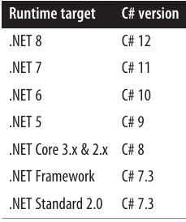

<div dir="rtl">

# فصل پنجم: مرور کلی .NET 🌐

تقریباً تمام قابلیت‌های **رَتایم .NET 8** از طریق یک مجموعه گسترده از **نوع‌های مدیریت‌شده (managed types)** در دسترس هستند. این نوع‌ها در **namespace**های سلسله‌مراتبی سازمان‌دهی شده و در مجموعه‌ای از **assembly**ها بسته‌بندی شده‌اند.

برخی از نوع‌های .NET مستقیماً توسط **CLR** استفاده می‌شوند و برای محیط میزبانی مدیریت‌شده حیاتی هستند. این نوع‌ها در **assembly**ای به نام `System.Private.CoreLib.dll` (در .NET Framework با نام `mscorlib.dll`) قرار دارند و شامل موارد زیر هستند:

* نوع‌های داخلی C#
* کلاس‌های مجموعه‌ای پایه (**basic collection classes**)
* نوع‌ها برای پردازش جریان‌ها (**stream processing**)
* سریال‌سازی (**serialization**)
* انعکاس (**reflection**)
* **Threading**
* تعامل با کد بومی (**native interoperability**)

در سطح بالاتر، نوع‌های اضافی وجود دارند که عملکرد سطح CLR را گسترش می‌دهند و ویژگی‌هایی مانند:

* XML
* JSON
* شبکه (**networking**)
* **Language-Integrated Query (LINQ)**

این مجموعه‌ها **Base Class Library (BCL)** را تشکیل می‌دهند.
در بالای این لایه، **لایه‌های برنامه (application layers)** قرار دارند که **API**هایی برای توسعه انواع خاص برنامه‌ها، مانند برنامه‌های وب یا **rich client** ارائه می‌کنند.

در این فصل، ما موارد زیر را ارائه می‌کنیم:

* مروری بر **BCL** (که در ادامه کتاب به تفصیل پوشش داده می‌شود)
* خلاصه‌ای سطح بالا از **لایه‌های برنامه**

### چه چیزهای جدیدی در .NET 7 و .NET 8 آمده است 🚀

کتابخانه‌های پایه (**Base Class Libraries**) در **.NET 7** و **.NET 8** شامل ویژگی‌های جدید و بهبودهای عملکرد فراوانی هستند. به‌ویژه:

* **فرمت بایگانی Tar**، که در سیستم‌های Unix محبوب است، اکنون از طریق نوع‌های موجود در **namespace جدید `System.Formats.Tar`** پشتیبانی می‌شود (به بخش «کار با فایل‌های Tar» در صفحه ۷۲۲ مراجعه کنید). همچنین کلاس **ZipFile** ارتقاء یافته تا بتوان پوشه‌های فایل را مستقیماً به یا از یک جریان (**stream**) زیپ کرد. 📦

* کلاس **Stream** اکنون متدهای **ReadExactly** و **ReadAtLeast** را ارائه می‌دهد تا خواندن از جریان‌ها ساده‌تر شود (به بخش «خواندن و نوشتن» در صفحه ۶۹۷ مراجعه کنید).

* پشتیبانی از **مجوزهای فایل Unix** اضافه شده است (به بخش «امنیت فایل Unix» در صفحه ۷۲۷ مراجعه کنید). 🔐

* پشتیبانی از **Span<T>** و **ReadOnlySpan<T>** گسترش یافته است. به‌ویژه، نوع‌های عددی و سایر نوع‌های ساده اکنون از قالب‌بندی و تجزیه **UTF-8** مستقیماً به **Span<byte>** پشتیبانی می‌کنند از طریق رابط‌های جدید **IUtf8SpanFormattable** و **IUtf8SpanParsable<TSelf>**، و کلاس **MemoryExtensions** شامل متدهای توسعه‌ای اضافی برای جستجوی مقادیر در **spans** است (به بخش «جستجو در Spans» در صفحه ۹۷۷ مراجعه کنید). 🔍

* کلاس **Random** اکنون متد **GetItems** برای انتخاب تصادفی آیتم‌ها از یک مجموعه و متد **Shuffle** برای مرتب‌سازی تصادفی آیتم‌ها دارد (به بخش «Random» در صفحه ۳۳۸ مراجعه کنید). 🎲

* نوع‌های تاریخ و زمان در .NET اکنون دارای ویژگی‌های **Microsecond** و **Nanosecond** هستند. ⏱️

* کلاس **JsonNode** متدهای جدیدی دارد، از جمله **GetValueKind**، **DeepEquals**، **DeepClone** و **ReplaceWith** (به بخش «JsonNode» در صفحه ۵۷۵ مراجعه کنید). 🟢

* دو نوع مجموعه فقط‌خواندنی جدید معرفی شده‌اند: **FrozenDictionary\<K,V>** و **FrozenSet<T>**. این‌ها مشابه نوع‌های موجود **ImmutableDictionary\<K,V>** و **ImmutableHashSet<T>** هستند اما به‌طور ویژه برای خواندن بهینه شده‌اند و متدهایی برای تغییر غیرمخرب ندارند (به بخش «Frozen Collections» در صفحه ۴۱۰ مراجعه کنید). ❄️

* **RegEx** اکنون از **RegexOptions.NonBacktracking** پشتیبانی می‌کند تا از حملات **denial-of-service** با عبارات ارائه‌شده توسط کاربر جلوگیری شود (به بخش «RegexOptions» در صفحه ۱۰۱۳ مراجعه کنید). موتور عبارات منظم نیز اکنون سریع‌تر است. ⚡

* نوع‌های مربوط به **SHA-3 hashing** اکنون در دسترس هستند، مشروط به پشتیبانی سیستم‌عامل (به بخش «الگوریتم‌های Hash در .NET» در صفحه ۸۷۸ مراجعه کنید). 🔑

همچنین موتور **JSON serialization** بهبود یافته است و ویژگی‌های جدید و عملکرد بهتر ارائه می‌دهد. 🟦
### اهداف Runtime و TFMs ⚙️

در یک فایل پروژه، عنصر `<TargetFramework>` تعیین می‌کند پروژه برای کدام **runtime** ساخته می‌شود (هدف فریمورک یا runtime target) و با یک **Target Framework Moniker (TFM)** مشخص می‌گردد. مقادیر معتبر شامل موارد زیر هستند:

* `net8.0`، `net7.0`، `net6.0`، `net5.0` (برای نسخه‌های .NET 8، 7، 6 و 5)
* `netcoreapp3.1` (برای .NET Core 3.1)
* `net48` (برای .NET Framework 4.8)
* `netstandard2.0` (که در بخش بعدی توضیح داده می‌شود)

برای مثال، این‌گونه پروژه شما روی **.NET 8** هدف‌گذاری می‌شود:
</div>

```xml
<PropertyGroup>
  <TargetFramework>net8.0</TargetFramework>
</PropertyGroup>
```

<div dir="rtl">

می‌توانید چند runtime را با استفاده از عنصر `<TargetFrameworks>` (جمع) هدف‌گذاری کنید، به‌طوری که هر TFM با **سمیکولن (;)** از دیگری جدا شود:
</div>

```xml
<TargetFrameworks>net8.0;net48</TargetFrameworks>
```

<div dir="rtl">

وقتی چند هدف تعیین می‌کنید (**multitargeting**)، کامپایلر برای هر هدف، یک **assembly خروجی جداگانه** تولید می‌کند.

هدف runtime در **assembly خروجی** با استفاده از **ویژگی TargetFramework** رمزگذاری می‌شود. یک assembly می‌تواند روی یک runtime جدیدتر (اما نه قدیمی‌تر) از هدفش اجرا شود.

---

### .NET Standard 📚

کتابخانه‌های عمومی موجود در NuGet اگر فقط از **.NET 8** پشتیبانی کنند، چندان ارزشمند نخواهند بود. هنگام نوشتن یک کتابخانه، معمولاً می‌خواهید از چندین پلتفرم و نسخه runtime پشتیبانی کنید. برای رسیدن به این هدف بدون ایجاد یک build جداگانه برای هر runtime (**multitargeting**)، باید کمینه مشترک (**lowest common denominator**) را هدف قرار دهید.

اگر فقط بخواهید از پیش‌روهای مستقیم .NET 8 پشتیبانی کنید، این کار نسبتاً ساده است: به‌عنوان مثال، اگر پروژه شما هدفش **.NET 6 (net6.0)** باشد، کتابخانه شما روی **.NET 6، .NET 7 و .NET 8** اجرا خواهد شد.

وضعیت پیچیده‌تر می‌شود اگر بخواهید از **.NET Framework** یا runtimeهای قدیمی‌تر مانند **Xamarin** هم پشتیبانی کنید. دلیل این است که هر یک از این runtimeها یک **CLR** و **BCL** با ویژگی‌های همپوشان دارند—هیچ runtime‌ای یک زیرمجموعه کامل از دیگری نیست.

**.NET Standard** این مشکل را با تعریف زیرمجموعه‌های مصنوعی که در محدوده وسیعی از runtimeها کار می‌کنند، حل می‌کند. با هدف‌گیری .NET Standard، می‌توانید کتابخانه‌هایی با پوشش گسترده بنویسید.

> ⚠️ .NET Standard یک runtime نیست؛ بلکه صرفاً یک **مشخصه** است که حداقل مجموعه‌ای از قابلیت‌ها (types و members) را تعریف می‌کند تا تضمین شود کتابخانه با مجموعه‌ای مشخص از runtimeها سازگار باشد. این مفهوم شبیه **interfaces در C#** است: .NET Standard مانند یک interface است که runtimeهای واقعی می‌توانند آن را پیاده‌سازی کنند.

---

### .NET Standard 2.0 ✨

مفیدترین نسخه، **.NET Standard 2.0** است. یک کتابخانه که **.NET Standard 2.0** را هدف قرار می‌دهد، بدون نیاز به تغییر روی هر دو **.NET مدرن** (.NET 8/7/6/5 تا .NET Core 2) و **.NET Framework (4.6.1+)** اجرا می‌شود.

همچنین از **UWP قدیمی (نسخه 10.0.16299+)** و **Mono 5.4+** (CLR/BCL مورد استفاده نسخه‌های قدیمی Xamarin) پشتیبانی می‌کند.

برای هدف‌گیری **.NET Standard 2.0** کافی است این مورد را به فایل `.csproj` اضافه کنید:
</div>

```xml
<PropertyGroup>
  <TargetFramework>netstandard2.0</TargetFramework>
</PropertyGroup>
```

<div dir="rtl">

اکثر APIهایی که در این کتاب توضیح داده شده‌اند توسط **.NET Standard 2.0** پشتیبانی می‌شوند و آن‌هایی که پشتیبانی نمی‌شوند، اغلب به‌صورت **NuGet packages** قابل دسترسی هستند.

---

### دیگر نسخه‌های .NET Standard

* **.NET Standard 2.1** یک سوپرسِت از 2.0 است که فقط از پلتفرم‌های زیر پشتیبانی می‌کند:

  * .NET Core 3+
  * Mono 6.4+

* **.NET Standard 2.1** توسط هیچ نسخه‌ای از **.NET Framework** پشتیبانی نمی‌شود، بنابراین کاربرد کمتری نسبت به 2.0 دارد.

* نسخه‌های قدیمی‌تر مانند 1.1، 1.2، 1.3 و 1.6 وجود دارند که با runtimeهای باستانی مانند **.NET Core 1.0** یا **.NET Framework 4.5** سازگارند. نسخه‌های 1.x هزاران API موجود در 2.0 را ندارند و عملاً منسوخ شده‌اند.

---

### سازگاری .NET Framework و .NET 8 🔄

به دلیل عمر طولانی **.NET Framework**، گاهی پیش می‌آید که کتابخانه‌هایی فقط برای .NET Framework موجود باشند (بدون معادل .NET Standard، .NET Core یا .NET 8).

برای حل این مشکل، پروژه‌های **.NET 5+** و **.NET Core** می‌توانند به **assemblies** از .NET Framework ارجاع دهند، با رعایت نکات زیر:

* اگر assembly مربوط به .NET Framework از API غیرپشتیبانی شده‌ای استفاده کند، یک استثنا (**exception**) رخ می‌دهد.
* وابستگی‌های غیرساده ممکن است موفق به حل نشوند و اغلب شکست می‌خورند.

در عمل، این روش بیشتر برای موارد ساده مانند یک assembly که یک DLL unmanaged را بسته‌بندی می‌کند، کارآمد است.

---

### Reference Assemblies 📝

وقتی هدف شما **.NET Standard** است، پروژه به‌طور ضمنی به assembly‌ای به نام **netstandard.dll** ارجاع می‌دهد که شامل تمام **types** و **members** مجاز برای نسخه انتخابی .NET Standard شماست.

این یک **reference assembly** نامیده می‌شود، زیرا فقط برای کامپایلر وجود دارد و هیچ کد اجرایی ندارد.

در زمان اجرا (**runtime**)، **assemblies واقعی** از طریق ویژگی‌های **assembly redirection** مشخص می‌شوند (انتخاب assemblyها به runtime و پلتفرمی بستگی دارد که assembly در نهایت روی آن اجرا می‌شود).

به‌طور جالب، وقتی هدف شما **.NET 8** باشد نیز مشابه این اتفاق رخ می‌دهد. پروژه به‌طور ضمنی به مجموعه‌ای از **reference assemblies** ارجاع می‌دهد که نوع‌های آن‌ها منعکس‌کننده نوع‌های موجود در **runtime assemblies** نسخه .NET انتخابی است. این امر به مدیریت نسخه‌ها، سازگاری بین پلتفرم‌ها و امکان هدف‌گیری نسخه‌ای متفاوت از نسخه نصب‌شده روی دستگاه کمک می‌کند.
### نسخه‌های Runtime و زبان C# 🖥️📝

به‌طور پیش‌فرض، **هدف runtime پروژه** تعیین می‌کند که از کدام **نسخه زبان C#** استفاده شود:
<div align="center">
    
 
</div>

این به این دلیل است که نسخه‌های جدیدتر C# شامل ویژگی‌هایی هستند که وابسته به **نوع‌هایی** هستند که در runtimeهای جدیدتر معرفی شده‌اند.
شما می‌توانید **نسخه زبان** را در فایل پروژه با عنصر `<LangVersion>` بازنویسی کنید. استفاده از یک runtime قدیمی‌تر (مانند .NET Framework) با نسخه زبان جدیدتر (مانند C# 12) به این معنی است که ویژگی‌های زبان که وابسته به نوع‌های جدید .NET هستند، کار نخواهند کرد (اگرچه در برخی موارد می‌توانید این نوع‌ها را خودتان تعریف کنید یا از یک بسته NuGet وارد کنید).

---

### CLR و BCL ⚙️📚

> توجه برای فهرست‌بندی: لطفاً همه بخش‌های این قسمت را نادیده بگیرید (به جز عنوان سطح ۱). جزئیات این بخش در ادامه کتاب پوشش داده می‌شود.

---

### نوع‌های System 🧩

مهم‌ترین نوع‌ها مستقیماً در فضای نام **System** قرار دارند. این نوع‌ها شامل موارد زیر هستند:

* نوع‌های **built-in** زبان C#
* کلاس پایه **Exception**
* کلاس‌های پایه **Enum، Array، Delegate**
* نوع‌های **Nullable، Type، DateTime، TimeSpan، Guid**

فضای نام System همچنین شامل نوع‌هایی برای انجام عملیات ریاضی (**Math**)، تولید اعداد تصادفی (**Random**) و تبدیل بین انواع مختلف (**Convert** و **BitConverter**) است.
فصل ۶ این نوع‌ها و رابط‌هایی که پروتکل‌های استاندارد در سراسر .NET را تعریف می‌کنند (مانند **IFormattable** برای فرمت‌بندی و **IComparable** برای مقایسه ترتیب) پوشش می‌دهد.

فضای نام System همچنین **رابط IDisposable** و کلاس **GC** برای تعامل با Garbage Collector را تعریف می‌کند که در فصل ۱۲ بررسی می‌شوند.

---

### پردازش متن ✍️

فضای نام **System.Text** شامل کلاس **StringBuilder** (نسخه قابل تغییر یا mutable رشته‌ها) و نوع‌هایی برای کار با **کدگذاری‌های متنی** مانند UTF-8 (**Encoding** و زیرنوع‌های آن) است. این مبحث در فصل ۶ پوشش داده می‌شود.

فضای نام **System.Text.RegularExpressions** شامل نوع‌هایی برای انجام عملیات **جستجو و جایگزینی پیشرفته بر اساس الگو** است؛ این‌ها در فصل ۲۵ توضیح داده شده‌اند.

---

### مجموعه‌ها 📦

.NET انواع مختلفی از کلاس‌ها برای مدیریت مجموعه‌ها ارائه می‌دهد. این مجموعه‌ها شامل ساختارهای **لیستی** و **دیکشنری‌محور** هستند و با مجموعه‌ای از رابط‌های استاندارد که ویژگی‌های مشترکشان را یکپارچه می‌کند، کار می‌کنند. همه نوع‌های مجموعه در فضای نام‌های زیر تعریف شده‌اند که در فصل ۷ پوشش داده شده‌اند:

* **System.Collections**: مجموعه‌های غیر generic
* **System.Collections.Generic**: مجموعه‌های generic
* **System.Collections.Frozen**: مجموعه‌های فقط‌خواندنی با عملکرد بالا
* **System.Collections.Immutable**: مجموعه‌های فقط‌خواندنی عمومی
* **System.Collections.Specialized**: مجموعه‌های با نوع قوی
* **System.Collections.ObjectModel**: پایه‌هایی برای ساخت مجموعه‌های خودتان
* **System.Collections.Concurrent**: مجموعه‌های **thread-safe** (فصل ۲۲)

---

### پرس‌وجو (Querying) 🔍

**Language-Integrated Query (LINQ)** اجازه می‌دهد پرس‌وجوهای نوع-ایمن روی مجموعه‌های محلی و دوردست (مثلاً جداول SQL Server) انجام دهید. این مبحث در فصل‌های ۸، ۹ و ۱۰ توضیح داده شده است.
یکی از مزایای بزرگ LINQ ارائه یک API **یکسان برای پرس‌وجو** در حوزه‌های مختلف است. نوع‌های اصلی در فضای نام‌های زیر قرار دارند:

* **System.Linq**: LINQ to Objects و PLINQ
* **System.Linq.Expressions**: برای ساخت دستی Expressions
* **System.Xml.Linq**: LINQ to XML

---

### XML و JSON 🌐

XML و JSON به طور گسترده در .NET پشتیبانی می‌شوند.

* **فصل ۱۰**: تمرکز کامل روی LINQ to XML (یک DOM سبک برای XML که از طریق LINQ ساخته و پرس‌وجو می‌شود)
* **فصل ۱۱**: کلاس‌های سطح پایین برای خواندن/نوشتن XML با کارایی بالا، schema و stylesheet، و نوع‌هایی برای کار با JSON:

فضاهای نام:

* **System.Xml**: XmlReader، XmlWriter
* **System.Xml.Linq**: DOM LINQ to XML
* **System.Xml.Schema**: پشتیبانی XSD
* **System.Xml.Serialization**: سریال‌سازی XML اعلامی برای نوع‌های .NET
* **System.Xml.XPath**: زبان پرس‌وجوی XPath
* **System.Xml.Xsl**: پشتیبانی از Stylesheet
* **System.Text.Json**: خواندن/نوشتن JSON و DOM
* **System.Text.Json.Nodes**: API JsonNode (DOM)

در **مکمل آنلاین** در [albahari.com/nutshell](http://www.albahari.com/nutshell)، موتور **سریال‌سازی JSON** با ویژگی‌ها و عملکرد بهتر پوشش داده شده است.
### Diagnostics 📝

در فصل ۱۳، **ثبت رخدادها (Logging)** و **Assertion** پوشش داده می‌شوند و توضیح داده می‌شود چگونه با فرآیندهای دیگر تعامل داشته باشید، در **Windows Event Log** بنویسید و مانیتورینگ عملکرد را مدیریت کنید. نوع‌های مرتبط در فضای نام **System.Diagnostics** و زیرمجموعه‌های آن تعریف شده‌اند.

---

### Concurrency و Asynchrony ⏳

بسیاری از برنامه‌های مدرن نیاز دارند تا بیش از یک کار به‌صورت همزمان انجام شود. از C# 5.0 به بعد، این کار از طریق **توابع ناهمگام (asynchronous)** و سازه‌های سطح بالا مانند **Taskها** و **Task Combinators** ساده‌تر شده است. فصل ۱۴ همه این موارد را به‌طور مفصل توضیح می‌دهد، پس از شروع با اصول **Multithreading**.
نوع‌های مرتبط با کار با **Threadها** و عملیات ناهمگام در فضای نام‌های **System.Threading** و **System.Threading.Tasks** قرار دارند.

---

### Streams و Input/Output 💾

.NET یک مدل مبتنی بر **Stream** برای **I/O سطح پایین** ارائه می‌دهد. Streamها معمولاً برای خواندن و نوشتن مستقیم روی فایل‌ها و ارتباطات شبکه استفاده می‌شوند و می‌توان آن‌ها را **زنجیره‌ای یا به صورت Decorator** برای افزودن قابلیت‌های فشرده‌سازی یا رمزگذاری استفاده کرد.
فصل ۱۵ معماری Stream و پشتیبانی خاص برای کار با فایل‌ها و دایرکتوری‌ها، فشرده‌سازی، Pipeها و Memory-mapped Files را توضیح می‌دهد. نوع‌های **Stream** و **I/O** در فضای نام **System.IO** و زیرمجموعه‌های آن تعریف شده‌اند.

---

### Networking 🌐

شما می‌توانید به اکثر پروتکل‌های استاندارد شبکه مانند **HTTP، TCP/IP، و SMTP** از طریق نوع‌های فضای نام **System.Net** دسترسی داشته باشید. در فصل ۱۶، نشان داده می‌شود چگونه از هر یک از این پروتکل‌ها استفاده کنید، از کارهای ساده مانند دانلود از یک وب‌سایت گرفته تا استفاده مستقیم از TCP/IP برای دریافت ایمیل POP3.
فضاهای نام پوشش داده شده:

* **System.Net**
* **System.Net.Http** → HttpClient
* **System.Net.Mail** → ارسال ایمیل با SMTP
* **System.Net.Sockets** → TCP، UDP و IP

---

### Assemblies، Reflection و Attributes 🔎

**Assemblyها** که برنامه‌های C# در آن‌ها کامپایل می‌شوند شامل **دستورات اجرایی (IL)** و **متادیتا** هستند که نوع‌ها، اعضا و Attributes برنامه را توصیف می‌کند. از طریق **Reflection** می‌توان این متادیتا را در زمان اجرا بررسی کرده و روش‌هایی مانند **فراخوانی داینامیک متدها** را انجام داد. با **Reflection.Emit** می‌توان کد جدید را به‌صورت پویا ساخت.

در فصل ۱۷، ترکیب Assemblyها و نحوه **لود کردن و جداسازی داینامیک** آن‌ها توضیح داده شده است. در فصل ۱۸، Reflection و Attributes بررسی می‌شوند—چگونگی بررسی متادیتا، فراخوانی داینامیک توابع، نوشتن Attributes سفارشی، Emit نوع‌های جدید و تحلیل IL خام.
نوع‌های مرتبط در فضاهای نام زیر قرار دارند:

* **System**
* **System.Reflection**
* **System.Reflection.Emit**

---

### Dynamic Programming 🌀

در فصل ۱۹، برخی الگوها برای **برنامه‌نویسی داینامیک** و استفاده از **Dynamic Language Runtime (DLR)** بررسی می‌شوند. توضیح داده می‌شود چگونه **Visitor Pattern** پیاده‌سازی شود، اشیای داینامیک سفارشی نوشته شوند و با **IronPython** تعامل داشته باشیم. نوع‌های مرتبط در فضای نام **System.Dynamic** قرار دارند.

---

### Cryptography 🔐

.NET پشتیبانی گسترده‌ای برای **الگوریتم‌های Hashing و رمزگذاری** ارائه می‌دهد. فصل ۲۰ شامل موضوعاتی مانند **Hashing، رمزگذاری متقارن و کلید عمومی، و Windows Data Protection API** است. نوع‌های مرتبط در:

* **System.Security**
* **System.Security.Cryptography**

---

### Advanced Threading 🧵

توابع ناهمگام C# برنامه‌نویسی همزمان را بسیار آسان‌تر می‌کنند، زیرا نیاز به تکنیک‌های سطح پایین را کاهش می‌دهند. با این حال، هنوز مواقعی وجود دارد که به **Signaling Constructs، Thread-local Storage، Reader/Writer Locks** و غیره نیاز است. فصل ۲۱ این موارد را به‌طور عمیق توضیح می‌دهد. نوع‌های Threading در **System.Threading** قرار دارند.

---

### Parallel Programming ⚡

در فصل ۲۲، کتابخانه‌ها و نوع‌های مربوط به بهره‌گیری از **پردازنده‌های چند هسته‌ای** بررسی می‌شوند، شامل **Task Parallelism، Imperative Data Parallelism، و Functional Parallelism (PLINQ)**.

---

### Span<T> و Memory<T> 🧩

برای کمک به **بهینه‌سازی عملکرد در نقاط حساس حافظه (micro-optimizing hotspots)**، CLR چند نوع ارائه می‌دهد که به شما کمک می‌کنند برنامه‌ای بنویسید که **بار روی Memory Manager را کاهش دهد**. دو نوع کلیدی **Span<T>** و **Memory<T>** هستند که در فصل ۲۳ توضیح داده می‌شوند.
### Native و COM Interoperability 🖥️

شما می‌توانید با هر دو نوع کد **Native** و **Component Object Model (COM)** تعامل داشته باشید.

* **Native Interoperability** به شما اجازه می‌دهد تا **توابع موجود در DLLهای unmanaged** را فراخوانی کنید، **Callbackها را ثبت کنید، ساختارهای داده را نگاشت (map) کنید** و با **نوع‌های داده بومی** تعامل داشته باشید.
* **COM Interoperability** اجازه می‌دهد **نوع‌های COM** را فراخوانی کنید (روی ماشین‌های ویندوز) و نوع‌های .NET را برای COM در دسترس قرار دهید.
  نوع‌هایی که این عملکردها را پشتیبانی می‌کنند در فضای نام **System.Runtime.InteropServices** قرار دارند و در فصل ۲۴ بررسی می‌شوند.

---

### Regular Expressions 🔍

در فصل ۲۵، توضیح داده می‌شود چگونه می‌توان از **Regular Expressions** برای **مطابقت الگوهای کاراکتری در رشته‌ها** استفاده کرد.

---

### Serialization 💾

.NET چندین سیستم برای **ذخیره و بازیابی اشیاء** به صورت **باینری یا متنی** ارائه می‌دهد. این سیستم‌ها می‌توانند برای **ارتباط بین برنامه‌ها** و همچنین **ذخیره و بازیابی اشیاء روی فایل** استفاده شوند.
در **مکمل آنلاین** در [این لینک](http://www.albahari.com/nutshell) تمام چهار موتور Serialization پوشش داده شده‌اند:

* **Binary Serializer**
* **JSON Serializer** (نسخه به‌روز شده)
* **XML Serializer**
* **Data Contract Serializer**

---

### Roslyn Compiler ⚙️

کامپایلر C# خودش در **C# نوشته شده است**—پروژه آن به نام **Roslyn** شناخته می‌شود و کتابخانه‌های آن به صورت **NuGet Packages** در دسترس هستند.
با این کتابخانه‌ها، می‌توان از عملکرد کامپایلر به روش‌های مختلفی استفاده کرد، نه تنها برای کامپایل سورس کد به Assembly، بلکه برای **نوشتن ابزارهای تحلیل کد و Refactoring** نیز.
Roslyn در **مکمل آنلاین** در [این لینک](http://www.albahari.com/nutshell) پوشش داده شده است.

---

### Application Layers 🏗️

برنامه‌های مبتنی بر **UI** می‌توانند به دو دسته تقسیم شوند:

* **Thin Client** → معمولاً یک وب‌سایت
* **Rich Client** → برنامه‌ای که کاربر باید دانلود و روی کامپیوتر یا دستگاه موبایل نصب کند

#### Thin-Client با C\#

برای نوشتن برنامه‌های **Thin Client** در C#، از **ASP.NET Core** استفاده می‌کنیم که روی **Windows، Linux و macOS** اجرا می‌شود. ASP.NET Core همچنین برای نوشتن **Web API** طراحی شده است.

#### Rich-Client

برای برنامه‌های Rich Client، انتخاب‌های مختلفی وجود دارد:

* **Windows Desktop Layer** → شامل WPF و Windows Forms، اجرا روی Windows 7/8/10/11 دسکتاپ
* **WinUI 3 (Windows App SDK)** → جانشین UWP، اجرا فقط روی Windows 10+ دسکتاپ
* **UWP** → نوشتن اپلیکیشن‌های Windows Store برای Windows 10+ دسکتاپ و دستگاه‌هایی مانند Xbox یا HoloLens
* **MAUI (سابقاً Xamarin)** → اجرا روی iOS و Android، و همچنین امکان نوشتن برنامه‌های Cross-Platform دسکتاپ برای macOS (via Catalyst) و Windows (via Windows App SDK)
* کتابخانه‌های UI Cross-Platform شخص ثالث مانند **Avalonia** که برخلاف MAUI روی Linux نیز اجرا می‌شود و برای دسکتاپ به Catalyst/WinUI وابسته نیست، توسعه و دیباگ را ساده‌تر می‌کند.

---

### ASP.NET Core 🌐

**ASP.NET Core** جانشین سبک و مدولار ASP.NET است و مناسب برای ساخت **وب‌سایت‌ها، Web APIهای مبتنی بر REST و Microservices** می‌باشد. همچنین می‌تواند با دو فریم‌ورک محبوب **Single-Page Application** یعنی **React و Angular** ترکیب شود.

ویژگی‌ها:

* پشتیبانی از **Model-View-Controller (MVC)**
* پشتیبانی از **Blazor** → اجرای کد Client-side با C# به جای JavaScript

ASP.NET Core روی **Windows، Linux و macOS** اجرا می‌شود و می‌تواند به‌صورت Self-host در یک Process دلخواه اجرا شود. برخلاف ASP.NET قدیمی در .NET Framework، ASP.NET Core به **System.Web** و Legacy Web Forms وابسته نیست.

مزایای Thin-Client نسبت به Rich Client:

* **نیاز به نصب روی کلاینت صفر است**
* **کلاینت می‌تواند روی هر پلتفرمی که مرورگر وب دارد اجرا شود**
* **به‌روزرسانی‌ها به راحتی منتشر می‌شوند**

---

### Windows Desktop 🖥️

لایه Windows Desktop دو API UI برای نوشتن برنامه‌های **Rich Client** ارائه می‌دهد:

* **WPF**
* **Windows Forms**
  هر دو روی Windows Desktop/Server از نسخه 7 تا 11 اجرا می‌شوند.
### WPF 🎨

**WPF** در سال ۲۰۰۶ معرفی شد و از آن زمان به‌طور مداوم بهبود یافته است. برخلاف **Windows Forms**، WPF کنترل‌ها را **به‌صورت صریح با DirectX رندر می‌کند** که مزایای زیر را دارد:

* پشتیبانی از گرافیک پیشرفته، مانند **تبدیل‌های دلخواه، رندر سه‌بعدی، مالتی‌مدیا، و شفافیت واقعی**. امکان Skinning از طریق **Styles و Templates** فراهم است.
* واحد اندازه‌گیری اصلی **پیکسل نیست**، بنابراین برنامه‌ها در هر تنظیمات DPI به‌درستی نمایش داده می‌شوند.
* پشتیبانی گسترده و انعطاف‌پذیر از **Layout**، که امکان **Localization** بدون خطر هم‌پوشانی عناصر را فراهم می‌کند.
* استفاده از DirectX باعث **رندر سریع** و بهره‌گیری از **شتاب سخت‌افزاری گرافیک** می‌شود.
* **Data Binding** قابل اعتماد ارائه می‌دهد.
* رابط‌های کاربری را می‌توان به‌صورت **Declarative در فایل‌های XAML** توصیف کرد، که از فایل‌های "Code-Behind" مستقل هستند و ظاهر را از عملکرد جدا می‌کند.

یادگیری WPF به دلیل **اندازه و پیچیدگی** آن زمان‌بر است. نوع‌های لازم برای نوشتن برنامه‌های WPF در **System.Windows namespace** و زیرمجموعه‌های آن به جز **System.Windows.Forms** قرار دارند.

---

### Windows Forms 🖥️

**Windows Forms** یک API Rich Client است که با اولین نسخه .NET Framework در سال ۲۰۰۰ منتشر شد. نسبت به WPF، Windows Forms فناوری ساده‌تری است که اکثر ویژگی‌های مورد نیاز برای نوشتن یک برنامه معمولی Windows را ارائه می‌دهد و همچنان در **نگهداری برنامه‌های Legacy** کاربرد دارد.

اما در مقایسه با WPF، محدودیت‌های زیادی دارد که بیشتر ناشی از **Wrapper بودن روی GDI+ و کتابخانه کنترل‌های Win32** است:

* اگرچه مکانیزم‌هایی برای **DPI-awareness** فراهم شده، هنوز نوشتن برنامه‌هایی که روی مشتریان با DPI متفاوت شکسته نشود دشوار است.
* API رسم کنترل‌های غیر استاندارد **GDI+** است که با وجود انعطاف‌پذیری، در رندر مناطق بزرگ کند است (و بدون Double Buffering ممکن است Flicker ایجاد کند).
* کنترل‌ها شفافیت واقعی ندارند.
* اکثر کنترل‌ها **Non-compositional** هستند، یعنی نمی‌توانید یک کنترل تصویر را داخل هدر Tab Control قرار دهید. سفارشی‌سازی ListView، ComboBox و Tab Control که با WPF ساده است، در Windows Forms **زمان‌بر و پیچیده** است.
* اجرای Layout دینامیک به‌درستی دشوار است.

مزیت مثبت Windows Forms این است که **نسبتاً ساده است و یادگیری آن آسان است** و هنوز تعداد مناسبی کنترل شخص ثالث دارد.
نوع‌های Windows Forms در **System.Windows.Forms (در System.Windows.Forms.dll)** و **System.Drawing (در System.Drawing.dll)** قرار دارند. فضای نام دوم همچنین شامل نوع‌های GDI+ برای رسم کنترل‌های سفارشی است.

---

### UWP و WinUI 3 📱

**UWP** یک API Rich Client برای نوشتن UIهای **Touch-First** است که روی Windows 10+ و دستگاه‌ها اجرا می‌شود. واژه "Universal" به توانایی اجرای آن روی **دستگاه‌های مختلف Windows 10** مانند Xbox، Surface Hub، HoloLens و Windows Phone اشاره دارد.

UWP از **XAML** استفاده می‌کند و شباهت‌هایی با WPF دارد، اما تفاوت‌های کلیدی آن عبارتند از:

* حالت اصلی انتشار برنامه‌ها **Windows Store** است.
* برنامه‌های UWP در یک **Sandbox** اجرا می‌شوند، بنابراین نمی‌توانند فایل‌ها را به‌طور دلخواه بخوانند یا بنویسند و با دسترسی ادمین اجرا شوند.
* UWP از نوع‌های **WinRT** استفاده می‌کند که بخشی از سیستم عامل هستند، نه Runtime مدیریت‌شده. بنابراین هنگام نوشتن برنامه‌ها، باید **محدوده نسخه Windows** مشخص شود، مثلاً از Build 17763 تا 18362.

به دلیل این محدودیت‌ها، UWP نتوانست به محبوبیت WPF و Windows Forms برسد. برای حل این مشکل، مایکروسافت UWP را به فناوری جدیدی به نام **Windows App SDK** تبدیل کرده است، با لایه UI به نام **WinUI 3**.

ویژگی‌های Windows App SDK:

* انتقال APIهای WinRT از سیستم عامل به Runtime و ارائه یک **Interface کاملاً مدیریت‌شده**
* ادغام بهتر با **Windows Desktop APIs (Windows Forms و WPF)**
* امکان نوشتن برنامه‌هایی که خارج از Sandbox Windows Store اجرا می‌شوند
* اجرا روی آخرین نسخه .NET (به جای وابستگی به .NET Core 2.2 در UWP)

با این حال، WinUI 3 هنوز به محبوبیت گسترده APIهای کلاسیک Windows Desktop نرسیده است و Windows App SDK در زمان نگارش از **Xbox و HoloLens پشتیبانی نمی‌کند** و نیازمند دانلود جداگانه برای کاربر است.

---

### MAUI 🌐📱

**MAUI (سابقاً Xamarin)** امکان توسعه **برنامه‌های موبایل با C#** برای iOS و Android را فراهم می‌کند و همچنین می‌توان برنامه‌های Cross-Platform دسکتاپ برای **macOS و Windows** نوشت (via Catalyst و Windows App SDK).

Runtime/BCL که روی iOS و Android اجرا می‌شود **Mono** نام دارد (نسخه‌ای مشتق‌شده از Mono Runtime متن‌باز). تاریخی، Mono با .NET کاملاً سازگار نبود و کتابخانه‌هایی که روی هر دو اجرا می‌شدند، معمولاً **.NET Standard** هدف قرار می‌گرفتند. از .NET 6 به بعد، Interface عمومی Mono با .NET ادغام شد و Mono در واقع به‌عنوان یک **پیاده‌سازی از .NET** درآمد.

MAUI شامل **رابط پروژه یکپارچه، Hot Reloading، و پشتیبانی از Blazor Desktop و Hybrid Apps** است. جزئیات بیشتر در [صفحه رسمی MAUI](https://github.com/dotnet/maui) موجود است.
</div>

