<div dir="rtl">

# فصل ششم: مبانی .NET

بسیاری از امکانات اصلی که هنگام برنامه‌نویسی به آن‌ها نیاز دارید، توسط خود زبان **C#** فراهم نمی‌شوند، بلکه توسط **انواع (Types)** موجود در **BCL** یا همان **.NET Base Class Library** ارائه می‌شوند.

در این فصل، با انواعی آشنا می‌شوید که در انجام کارهای پایه‌ای برنامه‌نویسی به شما کمک می‌کنند، مانند:

* مقایسه برابری مجازی (Virtual Equality Comparison)
* مقایسه ترتیب (Order Comparison)
* تبدیل نوع (Type Conversion)

همچنین با انواع پایه‌ای **.NET** مانند **String**، **DateTime** و **Enum** نیز آشنا خواهید شد.

انواعی که در این بخش پوشش داده می‌شوند، بیشتر در فضای نام (**Namespace**) **System** قرار دارند، به جز موارد زیر:

* **StringBuilder** و انواع مربوط به **کدگذاری متن (Text Encodings)** در فضای نام **System.Text** قرار دارند.
* **CultureInfo** و انواع مرتبط با آن در **System.Globalization** قرار دارند.
* **XmlConvert** در **System.Xml** تعریف شده است.

---

### مدیریت رشته و متن 📝

#### **Char**

یک **char** در زبان **C#** نشان‌دهنده یک کاراکتر یونیکد (Unicode Character) واحد است و در واقع معادل ساختار (**struct**) **System.Char** است.

در فصل ۲ توضیح دادیم که چگونه **لیترال‌های char** را بیان کنید:
</div>

```csharp
char c = 'A';
char newLine = '\n';
```

<div dir="rtl">

ساختار **System.Char** مجموعه‌ای از متدهای **static** برای کار با کاراکترها ارائه می‌دهد، مانند **ToUpper**، **ToLower** و **IsWhiteSpace**. شما می‌توانید این متدها را هم از طریق **System.Char** و هم از طریق **char** فراخوانی کنید:
</div>

```csharp
Console.WriteLine (System.Char.ToUpper ('c'));    // C
Console.WriteLine (char.IsWhiteSpace ('\t'));     // True
```

<div dir="rtl">

متدهای **ToUpper** و **ToLower** به **محلی‌سازی (Locale)** کاربر نهایی احترام می‌گذارند و این می‌تواند گاهی منجر به بروز خطاهای ظریف شود. به عنوان مثال، عبارت زیر در کشور ترکیه مقدار **false** را برمی‌گرداند:
</div>

```csharp
char.ToUpper ('i') == 'I'
```

<div dir="rtl">

دلیل این موضوع این است که در ترکیه، نتیجه‌ی **char.ToUpper ('i')** برابر با **'İ'** است (به نقطه روی حرف توجه کنید!).

برای جلوگیری از این مشکل، **System.Char** (و همچنین **System.String**) نسخه‌های **culture-invariant** از متدهای **ToUpper** و **ToLower** را ارائه می‌دهند که با پسوند **Invariant** مشخص می‌شوند. این متدها همیشه از قوانین فرهنگ انگلیسی استفاده می‌کنند:
</div>

```csharp
Console.WriteLine (char.ToUpperInvariant ('i'));    // I
```

<div dir="rtl">

این در واقع یک میانبر برای کد زیر است:
</div>

```csharp
Console.WriteLine (char.ToUpper ('i', CultureInfo.InvariantCulture))
```

<div dir="rtl">

برای اطلاعات بیشتر درباره **locale**‌ها و فرهنگ‌ها، به بخش **Formatting and Parsing** در صفحه **317** مراجعه کنید.

بیشتر متدهای **static** دیگر در **char** مربوط به **دسته‌بندی کاراکترها** هستند. **جدول 6-1** این متدها را نشان می‌دهد.
<div align="center">
    
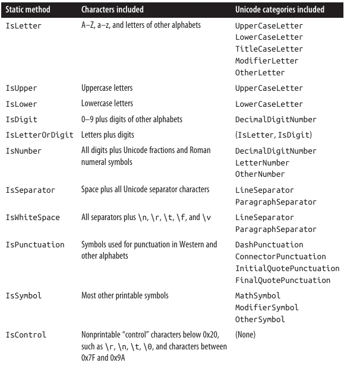 
</div>

### دسته‌بندی دقیق‌تر کاراکترها 🔠

برای دسته‌بندی دقیق‌تر، نوع **char** متدی **static** به نام **GetUnicodeCategory** ارائه می‌دهد؛ این متد یک مقدار از نوع شمارش (**Enumeration**) **UnicodeCategory** برمی‌گرداند که اعضای آن در ستون سمت راست **جدول 6-1** نشان داده شده‌اند.

با **Casting** صریح از یک عدد صحیح (**int**) می‌توان یک **char** تولید کرد که خارج از مجموعه تخصیص‌داده‌شده‌ی یونیکد باشد. برای آزمایش اعتبار یک کاراکتر، متد **char.GetUnicodeCategory** را فراخوانی کنید؛ اگر نتیجه برابر با **UnicodeCategory.OtherNotAssigned** باشد، آن کاراکتر نامعتبر است.

یک **char** دارای پهنای **16 بیت** است—به اندازه‌ای که بتواند هر کاراکتر یونیکد را در **Basic Multilingual Plane (BMP)** نمایش دهد. برای فراتر رفتن از این محدوده، باید از **Surrogate Pairs** استفاده کنید؛ روش‌های انجام این کار در بخش **“Text Encodings and Unicode”** در صفحه **301** توضیح داده شده‌اند.

---

### **String**

یک **string** در زبان **C#** (یا همان **System.String**) دنباله‌ای از کاراکترهاست که **تغییرناپذیر (Immutable)** است؛ یعنی پس از ایجاد، قابل تغییر نیست. در فصل ۲ نحوه‌ی نوشتن **لیترال‌های رشته‌ای (String Literals)**، انجام **مقایسه برابری (Equality Comparisons)** و **اتصال دو رشته (Concatenation)** را توضیح دادیم.

در این بخش، به سایر قابلیت‌های کار با رشته‌ها می‌پردازیم که از طریق اعضای **static** و **instance** کلاس **System.String** ارائه شده‌اند.

---

### ساخت رشته‌ها 🏗️

ساده‌ترین روش ساخت یک رشته، انتساب یک **لیترال** است (همان‌طور که در فصل ۲ دیدیم):
</div>

```csharp
string s1 = "Hello";
string s2 = "First Line\r\nSecond Line";
string s3 = @"\\server\fileshare\helloworld.cs";
```

<div dir="rtl">

برای ساخت یک توالی تکراری از کاراکترها، می‌توانید از **سازنده (Constructor)** رشته استفاده کنید:
</div>

```csharp
Console.Write (new string ('*', 10));      // **********
```

<div dir="rtl">

همچنین می‌توانید یک رشته را از یک **آرایه‌ی char** بسازید. متد **ToCharArray** برعکس این کار را انجام می‌دهد:
</div>

```csharp
char[] ca = "Hello".ToCharArray();
string s = new string (ca);              // s = "Hello"
```

<div dir="rtl">

سازنده‌های رشته همچنین **Overload** شده‌اند تا انواع مختلفی از **Pointer**‌های ناامن (**unsafe**) مانند **char**\* را نیز بپذیرند و رشته‌هایی از این انواع بسازند.

---

### رشته‌های تهی و خالی ⚠️

یک رشته‌ی خالی (**Empty String**) طولی برابر با صفر دارد. برای ساخت رشته‌ی خالی می‌توانید از یک **لیترال** یا فیلد **static** به نام **string.Empty** استفاده کنید. برای بررسی خالی بودن یک رشته می‌توانید از مقایسه‌ی برابری یا بررسی ویژگی **Length** استفاده کنید:
</div>

```csharp
string empty = "";
Console.WriteLine (empty == "");              // True
Console.WriteLine (empty == string.Empty);    // True
Console.WriteLine (empty.Length == 0);        // True
```

<div dir="rtl">

از آن‌جایی که رشته‌ها **Reference Type** هستند، می‌توانند مقدار **null** نیز داشته باشند:
</div>

```csharp
string nullString = null;
Console.WriteLine (nullString == null);        // True
Console.WriteLine (nullString == "");          // False
Console.WriteLine (nullString.Length == 0);    // NullReferenceException
```

<div dir="rtl">

متد **static string.IsNullOrEmpty** میانبری مفید برای بررسی این است که آیا یک رشته **null** یا **خالی** است یا خیر.

---

### دسترسی به کاراکترهای داخل یک رشته 🔍

**Indexer** رشته یک کاراکتر را در شاخص مشخص‌شده برمی‌گرداند. همانند سایر عملیات روی رشته‌ها، شاخص‌گذاری از **صفر** شروع می‌شود:
</div>

```csharp
string str  = "abcde";
char letter = str[1];        // letter == 'b'
```

<div dir="rtl">

نوع **string** رابط **IEnumerable<char>** را پیاده‌سازی می‌کند، بنابراین می‌توانید با دستور **foreach** روی کاراکترهای آن حلقه بزنید:
</div>

```csharp
foreach (char c in "123") Console.Write (c + ",");    // 1,2,3,
```

<div dir="rtl">

---

### جستجو در رشته‌ها 🔎

ساده‌ترین متدهای جستجو در رشته‌ها عبارتند از **StartsWith**، **EndsWith** و **Contains**. هر سه مقدار **true** یا **false** برمی‌گردانند:
</div>

```csharp
Console.WriteLine ("quick brown fox".EndsWith ("fox"));      // True
Console.WriteLine ("quick brown fox".Contains ("brown"));    // True
```

<div dir="rtl">

این متدها **Overload** شده‌اند تا بتوانید یک **StringComparison enum** مشخص کنید و حساسیت نسبت به **حروف کوچک و بزرگ** و **فرهنگ (Culture)** را کنترل کنید (به بخش **“Ordinal versus culture comparison”** در صفحه **297** مراجعه کنید). حالت پیش‌فرض، یک مقایسه‌ی **حساس به حروف بزرگ و کوچک** با استفاده از قوانین فرهنگ جاری (محلی‌سازی شده) است. کد زیر یک جستجوی **غیرحساس به حروف بزرگ و کوچک** را با استفاده از قوانین فرهنگ **Invariant** انجام می‌دهد:
</div>

```csharp
"abcdef".StartsWith ("aBc", StringComparison.InvariantCultureIgnoreCase)
```

<div dir="rtl">

متد **IndexOf** موقعیت اولین وقوع یک کاراکتر یا زیررشته را برمی‌گرداند (یا **−1** اگر زیررشته یافت نشود):
</div>

```csharp
Console.WriteLine ("abcde".IndexOf ("cd"));   // 2
```

<div dir="rtl">

**IndexOf** همچنین **Overload** شده تا یک **startPosition** (شاخص شروع جستجو) و همچنین یک **StringComparison enum** را بپذیرد:
</div>

```csharp
Console.WriteLine ("abcde abcde".IndexOf ("CD", 6,
                  StringComparison.CurrentCultureIgnoreCase));    // 8
```

<div dir="rtl">

متد **LastIndexOf** مشابه **IndexOf** است، با این تفاوت که از انتهای رشته به ابتدا جستجو می‌کند.

متد **IndexOfAny** اولین موقعیت یک یا چند کاراکتر مشخص را برمی‌گرداند:
</div>

```csharp
Console.Write ("ab,cd ef".IndexOfAny (new char[] {' ', ','} ));       // 2
Console.Write ("pas5w0rd".IndexOfAny ("0123456789".ToCharArray() ));  // 3
```

<div dir="rtl">

**LastIndexOfAny** نیز همین کار را انجام می‌دهد اما در جهت معکوس.

---

### دستکاری رشته‌ها ✂️

از آن‌جا که **String** تغییرناپذیر (**Immutable**) است، تمام متدهایی که رشته را «دستکاری» می‌کنند، در واقع یک رشته‌ی جدید برمی‌گردانند و رشته‌ی اصلی را بدون تغییر باقی می‌گذارند (این موضوع زمانی هم که یک متغیر رشته را دوباره مقداردهی می‌کنید صادق است).

---

#### **متد Substring** – جدا کردن بخشی از رشته
</div>

```csharp
string left3 = "12345".Substring (0, 3);     // left3 = "123";
string mid3  = "12345".Substring (1, 3);     // mid3 = "234";
```

<div dir="rtl">

اگر طول (**length**) را مشخص نکنید، باقی‌مانده‌ی رشته بازگردانده می‌شود:
</div>

```csharp
string end3  = "12345".Substring (2);        // end3 = "345";
```

<div dir="rtl">

---

#### **متدهای Insert و Remove** – درج یا حذف کاراکتر
</div>

```csharp
string s1 = "helloworld".Insert (5, ", ");    // s1 = "hello, world"
string s2 = s1.Remove (5, 2);                 // s2 = "helloworld";
```

<div dir="rtl">

---

#### **PadLeft و PadRight** – پر کردن رشته

این متدها رشته را تا طول مشخصی با کاراکتر دلخواه (یا اگر مشخص نشود، با فاصله) پر می‌کنند:
</div>

```csharp
Console.WriteLine ("12345".PadLeft (9, '*'));  // ****12345
Console.WriteLine ("12345".PadLeft (9));       //     12345
```

<div dir="rtl">

اگر طول مشخص‌شده کوتاه‌تر از طول رشته باشد، رشته‌ی اصلی بدون تغییر برگردانده می‌شود.

---

#### **TrimStart، TrimEnd و Trim** – حذف کاراکترهای اضافی

این متدها کاراکترهای مشخص‌شده را از ابتدای رشته (**TrimStart**) یا انتهای رشته (**TrimEnd**) حذف می‌کنند؛ **Trim** هر دو را انجام می‌دهد. به‌طور پیش‌فرض، این متدها فاصله‌ها و کاراکترهای خالی (**Whitespace**) مانند فاصله، تب، خطوط جدید و نسخه‌های یونیکد این‌ها را حذف می‌کنند:
</div>

```csharp
Console.WriteLine ("  abc \t\r\n ".Trim().Length);   // 3
```

<div dir="rtl">

---

#### **Replace** – جایگزینی کاراکتر یا زیررشته

این متد تمام (غیرهم‌پوشان) رخدادهای یک کاراکتر یا زیررشته را جایگزین می‌کند:
</div>

```csharp
Console.WriteLine ("to be done".Replace (" ", " | ") );  // to | be | done
Console.WriteLine ("to be done".Replace (" ", "")    );  // tobedone
```

<div dir="rtl">

---

#### **ToUpper و ToLower** – تبدیل به حروف بزرگ یا کوچک

این متدها نسخه‌ی حروف بزرگ و کوچک رشته را برمی‌گردانند. به‌طور پیش‌فرض، به **تنظیمات زبان جاری کاربر** احترام می‌گذارند؛ در حالی که **ToUpperInvariant** و **ToLowerInvariant** همیشه از قوانین حروف الفبای انگلیسی استفاده می‌کنند.

---

### تقسیم و اتصال رشته‌ها 🔗

#### **Split** – تقسیم رشته

متد **Split** یک رشته را به بخش‌هایی تقسیم می‌کند:
</div>

```csharp
string[] words = "The quick brown fox".Split();
foreach (string word in words)
    Console.Write (word + "|");    // The|quick|brown|fox|
```

<div dir="rtl">

به‌طور پیش‌فرض، **Split** از کاراکترهای فاصله به‌عنوان جداکننده استفاده می‌کند. این متد همچنین **Overload** شده تا یک آرایه‌ی **params** از **char** یا **string**‌های جداکننده بپذیرد. همچنین می‌تواند یک **StringSplitOptions enum** دریافت کند که گزینه‌ای برای حذف ورودی‌های خالی دارد؛ این قابلیت زمانی مفید است که کلمات با چندین جداکننده‌ی پشت‌سرهم از هم جدا شده باشند.

---

#### **Join و Concat** – اتصال رشته‌ها

متد **Join** عکس **Split** عمل می‌کند. این متد به یک جداکننده و یک آرایه‌ی رشته نیاز دارد:
</div>

```csharp
string[] words = "The quick brown fox".Split();
string together = string.Join (" ", words);      // The quick brown fox
```

<div dir="rtl">

متد **Concat** مشابه **Join** است اما تنها یک آرایه‌ی رشته به‌صورت **params** می‌پذیرد و جداکننده‌ای اعمال نمی‌کند. **Concat** دقیقاً معادل عملگر **+** است (در واقع کامپایلر **+** را به **Concat** تبدیل می‌کند):
</div>

```csharp
string sentence     = string.Concat ("The", " quick", " brown", " fox");
string sameSentence = "The" + " quick" + " brown" + " fox";
```

<div dir="rtl">

---

### **String.Format** و رشته‌های ترکیبی

متد **static Format** راهی راحت برای ساخت رشته‌هایی است که در آن‌ها مقادیر متغیرها گنجانده می‌شوند. این مقادیر می‌توانند از هر نوعی باشند؛ **Format** تنها متد **ToString** را روی آن‌ها صدا می‌زند.

رشته‌ای که شامل متغیرهای جاسازی‌شده است، **رشته‌ی قالب ترکیبی (Composite Format String)** نام دارد. هنگام فراخوانی **String.Format**، شما رشته‌ی قالب ترکیبی را به همراه هر یک از متغیرها ارسال می‌کنید:
</div>

```csharp
string composite = "It's {0} degrees in {1} on this {2} morning";
string s = string.Format (composite, 35, "Perth", DateTime.Now.DayOfWeek);
// s == "It's 35 degrees in Perth on this Friday morning"
```

<div dir="rtl">

(و این دما **سلسیوس** است!)

ما می‌توانیم از **رشته‌های درون‌یابی‌شده (Interpolated String Literals)** هم برای همین کار استفاده کنیم (به بخش **“String Type”** در صفحه **58** مراجعه کنید). کافی است رشته را با علامت **\$** شروع کرده و عبارات را داخل آکولاد قرار دهید:
</div>

```csharp
string s = $"It's hot this {DateTime.Now.DayOfWeek} morning";
```

<div dir="rtl">

---

هر عدد داخل آکولاد **آیتم قالب (Format Item)** نامیده می‌شود. این عدد به **موقعیت آرگومان** مربوط است و می‌تواند به‌صورت اختیاری موارد زیر را دنبال کند:

* **ویرگول و حداقل عرض (Minimum Width)**
* **دو‌نقطه و یک رشته‌ی قالب (Format String)**

حداقل عرض برای **تراز کردن ستون‌ها** مفید است. اگر مقدار **منفی** باشد، داده به‌صورت **چپ‌چین** قرار می‌گیرد؛ در غیر این صورت **راست‌چین** خواهد شد:
</div>

```csharp
string composite = "Name={0,-20} Credit Limit={1,15:C}";
Console.WriteLine (string.Format (composite, "Mary", 500));
Console.WriteLine (string.Format (composite, "Elizabeth", 20000));
```

<div dir="rtl">

نتیجه:
</div>

```
Name=Mary                 Credit Limit=        $500.00
Name=Elizabeth            Credit Limit=     $20,000.00
```

<div dir="rtl">

معادل همین بدون استفاده از **string.Format**:
</div>

```csharp
string s = "Name=" + "Mary".PadRight (20) +
           " Credit Limit=" + 500.ToString ("C").PadLeft (15);
```

<div dir="rtl">

محدودیت اعتبار (**Credit Limit**) به‌واسطه‌ی رشته‌ی قالب **"C"** به‌صورت واحد پولی فرمت شده است. جزئیات رشته‌های قالب را در بخش **“Formatting and Parsing”** در صفحه **317** شرح داده‌ایم.

---
### مقایسه‌ی رشته‌ها 🔠

هنگام مقایسه‌ی دو مقدار، ‎.NET بین دو مفهوم **مقایسه‌ی برابری (Equality Comparison)** و **مقایسه‌ی ترتیب (Order Comparison)** تفاوت قائل می‌شود.

* **مقایسه‌ی برابری** بررسی می‌کند که آیا دو نمونه از نظر معنایی یکسان هستند یا نه.
* **مقایسه‌ی ترتیب** مشخص می‌کند کدام‌یک از دو نمونه (در صورت وجود تفاوت) در هنگام مرتب‌سازی به ترتیب صعودی یا نزولی، زودتر یا دیرتر قرار می‌گیرد.

نکته‌ی مهم این است که **مقایسه‌ی برابری زیرمجموعه‌ای از مقایسه‌ی ترتیب نیست**؛ هر کدام هدف متفاوتی دارند. برای مثال، امکان دارد دو مقدار نابرابر در یک موقعیت ترتیب‌دهی مشابه قرار بگیرند. در بخش **“Equality Comparison” در صفحه‌ی 226** دوباره به این موضوع بازمی‌گردیم.

برای مقایسه‌ی برابری رشته‌ها می‌توانید از **عملگر ==** یا یکی از **متدهای Equals** در نوع رشته استفاده کنید. متدهای Equals انعطاف‌پذیرتر هستند زیرا اجازه می‌دهند گزینه‌هایی مانند **بی‌تفاوتی به حروف کوچک و بزرگ (Case Insensitivity)** را مشخص کنید.

یک تفاوت دیگر این است که **عملگر ==** روی رشته‌ها زمانی که متغیرها به نوع **object** تبدیل (Cast) شوند به‌طور قابل‌اعتماد عمل نمی‌کند. دلیل این موضوع را در **“Equality Comparison” صفحه‌ی 226** توضیح خواهیم داد.

برای مقایسه‌ی ترتیب رشته‌ها می‌توانید از **متد CompareTo** (نمونه‌ای یا Instance) یا متدهای استاتیک **Compare** و **CompareOrdinal** استفاده کنید. این متدها یک عدد مثبت، منفی یا صفر برمی‌گردانند که نشان می‌دهد مقدار اول بعد از، قبل از یا هم‌تراز مقدار دوم قرار می‌گیرد.

قبل از بررسی جزئیات هرکدام، لازم است با الگوریتم‌های مقایسه‌ی رشته‌ای ‎.NET آشنا شویم.

---

### مقایسه‌ی ترتیبی (Ordinal) در برابر مقایسه‌ی مبتنی بر فرهنگ (Culture) 🌍

دو الگوریتم اصلی برای مقایسه‌ی رشته‌ها وجود دارد:

1. **Ordinal (ترتیبی)**: کاراکترها را صرفاً به‌عنوان عدد (بر اساس مقدار عددی یونیکد آن‌ها) تفسیر می‌کند.
2. **Culture-Sensitive (حساس به فرهنگ)**: کاراکترها را با توجه به الفبای یک فرهنگ خاص تفسیر می‌کند.

دو فرهنگ خاص در ‎.NET وجود دارد:

* **Current Culture (فرهنگ فعلی)**: براساس تنظیمات زبان و منطقه‌ای که از **Control Panel** رایانه گرفته شده است.
* **Invariant Culture (فرهنگ ثابت)**: در همه‌ی رایانه‌ها یکسان است (و تقریباً معادل فرهنگ انگلیسی آمریکایی است).

برای **مقایسه‌ی برابری**، هر دو الگوریتم ترتیبی و حساس به فرهنگ کاربرد دارند.
اما برای **مرتب‌سازی** تقریباً همیشه مقایسه‌ی حساس به فرهنگ ترجیح داده می‌شود، چون برای مرتب‌سازی الفبایی به یک الفبا نیاز است. الگوریتم ترتیبی صرفاً به مقادیر یونیکد تکیه دارد، که حروف انگلیسی را به ترتیب الفبایی قرار می‌دهد، ولی دقیقاً همان‌طور که انتظار دارید نیست.

برای مثال، فرض کنید حساسیت به بزرگی و کوچکی حروف فعال است و رشته‌های زیر را داریم:

* `"Atom"`
* `"atom"`
* `"Zamia"`

فرهنگ ثابت (Invariant) آن‌ها را به این ترتیب مرتب می‌کند:
</div>

```
"atom", "Atom", "Zamia"
```

<div dir="rtl">

اما الگوریتم ترتیبی (Ordinal) نتیجه‌ی زیر را تولید می‌کند:
</div>

```
"Atom", "Zamia", "atom"
```

<div dir="rtl">

دلیل این تفاوت این است که فرهنگ ثابت حروف کوچک و بزرگ را در کنار هم قرار می‌دهد (aA bB cC ...)، ولی الگوریتم ترتیبی همه‌ی حروف بزرگ را ابتدا و سپس همه‌ی حروف کوچک را قرار می‌دهد (A...Z, a...z). این رفتار در واقع برگرفته از **مجموعه‌کاراکتر ASCII** است که در دهه‌ی 1960 ساخته شده بود.

---

### مقایسه‌ی برابری رشته‌ها ✍️

با وجود محدودیت‌های الگوریتم ترتیبی، **عملگر == در رشته‌ها همیشه از مقایسه‌ی ترتیبی حساس به بزرگی حروف استفاده می‌کند**. همین‌طور، متد نمونه‌ای **string.Equals** وقتی بدون آرگومان فراخوانی شود نیز همین رفتار پیش‌فرض را دارد.

این الگوریتم برای == و Equals انتخاب شده زیرا:

* بسیار سریع و کارآمد است.
* نتیجه‌ی قطعی و قابل پیش‌بینی دارد.
* مقایسه‌ی برابری یک عملیات بنیادی است و بسیار بیشتر از مقایسه‌ی ترتیب استفاده می‌شود.
* استفاده از == به‌طور کلی با مفهوم برابری دقیق هم‌خوانی دارد.

برای مقایسه‌های آگاه به فرهنگ یا بی‌تفاوت به بزرگی حروف، متدهای زیر وجود دارند:
</div>

```csharp
public bool Equals (string value, StringComparison comparisonType);
public static bool Equals (string a, string b, StringComparison comparisonType);
```

<div dir="rtl">

نسخه‌ی استاتیک حتی زمانی که یکی یا هر دو رشته null باشند نیز به درستی کار می‌کند.
**StringComparison** یک **Enum** است که به‌صورت زیر تعریف شده است:
</div>

```csharp
public enum StringComparison
{
    CurrentCulture,               // حساس به بزرگی حروف
    CurrentCultureIgnoreCase,
    InvariantCulture,             // حساس به بزرگی حروف
    InvariantCultureIgnoreCase,
    Ordinal,                      // حساس به بزرگی حروف
    OrdinalIgnoreCase
}
```

<div dir="rtl">

مثال‌ها:
</div>

```csharp
Console.WriteLine (string.Equals ("foo", "FOO",
                   StringComparison.OrdinalIgnoreCase));   // True

Console.WriteLine ("ṻ" == "ǖ");                            // False

Console.WriteLine (string.Equals ("ṻ", "ǖ",
                   StringComparison.CurrentCulture));      // ?
```

<div dir="rtl">

(نتیجه‌ی مثال سوم بستگی به تنظیمات زبان فعلی رایانه دارد.)

---

### مقایسه‌ی ترتیب رشته‌ها 📊

متد **CompareTo** (نمونه‌ای) روی رشته‌ها یک **مقایسه‌ی حساس به فرهنگ و حساس به بزرگی حروف** انجام می‌دهد. برخلاف عملگر ==، این متد از مقایسه‌ی ترتیبی استفاده نمی‌کند، چون برای مرتب‌سازی، مقایسه‌ی حساس به فرهنگ مفیدتر است.

تعریف متد:
</div>

```csharp
public int CompareTo (string strB);
```

<div dir="rtl">

این متد رابط **IComparable** را پیاده‌سازی می‌کند که یک پروتکل استاندارد مقایسه در کتابخانه‌های ‎.NET است. بنابراین متد CompareTo **رفتار پیش‌فرض مرتب‌سازی رشته‌ها** را در کاربردهایی مثل مجموعه‌های مرتب‌شده تعریف می‌کند.
برای اطلاعات بیشتر درباره‌ی **IComparable** به بخش **“Order Comparison” در صفحه‌ی 355** مراجعه کنید.

برای سایر انواع مقایسه، متدهای استاتیک زیر نیز وجود دارند:
</div>

```csharp
public static int Compare (string strA, string strB,
                           StringComparison comparisonType);

public static int Compare (string strA, string strB, bool ignoreCase,
                           CultureInfo culture);

public static int Compare (string strA, string strB, bool ignoreCase);

public static int CompareOrdinal (string strA, string strB);
```

<div dir="rtl">

دو متد آخر در واقع میان‌بری برای فراخوانی دو متد اول هستند.

تمام متدهای مقایسه‌ی ترتیب، عددی **مثبت**، **منفی** یا **صفر** برمی‌گردانند که نشان‌دهنده‌ی ترتیب دو مقدار است:
</div>

```csharp
Console.WriteLine ("Boston".CompareTo ("Austin"));    // 1
Console.WriteLine ("Boston".CompareTo ("Boston"));    // 0
Console.WriteLine ("Boston".CompareTo ("Chicago"));   // -1
Console.WriteLine ("ṻ".CompareTo ("ǖ"));              // 1
Console.WriteLine ("foo".CompareTo ("FOO"));          // -1
```

<div dir="rtl">

برای انجام یک مقایسه‌ی بی‌تفاوت به بزرگی حروف با فرهنگ فعلی:
</div>

```csharp
Console.WriteLine (string.Compare ("foo", "FOO", true));   // 0
```

<div dir="rtl">

با ارائه‌ی یک شیء **CultureInfo**، می‌توانید هر الفبای دلخواهی را وارد کنید:
</div>

```csharp
// CultureInfo در فضای نام System.Globalization تعریف شده است
CultureInfo german = CultureInfo.GetCultureInfo ("de-DE");
int i = string.Compare ("Müller", "Muller", false, german);
```

<div dir="rtl">

---
### 🔠 **StringBuilder (رشته‌ساز)**

کلاس **StringBuilder** در فضای نام **System.Text** نشان‌دهنده‌ی یک رشته‌ی **قابل‌تغییر (Mutable)** است. یعنی می‌توان آن را ویرایش کرد. با استفاده از **StringBuilder** می‌توانید بخش‌هایی از متن را **اضافه (Append)**، **درج (Insert)**، **حذف (Remove)** یا **جایگزین (Replace)** کنید، بدون این‌که نیاز باشد کل رشته را دوباره بسازید.

سازنده‌ی **StringBuilder** (Constructor) می‌تواند به‌صورت اختیاری یک مقدار اولیه‌ی رشته و همچنین اندازه‌ی شروع ظرفیت داخلی را دریافت کند (ظرفیت پیش‌فرض برابر با **۱۶ کاراکتر** است). اگر اندازه‌ی رشته از این ظرفیت فراتر رود، **StringBuilder** به‌صورت خودکار ساختار داخلی خود را برای جا دادن داده‌های جدید تغییر اندازه می‌دهد (با اندکی کاهش کارایی) تا زمانی که به حداکثر ظرفیت خود برسد (پیش‌فرض برابر با **int.MaxValue** است).

یکی از استفاده‌های رایج **StringBuilder**، ساخت یک رشته‌ی طولانی با اضافه‌کردن مداوم بخش‌های جدید است. این روش **بسیار سریع‌تر و بهینه‌تر** از چسباندن (Concatenate) رشته‌های معمولی است:
</div>

```csharp
StringBuilder sb = new StringBuilder();
for (int i = 0; i < 50; i++) sb.Append(i).Append(",");
Console.WriteLine(sb.ToString());
```

<div dir="rtl">

خروجی:
</div>

```
0,1,2,3,4,5,6,7,8,9,10,11,12,13,14,15,16,17,18,19,20,21,22,23,24,25,26,
27,28,29,30,31,32,33,34,35,36,37,38,39,40,41,42,43,44,45,46,47,48,49,
```

<div dir="rtl">

برای گرفتن نتیجه‌ی نهایی، از متد **ToString()** استفاده می‌کنیم.

* **AppendLine** همانند Append عمل می‌کند، با این تفاوت که در انتها یک خط جدید (`"\r\n"` در ویندوز) اضافه می‌کند.
* **AppendFormat** یک رشته‌ی قالب‌بندی شده را مشابه **String.Format** اضافه می‌کند.

علاوه بر متدهای **Insert**، **Remove** و **Replace** (که Replace مشابه Replace در کلاس string عمل می‌کند)، کلاس **StringBuilder** ویژگی‌های زیر را دارد:

* ویژگی **Length** برای گرفتن یا تنظیم طول رشته.
* یک **ایندکسر قابل‌نوشتن** برای گرفتن یا تغییر کاراکترهای جداگانه.

برای پاک‌کردن محتوای یک **StringBuilder**، می‌توانید یکی از دو روش زیر را استفاده کنید:

1. ایجاد یک نمونه‌ی جدید.
2. قرار دادن مقدار **Length** برابر با صفر.

> ⚠️ توجه: تنظیم **Length = 0** ظرفیت داخلی را کاهش نمی‌دهد. یعنی اگر رشته‌ی شما قبلاً یک میلیون کاراکتر داشته باشد، پس از صفر کردن طول، همچنان حدود **۲ مگابایت حافظه** اشغال خواهد کرد. برای آزادسازی حافظه باید یک **StringBuilder** جدید ایجاد کنید و نمونه‌ی قبلی را از محدوده‌ی استفاده خارج کنید (تا توسط **Garbage Collector** حذف شود).

---

### 🌐 **کدگذاری متن و یونیکد (Text Encodings and Unicode)**

**مجموعه‌کاراکتر (Character Set)** مجموعه‌ای از کاراکترهاست که هر کدام یک **کد عددی (Code Point)** دارند. دو مجموعه‌کاراکتر رایج عبارت‌اند از:

* **Unicode (یونیکد)**: دارای فضای آدرس‌دهی حدود **۱ میلیون کاراکتر** است که تقریباً **۱۰۰٬۰۰۰ کاراکتر** تاکنون تخصیص یافته‌اند. این مجموعه شامل اکثر زبان‌های گفتاری دنیا، برخی زبان‌های تاریخی و نمادهای خاص است.
* **ASCII (اَسکی)**: شامل **۱۲۸ کاراکتر اول** مجموعه‌ی یونیکد است که عمدتاً کاراکترهای موجود روی صفحه‌کلیدهای آمریکایی را پوشش می‌دهد. ASCII حدود **۳۰ سال** قبل از یونیکد معرفی شده و هنوز هم به‌دلیل سادگی و کارایی استفاده می‌شود (هر کاراکتر یک **بایت** است).

سیستم تایپ در **.NET** برای کار با **یونیکد** طراحی شده است. با این حال، چون ASCII زیرمجموعه‌ای از یونیکد است، به‌صورت ضمنی پشتیبانی می‌شود.

**کدگذاری متن (Text Encoding)** وظیفه دارد کاراکترها را از **کد عددی (Code Point)** به **نمایش دودویی (Binary)** و بالعکس تبدیل کند. در **.NET**، کدگذاری‌ها بیشتر هنگام کار با فایل‌های متنی یا جریان‌های داده (Streams) استفاده می‌شوند. برای مثال، وقتی یک فایل متنی را به رشته تبدیل می‌کنید، **Encoder** داده‌های باینری را به نمایش داخلی یونیکد که انواع **char** و **string** نیاز دارند، تبدیل می‌کند.

کدگذاری‌ها می‌توانند تعیین کنند:

* چه کاراکترهایی قابل نمایش هستند.
* چقدر فضا برای ذخیره‌سازی نیاز است.

در .NET دو دسته اصلی از کدگذاری‌ها وجود دارد:

1. **کدگذاری‌هایی که کاراکترهای یونیکد را به یک مجموعه‌کاراکتر دیگر نگاشت می‌کنند**

   * شامل کدگذاری‌های قدیمی مثل **EBCDIC** شرکت IBM و مجموعه‌های ۸ بیتی که قبل از یونیکد رایج بودند (شناخته‌شده به‌وسیله‌ی **Code Page**).
   * **ASCII** نیز در این دسته قرار می‌گیرد: تنها ۱۲۸ کاراکتر اول را پشتیبانی می‌کند و باقی را حذف می‌کند.
   * **GB18030** نیز در این دسته است و از سال ۲۰۰۰ به‌عنوان استاندارد اجباری برای نرم‌افزارهای مورد استفاده یا فروخته‌شده در چین معرفی شد.

2. **کدگذاری‌هایی که از طرح‌های استاندارد یونیکد استفاده می‌کنند**

   * شامل **UTF-8**، **UTF-16** و **UTF-32** (و **UTF-7** قدیمی).
   * هر کدام از نظر فضای ذخیره‌سازی متفاوت‌اند:

     * **UTF-8**: بین ۱ تا ۴ بایت برای هر کاراکتر. ۱۲۸ کاراکتر اول فقط ۱ بایت می‌گیرند (سازگار با ASCII). پرکاربردترین کدگذاری، مخصوصاً در اینترنت، و پیش‌فرض بسیاری از عملیات **I/O** در .NET است.
     * **UTF-16**: از یک یا دو واژه‌ی ۱۶ بیتی برای هر کاراکتر استفاده می‌کند. این همان قالب داخلی .NET برای نمایش رشته‌ها و کاراکترهاست.
     * **UTF-32**: ناکارآمدترین از نظر فضا؛ هر کاراکتر دقیقاً **۴ بایت** می‌گیرد. به‌ندرت استفاده می‌شود اما برای دسترسی تصادفی به کاراکترها بسیار ساده است.

---

### 🔑 **دریافت یک شیء Encoding**

کلاس **Encoding** در فضای نام **System.Text**، پایه‌ی مشترک تمام کلاس‌های مرتبط با کدگذاری است. این کلاس چند زیرکلاس دارد که خانواده‌های مختلف کدگذاری را پیاده‌سازی می‌کنند. رایج‌ترین کدگذاری‌ها از طریق ویژگی‌های **استاتیک (Static Properties)** کلاس **Encoding** در دسترس هستند.
<div align="center">
    
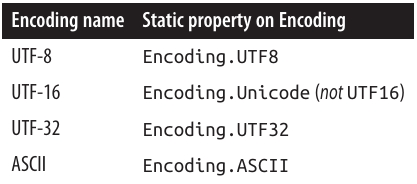 
</div>

### به‌دست آوردن سایر Encodingها 🎛️

می‌توانید با استفاده از متد **Encoding.GetEncoding** و وارد کردن یک نام استاندارد کاراکترست از **Internet Assigned Numbers Authority (IANA)** سایر Encodingها را به‌دست آورید:
</div>

```csharp
// در .NET 5+ و .NET Core، ابتدا باید RegisterProvider را فراخوانی کنید:
Encoding.RegisterProvider(CodePagesEncodingProvider.Instance);
Encoding chinese = Encoding.GetEncoding("GB18030");
```

<div dir="rtl">

متد ایستای **GetEncodings** فهرستی از تمام Encodingهای پشتیبانی‌شده را همراه با نام‌های استاندارد IANA برمی‌گرداند:
</div>

```csharp
foreach (EncodingInfo info in Encoding.GetEncodings())
    Console.WriteLine(info.Name);
```

<div dir="rtl">

روش دیگر برای به‌دست آوردن یک Encoding این است که مستقیماً یک کلاس Encoding را نمونه‌سازی کنید. این کار به شما اجازه می‌دهد گزینه‌های مختلفی را از طریق آرگومان‌های سازنده مشخص کنید، از جمله:

* آیا در صورت مواجهه با دنباله بایت نامعتبر در هنگام Decode کردن، استثنا (Exception) پرتاب شود یا خیر. مقدار پیش‌فرض **false** است.
* آیا UTF-16/UTF-32 با بایت‌های پرارزش‌تر در ابتدا (**big endian**) یا بایت‌های کم‌ارزش‌تر در ابتدا (**little endian**) رمزگذاری/رمزگشایی شوند. مقدار پیش‌فرض **little endian** است که استاندارد سیستم‌عامل ویندوز محسوب می‌شود.
* آیا یک **Byte-Order Mark (BOM)** یا همان پیشوند نشان‌دهنده نوع Endianness صادر شود یا خیر.

---

### Encoding برای فایل‌ها و جریان‌ها (File و Stream I/O) 📂

رایج‌ترین کاربرد یک شیء Encoding کنترل نحوه خواندن و نوشتن متن در فایل یا جریان است. برای مثال، کد زیر رشته `"Testing..."` را در فایلی به نام **data.txt** با Encoding **UTF-16** می‌نویسد:
</div>

```csharp
System.IO.File.WriteAllText("data.txt", "Testing...", Encoding.Unicode);
```

<div dir="rtl">

اگر آرگومان نهایی را حذف کنید، **WriteAllText** از **UTF-8** استفاده می‌کند که رایج‌ترین و پیش‌فرض Encoding برای تمام عملیات فایل و جریان است.

ما در فصل ۱۵، در بخش **“Stream Adapters”** در صفحه 709 دوباره به این موضوع بازخواهیم گشت.

---

### Encoding برای آرایه‌های بایتی 💾

می‌توانید از یک شیء Encoding برای تبدیل بین **string** و **byte\[]** استفاده کنید.

* متد **GetBytes** از string به byte\[] تبدیل می‌کند.
* متد **GetString** برعکس عمل می‌کند:
</div>

```csharp
byte[] utf8Bytes  = System.Text.Encoding.UTF8.GetBytes("0123456789");
byte[] utf16Bytes = System.Text.Encoding.Unicode.GetBytes("0123456789");
byte[] utf32Bytes = System.Text.Encoding.UTF32.GetBytes("0123456789");

Console.WriteLine(utf8Bytes.Length);   // 10
Console.WriteLine(utf16Bytes.Length);  // 20
Console.WriteLine(utf32Bytes.Length);  // 40

string original1 = System.Text.Encoding.UTF8.GetString(utf8Bytes);
string original2 = System.Text.Encoding.Unicode.GetString(utf16Bytes);
string original3 = System.Text.Encoding.UTF32.GetString(utf32Bytes);

Console.WriteLine(original1);   // 0123456789
Console.WriteLine(original2);   // 0123456789
Console.WriteLine(original3);   // 0123456789
```

<div dir="rtl">

---

### UTF-16 و جفت‌های جایگزین (Surrogate Pairs) 🧩

یادتان باشد که .NET کاراکترها و رشته‌ها را در **UTF-16** ذخیره می‌کند. چون UTF-16 برای هر کاراکتر به یک یا دو کلمه ۱۶ بیتی نیاز دارد و نوع **char** فقط ۱۶ بیت طول دارد، برخی از کاراکترهای Unicode نیاز به دو char دارند. پیامدهای این موضوع:

* ویژگی **Length** یک رشته ممکن است بزرگ‌تر از تعداد واقعی کاراکترها باشد.
* یک **char** همیشه به‌تنهایی نمی‌تواند یک کاراکتر Unicode را به‌طور کامل نشان دهد.

اکثر برنامه‌ها این موضوع را نادیده می‌گیرند زیرا تقریباً همه کاراکترهای رایج در **Basic Multilingual Plane (BMP)** جا می‌گیرند که تنها به یک کلمه ۱۶ بیتی نیاز دارد. BMP شامل چندین زبان جهانی و بیش از ۳۰,۰۰۰ کاراکتر چینی است.

اما کاراکترهای خارج از BMP شامل زبان‌های باستانی، نمادهای نت‌نویسی موسیقی، برخی کاراکترهای نادر چینی و بیشتر ایموجی‌ها هستند.

برای پشتیبانی از کاراکترهای دوکلمه‌ای می‌توانید از متدهای ایستای **char** استفاده کنید:
</div>

```csharp
string ConvertFromUtf32(int utf32)
int    ConvertToUtf32(char highSurrogate, char lowSurrogate)
```

<div dir="rtl">

کاراکترهای دوکلمه‌ای **Surrogate** نامیده می‌شوند و به‌راحتی قابل تشخیص‌اند چون هر کلمه در بازه **0xD800 تا 0xDFFF** قرار دارد. متدهای مفید:
</div>

```csharp
bool IsSurrogate(char c)
bool IsHighSurrogate(char c)
bool IsLowSurrogate(char c)
bool IsSurrogatePair(char highSurrogate, char lowSurrogate)
```

<div dir="rtl">

کلاس **StringInfo** در فضای نام **System.Globalization** نیز متدها و ویژگی‌هایی برای کار با کاراکترهای دوکلمه‌ای فراهم می‌کند.

کاراکترهای خارج از BMP معمولاً به فونت‌های خاص نیاز دارند و پشتیبانی محدودی در سیستم‌عامل دارند.

---

### تاریخ‌ها و زمان‌ها ⏰

ساختارهای (Struct) تغییرناپذیر (Immutable) زیر در فضای نام **System** برای نمایش تاریخ و زمان به کار می‌روند:
</div>

```
DateTime, DateTimeOffset, TimeSpan, DateOnly, TimeOnly
```

<div dir="rtl">

زبان C# هیچ کلیدواژه خاصی برای این انواع تعریف نکرده است.

---

### TimeSpan

**TimeSpan** یک بازه زمانی یا زمان روز را نمایش می‌دهد. در نقش دوم، این زمان همان زمان ساعت (بدون تاریخ) است که معادل مدت‌زمان سپری‌شده از نیمه‌شب است، فرض بر این‌که تغییر ساعت تابستانی وجود ندارد.

* دقت: **100 نانوثانیه**
* بیشترین مقدار: حدود **۱۰ میلیون روز**
* می‌تواند مثبت یا منفی باشد

سه روش برای ساخت یک TimeSpan وجود دارد:

* استفاده از یکی از سازنده‌ها (Constructors)
* فراخوانی یکی از متدهای ایستای **From…**
* کم کردن یک **DateTime** از دیگری

نمونه سازنده‌ها:
</div>

```csharp
public TimeSpan(int hours, int minutes, int seconds);
public TimeSpan(int days, int hours, int minutes, int seconds);
public TimeSpan(int days, int hours, int minutes, int seconds, int milliseconds);
public TimeSpan(int days, int hours, int minutes, int seconds, int milliseconds, int microseconds);
public TimeSpan(long ticks);   // هر tick = 100ns
```

<div dir="rtl">

نمونه متدهای **From…**:
</div>

```csharp
public static TimeSpan FromDays(double value);
public static TimeSpan FromHours(double value);
public static TimeSpan FromMinutes(double value);
public static TimeSpan FromSeconds(double value);
public static TimeSpan FromMilliseconds(double value);
public static TimeSpan FromMicroseconds(double value);
```

<div dir="rtl">

نمونه استفاده:
</div>

```csharp
Console.WriteLine(new TimeSpan(2, 30, 0));     // 02:30:00
Console.WriteLine(TimeSpan.FromHours(2.5));    // 02:30:00
Console.WriteLine(TimeSpan.FromHours(-2.5));   // -02:30:00
```

<div dir="rtl">

عملگرهای `<` و `>` و همچنین `+` و `-` برای TimeSpan سربارگذاری شده‌اند:
</div>

```csharp
TimeSpan.FromHours(2) + TimeSpan.FromMinutes(30); // 2.5 ساعت
TimeSpan.FromDays(10) - TimeSpan.FromSeconds(1);  // 9.23:59:59
```

<div dir="rtl">

ویژگی‌های عددی:
</div>

```csharp
TimeSpan nearlyTenDays = TimeSpan.FromDays(10) - TimeSpan.FromSeconds(1);

Console.WriteLine(nearlyTenDays.Days);         // 9
Console.WriteLine(nearlyTenDays.Hours);        // 23
Console.WriteLine(nearlyTenDays.Minutes);      // 59
Console.WriteLine(nearlyTenDays.Seconds);      // 59
Console.WriteLine(nearlyTenDays.Milliseconds); // 0
```

<div dir="rtl">

ویژگی‌های **Total…** مقادیر اعشاری (double) را برای کل بازه برمی‌گردانند:
</div>

```csharp
Console.WriteLine(nearlyTenDays.TotalDays);         // 9.99998842592593
Console.WriteLine(nearlyTenDays.TotalHours);        // 239.999722222222
Console.WriteLine(nearlyTenDays.TotalMinutes);      // 14399.9833333333
Console.WriteLine(nearlyTenDays.TotalSeconds);      // 863999
Console.WriteLine(nearlyTenDays.TotalMilliseconds); // 863999000
```

<div dir="rtl">

متد ایستای **Parse** رشته را به TimeSpan تبدیل می‌کند (برعکس **ToString**). متد **TryParse** مشابه است ولی به‌جای پرتاب استثنا در صورت خطا، **false** برمی‌گرداند.

کلاس **XmlConvert** نیز متدهایی برای تبدیل TimeSpan/رشته طبق پروتکل‌های استاندارد XML دارد.

مقدار پیش‌فرض TimeSpan برابر با **TimeSpan.Zero** است.

برای نمایش زمان روز (مدت‌زمان سپری‌شده از نیمه‌شب)، می‌توانید از ویژگی **DateTime.Now\.TimeOfDay** استفاده کنید.

---
### DateTime و DateTimeOffset ⏰

`DateTime` و `DateTimeOffset` دو **struct** تغییرناپذیر (**immutable**) برای نمایش یک تاریخ و در صورت نیاز، زمان هستند. این دو دارای **دقتی معادل 100 نانوثانیه** بوده و محدوده‌ای از سال **0001** تا **9999** را پوشش می‌دهند.

`DateTimeOffset` از نظر کارکرد شبیه `DateTime` است. تفاوت اصلی آن در این است که **یک اختلاف زمانی (offset) نسبت به زمان هماهنگ جهانی (UTC)** را هم ذخیره می‌کند؛ این موضوع باعث می‌شود مقایسه مقادیر در مناطق زمانی مختلف دقیق‌تر انجام شود.

---

### انتخاب بین DateTime و DateTimeOffset 🤔

تفاوت اصلی این دو در **نحوه مدیریت مناطق زمانی (Time Zone)** است:

* `DateTime` دارای یک **پرچم سه‌حالته** است که مشخص می‌کند تاریخ و زمان نسبت به کدام گزینه است:

  * زمان محلی روی کامپیوتر فعلی
  * `UTC` (معادل مدرن زمان گرینویچ)
  * **نامشخص (Unspecified)**

* اما `DateTimeOffset` دقیق‌تر است؛ این نوع **اختلاف زمانی نسبت به UTC را به‌صورت یک شیء از نوع TimeSpan ذخیره می‌کند**:
  **July 01 2019 03:00:00 -06:00**

این موضوع در **مقایسه‌ی برابری (Equality)** اهمیت دارد و معیار انتخاب یکی از این دو است:

* `DateTime` پرچم سه‌حالته را در مقایسه‌ها نادیده می‌گیرد و دو مقدار را **برابر** می‌داند اگر سال، ماه، روز، ساعت، دقیقه و ... آنها یکی باشد.
* `DateTimeOffset` دو مقدار را **برابر** می‌داند اگر به **یک نقطه زمانی یکسان** اشاره کنند.

مثال مهم: **ساعت تابستانی (Daylight Saving Time)** می‌تواند این تفاوت را حتی اگر برنامه شما نیازی به پشتیبانی از مناطق زمانی مختلف نداشته باشد، مهم کند.

**نمونه:**
`DateTime` مقادیر زیر را **متفاوت** می‌داند، در حالی که `DateTimeOffset` آنها را **برابر** می‌داند:

* July 01 2019 09:00:00 +00:00 (GMT)
* July 01 2019 03:00:00 -06:00 (محلی، آمریکای مرکزی)

---

### مزیت DateTimeOffset در بیشتر موارد 🌍

در اکثر سناریوها، **منطق برابری DateTimeOffset بهتر است**.
مثلاً برای **مقایسه زمان دو رویداد بین‌المللی**، `DateTimeOffset` به‌صورت پیش‌فرض پاسخ درست را ارائه می‌دهد.
حتی یک **هکر** که قصد اجرای یک حمله‌ی **Distributed Denial of Service** داشته باشد نیز از `DateTimeOffset` استفاده می‌کند!

اما در `DateTime` برای دستیابی به همین دقت باید همه‌چیز را در **یک منطقه زمانی واحد (معمولاً UTC)** استاندارد کنید که این دو مشکل دارد:

* برای کاربرپسند بودن، نیاز به **تبدیل صریح UTC به زمان محلی** قبل از نمایش دارید.
* ممکن است **فراموش کنید و زمان محلی را به‌صورت تصادفی وارد کنید**.

---

### مزیت DateTime در زمان‌های محلی 🖥️

با این حال، `DateTime` در مشخص کردن زمان **نسبت به ساعت محلی سیستم اجرا** مناسب‌تر است.
مثلاً اگر بخواهید برای هر دفتر بین‌المللی خود یک **آرشیو هفتگی** در **ساعت ۳ صبح به وقت محلی** انجام دهید، `DateTime` بهتر است چون به زمان محلی هر سایت احترام می‌گذارد.

> **نکته:**
> `DateTimeOffset` برای ذخیره‌ی اختلاف زمانی از یک عدد صحیح کوتاه (short) استفاده می‌کند و این اختلاف را برحسب **دقیقه** ذخیره می‌کند.
> اما **اطلاعات منطقه زمانی (Region)** را ذخیره نمی‌کند. یعنی نمی‌دانیم اختلاف **+08:00** به **زمان سنگاپور** اشاره دارد یا **پرت**.

ما در بخش **“Dates and Time Zones” صفحه 312** دوباره به موضوع مناطق زمانی و مقایسه‌ی برابری بازمی‌گردیم.

همچنین **SQL Server 2008** پشتیبانی مستقیم از `DateTimeOffset` را با معرفی یک **نوع داده‌ی جدید با همین نام** اضافه کرده است.

---

### ساخت یک DateTime 🛠️

`DateTime` چندین **سازنده (Constructor)** دارد که مقادیر سال، ماه و روز را به‌صورت اعداد صحیح دریافت می‌کنند و در صورت نیاز می‌توان **ساعت، دقیقه، ثانیه، میلی‌ثانیه (و از .NET 7 میکروثانیه)** را هم مشخص کرد:
</div>

```csharp
public DateTime (int year, int month, int day);
public DateTime (int year, int month, int day,
                 int hour, int minute, int second, int millisecond);
```

<div dir="rtl">

* اگر فقط تاریخ مشخص شود، زمان به‌صورت پیش‌فرض **نیمه‌شب (0:00)** تنظیم می‌شود.

---

### مشخص کردن DateTimeKind 🧭

سازنده‌های `DateTime` به شما اجازه می‌دهند **یک مقدار از نوع enum به نام DateTimeKind** هم مشخص کنید که شامل این مقادیر است:

* `Unspecified`
* `Local`
* `Utc`

این مقدار همان پرچم سه‌حالته‌ای است که در بخش قبلی توضیح داده شد.

* `Unspecified` پیش‌فرض است و به این معنی است که زمان به منطقه زمانی خاصی وابسته نیست.
* `Local` یعنی زمان نسبت به **منطقه زمانی سیستم فعلی** است.

**توجه:** `DateTime` برخلاف `DateTimeOffset` **اطلاعات دقیق منطقه زمانی یا اختلاف عددی از UTC را ذخیره نمی‌کند**.

> مقدار **Kind** در یک شیء DateTime نشان‌دهنده‌ی همین حالت است.

---

### استفاده از تقویم‌های مختلف 📅

سازنده‌های `DateTime` قابلیت دریافت یک شیء **Calendar** را هم دارند.
این امکان به شما اجازه می‌دهد **از هر زیرکلاسی از Calendar در System.Globalization** برای ایجاد تاریخ استفاده کنید:
</div>

```csharp
DateTime d = new DateTime (5767, 1, 1,
                          new System.Globalization.HebrewCalendar());
Console.WriteLine (d);    // 12/12/2006 12:00:00 AM
```

<div dir="rtl">

> نمایش تاریخ به تنظیمات کنترل پنل سیستم شما بستگی دارد.
> در نهایت، `DateTime` همیشه از تقویم **میلادی (Gregorian)** برای ذخیره استفاده می‌کند و این تبدیل فقط در زمان ساخت شیء انجام می‌شود.

اگر بخواهید محاسباتی با یک تقویم خاص انجام دهید، باید **مستقیماً متدهای همان زیرکلاس Calendar** را به‌کار ببرید.

---

### ساخت DateTime با Ticks یا زمان‌های خاص ⏳

* می‌توانید یک `DateTime` را با مقدار `ticks` بسازید که یک عدد از نوع **long** است.
* هر tick برابر است با **یک بازه‌ی 100 نانوثانیه از نیمه‌شب 01/01/0001**.

همچنین برای سازگاری با سیستم‌های دیگر، متدهای استاتیک زیر وجود دارند:

* **FromFileTime** و **FromFileTimeUtc**: تبدیل زمان فایل‌های ویندوز (long) به DateTime.
* **FromOADate**: تبدیل زمان **OLE Automation** (double) به DateTime.

---

### ساخت DateTime از رشته‌های متنی 🔤

برای ساخت یک `DateTime` از رشته‌ها، می‌توانید از متدهای استاتیک زیر استفاده کنید:

* `Parse`
* `ParseExact`

هر دو متد **پارامترهای اختیاری** برای مشخص کردن **پرچم‌ها (flags)** و **فرمت‌دهنده‌ها (format providers)** دارند؛ همچنین `ParseExact` یک **رشته‌ی فرمت** هم دریافت می‌کند.

توضیحات کامل‌تر در بخش **“Formatting and Parsing” صفحه 317** آمده است.

---
### ساخت DateTimeOffset و کار با آن ⏰

`DateTimeOffset` مشابه `DateTime` عمل می‌کند، اما **اضافه بر تاریخ و زمان، یک اختلاف زمانی نسبت به UTC** هم دریافت می‌کند.

#### سازنده‌ها (Constructors)
</div>

```csharp
public DateTimeOffset (int year, int month, int day,
                       int hour, int minute, int second,
                       TimeSpan offset);

public DateTimeOffset (int year, int month, int day,
                       int hour, int minute, int second, int millisecond,
                       TimeSpan offset);
```

<div dir="rtl">

* **محدودیت:** TimeSpan باید **به دقیقه کامل** باشد، در غیر این صورت Exception رخ می‌دهد.
* سازنده‌ها همچنین نسخه‌هایی دارند که **Calendar، ticks، یا رشته** دریافت می‌کنند (`Parse` و `ParseExact`).

---

#### ساخت از یک DateTime موجود

می‌توانید یک `DateTimeOffset` را از یک شیء `DateTime` بسازید:
</div>

```csharp
public DateTimeOffset (DateTime dateTime);
public DateTimeOffset (DateTime dateTime, TimeSpan offset);
```

<div dir="rtl">

همچنین امکان **تبدیل ضمنی (implicit cast)** از `DateTime` به `DateTimeOffset` وجود دارد:
</div>

```csharp
DateTimeOffset dt = new DateTime(2000, 2, 3);
```

<div dir="rtl">

> این کار مفید است چون اکثر کتابخانه‌های BCL .NET هنوز `DateTime` را پشتیبانی می‌کنند، نه `DateTimeOffset`.

#### قوانین پیش‌فرض برای offset:

* اگر `DateTime.Kind == Utc` → offset = 0
* اگر `DateTime.Kind == Local` یا `Unspecified` → offset از **منطقه زمانی محلی سیستم** گرفته می‌شود.

---

### تبدیل DateTimeOffset به DateTime

سه ویژگی (`property`) برای تبدیل وجود دارد:

* `UtcDateTime` → DateTime به زمان UTC
* `LocalDateTime` → DateTime به زمان محلی سیستم
* `DateTime` → DateTime با همان منطقه زمانی که مقدار original داشت، با `Kind = Unspecified`

---

### زمان فعلی (Now, Today, UtcNow)

| نوع                     | ویژگی    | توضیح                         |
| ----------------------- | -------- | ----------------------------- |
| DateTime                | `Now`    | تاریخ و زمان محلی             |
| DateTimeOffset          | `Now`    | تاریخ و زمان محلی + offset    |
| DateTime                | `Today`  | فقط تاریخ، زمان صفر (نیمه‌شب) |
| DateTime/DateTimeOffset | `UtcNow` | تاریخ و زمان در UTC           |
</div>

```csharp
Console.WriteLine(DateTime.Now);         // 11/11/2019 1:23:45 PM
Console.WriteLine(DateTimeOffset.Now);   // 11/11/2019 1:23:45 PM -06:00
Console.WriteLine(DateTime.Today);       // 11/11/2019 12:00:00 AM
Console.WriteLine(DateTime.UtcNow);      // 11/11/2019 7:23:45 AM
Console.WriteLine(DateTimeOffset.UtcNow);// 11/11/2019 7:23:45 AM +00:00
```

<div dir="rtl">

> دقت این مقادیر معمولاً بین **۱۰ تا ۲۰ میلی‌ثانیه** است و به سیستم عامل بستگی دارد.

---

### دسترسی به اجزای تاریخ و زمان
</div>

```csharp
DateTime dt = new DateTime(2000, 2, 3, 10, 20, 30);

Console.WriteLine(dt.Year);         // 2000
Console.WriteLine(dt.Month);        // 2
Console.WriteLine(dt.Day);          // 3
Console.WriteLine(dt.DayOfWeek);    // Thursday
Console.WriteLine(dt.DayOfYear);    // 34
Console.WriteLine(dt.Hour);         // 10
Console.WriteLine(dt.Minute);       // 20
Console.WriteLine(dt.Second);       // 30
Console.WriteLine(dt.Millisecond);  // 0
Console.WriteLine(dt.Ticks);        // 630851700300000000
Console.WriteLine(dt.TimeOfDay);    // 10:20:30  (TimeSpan)
```

<div dir="rtl">

* `DateTimeOffset` علاوه بر این‌ها، ویژگی **Offset** از نوع TimeSpan دارد.

---

### محاسبات روی تاریخ و زمان

متدهای نمونه برای تغییر مقادیر تاریخ/زمان (برمی‌گردانند یک **شیء جدید**):
</div>

```csharp
AddYears, AddMonths, AddDays,
AddHours, AddMinutes, AddSeconds,
AddMilliseconds, AddTicks
```

<div dir="rtl">

* ورودی می‌تواند منفی باشد تا **کم کردن زمان** را انجام دهد.
* `Add` یک TimeSpan به تاریخ اضافه می‌کند؛ عملگر `+` نیز مشابه عمل می‌کند:
</div>

```csharp
TimeSpan ts = TimeSpan.FromMinutes(90);
Console.WriteLine(dt.Add(ts));
Console.WriteLine(dt + ts); // مشابه بالا
```

<div dir="rtl">

* می‌توان TimeSpan را کم کرد یا دو DateTime/DateTimeOffset را از هم کم کرد تا یک TimeSpan حاصل شود:
</div>

```csharp
DateTime thisYear = new DateTime(2015, 1, 1);
DateTime nextYear = thisYear.AddYears(1);
TimeSpan oneYear = nextYear - thisYear;
```

<div dir="rtl">

---

### قالب‌بندی و پارس کردن (Formatting & Parsing)

* `ToString()` در DateTime → تاریخ کوتاه + زمان طولانی (شامل ثانیه‌ها)
  مثال: `11/11/2019 11:50:30 AM`
* `ToString()` در DateTimeOffset → همان، اما **offset نیز نمایش داده می‌شود**: `11/11/2019 11:50:30 AM -06:00`
* `ToShortDateString`, `ToLongDateString` → فقط تاریخ
* `ToShortTimeString`, `ToLongTimeString` → فقط زمان

> این متدها در واقع **میانبرهایی برای قالب‌های استاندارد** هستند. `ToString` می‌تواند **فرمت سفارشی و provider** نیز دریافت کند.

#### جلوگیری از پارس اشتباه

اگر تنظیمات Culture هنگام parse با زمان فرمت شده متفاوت باشد، ممکن است parse اشتباه شود.
راه حل: از **فرمت culture-agnostic** استفاده کنید، مثلاً `"o"`:
</div>

```csharp
DateTime dt1 = DateTime.Now;
string cannotBeMisparsed = dt1.ToString("o");
DateTime dt2 = DateTime.Parse(cannotBeMisparsed);
```

<div dir="rtl">

* متدهای استاتیک `Parse`, `TryParse`, `ParseExact`, `TryParseExact` رشته را به DateTime یا DateTimeOffset تبدیل می‌کنند.
* نسخه‌های `Try*` به جای پرتاب Exception، `false` برمی‌گردانند.

---
**TimeZoneInfo** ⏰🌍

کلاس **TimeZoneInfo** اطلاعاتی درباره نام مناطق زمانی، افست‌های UTC و قوانین **Daylight Saving Time** ارائه می‌دهد.

---

### TimeZone

متد ایستا **TimeZone.CurrentTimeZone** یک شیء **TimeZone** برمی‌گرداند:
</div>

```csharp
TimeZone zone = TimeZone.CurrentTimeZone;
Console.WriteLine (zone.StandardName);      // Pacific Standard Time
Console.WriteLine (zone.DaylightName);      // Pacific Daylight Time
```

<div dir="rtl">

متد **GetDaylightChanges** اطلاعات خاص مربوط به **Daylight Saving Time** برای یک سال مشخص را برمی‌گرداند:
</div>

```csharp
DaylightTime day = zone.GetDaylightChanges (2019);
Console.WriteLine (day.Start.ToString ("M"));       // 10 March
Console.WriteLine (day.End.ToString ("M"));         // 03 November
Console.WriteLine (day.Delta);                      // 01:00:00
```

<div dir="rtl">

---

### TimeZoneInfo

متد ایستا **TimeZoneInfo.Local** یک شیء **TimeZoneInfo** بر اساس تنظیمات محلی جاری برمی‌گرداند. مثال زیر نتیجه اجرای آن در کالیفرنیا را نشان می‌دهد:
</div>

```csharp
TimeZoneInfo zone = TimeZoneInfo.Local;
Console.WriteLine (zone.StandardName);      // Pacific Standard Time
Console.WriteLine (zone.DaylightName);      // Pacific Daylight Time
```

<div dir="rtl">

متدهای **IsDaylightSavingTime** و **GetUtcOffset** به شکل زیر کار می‌کنند:
</div>

```csharp
DateTime dt1 = new DateTime (2019, 1, 1);   // DateTimeOffset هم کار می‌کند
DateTime dt2 = new DateTime (2019, 6, 1);
Console.WriteLine (zone.IsDaylightSavingTime (dt1));     // True
Console.WriteLine (zone.IsDaylightSavingTime (dt2));     // False
Console.WriteLine (zone.GetUtcOffset (dt1));             // -08:00:00
Console.WriteLine (zone.GetUtcOffset (dt2));             // -07:00:00
```

<div dir="rtl">

برای دریافت **TimeZoneInfo** هر منطقه زمانی جهان، از متد **FindSystemTimeZoneById** استفاده می‌کنیم. در اینجا به منطقه غرب استرالیا می‌رویم:
</div>

```csharp
TimeZoneInfo wa = TimeZoneInfo.FindSystemTimeZoneById
                  ("W. Australia Standard Time");
Console.WriteLine (wa.Id);                   // W. Australia Standard Time
Console.WriteLine (wa.DisplayName);          // (GMT+08:00) Perth
Console.WriteLine (wa.BaseUtcOffset);        // 08:00:00
Console.WriteLine (wa.SupportsDaylightSavingTime);     // True
```

<div dir="rtl">

ویژگی **Id** همان مقداری است که به **FindSystemTimeZoneById** پاس داده شده است.
متد ایستا **GetSystemTimeZones** تمام مناطق زمانی جهان را برمی‌گرداند و می‌توان تمام شناسه‌های معتبر را لیست کرد:
</div>

```csharp
foreach (TimeZoneInfo z in TimeZoneInfo.GetSystemTimeZones())
    Console.WriteLine (z.Id);
```

<div dir="rtl">

می‌توان یک منطقه زمانی سفارشی ایجاد کرد با **TimeZoneInfo.CreateCustomTimeZone**.
چون **TimeZoneInfo** غیرقابل تغییر است، همه اطلاعات لازم باید هنگام ایجاد به متد داده شوند.

همچنین می‌توان یک منطقه زمانی از پیش تعریف‌شده یا سفارشی را با **ToSerializedString** به رشته‌ای نیمه‌قابل‌خواندن برای انسان تبدیل کرد و با **TimeZoneInfo.FromSerializedString** دوباره بازیابی نمود.

---

متد ایستا **ConvertTime** یک **DateTime** یا **DateTimeOffset** را از یک منطقه زمانی به منطقه‌ای دیگر تبدیل می‌کند. می‌توان تنها منطقه مقصد را مشخص کرد یا هر دو منطقه مبدأ و مقصد را وارد نمود. تبدیل مستقیم از/به UTC نیز با متدهای **ConvertTimeFromUtc** و **ConvertTimeToUtc** ممکن است.

---

برای کار با **Daylight Saving Time**، **TimeZoneInfo** متدهای اضافی زیر را فراهم می‌کند:

* **IsInvalidTime**: true برمی‌گرداند اگر یک **DateTime** در ساعتی باشد که در جلو بردن ساعت‌ها حذف شده است.
* **IsAmbiguousTime**: true برمی‌گرداند اگر یک **DateTime** یا **DateTimeOffset** در ساعتی باشد که در عقب بردن ساعت‌ها تکرار شده است.
* **GetAmbiguousTimeOffsets**: آرایه‌ای از **TimeSpan** برمی‌گرداند که انتخاب‌های معتبر افست برای یک زمان مبهم را نشان می‌دهد.

---

برای گرفتن تاریخ‌های شروع و پایان **Daylight Saving Time** از یک **TimeZoneInfo**، باید **GetAdjustmentRules** را صدا زد که خلاصه قوانین DST را برای همه سال‌ها برمی‌گرداند. هر قانون دارای **DateStart** و **DateEnd** است:
</div>

```csharp
foreach (TimeZoneInfo.AdjustmentRule rule in wa.GetAdjustmentRules())
    Console.WriteLine ("Rule: applies from " + rule.DateStart +
                                        " to " + rule.DateEnd);
```

<div dir="rtl">

مثال: غرب استرالیا اولین بار **Daylight Saving Time** را در ۲۰۰۶ معرفی کرد و سپس در ۲۰۰۹ لغو نمود. سال اول نیاز به قانون ویژه داشت، بنابراین دو قانون داریم:
</div>

```
Rule: applies from 1/01/2006 12:00:00 AM to 31/12/2006 12:00:00 AM
Rule: applies from 1/01/2007 12:00:00 AM to 31/12/2009 12:00:00 AM
```

<div dir="rtl">

هر **AdjustmentRule** دارای **DaylightDelta** از نوع **TimeSpan** (معمولاً یک ساعت) و ویژگی‌های **DaylightTransitionStart** و **DaylightTransitionEnd** است که از نوع **TimeZoneInfo.TransitionTime** بوده و ویژگی‌های زیر را دارند:
</div>

```csharp
public bool IsFixedDateRule { get; }
public DayOfWeek DayOfWeek { get; }
public int Week { get; }
public int Day { get; }
public int Month { get; }
public DateTime TimeOfDay { get; }
```

<div dir="rtl">

---

زمان انتقال (TransitionTime) می‌تواند هم تاریخ ثابت و هم شناور را نشان دهد. مثال تاریخ شناور: «آخرین یک‌شنبه ماه مارس».
قوانین تفسیر TransitionTime:

1️⃣ اگر برای **End Transition**، **IsFixedDateRule=true**، **Day=1**، **Month=1** و **TimeOfDay=DateTime.MinValue**، آن سال پایان DST وجود ندارد (معمولاً در نیم‌کره جنوبی).
2️⃣ اگر **IsFixedDateRule=true**، **Month**، **Day** و **TimeOfDay** تعیین‌کننده شروع یا پایان قانون هستند.
3️⃣ اگر **IsFixedDateRule=false**، **Month**، **DayOfWeek**، **Week** و **TimeOfDay** تعیین‌کننده شروع یا پایان قانون هستند.

در حالت آخر، **Week** شماره هفته ماه است و «۵» یعنی آخرین هفته.

---

مثال قوانین انتقال **wa**:
</div>

```csharp
foreach (TimeZoneInfo.AdjustmentRule rule in wa.GetAdjustmentRules())
{
    Console.WriteLine ("Rule: applies from " + rule.DateStart +
                                        " to " + rule.DateEnd);
    Console.WriteLine ("   Delta: " + rule.DaylightDelta);
    Console.WriteLine ("   Start: " + FormatTransitionTime
                                   (rule.DaylightTransitionStart, false));
    Console.WriteLine ("   End:   " + FormatTransitionTime
                                   (rule.DaylightTransitionEnd, true));
    Console.WriteLine();
}
```

<div dir="rtl">

در **FormatTransitionTime** قوانین فوق رعایت می‌شوند:
</div>

```csharp
static string FormatTransitionTime (TimeZoneInfo.TransitionTime tt,
                                    bool endTime)
{
    if (endTime && tt.IsFixedDateRule
                && tt.Day == 1 && tt.Month == 1
                && tt.TimeOfDay == DateTime.MinValue)
        return "-";
    string s;
    if (tt.IsFixedDateRule)
        s = tt.Day.ToString();
    else
        s = "The " +
            "first second third fourth last".Split()[tt.Week - 1] +
            " " + tt.DayOfWeek + " in";
    return s + " " + DateTimeFormatInfo.CurrentInfo.MonthNames [tt.Month-1]
             + " at " + tt.TimeOfDay.TimeOfDay;
}
```

<div dir="rtl">

### Daylight Saving Time و DateTime 🌞🕒

اگر از **DateTimeOffset** یا یک **UTC DateTime** استفاده کنید، مقایسه برابری تحت تأثیر **Daylight Saving Time** قرار نمی‌گیرد. اما با **DateTime**های محلی، **DST** می‌تواند مشکل‌ساز باشد.

می‌توان قوانین را به‌طور خلاصه به این صورت بیان کرد:

* **Daylight Saving** فقط بر زمان محلی تأثیر می‌گذارد، نه بر زمان UTC.
* وقتی ساعت‌ها عقب کشیده می‌شوند، مقایسه‌هایی که به حرکت زمان رو به جلو وابسته‌اند، خراب می‌شوند **فقط اگر** از **DateTime** محلی استفاده کنند.
* همیشه می‌توان به‌صورت قابل اعتماد بین زمان UTC و محلی رفت و برگشت کرد (روی همان کامپیوتر) حتی وقتی ساعت‌ها عقب می‌روند.

متد **IsDaylightSavingTime** مشخص می‌کند که یک **DateTime** محلی تحت **DST** قرار دارد یا نه. زمان‌های UTC همیشه false برمی‌گردانند:
</div>

```csharp
Console.Write (DateTime.Now.IsDaylightSavingTime());     // True یا False
Console.Write (DateTime.UtcNow.IsDaylightSavingTime());  // همیشه False
```

<div dir="rtl">

اگر **dto** یک **DateTimeOffset** باشد، عبارت زیر همان عملکرد را دارد:
</div>

```csharp
dto.LocalDateTime.IsDaylightSavingTime
```

<div dir="rtl">

پایان **Daylight Saving Time** برای الگوریتم‌هایی که از زمان محلی استفاده می‌کنند، پیچیدگی ایجاد می‌کند؛ زیرا وقتی ساعت‌ها عقب کشیده می‌شوند، همان ساعت (یا دقیق‌تر، **Delta**) دوباره تکرار می‌شود.

مقایسه مطمئن بین هر دو **DateTime** با صدا زدن **ToUniversalTime** روی هرکدام انجام می‌شود. این روش تنها در صورتی شکست می‌خورد که **یکی از آن‌ها DateTimeKind.Unspecified** باشد.
این احتمال خطا دلیل دیگری برای ترجیح دادن **DateTimeOffset** است.

---

### Formatting و Parsing 📝

**Formatting** یعنی تبدیل به رشته؛ **Parsing** یعنی تبدیل از رشته.
نیاز به **format** یا **parse** در برنامه‌نویسی بسیار رایج است، و .NET مکانیزم‌های متعددی برای آن ارائه می‌دهد:

1️⃣ **ToString و Parse**
این متدها عملکرد پیش‌فرض را برای بسیاری از انواع فراهم می‌کنند.

2️⃣ **Format Providers**
این‌ها به شکل متدهای اضافی **ToString** و **Parse** ظاهر می‌شوند و رشته فرمت و/یا یک **format provider** می‌گیرند. **Format Providers** بسیار منعطف و آگاه به فرهنگ (culture-aware) هستند. .NET شامل **format provider** برای انواع عددی و **DateTime/DateTimeOffset** است.

3️⃣ **XmlConvert**
یک کلاس ایستا که فرمت و پارس کردن را با رعایت استانداردهای XML انجام می‌دهد. همچنین برای تبدیل مستقل از فرهنگ یا جلوگیری از اشتباه در پارس کردن مفید است. از انواع عددی، **bool**، **DateTime**, **DateTimeOffset**, **TimeSpan** و **Guid** پشتیبانی می‌کند.

4️⃣ **Type Converters**
این‌ها مخصوص طراحان و **XAML parsers** هستند.

در این بخش، ما روی دو مکانیزم اول تمرکز می‌کنیم، مخصوصاً **Format Providers**، سپس **XmlConvert** و **Type Converters** را بررسی خواهیم کرد.

---

### ToString و Parse 🔄

ساده‌ترین مکانیزم فرمتینگ **متد ToString** است. این متد خروجی معنادار برای انواع ساده (bool, DateTime, DateTimeOffset, TimeSpan, Guid و انواع عددی) ارائه می‌دهد.
برای عملیات معکوس، هرکدام از این انواع متد **Parse** ایستا دارند:
</div>

```csharp
string s = true.ToString();     // s = "True"
bool b = bool.Parse(s);         // b = true
```

<div dir="rtl">

اگر پارس کردن شکست بخورد، **FormatException** پرتاب می‌شود.
بسیاری از انواع همچنین متد **TryParse** دارند که اگر تبدیل شکست بخورد، false برمی‌گرداند به‌جای پرتاب استثنا:
</div>

```csharp
bool failure = int.TryParse("qwerty", out int i1);
bool success = int.TryParse("123", out int i2);
```

<div dir="rtl">

اگر به خروجی نیاز ندارید و فقط می‌خواهید بررسی کنید که پارس موفق می‌شود یا نه، می‌توانید از **discard** استفاده کنید:
</div>

```csharp
bool success = int.TryParse("123", out int _);
```

<div dir="rtl">

اگر انتظار خطا دارید، **TryParse** سریع‌تر و شیک‌تر از استفاده از **Parse** در بلوک **try/catch** است.

---

### فرهنگ و Parse/ToString 🌐

متدهای **Parse** و **TryParse** برای **DateTime(Offset)** و انواع عددی به تنظیمات فرهنگ محلی احترام می‌گذارند.
می‌توان با مشخص کردن یک شیء **CultureInfo** این رفتار را تغییر داد. استفاده از **InvariantCulture** معمولاً ایده خوبی است:
</div>

```csharp
Console.WriteLine(double.Parse("1.234"));  // 1234 در آلمان
double x = double.Parse("1.234", CultureInfo.InvariantCulture);
string y = 1.234.ToString(CultureInfo.InvariantCulture);
```

<div dir="rtl">

از .NET 8 به بعد، انواع عددی و تاریخ/زمان امکان فرمتینگ و پارس مستقیم **UTF-8** را دارند با متدهای **TryFormat** و **Parse/TryParse** که روی **byte array یا Span<byte>** کار می‌کنند. این در سناریوهای با عملکرد بالا می‌تواند کارآمدتر از کار با رشته‌های UTF-16 و تبدیل جداگانه باشد.

---

### Format Providers و IFormattable 🛠️

گاهی نیاز دارید کنترل بیشتری روی فرمتینگ و پارس داشته باشید.
در .NET، همه انواع عددی و **DateTime(Offset)** اینترفیس **IFormattable** را پیاده‌سازی می‌کنند:
</div>

```csharp
public interface IFormattable
{
    string ToString(string format, IFormatProvider formatProvider);
}
```

<div dir="rtl">

* پارامتر اول: رشته فرمت
* پارامتر دوم: **Format Provider**

مثال:
</div>

```csharp
NumberFormatInfo f = new NumberFormatInfo();
f.CurrencySymbol = "$$";
Console.WriteLine(3.ToString("C", f));  // $$ 3.00
```

<div dir="rtl">

اینجا `"C"` رشته فرمت برای **Currency** است و **NumberFormatInfo** مشخص می‌کند که پول و سایر نمایش‌های عددی چگونه رندر شوند.

---

اگر رشته فرمت یا **provider** برابر null باشد، یک مقدار پیش‌فرض استفاده می‌شود: **CultureInfo.CurrentCulture**، که تنظیمات کنترل پنل سیستم را منعکس می‌کند:
</div>

```csharp
Console.WriteLine(10.3.ToString("C"));  // $10.30
Console.WriteLine(10.3.ToString("F4")); // 10.3000
```

<div dir="rtl">

---

### سه Format Provider اصلی

* **NumberFormatInfo**
* **DateTimeFormatInfo**
* **CultureInfo**

تمام Enumها نیز قابل فرمت هستند، گرچه کلاس ویژه **IFormatProvider** ندارند.

---

### CultureInfo و Format Providers 🌎

**CultureInfo** میانجی برای **NumberFormatInfo** و **DateTimeFormatInfo** است، که تنظیمات منطقه‌ای فرهنگ را اعمال می‌کنند:
</div>

```csharp
CultureInfo uk = CultureInfo.GetCultureInfo("en-GB");
Console.WriteLine(3.ToString("C", uk));  // £3.00
```

<div dir="rtl">

فرمت تاریخ با **InvariantCulture** همیشه یکسان است، صرف‌نظر از تنظیمات سیستم:
</div>

```csharp
DateTime dt = new DateTime(2000, 1, 2);
CultureInfo iv = CultureInfo.InvariantCulture;
Console.WriteLine(dt.ToString(iv));      // 01/02/2000 00:00:00
Console.WriteLine(dt.ToString("d", iv)); // 01/02/2000
```

<div dir="rtl">

ویژگی‌های **InvariantCulture**:

* نماد ارز ☼ به جای \$
* تاریخ و زمان با صفر پیش‌رو (ماه اول)
* زمان با فرمت ۲۴ ساعته بدون AM/PM
### استفاده از NumberFormatInfo یا DateTimeFormatInfo 🔢📅

در مثال بعد، یک **NumberFormatInfo** ایجاد می‌کنیم و جداکننده گروه (Group Separator) را از ویرگول به فاصله تغییر می‌دهیم. سپس از آن برای فرمت کردن یک عدد با سه رقم اعشار استفاده می‌کنیم:
</div>

```csharp
NumberFormatInfo f = new NumberFormatInfo();
f.NumberGroupSeparator = " ";
Console.WriteLine(12345.6789.ToString("N3", f));  // 12 345.679
```

<div dir="rtl">

تنظیمات اولیه برای **NumberFormatInfo** یا **DateTimeFormatInfo** بر اساس **InvariantCulture** هستند.
گاهی اوقات مفیدتر است که نقطه شروع متفاوتی انتخاب کنید. برای این کار می‌توانید یک **Format Provider** موجود را **Clone** کنید:
</div>

```csharp
NumberFormatInfo f = (NumberFormatInfo)
                     CultureInfo.CurrentCulture.NumberFormat.Clone();
```

<div dir="rtl">

یک **Format Provider** کلون‌شده همیشه قابل نوشتن است، حتی اگر نمونه اصلی فقط خواندنی باشد.

---

### فرمت ترکیبی (Composite Formatting) 🧩

رشته‌های فرمت ترکیبی اجازه می‌دهند جایگزینی متغیرها با رشته فرمت را ترکیب کنید.
متد استاتیک **string.Format** یک رشته فرمت ترکیبی می‌گیرد:
</div>

```csharp
string composite = "Credit={0:C}";
Console.WriteLine(string.Format(composite, 500));  // Credit=$500.00
```

<div dir="rtl">

خود کلاس **Console** متدهای **Write** و **WriteLine** را برای پشتیبانی از فرمت ترکیبی اورلود کرده است:
</div>

```csharp
Console.WriteLine("Credit={0:C}", 500);  // Credit=$500.00
```

<div dir="rtl">

می‌توانید رشته فرمت ترکیبی را به **StringBuilder** (با **AppendFormat**) یا به یک **TextWriter** برای I/O اضافه کنید.

**string.Format** می‌تواند یک **Format Provider** اختیاری هم بگیرد. مثال:
</div>

```csharp
string s = string.Format(CultureInfo.InvariantCulture, "{0}", someObject);
```

<div dir="rtl">

این معادل است با:
</div>

```csharp
string s;
if (someObject is IFormattable)
    s = ((IFormattable)someObject).ToString(null, CultureInfo.InvariantCulture);
else if (someObject == null)
    s = "";
else
    s = someObject.ToString();
```

<div dir="rtl">

---

### پارس کردن با Format Providers 🔧

هیچ اینترفیس استانداردی برای پارس کردن از طریق **Format Provider** وجود ندارد.
در عوض، هر نوع شرکت‌کننده، متد استاتیک **Parse** و **TryParse** خود را اورلود کرده تا **Format Provider** را بپذیرد و به صورت اختیاری **NumberStyles** یا **DateTimeStyles** را هم دریافت کند.

**NumberStyles** و **DateTimeStyles** کنترل می‌کنند که پارس کردن چگونه انجام شود، مانند اینکه آیا پرانتز یا نماد ارز می‌تواند در ورودی باشد یا نه. (به‌طور پیش‌فرض، هر دو گزینه پاسخ **نه** هستند.)

مثال:
</div>

```csharp
int error = int.Parse("(2)");  // Exception پرتاب می‌شود
int minusTwo = int.Parse("(2)", NumberStyles.Integer | NumberStyles.AllowParentheses);  // OK
decimal fivePointTwo = decimal.Parse("£5.20", NumberStyles.Currency,
                                      CultureInfo.GetCultureInfo("en-GB"));
```

<div dir="rtl">

بخش بعدی تمام اعضای **NumberStyles** و **DateTimeStyles** و قوانین پیش‌فرض پارس هر نوع را فهرست می‌کند.

---

### IFormatProvider و ICustomFormatter 🛠️

تمام **Format Providers** اینترفیس **IFormatProvider** را پیاده‌سازی می‌کنند:
</div>

```csharp
public interface IFormatProvider 
{ 
    object GetFormat(Type formatType); 
}
```

<div dir="rtl">

هدف این متد ایجاد **indirection** است؛ این همان چیزی است که اجازه می‌دهد **CultureInfo** به **NumberFormatInfo** یا **DateTimeFormatInfo** مناسب ارجاع دهد.

با پیاده‌سازی **IFormatProvider** و **ICustomFormatter**، می‌توانید **Format Provider** سفارشی خود را بسازید که با انواع موجود کار کند.

**ICustomFormatter** یک متد دارد:
</div>

```csharp
string Format(string format, object arg, IFormatProvider formatProvider);
```

<div dir="rtl">

مثال یک **Format Provider** سفارشی که اعداد را به کلمات تبدیل می‌کند:
</div>

```csharp
public class WordyFormatProvider : IFormatProvider, ICustomFormatter
{
    static readonly string[] _numberWords = "zero one two three four five six seven eight nine minus point".Split();
    IFormatProvider _parent;   // امکان زنجیره سازی Format Providerها

    public WordyFormatProvider() : this(CultureInfo.CurrentCulture) { }
    public WordyFormatProvider(IFormatProvider parent) => _parent = parent;

    public object GetFormat(Type formatType)
    {
        if (formatType == typeof(ICustomFormatter)) return this;
        return null;
    }

    public string Format(string format, object arg, IFormatProvider prov)
    {
        // اگر رشته فرمت ما نبود، به parent واگذار کن:
        if (arg == null || format != "W")
            return string.Format(_parent, "{0:" + format + "}", arg);

        StringBuilder result = new StringBuilder();
        string digitList = string.Format(CultureInfo.InvariantCulture, "{0}", arg);

        foreach (char digit in digitList)
        {
            int i = "0123456789-.".IndexOf(digit, StringComparison.InvariantCulture);
            if (i == -1) continue;
            if (result.Length > 0) result.Append(' ');
            result.Append(_numberWords[i]);
        }

        return result.ToString();
    }
}
```

<div dir="rtl">

نکته: در متد **Format** از **string.Format** با **InvariantCulture** برای تبدیل عدد به رشته استفاده شد. این اطمینان می‌دهد که فقط کاراکترهای `0123456789-.` استفاده شوند و نه نسخه‌های بین‌المللی.

مثال استفاده از **WordyFormatProvider**:
</div>

```csharp
double n = -123.45;
IFormatProvider fp = new WordyFormatProvider();
Console.WriteLine(string.Format(fp, "{0:C} in words is {0:W}", n));
// -$123.45 in words is minus one two three point four five
```

<div dir="rtl">

توجه: **Custom Format Providers** تنها در **Composite Format Strings** قابل استفاده هستند.
### رشته‌های فرمت استاندارد و پرچم‌های پارس 🔢📏

رشته‌های فرمت استاندارد تعیین می‌کنند که یک نوع عددی یا **DateTime/DateTimeOffset** چگونه به رشته تبدیل شود. دو نوع رشته فرمت وجود دارد:

---

#### رشته‌های فرمت استاندارد ✅

با این رشته‌ها، راهنمایی کلی ارائه می‌دهید.
یک رشته فرمت استاندارد از یک حرف تشکیل شده و به‌طور اختیاری می‌تواند یک رقم بعد از آن داشته باشد (که معنی آن بستگی به حرف دارد).
مثال‌ها: `"C"` یا `"F2"`

---

#### رشته‌های فرمت سفارشی 🎨

با این رشته‌ها، می‌توانید هر کاراکتر را با قالب مشخص مدیریت کنید.
مثال: `"0:#.000E+00"`

توجه: رشته‌های فرمت سفارشی با **Format Provider**های سفارشی ارتباطی ندارند.

---

### رشته‌های فرمت عددی 🧮

جدول 6-2 تمام رشته‌های فرمت استاندارد عددی را فهرست می‌کند.
<div align="center">
    
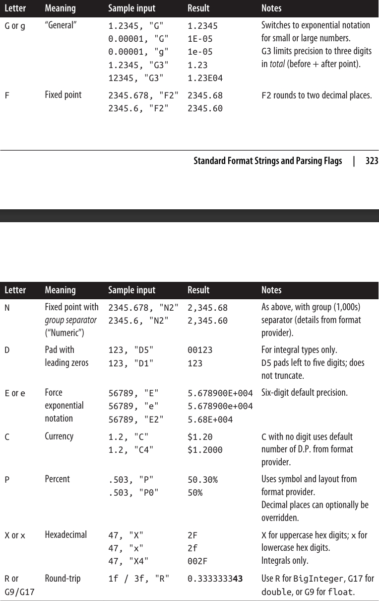 
</div>

### ارائه نکردن رشته فرمت عددی 🔢❌

اگر هیچ رشته فرمت عددی ارائه ندهید (یا رشته `null` یا خالی باشد)، معادل استفاده از رشته فرمت استاندارد `"G"` بدون رقم بعدی است. این رفتار به شرح زیر است:

* اعداد کوچکتر از $10^{-4}$ یا بزرگ‌تر از دقت نوع، به **نمای علمی (Exponential/Scientific)** تبدیل می‌شوند.
* دو رقم اعشاری در حد دقت `float` یا `double` گرد می‌شوند تا ناپیوستگی‌های ذاتی تبدیل از شکل باینری به ده‌دهی پنهان بماند.

گرد کردن خودکار توضیح داده‌شده معمولاً مفید است و معمولاً متوجه آن نمی‌شویم. با این حال، ممکن است مشکلاتی ایجاد کند اگر بخواهید یک عدد را **round-trip** کنید؛ یعنی آن را به رشته تبدیل کرده و دوباره بازگردانید (شاید چند بار) بدون آن‌که برابری مقدار از بین برود.

برای همین منظور، رشته‌های فرمت **R، G17، و G9** وجود دارند تا از گرد کردن ضمنی جلوگیری کنند.

جدول 6-3، رشته‌های فرمت عددی سفارشی را فهرست می‌کند.
<div align="center">
    
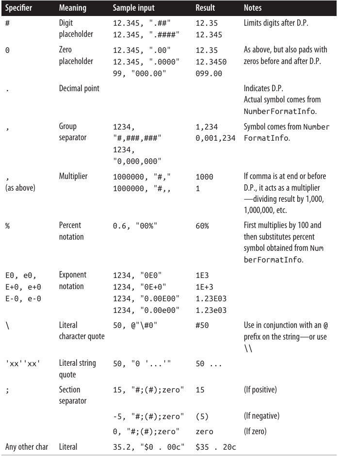 
</div>

### NumberStyles 🔢

هر نوع عددی (`numeric type`) یک متد `Parse` ایستا (static) تعریف می‌کند که یک آرگومان `NumberStyles` می‌پذیرد. `NumberStyles` یک **enum با قابلیت flags** است که به شما امکان می‌دهد مشخص کنید رشته چگونه به عدد تبدیل شود. اعضای قابل ترکیب آن عبارت‌اند از:

* `AllowLeadingWhite`
* `AllowTrailingWhite`
* `AllowLeadingSign`
* `AllowTrailingSign`
* `AllowParentheses`
* `AllowDecimalPoint`
* `AllowThousands`
* `AllowExponent`
* `AllowCurrencySymbol`
* `AllowHexSpecifier`

علاوه بر این، `NumberStyles` اعضای مرکب زیر را نیز تعریف می‌کند:

* `None`
* `Integer`
* `Float`
* `Number`
* `HexNumber`
* `Currency`
* `Any`

به جز `None`، همه مقادیر مرکب شامل `AllowLeadingWhite` و `AllowTrailingWhite` هستند. شکل 6-1 ترکیب باقی‌مانده آن‌ها را نشان می‌دهد، که سه مورد مفیدتر، برجسته شده‌اند.
<div align="center">
    
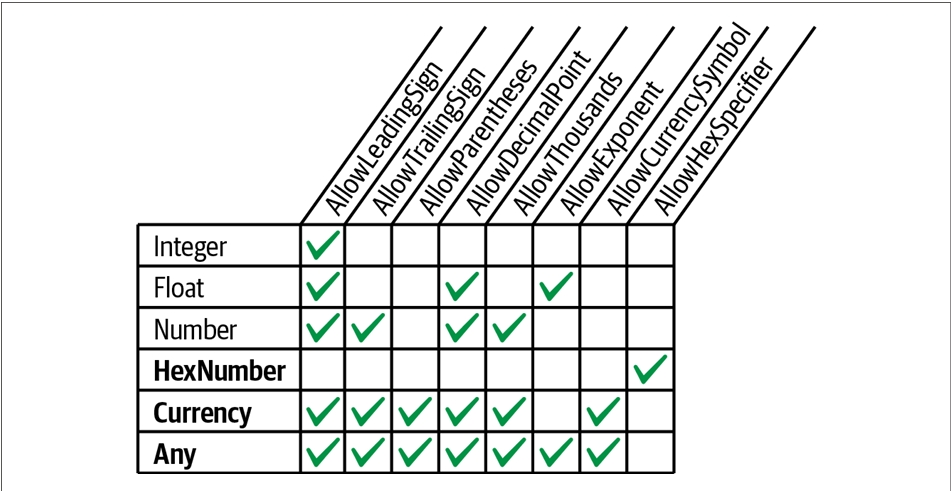 
</div>

وقتی که متد **Parse** را بدون مشخص کردن هیچ پرچمی (flag) فراخوانی می‌کنید، مقادیر پیش‌فرض نشان داده‌شده در **شکل ۶-۲** اعمال می‌شوند. 🔹
<div align="center">
    
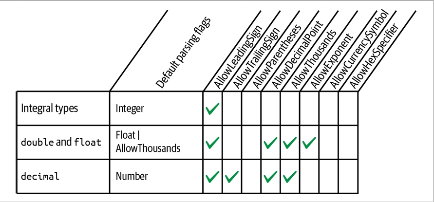 
</div>

اگر نمی‌خواهید از مقادیر پیش‌فرض نشان داده‌شده در **شکل ۶-۲** استفاده کنید، باید صریحاً **NumberStyles** را مشخص کنید:
</div>

```csharp
int thousand = int.Parse("3E8", NumberStyles.HexNumber);
int minusTwo = int.Parse("(2)", NumberStyles.Integer | NumberStyles.AllowParentheses);
double aMillion = double.Parse("1,000,000", NumberStyles.Any);
decimal threeMillion = decimal.Parse("3e6", NumberStyles.Any);
decimal fivePointTwo = decimal.Parse("$5.20", NumberStyles.Currency);
```

<div dir="rtl">

چون ما **format provider** مشخص نکردیم، این مثال با نماد پول محلی، جداکننده گروهی (group separator)، نقطه اعشار و غیره در سیستم شما کار می‌کند.

مثال بعدی به صورت سخت‌کد شده (hardcoded) است تا با علامت یورو و یک فاصله به عنوان جداکننده گروهی برای ارزها کار کند:
</div>

```csharp
NumberFormatInfo ni = new NumberFormatInfo();
ni.CurrencySymbol = "€";
ni.CurrencyGroupSeparator = " ";
double million = double.Parse("€1 000 000", NumberStyles.Currency, ni);
```

<div dir="rtl">

### رشته‌های قالب‌بندی تاریخ/زمان 🕒

رشته‌های قالب‌بندی برای **DateTime/DateTimeOffset** را می‌توان بر اساس اینکه تنظیمات فرهنگ (**culture**) و **format provider** را رعایت می‌کنند یا خیر به دو گروه تقسیم کرد. جدول ۶-۴ آن‌هایی را که رعایت می‌کنند نشان می‌دهد و جدول ۶-۵ آن‌هایی را که رعایت نمی‌کنند. خروجی نمونه از قالب‌بندی **DateTime** زیر به دست آمده است (با فرهنگ ثابت **InvariantCulture** در مورد جدول ۶-۴):
</div>

```csharp
new DateTime(2000, 1, 2, 17, 18, 19);
```

<div dir="rtl">

<div align="center">
    
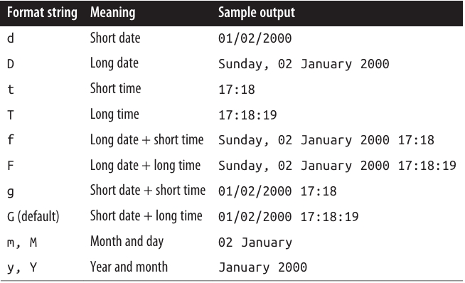 
</div>

<div align="center">
    
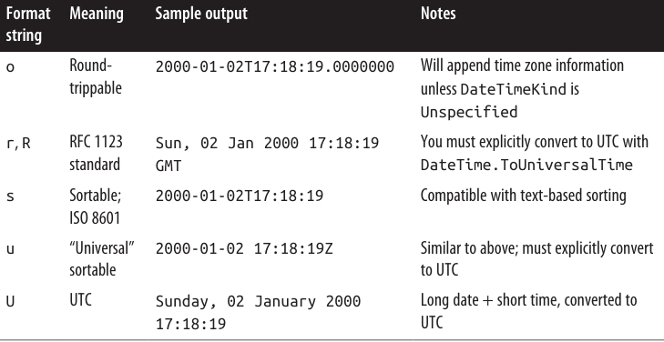 
</div>

رشته‌های قالب‌بندی `"r"`, `"R"` و `"u"` پسوندی تولید می‌کنند که **UTC** را نشان می‌دهد؛ اما به‌طور خودکار یک **DateTime محلی** را به UTC تبدیل نمی‌کنند، بنابراین شما خودتان باید تبدیل را انجام دهید. جالب اینجاست که `"U"` به‌طور خودکار به UTC تبدیل می‌شود، اما پسوند منطقه زمانی را نمی‌نویسد! در واقع، `"o"` تنها مشخصه قالب در این گروه است که می‌تواند یک **DateTime بدون ابهام** را بدون دخالت کاربر نمایش دهد.

**DateTimeFormatInfo** همچنین از رشته‌های قالب‌بندی سفارشی پشتیبانی می‌کند: این‌ها مشابه رشته‌های قالب‌بندی سفارشی عددی هستند. فهرست کامل آن‌ها گسترده است و در مستندات مایکروسافت آنلاین موجود است. یک مثال از رشته قالب‌بندی سفارشی:
</div>

```
yyyy-MM-dd HH:mm:ss
```

<div dir="rtl">

### تجزیه و اشتباه در تجزیه DateTime 🕒

رشته‌هایی که ماه یا روز را ابتدا می‌گذارند، **ابهام‌آمیز** هستند و می‌توانند به‌راحتی اشتباه تجزیه شوند—به‌ویژه اگر مشتریان جهانی داشته باشید. این مشکل در کنترل‌های رابط کاربری وجود ندارد، زیرا همان تنظیمات هنگام تجزیه و قالب‌بندی اعمال می‌شوند.

اما هنگام نوشتن در یک فایل، مثلاً، **اشتباه در تشخیص روز/ماه** می‌تواند مشکل‌ساز شود. دو راه‌حل وجود دارد:

* همیشه **فرهنگ مشخص و یکسان** را هنگام قالب‌بندی و تجزیه مشخص کنید (مثلاً **InvariantCulture**).
* **DateTime و DateTimeOffset را به‌گونه‌ای قالب‌بندی کنید که مستقل از فرهنگ باشد.**

روش دوم مقاوم‌تر است—به‌ویژه اگر قالبی انتخاب کنید که سال چهاررقمی را ابتدا قرار دهد؛ چنین رشته‌هایی برای تجزیه اشتباه توسط طرف دیگر سخت‌تر هستند. علاوه بر این، رشته‌هایی که با قالب سال‌اول استاندارد (مانند `"o"`) قالب‌بندی شده‌اند، می‌توانند به‌درستی در کنار رشته‌های قالب‌بندی‌شده محلی تجزیه شوند—مانند یک «دهنده جهانی». (تاریخ‌هایی که با `"s"` یا `"u"` قالب‌بندی شده‌اند، مزیت اضافه‌ای هم دارند: قابلیت مرتب‌سازی.)

برای مثال، فرض کنید یک رشته **DateTime** مستقل از فرهنگ تولید می‌کنیم:
</div>

```csharp
string s = DateTime.Now.ToString("o");
```

<div dir="rtl">

رشته قالب `"o"` میلی‌ثانیه‌ها را در خروجی شامل می‌کند.

رشته قالب سفارشی زیر همان خروجی `"o"` را بدون میلی‌ثانیه می‌دهد:
</div>

```
yyyy-MM-ddTHH:mm:ss K
```

<div dir="rtl">

ما می‌توانیم این رشته را به دو روش تجزیه کنیم:

* **ParseExact** نیاز به رعایت دقیق رشته قالب مشخص شده دارد:
</div>

```csharp
DateTime dt1 = DateTime.ParseExact(s, "o", null);
```

<div dir="rtl">

(می‌توانید نتیجه مشابهی با متدهای `XmlConvert.ToString` و `XmlConvert.ToDateTime` به دست آورید.)

* **Parse** به‌طور ضمنی هم قالب `"o"` و هم قالب **CurrentCulture** را می‌پذیرد:
</div>

```csharp
DateTime dt2 = DateTime.Parse(s);
```

<div dir="rtl">

این روش هم برای **DateTime** و هم **DateTimeOffset** کار می‌کند.

استفاده از **ParseExact** معمولاً ترجیح داده می‌شود اگر قالب رشته‌ای که تجزیه می‌کنید را می‌دانید، زیرا اگر رشته به‌درستی قالب‌بندی نشده باشد، **یک استثناء** پرتاب می‌شود—که معمولاً بهتر از ریسک تجزیه اشتباه تاریخ است.

---

### DateTimeStyles ⚙️

**DateTimeStyles** یک **flags enum** است که دستورالعمل‌های اضافی هنگام فراخوانی `Parse` روی **DateTime(Offset)** ارائه می‌دهد. اعضای آن عبارتند از:
</div>

```
None, AllowLeadingWhite, AllowTrailingWhite, AllowInnerWhite,
AssumeLocal, AssumeUniversal, AdjustToUniversal,
NoCurrentDateDefault, RoundTripKind
```

<div dir="rtl">

همچنین یک عضو ترکیبی به نام **AllowWhiteSpaces** وجود دارد:
</div>

```
AllowWhiteSpaces = AllowLeadingWhite | AllowTrailingWhite | AllowInnerWhite
```

<div dir="rtl">

مقدار پیش‌فرض **None** است، به این معنی که فضای خالی اضافی معمولاً مجاز نیست (فضای خالی که بخشی از الگوی استاندارد DateTime است، مستثنی است).

* **AssumeLocal** و **AssumeUniversal** زمانی اعمال می‌شوند که رشته دارای پسوند منطقه زمانی نباشد (مانند `Z` یا `+9:00`).
* **AdjustToUniversal** همچنان به پسوندهای منطقه زمانی احترام می‌گذارد، اما سپس با استفاده از تنظیمات منطقه‌ای فعلی، آن را به UTC تبدیل می‌کند.

اگر رشته‌ای شامل زمان اما بدون تاریخ باشد، به‌طور پیش‌فرض **تاریخ امروز** اعمال می‌شود. اگر پرچم **NoCurrentDateDefault** را اعمال کنید، به جای آن از **1 ژانویه 0001** استفاده می‌شود.

---

### رشته‌های قالب‌بندی Enum 🔢

در بخش «Enums» در صفحه ۱۵۴، قالب‌بندی و تجزیه مقادیر enum را توضیح دادیم.
جدول ۶-۶ هر رشته قالب‌بندی و نتیجه اعمال آن روی عبارت زیر را نشان می‌دهد:
</div>

```csharp
Console.WriteLine(System.ConsoleColor.Red.ToString(formatString));
```

<div dir="rtl">

<div align="center">
    
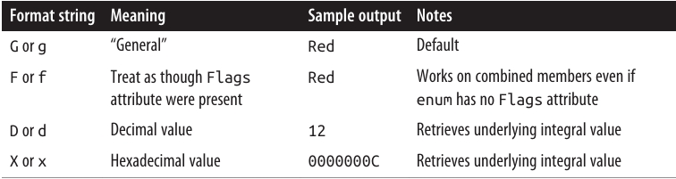 
</div>

### مکانیزم‌های دیگر تبدیل 🔄

در دو بخش قبلی، **فرمت پروایدرها** را بررسی کردیم—مکانیزم اصلی .NET برای قالب‌بندی و تجزیه. سایر مکانیزم‌های مهم تبدیل در انواع و فضای نام‌های مختلف پراکنده‌اند. برخی تبدیل به/از رشته انجام می‌دهند و برخی انواع دیگری از تبدیل‌ها را ارائه می‌کنند. در این بخش، موضوعات زیر را بررسی می‌کنیم:

* **کلاس Convert و توابع آن**:

  * تبدیل اعداد حقیقی به اعداد صحیح با **گرد کردن** به جای قطع کردن
  * تجزیه اعداد در مبناهای ۲، ۸ و ۱۶
  * تبدیل‌های داینامیک
  * ترجمه‌های **Base-64**

* **XmlConvert** و نقش آن در قالب‌بندی و تجزیه برای XML

* **Type converters** و نقش آن‌ها در قالب‌بندی و تجزیه برای طراحان و XAML

* **BitConverter** برای تبدیل‌های باینری

---

### Convert ⚡

.NET انواع زیر را **base types** می‌نامد:

* `bool`, `char`, `string`, `System.DateTime`, و `System.DateTimeOffset`
* همه انواع عددی C#

کلاس **static Convert** متدهایی برای تبدیل هر **base type** به هر **base type** دیگر ارائه می‌دهد. متأسفانه بیشتر این متدها کاربردی نیستند: یا **استثناء پرتاب می‌کنند** یا در کنار **کست‌های ضمنی** اضافی هستند. با این حال، در بین این متدها، برخی متدهای مفید نیز وجود دارند که در بخش‌های بعدی آورده شده‌اند.

تمام **base types** به‌طور صریح **IConvertible** را پیاده‌سازی می‌کنند، که متدهایی برای تبدیل به تمام **base type**های دیگر تعریف می‌کند. در بیشتر موارد، پیاده‌سازی این متدها صرفاً یک متد در **Convert** را فراخوانی می‌کند. در موارد نادر، نوشتن متدی که یک آرگومان از نوع **IConvertible** بپذیرد، مفید است.

---

### تبدیل اعداد حقیقی به صحیح با گرد کردن 🔢

در فصل ۲ دیدیم که **کست‌های ضمنی و صریح** اجازه می‌دهند بین انواع عددی تبدیل انجام دهید:

* کست‌های **ضمنی** برای تبدیل‌های بدون افت کار می‌کنند (مثلاً `int` به `double`).
* کست‌های **صریح** برای تبدیل‌های با افت لازم هستند (مثلاً `double` به `int`).

کست‌ها برای کارایی بهینه شده‌اند؛ بنابراین داده‌هایی که جا نمی‌شوند، **قطع می‌شوند**. این مشکل هنگام تبدیل از عدد حقیقی به عدد صحیح پیش می‌آید، زیرا معمولاً می‌خواهید **گرد کنید نه قطع کنید**. متدهای تبدیل عددی **Convert** این مشکل را حل می‌کنند—همیشه **گرد می‌کنند**:
</div>

```csharp
double d = 3.9;
int i = Convert.ToInt32(d);    // i == 4
```

<div dir="rtl">

Convert از **Banker’s Rounding** استفاده می‌کند، که مقادیر وسط را به عدد صحیح زوج نزدیک می‌کند (این از ایجاد **سوگیری مثبت یا منفی** جلوگیری می‌کند). اگر Banker’s Rounding مشکل‌ساز است، ابتدا می‌توانید `Math.Round` را روی عدد حقیقی فراخوانی کنید که آرگومانی برای کنترل گرد کردن مقادیر وسط دارد.

---

### تجزیه اعداد در مبناهای ۲، ۸ و ۱۶ 🔢

در بین متدهای `To(integral-type)`، **overloadهایی** وجود دارند که اعداد را در مبنای دیگر تجزیه می‌کنند:
</div>

```csharp
int thirty = Convert.ToInt32("1E", 16);    // تجزیه هگزادسیمال
uint five  = Convert.ToUInt32("101", 2);   // تجزیه باینری
```

<div dir="rtl">

آرگومان دوم **مبنا** را مشخص می‌کند. می‌تواند هر مبنایی باشد—تا زمانی که ۲، ۸، ۱۰ یا ۱۶ باشد!

---

### تبدیل‌های داینامیک ⚡

گاهی نیاز دارید از یک نوع به نوع دیگر تبدیل کنید، اما تا زمان اجرا **نوع‌ها مشخص نیستند**. برای این منظور، کلاس Convert متد `ChangeType` را ارائه می‌دهد:
</div>

```csharp
public static object ChangeType(object value, Type conversionType);
```

<div dir="rtl">

نوع منبع و مقصد باید یکی از **base type**ها باشد. `ChangeType` همچنین آرگومان اختیاری `IFormatProvider` را می‌پذیرد. مثال:
</div>

```csharp
Type targetType = typeof(int);
object source = "42";
object result = Convert.ChangeType(source, targetType);

Console.WriteLine(result);             // 42
Console.WriteLine(result.GetType());   // System.Int32
```

<div dir="rtl">

یک کاربرد مفید آن، نوشتن یک **deserializer** است که بتواند با چند نوع مختلف کار کند. همچنین می‌تواند هر **enum** را به نوع عددی متناظر خود تبدیل کند. محدودیت `ChangeType` این است که نمی‌توانید **رشته قالب یا پرچم تجزیه** مشخص کنید.

---

### تبدیل Base-64 📄

گاهی نیاز است داده باینری مانند یک **bitmap** را در یک سند متنی مانند **XML** یا ایمیل قرار دهید. **Base-64** روش متداولی است که داده باینری را با استفاده از ۶۴ کاراکتر از مجموعه ASCII به صورت قابل خواندن رمزگذاری می‌کند.

* `Convert.ToBase64String` یک آرایه بایت را به Base-64 تبدیل می‌کند.
* `Convert.FromBase64String` عکس آن را انجام می‌دهد.
### XmlConvert 🗂️

اگر با داده‌هایی سروکار دارید که منبع آن‌ها **XML** است یا قرار است در یک فایل XML ذخیره شوند، کلاس **XmlConvert** (در فضای نام `System.Xml`) مناسب‌ترین متدها را برای قالب‌بندی و تجزیه فراهم می‌کند. متدهای XmlConvert بدون نیاز به رشته قالب‌بندی خاص، جزئیات فرمت XML را مدیریت می‌کنند. برای مثال، مقدار `true` در XML به صورت `"true"` است و نه `"True"`. کتابخانه BCL در .NET به طور گسترده از XmlConvert استفاده می‌کند.

XmlConvert همچنین برای **سریال‌سازی مستقل از فرهنگ** نیز مناسب است. متدهای قالب‌بندی در XmlConvert به صورت **overloaded ToString** ارائه می‌شوند و متدهای تجزیه به شکل `ToBoolean`, `ToDateTime` و غیره هستند:
</div>

```csharp
string s = XmlConvert.ToString(true);         // s = "true"
bool isTrue = XmlConvert.ToBoolean(s);
```

<div dir="rtl">

متدهایی که به/از DateTime تبدیل می‌کنند، آرگومانی به نام **XmlDateTimeSerializationMode** می‌پذیرند که یک enum با مقادیر زیر است:

* `Unspecified`

* `Local`

* `Utc`

* `RoundtripKind`

* `Local` و `Utc` هنگام قالب‌بندی، تبدیل انجام می‌دهند (اگر DateTime در آن منطقه زمانی نباشد) و منطقه زمانی به رشته اضافه می‌شود:
</div>

```
2010-02-22T14:08:30.9375           // Unspecified
2010-02-22T14:07:30.9375+09:00     // Local
2010-02-22T05:08:30.9375Z          // Utc
```

<div dir="rtl">

* `Unspecified` هرگونه اطلاعات منطقه زمانی را از DateTime حذف می‌کند.
* `RoundtripKind` نوع DateTime را حفظ می‌کند تا هنگام تجزیه مجدد، DateTime دقیقاً همان باشد که بود.

---

### Type Converters 🎨

**Type converters** برای قالب‌بندی و تجزیه در محیط‌های **design-time** طراحی شده‌اند. آن‌ها همچنین مقادیر را در اسناد **XAML** تجزیه می‌کنند—مثلاً در **WPF**.

در .NET بیش از ۱۰۰ نوع مبدل وجود دارد که مواردی مانند رنگ‌ها، تصاویر و URIs را پوشش می‌دهند. در مقابل، فرمت پروایدرها تنها برای چند نوع ساده ارزشمند هستند.

Type converters معمولاً رشته‌ها را به روش‌های مختلف بدون نیاز به راهنما تجزیه می‌کنند. برای مثال، در یک برنامه WPF در Visual Studio، اگر رنگ پس‌زمینه یک کنترل را با نوشتن `"Beige"` در پنجره ویژگی‌ها تعیین کنید، **TypeConverter** نوع Color تشخیص می‌دهد که شما به نام رنگ اشاره کرده‌اید نه رشته RGB یا رنگ سیستم. این انعطاف‌پذیری گاهی کاربرد Type converters را فراتر از طراحان و اسناد XAML مفید می‌کند.

تمام Type converters از کلاس **TypeConverter** در `System.ComponentModel` مشتق می‌شوند. برای دریافت یک TypeConverter، از متد `TypeDescriptor.GetConverter` استفاده کنید. مثال برای نوع Color:
</div>

```csharp
TypeConverter cc = TypeDescriptor.GetConverter(typeof(Color));
```

<div dir="rtl">

TypeConverter متدهایی مانند `ConvertToString` و `ConvertFromString` دارد:
</div>

```csharp
Color beige  = (Color) cc.ConvertFromString("Beige");
Color purple = (Color) cc.ConvertFromString("#800080");
Color window = (Color) cc.ConvertFromString("Window");
```

<div dir="rtl">

به طور قراردادی، نام Type converters با **Converter** پایان می‌یابد و معمولاً در همان فضای نام نوع مورد نظر قرار دارند. هر نوع با **TypeConverterAttribute** به مبدل خود متصل است تا طراحان به‌طور خودکار مبدل‌ها را شناسایی کنند.

Type converters همچنین می‌توانند خدمات design-time ارائه دهند، مانند ایجاد فهرست مقادیر استاندارد برای منوهای کشویی یا کمک به **سریال‌سازی کد**.

---

### BitConverter 🔢

بیشتر **base types** را می‌توان به آرایه بایت تبدیل کرد با فراخوانی:
</div>

```csharp
foreach (byte b in BitConverter.GetBytes(3.5))
    Console.Write(b + " ");   // 0 0 0 0 0 0 12 64
```

<div dir="rtl">

BitConverter همچنین متدهایی مانند `ToDouble` برای تبدیل برعکس ارائه می‌دهد.

توجه: انواع `decimal` و `DateTime(Offset)` توسط BitConverter پشتیبانی نمی‌شوند، اما می‌توانید:

* **decimal** را با `decimal.GetBits` به آرایه `int` تبدیل کنید
* برای برعکس، سازنده‌ای در decimal وجود دارد که آرایه `int` می‌پذیرد
* برای DateTime، متد `ToBinary` یک `long` بازمی‌گرداند (که می‌توان با BitConverter استفاده کرد). متد `DateTime.FromBinary` عکس آن را انجام می‌دهد.

---

### جهانی‌سازی 🌍

برای بین‌المللی کردن یک برنامه، دو جنبه وجود دارد: **Globalization** و **Localization**.

* **Globalization** به سه کار مرتبط است (به ترتیب اهمیت):

  1. اطمینان از اینکه برنامه در فرهنگ‌های دیگر خراب نمی‌شود
  2. رعایت قوانین قالب‌بندی فرهنگ محلی (مثلاً نمایش تاریخ)
  3. طراحی برنامه به‌گونه‌ای که داده‌ها و رشته‌های خاص فرهنگ از **satellite assemblies** خوانده شوند

* **Localization** انجام کار سوم است با نوشتن **satellite assemblies** برای فرهنگ‌های مشخص، که بعد از نوشتن برنامه امکان‌پذیر است.

.NET برای کار دوم کمک می‌کند و به طور پیش‌فرض قوانین فرهنگ محلی را اعمال می‌کند. همانطور که دیدیم، فراخوانی `ToString` روی DateTime یا عدد، قوانین قالب‌بندی محلی را رعایت می‌کند. اما این می‌تواند باعث شکست برنامه شود اگر انتظار داشته باشید تاریخ یا اعداد طبق یک فرهنگ فرضی قالب‌بندی شوند. راه‌حل:

* یا **یک فرهنگ مشخص** (مثلاً Invariant Culture) هنگام قالب‌بندی و تجزیه تعیین کنید
* یا از روش‌های **مستقل از فرهنگ** مانند XmlConvert و `ToString("o")` استفاده کنید

**چک‌لیست جهانی‌سازی**:

* Unicode و **Text Encodings** را بشناسید
* توجه داشته باشید که متدهای `ToUpper` و `ToLower` روی char و string **حساس به فرهنگ** هستند؛ در صورت نیاز به حساسیت مستقل از فرهنگ، از `ToUpperInvariant` و `ToLowerInvariant` استفاده کنید
* برای DateTime و DateTimeOffset، از مکانیزم‌های قالب‌بندی و تجزیه مستقل از فرهنگ استفاده کنید
* در غیر این صورت، هنگام قالب‌بندی/تجزیه اعداد یا تاریخ‌ها یک فرهنگ مشخص کنید (مگر اینکه رفتار فرهنگ محلی مد نظر باشد)
### تست کردن 🧪

می‌توانید برنامه خود را با فرهنگ‌های مختلف آزمایش کنید با **تعیین مجدد ویژگی `CurrentCulture`** در کلاس **Thread** (`System.Threading`). مثال زیر فرهنگ جاری را به ترکیه تغییر می‌دهد:
</div>

```csharp
Thread.CurrentThread.CurrentCulture = CultureInfo.GetCultureInfo("tr-TR");
```

<div dir="rtl">

ترکیه یک مورد آزمایشی ویژه است زیرا:

* `"i".ToUpper() != "I"` و `"I".ToLower() != "i"`
* تاریخ‌ها به شکل **روز.ماه.سال** قالب‌بندی می‌شوند (نقطه به عنوان جداکننده)
* نشانگر اعشار به جای نقطه، **ویرگول** است

همچنین می‌توانید با تغییر **تنظیمات قالب‌بندی اعداد و تاریخ** در **کنترل پنل ویندوز** آزمایش کنید؛ این تغییرات در فرهنگ پیش‌فرض (`CultureInfo.CurrentCulture`) منعکس می‌شوند.

متد `CultureInfo.GetCultures()` آرایه‌ای از **تمام فرهنگ‌های موجود** را بازمی‌گرداند.

Thread و CultureInfo همچنین از ویژگی **CurrentUICulture** پشتیبانی می‌کنند که بیشتر با **Localization** مرتبط است و در فصل ۱۷ بررسی می‌شود.

---

### کار با اعداد 🔢

#### تبدیل‌ها

ما تبدیل‌های عددی را در فصل‌ها و بخش‌های قبلی پوشش دادیم؛ **جدول ۶-۷** تمام گزینه‌ها را خلاصه می‌کند.
<div align="center">
    
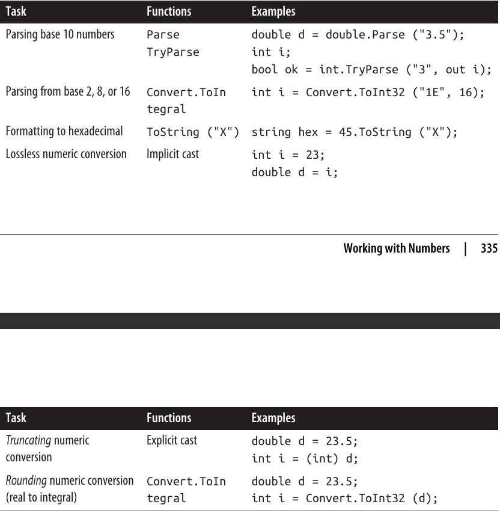 
</div>

### کلاس Math ➗

**جدول ۶-۸** اعضای کلیدی کلاس **static Math** را فهرست می‌کند.

* توابع مثلثاتی آرگومان‌هایی از نوع **double** می‌پذیرند.
* سایر متدها، مانند **Max**، برای تمام نوع‌های عددی **overload** شده‌اند.
* کلاس **Math** همچنین **ثابت‌های ریاضی** زیر را تعریف می‌کند:

  * **E** (عدد اویلر)
  * **PI** (π)
<div align="center">
    
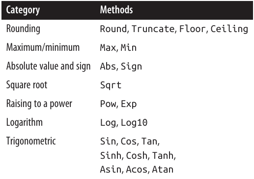 
</div>

### روش‌های گرد کردن و کلاس‌های عددی 🔢

* متد **Round** امکان مشخص کردن تعداد ارقام اعشاری برای گرد کردن و همچنین نحوه‌ی مدیریت مقادیر وسطی (گرد کردن به سمت صفر یا **banker’s rounding**) را فراهم می‌کند.
* **Floor** و **Ceiling** به نزدیک‌ترین عدد صحیح گرد می‌کنند: **Floor** همیشه پایین می‌رود و **Ceiling** همیشه بالا می‌رود—even برای اعداد منفی.

---

### Max و Min

* این متدها تنها دو آرگومان می‌پذیرند.
* برای آرایه‌ها یا دنباله‌های عددی، از **extension method**های **Max** و **Min** در **System.Linq.Enumerable** استفاده کنید.

---

### BigInteger 🧮

* ساختار **BigInteger** یک نوع عددی تخصصی است که در فضای نام **System.Numerics** قرار دارد و امکان نمایش اعداد صحیح بسیار بزرگ بدون از دست دادن دقت را فراهم می‌کند.
* C# به صورت بومی از **BigInteger** پشتیبانی نمی‌کند، بنابراین نمی‌توان **literal**های BigInteger را نوشت. با این حال، می‌توان از هر نوع صحیح دیگر به صورت **implicit** به BigInteger تبدیل کرد:
</div>

```csharp
BigInteger twentyFive = 25;  // تبدیل ضمنی از integer
```

<div dir="rtl">

* برای نمایش عدد بزرگ‌تر مانند یک گوگول $10¹⁰⁰$ می‌توان از متدهای static مانند **Pow** استفاده کرد:
</div>

```csharp
BigInteger googol = BigInteger.Pow(10, 100);
```

<div dir="rtl">

* یا با **Parse** یک رشته:
</div>

```csharp
BigInteger googol = BigInteger.Parse("1".PadRight(101, '0'));
```

<div dir="rtl">

* متد **ToString()** همه ارقام را چاپ می‌کند:
</div>

```csharp
Console.WriteLine(googol.ToString());
```

<div dir="rtl">

* تبدیل‌های ممکن اما با احتمال از دست دادن دقت بین BigInteger و انواع عددی استاندارد با استفاده از **explicit cast** انجام می‌شود:
</div>

```csharp
double g2 = (double)googol;        // تبدیل صریح
BigInteger g3 = (BigInteger)g2;    // تبدیل صریح
```

<div dir="rtl">

* **BigInteger** همه عملگرهای حسابی از جمله باقی‌مانده (%) و عملگرهای مقایسه و برابری را overload کرده است.
* همچنین می‌توان یک **BigInteger** را از یک آرایه بایت ساخت، که برای کاربردهای رمزنگاری مفید است:
</div>

```csharp
RandomNumberGenerator rand = RandomNumberGenerator.Create();
byte[] bytes = new byte[32];
rand.GetBytes(bytes);
var bigRandomNumber = new BigInteger(bytes);
```

<div dir="rtl">

* مزیت ذخیره این اعداد در BigInteger نسبت به آرایه بایت این است که **semantics نوع مقداری (value-type semantics)** حفظ می‌شود.

---

### Half 🟰

* **Half** یک نوع عدد اعشاری ۱۶ بیتی است که با .NET 5 معرفی شد و بیشتر برای تعامل با پردازنده‌های کارت گرافیک طراحی شده است.
* تبدیل بین **Half** و **float/double** با **explicit cast** امکان‌پذیر است:
</div>

```csharp
Half h = (Half)123.456;
Console.WriteLine(h); // 123.44  (توجه به از دست رفتن دقت)
```

<div dir="rtl">

* عملیات حسابی برای این نوع تعریف نشده است؛ بنابراین باید قبل از محاسبه آن را به float یا double تبدیل کنید.
* محدوده Half: -65500 تا 65500

---

### Complex 🔷

* **Complex** یک نوع عددی تخصصی برای اعداد مختلط با اجزای **double** است و در همان فضای نام BigInteger قرار دارد.
* نمونه‌سازی:
</div>

```csharp
var c1 = new Complex(2, 3.5);
var c2 = new Complex(3, 0);
```

<div dir="rtl">

* ویژگی‌ها: **Real، Imaginary، Phase، Magnitude**
* ساخت بر اساس قطب (magnitude و phase):
</div>

```csharp
Complex c3 = Complex.FromPolarCoordinates(1.3, 5);
```

<div dir="rtl">

* عملگرهای حسابی استاندارد نیز برای Complex overload شده‌اند.

---

### Random 🎲

* کلاس **Random** دنباله‌ای شبه‌تصادفی از بایت‌ها، اعداد صحیح یا doubleها تولید می‌کند.
* می‌توان یک seed برای تولید عدد تصادفی مشخص کرد تا نتایج تکرارپذیر باشد:
</div>

```csharp
Random r1 = new Random(1);
Random r2 = new Random(1);
```

<div dir="rtl">

* **Next(n)** عدد صحیح تصادفی بین ۰ و n-1 تولید می‌کند.
* **NextDouble()** عدد اعشاری تصادفی بین ۰ و ۱ می‌دهد.
* از .NET 8، متدهای **GetItems** و **Shuffle** برای انتخاب و مرتب‌سازی تصادفی عناصر فراهم شده است.
* برای کاربردهای امنیتی، باید از **System.Security.Cryptography.RandomNumberGenerator** استفاده کرد:
</div>

```csharp
var rand = System.Security.Cryptography.RandomNumberGenerator.Create();
byte[] bytes = new byte[32];
rand.GetBytes(bytes);
```

<div dir="rtl">

این توضیحات پایه‌های کار با اعداد و انواع تخصصی در C# را پوشش می‌دهند.
### BitOperations 🔧

کلاس **System.Numerics.BitOperations** (از .NET 6) متدهایی را برای عملیات پایه‌ای بر مبنای ۲ ارائه می‌دهد:

* **IsPow2**
  بررسی می‌کند که آیا یک عدد توان ۲ است یا خیر.
* **LeadingZeroCount / TrailingZeroCount**
  تعداد صفرهای پیشرو یا پسرو را وقتی عدد به صورت یک unsigned integer ۳۲ یا ۶۴ بیتی نمایش داده می‌شود، برمی‌گرداند.
* **Log2**
  لگاریتم پایه ۲ یک عدد unsigned را برمی‌گرداند.
* **PopCount**
  تعداد بیت‌های تنظیم‌شده روی ۱ در یک unsigned integer را برمی‌گرداند.
* **RotateLeft / RotateRight**
  چرخش بیتی به چپ یا راست انجام می‌دهد.
* **RoundUpToPowerOf2**
  یک unsigned integer را به نزدیک‌ترین توان ۲ گرد می‌کند.

---

### Enumها ⚙️

در فصل ۳، نوع **enum** در C# را معرفی کردیم و نحوه ترکیب اعضا، تست برابری، استفاده از عملگرهای منطقی و انجام تبدیل‌ها را توضیح دادیم. .NET پشتیبانی از enumها را با نوع **System.Enum** گسترش می‌دهد که دو نقش دارد:

* **یکپارچه‌سازی نوعی** برای همه enumها
* تعریف متدهای **utility** استاتیک

**یکپارچه‌سازی نوعی** یعنی می‌توانید هر عضو enum را به صورت implicit به یک instance از System.Enum تبدیل کنید:
</div>

```csharp
Display(Nut.Macadamia);     // Nut.Macadamia
Display(Size.Large);        // Size.Large

void Display(Enum value)
{
    Console.WriteLine(value.GetType().Name + "." + value.ToString());
}

enum Nut  { Walnut, Hazelnut, Macadamia }
enum Size { Small, Medium, Large }
```

<div dir="rtl">

متدهای utility استاتیک روی **System.Enum** بیشتر برای انجام تبدیل‌ها و گرفتن لیست اعضا استفاده می‌شوند.

---

### تبدیل Enumها 🔄

سه روش برای نمایش مقدار یک enum وجود دارد:

1. به عنوان **عضو enum**
2. به عنوان **مقدار صحیح underlying**
3. به عنوان **رشته (string)**

#### Enum به عدد صحیح

تبدیل صریح بین عضو enum و مقدار عددی آن امکان‌پذیر است:
</div>

```csharp
[Flags] 
public enum BorderSides { Left=1, Right=2, Top=4, Bottom=8 }

int i = (int) BorderSides.Top;       // i == 4
BorderSides side = (BorderSides)i;   // side == BorderSides.Top
```

<div dir="rtl">

برای یک **System.Enum**، ابتدا به **object** تبدیل کنید و سپس به نوع عددی:
</div>

```csharp
static int GetIntegralValue(Enum anyEnum)
{
    return (int)(object)anyEnum;
}
```

<div dir="rtl">

* اگر نوع عددی enum مشخص نباشد، این روش ممکن است با خطا مواجه شود.

روش دیگر استفاده از **Convert.ToDecimal** است:
</div>

```csharp
static decimal GetAnyIntegralValue(Enum anyEnum)
{
    return Convert.ToDecimal(anyEnum);
}
```

<div dir="rtl">

روش سوم، استفاده از **Enum.GetUnderlyingType** و **Convert.ChangeType** است تا نوع اصلی حفظ شود:
</div>

```csharp
static object GetBoxedIntegralValue(Enum anyEnum)
{
    Type integralType = Enum.GetUnderlyingType(anyEnum.GetType());
    return Convert.ChangeType(anyEnum, integralType);
}

object result = GetBoxedIntegralValue(BorderSides.Top);
Console.WriteLine(result);           // 4
Console.WriteLine(result.GetType()); // System.Int32
```

<div dir="rtl">

همچنین می‌توانید از **ToString("D")** برای گرفتن مقدار عددی به صورت رشته استفاده کنید:
</div>

```csharp
static string GetIntegralValueAsString(Enum anyEnum)
{
    return anyEnum.ToString("D");  // خروجی چیزی شبیه "4"
}
```

<div dir="rtl">

#### عدد صحیح به Enum

برای تبدیل عدد صحیح به enum، از **Enum.ToObject** استفاده می‌کنیم:
</div>

```csharp
object bs = Enum.ToObject(typeof(BorderSides), 3);
Console.WriteLine(bs);  // Left, Right
```

<div dir="rtl">

این نسخه داینامیک معادل:
</div>

```csharp
BorderSides bs = (BorderSides)3;
```

<div dir="rtl">

است و برای همه نوع‌های عددی و object قابل استفاده است.

#### تبدیل به رشته

* برای تبدیل enum به رشته، می‌توانید از **Enum.Format** یا **ToString** استفاده کنید.
* فرمت‌ها:

  * "G" : پیش‌فرض
  * "D" : مقدار عددی underlying
  * "X" : همان مقدار به صورت هگزادسیمال
  * "F" : فرمت اعضای ترکیبی بدون **Flags**

#### تبدیل رشته به Enum

* برای تبدیل رشته به enum از **Enum.Parse** استفاده کنید:
</div>

```csharp
BorderSides leftRight = (BorderSides) Enum.Parse(
    typeof(BorderSides),
    "Left, Right"
);
```

<div dir="rtl">

* آرگومان اختیاری سوم برای حساسیت به حروف بزرگ و کوچک است.
* اگر عضو پیدا نشود، **ArgumentException** پرتاب می‌شود.
### پیمایش مقادیر Enum 🔍

متد **Enum.GetValues** آرایه‌ای شامل تمام اعضای یک نوع enum مشخص را برمی‌گرداند:
</div>

```csharp
foreach (Enum value in Enum.GetValues(typeof(BorderSides)))
    Console.WriteLine(value);
```

<div dir="rtl">

* اعضای مرکب مانند `LeftRight = Left | Right` نیز شامل می‌شوند.
* **Enum.GetNames** عملکرد مشابه دارد اما آرایه‌ای از رشته‌ها برمی‌گرداند.
* در واقع، CLR با **reflection** روی فیلدهای نوع enum، این متدها را پیاده‌سازی می‌کند و نتایج را برای بهینه‌سازی در حافظه کش می‌کند.

---

### نحوه کار Enum ⚙️

* معنای Enumها عمدتاً توسط **کامپایلر** اعمال می‌شود.
* در CLR، تفاوت زمان اجرا بین یک instance از enum (هنگام unboxed بودن) و مقدار عددی underlying آن وجود ندارد.
* تعریف یک enum در CLR فقط یک subtype از **System.Enum** با فیلدهای استاتیک عددی برای هر عضو است.
* این باعث می‌شود استفاده معمول از enum بسیار بهینه باشد و هزینه اجرای آن مشابه ثابت‌های عددی باشد.

**نکته منفی:** Enumها نوع ایمنی قوی ارائه نمی‌دهند. مثال:
</div>

```csharp
[Flags] public enum BorderSides { Left=1, Right=2, Top=4, Bottom=8 }
BorderSides b = BorderSides.Left;
b += 1234;  // خطا ندارد!
```

<div dir="rtl">

* وقتی کامپایلر قادر به اعتبارسنجی نباشد، runtime کمکی برای پرتاب استثنا ندارد.

با وجود اینکه یک instance از enum و مقدار عددی آن در runtime تفاوتی ندارند، اما کد زیر به شکل متفاوتی عمل می‌کند:
</div>

```csharp
Console.WriteLine(BorderSides.Right.ToString());    // Right
Console.WriteLine(BorderSides.Right.GetType().Name); // BorderSides
```

<div dir="rtl">

* دلیل این رفتار این است که **C#** قبل از فراخوانی متدهای virtual مثل `ToString` یا `GetType`، instance را boxing می‌کند و یک wrapper runtime برای نوع enum ایجاد می‌شود.

---

### Struct Guid 🆔

* **Guid** نماینده یک **شناسه یکتا جهانی** است: یک مقدار ۱۶ بایتی که تقریباً همیشه در جهان یکتا است.
* از Guidها معمولاً به عنوان کلید در برنامه‌ها و پایگاه‌های داده استفاده می‌شود.
* تعداد کل Guidهای یکتا: $2^{128}$ یا تقریباً $3.4 × 10^{38}$.

**ساخت یک Guid جدید:**
</div>

```csharp
Guid g = Guid.NewGuid();
Console.WriteLine(g.ToString());  // 0d57629c-7d6e-4847-97cb-9e2fc25083fe
```

<div dir="rtl">

**ساخت Guid از مقادیر موجود:**
</div>

```csharp
public Guid(byte[] b);  // آرایه 16 بایتی
public Guid(string g);   // رشته قالب‌بندی شده
```

<div dir="rtl">

* فرمت رشته‌ای: ۳۲ رقم هگزادسیمال با خط تیره اختیاری بعد از رقم‌های ۸، ۱۲، ۱۶ و ۲۰.
* می‌توان کل رشته را در براکت یا آکولاد قرار داد:
</div>

```csharp
Guid g1 = new Guid("{0d57629c-7d6e-4847-97cb-9e2fc25083fe}");
Guid g2 = new Guid("0d57629c7d6e484797cb9e2fc25083fe");
Console.WriteLine(g1 == g2);  // True
```

<div dir="rtl">

* Guid به عنوان struct رفتار value-type دارد، بنابراین عملگر equality در مثال بالا درست کار می‌کند.
* متد **ToByteArray** یک Guid را به آرایه بایت تبدیل می‌کند.
* **Guid.Empty** یک Guid خالی (تمام صفر) برمی‌گرداند که اغلب به جای null استفاده می‌شود.

---

### مقایسه برابری ⚖️

* تا اینجا فرض کردیم که عملگرهای `==` و `!=` برای مقایسه کافی هستند، اما مسئله برابری پیچیده‌تر است.
* دو نوع برابری وجود دارد:

1. **Value equality**

   * دو مقدار از نظر محتوا برابر هستند.
2. **Referential equality**

   * دو reference به همان شیء اشاره می‌کنند.

* مگر اینکه override شده باشد:

  * **Value types** از برابری مقداری استفاده می‌کنند.
  * **Reference types** از برابری مرجع استفاده می‌کنند (مگر در anonymous types و records).

مثال برابری مقداری:
</div>

```csharp
int x = 5, y = 5;
Console.WriteLine(x == y);  // True
```

<div dir="rtl">

مثال برابری مقداری پیچیده‌تر با DateTimeOffset:
</div>

```csharp
var dt1 = new DateTimeOffset(2010,1,1,1,1,1, TimeSpan.FromHours(8));
var dt2 = new DateTimeOffset(2010,1,1,2,1,1, TimeSpan.FromHours(9));
Console.WriteLine(dt1 == dt2);  // True
```

<div dir="rtl">

* **DateTimeOffset** struct است و رفتار برابری آن طوری تعریف شده که اگر نقطه زمانی یکسان باشد، مقدار برابر تلقی شود.

مثال برابری مرجع:
</div>

```csharp
class Foo { public int X; }
Foo f1 = new Foo { X = 5 };
Foo f2 = new Foo { X = 5 };
Console.WriteLine(f1 == f2); // False

Foo f3 = f1;
Console.WriteLine(f1 == f3); // True
```

<div dir="rtl">

* می‌توان reference types را طوری سفارشی کرد که رفتار برابری مقداری داشته باشند، مانند کلاس **Uri**:
</div>

```csharp
Uri uri1 = new Uri("http://www.linqpad.net");
Uri uri2 = new Uri("http://www.linqpad.net");
Console.WriteLine(uri1 == uri2);  // True
```

<div dir="rtl">

* کلاس **string** رفتار مشابه دارد:
</div>

```csharp
var s1 = "http://www.linqpad.net";
var s2 = "http://" + "www.linqpad.net";
Console.WriteLine(s1 == s2);  // True
```

<div dir="rtl">

### پروتکل‌های استاندارد برابری ⚖️

سه پروتکل استاندارد برای مقایسه برابری در C# وجود دارد:

1. عملگرهای `==` و `!=`
2. متد **virtual Equals** در `object`
3. اینترفیس **IEquatable<T>**

همچنین، پروتکل‌های قابل اتصال (pluggable) و اینترفیس **IStructuralEquatable** نیز وجود دارند که در فصل ۷ توضیح داده می‌شوند.

---

### عملگرهای == و !=

* این عملگرها **static** هستند و **در زمان کامپایل** تصمیم می‌گیرند که چه نوعی مقایسه را انجام دهد.
* مثال:
</div>

```csharp
int x = 5;
int y = 5;
Console.WriteLine(x == y);  // True
```

<div dir="rtl">

* اما اگر از object استفاده کنیم:
</div>

```csharp
object x = 5;
object y = 5;
Console.WriteLine(x == y);  // False
```

<div dir="rtl">

* چرا؟ چون object یک نوع مرجع است و عملگر `==` برای آن **برابری مرجع** (referential equality) را اعمال می‌کند.
* نتیجه `False` است چون x و y هر کدام به یک شیء boxed جداگانه اشاره دارند.

---

### متد virtual Object.Equals

* متد **Equals** در `System.Object` تعریف شده و برای تمام نوع‌ها در دسترس است.
* این متد **در زمان اجرا** (runtime) بر اساس نوع واقعی شیء تصمیم می‌گیرد.
* مثال:
</div>

```csharp
object x = 5;
object y = 5;
Console.WriteLine(x.Equals(y));  // True
```

<div dir="rtl">

* توضیح:

  * برای **struct**ها، Equals با مقایسه ساختاری (structural) روی همه فیلدها کار می‌کند.
  * برای **reference type**ها، به صورت پیش‌فرض مقایسه مرجع انجام می‌دهد.

---

### چرا پیچیدگی وجود دارد؟

چرا `==` virtual نیست و دقیقاً مثل Equals عمل نمی‌کند؟ دلایل:

1. اگر اولین آرگومان null باشد، Equals با **NullReferenceException** مواجه می‌شود؛ عملگر static چنین خطایی ندارد.
2. گاهی مفید است که `==` و `Equals` تعاریف متفاوتی از برابری داشته باشند.
3. چون `==` **static و compile-time** است، بسیار سریع اجرا می‌شود؛ این برای کدهای محاسباتی سنگین اهمیت دارد.

---

### مثال: مقایسه ایمن دو شیء

روش نامطمئن (ممکن است خطای null بدهد):
</div>

```csharp
public static bool AreEqual(object obj1, object obj2) 
    => obj1.Equals(obj2);
```

<div dir="rtl">

روش ایمن با بررسی null:
</div>

```csharp
public static bool AreEqual(object obj1, object obj2)
{
    if (obj1 == null) return obj2 == null;
    return obj1.Equals(obj2);
}
```

<div dir="rtl">

نسخه کوتاه‌تر:
</div>

```csharp
public static bool AreEqual(object obj1, object obj2)
    => obj1 == null ? obj2 == null : obj1.Equals(obj2);
```

<div dir="rtl">

### متد ایستا `object.Equals`

کلاس `object` یک متد ایستا **Equals** هم دارد که همان کار `AreEqual` را انجام می‌دهد، اما با دو پارامتر:
</div>

```csharp
public static bool Equals(object objA, object objB)
```

<div dir="rtl">

* این متد **null-safe** است و برای مواقعی که نوع‌ها در زمان کامپایل مشخص نیستند مناسب است:
</div>

```csharp
object x = 3, y = 3;
Console.WriteLine(object.Equals(x, y)); // True

x = null;
Console.WriteLine(object.Equals(x, y)); // False

y = null;
Console.WriteLine(object.Equals(x, y)); // True
```

<div dir="rtl">

* کاربرد مفید: **نوشتن نوع‌های generic**.

  * اگر از عملگر `==` یا `!=` استفاده کنیم، کامپایل نمی‌شود.
  * مثال:
</div>

```csharp
class Test<T>
{
    T _value;
    public void SetValue(T newValue)
    {
        if (!object.Equals(newValue, _value))
        {
            _value = newValue;
            OnValueChanged();
        }
    }
    protected virtual void OnValueChanged() { ... }
}
```

<div dir="rtl">

* جایگزین بهینه: استفاده از **EqualityComparer<T>** (از Boxing جلوگیری می‌کند):
</div>

```csharp
if (!EqualityComparer<T>.Default.Equals(newValue, _value))
```

<div dir="rtl">

---

### متد ایستا `object.ReferenceEquals`

* برای اعمال **برابری مرجع** (referential equality) استفاده می‌شود:
</div>

```csharp
Widget w1 = new Widget();
Widget w2 = new Widget();
Console.WriteLine(object.ReferenceEquals(w1, w2)); // False
```

<div dir="rtl">

* کاربرد: اگر کلاس `Widget` متد `Equals` را override کرده باشد یا `==` را overload کرده باشد، `ReferenceEquals` تضمین می‌کند که برابری واقعی مرجع بررسی شود.
* جایگزین دیگر: cast به `object` و سپس استفاده از `==`.

---

### اینترفیس `IEquatable<T>`

* مشکل `object.Equals` این است که برای **value type**ها boxing ایجاد می‌کند، که هزینه‌بر است.
* راه حل: `IEquatable<T>`:
</div>

```csharp
public interface IEquatable<T>
{
    bool Equals(T other);
}
```

<div dir="rtl">

* مزیت: همان نتیجه `Equals` را می‌دهد ولی بدون boxing.
* مثال استفاده در generic:
</div>

```csharp
class Test<T> where T : IEquatable<T>
{
    public bool IsEqual(T a, T b)
    {
        return a.Equals(b); // بدون boxing
    }
}
```

<div dir="rtl">

---

### زمانی که `Equals` و `==` برابر نیستند

* مثال با `double.NaN`:
</div>

```csharp
double x = double.NaN;
Console.WriteLine(x == x);       // False
Console.WriteLine(x.Equals(x));  // True
```

<div dir="rtl">

* دلیل:

  * `==` از نظر ریاضیاتی، NaN را حتی با خودش برابر نمی‌داند.
  * `Equals` باید **بازتابی (reflexive)** باشد و همیشه `x.Equals(x)` true برگرداند.

* استفاده عملی: Collections و دیکشنری‌ها برای پیدا کردن آیتم‌ها به رفتار `Equals` تکیه دارند.

* مثال با `StringBuilder`:
</div>

```csharp
var sb1 = new StringBuilder("foo");
var sb2 = new StringBuilder("foo");

Console.WriteLine(sb1 == sb2);       // False (برابری مرجع)
Console.WriteLine(sb1.Equals(sb2));  // True  (برابری مقدار)
```

<div dir="rtl">

* نتیجه: در نوع‌های reference، اغلب `Equals` برای برابری مقدار سفارشی شده و `==` برای برابری مرجع باقی می‌ماند.
### برابری و نوع‌های سفارشی

#### رفتار پیش‌فرض برابری:

* **Value types** از **value equality** استفاده می‌کنند.
* **Reference types** از **referential equality** استفاده می‌کنند مگر اینکه override شود (مثلاً در anonymous types و records).
* متد `Equals` در struct به‌طور پیش‌فرض **structural value equality** اعمال می‌کند (هر فیلد مقایسه می‌شود).

گاهی لازم است این رفتار را تغییر دهید:

1. **تغییر معنای برابری**

   * وقتی رفتار پیش‌فرض `==` یا `Equals` برای نوع شما طبیعی نیست یا مصرف‌کننده انتظار دیگری دارد.
   * مثال: `DateTimeOffset` که می‌خواهیم فقط UTC DateTime مقایسه شود و نه offset.
   * مثال دیگر: انواع عددی با NaN مثل `float` و `double`.
   * در کلاس‌ها، گاهی **value equality** طبیعی‌تر است تا **referential equality** (مثلاً `System.Uri` یا `System.String`).
   * در **records**، کامپایلر به‌طور خودکار structural equality ایجاد می‌کند، اما گاهی نیاز به اصلاح مقایسه برخی فیلدها داریم.

2. **افزایش سرعت برابری برای structs**

   * الگوریتم پیش‌فرض مقایسه struct کند است.
   * با override کردن `Equals` و پیاده‌سازی `IEquatable<T>` و overload کردن `==` می‌توان سرعت را چند برابر کرد.
   * برای reference types، override برابری تأثیر چندانی روی سرعت ندارد چون برابری مرجع سریع است.

#### مراحل override برابری:

1. Override کردن **GetHashCode()** و **Equals()**
2. (اختیاری) overload کردن **!=** و **==**
3. (اختیاری) پیاده‌سازی **IEquatable<T>**

* در **records**: کامپایلر خود به خود این‌ها را override می‌کند. اگر بخواهید تغییر دهید، متد `Equals` باید به شکل زیر باشد:
</div>

```csharp
record Test(int X, int Y)
{
    public virtual bool Equals(Test t) => t != null && t.X == X && t.Y == Y;
}
```

<div dir="rtl">

* متد `Equals` **virtual** است و پارامتر actual record type را می‌گیرد.
* باید `GetHashCode` هم override شود، اما نیازی به overload کردن `==` و `!=` یا پیاده‌سازی `IEquatable<T>` نیست.

---

### Override کردن `GetHashCode`

* کاربرد: بهینه‌سازی برای **Hashtable** و **Dictionary\<TKey,TValue>**
* نکات:

  * اگر `Equals(a,b)` true بود، `GetHashCode(a)` و `GetHashCode(b)` باید یکسان باشد.
  * نباید exception بدهد.
  * باید مقدار ثابت برگرداند مگر اینکه شیء تغییر کرده باشد.
* برای structs، override کردن `GetHashCode` می‌تواند الگوریتم hashing را بهینه کند.
* برای classes، مقدار پیش‌فرض بر اساس internal object token است.
* هش قابل اعتماد معمولاً بر اساس **immutable fields** محاسبه می‌شود تا بعد از افزودن به دیکشنری، دسترسی از بین نرود.

---

### Override کردن `Equals`

* اصول:

  * شیء نمی‌تواند برابر null باشد (مگر nullable type)
  * بازتابی (reflexive): `x.Equals(x)` همیشه true
  * جابجایی (commutative): اگر `a.Equals(b)` آنگاه `b.Equals(a)`
  * ترانزیتیو (transitive): اگر `a.Equals(b)` و `b.Equals(c)` آنگاه `a.Equals(c)`
  * قابل تکرار و reliable باشد

---

### Overload کردن `==` و `!=`

* اغلب در structs انجام می‌شود، چون بدون آن `==` و `!=` کار نمی‌کنند.

* در classes:

  1. رها کردن `==` و `!=` برای برابری مرجع (رایج‌ترین)
  2. overload کردن آنها مطابق `Equals` برای کلاس‌های immutable (مثل `string` و `Uri`)

* نکته: overload کردن `!=` که معنای متفاوتی نسبت به `!(==)` بدهد، بسیار نادر است.

  * مثال: انواع `System.Data.SqlTypes` که منطق مقایسه null را مطابق SQL اعمال می‌کنند.
### پیاده‌سازی `IEquatable<T>`

پیاده‌سازی `IEquatable<T>` به شما اجازه می‌دهد که متد `Equals` سریع‌تر و بدون boxing برای **value types** اجرا شود. نتایج آن باید با `object.Equals` مطابقت داشته باشد.

#### مثال: struct Area

فرض کنید struct‌ای داریم که مساحت را نشان می‌دهد و طول و عرض قابل تبادل هستند (مثلاً 5 × 10 با 10 × 5 برابر است):
</div>

```csharp
public struct Area : IEquatable<Area>
{
    public readonly int Measure1;
    public readonly int Measure2;

    public Area(int m1, int m2)
    {
        Measure1 = Math.Min(m1, m2);
        Measure2 = Math.Max(m1, m2);
    }

    public override bool Equals(object other)
        => other is Area a && Equals(a);  // فراخوانی Equals نوع خاص

    public bool Equals(Area other)          // پیاده‌سازی IEquatable<Area>
        => Measure1 == other.Measure1 && Measure2 == other.Measure2;

    public override int GetHashCode()
        => HashCode.Combine(Measure1, Measure2);

    public static bool operator ==(Area a1, Area a2) => Equals(a1, a2);
    public static bool operator !=(Area a1, Area a2) => !(a1 == a2);
}
```

<div dir="rtl">

* از `HashCode.Combine` برای تولید **hashcode ترکیبی** استفاده شده است.
* از C# 10 به بعد، می‌توان این struct را به صورت **record struct** تعریف کرد و نیاز به کد بعد از constructor نیست.

#### استفاده از struct Area:
</div>

```csharp
Area a1 = new Area(5, 10);
Area a2 = new Area(10, 5);

Console.WriteLine(a1.Equals(a2));  // True
Console.WriteLine(a1 == a2);       // True
```

<div dir="rtl">

---

### مقایسه قابل پیکربندی (Pluggable Equality Comparers)

اگر بخواهید نوعی رفتار برابری مخصوص یک سناریو داشته باشد، می‌توانید از **`IEqualityComparer`** استفاده کنید. این برای کلاس‌های collection استاندارد بسیار مفید است و در فصل بعد (“Plugging in Equality and Order”) توضیح داده می‌شود.

---

### مقایسه ترتیب (Order Comparison)

C# و .NET دو پروتکل استاندارد برای ترتیب‌دهی اشیا دارند:

1. **رابط‌های IComparable** (`IComparable` و `IComparable<T>`)
2. **اپراتورهای < و >**

* رابط‌های IComparable برای الگوریتم‌های مرتب‌سازی عمومی استفاده می‌شوند.
* اپراتورهای < و > بیشتر برای انواع عددی هستند و statically resolved هستند، بنابراین سریع و مناسب محاسبات سنگین می‌شوند.
* همچنین پروتکل‌های قابل پیکربندی ترتیب‌دهی از طریق **IComparer** فراهم شده‌اند (فصل 7).

#### IComparable و IComparable<T>
</div>

```csharp
public interface IComparable       { int CompareTo(object other); }
public interface IComparable<in T> { int CompareTo(T other); }
```

<div dir="rtl">

* `CompareTo` رفتار زیر را دارد:

  * اگر `a` بعد از `b` باشد → مثبت
  * اگر `a` با `b` برابر باشد → صفر
  * اگر `a` قبل از `b` باشد → منفی

مثال:
</div>

```csharp
Console.WriteLine("Beck".CompareTo("Anne"));   // 1
Console.WriteLine("Beck".CompareTo("Beck"));   // 0
Console.WriteLine("Beck".CompareTo("Chris"));  // -1
```

<div dir="rtl">

* بیشتر **base types** هر دو این رابط‌ها را پیاده‌سازی می‌کنند.
* هنگام تعریف custom types هم می‌توان این رابط‌ها را پیاده‌سازی کرد تا مرتب‌سازی نوع شما به راحتی انجام شود.
### IComparable در مقابل Equals

وقتی یک نوع هم `Equals` را override کرده و هم رابط‌های `IComparable` را پیاده‌سازی می‌کند، انتظار داریم که:

* اگر `Equals` برابر بودن دو شی را گزارش دهد → `CompareTo` باید 0 بازگرداند.
* اما اگر `Equals` برابر بودن را رد کند → `CompareTo` می‌تواند هر عددی بازگرداند، فقط باید **داخلی سازگار باشد**.

به عبارت دیگر، برابری می‌تواند سخت‌گیرتر از ترتیب باشد، اما ترتیب نمی‌تواند سخت‌گیرتر از برابری باشد.

#### مثال System.String

* `Equals` و `==` از **مقایسه ordinal** استفاده می‌کنند (مقادیر Unicode هر کاراکتر).
* `CompareTo` از **مقایسه وابسته به فرهنگ** استفاده می‌کند، پس ممکن است چندین کاراکتر در یک موقعیت مرتب‌سازی قرار بگیرند.

> توجه: اگر بخواهید نظم مرتب‌سازی متفاوتی داشته باشید، می‌توانید از **IComparer قابل پیکربندی** استفاده کنید (مثلاً مقایسه بدون حساسیت به حروف کوچک/بزرگ).

---

### پیاده‌سازی IComparable و اپراتورهای < و >

* وقتی `CompareTo` را پیاده‌سازی می‌کنید، خط اول آن بهتر است همیشه چنین باشد:
</div>

```csharp
if (Equals(other)) return 0;
```

<div dir="rtl">

* بعد از آن، می‌تواند هر مقدار سازگار برگرداند.

* اپراتورهای `<` و `>` معمولاً با `IComparable` سازگار هستند و استاندارد در .NET است.

* اکثر انواع .NET که `IComparable` را پیاده‌سازی می‌کنند، `<` و `>` را overload نمی‌کنند.

#### شرایطی که `<` و `>` overload می‌شوند:

1. نوع مفهومی قوی از "بزرگتر از" و "کوچکتر از" دارد.
2. تنها یک روش یا زمینه برای مقایسه وجود دارد.
3. نتیجه مقایسه مستقل از فرهنگ است.

> مثال: `System.String` فرهنگ‌محور است و بنابراین `<` و `>` را overload نمی‌کند.

---

### مثال struct Note
</div>

```csharp
public struct Note : IComparable<Note>, IEquatable<Note>, IComparable
{
    int _semitonesFromA;
    public int SemitonesFromA => _semitonesFromA;

    public Note(int semitonesFromA)
    {
        _semitonesFromA = semitonesFromA;
    }

    // IComparable<Note>
    public int CompareTo(Note other)
    {
        if (Equals(other)) return 0;  // Fail-safe
        return _semitonesFromA.CompareTo(other._semitonesFromA);
    }

    // IComparable
    int IComparable.CompareTo(object other)
    {
        if (!(other is Note)) throw new InvalidOperationException("CompareTo: Not a note");
        return CompareTo((Note)other);
    }

    // اپراتورهای < و >
    public static bool operator <(Note n1, Note n2) => n1.CompareTo(n2) < 0;
    public static bool operator >(Note n1, Note n2) => n1.CompareTo(n2) > 0;

    // IEquatable<Note>
    public bool Equals(Note other) => _semitonesFromA == other._semitonesFromA;

    public override bool Equals(object other)
    {
        if (!(other is Note)) return false;
        return Equals((Note)other);
    }

    public override int GetHashCode() => _semitonesFromA.GetHashCode();

    public static bool operator ==(Note n1, Note n2) => Equals(n1, n2);
    public static bool operator !=(Note n1, Note n2) => !(n1 == n2);
}
```

<div dir="rtl">

✅ نکات مهم:

* استفاده از `Equals` در `CompareTo` تضمین می‌کند که قوانین ترتیب و برابری سازگار هستند.
* اپراتورهای `<` و `>` براساس `CompareTo` تعریف شده‌اند.
* `IEquatable<T>` برای سرعت و جلوگیری از boxing برای value types پیاده‌سازی شده است.
* `GetHashCode` و `Equals` برای سازگاری و استفاده در collectionها override شده‌اند.
### کلاس‌های کمکی (Utility Classes) در .NET

#### **Console**

کلاس استاتیک `Console` برای مدیریت ورودی/خروجی در برنامه‌های کنسولی استفاده می‌شود:

* **ورودی:** از صفحه‌کلید با متدهای `Read`, `ReadKey`, `ReadLine`
* **خروجی:** به پنجره متن با متدهای `Write`, `WriteLine`

ویژگی‌های مفید:

* **پنجره و اندازه‌ها:** `WindowLeft`, `WindowTop`, `WindowHeight`, `WindowWidth`
* **رنگ‌ها:** `ForegroundColor`, `BackgroundColor`
* **مکان‌نمای کنسول:** `CursorLeft`, `CursorTop`, `CursorSize`

مثال:
</div>

```csharp
Console.WindowWidth = Console.LargestWindowWidth;
Console.ForegroundColor = ConsoleColor.Green;
Console.Write("test... 50%");
Console.CursorLeft -= 3;
Console.Write("90%"); // test... 90%
```

<div dir="rtl">

* `Write` و `WriteLine` از **string.Format** پشتیبانی می‌کنند، اما فرمت فرهنگ (`CultureInfo`) را نمی‌توان تغییر داد مگر اینکه مستقیماً `string.Format` استفاده کنید.
* `Console.Out` یک `TextWriter` برمی‌گرداند، که می‌توان آن را به متدی داد که `TextWriter` می‌خواهد.
* ورودی و خروجی کنسول را می‌توان با `Console.SetIn` و `Console.SetOut` تغییر مسیر داد.

---

#### **Environment**

کلاس استاتیک `System.Environment` اطلاعات مفیدی درباره سیستم فراهم می‌کند:

* **فایل‌ها و پوشه‌ها:** `CurrentDirectory`, `SystemDirectory`, `CommandLine`
* **کامپیوتر و OS:** `MachineName`, `ProcessorCount`, `OSVersion`, `NewLine`
* **کاربر:** `UserName`, `UserInteractive`, `UserDomainName`
* **تشخیص و دیباگ:** `TickCount`, `StackTrace`, `WorkingSet`, `Version`

امکان دسترسی به **متغیرهای محیطی**:
`GetEnvironmentVariable`, `GetEnvironmentVariables`, `SetEnvironmentVariable`

* `ExitCode` برای تنظیم کد بازگشت برنامه
* `FailFast` برای خاتمه فوری برنامه بدون انجام cleanup

> در Windows Store apps، تعداد اعضای `Environment` محدود است.

---

#### **Process**

کلاس `System.Diagnostics.Process` برای اجرای فرآیندها و تعامل با آنها:

* ساده‌ترین شکل اجرا:
</div>

```csharp
Process.Start("notepad.exe");
Process.Start("notepad.exe", "e:\\file.txt");
```

<div dir="rtl">

* انعطاف‌پذیرترین شکل با `ProcessStartInfo` برای گرفتن ورودی/خروجی و خطا:
</div>

```csharp
ProcessStartInfo psi = new ProcessStartInfo
{
    FileName = "cmd.exe",
    Arguments = "/c ipconfig /all",
    RedirectStandardOutput = true,
    UseShellExecute = false
};
Process p = Process.Start(psi);
string result = p.StandardOutput.ReadToEnd();
Console.WriteLine(result);
```

<div dir="rtl">

* اگر خروجی و خطا را redirect کنید، باید همزمان بخوانید تا ترتیب داده‌ها مشکل‌ساز نشود.
* راه‌حل: خواندن یکی از جریان‌ها به صورت **غیرهمزمان** و استفاده از eventها:
</div>

```csharp
(string output, string errors) Run(string exePath, string args = "")
{
    using var p = Process.Start(new ProcessStartInfo(exePath, args)
    {
        RedirectStandardOutput = true,
        RedirectStandardError = true,
        UseShellExecute = false
    });

    var errors = new StringBuilder();
    p.ErrorDataReceived += (sender, errorArgs) =>
    {
        if (errorArgs.Data != null) errors.AppendLine(errorArgs.Data);
    };
    p.BeginErrorReadLine();

    string output = p.StandardOutput.ReadToEnd();
    p.WaitForExit();
    return (output, errors.ToString());
}
```

<div dir="rtl">

* برای **Windows Store apps** نمی‌توان به‌طور مستقیم Process ایجاد کرد، باید از `Windows.System.Launcher` برای باز کردن فایل یا URI استفاده کنید.

---
### **UseShellExecute**

`UseShellExecute` مشخص می‌کند که چگونه CLR یک فرآیند را شروع کند.

* **پیش‌فرض:**

  * در **.NET 5+ و .NET Core:** `false`
  * در **.NET Framework:** `true`

> این تفاوت یک تغییر ناسازگار (breaking change) است و هنگام مهاجرت کد از .NET Framework باید بررسی شود.

---

#### **با `UseShellExecute = true`:**

* می‌توان مسیر یک فایل یا سند (نه فقط یک اجرایی) را مشخص کرد و سیستم عامل آن را با برنامه مرتبط باز می‌کند.
* می‌توان URL مشخص کرد و مرورگر پیش‌فرض سیستم باز می‌شود.
* (ویندوز فقط) می‌توان **Verb** مشخص کرد، مثلاً `"runas"` برای اجرای برنامه با سطح دسترسی ادمین.

**محدودیت:** نمی‌توان جریان‌های ورودی/خروجی را redirect کرد.

> اگر نیاز به redirect باشد، می‌توانید `UseShellExecute = false` و cmd.exe با `/c` استفاده کنید (مانند مثال ipconfig).

**عملکرد داخلی:**

* **ویندوز:** CLR از `ShellExecute` به جای `CreateProcess` استفاده می‌کند.
* **لینوکس:** CLR از `xdg-open`, `gnome-open` یا `kfmclient` استفاده می‌کند.

---

### **AppContext**

کلاس استاتیک `System.AppContext` دو ویژگی اصلی و چند قابلیت مدیریت وضعیت ارائه می‌دهد:

* **BaseDirectory:** مسیر پوشه‌ای که برنامه از آن شروع شده.

  * کاربرد: پیدا کردن اسمبلی‌ها و فایل‌های تنظیمات (`appsettings.json`).
* **TargetFrameworkName:** نام و نسخه runtime .NET هدف (طبق `.runtimeconfig.json`).

  * ممکن است قدیمی‌تر از runtime واقعی باشد.

---

#### **مدیریت سوئیچ‌های ویژگی‌ها**

* یک دیکشنری سراسری با کلید رشته‌ای و مقدار Boolean برای کنترل ویژگی‌ها فراهم می‌کند.
* **فعال‌سازی ویژگی توسط مصرف‌کننده کتابخانه:**
</div>

```csharp
AppContext.SetSwitch("MyLibrary.SomeBreakingChange", true);
```

<div dir="rtl">

* **بررسی وضعیت سوئیچ در کتابخانه:**
</div>

```csharp
bool isDefined, switchValue;
isDefined = AppContext.TryGetSwitch("MyLibrary.SomeBreakingChange", out switchValue);
```

<div dir="rtl">

* `TryGetSwitch` **false** برمی‌گرداند اگر سوئیچ تعریف نشده باشد؛ این امکان را می‌دهد تا تفاوت بین undefined و false مشخص شود.

> نکته طراحی: پارامتر `out` در این API ضروری نیست و بهتر بود nullable bool برگرداند تا مقدار `true`, `false` یا `null` برای undefined داشته باشیم.
> مثال پیشنهادی:
</div>

```csharp
bool switchValue = AppContext.GetSwitch("...") ?? false;
```
