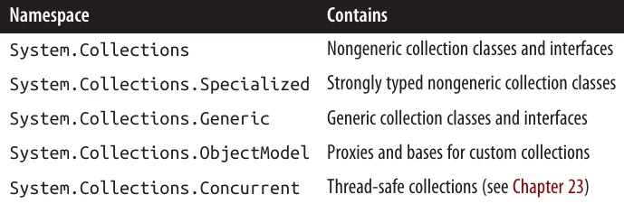
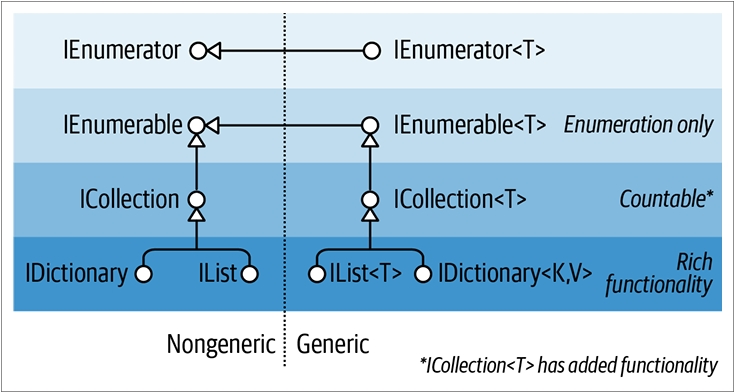
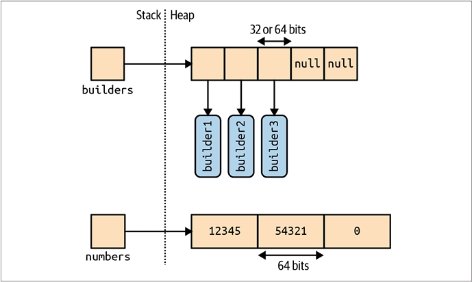
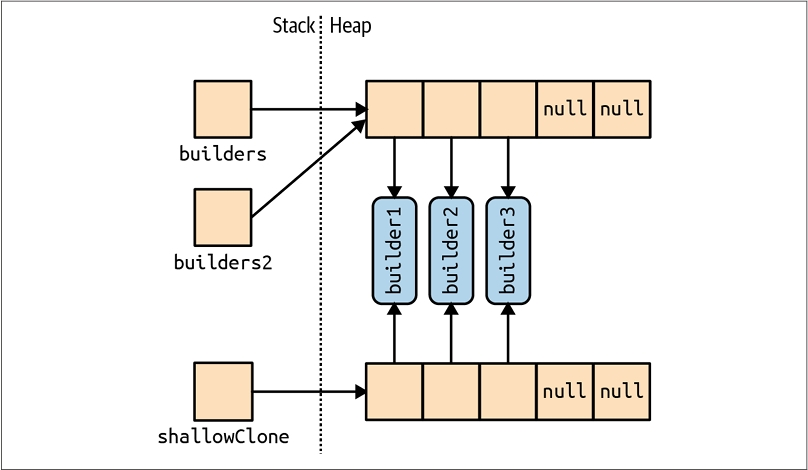
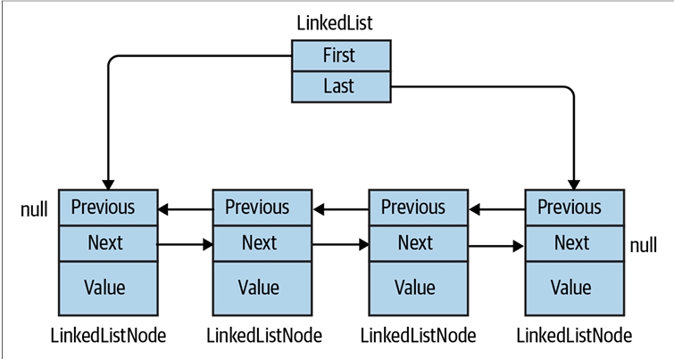
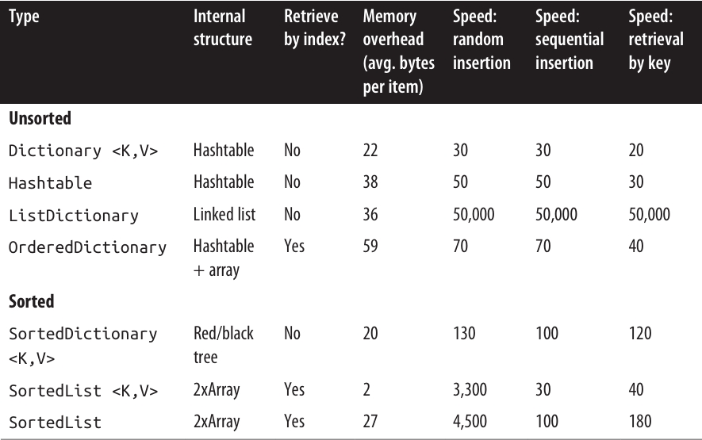
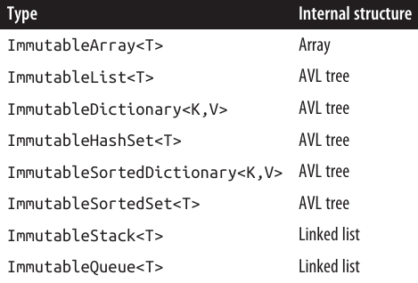
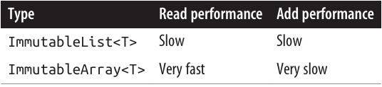

<div dir="rtl">
# فصل هفتم: **مجموعه‌ها (Collections) 📚**

.NET یک مجموعه استاندارد از نوع‌ها را برای ذخیره‌سازی و مدیریت مجموعه‌ای از اشیاء ارائه می‌دهد. این نوع‌ها شامل لیست‌های قابل تغییر اندازه (resizable lists)، لیست‌های پیوندی (linked lists)، دیکشنری‌های مرتب و نامرتب (sorted و unsorted dictionaries) و همچنین آرایه‌ها (arrays) هستند. از بین این‌ها، تنها آرایه‌ها بخشی از زبان C# را تشکیل می‌دهند؛ بقیه مجموعه‌ها فقط کلاس‌هایی هستند که می‌توانید مانند هر کلاس دیگری نمونه‌سازی (instantiate) کنید.

می‌توانیم نوع‌ها در BCL دات‌نت برای مجموعه‌ها را به دسته‌های زیر تقسیم کنیم:

• اینترفیس‌هایی که پروتکل‌های استاندارد مجموعه را تعریف می‌کنند

• کلاس‌های آماده برای استفاده در مجموعه‌ها (لیست‌ها، دیکشنری‌ها و غیره)

• کلاس‌های پایه برای نوشتن مجموعه‌های مخصوص برنامه

این فصل هر یک از این دسته‌ها را پوشش می‌دهد، به‌علاوه یک بخش اضافی درباره نوع‌هایی که برای تعیین برابری و ترتیب عناصر استفاده می‌شوند، ارائه می‌کند.

فضاهای نام (namespaces) مربوط به مجموعه‌ها به شرح زیر هستند:

<div align="center">
    
 
</div>

**شماره‌گذاری (Enumeration) 🔢**

در علوم کامپیوتر، مجموعه‌های مختلفی وجود دارند که از ساختارهای داده ساده مانند آرایه‌ها (arrays) یا لیست‌های پیوندی (linked lists)، تا ساختارهای پیچیده‌تر مانند درخت‌های قرمز/سیاه (red/black trees) و هشت‌جدول‌ها (hashtables) را شامل می‌شوند.

اگرچه پیاده‌سازی داخلی و ویژگی‌های خارجی این ساختارهای داده بسیار متفاوت است، اما توانایی پیمایش (traverse) محتویات مجموعه، نیاز تقریباً جهانی است. BCL دات‌نت این نیاز را از طریق یک جفت اینترفیس (IEnumerable و IEnumerator و نسخه‌های Generic آن‌ها) پشتیبانی می‌کند که به ساختارهای داده مختلف اجازه می‌دهد یک API مشترک برای پیمایش ارائه دهند.

این اینترفیس‌ها بخشی از مجموعه بزرگ‌تری از اینترفیس‌های مجموعه هستند که در شکل ۷-۱ نشان داده شده‌اند.

<div align="center">
    
 
</div>

**IEnumerable و IEnumerator 🔄**

اینترفیس `IEnumerator` پروتکل پایه و سطح پایین را تعریف می‌کند که با آن عناصر یک مجموعه به‌صورت پیش‌رونده (forward-only) پیمایش یا شماره‌گذاری (enumerate) می‌شوند. تعریف آن به صورت زیر است:
</div>

```csharp
public interface IEnumerator
{
  bool MoveNext();
  object Current { get; }
  void Reset();
}
```

<div dir="rtl">
متد `MoveNext` عنصر فعلی یا «کرسر» (cursor) را به موقعیت بعدی منتقل می‌کند و اگر دیگر عنصری در مجموعه وجود نداشته باشد، مقدار `false` برمی‌گرداند. `Current` عنصری را که در موقعیت فعلی قرار دارد برمی‌گرداند (معمولاً از نوع `object` به نوع خاص‌تر تبدیل می‌شود). قبل از دسترسی به اولین عنصر، حتماً باید `MoveNext` فراخوانی شود — این کار اجازه می‌دهد تا مجموعه خالی نیز مدیریت شود. متد `Reset`، در صورت پیاده‌سازی، کرسر را به ابتدای مجموعه بازمی‌گرداند تا امکان پیمایش مجدد فراهم شود. وجود `Reset` بیشتر برای سازگاری با **Component Object Model (COM)** است؛ فراخوانی مستقیم آن معمولاً اجتناب می‌شود چون همیشه پشتیبانی نمی‌شود و به طور کلی لازم نیست، زیرا ایجاد یک نمونه جدید از enumerator اغلب ساده‌تر است.

معمولاً مجموعه‌ها خودشان enumerator را پیاده‌سازی نمی‌کنند؛ بلکه **enumerator** را از طریق اینترفیس `IEnumerable` فراهم می‌کنند:
</div>

```csharp
public interface IEnumerable
{
  IEnumerator GetEnumerator();
}
```

<div dir="rtl">
با تعریف یک متد که یک enumerator بازمی‌گرداند، `IEnumerable` انعطاف‌پذیری ایجاد می‌کند تا منطق تکرار (iteration) به کلاس دیگری سپرده شود. همچنین این به این معنی است که چند مصرف‌کننده می‌توانند همزمان مجموعه را پیمایش کنند بدون اینکه با یکدیگر تداخل داشته باشند. می‌توان `IEnumerable` را «`IEnumeratorProvider`» در نظر گرفت، و این ابتدایی‌ترین اینترفیس است که کلاس‌های مجموعه پیاده‌سازی می‌کنند.

نمونه زیر استفاده سطح پایین از `IEnumerable` و `IEnumerator` را نشان می‌دهد:
</div>

```csharp
string s = "Hello";
// چون رشته String اینترفیس IEnumerable را پیاده‌سازی می‌کند، می‌توانیم GetEnumerator را فراخوانی کنیم:
IEnumerator rator = s.GetEnumerator();
while (rator.MoveNext())
{
  char c = (char) rator.Current;
  Console.Write(c + ".");
}
// خروجی: H.e.l.l.o.
```

<div dir="rtl">
با این حال، به‌ندرت پیش می‌آید که متدها روی enumerator به این شکل فراخوانی شوند، زیرا C# یک میان‌بر نحوی فراهم می‌کند: دستور `foreach`. مثال بالا با استفاده از `foreach` به شکل زیر بازنویسی می‌شود:
</div>

```csharp
string s = "Hello";      // کلاس String اینترفیس IEnumerable را پیاده‌سازی می‌کند
foreach (char c in s)
  Console.Write(c + ".");
```

<div dir="rtl">
---

### `IEnumerable<T>` و `IEnumerator<T>` 🧩

`IEnumerator` و `IEnumerable` تقریباً همیشه همراه با نسخه‌های Generic خود پیاده‌سازی می‌شوند:
</div>

```csharp
public interface IEnumerator<T> : IEnumerator, IDisposable
{
  T Current { get; }
}

public interface IEnumerable<T> : IEnumerable
{
  IEnumerator<T> GetEnumerator();
}
```

<div dir="rtl">
با تعریف نسخه‌ای نوع‌دار (typed) از `Current` و `GetEnumerator`، این اینترفیس‌ها ایمنی نوع ایستا (static type safety) را تقویت می‌کنند، از سربار **boxing** در عناصر نوع مقدار (value-type) جلوگیری می‌کنند و برای مصرف‌کننده راحت‌تر هستند. آرایه‌ها به‌صورت خودکار `IEnumerable<T>` را پیاده‌سازی می‌کنند (که T نوع عضو آرایه است).

به لطف ایمنی نوع ایستا، فراخوانی متد زیر با آرایه‌ای از کاراکترها باعث ایجاد خطای زمان کامپایل می‌شود:
</div>

```csharp
void Test (IEnumerable<int> numbers) { ... }
```

<div dir="rtl">
یک روش استاندارد در کلاس‌های مجموعه این است که `IEnumerable<T>` را به‌صورت عمومی (public) نمایش دهند و `IEnumerable` غیر Generic را از طریق پیاده‌سازی صریح اینترفیس (explicit interface implementation) «مخفی» کنند. این کار به این دلیل است که اگر مستقیماً `GetEnumerator()` فراخوانی شود، یک `IEnumerator<T>` ایمن از نظر نوع بازگردانده شود.

با این حال، گاهی این قانون برای سازگاری با نسخه‌های قدیمی شکسته می‌شود (زیرا Genericها قبل از C# 2.0 وجود نداشتند). یک مثال خوب آرایه‌ها هستند — این‌ها باید `IEnumerator` غیر Generic (یا همان نسخه «کلاسیک») را برگردانند تا کدهای قبلی خراب نشوند. برای به دست آوردن `IEnumerator<T>` Generic، باید نوع را به صورت صریح تبدیل (cast) کنید:
</div>

```csharp
int[] data = { 1, 2, 3 };
var rator = ((IEnumerable<int>)data).GetEnumerator();
```

<div dir="rtl">
خوشبختانه به لطف دستور `foreach`، به ندرت نیاز است چنین کدی نوشته شود.

**IEnumerable<T> و IDisposable ♻️**

`IEnumerator<T>` از `IDisposable` ارث‌بری می‌کند. این امکان را به enumerator می‌دهد که به منابعی مانند اتصال به پایگاه داده (database connections) دسترسی داشته باشد و اطمینان حاصل کند که این منابع پس از اتمام یا قطع پیمایش آزاد می‌شوند. دستور `foreach` این نکته را تشخیص می‌دهد و عبارت زیر را:
</div>

```csharp
foreach (var element in somethingEnumerable) { ... }
```

<div dir="rtl">
به معادل منطقی زیر تبدیل می‌کند:
</div>

```csharp
using (var rator = somethingEnumerable.GetEnumerator())
  while (rator.MoveNext())
  {
    var element = rator.Current;
    ...
  }
```

<div dir="rtl">
بلوک `using` تضمین می‌کند که منابع به درستی Dispose شوند — درباره `IDisposable` در فصل ۱۲ بیشتر توضیح داده می‌شود.

---

### استفاده از اینترفیس‌های غیر Generic ❓

با توجه به ایمنی نوع اضافی که اینترفیس‌های مجموعه Generic مانند `IEnumerable<T>` ارائه می‌دهند، این سؤال مطرح می‌شود: آیا واقعاً نیاز به استفاده از `IEnumerable` غیر Generic (یا `ICollection` یا `IList`) وجود دارد؟

در مورد `IEnumerable`، باید این اینترفیس را همراه با `IEnumerable<T>` پیاده‌سازی کنید، زیرا نسخه Generic از نسخه غیر Generic ارث‌بری می‌کند. با این حال، بسیار نادر است که بخواهید این اینترفیس‌ها را از ابتدا پیاده‌سازی کنید؛ در اکثر موارد می‌توانید از روش‌های سطح بالاتر مانند **iterator methods**، `Collection<T>` و **LINQ** استفاده کنید.

---

### به‌عنوان مصرف‌کننده 🔍

در اکثر موارد، می‌توانید به‌طور کامل با اینترفیس‌های Generic کار کنید. با این حال، اینترفیس‌های غیر Generic هنوز گاهی مفید هستند، زیرا توانایی ارائه **یکپارچگی نوع** برای مجموعه‌ها با همه نوع عناصر را دارند.

برای مثال، متد زیر تعداد عناصر موجود در هر مجموعه‌ای را به‌صورت بازگشتی می‌شمارد:
</div>

```csharp
public static int Count(IEnumerable e)
{
    int count = 0;
    foreach (object element in e)
    {
        var subCollection = element as IEnumerable;
        if (subCollection != null)
            count += Count(subCollection);
        else
            count++;
    }
    return count;
}
```

<div dir="rtl">
چون C# با اینترفیس‌های Generic امکان **covariance** را ارائه می‌دهد، ممکن است فکر کنید می‌توانستیم به جای آن `IEnumerable<object>` دریافت کنیم. اما این روش با عناصر نوع مقدار (value-type) و مجموعه‌های قدیمی که `IEnumerable<T>` را پیاده‌سازی نکرده‌اند، شکست می‌خورد — مثالی از این نوع، `ControlCollection` در Windows Forms است.

> ⚠️ نکته: در مثال بالا، ارجاعات چرخه‌ای (cyclic references) می‌توانند باعث بازگشت نامتناهی و کرش شدن برنامه شوند. ساده‌ترین راه حل، استفاده از `HashSet` است (به بخش "HashSet<T> و SortedSet<T>" در صفحه ۳۹۲ مراجعه کنید).

---

### پیاده‌سازی اینترفیس‌های Enumeration 🛠️

ممکن است بخواهید `IEnumerable` یا `IEnumerable<T>` را به یکی یا چند دلیل زیر پیاده‌سازی کنید:

* پشتیبانی از دستور `foreach`
* همکاری با هر چیزی که مجموعه استاندارد انتظار دارد
* رعایت نیازمندی‌های یک اینترفیس مجموعه پیشرفته‌تر
* پشتیبانی از **collection initializers**

برای پیاده‌سازی `IEnumerable/IEnumerable<T>`، باید یک **enumerator** ارائه دهید. سه روش برای انجام این کار وجود دارد:

1. اگر کلاس، مجموعه دیگری را **wrapper** می‌کند، با بازگرداندن enumerator مجموعه داخلی
2. از طریق یک **iterator** با استفاده از `yield return`
3. با ایجاد نمونه‌ای از پیاده‌سازی خود `IEnumerator/IEnumerator<T>`

---

### نمونه استفاده از iterator با `yield return` ✨
</div>

```csharp
public class MyCollection : IEnumerable
{
    int[] data = { 1, 2, 3 };
    public IEnumerator GetEnumerator()
    {
        foreach (int i in data)
            yield return i;
    }
}
```

<div dir="rtl">
در نگاه اول، به نظر می‌رسد `GetEnumerator` هیچ enumerator‌ای باز نمی‌گرداند! اما کامپایلر هنگام پردازش `yield return`، یک کلاس enumerator پنهان می‌سازد و `GetEnumerator` را طوری تغییر می‌دهد که آن کلاس را نمونه‌سازی و بازگرداند.

این روش ساده، قدرتمند و در پیاده‌سازی **LINQ-to-Objects** بسیار استفاده می‌شود.

---

### پیاده‌سازی نسخه Generic 🧩
</div>

```csharp
public class MyGenCollection : IEnumerable<int>
{
    int[] data = { 1, 2, 3 };
    public IEnumerator<int> GetEnumerator()
    {
        foreach (int i in data)
            yield return i;
    }

    // پیاده‌سازی صریح نسخه غیر Generic:
    IEnumerator IEnumerable.GetEnumerator() => GetEnumerator();
}
```

<div dir="rtl">
چون `IEnumerable<T>` از `IEnumerable` ارث‌بری می‌کند، باید هر دو نسخه Generic و غیر Generic از `GetEnumerator` پیاده‌سازی شوند. نسخه غیر Generic معمولاً به‌صورت صریح (explicit) پیاده‌سازی می‌شود تا بتواند نسخه Generic را فراخوانی کند، زیرا `IEnumerator<T>` از `IEnumerator` ارث‌بری می‌کند.

---

### پیاده‌سازی مستقیم IEnumerator 🔧

در برخی موارد، می‌توانید یک کلاس بنویسید که مستقیماً `IEnumerator` را پیاده‌سازی کند. مثال زیر یک مجموعه ثابت با اعداد 1، 2 و 3 را نشان می‌دهد:
</div>

```csharp
public class MyIntList : IEnumerable
{
    int[] data = { 1, 2, 3 };
    public IEnumerator GetEnumerator() => new Enumerator(this);

    class Enumerator : IEnumerator
    {
        MyIntList collection;
        int currentIndex = -1;

        public Enumerator(MyIntList items) => this.collection = items;

        public object Current
        {
            get
            {
                if (currentIndex == -1)
                    throw new InvalidOperationException("Enumeration not started!");
                if (currentIndex == collection.data.Length)
                    throw new InvalidOperationException("Past end of list!");
                return collection.data[currentIndex];
            }
        }

        public bool MoveNext()
        {
            if (currentIndex >= collection.data.Length - 1) return false;
            return ++currentIndex < collection.data.Length;
        }

        public void Reset() => currentIndex = -1;
    }
}
```

<div dir="rtl">
پیاده‌سازی `Reset` اختیاری است — می‌توانید به جای آن `NotSupportedException` پرتاب کنید.

---

### پیاده‌سازی Generic مستقیم ✅
</div>

```csharp
class MyIntList : IEnumerable<int>
{
    int[] data = { 1, 2, 3 };

    public IEnumerator<int> GetEnumerator() => new Enumerator(this);
    IEnumerator IEnumerable.GetEnumerator() => new Enumerator(this);

    class Enumerator : IEnumerator<int>
    {
        int currentIndex = -1;
        MyIntList collection;

        public Enumerator(MyIntList items) => collection = items;

        public int Current => collection.data[currentIndex];
        object IEnumerator.Current => Current;

        public bool MoveNext() => ++currentIndex < collection.data.Length;
        public void Reset() => currentIndex = -1;

        // از آنجا که نیاز به Dispose نداریم، بهتر است صریح پیاده‌سازی شود تا از رابط عمومی مخفی بماند
        void IDisposable.Dispose() {}
    }
}
```

<div dir="rtl">
نسخه Generic سریع‌تر است زیرا `IEnumerator<int>.Current` نیاز به **casting** از `int` به `object` ندارد و سربار **boxing** را حذف می‌کند.

**اینترفیس‌های ICollection و IList 🗂️**

اگرچه اینترفیس‌های Enumeration یک پروتکل برای پیمایش **فقط به جلو** (forward-only) در مجموعه‌ها فراهم می‌کنند، اما مکانیزمی برای تعیین اندازه مجموعه، دسترسی به عضو از طریق اندیس، یا تغییر محتویات مجموعه ارائه نمی‌دهند. برای چنین قابلیت‌هایی، دات‌نت اینترفیس‌های `ICollection`، `IList` و `IDictionary` را تعریف کرده است. هرکدام از این اینترفیس‌ها نسخه‌های **Generic** و **Non-Generic** دارند؛ با این حال، نسخه‌های غیر Generic عمدتاً برای پشتیبانی از کدهای قدیمی وجود دارند.

شکل ۷-۱ سلسله مراتب ارث‌بری این اینترفیس‌ها را نشان داد. ساده‌ترین راه برای خلاصه‌سازی آن‌ها به شرح زیر است:

* `IEnumerable<T>` (و `IEnumerable`)
  حداقل قابلیت‌ها را فراهم می‌کند (فقط پیمایش)
* `ICollection<T>` (و `ICollection`)
  قابلیت‌های متوسط را ارائه می‌دهد (مثلاً ویژگی `Count`)
* `IList<T>` / `IDictionary<K,V>` و نسخه‌های غیر Generic آن‌ها
  حداکثر قابلیت‌ها را ارائه می‌دهند (شامل دسترسی «تصادفی» به عناصر با اندیس یا کلید)

به ندرت پیش می‌آید که نیاز داشته باشید هر یک از این اینترفیس‌ها را خودتان پیاده‌سازی کنید. در اکثر مواقع، هنگام نوشتن یک کلاس مجموعه، می‌توانید به جای آن از **subclass** کردن `Collection<T>` استفاده کنید (به بخش "Customizable Collections and Proxies" در صفحه ۴۰۱ مراجعه کنید). **LINQ** نیز گزینه دیگری ارائه می‌دهد که بسیاری از سناریوها را پوشش می‌دهد.

نسخه‌های Generic و Non-Generic تفاوت‌هایی فراتر از انتظار معمول دارند، به‌ویژه در مورد `ICollection`. این تفاوت‌ها عمدتاً تاریخی هستند: چون Genericها بعداً وارد شدند، اینترفیس‌های Generic با بهره‌مندی از تجربه پیشین توسعه یافتند و اعضای متفاوت (و بهتری) انتخاب شدند.

به همین دلیل:

* `ICollection<T>` از `ICollection` ارث‌بری نمی‌کند
* `IList<T>` از `IList` ارث‌بری نمی‌کند
* `IDictionary<TKey, TValue>` از `IDictionary` ارث‌بری نمی‌کند

البته، یک کلاس مجموعه می‌تواند هر دو نسخه یک اینترفیس را پیاده‌سازی کند اگر مفید باشد (که اغلب مفید است).

دلیل ظریف‌تر دیگری که باعث شده `IList<T>` از `IList` ارث‌بری نکند این است که اگر این کار انجام شود، تبدیل به `IList<T>` موجب بازگشت یک اینترفیس با اعضای `Add(T)` و `Add(object)` می‌شود، که در واقع ایمنی نوع ایستا (static type safety) را نقض می‌کند، زیرا می‌توانستید با هر نوع شیئی `Add` را فراخوانی کنید.

---

### این بخش شامل چه مواردی است 📖

این بخش به `ICollection<T>` و `IList<T>` و نسخه‌های غیر Generic آن‌ها می‌پردازد؛ **دیکشنری‌ها** در صفحه ۳۹۴ تحت پوشش قرار دارند.

در کتابخانه‌های دات‌نت، هیچ منطق یکپارچه‌ای برای استفاده از واژه‌های "collection" و "list" وجود ندارد.
برای مثال، چون `IList<T>` نسخه‌ای با قابلیت بیشتر از `ICollection<T>` است، ممکن است انتظار داشته باشید کلاس `List<T>` به‌طور مشابه از کلاس `Collection<T>` کاربردی‌تر باشد، اما این‌گونه نیست. بهتر است این دو واژه را به‌طور کلی مترادف در نظر بگیرید، مگر آنکه نوع خاصی مدنظر باشد.

---

### ICollection<T> و ICollection 📦

`ICollection<T>` اینترفیس استاندارد برای مجموعه‌های شمارش‌پذیر است. این اینترفیس امکان:

* تعیین اندازه مجموعه (`Count`)
* بررسی وجود یک آیتم در مجموعه (`Contains`)
* کپی مجموعه به آرایه (`ToArray`)
* تعیین اینکه مجموعه فقط خواندنی است (`IsReadOnly`)

و برای مجموعه‌های قابل نوشتن، امکان افزودن (`Add`)، حذف (`Remove`) و پاک کردن (`Clear`) عناصر را نیز فراهم می‌کند.
همچنین چون از `IEnumerable<T>` ارث‌بری می‌کند، می‌توان از دستور `foreach` نیز برای پیمایش آن استفاده کرد:
</div>

```csharp
public interface ICollection<T> : IEnumerable<T>, IEnumerable
{
    int Count { get; }
    bool Contains(T item);
    void CopyTo(T[] array, int arrayIndex);
    bool IsReadOnly { get; }
    void Add(T item);
    bool Remove(T item);
    void Clear();
}
```

<div dir="rtl">
نسخه غیر Generic `ICollection` مشابه است و مجموعه‌ای شمارش‌پذیر ارائه می‌دهد، اما قابلیت تغییر محتویات مجموعه یا بررسی عضویت عناصر را ندارد:
</div>

```csharp
public interface ICollection : IEnumerable
{
    int Count { get; }
    bool IsSynchronized { get; }
    object SyncRoot { get; }
    void CopyTo(Array array, int index);
}
```

<div dir="rtl">
این نسخه غیر Generic همچنین ویژگی‌هایی برای کمک به **سینک کردن (synchronization)** دارد (فصل ۱۴) — این ویژگی‌ها در نسخه Generic حذف شدند زیرا **Thread Safety** دیگر ذاتاً بخشی از مجموعه‌ها محسوب نمی‌شود.

هر دو اینترفیس نسبتاً ساده برای پیاده‌سازی هستند. اگر بخواهید یک `ICollection<T>` فقط خواندنی پیاده‌سازی کنید، متدهای `Add`، `Remove` و `Clear` باید `NotSupportedException` پرتاب کنند.

معمولاً این اینترفیس‌ها همراه با `IList` یا `IDictionary` پیاده‌سازی می‌شوند.
**اینترفیس‌های IList<T> و IList 📋**

`IList<T>` اینترفیس استاندارد برای مجموعه‌هایی است که می‌توان به عناصر آن‌ها با **موقعیت (اندیس)** دسترسی داشت. علاوه بر قابلیت‌هایی که از `ICollection<T>` و `IEnumerable<T>` به ارث برده، این اینترفیس امکان **خواندن و نوشتن عنصر با استفاده از اندیس** و **درج/حذف عنصر بر اساس موقعیت** را نیز فراهم می‌کند:
</div>

```csharp
public interface IList<T> : ICollection<T>, IEnumerable<T>, IEnumerable
{
    T this[int index] { get; set; }
    int IndexOf(T item);
    void Insert(int index, T item);
    void RemoveAt(int index);
}
```

<div dir="rtl">
متد `IndexOf` جستجوی خطی (linear search) در لیست انجام می‌دهد و اگر عنصر مشخص شده پیدا نشود، مقدار `-1` برمی‌گرداند.

نسخه غیر Generic `IList` اعضای بیشتری دارد، زیرا از `ICollection` کمتری ارث‌بری می‌کند:
</div>

```csharp
public interface IList : ICollection, IEnumerable
{
    object this[int index] { get; set; }
    bool IsFixedSize { get; }
    bool IsReadOnly { get; }
    int Add(object value);
    void Clear();
    bool Contains(object value);
    int IndexOf(object value);
    void Insert(int index, object value);
    void Remove(object value);
    void RemoveAt(int index);
}
```

<div dir="rtl">
در نسخه غیر Generic، متد `Add` یک **عدد صحیح (int)** برمی‌گرداند که نشان‌دهنده **اندیس عنصر اضافه‌شده** است. در مقابل، متد `Add` در `ICollection<T>` دارای نوع بازگشتی `void` است.

کلاس عمومی `List<T>` نمونه بارز پیاده‌سازی هر دو اینترفیس `IList<T>` و `IList` است. آرایه‌های C# نیز هر دو نسخه Generic و Non-Generic `IList` را پیاده‌سازی می‌کنند، اگرچه متدهایی که برای اضافه یا حذف عناصر هستند، از طریق پیاده‌سازی صریح اینترفیس پنهان شده‌اند و در صورت فراخوانی، `NotSupportedException` پرتاب می‌کنند.

> ⚠️ اگر تلاش کنید به یک **آرایه چندبعدی** از طریق ایندکسر `IList` دسترسی پیدا کنید، یک `ArgumentException` پرتاب خواهد شد. این نکته ممکن است هنگام نوشتن متدهایی مانند زیر مشکل‌ساز شود:
</div>

```csharp
public object FirstOrNull(IList list)
{
    if (list == null || list.Count == 0) return null;
    return list[0];
}
```

<div dir="rtl">
این کد ممکن است ظاهراً بی‌خطا باشد، اما اگر با آرایه چندبعدی فراخوانی شود، یک استثنا پرتاب خواهد کرد. می‌توان در زمان اجرا بررسی کرد که آیا آرایه چندبعدی است یا خیر:
</div>

```csharp
list.GetType().IsArray && list.GetType().GetArrayRank() > 1
```

<div dir="rtl">
---

### IReadOnlyCollection<T> و IReadOnlyList<T> 🔒

.NET اینترفیس‌های **مجموعه و لیست فقط خواندنی** نیز دارد که فقط اعضای لازم برای عملیات **فقط خواندنی** را ارائه می‌دهند:
</div>

```csharp
public interface IReadOnlyCollection<out T> : IEnumerable<T>, IEnumerable
{
    int Count { get; }
}

public interface IReadOnlyList<out T> : IReadOnlyCollection<T>,
                                       IEnumerable<T>, IEnumerable
{
    T this[int index] { get; }
}
```

<div dir="rtl">
از آنجا که پارامتر نوع (`T`) تنها در **موقعیت خروجی** استفاده می‌شود، به صورت **Covariant** علامت‌گذاری شده است. این امکان را می‌دهد که مثلاً **لیستی از گربه‌ها** به عنوان یک **لیست فقط خواندنی از حیوانات** تلقی شود.

در مقابل، `T` در `ICollection<T>` و `IList<T>` Covariant نیست، زیرا در هر دو موقعیت ورودی و خروجی استفاده می‌شود.

این اینترفیس‌ها نمایی **فقط خواندنی** از یک مجموعه یا لیست ارائه می‌کنند؛ پیاده‌سازی واقعی ممکن است هنوز قابل نوشتن باشد. اکثر مجموعه‌های قابل تغییر (Mutable) هم اینترفیس‌های فقط خواندنی و هم خواندنی/نوشتنی را پیاده‌سازی می‌کنند.

علاوه بر امکان کار با مجموعه‌ها به صورت Covariant، اینترفیس‌های فقط خواندنی اجازه می‌دهند یک کلاس **نمایی فقط خواندنی از یک مجموعه خصوصی قابل نوشتن** را به صورت عمومی ارائه کند. این موضوع در بخش `ReadOnlyCollection<T>` در صفحه ۴۰۶ نشان داده شده است.

> `IReadOnlyList<T>` با نوع Windows Runtime `IVectorView<T>` مطابقت دارد.

---

### کلاس Array 🗃️

کلاس `Array` کلاس پایه **ضمنی (implicit)** برای تمام آرایه‌های تک‌بعدی و چندبعدی است و یکی از **اساسی‌ترین نوع‌ها** است که اینترفیس‌های استاندارد مجموعه را پیاده‌سازی می‌کند.

کلاس `Array` یکپارچگی نوع را فراهم می‌کند، بنابراین یک مجموعه از **متدهای مشترک** برای تمام آرایه‌ها، صرف‌نظر از اعلان یا نوع عناصر، در دسترس است.

از آنجا که آرایه‌ها بسیار اساسی هستند، C# **سینتکس ویژه‌ای برای اعلان و مقداردهی اولیه آن‌ها** ارائه می‌دهد (که در فصل‌های ۲ و ۳ توضیح داده شد). وقتی آرایه‌ای با سینتکس C# اعلام می‌شود، **CLR به طور ضمنی** کلاس `Array` را زیرنوع‌دهی می‌کند و یک **Pseudo-Type** مناسب برای ابعاد و نوع عناصر آرایه ایجاد می‌کند. این Pseudo-Type اینترفیس‌های Generic نوع‌دار را پیاده‌سازی می‌کند، مانند `IList<string>`.

CLR همچنین هنگام ساخت آرایه‌ها به آن‌ها به صورت ویژه نگاه می‌کند و **فضای متوالی در حافظه** برای آن‌ها اختصاص می‌دهد. این کار باعث می‌شود **دسترسی با اندیس به آرایه‌ها بسیار کارآمد** باشد، اما اجازه تغییر اندازه بعد از ساخت را نمی‌دهد.

کلاس `Array` اینترفیس‌های مجموعه را تا `IList<T>` پیاده‌سازی می‌کند، هم در نسخه Generic و هم غیر Generic. خود `IList<T>` به صورت صریح پیاده‌سازی شده تا **متدهایی مانند Add و Remove** که برای آرایه‌های با طول ثابت نامناسب هستند، از رابط عمومی `Array` پنهان بمانند و در صورت فراخوانی استثنا پرتاب کنند.

کلاس `Array` یک متد **استاتیک `Resize`** نیز ارائه می‌دهد، اما این متد با **ایجاد یک آرایه جدید و کپی کردن هر عنصر** کار می‌کند. این روش نه تنها ناکارآمد است، بلکه مراجع به آرایه اصلی در بخش‌های دیگر برنامه همچنان به نسخه اولیه اشاره خواهند کرد. راه حل بهتر برای مجموعه‌های قابل تغییر، استفاده از کلاس `List<T>` است (که در بخش بعدی توضیح داده می‌شود).

آرایه می‌تواند شامل عناصر **Value-Type** یا **Reference-Type** باشد. عناصر Value-Type در محل آرایه ذخیره می‌شوند، بنابراین یک آرایه از سه عدد صحیح طولانی (هر کدام ۸ بایت) **۲۴ بایت حافظه متوالی** اشغال می‌کند. اما عنصر Reference-Type تنها به اندازه یک مرجع فضای آرایه را اشغال می‌کند (۴ بایت در محیط ۳۲ بیتی یا ۸ بایت در محیط ۶۴ بیتی).

شکل ۷-۲ تأثیر این موضوع را در حافظه نشان می‌دهد:
</div>

```csharp
StringBuilder[] builders = new StringBuilder[5];
builders[0] = new StringBuilder("builder1");
builders[1] = new StringBuilder("builder2");
builders[2] = new StringBuilder("builder3");

long[] numbers = new long[3];
numbers[0] = 12345;
numbers[1] = 54321;
```

<div dir="rtl">
<div align="center">
    
 
</div>

چون `Array` یک کلاس است، **آرایه‌ها همیشه خودشان نوع مرجع (Reference Type) هستند**—صرف‌نظر از نوع عناصر آرایه. این بدان معناست که دستور زیر:
</div>

```csharp
arrayB = arrayA
```

<div dir="rtl">
منجر به ایجاد **دو متغیری می‌شود که به همان آرایه ارجاع می‌دهند**.

به همین ترتیب، **دو آرایه مجزا همیشه در آزمون برابری شکست خواهند خورد**، مگر اینکه از یک **مقایسه‌کننده برابری ساختاری (Structural Equality Comparer)** استفاده کنید که هر عنصر آرایه را مقایسه می‌کند:
</div>

```csharp
object[] a1 = { "string", 123, true };
object[] a2 = { "string", 123, true };

Console.WriteLine(a1 == a2);                         // False
Console.WriteLine(a1.Equals(a2));                    // False

IStructuralEquatable se1 = a1;
Console.WriteLine(se1.Equals(a2, StructuralComparisons.StructuralEqualityComparer));   // True
```

<div dir="rtl">
آرایه‌ها می‌توانند با فراخوانی متد `Clone` کپی شوند:
</div>

```csharp
arrayB = arrayA.Clone();
```

<div dir="rtl">
اما این یک **کپی سطحی (Shallow Clone)** ایجاد می‌کند، یعنی فقط **حافظه‌ای که خود آرایه اشغال کرده است** کپی می‌شود. اگر آرایه شامل **اشیاء Value-Type** باشد، خود مقادیر کپی می‌شوند؛ اما اگر شامل **اشیاء Reference-Type** باشد، فقط **ارجاعات (References)** کپی می‌شوند، در نتیجه دو آرایه‌ای خواهید داشت که اعضای آن‌ها به **همان اشیاء** اشاره می‌کنند.

شکل ۷-۳ اثر این موضوع را هنگام افزودن کد زیر به مثال نشان می‌دهد:
</div>

```csharp
StringBuilder[] builders2 = builders;
StringBuilder[] shallowClone = (StringBuilder[]) builders.Clone();
```

<div dir="rtl">
<div align="center">
    
 
</div>

برای ایجاد یک **کپی عمیق (Deep Copy)**—که در آن **زیر اشیاء Reference-Type** نیز تکرار می‌شوند—باید از آرایه عبور کرده و هر عنصر را به‌صورت دستی کپی کنید. همان قوانین برای سایر انواع مجموعه‌ها در .NET نیز صدق می‌کند.

اگرچه `Array` عمدتاً برای استفاده با **ایندکس‌های ۳۲ بیتی** طراحی شده، اما از **ایندکس‌های ۶۴ بیتی** نیز پشتیبانی محدودی دارد (که به صورت تئوری امکان دسترسی به تا $2^{64}$ عنصر را می‌دهد) از طریق چندین متدی که هم **Int32** و هم **Int64** را می‌پذیرند. این اورلودها در عمل بی‌فایده هستند، زیرا **CLR اجازه نمی‌دهد هیچ شیء—از جمله آرایه‌ها—بزرگ‌تر از دو گیگابایت باشد** (چه در محیط ۳۲ بیتی و چه ۶۴ بیتی).

بسیاری از متدهایی که انتظار دارید در کلاس `Array` **متد نمونه (Instance Method)** باشند، در واقع **متدهای استاتیک** هستند. این تصمیم طراحی کمی عجیب است و به این معناست که هنگام جستجوی یک متد در `Array` باید هم **متدهای استاتیک** و هم **متدهای نمونه** را بررسی کنید.

---

### ایجاد و ایندکس‌گذاری آرایه‌ها 🗂️

ساده‌ترین راه برای ایجاد و ایندکس کردن آرایه‌ها، استفاده از ساختارهای زبانی C# است:
</div>

```csharp
int[] myArray = { 1, 2, 3 };
int first = myArray[0];
int last = myArray[myArray.Length - 1];
```

<div dir="rtl">
همچنین می‌توانید یک آرایه را **پویا (Dynamic)** با استفاده از `Array.CreateInstance` بسازید. این روش به شما امکان می‌دهد نوع عنصر و **بعد (Rank)** را در زمان اجرا مشخص کنید و همچنین آرایه‌های **غیر صفر-مبنا** ایجاد کنید. آرایه‌های غیر صفر-مبنا با **.NET Common Language Specification (CLS)** سازگار نیستند و نباید به‌عنوان اعضای عمومی در کتابخانه‌هایی که ممکن است توسط برنامه‌ای در F# یا Visual Basic استفاده شوند، ارائه شوند.

متدهای `GetValue` و `SetValue` اجازه می‌دهند عناصر آرایه‌های پویا یا معمولی را دسترسی یا مقداردهی کنید:
</div>

```csharp
// ایجاد آرایه رشته‌ای با 2 عنصر
Array a = Array.CreateInstance(typeof(string), 2);
a.SetValue("hi", 0);       // → a[0] = "hi";
a.SetValue("there", 1);    // → a[1] = "there";
string s = (string)a.GetValue(0);  // → s = a[0];

// تبدیل به آرایه C#:
string[] cSharpArray = (string[])a;
string s2 = cSharpArray[0];
```

<div dir="rtl">
آرایه‌های صفر-مبنا که به‌صورت پویا ایجاد می‌شوند، می‌توانند به آرایه‌ای از نوع مشابه یا **سازگار** در C# تبدیل شوند. برای مثال، اگر `Apple` از `Fruit` ارث‌بری کند، می‌توان `Apple[]` را به `Fruit[]` تبدیل کرد. این مسئله دلیل استفاده از کلاس `Array` به جای `object[]` برای نوع یکنواخت را توضیح می‌دهد، زیرا `object[]` با **آرایه‌های چندبعدی و Value-Type** سازگار نیست.

`GetValue` و `SetValue` همچنین روی آرایه‌های ساخته شده توسط کامپایلر نیز کار می‌کنند و زمانی که می‌خواهید **متدی بنویسید که با هر نوع و بعدی از آرایه کار کند** مفید هستند. برای آرایه‌های چندبعدی، آن‌ها **آرایه‌ای از ایندکس‌ها** می‌پذیرند:
</div>

```csharp
public object GetValue(params int[] indices)
public void SetValue(object value, params int[] indices)
```

<div dir="rtl">
مثال زیر، **اولین عنصر هر آرایه‌ای را بدون توجه به بعد آن چاپ می‌کند**:
</div>

```csharp
void WriteFirstValue(Array a)
{
    Console.Write(a.Rank + "-dimensional; ");
    int[] indexers = new int[a.Rank]; // خودکار صفر-مبنا
    Console.WriteLine("First value is " + a.GetValue(indexers));
}

void Demo()
{
    int[] oneD = { 1, 2, 3 };
    int[,] twoD = { {5,6}, {8,9} };
    WriteFirstValue(oneD);   // 1-dimensional; first value is 1
    WriteFirstValue(twoD);   // 2-dimensional; first value is 5
}
```

<div dir="rtl">
---

برای **آرایه‌هایی با نوع ناشناخته اما بعد مشخص**، **Generics** راهکار ساده‌تر و کارآمدتری ارائه می‌دهند:
</div>

```csharp
void WriteFirstValue<T>(T[] array)
{
    Console.WriteLine(array[0]);
}
```

<div dir="rtl">
متد `SetValue` در صورت ناسازگار بودن نوع عنصر با آرایه، استثنا پرتاب می‌کند.

هنگام ایجاد آرایه—چه با **سینتکس زبان** و چه با `Array.CreateInstance`—عناصر آرایه **به‌صورت خودکار به مقدار پیش‌فرضشان مقداردهی می‌شوند**. برای آرایه‌های Reference-Type، این مقداردهی با `null` انجام می‌شود؛ برای آرایه‌های Value-Type، اعضا به صورت بیت‌به‌بیت صفر می‌شوند.

کلاس `Array` همچنین متد `Clear` را ارائه می‌دهد تا به‌صورت اختیاری آرایه را پاکسازی کند:
</div>

```csharp
public static void Clear(Array array, int index, int length);
```

<div dir="rtl">
این متد اندازه آرایه را تغییر نمی‌دهد، بر خلاف `ICollection<T>.Clear` که تعداد عناصر را به صفر کاهش می‌دهد.

---

### پیمایش آرایه‌ها 🔄

آرایه‌ها به‌راحتی با **foreach** پیمایش می‌شوند:
</div>

```csharp
int[] myArray = { 1, 2, 3 };
foreach (int val in myArray)
    Console.WriteLine(val);
```

<div dir="rtl">
همچنین می‌توان از **متد استاتیک `Array.ForEach`** استفاده کرد:
</div>

```csharp
public static void ForEach<T>(T[] array, Action<T> action);
public delegate void Action<T>(T obj);
```

<div dir="rtl">
مثال بازنویسی شده با `Array.ForEach`:
</div>

```csharp
Array.ForEach(new[] { 1, 2, 3 }, Console.WriteLine);
```

<div dir="rtl">
و در C# 12، می‌توان این را ساده‌تر کرد:
</div>

```csharp
Array.ForEach([1, 2, 3], Console.WriteLine);
```

<div dir="rtl">
### طول و بعد آرایه 📏

کلاس `Array` متدها و ویژگی‌های زیر را برای **پرس‌وجو درباره طول و بعد** آرایه ارائه می‌دهد:
</div>

```csharp
public int  GetLength(int dimension);
public long GetLongLength(int dimension);
public int  Length { get; }
public long LongLength { get; }

public int GetLowerBound(int dimension);
public int GetUpperBound(int dimension);
public int Rank { get; }    // تعداد بعدهای آرایه را باز می‌گرداند
```

<div dir="rtl">
* `GetLength` و `GetLongLength` طول یک بعد مشخص (0 برای آرایه‌های تک‌بعدی) را باز می‌گردانند.
* `Length` و `LongLength` تعداد کل عناصر آرایه را در **تمامی ابعاد** بازمی‌گردانند.
* `GetLowerBound` و `GetUpperBound` در آرایه‌های **غیر صفر-مبنا** کاربرد دارند. `GetUpperBound` همان نتیجه‌ی `GetLowerBound + GetLength` برای یک بعد مشخص را بازمی‌گرداند.

---

### جستجو در آرایه 🔍

کلاس `Array` مجموعه‌ای از متدها را برای پیدا کردن عناصر در **آرایه‌های تک‌بعدی** ارائه می‌دهد:

* **متدهای BinarySearch**
  برای جستجوی سریع در یک آرایه مرتب برای یک عنصر مشخص.

* **متدهای IndexOf / LastIndexOf**
  برای جستجوی آرایه‌های نامرتب برای یک عنصر خاص.

* **متدهای Find / FindLast / FindIndex / FindLastIndex / FindAll / Exists / TrueForAll**
  برای جستجوی آرایه‌های نامرتب بر اساس معیار یک **Predicate<T>**.

نکات مهم:

* هیچ‌یک از متدهای جستجوی آرایه، در صورت پیدا نشدن عنصر، **استثنا پرتاب نمی‌کنند**.

  * متدهایی که **int** بازمی‌گردانند، مقدار `-1` بازمی‌گردانند (فرض بر صفر-مبنا بودن آرایه).
  * متدهایی که نوع **Generic** بازمی‌گردانند، مقدار پیش‌فرض آن نوع را برمی‌گردانند (مثلاً `0` برای `int` یا `null` برای `string`).

* **BinarySearch** سریع است، اما فقط روی آرایه‌های مرتب کار می‌کند و نیاز دارد عناصر **ترتیب‌پذیر باشند**. این متدها می‌توانند یک شیء `IComparer` یا `IComparer<T>` دریافت کنند تا ترتیب عناصر را تعیین کند (باید با ترتیبی که هنگام مرتب‌سازی اولیه استفاده شده، سازگار باشد). در صورت عدم ارائه، الگوریتم مرتب‌سازی پیش‌فرض نوع استفاده می‌شود (براساس `IComparable` / `IComparable<T>`).

* **IndexOf / LastIndexOf** صرفاً آرایه را پیمایش می‌کنند و موقعیت **اولین یا آخرین عنصر مطابق** را بازمی‌گردانند.

* متدهای مبتنی بر **Predicate** اجازه می‌دهند **Delegate** یا **Lambda Expression** تصمیم بگیرد که آیا عنصر مشخصی با معیار موردنظر مطابقت دارد یا خیر.
</div>

```csharp
public delegate bool Predicate<T>(T obj);
```

<div dir="rtl">
مثال:
</div>

```csharp
string[] names = { "Rodney", "Jack", "Jill" };
string match = Array.Find(names, ContainsA);
Console.WriteLine(match); // Jack

bool ContainsA(string name) { return name.Contains("a"); }
```

<div dir="rtl">
همان مثال با **Lambda Expression**:
</div>

```csharp
string[] names = { "Rodney", "Jack", "Jill" };
string match = Array.Find(names, n => n.Contains("a")); // Jack
```

<div dir="rtl">
* `FindAll` آرایه‌ای شامل **تمام عناصر مطابق با Predicate** بازمی‌گرداند و مشابه `Enumerable.Where` در `System.Linq` است، با این تفاوت که خروجی به صورت آرایه است، نه `IEnumerable<T>`.

* `Exists` باز می‌گرداند `true` اگر **هر عضو آرایه** معیار Predicate را برآورده کند، مشابه `Any` در `System.Linq.Enumerable`.

* `TrueForAll` باز می‌گرداند `true` اگر **همه عناصر** معیار Predicate را برآورده کنند، مشابه `All` در `System.Linq.Enumerable`.
### مرتب‌سازی آرایه 🗂️

کلاس `Array` چندین متد **مرتب‌سازی داخلی** دارد:
</div>

```csharp
// مرتب‌سازی یک آرایه تک‌بعدی:
public static void Sort<T>(T[] array);
public static void Sort(Array array);

// مرتب‌سازی جفت آرایه‌ها:
public static void Sort<TKey,TValue>(TKey[] keys, TValue[] items);
public static void Sort(Array keys, Array items);
```

<div dir="rtl">
هر یک از این متدها به‌صورت **Overload** می‌توانند پارامترهای زیر را هم بگیرند:

* `int index` → شروع مرتب‌سازی از ایندکس مشخص
* `int length` → تعداد عناصر برای مرتب‌سازی
* `IComparer<T> comparer` → شیء تعیین‌کننده ترتیب عناصر
* `Comparison<T> comparison` → Delegate تعیین‌کننده ترتیب عناصر

مثال ساده:
</div>

```csharp
int[] numbers = { 3, 2, 1 };
Array.Sort(numbers);  // آرایه حالا { 1, 2, 3 }
```

<div dir="rtl">
متدهای **جفت آرایه‌ای**، عناصر هر دو آرایه را **به‌صورت هم‌زمان مرتب** می‌کنند و ترتیب را براساس آرایه اول اعمال می‌کنند:
</div>

```csharp
int[] numbers = { 3, 2, 1 };
string[] words = { "three", "two", "one" };
Array.Sort(numbers, words);
// numbers → { 1, 2, 3 }
// words   → { "one", "two", "three" }
```

<div dir="rtl">
> ⚠️ نکته: `Array.Sort` نیاز دارد که عناصر آرایه `IComparable` را پیاده‌سازی کنند. اگر عناصر قابل مقایسه ذاتی نباشند یا بخواهید ترتیب پیش‌فرض را تغییر دهید، باید **Comparison سفارشی** یا شیء `IComparer<T>` ارائه دهید.

مثال با **Comparison Delegate**:
</div>

```csharp
public delegate int Comparison<T>(T x, T y);
```

<div dir="rtl">
* اگر `x` قبل از `y` باشد → عدد منفی بازمی‌گرداند
* اگر `x` بعد از `y` باشد → عدد مثبت بازمی‌گرداند
* اگر برابر باشند → `0` بازمی‌گرداند

مثال عملی:
</div>

```csharp
int[] numbers = { 1, 2, 3, 4, 5 };
Array.Sort(numbers, (x, y) => x % 2 == y % 2 ? 0 : x % 2 == 1 ? -1 : 1);
// numbers → { 1, 3, 5, 2, 4 }
```

<div dir="rtl">
* به جای `Array.Sort` می‌توانید از **LINQ** و متدهای `OrderBy` و `ThenBy` استفاده کنید.
  این روش **آرایه اصلی را تغییر نمی‌دهد** و خروجی را به صورت یک `IEnumerable<T>` مرتب‌شده ارائه می‌دهد.

---

### معکوس کردن عناصر 🔄

کلاس `Array` متدهایی برای معکوس کردن تمام یا بخشی از آرایه ارائه می‌دهد:
</div>

```csharp
public static void Reverse(Array array);
public static void Reverse(Array array, int index, int length);
```

<div dir="rtl">
---

### کپی کردن آرایه 📋

کلاس `Array` چهار روش برای **کپی سطحی** دارد: `Clone`، `CopyTo`، `Copy` و `ConstrainedCopy`

* `Clone` و `CopyTo` → **متدهای نمونه‌ای**

* `Copy` و `ConstrainedCopy` → **متدهای استاتیک**

* `Clone` → آرایه جدید (سطحی) بازمی‌گرداند

* `CopyTo` و `Copy` → بخش متوالی از آرایه را کپی می‌کنند

  * برای آرایه‌های چندبعدی، باید **ایندکس چندبعدی را به ایندکس خطی** تبدیل کنید
  * مثال: خانه وسط `[1,1]` در آرایه 3×3 → `1 * 3 + 1 = 4`
  * محدوده‌های منبع و مقصد می‌توانند **همپوشانی داشته باشند** بدون مشکل

* `ConstrainedCopy` → عملیات **اتمی**؛ اگر همه عناصر نتوانند کپی شوند، عملیات بازگردانده می‌شود

* `AsReadOnly` → **Wrapper** بازمی‌گرداند که از تغییر عناصر جلوگیری می‌کند
### تبدیل و تغییر اندازه آرایه 🔄📏

کلاس `Array` متدهایی برای **تبدیل عناصر آرایه** و **تغییر اندازه آرایه** ارائه می‌دهد:

* `Array.ConvertAll` → یک آرایه جدید از نوع `TOutput` ایجاد می‌کند و عناصر را با استفاده از **Delegate تبدیل‌کننده** کپی می‌کند.
  تعریف Delegate به شکل زیر است:
</div>

```csharp
public delegate TOutput Converter<TInput, TOutput>(TInput input);
```

<div dir="rtl">
مثال:
</div>

```csharp
float[] reals = { 1.3f, 1.5f, 1.8f };
int[] wholes = Array.ConvertAll(reals, r => Convert.ToInt32(r));
// wholes → { 1, 2, 2 }
```

<div dir="rtl">
* `Array.Resize` → با ایجاد آرایه جدید و کپی عناصر، آرایه را تغییر اندازه می‌دهد و نتیجه را از طریق پارامتر مرجع بازمی‌گرداند.
  ⚠️ توجه: سایر مراجع به آرایه اصلی **تغییری نمی‌کنند**.

> فضای نام `System.Linq` هم تعداد زیادی **Extension Method** برای تبدیل آرایه ارائه می‌دهد که خروجی آن `IEnumerable<T>` است و می‌توان دوباره با `ToArray` به آرایه تبدیل کرد.

---

### لیست‌ها، صف‌ها، پشته‌ها و مجموعه‌ها 📚🛒

.NET مجموعه‌ای از کلاس‌های **مجموعه‌ای آماده** ارائه می‌دهد که رابط‌های معرفی‌شده در این فصل را پیاده‌سازی می‌کنند.
این بخش روی **مجموعه‌های شبیه لیست** تمرکز دارد و نه مجموعه‌های دیکشنری، که بعداً در فصل «Dictionaries» بررسی می‌کنیم.

* برای اکثر کلاس‌ها، می‌توانید نسخه **Generic** یا **Non-Generic** را انتخاب کنید.
* کلاس‌های Generic از نظر **انعطاف‌پذیری و عملکرد** بهترند و نسخه غیرجنریک معمولاً فقط برای **سازگاری با نسخه‌های قدیمی** لازم است.
* از بین این کلاس‌ها، `List<T>` پرکاربردترین است.

---

### کلاس‌های List<T> و ArrayList 📝

* کلاس Generic `List<T>` و Non-Generic `ArrayList` آرایه‌ای **پویا** از اشیاء فراهم می‌کنند.
* `ArrayList` → پیاده‌سازی `IList`
* `List<T>` → پیاده‌سازی `IList` و `IList<T>` (و نسخه فقط خواندنی `IReadOnlyList<T>`)

> تفاوت با آرایه‌ها: تمام این رابط‌ها **عمومی پیاده‌سازی** شده‌اند و متدهایی مانند `Add` و `Remove` **مستقیماً قابل استفاده** هستند.

#### جزئیات داخلی:

* `List<T>` و `ArrayList` یک **آرایه داخلی** دارند که هنگام پر شدن، جایگزین با آرایه بزرگ‌تر می‌شود.
* افزودن عنصر → سریع (معمولاً جای خالی در انتها وجود دارد)
* درج عنصر → کند (چون همه عناصر بعد از نقطه درج باید جابجا شوند)
* حذف عنصر → کند، به‌خصوص در ابتدای آرایه
* جستجو → سریع با `BinarySearch`، در غیر این صورت کند (چون باید همه عناصر بررسی شوند)

> اگر `T` یک نوع مقدار (Value Type) باشد، `List<T>` چندین برابر سریع‌تر از `ArrayList` است، چون از **Boxing/Unboxing** جلوگیری می‌کند.

---

### سازنده‌ها و متدهای مهم `List<T>` ⚙️
</div>

```csharp
public class List<T> : IList<T>, IReadOnlyList<T>
{
  public List();                          // آرایه خالی
  public List(IEnumerable<T> collection); // کپی از مجموعه موجود
  public List(int capacity);               // مشخص کردن ظرفیت اولیه

  // افزودن و درج
  public void Add(T item);
  public void AddRange(IEnumerable<T> collection);
  public void Insert(int index, T item);
  public void InsertRange(int index, IEnumerable<T> collection);

  // حذف
  public bool Remove(T item);
  public void RemoveAt(int index);
  public void RemoveRange(int index, int count);
  public int RemoveAll(Predicate<T> match);

  // دسترسی با ایندکس
  public T this[int index] { get; set; }
  public List<T> GetRange(int index, int count);
  public Enumerator<T> GetEnumerator();

  // کپی و تبدیل
  public T[] ToArray();
  public void CopyTo(T[] array);
  public void CopyTo(T[] array, int arrayIndex);
  public void CopyTo(int index, T[] array, int arrayIndex, int count);
  public ReadOnlyCollection<T> AsReadOnly();
  public List<TOutput> ConvertAll<TOutput>(Converter<T,TOutput> converter);

  // سایر متدها
  public void Reverse();      // معکوس کردن ترتیب عناصر
  public int Capacity { get; set; }  // گسترش آرایه داخلی
  public void TrimExcess();   // کاهش آرایه داخلی به اندازه واقعی
  public void Clear();        // حذف تمام عناصر، Count=0
}
```

<div dir="rtl">
* `List<T>` همچنین **نسخه‌های نمونه‌ای تمام متدهای جستجو و مرتب‌سازی آرایه** را دارد.

---

### مثال عملی با List<T> 🎯
</div>

```csharp
var words = new List<string>();          // لیست رشته‌ای
words.Add("melon");
words.Add("avocado");
words.AddRange(["banana", "plum"]);
words.Insert(0, "lemon");                // درج در ابتدا
words.InsertRange(0, ["peach", "nashi"]); // درج چندگانه در ابتدا
words.Remove("melon");
words.RemoveAt(3);                        // حذف عنصر چهارم
words.RemoveRange(0, 2);                  // حذف دو عنصر اول
words.RemoveAll(s => s.StartsWith("n")); // حذف تمام رشته‌ها با شروع 'n'

Console.WriteLine(words[0]);              // اولین عنصر
Console.WriteLine(words[words.Count-1]);  // آخرین عنصر
foreach(string s in words) Console.WriteLine(s); // تمام عناصر

List<string> subset = words.GetRange(1, 2);      // از دوم تا سوم
string[] wordsArray = words.ToArray();          // تبدیل به آرایه
string[] existing = new string[1000];
words.CopyTo(0, existing, 998, 2);             // کپی دو عنصر اول به آرایه موجود
List<string> upperCaseWords = words.ConvertAll(s => s.ToUpper());
List<int> lengths = words.ConvertAll(s => s.Length);
```

<div dir="rtl">
---

### تفاوت با ArrayList ⚠️
</div>

```csharp
ArrayList al = new ArrayList();
al.Add("hello");
string first = (string)al[0];              // نیاز به cast
string[] strArr = (string[])al.ToArray(typeof(string));
```

<div dir="rtl">
* چنین castهایی توسط کامپایلر **چک نمی‌شوند** و ممکن است در زمان اجرا خطا بدهند:
</div>

```csharp
int first = (int)al[0]; // Exception در زمان اجرا
```

<div dir="rtl">
* `ArrayList` مشابه `List<object>` عمل می‌کند و برای **لیست‌های چند نوعی** مناسب است.
* مزیت انتخاب `ArrayList` در این حالت: **سهولت استفاده با Reflection** نسبت به `List<object>`

> اگر `System.Linq` را وارد کنید، می‌توانید یک `ArrayList` را به یک `List<T>` جنریک تبدیل کنید:
</div>

```csharp
ArrayList al = new ArrayList();
al.AddRange(new[] { 1, 5, 9 });
List<int> list = al.Cast<int>().ToList();
```

<div dir="rtl">
* `Cast` و `ToList` متدهای **Extension** در `System.Linq.Enumerable` هستند.

### LinkedList<T> 🔗

`LinkedList<T>` یک **لیست پیوندی دوطرفه (doubly linked list)** جنریک است.

#### ساختار

* شامل **گره‌ها (nodes)** است که هر گره شامل سه چیز است:

  1. **مقدار (Value)**
  2. **ارجاع به گره قبلی (Previous)**
  3. **ارجاع به گره بعدی (Next)**

> شکل ساده:
</div>

```
null <- [Node1] <-> [Node2] <-> [Node3] -> null
```

<div dir="rtl">
#### مزیت اصلی

* درج عنصر در هر نقطه از لیست **بسیار سریع و کارآمد** است، زیرا فقط کافیست یک گره جدید بسازید و چند ارجاع را به‌روزرسانی کنید.

#### محدودیت

* **دسترسی مستقیم با ایندکس وجود ندارد**.
* برای یافتن مکان درج یا جستجوی یک عنصر، باید از ابتدا یا انتهای لیست پیمایش کنید.
* **جستجوی باینری یا دسترسی تصادفی به عناصر امکان‌پذیر نیست**.

> بنابراین `LinkedList<T>` زمانی مناسب است که **عملیات درج و حذف در میانه لیست** زیاد انجام می‌شود و نیاز به **دسترسی مستقیم به عناصر کمتر** است.
<div align="center">
    
 
</div>

### LinkedList<T> 🔗 – ادامه

`LinkedList<T>` پیاده‌سازی می‌شود از **IEnumerable<T> و ICollection<T>** (و نسخه‌های غیرجنریک آن‌ها) اما **IList<T> پیاده‌سازی نمی‌شود**، چون **دسترسی بر اساس ایندکس پشتیبانی نمی‌شود**.

#### گره‌ها

گره‌های لیست با کلاس زیر پیاده‌سازی می‌شوند:
</div>

```csharp
public sealed class LinkedListNode<T>
{
  public LinkedList<T> List { get; }      // ارجاع به لیست والد
  public LinkedListNode<T> Next { get; }  // گره بعدی
  public LinkedListNode<T> Previous { get; } // گره قبلی
  public T Value { get; set; }            // مقدار ذخیره‌شده
}
```

<div dir="rtl">
#### افزودن گره‌ها

می‌توانید موقعیت گره جدید را **نسبت به گره‌ای دیگر** یا **در ابتدای/انتهای لیست** مشخص کنید:
</div>

```csharp
public void AddFirst(LinkedListNode<T> node);
public LinkedListNode<T> AddFirst(T value);
public void AddLast(LinkedListNode<T> node);
public LinkedListNode<T> AddLast(T value);
public void AddAfter(LinkedListNode<T> node, LinkedListNode<T> newNode);
public LinkedListNode<T> AddAfter(LinkedListNode<T> node, T value);
public void AddBefore(LinkedListNode<T> node, LinkedListNode<T> newNode);
public LinkedListNode<T> AddBefore(LinkedListNode<T> node, T value);
```

<div dir="rtl">
#### حذف گره‌ها

متدهای مشابه برای حذف عناصر وجود دارد:
</div>

```csharp
public void Clear();
public void RemoveFirst();
public void RemoveLast();
public bool Remove(T value);
public void Remove(LinkedListNode<T> node);
```

<div dir="rtl">
#### خواص عمومی

لیست داخلی LinkedList<T> شامل **تعداد عناصر** و **سر و ته لیست** است و با خواص زیر در دسترس قرار دارد:
</div>

```csharp
public int Count { get; }                     // سریع
public LinkedListNode<T> First { get; }       // سریع
public LinkedListNode<T> Last { get; }        // سریع
```

<div dir="rtl">
#### جستجو

LinkedList<T> متدهای جستجوی زیر را ارائه می‌دهد (با پیمایش داخلی لیست):
</div>

```csharp
public bool Contains(T value);
public LinkedListNode<T> Find(T value);
public LinkedListNode<T> FindLast(T value);
```

<div dir="rtl">
#### کپی و پیمایش

برای پردازش ایندکس‌بندی‌شده و استفاده از `foreach`:
</div>

```csharp
public void CopyTo(T[] array, int index);
public Enumerator<T> GetEnumerator();
```

<div dir="rtl">
#### مثال عملی:
</div>

```csharp
var tune = new LinkedList<string>();
tune.AddFirst("do");                            // do
tune.AddLast("so");                             // do - so
tune.AddAfter(tune.First, "re");                // do - re - so
tune.AddAfter(tune.First.Next, "mi");           // do - re - mi - so
tune.AddBefore(tune.Last, "fa");                // do - re - mi - fa - so
tune.RemoveFirst();                             // re - mi - fa - so
tune.RemoveLast();                              // re - mi - fa
LinkedListNode<string> miNode = tune.Find("mi");
tune.Remove(miNode);                            // re - fa
tune.AddFirst(miNode);                          // mi - re - fa

foreach (string s in tune) 
    Console.WriteLine(s);
```

<div dir="rtl">
> این مثال نشان می‌دهد چگونه می‌توان عناصر را اضافه، حذف و جستجو کرد و از پیمایش foreach برای چاپ استفاده کرد.
### Queue<T> و Stack<T> ⏳📚

#### Queue<T> – صف (FIFO)

`Queue<T>` و نسخه غیرجنریک `Queue` پیاده‌سازی می‌شوند از **Enumerable و ICollection** و نماینده یک ساختار داده **First-In-First-Out (FIFO)** هستند:

* **Enqueue(T item)** → اضافه کردن به انتهای صف
* **Dequeue()** → حذف و بازگرداندن عنصر از ابتدای صف
* **Peek()** → مشاهده عنصر ابتدای صف بدون حذف آن
* **Count** → تعداد عناصر موجود
* **ToArray()** → کپی عناصر به یک آرایه برای دسترسی تصادفی

مثال:
</div>

```csharp
var q = new Queue<int>();
q.Enqueue(10);
q.Enqueue(20);
int[] data = q.ToArray();       // کپی به آرایه
Console.WriteLine(q.Count);     // 2
Console.WriteLine(q.Peek());    // 10
Console.WriteLine(q.Dequeue()); // 10
Console.WriteLine(q.Dequeue()); // 20
Console.WriteLine(q.Dequeue()); // Exception (صف خالی)
```

<div dir="rtl">
> صف‌ها معمولاً با آرایه داخلی پیاده‌سازی می‌شوند و اندیس‌های سر و ته صف باعث سریع بودن عملیات Enqueue/Dequeue می‌شوند.

---

#### Stack<T> – پشته (LIFO)

`Stack<T>` و نسخه غیرجنریک `Stack` نماینده یک ساختار داده **Last-In-First-Out (LIFO)** هستند:

* **Push(T item)** → افزودن به بالای پشته
* **Pop()** → حذف و بازگرداندن عنصر از بالای پشته
* **Peek()** → مشاهده عنصر بالای پشته بدون حذف آن
* **Count** → تعداد عناصر
* **ToArray()** → کپی عناصر برای دسترسی تصادفی

مثال:
</div>

```csharp
var s = new Stack<int>();
s.Push(1);                      // Stack = 1
s.Push(2);                      // Stack = 1,2
s.Push(3);                      // Stack = 1,2,3
Console.WriteLine(s.Count);     // 3
Console.WriteLine(s.Peek());    // 3
Console.WriteLine(s.Pop());     // 3
Console.WriteLine(s.Pop());     // 2
Console.WriteLine(s.Pop());     // 1
Console.WriteLine(s.Pop());     // Exception
```

<div dir="rtl">
> پشته‌ها هم مشابه صف‌ها با آرایه داخلی پیاده‌سازی می‌شوند و در صورت نیاز به تغییر اندازه، آرایه داخلی بزرگ‌تر جایگزین می‌شود.

---

#### BitArray – آرایه بیت 🟢⚫

`BitArray` یک **مجموعه دینامیک از مقادیر bool** است که **هر عنصر فقط یک بیت حافظه اشغال می‌کند** و نسبت به آرایه معمولی bool یا List<bool> بسیار حافظه‌کارآمد است.

* دسترسی به بیت‌ها با **Indexer**:
</div>

```csharp
var bits = new BitArray(2);
bits[1] = true;
```

<div dir="rtl">
* عملیات‌های بیت به بیت: **And, Or, Xor, Not**
</div>

```csharp
bits.Xor(bits);               // XOR بیت‌ها با خودشان
Console.WriteLine(bits[1]);   // False
```

<div dir="rtl">
> BitArray برای ذخیره و پردازش مجموعه‌های بزرگ بیتی بسیار مناسب است.

### HashSet<T> و SortedSet<T> 🔹🔸

#### ویژگی‌های مشترک

`HashSet<T>` و `SortedSet<T>` مجموعه‌هایی از عناصر یکتا هستند که چند ویژگی مهم دارند:

* **Contains** بسیار سریع با استفاده از **hash lookup** اجرا می‌شود.
* **عناصر تکراری ذخیره نمی‌شوند** و اضافه کردن تکراری نادیده گرفته می‌شود.
* **دسترسی به عنصر با موقعیت (index) امکان‌پذیر نیست.**

#### تفاوت اصلی

* `SortedSet<T>` عناصر را مرتب نگه می‌دارد.
* `HashSet<T>` ترتیب عناصر را حفظ نمی‌کند.

هر دو پیاده‌سازی `ISet<T>`, `ICollection<T>` و از .NET 5 به بعد `IReadOnlySet<T>` را دارند.

* `HashSet<T>` → با **Hashtable** پیاده‌سازی می‌شود.
* `SortedSet<T>` → با **Red-Black Tree** پیاده‌سازی می‌شود.

متدهای پایه شامل `Contains`, `Add`, `Remove` و `RemoveWhere` هستند.

---

#### مثال HashSet<T>
</div>

```csharp
var letters = new HashSet<char>("the quick brown fox");
Console.WriteLine(letters.Contains('t')); // true
Console.WriteLine(letters.Contains('j')); // false

foreach (char c in letters)
    Console.Write(c); // عناصر بدون تکرار: the quickbrownfx
```

<div dir="rtl">
---

#### عملیات مجموعه‌ای (Set Operations)

**تغییر دهنده مجموعه (Destructive):**

* `UnionWith(IEnumerable<T> other)` → ترکیب
* `IntersectWith(IEnumerable<T> other)` → اشتراک
* `ExceptWith(IEnumerable<T> other)` → حذف عناصر مشخص
* `SymmetricExceptWith(IEnumerable<T> other)` → فقط عناصر یکتا در یکی از مجموعه‌ها

مثال:
</div>

```csharp
var letters = new HashSet<char>("the quick brown fox");
letters.IntersectWith("aeiou"); // فقط حروف صدادار
foreach (char c in letters) Console.Write(c); // euio
```

<div dir="rtl">
* روش‌های **غیرتغییری (Non-destructive)** برای بررسی مجموعه:
  `IsSubsetOf`, `IsProperSubsetOf`, `IsSupersetOf`, `IsProperSupersetOf`, `Overlaps`, `SetEquals`

---

#### SortedSet<T> ویژگی‌های اضافه

* `GetViewBetween(T lowerValue, T upperValue)` → بازه از عناصر
* `Reverse()` → بازگرداندن ترتیب معکوس
* `Min` و `Max` → کوچک‌ترین و بزرگ‌ترین عنصر
* پذیرش `IComparer<T>` در سازنده برای سفارشی‌سازی ترتیب

مثال:
</div>

```csharp
var letters = new SortedSet<char>("the quick brown fox");
foreach (char c in letters) Console.Write(c); // bcefhiknoqrtuwx
foreach (char c in letters.GetViewBetween('f', 'i'))
    Console.Write(c); // fhi
```

<div dir="rtl">
---

### نکته مهم

* هر دو مجموعه قابل تکرار (`IEnumerable<T>`) هستند، بنابراین می‌توان هر نوع مجموعه یا لیست را به عنوان آرگومان در عملیات مجموعه‌ای استفاده کرد.

<div align="center">
    
 
</div>

در **نماد Big-O**، زمان بازیابی (retrieval) بر اساس کلید برای انواع دیکشنری‌ها به شرح زیر است:

| ساختار داده                                              | زمان بازیابی (Big-O)                         |
| -------------------------------------------------------- | -------------------------------------------- |
| **Hashtable**, **Dictionary**, **OrderedDictionary**     | O(1) → تقریباً فوری                          |
| **SortedDictionary**, **SortedList**                     | O(log n) → لگاریتمی                          |
| **ListDictionary** و انواع غیر دیکشنری مانند **List<T>** | O(n) → خطی، یعنی باید همه عناصر را بررسی کرد |

**توضیح:**

* `n` تعداد عناصر موجود در مجموعه است.
* دیکشنری‌های مبتنی بر هش (Hashtable, Dictionary) تقریباً ثابت هستند چون از hashing برای یافتن کلید استفاده می‌کنند.
* دیکشنری‌های مرتب (SortedDictionary/SortedList) از درخت یا ساختار مرتب استفاده می‌کنند، بنابراین جستجو لگاریتمی است.
* لیست‌های ساده یا ListDictionary باید عنصر به عنصر جستجو کنند، بنابراین زمان بازیابی خطی است.

در این بخش، توضیح داده شده که **IDictionary\<TKey, TValue>** و نسخه‌ی غیرجنریک آن **IDictionary** چگونه کار می‌کنند و کلاس‌های معمولی مانند **Dictionary\<TKey, TValue>** و **Hashtable** از چه مکانیسمی استفاده می‌کنند. در ادامه خلاصه و نکات مهم آورده شده است:

---

### ۱. رابط IDictionary\<TKey,TValue>

رابط **IDictionary\<TKey,TValue>** استانداردی برای مجموعه‌های کلید/مقدار ارائه می‌دهد و امکانات زیر را دارد:
</div>

```csharp
public interface IDictionary<TKey, TValue> : ICollection<KeyValuePair<TKey, TValue>>, IEnumerable
{
    bool ContainsKey(TKey key);
    bool TryGetValue(TKey key, out TValue value);
    void Add(TKey key, TValue value);
    bool Remove(TKey key);
    TValue this[TKey key] { get; set; } // دسترسی به مقدار بر اساس کلید
    ICollection<TKey> Keys { get; }     // مجموعه کلیدها
    ICollection<TValue> Values { get; } // مجموعه مقادیر
}
```

<div dir="rtl">
* **Add**: یک عنصر جدید اضافه می‌کند، اگر کلید تکراری باشد، استثناء می‌دهد.
* **Indexer (`this[TKey]`)**: اگر کلید موجود نباشد، استثناء پرتاب می‌کند.
* **TryGetValue**: سعی می‌کند مقدار را دریافت کند، اگر کلید نباشد `false` برمی‌گرداند.
* **ContainsKey**: بررسی می‌کند که کلید وجود دارد یا نه.

---

### ۲. رابط IReadOnlyDictionary\<TKey,TValue>

* فقط دسترسی خواندنی (Read-Only) به اعضای دیکشنری را ارائه می‌دهد.

---

### ۳. نسخه غیرجنریک IDictionary

* هنگام دسترسی به کلید غیرموجود با **indexer** مقدار `null` بازمی‌گرداند (به جای استثناء).
* از متد **Contains** برای بررسی وجود کلید استفاده می‌کند.
* هنگام enumeration، از ساختار **DictionaryEntry** استفاده می‌کند:
</div>

```csharp
public struct DictionaryEntry
{
    public object Key { get; set; }
    public object Value { get; set; }
}
```

<div dir="rtl">
---

### ۴. Dictionary\<TKey,TValue> و Hashtable

* **Dictionary\<TKey,TValue>** کلاس عمومی و پرکاربرد است، مبتنی بر **Hashtable**.
* نسخه غیرجنریک آن **Hashtable** است.
* کلیدها با استفاده از **GetHashCode** به هش تبدیل می‌شوند و سپس در "bucket" مناسب قرار می‌گیرند.
* اگر چند مقدار در یک bucket باشند، جستجو خطی در آن bucket انجام می‌شود.
* کلیدها باید قابلیت محاسبه hash و بررسی برابری را داشته باشند.

#### مثال استفاده از Dictionary\<TKey,TValue>:
</div>

```csharp
var d = new Dictionary<string,int>();
d.Add("One", 1);
d["Two"] = 2;     // اضافه کردن
d["Two"] = 22;    // بروزرسانی
Console.WriteLine(d["Two"]);               // 22
Console.WriteLine(d.ContainsKey("One"));   // true
int val = 0;
if (!d.TryGetValue("onE", out val))
    Console.WriteLine("No val");           // "No val"
```

<div dir="rtl">
* کلیدها **تکراری نمی‌توانند باشند**.
* عناصر مرتب یا به ترتیب اضافه شدن **ذخیره نمی‌شوند**.

---

### ۵. نکات عملکردی

* استفاده از **StringComparer.OrdinalIgnoreCase** برای کلیدهای رشته‌ای می‌تواند برابری بدون حساسیت به حروف ایجاد کند.
* مشخص کردن ظرفیت اولیه دیکشنری می‌تواند از resize داخلی جلوگیری کند و عملکرد را بهتر کند.

### 🗂️ OrderedDictionary

یک **OrderedDictionary** یک دیکشنری غیرجنریک است که عناصر را در همان ترتیبی که اضافه شده‌اند نگه می‌دارد. با استفاده از **OrderedDictionary** می‌توانید به عناصر هم از طریق **اندیس (index)** و هم از طریق **کلید (key)** دسترسی داشته باشید.
یک **OrderedDictionary**، دیکشنری مرتب (sorted) نیست.
یک **OrderedDictionary** ترکیبی از **Hashtable** و **ArrayList** است. این یعنی تمام قابلیت‌های **Hashtable** را دارد، به علاوه توابعی مانند **RemoveAt** و یک اندیسری عددی. همچنین ویژگی‌های **Keys** و **Values** را ارائه می‌دهد که عناصر را در ترتیب اصلی‌شان باز می‌گردانند.
این کلاس در **.NET 2.0** معرفی شد؛ اما به‌طور عجیب، نسخه جنریک ندارد.

---

### 📋 ListDictionary و HybridDictionary

**ListDictionary** از یک **لیست پیوندی تک‌جهته (singly linked list)** برای ذخیره داده‌ها استفاده می‌کند. این دیکشنری **مرتب‌سازی** انجام نمی‌دهد، اما ترتیب ورودی اصلی عناصر را حفظ می‌کند.
**ListDictionary** با لیست‌های بزرگ بسیار کند است و تنها مزیت واقعی آن، کارایی بالا با لیست‌های بسیار کوچک (کمتر از ۱۰ عنصر) است.

**HybridDictionary** یک **ListDictionary** است که هنگام رسیدن به اندازه خاصی به صورت خودکار به **Hashtable** تبدیل می‌شود تا مشکلات عملکردی **ListDictionary** رفع شود. ایده این است که وقتی دیکشنری کوچک است، مصرف حافظه کم باشد و وقتی دیکشنری بزرگ است، عملکرد مناسب داشته باشد. با این حال، با توجه به سربار تبدیل بین دو حالت—و این واقعیت که **Dictionary** در هر دو حالت سنگین یا کند نیست—استفاده از **Dictionary** از ابتدا هم انتخاب معقولی است.
هر دو کلاس فقط در نسخه غیرجنریک ارائه می‌شوند.

---

### 📈 Sorted Dictionaries

**BCL** دات‌نت دو کلاس دیکشنری ارائه می‌دهد که به صورت داخلی همیشه بر اساس **کلید** مرتب هستند:

* **SortedDictionary\<TKey,TValue>**
* **SortedList\<TKey,TValue>**

(در این بخش، `<TKey,TValue>` را به `<,>` خلاصه می‌کنیم.)

**SortedDictionary<,>** از **درخت قرمز/سیاه (red/black tree)** استفاده می‌کند: یک ساختار داده طراحی‌شده برای عملکرد پایدار در هر سناریوی درج یا بازیابی.
**SortedList<,>** به صورت داخلی با یک جفت آرایه مرتب پیاده‌سازی شده است و دسترسی سریع (با جستجوی دودویی) ارائه می‌دهد، اما عملکرد درج ضعیفی دارد (چون مقادیر موجود باید برای اضافه کردن عنصر جدید جابه‌جا شوند).

**SortedDictionary<,>** بسیار سریع‌تر از **SortedList<,>** در درج عناصر به صورت تصادفی است (خصوصاً با لیست‌های بزرگ). با این حال، **SortedList<,>** قابلیت اضافه دارد: دسترسی به عناصر هم از طریق **اندیس** و هم از طریق **کلید**. با یک **SortedList** می‌توانید مستقیماً به عنصر nام در ترتیب مرتب‌سازی بروید (از طریق اندیس در ویژگی‌های **Keys/Values**). برای انجام همین کار با **SortedDictionary<,>**، باید به صورت دستی روی n عنصر شمارش کنید. (یا می‌توانید یک کلاس بنویسید که **SortedDictionary** را با یک کلاس لیست ترکیب کند.)

هیچ‌یک از این سه مجموعه اجازه کلیدهای تکراری را نمی‌دهند (همانند همه دیکشنری‌ها).

همچنین یک نسخه غیرجنریک مشابه با عملکرد یکسان به نام **SortedList** وجود دارد.

---

### 🔍 مثال استفاده از SortedList

مثال زیر با استفاده از **reflection**، تمام متدهای تعریف‌شده در `System.Object` را در یک **SortedList** با کلید نام متد بارگذاری می‌کند و سپس کلیدها و مقادیر آن‌ها را شمارش می‌کند:
</div>

```csharp
// MethodInfo در فضای نام System.Reflection است
var sorted = new SortedList<string, MethodInfo>();
foreach (MethodInfo m in typeof(object).GetMethods())
    sorted[m.Name] = m;

foreach (string name in sorted.Keys)
    Console.WriteLine(name);

foreach (MethodInfo m in sorted.Values)
    Console.WriteLine(m.Name + " returns a " + m.ReturnType);
```

<div dir="rtl">
نتیجه شمارش اول:
</div>

```
Equals
GetHashCode
GetType
ReferenceEquals
ToString
```

<div dir="rtl">
نتیجه شمارش دوم:
</div>

```
Equals returns a System.Boolean
GetHashCode returns a System.Int32
GetType returns a System.Type
ReferenceEquals returns a System.Boolean
ToString returns a System.String
```

<div dir="rtl">
توجه کنید که دیکشنری از طریق **اندیسری (indexer)** پر شد. اگر به جای آن از متد **Add** استفاده می‌کردیم، خطا رخ می‌داد چون کلاس `object` متد **Equals** را overload کرده و نمی‌توان همان کلید را دوبار اضافه کرد. با استفاده از اندیسری، ورودی بعدی جایگزین ورودی قبلی می‌شود و این خطا جلوگیری می‌شود.

همچنین می‌توانید چندین عضو با یک کلید را با تبدیل هر مقدار به یک **لیست** ذخیره کنید:
</div>

```csharp
SortedList<string, List<MethodInfo>>
```

<div dir="rtl">
در ادامه مثال، بازیابی `MethodInfo` با کلید `"GetHashCode"` همانند یک دیکشنری معمولی انجام می‌شود:
</div>

```csharp
Console.WriteLine(sorted["GetHashCode"]);  // Int32 GetHashCode()
```

<div dir="rtl">
همه کارهایی که تاکنون انجام داده‌ایم، با **SortedDictionary<,>** نیز قابل اجرا است. اما دو خط زیر، که آخرین کلید و مقدار را بازیابی می‌کنند، فقط با **SortedList** کار می‌کنند:
</div>

```csharp
Console.WriteLine(sorted.Keys[sorted.Count - 1]);           // ToString
Console.WriteLine(sorted.Values[sorted.Count - 1].IsVirtual); // True
```

<div dir="rtl">
### 🛠️ Collections قابل سفارشی‌سازی و پراکسی‌ها

کلاس‌های مجموعه‌ای که در بخش‌های قبلی بررسی شد، راحت هستند چون می‌توانید مستقیماً نمونه‌سازی (instantiate) کنید، اما **امکان کنترل رفتار هنگام افزودن یا حذف یک آیتم** را به شما نمی‌دهند. در برنامه‌هایی با مجموعه‌های قوی‌تایپ (strongly typed)، گاهی به این کنترل نیاز دارید؛ برای مثال:

* 🔹 اجرای یک **رویداد (event)** هنگام افزودن یا حذف آیتم
* 🔹 به‌روزرسانی **ویژگی‌ها (properties)** به خاطر آیتم اضافه یا حذف‌شده
* 🔹 تشخیص یک **عملیات غیرمجاز افزودن/حذف** و پرتاب استثنا (exception) (مثلاً اگر عملیات قوانین تجاری را نقض کند)

**.NET BCL** کلاس‌هایی برای این منظور ارائه می‌دهد که در فضای نام `System.Collections.ObjectModel` قرار دارند. این‌ها در اصل **پراکسی‌ها یا wrapperها** هستند که `IList<T>` یا `IDictionary<,>` را پیاده‌سازی می‌کنند و متدها را به یک مجموعه زیرین هدایت می‌کنند. هر عملیات **Add**، **Remove** یا **Clear** از طریق یک متد مجازی (virtual) هدایت می‌شود که هنگام override شدن به عنوان یک “درگاه” عمل می‌کند.

کلاس‌های مجموعه قابل سفارشی‌سازی معمولاً برای **مجموعه‌های عمومی (publicly exposed)** استفاده می‌شوند؛ مثلاً یک مجموعه از کنترل‌ها که به صورت عمومی در یک کلاس `System.Windows.Form` در دسترس است.

---

### 📦 Collection<T> و CollectionBase

کلاس **Collection<T>** یک **wrapper قابل سفارشی‌سازی** برای `List<T>` است.
علاوه بر پیاده‌سازی `IList<T>` و `IList`، چهار متد مجازی و یک ویژگی محافظت‌شده (protected) اضافه ارائه می‌دهد:
</div>

```csharp
public class Collection<T> :
    IList<T>, ICollection<T>, IEnumerable<T>, IList, ICollection, IEnumerable
{
    // ...
    protected virtual void ClearItems();
    protected virtual void InsertItem(int index, T item);
    protected virtual void RemoveItem(int index);
    protected virtual void SetItem(int index, T item);
    protected IList<T> Items { get; }
}
```

<div dir="rtl">
متدهای مجازی، **درگاه**ی برای “hook in” کردن شما فراهم می‌کنند تا رفتار پیش‌فرض لیست را تغییر یا تقویت کنید. ویژگی محافظت‌شده **Items** به پیاده‌ساز اجازه می‌دهد به **لیست داخلی (inner list)** دسترسی مستقیم داشته باشد و بدون فعال شدن متدهای مجازی، تغییرات داخلی ایجاد کند.

لازم نیست متدهای مجازی override شوند؛ می‌توان تا زمانی که نیازی به تغییر رفتار پیش‌فرض لیست وجود دارد، آن‌ها را دست‌نخورده گذاشت. مثال زیر استفاده معمولی **Collection<T>** را نشان می‌دهد:
</div>

```csharp
Zoo zoo = new Zoo();
zoo.Animals.Add(new Animal("Kangaroo", 10));
zoo.Animals.Add(new Animal("Mr Sea Lion", 20));
foreach (Animal a in zoo.Animals) Console.WriteLine(a.Name);

public class Animal
{
    public string Name;
    public int Popularity;
    public Animal(string name, int popularity)
    {
        Name = name; Popularity = popularity;
    }
}

public class AnimalCollection : Collection<Animal>
{
    // AnimalCollection هم اکنون یک لیست کامل از حیوانات است.
    // نیازی به کد اضافی نیست.
}

public class Zoo
{
    public readonly AnimalCollection Animals = new AnimalCollection();
}
```

<div dir="rtl">
همانطور که می‌بینیم، **AnimalCollection** از نظر عملکردی تفاوتی با یک `List<Animal>` ساده ندارد؛ نقش آن فراهم کردن پایه‌ای برای **گسترش آینده** است.

---

### 🔄 افزودن ویژگی Zoo به حیوانات و override متدهای مجازی

اکنون می‌خواهیم به کلاس `Animal` ویژگی `Zoo` اضافه کنیم تا مرجع به باغ‌وحش خود را داشته باشد و همه متدهای مجازی `Collection<Animal>` را override کنیم تا این ویژگی به‌صورت خودکار مدیریت شود:
</div>

```csharp
public class Animal
{
    public string Name;
    public int Popularity;
    public Zoo Zoo { get; internal set; }
    public Animal(string name, int popularity)
    {
        Name = name; Popularity = popularity;
    }
}

public class AnimalCollection : Collection<Animal>
{
    Zoo zoo;
    public AnimalCollection(Zoo zoo) { this.zoo = zoo; }

    protected override void InsertItem(int index, Animal item)
    {
        base.InsertItem(index, item);
        item.Zoo = zoo;
    }

    protected override void SetItem(int index, Animal item)
    {
        base.SetItem(index, item);
        item.Zoo = zoo;
    }

    protected override void RemoveItem(int index)
    {
        this[index].Zoo = null;
        base.RemoveItem(index);
    }

    protected override void ClearItems()
    {
        foreach (Animal a in this) a.Zoo = null;
        base.ClearItems();
    }
}

public class Zoo
{
    public readonly AnimalCollection Animals;
    public Zoo() { Animals = new AnimalCollection(this); }
}
```

<div dir="rtl">
**نکته مهم:** `Collection<T>` همچنین یک سازنده می‌پذیرد که یک `IList<T>` موجود را دریافت می‌کند. برخلاف سایر کلاس‌های مجموعه، لیست ارائه‌شده **proxied** می‌شود نه کپی؛ بنابراین تغییرات بعدی در لیست اصلی، در `Collection<T>` نیز منعکس می‌شود (هرچند متدهای مجازی آن فعال نمی‌شوند). به همین ترتیب، تغییرات اعمال‌شده از طریق `Collection<T>`، لیست زیرین را تغییر می‌دهد.

---

### ⚙️ CollectionBase

**CollectionBase** نسخه غیرجنریک `Collection<T>` است. این کلاس بیشتر قابلیت‌های مشابه `Collection<T>` را ارائه می‌دهد اما استفاده از آن **دست‌وپاگیرتر** است.
به جای متدهای قالبی **InsertItem**، **RemoveItem**، **SetItem** و **ClearItems**، **CollectionBase** دارای متدهای “hook” است که تعداد متدها را دو برابر می‌کند:

* `OnInsert`, `OnInsertComplete`
* `OnSet`, `OnSetComplete`
* `OnRemove`, `OnRemoveComplete`
* `OnClear`, `OnClearComplete`

چون **CollectionBase** غیرجنریک است، هنگام subclass کردن باید متدهای تایپ‌شده نیز پیاده‌سازی کنید؛ حداقل یک **اندیسری تایپ‌شده (typed indexer)** و متد **Add**.
### 🗝️ KeyedCollection\<TKey,TItem> و DictionaryBase

کلاس **KeyedCollection\<TKey,TItem>** از `Collection<TItem>` مشتق شده و هم **ویژگی‌هایی اضافه می‌کند** و هم **ویژگی‌هایی را حذف می‌کند**.

* آنچه اضافه می‌کند: **امکان دسترسی به آیتم‌ها از طریق کلید (key)**، درست مانند یک دیکشنری.
* آنچه حذف می‌کند: **امکان proxy کردن لیست داخلی خود**.

یک مجموعه keyed شباهت‌هایی به `OrderedDictionary` دارد، زیرا **لیست خطی را با یک Hashtable ترکیب می‌کند**. با این حال، برخلاف `OrderedDictionary`، **IDictionary را پیاده‌سازی نمی‌کند** و مفهوم کلید/مقدار (key/value) را پشتیبانی نمی‌کند. **کلیدها از خود آیتم‌ها گرفته می‌شوند**، از طریق متد انتزاعی `GetKeyForItem`. این یعنی **enumeration** یک مجموعه keyed دقیقاً مانند enumeration یک لیست معمولی است.

می‌توانید **KeyedCollection\<TKey,TItem>** را به‌عنوان `Collection<TItem>` به اضافه **جستجوی سریع بر اساس کلید** در نظر بگیرید.

چون این کلاس از `Collection<>` مشتق شده، تمام عملکردهای Collection<> را به ارث می‌برد، به جز امکان تعیین یک لیست موجود در سازنده. اعضای اضافی که تعریف می‌کند به صورت زیر هستند:
</div>

```csharp
public abstract class KeyedCollection<TKey, TItem> : Collection<TItem>
{
    // ...
    protected abstract TKey GetKeyForItem(TItem item);
    protected void ChangeItemKey(TItem item, TKey newKey);
    // جستجوی سریع بر اساس کلید - علاوه بر جستجوی بر اساس اندیس
    public TItem this[TKey key] { get; }
    protected IDictionary<TKey, TItem> Dictionary { get; }
}
```

<div dir="rtl">
* متد `GetKeyForItem` توسط پیاده‌ساز override می‌شود تا **کلید یک آیتم را از شیء زیرین** دریافت کند.
* متد `ChangeItemKey` باید **هنگام تغییر کلید آیتم** فراخوانی شود تا دیکشنری داخلی به‌روزرسانی شود.
* ویژگی `Dictionary` دیکشنری داخلی را برمی‌گرداند که برای **پیاده‌سازی جستجو** استفاده می‌شود و هنگام افزودن اولین آیتم ساخته می‌شود. می‌توان رفتار ایجاد دیکشنری داخلی را با تعیین **creation threshold** در سازنده تغییر داد، به طوری که تا رسیدن به آستانه، جستجو با خطی انجام شود.

یک دلیل خوب برای تعیین نکردن **creation threshold** این است که داشتن دیکشنری معتبر می‌تواند در **دریافت ICollection<> از کلیدها** مفید باشد، از طریق ویژگی `Keys` دیکشنری. این مجموعه سپس می‌تواند به یک ویژگی عمومی منتقل شود.

---

### 🐾 مثال: استفاده از KeyedCollection برای Zoo

متداول‌ترین کاربرد `KeyedCollection<,>` فراهم کردن **مجموعه‌ای از آیتم‌ها با دسترسی هم از طریق اندیس و هم از طریق نام** است.
</div>

```csharp
public class Animal
{
    string name;
    public string Name
    {
        get { return name; }
        set {
            if (Zoo != null) Zoo.Animals.NotifyNameChange(this, value);
            name = value;
        }
    }
    public int Popularity;
    public Zoo Zoo { get; internal set; }

    public Animal(string name, int popularity)
    {
        Name = name; Popularity = popularity;
    }
}

public class AnimalCollection : KeyedCollection<string, Animal>
{
    Zoo zoo;
    public AnimalCollection(Zoo zoo) { this.zoo = zoo; }

    internal void NotifyNameChange(Animal a, string newName) =>
        this.ChangeItemKey(a, newName);

    protected override string GetKeyForItem(Animal item) => item.Name;

    // متدهای زیر مشابه مثال قبلی پیاده‌سازی می‌شوند:
    protected override void InsertItem(int index, Animal item)...
    protected override void SetItem(int index, Animal item)...
    protected override void RemoveItem(int index)...
    protected override void ClearItems()...
}

public class Zoo
{
    public readonly AnimalCollection Animals;
    public Zoo() { Animals = new AnimalCollection(this); }
}
```

<div dir="rtl">
مثال استفاده از آن:
</div>

```csharp
Zoo zoo = new Zoo();
zoo.Animals.Add(new Animal("Kangaroo", 10));
zoo.Animals.Add(new Animal("Mr Sea Lion", 20));
Console.WriteLine(zoo.Animals[0].Popularity);               // 10
Console.WriteLine(zoo.Animals["Mr Sea Lion"].Popularity);   // 20
zoo.Animals["Kangaroo"].Name = "Mr Roo";
Console.WriteLine(zoo.Animals["Mr Roo"].Popularity);        // 10
```

<div dir="rtl">
---

### 🏛️ DictionaryBase

نسخه غیرجنریک `KeyedCollection`، کلاس **DictionaryBase** است. این کلاس قدیمی **رویکرد متفاوتی** دارد:

* `IDictionary` را پیاده‌سازی می‌کند
* از متدهای hook دست‌وپاگیر مانند CollectionBase استفاده می‌کند:
  `OnInsert`, `OnInsertComplete`, `OnSet`, `OnSetComplete`, `OnRemove`, `OnRemoveComplete`, `OnClear`, `OnClearComplete` و همچنین `OnGet`.

مزیت اصلی پیاده‌سازی IDictionary نسبت به KeyedCollection این است که **نیازی به subclass کردن برای دسترسی به کلیدها نیست**. اما چون هدف DictionaryBase در اصل subclass شدن است، این مزیت چندان کاربردی ندارد.

مدل بهبود یافته در **KeyedCollection** احتمالاً به این دلیل است که چند سال بعد نوشته شده و از تجربیات گذشته بهره‌مند بوده است.
**DictionaryBase** بیشتر برای **سازگاری با نسخه‌های قدیمی (backward compatibility)** مفید است.
### 🔒 ReadOnlyCollection<T>

کلاس **ReadOnlyCollection<T>** یک **wrapper** یا **proxy** است که یک **نمای فقط-خواندنی** از یک مجموعه را فراهم می‌کند. این ویژگی به شما اجازه می‌دهد تا یک کلاس **دسترسی عمومی فقط-خواندنی** به یک مجموعه را ارائه دهد، در حالی که خود کلاس هنوز می‌تواند مجموعه را به‌صورت داخلی به‌روزرسانی کند.

یک مجموعه فقط-خواندنی، **مجموعه ورودی را در سازنده خود دریافت می‌کند** و یک **ارجاع دائمی** به آن نگه می‌دارد. این کلاس **نسخه‌ای ایستا از مجموعه ورودی نمی‌سازد**، بنابراین تغییرات بعدی در مجموعه ورودی از طریق wrapper فقط-خواندنی قابل مشاهده است.

برای مثال، فرض کنید کلاس شما می‌خواهد **دسترسی عمومی فقط-خواندنی** به لیستی از رشته‌ها به نام `Names` فراهم کند:
</div>

```csharp
public class Test
{
    List<string> names = new List<string>();
    public IReadOnlyList<string> Names => names;
}
```

<div dir="rtl">
با اینکه `Names` یک رابط فقط-خواندنی بازمی‌گرداند، مصرف‌کننده هنوز می‌تواند در زمان اجرا به `List<string>` یا `IList<string>` **downcast** کند و سپس متدهای `Add`، `Remove` یا `Clear` را فراخوانی کند.

راه‌حل **ReadOnlyCollection<T>** این مشکل را به صورت محکم‌تر حل می‌کند:
</div>

```csharp
public class Test
{
    List<string> names = new List<string>();
    public ReadOnlyCollection<string> Names { get; private set; }

    public Test() => Names = new ReadOnlyCollection<string>(names);

    public void AddInternally() => names.Add("test");
}
```

<div dir="rtl">
در این حالت، تنها اعضای داخل کلاس **Test** می‌توانند لیست `names` را تغییر دهند:
</div>

```csharp
Test t = new Test();
Console.WriteLine(t.Names.Count);       // 0
t.AddInternally();
Console.WriteLine(t.Names.Count);       // 1
t.Names.Add("test");                    // خطای کامپایل
((IList<string>)t.Names).Add("test");   // NotSupportedException
```

<div dir="rtl">
---

### 🛡️ Immutable Collections

قبلاً توضیح دادیم که چگونه **ReadOnlyCollection<T>** یک نمای فقط-خواندنی ایجاد می‌کند. محدود کردن توانایی نوشتن (mutate) یک مجموعه یا هر شیء دیگر، **ساده‌سازی نرم‌افزار و کاهش باگ‌ها** را به دنبال دارد.

**مجموعه‌های immutable** این اصل را گسترش می‌دهند و **مجموعه‌هایی ارائه می‌کنند که پس از مقداردهی اولیه اصلاً قابل تغییر نیستند**. اگر بخواهید آیتمی به یک مجموعه immutable اضافه کنید، باید یک **مجموعه جدید بسازید** و مجموعه قدیمی بدون تغییر باقی بماند.

---

#### ⚡ مزایای Immutable Collections:

* **از بین بردن تعداد زیادی از باگ‌ها** که با تغییر وضعیت ایجاد می‌شوند.
* **ساده‌سازی موازی‌سازی و چندنخی** (multithreading) با اجتناب از بیشتر مشکلات thread-safety که در فصل‌های 14، 22 و 23 توضیح داده می‌شوند.
* **ساده‌تر کردن منطق و تحلیل کد**.

#### ❌ معایب:

* هرگاه نیاز به تغییر باشد، باید **کل شیء جدیدی ساخته شود** که ممکن است **هزینه عملکردی** به همراه داشته باشد. با این حال، **استراتژی‌هایی برای کاهش این هزینه** وجود دارد، از جمله قابلیت **استفاده مجدد از بخش‌هایی از ساختار اولیه**.

---

مجموعه‌های immutable بخشی از **.NET** هستند (در .NET Framework، از طریق پکیج NuGet به نام `System.Collections.Immutable` قابل دسترسی‌اند). همه مجموعه‌ها در namespace زیر تعریف شده‌اند:
</div>

```text
System.Collections.Immutable
```

<div dir="rtl">
<div align="center">
    
 
</div>

### 🧱 ImmutableArray<T> و ImmutableList<T>

انواع **ImmutableArray<T>** و **ImmutableList<T>** هر دو نسخه‌های **immutable** از **List<T>** هستند. هر دو کار مشابهی انجام می‌دهند، اما **ویژگی‌های عملکردی متفاوتی** دارند که در بخش «Immutable Collections and Performance» در صفحه 409 بررسی شده است.

مجموعه‌های immutable یک **رابط عمومی مشابه نسخه‌های قابل تغییر** خود ارائه می‌کنند. تفاوت کلیدی این است که **متدهایی که به نظر می‌رسد مجموعه را تغییر می‌دهند** (مثل `Add` یا `Remove`) در واقع **مجموعه اصلی را تغییر نمی‌دهند**؛ بلکه **یک مجموعه جدید با آیتم اضافه یا حذف شده** برمی‌گردانند. به این رفتار **nondestructive mutation** گفته می‌شود.

توجه داشته باشید که **مجموعه‌های immutable از اضافه یا حذف آیتم‌ها جلوگیری می‌کنند**؛ اما این **محدودیت روی خود آیتم‌ها اعمال نمی‌شود**. برای بهره کامل از **immutable بودن**، باید اطمینان حاصل کنید که فقط **آیتم‌های immutable** در مجموعه immutable قرار می‌گیرند.

---

### 🏗️ ایجاد Immutable Collections

هر نوع مجموعه immutable یک متد **Create<T>()** ارائه می‌دهد که **مقادیر اولیه اختیاری** را می‌پذیرد و **یک مجموعه immutable مقداردهی‌شده** برمی‌گرداند:
</div>

```csharp
ImmutableArray<int> array = ImmutableArray.Create<int>(1, 2, 3);
```

<div dir="rtl">
همچنین متد **CreateRange<T>** وجود دارد که مشابه `Create<T>` عمل می‌کند؛ تفاوت آن در این است که **پارامتر آن از نوع IEnumerable<T>** است، نه `params T[]`.

می‌توانید یک **مجموعه immutable** را از یک `IEnumerable<T>` موجود با استفاده از **extension methodهای مناسب** بسازید (`ToImmutableArray`، `ToImmutableList`، `ToImmutableDictionary` و غیره):
</div>

```csharp
var list = new[] { 1, 2, 3 }.ToImmutableList();
```

<div dir="rtl">
---

### 🔄 دستکاری Immutable Collections

متد **Add** یک **مجموعه جدید** شامل **عناصر موجود به‌علاوه عنصر جدید** برمی‌گرداند:
</div>

```csharp
var oldList = ImmutableList.Create<int>(1, 2, 3);
ImmutableList<int> newList = oldList.Add(4);

Console.WriteLine(oldList.Count);   // 3  (تغییر نکرده)
Console.WriteLine(newList.Count);   // 4
```

<div dir="rtl">
متد **Remove** نیز به همین شکل عمل می‌کند و یک مجموعه جدید با آیتم حذف‌شده برمی‌گرداند.

اضافه یا حذف مکرر به این روش **ناکارآمد است**، زیرا برای هر عملیات یک مجموعه immutable جدید ساخته می‌شود.
راه بهتر استفاده از **AddRange** یا **RemoveRange** است که یک `IEnumerable<T>` از آیتم‌ها می‌پذیرد و همه آیتم‌ها را **یکجا اضافه یا حذف می‌کند**:
</div>

```csharp
var anotherList = oldList.AddRange(new[] { 4, 5, 6 });
```

<div dir="rtl">
همچنین **ImmutableList** و **ImmutableArray** متدهای **Insert** و **InsertRange** برای درج آیتم در اندیس مشخص، **RemoveAt** برای حذف در اندیس مشخص و **RemoveAll** بر اساس predicate ارائه می‌دهند.

---

### 🏗️ Builders

برای نیازهای مقداردهی پیچیده‌تر، هر کلاس مجموعه immutable دارای **Builder** متناظر است.
Builders به لحاظ عملکرد مشابه یک **مجموعه mutable** هستند. پس از مقداردهی، با فراخوانی `.ToImmutable()` روی Builder، یک مجموعه immutable جدید دریافت می‌کنید:
</div>

```csharp
ImmutableArray<int>.Builder builder = ImmutableArray.CreateBuilder<int>();
builder.Add(1);
builder.Add(2);
builder.Add(3);
builder.RemoveAt(0);

ImmutableArray<int> myImmutable = builder.ToImmutable();
```

<div dir="rtl">
همچنین می‌توانید **چندین تغییر را روی یک مجموعه immutable موجود به‌صورت گروهی** انجام دهید:
</div>

```csharp
var builder2 = myImmutable.ToBuilder();
builder2.Add(4);      // کارآمد
builder2.Remove(2);   // کارآمد
// تغییرات بیشتر روی builder...
ImmutableArray<int> myImmutable2 = builder2.ToImmutable(); // مجموعه جدید با تمام تغییرات
```

<div dir="rtl">
---

### ⚡ Immutable Collections و عملکرد

بیشتر مجموعه‌های immutable از **درخت AVL** داخلی استفاده می‌کنند، که اجازه می‌دهد عملیات **add/remove** از بخش‌هایی از ساختار داخلی قبلی استفاده کنند و **کل مجموعه دوباره ساخته نشود**. این باعث می‌شود **هزینه عملیات add/remove از بزرگ (در مجموعه‌های بزرگ) به متوسط کاهش یابد**؛ اما خواندن داده‌ها کمی کندتر خواهد شد.
نتیجه نهایی این است که بیشتر مجموعه‌های immutable **برای خواندن و نوشتن کندتر** از نسخه‌های mutable هستند.

* بیشترین تاثیر روی **ImmutableList<T>** است، که **خواندن و افزودن آیتم** در آن **10 تا 200 برابر کندتر از List<T>** است (بسته به اندازه لیست).
* به همین دلیل **ImmutableArray<T>** وجود دارد: با استفاده از یک **آرایه داخلی**، عملکرد خواندن بدون کاهش سرعت انجام می‌شود (مشابه آرایه mutable معمولی). اما افزودن آیتم‌ها کندتر از حتی ImmutableList<T> است، زیرا ساختار قبلی قابل استفاده مجدد نیست.

بنابراین، **ImmutableArray<T>** زمانی مطلوب است که بخواهید **عملکرد خواندن بدون محدودیت** داشته باشید و انتظار **اضافه/حذف مکرر آیتم‌ها** را نداشته باشید (بدون استفاده از Builder).
<div align="center">
    
 
</div>

### ❌ هزینه حذف در ImmutableArray

فراخوانی **Remove** روی **ImmutableArray** گران‌تر از فراخوانی همان متد روی **List<T>** است — حتی در **بدترین حالت** که اولین عنصر حذف شود — زیرا **ایجاد مجموعه جدید فشار اضافی روی Garbage Collector وارد می‌کند**.

با وجود اینکه مجموعه‌های immutable به‌طور کلی **هزینه عملکردی قابل توجهی** دارند، اما باید **میزان واقعی را درک کرد**. برای مثال، یک عملیات **Add** روی یک **ImmutableList** با یک میلیون عنصر، احتمالاً **کمتر از یک میکروثانیه** در یک لپ‌تاپ معمولی طول می‌کشد، و یک عملیات خواندن در **کمتر از 100 نانوثانیه** انجام می‌شود.

همچنین اگر نیاز باشد **عملیات نوشتن در حلقه** انجام شود، می‌توان با استفاده از **Builder** از هزینه تجمعی جلوگیری کرد.

---

### ⚡ کاهش هزینه‌ها در Immutable Collections

عوامل زیر به کاهش هزینه‌ها کمک می‌کنند:

* **Immutable بودن** امکان **همزمانی و پردازش موازی ساده** را فراهم می‌کند (Chapter 23)، بنابراین می‌توان از همه هسته‌های پردازنده استفاده کرد. پردازش موازی با حالت mutable به‌راحتی منجر به خطا می‌شود و نیاز به قفل‌ها یا مجموعه‌های همزمان دارد که هر دو عملکرد را کاهش می‌دهند.
* با **Immutable بودن** نیازی به **کپی حفاظتی (defensive copy)** از مجموعه‌ها یا ساختارهای داده برای جلوگیری از تغییرات غیرمنتظره نیست. این یکی از دلایلی است که در نوشتن بخش‌های اخیر **Visual Studio** از مجموعه‌های immutable استفاده شد.
* در اکثر برنامه‌های معمولی، تعداد کمی از مجموعه‌ها دارای آیتم کافی هستند که تفاوت ملموس باشد.

علاوه بر **Visual Studio**، **Microsoft Roslyn** نیز با استفاده از مجموعه‌های immutable ساخته شده است، که نشان می‌دهد مزایا می‌توانند بر هزینه‌ها غالب شوند.

---

### ❄️ Frozen Collections

از **.NET 8**، فضای نام **System.Collections.Frozen** شامل دو کلاس **مجموعه فقط‌خواندنی** است:

* `FrozenDictionary<TKey,TValue>`
* `FrozenSet<T>`

این مجموعه‌ها مشابه **ImmutableDictionary\<K,V>** و **ImmutableHashSet<T>** هستند، اما **متدهایی برای nondestructive mutation** (مثل Add یا Remove) ندارند و بنابراین **عملکرد خواندن بهینه‌ای دارند**.

برای ایجاد یک **Frozen Collection**، ابتدا با یک مجموعه یا دنباله شروع می‌کنید و سپس از **extension method**های `ToFrozenDictionary` یا `ToFrozenSet` استفاده می‌کنید:
</div>

```csharp
int[] numbers = { 10, 20, 30 };
FrozenSet<int> frozen = numbers.ToFrozenSet();
Console.WriteLine(frozen.Contains(10));  // True
```

<div dir="rtl">
مجموعه‌های frozen برای **جستجوهایی که در ابتدای برنامه مقداردهی می‌شوند و در طول برنامه استفاده می‌شوند** عالی هستند:
</div>

```csharp
class Disassembler
{
    public readonly static IReadOnlyDictionary<string,string> OpCodeLookup =
        new Dictionary<string, string>()
        {
            { "ADC", "Add with Carry" },
            { "ADD", "Add" },
            { "AND", "Logical AND" },
            { "ANDN", "Logical AND NOT" },
            ...
        }
        .ToFrozenDictionary();
    ...
}
```

<div dir="rtl">
مجموعه‌های frozen **رابط استاندارد dictionary/set** و نسخه‌های فقط‌خواندنی آن‌ها را پیاده‌سازی می‌کنند. در مثال بالا، **FrozenDictionary\<string,string>** به‌عنوان **فیلدی از نوع IReadOnlyDictionary\<string,string>** در دسترس قرار گرفته است.

---

### ⚙️ Plugging in Equality and Order

در بخش‌های **“Equality Comparison”** (صفحه 226) و **“Order Comparison”** (صفحه 355) پروتکل‌های استاندارد .NET توضیح داده شد که یک نوع را **قابل مقایسه، قابل هش و equatable** می‌کنند.

یک نوع که این پروتکل‌ها را پیاده‌سازی کند، می‌تواند به‌طور صحیح در **dictionary** یا **sorted list** استفاده شود:

* نوعی که **Equals** و **GetHashCode** نتایج معناداری برمی‌گرداند، می‌تواند به‌عنوان **کلید در Dictionary یا Hashtable** استفاده شود.
* نوعی که **IComparable / IComparable<T>** پیاده‌سازی کند، می‌تواند به‌عنوان **کلید در هر dictionary یا لیست مرتب شده** استفاده شود.

پیاده‌سازی پیش‌فرض معمولاً رفتار طبیعی نوع را بازتاب می‌دهد، اما گاهی اوقات لازم است رفتار متفاوتی داشته باشید. برای مثال:

* یک dictionary با **کلیدهای string بدون حساسیت به حروف**
* یا یک **sorted list از مشتریان، مرتب‌شده بر اساس کدپستی**

به همین دلیل، .NET مجموعه‌ای از **“plug-in” پروتکل‌ها** را تعریف کرده است. این پروتکل‌ها دو کار انجام می‌دهند:

* امکان **جایگزینی رفتار پیش‌فرض برای مقایسه و برابری**
* استفاده از dictionary یا مجموعه مرتب با **نوع کلیدی که به‌طور ذاتی equatable یا comparable نیست**

پروتکل‌های plug-in شامل **interfaceهای زیر** هستند:

**IEqualityComparer و IEqualityComparer<T>**

* انجام **مقایسه و هشینگ جایگزین**
* توسط **Hashtable و Dictionary** شناخته می‌شود

**IComparer و IComparer<T>**

* انجام **مقایسه ترتیب جایگزین**
* توسط **sorted dictionaries و collections** شناخته می‌شود؛ همچنین توسط **Array.Sort**

هر interface هم **نسخه generic و nongeneric** دارد.
همچنین، **IEqualityComparer** شامل یک **پیاده‌سازی پیش‌فرض در کلاس EqualityComparer** است.
علاوه بر این، **interfaceهایی به نام IStructuralEquatable و IStructuralComparable** وجود دارند که امکان **مقایسه‌های ساختاری (structural comparisons)** را برای کلاس‌ها و آرایه‌ها فراهم می‌کنند.

---

### ⚖️ IEqualityComparer و EqualityComparer

یک **equality comparer** این امکان را فراهم می‌کند که رفتار **برابری و هشینگ غیرپیش‌فرض** جایگزین شود، عمدتاً برای کلاس‌های **Dictionary** و **Hashtable**.

به یاد بیاورید که یک **dictionary مبتنی بر hashtable** به دو سؤال برای هر کلید نیاز دارد:

* آیا این کلید **همانند کلید دیگری** است؟
* **HashCode صحیح** آن چیست؟

یک equality comparer به این دو سؤال پاسخ می‌دهد با پیاده‌سازی **interfaceهای IEqualityComparer**:
</div>

```csharp
public interface IEqualityComparer<T>
{
    bool Equals(T x, T y);
    int GetHashCode(T obj);
}

public interface IEqualityComparer   // نسخه nongeneric
{
    bool Equals(object x, object y);
    int GetHashCode(object obj);
}
```

<div dir="rtl">
برای نوشتن **comparer سفارشی**، می‌توانید یکی یا هر دو interface را پیاده‌سازی کنید (پیاده‌سازی هر دو حداکثر سازگاری را فراهم می‌کند).

چون این کار کمی وقت‌گیر است، یک جایگزین استفاده از **کلاس انتزاعی EqualityComparer** است:
</div>

```csharp
public abstract class EqualityComparer<T> : IEqualityComparer, IEqualityComparer<T>
{
    public abstract bool Equals(T x, T y);
    public abstract int GetHashCode(T obj);

    bool IEqualityComparer.Equals(object x, object y);
    int IEqualityComparer.GetHashCode(object obj);
    public static EqualityComparer<T> Default { get; }
}
```

<div dir="rtl">
کلاس **EqualityComparer** هر دو interface را پیاده‌سازی می‌کند و تنها کاری که شما باید انجام دهید، **override کردن دو متد انتزاعی** است.

---

### 🧾 مثال: Customer و EqualityComparer سفارشی

مثلاً یک کلاس **Customer** با دو فیلد داریم و یک equality comparer می‌نویسیم که هر دو **نام و نام خانوادگی** را مقایسه کند:
</div>

```csharp
public class Customer
{
    public string LastName;
    public string FirstName;
    public Customer(string last, string first)
    {
        LastName = last;
        FirstName = first;
    }
}

public class LastFirstEqComparer : EqualityComparer<Customer>
{
    public override bool Equals(Customer x, Customer y)
        => x.LastName == y.LastName && x.FirstName == y.FirstName;
    public override int GetHashCode(Customer obj)
        => (obj.LastName + ";" + obj.FirstName).GetHashCode();
}
```

<div dir="rtl">
حالا دو customer ایجاد می‌کنیم:
</div>

```csharp
Customer c1 = new Customer("Bloggs", "Joe");
Customer c2 = new Customer("Bloggs", "Joe");
```

<div dir="rtl">
چون **object.Equals** را override نکرده‌ایم، رفتار پیش‌فرض **reference equality** اعمال می‌شود:
</div>

```csharp
Console.WriteLine(c1 == c2);       // False
Console.WriteLine(c1.Equals(c2));  // False
```

<div dir="rtl">
در استفاده از Dictionary بدون تعیین equality comparer، همین رفتار پیش‌فرض اعمال می‌شود:
</div>

```csharp
var d = new Dictionary<Customer, string>();
d[c1] = "Joe";
Console.WriteLine(d.ContainsKey(c2));  // False
```

<div dir="rtl">
اما با استفاده از equality comparer سفارشی:
</div>

```csharp
var eqComparer = new LastFirstEqComparer();
var d = new Dictionary<Customer, string>(eqComparer);
d[c1] = "Joe";
Console.WriteLine(d.ContainsKey(c2));  // True
```

<div dir="rtl">
⚠️ نکته: هنگام استفاده از Dictionary با یک **comparer سفارشی**، باید مراقب باشید که **FirstName یا LastName مشتری تغییر نکند**، چون تغییر HashCode باعث شکستن Dictionary می‌شود.

---

### ✅ EqualityComparer<T>.Default

فراخوانی `EqualityComparer<T>.Default` یک **equality comparer عمومی** برمی‌گرداند که می‌توان آن را به جای **object.Equals** استفاده کرد.
مزیت آن این است که ابتدا بررسی می‌کند آیا **T IEquatable<T>** پیاده‌سازی کرده است یا خیر، و اگر کرده باشد، آن پیاده‌سازی را فراخوانی می‌کند و از **boxing overhead** جلوگیری می‌کند.

مثال:
</div>

```csharp
static bool Foo<T>(T x, T y)
{
    bool same = EqualityComparer<T>.Default.Equals(x, y);
    ...
}
```

<div dir="rtl">
---

### 🧩 ReferenceEqualityComparer.Instance (.NET 5+)

از **.NET 5**، `ReferenceEqualityComparer.Instance` یک **equality comparer** برمی‌گرداند که همیشه **referential equality** را اعمال می‌کند.
در مورد **value types**، متد **Equals** آن همیشه **false** برمی‌گرداند.
### 🏷️ IComparer و Comparer

**Comparers** برای جایگزینی منطق **مرتب‌سازی سفارشی** در **dictionaries و collectionهای مرتب** استفاده می‌شوند.

توجه کنید که **comparerها برای دیکشنری‌های بدون ترتیب** مانند **Dictionary** و **Hashtable** کاربردی ندارند—چرا که این‌ها نیاز به **IEqualityComparer** برای گرفتن hashcode دارند.
به همین ترتیب، یک **equality comparer** برای دیکشنری‌ها یا collectionهای مرتب کاربردی ندارد.

تعاریف interface **IComparer** به شرح زیر است:
</div>

```csharp
public interface IComparer
{
    int Compare(object x, object y);
}

public interface IComparer<in T>
{
    int Compare(T x, T y);
}
```

<div dir="rtl">
همانند **equality comparers**، یک کلاس انتزاعی وجود دارد که می‌توانید آن را subclass کنید به جای پیاده‌سازی مستقیم interfaceها:
</div>

```csharp
public abstract class Comparer<T> : IComparer, IComparer<T>
{
    public static Comparer<T> Default { get; }
    public abstract int Compare(T x, T y);          // توسط شما پیاده‌سازی می‌شود
    int IComparer.Compare(object x, object y);     // برای شما پیاده‌سازی شده
}
```

<div dir="rtl">
---

### مثال: مرتب‌سازی Wish بر اساس Priority
</div>

```csharp
class Wish
{
    public string Name;
    public int Priority;
    public Wish(string name, int priority)
    {
        Name = name;
        Priority = priority;
    }
}

class PriorityComparer : Comparer<Wish>
{
    public override int Compare(Wish x, Wish y)
    {
        if (object.Equals(x, y)) return 0;    // بهینه‌سازی
        if (x == null) return -1;
        if (y == null) return 1;
        return x.Priority.CompareTo(y.Priority);
    }
}
```

<div dir="rtl">
✅ نکته: بررسی `object.Equals` اطمینان می‌دهد که هیچ‌گاه با روش `Equals` تناقض پیدا نکنیم. استفاده از متد **static object.Equals** بهتر از `x.Equals` است چون حتی وقتی `x` برابر null است، کار می‌کند.

مرتب‌سازی یک لیست با استفاده از **PriorityComparer**:
</div>

```csharp
var wishList = new List<Wish>();
wishList.Add(new Wish("Peace", 2));
wishList.Add(new Wish("Wealth", 3));
wishList.Add(new Wish("Love", 2));
wishList.Add(new Wish("3 more wishes", 1));

wishList.Sort(new PriorityComparer());

foreach (Wish w in wishList)
    Console.Write(w.Name + " | ");
// OUTPUT: 3 more wishes | Love | Peace | Wealth |
```

<div dir="rtl">
---

### مثال: مرتب‌سازی رشته‌ها برای دفترچه تلفن
</div>

```csharp
class SurnameComparer : Comparer<string>
{
    string Normalize(string s)
    {
        s = s.Trim().ToUpper();
        if (s.StartsWith("MC")) s = "MAC" + s.Substring(2);
        return s;
    }
    public override int Compare(string x, string y)
        => Normalize(x).CompareTo(Normalize(y));
}
```

<div dir="rtl">
استفاده در یک **SortedDictionary**:
</div>

```csharp
var dic = new SortedDictionary<string, string>(new SurnameComparer());
dic.Add("MacPhail", "second!");
dic.Add("MacWilliam", "third!");
dic.Add("McDonald", "first!");

foreach (string s in dic.Values)
    Console.Write(s + " ");  // first! second! third!
```

<div dir="rtl">
---

### 🔤 StringComparer

`StringComparer` یک کلاس plug-in پیش‌فرض برای **برابری و مقایسه رشته‌ها** است که امکان تعیین **زبان و حساسیت به حروف بزرگ/کوچک** را می‌دهد.
این کلاس هم **IEqualityComparer** و هم **IComparer** (نسخه‌های generic و nongeneric) را پیاده‌سازی می‌کند، بنابراین می‌توان از آن با هر نوع dictionary یا collection مرتب استفاده کرد.

چون StringComparer انتزاعی است، نمونه‌ها از طریق **static properties** آن بدست می‌آیند:
</div>

```csharp
public static StringComparer CurrentCulture { get; }
public static StringComparer CurrentCultureIgnoreCase { get; }
public static StringComparer InvariantCulture { get; }
public static StringComparer InvariantCultureIgnoreCase { get; }
public static StringComparer Ordinal { get; }
public static StringComparer OrdinalIgnoreCase { get; }
public static StringComparer Create(CultureInfo culture, bool ignoreCase);
```

<div dir="rtl">
مثال: دیکشنری حساس به حروف که `"Joe"` و `"JOE"` را برابر می‌داند:
</div>

```csharp
var dict = new Dictionary<string, int>(StringComparer.OrdinalIgnoreCase);
```

<div dir="rtl">
مثال مرتب‌سازی آرایه‌ای با زبان **انگلیسی استرالیا**:
</div>

```csharp
string[] names = { "Tom", "HARRY", "sheila" };
CultureInfo ci = new CultureInfo("en-AU");
Array.Sort<string>(names, StringComparer.Create(ci, false));
```

<div dir="rtl">
نسخه‌ای culture-aware از **SurnameComparer**:
</div>

```csharp
class SurnameComparer : Comparer<string>
{
    StringComparer strCmp;
    public SurnameComparer(CultureInfo ci)
    {
        // ایجاد string comparer حساس به فرهنگ و حساس به حروف
        strCmp = StringComparer.Create(ci, false);
    }

    string Normalize(string s)
    {
        s = s.Trim();
        if (s.ToUpper().StartsWith("MC")) s = "MAC" + s.Substring(2);
        return s;
    }

    public override int Compare(string x, string y)
    {
        return strCmp.Compare(Normalize(x), Normalize(y));
    }
}
```

<div dir="rtl">
---

### ⚙️ IStructuralEquatable و IStructuralComparable

همان‌طور که در فصل ۶ گفتیم، **structها به طور پیش‌فرض** مقایسه ساختاری دارند: دو struct برابر هستند اگر تمام فیلدهایشان برابر باشند.
گاهی اوقات، **برابری و مرتب‌سازی ساختاری** برای انواع دیگر مانند آرایه‌ها نیز مفید است.
</div>

```csharp
public interface IStructuralEquatable
{
    bool Equals(object other, IEqualityComparer comparer);
    int GetHashCode(IEqualityComparer comparer);
}

public interface IStructuralComparable
{
    int CompareTo(object other, IComparer comparer);
}
```

<div dir="rtl">
**IEqualityComparer / IComparer** که پاس داده می‌شوند، روی **هر عنصر از شیء مرکب** اعمال می‌شوند.

مثال مقایسه آرایه‌ها:
</div>

```csharp
int[] a1 = { 1, 2, 3 };
int[] a2 = { 1, 2, 3 };
IStructuralEquatable se1 = a1;

Console.Write(a1.Equals(a2));                                  // False
Console.Write(se1.Equals(a2, EqualityComparer<int>.Default));  // True
```

<div dir="rtl">
مثال دیگر:
</div>

```csharp
string[] a1 = "the quick brown fox".Split();
string[] a2 = "THE QUICK BROWN FOX".Split();
IStructuralEquatable se1 = a1;
bool isTrue = se1.Equals(a2, StringComparer.InvariantCultureIgnoreCase);
```
