<div dir="rtl">
# فصل هشتم: پرس‌وجوهای LINQ

**LINQ** یا **Language Integrated Query** مجموعه‌ای از ویژگی‌های زبان و زمان اجراست که برای نوشتن پرس‌وجوهای ساختاریافته و نوع-ایمن (**type-safe**) روی مجموعه‌های محلی از اشیا و منابع داده راه دور استفاده می‌شود.

LINQ به شما امکان می‌دهد روی هر مجموعه‌ای که **IEnumerable<T>** را پیاده‌سازی کرده است پرس‌وجو کنید، چه یک آرایه، لیست، یا **XML Document Object Model (DOM)** باشد، و چه منابع داده راه دور مانند جدول‌های موجود در پایگاه داده **SQL Server**. LINQ مزایای بررسی نوع در زمان کامپایل (**compile-time type checking**) و ترکیب پرس‌وجوهای پویا (**dynamic query composition**) را ارائه می‌دهد.

این فصل معماری LINQ و اصول نوشتن پرس‌وجوها را توضیح می‌دهد. همه‌ی نوع‌های اصلی در **System.Linq** و **System.Linq.Expressions** تعریف شده‌اند.

مثال‌های این فصل و دو فصل بعدی در یک ابزار تعاملی پرس‌وجو به نام **LINQPad** بارگذاری شده‌اند. می‌توانید **LINQPad** را از [این لینک](http://www.linqpad.net) دانلود کنید.

---

### شروع کار 🚀

واحدهای پایه داده در LINQ، **دنباله‌ها (sequences)** و **عناصر (elements)** هستند. یک دنباله هر شیئی است که **IEnumerable<T>** را پیاده‌سازی کند و هر عنصر، یک آیتم در آن دنباله است.

مثال زیر را در نظر بگیرید:
</div>

```csharp
string[] names = { "Tom", "Dick", "Harry" };
```

<div dir="rtl">
در این مثال، `names` یک دنباله است و `"Tom"`, `"Dick"`, و `"Harry"` عناصر آن هستند.
به این دنباله **محلی (local sequence)** گفته می‌شود چون مجموعه‌ای از اشیا در حافظه محلی را نمایش می‌دهد.

---

### عملگرهای پرس‌وجو 🛠️

یک **عملگر پرس‌وجو (query operator)** متدی است که یک دنباله را تغییر می‌دهد. یک عملگر معمولی، یک دنباله ورودی می‌گیرد و یک دنباله خروجی تغییر یافته تولید می‌کند. در کلاس **Enumerable** در **System.Linq** حدود ۴۰ عملگر پرس‌وجوی استاندارد پیاده‌سازی شده‌اند که همگی به‌صورت **متدهای توسعه‌ای (extension methods)** هستند.

پرس‌وجوهایی که روی دنباله‌های محلی کار می‌کنند، **پرس‌وجوهای محلی** یا **LINQ-to-objects** نامیده می‌شوند.

LINQ همچنین دنباله‌هایی را پشتیبانی می‌کند که می‌توانند به‌طور پویا از یک منبع داده راه دور مانند **SQL Server** تغذیه شوند. این دنباله‌ها علاوه بر **IEnumerable<T>**، رابط **IQueryable<T>** را نیز پیاده‌سازی می‌کنند و از طریق مجموعه‌ای از عملگرهای پرس‌وجوی استاندارد در کلاس **Queryable** پشتیبانی می‌شوند. جزئیات بیشتر در بخش «پرس‌وجوهای تفسیر شده (Interpreted Queries)» در صفحه ۴۴۸ آمده است.

---

### نوشتن یک پرس‌وجوی ساده ✨

یک پرس‌وجو یک **عبارت (expression)** است که وقتی شمارش می‌شود، دنباله‌ها را با عملگرهای پرس‌وجو تغییر می‌دهد. ساده‌ترین پرس‌وجو شامل یک دنباله ورودی و یک عملگر است.

مثال زیر از عملگر **Where** برای استخراج رشته‌هایی که طول آن‌ها حداقل چهار کاراکتر است، استفاده می‌کند:
</div>

```csharp
string[] names = { "Tom", "Dick", "Harry" };
IEnumerable<string> filteredNames = System.Linq.Enumerable.Where(names, n => n.Length >= 4);
foreach (string n in filteredNames)
    Console.WriteLine(n);
```

<div dir="rtl">
خروجی:
</div>

```
Dick
Harry
```

<div dir="rtl">
از آنجا که عملگرهای استاندارد پرس‌وجو به‌صورت **extension methods** پیاده‌سازی شده‌اند، می‌توانیم **Where** را مستقیماً روی `names` فراخوانی کنیم، انگار که یک متد نمونه است:
</div>

```csharp
IEnumerable<string> filteredNames = names.Where(n => n.Length >= 4);
```

<div dir="rtl">
برای اینکه این کد کامپایل شود، باید فضای نام **System.Linq** را وارد کنید. مثال کامل:
</div>

```csharp
using System;
using System.Collections.Generic;
using System.Linq;

string[] names = { "Tom", "Dick", "Harry" };
IEnumerable<string> filteredNames = names.Where(n => n.Length >= 4);
foreach (string name in filteredNames)
    Console.WriteLine(name);
```

<div dir="rtl">
خروجی:
</div>

```
Dick
Harry
```

<div dir="rtl">
می‌توانیم کد را با **نوع‌دهی ضمنی (implicit typing)** کوتاه‌تر کنیم:
</div>

```csharp
var filteredNames = names.Where(n => n.Length >= 4);
```

<div dir="rtl">
اما این کار می‌تواند خوانایی کد را در خارج از محیط IDE کاهش دهد، زیرا ابزارهای راهنما وجود ندارند. به همین دلیل در این فصل کمتر از نوع‌دهی ضمنی استفاده می‌کنیم.

---

### استفاده از عبارات لامبدا 🔹

اکثر عملگرهای پرس‌وجو یک **عبارت لامبدا (lambda expression)** به‌عنوان آرگومان می‌پذیرند. این عبارت لامبدا به هدایت و شکل‌دهی پرس‌وجو کمک می‌کند.

در مثال ما، عبارت لامبدا به شکل زیر است:
</div>

```csharp
n => n.Length >= 4
```

<div dir="rtl">
آرگومان ورودی `n` نشان‌دهنده هر عنصر در دنباله است و نوع آن **string** است. عملگر **Where** نیاز دارد که عبارت لامبدا یک مقدار **bool** بازگرداند؛ اگر **true** باشد، عنصر در دنباله خروجی قرار می‌گیرد.

امضای آن:
</div>

```csharp
public static IEnumerable<TSource> Where<TSource>(
    this IEnumerable<TSource> source, 
    Func<TSource,bool> predicate
)
```

<div dir="rtl">
مثال بعدی، استخراج تمام نام‌هایی که شامل حرف "a" هستند:
</div>

```csharp
IEnumerable<string> filteredNames = names.Where(n => n.Contains("a"));
foreach (string name in filteredNames)
    Console.WriteLine(name);  // Harry
```

<div dir="rtl">
---

### ترکیب پرس‌وجوها و **Fluent Syntax** 🌊

تاکنون پرس‌وجوها را با **متدهای توسعه‌ای** و **عبارات لامبدا** ساخته‌ایم. این روش بسیار قابل ترکیب است و امکان زنجیره‌ای کردن عملگرهای پرس‌وجو را فراهم می‌کند. در این کتاب به این روش **Fluent Syntax** گفته می‌شود.

C# همچنین یک نحو دیگر برای نوشتن پرس‌وجوها دارد به نام **Query Expression Syntax**. پرس‌وجوی قبلی به شکل یک **Query Expression**:
</div>

```csharp
IEnumerable<string> filteredNames = from n in names
                                    where n.Contains("a")
                                    select n;
```

<div dir="rtl">
**Fluent Syntax** و **Query Syntax** مکمل یکدیگر هستند. در دو بخش بعدی، هر کدام را با جزئیات بیشتری بررسی خواهیم کرد.

### نحو Fluent 🔗

**Fluent Syntax** منعطف‌ترین و بنیادی‌ترین نحو نوشتن پرس‌وجوهاست. در این بخش، توضیح می‌دهیم چگونه عملگرهای پرس‌وجو را زنجیره‌ای کنیم تا پرس‌وجوهای پیچیده‌تر بسازیم و نشان می‌دهیم چرا **extension methods** برای این فرآیند اهمیت دارند. همچنین توضیح می‌دهیم چگونه **عبارات لامبدا** را برای یک عملگر پرس‌وجو فرموله کنیم و چند عملگر پرس‌وجوی جدید را معرفی می‌کنیم.

---

### زنجیره‌سازی عملگرهای پرس‌وجو 🛠️

در بخش قبل، دو پرس‌وجوی ساده نشان دادیم که هرکدام تنها شامل یک عملگر پرس‌وجو بودند. برای ساخت پرس‌وجوهای پیچیده‌تر، عملگرهای پرس‌وجوی بیشتری را به عبارت اضافه می‌کنیم و یک **زنجیره** ایجاد می‌کنیم.

مثال زیر تمام رشته‌هایی که شامل حرف "a" هستند را استخراج کرده، بر اساس طول مرتب می‌کند و سپس نتیجه را به حروف بزرگ تبدیل می‌کند:
</div>

```csharp
using System;
using System.Collections.Generic;
using System.Linq;

string[] names = { "Tom", "Dick", "Harry", "Mary", "Jay" };
IEnumerable<string> query = names
    .Where(n => n.Contains("a"))
    .OrderBy(n => n.Length)
    .Select(n => n.ToUpper());

foreach (string name in query)
    Console.WriteLine(name);
```

<div dir="rtl">
خروجی:
</div>

```
JAY
MARY
HARRY
```

<div dir="rtl">
---

### محدوده متغیرهای لامبدا 🔹

متغیر `n` در مثال ما به‌صورت خصوصی در هر عبارت لامبدا محدوده‌بندی شده است. می‌توانیم همین شناسه `n` را دوباره استفاده کنیم، مشابه اینکه می‌توانیم شناسه `c` را در مثال زیر دوباره استفاده کنیم:
</div>

```csharp
void Test()
{
    foreach (char c in "string1") Console.Write(c);
    foreach (char c in "string2") Console.Write(c);
    foreach (char c in "string3") Console.Write(c);
}
```

<div dir="rtl">
---

### عملکرد عملگرهای استاندارد پرس‌وجو ⚙️

* **Where**: نسخه فیلترشده دنباله ورودی را بازمی‌گرداند.
* **OrderBy**: نسخه مرتب‌شده دنباله ورودی را بازمی‌گرداند.
* **Select**: دنباله‌ای بازمی‌گرداند که هر عنصر ورودی با عبارت لامبدا داده شده تبدیل یا نگاشت شده است (در این مثال `n.ToUpper()`).

داده‌ها از چپ به راست از طریق زنجیره عملگرها جریان می‌یابند؛ ابتدا فیلتر می‌شوند، سپس مرتب، و در نهایت نگاشت می‌شوند.

یک عملگر پرس‌وجو هرگز دنباله ورودی را تغییر نمی‌دهد؛ بلکه یک دنباله جدید برمی‌گرداند. این رفتار با **الگوی برنامه‌نویسی تابعی (functional programming)** که الهام‌بخش LINQ بوده، همخوانی دارد.

---

### امضای متدهای توسعه‌ای ✍️

امضای این متدهای توسعه‌ای به‌صورت زیر است (امضای **OrderBy** کمی ساده شده):
</div>

```csharp
public static IEnumerable<TSource> Where<TSource>(
    this IEnumerable<TSource> source, 
    Func<TSource,bool> predicate
)

public static IEnumerable<TSource> OrderBy<TSource,TKey>(
    this IEnumerable<TSource> source, 
    Func<TSource,TKey> keySelector
)

public static IEnumerable<TResult> Select<TSource,TResult>(
    this IEnumerable<TSource> source, 
    Func<TSource,TResult> selector
)
```

<div dir="rtl">
---

وقتی عملگرهای پرس‌وجو به‌صورت زنجیره‌ای استفاده می‌شوند، دنباله خروجی یک عملگر، دنباله ورودی عملگر بعدی است. پرس‌وجوی کامل شبیه یک **خط تولید با نوار نقاله** است، همان‌طور که در شکل ۸-۱ نشان داده شده است.
<div align="center">
    
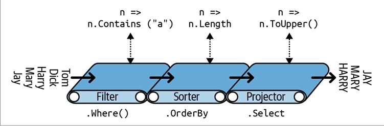 
</div>

می‌توانیم همان پرس‌وجوی قبلی را به‌صورت مرحله‌ای بسازیم، به این شکل:
</div>

```csharp
// برای کامپایل شدن، باید فضای نام System.Linq را وارد کنید:
IEnumerable<string> filtered   = names   .Where   (n => n.Contains("a"));
IEnumerable<string> sorted     = filtered.OrderBy (n => n.Length);
IEnumerable<string> finalQuery = sorted  .Select  (n => n.ToUpper());
```

<div dir="rtl">
`finalQuery` از نظر ترکیبی **کاملاً مشابه** پرس‌وجویی است که قبلاً ساخته‌ایم.

علاوه بر این، هر مرحله میانی نیز یک پرس‌وجوی معتبر است که می‌توانیم اجرا کنیم:
</div>

```csharp
foreach (string name in filtered)
    Console.Write(name + "|");        // Harry|Mary|Jay|
Console.WriteLine();

foreach (string name in sorted)
    Console.Write(name + "|");        // Jay|Mary|Harry|
Console.WriteLine();

foreach (string name in finalQuery)
    Console.Write(name + "|");        // JAY|MARY|HARRY|
```

<div dir="rtl">
---

### اهمیت **extension methods** ⭐

به جای استفاده از نحو **extension method**، می‌توان از نحو متد ایستا (**static method syntax**) برای فراخوانی عملگرهای پرس‌وجو استفاده کرد:
</div>

```csharp
IEnumerable<string> filtered = Enumerable.Where(names, n => n.Contains("a"));
IEnumerable<string> sorted   = Enumerable.OrderBy(filtered, n => n.Length);
IEnumerable<string> finalQuery = Enumerable.Select(sorted, n => n.ToUpper());
```

<div dir="rtl">
در واقع، **کامپایلر** همین ترجمه را برای فراخوانی متدهای توسعه‌ای انجام می‌دهد.

اما اگر بخواهید پرس‌وجو را در یک **عبارت واحد** بنویسید، استفاده نکردن از **extension methods** هزینه‌بر خواهد بود.

---

#### پرس‌وجوی یک‌عبارتی با **extension method syntax**:
</div>

```csharp
IEnumerable<string> query = names.Where(n => n.Contains("a"))
                                 .OrderBy(n => n.Length)
                                 .Select(n => n.ToUpper());
```

<div dir="rtl">
شکل طبیعی و خطی آن جریان داده از **چپ به راست** را نشان می‌دهد و همچنین عبارات لامبدا را کنار عملگرهای پرس‌وجو نگه می‌دارد (**infix notation**).

بدون **extension methods**، روانی پرس‌وجو از بین می‌رود:
</div>

```csharp
IEnumerable<string> query =
    Enumerable.Select(
        Enumerable.OrderBy(
            Enumerable.Where(
                names, n => n.Contains("a")
            ), n => n.Length
        ), n => n.ToUpper()
    );
```

<div dir="rtl">
---

### ترکیب عبارات لامبدا 🔹

در مثال‌های قبلی، عبارت لامبدا زیر به **عملگر Where** داده شده بود:
</div>

```csharp
n => n.Contains("a")   // نوع ورودی = string، نوع خروجی = bool
```

<div dir="rtl">
یک عبارت لامبدا که یک مقدار می‌گیرد و **bool** برمی‌گرداند، **predicate** نامیده می‌شود.

هدف عبارت لامبدا به عملگر پرس‌وجو بستگی دارد:

* با **Where**، نشان می‌دهد که آیا یک عنصر باید در دنباله خروجی باشد یا نه.
* با **OrderBy**، عنصر ورودی را به کلید مرتب‌سازی آن نگاشت می‌کند.
* با **Select**، تعیین می‌کند هر عنصر ورودی قبل از ارسال به دنباله خروجی چگونه تبدیل شود.

یک عبارت لامبدا همیشه روی **عناصر فردی** دنباله ورودی کار می‌کند، نه روی دنباله به‌صورت کل.

---

### نحوه ارزیابی لامبدا

عملگر پرس‌وجو عبارت لامبدا شما را **به‌صورت تنبل و در زمان نیاز** ارزیابی می‌کند، معمولاً یک بار برای هر عنصر دنباله ورودی.

عبارات لامبدا به شما اجازه می‌دهند منطق خود را به عملگرهای پرس‌وجو منتقل کنید، که باعث انعطاف‌پذیری آن‌ها می‌شود، در حالی که ساختار داخلی ساده باقی می‌ماند.

نمونه‌ای از پیاده‌سازی کامل **Enumerable.Where** (به جز مدیریت استثناها):
</div>

```csharp
public static IEnumerable<TSource> Where<TSource>(
    this IEnumerable<TSource> source, 
    Func<TSource,bool> predicate
)
{
    foreach (TSource element in source)
        if (predicate(element))
            yield return element;
}
```

<div dir="rtl">
---

### عبارات لامبدا و امضای **Func** ✍️

عملگرهای استاندارد پرس‌وجو از **generic Func delegates** استفاده می‌کنند.
**Func** یک خانواده از دیلیگیت‌های عمومی در فضای نام **System** است که با هدف زیر تعریف شده‌اند:

* آرگومان‌های نوع (**type arguments**) در **Func** همان ترتیبی را دارند که در عبارات لامبدا استفاده می‌شوند.
* بنابراین، **Func\<TSource,bool>** با لامبدا **TSource => bool** مطابقت دارد: یک آرگومان TSource می‌گیرد و یک مقدار bool بازمی‌گرداند.
* به‌طور مشابه، **Func\<TSource,TResult>** با لامبدا **TSource => TResult** مطابقت دارد.

لیست دیلیگیت‌های **Func** در بخش «Lambda Expressions» در صفحه ۱۸۸ آمده است.

---

### عبارات لامبدا و نوع‌دهی عناصر

عملگرهای استاندارد پرس‌وجو از نام‌های پارامتر نوع (**type parameter names**) زیر استفاده می‌کنند:
<div align="center">
    
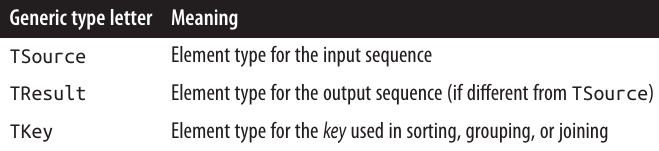 
</div>

### نوع‌دهی عناصر در عبارات لامبدا 🎯

**TSource** توسط دنباله ورودی تعیین می‌شود. **TResult** و **TKey** معمولاً از روی عبارت لامبدا شما استنتاج می‌شوند.

برای مثال، به امضای عملگر پرس‌وجوی **Select** توجه کنید:
</div>

```csharp
public static IEnumerable<TResult> Select<TSource,TResult>(
    this IEnumerable<TSource> source, 
    Func<TSource,TResult> selector
)
```

<div dir="rtl">
عبارت لامبدا **Func\<TSource,TResult>** با لامبدا **TSource => TResult** مطابقت دارد: عنصری از نوع ورودی را به عنصری از نوع خروجی نگاشت می‌کند. **TSource** و **TResult** می‌توانند نوع‌های متفاوتی داشته باشند، بنابراین لامبدا می‌تواند نوع هر عنصر را تغییر دهد. علاوه بر این، نوع دنباله خروجی توسط لامبدا تعیین می‌شود.

مثال زیر از **Select** برای تبدیل عناصر رشته‌ای به عناصر عدد صحیح استفاده می‌کند:
</div>

```csharp
string[] names = { "Tom", "Dick", "Harry", "Mary", "Jay" };
IEnumerable<int> query = names.Select(n => n.Length);

foreach (int length in query)
    Console.Write(length + "|");   // 3|4|5|4|3|
```

<div dir="rtl">
کامپایلر نوع **TResult** را از مقدار بازگشتی لامبدا استنتاج می‌کند. در این مثال، `n.Length` یک مقدار **int** برمی‌گرداند، بنابراین **TResult** برابر با **int** است.

---

عملگر **Where** ساده‌تر است و نیاز به استنتاج نوع برای خروجی ندارد، زیرا عناصر ورودی و خروجی از یک نوع هستند. این منطقی است چون این عملگر فقط عناصر را فیلتر می‌کند و آن‌ها را تبدیل نمی‌کند:
</div>

```csharp
public static IEnumerable<TSource> Where<TSource>(
    this IEnumerable<TSource> source, 
    Func<TSource,bool> predicate
)
```

<div dir="rtl">
---

### امضای عملگر **OrderBy** 🔑
</div>

```csharp
// کمی ساده شده
public static IEnumerable<TSource> OrderBy<TSource,TKey>(
    this IEnumerable<TSource> source, 
    Func<TSource,TKey> keySelector
)
```

<div dir="rtl">
عبارت لامبدا **Func\<TSource,TKey>** یک عنصر ورودی را به **کلید مرتب‌سازی (sorting key)** نگاشت می‌کند. **TKey** از روی لامبدا استنتاج می‌شود و از نوع عنصر ورودی و خروجی جداست.

برای مثال، می‌توانیم لیست نام‌ها را بر اساس طول (**کلید int**) یا به‌صورت الفبایی (**کلید string**) مرتب کنیم:
</div>

```csharp
string[] names = { "Tom", "Dick", "Harry", "Mary", "Jay" };
IEnumerable<string> sortedByLength, sortedAlphabetically;

sortedByLength       = names.OrderBy(n => n.Length);   // int key
sortedAlphabetically = names.OrderBy(n => n);          // string key
```

<div dir="rtl">
می‌توان عملگرهای پرس‌وجو در **Enumerable** را با **delegateهای سنتی** که به متدها اشاره دارند، فراخوانی کرد. این روش برای ساده کردن برخی پرس‌وجوهای محلی، به‌ویژه در **LINQ to XML** مفید است و در فصل ۱۰ نشان داده شده است.

اما این روش در دنباله‌های مبتنی بر **IQueryable<T>** (مثلاً هنگام پرس‌وجو از پایگاه داده) کار نمی‌کند، زیرا عملگرهای **Queryable** نیاز به عبارات لامبدا دارند تا بتوانند **expression tree** تولید کنند. این موضوع بعداً در بخش «پرس‌وجوهای تفسیر شده» صفحه ۴۴۸ توضیح داده می‌شود.

---

### ترتیب طبیعی عناصر 🔄

ترتیب اصلی عناصر در دنباله ورودی در LINQ اهمیت دارد. برخی عملگرها به این ترتیب وابسته‌اند، مانند **Take**، **Skip** و **Reverse**:

* **Take**: اولین x عنصر را خروجی می‌دهد و بقیه را حذف می‌کند:
</div>

```csharp
int[] numbers = { 10, 9, 8, 7, 6 };
IEnumerable<int> firstThree = numbers.Take(3);   // {10, 9, 8}
```

<div dir="rtl">
* **Skip**: x عنصر اول را نادیده می‌گیرد و بقیه را خروجی می‌دهد:
</div>

```csharp
IEnumerable<int> lastTwo = numbers.Skip(3);     // {7, 6}
```

<div dir="rtl">
* **Reverse**: عناصر را برعکس می‌کند:
</div>

```csharp
IEnumerable<int> reversed = numbers.Reverse();  // {6, 7, 8, 9, 10}
```

<div dir="rtl">
در پرس‌وجوهای محلی (**LINQ-to-objects**)، عملگرهایی مانند **Where** و **Select** ترتیب اصلی دنباله ورودی را حفظ می‌کنند (همچنین همه عملگرهای دیگر، مگر آن‌هایی که صراحتاً ترتیب را تغییر می‌دهند).

---

### سایر عملگرها 🔹

همه عملگرهای پرس‌وجو یک دنباله برنمی‌گردانند.

* **عملگرهای عنصر (element operators)** یک عنصر از دنباله ورودی استخراج می‌کنند، مانند **First**، **Last** و **ElementAt**:
</div>

```csharp
int[] numbers    = { 10, 9, 8, 7, 6 };
int firstNumber  = numbers.First();          // 10
int lastNumber   = numbers.Last();           // 6
int secondNumber = numbers.ElementAt(1);     // 9
int secondLowest = numbers.OrderBy(n => n).Skip(1).First(); // 7
```

<div dir="rtl">
این عملگرها معمولاً خروجی خود را برای اجرای عملگرهای دیگر فراخوانی نمی‌کنیم، مگر آن عنصر خودش یک مجموعه باشد.

* **عملگرهای تجمیع (aggregation operators)** یک مقدار اسکالر، معمولاً عددی، برمی‌گردانند:
</div>

```csharp
int count = numbers.Count();   // 5
int min   = numbers.Min();     // 6
```

<div dir="rtl">
* **عملگرهای کمی (quantifiers)** مقدار **bool** برمی‌گردانند:
</div>

```csharp
bool hasTheNumberNine     = numbers.Contains(9);          // true
bool hasMoreThanZeroElements = numbers.Any();            // true
bool hasAnOddElement      = numbers.Any(n => n % 2 != 0); // true
```

<div dir="rtl">
* برخی عملگرها دو دنباله ورودی می‌گیرند، مانند **Concat** که یک دنباله را به دیگری اضافه می‌کند و **Union** که مشابه آن است اما مقادیر تکراری را حذف می‌کند:
</div>

```csharp
int[] seq1 = {1, 2, 3};
int[] seq2 = {3, 4, 5};
IEnumerable<int> concat = seq1.Concat(seq2);  // {1, 2, 3, 3, 4, 5}
IEnumerable<int> union  = seq1.Union(seq2);   // {1, 2, 3, 4, 5}
```

<div dir="rtl">
* **عملگرهای اتصال (joining operators)** نیز در همین دسته قرار می‌گیرند. فصل ۹ تمام عملگرهای پرس‌وجو را به‌تفصیل پوشش می‌دهد.


### عبارات پرس‌وجو (Query Expressions) 📝

C# یک **میان‌بر نحوی** برای نوشتن پرس‌وجوهای LINQ فراهم می‌کند که به آن **query expressions** گفته می‌شود. برخلاف تصور رایج، عبارت پرس‌وجو **یعنی SQL داخل C#** نیست. در واقع، طراحی **query expressions** عمدتاً از **list comprehensions** در زبان‌های برنامه‌نویسی تابعی مانند **LISP** و **Haskell** الهام گرفته شده است، هرچند SQL هم کمی تأثیر ظاهری داشته است.

در این کتاب، نحو **query expressions** را به سادگی **query syntax** می‌نامیم.

---

در بخش قبل، پرس‌وجویی با **Fluent Syntax** نوشتیم تا رشته‌هایی که شامل حرف "a" هستند را استخراج کرده، بر اساس طول مرتب کنیم و به حروف بزرگ تبدیل کنیم. همان پرس‌وجو به شکل **query syntax** به این صورت است:
</div>

```csharp
using System;
using System.Collections.Generic;
using System.Linq;

string[] names = { "Tom", "Dick", "Harry", "Mary", "Jay" };

IEnumerable<string> query =
    from    n in names
    where   n.Contains("a")     // فیلتر کردن عناصر
    orderby n.Length             // مرتب‌سازی عناصر
    select  n.ToUpper();         // تبدیل هر عنصر (projection)

foreach (string name in query)
    Console.WriteLine(name);
```

<div dir="rtl">
خروجی:
</div>

```
JAY
MARY
HARRY
```

<div dir="rtl">
---

### ساختار عبارات پرس‌وجو 🏗️

عبارات پرس‌وجو همیشه با **from** شروع و با **select** یا **group** پایان می‌یابند.

* **from** یک **متغیر دامنه (range variable)** تعریف می‌کند (در این مثال `n`) که مانند یک حلقه `foreach`، دنباله ورودی را پیمایش می‌کند.

شکل کامل نحو، همانند **نمودار راه‌آهن (railroad diagram)** در شکل ۸-۲ نشان داده شده است.

برای خواندن این نمودار، از سمت چپ شروع کرده و مانند یک قطار مسیر را دنبال کنید.

* پس از **from** اجباری، می‌توان به‌صورت اختیاری از **orderby**، **where**، **let** یا **join** استفاده کرد.
* سپس می‌توان با **select** یا **group** ادامه داد، یا دوباره یک **from**، **orderby**، **where**، **let** یا **join** اضافه کرد.
<div align="center">
    
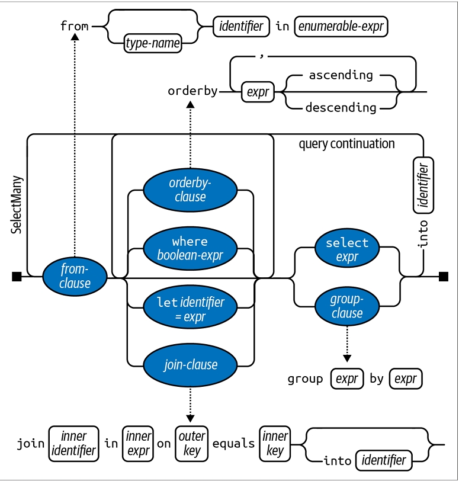 
</div>

### پردازش عبارات پرس‌وجو توسط کامپایلر ⚙️

کامپایلر یک **query expression** را با ترجمه آن به **Fluent Syntax** پردازش می‌کند. این فرآیند نسبتاً مکانیکی است—مشابه تبدیل حلقه‌های `foreach` به فراخوانی‌های `GetEnumerator` و `MoveNext`.

این یعنی هر چیزی که بتوانید در **query syntax** بنویسید، می‌توانید به همان شکل در **fluent syntax** نیز بنویسید. برای مثال، پرس‌وجوی قبلی توسط کامپایلر به این شکل ترجمه می‌شود:
</div>

```csharp
IEnumerable<string> query = names.Where(n => n.Contains("a"))
                                 .OrderBy(n => n.Length)
                                 .Select(n => n.ToUpper());
```

<div dir="rtl">
عملگرهای **Where**، **OrderBy** و **Select** همان قواعدی را دنبال می‌کنند که اگر پرس‌وجو را با **fluent syntax** نوشته بودید، اعمال می‌شد. در این مثال، آن‌ها به **extension methods** در کلاس **Enumerable** متصل می‌شوند، زیرا فضای نام **System.Linq** وارد شده و `names` پیاده‌سازی‌کننده `IEnumerable<string>` است.

کامپایلر هنگام ترجمه عبارات پرس‌وجو، به‌طور خاص کلاس **Enumerable** را ترجیح نمی‌دهد. می‌توان تصور کرد که کامپایلر کلمات **“Where”**، **“OrderBy”** و **“Select”** را به‌صورت مکانیکی در عبارت وارد کرده و آن را به‌عنوان متدهای عادی کامپایل می‌کند. این انعطاف‌پذیری باعث می‌شود که عملگرهای پرس‌وجوی پایگاه داده، در بخش‌های بعدی، به **extension methods** در کلاس **Queryable** متصل شوند.

اگر دستور `using System.Linq` را حذف کنید، پرس‌وجو کامپایل نخواهد شد، زیرا متدهای **Where**، **OrderBy** و **Select** به جایی برای اتصال ندارند. بنابراین عبارات پرس‌وجو **بدون وارد کردن System.Linq یا فضایی با پیاده‌سازی این متدها، کامپایل نمی‌شوند**.

---

### متغیرهای دامنه (Range Variables) 🔹

شناسه‌ای که بلافاصله پس از **from** می‌آید، **range variable** نامیده می‌شود. یک متغیر دامنه به **عنصر جاری در دنباله** که عملیات روی آن انجام می‌شود، اشاره دارد.

در مثال‌های ما، متغیر دامنه `n` در هر بخش پرس‌وجو ظاهر می‌شود. با این حال، این متغیر در هر بخش روی دنباله‌ای متفاوت شمارش می‌شود:
</div>

```csharp
from    n in names           // n متغیر دامنه ماست
where   n.Contains("a")     // n = مستقیم از آرایه
orderby n.Length             // n = پس از فیلتر شدن
select  n.ToUpper()          // n = پس از مرتب‌سازی
```

<div dir="rtl">
این موضوع با ترجمه مکانیکی کامپایلر به **fluent syntax** واضح می‌شود:
</div>

```csharp
names.Where(n => n.Contains("a"))   // n با دامنه محلی
     .OrderBy(n => n.Length)         // n با دامنه محلی
     .Select(n => n.ToUpper())       // n با دامنه محلی
```

<div dir="rtl">
همان‌طور که می‌بینید، هر نمونه از `n` **به‌صورت خصوصی** در لامبدا خود محدوده‌بندی شده است.

---

### معرفی متغیرهای دامنه جدید

عبارات پرس‌وجو اجازه می‌دهند تا متغیرهای دامنه جدید با استفاده از بخش‌های زیر معرفی شوند:

* **let**
* **into**
* یک **from** اضافی
* **join**

این موارد در ادامه فصل در بخش «Composition Strategies» صفحه ۴۴۲ و همچنین در فصل ۹، در بخش‌های «Projecting» صفحه ۴۷۳ و «Joining» صفحه ۴۷۳ بررسی می‌شوند.

---

### مقایسه Query Syntax با SQL Syntax ⚡

عبارات پرس‌وجو از نظر ظاهری شبیه SQL هستند، اما در واقع بسیار متفاوت‌اند:

* یک پرس‌وجوی LINQ در نهایت **یک عبارت C#** است و قوانین استاندارد C# را دنبال می‌کند.
* در LINQ نمی‌توانید از متغیر قبل از تعریف آن استفاده کنید، در حالی که در SQL می‌توان یک **table alias** را در SELECT قبل از FROM استفاده کرد.
* یک **Subquery** در LINQ صرفاً یک عبارت C# دیگر است و نیازی به نحو ویژه ندارد، اما در SQL قواعد خاصی دارد.
* جریان داده در LINQ از **چپ به راست** است، در حالی که در SQL ترتیب داده کمتر ساختارمند است.
* پرس‌وجوی LINQ یک **خط تولید یا pipeline** از عملگرهاست که ترتیب عناصر در آن مهم است، اما SQL عمدتاً با مجموعه‌های بدون ترتیب کار می‌کند.

---

### مقایسه Query Syntax با Fluent Syntax 🔄

هر دو نحو مزایا دارند:

* **Query syntax** برای پرس‌وجوهایی که شامل موارد زیر هستند ساده‌تر است:

  * **let clause** برای معرفی متغیر جدید در کنار متغیر دامنه
  * **SelectMany**، **Join** یا **GroupJoin** با ارجاع به متغیر دامنه بیرونی

* برای پرس‌وجوهای ساده با **Where**، **OrderBy** و **Select**، هر دو نحو خوب کار می‌کنند و انتخاب بیشتر شخصی است.

* برای پرس‌وجوهایی که فقط شامل یک عملگر هستند، **Fluent syntax** کوتاه‌تر و مرتب‌تر است.

* برخی عملگرها در **query syntax** کلیدواژه ندارند و برای استفاده از آن‌ها حداقل بخشی از Fluent syntax لازم است. این عملگرها خارج از موارد زیر هستند:
</div>

```
Where, Select, SelectMany
OrderBy, ThenBy, OrderByDescending, ThenByDescending
GroupBy, Join, GroupJoin
```

<div dir="rtl">
---

### پرس‌وجوهای ترکیبی (Mixed-Syntax) ⚙️

اگر یک عملگر پرس‌وجو در **query syntax** پشتیبانی نشود، می‌توانید **query syntax** و **fluent syntax** را ترکیب کنید. تنها محدودیت این است که هر بخش query syntax باید **کامل** باشد (یعنی با from شروع و با select یا group پایان یابد).

برای مثال، با آرایه زیر:
</div>

```csharp
string[] names = { "Tom", "Dick", "Harry", "Mary", "Jay" };
```

<div dir="rtl">
مثال ترکیبی زیر تعداد نام‌هایی که شامل حرف "a" هستند را می‌شمارد:
</div>

```csharp
int matches = (from n in names
               where n.Contains("a")
               select n).Count();   // 3
```

<div dir="rtl">
همچنین اولین نام به ترتیب الفبایی را می‌گیرد:
</div>

```csharp
string first = (from n in names
                orderby n
                select n).First();   // Dick
```

<div dir="rtl">
در پرس‌وجوهای ساده، می‌توان کل کار را با Fluent syntax انجام داد:
</div>

```csharp
int matches = names.Where(n => n.Contains("a")).Count();   // 3
string first = names.OrderBy(n => n).First();              // Dick
```

<div dir="rtl">
گاهی پرس‌وجوهای ترکیبی بالاترین **کارایی و سادگی** را ارائه می‌دهند. بنابراین مهم است که همیشه به‌طور یک‌جانبه فقط یک نحو را ترجیح ندهید، تا هنگام نیاز بتوانید از پرس‌وجوی ترکیبی بهره ببرید.

---

در ادامه این فصل، مفاهیم کلیدی با هر دو نحو **fluent** و **query syntax** نشان داده می‌شوند.

### اجرای به تعویق‌افتاده (Deferred Execution) ⏳

یکی از ویژگی‌های مهم بیشتر **query operators** این است که **در زمان ساخت پرس‌وجو اجرا نمی‌شوند**، بلکه زمانی اجرا می‌شوند که شمارش شوند (یعنی وقتی `MoveNext` روی enumerator فراخوانی شود).

مثال زیر را در نظر بگیرید:
</div>

```csharp
var numbers = new List<int> { 1 };
IEnumerable<int> query = numbers.Select(n => n * 10);   // ساخت پرس‌وجو
numbers.Add(2);                                         // اضافه کردن عنصر جدید
foreach (int n in query)
    Console.Write(n + "|");                             // 10|20|
```

<div dir="rtl">
عنصر اضافه‌شده پس از ساخت پرس‌وجو در نتیجه لحاظ می‌شود، زیرا **هیچ فیلتر یا مرتب‌سازی تا زمان اجرای `foreach` انجام نمی‌شود**. به این ویژگی **deferred یا lazy execution** گفته می‌شود، مشابه آنچه با **delegates** رخ می‌دهد:
</div>

```csharp
Action a = () => Console.WriteLine("Foo");
// هنوز چیزی به Console ننوشته‌ایم. حالا اجرا می‌کنیم:
a();  // اجرای به تعویق‌افتاده!
```

<div dir="rtl">
تمام **standard query operators** اجرای به تعویق‌افتاده دارند، به جز موارد زیر:

* عملگرهایی که **یک عنصر یا مقدار scalar** برمی‌گردانند، مثل `First` یا `Count`
* عملگرهای تبدیل مانند:

  * `ToArray`, `ToList`, `ToDictionary`, `ToLookup`, `ToHashSet`

این عملگرها **پرس‌وجو را فوراً اجرا می‌کنند** زیرا نوع خروجی آن‌ها مکانیزمی برای اجرای به تعویق‌افتاده ندارد. به عنوان مثال، `Count` یک **عدد ساده** برمی‌گرداند و دیگر شمارش نمی‌شود:
</div>

```csharp
int matches = numbers.Where(n => n <= 2).Count();   // اجرا فوراً انجام می‌شود
```

<div dir="rtl">
**اهمیت اجرای به تعویق‌افتاده** در این است که **ساخت پرس‌وجو را از اجرای آن جدا می‌کند**. این امکان را می‌دهد که پرس‌وجو را در چند مرحله بسازید و همچنین پرس‌وجوهای پایگاه داده را ممکن می‌سازد.

---

### ارزیابی مجدد (Reevaluation) 🔄

**Subqueries** سطح دیگری از **indirection** ایجاد می‌کنند. تمام محتویات یک subquery نیز از deferred execution پیروی می‌کنند، از جمله **aggregation** و **conversion methods**.

اجرای به تعویق‌افتاده یک پیامد دیگر هم دارد: **هر بار که پرس‌وجو دوباره شمارش شود، دوباره ارزیابی می‌شود**:
</div>

```csharp
var numbers = new List<int>() { 1, 2 };
IEnumerable<int> query = numbers.Select(n => n * 10);

foreach (int n in query) Console.Write(n + "|");  // 10|20|
numbers.Clear();
foreach (int n in query) Console.Write(n + "|");  // <چیزی نمایش داده نمی‌شود>
```

<div dir="rtl">
گاهی ارزیابی مجدد ممکن است **مزاحمت‌آفرین** باشد:

* وقتی می‌خواهید نتایج را در یک نقطه زمانی مشخص **ذخیره یا freeze** کنید
* وقتی پرس‌وجو محاسبات سنگین دارد یا به پایگاه داده خارجی وابسته است، تکرار غیرضروری آن منطقی نیست

برای جلوگیری از ارزیابی مجدد، می‌توانید از **conversion operators** مانند `ToArray` یا `ToList` استفاده کنید:
</div>

```csharp
var numbers = new List<int>() { 1, 2 };
List<int> timesTen = numbers
    .Select(n => n * 10)
    .ToList();                // فوراً اجرا و در List<int> ذخیره شد
numbers.Clear();
Console.WriteLine(timesTen.Count);  // هنوز 2
```

<div dir="rtl">
---

### متغیرهای گرفته‌شده (Captured Variables) ⚠️

اگر **lambda expressions** پرس‌وجو متغیرهای بیرونی را گرفته باشند، **مقدار آن‌ها هنگام اجرای پرس‌وجو لحاظ می‌شود**:
</div>

```csharp
int[] numbers = { 1, 2 };
int factor = 10;
IEnumerable<int> query = numbers.Select(n => n * factor);
factor = 20;

foreach (int n in query) Console.Write(n + "|");  // 20|40|
```

<div dir="rtl">
این می‌تواند **یک تله در حلقه‌ها** ایجاد کند. مثال حذف حروف صدادار از یک رشته:
</div>

```csharp
IEnumerable<char> query = "Not what you might expect";
query = query.Where(c => c != 'a');
query = query.Where(c => c != 'e');
query = query.Where(c => c != 'i');
query = query.Where(c => c != 'o');
query = query.Where(c => c != 'u');

foreach (char c in query) Console.Write(c);  // Nt wht y mght xpct
```

<div dir="rtl">
اگر بخواهیم از **for loop** استفاده کنیم:
</div>

```csharp
IEnumerable<char> query = "Not what you might expect";
string vowels = "aeiou";
for (int i = 0; i < vowels.Length; i++)
    query = query.Where(c => c != vowels[i]);

foreach (char c in query) Console.Write(c);
```

<div dir="rtl">
یک **IndexOutOfRangeException** رخ می‌دهد، زیرا متغیر حلقه `i` در closure گرفته شده و هنگام شمارش مقدار آن برابر ۵ است.

راه حل‌ها:

1. **تعریف متغیر محلی داخل بلوک**:
</div>

```csharp
for (int i = 0; i < vowels.Length; i++)
{
    char vowel = vowels[i];
    query = query.Where(c => c != vowel);
}
```

<div dir="rtl">
2. یا استفاده از **foreach**:
</div>

```csharp
foreach (char vowel in vowels)
    query = query.Where(c => c != vowel);
```

<div dir="rtl">
---

### نحوه کار Deferred Execution 🔧

عملگرهای پرس‌وجو اجرای به تعویق‌افتاده را با **بازگرداندن decorator sequences** فراهم می‌کنند.

برخلاف کلاس‌های سنتی مانند آرایه یا لیست پیوندی، یک **decorator sequence** معمولاً ساختار داخلی برای ذخیره عناصر ندارد. در عوض، یک **sequence دیگر** که هنگام اجرا تأمین می‌کنید را پوشش می‌دهد و وابستگی دائمی به آن دارد. هر بار که داده از decorator درخواست شود، باید داده را از دنباله ورودی دریافت کند.

**تبدیل یا تغییر عملگر پرس‌وجو همان “decoration” است.** اگر دنباله خروجی هیچ تبدیلی انجام ندهد، یک **proxy** است نه decorator.

فراخوانی `Where` صرفاً **دنباله wrapper** را می‌سازد که شامل ارجاع به **input sequence**، **lambda expression** و سایر آرگومان‌ها است. دنباله ورودی **فقط زمانی شمارش می‌شود که decorator شمارش شود**.

مثال:
</div>

```csharp
IEnumerable<int> lessThanTen = new int[] { 5, 12, 3 }.Where(n => n < 10);
```

<div dir="rtl">
این ساختار همانند شکل ۸-۳ ترکیب می‌شود.
<div align="center">
    
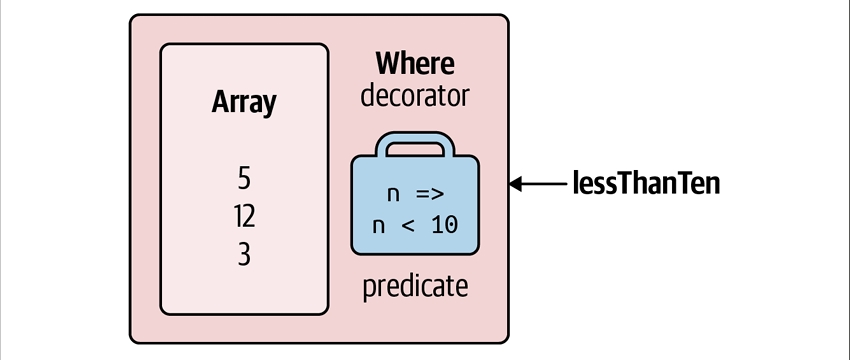 
</div>

هنگامی که `lessThanTen` را شمارش می‌کنید، در واقع **آرایه را از طریق decorator `Where` پرس‌وجو می‌کنید**. ✅

خبر خوب این است که اگر بخواهید **یک query operator شخصی بسازید**، پیاده‌سازی یک **decorator sequence** با **C# iterator** بسیار ساده است. مثال ساخت متد `Select` خودتان:
</div>

```csharp
public static IEnumerable<TResult> MySelect<TSource,TResult>
    (this IEnumerable<TSource> source, Func<TSource,TResult> selector)
{
    foreach (TSource element in source)
        yield return selector(element);
}
```

<div dir="rtl">
این متد به دلیل استفاده از **`yield return`** یک **iterator** است. از نظر عملکرد، معادل کوتاه‌شده‌ی کد زیر است:
</div>

```csharp
public static IEnumerable<TResult> MySelect<TSource,TResult>
    (this IEnumerable<TSource> source, Func<TSource,TResult> selector)
{
    return new SelectSequence(source, selector);
}
```

<div dir="rtl">
که در آن `SelectSequence` یک **کلاس نوشته‌شده توسط کامپایلر** است که **enumerator آن منطق موجود در iterator را encapsulate می‌کند**.

بنابراین، وقتی عملیاتی مانند `Select` یا `Where` را فراخوانی می‌کنید، در واقع **تنها یک کلاس enumerable ایجاد می‌کنید که دنباله ورودی را decorate می‌کند**. 🎁

---

### زنجیره‌سازی Decorators 🔗

زنجیره‌سازی **query operators** باعث **لایه‌لایه شدن decorators** می‌شود. مثال:
</div>

```csharp
IEnumerable<int> query = new int[] { 5, 12, 3 }
    .Where(n => n < 10)
    .OrderBy(n => n)
    .Select(n => n * 10);
```

<div dir="rtl">
هر **query operator** یک decorator جدید ایجاد می‌کند که **دنباله قبلی را می‌پوشاند** (مانند **عروسک‌های روسی تو در تو**). 🪆

شکل ۸-۴ **مدل شیء (object model)** این پرس‌وجو را نشان می‌دهد. توجه کنید که **این مدل شیء کاملاً قبل از هر شمارش ساخته می‌شود** و هیچ داده‌ای هنوز پردازش نشده است.
<div align="center">
    
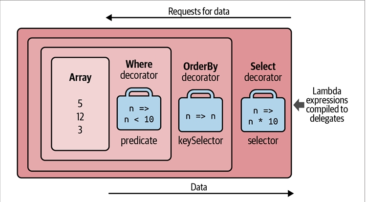 
</div>

وقتی `query` را شمارش می‌کنید، در واقع **آرایه اصلی را از طریق یک زنجیره یا لایه‌بندی از decorators پرس‌وجو می‌کنید**. 🔄

اضافه کردن `ToList` در انتهای این پرس‌وجو باعث می‌شود که **عملگرهای قبلی فوراً اجرا شوند** و کل **مدل شیء (object model)** به یک **لیست واحد** تبدیل شود. 📋

شکل ۸-۵ همان ترکیب شیء را در **UML (Unified Modeling Language)** نشان می‌دهد:

* decorator `Select` به decorator `OrderBy` ارجاع می‌دهد،
* decorator `OrderBy` به decorator `Where` ارجاع می‌دهد،
* و decorator `Where` به آرایه اصلی ارجاع می‌دهد.

ویژگی اجرای به تعویق‌افتاده این است که اگر **پرس‌وجو را به صورت مرحله‌ای بسازید**، **همان مدل شیء ساخته می‌شود**:
</div>

```csharp
IEnumerable<int>
    source    = new int[] { 5, 12, 3 },
    filtered  = source   .Where(n => n < 10),
    sorted    = filtered .OrderBy(n => n),
    query     = sorted   .Select(n => n * 10);
```

<div dir="rtl">
<div align="center">
    
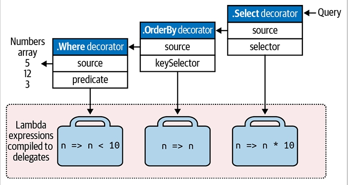 
</div>

### نحوه اجرای پرس‌وجوها ⚙️

نتایج شمارش پرس‌وجوی قبلی به این صورت است:
</div>

```csharp
foreach (int n in query) Console.WriteLine(n);
```

<div dir="rtl">
خروجی:
</div>

```
30
50
```

<div dir="rtl">
---

در پشت صحنه، `foreach` متد **`GetEnumerator`** را روی decorator `Select` (آخرین یا بیرونی‌ترین عملگر) فراخوانی می‌کند و این **تمام عملیات را آغاز می‌کند**. 🔄

نتیجه، یک **زنجیره از enumerator‌ها** است که **به طور ساختاری شبیه زنجیره decorator sequences** است.

شکل ۸-۶ **جریان اجرای پرس‌وجو در حین شمارش** را نشان می‌دهد.
<div align="center">
    
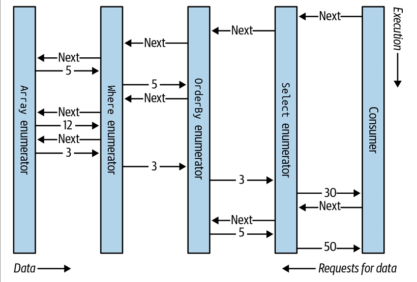 
</div>

در بخش اول این فصل، یک پرس‌وجو را به‌عنوان یک **خط تولید با نوار نقاله** نشان دادیم. با گسترش این قیاس، می‌توان گفت که یک پرس‌وجوی LINQ یک **خط تولید تنبل (lazy)** است، جایی که **نوارهای نقاله تنها هنگام نیاز عناصر را حرکت می‌دهند**. 🏭

ساختن یک پرس‌وجو، **ساختن خط تولید با همه اجزا** است—اما هیچ چیزی هنوز حرکت نمی‌کند. سپس، وقتی **مصرف‌کننده یک عنصر درخواست می‌کند** (یعنی پرس‌وجو را شمارش می‌کند)، **نوار نقاله سمت راست فعال می‌شود**؛ این به نوبه خود دیگر نوارها را تحریک می‌کند تا حرکت کنند—هرگاه که عناصر دنباله ورودی نیاز باشند. LINQ از مدل **pull مبتنی بر تقاضا** پیروی می‌کند، نه مدل push مبتنی بر عرضه. این ویژگی اهمیت دارد—همان‌طور که بعداً خواهید دید—چرا که به LINQ اجازه می‌دهد **برای پرس‌وجوهای SQL مقیاس‌پذیر باشد**. ⚡

---

### Subqueries (زیرپرس‌وجوها) 🔍

یک **زیرپرس‌وجو**، پرس‌وجویی است که در **lambda expression** یک پرس‌وجوی دیگر قرار دارد. مثال زیر، از یک زیرپرس‌وجو برای مرتب کردن موسیقی‌دان‌ها بر اساس **نام خانوادگی** استفاده می‌کند:
</div>

```csharp
string[] musos = { "David Gilmour", "Roger Waters", "Rick Wright", "Nick Mason" };
IEnumerable<string> query = musos.OrderBy(m => m.Split().Last());
```

<div dir="rtl">
* `m.Split` هر رشته را به یک مجموعه از کلمات تبدیل می‌کند، سپس **عملگر `Last`** روی آن فراخوانی می‌شود.
* `m.Split().Last` همان **زیرپرس‌وجو** است؛ و `query` پرس‌وجوی بیرونی را نشان می‌دهد.

---

زیرپرس‌وجوها مجاز هستند زیرا **می‌توان هر عبارت معتبر C# را در سمت راست lambda قرار داد**. زیرپرس‌وجو صرفاً یک **عبارت C# دیگر** است و قوانین آن **تبعیت از قوانین lambda expressions** و رفتار کلی query operators دارد.

در این کتاب، وقتی از اصطلاح **subquery** استفاده می‌کنیم، منظور **پرس‌وجویی است که در lambda expression یک پرس‌وجوی دیگر ارجاع شده**. در **query expressions**، یک زیرپرس‌وجو معادل پرس‌وجویی است که از یک عبارت در هر clause به جز **from** ارجاع شده باشد.

زیرپرس‌وجو به **طور خصوصی در محدوده عبارت احاطه‌کننده** است و می‌تواند به **پارامترهای lambda بیرونی** یا **range variables در query expression** ارجاع دهد.

مثال ساده:
</div>

```csharp
string[] names = { "Tom", "Dick", "Harry", "Mary", "Jay" };
IEnumerable<string> outerQuery = names
    .Where(n => n.Length == names.OrderBy(n2 => n2.Length)
                                .Select(n2 => n2.Length).First());
// Tom, Jay
```

<div dir="rtl">
همان مثال به صورت query expression:
</div>

```csharp
IEnumerable<string> outerQuery =
    from n in names
    where n.Length ==
        (from n2 in names orderby n2.Length select n2.Length).First()
    select n;
```

<div dir="rtl">
* **توجه:** چون **range variable بیرونی (n)** در محدوده زیرپرس‌وجو در دسترس است، نمی‌توان از همان نام `n` برای زیرپرس‌وجو استفاده کرد.

---

**زمان اجرای زیرپرس‌وجو:**
یک زیرپرس‌وجو **هرگاه lambda احاطه‌کننده ارزیابی شود، اجرا می‌شود**. به عبارت دیگر، **اجرا از بیرون به داخل** انجام می‌شود.

* برای **پرس‌وجوهای محلی (local queries)**، این مدل دقیقاً رعایت می‌شود.
* برای **پرس‌وجوهای تفسیرشده (interpreted queries)**، مانند پرس‌وجوهای پایگاه داده، این مدل **به صورت مفهومی** رعایت می‌شود.

---

زیرپرس‌وجو **هر زمان که نیاز باشد اجرا می‌شود تا پرس‌وجوی بیرونی را تغذیه کند**. همان‌طور که در شکل‌های ۸-۷ و ۸-۸ نشان داده شده، **زیرپرس‌وجو (نوار نقاله بالایی)** برای هر تکرار حلقه بیرونی یک بار اجرا می‌شود.
<div align="center">
    
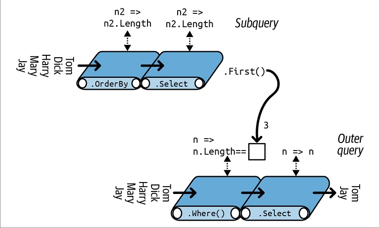 
</div>

می‌توانیم **زیرپرس‌وجوی قبلی** را به شکل مختصرتر این‌گونه بیان کنیم:
</div>

```csharp
IEnumerable<string> query =
    from n in names
    where n.Length == names.OrderBy(n2 => n2.Length).First().Length
    select n;
```

<div dir="rtl">
با استفاده از **تابع تجمیعی `Min`** می‌توان پرس‌وجو را حتی ساده‌تر کرد:
</div>

```csharp
IEnumerable<string> query =
    from n in names
    where n.Length == names.Min(n2 => n2.Length)
    select n;
```

<div dir="rtl">
---

در بخش **“Interpreted Queries”** در صفحه 448، توضیح داده‌ایم که چگونه می‌توان از منابع راه‌دور مانند جداول SQL پرس‌وجو گرفت. مثال بالا برای **پرس‌وجوی پایگاه داده** ایده‌آل است، زیرا به صورت یک واحد پردازش می‌شود و فقط یک بار نیاز به ارسال به سرور پایگاه داده دارد. 🖥️

با این حال، برای یک مجموعه محلی، این پرس‌وجو **بهینه نیست**، چون زیرپرس‌وجو **در هر تکرار حلقه بیرونی دوباره محاسبه می‌شود**.

برای اجتناب از این ناکارآمدی، می‌توانیم زیرپرس‌وجو را **به صورت جداگانه اجرا کنیم** تا دیگر زیرپرس‌وجو نباشد:
</div>

```csharp
int shortest = names.Min(n => n.Length);
IEnumerable<string> query =
    from n in names
    where n.Length == shortest
    select n;
```

<div dir="rtl">
<div align="center">
    
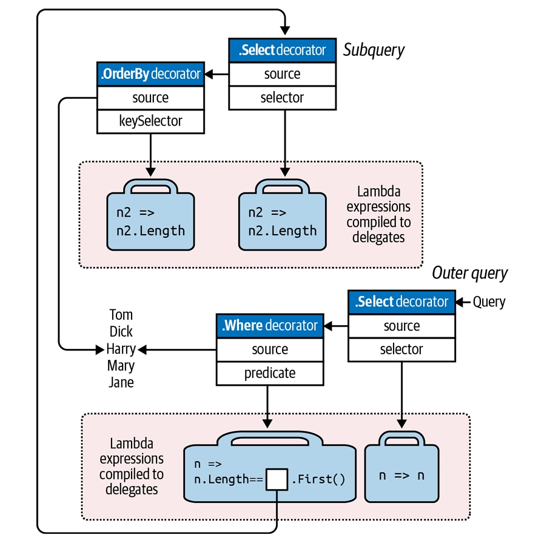 
</div>

تفکیک زیرپرس‌وجوها به این صورت تقریباً همیشه در **پرس‌وجوهای روی مجموعه‌های محلی** توصیه می‌شود، زیرا کارایی و وضوح کد را افزایش می‌دهد. تنها استثناء زمانی است که زیرپرس‌وجو **مرتبط (correlated)** باشد، یعنی به متغیرهای محدوده‌ی پرس‌وجوی بیرونی اشاره کند. زیرپرس‌وجوهای مرتبط در بخش «Projecting» در صفحه 473 توضیح داده شده‌اند.
**زیرپرس‌وجوها و اجرای تنبل (Deferred Execution)**
یک عملگر عنصر یا تجمیع مانند `First` یا `Count` در یک زیرپرس‌وجو، باعث اجرای فوری پرس‌وجوی بیرونی نمی‌شود—اجرای تنبل هنوز برای پرس‌وجوی بیرونی برقرار است. دلیل این است که زیرپرس‌وجوها به‌صورت غیرمستقیم فراخوانی می‌شوند—در مورد پرس‌وجوهای محلی، از طریق یک **delegate** و در مورد پرس‌وجوهای تفسیرشده، از طریق یک **expression tree**.

یک حالت جالب زمانی پیش می‌آید که زیرپرس‌وجو را در یک عبارت `Select` قرار دهید. در پرس‌وجوهای محلی، شما در واقع **یک دنباله از پرس‌وجوها را پروجکت می‌کنید**—هر کدام خود تحت اجرای تنبل هستند. این کار معمولاً شفاف است و **به بهبود کارایی کمک می‌کند**. مثال‌های دقیق‌تر برای زیرپرس‌وجوهای `Select` در فصل 9 بررسی شده‌اند.

---

### **استراتژی‌های ترکیب پرس‌وجوها**

سه استراتژی اصلی برای ساخت پرس‌وجوهای پیچیده‌تر وجود دارد که همه آنها **زنجیره‌ای از عملگرها** ایجاد می‌کنند و در زمان اجرا نتیجه‌ای یکسان دارند:

1. **ساخت تدریجی پرس‌وجو (Progressive query construction)**
2. **استفاده از کلمه کلیدی `into`**
3. **پیچاندن پرس‌وجوها (Wrapping queries)**

---

### **ساخت تدریجی پرس‌وجو (Progressive Query Building)**

در ابتدای فصل، نحوه ساخت تدریجی یک پرس‌وجو با **syntax فلونت** را مشاهده کردیم:
</div>

```csharp
var filtered = names.Where(n => n.Contains("a"));
var sorted   = filtered.OrderBy(n => n);
var query    = sorted.Select(n => n.ToUpper());
```

<div dir="rtl">
هر عملگر پرس‌وجو یک **decorator sequence** بازمی‌گرداند و در نتیجه پرس‌وجو همان **زنجیره‌ی لایه‌لایه‌ای از دکوریتورها** را دارد که در یک پرس‌وجوی تک‌عبارتی ایجاد می‌شود.

**مزایای ساخت تدریجی پرس‌وجو:**

* نوشتن پرس‌وجوها آسان‌تر می‌شود.
* امکان افزودن عملگرها به‌صورت شرطی وجود دارد. مثال:
</div>

```csharp
if (includeFilter) 
    query = query.Where(...);
```

<div dir="rtl">
این روش **بهینه‌تر از نوشتن شرط داخل پرس‌وجو** است:
</div>

```csharp
query = query.Where(n => !includeFilter || <expression>);
```

<div dir="rtl">
زیرا اگر `includeFilter` برابر `false` باشد، یک عملگر اضافه اضافه نمی‌شود.

---

### **مثال عملی: حذف حروف صدادار و مرتب‌سازی**

می‌خواهیم از یک لیست اسامی تمام **حروف صدادار** را حذف کنیم و سپس اسامی با طول بیش از دو حرف را به ترتیب الفبایی مرتب کنیم. با syntax فلونت:
</div>

```csharp
IEnumerable<string> query = names
    .Select(n => n.Replace("a","").Replace("e","").Replace("i","")
                  .Replace("o","").Replace("u",""))
    .Where(n => n.Length > 2)
    .OrderBy(n => n);

// خروجی:
// Dck
// Hrry
// Mry
```

<div dir="rtl">
به جای پنج بار فراخوانی `Replace` می‌توان از **Regular Expression** هم استفاده کرد:
</div>

```csharp
n => Regex.Replace(n, "[aeiou]", "")
```

<div dir="rtl">
مزیت `Replace` این است که در **پرس‌وجوهای پایگاه داده** نیز کار می‌کند.

---

### **چالش در ترجمه مستقیم به Query Syntax**

در **query syntax**، `select` باید بعد از `where` و `orderby` بیاید، و اگر ترتیب را تغییر دهیم، نتیجه متفاوت خواهد بود:
</div>

```csharp
IEnumerable<string> query =
    from n in names
    where n.Length > 2
    orderby n
    select n.Replace("a","").Replace("e","").Replace("i","")
             .Replace("o","").Replace("u","");

// خروجی:
// Dck
// Hrry
// Jy
// Mry
// Tm
```

<div dir="rtl">
---

### **راه حل: پرس‌وجوی تدریجی در Query Syntax**
</div>

```csharp
IEnumerable<string> query =
    from n in names
    select n.Replace("a","").Replace("e","").Replace("i","")
            .Replace("o","").Replace("u","");

query = from n in query
        where n.Length > 2
        orderby n
        select n;

// خروجی:
// Dck
// Hrry
// Mry
```

<div dir="rtl">
با این روش، نتیجه همانند پرس‌وجوی فلونت باقی می‌ماند و **خوانایی و انعطاف بیشتری** دارد.
### **کلمه کلیدی `into` در LINQ**

کلمه کلیدی `into` در **query expressions** بسته به زمینه، دو معنا دارد. معنایی که در اینجا بررسی می‌کنیم برای **ادامه دادن پرس‌وجو بعد از یک projection** است (معنای دیگر برای `GroupJoin` است).

با `into` می‌توان پرس‌وجو را **پس از یک select ادامه داد** و این در واقع یک **میانبر برای پرس‌وجوی تدریجی** است. برای مثال، پرس‌وجوی قبلی را می‌توان به شکل زیر نوشت:
</div>

```csharp
IEnumerable<string> query =
    from n in names
    select n.Replace("a","").Replace("e","").Replace("i","")
            .Replace("o","").Replace("u","")
    into noVowel
    where noVowel.Length > 2
    orderby noVowel
    select noVowel;
```

<div dir="rtl">
* **محدوده استفاده**: تنها بعد از یک `select` یا `group` می‌توان از `into` استفاده کرد.
* `into` پرس‌وجو را «ریستارت» می‌کند و اجازه می‌دهد که **clauses جدید** مثل `where`، `orderby` و `select` اضافه شوند.
* از دید **fluent syntax**، تمام پرس‌وجو یک پرس‌وجوی واحد است و استفاده از `into` **هیچ هزینه عملکردی اضافی** ندارد.

**معادل در Fluent Syntax**: در واقع یک **زنجیره طولانی‌تر از عملگرها** است.

---

### **قوانین محدوده (Scoping Rules)**

تمام **range variables** پس از `into` از محدوده خارج می‌شوند. مثال نادرست:
</div>

```csharp
var query =
    from n1 in names
    select n1.ToUpper()
    into n2          // فقط n2 قابل دسترس است
    where n1.Contains("x")  // خطا: n1 از محدوده خارج شده
    select n2;
```

<div dir="rtl">
**توضیح:** در fluent syntax معادل:
</div>

```csharp
var query = names
    .Select(n1 => n1.ToUpper())
    .Where(n2 => n1.Contains("x")); // خطا: n1 دیگر در دسترس نیست
```

<div dir="rtl">
---

### **پیچاندن پرس‌وجوها (Wrapping Queries)**

یک پرس‌وجوی تدریجی می‌تواند به شکل **یک statement واحد** با **پیچاندن یک پرس‌وجو در پرس‌وجوی دیگر** نوشته شود:
</div>

```csharp
var tempQuery = tempQueryExpr;
var finalQuery = from ... in tempQuery ...
```

<div dir="rtl">
معادل **فرم بدون متغیر واسط**:
</div>

```csharp
var finalQuery = from ... in (tempQueryExpr)
                 ...
```

<div dir="rtl">
**مثال عملی:**

پرس‌وجوی تدریجی:
</div>

```csharp
IEnumerable<string> query =
    from n in names
    select n.Replace("a","").Replace("e","").Replace("i","")
            .Replace("o","").Replace("u","");

query = from n in query
        where n.Length > 2
        orderby n
        select n;
```

<div dir="rtl">
همان پرس‌وجو به صورت **wrapped**:
</div>

```csharp
IEnumerable<string> query =
    from n1 in
    (
        from n2 in names
        select n2.Replace("a","").Replace("e","").Replace("i","")
                 .Replace("o","").Replace("u","")
    )
    where n1.Length > 2
    orderby n1
    select n1;
```

<div dir="rtl">
در **fluent syntax**، نتیجه همان زنجیره خطی عملگرها است:
</div>

```csharp
IEnumerable<string> query = names
    .Select(n => n.Replace("a","").Replace("e","").Replace("i","")
                   .Replace("o","").Replace("u",""))
    .Where(n => n.Length > 2)
    .OrderBy(n => n);
```

<div dir="rtl">
> کامپایلر **آخرین `Select` را حذف می‌کند** چون اضافه و تکراری است.

---

### **تفاوت Wrapping با Subquery**

* **Wrapping**: پرس‌وجوی داخلی همان پرس‌وجوی قبلی است و فقط به **ترتیب عملگرها** زنجیره‌ای اضافه می‌شود.
* **Subquery**: پرس‌وجوی داخلی **در Lambda پرس‌وجوی بیرونی** قرار دارد و **بر اساس تقاضا** اجرا می‌شود.

🔹 مثال قیاسی:

* Wrapping → پرس‌وجوی داخلی = **نوار نقاله قبلی**
* Subquery → پرس‌وجوی داخلی = **روی نوار نقاله سوار است و هنگام نیاز فعال می‌شود**
### **Projection Strategies در LINQ**

در این بخش به **روش‌های پیشرفته‌ی projection** در LINQ می‌پردازیم، یعنی تبدیل عناصر مجموعه به شکل دلخواه قبل از بازگرداندن آن‌ها.

---

## **Object Initializers**

تا کنون در `select`، فقط عناصر اسکالر (مانند `int` یا `string`) را projection کرده‌ایم. با **object initializers** می‌توانیم projection را به **انواع پیچیده‌تر** انجام دهیم.

مثال: می‌خواهیم نام‌ها را بدون حروف صدادار داشته باشیم، ولی نام اصلی هم حفظ شود:
</div>

```csharp
class TempProjectionItem
{
    public string Original;   // نام اصلی
    public string Vowelless;  // نام بدون حروف صدادار
}
```

<div dir="rtl">
سپس در پرس‌وجو می‌توانیم projection کنیم:
</div>

```csharp
string[] names = { "Tom", "Dick", "Harry", "Mary", "Jay" };

IEnumerable<TempProjectionItem> temp =
    from n in names
    select new TempProjectionItem
    {
        Original = n,
        Vowelless = n.Replace("a","").Replace("e","").Replace("i","")
                     .Replace("o","").Replace("u","")
    };
```

<div dir="rtl">
نتیجه نوع `IEnumerable<TempProjectionItem>` خواهد بود و می‌توانیم پرس‌وجوی بعدی روی آن انجام دهیم:
</div>

```csharp
IEnumerable<string> query =
    from item in temp
    where item.Vowelless.Length > 2
    select item.Original;

// نتیجه:
// Dick
// Harry
// Mary
```

<div dir="rtl">
---

## **Anonymous Types**

برای حذف نیاز به نوشتن کلاس موقت، می‌توان از **anonymous types** استفاده کرد:
</div>

```csharp
var intermediate =
    from n in names
    select new
    {
        Original = n,
        Vowelless = n.Replace("a","").Replace("e","").Replace("i","")
                     .Replace("o","").Replace("u","")
    };

IEnumerable<string> query =
    from item in intermediate
    where item.Vowelless.Length > 2
    select item.Original;
```

<div dir="rtl">
* نتیجه همانند نمونه قبلی است.
* نوع `intermediate` توسط کامپایلر ساخته می‌شود و نام مشخصی ندارد، بنابراین تنها با `var` می‌توان آن را نگه داشت.

می‌توان کل پرس‌وجو را با `into` به صورت کوتاه‌تر نوشت:
</div>

```csharp
var query =
    from n in names
    select new
    {
        Original = n,
        Vowelless = n.Replace("a","").Replace("e","").Replace("i","")
                     .Replace("o","").Replace("u","")
    }
    into temp
    where temp.Vowelless.Length > 2
    select temp.Original;
```

<div dir="rtl">
---

## **کلمه کلیدی `let`**

`let` یک **متغیر جدید** در کنار range variable ایجاد می‌کند و باعث ساده‌تر شدن پرس‌وجو می‌شود.

مثال استخراج نام‌هایی که طول آن‌ها بدون حروف صدادار بیشتر از ۲ است:
</div>

```csharp
string[] names = { "Tom", "Dick", "Harry", "Mary", "Jay" };

IEnumerable<string> query =
    from n in names
    let vowelless = n.Replace("a","").Replace("e","").Replace("i","")
                     .Replace("o","").Replace("u","")
    where vowelless.Length > 2
    orderby vowelless
    select n; // n هنوز در دسترس است
```

<div dir="rtl">
**ویژگی‌های let:**

1. projection عناصر جدید همراه با عناصر موجود.
2. امکان استفاده مجدد از یک عبارت بدون نیاز به نوشتن دوباره آن.

* let می‌تواند قبل یا بعد از `where` قرار گیرد.
* let می‌تواند به subsequence هم اشاره کند، نه فقط اسکالر.

> در واقع، let توسط کامپایلر به **anonymous type** تبدیل می‌شود که شامل متغیر range اصلی و متغیر let است.

### **Interpreted Queries در LINQ**

LINQ دو معماری موازی دارد:

1. **Local Queries**: برای مجموعه‌های محلی (`IEnumerable<T>`).
2. **Interpreted Queries**: برای منابع داده‌ی راه دور مانند پایگاه داده (`IQueryable<T>`).

---

## **Local vs Interpreted Queries**

* **Local Queries**:

  * روی مجموعه‌های محلی اجرا می‌شوند (`IEnumerable<T>`).
  * از متدهای کلاس `Enumerable` استفاده می‌کنند.
  * delegateها کاملاً محلی هستند و مثل هر متد C# دیگر اجرا می‌شوند.
  * نتایج به صورت زنجیره‌ای از decorator sequences تولید می‌شوند.

* **Interpreted Queries**:

  * روی منابع راه دور اجرا می‌شوند (`IQueryable<T>`).
  * از متدهای کلاس `Queryable` استفاده می‌کنند.
  * **expression tree** تولید می‌کنند که در زمان اجرا تفسیر شده و می‌تواند به SQL یا زبان دیگر ترجمه شود.

> توجه: استفاده از متدهای `Enumerable` روی `IQueryable<T>` باعث اجرای محلی تمام داده‌ها می‌شود، بنابراین برای پرس‌وجوهای راه دور، باید از `Queryable` استفاده کرد.

---

## **ایجاد یک Interpreted Query با EF Core**

مثال: جدول `Customer` در SQL Server:
</div>

```sql
CREATE TABLE Customer
(
    ID int NOT NULL PRIMARY KEY,
    Name varchar(30)
);

INSERT Customer VALUES (1, 'Tom');
INSERT Customer VALUES (2, 'Dick');
INSERT Customer VALUES (3, 'Harry');
INSERT Customer VALUES (4, 'Mary');
INSERT Customer VALUES (5, 'Jay');
```

<div dir="rtl">
پرس‌وجوی LINQ:
</div>

```csharp
using System;
using System.Linq;
using Microsoft.EntityFrameworkCore;

using var dbContext = new NutshellContext();

IQueryable<string> query = 
    from c in dbContext.Customers
    where c.Name.Contains("a")
    orderby c.Name.Length
    select c.Name.ToUpper();

foreach (string name in query)
    Console.WriteLine(name);
```

<div dir="rtl">
* کلاس `Customer`:
</div>

```csharp
public class Customer
{
    public int ID { get; set; }
    public string Name { get; set; }
}
```

<div dir="rtl">
* کلاس `DbContext`:
</div>

```csharp
public class NutshellContext : DbContext
{
    public virtual DbSet<Customer> Customers { get; set; }

    protected override void OnConfiguring(DbContextOptionsBuilder builder)
        => builder.UseSqlServer("...connection string...");

    protected override void OnModelCreating(ModelBuilder modelBuilder)
        => modelBuilder.Entity<Customer>()
                       .ToTable("Customer")
                       .HasKey(c => c.ID);
}
```

<div dir="rtl">
EF Core این پرس‌وجو را به SQL زیر ترجمه می‌کند:
</div>

```sql
SELECT UPPER([c].[Name])
FROM [Customers] AS [c]
WHERE CHARINDEX(N'a', [c].[Name]) > 0
ORDER BY CAST(LEN([c].[Name]) AS int)
```

<div dir="rtl">
نتیجه:
</div>

```
JAY
MARY
HARRY
```

<div dir="rtl">
---

## **نحوه کار Interpreted Queries**

1. **تبدیل syntax پرس‌وجو**:
   query syntax به fluent syntax تبدیل می‌شود:
</div>

```csharp
IQueryable<string> query = dbContext.Customers
                                    .Where(n => n.Name.Contains("a"))
                                    .OrderBy(n => n.Name.Length)
                                    .Select(n => n.Name.ToUpper());
```

<div dir="rtl">
2. **انتخاب متد مناسب**:

   * `dbContext.Customers` نوع `DbSet<T>` دارد که `IQueryable<T>` است.
   * بنابراین، متدهای کلاس `Queryable` انتخاب می‌شوند، نه `Enumerable`.

3. **ایجاد Expression Tree**:

   * `Queryable.Where` یک predicate از نوع `Expression<Func<TSource,bool>>` می‌گیرد.
   * لامبدا (`n => n.Name.Contains("a")`) به **expression tree** تبدیل می‌شود.
   * این در زمان اجرا توسط EF Core به SQL تبدیل می‌شود.

4. **تکرار برای سایر اپراتورها**:

   * `OrderBy` و `Select` نیز expression tree تولید می‌کنند.
   * در نهایت یک ساختار داده (expression tree) داریم که توصیف کامل پرس‌وجو را در خود نگه می‌دارد و می‌تواند در runtime اجرا یا به SQL ترجمه شود.

> این روش باعث می‌شود LINQ بتواند هم روی داده‌های محلی و هم روی پایگاه داده‌ها به شکل یکسان کار کند.

<div align="center">
    
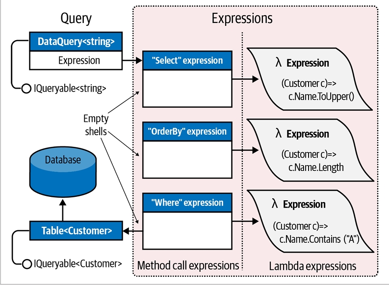 
</div>

### **Execution of Interpreted Queries in LINQ**

Interpreted queries (`IQueryable<T>`) هم مانند local queries (`IEnumerable<T>`) از مدل **deferred execution** پیروی می‌کنند.

---

## **ویژگی‌های کلیدی اجرای Interpreted Queries**

1. **تولید SQL در زمان اجرای Enumeration**

   * SQL statement تا زمانی که query را enumerate نکنید، ساخته نمی‌شود.
   * enumerate کردن همان query دوباره باعث اجرای دوباره SQL روی پایگاه داده می‌شود.

2. **پردازش Expression Tree**

   * هنگامی که یک interpreted query را enumerate می‌کنید، outermost sequence برنامه‌ای را اجرا می‌کند که **تمام expression tree** را به عنوان یک واحد پردازش می‌کند.
   * EF Core این expression tree را به یک SQL statement ترجمه می‌کند و نتایج را برمی‌گرداند.
   * در analogy خط تولید: تنها **یک نوار نقاله** شروع به کار می‌کند و سایر نوارها فقط "shell" هستند که دستورالعمل‌ها را توصیف می‌کنند.

3. **محدودیت در افزودن متدهای سفارشی**

   * ایجاد extension method برای `IQueryable<T>` دشوار است و می‌تواند باعث عدم سازگاری با سایر providers شود.
   * مزیت کلاس `Queryable` این است که مجموعه استانداردی از متدها برای همه remote collections فراهم می‌کند.

4. **محدودیت‌های Provider**

   * برخی LINQ queries ممکن است توسط یک provider خاص (مثل EF Core) ترجمه نشوند.
   * علت: محدودیت‌های پایگاه داده.
   * در این حالت، ممکن است runtime exception دریافت کنید.

---

## **ترکیب Interpreted و Local Queries**

* الگو: **operators محلی در بیرون و interpreted operators در داخل**
* مثال: extension method سفارشی برای جفت‌سازی عناصر (`Pair`)
</div>

```csharp
public static IEnumerable<string> Pair(this IEnumerable<string> source)
{
    string firstHalf = null;
    foreach (string element in source)
    {
        if (firstHalf == null)
            firstHalf = element;
        else
        {
            yield return firstHalf + ", " + element;
            firstHalf = null;
        }
    }
}
```

<div dir="rtl">
ترکیب با EF Core:
</div>

```csharp
using var dbContext = new NutshellContext();

IEnumerable<string> q = dbContext.Customers
    .Select(c => c.Name.ToUpper())  // Interpreted (IQueryable)
    .OrderBy(n => n)                // Interpreted
    .Pair()                          // Local (IEnumerable)
    .Select((n, i) => "Pair " + i + " = " + n);

foreach (string element in q)
    Console.WriteLine(element);

// Output:
// Pair 0 = DICK, HARRY
// Pair 1 = JAY, MARY
```

<div dir="rtl">
> وقتی یک operator فقط برای `IEnumerable<T>` تعریف شده باشد، query به local query تبدیل می‌شود و ادامه پردازش روی client انجام می‌شود.

---

## **AsEnumerable**

* ساده‌ترین query operator برای تبدیل `IQueryable<T>` به `IEnumerable<T>`:
</div>

```csharp
public static IEnumerable<TSource> AsEnumerable<TSource>(this IEnumerable<TSource> source)
{
    return source;
}
```

<div dir="rtl">
* کاربرد:

  * بعد از `AsEnumerable()`، تمام query operators بعدی روی **Enumerable class** اجرا می‌شوند.
  * برخلاف `ToList` یا `ToArray`، اجرای query را **فوری نمی‌کند** و هیچ حافظه اضافی ایجاد نمی‌کند.

مثال با Regular Expression:
</div>

```csharp
Regex wordCounter = new Regex(@"\b(\w|[-'])+\b");

using var dbContext = new NutshellContext();

var query = dbContext.MedicalArticles
    .Where(article => article.Topic == "influenza")
    .AsEnumerable()  // Force subsequent operators to execute locally
    .Where(article => wordCounter.Matches(article.Abstract).Count < 100);
```

<div dir="rtl">
> نکته: اجرای بخشی از query روی client می‌تواند performance را کاهش دهد، زیرا ممکن است تعداد ردیف‌های بیشتری از پایگاه داده دریافت شود.

### EF Core ⚡

در طول این فصل و فصل ۹، ما از **EF Core** برای نشان دادن **interpreted queries** استفاده می‌کنیم.
اکنون بیایید به بررسی ویژگی‌های کلیدی این فناوری بپردازیم.

---

### کلاس‌های Entity در EF Core 🏷️

EF Core به شما اجازه می‌دهد تا از **هر کلاسی** برای نمایش داده‌ها استفاده کنید، به شرطی که برای هر ستون مورد نظر یک **property عمومی** داشته باشد.

به‌عنوان مثال، می‌توانیم کلاس زیر را برای **query** و **update** جدول Customers در پایگاه داده تعریف کنیم:
</div>

```csharp
public class Customer
{
    public int ID { get; set; } 
    public string Name { get; set; }
}
```

<div dir="rtl">
---

### DbContext 📦

پس از تعریف کلاس‌های entity، مرحله بعدی **subclass کردن DbContext** است.
یک نمونه از این کلاس نشان‌دهنده جلسات شما برای کار با پایگاه داده است. معمولاً subclass شما شامل **یک property از نوع DbSet<T>** برای هر entity در مدل شما خواهد بود:
</div>

```csharp
public class NutshellContext : DbContext
{
    public DbSet<Customer> Customers { get; set; }
    ... properties برای جداول دیگر ...
}
```

<div dir="rtl">
یک **شیء DbContext** سه کار انجام می‌دهد:

* 🔹 به‌عنوان **factory** برای تولید اشیاء DbSet<> که می‌توانید روی آن‌ها query بنویسید.
* 🔹 **ردیابی تغییرات** ایجاد شده روی entityها، تا بتوانید آن‌ها را دوباره در پایگاه داده ذخیره کنید (نگاه کنید به “Change Tracking” در صفحه 461).
* 🔹 ارائه **متدهای virtual** که می‌توانید آن‌ها را override کنید تا connection و مدل را پیکربندی کنید.

---

### پیکربندی Connection 🔧

با override کردن متد **OnConfiguring**، می‌توانید **database provider** و **connection string** را مشخص کنید:
</div>

```csharp
public class NutshellContext : DbContext
{
    ...
    protected override void OnConfiguring(DbContextOptionsBuilder optionsBuilder) =>
        optionsBuilder.UseSqlServer(
            @"Server=(local);Database=Nutshell;Trusted_Connection=True");
}
```

<div dir="rtl">
در این مثال، **connection string** به‌صورت **string literal** مشخص شده است.
در برنامه‌های واقعی، معمولاً آن را از یک فایل پیکربندی مانند **appsettings.json** می‌خوانند.

متد **UseSqlServer** یک **extension method** است که در **assembly مربوط به Microsoft.EntityFramework.SqlServer NuGet package** تعریف شده است.
برای سایر پایگاه‌های داده مانند Oracle، MySQL، PostgreSQL و SQLite نیز پکیج‌های مشابه وجود دارند.

---

اگر از **ASP.NET** استفاده می‌کنید، می‌توانید به **dependency injection framework** اجازه دهید که **optionsBuilder** را از قبل پیکربندی کند؛ در اکثر موارد، این کار باعث می‌شود که نیازی به override کردن **OnConfiguring** نداشته باشید.

برای فعال کردن این قابلیت، می‌توانید یک **constructor** برای DbContext به شکل زیر تعریف کنید:
</div>

```csharp
public NutshellContext(DbContextOptions<NutshellContext> options)
    : base(options) { }
```

<div dir="rtl">
اگر بخواهید **OnConfiguring** را override کنید (مثلاً برای فراهم کردن پیکربندی در سناریوهای دیگر)، می‌توانید بررسی کنید که آیا گزینه‌ها از قبل پیکربندی شده‌اند یا خیر:
</div>

```csharp
protected override void OnConfiguring(DbContextOptionsBuilder optionsBuilder)
{
    if (!optionsBuilder.IsConfigured)
    {
        ...
    }
}
```

<div dir="rtl">
در متد **OnConfiguring** می‌توانید گزینه‌های دیگری مانند **lazy loading** را نیز فعال کنید (نگاه کنید به “Lazy loading” در صفحه 464).
### پیکربندی مدل 🏗️

به‌طور پیش‌فرض، **EF Core** بر اساس **convention** عمل می‌کند؛ یعنی **schema پایگاه داده** را از روی نام کلاس‌ها و propertyها حدس می‌زند.

می‌توانید این پیش‌فرض‌ها را با استفاده از **fluent API** و override کردن **OnModelCreating** و فراخوانی extension methodها روی پارامتر **ModelBuilder** تغییر دهید.
به‌عنوان مثال، می‌توانیم نام جدول پایگاه داده برای entity کلاس **Customer** را به‌صورت صریح مشخص کنیم:
</div>

```csharp
protected override void OnModelCreating(ModelBuilder modelBuilder) =>
    modelBuilder.Entity<Customer>()
        .ToTable("Customer");   // نام جدول 'Customer' است
```

<div dir="rtl">
بدون این کد، EF Core این entity را به جدولی با نام **“Customers”** نگاشت می‌کند، نه “Customer”، زیرا ما در **DbContext** خود یک property از نوع **DbSet<Customer>** داریم که نام آن **Customers** است:
</div>

```csharp
public DbSet<Customer> Customers { get; set; }
```

<div dir="rtl">
---

کد زیر تمام entityهای شما را به **نام کلاس entity** نگاشت می‌کند (که معمولاً مفرد است) نه به نام propertyهای **DbSet<T>** (که معمولاً جمع هستند):
</div>

```csharp
protected override void OnModelCreating(ModelBuilder modelBuilder)
{
    foreach (IMutableEntityType entityType in modelBuilder.Model.GetEntityTypes())
    {
        modelBuilder.Entity(entityType.Name)
                    .ToTable(entityType.ClrType.Name);
    }
}
```

<div dir="rtl">
---

### Fluent API برای ستون‌ها 📊

**Fluent API** یک سینتکس پیشرفته‌تر برای پیکربندی ستون‌ها ارائه می‌دهد.
در مثال زیر از دو متد محبوب استفاده می‌کنیم:

* **HasColumnName**: property را به یک ستون با نام متفاوت نگاشت می‌کند.
* **IsRequired**: مشخص می‌کند که ستون **nullable** نیست.
</div>

```csharp
protected override void OnModelCreating(ModelBuilder modelBuilder) =>
    modelBuilder.Entity<Customer>(entity =>
    {
        entity.ToTable("Customer");
        entity.Property(e => e.Name)
              .HasColumnName("Full Name")  // نام ستون 'Full Name' است
              .IsRequired();                // ستون نمی‌تواند null باشد
    });
```

<div dir="rtl">
جدول 8-1 برخی از مهم‌ترین متدهای **fluent API** را فهرست می‌کند.

---

به جای استفاده از **fluent API**، می‌توانید مدل خود را با اعمال **attributeهای خاص** روی کلاس‌ها و propertyها (**data annotations**) پیکربندی کنید.
این روش **انعطاف‌پذیری کمتری** دارد، زیرا پیکربندی باید در زمان کامپایل ثابت باشد، و **قدرت کمتری** دارد، چرا که برخی گزینه‌ها فقط از طریق **fluent API** قابل پیکربندی هستند.

<div align="center">
    
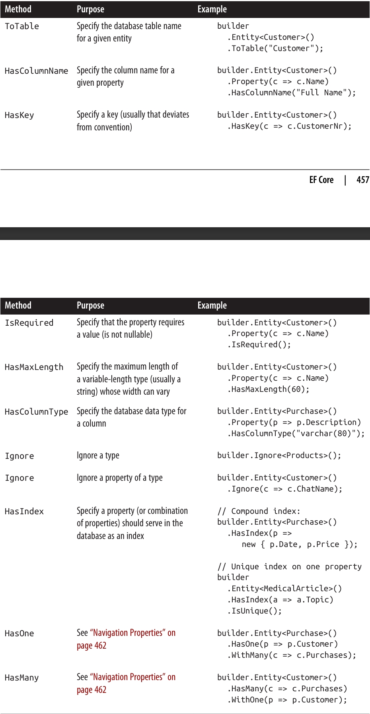 
</div>

### ایجاد پایگاه داده 🏗️🗄️

**EF Core** از رویکرد **code-first** پشتیبانی می‌کند، به این معنا که می‌توانید ابتدا کلاس‌های **entity** خود را تعریف کنید و سپس از **EF Core** بخواهید پایگاه داده را ایجاد کند. ساده‌ترین روش برای این کار فراخوانی متد زیر روی یک نمونه از **DbContext** است:
</div>

```csharp
dbContext.Database.EnsureCreated();
```

<div dir="rtl">
با این حال، روش بهتر استفاده از قابلیت **migrations** در EF Core است. این روش نه تنها پایگاه داده را ایجاد می‌کند، بلکه آن را طوری پیکربندی می‌کند که EF Core بتواند در آینده، هنگام تغییر کلاس‌های entity، **schema** را به‌صورت خودکار به‌روزرسانی کند.

در **Visual Studio**، می‌توانید migrations را از **Package Manager Console** فعال کنید و پایگاه داده را با دستورات زیر ایجاد کنید:
</div>

```powershell
Install-Package Microsoft.EntityFrameworkCore.Tools
Add-Migration InitialCreate
Update-Database
```

<div dir="rtl">
* دستور اول ابزارهای مدیریت EF Core را در Visual Studio نصب می‌کند.
* دستور دوم یک کلاس C# ویژه به نام **code migration** ایجاد می‌کند که شامل دستورالعمل‌های ایجاد پایگاه داده است.
* دستور آخر آن دستورالعمل‌ها را روی connection string مشخص‌شده در فایل پیکربندی پروژه اجرا می‌کند.

---

### استفاده از DbContext 🧩

بعد از تعریف کلاس‌های **Entity** و ایجاد زیرکلاس از **DbContext**، می‌توانید یک نمونه از DbContext بسازید و پایگاه داده را query کنید:
</div>

```csharp
using var dbContext = new NutshellContext();
Console.WriteLine(dbContext.Customers.Count());
// اجرای دستور SQL: "SELECT COUNT(*) FROM [Customer] AS [c]"
```

<div dir="rtl">
همچنین می‌توانید از **DbContext** برای نوشتن داده در پایگاه داده استفاده کنید:
</div>

```csharp
using var dbContext = new NutshellContext();
Customer cust = new Customer()
{
    Name = "Sara Wells"
};
dbContext.Customers.Add(cust);
dbContext.SaveChanges();    // تغییرات را به پایگاه داده می‌نویسد
```

<div dir="rtl">
برای بازیابی رکوردی که تازه اضافه شده:
</div>

```csharp
using var dbContext = new NutshellContext();
Customer cust = dbContext.Customers
    .Single(c => c.Name == "Sara Wells");
```

<div dir="rtl">
و برای به‌روزرسانی نام مشتری و ذخیره تغییرات:
</div>

```csharp
cust.Name = "Dr. Sara Wells";
dbContext.SaveChanges();
```

<div dir="rtl">
> توجه: متد **Single** برای بازیابی یک رکورد با **primary key** مناسب است. بر خلاف **First**، اگر بیش از یک رکورد بازگردانده شود، خطا می‌دهد.

---

### ردیابی اشیاء (Object Tracking) 🔍

یک نمونه **DbContext** تمام entityهایی که ایجاد می‌کند را ردیابی می‌کند تا هر بار که همان رکوردها را درخواست کنید، همان اشیاء را به شما بازگرداند. به عبارت دیگر، در طول عمر یک context، هیچ دو entity جداگانه‌ای برای یک رکورد مشخص (با primary key) ایجاد نمی‌شود. این قابلیت **object tracking** نام دارد.

برای مثال، فرض کنید مشتری‌ای که از نظر حروف الفبا اولین است، کمترین **ID** را نیز دارد. در مثال زیر، `a` و `b` به یک **object** اشاره خواهند کرد:
</div>

```csharp
using var dbContext = new NutshellContext();
Customer a = dbContext.Customers.OrderBy(c => c.Name).First();
Customer b = dbContext.Customers.OrderBy(c => c.ID).First();
```

<div dir="rtl">
### مدیریت منابع و DbContext 🗑️🧩

اگرچه **DbContext** از **IDisposable** پیروی می‌کند، اما معمولاً می‌توانید بدون فراخوانی **Dispose** از نمونه‌ها استفاده کنید. فراخوانی **Dispose** باعث می‌شود که **connection** داخلی context هم بسته شود، اما این معمولاً ضروری نیست زیرا **EF Core** به‌طور خودکار پس از پایان دریافت نتایج از یک query، **connection** را می‌بندد.

فراخوانی زودهنگام **Dispose** می‌تواند مشکل‌ساز باشد، مخصوصاً به دلیل **lazy evaluation**. مثال زیر را در نظر بگیرید:
</div>

```csharp
IQueryable<Customer> GetCustomers(string prefix)
{
    using (var dbContext = new NutshellContext())
        return dbContext.Customers
                        .Where(c => c.Name.StartsWith(prefix));
}

foreach (Customer c in GetCustomers("a"))
    Console.WriteLine(c.Name);
```

<div dir="rtl">
این کد شکست می‌خورد، زیرا query زمانی ارزیابی می‌شود که آن را **enumerate** می‌کنیم—و این بعد از **Dispose** شدن **DbContext** است.

چند نکته درباره عدم فراخوانی **Dispose** وجود دارد:

* این کار متکی به این است که **connection object** تمام منابع unmanaged را هنگام فراخوانی **Close** آزاد کند. هرچند این در **SqlConnection** صادق است، اما ممکن است یک connection شخص ثالث منابع را باز نگه دارد اگر **Close** شود اما **Dispose** فراخوانی نشود.
* اگر به‌صورت دستی **GetEnumerator** روی query فراخوانی کنید و سپس enumerator را **dispose** نکنید یا تمام عناصر را مصرف نکنید، connection باز خواهد ماند. در این سناریوها **Dispose** یک backup است.
* برخی افراد احساس می‌کنند تمیزتر است که contextها و تمام اشیاء پیروی‌کننده از **IDisposable** را **dispose** کنند.

اگر می‌خواهید contextها را صریحاً **dispose** کنید، باید نمونه **DbContext** را به متدهایی مانند **GetCustomers** منتقل کنید تا مشکل فوق پیش نیاید. در محیط‌هایی مانند **ASP.NET Core MVC** که context از طریق **Dependency Injection (DI)** ارائه می‌شود، **DI** مدیریت طول عمر context را بر عهده دارد: ایجاد آن هنگام شروع واحد کاری (مثلاً HTTP request) و **Dispose** هنگام پایان واحد کاری.

---

### تاثیر object tracking در EF Core 🔄

فرض کنید وقتی EF Core دومین query را اجرا می‌کند، ابتدا یک رکورد از پایگاه داده دریافت کرده و **primary key** آن را می‌خواند، سپس در **entity cache** context جستجو می‌کند. اگر match پیدا شود، همان **object** موجود را بدون بروزرسانی مقادیر برمی‌گرداند.

* این رفتار برای جلوگیری از **side effect**های غیرمنتظره ضروری است (ممکن است **Customer** در جای دیگری استفاده شود).
* همچنین مدیریت **concurrency** را تسهیل می‌کند. اگر شما تغییراتی روی **Customer** داده‌اید و هنوز **SaveChanges** را فراخوانی نکرده‌اید، نمی‌خواهید مقادیر شما به‌صورت خودکار بازنویسی شود.

می‌توانید **object tracking** را با فراخوانی **AsNoTracking** روی query یا با تنظیم **ChangeTracker.QueryTrackingBehavior = QueryTrackingBehavior.NoTracking** غیرفعال کنید. این queries بدون tracking برای داده‌های **read-only** مفید است زیرا کارایی را افزایش و مصرف حافظه را کاهش می‌دهد.

برای دریافت اطلاعات تازه از پایگاه داده، باید یا یک context جدید بسازید یا متد **Reload** را فراخوانی کنید:
</div>

```csharp
dbContext.Entry(myCustomer).Reload();
```

<div dir="rtl">
بهترین روش این است که برای هر **unit of work** یک **DbContext** جدید استفاده کنید تا نیاز به **Reload** دستی به حداقل برسد.

---

### ردیابی تغییرات (Change Tracking) 📝

هنگامی که مقدار یک property در یک entity بارگذاری‌شده توسط **DbContext** تغییر کند، EF Core این تغییر را تشخیص داده و هنگام فراخوانی **SaveChanges** پایگاه داده را مطابق تغییرات به‌روز می‌کند.

EF Core برای این کار، **snapshot** از وضعیت entityها ایجاد می‌کند و وضعیت فعلی را با وضعیت اصلی هنگام **SaveChanges** مقایسه می‌کند.

برای مشاهده تغییرات ردیابی‌شده:
</div>

```csharp
foreach (var e in dbContext.ChangeTracker.Entries())
{
    Console.WriteLine($"{e.Entity.GetType().FullName} is {e.State}");
    foreach (var m in e.Members)
        Console.WriteLine(
            $"  {m.Metadata.Name}: '{m.CurrentValue}' modified: {m.IsModified}");
}
```

<div dir="rtl">
هنگام فراخوانی **SaveChanges**، EF Core با استفاده از اطلاعات **ChangeTracker**، دستورات SQL ایجاد می‌کند:

* **Insert** برای اضافه کردن رکورد جدید
* **Update** برای تغییر داده‌ها
* **Delete** برای حذف رکوردهای حذف‌شده از گراف object

هر **TransactionScope** احترام گذاشته می‌شود و در صورت عدم وجود، EF Core تمام دستورات را در یک تراکنش جدید اجرا می‌کند.

برای بهینه‌سازی **change tracking** می‌توانید اینترفیس‌های **INotifyPropertyChanged** و اختیاری **INotifyPropertyChanging** را در entityها پیاده‌سازی کنید. این کار باعث می‌شود EF Core از مقایسه state اولیه و فعلی صرف‌نظر کند و کارایی افزایش یابد. سپس با فراخوانی **HasChangeTrackingStrategy** در **ModelBuilder**، این بهینه‌سازی فعال می‌شود.

---

### Navigation Properties 🌐

**Navigation properties** به شما امکان می‌دهند:

* جداول مرتبط را بدون نیاز به join دستی query کنید
* رکوردهای مرتبط را درج، حذف یا به‌روزرسانی کنید بدون آن‌که کلید خارجی را به‌صورت صریح تغییر دهید

مثال: فرض کنید هر مشتری می‌تواند چند خرید داشته باشد. رابطه **one-to-many** بین **Customer** و **Purchase** را می‌توان به شکل زیر نمایش داد:
</div>

```csharp
public class Customer
{
    public int ID { get; set; }
    public string Name { get; set; }
    public virtual List<Purchase> Purchases { get; set; } = new List<Purchase>();
}

public class Purchase
{
    public int ID { get; set; }
    public DateTime Date { get; set; }
    public string Description { get; set; }
    public decimal Price { get; set; }
    public int? CustomerID { get; set; }  // Foreign key
    public Customer Customer { get; set; } // Parent navigation
}
```

<div dir="rtl">
EF Core با توجه به نام **CustomerID**، آن را به عنوان **foreign key** به جدول **Customer** تشخیص می‌دهد. اگر EF Core نتواند رابطه را استنتاج کند، می‌توانید آن را صریحاً در **OnModelCreating** پیکربندی کنید:
</div>

```csharp
modelBuilder.Entity<Purchase>()
    .HasOne(e => e.Customer)
    .WithMany(e => e.Purchases)
    .HasForeignKey(e => e.CustomerID);
```

<div dir="rtl">
با این navigation properties، می‌توان queries مانند زیر نوشت:
</div>

```csharp
var customersWithPurchases = Customers.Where(c => c.Purchases.Any());
```

<div dir="rtl">
در فصل بعد، نحوه نوشتن این نوع queryها را به تفصیل بررسی خواهیم کرد.
### افزودن و حذف موجودیت‌ها از مجموعه‌های Navigation 🛒❌

وقتی موجودیت‌های جدیدی به یک **collection navigation property** اضافه می‌کنید، **EF Core** به‌صورت خودکار کلیدهای خارجی را هنگام فراخوانی **SaveChanges** پر می‌کند:
</div>

```csharp
Customer cust = dbContext.Customers.Single(c => c.ID == 1);
Purchase p1 = new Purchase { Description="Bike", Price=500 };
Purchase p2 = new Purchase { Description="Tools", Price=100 };
cust.Purchases.Add(p1);
cust.Purchases.Add(p2);
dbContext.SaveChanges();
```

<div dir="rtl">
در این مثال، **EF Core** به‌صورت خودکار مقدار `1` را در ستون **CustomerID** هر خرید جدید می‌نویسد و **ID** تولیدشده توسط پایگاه داده را به **Purchase.ID** اختصاص می‌دهد.

اگر موجودیتی را از یک **collection navigation property** حذف کرده و **SaveChanges** را فراخوانی کنید، EF Core بسته به نوع پیکربندی یا استنتاج رابطه، یکی از کارهای زیر را انجام می‌دهد:

* پاک کردن مقدار **foreign key**
* حذف ردیف مربوطه از پایگاه داده

در این مثال، چون **Purchase.CustomerID** به صورت nullable تعریف شده است (تا خرید بدون مشتری یا تراکنش نقدی را بتوان نمایش داد)، حذف یک خرید از مشتری، مقدار foreign key را پاک می‌کند و رکورد از پایگاه داده حذف نمی‌شود.

---

### بارگذاری Navigation Properties 📦

زمانی که **EF Core** یک entity را populate می‌کند، به‌طور پیش‌فرض navigation properties آن را پر نمی‌کند:
</div>

```csharp
using var dbContext = new NutshellContext();
var cust = dbContext.Customers.First();
Console.WriteLine(cust.Purchases.Count);    // همیشه 0
```

<div dir="rtl">
راه‌حل‌ها:

1. **استفاده از Include:** این روش به EF Core دستور می‌دهد که navigation properties را eager load کند:
</div>

```csharp
var cust = dbContext.Customers
    .Include(c => c.Purchases)
    .Where(c => c.ID == 2)
    .First();
```

<div dir="rtl">
2. **استفاده از Projection:** این تکنیک زمانی مفید است که فقط بخشی از propertyهای entity نیاز باشد، زیرا حجم انتقال داده کاهش می‌یابد:
</div>

```csharp
var custInfo = dbContext.Customers
    .Where(c => c.ID == 2)
    .Select(c => new
    {
        Name = c.Name,
        Purchases = c.Purchases.Select(p => new { p.Description, p.Price })
    })
    .First();
```

<div dir="rtl">
هر دو روش به EF Core اطلاع می‌دهند که چه داده‌ای نیاز دارید تا بتواند آن را در یک query به‌دست آورد.

3. **Explicit Loading:** می‌توانید EF Core را به‌صورت دستی وادار به populate کردن navigation property کنید:
</div>

```csharp
dbContext.Entry(cust).Collection(b => b.Purchases).Load();
// cust.Purchases اکنون پر شده است
```

<div dir="rtl">
این روش یک round trip اضافی به پایگاه داده ایجاد می‌کند.

---

### Lazy Loading 💤

روش دیگر برای بارگذاری navigation properties، **lazy loading** است. با فعال شدن، EF Core navigation properties را به‌صورت demand-load پر می‌کند. برای این کار:

* هر navigation property باید **virtual** باشد
* کلاس entity باید قابلیت ارث‌بری داشته باشد (sealed نباشد)
* context نباید قبل از lazy load **Dispose** شده باشد

فعال کردن lazy loading در متد **OnConfiguring** DbContext به شکل زیر است:
</div>

```csharp
protected override void OnConfiguring(DbContextOptionsBuilder optionsBuilder)
{
    optionsBuilder
        .UseLazyLoadingProxies();
    ...
}
```

<div dir="rtl">
> توجه: باید بسته **Microsoft.EntityFrameworkCore.Proxies** را هم اضافه کنید.

هزینه lazy loading این است که هر بار که به navigation property بارگذاری‌نشده دسترسی پیدا کنید، یک درخواست اضافی به پایگاه داده ارسال می‌شود. اگر تعداد زیادی از این درخواست‌ها وجود داشته باشد، کارایی کاهش می‌یابد.

با فعال بودن lazy loading، نوع runtime کلاس‌ها پروکسی است که از کلاس entity مشتق شده است:
</div>

```csharp
using var dbContext = new NutshellContext();
var cust = dbContext.Customers.First();
Console.WriteLine(cust.GetType());
// خروجی: Castle.Proxies.CustomerProxy
```

<div dir="rtl">
### اجرای به تأخیر افتاده (Deferred Execution) ⏳

کوئری‌های **EF Core** نیز مانند کوئری‌های محلی از مدل **deferred execution** پیروی می‌کنند. این ویژگی به شما اجازه می‌دهد کوئری‌ها را به‌تدریج بسازید. با این حال، یک نکته ویژه در **EF Core** وجود دارد و آن زمانی است که **subquery** داخل یک **Select expression** قرار گیرد.

با کوئری‌های محلی، شما **double-deferred execution** دارید، زیرا از دیدگاه تابعی، در حال انتخاب یک دنباله از کوئری‌ها هستید. بنابراین اگر دنباله بیرونی را شمارش کنید اما دنباله‌های داخلی هرگز شمارش نشوند، subquery اجرا نخواهد شد.

در **EF Core**، subquery همزمان با اجرای کوئری بیرونی اجرا می‌شود تا از ارسال درخواست‌های اضافی جلوگیری شود.

مثال: این کوئری تنها در یک round trip به پایگاه داده اجرا می‌شود:
</div>

```csharp
using var dbContext = new NutshellContext();
var query = from c in dbContext.Customers
            select from p in c.Purchases
                   select new { c.Name, p.Price };

foreach (var customerPurchaseResults in query)
    foreach (var namePrice in customerPurchaseResults)
        Console.WriteLine($"{namePrice.Name} spent {namePrice.Price}");
```

<div dir="rtl">
تمام **navigation properties** که به‌صورت صریح projection شده‌اند، در یک round trip کامل پر می‌شوند:
</div>

```csharp
var query = from c in dbContext.Customers
            select new { c.Name, c.Purchases };

foreach (var row in query)
    foreach (Purchase p in row.Purchases)   // بدون round-trip اضافی
        Console.WriteLine(row.Name + " spent " + p.Price);
```

<div dir="rtl">
اما اگر یک navigation property را بدون eager load یا projection شمارش کنید، قوانین deferred execution اعمال می‌شوند:
</div>

```csharp
foreach (Customer c in dbContext.Customers.ToArray())
    foreach (Purchase p in c.Purchases)    // SQL round-trip اضافی
        Console.WriteLine(c.Name + " spent " + p.Price);
```

<div dir="rtl">
این مدل زمانی مفید است که بخواهید اجرای حلقه داخلی را به‌صورت انتخابی انجام دهید:
</div>

```csharp
foreach (Customer c in dbContext.Customers.ToArray())
    if (myWebService.HasBadCreditHistory(c.ID))
        foreach (Purchase p in c.Purchases)   // SQL round-trip اضافی
            Console.WriteLine(c.Name + " spent " + p.Price);
```

<div dir="rtl">
> توجه: استفاده از **ToArray** ضروری است، زیرا SQL Server به‌صورت پیش‌فرض نمی‌تواند یک کوئری جدید را در حالی که نتایج کوئری فعلی هنوز پردازش می‌شوند، آغاز کند.
> می‌توان با اضافه کردن `;MultipleActiveResultSets=True` به connection string، امکان **MARS** را فعال کرد، اما با احتیاط استفاده کنید، زیرا ممکن است مشکلات طراحی دیتابیس که می‌توانند با eager loading یا projection بهبود یابند، پنهان شوند.

---

### ساخت Expressions برای کوئری‌ها 🏗️

تاکنون، وقتی نیاز به ایجاد کوئری‌های داینامیک داشتیم، این کار را با chaining شرطی **query operators** انجام می‌دادیم. این روش در بسیاری از سناریوها کافی است، اما گاهی نیاز داریم به سطح دقیق‌تر رفته و **lambda expression**هایی که به operatorها داده می‌شوند را داینامیک بسازیم.

فرض کنید کلاس زیر داریم:
</div>

```csharp
public class Product
{
    public int ID { get; set; }
    public string Description { get; set; }
    public bool Discontinued { get; set; }
    public DateTime LastSale { get; set; }
}
```

<div dir="rtl">
---

### Delegates در مقابل Expression Trees 🧩

به یاد داشته باشید:

* کوئری‌های محلی (**Enumerable operators**) از **delegates** استفاده می‌کنند.
* کوئری‌های تفسیرشده (**Queryable operators**) از **expression trees** استفاده می‌کنند.

می‌توان این را با مقایسه signature متد **Where** در Enumerable و Queryable دید:
</div>

```csharp
public static IEnumerable<TSource> Where<TSource>(this IEnumerable<TSource> source, Func<TSource,bool> predicate)
public static IQueryable<TSource> Where<TSource>(this IQueryable<TSource> source, Expression<Func<TSource,bool>> predicate)
```

<div dir="rtl">
وقتی یک lambda expression درون یک کوئری قرار می‌گیرد، ظاهر آن شبیه هم است، چه به operatorهای Enumerable متصل شود و چه Queryable:
</div>

```csharp
IEnumerable<Product> q1 = localProducts.Where(p => !p.Discontinued);
IQueryable<Product>  q2 = sqlProducts.Where(p => !p.Discontinued);
```

<div dir="rtl">
اما اگر lambda را به یک متغیر میانی اختصاص دهید، باید مشخص کنید که **delegate** می‌خواهید یا **expression tree**. مثال:
</div>

```csharp
Func<Product, bool> predicate1 = p => !p.Discontinued;
IEnumerable<Product> q1 = localProducts.Where(predicate1);

Expression<Func<Product, bool>> predicate2 = p => !p.Discontinued;
IQueryable<Product> q2 = sqlProducts.Where(predicate2);
```

<div dir="rtl">
> توجه: `predicate1` و `predicate2` قابل جایگزینی نیستند.

### کامپایل کردن Expression Treeها ⚙️

می‌توانید یک **expression tree** را با فراخوانی متد **Compile** به **delegate** تبدیل کنید. این کار به‌ویژه زمانی ارزشمند است که بخواهید متدهایی بنویسید که **expressions قابل استفاده مجدد** برمی‌گردانند.

برای مثال، فرض کنید یک متد استاتیک به کلاس **Product** اضافه کنیم که یک predicate برمی‌گرداند و بررسی می‌کند که محصول **discontinued** نباشد و در ۳۰ روز گذشته فروخته شده باشد:
</div>

```csharp
public class Product
{
    public static Expression<Func<Product, bool>> IsSelling()
    {
        return p => !p.Discontinued && p.LastSale > DateTime.Now.AddDays(-30);
    }
}
```

<div dir="rtl">
این متد می‌تواند هم در کوئری‌های **interpreted** و هم **local** استفاده شود:
</div>

```csharp
void Test()
{
    var dbContext = new NutshellContext();
    Product[] localProducts = dbContext.Products.ToArray();
    
    IQueryable<Product> sqlQuery = dbContext.Products.Where(Product.IsSelling());
    IEnumerable<Product> localQuery = localProducts.Where(Product.IsSelling().Compile());
}
```

<div dir="rtl">
---

### AsQueryable 🧵

در .NET API مستقیمی برای تبدیل **delegate** به **expression tree** وجود ندارد. این ویژگی، **expression tree**ها را انعطاف‌پذیرتر می‌کند.

عملگر **AsQueryable** اجازه می‌دهد کل یک کوئری را طوری بنویسید که هم روی دنباله‌های محلی و هم روی دنباله‌های ریموت اجرا شود:
</div>

```csharp
IQueryable<Product> FilterSortProducts(IQueryable<Product> input)
{
    return from p in input
           where ...
           orderby ...
           select p;
}

void Test()
{
    var dbContext = new NutshellContext();
    Product[] localProducts = dbContext.Products.ToArray();

    var sqlQuery   = FilterSortProducts(dbContext.Products);
    var localQuery = FilterSortProducts(localProducts.AsQueryable());
}
```

<div dir="rtl">
> **AsQueryable** دنباله محلی را به یک `IQueryable<T>` تبدیل می‌کند تا query operators بعدی به **expression tree**ها متصل شوند. وقتی بعداً روی نتیجه شمارش انجام شود، **expression tree**ها به‌صورت ضمنی کامپایل می‌شوند (با هزینه کوچک عملکردی)، و دنباله محلی مثل حالت عادی شمارش می‌شود.

---

### Expression Trees 🌳

قبلاً گفتیم که تبدیل ضمنی یک lambda expression به `Expression<TDelegate>` باعث می‌شود کامپایلر **C#** کدی تولید کند که یک **expression tree** می‌سازد.

با کمی تلاش برنامه‌نویسی، می‌توانید این کار را **دینامیک و در زمان اجرا** انجام دهید، یعنی یک **expression tree** را از صفر بسازید. نتیجه را می‌توان به `Expression<TDelegate>` تبدیل کرد و در کوئری‌های **EF Core** استفاده کرد یا با فراخوانی **Compile** به یک **delegate** معمولی تبدیل نمود.

---

### Expression DOM 🏗️

یک **expression tree** در واقع یک **miniature code DOM** است. هر نود در این درخت با یک نوع در namespace `System.Linq.Expressions` نشان داده می‌شود. شکل ۸-۱۰ انواع این نودها را نشان می‌دهد.
<div align="center">
    
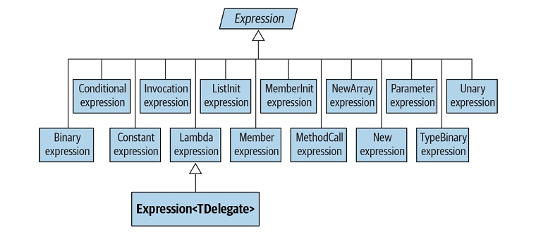 
</div>

کلاس پایه برای تمام نودها، کلاس **Expression** غیرجنریک است.

کلاس **generic Expression<TDelegate>** در واقع به معنای "**typed lambda expression**" است و اگر مسئله پیچیدگی زیر نبود، می‌توانست نامش **LambdaExpression<TDelegate>** باشد:
</div>

```csharp
LambdaExpression<Func<Customer,bool>> f = ...
```

<div dir="rtl">
کلاس پایه **Expression<T>** همان کلاس غیرجنریک **LambdaExpression** است. **LambdaExpression** نوع‌بندی یکنواخت برای **lambda expression tree**ها را فراهم می‌کند؛ به طوری که هر **Expression<T>** قابل تبدیل به **LambdaExpression** است.

ویژگی متمایز **LambdaExpression** از **Expression**های معمولی این است که **lambda expression**ها دارای پارامتر هستند.

برای ساخت یک **expression tree**، نباید مستقیماً نودها را instantiate کنید؛ بلکه باید از متدهای استاتیک ارائه‌شده در کلاس **Expression** استفاده کنید، مانند: `Add`, `And`, `Call`, `Constant`, `LessThan` و غیره.

شکل ۸-۱۱ درخت **expression** ایجادشده توسط انتساب زیر را نشان می‌دهد:
</div>

```csharp
Expression<Func<string, bool>> f = s => s.Length < 5;
```

<div dir="rtl">
<div align="center">
    
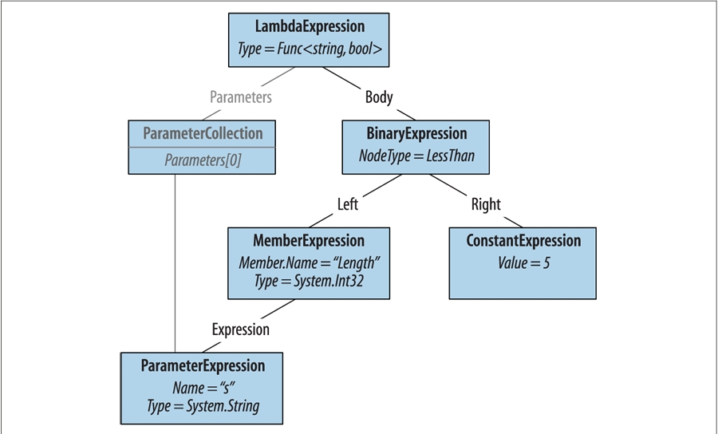 
</div>
می‌توانیم این موضوع را به صورت زیر نشان دهیم:
</div>

```csharp
Console.WriteLine(f.Body.NodeType);                     // LessThan
Console.WriteLine(((BinaryExpression) f.Body).Right);   // 5
```

<div dir="rtl">
حال بیایید این **expression** را از صفر بسازیم. اصل این است که از پایین درخت شروع کرده و به سمت بالا پیش برویم. پایین‌ترین عنصر درخت ما یک **ParameterExpression** است، یعنی پارامتر **lambda expression** به نام `"s"` از نوع `string`:
</div>

```csharp
ParameterExpression p = Expression.Parameter(typeof(string), "s");
```

<div dir="rtl">
گام بعدی ساخت **MemberExpression** و **ConstantExpression** است. در مورد اول، باید به خاصیت `Length` پارامتر `"s"` دسترسی پیدا کنیم:
</div>

```csharp
MemberExpression stringLength = Expression.Property(p, "Length");
ConstantExpression five = Expression.Constant(5);
```

<div dir="rtl">
گام بعدی مقایسه **LessThan** است:
</div>

```csharp
BinaryExpression comparison = Expression.LessThan(stringLength, five);
```

<div dir="rtl">
آخرین گام، ساخت **lambda expression** است که **expression Body** را به مجموعه‌ای از پارامترها متصل می‌کند:
</div>

```csharp
Expression<Func<string, bool>> lambda
    = Expression.Lambda<Func<string, bool>>(comparison, p);
```

<div dir="rtl">
راهی ساده برای تست **lambda** این است که آن را به یک **delegate** کامپایل کنیم:
</div>

```csharp
Func<string, bool> runnable = lambda.Compile();
Console.WriteLine(runnable("kangaroo"));   // False
Console.WriteLine(runnable("dog"));        // True
```

<div dir="rtl">
ساده‌ترین روش برای تعیین اینکه کدام نوع **expression** را باید استفاده کرد، این است که یک **lambda expression** موجود را در **Visual Studio debugger** بررسی کنید.

ما ادامه این بحث را آنلاین ارائه داده‌ایم در: [http://www.albahari.com/expressions](http://www.albahari.com/expressions) ✅
</div>

