# فصل نهم:  LINQ Operators

این فصل به بررسی تک‌تک **عملگرهای LINQ** می‌پردازد. علاوه بر اینکه به‌عنوان یک مرجع عمل می‌کند، دو بخش **«Projecting»** (در صفحه ۴۷۳) و **«Joining»** (در صفحه ۴۷۳) مفاهیم مهمی را پوشش می‌دهند:

* 📌 **Projecting object hierarchies** (ایجاد و نمایش سلسله‌مراتب اشیاء)
* 📌 **Joining** با استفاده از `Select`، `SelectMany`، `Join` و `GroupJoin`
* 📌 **Query expressions with multiple range variables** (عبارت‌های کوئری با چند متغیر دامنه‌ای)

---

### 🔤 مثال پایه:

تمامی مثال‌های این فصل فرض می‌کنند که یک آرایه از نام‌ها تعریف شده است:

```csharp
string[] names = { "Tom", "Dick", "Harry", "Mary", "Jay" };
```

مثال‌هایی که مربوط به پایگاه‌داده هستند فرض می‌کنند شیء زیر ساخته شده است:

```csharp
var dbContext = new NutshellContext();
```

که کلاس `NutshellContext` به شکل زیر تعریف شده است:

```csharp
public class NutshellContext : DbContext
{
    public DbSet<Customer> Customers { get; set; }
    public DbSet<Purchase> Purchases { get; set; }

    protected override void OnModelCreating(ModelBuilder modelBuilder)
    {
        modelBuilder.Entity<Customer>(entity =>
        {
            entity.ToTable("Customer");
            entity.Property(e => e.Name).IsRequired();  // ستون غیرقابل تهی
        });

        modelBuilder.Entity<Purchase>(entity =>
        {
            entity.ToTable("Purchase");
            entity.Property(e => e.Date).IsRequired();
            entity.Property(e => e.Description).IsRequired();
        });
    }
}
```

---

### 🧑‍💻 تعریف کلاس‌ها:

```csharp
public class Customer
{
    public int ID { get; set; }
    public string Name { get; set; }
    public virtual List<Purchase> Purchases { get; set; }
        = new List<Purchase>();
}

public class Purchase
{        
    public int ID { get; set; }
    public int? CustomerID { get; set; }
    public DateTime Date { get; set; }
    public string Description { get; set; }
    public decimal Price { get; set; }
    public virtual Customer Customer { get; set; }
}
```

---

### 🛠 ابزار LINQPad

تمامی مثال‌های این فصل در **LINQPad** از پیش بارگذاری شده‌اند، همراه با یک پایگاه‌داده نمونه که **Schema** مشابهی دارد.
📥 می‌توانید LINQPad را از [www.linqpad.net](http://www.linqpad.net) دانلود کنید.

---

### 🗄 تعریف جدول‌های SQL Server متناظر:

```sql
CREATE TABLE Customer (
    ID int NOT NULL IDENTITY PRIMARY KEY,
    Name nvarchar(30) NOT NULL
)

CREATE TABLE Purchase (
    ID int NOT NULL IDENTITY PRIMARY KEY,
    CustomerID int NOT NULL REFERENCES Customer(ID),
    Date datetime NOT NULL,
    Description nvarchar(30) NOT NULL,
    Price decimal NOT NULL
)
```

---

## 🔎 مرور کلی (Overview)

در این بخش، یک مرور کلی بر **عملگرهای استاندارد کوئری** ارائه می‌دهیم. این عملگرها در سه دسته تقسیم می‌شوند:

1. 📌 **Sequence in, sequence out (sequence → sequence)**
   ➝ یعنی ورودی یک دنباله (sequence) است و خروجی هم یک دنباله.
2. 📌 **Sequence in, single element or scalar value out**
   ➝ یعنی ورودی یک دنباله است اما خروجی فقط یک عنصر یا یک مقدار منفرد.
3. 📌 **Nothing in, sequence out (generation methods)**
   ➝ یعنی هیچ ورودی وجود ندارد اما خروجی یک دنباله تولید می‌شود.

---

ما ابتدا هر سه دسته را معرفی کرده و عملگرهای مربوط به هرکدام را بررسی می‌کنیم. سپس به‌طور جداگانه سراغ تک‌تک عملگرها خواهیم رفت.

---

## 🔄 Sequence → Sequence

بیشتر عملگرهای LINQ در این دسته قرار می‌گیرند. آن‌ها یک یا چند دنباله را به‌عنوان ورودی می‌گیرند و در خروجی یک دنباله تولید می‌کنند.

📊 **شکل ۹-۱** عملگرهایی را نشان می‌دهد که ساختار دنباله‌ها را تغییر می‌دهند.

<div align="center">
    
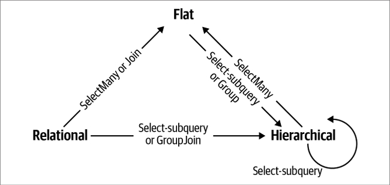 
</div>

### 📖 عملگرهای LINQ – دسته‌بندی‌ها

در این بخش، عملگرهای LINQ را بر اساس نوع ورودی و خروجی مرور می‌کنیم. هر دسته با مثال‌ها و توضیح کوتاه معرفی می‌شود.

---

## 🔍 Filtering (فیلتر کردن)

**ورودی:** `IEnumerable<TSource>`
**خروجی:** `IEnumerable<TSource>`

🔹 وظیفه: برگرداندن یک زیرمجموعه از عناصر اصلی.

📌 عملگرها:
`Where`, `Take`, `TakeLast`, `TakeWhile`, `Skip`, `SkipLast`, `SkipWhile`,
`Distinct`, `DistinctBy`

---

## 🎨 Projecting (تبدیل/نمایش)

**ورودی:** `IEnumerable<TSource>`
**خروجی:** `IEnumerable<TResult>`

🔹 وظیفه: تغییر شکل هر عنصر با استفاده از یک **lambda function**.

* `SelectMany` دنباله‌های تو در تو (nested sequences) را **مسطح‌سازی (flatten)** می‌کند.
* `Select` و `SelectMany` می‌توانند انواع مختلف **Join** (مانند inner join, left outer join, cross join, non-equi join) را با **EF Core** انجام دهند.

📌 عملگرها:
`Select`, `SelectMany`

---

## 🔗 Joining (اتصال/ترکیب)

**ورودی:**
`IEnumerable<TOuter>, IEnumerable<TInner>`
**خروجی:**
`IEnumerable<TResult>`

🔹 وظیفه: ترکیب عناصر یک دنباله با دنباله‌ای دیگر.

* `Join` و `GroupJoin` برای کارایی بهتر در کوئری‌های محلی طراحی شده‌اند و از **inner join** و **left outer join** پشتیبانی می‌کنند.
* `Zip` دو دنباله را هم‌زمان پیمایش کرده و روی هر جفت عنصر یک تابع اعمال می‌کند.

📌 عملگرها:
`Join`, `GroupJoin`, `Zip`

---

## 📑 Ordering (مرتب‌سازی)

**ورودی:** `IEnumerable<TSource>`
**خروجی:** `IOrderedEnumerable<TSource>`

🔹 وظیفه: بازگرداندن یک دنباله با ترتیب جدید.

📌 عملگرها:
`OrderBy`, `OrderByDescending`, `ThenBy`, `ThenByDescending`, `Reverse`

---

## 🗂 Grouping (گروه‌بندی)

**ورودی:** `IEnumerable<TSource>`
**خروجی:**

* `IEnumerable<IGrouping<TKey,TElement>>`
* یا `IEnumerable<TElement[]>`

🔹 وظیفه: تقسیم یک دنباله به زیر‌دنباله‌ها.

📌 عملگرها:
`GroupBy`, `Chunk`

---

## 🔀 Set Operators (عملگرهای مجموعه‌ای)

**ورودی:**
`IEnumerable<TSource>, IEnumerable<TSource>`
**خروجی:**
`IEnumerable<TSource>`

🔹 وظیفه: گرفتن دو دنباله هم‌نوع و برگرداندن اشتراک، اجتماع یا تفاوت آن‌ها.

📌 عملگرها:
`Concat`, `Union`, `UnionBy`, `Intersect`, `IntersectBy`, `Except`, `ExceptBy`

---

## 🔄 Conversion Methods (تبدیل)

### 🛠 Import

**ورودی:** `IEnumerable`
**خروجی:** `IEnumerable<TResult>`

📌 عملگرها:
`OfType`, `Cast`

### 📤 Export

**ورودی:** `IEnumerable<TSource>`
**خروجی:** یک آرایه، لیست، دیکشنری، Lookup یا دنباله

📌 عملگرها:
`ToArray`, `ToList`, `ToDictionary`, `ToLookup`, `AsEnumerable`, `AsQueryable`

---

## 🎯 Sequence → Element or Value

### 🔹 Element Operators (انتخاب عنصر)

**ورودی:** `IEnumerable<TSource>`
**خروجی:** `TSource`

📌 عملگرها:
`First`, `FirstOrDefault`, `Last`, `LastOrDefault`,
`Single`, `SingleOrDefault`, `ElementAt`, `ElementAtOrDefault`,
`MinBy`, `MaxBy`, `DefaultIfEmpty`

---

### 🔹 Aggregation Methods (تجمیع)

**ورودی:** `IEnumerable<TSource>`
**خروجی:** یک مقدار منفرد (scalar)

📌 وظیفه: انجام محاسبه روی یک دنباله و بازگرداندن یک مقدار عددی یا مشابه آن.

📌 عملگرها:
`Aggregate`, `Average`, `Count`, `LongCount`, `Sum`, `Max`, `Min`

---

### 🔹 Quantifiers (کوانتیفایرها)

**ورودی:** `IEnumerable<TSource>`
**خروجی:** `bool`

📌 وظیفه: برگرداندن نتیجه **true/false** به‌عنوان یک تجمیع.

📌 عملگرها:
`All`, `Any`, `Contains`, `SequenceEqual`

---

## 🌀 Void → Sequence

### 🔹 Generation Methods (تولید)

**ورودی:** `void`
**خروجی:** `IEnumerable<TResult>`

📌 وظیفه: ساخت یک دنباله ساده از صفر.

📌 عملگرها:
`Empty`, `Range`, `Repeat`

<div align="center">
    
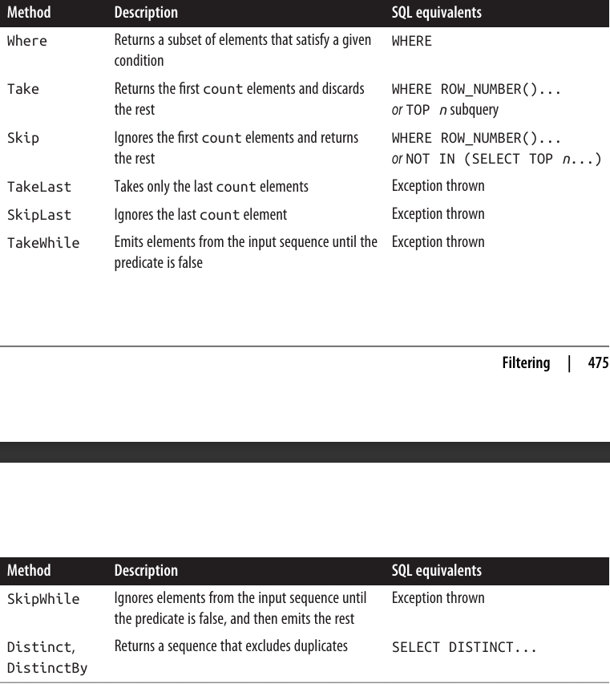 
</div>

### 📖 نکته درباره ستون «SQL equivalents»

در جدول‌های مرجع این فصل، ستون **«SQL equivalents»** لزوماً همان چیزی نیست که یک پیاده‌سازی `IQueryable` مثل **EF Core** تولید می‌کند.
بلکه این ستون نشان می‌دهد اگر خودتان می‌خواستید معادل آن کوئری را به زبان **SQL** بنویسید، معمولاً از چه چیزی استفاده می‌کردید.

* اگر معادل ساده‌ای برای آن وجود نداشته باشد، ستون خالی رها می‌شود.
* اگر هیچ معادلی در SQL وجود نداشته باشد، عبارت **«Exception thrown»** درج می‌شود.

---

### 🧑‍💻 پیاده‌سازی Enumerable

وقتی کد پیاده‌سازی برای `Enumerable` نشان داده می‌شود، بررسی موارد زیر در آن حذف شده‌اند:

* بررسی آرگومان‌های **null**
* بررسی **indexing predicates**

---

### 🔍 درباره متدهای Filtering

در هر یک از متدهای **Filtering**، همیشه خروجی شامل همان تعداد یا **کمتر** از عناصری است که در ورودی داشتید.
⚠️ هیچ‌وقت نمی‌توانید عناصر بیشتری از آنچه وارد کرده‌اید به دست بیاورید!
علاوه بر این، عناصری که در خروجی دریافت می‌کنید **تبدیل یا تغییر شکل داده نمی‌شوند**؛ آن‌ها دقیقاً همان عناصری هستند که در ورودی وجود داشتند.

---

## 📝 Where

<div align="center">
    
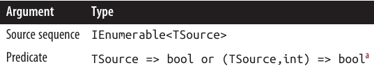 
</div>

### 📖 Where در LINQ

---

### ⚠️ محدودیت‌ها

* ❌ استفاده از `Where` در **LINQ to SQL** و **Entity Framework (EF Core)** دارای محدودیت‌هایی است (برخی سناریوها پشتیبانی نمی‌شوند).

---

### 📝 سینتکس کوئری

```csharp
where bool-expression
```

---

### 🔧 پیاده‌سازی Enumerable.Where

نسخه داخلی `Enumerable.Where` (بدون بررسی null) معادل کدی شبیه زیر است:

```csharp
public static IEnumerable<TSource> Where<TSource>(
    this IEnumerable<TSource> source,
    Func<TSource, bool> predicate)
{
    foreach (TSource element in source)
        if (predicate(element))
            yield return element;
}
```

---

### 📌 توضیح

`Where` عناصری از دنباله ورودی را برمی‌گرداند که شرط داده‌شده (**predicate**) را برآورده می‌کنند.

---

### ✨ مثال ساده

```csharp
string[] names = { "Tom", "Dick", "Harry", "Mary", "Jay" };

IEnumerable<string> query = names.Where(name => name.EndsWith("y"));

// خروجی:
// Harry
// Mary
// Jay
```

🔹 معادل در **Query Syntax**:

```csharp
IEnumerable<string> query =
    from n in names
    where n.EndsWith("y")
    select n;
```

---

### 🌀 چند شرط Where در یک کوئری

یک عبارت `where` می‌تواند چند بار در کوئری ظاهر شود و با `let`, `orderby`, یا `join` ترکیب شود:

```csharp
from n in names
where n.Length > 3
let u = n.ToUpper()
where u.EndsWith("Y")
select u;

// خروجی:
// HARRY
// MARY
```

🔸 قوانین **scoping** استاندارد #C اعمال می‌شوند. یعنی نمی‌توانید قبل از تعریف یک متغیر (با `range variable` یا `let`) به آن ارجاع دهید.

---

### 🔢 Indexed Filtering (فیلترگذاری بر اساس ایندکس)

`Where` می‌تواند به‌صورت اختیاری آرگومان دوم از نوع `int` دریافت کند (نمایانگر **موقعیت عنصر** در دنباله). این ویژگی اجازه می‌دهد تصمیم‌گیری براساس موقعیت انجام شود.

```csharp
IEnumerable<string> query = names.Where((n, i) => i % 2 == 0);

// خروجی:
// Tom
// Harry
// Jay
```

⚠️ در **EF Core** استفاده از این قابلیت باعث **Exception** می‌شود.

---

### 🔍 مقایسه با LIKE در EF Core

متدهای زیر در رشته‌ها به **SQL LIKE** ترجمه می‌شوند:

* `Contains`
* `StartsWith`
* `EndsWith`

مثال:

```csharp
c.Name.Contains("abc")
```

به SQL معادل زیر تبدیل می‌شود:

```sql
customer.Name LIKE '%abc%'
```

> (در واقع نسخه **پارامتری‌شده** ساخته می‌شود، نه رشته مستقیم.)

🔹 برای مقایسه با **ستون دیگر** باید از متد `EF.Functions.Like` استفاده کنید:

```csharp
where EF.Functions.Like(c.Description, "%" + c.Name + "%")
```

این متد امکان مقایسه‌های پیچیده‌تر را هم می‌دهد، مثل:

```sql
LIKE 'abc%def%'
```

---

### 🔠 مقایسه رشته‌ای با < و > در EF Core

برای مقایسه ترتیبی رشته‌ها از متد `string.CompareTo` استفاده کنید:

```csharp
dbContext.Purchases
    .Where(p => p.Description.CompareTo("C") < 0);
```

📌 این کد به عملگرهای `<` و `>` در SQL نگاشت می‌شود.

---

### 🗂 استفاده از IN در EF Core

در EF Core می‌توانید `Contains` را روی یک مجموعه محلی استفاده کنید:

```csharp
string[] chosenOnes = { "Tom", "Jay" };

from c in dbContext.Customers
where chosenOnes.Contains(c.Name)
select c;
```

معادل SQL:

```sql
WHERE customer.Name IN ("Tom", "Jay")
```

⚠️ اگر مجموعه محلی آرایه‌ای از **entity** یا نوع غیر scalar باشد، EF Core ممکن است به‌جای آن **EXISTS** تولید کند.

---

### ⏩ عملگرهای بعدی

* `Take`
* `TakeLast`
* `Skip`
* `SkipLast`

<div align="center">
    
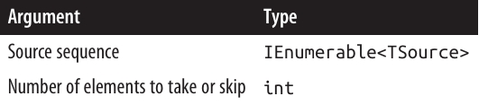 
</div>

### 📖 Take و Skip در LINQ

---

### 📝 توضیح کلی

* 🔹 متد `Take` اولین **n عنصر** از دنباله رو برمی‌گردونه و بقیه رو نادیده می‌گیره.
* 🔹 متد `Skip` اولین **n عنصر** رو حذف می‌کنه و بقیه عناصر رو برمی‌گردونه.

این دو متد معمولاً **با هم** استفاده می‌شن، مخصوصاً وقتی می‌خوایم صفحه‌بندی (Paging) در یک اپلیکیشن وب رو پیاده‌سازی کنیم.

---

### 🌐 مثال کاربردی (Paging در EF Core)

فرض کن کاربر توی دیتابیس کتاب‌ها دنبال عبارت `"mercury"` می‌گرده و **۱۰۰ نتیجه** پیدا می‌شه.

📌 برای گرفتن **۲۰ نتیجه اول**:

```csharp
IQueryable<Book> query = dbContext.Books
    .Where(b => b.Title.Contains("mercury"))
    .OrderBy(b => b.Title)
    .Take(20);
```

📌 برای گرفتن **کتاب‌های شماره ۲۱ تا ۴۰**:

```csharp
IQueryable<Book> query = dbContext.Books
    .Where(b => b.Title.Contains("mercury"))
    .OrderBy(b => b.Title)
    .Skip(20)
    .Take(20);
```

---

### ⚙️ نحوه ترجمه در SQL

در EF Core:

* در **SQL Server 2005** به تابع `ROW_NUMBER` ترجمه می‌شه.
* در نسخه‌های قدیمی‌تر SQL Server به **زیرکوئری TOP n** نگاشت می‌شه.

---

### 🔄 متدهای TakeLast و SkipLast

* `TakeLast(n)` → آخرین **n عنصر** رو برمی‌گردونه.
* `SkipLast(n)` → آخرین **n عنصر** رو حذف می‌کنه.

---

### 🚀 قابلیت جدید از .NET 6

از نسخه **.NET 6**، متد `Take` یک نسخه overload جدید داره که متغیر `Range` رو قبول می‌کنه. این نسخه می‌تونه جایگزین تمام چهار متد بشه.

📌 مثال‌ها:

```csharp
Take(5..)
// معادل Skip(5)

Take(..^5)
// معادل SkipLast(5)
```

یعنی می‌تونی خیلی تمیزتر و کوتاه‌تر کد بزنی ✨

---

### ⏩ عملگرهای بعدی

* `TakeWhile`
* `SkipWhile`

<div align="center">
    
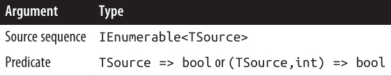 
</div>

### 🔹 TakeWhile و SkipWhile

---

### ⚙️ TakeWhile

`TakeWhile` عناصر دنباله ورودی را **به ترتیب پیمایش** می‌کند و هر عنصر را **تا زمانی که شرط داده‌شده true باشد** برمی‌گرداند.
به محض اینکه شرط false شود، بقیه عناصر نادیده گرفته می‌شوند.

```csharp
int[] numbers = { 3, 5, 2, 234, 4, 1 };
var takeWhileSmall = numbers.TakeWhile(n => n < 100); // خروجی: { 3, 5, 2 }
```

---

### ⚙️ SkipWhile

`SkipWhile` هم دنباله ورودی را پیمایش می‌کند، ولی **عناصر را تا زمانی که شرط true باشد نادیده می‌گیرد**.
بعد از اولین عنصری که شرط false شد، بقیه عناصر **برگردانده می‌شوند**.

```csharp
int[] numbers = { 3, 5, 2, 234, 4, 1 };
var skipWhileSmall = numbers.SkipWhile(n => n < 100); // خروجی: { 234, 4, 1 }
```

⚠️ توجه:
`TakeWhile` و `SkipWhile` هیچ معادل SQL ندارند و در کوئری‌های **EF Core** استفاده از آن‌ها باعث **Exception** می‌شود.

---

### 🔹 Distinct و DistinctBy

---

### ✅ Distinct

`Distinct` دنباله ورودی را بدون **تکراری‌ها** برمی‌گرداند.
می‌توانید **custom equality comparer** هم به آن بدهید.

```csharp
char[] distinctLetters = "HelloWorld".Distinct().ToArray();
string s = new string(distinctLetters); // خروجی: "HeloWrd"
```

> می‌توانیم مستقیماً متدهای LINQ را روی `string` صدا بزنیم، چون `string` پیاده‌سازی‌کننده `IEnumerable<char>` است.

---

### ✅ DistinctBy

* معرفی شده در **.NET 6**
* امکان مشخص کردن یک **key selector** قبل از مقایسه تساوی را فراهم می‌کند.

مثال:

```csharp
new[] { 1.0, 1.1, 2.0, 2.1, 3.0, 3.1 }
    .DistinctBy(n => Math.Round(n, 0)); // خروجی: { 1, 2, 3 }
```

<div align="center">
    
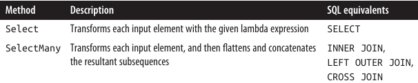 
</div>

### 🎨 Select و SelectMany در LINQ

---

### ⚙️ توضیح کلی

وقتی **روی پایگاه داده کوئری می‌زنیم**، `Select` و `SelectMany` **انعطاف‌پذیرترین ابزارها برای انجام join** هستند.
اما برای **کوئری‌های محلی (Local queries)**، `Join` و `GroupJoin` **کارآمدترین و سریع‌ترین ابزارها برای join** محسوب می‌شوند.

<div align="center">
    
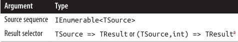 
</div>

### Select

<div align="center">
    
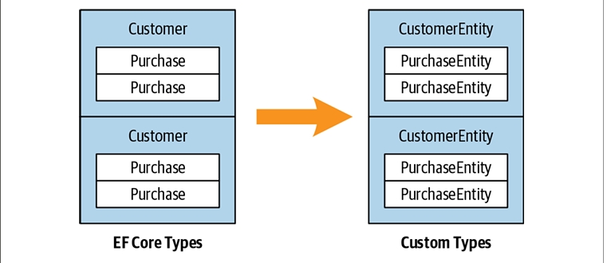 
</div>


### ⚠️ محدودیت EF Core

* ❌ استفاده از `Select` به عنوان **subquery پیچیده یا indexed projection** در EF Core محدودیت دارد و برخی سناریوها ممکن است پشتیبانی نشود.

---

### 📝 سینتکس کوئری

```csharp
select projection-expression
```

---

### 🔧 پیاده‌سازی Enumerable

نسخه داخلی `Enumerable.Select` به شکل زیر است:

```csharp
public static IEnumerable<TResult> Select<TSource,TResult>(
    this IEnumerable<TSource> source,
    Func<TSource,TResult> selector)
{
    foreach (TSource element in source)
        yield return selector(element);
}
```

---

### 🔹 توضیح کلی

* با `Select` همیشه **تعداد عناصر خروجی برابر با تعداد عناصر ورودی است**.
* هر عنصر می‌تواند با **lambda function** به هر شکل دلخواه تبدیل شود.

---

### 🔹 مثال پایه‌ای: گرفتن نام فونت‌ها

```csharp
IEnumerable<string> query = from f in FontFamily.Families
                            select f.Name;

foreach (string name in query) 
    Console.WriteLine(name);
```

🔹 معادل **Lambda Syntax**:

```csharp
IEnumerable<string> query = FontFamily.Families.Select(f => f.Name);
```

---

### 🔹 پروژه کردن به انواع ناشناس (Anonymous Types)

```csharp
var query = from f in FontFamily.Families
            select new { f.Name, LineSpacing = f.GetLineSpacing(FontStyle.Bold) };
```

* گاهی اوقات projection بدون هیچ تغییر خاصی انجام می‌شود، فقط برای اینکه کوئری با `select` یا `group` پایان یابد.
  مثال: انتخاب فونت‌هایی که **strikeout** را پشتیبانی می‌کنند:

```csharp
IEnumerable<FontFamily> query =
    from f in FontFamily.Families
    where f.IsStyleAvailable(FontStyle.Strikeout)
    select f;

foreach (FontFamily ff in query)
    Console.WriteLine(ff.Name);
```

> در این موارد، **کامپایلر هنگام تبدیل به Fluent Syntax**، projection را حذف می‌کند.

---

### 🔹 Indexed Projection

* `selector` می‌تواند آرگومان اختیاری دوم از نوع **int** بگیرد که نمایانگر **موقعیت عنصر** در دنباله است.
* ⚠️ این قابلیت فقط در **کوئری‌های محلی** کار می‌کند.

```csharp
string[] names = { "Tom", "Dick", "Harry", "Mary", "Jay" };
IEnumerable<string> query = names.Select((s, i) => i + "=" + s);
// خروجی: { "0=Tom", "1=Dick", "2=Harry", "3=Mary", "4=Jay" }
```

---

### 🔹 Subqueries و Object Hierarchies

* می‌توان یک **subquery** را در `Select` جای داد تا **ساختار شیء (Object Hierarchy)** بسازیم.
* مثال: دریافت هر دایرکتوری در مسیر `Path.GetTempPath()` همراه با لیست فایل‌های آن:

```csharp
string tempPath = Path.GetTempPath();
DirectoryInfo[] dirs = new DirectoryInfo(tempPath).GetDirectories();

var query = from d in dirs
            where (d.Attributes & FileAttributes.System) == 0
            select new
            {
                DirectoryName = d.FullName,
                Created = d.CreationTime,
                Files = from f in d.GetFiles()
                        where (f.Attributes & FileAttributes.Hidden) == 0
                        select new { FileName = f.Name, f.Length }
            };

foreach (var dirFiles in query)
{
    Console.WriteLine("Directory: " + dirFiles.DirectoryName);
    foreach (var file in dirFiles.Files)
        Console.WriteLine("  " + file.FileName + " Len: " + file.Length);
}
```

* بخش داخلی این کوئری یک **correlated subquery** است، چون به شیء `d` در کوئری خارجی ارجاع می‌دهد.
* یک subquery در `Select` امکان **نگاشت یک هرمشی شیء (Object Hierarchy) به هرمشی دیگر** یا نگاشت **Relational Object Model به Hierarchical Object Model** را می‌دهد.

---

### 🔹 Deferred Execution در Local Queries

* در کوئری‌های محلی، subquery داخل `Select` باعث **double-deferred execution** می‌شود.
* در مثال بالا، فایل‌ها تا زمانی که `foreach` داخلی اجرا نشود، **فیلتر یا پروژه نمی‌شوند**.

### 🌀 Subqueries و Joins در EF Core

---

### 🔹 Subquery Projections در EF Core

* **Projection با subquery** در EF Core به خوبی کار می‌کند و می‌تواند جایگزین **SQL-style joins** باشد.
* مثال: دریافت نام هر مشتری به همراه **خریدهای با ارزش بالای ۱۰۰۰**:

```csharp
var query =
    from c in dbContext.Customers
    select new {
        c.Name,
        Purchases = (
            from p in dbContext.Purchases
            where p.CustomerID == c.ID && p.Price > 1000
            select new { p.Description, p.Price }
        ).ToList()
    };

foreach (var namePurchases in query)
{
    Console.WriteLine("Customer: " + namePurchases.Name);
    foreach (var purchaseDetail in namePurchases.Purchases)
        Console.WriteLine("  - $$$: " + purchaseDetail.Price);
}
```

> ⚠️ دقت کنید که استفاده از `ToList` در subquery ضروری است، زیرا EF Core 3 نمی‌تواند **queryable** بسازد اگر subquery مستقیماً به `DbContext` ارجاع دهد. این محدودیت ممکن است در نسخه‌های بعدی EF Core برطرف شود.

---

### 🔹 مزیت این سبک

* این نوع کوئری **برای interpreted queries مناسب است**.

* کوئری خارجی و subquery **به صورت یک واحد پردازش می‌شوند** و از round-tripping اضافی جلوگیری می‌کنند.

* ⚠️ در کوئری‌های محلی (Local queries) این روش **غیر بهینه** است، چون تمام ترکیب‌های عناصر خارجی و داخلی باید پیمایش شوند.

* جایگزین بهینه برای Local queries: استفاده از **Join** یا **GroupJoin**.

---

### 🔹 نگاشت داده‌های سلسله‌مراتبی

* این کوئری **اشیاء دو مجموعه متفاوت** را هم‌تراز می‌کند و می‌توان آن را یک نوع **join** در نظر گرفت.
* تفاوت با join سنتی SQL:

  * خروجی **تخت (flat)** نیست، بلکه داده‌های رابطه‌ای به **داده‌های سلسله‌مراتبی** نگاشت می‌شوند.

---

### 🔹 استفاده از Navigation Property

مثال ساده‌تر با استفاده از Navigation Property `Purchases` در `Customer`:

```csharp
from c in dbContext.Customers
select new
{
    c.Name,
    Purchases = from p in c.Purchases  // Purchases نوع List<Purchase> است
                where p.Price > 1000
                select new { p.Description, p.Price }
};
```

> در EF Core 3، هنگام استفاده از Navigation Property **نیازی به ToList نیست**.

* هر دو کوئری مانند **left outer join در SQL** هستند: همه مشتری‌ها در enumeration بیرونی لحاظ می‌شوند، حتی اگر خریدی نداشته باشند.

---

### 🔹 شبیه‌سازی Inner Join

* برای حذف مشتری‌هایی که خرید با ارزش بالا ندارند، می‌توان شرط اضافه کرد:

```csharp
from c in dbContext.Customers
where c.Purchases.Any(p => p.Price > 1000)
select new {
    c.Name,
    Purchases = from p in c.Purchases
                where p.Price > 1000
                select new { p.Description, p.Price }
};
```

* ⚠️ این روش کمی تکراری است (Price > 1000 دو بار نوشته می‌شود).

* با استفاده از `let` می‌توان تکرار را حذف کرد:

```csharp
from c in dbContext.Customers
let highValueP = from p in c.Purchases
                 where p.Price > 1000
                 select new { p.Description, p.Price }
where highValueP.Any()
select new { c.Name, Purchases = highValueP };
```

* این سبک **انعطاف‌پذیر** است؛ برای مثال با تغییر `Any()` به `Count()` می‌توان فقط مشتری‌هایی با حداقل دو خرید با ارزش بالا را گرفت:

```csharp
where highValueP.Count() >= 2
select new { c.Name, Purchases = highValueP };
```

---

### 🔹 Projection به Types مشخص

* تا اینجا از **Anonymous Types** استفاده شد.
* می‌توان **کلاس‌های معمولی (Named Classes)** نیز ساخت و با object initializer پر کرد.
* این کلاس‌ها می‌توانند **منطق سفارشی** داشته باشند و بین متدها و Assemblyها منتقل شوند.
* نمونه معمول: **Custom Business Entity / DTO**

```csharp
IQueryable<CustomerEntity> query =
    from c in dbContext.Customers
    select new CustomerEntity
    {
        Name = c.Name,
        Purchases = (
            from p in c.Purchases
            where p.Price > 1000
            select new PurchaseEntity
            {
                Description = p.Description,
                Value = p.Price
            }
        ).ToList()
    };

// اجرای کوئری و تبدیل خروجی به List
List<CustomerEntity> result = query.ToList();
```

> کلاس‌های DTO معمولاً **هیچ منطق تجاری ندارند** و صرفاً برای انتقال داده بین لایه‌ها یا سیستم‌ها استفاده می‌شوند.

---

### 🔹 نکته کلیدی

* تا اینجا **نیازی به Join یا SelectMany نداشتیم**.
* دلیل: **ساختار سلسله‌مراتبی داده‌ها حفظ شده**، برخلاف SQL که معمولاً داده‌ها را flatten می‌کند.

<div align="center">
    
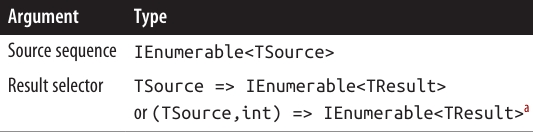 
</div>

### 🌊 SelectMany در LINQ

<div align="center">
    
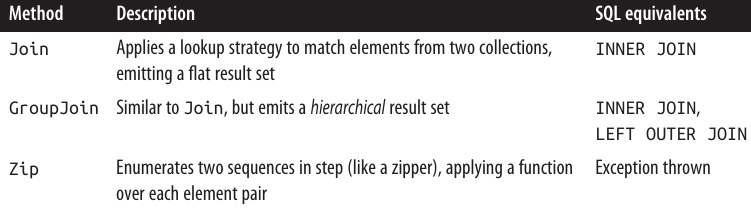 
</div>

### 🌊 SelectMany در LINQ – جزئیات و مثال‌ها

---

### 🔹 Query Syntax

```csharp
from identifier1 in enumerable-expression1
from identifier2 in enumerable-expression2
...
```

* در **query syntax**، وقتی از یک `from` اضافی استفاده می‌کنید، در واقع **SelectMany** فراخوانی می‌شود.

---

### 🔹 Enumerable Implementation

```csharp
public static IEnumerable<TResult> SelectMany<TSource,TResult>
    (IEnumerable<TSource> source,
     Func<TSource,IEnumerable<TResult>> selector)
{
    foreach (TSource element in source)
        foreach (TResult subElement in selector(element))
            yield return subElement;
}
```

* `SelectMany` همه **subsequenceها را به یک دنباله‌ی تخت (flat)** ترکیب می‌کند.
* **تفاوت با Select:**

  * `Select`: برای هر عنصر ورودی، دقیقا **یک عنصر خروجی** تولید می‌کند.
  * `SelectMany`: برای هر عنصر ورودی، **۰ تا n عنصر خروجی** تولید می‌کند.
  * n عناصر خروجی از یک **subsequence یا child sequence** که توسط **lambda expression** صادر می‌شود، حاصل می‌شوند.

---

### 🔹 مثال ساده: flatten کردن کلمات از fullNames

```csharp
string[] fullNames = { "Anne Williams", "John Fred Smith", "Sue Green" };

IEnumerable<string> query = fullNames.SelectMany(name => name.Split());
foreach (string name in query)
    Console.Write(name + "|");  
// خروجی: Anne|Williams|John|Fred|Smith|Sue|Green|
```

* اگر به جای `SelectMany` از `Select` استفاده کنید، خروجی **سلسله‌مراتبی (nested arrays)** خواهد بود و نیاز به `foreach` تو در تو دارید:

```csharp
IEnumerable<string[]> query = fullNames.Select(name => name.Split());
foreach (string[] stringArray in query)
    foreach (string name in stringArray)
        Console.Write(name + "|");
```

* مزیت `SelectMany` این است که **یک دنباله‌ی تخت (flat)** تولید می‌کند.

---

### 🔹 Query Syntax و چند متغیره بودن

```csharp
IEnumerable<string> query =
    from fullName in fullNames
    from name in fullName.Split()   // ترجمه به SelectMany
    select name;
```

* متغیر جدید `name` معرفی می‌شود، اما متغیر قدیمی `fullName` همچنان در دسترس است.
* می‌توانیم از هر دو در projection نهایی استفاده کنیم:

```csharp
IEnumerable<string> query =
    from fullName in fullNames
    from name in fullName.Split()
    select name + " came from " + fullName;
```

* خروجی نمونه:

```
Anne came from Anne Williams
Williams came from Anne Williams
John came from John Fred Smith
...
```

---

### 🔹 مشکل در Fluent Syntax

* وقتی `SelectMany` را مستقیماً در **fluent syntax** بنویسیم و بخواهیم هر دو متغیر outer و inner را داشته باشیم، مشکل ایجاد می‌شود.
* راه‌حل: **هر child element را در یک anonymous type بسته‌بندی کنیم** که outer element را هم نگه دارد:

```csharp
from fullName in fullNames
from x in fullName.Split().Select(name => new { name, fullName })
orderby x.fullName, x.name
select x.name + " came from " + x.fullName;
```

* معادل Fluent Syntax:

```csharp
IEnumerable<string> query = fullNames
    .SelectMany(fName => fName.Split()
        .Select(name => new { name, fName }))
    .OrderBy(x => x.fName)
    .ThenBy(x => x.name)
    .Select(x => x.name + " came from " + x.fName);
```

* 🔹 نکته: این تکنیک مشابه **resolve کردن let clause** در query syntax است.

### 🤔 فکر کردن به سبک Query Syntax در LINQ

---

### 🔹 چرا query syntax مفید است؟

* وقتی به **چند متغیر دامنه (range variables)** نیاز دارید، query syntax کمک می‌کند تا مستقیم در همان چارچوب فکر کنید.
* دو الگوی اصلی برای استفاده از **generatorهای اضافی** وجود دارد:

---

### 1️⃣ گسترش و flatten کردن subsequenceها

* با فراخوانی یک **property یا method** روی یک متغیر دامنه موجود در generator اضافی، می‌توان subsequenceها را گسترش داد.

```csharp
from fullName in fullNames
from name in fullName.Split()
```

* مثال مشابه در EF Core:

```csharp
IEnumerable<string> query = 
    from c in dbContext.Customers
    from p in c.Purchases
    select c.Name + " bought a " + p.Description;
```

* خروجی نمونه:

```
Tom bought a Bike
Tom bought a Holiday
Dick bought a Phone
Harry bought a Car
...
```

* 🔹 هر مشتری به یک **subsequence از خریدها** تبدیل شده است.

---

### 2️⃣ تولید Cartesian Product یا Cross Join

* هر عنصر از یک دنباله با هر عنصر دنباله دیگر ترکیب می‌شود.

```csharp
int[] numbers = { 1, 2, 3 };
string[] letters = { "a", "b" };

IEnumerable<string> query = 
    from n in numbers
    from l in letters
    select n.ToString() + l;
// خروجی: { "1a", "1b", "2a", "2b", "3a", "3b" }
```

* این الگو پایه‌ای برای **SelectMany-style joins** است.

---

### 🔹 Join کردن با SelectMany

* می‌توان با **اضافه کردن شرط فیلتر** روی نتیجه cross product، join ساخت:

```csharp
string[] players = { "Tom", "Jay", "Mary" };

IEnumerable<string> query = 
    from name1 in players
    from name2 in players
    where name1.CompareTo(name2) < 0
    orderby name1, name2
    select name1 + " vs " + name2;

// خروجی: { "Jay vs Mary", "Jay vs Tom", "Mary vs Tom" }
```

* 🔹 این یک **non-equi join** است چون شرط join از مقایسه نابرابری استفاده می‌کند.

---

### 🔹 SelectMany در EF Core

* می‌تواند **cross joins, non-equi joins, inner joins, left outer joins** انجام دهد.
* می‌توان از آن با **associations از قبل تعریف‌شده یا روابط ad hoc** استفاده کرد.
* تفاوت با Select: **SelectMany دنباله‌ای تخت (flat) برمی‌گرداند، نه سلسله‌مراتبی**.

#### مثال Cross Join:

```csharp
var query = 
    from c in dbContext.Customers
    from p in dbContext.Purchases
    select c.Name + " might have bought a " + p.Description;
```

#### مثال Equi-Join (SQL-style):

```csharp
var query = 
    from c in dbContext.Customers
    from p in dbContext.Purchases
    where c.ID == p.CustomerID
    select c.Name + " bought a " + p.Description;
```

* 🔹 این ترجمه خوبی به SQL دارد و اجرای outer joins نیز با تغییرات کوچک ممکن است.

---

### 🔹 استفاده از Collection Navigation Properties

* می‌توان به جای فیلتر روی cross product، **subcollectionها را گسترش داد**:

```csharp
from c in dbContext.Customers
from p in c.Purchases
select new { c.Name, p.Description };
```

* مزیت: **نیازی به شرط join نیست** و از فیلتر روی cross product خلاص می‌شویم.

---

### 🔹 اضافه کردن فیلترها

* مثال: مشتریانی که نامشان با "T" شروع می‌شود:

```csharp
from c in dbContext.Customers
where c.Name.StartsWith("T")
from p in c.Purchases
select new { c.Name, p.Description };
```

* در EF Core، جابجایی where clause یک خط پایین‌تر هم کار می‌کند.
* در local queries، بهتر است **ابتدا فیلتر کنید و بعد join کنید**.

---

### 🔹 اضافه کردن جداول فرزند

* مثال: هر خرید دارای چند PurchaseItem است:

```csharp
from c in dbContext.Customers
from p in c.Purchases
from pi in p.PurchaseItems
select new { c.Name, p.Description, pi.Detail };
```

* هر `from` جدید یک **child table** اضافه می‌کند.

---

### 🔹 استفاده از Navigation Property والد

* برای دسترسی به داده‌های والد، نیازی به from جدید نیست:

```csharp
from c in dbContext.Customers
select new { Name = c.Name, SalesPerson = c.SalesPerson.Name };
```

* 🔹 اینجا SelectMany لازم نیست چون **subcollection برای flatten کردن وجود ندارد**.

### ↔️ Outer Joins با SelectMany در LINQ و EF Core

---

### 🔹 مثال اولیه با Subquery

* یک **Select subquery** مشابه **left outer join** رفتار می‌کند:

```csharp
from c in dbContext.Customers
select new {
    c.Name,
    Purchases = from p in c.Purchases
                where p.Price > 1000
                select new { p.Description, p.Price }
};
```

* 🔹 در اینجا **هر مشتری** در خروجی ظاهر می‌شود، حتی اگر خریدی نداشته باشد.
* نتیجه یک **hierarchical result set** است.

---

### 🔹 مشکل وقتی SelectMany استفاده شود

* اگر بخواهیم خروجی **flat** داشته باشیم:

```csharp
from c in dbContext.Customers
from p in c.Purchases
where p.Price > 1000
select new { c.Name, p.Description, p.Price };
```

* 🔹 اینجا join **به inner join تبدیل می‌شود**:
  مشتریان فقط زمانی ظاهر می‌شوند که **یک یا چند خرید با ارزش بالا** داشته باشند.

---

### 🔹 راه حل برای Left Outer Join تخت

* از `DefaultIfEmpty()` روی **inner sequence** استفاده می‌کنیم.
* این متد اگر sequence خالی باشد، یک عنصر null تولید می‌کند:

```csharp
from c in dbContext.Customers
from p in c.Purchases.DefaultIfEmpty()
select new { c.Name, p.Description, Price = (decimal?)p.Price };
```

* ✅ EF Core همه مشتریان را برمی‌گرداند، حتی اگر خریدی نداشته باشند.
* ⚠️ در local query، اگر p null باشد، دسترسی به `p.Description` یا `p.Price` باعث NullReferenceException می‌شود.

---

### 🔹 نسخه مقاوم (Robust)

```csharp
from c in dbContext.Customers
from p in c.Purchases.DefaultIfEmpty()
select new {
    c.Name,
    Descript = p == null ? null : p.Description,
    Price = p == null ? (decimal?) null : p.Price
};
```

* این نسخه در هر دو سناریو (EF Core و local query) امن است.

---

### 🔹 اعمال فیلتر قیمت

* نمی‌توانیم `where` را بعد از DefaultIfEmpty قرار دهیم، چون فیلتر بعد از اضافه کردن null اجرا می‌شود.
* راه حل: فیلتر را قبل از DefaultIfEmpty با یک subquery اعمال کنیم:

```csharp
from c in dbContext.Customers
from p in c.Purchases.Where(p => p.Price > 1000).DefaultIfEmpty()
select new {
    c.Name,
    Descript = p == null ? null : p.Description,
    Price = p == null ? (decimal?) null : p.Price
};
```

* ✅ EF Core این را به **left outer join** ترجمه می‌کند.
* این یک **الگوی موثر برای نوشتن چنین queryهایی** است.

اگر به نوشتن **outer join** در SQL عادت داری، ممکنه وسوسه بشی که گزینه‌ی ساده‌تر یعنی **Select subquery** رو نادیده بگیری و به سمت روش تخت و پیچیده‌ی SQL-centric بری که آشناتر به نظر می‌رسه.

✅ واقعیت اینه که **hierarchical result set** که از یک Select subquery به دست میاد، اغلب برای queryهای سبک outer join بهتره، چون نیازی به مدیریت nullهای اضافی نداری و کار تمیزتر انجام می‌شه.

### Joining

<div align="center">
    
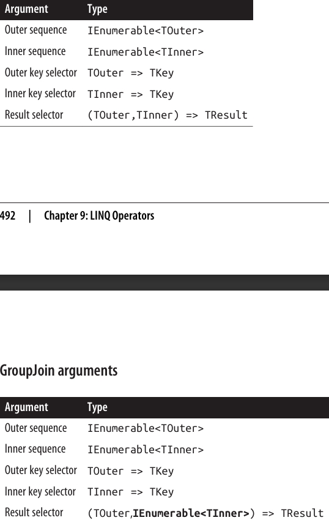 
</div>
