<div dir="rtl">

# فصل نهم:  LINQ Operators

این فصل به بررسی تک‌تک **عملگرهای LINQ** می‌پردازد. علاوه بر اینکه به‌عنوان یک مرجع عمل می‌کند، دو بخش **«Projecting»** (در صفحه ۴۷۳) و **«Joining»** (در صفحه ۴۷۳) مفاهیم مهمی را پوشش می‌دهند:

* 📌 **Projecting object hierarchies** (ایجاد و نمایش سلسله‌مراتب اشیاء)
* 📌 **Joining** با استفاده از `Select`، `SelectMany`، `Join` و `GroupJoin`
* 📌 **Query expressions with multiple range variables** (عبارت‌های کوئری با چند متغیر دامنه‌ای)

---

### 🔤 مثال پایه:

تمامی مثال‌های این فصل فرض می‌کنند که یک آرایه از نام‌ها تعریف شده است:

```csharp
string[] names = { "Tom", "Dick", "Harry", "Mary", "Jay" };
```

مثال‌هایی که مربوط به پایگاه‌داده هستند فرض می‌کنند شیء زیر ساخته شده است:

```csharp
var dbContext = new NutshellContext();
```

که کلاس `NutshellContext` به شکل زیر تعریف شده است:

```csharp
public class NutshellContext : DbContext
{
    public DbSet<Customer> Customers { get; set; }
    public DbSet<Purchase> Purchases { get; set; }

    protected override void OnModelCreating(ModelBuilder modelBuilder)
    {
        modelBuilder.Entity<Customer>(entity =>
        {
            entity.ToTable("Customer");
            entity.Property(e => e.Name).IsRequired();  // ستون غیرقابل تهی
        });

        modelBuilder.Entity<Purchase>(entity =>
        {
            entity.ToTable("Purchase");
            entity.Property(e => e.Date).IsRequired();
            entity.Property(e => e.Description).IsRequired();
        });
    }
}
```

---

### 🧑‍💻 تعریف کلاس‌ها:

```csharp
public class Customer
{
    public int ID { get; set; }
    public string Name { get; set; }
    public virtual List<Purchase> Purchases { get; set; }
        = new List<Purchase>();
}

public class Purchase
{        
    public int ID { get; set; }
    public int? CustomerID { get; set; }
    public DateTime Date { get; set; }
    public string Description { get; set; }
    public decimal Price { get; set; }
    public virtual Customer Customer { get; set; }
}
```

---

### 🛠 ابزار LINQPad

تمامی مثال‌های این فصل در **LINQPad** از پیش بارگذاری شده‌اند، همراه با یک پایگاه‌داده نمونه که **Schema** مشابهی دارد.
📥 می‌توانید LINQPad را از [www.linqpad.net](http://www.linqpad.net) دانلود کنید.

---

### 🗄 تعریف جدول‌های SQL Server متناظر:

```sql
CREATE TABLE Customer (
    ID int NOT NULL IDENTITY PRIMARY KEY,
    Name nvarchar(30) NOT NULL
)

CREATE TABLE Purchase (
    ID int NOT NULL IDENTITY PRIMARY KEY,
    CustomerID int NOT NULL REFERENCES Customer(ID),
    Date datetime NOT NULL,
    Description nvarchar(30) NOT NULL,
    Price decimal NOT NULL
)
```

---

## 🔎 مرور کلی (Overview)

در این بخش، یک مرور کلی بر **عملگرهای استاندارد کوئری** ارائه می‌دهیم. این عملگرها در سه دسته تقسیم می‌شوند:

1. 📌 **Sequence in, sequence out (sequence → sequence)**
   ➝ یعنی ورودی یک دنباله (sequence) است و خروجی هم یک دنباله.
2. 📌 **Sequence in, single element or scalar value out**
   ➝ یعنی ورودی یک دنباله است اما خروجی فقط یک عنصر یا یک مقدار منفرد.
3. 📌 **Nothing in, sequence out (generation methods)**
   ➝ یعنی هیچ ورودی وجود ندارد اما خروجی یک دنباله تولید می‌شود.

---

ما ابتدا هر سه دسته را معرفی کرده و عملگرهای مربوط به هرکدام را بررسی می‌کنیم. سپس به‌طور جداگانه سراغ تک‌تک عملگرها خواهیم رفت.

---

## 🔄 Sequence → Sequence

بیشتر عملگرهای LINQ در این دسته قرار می‌گیرند. آن‌ها یک یا چند دنباله را به‌عنوان ورودی می‌گیرند و در خروجی یک دنباله تولید می‌کنند.

📊 **شکل ۹-۱** عملگرهایی را نشان می‌دهد که ساختار دنباله‌ها را تغییر می‌دهند.

<div align="center">
    
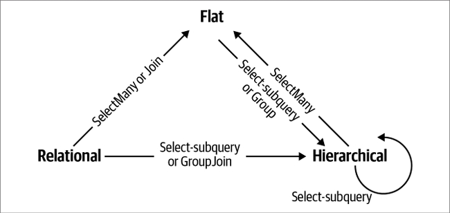 
</div>

### 📖 عملگرهای LINQ – دسته‌بندی‌ها

در این بخش، عملگرهای LINQ را بر اساس نوع ورودی و خروجی مرور می‌کنیم. هر دسته با مثال‌ها و توضیح کوتاه معرفی می‌شود.

---

## 🔍 Filtering (فیلتر کردن)

**ورودی:** `IEnumerable<TSource>`
**خروجی:** `IEnumerable<TSource>`

🔹 وظیفه: برگرداندن یک زیرمجموعه از عناصر اصلی.

📌 عملگرها:
`Where`, `Take`, `TakeLast`, `TakeWhile`, `Skip`, `SkipLast`, `SkipWhile`,
`Distinct`, `DistinctBy`

---

## 🎨 Projecting (تبدیل/نمایش)

**ورودی:** `IEnumerable<TSource>`
**خروجی:** `IEnumerable<TResult>`

🔹 وظیفه: تغییر شکل هر عنصر با استفاده از یک **lambda function**.

* `SelectMany` دنباله‌های تو در تو (nested sequences) را **مسطح‌سازی (flatten)** می‌کند.
* `Select` و `SelectMany` می‌توانند انواع مختلف **Join** (مانند inner join, left outer join, cross join, non-equi join) را با **EF Core** انجام دهند.

📌 عملگرها:
`Select`, `SelectMany`

---

## 🔗 Joining (اتصال/ترکیب)

**ورودی:**
`IEnumerable<TOuter>, IEnumerable<TInner>`
**خروجی:**
`IEnumerable<TResult>`

🔹 وظیفه: ترکیب عناصر یک دنباله با دنباله‌ای دیگر.

* `Join` و `GroupJoin` برای کارایی بهتر در کوئری‌های محلی طراحی شده‌اند و از **inner join** و **left outer join** پشتیبانی می‌کنند.
* `Zip` دو دنباله را هم‌زمان پیمایش کرده و روی هر جفت عنصر یک تابع اعمال می‌کند.

📌 عملگرها:
`Join`, `GroupJoin`, `Zip`

---

## 📑 Ordering (مرتب‌سازی)

**ورودی:** `IEnumerable<TSource>`
**خروجی:** `IOrderedEnumerable<TSource>`

🔹 وظیفه: بازگرداندن یک دنباله با ترتیب جدید.

📌 عملگرها:
`OrderBy`, `OrderByDescending`, `ThenBy`, `ThenByDescending`, `Reverse`

---

## 🗂 Grouping (گروه‌بندی)

**ورودی:** `IEnumerable<TSource>`
**خروجی:**

* `IEnumerable<IGrouping<TKey,TElement>>`
* یا `IEnumerable<TElement[]>`

🔹 وظیفه: تقسیم یک دنباله به زیر‌دنباله‌ها.

📌 عملگرها:
`GroupBy`, `Chunk`

---

## 🔀 Set Operators (عملگرهای مجموعه‌ای)

**ورودی:**
`IEnumerable<TSource>, IEnumerable<TSource>`
**خروجی:**
`IEnumerable<TSource>`

🔹 وظیفه: گرفتن دو دنباله هم‌نوع و برگرداندن اشتراک، اجتماع یا تفاوت آن‌ها.

📌 عملگرها:
`Concat`, `Union`, `UnionBy`, `Intersect`, `IntersectBy`, `Except`, `ExceptBy`

---

## 🔄 Conversion Methods (تبدیل)

### 🛠 Import

**ورودی:** `IEnumerable`
**خروجی:** `IEnumerable<TResult>`

📌 عملگرها:
`OfType`, `Cast`

### 📤 Export

**ورودی:** `IEnumerable<TSource>`
**خروجی:** یک آرایه، لیست، دیکشنری، Lookup یا دنباله

📌 عملگرها:
`ToArray`, `ToList`, `ToDictionary`, `ToLookup`, `AsEnumerable`, `AsQueryable`

---

## 🎯 Sequence → Element or Value

### 🔹 Element Operators (انتخاب عنصر)

**ورودی:** `IEnumerable<TSource>`
**خروجی:** `TSource`

📌 عملگرها:
`First`, `FirstOrDefault`, `Last`, `LastOrDefault`,
`Single`, `SingleOrDefault`, `ElementAt`, `ElementAtOrDefault`,
`MinBy`, `MaxBy`, `DefaultIfEmpty`

---

### 🔹 Aggregation Methods (تجمیع)

**ورودی:** `IEnumerable<TSource>`
**خروجی:** یک مقدار منفرد (scalar)

📌 وظیفه: انجام محاسبه روی یک دنباله و بازگرداندن یک مقدار عددی یا مشابه آن.

📌 عملگرها:
`Aggregate`, `Average`, `Count`, `LongCount`, `Sum`, `Max`, `Min`

---

### 🔹 Quantifiers (کوانتیفایرها)

**ورودی:** `IEnumerable<TSource>`
**خروجی:** `bool`

📌 وظیفه: برگرداندن نتیجه **true/false** به‌عنوان یک تجمیع.

📌 عملگرها:
`All`, `Any`, `Contains`, `SequenceEqual`

---

## 🌀 Void → Sequence

### 🔹 Generation Methods (تولید)

**ورودی:** `void`
**خروجی:** `IEnumerable<TResult>`

📌 وظیفه: ساخت یک دنباله ساده از صفر.

📌 عملگرها:
`Empty`, `Range`, `Repeat`

<div align="center">
    
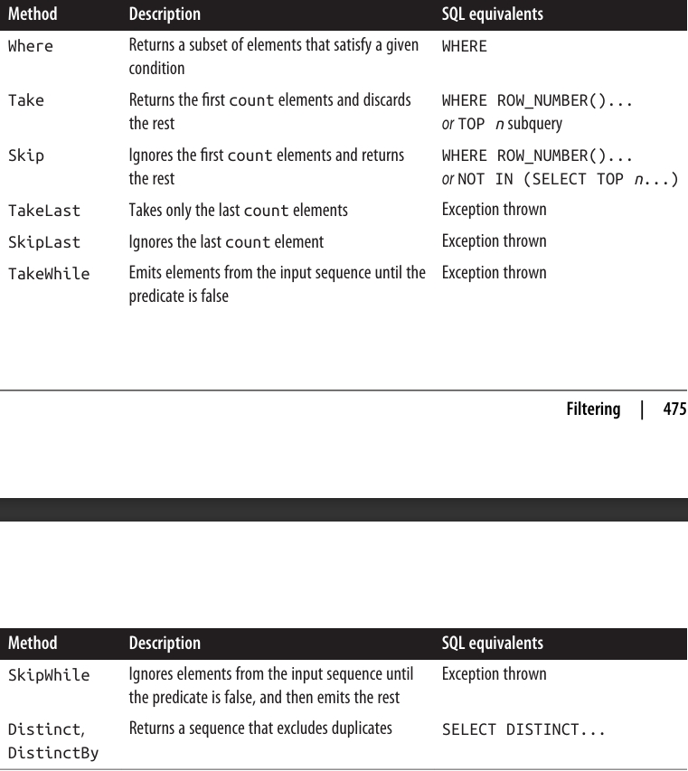 
</div>

### 📖 نکته درباره ستون «SQL equivalents»

در جدول‌های مرجع این فصل، ستون **«SQL equivalents»** لزوماً همان چیزی نیست که یک پیاده‌سازی `IQueryable` مثل **EF Core** تولید می‌کند.
بلکه این ستون نشان می‌دهد اگر خودتان می‌خواستید معادل آن کوئری را به زبان **SQL** بنویسید، معمولاً از چه چیزی استفاده می‌کردید.

* اگر معادل ساده‌ای برای آن وجود نداشته باشد، ستون خالی رها می‌شود.
* اگر هیچ معادلی در SQL وجود نداشته باشد، عبارت **«Exception thrown»** درج می‌شود.

---

### 🧑‍💻 پیاده‌سازی Enumerable

وقتی کد پیاده‌سازی برای `Enumerable` نشان داده می‌شود، بررسی موارد زیر در آن حذف شده‌اند:

* بررسی آرگومان‌های **null**
* بررسی **indexing predicates**

---

### 🔍 درباره متدهای Filtering

در هر یک از متدهای **Filtering**، همیشه خروجی شامل همان تعداد یا **کمتر** از عناصری است که در ورودی داشتید.
⚠️ هیچ‌وقت نمی‌توانید عناصر بیشتری از آنچه وارد کرده‌اید به دست بیاورید!
علاوه بر این، عناصری که در خروجی دریافت می‌کنید **تبدیل یا تغییر شکل داده نمی‌شوند**؛ آن‌ها دقیقاً همان عناصری هستند که در ورودی وجود داشتند.

---

## 📝 Where

<div align="center">
    
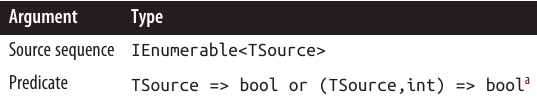 
</div>

### 📖 Where در LINQ

---

### ⚠️ محدودیت‌ها

* ❌ استفاده از `Where` در **LINQ to SQL** و **Entity Framework (EF Core)** دارای محدودیت‌هایی است (برخی سناریوها پشتیبانی نمی‌شوند).

---

### 📝 سینتکس کوئری

```csharp
where bool-expression
```

---

### 🔧 پیاده‌سازی Enumerable.Where

نسخه داخلی `Enumerable.Where` (بدون بررسی null) معادل کدی شبیه زیر است:

```csharp
public static IEnumerable<TSource> Where<TSource>(
    this IEnumerable<TSource> source,
    Func<TSource, bool> predicate)
{
    foreach (TSource element in source)
        if (predicate(element))
            yield return element;
}
```

---

### 📌 توضیح

`Where` عناصری از دنباله ورودی را برمی‌گرداند که شرط داده‌شده (**predicate**) را برآورده می‌کنند.

---

### ✨ مثال ساده

```csharp
string[] names = { "Tom", "Dick", "Harry", "Mary", "Jay" };

IEnumerable<string> query = names.Where(name => name.EndsWith("y"));

// خروجی:
// Harry
// Mary
// Jay
```

🔹 معادل در **Query Syntax**:

```csharp
IEnumerable<string> query =
    from n in names
    where n.EndsWith("y")
    select n;
```

---

### 🌀 چند شرط Where در یک کوئری

یک عبارت `where` می‌تواند چند بار در کوئری ظاهر شود و با `let`, `orderby`, یا `join` ترکیب شود:

```csharp
from n in names
where n.Length > 3
let u = n.ToUpper()
where u.EndsWith("Y")
select u;

// خروجی:
// HARRY
// MARY
```

🔸 قوانین **scoping** استاندارد #C اعمال می‌شوند. یعنی نمی‌توانید قبل از تعریف یک متغیر (با `range variable` یا `let`) به آن ارجاع دهید.

---

### 🔢 Indexed Filtering (فیلترگذاری بر اساس ایندکس)

`Where` می‌تواند به‌صورت اختیاری آرگومان دوم از نوع `int` دریافت کند (نمایانگر **موقعیت عنصر** در دنباله). این ویژگی اجازه می‌دهد تصمیم‌گیری براساس موقعیت انجام شود.

```csharp
IEnumerable<string> query = names.Where((n, i) => i % 2 == 0);

// خروجی:
// Tom
// Harry
// Jay
```

⚠️ در **EF Core** استفاده از این قابلیت باعث **Exception** می‌شود.

---

### 🔍 مقایسه با LIKE در EF Core

متدهای زیر در رشته‌ها به **SQL LIKE** ترجمه می‌شوند:

* `Contains`
* `StartsWith`
* `EndsWith`

مثال:

```csharp
c.Name.Contains("abc")
```

به SQL معادل زیر تبدیل می‌شود:

```sql
customer.Name LIKE '%abc%'
```

> (در واقع نسخه **پارامتری‌شده** ساخته می‌شود، نه رشته مستقیم.)

🔹 برای مقایسه با **ستون دیگر** باید از متد `EF.Functions.Like` استفاده کنید:

```csharp
where EF.Functions.Like(c.Description, "%" + c.Name + "%")
```

این متد امکان مقایسه‌های پیچیده‌تر را هم می‌دهد، مثل:

```sql
LIKE 'abc%def%'
```

---

### 🔠 مقایسه رشته‌ای با < و > در EF Core

برای مقایسه ترتیبی رشته‌ها از متد `string.CompareTo` استفاده کنید:

```csharp
dbContext.Purchases
    .Where(p => p.Description.CompareTo("C") < 0);
```

📌 این کد به عملگرهای `<` و `>` در SQL نگاشت می‌شود.

---

### 🗂 استفاده از IN در EF Core

در EF Core می‌توانید `Contains` را روی یک مجموعه محلی استفاده کنید:

```csharp
string[] chosenOnes = { "Tom", "Jay" };

from c in dbContext.Customers
where chosenOnes.Contains(c.Name)
select c;
```

معادل SQL:

```sql
WHERE customer.Name IN ("Tom", "Jay")
```

⚠️ اگر مجموعه محلی آرایه‌ای از **entity** یا نوع غیر scalar باشد، EF Core ممکن است به‌جای آن **EXISTS** تولید کند.

---

### ⏩ عملگرهای بعدی

* `Take`
* `TakeLast`
* `Skip`
* `SkipLast`

<div align="center">
    
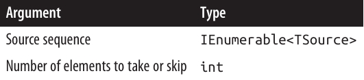 
</div>

### 📖 Take و Skip در LINQ

---

### 📝 توضیح کلی

* 🔹 متد `Take` اولین **n عنصر** از دنباله رو برمی‌گردونه و بقیه رو نادیده می‌گیره.
* 🔹 متد `Skip` اولین **n عنصر** رو حذف می‌کنه و بقیه عناصر رو برمی‌گردونه.

این دو متد معمولاً **با هم** استفاده می‌شن، مخصوصاً وقتی می‌خوایم صفحه‌بندی (Paging) در یک اپلیکیشن وب رو پیاده‌سازی کنیم.

---

### 🌐 مثال کاربردی (Paging در EF Core)

فرض کن کاربر توی دیتابیس کتاب‌ها دنبال عبارت `"mercury"` می‌گرده و **۱۰۰ نتیجه** پیدا می‌شه.

📌 برای گرفتن **۲۰ نتیجه اول**:

```csharp
IQueryable<Book> query = dbContext.Books
    .Where(b => b.Title.Contains("mercury"))
    .OrderBy(b => b.Title)
    .Take(20);
```

📌 برای گرفتن **کتاب‌های شماره ۲۱ تا ۴۰**:

```csharp
IQueryable<Book> query = dbContext.Books
    .Where(b => b.Title.Contains("mercury"))
    .OrderBy(b => b.Title)
    .Skip(20)
    .Take(20);
```

---

### ⚙️ نحوه ترجمه در SQL

در EF Core:

* در **SQL Server 2005** به تابع `ROW_NUMBER` ترجمه می‌شه.
* در نسخه‌های قدیمی‌تر SQL Server به **زیرکوئری TOP n** نگاشت می‌شه.

---

### 🔄 متدهای TakeLast و SkipLast

* `TakeLast(n)` → آخرین **n عنصر** رو برمی‌گردونه.
* `SkipLast(n)` → آخرین **n عنصر** رو حذف می‌کنه.

---

### 🚀 قابلیت جدید از .NET 6

از نسخه **.NET 6**، متد `Take` یک نسخه overload جدید داره که متغیر `Range` رو قبول می‌کنه. این نسخه می‌تونه جایگزین تمام چهار متد بشه.

📌 مثال‌ها:

```csharp
Take(5..)
// معادل Skip(5)

Take(..^5)
// معادل SkipLast(5)
```

یعنی می‌تونی خیلی تمیزتر و کوتاه‌تر کد بزنی ✨

---

### ⏩ عملگرهای بعدی

* `TakeWhile`
* `SkipWhile`

<div align="center">
    
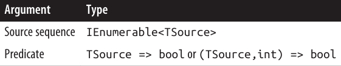 
</div>

### 🔹 TakeWhile و SkipWhile

---

### ⚙️ TakeWhile

`TakeWhile` عناصر دنباله ورودی را **به ترتیب پیمایش** می‌کند و هر عنصر را **تا زمانی که شرط داده‌شده true باشد** برمی‌گرداند.
به محض اینکه شرط false شود، بقیه عناصر نادیده گرفته می‌شوند.

```csharp
int[] numbers = { 3, 5, 2, 234, 4, 1 };
var takeWhileSmall = numbers.TakeWhile(n => n < 100); // خروجی: { 3, 5, 2 }
```

---

### ⚙️ SkipWhile

`SkipWhile` هم دنباله ورودی را پیمایش می‌کند، ولی **عناصر را تا زمانی که شرط true باشد نادیده می‌گیرد**.
بعد از اولین عنصری که شرط false شد، بقیه عناصر **برگردانده می‌شوند**.

```csharp
int[] numbers = { 3, 5, 2, 234, 4, 1 };
var skipWhileSmall = numbers.SkipWhile(n => n < 100); // خروجی: { 234, 4, 1 }
```

⚠️ توجه:
`TakeWhile` و `SkipWhile` هیچ معادل SQL ندارند و در کوئری‌های **EF Core** استفاده از آن‌ها باعث **Exception** می‌شود.

---

### 🔹 Distinct و DistinctBy

---

### ✅ Distinct

`Distinct` دنباله ورودی را بدون **تکراری‌ها** برمی‌گرداند.
می‌توانید **custom equality comparer** هم به آن بدهید.

```csharp
char[] distinctLetters = "HelloWorld".Distinct().ToArray();
string s = new string(distinctLetters); // خروجی: "HeloWrd"
```

> می‌توانیم مستقیماً متدهای LINQ را روی `string` صدا بزنیم، چون `string` پیاده‌سازی‌کننده `IEnumerable<char>` است.

---

### ✅ DistinctBy

* معرفی شده در **.NET 6**
* امکان مشخص کردن یک **key selector** قبل از مقایسه تساوی را فراهم می‌کند.

مثال:

```csharp
new[] { 1.0, 1.1, 2.0, 2.1, 3.0, 3.1 }
    .DistinctBy(n => Math.Round(n, 0)); // خروجی: { 1, 2, 3 }
```

<div align="center">
    
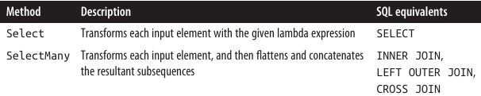 
</div>

### 🎨 Select و SelectMany در LINQ

---

### ⚙️ توضیح کلی

وقتی **روی پایگاه داده کوئری می‌زنیم**، `Select` و `SelectMany` **انعطاف‌پذیرترین ابزارها برای انجام join** هستند.
اما برای **کوئری‌های محلی (Local queries)**، `Join` و `GroupJoin` **کارآمدترین و سریع‌ترین ابزارها برای join** محسوب می‌شوند.

<div align="center">
    
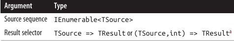 
</div>

### Select

<div align="center">
    
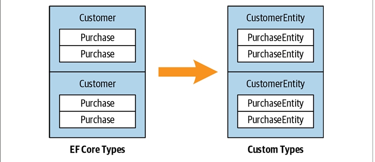 
</div>


### ⚠️ محدودیت EF Core

* ❌ استفاده از `Select` به عنوان **subquery پیچیده یا indexed projection** در EF Core محدودیت دارد و برخی سناریوها ممکن است پشتیبانی نشود.

---

### 📝 سینتکس کوئری

```csharp
select projection-expression
```

---

### 🔧 پیاده‌سازی Enumerable

نسخه داخلی `Enumerable.Select` به شکل زیر است:

```csharp
public static IEnumerable<TResult> Select<TSource,TResult>(
    this IEnumerable<TSource> source,
    Func<TSource,TResult> selector)
{
    foreach (TSource element in source)
        yield return selector(element);
}
```

---

### 🔹 توضیح کلی

* با `Select` همیشه **تعداد عناصر خروجی برابر با تعداد عناصر ورودی است**.
* هر عنصر می‌تواند با **lambda function** به هر شکل دلخواه تبدیل شود.

---

### 🔹 مثال پایه‌ای: گرفتن نام فونت‌ها

```csharp
IEnumerable<string> query = from f in FontFamily.Families
                            select f.Name;

foreach (string name in query) 
    Console.WriteLine(name);
```

🔹 معادل **Lambda Syntax**:

```csharp
IEnumerable<string> query = FontFamily.Families.Select(f => f.Name);
```

---

### 🔹 پروژه کردن به انواع ناشناس (Anonymous Types)

```csharp
var query = from f in FontFamily.Families
            select new { f.Name, LineSpacing = f.GetLineSpacing(FontStyle.Bold) };
```

* گاهی اوقات projection بدون هیچ تغییر خاصی انجام می‌شود، فقط برای اینکه کوئری با `select` یا `group` پایان یابد.
  مثال: انتخاب فونت‌هایی که **strikeout** را پشتیبانی می‌کنند:

```csharp
IEnumerable<FontFamily> query =
    from f in FontFamily.Families
    where f.IsStyleAvailable(FontStyle.Strikeout)
    select f;

foreach (FontFamily ff in query)
    Console.WriteLine(ff.Name);
```

> در این موارد، **کامپایلر هنگام تبدیل به Fluent Syntax**، projection را حذف می‌کند.

---

### 🔹 Indexed Projection

* `selector` می‌تواند آرگومان اختیاری دوم از نوع **int** بگیرد که نمایانگر **موقعیت عنصر** در دنباله است.
* ⚠️ این قابلیت فقط در **کوئری‌های محلی** کار می‌کند.

```csharp
string[] names = { "Tom", "Dick", "Harry", "Mary", "Jay" };
IEnumerable<string> query = names.Select((s, i) => i + "=" + s);
// خروجی: { "0=Tom", "1=Dick", "2=Harry", "3=Mary", "4=Jay" }
```

---

### 🔹 Subqueries و Object Hierarchies

* می‌توان یک **subquery** را در `Select` جای داد تا **ساختار شیء (Object Hierarchy)** بسازیم.
* مثال: دریافت هر دایرکتوری در مسیر `Path.GetTempPath()` همراه با لیست فایل‌های آن:

```csharp
string tempPath = Path.GetTempPath();
DirectoryInfo[] dirs = new DirectoryInfo(tempPath).GetDirectories();

var query = from d in dirs
            where (d.Attributes & FileAttributes.System) == 0
            select new
            {
                DirectoryName = d.FullName,
                Created = d.CreationTime,
                Files = from f in d.GetFiles()
                        where (f.Attributes & FileAttributes.Hidden) == 0
                        select new { FileName = f.Name, f.Length }
            };

foreach (var dirFiles in query)
{
    Console.WriteLine("Directory: " + dirFiles.DirectoryName);
    foreach (var file in dirFiles.Files)
        Console.WriteLine("  " + file.FileName + " Len: " + file.Length);
}
```

* بخش داخلی این کوئری یک **correlated subquery** است، چون به شیء `d` در کوئری خارجی ارجاع می‌دهد.
* یک subquery در `Select` امکان **نگاشت یک هرمشی شیء (Object Hierarchy) به هرمشی دیگر** یا نگاشت **Relational Object Model به Hierarchical Object Model** را می‌دهد.

---

### 🔹 Deferred Execution در Local Queries

* در کوئری‌های محلی، subquery داخل `Select` باعث **double-deferred execution** می‌شود.
* در مثال بالا، فایل‌ها تا زمانی که `foreach` داخلی اجرا نشود، **فیلتر یا پروژه نمی‌شوند**.

### 🌀 Subqueries و Joins در EF Core

---

### 🔹 Subquery Projections در EF Core

* **Projection با subquery** در EF Core به خوبی کار می‌کند و می‌تواند جایگزین **SQL-style joins** باشد.
* مثال: دریافت نام هر مشتری به همراه **خریدهای با ارزش بالای ۱۰۰۰**:

```csharp
var query =
    from c in dbContext.Customers
    select new {
        c.Name,
        Purchases = (
            from p in dbContext.Purchases
            where p.CustomerID == c.ID && p.Price > 1000
            select new { p.Description, p.Price }
        ).ToList()
    };

foreach (var namePurchases in query)
{
    Console.WriteLine("Customer: " + namePurchases.Name);
    foreach (var purchaseDetail in namePurchases.Purchases)
        Console.WriteLine("  - $$$: " + purchaseDetail.Price);
}
```

> ⚠️ دقت کنید که استفاده از `ToList` در subquery ضروری است، زیرا EF Core 3 نمی‌تواند **queryable** بسازد اگر subquery مستقیماً به `DbContext` ارجاع دهد. این محدودیت ممکن است در نسخه‌های بعدی EF Core برطرف شود.

---

### 🔹 مزیت این سبک

* این نوع کوئری **برای interpreted queries مناسب است**.

* کوئری خارجی و subquery **به صورت یک واحد پردازش می‌شوند** و از round-tripping اضافی جلوگیری می‌کنند.

* ⚠️ در کوئری‌های محلی (Local queries) این روش **غیر بهینه** است، چون تمام ترکیب‌های عناصر خارجی و داخلی باید پیمایش شوند.

* جایگزین بهینه برای Local queries: استفاده از **Join** یا **GroupJoin**.

---

### 🔹 نگاشت داده‌های سلسله‌مراتبی

* این کوئری **اشیاء دو مجموعه متفاوت** را هم‌تراز می‌کند و می‌توان آن را یک نوع **join** در نظر گرفت.
* تفاوت با join سنتی SQL:

  * خروجی **تخت (flat)** نیست، بلکه داده‌های رابطه‌ای به **داده‌های سلسله‌مراتبی** نگاشت می‌شوند.

---

### 🔹 استفاده از Navigation Property

مثال ساده‌تر با استفاده از Navigation Property `Purchases` در `Customer`:

```csharp
from c in dbContext.Customers
select new
{
    c.Name,
    Purchases = from p in c.Purchases  // Purchases نوع List<Purchase> است
                where p.Price > 1000
                select new { p.Description, p.Price }
};
```

> در EF Core 3، هنگام استفاده از Navigation Property **نیازی به ToList نیست**.

* هر دو کوئری مانند **left outer join در SQL** هستند: همه مشتری‌ها در enumeration بیرونی لحاظ می‌شوند، حتی اگر خریدی نداشته باشند.

---

### 🔹 شبیه‌سازی Inner Join

* برای حذف مشتری‌هایی که خرید با ارزش بالا ندارند، می‌توان شرط اضافه کرد:

```csharp
from c in dbContext.Customers
where c.Purchases.Any(p => p.Price > 1000)
select new {
    c.Name,
    Purchases = from p in c.Purchases
                where p.Price > 1000
                select new { p.Description, p.Price }
};
```

* ⚠️ این روش کمی تکراری است (Price > 1000 دو بار نوشته می‌شود).

* با استفاده از `let` می‌توان تکرار را حذف کرد:

```csharp
from c in dbContext.Customers
let highValueP = from p in c.Purchases
                 where p.Price > 1000
                 select new { p.Description, p.Price }
where highValueP.Any()
select new { c.Name, Purchases = highValueP };
```

* این سبک **انعطاف‌پذیر** است؛ برای مثال با تغییر `Any()` به `Count()` می‌توان فقط مشتری‌هایی با حداقل دو خرید با ارزش بالا را گرفت:

```csharp
where highValueP.Count() >= 2
select new { c.Name, Purchases = highValueP };
```

---

### 🔹 Projection به Types مشخص

* تا اینجا از **Anonymous Types** استفاده شد.
* می‌توان **کلاس‌های معمولی (Named Classes)** نیز ساخت و با object initializer پر کرد.
* این کلاس‌ها می‌توانند **منطق سفارشی** داشته باشند و بین متدها و Assemblyها منتقل شوند.
* نمونه معمول: **Custom Business Entity / DTO**

```csharp
IQueryable<CustomerEntity> query =
    from c in dbContext.Customers
    select new CustomerEntity
    {
        Name = c.Name,
        Purchases = (
            from p in c.Purchases
            where p.Price > 1000
            select new PurchaseEntity
            {
                Description = p.Description,
                Value = p.Price
            }
        ).ToList()
    };

// اجرای کوئری و تبدیل خروجی به List
List<CustomerEntity> result = query.ToList();
```

> کلاس‌های DTO معمولاً **هیچ منطق تجاری ندارند** و صرفاً برای انتقال داده بین لایه‌ها یا سیستم‌ها استفاده می‌شوند.

---

### 🔹 نکته کلیدی

* تا اینجا **نیازی به Join یا SelectMany نداشتیم**.
* دلیل: **ساختار سلسله‌مراتبی داده‌ها حفظ شده**، برخلاف SQL که معمولاً داده‌ها را flatten می‌کند.

<div align="center">
    
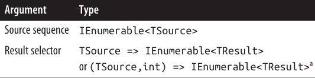 
</div>

### 🌊 SelectMany در LINQ

<div align="center">
    
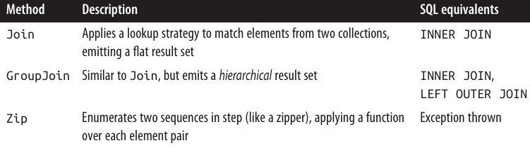 
</div>

### 🌊 SelectMany در LINQ – جزئیات و مثال‌ها

---

### 🔹 Query Syntax

```csharp
from identifier1 in enumerable-expression1
from identifier2 in enumerable-expression2
...
```

* در **query syntax**، وقتی از یک `from` اضافی استفاده می‌کنید، در واقع **SelectMany** فراخوانی می‌شود.

---

### 🔹 Enumerable Implementation

```csharp
public static IEnumerable<TResult> SelectMany<TSource,TResult>
    (IEnumerable<TSource> source,
     Func<TSource,IEnumerable<TResult>> selector)
{
    foreach (TSource element in source)
        foreach (TResult subElement in selector(element))
            yield return subElement;
}
```

* `SelectMany` همه **subsequenceها را به یک دنباله‌ی تخت (flat)** ترکیب می‌کند.
* **تفاوت با Select:**

  * `Select`: برای هر عنصر ورودی، دقیقا **یک عنصر خروجی** تولید می‌کند.
  * `SelectMany`: برای هر عنصر ورودی، **۰ تا n عنصر خروجی** تولید می‌کند.
  * n عناصر خروجی از یک **subsequence یا child sequence** که توسط **lambda expression** صادر می‌شود، حاصل می‌شوند.

---

### 🔹 مثال ساده: flatten کردن کلمات از fullNames

```csharp
string[] fullNames = { "Anne Williams", "John Fred Smith", "Sue Green" };

IEnumerable<string> query = fullNames.SelectMany(name => name.Split());
foreach (string name in query)
    Console.Write(name + "|");  
// خروجی: Anne|Williams|John|Fred|Smith|Sue|Green|
```

* اگر به جای `SelectMany` از `Select` استفاده کنید، خروجی **سلسله‌مراتبی (nested arrays)** خواهد بود و نیاز به `foreach` تو در تو دارید:

```csharp
IEnumerable<string[]> query = fullNames.Select(name => name.Split());
foreach (string[] stringArray in query)
    foreach (string name in stringArray)
        Console.Write(name + "|");
```

* مزیت `SelectMany` این است که **یک دنباله‌ی تخت (flat)** تولید می‌کند.

---

### 🔹 Query Syntax و چند متغیره بودن

```csharp
IEnumerable<string> query =
    from fullName in fullNames
    from name in fullName.Split()   // ترجمه به SelectMany
    select name;
```

* متغیر جدید `name` معرفی می‌شود، اما متغیر قدیمی `fullName` همچنان در دسترس است.
* می‌توانیم از هر دو در projection نهایی استفاده کنیم:

```csharp
IEnumerable<string> query =
    from fullName in fullNames
    from name in fullName.Split()
    select name + " came from " + fullName;
```

* خروجی نمونه:

```
Anne came from Anne Williams
Williams came from Anne Williams
John came from John Fred Smith
...
```

---

### 🔹 مشکل در Fluent Syntax

* وقتی `SelectMany` را مستقیماً در **fluent syntax** بنویسیم و بخواهیم هر دو متغیر outer و inner را داشته باشیم، مشکل ایجاد می‌شود.
* راه‌حل: **هر child element را در یک anonymous type بسته‌بندی کنیم** که outer element را هم نگه دارد:

```csharp
from fullName in fullNames
from x in fullName.Split().Select(name => new { name, fullName })
orderby x.fullName, x.name
select x.name + " came from " + x.fullName;
```

* معادل Fluent Syntax:

```csharp
IEnumerable<string> query = fullNames
    .SelectMany(fName => fName.Split()
        .Select(name => new { name, fName }))
    .OrderBy(x => x.fName)
    .ThenBy(x => x.name)
    .Select(x => x.name + " came from " + x.fName);
```

* 🔹 نکته: این تکنیک مشابه **resolve کردن let clause** در query syntax است.

### 🤔 فکر کردن به سبک Query Syntax در LINQ

---

### 🔹 چرا query syntax مفید است؟

* وقتی به **چند متغیر دامنه (range variables)** نیاز دارید، query syntax کمک می‌کند تا مستقیم در همان چارچوب فکر کنید.
* دو الگوی اصلی برای استفاده از **generatorهای اضافی** وجود دارد:

---

### 1️⃣ گسترش و flatten کردن subsequenceها

* با فراخوانی یک **property یا method** روی یک متغیر دامنه موجود در generator اضافی، می‌توان subsequenceها را گسترش داد.

```csharp
from fullName in fullNames
from name in fullName.Split()
```

* مثال مشابه در EF Core:

```csharp
IEnumerable<string> query = 
    from c in dbContext.Customers
    from p in c.Purchases
    select c.Name + " bought a " + p.Description;
```

* خروجی نمونه:

```
Tom bought a Bike
Tom bought a Holiday
Dick bought a Phone
Harry bought a Car
...
```

* 🔹 هر مشتری به یک **subsequence از خریدها** تبدیل شده است.

---

### 2️⃣ تولید Cartesian Product یا Cross Join

* هر عنصر از یک دنباله با هر عنصر دنباله دیگر ترکیب می‌شود.

```csharp
int[] numbers = { 1, 2, 3 };
string[] letters = { "a", "b" };

IEnumerable<string> query = 
    from n in numbers
    from l in letters
    select n.ToString() + l;
// خروجی: { "1a", "1b", "2a", "2b", "3a", "3b" }
```

* این الگو پایه‌ای برای **SelectMany-style joins** است.

---

### 🔹 Join کردن با SelectMany

* می‌توان با **اضافه کردن شرط فیلتر** روی نتیجه cross product، join ساخت:

```csharp
string[] players = { "Tom", "Jay", "Mary" };

IEnumerable<string> query = 
    from name1 in players
    from name2 in players
    where name1.CompareTo(name2) < 0
    orderby name1, name2
    select name1 + " vs " + name2;

// خروجی: { "Jay vs Mary", "Jay vs Tom", "Mary vs Tom" }
```

* 🔹 این یک **non-equi join** است چون شرط join از مقایسه نابرابری استفاده می‌کند.

---

### 🔹 SelectMany در EF Core

* می‌تواند **cross joins, non-equi joins, inner joins, left outer joins** انجام دهد.
* می‌توان از آن با **associations از قبل تعریف‌شده یا روابط ad hoc** استفاده کرد.
* تفاوت با Select: **SelectMany دنباله‌ای تخت (flat) برمی‌گرداند، نه سلسله‌مراتبی**.

#### مثال Cross Join:

```csharp
var query = 
    from c in dbContext.Customers
    from p in dbContext.Purchases
    select c.Name + " might have bought a " + p.Description;
```

#### مثال Equi-Join (SQL-style):

```csharp
var query = 
    from c in dbContext.Customers
    from p in dbContext.Purchases
    where c.ID == p.CustomerID
    select c.Name + " bought a " + p.Description;
```

* 🔹 این ترجمه خوبی به SQL دارد و اجرای outer joins نیز با تغییرات کوچک ممکن است.

---

### 🔹 استفاده از Collection Navigation Properties

* می‌توان به جای فیلتر روی cross product، **subcollectionها را گسترش داد**:

```csharp
from c in dbContext.Customers
from p in c.Purchases
select new { c.Name, p.Description };
```

* مزیت: **نیازی به شرط join نیست** و از فیلتر روی cross product خلاص می‌شویم.

---

### 🔹 اضافه کردن فیلترها

* مثال: مشتریانی که نامشان با "T" شروع می‌شود:

```csharp
from c in dbContext.Customers
where c.Name.StartsWith("T")
from p in c.Purchases
select new { c.Name, p.Description };
```

* در EF Core، جابجایی where clause یک خط پایین‌تر هم کار می‌کند.
* در local queries، بهتر است **ابتدا فیلتر کنید و بعد join کنید**.

---

### 🔹 اضافه کردن جداول فرزند

* مثال: هر خرید دارای چند PurchaseItem است:

```csharp
from c in dbContext.Customers
from p in c.Purchases
from pi in p.PurchaseItems
select new { c.Name, p.Description, pi.Detail };
```

* هر `from` جدید یک **child table** اضافه می‌کند.

---

### 🔹 استفاده از Navigation Property والد

* برای دسترسی به داده‌های والد، نیازی به from جدید نیست:

```csharp
from c in dbContext.Customers
select new { Name = c.Name, SalesPerson = c.SalesPerson.Name };
```

* 🔹 اینجا SelectMany لازم نیست چون **subcollection برای flatten کردن وجود ندارد**.

### ↔️ Outer Joins با SelectMany در LINQ و EF Core

---

### 🔹 مثال اولیه با Subquery

* یک **Select subquery** مشابه **left outer join** رفتار می‌کند:

```csharp
from c in dbContext.Customers
select new {
    c.Name,
    Purchases = from p in c.Purchases
                where p.Price > 1000
                select new { p.Description, p.Price }
};
```

* 🔹 در اینجا **هر مشتری** در خروجی ظاهر می‌شود، حتی اگر خریدی نداشته باشد.
* نتیجه یک **hierarchical result set** است.

---

### 🔹 مشکل وقتی SelectMany استفاده شود

* اگر بخواهیم خروجی **flat** داشته باشیم:

```csharp
from c in dbContext.Customers
from p in c.Purchases
where p.Price > 1000
select new { c.Name, p.Description, p.Price };
```

* 🔹 اینجا join **به inner join تبدیل می‌شود**:
  مشتریان فقط زمانی ظاهر می‌شوند که **یک یا چند خرید با ارزش بالا** داشته باشند.

---

### 🔹 راه حل برای Left Outer Join تخت

* از `DefaultIfEmpty()` روی **inner sequence** استفاده می‌کنیم.
* این متد اگر sequence خالی باشد، یک عنصر null تولید می‌کند:

```csharp
from c in dbContext.Customers
from p in c.Purchases.DefaultIfEmpty()
select new { c.Name, p.Description, Price = (decimal?)p.Price };
```

* ✅ EF Core همه مشتریان را برمی‌گرداند، حتی اگر خریدی نداشته باشند.
* ⚠️ در local query، اگر p null باشد، دسترسی به `p.Description` یا `p.Price` باعث NullReferenceException می‌شود.

---

### 🔹 نسخه مقاوم (Robust)

```csharp
from c in dbContext.Customers
from p in c.Purchases.DefaultIfEmpty()
select new {
    c.Name,
    Descript = p == null ? null : p.Description,
    Price = p == null ? (decimal?) null : p.Price
};
```

* این نسخه در هر دو سناریو (EF Core و local query) امن است.

---

### 🔹 اعمال فیلتر قیمت

* نمی‌توانیم `where` را بعد از DefaultIfEmpty قرار دهیم، چون فیلتر بعد از اضافه کردن null اجرا می‌شود.
* راه حل: فیلتر را قبل از DefaultIfEmpty با یک subquery اعمال کنیم:

```csharp
from c in dbContext.Customers
from p in c.Purchases.Where(p => p.Price > 1000).DefaultIfEmpty()
select new {
    c.Name,
    Descript = p == null ? null : p.Description,
    Price = p == null ? (decimal?) null : p.Price
};
```

* ✅ EF Core این را به **left outer join** ترجمه می‌کند.
* این یک **الگوی موثر برای نوشتن چنین queryهایی** است.

اگر به نوشتن **outer join** در SQL عادت داری، ممکنه وسوسه بشی که گزینه‌ی ساده‌تر یعنی **Select subquery** رو نادیده بگیری و به سمت روش تخت و پیچیده‌ی SQL-centric بری که آشناتر به نظر می‌رسه.

✅ واقعیت اینه که **hierarchical result set** که از یک Select subquery به دست میاد، اغلب برای queryهای سبک outer join بهتره، چون نیازی به مدیریت nullهای اضافی نداری و کار تمیزتر انجام می‌شه.

### Joining

<div align="center">
    
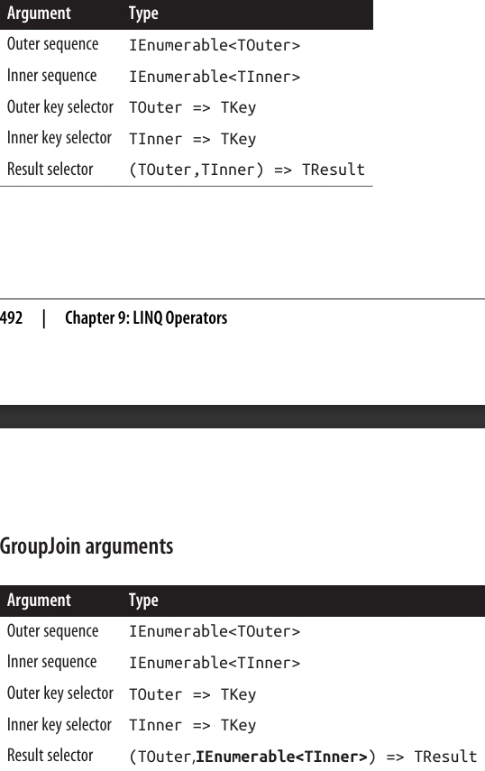 
</div>

### ✨ نحوۀ Query در LINQ

```
from outer-var in outer-enumerable
join inner-var in inner-enumerable on outer-key-expr equals inner-key-expr
[ into identifier ]
```

### 📖 مرور کلی (Overview)

🔹 **Join** و **GroupJoin** دو توالی ورودی (input sequences) را به یک توالی خروجی (output sequence) ترکیب می‌کنند.

* **Join** خروجی مسطح (flat output) تولید می‌کند.
* **GroupJoin** خروجی سلسله‌مراتبی (hierarchical output) تولید می‌کند.

✨ **Join** و **GroupJoin** یک راهبرد جایگزین برای **Select** و **SelectMany** ارائه می‌دهند.

✅ **مزیت Join و GroupJoin** این است که آن‌ها به‌شکل کارآمد روی مجموعه‌های محلی (local in-memory collections) اجرا می‌شوند، چون ابتدا توالی درونی (inner sequence) را داخل یک lookup کلیددار (keyed lookup) بارگذاری می‌کنند و به این ترتیب از نیاز به پیمایش (enumerate) مکرر روی هر عنصر داخلی جلوگیری می‌کنند.

⚠️ **عیب آن‌ها** این است که تنها معادل **inner join** و **left outer join** را ارائه می‌دهند؛ برای **cross join** و **non-equi join** همچنان باید از **Select/SelectMany** استفاده کرد.

📌 در کوئری‌های **EF Core**، استفاده از **Join** و **GroupJoin** مزیت خاصی نسبت به **Select** و **SelectMany** ندارد.

📊 جدول **۹-۱** تفاوت‌های میان هر یک از راهبردهای join را خلاصه می‌کند.

<div align="center">
    
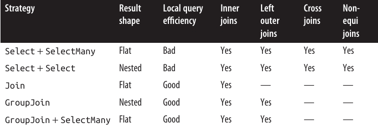 
</div>

### 🔗 Join

اپراتور **Join** یک **inner join** انجام می‌دهد و یک توالی خروجی مسطح (flat output sequence) تولید می‌کند.

🔹 مثال زیر، همۀ مشتریان (customers) را همراه با خریدهایشان (purchases) فهرست می‌کند، بدون اینکه از ویژگی ناوبری (navigation property) استفاده شود:

```csharp
IQueryable<string> query =
  from c in dbContext.Customers
  join p in dbContext.Purchases on c.ID equals p.CustomerID
  select c.Name + " bought a " + p.Description;
```

📋 نتایج دقیقاً همان چیزی است که با یک کوئری به سبک **SelectMany** به دست می‌آید:

```
Tom bought a Bike
Tom bought a Holiday
Dick bought a Phone
Harry bought a Car
```

---

### ⚡ مزیت Join در برابر SelectMany

برای دیدن مزیت **Join** در مقایسه با **SelectMany**، باید کوئری را به حالت محلی (local query) تبدیل کنیم.

اول، تمام مشتریان و خریدها را در آرایه‌ها کپی می‌کنیم و سپس روی آرایه‌ها کوئری می‌زنیم:

```csharp
Customer[] customers = dbContext.Customers.ToArray();
Purchase[] purchases = dbContext.Purchases.ToArray();

var slowQuery = from c in customers
                from p in purchases
                where c.ID == p.CustomerID
                select c.Name + " bought a " + p.Description;

var fastQuery = from c in customers
                join p in purchases on c.ID equals p.CustomerID
                select c.Name + " bought a " + p.Description;
```

هر دو کوئری نتیجه یکسانی برمی‌گردانند، اما کوئری با **Join** به‌مراتب سریع‌تر است. دلیلش این است که پیاده‌سازی در **Enumerable**، مجموعه داخلی (purchases) را ابتدا به‌صورت یک **keyed lookup** بارگذاری می‌کند.

---

### 📝 نحوۀ کلی Join

نحوۀ نوشتن **join** به‌طور کلی به شکل زیر است:

```
join inner-var in inner-sequence on outer-key-expr equals inner-key-expr
```

اپراتورهای **Join** در LINQ بین توالی بیرونی (outer sequence) و توالی درونی (inner sequence) تمایز قائل می‌شوند.

* ✅ **outer sequence** → همان توالی ورودی است (در این مثال، customers).
* ✅ **inner sequence** → مجموعه جدیدی است که معرفی می‌کنید (در این مثال، purchases).

📌 **Join** فقط **inner join** انجام می‌دهد؛ یعنی مشتریانی که خریدی ندارند از خروجی حذف می‌شوند.
در **inner join** می‌توانید توالی بیرونی و درونی را با هم جابه‌جا کنید و همچنان نتیجه یکسانی بگیرید:

```csharp
from p in purchases                                // p حالا outer است
join c in customers on p.CustomerID equals c.ID    // c حالا inner است
...
```

---

### 🧩 چندین Join در یک کوئری

شما می‌توانید چندین عبارت **join** در یک کوئری اضافه کنید.
مثلاً اگر هر خرید (purchase) یک یا چند آیتم خرید (purchase items) داشته باشد:

```csharp
from c in customers
join p in purchases on c.ID equals p.CustomerID           // first join
join pi in purchaseItems on p.ID equals pi.PurchaseID     // second join
...
```

📌 در اینجا، `purchases` در اولین join به‌عنوان **inner sequence** عمل می‌کند و در دومین join به‌عنوان **outer sequence**.

معادل ناکارآمد همین کار با **foreach** به شکل زیر است:

```csharp
foreach (Customer c in customers)
  foreach (Purchase p in purchases)
    if (c.ID == p.CustomerID)
      foreach (PurchaseItem pi in purchaseItems)
        if (p.ID == pi.PurchaseID)
          Console.WriteLine (c.Name + "," + p.Price + "," + pi.Detail);
```

در نحوۀ Query، متغیرهای joinهای قبلی همچنان در دسترس هستند—دقیقاً مثل کاری که در کوئری‌های به سبک **SelectMany** اتفاق می‌افتد.
همچنین می‌توانید بین joinها، از **where** و **let** استفاده کنید.

---

### 🔑 Join با چند کلید

می‌توانید روی چند کلید به‌طور همزمان join انجام دهید. برای این کار از **anonymous types** استفاده می‌شود:

```csharp
from x in sequenceX
join y in sequenceY on new { K1 = x.Prop1, K2 = x.Prop2 }
                   equals new { K1 = y.Prop3, K2 = y.Prop4 }
...
```

برای اینکه این کار درست انجام شود، دو **anonymous type** باید دقیقاً یک ساختار (structure) داشته باشند.
کامپایلر هر دو را با یک نوع داخلی یکسان پیاده‌سازی می‌کند، بنابراین کلیدهای join با هم سازگار می‌شوند.

### 🔗 Join در **Fluent Syntax**

🔹 کوئری زیر در نحوۀ Query:

```csharp
from c in customers
join p in purchases on c.ID equals p.CustomerID
select new { c.Name, p.Description, p.Price };
```

به شکل **Fluent Syntax** این‌طور نوشته می‌شود:

```csharp
customers.Join(                // outer collection
    purchases,                 // inner collection
    c => c.ID,                 // outer key selector
    p => p.CustomerID,         // inner key selector
    (c, p) => new              // result selector
        { c.Name, p.Description, p.Price }
);
```

📌 عبارت **result selector** در انتها، هر عنصر خروجی را می‌سازد.

---

### 📑 افزودن عبارات دیگر (orderby و …)

اگر قبل از بخش **select** عباراتی مثل **orderby** داشته باشیم:

```csharp
from c in customers
join p in purchases on c.ID equals p.CustomerID
orderby p.Price
select c.Name + " bought a " + p.Description;
```

در **Fluent Syntax** باید یک نوع ناشناس موقت (temporary anonymous type) بسازیم تا هر دو متغیر `c` و `p` پس از join در دسترس باشند:

```csharp
customers.Join(                  // outer collection
    purchases,                   // inner collection
    c => c.ID,                   // outer key selector
    p => p.CustomerID,           // inner key selector
    (c, p) => new { c, p })      // result selector
    .OrderBy(x => x.p.Price)
    .Select(x => x.c.Name + " bought a " + x.p.Description);
```

✅ در عمل، نحوۀ Query برای join معمولاً ترجیح داده می‌شود، چون ساده‌تر و خواناتر است.

---

## 👥 GroupJoin

🔹 **GroupJoin** همان کار **Join** را انجام می‌دهد، اما به‌جای اینکه خروجی مسطح بدهد، یک خروجی سلسله‌مراتبی (hierarchical result) تولید می‌کند که بر اساس هر عنصر بیرونی (outer element) گروه‌بندی شده است.
همچنین امکان **left outer join** را فراهم می‌کند.
📌 توجه: **GroupJoin** در حال حاضر در **EF Core** پشتیبانی نمی‌شود.

---

### ✍️ نحوۀ Query برای GroupJoin

نحوۀ Query برای **GroupJoin** مثل **Join** است، اما با کلمۀ کلیدی **into** دنبال می‌شود.

🔹 یک مثال ساده با کوئری محلی:

```csharp
Customer[] customers = dbContext.Customers.ToArray();
Purchase[] purchases = dbContext.Purchases.ToArray();

IEnumerable<IEnumerable<Purchase>> query =
  from c in customers
  join p in purchases on c.ID equals p.CustomerID
  into custPurchases
  select custPurchases;   // custPurchases یک توالی است
```

📌 عبارت `into` تنها زمانی به **GroupJoin** تبدیل می‌شود که **بلافاصله بعد از یک join** بیاید.
اگر بعد از **select** یا **group** بیاید، معنایش **query continuation** است.
هر دو مورد یک ویژگی مشترک دارند: معرفی یک متغیر جدید (range variable).

🔹 خروجی یک **توالی از توالی‌ها** است که می‌توانیم آن را این‌طور پیمایش کنیم:

```csharp
foreach (IEnumerable<Purchase> purchaseSequence in query)
    foreach (Purchase p in purchaseSequence)
        Console.WriteLine(p.Description);
```

---

### 👤 استفاده کاربردی‌تر از GroupJoin

در حالت معمول، کوئری را این‌طور می‌نویسیم تا ارتباط مشتری با خریدهایش حفظ شود:

```csharp
from c in customers
join p in purchases on c.ID equals p.CustomerID
into custPurchases
select new { CustName = c.Name, custPurchases };
```

این معادل است با این کوئری (که ناکارآمد است):

```csharp
from c in customers
select new
{
    CustName = c.Name,
    custPurchases = purchases.Where(p => c.ID == p.CustomerID)
};
```

---

### 🔄 Left Outer Join در GroupJoin

به‌طور پیش‌فرض، **GroupJoin** معادل یک **left outer join** است.
برای گرفتن **inner join** (حذف مشتریانی که خریدی ندارند)، باید روی `custPurchases` فیلتر بزنید:

```csharp
from c in customers
join p in purchases on c.ID equals p.CustomerID
into custPurchases
where custPurchases.Any()
select ...
```

📌 عبارات بعد از **group-join into** روی **زیرتوالی‌ها (subsequences)** عمل می‌کنند، نه روی تک‌تک عناصر.
پس اگر بخواهید روی خریدهای منفرد فیلتر کنید، باید قبل از join از **Where** استفاده کنید:

```csharp
from c in customers
join p in purchases.Where(p2 => p2.Price > 1000)
     on c.ID equals p.CustomerID
into custPurchases ...
```

همچنین می‌توانید کوئری‌های **lambda** با **GroupJoin** درست مثل **Join** بسازید.

---

## 🪄 Flat Outer Joins

گاهی می‌خواهید هم **outer join** داشته باشید و هم یک خروجی مسطح (flat result set).

* **GroupJoin** → outer join می‌دهد.
* **Join** → خروجی مسطح می‌دهد.

📌 راه‌حل: اول **GroupJoin**، بعد **DefaultIfEmpty** روی هر زیرتوالی، و در نهایت **SelectMany**:

```csharp
from c in customers
join p in purchases on c.ID equals p.CustomerID into custPurchases
from cp in custPurchases.DefaultIfEmpty()
select new
{
    CustName = c.Name,
    Price = cp == null ? (decimal?) null : cp.Price
};
```

✅ اگر زیرتوالی خریدها خالی باشد، **DefaultIfEmpty** یک توالی با مقدار null تولید می‌کند.
عبارت دوم **from** به **SelectMany** ترجمه می‌شود و همه زیرتوالی‌های خرید را گسترش داده و در یک توالی واحد از عناصر خرید مسطح می‌کند.

### 🔍 Joining with Lookups

اپراتورهای **Join** و **GroupJoin** در کلاس **Enumerable** در دو مرحله عمل می‌کنند:

1. ابتدا توالی درونی (inner sequence) را داخل یک **lookup** بارگذاری می‌کنند.
2. سپس توالی بیرونی (outer sequence) را در ترکیب با lookup پردازش می‌کنند.

---

### 📦 Lookup چیست؟

یک **lookup** در واقع مجموعه‌ای از گروه‌ها (groupings) است که می‌توان به‌طور مستقیم با کلید (key) به آن‌ها دسترسی داشت.
می‌توانید آن را مثل یک **دیکشنری از توالی‌ها** تصور کنید—یک دیکشنری که می‌تواند چندین عنصر را زیر یک کلید نگه دارد (گاهی به آن **multidictionary** می‌گویند).

📌 Lookup فقط خواندنی (read-only) است و رابط آن به شکل زیر تعریف می‌شود:

```csharp
public interface ILookup<TKey, TElement> :
    IEnumerable<IGrouping<TKey, TElement>>, IEnumerable
{
    int Count { get; }
    bool Contains(TKey key);
    IEnumerable<TElement> this[TKey key] { get; }
}
```

---

### ⏳ اجرای Lazy

مثل سایر اپراتورهای LINQ که خروجی تولید می‌کنند، اپراتورهای join نیز **Deferred Execution** یا **Lazy Execution** دارند.
یعنی **lookup** ساخته نمی‌شود تا زمانی که پیمایش (enumeration) خروجی شروع شود—و در آن لحظه کل lookup یکجا ساخته می‌شود.

---

### 🛠 ساختن Lookup دستی

می‌توانید lookup را به‌طور دستی بسازید و کوئری بزنید. این کار چند مزیت دارد:

* ✅ می‌توانید یک lookup را در چندین کوئری و حتی در کد دستوری (imperative code) معمولی استفاده کنید.
* ✅ پرس‌وجو (query) از lookup یک راه عالی برای درک نحوۀ کار **Join** و **GroupJoin** است.

🔹 متد **ToLookup** یک lookup می‌سازد. مثال: بارگذاری تمام خریدها (purchases) در یک lookup که بر اساس **CustomerID** کلیدگذاری شده است:

```csharp
ILookup<int?, Purchase> purchLookup =
    purchases.ToLookup(p => p.CustomerID, p => p);
```

* آرگومان اول → کلید (CustomerID).
* آرگومان دوم → مقادیری که به‌عنوان value در lookup ذخیره می‌شوند.

---

### 📖 خواندن از Lookup

خواندن از یک lookup شبیه خواندن از یک دیکشنری است، با این تفاوت که **Indexer** یک توالی از آیتم‌های منطبق برمی‌گرداند (نه فقط یک آیتم).

```csharp
foreach (Purchase p in purchLookup[1])
    Console.WriteLine(p.Description);
```

این کد تمام خریدهای مشتری با ID برابر 1 را نمایش می‌دهد.

---

### ⚡ کارایی Lookup مثل Join/GroupJoin

وقتی یک lookup داشته باشید، می‌توانید کوئری‌های **SelectMany/Select** بنویسید که به‌اندازۀ کوئری‌های **Join/GroupJoin** کارآمد هستند.

🔹 **Join** معادل استفاده از **SelectMany** روی یک lookup است:

```csharp
from c in customers
from p in purchLookup[c.ID]
select new { c.Name, p.Description, p.Price };
```

📋 خروجی:

```
Tom Bike 500
Tom Holiday 2000
Dick Bike 600
Dick Phone 300
...
```

---

### 🪄 Outer Join با DefaultIfEmpty

اضافه‌کردن **DefaultIfEmpty** باعث می‌شود کوئری معادل یک **outer join** شود:

```csharp
from c in customers
from p in purchLookup[c.ID].DefaultIfEmpty()
select new
{
    c.Name,
    Descript = p == null ? null : p.Description,
    Price = p == null ? (decimal?) null : p.Price
};
```

---

### 🧩 GroupJoin معادل Lookup

**GroupJoin** معادل این است که lookup را داخل projection بخوانیم:

```csharp
from c in customers
select new
{
    CustName = c.Name,
    CustPurchases = purchLookup[c.ID]
};
```

---

## ⚙️ پیاده‌سازی Enumerable.Join

ساده‌ترین پیاده‌سازی معتبر **Enumerable.Join** (بدون درنظر گرفتن null-check):

```csharp
public static IEnumerable<TResult> Join
    <TOuter, TInner, TKey, TResult>(
        this IEnumerable<TOuter> outer,
        IEnumerable<TInner> inner,
        Func<TOuter, TKey> outerKeySelector,
        Func<TInner, TKey> innerKeySelector,
        Func<TOuter, TInner, TResult> resultSelector)
{
    ILookup<TKey, TInner> lookup = inner.ToLookup(innerKeySelector);
    return
        from outerItem in outer
        from innerItem in lookup[outerKeySelector(outerItem)]
        select resultSelector(outerItem, innerItem);
}
```

---

## ⚙️ پیاده‌سازی Enumerable.GroupJoin

پیاده‌سازی **GroupJoin** شبیه Join است، اما ساده‌تر:

```csharp
public static IEnumerable<TResult> GroupJoin
    <TOuter, TInner, TKey, TResult>(
        this IEnumerable<TOuter> outer,
        IEnumerable<TInner> inner,
        Func<TOuter, TKey> outerKeySelector,
        Func<TInner, TKey> innerKeySelector,
        Func<TOuter, IEnumerable<TInner>, TResult> resultSelector)
{
    ILookup<TKey, TInner> lookup = inner.ToLookup(innerKeySelector);
    return
        from outerItem in outer
        select resultSelector(
            outerItem,
            lookup[outerKeySelector(outerItem)]);
}
```

---

## 🔗 The Zip Operator

```csharp
IEnumerable<TFirst>, IEnumerable<TSecond> → IEnumerable<TResult>
```

اپراتور **Zip** دو توالی را **گام‌به‌گام** (مثل زیپ) پیمایش می‌کند و با اعمال یک تابع روی هر جفت عنصر، یک توالی جدید می‌سازد.

🔹 مثال:

```csharp
int[] numbers = { 3, 5, 7 };
string[] words = { "three", "five", "seven", "ignored" };

IEnumerable<string> zip =
    numbers.Zip(words, (n, w) => n + "=" + w);
```

📋 خروجی:

```
3=three
5=five
7=seven
```

📌 عناصر اضافه در هر یک از توالی‌ها نادیده گرفته می‌شوند.
⚠️ **Zip** در **EF Core** پشتیبانی نمی‌شود.

### 📑 مرتب‌سازی (Ordering)

```
IEnumerable<TSource> → IOrderedEnumerable<TSource>
```
<div align="center">
    
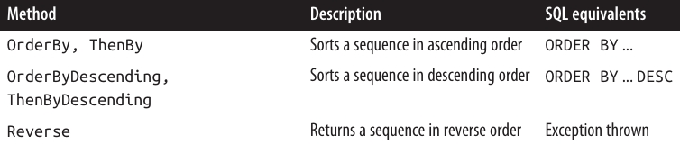 
</div>

عملگرهای مرتب‌سازی (Ordering operators) همان عناصر را بازمی‌گردانند، اما در **ترتیب متفاوت**.
### 🔀 OrderBy, OrderByDescending, ThenBy, ThenByDescending

#### 📌 آرگومان‌های OrderBy و OrderByDescending
<div align="center">
    
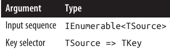 
</div>

نوع بازگشتی = `IOrderedEnumerable<TSource>`

### 🔹 آرگومان‌های ThenBy و ThenByDescending
<div align="center">
    
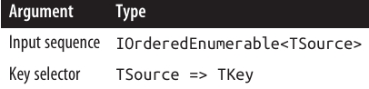 
</div>

### 📑 نحوۀ Query (Query syntax)

```
orderby expression1 [descending] [, expression2 [descending] ... ]
```

---

### 📖 مرور کلی (Overview)

* **OrderBy** نسخه‌ای مرتب‌شده از توالی ورودی را برمی‌گرداند و از **keySelector** برای مقایسه استفاده می‌کند.
* مثال: تولید یک توالی از نام‌ها به ترتیب حروف الفبا:

```csharp
IEnumerable<string> query = names.OrderBy(s => s);
```

* مرتب‌سازی بر اساس طول نام:

```csharp
IEnumerable<string> query = names.OrderBy(s => s.Length);
// نتیجه: { "Jay", "Tom", "Mary", "Dick", "Harry" };
```

* ترتیب نسبی عناصری که کلید مرتب‌سازی یکسان دارند (مثل Jay/Tom و Mary/Dick) مشخص نیست—مگر اینکه **ThenBy** اضافه کنید:

```csharp
IEnumerable<string> query = names.OrderBy(s => s.Length).ThenBy(s => s);
// نتیجه: { "Jay", "Tom", "Dick", "Mary", "Harry" };
```

* **ThenBy** تنها عناصر با همان کلید مرتب‌سازی قبلی را دوباره مرتب می‌کند.
* می‌توانید هر تعداد **ThenBy** را زنجیره‌ای استفاده کنید. مثال: ابتدا بر اساس طول، سپس کاراکتر دوم، و در نهایت کاراکتر اول:

```csharp
names.OrderBy(s => s.Length).ThenBy(s => s[1]).ThenBy(s => s[0]);
```

---

### 🔄 معادل در نحوۀ Query:

```csharp
from s in names
orderby s.Length, s[1], s[0]
select s;
```

⚠️ نمونه اشتباه: این در واقع ابتدا بر اساس `s[1]` و سپس `s.Length` مرتب می‌کند (یا در کوئری پایگاه داده فقط بر اساس `s[1]` مرتب می‌کند و ترتیب قبلی را نادیده می‌گیرد):

```csharp
from s in names
orderby s.Length
orderby s[1]
...
```

---

### 🔽 OrderByDescending و ThenByDescending

این اپراتورها همان کارهای قبلی را انجام می‌دهند اما خروجی را به ترتیب معکوس می‌دهند.

مثال EF Core: بازیابی خریدها بر اساس قیمت نزولی و در صورت برابر بودن قیمت، به ترتیب الفبایی:

```csharp
dbContext.Purchases
    .OrderByDescending(p => p.Price)
    .ThenBy(p => p.Description);
```

معادل در نحوۀ Query:

```csharp
from p in dbContext.Purchases
orderby p.Price descending, p.Description
select p;
```
### 📚 Comparers و Collations

* در یک **کوئری محلی (local query)**، خودِ اشیاء انتخاب‌شده توسط **key selector** الگوریتم مرتب‌سازی را از طریق پیاده‌سازی پیش‌فرض **IComparable** تعیین می‌کنند (رجوع کنید به فصل ۷).
* شما می‌توانید الگوریتم مرتب‌سازی را با ارسال یک شیء **IComparer** بازنویسی کنید. مثال: مرتب‌سازی **غیرحساس به حروف بزرگ/کوچک**:

```csharp
names.OrderBy(n => n, StringComparer.CurrentCultureIgnoreCase);
```

* ارسال **comparer** در نحوۀ Query یا توسط **EF Core** پشتیبانی نمی‌شود.
* هنگام کوئری زدن روی پایگاه داده، الگوریتم مقایسه توسط **Collation** ستون مربوطه تعیین می‌شود.
* اگر Collation حساس به حروف باشد، می‌توانید مرتب‌سازی غیرحساس به حروف بزرگ/کوچک را با فراخوانی `ToUpper` در **key selector** انجام دهید:

```csharp
from p in dbContext.Purchases
orderby p.Description.ToUpper()
select p;
```

---

### 🔹 IOrderedEnumerable و IOrderedQueryable

* اپراتورهای مرتب‌سازی، زیرنوع‌های خاصی از `IEnumerable<T>` را برمی‌گردانند:

  * در **Enumerable** → `IOrderedEnumerable<TSource>`
  * در **Queryable** → `IOrderedQueryable<TSource>`

* این زیرنوع‌ها اجازه می‌دهند که اپراتور **ThenBy**، ترتیب موجود را **تکمیل** کند و جایگزین نکند.

* اعضای اضافی این زیرنوع‌ها به‌صورت عمومی نمایان نیستند و شبیه توالی‌های عادی عمل می‌کنند.

🔹 مثال: ساخت کوئری مرحله‌ای

```csharp
IOrderedEnumerable<string> query1 = names.OrderBy(s => s.Length);
IOrderedEnumerable<string> query2 = query1.ThenBy(s => s);
```

⚠️ اگر `query1` از نوع `IEnumerable<string>` تعریف شود، خط دوم کامپایل نمی‌شود—چون **ThenBy** به ورودی از نوع `IOrderedEnumerable<string>` نیاز دارد.

---

### 🔹 استفاده از تایپ ضمنی (Implicit Typing)

```csharp
var query1 = names.OrderBy(s => s.Length);
var query2 = query1.ThenBy(s => s);
```

* تایپ ضمنی راحتی دارد اما می‌تواند مشکلاتی ایجاد کند:

```csharp
var query = names.OrderBy(s => s.Length);
query = query.Where(n => n.Length > 3);  // خطای زمان کامپایل
```

* کامپایلر `query` را از نوع `IOrderedEnumerable<string>` استنتاج می‌کند، اما `Where` یک `IEnumerable<string>` برمی‌گرداند که نمی‌توان آن را دوباره به `query` اختصاص داد.

✅ راه‌حل‌ها:

1. استفاده از تایپ صریح
2. یا فراخوانی `AsEnumerable()` بعد از `OrderBy`:

```csharp
var query = names.OrderBy(s => s.Length).AsEnumerable();
query = query.Where(n => n.Length > 3);  // درست
```

* معادل در کوئری‌های **interpreted**، فراخوانی `AsQueryable()` است.
## Grouping

<div align="center">
    
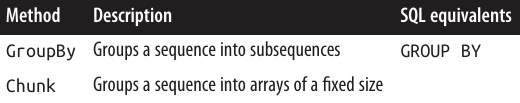 
</div>

### 📚 GroupBy

```
IEnumerable<TSource> → IEnumerable<IGrouping<TKey, TElement>>
```
<div align="center">
    
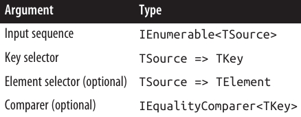 
</div>

### 📑 GroupBy

```
IEnumerable<TSource> → IEnumerable<IGrouping<TKey, TElement>>
```

---

### 🔍 نحوۀ Query (Query syntax)

```
group element-expression by key-expression
```

---

### 📖 مرور کلی (Overview)

* **GroupBy** یک توالی صاف (flat) را به توالی‌ای از گروه‌ها تبدیل می‌کند.
* مثال: گروه‌بندی تمام فایل‌های موجود در `Path.GetTempPath()` بر اساس پسوند:

```csharp
string[] files = Directory.GetFiles(Path.GetTempPath());

IEnumerable<IGrouping<string, string>> query =
    files.GroupBy(file => Path.GetExtension(file));
```

* یا با تایپ ضمنی:

```csharp
var query = files.GroupBy(file => Path.GetExtension(file));
```

---

### 🔹 پیمایش نتایج

```csharp
foreach (IGrouping<string, string> grouping in query)
{
    Console.WriteLine("Extension: " + grouping.Key);
    foreach (string filename in grouping)
        Console.WriteLine("   - " + filename);
}
```

📋 خروجی نمونه:

```
Extension: .pdf
  -- chapter03.pdf
  -- chapter04.pdf
Extension: .doc
  -- todo.doc
  -- menu.doc
  -- Copy of menu.doc
```

---

### 🛠 پیاده‌سازی داخلی

* `Enumerable.GroupBy` عناصر ورودی را داخل یک دیکشنری موقت از لیست‌ها می‌خواند تا همه عناصر با کلید مشابه در یک زیرلیست قرار گیرند.
* سپس یک توالی از **grouping**ها را تولید می‌کند.
* **Grouping** یک توالی است که دارای **Key** می‌باشد:

```csharp
public interface IGrouping<TKey, TElement> : IEnumerable<TElement>, IEnumerable
{
    TKey Key { get; }    // کلید اعمال شده روی زیرتوالی به‌صورت کلی
}
```

* به طور پیش‌فرض، عناصر هر گروه همان عناصر ورودی هستند مگر اینکه **elementSelector** مشخص کنید.
* مثال: تبدیل عناصر ورودی به حروف بزرگ:

```csharp
files.GroupBy(file => Path.GetExtension(file), file => file.ToUpper());
```

* در این حالت، **Key** هر گروه هنوز در حالت اصلی خود باقی می‌ماند.

📋 خروجی نمونه:

```
Extension: .pdf
  -- CHAPTER03.PDF
  -- CHAPTER04.PDF
Extension: .doc
  -- TODO.DOC
```

---

### ⚠️ نکات مهم

* زیرمجموعه‌ها بر اساس کلید به ترتیب الفبا صادر نمی‌شوند. **GroupBy** تنها گروه‌بندی می‌کند و مرتب‌سازی انجام نمی‌دهد.
* برای مرتب‌سازی، باید از **OrderBy** استفاده کنید:

```csharp
files.GroupBy(file => Path.GetExtension(file), file => file.ToUpper())
     .OrderBy(grouping => grouping.Key);
```

---

### 🔹 معادل در نحوۀ Query

```
group element-expr by key-expr
```

مثال:

```csharp
from file in files
group file.ToUpper() by Path.GetExtension(file);
```

* مشابه **select**، `group` یک کوئری را پایان می‌دهد مگر اینکه **query continuation clause** اضافه کنید:

```csharp
from file in files
group file.ToUpper() by Path.GetExtension(file) into grouping
orderby grouping.Key
select grouping;
```

---

### 🔹 ادامه‌ی کوئری‌ها (Query Continuations)

* ادامه‌ی کوئری پس از **group by** مفید است، مثلاً فیلتر کردن گروه‌هایی که کمتر از پنج فایل دارند:

```csharp
from file in files
group file.ToUpper() by Path.GetExtension(file) into grouping
where grouping.Count() >= 5
select grouping;
```

* یک `where` پس از `group by` معادل **HAVING** در SQL است.
* این شرط روی کل زیرتوالی یا گروه اعمال می‌شود، نه روی عناصر فردی.

---

### 🔹 مثال Aggregation

* گاهی تنها به نتیجه‌ی تجمیع روی گروه‌ها نیاز دارید و می‌توانید زیرتوالی‌ها را نادیده بگیرید:

```csharp
string[] votes = { "Dogs", "Cats", "Cats", "Dogs", "Dogs" };

IEnumerable<string> query = from vote in votes
                            group vote by vote into g
                            orderby g.Count() descending
                            select g.Key;

string winner = query.First();    // Dogs
```
### 📑 GroupBy در EF Core

* گروه‌بندی در **EF Core** به همان شکل روی پایگاه داده عمل می‌کند.
* اگر **navigation property**ها را تنظیم کرده باشید، اغلب نیازی به گروه‌بندی کمتر از حالت استاندارد SQL پیش می‌آید.

مثال: انتخاب مشتریانی که حداقل دو خرید داشته‌اند بدون نیاز به گروه‌بندی:

```csharp
from c in dbContext.Customers
where c.Purchases.Count >= 2
select c.Name + " has made " + c.Purchases.Count + " purchases";
```

* نمونه‌ای که نیاز به گروه‌بندی دارد: محاسبه کل فروش‌ها بر اساس سال:

```csharp
from p in dbContext.Purchases
group p.Price by p.Date.Year into salesByYear
select new {
    Year       = salesByYear.Key,
    TotalValue = salesByYear.Sum()
};
```

* **GroupBy** در LINQ از **GROUP BY** در SQL قدرتمندتر است، زیرا می‌توانید همه ردیف‌ها را بدون هیچ تجمیعی بازیابی کنید:

```csharp
from p in dbContext.Purchases
group p by p.Date.Year
```

⚠️ این روش در **EF Core** کار نمی‌کند.
راه‌حل ساده: قبل از گروه‌بندی `.AsEnumerable()` فراخوانی کنید تا گروه‌بندی روی کلاینت انجام شود.

* این روش تا زمانی که فیلترینگ قبل از گروه‌بندی انجام شود، کارآمد است، زیرا فقط داده‌های مورد نیاز از سرور فراخوانی می‌شوند.

* تفاوت دیگر با SQL: الزامی به پروجکت کردن متغیرها یا عبارات استفاده‌شده در گروه‌بندی یا مرتب‌سازی وجود ندارد.

---

### 🔹 گروه‌بندی با چند کلید

* می‌توانید با استفاده از **composite key** و **anonymous type** گروه‌بندی کنید:

```csharp
from n in names
group n by new { FirstLetter = n[0], Length = n.Length };
```

---

### 🔹 مقایسه‌کننده‌های سفارشی (Custom equality comparers)

* می‌توانید یک **equality comparer** سفارشی به GroupBy بدهید تا الگوریتم مقایسه‌ی کلید تغییر کند.
* به ندرت لازم است، زیرا تغییر عبارت **key selector** معمولاً کافی است.
* مثال: گروه‌بندی غیرحساس به حروف بزرگ/کوچک:

```csharp
group n by n.ToUpper()
```

---

### 📑 Chunk

```
IEnumerable<TSource> → IEnumerable<TElement[]>
```
<div align="center">
    
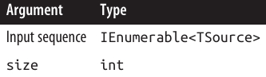 
</div>

### 📦 Chunk

* معرفی‌شده در **.NET 6**، **Chunk** یک توالی را به بلوک‌هایی (chunks) با اندازه‌ی مشخص تقسیم می‌کند (یا کمتر، اگر عناصر کافی نباشند):

```csharp
foreach (int[] chunk in new[] { 1, 2, 3, 4, 5, 6, 7, 8 }.Chunk(3))
    Console.WriteLine(string.Join(", ", chunk));
```

**خروجی:**

```
1, 2, 3
4, 5, 6
7, 8
```

---

### 🔗 Set Operators

```
IEnumerable<TSource>, IEnumerable<TSource> → IEnumerable<TSource>
```
<div align="center">
    
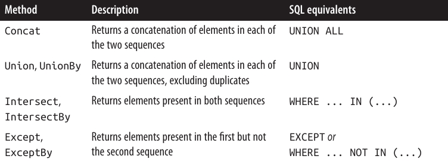 
</div>

### 🔗 Concat, Union, UnionBy

* **Concat** همه عناصر توالی اول را بازمی‌گرداند، سپس همه عناصر توالی دوم را اضافه می‌کند.
* **Union** همان کار را می‌کند اما **تکراری‌ها را حذف می‌کند**:

```csharp
int[] seq1 = { 1, 2, 3 }, seq2 = { 3, 4, 5 };

IEnumerable<int>
    concat = seq1.Concat(seq2),   // { 1, 2, 3, 3, 4, 5 }
    union  = seq1.Union(seq2);   // { 1, 2, 3, 4, 5 }
```

* مشخص کردن **نوع آرگومان** مفید است وقتی توالی‌ها نوع متفاوتی دارند ولی عناصر یک **base type** مشترک دارند.
* مثال با API بازتاب (Reflection API): متدها و پراپرتی‌ها با کلاس‌های `MethodInfo` و `PropertyInfo` نمایش داده می‌شوند که یک کلاس پایه مشترک به نام `MemberInfo` دارند.

```csharp
MethodInfo[] methods = typeof(string).GetMethods();
PropertyInfo[] props = typeof(string).GetProperties();
IEnumerable<MemberInfo> both = methods.Concat<MemberInfo>(props);
```

* مثال دیگر: فیلتر کردن متدها قبل از الحاق:

```csharp
var methods = typeof(string).GetMethods().Where(m => !m.IsSpecialName);
var props   = typeof(string).GetProperties();
var both    = methods.Concat<MemberInfo>(props);
```

* این مثال به **interface type parameter variance** وابسته است:
  `methods` از نوع `IEnumerable<MethodInfo>` است و نیاز به تبدیل **covariant** به `IEnumerable<MemberInfo>` دارد.

* **UnionBy** (معرفی شده در .NET 6) یک **keySelector** می‌گیرد که برای تعیین تکراری بودن عناصر استفاده می‌شود. مثال: union غیر حساس به حروف بزرگ/کوچک:

```csharp
string[] seq1 = { "A", "b", "C" };
string[] seq2 = { "a", "B", "c" };

var union = seq1.UnionBy(seq2, x => x.ToUpperInvariant());
// union is { "A", "b", "C" }
```

* این کار با **Union** هم قابل انجام است اگر یک **equality comparer** بدهیم:

```csharp
var union = seq1.Union(seq2, StringComparer.InvariantCultureIgnoreCase);
```

---

### 🔹 Intersect, IntersectBy, Except, ExceptBy

* **Intersect** عناصر مشترک بین دو توالی را بازمی‌گرداند.
* **Except** عناصر توالی اول که در توالی دوم نیستند را بازمی‌گرداند:

```csharp
int[] seq1 = { 1, 2, 3 }, seq2 = { 3, 4, 5 };

IEnumerable<int>
    commonality  = seq1.Intersect(seq2),    // { 3 }
    difference1  = seq1.Except(seq2),      // { 1, 2 }
    difference2  = seq2.Except(seq1);      // { 4, 5 }
```

* پیاده‌سازی داخلی **Enumerable.Except**: تمام عناصر توالی اول در یک دیکشنری بارگذاری می‌شوند، سپس تمام عناصر موجود در توالی دوم از دیکشنری حذف می‌شوند.
* معادل در SQL:

```sql
SELECT number FROM numbers1Table
WHERE number NOT IN (SELECT number FROM numbers2Table)
```

* **IntersectBy** و **ExceptBy** (از .NET 6) اجازه می‌دهند یک **key selector** مشخص کنید که قبل از مقایسه تساوی اعمال می‌شود (مشابه UnionBy).

---

### 🔹 Conversion Methods

* LINQ عمدتاً با توالی‌ها کار می‌کند (`IEnumerable<T>`).
* **Conversion methods** برای تبدیل به و از انواع دیگر مجموعه‌ها استفاده می‌شوند.
<div align="center">
    
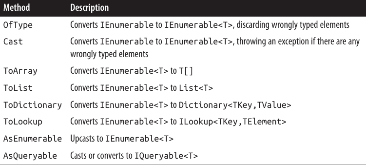 
</div>

### 🔄 OfType و Cast

* **OfType** و **Cast** یک مجموعه غیرجنریک (`IEnumerable`) را می‌گیرند و یک توالی جنریک (`IEnumerable<T>`) بازمی‌گردانند که می‌توانید روی آن عملیات LINQ انجام دهید:

```csharp
ArrayList classicList = new ArrayList(); // در System.Collections
classicList.AddRange(new int[] { 3, 4, 5 });

IEnumerable<int> sequence1 = classicList.Cast<int>();
```

* تفاوت **Cast** و **OfType** زمانی است که با عنصری ناسازگار مواجه می‌شوند:

  * **Cast**: خطا می‌دهد.
  * **OfType**: عنصر ناسازگار را نادیده می‌گیرد.

ادامه مثال بالا:

```csharp
DateTime offender = DateTime.Now;
classicList.Add(offender);

IEnumerable<int>
    sequence2 = classicList.OfType<int>(), // OK - عنصر DateTime نادیده گرفته می‌شود
    sequence3 = classicList.Cast<int>();   // استثناء می‌دهد
```

* قوانین سازگاری عناصر دقیقاً مطابق **is operator** در C# است و تنها **reference conversion** و **unboxing conversion** را در نظر می‌گیرد.

پیاده‌سازی داخلی **OfType**:

```csharp
public static IEnumerable<TSource> OfType<TSource>(IEnumerable source)
{
    foreach (object element in source)
        if (element is TSource)
            yield return (TSource)element;
}
```

پیاده‌سازی **Cast** مشابه است ولی تست سازگاری نوع را انجام نمی‌دهد:

```csharp
public static IEnumerable<TSource> Cast<TSource>(IEnumerable source)
{
    foreach (object element in source)
        yield return (TSource)element;
}
```

* نتیجه: نمی‌توانید از **Cast** برای تبدیل‌های عددی یا سفارشی استفاده کنید. برای این کار باید از **Select** استفاده کنید.

مثال:

```csharp
int[] integers = { 1, 2, 3 };

IEnumerable<long> test1 = integers.OfType<long>(); // صفر عنصر
IEnumerable<long> test2 = integers.Cast<long>();   // استثناء می‌دهد
```

* دلیل:

  * در **OfType**: `(element is long)` برای int همیشه false است.
  * در **Cast**: وقتی `TSource` یک value type است، CLR آن را unboxing فرض می‌کند، که نیاز به تطابق دقیق نوع دارد، پس خطا رخ می‌دهد.

راه‌حل: استفاده از **Select**:

```csharp
IEnumerable<long> castLong = integers.Select(s => (long)s);
```

* **OfType** و **Cast** برای **downcasting** عناصر در یک توالی جنریک نیز مفید هستند. مثال:

  * اگر توالی شما `IEnumerable<Fruit>` باشد، `OfType<Apple>` فقط سیب‌ها را بازمی‌گرداند.
  * کاربرد ویژه در **LINQ to XML** دارد (فصل ۱۰).

* **Cast** از **query syntax** نیز پشتیبانی می‌کند: کافیست نوع را قبل از متغیر محدوده مشخص کنید:

```csharp
from TreeNode node in myTreeView.Nodes
...
```

---

### 🟢 ToArray, ToList, ToDictionary, ToHashSet, ToLookup

* **ToArray**, **ToList**, و **ToHashSet** نتایج را در یک **array**، **List<T>** یا **HashSet<T>** قرار می‌دهند.
* اجرای آن‌ها موجب **enumeration فوری** توالی ورودی می‌شود (مراجعه کنید به “Deferred Execution”، صفحه ۴۳۲).
* **ToDictionary** و **ToLookup** آرگومان‌های زیر را می‌پذیرند:
<div align="center">
    
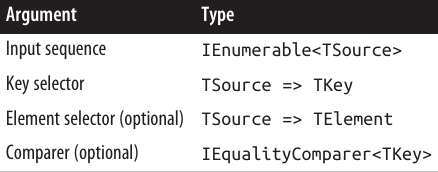 
</div>

### 🟡 ToDictionary و ToLookup

* **ToDictionary** نیز اجرای فوری (immediate execution) توالی را مجبور می‌کند و نتایج را در یک **Dictionary\<TK, TV>** قرار می‌دهد.
* **keySelector** ارائه‌شده باید برای هر عنصر مقدار **منحصر به فرد** تولید کند، در غیر این صورت **استثناء** رخ می‌دهد.
* در مقابل، **ToLookup** اجازه می‌دهد چندین عنصر با همان کلید وجود داشته باشند.
* برای توضیحات بیشتر درباره **lookups**، به بخش “Joining with lookups” صفحه ۴۹۸ مراجعه کنید.

---

### 🔹 AsEnumerable و AsQueryable

* **AsEnumerable** یک توالی را به `IEnumerable<T>` **upcast** می‌کند و باعث می‌شود کامپایلر اپراتورهای بعدی را به متدهای **Enumerable** وصل کند نه **Queryable**.
* مثال: بخش “Combining Interpreted and Local Queries”، صفحه ۴۵۲.
* **AsQueryable** یک توالی را به `IQueryable<T>` **downcast** می‌کند اگر اینترفیس را پیاده‌سازی کند؛ در غیر این صورت، یک wrapper `IQueryable<T>` روی توالی محلی می‌سازد.

---

### 🔹 Element Operators

```
IEnumerable<TSource> → TSource
```
<div align="center">
    
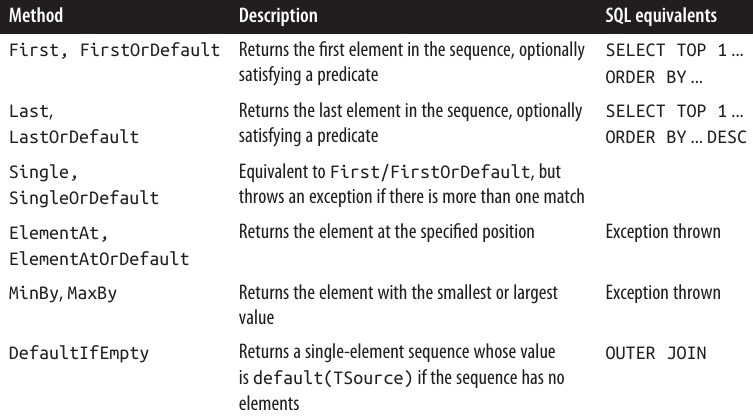 
</div>

### ⚡ Methods ending in “OrDefault”

* متدهایی که با **OrDefault** پایان می‌یابند، به جای پرتاب **exception** وقتی توالی ورودی خالی است یا هیچ عنصری با شرط داده شده مطابقت ندارد، مقدار **default(TSource)** بازمی‌گردانند.
* مقدار **default(TSource)** برای انواع مرجع (**reference types**) برابر `null`، برای نوع `bool` برابر `false` و برای انواع عددی برابر صفر است.

---

### 🔹 First, Last, and Single
<div align="center">
    
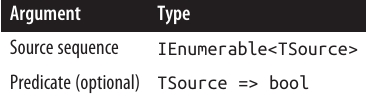 
</div>

### 🔹 First و Last

مثال زیر **First** و **Last** را نشان می‌دهد:

```csharp
int[] numbers  = { 1, 2, 3, 4, 5 };
int first      = numbers.First();                     // 1
int last       = numbers.Last();                      // 5
int firstEven  = numbers.First(n => n % 2 == 0);     // 2
int lastEven   = numbers.Last(n => n % 2 == 0);      // 4
```

مثال **First** در مقابل **FirstOrDefault**:

```csharp
int firstBigError  = numbers.First(n => n > 10);      // Exception
int firstBigNumber = numbers.FirstOrDefault(n => n > 10); // 0
```

---

### 🔹 Single و SingleOrDefault

* **Single** نیاز دارد که **دقیقا یک عنصر** با شرط داده شده وجود داشته باشد.
* **SingleOrDefault** اجازه می‌دهد **صفر یا یک عنصر** وجود داشته باشد.

مثال‌ها:

```csharp
int onlyDivBy3 = numbers.Single(n => n % 3 == 0);      // 3
int divBy2Err  = numbers.Single(n => n % 2 == 0);      // خطا: 2 و 4 مطابقت دارند
int singleError = numbers.Single(n => n > 10);         // خطا
int noMatches   = numbers.SingleOrDefault(n => n > 10); // 0
int divBy2Error = numbers.SingleOrDefault(n => n % 2 == 0); // خطا
```

* **Single** سخت‌گیرترین عضو خانواده element operators است.

* **FirstOrDefault** و **LastOrDefault** بیشترین تحمل را دارند.

* در **EF Core**، **Single** اغلب برای واکشی یک ردیف از جدول بر اساس **primary key** استفاده می‌شود:

```csharp
Customer cust = dataContext.Customers.Single(c => c.ID == 3);
```

---

### 🔹 ElementAt
<div align="center">
    
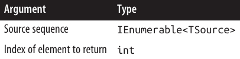 
</div>

### 🔹 ElementAt و ElementAtOrDefault

* **ElementAt** عنصر nام توالی را برمی‌گرداند:

```csharp
int[] numbers  = { 1, 2, 3, 4, 5 };
int third      = numbers.ElementAt(2);          // 3
int tenthError = numbers.ElementAt(9);          // Exception
int tenth      = numbers.ElementAtOrDefault(9); // 0
```

* اگر توالی ورودی **IList<T>** باشد، **ElementAt** از indexer آن استفاده می‌کند؛ در غیر این صورت، n بار شمارش می‌کند و سپس عنصر بعدی را برمی‌گرداند.
* **ElementAt** در **EF Core** پشتیبانی نمی‌شود.

---

### 🔹 MinBy و MaxBy

* معرفی‌شده در **.NET 6**، **MinBy** و **MaxBy** عنصری با کوچک‌ترین یا بزرگ‌ترین مقدار (بر اساس **keySelector**) را برمی‌گردانند:

```csharp
string[] names = { "Tom", "Dick", "Harry", "Mary", "Jay" };
Console.WriteLine(names.MaxBy(n => n.Length));   // Harry
```

* در مقابل، **Min** و **Max** خود **مقدار کوچک‌ترین یا بزرگ‌ترین** را برمی‌گردانند:

```csharp
Console.WriteLine(names.Max(n => n.Length));    // 5
```

* اگر دو یا چند عنصر مقدار حداقل/حداکثر یکسان داشته باشند، **MinBy/MaxBy** اولین عنصر را بازمی‌گردانند:

```csharp
Console.WriteLine(names.MinBy(n => n.Length));  // Tom
```

* اگر توالی خالی باشد، **MinBy** و **MaxBy** مقدار **null** برمی‌گردانند اگر نوع عنصر nullable باشد؛ در غیر این صورت استثناء رخ می‌دهد.

---

### 🔹 DefaultIfEmpty

* **DefaultIfEmpty** توالی‌ای با یک عنصر شامل **default(TSource)** برمی‌گرداند اگر توالی ورودی خالی باشد؛ در غیر این صورت توالی ورودی را بدون تغییر بازمی‌گرداند.
* این متد در نوشتن **flat outer joins** کاربرد دارد: بخش‌های “Outer joins with SelectMany” صفحه ۴۹۱ و “Flat outer joins” صفحه ۴۹۷.

---

### 🔹 Aggregation Methods

```
IEnumerable<TSource> → scalar
```
<div align="center">
    
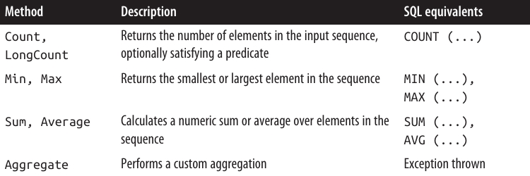 
</div>

### 🔹 Count و LongCount

<div align="center">
    
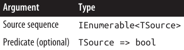 
</div>


* **Count** به سادگی توالی را شمارش می‌کند و تعداد عناصر را بازمی‌گرداند:

```csharp
int fullCount = new int[] { 5, 6, 7 }.Count();   // 3
```

* پیاده‌سازی داخلی **Enumerable.Count** بررسی می‌کند که آیا توالی ورودی **ICollection<T>** را پیاده‌سازی کرده است یا خیر.

  * اگر پیاده‌سازی شده باشد، مستقیماً از **ICollection<T>.Count** استفاده می‌کند.
  * در غیر این صورت، هر عنصر را شمارش می‌کند و یک شمارنده را افزایش می‌دهد.

* می‌توان یک **predicate** هم ارائه داد تا فقط عناصر مطابق شرط شمارش شوند:

```csharp
int digitCount = "pa55w0rd".Count(c => char.IsDigit(c));   // 3
```

* **LongCount** همان کار **Count** را انجام می‌دهد اما نتیجه را به صورت **int64 (long)** برمی‌گرداند و مناسب توالی‌هایی با بیش از دو میلیارد عنصر است.

---

### 🔹 Min و Max

<div align="center">
    
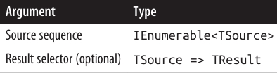 
</div>


* **Min** و **Max** کوچک‌ترین یا بزرگ‌ترین عنصر یک توالی را برمی‌گردانند:

```csharp
int[] numbers = { 28, 32, 14 };
int smallest = numbers.Min();  // 14
int largest  = numbers.Max();  // 32
```

* اگر یک **selector** ارائه دهید، هر عنصر ابتدا به صورت دلخواه تبدیل می‌شود و سپس مقایسه انجام می‌شود:

```csharp
int smallestMod = numbers.Max(n => n % 10);  // 8
```

* اگر عناصر خودشان قابل مقایسه نباشند (**IComparable<T>** پیاده‌سازی نکرده باشند)، ارائه **selector** الزامی است:

```csharp
Purchase runtimeError = dbContext.Purchases.Min();             // خطا
decimal? lowestPrice = dbContext.Purchases.Min(p => p.Price);  // صحیح
```

* **Selector** تعیین می‌کند که چگونه عناصر مقایسه شوند و همچنین نوع نتیجه نهایی چیست. در مثال بالا، نتیجه نهایی **decimal** است نه شیء **Purchase**.
* برای به دست آوردن ارزان‌ترین خرید، باید از **subquery** استفاده کنید:

```csharp
Purchase cheapest = dbContext.Purchases
    .Where(p => p.Price == dbContext.Purchases.Min(p2 => p2.Price))
    .FirstOrDefault();
```

* در این حالت می‌توان بدون استفاده از تجمیع (**aggregation**) نیز پرس‌وجو را با **OrderBy** و سپس **FirstOrDefault** نوشت.

---

### 🔹 Sum و Average

<div align="center">
    
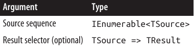 
</div>


* **Sum** و **Average** اپراتورهای تجمیعی (**aggregation**) هستند و به شکلی مشابه با **Min** و **Max** استفاده می‌شوند:

```csharp
decimal[] numbers  = { 3, 4, 8 };
decimal sumTotal   = numbers.Sum();     // 15
decimal average    = numbers.Average(); // 5  (میانگین)
```

* مثال دیگر: مجموع طول رشته‌ها در آرایه **names**:

```csharp
int combinedLength = names.Sum(s => s.Length);   // 19
```

* **Sum** و **Average** محدودیت‌هایی در نوع داده دارند و فقط برای انواع عددی (int, long, float, double, decimal و نسخه nullable آنها) تعریف شده‌اند.
* در مقابل، **Min** و **Max** می‌توانند روی هر چیزی که **IComparable<T>** را پیاده‌سازی کرده باشد، مانند رشته‌ها، عمل کنند.
* همچنین، **Average** همیشه نتیجه‌ای از نوع **decimal**، **float** یا **double** برمی‌گرداند، مطابق جدول زیر:

<div align="center">
    
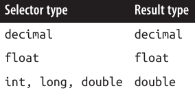 
</div>

### 🔹 Aggregate و مسائل مرتبط

* **Average** به‌طور ضمنی مقادیر ورودی را ارتقا می‌دهد تا از دست رفتن دقت جلوگیری شود. به همین دلیل مثال زیر کامپایل نمی‌شود:

```csharp
int avg = new int[] { 3, 4 }.Average(); // خطا: cannot convert double to int
```

* اما این نمونه کامپایل می‌شود:

```csharp
double avg = new int[] { 3, 4 }.Average(); // 3.5
```

* اگر نیاز باشد، می‌توانیم عنصر ورودی را به صراحت تبدیل کنیم:

```csharp
double avg = numbers.Average(n => (double)n);
```

* هنگام کوئری زدن به پایگاه داده، **Sum** و **Average** به عملیات تجمیعی استاندارد SQL ترجمه می‌شوند. مثال:

```csharp
from c in dbContext.Customers
where c.Purchases.Average(p => p.Price) > 500
select c.Name;
```

---

### 🔹 Aggregate

* **Aggregate** اجازه می‌دهد الگوریتم تجمیع سفارشی خود را پیاده‌سازی کنید. این متد در EF Core پشتیبانی نمی‌شود و کاربرد آن در موارد خاص است. مثال مشابه با **Sum**:

```csharp
int[] numbers = { 1, 2, 3 };
int sum = numbers.Aggregate(0, (total, n) => total + n); // 6
```

* پارامتر اول (**seed**) نقطه شروع تجمیع است و پارامتر دوم الگوریتم به‌روزرسانی مقدار تجمعی با دریافت هر عنصر جدید است.

* می‌توان پارامتر سوم را هم ارائه داد تا نتیجه نهایی از مقدار تجمعی استخراج شود.

* اکثر موارد استفاده **Aggregate** می‌توانند با یک حلقه **foreach** ساده حل شوند، اما مزیت **Aggregate** در عملیات‌های پیچیده یا بزرگ این است که با **PLINQ** می‌توان به‌صورت موازی اجرا کرد.

---

### 🔹 تجمیع بدون Seed

* می‌توان **seed** را حذف کرد. در این حالت، عنصر اول به‌صورت ضمنی **seed** شده و تجمیع از عنصر دوم آغاز می‌شود:

```csharp
int[] numbers = { 1, 2, 3 };
int sum = numbers.Aggregate((total, n) => total + n); // 6
```

* مثال دیگر با ضرب:

```csharp
int[] numbers = { 1, 2, 3 };
int x = numbers.Aggregate(0, (prod, n) => prod * n); // 0*1*2*3 = 0
int y = numbers.Aggregate((prod, n) => prod * n);   // 1*2*3 = 6
```

* تجمیع بدون **seed** مزیت اجرای موازی بدون overload خاص را دارد، اما نکات خطرناکی نیز دارد.

---

### ⚠️ مشکلات تجمیع بدون Seed

* توابع غیر جابجایی و غیر ترکیبی (**non-commutative / non-associative**) می‌توانند نتایج غیرمنتظره یا غیرقطعی تولید کنند.
* مثال:

```csharp
int[] numbers = { 2, 3, 4 };
int sum = numbers.Aggregate((total, n) => total + n * n); // 27
```

* به جای محاسبه صحیح ۲*۲ + ۳*۳ + ۴\*۴ = ۲۹، مقدار ۲۷ محاسبه شد.

* راه حل‌ها:

  1. تبدیل به تجمیع با **seed**:

```csharp
int[] numbers = { 0, 2, 3, 4 };
```

2. بازنویسی تابع تجمیع به صورت جابجایی و ترکیبی:

```csharp
int sum = numbers.Select(n => n * n).Aggregate((total, n) => total + n);
```

* در سناریوهای ساده، بهتر است از **Sum** و **Average** استفاده شود. مثال محاسبه **Root-Mean-Square**:

```csharp
Math.Sqrt(numbers.Average(n => n * n));
```

* مثال محاسبه انحراف معیار:

```csharp
double mean = numbers.Average();
double sdev = Math.Sqrt(numbers.Average(n => {
    double dif = n - mean;
    return dif * dif;
}));
```

* این روش‌ها ایمن، کارآمد و کاملاً موازی‌پذیر هستند.

---

### 🔹 Quantifiers

`IEnumerable<TSource>` → `bool`
<div align="center">
    
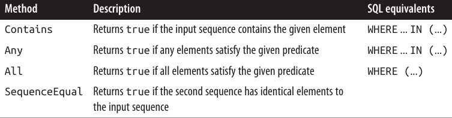 
</div>

### 🔹 Contains و Any

* متد **Contains** یک عنصر از نوع `TSource` می‌پذیرد و بررسی می‌کند آیا آن عنصر در توالی وجود دارد یا خیر.
* متد **Any** یک شرط اختیاری (**predicate**) می‌گیرد و بررسی می‌کند آیا حداقل یک عنصر با شرط داده‌شده وجود دارد یا خیر.

مثال‌ها:

```csharp
bool hasAThree = new int[] { 2, 3, 4 }.Contains(3);       // true
bool hasAThree = new int[] { 2, 3, 4 }.Any(n => n == 3);  // true
```

* **Any** می‌تواند همه‌ی کارهایی که **Contains** انجام می‌دهد را انجام دهد و حتی بیشتر:

```csharp
bool hasABigNumber = new int[] { 2, 3, 4 }.Any(n => n > 10); // false
```

* فراخوانی **Any** بدون شرط، بررسی می‌کند که آیا توالی حداقل یک عنصر دارد یا خیر:

```csharp
bool hasABigNumber = new int[] { 2, 3, 4 }.Where(n => n > 10).Any();
```

* **Any** در زیرکوئری‌ها و کوئری‌های پایگاه داده بسیار مفید است. مثال:

```csharp
from c in dbContext.Customers
where c.Purchases.Any(p => p.Price > 1000)
select c
```

---

### 🔹 All و SequenceEqual

* **All** بررسی می‌کند که آیا همه عناصر شرط داده‌شده را رعایت می‌کنند یا خیر. مثال:

```csharp
dbContext.Customers.Where(c => c.Purchases.All(p => p.Price < 100));
```

* **SequenceEqual** دو توالی را با هم مقایسه می‌کند. برای بازگرداندن `true`، هر دو توالی باید عناصر یکسان و با همان ترتیب داشته باشند. می‌توان از **equality comparer** دلخواه استفاده کرد؛ پیش‌فرض `EqualityComparer<T>.Default` است.

---

### 🔹 Generation Methods

`void` → `IEnumerable<TResult>`

<div align="center">
    
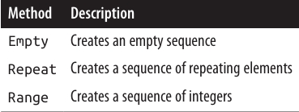 
</div>

### 🔹 Empty, Repeat و Range

متدهای **Empty**، **Repeat** و **Range** متدهای ایستا (**static**) هستند و توالی‌های ساده محلی را تولید می‌کنند.

---

#### 🔹 Empty

متد **Empty** یک توالی خالی تولید می‌کند و تنها نیاز به نوع داده دارد:

```csharp
foreach (string s in Enumerable.Empty<string>())
    Console.Write(s);   // <چیزی نمایش داده نمی‌شود>
```

در ترکیب با عملگر `??`، **Empty** عکس **DefaultIfEmpty** عمل می‌کند.

مثال: فرض کنید یک آرایه‌ی jagged از اعداد صحیح داریم و می‌خواهیم همه‌ی اعداد را در یک لیست صاف جمع کنیم. کوئری **SelectMany** زیر در صورت وجود آرایه‌ی null داخلی با خطا مواجه می‌شود:

```csharp
int[][] numbers =
{
    new int[] { 1, 2, 3 },
    new int[] { 4, 5, 6 },
    null                     // این null باعث شکست کوئری می‌شود
};

IEnumerable<int> flat = numbers.SelectMany(innerArray => innerArray);
```

استفاده از **Empty** همراه با `??` مشکل را حل می‌کند:

```csharp
IEnumerable<int> flat = numbers
    .SelectMany(innerArray => innerArray ?? Enumerable.Empty<int>());

foreach (int i in flat)
    Console.Write(i + " ");     // 1 2 3 4 5 6
```

---

#### 🔹 Range و Repeat

* **Range**: یک مقدار شروع و تعداد عناصر (هر دو از نوع `int`) می‌گیرد و توالی تولید می‌کند:

```csharp
foreach (int i in Enumerable.Range(5, 3))
    Console.Write(i + " ");    // 5 6 7
```

* **Repeat**: عنصری برای تکرار و تعداد دفعات تکرار آن را می‌گیرد:

```csharp
foreach (bool x in Enumerable.Repeat(true, 3))
    Console.Write(x + " ");    // True True True
```


</div>