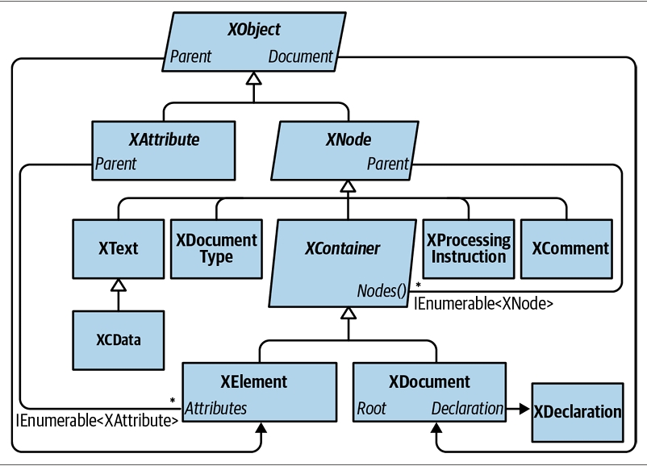
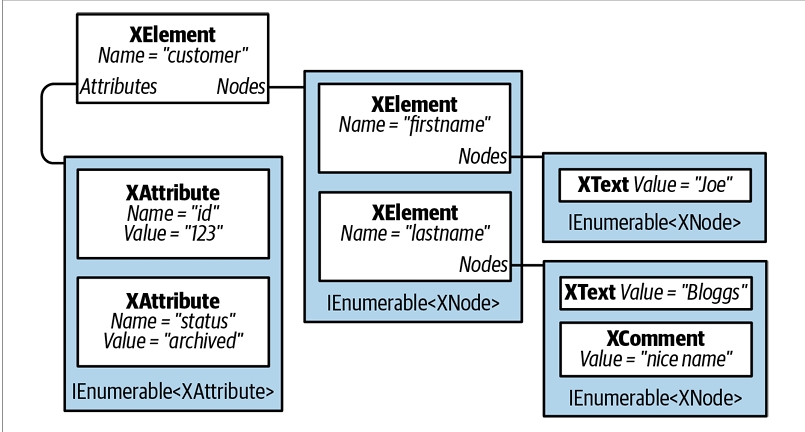
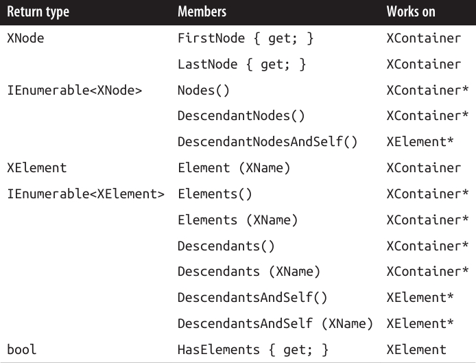
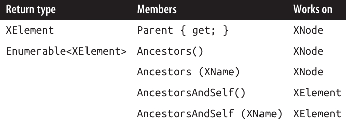
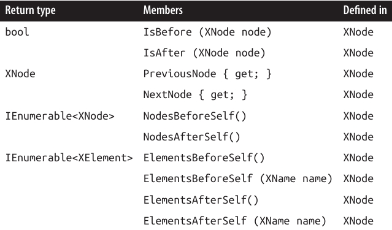
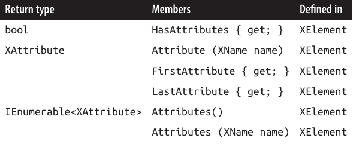
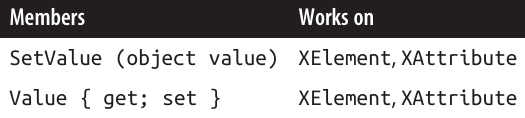
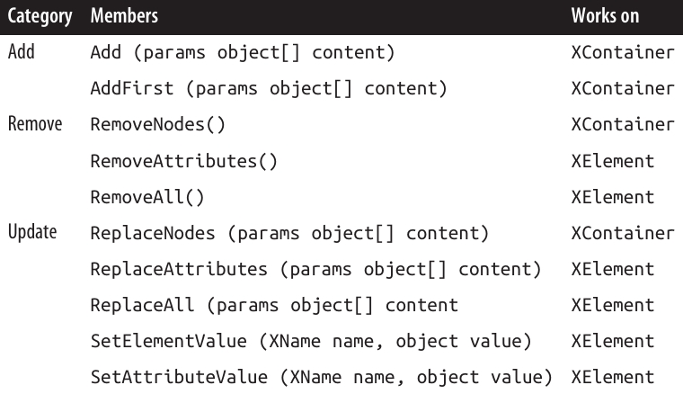
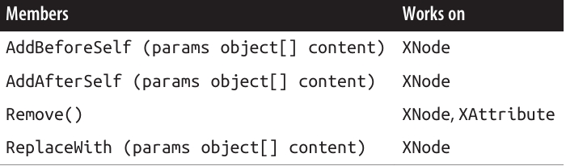

<div dir="rtl">

# فصل دهم:  LINQ to XML

.NET تعداد زیادی API برای کار با داده‌های XML فراهم می‌کند. انتخاب اصلی برای پردازش عمومی اسناد XML، **LINQ to XML** است.
LINQ to XML شامل یک مدل شیء سند XML (**DOM**) سبک و سازگار با LINQ است، به‌علاوه مجموعه‌ای از عملگرهای پرس‌وجوی تکمیلی.

در این فصل، ما به‌طور کامل روی LINQ to XML تمرکز می‌کنیم. در فصل ۱۱، به **خواننده/نویسنده XML** یک‌طرفه (forward-only) می‌پردازیم و در ضمیمه‌ی آنلاین، نوع‌هایی برای کار با **schemaها** و **stylesheetها** را پوشش می‌دهیم. .NET همچنین شامل DOM قدیمی مبتنی بر **XmlDocument** است که ما آن را پوشش نمی‌دهیم.

DOM مربوط به LINQ to XML بسیار خوب طراحی شده و از نظر کارایی بسیار قوی است. حتی بدون LINQ، این DOM به‌عنوان یک لایه‌ی سبک روی کلاس‌های سطح پایین **XmlReader** و **XmlWriter** ارزشمند است.

تمام نوع‌های LINQ to XML در فضای نام **System.Xml.Linq** تعریف شده‌اند.

---

## 🏛 نمای کلی معماری (Architectural Overview)

این بخش با معرفی بسیار کوتاهی از مفهوم **DOM** شروع می‌شود و سپس منطق پشت DOM در LINQ to XML را توضیح می‌دهد.

---

### ❓ DOM چیست؟ (What Is a DOM?)

به فایل XML زیر توجه کنید:

```xml
<?xml version="1.0" encoding="utf-8"?>
<customer id="123" status="archived">
  <firstname>Joe</firstname>
  <lastname>Bloggs</lastname>
</customer>
```

همان‌طور که در همه‌ی فایل‌های XML وجود دارد، ما با یک **اعلان (declaration)** شروع می‌کنیم و سپس یک عنصر ریشه (**root element**) داریم که نام آن `customer` است.
عنصر `customer` دو ویژگی (**attribute**) دارد، هرکدام با یک نام (id و status) و مقدار ("123" و "archived").
درون `customer`، دو عنصر فرزند (**child element**) وجود دارد: `firstname` و `lastname`، که هرکدام محتوای متنی ساده‌ای ("Joe" و "Bloggs") دارند.

هرکدام از این ساختارها—اعلان، عنصر، ویژگی، مقدار، و محتوای متنی—می‌توانند با یک **کلاس (class)** نمایش داده شوند. و اگر چنین کلاس‌هایی خصوصیت‌های مجموعه‌ای (**collection properties**) برای ذخیره‌ی محتوای فرزند داشته باشند، می‌توانیم یک **درخت از اشیاء** بسازیم که یک سند را به‌طور کامل توصیف کند.
به این مدل، **Document Object Model** یا **DOM** گفته می‌شود.

---

### 🧩 DOM در LINQ to XML

LINQ to XML از دو بخش تشکیل شده است:

* یک DOM مربوط به XML که آن را **X-DOM** می‌نامیم.
* مجموعه‌ای از حدود ۱۰ عملگر پرس‌وجوی تکمیلی.

همان‌طور که انتظار می‌رود، **X-DOM** شامل نوع‌هایی مثل **XDocument**، **XElement** و **XAttribute** است.
نکته‌ی جالب این است که نوع‌های X-DOM به LINQ وابسته نیستند—شما می‌توانید یک X-DOM را بارگذاری (load)، نمونه‌سازی (instantiate)، به‌روزرسانی (update) و ذخیره (save) کنید بدون آنکه هیچ پرس‌وجوی LINQ بنویسید.

برعکس، شما می‌توانید از LINQ برای پرس‌وجو در یک DOM که با نوع‌های قدیمی و سازگار با **W3C** ساخته شده، استفاده کنید. با این حال، این کار محدودکننده و آزاردهنده خواهد بود.
ویژگی متمایز **X-DOM** این است که سازگار با LINQ (**LINQ-friendly**) است، یعنی:

* متدهایی دارد که توالی‌های **IEnumerable** مفیدی تولید می‌کنند که می‌توانید روی آن‌ها پرس‌وجو کنید.
* سازنده‌های آن به‌گونه‌ای طراحی شده‌اند که می‌توانید یک درخت X-DOM را از طریق یک **LINQ projection** بسازید.

---

### 📊 نمای کلی X-DOM

شکل ۱۰-۱ نوع‌های اصلی X-DOM را نشان می‌دهد.
پرکاربردترین این نوع‌ها **XElement** است.
**XObject** ریشه‌ی سلسله‌مراتب وراثت است؛ و **XElement** و **XDocument** ریشه‌های سلسله‌مراتب دربرگیری (**containership hierarchy**) هستند.


<div align="center">
    
 
</div>

شکل ۱۰-۲ درخت X-DOM ساخته‌شده از کد زیر را نشان می‌دهد:

```csharp
string xml = @"<customer id='123' status='archived'>
                 <firstname>Joe</firstname>
                 <lastname>Bloggs<!--nice name--></lastname>
               </customer>";
XElement customer = XElement.Parse (xml);
```
<div align="center">
    
 
</div>

### 🧩 XObject

**XObject** کلاس پایه‌ی انتزاعی برای تمام محتوای XML است. این کلاس یک پیوند به عنصر **Parent** (والد) در درخت دربرگیری (containership tree) تعریف می‌کند و همچنین می‌تواند یک **XDocument** اختیاری داشته باشد.

---

### 🧩 XNode

**XNode** کلاس پایه برای بیشتر محتوای XML (به‌جز attributeها) است. ویژگی متمایز XNode این است که می‌تواند در یک مجموعه‌ی مرتب‌شده از XNodeهای چندنوعی قرار بگیرد.

برای مثال، به XML زیر توجه کنید:

```xml
<data>
 Hello world
 <subelement1/>
 <!--comment-->
 <subelement2/>
</data>
```

درون عنصر والد `<data>`، ابتدا یک **XText node** ("Hello world") قرار دارد، سپس یک **XElement node**، بعد یک **XComment node**، و در پایان یک **XElement node** دیگر.
در مقابل، یک **XAttribute** تنها سایر XAttributeها را به‌عنوان هم‌سطح (peer) می‌پذیرد.

با اینکه یک **XNode** می‌تواند به عنصر والد خود (**XElement**) دسترسی داشته باشد، اما هیچ مفهومی از **child node** ندارد؛ این وظیفه‌ی زیرکلاس آن یعنی **XContainer** است.

---

### 🧩 XContainer

**XContainer** اعضایی برای کار با فرزندان تعریف می‌کند و کلاس پایه‌ی انتزاعی برای **XElement** و **XDocument** است.

---

### 🧩 XElement

**XElement** اعضایی برای مدیریت attributeها معرفی می‌کند—و همچنین خصوصیت‌های **Name** و **Value** را.
در حالتی که یک عنصر تنها یک فرزند از نوع **XText** داشته باشد (که حالت نسبتاً رایجی است)، خصوصیت **Value** در XElement محتوای این فرزند را هم برای عملیات **get** و هم برای **set** دربرمی‌گیرد و نیاز به پیمایش غیرضروری را حذف می‌کند.
به لطف **Value**، معمولاً نیازی به کار مستقیم با **XText nodeها** ندارید.

---

### 🧩 XDocument

**XDocument** ریشه‌ی یک درخت XML را نمایش می‌دهد. به‌طور دقیق‌تر، این کلاس عنصر ریشه (**root XElement**) را دربر می‌گیرد و یک **XDeclaration**، دستورالعمل‌های پردازش (processing instructions) و سایر موارد سطح ریشه را اضافه می‌کند.

برخلاف DOM در استاندارد **W3C**، استفاده از XDocument اختیاری است: شما می‌توانید یک X-DOM را بارگذاری، دست‌کاری و ذخیره کنید بدون اینکه هیچ‌وقت یک XDocument بسازید!
همچنین مستقل بودن از XDocument باعث می‌شود بتوانید یک زیر‌درخت node را به‌طور کارآمد و آسان به سلسله‌مراتب X-DOM دیگری منتقل کنید.

---

## 📥 بارگذاری و تجزیه (Loading and Parsing)

هم **XElement** و هم **XDocument** متدهای ایستای (**static**) **Load** و **Parse** را برای ساختن یک درخت X-DOM از یک منبع موجود ارائه می‌دهند:

* **Load** یک X-DOM را از فایل، URI، Stream، TextReader یا XmlReader می‌سازد.
* **Parse** یک X-DOM را از یک رشته (string) می‌سازد.

مثال:

```csharp
XDocument fromWeb = XDocument.Load ("http://albahari.com/sample.xml");
XElement fromFile = XElement.Load (@"e:\media\somefile.xml");
XElement config = XElement.Parse (
 @"<configuration>
    <client enabled='true'>
      <timeout>30</timeout>
    </client>
  </configuration>");
```

در بخش‌های بعدی، روش پیمایش و به‌روزرسانی یک X-DOM را توضیح می‌دهیم.
به‌عنوان یک پیش‌نمایش سریع، در اینجا نحوه‌ی دست‌کاری عنصر `config` که همین الان ساختیم آمده است:

```csharp
foreach (XElement child in config.Elements())
  Console.WriteLine (child.Name);                     // client

XElement client = config.Element ("client");
bool enabled = (bool) client.Attribute ("enabled");   // Read attribute
Console.WriteLine (enabled);                          // True

client.Attribute ("enabled").SetValue (!enabled);     // Update attribute

int timeout = (int) client.Element ("timeout");       // Read element
Console.WriteLine (timeout);                          // 30

client.Element ("timeout").SetValue (timeout * 2);    // Update element

client.Add (new XElement ("retries", 3));             // Add new element

Console.WriteLine (config);   // Implicitly call config.ToString()
```

نتیجه‌ی آخرین دستور `Console.WriteLine` به‌شکل زیر خواهد بود:

```xml
<configuration>
  <client enabled="false">
    <timeout>60</timeout>
    <retries>3</retries>
  </client>
</configuration>
```

---

### 🧩 XNode.ReadFrom

**XNode** همچنین یک متد ایستای **ReadFrom** دارد که هر نوع node را از یک **XmlReader** نمونه‌سازی و مقداردهی می‌کند.
برخلاف **Load**، این متد پس از خواندن یک node کامل متوقف می‌شود، بنابراین شما می‌توانید به‌طور دستی از همان XmlReader ادامه‌ی خواندن را انجام دهید.

همچنین می‌توانید برعکس عمل کنید و با استفاده از متدهای **CreateReader** و **CreateWriter**، از یک XmlReader یا XmlWriter برای خواندن یا نوشتن یک XNode استفاده کنید.

ما در فصل ۱۱ خواننده‌ها و نویسنده‌های XML و نحوه‌ی استفاده از آن‌ها با X-DOM را توضیح خواهیم داد.

---

## 💾 ذخیره‌سازی و سریال‌سازی (Saving and Serializing)

فراخوانی **ToString** روی هر node، محتوای آن را به یک رشته‌ی XML تبدیل می‌کند—با قالب‌بندی شامل شکست خط و تورفتگی، همان‌طور که دیدیم.
(می‌توانید شکست خط و تورفتگی را غیرفعال کنید، با مشخص کردن **SaveOptions.DisableFormatting** هنگام فراخوانی ToString.)

**XElement** و **XDocument** همچنین متد **Save** دارند که یک X-DOM را در فایل، Stream، TextWriter یا XmlWriter می‌نویسد. اگر یک فایل مشخص کنید، به‌طور خودکار یک **XML declaration** نوشته می‌شود.

همچنین متد **WriteTo** در کلاس **XNode** تعریف شده است که فقط یک **XmlWriter** می‌پذیرد.

ما جزئیات بیشتری درباره‌ی نحوه‌ی مدیریت اعلان‌های XML هنگام ذخیره‌سازی را در بخش **“Documents and Declarations”** در صفحه‌ی ۵۳۹ توضیح خواهیم داد.
نمونه‌سازی یک X-DOM
به‌جای استفاده از متدهای **Load** یا **Parse**، می‌توانید یک درخت X-DOM را با نمونه‌سازی دستی اشیاء و افزودن آن‌ها به یک والد از طریق متد **Add** در کلاس **XContainer** بسازید.

برای ساختن یک **XElement** و **XAttribute** کافی است یک نام و مقدار مشخص کنید:

```csharp
XElement lastName = new XElement("lastname", "Bloggs");
lastName.Add(new XComment("nice name"));
XElement customer = new XElement("customer");
customer.Add(new XAttribute("id", 123));
customer.Add(new XElement("firstname", "Joe"));
customer.Add(lastName);
Console.WriteLine(customer.ToString());
```

خروجی به این صورت است:

```xml
<customer id="123">
  <firstname>Joe</firstname>
  <lastname>Bloggs<!--nice name--></lastname>
</customer>
```

وقتی یک **XElement** می‌سازید، مقدار (value) اختیاری است — می‌توانید فقط نام عنصر را بدهید و بعداً محتوا اضافه کنید. توجه کنید که وقتی مقداری تعیین کردیم، یک رشته‌ی ساده کافی بود؛ لازم نبود که به‌طور صریح یک **XText** بسازیم و اضافه کنیم. X-DOM این کار را به‌طور خودکار انجام می‌دهد، بنابراین شما فقط با "مقدار" سروکار دارید.

---

### ساختار تابعی (Functional Construction)

در مثال قبل، خواندن ساختار XML از روی کد کمی دشوار است. X-DOM یک حالت دیگر نمونه‌سازی به نام **ساختار تابعی** (از برنامه‌نویسی تابعی) پشتیبانی می‌کند. در این حالت، می‌توانید کل درخت را در یک عبارت واحد بسازید:

```csharp
XElement customer =
  new XElement("customer", new XAttribute("id", 123),
    new XElement("firstname", "joe"),
    new XElement("lastname", "bloggs",
      new XComment("nice name")
    )
  );
```

این روش دو مزیت دارد:

1. کد شبیه ساختار XML می‌شود.
2. می‌توان آن را در عبارت **select** یک کوئری LINQ استفاده کرد.

مثلاً، کوئری زیر از یک کلاس موجودیت EF Core به یک X-DOM پروجکت می‌کند:

```csharp
XElement query =
  new XElement("customers",
    from c in dbContext.Customers.AsEnumerable()
    select
      new XElement("customer", new XAttribute("id", c.ID),
        new XElement("firstname", c.FirstName),
        new XElement("lastname", c.LastName,
          new XComment("nice name")
        )
      )
  );
```

(این موضوع را بعداً در همین فصل در بخش «پروجکت کردن به داخل یک X-DOM» بررسی می‌کنیم.)

---

### تعیین محتوا (Specifying Content)

ساختار تابعی امکان‌پذیر است چون سازنده‌های **XElement** (و **XDocument**) طوری overload شده‌اند که یک `params object[]` را بپذیرند:

```csharp
public XElement (XName name, params object[] content)
```

همین موضوع برای متد **Add** در **XContainer** نیز صدق می‌کند:

```csharp
public void Add (params object[] content)
```

بنابراین، هنگام ساخت یا اضافه کردن به یک X-DOM می‌توانید هر تعداد شیء با هر نوعی را به‌عنوان فرزند مشخص کنید. دلیل این کار این است که هر چیزی می‌تواند محتوای قانونی باشد. در اینجا تصمیماتی که **XContainer** برای پردازش هر شیء می‌گیرد آمده است:

1. اگر شیء **null** باشد، نادیده گرفته می‌شود.
2. اگر شیء از نوع **XNode** یا **XStreamingElement** باشد، مستقیماً به کالکشن **Nodes** اضافه می‌شود.
3. اگر شیء یک **XAttribute** باشد، به کالکشن **Attributes** اضافه می‌شود.
4. اگر شیء یک **string** باشد، در یک **XText** قرار گرفته و به **Nodes** افزوده می‌شود.
5. اگر شیء از **IEnumerable** پیروی کند، اعضای آن پیمایش شده و همین قوانین روی هر عضو اعمال می‌شود.
6. در غیر این صورت، شیء به رشته تبدیل شده، در یک **XText** قرار گرفته و به **Nodes** اضافه می‌شود.

> نکته: X-DOM این مرحله را بهینه‌سازی می‌کند و محتوای متنی ساده را در یک **string** ذخیره می‌کند. نود **XText** واقعاً ساخته نمی‌شود تا وقتی که متد **Nodes()** را روی XContainer فراخوانی کنید.

در نهایت، همه چیز یا در **Nodes** قرار می‌گیرد یا در **Attributes**.

پیش از صدا زدن **ToString** روی یک نوع دلخواه، **XContainer** بررسی می‌کند که آیا از انواع زیر هست یا خیر:

* `float, double, decimal, bool, DateTime, DateTimeOffset, TimeSpan`

اگر چنین باشد، به‌جای **ToString** معمولی، متد مناسب **XmlConvert** فراخوانی می‌شود تا داده‌ها قابلیت **round-trip** داشته باشند و با قوانین استاندارد XML سازگار باشند.

---

### کلون‌گیری عمیق خودکار (Automatic Deep Cloning)

وقتی یک نود یا attribute به یک element اضافه می‌شود (چه از طریق ساختار تابعی یا متد **Add**)، خاصیت **Parent** آن نود یا attribute به آن عنصر تنظیم می‌شود.
از آنجا که هر نود فقط می‌تواند یک والد داشته باشد، اگر یک نودِ والددار را به والد دیگری اضافه کنید، آن نود به‌طور خودکار **کلون عمیق (deep clone)** می‌شود.

مثال:

```csharp
var address = new XElement("address",
                 new XElement("street", "Lawley St"),
                 new XElement("town", "North Beach")
             );

var customer1 = new XElement("customer1", address);
var customer2 = new XElement("customer2", address);

customer1.Element("address").Element("street").Value = "Another St";

Console.WriteLine(
  customer2.Element("address").Element("street").Value);   // Lawley St
```

این تکثیر خودکار باعث می‌شود نمونه‌سازی X-DOM بدون **side effect** باشد — که یکی دیگر از ویژگی‌های کلیدی برنامه‌نویسی تابعی است. ✅

پیمایش و کوئری‌گیری (Navigating and Querying)
همان‌طور که انتظار دارید، کلاس‌های **XNode** و **XContainer** متدها و ویژگی‌هایی برای پیمایش درخت X-DOM تعریف می‌کنند. اما برخلاف یک DOM سنتی، این توابع مجموعه‌ای که **IList<T>** را پیاده‌سازی کند برنمی‌گردانند. در عوض، یا یک مقدار منفرد یا یک دنباله (sequence) که **IEnumerable<T>** را پیاده‌سازی می‌کند برمی‌گردانند — و شما انتظار می‌رود که روی آن یا یک کوئری LINQ اجرا کنید یا با یک **foreach** پیمایش کنید.

این موضوع امکان اجرای کوئری‌های پیشرفته را در کنار وظایف ساده‌ی پیمایش، با استفاده از همان سینتکس آشنای LINQ، فراهم می‌کند. ✅

---

> **نکته:** همانند XML، در X-DOM نام عناصر (Element) و صفات (Attribute) **حساس به حروف کوچک و بزرگ** هستند.

---

### پیمایش نودهای فرزند (Child Node Navigation)

<div align="center">
    
 
</div>

تابع‌هایی که در ستون سوم جدول (اینجا و در جدول‌های دیگر) با یک ستاره (\*) علامت‌گذاری شده‌اند، روی دنباله‌هایی از همان نوع هم عمل می‌کنند.
برای مثال، می‌توانید متد **Nodes** را هم روی یک شیء **XContainer** و هم روی یک دنباله از اشیاء **XContainer** فراخوانی کنید. این قابلیت به لطف **extension method**هایی است که در فضای نام **System.Xml.Linq** تعریف شده‌اند—یعنی همان **عملگرهای کمکی کوئری** که در بخش مروری (overview) درباره‌شان صحبت کردیم.

---

### 🟢 FirstNode، LastNode و Nodes

* **FirstNode** و **LastNode** دسترسی مستقیم به اولین یا آخرین نود فرزند می‌دهند.
* **Nodes** همه‌ی فرزندها را به صورت یک دنباله (sequence) برمی‌گرداند.

هر سه این تابع‌ها فقط فرزندان مستقیم (direct descendants) را در نظر می‌گیرند:

```csharp
var bench = new XElement ("bench",
              new XElement ("toolbox",
                new XElement ("handtool", "Hammer"),
                new XElement ("handtool", "Rasp")
              ),
              new XElement ("toolbox",
                new XElement ("handtool", "Saw"),
                new XElement ("powertool", "Nailgun")
              ),
              new XComment ("Be careful with the nailgun")
            );

foreach (XNode node in bench.Nodes())
  Console.WriteLine (node.ToString (SaveOptions.DisableFormatting) + ".");
```

🔹 خروجی کد بالا:

```
<toolbox><handtool>Hammer</handtool><handtool>Rasp</handtool></toolbox>.
<toolbox><handtool>Saw</handtool><powertool>Nailgun</powertool></toolbox>.
<!--Be careful with the nailgun-->.
```

---

### 🟢 بازیابی عناصر (Retrieving elements)

متد **Elements** فقط نودهای فرزند از نوع **XElement** را برمی‌گرداند:

```csharp
foreach (XElement e in bench.Elements())
  Console.WriteLine (e.Name + "=" + e.Value);
// toolbox=HammerRasp
// toolbox=SawNailgun
```

🔹 کوئری زیر جعبه‌ابزاری (**toolbox**) را پیدا می‌کند که درونش ابزار **Nailgun** وجود دارد:

```csharp
IEnumerable<string> query =
  from toolbox in bench.Elements()
  where toolbox.Elements().Any (tool => tool.Value == "Nailgun")
  select toolbox.Value;

// RESULT: { "SawNailgun" }
```

🔹 در مثال بعدی از **SelectMany** استفاده می‌کنیم تا ابزارهای دستی (**handtool**) همه‌ی جعبه‌ابزارها را به‌دست بیاوریم:

```csharp
IEnumerable<string> query =
  from toolbox in bench.Elements()
  from tool in toolbox.Elements()
  where tool.Name == "handtool"
  select tool.Value;

// RESULT: { "Hammer", "Rasp", "Saw" }
```

---

### 🟢 نکته درباره Elements

* متد **Elements** معادل یک کوئری LINQ روی **Nodes** است.
  مثلاً کوئری قبل می‌توانست این‌طور شروع شود:

```csharp
from toolbox in bench.Nodes().OfType<XElement>()
where ...
```

* متد **Elements** می‌تواند فقط عناصر با یک نام مشخص را هم برگرداند:

```csharp
int x = bench.Elements("toolbox").Count();    // 2
```

این کد معادل است با:

```csharp
int x = bench.Elements().Where (e => e.Name == "toolbox").Count();  // 2
```

* متد **Elements** به‌عنوان یک **extension method** هم تعریف شده که یک **IEnumerable<XContainer>** (یا دقیق‌تر: `IEnumerable<T> where T : XContainer`) می‌پذیرد.
  به همین دلیل، می‌تواند روی دنباله‌ای از عناصر هم کار کند.

مثال بازنویسی‌شده برای یافتن ابزارهای دستی:

```csharp
from tool in bench.Elements("toolbox").Elements("handtool")
select tool.Value;
```

🔹 در اینجا:

* فراخوانی اول **Elements** به متد نمونه‌ای (instance method) در **XContainer** متصل می‌شود.
* فراخوانی دوم **Elements** به متد توسعه‌ای (extension method) متصل می‌شود.

### بازیابی یک عنصر منفرد (Retrieving a Single Element)

متد **Element** (تک‌جمع) اولین عنصر مطابق با نام داده‌شده را برمی‌گرداند.
این متد برای پیمایش ساده مفید است، مانند مثال زیر:

```csharp
XElement settings = XElement.Load("databaseSettings.xml");
string cx = settings.Element("database").Element("connectString").Value;
```

متد **Element** معادل فراخوانی **Elements()** و سپس اعمال **FirstOrDefault** با یک predicate برای مطابقت نام است.
اگر عنصر درخواست‌شده وجود نداشته باشد، **Element** مقدار **null** برمی‌گرداند.

> توجه: فراخوانی `Element("xyz").Value` زمانی که عنصر `xyz` وجود نداشته باشد، باعث **NullReferenceException** می‌شود.
> برای جلوگیری از استثنا می‌توانید از **null-conditional operator** استفاده کنید:

```csharp
Element("xyz")?.Value
```

یا عنصر **XElement** را مستقیماً به **string** تبدیل کنید:

```csharp
string xyz = (string)settings.Element("xyz");
```

این کار امکان‌پذیر است چون **XElement** یک تبدیل صریح به رشته (explicit string conversion) تعریف کرده است. ✅

---

### بازیابی فرزندان و نوه‌ها (Retrieving Descendants)

کلاس **XContainer** همچنین متدهای **Descendants** و **DescendantNodes** را ارائه می‌دهد که عناصر یا نودهای فرزند و تمامی فرزندان آن‌ها (کل درخت) را برمی‌گردانند.
متد **Descendants** یک نام عنصر اختیاری هم می‌پذیرد.

مثال:

```csharp
Console.WriteLine(bench.Descendants("handtool").Count());  // 3
```

هم والدها و هم برگ‌ها شامل می‌شوند، همان‌طور که مثال زیر نشان می‌دهد:

```csharp
foreach (XNode node in bench.DescendantNodes())
  Console.WriteLine(node.ToString(SaveOptions.DisableFormatting));
```

🔹 خروجی:

```
<toolbox><handtool>Hammer</handtool><handtool>Rasp</handtool></toolbox>
<handtool>Hammer</handtool>
Hammer
<handtool>Rasp</handtool>
Rasp
<toolbox><handtool>Saw</handtool><powertool>Nailgun</powertool></toolbox>
<handtool>Saw</handtool>
Saw
<powertool>Nailgun</powertool>
Nailgun
<!--Be careful with the nailgun-->
```

کوئری بعدی تمام **comment**های داخل X-DOM که شامل کلمه‌ی "careful" هستند را استخراج می‌کند:

```csharp
IEnumerable<string> query =
  from c in bench.DescendantNodes().OfType<XComment>()
  where c.Value.Contains("careful")
  orderby c.Value
  select c.Value;
```

---

### پیمایش والدین (Parent Navigation)

تمام **XNode**ها دارای خصوصیت **Parent** و متدهای **AncestorXXX** برای پیمایش والدین هستند.
یک والد همیشه از نوع **XElement** است.
<div align="center">
    
 
</div>

اگر **x** یک **XElement** باشد، کد زیر همیشه مقدار **true** چاپ می‌کند:

```csharp
foreach (XNode child in x.Nodes())
  Console.WriteLine(child.Parent == x);
```

با این حال، این موضوع در مورد **XDocument** صادق نیست. **XDocument** کمی متفاوت است: می‌تواند فرزند داشته باشد اما هرگز نمی‌تواند والد هیچ نودی باشد!

برای دسترسی به **XDocument**، باید از خصوصیت **Document** استفاده کنید؛ این ویژگی روی هر شیء در درخت X-DOM کار می‌کند.

---

### پیمایش والدین (Ancestors)

* متد **Ancestors** یک دنباله برمی‌گرداند که اولین عنصر آن **Parent** است، عنصر بعدی **Parent.Parent** و به همین ترتیب تا رسیدن به عنصر ریشه ادامه دارد.
* می‌توانید با کوئری LINQ زیر به عنصر ریشه دسترسی پیدا کنید:

```csharp
AncestorsAndSelf().Last();
```

* روش دیگر برای رسیدن به عنصر ریشه این است که از **Document.Root** استفاده کنید، البته این فقط زمانی کار می‌کند که یک **XDocument** موجود باشد.

---

### پیمایش نودهای هم‌سطح (Peer Node Navigation)

<div align="center">
    
 
</div>

با **PreviousNode** و **NextNode** (و همچنین **FirstNode** و **LastNode**) می‌توانید نودها را مانند یک **لیست پیوندی (linked list)** پیمایش کنید.
این اتفاق تصادفی نیست: در سطح داخلی، نودها در یک **لیست پیوندی** ذخیره می‌شوند.

> توجه: **XNode** از یک لیست پیوندی تک‌جهته استفاده می‌کند، بنابراین **PreviousNode** عملکرد چندان بهینه‌ای ندارد.

---

### پیمایش صفات (Attribute Navigation)

<div align="center">
    
 
</div>

علاوه بر این، **XAttribute** خصوصیات **PreviousAttribute** و **NextAttribute** را تعریف می‌کند و همچنین **Parent** را دارد.

متد **Attributes** که یک نام را می‌پذیرد، یک دنباله با صفر یا یک عنصر برمی‌گرداند؛ زیرا یک عنصر نمی‌تواند در XML صفات با نام‌های تکراری داشته باشد. ✅

---

### به‌روزرسانی X-DOM (Updating an X-DOM)

می‌توانید عناصر و صفات را به روش‌های زیر به‌روزرسانی کنید:

* فراخوانی **SetValue** یا اختصاص دوباره به خصوصیت **Value**.
* فراخوانی **SetElementValue** یا **SetAttributeValue**.
* فراخوانی یکی از متدهای **RemoveXXX**.
* فراخوانی یکی از متدهای **AddXXX** یا **ReplaceXXX** و مشخص کردن محتوای جدید.

همچنین می‌توانید خصوصیت **Name** را روی اشیاء **XElement** دوباره اختصاص دهید.

---

### به‌روزرسانی ساده مقادیر (Simple Value Updates)

<div align="center">
    
 
</div>

متد **SetValue** محتوای یک عنصر یا صفت را با یک مقدار ساده جایگزین می‌کند.
اختصاص مقدار به خصوصیت **Value** نیز همین کار را انجام می‌دهد، اما فقط داده‌های رشته‌ای (**string**) را می‌پذیرد.
هر دوی این توابع به‌طور دقیق‌تر در بخش «Working with Values» در صفحه 537 توضیح داده شده‌اند. ✅

یکی از اثرات فراخوانی **SetValue** (یا اختصاص دوباره به **Value**) این است که **تمام نودهای فرزند را جایگزین می‌کند**:

```csharp
XElement settings = new XElement("settings",
                      new XElement("timeout", 30)
                    );

settings.SetValue("blah");
Console.WriteLine(settings.ToString());  // <settings>blah</settings>
```

---

### به‌روزرسانی نودهای فرزند و صفات (Updating Child Nodes and Attributes)

<div align="center">
    
 
</div>

راحت‌ترین متدها در این گروه، دو متد آخر یعنی **SetElementValue** و **SetAttributeValue** هستند.
این متدها به‌عنوان **میان‌بر** برای ایجاد یک **XElement** یا **XAttribute** و سپس **افزودن آن به والد** عمل می‌کنند، و در صورت وجود عنصر یا صفتی با همان نام، آن را جایگزین می‌کنند:

```csharp
XElement settings = new XElement("settings");

settings.SetElementValue("timeout", 30);  // افزودن نود فرزند
settings.SetElementValue("timeout", 60);  // به‌روزرسانی به 60
```

* متد **Add** یک نود فرزند به یک عنصر یا سند اضافه می‌کند.

* متد **AddFirst** همین کار را انجام می‌دهد اما در ابتدای مجموعه اضافه می‌کند، نه در انتها.

* می‌توانید تمام نودهای فرزند یا صفات را یکجا با **RemoveNodes** یا **RemoveAttributes** حذف کنید.

* **RemoveAll** معادل فراخوانی هر دو متد است.

* متدهای **ReplaceXXX** معادل حذف و سپس افزودن هستند. این متدها از ورودی **snapshot** می‌گیرند، بنابراین فراخوانی‌ای مانند:

```csharp
e.ReplaceNodes(e.Nodes())
```

به‌طور مورد انتظار عمل می‌کند.

---

### به‌روزرسانی از طریق والد (Updating Through the Parent)

<div align="center">
    
 
</div>

متدهای **AddBeforeSelf**، **AddAfterSelf**، **Remove** و **ReplaceWith** روی فرزندان نود عمل نمی‌کنند.
در عوض، این متدها روی **مجموعه‌ای که خود نود در آن قرار دارد** عمل می‌کنند.
برای این کار، نود باید دارای **والد (Parent)** باشد؛ در غیر این صورت، یک استثنا (exception) ایجاد می‌شود.

* **AddBeforeSelf** و **AddAfterSelf** برای درج یک نود در **موقعیت دلخواه** مفید هستند:

```csharp
XElement items = new XElement("items",
                   new XElement("one"),
                   new XElement("three")
                 );

items.FirstNode.AddAfterSelf(new XElement("two"));
```

🔹 نتیجه:

```xml
<items><one /><two /><three /></items>
```

درج در یک موقعیت دلخواه در یک دنباله طولانی از عناصر **کارآمد** است زیرا نودها به‌صورت داخلی در یک **لیست پیوندی** ذخیره شده‌اند.

* متد **Remove** نود جاری را از والد خود حذف می‌کند.
* متد **ReplaceWith** همین کار را انجام می‌دهد و سپس محتوای دیگری را در همان موقعیت درج می‌کند:

```csharp
XElement items = XElement.Parse("<items><one/><two/><three/></items>");
items.FirstNode.ReplaceWith(new XComment("One was here"));
```

🔹 نتیجه:

```xml
<items><!--One was here--><two /><three /></items>
```

---

### حذف یک دنباله از نودها یا صفات (Removing a Sequence of Nodes or Attributes)

به لطف **extension method**های موجود در **System.Xml.Linq**، می‌توانید متد **Remove** را روی یک دنباله از نودها یا صفات هم فراخوانی کنید.

مثال X-DOM:

```csharp
XElement contacts = XElement.Parse(
@"<contacts>
    <customer name='Mary'/>
    <customer name='Chris' archived='true'/>
    <supplier name='Susan'>
      <phone archived='true'>012345678<!--confidential--></phone>
    </supplier>
</contacts>");
```

* حذف تمام مشتریان:

```csharp
contacts.Elements("customer").Remove();
```

* حذف تمام عناصر آرشیو شده (Chris حذف می‌شود):

```csharp
contacts.Elements()
        .Where(e => (bool?) e.Attribute("archived") == true)
        .Remove();
```

* اگر **Elements()** را با **Descendants()** جایگزین کنیم، تمام عناصر آرشیو شده در کل DOM حذف می‌شوند، و نتیجه این خواهد بود:

```xml
<contacts>
  <customer name="Mary" />
  <supplier name="Susan" />
</contacts>
```

* مثال بعدی، حذف تمام تماس‌هایی که در هر جای درخت کامنت "confidential" دارند:

```csharp
contacts.Elements()
        .Where(e => e.DescendantNodes()
                     .OfType<XComment>()
                     .Any(c => c.Value == "confidential"))
        .Remove();
```

🔹 نتیجه:

```xml
<contacts>
  <customer name="Mary" />
  <customer name="Chris" archived="true" />
</contacts>
```

* مقایسه با کوئری ساده‌تر که تمام نودهای کامنت را از درخت حذف می‌کند:

```csharp
contacts.DescendantNodes().OfType<XComment>().Remove();
```

> در سطح داخلی، متد **Remove** ابتدا همه عناصر مطابق را در یک لیست موقت می‌خواند و سپس روی همان لیست موقت پیمایش کرده و حذف را انجام می‌دهد.
> این کار از خطاهایی جلوگیری می‌کند که ممکن است هنگام **حذف و پرس‌وجو همزمان** رخ دهند.
### کار با مقادیر (Working with Values)

هم **XElement** و هم **XAttribute** دارای خصوصیت **Value** از نوع **string** هستند.

* اگر یک عنصر تنها یک نود فرزند **XText** داشته باشد، خصوصیت **Value** در **XElement** به‌عنوان یک **میان‌بر مناسب** برای محتوای آن نود عمل می‌کند.
* در **XAttribute**، خصوصیت **Value** صرفاً مقدار صفت را نگه می‌دارد.

با وجود تفاوت‌های ذخیره‌سازی، **X-DOM** مجموعه‌ای یکنواخت از عملیات برای کار با مقادیر عناصر و صفات ارائه می‌دهد. ✅

---

### اختصاص مقادیر (Setting Values)

دو روش برای اختصاص مقدار وجود دارد: فراخوانی **SetValue** یا اختصاص به خصوصیت **Value**.

* **SetValue** انعطاف‌پذیری بیشتری دارد، زیرا فقط رشته را نمی‌پذیرد بلکه انواع داده ساده دیگر را نیز قبول می‌کند:

```csharp
var e = new XElement("date", DateTime.Now);
e.SetValue(DateTime.Now.AddDays(1));
Console.Write(e.Value);  // 2019-10-02T16:39:10.734375+09:00
```

می‌توانستیم به جای آن، مستقیماً **Value** را اختصاص دهیم، اما در این صورت مجبور بودیم **DateTime** را دستی به رشته تبدیل کنیم که پیچیده‌تر است و نیاز به استفاده از **XmlConvert** برای نتیجه سازگار با XML دارد.

* هنگام ارسال مقدار به سازنده **XElement** یا **XAttribute**، تبدیل خودکار برای انواع غیررشته‌ای نیز انجام می‌شود. این اطمینان می‌دهد که:

  * **DateTime** به‌درستی فرمت می‌شود
  * **true** با حروف کوچک نوشته می‌شود
  * **double.NegativeInfinity** به صورت "-INF" نوشته می‌شود

---

### بازیابی مقادیر (Getting Values)

برای برعکس کردن، یعنی تبدیل **Value** به نوع پایه، کافی است **XElement** یا **XAttribute** را به نوع مورد نظر **cast** کنید:

```csharp
XElement e = new XElement("now", DateTime.Now);
DateTime dt = (DateTime)e;

XAttribute a = new XAttribute("resolution", 1.234);
double res = (double)a;
```

* عناصر یا صفات به‌طور بومی **DateTime** یا اعداد را ذخیره نمی‌کنند؛ همیشه به‌صورت متن ذخیره و در صورت نیاز تجزیه می‌شوند.
* نوع اصلی ذخیره شده «به یاد نمی‌ماند»، بنابراین باید **cast** را به‌درستی انجام دهید تا از خطای زمان اجرا جلوگیری شود.
* برای ایجاد کد مقاوم، می‌توانید **cast** را در بلوک **try/catch** قرار دهید و **FormatException** را مدیریت کنید.

---

### انواع پشتیبانی شده برای cast صریح

**XElement** و **XAttribute** می‌توانند به انواع زیر cast شوند:

* تمام انواع عددی استاندارد

* **string**، **bool**، **DateTime**، **DateTimeOffset**، **TimeSpan**، و **Guid**

* نسخه‌های **Nullable<>** از انواع بالا

* استفاده از **nullable** مفید است هنگام استفاده از متدهای **Element** و **Attribute**، زیرا اگر نام مورد نظر وجود نداشته باشد، cast هنوز کار می‌کند:

```csharp
int timeout = (int)x.Element("timeout");      // خطا
int? timeout = (int?)x.Element("timeout");    // درست؛ timeout = null
```

* می‌توانید مقدار پیش‌فرض را با عملگر **??** مشخص کنید:

```csharp
double resolution = (double?)x.Attribute("resolution") ?? 1.0;
```

> توجه: cast به nullable شما را از خطا در صورتی که مقدار عنصر یا صفت خالی یا با فرمت نادرست باشد، نجات نمی‌دهد. در این موارد باید **FormatException** را مدیریت کنید.

---

### استفاده از cast در کوئری‌های LINQ

مثال: بازگرداندن نام مشتریانی که اعتبار بالای 100 دارند:

```csharp
var data = XElement.Parse(
@"<data>
      <customer id='1' name='Mary' credit='100' />
      <customer id='2' name='John' credit='150' />
      <customer id='3' name='Anne' />
</data>");

IEnumerable<string> query = from cust in data.Elements()
                            where (int?)cust.Attribute("credit") > 100
                            select cust.Attribute("name").Value;
```

* استفاده از **nullable int** از بروز **NullReferenceException** برای مشتری‌ای مثل Anne که صفت credit ندارد جلوگیری می‌کند.
* اصول مشابه برای پرس‌وجو روی مقادیر عناصر نیز اعمال می‌شود.

---

### مقادیر و نودهای محتوای ترکیبی (Values and Mixed Content Nodes)

زمانی که محتوا **مختلط** است، ممکن است نیاز باشد مستقیماً با **XText** کار کنید:

```xml
<summary>An XAttribute is <bold>not</bold> an XNode</summary>
```

* عنصر **summary** سه فرزند دارد: **XText**، سپس **XElement**، سپس دوباره **XText**.

ساخت آن:

```csharp
XElement summary = new XElement("summary",
                      new XText("An XAttribute is "),
                      new XElement("bold", "not"),
                      new XText(" an XNode"));
```

* جالب اینجاست که می‌توانیم هنوز **summary.Value** را کوئری کنیم بدون ایجاد استثنا؛ حاصل **ترکیب مقادیر همه فرزندان** است:

```
An XAttribute is not an XNode
```

* می‌توان مقدار **Value** را دوباره اختصاص داد، اما همه فرزندان قبلی با یک نود **XText** جدید جایگزین می‌شوند.

---

### ترکیب خودکار XText

* وقتی محتوای ساده‌ای به یک **XElement** اضافه می‌کنید، **X-DOM** به جای ایجاد نود جدید، به **XText** موجود اضافه می‌کند.

مثال‌ها:

```csharp
var e1 = new XElement("test", "Hello"); e1.Add("World");
var e2 = new XElement("test", "Hello", "World");
```

* هر دو **e1** و **e2** فقط یک فرزند **XText** دارند با مقدار `"HelloWorld"`.

* اگر صریحاً چند نود **XText** بسازید، چند فرزند خواهید داشت:

```csharp
var e = new XElement("test", new XText("Hello"), new XText("World"));
Console.WriteLine(e.Value);           // HelloWorld
Console.WriteLine(e.Nodes().Count()); // 2
```

* **XElement** نودهای **XText** را به هم متصل نمی‌کند، بنابراین **هویت اشیاء نودها حفظ می‌شود**.
### اسناد و اعلان‌ها (Documents and Declarations)

#### XDocument

همانطور که قبلاً گفتیم، **XDocument** یک عنصر ریشه **XElement** را بسته‌بندی می‌کند و امکان اضافه کردن موارد زیر را فراهم می‌کند:

* **XDeclaration** (اعلان XML)
* دستورات پردازشی (**Processing Instructions**)
* نوع سند (**XDocumentType**)
* نظرات در سطح ریشه (**XComment**)

> **نکته مهم:** وجود **XDocument** اختیاری است و می‌توان آن را نادیده گرفت یا حذف کرد. برخلاف **W3C DOM**، XDocument به‌عنوان «چسب» برای نگه داشتن همه چیز کنار هم عمل نمی‌کند.

---

#### محتویات مجاز XDocument

XDocument می‌تواند فقط انواع محدودی از محتوا را بپذیرد:

* یک **XElement** (عنصر ریشه) – اجباری برای داشتن XDocument معتبر
* یک **XDeclaration** – اختیاری، اگر حذف شود، مقادیر پیش‌فرض هنگام سریال‌سازی اعمال می‌شوند
* یک **XDocumentType** (برای ارجاع به DTD)
* هر تعداد **XProcessingInstruction**
* هر تعداد **XComment**

---

#### نمونه ساده از XDocument معتبر

```csharp
var doc = new XDocument(
    new XElement("test", "data")
);
```

* در مثال بالا **XDeclaration** وارد نشده است، اما هنگام فراخوانی **doc.Save**، یک اعلان XML به‌صورت پیش‌فرض تولید می‌شود.

---

#### نمونه ایجاد یک فایل XHTML

```csharp
var styleInstruction = new XProcessingInstruction(
    "xml-stylesheet", "href='styles.css' type='text/css'"
);
var docType = new XDocumentType(
    "html",
    "-//W3C//DTD XHTML 1.0 Strict//EN",
    "http://www.w3.org/TR/xhtml1/DTD/xhtml1-strict.dtd",
    null
);

XNamespace ns = "http://www.w3.org/1999/xhtml";

var root = new XElement(ns + "html",
    new XElement(ns + "head",
        new XElement(ns + "title", "An XHTML page")
    ),
    new XElement(ns + "body",
        new XElement(ns + "p", "This is the content")
    )
);

var doc = new XDocument(
    new XDeclaration("1.0", "utf-8", "no"),
    new XComment("Reference a stylesheet"),
    styleInstruction,
    docType,
    root
);

doc.Save("test.html");
```

* محتوای **test.html** تولید شده:

```xml
<?xml version="1.0" encoding="utf-8" standalone="no"?>
<!--Reference a stylesheet-->
<?xml-stylesheet href='styles.css' type='text/css'?>
<!DOCTYPE html PUBLIC "-//W3C//DTD XHTML 1.0 Strict//EN"
                      "http://www.w3.org/TR/xhtml1/DTD/xhtml1-strict.dtd">
<html xmlns="http://www.w3.org/1999/xhtml">
  <head>
    <title>An XHTML page</title>
  </head>
  <body>
    <p>This is the content</p>
  </body>
</html>
```

---

#### دسترسی به ریشه و ارتباطات

* خصوصیت **Root** در **XDocument** یک میان‌بر برای دسترسی به عنصر ریشه است.
* لینک معکوس از هر شیء در درخت با خصوصیت **Document** از **XObject** ارائه می‌شود:

```csharp
Console.WriteLine(doc.Root.Name.LocalName);          // html
XElement bodyNode = doc.Root.Element(ns + "body");
Console.WriteLine(bodyNode.Document == doc);         // True
```

* فرزندان یک سند هیچ والد (Parent) ندارند:

```csharp
Console.WriteLine(doc.Root.Parent == null);          // True
foreach (XNode node in doc.Nodes())
    Console.Write(node.Parent == null);              // TrueTrueTrueTrue
```

> توجه: **XDeclaration** یک **XNode** نیست و در مجموعه **Nodes** سند ظاهر نمی‌شود. فقط به خصوصیت **Declaration** اختصاص داده می‌شود. به همین دلیل در مثال بالا، مقدار "True" چهار بار تکرار شد و نه پنج بار.
### اعلان‌های XML (XML Declarations)

یک فایل XML استاندارد با یک اعلان شروع می‌شود، مانند:

```xml
<?xml version="1.0" encoding="utf-8" standalone="yes"?>
```

* اعلان XML تضمین می‌کند که فایل به درستی توسط خواننده (Reader) پردازش و درک شود.

#### رفتار XElement و XDocument هنگام تولید اعلان XML:

* **Save با نام فایل** → همیشه یک اعلان می‌نویسد.
* **Save با XmlWriter** → اعلان می‌نویسد مگر اینکه XmlWriter به نحوی تنظیم شود که اعلان تولید نکند.
* **ToString** → هیچ‌گاه اعلان XML تولید نمی‌کند.

> برای جلوگیری از تولید اعلان، می‌توان **OmitXmlDeclaration** و **ConformanceLevel** را در **XmlWriterSettings** هنگام ساخت XmlWriter تنظیم کرد.

---

#### نقش XDeclaration

وجود یا عدم وجود **XDeclaration** بر نوشتن اعلان تأثیری ندارد. هدف اصلی XDeclaration این است که به سریال‌سازی XML راهنمایی کند:

* چه **کدگذاری متنی** (encoding) استفاده شود
* چه مقادیری در **ویژگی‌های encoding و standalone** اعلان XML نوشته شوند

#### نمونه ایجاد XDeclaration و XDocument با UTF-16

```csharp
var doc = new XDocument(
    new XDeclaration("1.0", "utf-16", "yes"),
    new XElement("test", "data")
);
doc.Save("test.xml");
```

* توجه: نسخه (version) همیشه به "1.0" نوشته می‌شود.
* encoding باید یک کد IETF مانند `"utf-16"` باشد.

---

#### نوشتن اعلان به رشته (String)

* **ToString** اعلان تولید نمی‌کند، بنابراین باید از **XmlWriter** استفاده کرد:

```csharp
var doc = new XDocument(
    new XDeclaration("1.0", "utf-8", "yes"),
    new XElement("test", "data")
);

var output = new StringBuilder();
var settings = new XmlWriterSettings { Indent = true };

using (XmlWriter xw = XmlWriter.Create(output, settings))
    doc.Save(xw);

Console.WriteLine(output.ToString());
```

* خروجی:

```xml
<?xml version="1.0" encoding="utf-16" standalone="yes"?>
<test>data</test>
```

> دلیل UTF-16: رشته‌ها در حافظه داخلی به صورت UTF-16 ذخیره می‌شوند، بنابراین XmlWriter به‌درستی "utf-16" می‌نویسد تا اطلاعات نادرست تولید نشود.

---

#### نکته مهم درباره ToString

اگر بجای Save، از کد زیر استفاده کنید:

```csharp
File.WriteAllText("data.xml", doc.ToString());
```

* فایل **data.xml** بدون اعلان XML ذخیره می‌شود.
* اگر ToString اعلان تولید می‌کرد، encoding نادرست (UTF-16) درج می‌شد که ممکن بود باعث عدم خوانده شدن فایل شود.

---

### نام‌ها و فضای نام‌ها (Names and Namespaces)

* همان‌طور که نوع‌ها در .NET می‌توانند namespace داشته باشند، عناصر و attributes در XML نیز می‌توانند namespace داشته باشند.
* **کاربرد namespace در XML:**

  1. جلوگیری از برخورد نام‌ها هنگام ترکیب داده‌ها از فایل‌های مختلف
  2. دادن معنای دقیق به یک نام

#### نمونه تعریف namespace پیش‌فرض

```xml
<customer xmlns="OReilly.Nutshell.CSharp"/>
```

* `xmlns` نامعتبر است و دو کار انجام می‌دهد:

  1. namespace عنصر جاری را مشخص می‌کند
  2. namespace پیش‌فرض برای تمام عناصر فرزند تعیین می‌کند

مثال با عناصر فرزند:

```xml
<customer xmlns="OReilly.Nutshell.CSharp">
  <address>
    <postcode>02138</postcode>
  </address>
</customer>
```

* عناصر `address` و `postcode` به طور پیش‌فرض در namespace `OReilly.Nutshell.CSharp` قرار دارند.

#### حذف namespace برای عناصر فرزند

```xml
<customer xmlns="OReilly.Nutshell.CSharp">
  <address xmlns="">
    <postcode>02138</postcode>  <!-- اکنون postcode در namespace خالی است -->
  </address>
</customer>
```
### پیشوندها (Prefixes)

یکی دیگر از روش‌های تعیین namespace استفاده از **پیشوند (prefix)** است.

* **پیشوند** یک نام مستعار برای namespace است که به شما اجازه می‌دهد کمتر تایپ کنید.
* دو مرحله دارد: تعریف پیشوند و استفاده از آن.

#### تعریف و استفاده همزمان از پیشوند:

```xml
<nut:customer xmlns:nut="OReilly.Nutshell.CSharp"/>
```

* سمت راست: `xmlns:nut="..."` → پیشوند `nut` را تعریف می‌کند.
* سمت چپ: `nut:customer` → پیشوند تعریف شده را به عنصر `customer` نسبت می‌دهد.

---

#### نکته‌ها درباره پیشوندها:

* **عنصر دارای پیشوند، فضای نام پیش‌فرض برای فرزندان ایجاد نمی‌کند.**
* برای اینکه فرزند هم همان پیشوند را داشته باشد، باید صراحتاً از آن استفاده کنید:

```xml
<nut:customer xmlns:nut="OReilly.Nutshell.CSharp">
  <nut:firstname>Joe</nut:firstname>
</nut:customer>
```

* می‌توانید پیشوند تعریف کنید بدون اینکه آن را به عنصر جاری اختصاص دهید، برای راحتی فرزندان:

```xml
<customer xmlns:i="http://www.w3.org/2001/XMLSchema-instance"
          xmlns:z="http://schemas.microsoft.com/2003/10/Serialization/">
  ...
</customer>
```

* پیشوندها مخصوصاً زمانی مفید هستند که عناصر از چند namespace استفاده کنند.
* **همیشه از URIهای معتبر برای namespace استفاده کنید** تا یکتا باشند:

```xml
<customer xmlns="http://oreilly.com/schemas/nutshell/csharp"/>
<nut:customer xmlns:nut="http://oreilly.com/schemas/nutshell/csharp"/>
```

---

### namespace برای Attributes

* یک Attribute همیشه برای داشتن namespace نیاز به **پیشوند** دارد:

```xml
<customer xmlns:nut="OReilly.Nutshell.CSharp" nut:id="123" />
```

* Attribute بدون پیشوند همیشه در **namespace خالی** است و فضای نام والد را به ارث نمی‌برد.
* معمولاً Attributes نیازی به namespace ندارند مگر برای metadata یا کاربرد عمومی:

```xml
<customer xmlns:xsi="http://www.w3.org/2001/XMLSchema-instance">
  <firstname>Joe</firstname>
  <lastname xsi:nil="true"/>
</customer>
```

---

### تعیین namespace در X-DOM

* تا به حال از **رشته ساده** برای نام XElement و XAttribute استفاده کردیم که معادل **namespace خالی** است.
* برای تعیین namespace، دو روش داریم:

1. **استفاده از آکولاد در نام رشته‌ای:**

```csharp
var e = new XElement("{http://domain.com/xmlspace}customer", "Bloggs");
Console.WriteLine(e.ToString());
```

خروجی:

```xml
<customer xmlns="http://domain.com/xmlspace">Bloggs</customer>
```

2. **استفاده از XNamespace و XName (روش بهینه‌تر):**

```csharp
XNamespace ns = "http://domain.com/xmlspace";
XName fullName = ns + "customer";

var data = new XElement(ns + "data",
              new XAttribute(ns + "id", 123)
           );
```

* **XNamespace** و **XName** کلاس‌هایی هستند که namespace و نام محلی (local name) را مدیریت می‌کنند.

* همه متدها و سازنده‌های X-DOM، XName می‌پذیرند، ولی می‌توان رشته ساده نیز استفاده کرد به دلیل **تبدیل ضمنی (implicit cast)**.

* نتیجه استفاده از namespace در عناصر و attributes یکسان است و تنها با استفاده از `+` یا آکولاد مشخص می‌شود.
### X-DOM و فضای نام پیش‌فرض (Default Namespaces)

در **X-DOM**، مفهوم **فضای نام پیش‌فرض** تا زمان **تبدیل به XML واقعی** نادیده گرفته می‌شود.

* یعنی وقتی یک عنصر فرزند (XElement) می‌سازید، **فضای نام والد به طور خودکار به آن منتقل نمی‌شود**.
* شما باید **explicit** namespace را مشخص کنید:

```csharp
XNamespace ns = "http://domain.com/xmlspace";
var data = new XElement(ns + "data",
            new XElement(ns + "customer", "Bloggs"),
            new XElement(ns + "purchase", "Bicycle")
          );
Console.WriteLine(data.ToString());
```

**خروجی:**

```xml
<data xmlns="http://domain.com/xmlspace">
  <customer>Bloggs</customer>
  <purchase>Bicycle</purchase>
</data>
```

* اگر فرزندان بدون namespace ساخته شوند، فضای نام خالی (`xmlns=""`) به آن‌ها اعمال می‌شود:

```csharp
var data2 = new XElement(ns + "data",
            new XElement("customer", "Bloggs"),
            new XElement("purchase", "Bicycle")
          );
Console.WriteLine(data2.ToString());
```

خروجی:

```xml
<data xmlns="http://domain.com/xmlspace">
  <customer xmlns="">Bloggs</customer>
  <purchase xmlns="">Bicycle</purchase>
</data>
```

---

### هشدار در ناوبری X-DOM

* هنگام استفاده از `Element()` یا سایر متدهای جستجو، **فراموش کردن namespace باعث بازگشت null می‌شود**:

```csharp
XNamespace ns = "http://domain.com/xmlspace";
var data = new XElement(ns + "data",
            new XElement(ns + "customer", "Bloggs")
          );

XElement x = data.Element(ns + "customer"); // درست
XElement y = data.Element("customer");      // null
```

* اگر X-DOM بدون namespace ساخته شد، می‌توانید بعداً همه عناصر را به یک namespace واحد اختصاص دهید:

```csharp
foreach (XElement e in data.DescendantsAndSelf())
  if (e.Name.Namespace == "")
    e.Name = ns + e.Name.LocalName;
```

---

### پیشوندها (Prefixes) در X-DOM

* X-DOM پیشوندها را فقط برای **serialization** استفاده می‌کند.
* در عملیات ساخت، جستجو و بروزرسانی X-DOM **می‌توان پیشوندها را نادیده گرفت**.

مثال:

```csharp
XNamespace ns1 = "http://domain.com/space1";
XNamespace ns2 = "http://domain.com/space2";
var mix = new XElement(ns1 + "data",
            new XElement(ns2 + "element", "value"),
            new XElement(ns2 + "element", "value"),
            new XElement(ns2 + "element", "value")
          );
Console.WriteLine(mix.ToString());
```

خروجی بدون پیشوند:

```xml
<data xmlns="http://domain.com/space1">
  <element xmlns="http://domain.com/space2">value</element>
  <element xmlns="http://domain.com/space2">value</element>
  <element xmlns="http://domain.com/space2">value</element>
</data>
```

* برای کاهش تکرار، می‌توان پیشوندها را به root اضافه کرد:

```csharp
mix.SetAttributeValue(XNamespace.Xmlns + "ns1", ns1);
mix.SetAttributeValue(XNamespace.Xmlns + "ns2", ns2);
```

خروجی بهینه:

```xml
<ns1:data xmlns:ns1="http://domain.com/space1"
          xmlns:ns2="http://domain.com/space2">
  <ns2:element>value</ns2:element>
  <ns2:element>value</ns2:element>
  <ns2:element>value</ns2:element>
</ns1:data>
```

---

### پیشوندها برای Attributes

* پیشوندها در زمان **serializing attributes** هم اعمال می‌شوند.
* مثال استفاده از namespace استاندارد W3C برای نشان دادن nil:

```csharp
XNamespace xsi = "http://www.w3.org/2001/XMLSchema-instance";
var nil = new XAttribute(xsi + "nil", true);

var cust = new XElement("customers",
              new XAttribute(XNamespace.Xmlns + "xsi", xsi),
              new XElement("customer",
                new XElement("lastname", "Bloggs"),
                new XElement("dob", nil),
                new XElement("credit", nil)
              )
            );
```

خروجی:

```xml
<customers xmlns:xsi="http://www.w3.org/2001/XMLSchema-instance">
  <customer>
    <lastname>Bloggs</lastname>
    <dob xsi:nil="true" />
    <credit xsi:nil="true" />
  </customer>
</customers>
```

* یک attribute می‌تواند چند بار در X-DOM استفاده شود؛ X-DOM به طور خودکار آن را duplicate می‌کند.
### Annotations در LINQ to XML

در **LINQ to XML** می‌توانید داده‌های دلخواه خود را به هر **XObject** (مثل `XElement` یا `XAttribute`) بچسبانید. این داده‌ها به عنوان **Annotations** شناخته می‌شوند و X-DOM آن‌ها را **به صورت یک جعبه سیاه (black box)** مدیریت می‌کند.

* مفهومی مشابه `Tag` در Windows Forms یا WPF، با این تفاوت که **چندین annotation** می‌توانید اضافه کنید و هر کدام می‌توانند **خصوصی و غیرقابل مشاهده توسط دیگران** باشند.

---

#### اضافه کردن و حذف Annotations

```csharp
public void AddAnnotation(object annotation)
public void RemoveAnnotations<T>() where T : class
```

#### بازیابی Annotations

```csharp
public T Annotation<T>() where T : class
public IEnumerable<T> Annotations<T>() where T : class
```

* کلید هر annotation نوع داده‌ای آن است و باید **Reference Type** باشد.

**مثال ساده با string:**

```csharp
XElement e = new XElement("test");
e.AddAnnotation("Hello");
Console.WriteLine(e.Annotation<string>());   // Hello
```

* می‌توانید چند annotation از یک نوع اضافه کنید و با `Annotations<T>()` همه را دریافت کنید.

---

#### استفاده از کلاس خصوصی برای ایمنی

برای جلوگیری از تداخل دیگر کدها:

```csharp
class X
{
    class CustomData { internal string Message; }   // Private nested type

    static void Test()
    {
        XElement e = new XElement("test");
        e.AddAnnotation(new CustomData { Message = "Hello" });
        Console.WriteLine(e.Annotations<CustomData>().First().Message);  // Hello
    }
}
```

* برای حذف annotation، باید به نوع آن دسترسی داشته باشید:

```csharp
e.RemoveAnnotations<CustomData>();
```

---

### Projection به X-DOM با LINQ

* علاوه بر **استخراج داده**، می‌توانید با LINQ **داده‌ها را به X-DOM تبدیل کنید**.
* منابع (sources) می‌توانند:

  * EF Core entities
  * یک Collection محلی
  * یا حتی یک X-DOM دیگر باشند

#### مثال: ساخت XML از پایگاه داده

```csharp
var customers =
  new XElement("customers",
    from c in dbContext.Customers.AsEnumerable()  // توجه به AsEnumerable به دلیل bug در EF Core
    select new XElement("customer", new XAttribute("id", c.ID),
        new XElement("name", c.Name),
        new XElement("buys", c.Purchases.Count)
    )
  );
```

**خروجی نمونه:**

```xml
<customers>
  <customer id="1">
    <name>Tom</name>
    <buys>3</buys>
  </customer>
  <customer id="2">
    <name>Harry</name>
    <buys>2</buys>
  </customer>
</customers>
```

#### توضیح دو مرحله‌ای:

1. ابتدا projection به `XElement`:

```csharp
IEnumerable<XElement> sqlQuery =
  from c in dbContext.Customers.AsEnumerable()
  select new XElement("customer", new XAttribute("id", c.ID),
      new XElement("name", c.Name),
      new XElement("buys", c.Purchases.Count)
  );
```

2. سپس ریشه را می‌سازیم:

```csharp
var customers = new XElement("customers", sqlQuery);
```

* `sqlQuery` یک `IEnumerable<XElement>` است، بنابراین هر عنصر به طور خودکار به عنوان child اضافه می‌شود.

---

این قابلیت باعث می‌شود که **LINQ به X-DOM** هم **خواندن** و هم **ساختن XML** به صورت کاملاً تابعی و انعطاف‌پذیر امکان‌پذیر باشد.

### حذف عناصر خالی و استفاده از XStreamingElement در LINQ to XML

#### 1️⃣ حذف عناصر خالی

گاهی در **پروژه کردن داده‌ها به X-DOM**، می‌خواهیم **عناصری که مقدار ندارند** یا داده‌ای برای آن‌ها موجود نیست، تولید نشوند.

مثال: اضافه کردن آخرین خرید با ارزش بالا برای هر مشتری

```csharp
var customers =
  new XElement("customers",
    from c in dbContext.Customers.AsEnumerable()
    let lastBigBuy = (from p in c.Purchases
                      where p.Price > 1000
                      orderby p.Date descending
                      select p).FirstOrDefault()
    select new XElement("customer", new XAttribute("id", c.ID),
        new XElement("name", c.Name),
        new XElement("buys", c.Purchases.Count),
        lastBigBuy == null ? null :                     // ❌ شرط حذف عنصر خالی
        new XElement("lastBigBuy",
            new XElement("description", lastBigBuy.Description),
            new XElement("price", lastBigBuy.Price)
        )
    )
  );
```

* اگر مشتری **خرید با ارزش بالا نداشته باشد**، به جای تولید یک `XElement` خالی، **null** قرار داده می‌شود.
* X-DOM هنگام ساختن XML، محتوای **null را نادیده می‌گیرد** و عنصر تولید نمی‌شود. ✅

---

#### 2️⃣ افزایش کارایی با XStreamingElement

* اگر هدف فقط **ذخیره یا نمایش XML** باشد، می‌توان از **XStreamingElement** استفاده کرد تا حافظه بهتر مدیریت شود.
* **XStreamingElement** شبیه XElement است اما:

  * محتوای child را **تنبل (deferred)** بارگذاری می‌کند.
  * روش‌های traversal مثل `Elements()` یا `Attributes()` ندارد.
  * فقط می‌توان `Save`, `ToString`, `WriteTo` یا `Add` را روی آن استفاده کرد.

مثال:

```csharp
var customers =
  new XStreamingElement("customers",
    from c in dbContext.Customers
    select new XStreamingElement("customer", new XAttribute("id", c.ID),
        new XElement("name", c.Name),
        new XElement("buys", c.Purchases.Count)
    )
  );

customers.Save("data.xml");
```

* پرس‌وجوها **تا زمان فراخوانی Save یا ToString** ارزیابی نمی‌شوند؛ بنابراین کل X-DOM به حافظه بارگذاری نمی‌شود.
* توجه: XStreamingElement قابلیت پیمایش ندارد و فقط برای **تولید خروجی XML** مناسب است.


</dir>