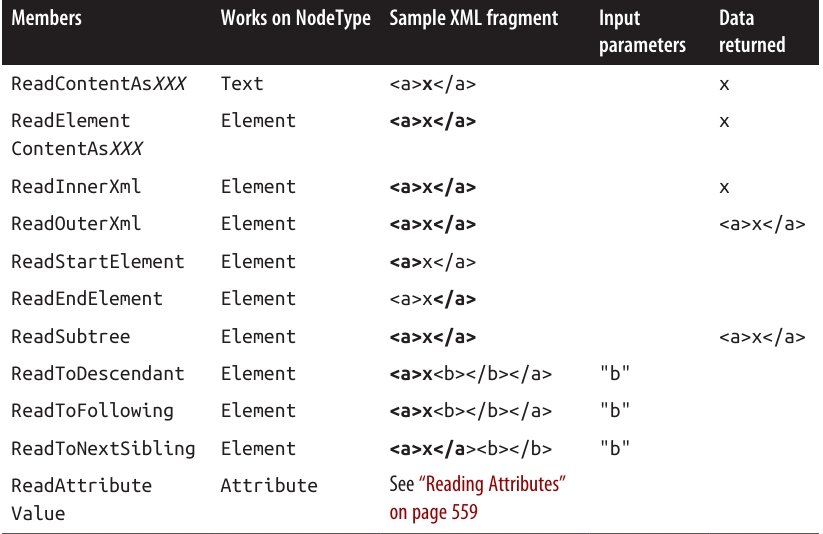
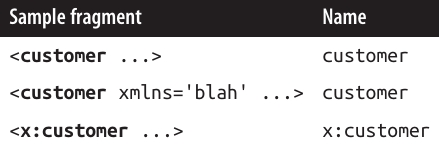
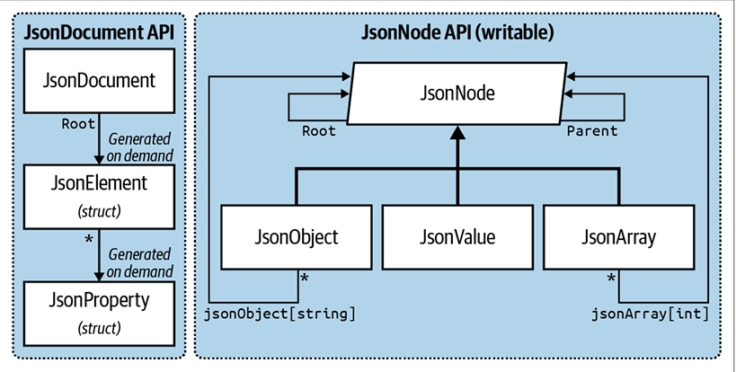

<div dir="rtl">

# فصل یازدهم: سایر تکنولوژی‌های XML و JSON

در **فصل ۱۰**، ما API مربوط به **LINQ-to-XML** و به‌طور کلی XML را بررسی کردیم.
در این فصل، به سراغ **کلاس‌های سطح پایین XmlReader/XmlWriter** و همچنین **انواع داده‌هایی برای کار با JSON (JavaScript Object Notation)** می‌رویم، که به‌عنوان یک جایگزین محبوب برای XML شناخته می‌شود.

در ضمیمه‌ی آنلاین 📎، ابزارهایی برای کار با **XML Schema** و **Stylesheet**‌ها توضیح داده شده‌اند.

---

### XmlReader ⚡

**XmlReader** یک کلاس با کارایی بالا است که برای خواندن یک جریان (Stream) از XML به‌صورت سطح پایین و فقط رو به جلو استفاده می‌شود.

به مثال زیر از یک فایل XML به نام `customer.xml` توجه کنید:

```xml
<?xml version="1.0" encoding="utf-8" standalone="yes"?>
<customer id="123" status="archived">
  <firstname>Jim</firstname>
  <lastname>Bo</lastname>
</customer>
```

برای ساختن یک شیء از نوع `XmlReader`، کافی است متد استاتیک `XmlReader.Create` را صدا بزنید و یک `Stream`، یا یک `TextReader`، یا یک رشته‌ی URI به آن بدهید:

```csharp
using XmlReader reader = XmlReader.Create("customer.xml");
...
```

از آن‌جایی که **XmlReader** می‌تواند داده‌ها را از منابعی کند (مثل `Stream`‌ها و URIها) بخواند، نسخه‌های **asynchronous** برای بیشتر متدهای خود ارائه می‌دهد تا بتوانید به‌سادگی کدهای **nonblocking** بنویسید.
(ما موضوع **asynchrony** را به‌طور کامل در فصل ۱۴ بررسی می‌کنیم.)

---

برای ساختن یک `XmlReader` که از **رشته (string)** بخواند:

```csharp
using XmlReader reader = XmlReader.Create(
    new System.IO.StringReader(myString));
```

شما همچنین می‌توانید یک شیء از نوع `XmlReaderSettings` ارسال کنید تا گزینه‌های **Parsing** و **Validation** را کنترل کنید.

سه ویژگی مهم این کلاس که برای پرش از محتوای اضافی بسیار مفید هستند:

```csharp
bool IgnoreComments                  // پرش از روی nodeهای توضیحی؟
bool IgnoreProcessingInstructions    // پرش از روی دستورهای پردازشی؟
bool IgnoreWhitespace                // پرش از روی فضاهای خالی؟
```

در مثال زیر، به Reader می‌گوییم که nodeهای فضای خالی را **نادیده بگیرد**، چون معمولاً در سناریوهای رایج مزاحم هستند:

```csharp
XmlReaderSettings settings = new XmlReaderSettings();
settings.IgnoreWhitespace = true;
using XmlReader reader = XmlReader.Create("customer.xml", settings);
...
```

---

ویژگی مفید دیگر در `XmlReaderSettings`، گزینه‌ی **ConformanceLevel** است.
مقدار پیش‌فرض آن **Document** است؛ یعنی به Reader می‌گوید انتظار یک **سند XML معتبر با یک ریشه‌ی واحد** را داشته باشد.

اما این موضوع مشکل‌ساز می‌شود اگر بخواهید فقط یک بخش داخلی از XML را بخوانید که شامل چندین node است:

```xml
<firstname>Jim</firstname>
<lastname>Bo</lastname>
```

برای اینکه این قطعه بدون خطا خوانده شود، باید مقدار `ConformanceLevel` را روی **Fragment** قرار دهید.

همچنین ویژگی دیگری به نام **CloseInput** در `XmlReaderSettings` وجود دارد که مشخص می‌کند وقتی Reader بسته می‌شود، آیا باید **Stream زیربنایی** هم بسته شود یا نه. (در `XmlWriterSettings` نیز ویژگی مشابهی به نام **CloseOutput** وجود دارد.)
مقدار پیش‌فرض `CloseInput` و `CloseOutput` برابر **false** است.

---

### خواندن Nodeها 📌

واحدهای یک جریان XML، **Nodeها** هستند.
Reader جریان XML را به‌ترتیب متنی (به‌صورت **Depth-First**) پیمایش می‌کند.
ویژگی `Depth` در Reader، عمق فعلی مکان‌نما (Cursor) را بازمی‌گرداند.

اولیه‌ترین روش برای خواندن از `XmlReader`، استفاده از متد **Read** است.
این متد مکان‌نما را به node بعدی در جریان XML می‌برد، تقریباً مشابه با متد `MoveNext` در `IEnumerator`.

* اولین فراخوانی به `Read` مکان‌نما را روی اولین node قرار می‌دهد.
* زمانی که `Read` مقدار **false** بازمی‌گرداند، یعنی مکان‌نما از آخرین node عبور کرده و در این نقطه باید Reader بسته و کنار گذاشته شود.

---

دو ویژگی متنی (string) در `XmlReader` برای دسترسی به محتوای یک node وجود دارند:

* **Name**
* **Value**

بسته به نوع node، یکی از این دو یا هر دوی آن‌ها مقداردهی می‌شوند.

---

### مثال: خواندن همه Nodeها 👇

در این مثال، ما هر node موجود در جریان XML را می‌خوانیم و نوع هر node را چاپ می‌کنیم:

```csharp
XmlReaderSettings settings = new XmlReaderSettings();
settings.IgnoreWhitespace = true;
using XmlReader reader = XmlReader.Create("customer.xml", settings);

while (reader.Read())
{
    Console.Write(new string(' ', reader.Depth * 2));  // چاپ فاصله برای تورفتگی
    Console.Write(reader.NodeType.ToString());

    if (reader.NodeType == XmlNodeType.Element ||
        reader.NodeType == XmlNodeType.EndElement)
    {
        Console.Write(" Name=" + reader.Name);
    }
    else if (reader.NodeType == XmlNodeType.Text)
    {
        Console.Write(" Value=" + reader.Value);
    }

    Console.WriteLine();
}
```

خروجی:

```
XmlDeclaration
Element Name=customer
  Element Name=firstname
    Text Value=Jim
  EndElement Name=firstname
  Element Name=lastname
    Text Value=Bo
  EndElement Name=lastname
EndElement Name=customer
```

🔎 توجه کنید که **Attributes** (ویژگی‌ها) در پیمایش مبتنی بر `Read` لحاظ نمی‌شوند. (برای این موضوع به بخش **Reading Attributes** در صفحه‌ی ۵۵۹ مراجعه کنید.)

---

### XmlNodeType 🏷️

ویژگی `NodeType` از نوع `XmlNodeType` است که یک **enum** می‌باشد و شامل اعضای زیر است:

* None
* XmlDeclaration
* Element
* EndElement
* Text
* Attribute
* Comment
* Entity
* EndEntity
* EntityReference
* ProcessingInstruction
* CDATA
* Document
* DocumentType
* DocumentFragment
* Notation
* Whitespace
* SignificantWhitespace

### خواندن Elementها در XML 🏷️📖

اغلب اوقات شما از قبل ساختار سند XML که می‌خواهید بخوانید را می‌دانید. برای ساده‌تر کردن این کار، **XmlReader** مجموعه‌ای از متدها را فراهم کرده است که هنگام خواندن، فرض می‌کنند ساختار مشخصی وجود دارد. این متدها هم کد شما را ساده‌تر می‌کنند و هم به‌طور هم‌زمان بخشی از **Validation** را انجام می‌دهند ✅.

اگر هرگونه Validation شکست بخورد، `XmlReader` یک **XmlException** پرتاب می‌کند.
این استثنا ویژگی‌های **LineNumber** و **LinePosition** را دارد که نشان می‌دهد خطا در کجا رخ داده است—ثبت (Log کردن) این اطلاعات برای فایل‌های بزرگ XML بسیار ضروری است ⚠️.

---

### متدهای پایه‌ای برای خواندن عناصر

* `ReadStartElement` بررسی می‌کند که `NodeType` فعلی از نوع **Element** باشد و سپس متد `Read` را صدا می‌زند. اگر یک نام مشخص کنید، بررسی می‌کند که با نام Element فعلی مطابقت دارد.
* `ReadEndElement` بررسی می‌کند که `NodeType` فعلی از نوع **EndElement** باشد و سپس متد `Read` را صدا می‌زند.

به‌عنوان مثال، برای خواندن:

```xml
<firstname>Jim</firstname>
```

می‌توانیم کد زیر را بنویسیم:

```csharp
reader.ReadStartElement("firstname");
Console.WriteLine(reader.Value);
reader.Read();
reader.ReadEndElement();
```

---

### متدهای خلاصه‌تر 🛠️

متد `ReadElementContentAsString` همه‌ی مراحل بالا را یک‌جا انجام می‌دهد:

* یک **start element**
* یک **text node**
* و یک **end element**

سپس محتوای داخلی را به‌صورت یک رشته بازمی‌گرداند:

```csharp
string firstName = reader.ReadElementContentAsString("firstname", "");
```

آرگومان دوم به **namespace** اشاره دارد که در این مثال خالی است.

همچنین نسخه‌های تایپ‌شده‌ای از این متد وجود دارد، مثل `ReadElementContentAsInt`، که خروجی را مستقیماً به نوع موردنظر Parse می‌کنند.

---

### مثال کامل‌تر 📝

بیایید به سند XML زیر برگردیم:

```xml
<?xml version="1.0" encoding="utf-8" standalone="yes"?>
<customer id="123" status="archived">
  <firstname>Jim</firstname>
  <lastname>Bo</lastname>
  <creditlimit>500.00</creditlimit>    <!-- OK, we sneaked this in! -->
</customer>
```

و آن را این‌طور بخوانیم:

```csharp
XmlReaderSettings settings = new XmlReaderSettings();
settings.IgnoreWhitespace = true;

using XmlReader r = XmlReader.Create("customer.xml", settings);
r.MoveToContent();                // پرش از روی XML declaration
r.ReadStartElement("customer");

string firstName    = r.ReadElementContentAsString("firstname", "");
string lastName     = r.ReadElementContentAsString("lastname", "");
decimal creditLimit = r.ReadElementContentAsDecimal("creditlimit", "");

r.MoveToContent();      // پرش از روی کامنت
r.ReadEndElement();     // خواندن تگ پایانی customer
```

---

### متد MoveToContent ⚡

متد `MoveToContent` بسیار کاربردی است. این متد از روی تمام بخش‌های اضافی پرش می‌کند:

* **XML declaration**
* **Whitespace**
* **Commentها**
* **Processing instructionها**

همچنین می‌توانید به Reader دستور دهید اکثر این کارها را به‌صورت خودکار از طریق ویژگی‌های موجود در `XmlReaderSettings` انجام دهد.

---

### Elementهای اختیاری 🌀

در مثال قبلی، فرض کنید که `<lastname>` اختیاری باشد. راه‌حل ساده است:

```csharp
r.ReadStartElement("customer");
string firstName    = r.ReadElementContentAsString("firstname", "");
string lastName     = r.Name == "lastname"
                     ? r.ReadElementContentAsString() : null;
decimal creditLimit = r.ReadElementContentAsDecimal("creditlimit", "");
```

---

### ترتیب تصادفی Elementها 🔀

مثال‌های این بخش فرض می‌کنند که عناصر در فایل XML به‌ترتیب مشخصی قرار گرفته‌اند.
اگر نیاز دارید با عناصری که به ترتیب‌های مختلف می‌آیند کار کنید، ساده‌ترین راه این است که آن بخش از XML را به‌صورت یک **X-DOM** بخوانید. ما نحوه‌ی این کار را در بخش **Patterns for Using XmlReader/XmlWriter** در صفحه‌ی ۵۶۳ توضیح می‌دهیم.

---

### Elementهای خالی ⬜

نحوه‌ی برخورد `XmlReader` با Elementهای خالی می‌تواند یک **دام خطرناک** باشد 😅.

به این مثال توجه کنید:

```xml
<customerList></customerList>
```

در XML، این معادل است با:

```xml
<customerList/>
```

اما `XmlReader` این دو را متفاوت تفسیر می‌کند.

* در حالت اول، کد زیر به‌خوبی کار می‌کند:

```csharp
reader.ReadStartElement("customerList");
reader.ReadEndElement();
```

* اما در حالت دوم، `ReadEndElement` یک استثنا پرتاب می‌کند چون از نظر XmlReader هیچ **end element** مجزایی وجود ندارد.

راه‌حل: بررسی کنید که آیا Element خالی است یا خیر:

```csharp
bool isEmpty = reader.IsEmptyElement;
reader.ReadStartElement("customerList");
if (!isEmpty) reader.ReadEndElement();
```

در عمل، این مشکل فقط زمانی آزاردهنده است که Element موردنظر قرار است **child element**‌ها داشته باشد (مثل یک customer list).
برای Elementهایی که تنها متن ساده دارند (مثل firstname)، می‌توانید کل این موضوع را با استفاده از متدهایی مثل `ReadElementContentAsString` نادیده بگیرید.
متدهای `ReadElementXXX` هر دو نوع **Elementهای خالی** را به‌درستی مدیریت می‌کنند ✅.

---

### سایر متدهای ReadXXX 📚

جدول **۱۱-۱** تمام متدهای `ReadXXX` در **XmlReader** را خلاصه می‌کند.
بیشتر این متدها برای کار با **Elementها** طراحی شده‌اند. در این جدول، بخش **Bold** شده از XML نمونه، قسمت خوانده‌شده توسط متد توضیح داده‌شده را نشان می‌دهد.

<div align="center">
    
 
</div>

### حرکت بین Siblingها ➡️

متد **NextSibling** مکان‌نما (Cursor) را به ابتدای **اولین Node هم‌سطح (Sibling)** با نام/namespace مشخص‌شده منتقل می‌کند.

---

### متدهای قدیمی (Legacy Methods) ⚠️

دو متد قدیمی وجود دارند:

* `ReadString`
* `ReadElementString`

این‌ها شبیه به `ReadContentAsString` و `ReadElementContentAsString` عمل می‌کنند، اما اگر داخل Element بیش از **یک Text Node** وجود داشته باشد، **استثنا** پرتاب می‌کنند.

🔴 مشکل دیگر: اگر یک **Comment** در Element باشد، این متدها هم استثنا پرتاب می‌کنند.
بنابراین باید از استفاده‌ی آن‌ها خودداری کنید.

---

## خواندن Attributes 🏷️

کلاس **XmlReader** یک **Indexer** فراهم می‌کند که به شما دسترسی مستقیم (Random Access) به Attributeهای یک Element می‌دهد—چه از طریق **نام** و چه از طریق **موقعیت (Index)**.

استفاده از Indexer معادل با صدا زدن متد `GetAttribute` است.

به مثال زیر توجه کنید:

```xml
<customer id="123" status="archived"/>
```

می‌توانیم Attributeهای آن را این‌طور بخوانیم:

```csharp
Console.WriteLine(reader["id"]);              // 123
Console.WriteLine(reader["status"]);          // archived
Console.WriteLine(reader["bogus"] == null);   // True
```

⚠️ نکته: `XmlReader` باید **روی یک Start Element** قرار داشته باشد تا بتوان Attributeها را خواند.
بعد از اینکه `ReadStartElement` فراخوانی شد، Attributeها برای همیشه از دست می‌روند!

---

### دسترسی بر اساس موقعیت (Ordinal Position) 🔢

اگرچه ترتیب Attributeها از نظر معنایی بی‌اهمیت است، شما می‌توانید آن‌ها را با شماره‌ی Index بخوانید:

```csharp
Console.WriteLine(reader[0]);   // 123
Console.WriteLine(reader[1]);   // archived
```

همچنین Indexer این امکان را می‌دهد که **Namespace** مربوط به یک Attribute (اگر وجود داشته باشد) را مشخص کنید.

ویژگی `AttributeCount` تعداد Attributeهای Node فعلی را بازمی‌گرداند.

---

## Attribute Nodeها 🧩

برای پیمایش مستقیم در Attribute Nodeها، باید از مسیر معمولی خواندن با `Read` کمی **منحرف شوید**.
این کار زمانی مفید است که بخواهید مقدار Attribute را به انواع دیگر تبدیل کنید (با استفاده از متدهای `ReadContentAsXXX`).

این تغییر مسیر باید از یک **Start Element** آغاز شود.
برای راحتی کار، در حین پیمایش Attributeها، قانون **Forward-Only** کمی منعطف‌تر می‌شود: شما می‌توانید به هر Attribute (چه جلو چه عقب) با متد `MoveToAttribute` بروید.

برای بازگشت به Start Element، از متد `MoveToElement` استفاده می‌شود.

---

### مثال عملی 📝

بازگردیم به مثال قبلی:

```xml
<customer id="123" status="archived"/>
```

می‌توانیم این‌طور عمل کنیم:

```csharp
reader.MoveToAttribute("status");
string status = reader.ReadContentAsString();

reader.MoveToAttribute("id");
int id = reader.ReadContentAsInt();
```

🔍 اگر Attribute مشخص‌شده وجود نداشته باشد، `MoveToAttribute` مقدار **false** برمی‌گرداند.

---

### پیمایش همه Attributeها 🔄

می‌توانید هر Attribute را به‌ترتیب پیمایش کنید:

```csharp
if (reader.MoveToFirstAttribute())
    do
    {
        Console.WriteLine(reader.Name + "=" + reader.Value);
    }
    while (reader.MoveToNextAttribute());
```

🔽 خروجی:

```
id=123
status=archived
```

---

## Namespaces و Prefixes 🌐

کلاس **XmlReader** دو سیستم موازی برای ارجاع به نام عناصر و Attributeها فراهم می‌کند:

* **Name**
* **NamespaceURI و LocalName**

هر وقت خاصیت **Name** را از یک Element بخوانید یا متدی فراخوانی کنید که یک **نام منفرد** می‌پذیرد، در حال استفاده از سیستم اول هستید.

این روش زمانی خوب عمل می‌کند که **Namespace** یا **Prefix** وجود نداشته باشد. در غیر این صورت، عملکرد آن **ساده و سطحی** است:

* **Namespace**‌ها نادیده گرفته می‌شوند.
* **Prefix**‌ها دقیقاً همان‌طور که نوشته شده‌اند، بازگردانده می‌شوند.

<div align="center">
    
 
</div>

### 📝 نام‌فضاها (Namespaces) و پیشوندها (Prefixes)

کد زیر با دو حالت اول کار می‌کند:

```csharp
reader.ReadStartElement("customer");
```

اما برای رسیدگی به حالت سوم باید از کد زیر استفاده کنیم:

```csharp
reader.ReadStartElement("x:customer");
```

سیستم دوم از دو ویژگی حساس به نام‌فضا استفاده می‌کند: **NamespaceURI** و **LocalName**. این ویژگی‌ها پیشوندها و نام‌فضاهای پیش‌فرضی که توسط عناصر والد تعریف شده‌اند را در نظر می‌گیرند. پیشوندها به‌طور خودکار گسترش می‌یابند. این یعنی:

* **NamespaceURI** همیشه نام‌فضای درست و معنایی عنصر جاری را بازتاب می‌دهد.
* **LocalName** همیشه بدون هیچ پیشوندی نمایش داده می‌شود.

وقتی دو آرگومان نام به متدی مثل `ReadStartElement` می‌دهید، درواقع از همین سیستم دوم استفاده می‌کنید.

به‌عنوان مثال، کد XML زیر را در نظر بگیرید:

```xml
<customer xmlns="DefaultNamespace" xmlns:other="OtherNamespace">
  <address>
    <other:city>
    ...
```

می‌توانیم آن را این‌طور بخوانیم:

```csharp
reader.ReadStartElement("customer", "DefaultNamespace");
reader.ReadStartElement("address",  "DefaultNamespace");
reader.ReadStartElement("city",     "OtherNamespace");
```

✅ انتزاع پیشوندها معمولاً همان چیزی است که می‌خواهید. اما اگر لازم باشد، می‌توانید ببینید چه پیشوندی استفاده شده است (از طریق ویژگی **Prefix**) و سپس آن را به یک نام‌فضا تبدیل کنید (با فراخوانی **LookupNamespace**).

---

### ✍️ XmlWriter

**XmlWriter** یک نویسنده‌ی فقط-رو‌به-جلو (forward-only) برای جریان XML است. طراحی XmlWriter به‌طور متقارن شبیه **XmlReader** است.

مانند **XmlTextReader**، یک XmlWriter را با فراخوانی **Create** (با یک شیء تنظیمات اختیاری) می‌سازید.

در مثال زیر، ما **تورفتگی (Indenting)** را فعال می‌کنیم تا خروجی برای انسان خواناتر شود و سپس یک فایل XML ساده می‌نویسیم:

```csharp
XmlWriterSettings settings = new XmlWriterSettings();
settings.Indent = true;
using XmlWriter writer = XmlWriter.Create("foo.xml", settings);
writer.WriteStartElement("customer");
writer.WriteElementString("firstname", "Jim");
writer.WriteElementString("lastname", "Bo");
writer.WriteEndElement();
```

این کد سند زیر را تولید می‌کند (همان فایلی که در اولین مثال XmlReader خواندیم):

```xml
<?xml version="1.0" encoding="utf-8"?>
<customer>
  <firstname>Jim</firstname>
  <lastname>Bo</lastname>
</customer>
```

---

### ⚙️ تنظیمات XmlWriter

* به‌طور پیش‌فرض، **XmlWriter** اعلان (declaration) بالا را می‌نویسد.
* اگر نمی‌خواهید این اعلان نوشته شود، باید در **XmlWriterSettings** ویژگی **OmitXmlDeclaration = true** یا **ConformanceLevel = Fragment** را تنظیم کنید.
* مقدار **Fragment** همچنین اجازه می‌دهد چندین گره‌ی ریشه بنویسید؛ چیزی که در غیر این صورت باعث Exception می‌شود.

---

### 🔡 نوشتن مقادیر

* متد **WriteValue** یک گره متنی منفرد می‌نویسد. این متد هم رشته‌ها و هم انواع غیررشته‌ای مثل `bool` و `DateTime` را می‌پذیرد و به‌طور داخلی از **XmlConvert** برای تبدیل رشته‌های سازگار با XML استفاده می‌کند:

```csharp
writer.WriteStartElement("birthdate");
writer.WriteValue(DateTime.Now);
writer.WriteEndElement();
```

* در مقابل، اگر این‌طور بنویسیم:

```csharp
WriteElementString("birthdate", DateTime.Now.ToString());
```

خروجی ناسازگار با XML خواهد بود و امکان تفسیر نادرست دارد.

* **WriteString** معادل فراخوانی **WriteValue** با یک رشته است.
* **XmlWriter** به‌طور خودکار کاراکترهایی را که در Attribute یا Element غیرقانونی هستند (مثل `&`, `<`, `>` و کاراکترهای Unicode توسعه‌یافته) فرار می‌دهد (escape می‌کند).

---

### 🏷️ نوشتن Attributeها

می‌توانید درست بعد از نوشتن یک StartElement، Attributeها را بنویسید:

```csharp
writer.WriteStartElement("customer");
writer.WriteAttributeString("id", "1");
writer.WriteAttributeString("status", "archived");
```

برای نوشتن مقادیر غیررشته‌ای، از این الگو استفاده کنید:

```csharp
WriteStartAttribute();
WriteValue(...);
WriteEndAttribute();
```

---

### 🧩 نوشتن انواع دیگر Node

XmlWriter متدهایی برای نوشتن انواع دیگر گره‌ها نیز دارد:

* **WriteBase64** → برای داده‌های باینری

* **WriteBinHex** → برای داده‌های باینری

* **WriteCData**

* **WriteComment**

* **WriteDocType**

* **WriteEntityRef**

* **WriteProcessingInstruction**

* **WriteRaw**

* **WriteWhitespace**

* متد **WriteRaw** یک رشته را مستقیماً به جریان خروجی تزریق می‌کند.

* همچنین متد **WriteNode** وجود دارد که یک **XmlReader** را می‌پذیرد و هر چیزی را که از آن می‌خواند، تکرار (Echo) می‌کند.

---

### 🌐 نام‌فضاها و پیشوندها در XmlWriter

نسخه‌های Overload متدهای Write\* به شما امکان می‌دهند یک عنصر یا Attribute را به یک نام‌فضا متصل کنید.

بیایید محتوای فایل XML قبلی را بازنویسی کنیم و این بار همه عناصر را به نام‌فضای `http://oreilly.com` متصل کنیم، و در عنصر `customer` پیشوند `o` را تعریف کنیم:

```csharp
writer.WriteStartElement("o", "customer", "http://oreilly.com");
writer.WriteElementString("o", "firstname", "http://oreilly.com", "Jim");
writer.WriteElementString("o", "lastname", "http://oreilly.com", "Bo");
writer.WriteEndElement();
```

خروجی این خواهد بود:

```xml
<?xml version="1.0" encoding="utf-8"?>
<o:customer xmlns:o='http://oreilly.com'>
  <o:firstname>Jim</o:firstname>
  <o:lastname>Bo</o:lastname>
</o:customer>
```

🔍 توجه کنید که برای اختصار، **XmlWriter** اعلام نام‌فضای عناصر فرزند را حذف می‌کند چون قبلاً توسط عنصر والد تعریف شده‌اند.

### 📌 الگوها برای استفاده از XmlReader/XmlWriter

---

### 📂 کار با داده‌های سلسله‌مراتبی (Hierarchical Data)

در نظر بگیرید کلاس‌های زیر را داریم:

```csharp
public class Contacts
{
  public IList<Customer> Customers = new List<Customer>();
  public IList<Supplier> Suppliers = new List<Supplier>();
}
public class Customer { public string FirstName, LastName; }
public class Supplier { public string Name; }
```

فرض کنید می‌خواهیم از **XmlReader** و **XmlWriter** برای **سریال‌سازی (Serialization)** یک شیء `Contacts` به XML استفاده کنیم. خروجی مدنظر به این صورت است:

```xml
<?xml version="1.0" encoding="utf-8"?>
<contacts>
  <customer id="1">
    <firstname>Jay</firstname>
    <lastname>Dee</lastname>
  </customer>
  <customer>                     <!-- فرض می‌کنیم id اختیاری است -->
    <firstname>Kay</firstname>
    <lastname>Gee</lastname>
  </customer>
  <supplier>
    <name>X Technologies Ltd</name>
  </supplier>
</contacts>
```

---

### ✨ بهترین روش

بهترین راه این نیست که یک متد بزرگ بنویسیم، بلکه این است که قابلیت‌های XML را داخل خود کلاس‌های `Customer` و `Supplier` کپسوله کنیم. این کار با نوشتن متدهای `ReadXml` و `WriteXml` روی این کلاس‌ها انجام می‌شود.

🔑 الگوی کار به این صورت است:

* متدهای **ReadXml** و **WriteXml** هنگام خروج در همان عمق (Depth) Reader/Writer را ترک می‌کنند.
* **ReadXml** عنصر بیرونی (Outer Element) را می‌خواند، درحالی‌که **WriteXml** فقط محتوای داخلی (Inner Content) را می‌نویسد.

---

### 👤 کلاس Customer

```csharp
public class Customer
{
  public const string XmlName = "customer";
  public int? ID;
  public string FirstName, LastName;
  public Customer () { }
  public Customer (XmlReader r) { ReadXml(r); }

  public void ReadXml (XmlReader r)
  {
    if (r.MoveToAttribute("id")) ID = r.ReadContentAsInt();
    r.ReadStartElement();
    FirstName = r.ReadElementContentAsString("firstname", "");
    LastName  = r.ReadElementContentAsString("lastname", "");
    r.ReadEndElement();
  }

  public void WriteXml (XmlWriter w)
  {
    if (ID.HasValue) w.WriteAttributeString("id", "", ID.ToString());
    w.WriteElementString("firstname", FirstName);
    w.WriteElementString("lastname", LastName);
  }
}
```

🔍 دقت کنید:

* `ReadXml` عناصر شروع و پایان بیرونی را می‌خواند. اگر این کار توسط Caller انجام می‌شد، کلاس Customer نمی‌توانست Attributeهای خودش را بخواند.
* `WriteXml` متقارن (Symmetrical) نوشته نشده چون:

  1. Caller ممکن است بخواهد نام عنصر بیرونی را تعیین کند.
  2. Caller ممکن است نیاز داشته باشد Attributeهای اضافی مثل نوع (Subtype) را بنویسد.

مزیت دیگر این الگو این است که پیاده‌سازی شما با **IXmlSerializable** سازگار می‌شود.

---

### 🏢 کلاس Supplier

```csharp
public class Supplier
{
  public const string XmlName = "supplier";
  public string Name;
  public Supplier () { }
  public Supplier (XmlReader r) { ReadXml(r); }

  public void ReadXml (XmlReader r)
  {
    r.ReadStartElement();
    Name = r.ReadElementContentAsString("name", "");
    r.ReadEndElement();
  }

  public void WriteXml (XmlWriter w) =>
    w.WriteElementString("name", Name);
}
```

---

### 📒 کلاس Contacts

در کلاس `Contacts`، باید در `ReadXml` عناصر را پیمایش کنیم و بررسی کنیم که هر زیرعنصر یک `customer` است یا یک `supplier`. همچنین باید حالت عنصر خالی `<contacts/>` را مدیریت کنیم:

```csharp
public void ReadXml (XmlReader r)
{
  bool isEmpty = r.IsEmptyElement;  // برای جلوگیری از گیر افتادن در عنصر خالی
  r.ReadStartElement();
  if (isEmpty) return;

  while (r.NodeType == XmlNodeType.Element)
  {
    if (r.Name == Customer.XmlName) 
        Customers.Add(new Customer(r));
    else if (r.Name == Supplier.XmlName) 
        Suppliers.Add(new Supplier(r));
    else
        throw new XmlException("Unexpected node: " + r.Name);
  }
  r.ReadEndElement();
}

public void WriteXml (XmlWriter w)
{
  foreach (Customer c in Customers)
  {
    w.WriteStartElement(Customer.XmlName);
    c.WriteXml(w);
    w.WriteEndElement();
  }
  foreach (Supplier s in Suppliers)
  {
    w.WriteStartElement(Supplier.XmlName);
    s.WriteXml(w);
    w.WriteEndElement();
  }
}
```

---

### 📤 سریال‌سازی Contacts به XML

```csharp
var settings = new XmlWriterSettings();
settings.Indent = true;  // برای خوانایی بیشتر
using XmlWriter writer = XmlWriter.Create("contacts.xml", settings);
var cts = new Contacts();
// افزودن Customers و Suppliers...
writer.WriteStartElement("contacts");
cts.WriteXml(writer);
writer.WriteEndElement();
```

---

### 📥 دسریال‌سازی از همان فایل

```csharp
var settings = new XmlReaderSettings();
settings.IgnoreWhitespace = true;
settings.IgnoreComments = true;
settings.IgnoreProcessingInstructions = true;

using XmlReader reader = XmlReader.Create("contacts.xml", settings);
reader.MoveToContent();
var cts = new Contacts();
cts.ReadXml(reader);
```

---

### 🔄 ترکیب XmlReader/XmlWriter با X-DOM

در هر نقطه از درخت XML که کار با XmlReader یا XmlWriter سخت شد، می‌توانید از **X-DOM** وارد شوید.
این کار اجازه می‌دهد مزیت راحتی X-DOM را با مصرف کم حافظه‌ی XmlReader/XmlWriter ترکیب کنید.

---

### 📖 استفاده از XmlReader همراه با XElement

برای خواندن یک عنصر جاری به یک **X-DOM**، از متد:

```csharp
XNode.ReadFrom(XmlReader)
```

استفاده می‌کنیم. این متد فقط بخش جاری از زیردرخت را می‌خواند، نه کل سند را.

مثال:

```xml
<log>
  <logentry id="1">
    <date>...</date>
    <source>...</source>
    ...
  </logentry>
  ...
</log>
```

اگر یک میلیون عنصر `<logentry>` داشته باشیم، بارگذاری کل آن در X-DOM حافظه زیادی مصرف می‌کند. راه‌حل بهتر: پیمایش تک‌به‌تک با XmlReader و پردازش هر عنصر به‌وسیله XElement:

```csharp
XmlReaderSettings settings = new XmlReaderSettings();
settings.IgnoreWhitespace = true;
using XmlReader r = XmlReader.Create("logfile.xml", settings);
r.ReadStartElement("log");
while (r.Name == "logentry")
{
  XElement logEntry = (XElement) XNode.ReadFrom(r);
  int id = (int) logEntry.Attribute("id");
  DateTime date = (DateTime) logEntry.Element("date");
  string source = (string) logEntry.Element("source");
  ...
}
r.ReadEndElement();
```

---

### 🧩 استفاده از XElement در ReadXml

اگر الگوی بالا را دنبال کنید، می‌توانید XElement را مستقیماً در متدهای `ReadXml` یا `WriteXml` استفاده کنید، بدون اینکه Caller متوجه شود.

مثال بازنویسی متد `ReadXml` برای Customer:

```csharp
public void ReadXml (XmlReader r)
{
  XElement x = (XElement) XNode.ReadFrom(r);
  ID = (int) x.Attribute("id");
  FirstName = (string) x.Element("firstname");
  LastName  = (string) x.Element("lastname");
}
```

---

### 🌐 مدیریت نام‌فضاها در XElement

**XElement** با XmlReader همکاری می‌کند تا نام‌فضاها را حفظ کند و پیشوندها را درست گسترش دهد—even اگر در سطح بیرونی تعریف شده باشند.

مثال XML:

```xml
<log xmlns="http://loggingspace">
  <logentry id="1">
  ...
```

در این حالت، `XElement`هایی که در سطح `logentry` ساخته می‌شوند، نام‌فضای بیرونی را به‌درستی به ارث می‌برند. ✅

### 📄 استفاده از XmlWriter همراه با XElement

شما می‌توانید از **XElement** فقط برای نوشتن المنت‌های داخلی در یک **XmlWriter** استفاده کنید. کد زیر یک میلیون المنت **logentry** را داخل یک فایل XML می‌نویسد، بدون اینکه کل فایل در حافظه ذخیره شود:

```csharp
using XmlWriter w = XmlWriter.Create ("logfile.xml");
w.WriteStartElement ("log");
for (int i = 0; i < 1000000; i++)
{
    XElement e = new XElement ("logentry",
                   new XAttribute ("id", i),
                   new XElement ("date", DateTime.Today.AddDays (-1)),
                   new XElement ("source", "test"));
    e.WriteTo (w);
}
w.WriteEndElement ();
```

استفاده از **XElement** فقط اندکی سربار در اجرا ایجاد می‌کند. اگر همین مثال را طوری تغییر دهیم که در همه‌جا از **XmlWriter** استفاده کنیم، هیچ تفاوت محسوسی در زمان اجرا دیده نمی‌شود.

---

### 🌐 کار با JSON

**JSON** به یک جایگزین محبوب برای **XML** تبدیل شده است. گرچه JSON امکانات پیشرفته XML (مثل **namespaces**، **prefixes** و **schemas**) را ندارد، اما به دلیل سادگی و خوانایی بیشتر، محبوبیت زیادی دارد. قالب آن هم شبیه چیزی است که وقتی یک شیء **JavaScript** را به رشته تبدیل کنید به دست می‌آید.

📌 به‌صورت تاریخی، .NET هیچ پشتیبانی داخلی برای JSON نداشت و مجبور بودید از کتابخانه‌های شخص ثالث مثل **Json.NET** استفاده کنید. هرچند این موضوع دیگر صادق نیست، ولی کتابخانه **Json.NET** همچنان به دلایل زیر محبوب باقی مانده است:

* 📅 از سال ۲۰۱۱ تاکنون وجود دارد.
* 🔄 همان API روی نسخه‌های قدیمی‌تر .NET هم اجرا می‌شود.
* ⚙️ از نظر قابلیت‌ها (حداقل در گذشته) کاربردی‌تر از APIهای JSON مایکروسافت در نظر گرفته می‌شد.

APIهای JSON مایکروسافت اما این مزیت را دارند که از پایه طراحی شده‌اند تا **بسیار ساده و فوق‌العاده سریع** باشند. همچنین، از .NET 6 به بعد، قابلیت‌های آن‌ها بسیار به Json.NET نزدیک شده است.

در این بخش به موضوعات زیر می‌پردازیم:

* 📖 **Utf8JsonReader** و **Utf8JsonWriter** (خواننده و نویسنده رو به جلو)
* 📖 **JsonDocument** (خواننده DOM فقط-خواندنی)
* 📖 **JsonNode** (خواننده/نویسنده DOM با قابلیت خواندن و نوشتن)

در بخش "Serialization" در مکمل آنلاین به آدرس: [http://www.albahari.com/nutshell](http://www.albahari.com/nutshell)، موضوع **JsonSerializer** بررسی می‌شود که به‌طور خودکار JSON را به کلاس‌ها **سریالایز** و **دسریالایز** می‌کند.

---

### ⚡ Utf8JsonReader

کلاس **System.Text.Json.Utf8JsonReader** یک **خواننده بهینه‌شده رو به جلو** برای متن JSON با **کدگذاری UTF-8** است. از نظر مفهومی، بسیار شبیه **XmlReader** است که پیش‌تر در این فصل معرفی شد و تقریباً به همان شکل استفاده می‌شود.

فایل JSON زیر را در نظر بگیرید (با نام people.json):

```json
{
  "FirstName":"Sara",
  "LastName":"Wells",
  "Age":35,
  "Friends":["Dylan","Ian"]
}
```

* آکولادها `{}` یک **شیء JSON** را نشان می‌دهند (که شامل propertyهایی مثل `"FirstName"` و `"LastName"` است).
* براکت‌ها `[]` یک **آرایه JSON** را نشان می‌دهند (که شامل مقادیر تکراری است). در اینجا مقادیر تکراری رشته هستند، اما می‌توانند اشیاء یا حتی آرایه‌های دیگر هم باشند.

---

### 🧩 پیمایش JSON با Utf8JsonReader

کد زیر فایل بالا را با شمارش **tokenهای JSON** تجزیه می‌کند. هر **token** می‌تواند شامل موارد زیر باشد:

* شروع یا پایان یک شیء
* شروع یا پایان یک آرایه
* نام یک property
* مقدار یک property یا یک آرایه (رشته، عدد، true، false یا null)

```csharp
byte[] data = File.ReadAllBytes ("people.json");
Utf8JsonReader reader = new Utf8JsonReader (data);
while (reader.Read())
{
    switch (reader.TokenType)
    {
        case JsonTokenType.StartObject:
            Console.WriteLine ($"Start of object");
            break;
        case JsonTokenType.EndObject:
            Console.WriteLine ($"End of object");
            break;
        case JsonTokenType.StartArray:
            Console.WriteLine();
            Console.WriteLine ($"Start of array");
            break;
        case JsonTokenType.EndArray:
            Console.WriteLine ($"End of array");
            break;
        case JsonTokenType.PropertyName:
            Console.Write ($"Property: {reader.GetString()}");
            break;
        case JsonTokenType.String:
            Console.WriteLine ($" Value: {reader.GetString()}");
            break;
        case JsonTokenType.Number:
            Console.WriteLine ($" Value: {reader.GetInt32()}");
            break;
        default:
            Console.WriteLine ($"No support for {reader.TokenType}");
            break;
    }
}
```

---

### 📊 خروجی برنامه

```
Start of object
Property: FirstName Value: Sara
Property: LastName Value: Wells
Property: Age Value: 35
Property: Friends
Start of array
Value: Dylan
Value: Ian
End of array
End of object
```

✅ از آنجایی که **Utf8JsonReader** مستقیماً با UTF-8 کار می‌کند، می‌تواند **گام‌به‌گام tokenها** را بدون تبدیل ورودی به UTF-16 (فرمت رشته‌های .NET) بخواند. تبدیل به UTF-16 فقط وقتی انجام می‌شود که متدی مثل **GetString()** فراخوانی شود.

جالب است بدانید که سازنده **Utf8JsonReader** مستقیماً یک **آرایه بایت** نمی‌پذیرد، بلکه یک **ReadOnlySpan<byte>** دریافت می‌کند (به همین دلیل Utf8JsonReader به‌صورت یک **ref struct** تعریف شده است). شما می‌توانید یک آرایه بایت پاس دهید چون یک **تبدیل ضمنی** از `T[]` به `ReadOnlySpan<T>` وجود دارد.

📌 در فصل ۲۳ توضیح داده خواهد شد که **Spanها** چگونه کار می‌کنند و چطور می‌توانند عملکرد را با کمینه کردن تخصیص حافظه بهبود دهند.

---

### ⚙️ JsonReaderOptions

به‌طور پیش‌فرض، **Utf8JsonReader** الزام می‌کند که JSON دقیقاً مطابق استاندارد **RFC 8259** باشد. اما شما می‌توانید با پاس دادن یک نمونه از **JsonReaderOptions** به سازنده Utf8JsonReader، آن را انعطاف‌پذیرتر کنید.

گزینه‌ها شامل موارد زیر هستند:

* **توضیحات (C-Style comments)**
  به‌طور پیش‌فرض، وجود توضیحات در JSON یک **JsonException** ایجاد می‌کند. با تنظیم property به **JsonCommentHandling.Skip**، توضیحات نادیده گرفته می‌شوند. با مقدار **JsonCommentHandling.Allow**، خواننده آن‌ها را تشخیص داده و tokenهایی از نوع **JsonTokenType.Comment** تولید می‌کند. (توضیحات نمی‌توانند وسط tokenهای دیگر ظاهر شوند.)

* **ویرگول‌های انتهایی (Trailing commas)**
  بر اساس استاندارد، آخرین property یک شیء و آخرین عنصر یک آرایه نباید ویرگول انتهایی داشته باشند. با تنظیم **AllowTrailingCommas = true** این محدودیت برداشته می‌شود.

* **کنترل حداکثر عمق تو در تو شدن (Maximum nesting depth)**
  به‌طور پیش‌فرض، اشیاء و آرایه‌ها می‌توانند تا **۶۴ سطح** تو در تو شوند. با تنظیم **MaxDepth** می‌توانید این مقدار را تغییر دهید.

### ✍️ Utf8JsonWriter

کلاس **System.Text.Json.Utf8JsonWriter** یک **نویسنده JSON رو به جلو** است. این کلاس از انواع زیر پشتیبانی می‌کند:

* 📝 **String** و **DateTime** (که به‌صورت یک رشته JSON نوشته می‌شوند)
* 🔢 انواع عددی: **Int32، UInt32، Int64، UInt64، Single، Double و Decimal** (که به‌صورت اعداد JSON نوشته می‌شوند)
* ✅ **bool** (که به‌صورت مقادیر true/false در JSON ذخیره می‌شود)
* 🚫 **null** در JSON
* 📦 **آرایه‌ها (Arrays)**

شما می‌توانید این داده‌ها را مطابق استاندارد JSON در قالب **object** سازمان‌دهی کنید. همچنین امکان نوشتن **comment** وجود دارد، هرچند که توضیحات بخشی از استاندارد JSON نیستند، اما اغلب توسط **JSON parserها** پشتیبانی می‌شوند.

---

### 🖥️ نمونه کد استفاده از Utf8JsonWriter

```csharp
var options = new JsonWriterOptions { Indented = true };
using (var stream = File.Create ("MyFile.json"))
using (var writer = new Utf8JsonWriter (stream, options))
{
    writer.WriteStartObject();
    // Property name and value specified in one call
    writer.WriteString ("FirstName", "Dylan");
    writer.WriteString ("LastName", "Lockwood");
    
    // Property name and value specified in separate calls
    writer.WritePropertyName ("Age");
    writer.WriteNumberValue (46);

    writer.WriteCommentValue ("This is a (non-standard) comment");
    writer.WriteEndObject();
}
```

📄 خروجی فایل تولیدشده به این صورت خواهد بود:

```json
{
  "FirstName": "Dylan",
  "LastName": "Lockwood",
  "Age": 46
  /*This is a (non-standard) comment*/
}
```

از .NET 6 به بعد، متد **WriteRawValue** اضافه شد که به شما اجازه می‌دهد **یک رشته یا آرایه بایت** را مستقیماً داخل جریان JSON بنویسید. این قابلیت در موارد خاص مفید است؛ مثلاً وقتی می‌خواهید عددی همیشه همراه با **اعشار** ذخیره شود (مثل `1.0` به‌جای `1`).

---

### 📐 تنظیمات JsonWriterOptions

در مثال بالا، ویژگی **Indented = true** تنظیم شده بود تا خروجی خواناتر شود. اگر این کار انجام نمی‌شد، خروجی به این شکل فشرده می‌بود:

```json
{"FirstName":"Dylan","LastName":"Lockwood","Age":46...}
```

گزینه‌های **JsonWriterOptions** همچنین شامل موارد زیر هستند:

* **Encoder** → کنترل escape شدن رشته‌ها
* **SkipValidation** → عبور از بررسی‌های اعتبارسنجی ساختاری (که اجازه می‌دهد JSON نامعتبر تولید شود)

---

### 📖 JsonDocument

کلاس **System.Text.Json.JsonDocument** داده‌های JSON را به یک **DOM فقط-خواندنی** تجزیه می‌کند که از نمونه‌های **JsonElement** ساخته می‌شوند. این نمونه‌ها در صورت نیاز (on demand) ایجاد می‌شوند.

برخلاف **Utf8JsonReader** که فقط به‌صورت ترتیبی (forward-only) کار می‌کند، **JsonDocument** به شما اجازه می‌دهد به المنت‌ها به‌طور تصادفی (random access) دسترسی داشته باشید.

**JsonDocument** یکی از دو API مبتنی بر DOM برای کار با JSON است. دیگری **JsonNode** است (که در بخش بعد توضیح داده می‌شود).

* 🆕 **JsonNode** در .NET 6 معرفی شد، عمدتاً برای پشتیبانی از **DOM قابل‌نوشتن (writable DOM)**.
* البته **JsonNode** در حالت فقط‌خواندنی هم مناسب است و رابط برنامه‌نویسی (API) روان‌تری را ارائه می‌دهد که از یک DOM سنتی مبتنی بر کلاس‌ها برای مقادیر، آرایه‌ها و اشیاء استفاده می‌کند.
* در مقابل، **JsonDocument** بسیار سبک است و فقط شامل یک کلاس اصلی (**JsonDocument**) و دو ساختار سبک (**JsonElement** و **JsonProperty**) می‌شود که داده‌های زیربنایی را به‌صورت آنی تجزیه می‌کنند.

📊 تفاوت این دو API در **شکل 11-1** نشان داده شده است.

---

✅ در بیشتر سناریوهای واقعی، **تفاوت عملکردی JsonDocument و JsonNode ناچیز است**. بنابراین اگر ترجیح می‌دهید فقط یکی از این دو را یاد بگیرید، می‌توانید مستقیماً به سراغ **JsonNode** بروید.

<div align="center">
    
 
</div>

### 📘 JsonDocument و مدیریت حافظه

کلاس **JsonDocument** کارایی خود را با استفاده از **حافظه اشتراکی (pooled memory)** افزایش می‌دهد تا نیاز به **garbage collection** کمتر شود.
این به این معناست که شما **بعد از اتمام استفاده، باید JsonDocument را Dispose کنید**؛ در غیر این صورت، حافظه آن به استخر بازگردانده نمی‌شود.

👉 بنابراین، اگر یک کلاس بخواهد **JsonDocument** را در یک **field** نگه دارد، باید رابط **IDisposable** را هم پیاده‌سازی کند.
اگر این کار برایتان سنگین و دست‌وپاگیر است، بهتر است به جای آن از **JsonNode** استفاده کنید.

---

### 🏗️ ایجاد یک JsonDocument

متد **Parse** به‌صورت استاتیک یک **JsonDocument** را از **stream**، **string** یا **memory buffer** می‌سازد:

```csharp
using JsonDocument document = JsonDocument.Parse (jsonString);
...
```

هنگام فراخوانی `Parse` می‌توانید یک **JsonDocumentOptions** هم بدهید تا نحوه مدیریت **کاماهای اضافی**، **کامنت‌ها** و **حداکثر عمق تو در تو شدن (nesting depth)** کنترل شود (این موارد در بخش **JsonReaderOptions** صفحه 570 توضیح داده شدند).

---

### 🌳 دسترسی به RootElement

پس از ساخت، می‌توانید از طریق ویژگی **RootElement** به DOM دسترسی داشته باشید:

```csharp
using JsonDocument document = JsonDocument.Parse ("123");
JsonElement root = document.RootElement;
Console.WriteLine (root.ValueKind);   // Number
```

یک **JsonElement** می‌تواند یک **مقدار JSON** (رشته، عدد، true/false، null)، یا یک **آرایه** یا یک **شیء** را نمایش دهد.
ویژگی **ValueKind** مشخص می‌کند که نوع آن چیست.

⚠️ متدهایی که در ادامه معرفی می‌شوند **اگر نوع المنت مطابق انتظار نباشد، استثنا (Exception) پرتاب می‌کنند**.
اگر از **schema** فایل JSON مطمئن نیستید، می‌توانید ابتدا **ValueKind** را بررسی کنید یا از نسخه‌های **TryGet**\* استفاده کنید.

همچنین، **JsonElement** دو متد عمومی برای هر نوع المنت دارد:

* `GetRawText()` → متن JSON داخلی را برمی‌گرداند.
* `WriteTo` → المنت را به یک **Utf8JsonWriter** می‌نویسد.

---

### 🔢 خواندن مقادیر ساده

اگر المنت یک مقدار JSON باشد، می‌توانید مقدار آن را با متدهایی مثل `GetString()`، `GetInt32()`، `GetBoolean()` و غیره بگیرید:

```csharp
using JsonDocument document = JsonDocument.Parse ("123");
int number = document.RootElement.GetInt32();
```

همچنین متدهایی برای تبدیل رشته‌های JSON به انواع رایج CLR مثل **DateTime** (و حتی داده‌های دودویی base-64) وجود دارد.
نسخه‌های **TryGet**\* این متدها هم هستند که در صورت خطا، **استثنا پرتاب نمی‌کنند**.

---

### 📦 خواندن آرایه‌های JSON

اگر **JsonElement** نماینده یک **آرایه** باشد، می‌توانید از متدهای زیر استفاده کنید:

* `EnumerateArray()` → تمام زیرآیتم‌ها را به‌صورت **JsonElement** برمی‌گرداند.
* `GetArrayLength()` → تعداد عناصر آرایه را برمی‌گرداند.

همچنین می‌توانید با ایندکس به المنت خاصی دسترسی داشته باشید:

```csharp
using JsonDocument document = JsonDocument.Parse (@"[1, 2, 3, 4, 5]");
int length = document.RootElement.GetArrayLength();   // 5
int value  = document.RootElement[3].GetInt32();      // 4
```

---

### 🗂️ خواندن اشیاء JSON

اگر المنت یک **شیء JSON** باشد، متدهای زیر در دسترس هستند:

* `EnumerateObject()` → همه ویژگی‌ها (property) و مقادیرشان را برمی‌گرداند.
* `GetProperty(string propertyName)` → ویژگی خاص را برمی‌گرداند (و اگر وجود نداشته باشد، استثنا پرتاب می‌کند).
* `TryGetProperty(string propertyName, out JsonElement value)` → ویژگی را فقط در صورت وجود برمی‌گرداند.

مثال:

```csharp
using JsonDocument document = JsonDocument.Parse (@"{ ""Age"": 32}");
JsonElement root = document.RootElement;
int age = root.GetProperty ("Age").GetInt32();
```

یا کشف ویژگی‌ها به‌صورت پویا:

```csharp
JsonProperty ageProp = root.EnumerateObject().First();
string name = ageProp.Name;             // Age
JsonElement value = ageProp.Value;
Console.WriteLine (value.ValueKind);    // Number
Console.WriteLine (value.GetInt32());   // 32
```

### 🔎 JsonDocument و LINQ

کلاس **JsonDocument** به‌خوبی با **LINQ** سازگار است. فرض کنید فایل JSON زیر را داریم:

```json
[
  {
    "FirstName":"Sara",
    "LastName":"Wells",
    "Age":35,
    "Friends":["Ian"]
  },
  {
    "FirstName":"Ian",
    "LastName":"Weems",
    "Age":42,
    "Friends":["Joe","Eric","Li"]
  },
  {
    "FirstName":"Dylan",
    "LastName":"Lockwood",
    "Age":46,
    "Friends":["Sara","Ian"]
  }
]
```

می‌توانیم با استفاده از **JsonDocument** و **LINQ** داده‌ها را کوئری کنیم:

```csharp
using var stream = File.OpenRead (jsonPath);
using JsonDocument document = JsonDocument.Parse (json);

var query =
  from person in document.RootElement.EnumerateArray()
  select new
  {
    FirstName = person.GetProperty ("FirstName").GetString(),
    Age = person.GetProperty ("Age").GetInt32(),
    Friends =
      from friend in person.GetProperty ("Friends").EnumerateArray()
      select friend.GetString()
  };
```

⚠️ توجه کنید: از آنجا که کوئری‌های **LINQ** به‌صورت **Lazy** اجرا می‌شوند، باید قبل از خارج شدن محدوده (scope) و **Dispose شدن JsonDocument** (که به دلیل استفاده از دستور `using` به‌طور خودکار اتفاق می‌افتد)، کوئری را پیمایش (enumerate) کنید.

---

### ✍️ ایجاد تغییر با JSON Writer

کلاس **JsonDocument** فقط خواندنی (read-only) است، اما می‌توانید محتوای یک **JsonElement** را با متد **WriteTo** به یک **Utf8JsonWriter** بفرستید.
این روش امکانی برای تولید نسخه‌ای تغییر یافته از JSON فراهم می‌کند.

برای نمونه، در این مثال، JSON قبلی را به یک فایل جدید می‌نویسیم که فقط شامل افرادی است که **دو یا بیشتر دوست دارند**:

```csharp
using var json = File.OpenRead (jsonPath);
using JsonDocument document = JsonDocument.Parse (json);

var options = new JsonWriterOptions { Indented = true };

using (var outputStream = File.Create ("NewFile.json"))
using (var writer = new Utf8JsonWriter (outputStream, options))
{
  writer.WriteStartArray();
  foreach (var person in document.RootElement.EnumerateArray())
  {
    int friendCount = person.GetProperty ("Friends").GetArrayLength();
    if (friendCount >= 2)
      person.WriteTo (writer);
  }
}
```

👉 اما اگر به **قابلیت به‌روزرسانی مستقیم DOM** نیاز دارید، بهتر است از **JsonNode** استفاده کنید.

---

### 🌐 JsonNode

کلاس **JsonNode** (در فضای نام `System.Text.Json.Nodes`) در **.NET 6** معرفی شد.
هدف اصلی آن، پاسخ به نیاز یک **DOM قابل ویرایش (writable DOM)** بود.
البته در سناریوهای فقط‌خواندنی هم مناسب است و یک رابط **روان‌تر و شی‌گرا** ارائه می‌دهد.

* در اینجا، مقادیر JSON، آرایه‌ها و اشیاء هرکدام با **کلاس‌ها** نمایش داده می‌شوند (تصویر 11-1 در کتاب).
* چون کلاس‌ها هستند، هزینه‌ی **Garbage Collection** را تحمیل می‌کنند، اما این هزینه در اغلب سناریوهای واقعی ناچیز است.
* **JsonNode** همچنان بسیار بهینه است و حتی در مواقعی که گره‌های مشابه چند بار خوانده شوند، **سریع‌تر از JsonDocument** عمل می‌کند، چون نتایج **Parse** را کش می‌کند.

---

### 🛠️ ساخت JsonNode

متد استاتیک **Parse** یک **JsonNode** را از **stream**، **string**، **memory buffer** یا **Utf8JsonReader** می‌سازد:

```csharp
JsonNode node = JsonNode.Parse (jsonString);
```

هنگام فراخوانی `Parse` می‌توانید مثل JsonDocument یک **JsonDocumentOptions** هم بدهید تا نحوه مدیریت **کاماهای اضافی**، **کامنت‌ها** و **حداکثر عمق** کنترل شود.

🔑 برخلاف **JsonDocument**، اینجا دیگر نیازی به **Dispose کردن** وجود ندارد.

---

### 📜 رشته‌سازی (Stringify) در JsonNode

* متد `ToString()` → خروجی JSON با فرمت **خوانا و تو‌دار (indented)** برمی‌گرداند.
* متد `ToJsonString()` → خروجی JSON **فشرده و بدون فاصله‌های اضافی** برمی‌گرداند.

از **.NET 8**، ویژگی‌های زیر هم اضافه شده‌اند:

* `DeepEquals` → مقایسه‌ی دو **JsonNode** بدون نیاز به تبدیل به رشته JSON.
* `DeepClone` → گرفتن یک کپی عمیق از JsonNode.

---

### 🧩 انواع JsonNode

متد `Parse` یکی از زیردسته‌های **JsonNode** را برمی‌گرداند:

* **JsonValue**
* **JsonObject**
* **JsonArray**

برای جلوگیری از **Downcast دستی**، متدهای کمکی وجود دارند:

* `AsValue()`
* `AsObject()`
* `AsArray()`

مثال:

```csharp
var node = JsonNode.Parse ("123");  // Parses to a JsonValue
int number = node.AsValue().GetValue<int>();
// همانند ((JsonValue)node).GetValue<int>();
```

اما معمولاً لازم نیست این متدها را صدا بزنید، چون اعضای پرکاربرد مستقیماً روی خود کلاس **JsonNode** در دسترس‌اند:

```csharp
var node = JsonNode.Parse ("123");
int number = node.GetValue<int>();
// همانند node.AsValue().GetValue<int>();
```

### خواندن مقادیر ساده 🔹

همان‌طور که دیدیم، می‌توانید یک مقدار ساده را با استفاده از متد **GetValue** و مشخص کردن نوع، استخراج یا تبدیل کنید. برای آسان‌تر کردن این کار، **JsonNode** عملگرهای تبدیل صریح (**explicit cast operators**) در C# را بازتعریف کرده است، که امکان استفاده از میانبر زیر را فراهم می‌کند:

```csharp
var node = JsonNode.Parse("123");
int number = (int)node;
```

این روش برای انواع استاندارد عددی، از جمله `char`، `bool`، `DateTime`، `DateTimeOffset`، `Guid` (و نسخه‌های nullable آن‌ها) و همچنین `string` کار می‌کند.

اگر مطمئن نیستید که تبدیل موفق خواهد بود، باید از الگوی زیر استفاده کنید:

```csharp
if (node.AsValue().TryGetValue<int>(out var number))
    Console.WriteLine(number);
```

از **.NET 8** به بعد، با فراخوانی `node.GetValueKind()` می‌توانید تشخیص دهید که نود یک رشته، عدد، آرایه، شیء یا مقدار true/false است.

نودهایی که از متن JSON استخراج شده‌اند، به صورت داخلی توسط یک **JsonElement** پشتیبانی می‌شوند (که بخشی از API خواندنی **JsonDocument** است). می‌توانید **JsonElement** زیرین را به این شکل استخراج کنید:

```csharp
JsonElement je = node.GetValue<JsonElement>();
```

با این حال، این روش زمانی که نود به صورت صریح ایجاد شده باشد (مثلاً هنگام به‌روزرسانی DOM) کار نمی‌کند. چنین نودهایی به جای **JsonElement** توسط مقدار واقعی تجزیه‌شده پشتیبانی می‌شوند (رجوع کنید به بخش «Making updates with JsonNode» در صفحه 579).

---

### خواندن آرایه‌های JSON 📦

یک **JsonNode** که نماینده یک آرایه JSON است، از نوع **JsonArray** خواهد بود.
**JsonArray** رابط `IList<JsonNode>` را پیاده‌سازی می‌کند، بنابراین می‌توانید روی آن پیمایش کنید و عناصر را مانند یک آرایه یا لیست دسترسی داشته باشید:

```csharp
var node = JsonNode.Parse(@"[1, 2, 3, 4, 5]");
Console.WriteLine(node.AsArray().Count);  // 5
foreach (JsonNode child in node.AsArray())
{
    ...
}
```

به عنوان یک میانبر، می‌توانید از اندیس‌دهنده (**indexer**) مستقیماً از کلاس **JsonNode** استفاده کنید:

```csharp
Console.WriteLine((int)node[0]);   // 1
```

از **.NET 8** به بعد، می‌توانید با متد **GetValues<T>** داده‌ها را به صورت `IEnumerable<T>` دریافت کنید:

```csharp
int[] values = node.AsArray().GetValues<int>().ToArray();
```

---

### خواندن اشیاء JSON 🗂️

یک **JsonNode** که نماینده یک شیء JSON است، از نوع **JsonObject** خواهد بود.
**JsonObject** رابط `IDictionary<string, JsonNode>` را پیاده‌سازی می‌کند، بنابراین می‌توانید یک عضو را با اندیس‌دهنده دریافت کنید و همچنین روی کلید/مقدارهای دیکشنری پیمایش کنید.

همانند **JsonArray**، می‌توانید اندیس‌دهنده را مستقیماً از کلاس **JsonNode** استفاده کنید:

```csharp
var node = JsonNode.Parse(@"{ ""Name"":""Alice"", ""Age"": 32}");
string name = (string)node["Name"];  // Alice
int age = (int)node["Age"];           // 32
```

برای «کشف» ویژگی‌ها می‌توانیم از این الگو استفاده کنیم:

```csharp
foreach (KeyValuePair<string, JsonNode> keyValuePair in node.AsObject())
{
    string propertyName = keyValuePair.Key;   // "Name" سپس "Age"
    JsonNode value = keyValuePair.Value;
}
```

اگر مطمئن نیستید که یک ویژگی تعریف شده است، الگوی زیر نیز کاربردی است:

```csharp
if (node.AsObject().TryGetPropertyValue("Name", out JsonNode nameNode))
{
    ...
}
```

---

### پیمایش Fluent و LINQ 🔍

می‌توانید با استفاده از اندیس‌دهنده‌ها، به عمق ساختار JSON دسترسی پیدا کنید. به عنوان مثال، با داشتن فایل JSON زیر:

```json
[
  {
    "FirstName":"Sara",
    "LastName":"Wells",
    "Age":35,
    "Friends":["Ian"]
  },
  {
    "FirstName":"Ian",
    "LastName":"Weems",
    "Age":42,
    "Friends":["Joe","Eric","Li"]
  },
  {
    "FirstName":"Dylan",
    "LastName":"Lockwood",
    "Age":46,
    "Friends":["Sara","Ian"]
  }
]
```

می‌توانیم سومین دوست نفر دوم را این‌گونه استخراج کنیم:

```csharp
string li = (string)node[1]["Friends"][2];
```

همچنین این فایل به راحتی قابل پرس‌وجو با **LINQ** است:

```csharp
JsonNode node = JsonNode.Parse(File.ReadAllText(jsonPath));
var query =
    from person in node.AsArray()
    select new
    {
        FirstName = (string)person["FirstName"],
        Age = (int)person["Age"],
        Friends =
            from friend in person["Friends"].AsArray()
            select (string)friend
    };
```

برخلاف **JsonDocument**، **JsonNode** نیازی به Dispose ندارد، بنابراین نگرانی از بابت آزادسازی حافظه هنگام پیمایش تنبل وجود ندارد.

---

### به‌روزرسانی با JsonNode ✏️

**JsonObject** و **JsonArray** قابل تغییر هستند، بنابراین می‌توانید محتوای آن‌ها را به‌روزرسانی کنید.
ساده‌ترین روش برای جایگزینی یا افزودن ویژگی به یک **JsonObject**، استفاده از اندیس‌دهنده است:

```csharp
var node = JsonNode.Parse(@"{ ""Color"": ""Red"" }");
node["Color"] = "White";
node["Valid"] = true;
Console.WriteLine(node.ToJsonString());  // {"Color":"White","Valid":true}
```

خط دوم میانبری برای این دستور است:

```csharp
node["Color"] = JsonValue.Create("White");
```

به جای اختصاص یک مقدار ساده، می‌توانید یک **JsonArray** یا **JsonObject** اختصاص دهید.
برای حذف یک ویژگی، ابتدا به **JsonObject** تبدیل کنید (یا **AsObject** را فراخوانی کنید) و سپس متد **Remove** را فراخوانی کنید:

```csharp
node.AsObject().Remove("Valid");
```

(همچنین **JsonObject** متد **Add** دارد که در صورت وجود ویژگی، استثناء ایجاد می‌کند.)

**JsonArray** نیز امکان استفاده از اندیس‌دهنده برای جایگزینی عناصر را دارد:

```csharp
var node = JsonNode.Parse("[1, 2, 3]");
node[0] = 10;
```

فراخوانی **AsArray**، متدهای **Add/Insert/Remove/RemoveAt** را در اختیار شما می‌گذارد. برای مثال، حذف اولین عنصر و اضافه کردن یک عنصر به انتها:

```csharp
var arrayNode = JsonNode.Parse("[1, 2, 3]");
arrayNode.AsArray().RemoveAt(0);
arrayNode.AsArray().Add(4);
Console.WriteLine(arrayNode.ToJsonString());  // [2,3,4]
```

از **.NET 8** به بعد، می‌توانید یک **JsonNode** را با فراخوانی **ReplaceWith** نیز به‌روزرسانی کنید:

```csharp
var node = JsonNode.Parse(@"{ ""Color"": ""Red"" }");
var color = node["Color"];
color.ReplaceWith("Blue");
```

### ساخت DOM برای JsonNode به صورت برنامه‌نویسی 🏗️

**JsonArray** و **JsonObject** سازندگانی دارند که از **object initialization syntax** پشتیبانی می‌کنند، و این امکان را می‌دهند که کل DOM یک **JsonNode** را در یک عبارت بسازید:

```csharp
var node = new JsonArray
{
    new JsonObject {
        ["Name"] = "Tracy",
        ["Age"] = 30,
        ["Friends"] = new JsonArray("Lisa", "Joe")
    },
    new JsonObject {
        ["Name"] = "Jordyn",
        ["Age"] = 25,
        ["Friends"] = new JsonArray("Tracy", "Li")
    }
};
```

نتیجه این ساختار، JSON زیر خواهد بود:

```json
[
  {
    "Name": "Tracy",
    "Age": 30,
    "Friends": ["Lisa", "Joe"]
  },
  {
    "Name": "Jordyn",
    "Age": 25,
    "Friends": ["Tracy", "Li"]
  }
]
```


</div>