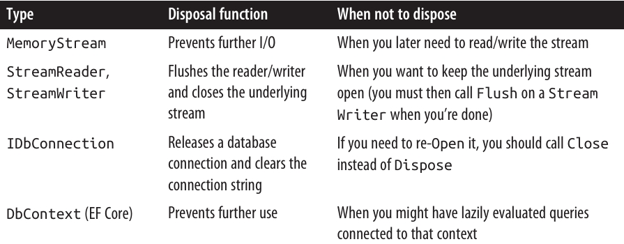
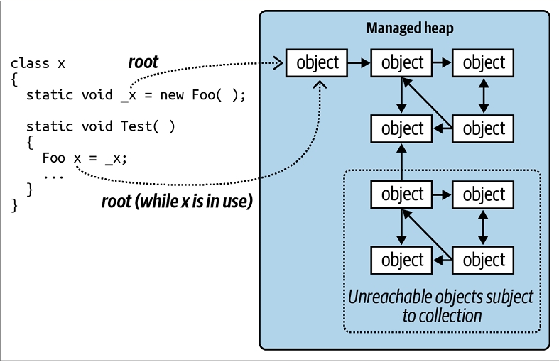
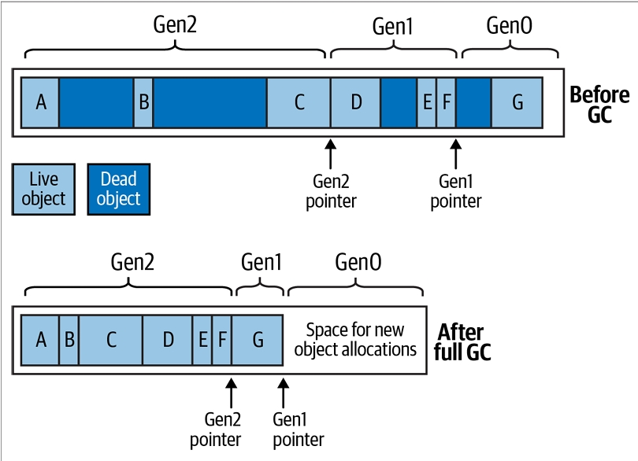

<div dir="rtl">

# فصل دوازدهم: مدیریت Disposal و Garbage Collection

برخی از اشیاء نیازمند کدهای مخصوص برای **جمع‌کردن (tear-down)** هستند تا منابعی مثل فایل‌های باز، قفل‌ها (locks)، هندل‌های سیستم‌عامل و اشیاء **unmanaged** آزاد بشن. در اصطلاح دات‌نت، به این کار **Disposal** گفته می‌شه و از طریق اینترفیس **IDisposable** پشتیبانی می‌شه.

همچنین حافظه مدیریت‌شده (Managed Memory) که توسط اشیاء استفاده‌نشده اشغال شده، باید در یک نقطه آزاد بشه. این کار **Garbage Collection** نام داره و توسط **CLR** انجام می‌شه.

تفاوت Disposal و Garbage Collection در اینه که:

* **Disposal** معمولاً به‌صورت صریح و توسط برنامه‌نویس انجام می‌شه. 🧑‍💻
* **Garbage Collection** کاملاً خودکار هست و توسط CLR مدیریت می‌شه. ⚙️

به عبارت دیگه، آزاد کردن چیزهایی مثل **file handles**، **locks** و منابع سیستم‌عامل بر عهده‌ی برنامه‌نویس هست، در حالی که آزادسازی حافظه رو CLR به‌طور خودکار انجام می‌ده.

این فصل به هر دو موضوع **Disposal** و **Garbage Collection** می‌پردازه و همچنین **Finalizer**‌های سی‌شارپ و الگوی (Pattern) مرتبط رو توضیح می‌ده که می‌تونن نقش پشتیبان برای Disposal داشته باشن. در نهایت، به جزئیات **Garbage Collector** و سایر گزینه‌های مدیریت حافظه خواهیم پرداخت.

---

## ♻️ IDisposable، Dispose و Close

دات‌نت یک اینترفیس خاص برای تایپ‌هایی که نیازمند متد tear-down هستن تعریف کرده:

```csharp
public interface IDisposable
{
  void Dispose();
}
```

سی‌شارپ دستور **using** رو به‌عنوان یک میان‌بُر نحوی (syntactic shortcut) فراهم کرده تا به‌صورت خودکار متد **Dispose** روی اشیائی که از **IDisposable** پیروی می‌کنن فراخوانی بشه. این کار در پشت‌صحنه با استفاده از یک بلاک **try/finally** انجام می‌شه:

```csharp
using (FileStream fs = new FileStream("myFile.txt", FileMode.Open))
{
  // ... Write to the file ...
}
```

کامپایلر این رو به کد زیر تبدیل می‌کنه:

```csharp
FileStream fs = new FileStream("myFile.txt", FileMode.Open);
try
{
  // ... Write to the file ...
}
finally
{
  if (fs != null) ((IDisposable)fs).Dispose();
}
```

بلاک **finally** تضمین می‌کنه که متد **Dispose** حتی در صورتی که **Exception** رخ بده یا کد زودتر از بلاک خارج بشه، حتماً فراخوانی بشه.

به‌طور مشابه، نوشتن کد به شکل زیر تضمین می‌کنه که **Dispose** به‌محض خروج **fs** از محدوده‌ی (scope) خودش انجام بشه:

```csharp
using FileStream fs = new FileStream("myFile.txt", FileMode.Open);
// ... Write to the file ...
```

در سناریوهای ساده، نوشتن یک تایپ disposable فقط نیازمند پیاده‌سازی **IDisposable** و نوشتن متد **Dispose** هست:

```csharp
sealed class Demo : IDisposable
{
  public void Dispose()
  {
    // Perform cleanup / tear-down.
    ...
  }
}
```

این الگو برای موارد ساده و کلاس‌های **sealed** (غیرقابل ارث‌بری) خیلی خوب عمل می‌کنه. در بخش «Calling Dispose from a Finalizer» (صفحه ۵۹۰) یک الگوی پیشرفته‌تر توضیح داده می‌شه که می‌تونه برای مصرف‌کنندگانی که **Dispose** رو فراموش می‌کنن، نقش پشتیبان داشته باشه.

برای تایپ‌های **unsealed** (قابل ارث‌بری)، بهتره از همون ابتدا از این الگوی پیشرفته‌تر پیروی بشه، چون در غیر این صورت اگه زیرکلاس بخواد چنین قابلیتی اضافه کنه، اوضاع خیلی پیچیده می‌شه.

---

## 📏 قوانین استاندارد Disposal

دات‌نت یک مجموعه‌ی غیررسمی (de facto) از قوانین برای منطق Disposal داره. این قوانین مستقیماً در دات‌نت یا زبان C# کدنویسی نشدن، اما هدف‌شون ایجاد یک **پروتکل سازگار برای مصرف‌کنندگان** هست. قوانین عبارت‌اند از:

۱. بعد از اینکه یک شیء Dispose شد، دیگه قابل استفاده نیست. نمی‌شه دوباره فعالش کرد و هرگونه فراخوانی متد یا property (به‌جز **Dispose**) باعث پرتاب شدن **ObjectDisposedException** می‌شه.
۲. فراخوانی چندباره‌ی متد **Dispose** روی یک شیء هیچ خطایی ایجاد نمی‌کنه.
۳. اگر یک شیء disposable به‌نام **x** مالک یک شیء disposable دیگه به‌نام **y** باشه، متد **Dispose** شیء **x** به‌طور خودکار متد **Dispose** شیء **y** رو فراخوانی می‌کنه—مگر اینکه خلاف این موضوع مشخص شده باشه.

این قوانین هنگام نوشتن تایپ‌های جدید هم مفید هستن، هرچند **اجباری** نیستن. چیزی جلوی شما رو برای نوشتن متدی مثل «Undispose» نمی‌گیره—البته احتمالاً با واکنش منفی همکارانتون روبه‌رو خواهید شد! 😅

طبق قانون سوم، یک **container object** به‌طور خودکار اشیاء فرزند خودش رو Dispose می‌کنه.

* مثال خوب این موضوع کنترل‌های کانتینر در **Windows Forms** مثل **Form** یا **Panel** هستن. وقتی این کنترل‌ها بسته یا Dispose می‌شن، همه‌ی کنترل‌های فرزند هم به‌طور خودکار Dispose می‌شن.
* مثال دیگه، زمانی هست که یک **FileStream** رو داخل یک **DeflateStream** می‌پیچیم. Dispose کردن **DeflateStream** به‌طور خودکار **FileStream** رو هم Dispose می‌کنه—مگر اینکه خلاف این موضوع در سازنده (constructor) مشخص شده باشه.

---

## 🔒 Close و Stop

برخی تایپ‌ها علاوه بر متد **Dispose**، متدی به‌نام **Close** هم دارن. کتابخانه‌ی اصلی دات‌نت (BCL) در مورد معنای دقیق متد Close کاملاً سازگار نیست، اما تقریباً همیشه یکی از این دو حالت هست:

* از نظر کارکردی کاملاً برابر با **Dispose**.
* زیرمجموعه‌ای از کارکرد **Dispose**.

مثال حالت دوم **IDbConnection** هست:

* یک connection که بسته (Closed) شده می‌تونه دوباره باز بشه (Re-Opened).
* اما connection که Dispose شده باشه دیگه نمی‌تونه.

مثال دیگه یک **Windows Form** هست که با **ShowDialog** فعال شده:

* فراخوانی **Close** فقط فرم رو مخفی می‌کنه.
* اما فراخوانی **Dispose** منابعش رو هم آزاد می‌کنه.

برخی کلاس‌ها متدی به‌نام **Stop** تعریف کردن (مثل **Timer** یا **HttpListener**).

* متد **Stop** ممکنه مثل **Dispose** منابع unmanaged رو آزاد کنه،
* اما بر خلاف Dispose، اجازه‌ی **شروع مجدد (Restarting)** رو می‌ده.


## 🗑️ چه زمانی باید Dispose کنیم؟

یک قانون امن (در تقریباً همه‌ی موارد) اینه که:
👉 **«اگر شک داری، Dispose کن.»**

اشیائی که یک **unmanaged resource handle** رو در خودشون نگه می‌دارن، تقریباً همیشه نیازمند Dispose هستن تا اون هندل آزاد بشه. نمونه‌ها شامل:

* **File یا Network Stream**‌ها
* **Network Socket**‌ها
* کنترل‌های **Windows Forms**
* ابزارهای **GDI+** مثل **pen**، **brush** و **bitmap**

از طرف دیگه، اگه یک تایپ **disposable** باشه، معمولاً (اما نه همیشه) به‌طور مستقیم یا غیرمستقیم یک **unmanaged handle** رو مرجع‌دهی می‌کنه. دلیلش اینه که unmanaged handleها دروازه‌ای به «دنیای بیرون» مثل منابع سیستم‌عامل، اتصال‌های شبکه و قفل‌های دیتابیس هستن—راه اصلی‌ای که اشیاء می‌تونن در صورت رها شدن نادرست، بیرون از خودشون دردسر ایجاد کنن. ⚠️

---

### 📌 سه سناریوی عدم نیاز به Dispose

البته سه حالت هست که نباید Dispose انجام بشه:

۱. زمانی که شما **مالک شیء نیستید**—مثلاً وقتی یک شیء مشترک رو از طریق یک **static field یا property** می‌گیرید.
۲. زمانی که متد **Dispose** شیء کاری انجام می‌ده که شما نمی‌خواید.
۳. زمانی که متد **Dispose** برای شیء **اصلاً طراحی نشده** و Dispose کردن اون فقط پیچیدگی غیرضروری به برنامه اضافه می‌کنه.

---

### 🔵 دسته اول: موارد نادر

این حالت خیلی کم پیش میاد. نمونه‌های اصلی در فضای نام **System.Drawing** دیده می‌شن:

* اشیاء GDI+ که از طریق **static field یا property** به‌دست میان (مثل **Brushes.Blue**) هرگز نباید Dispose بشن، چون همون نمونه در تمام طول عمر برنامه استفاده می‌شه.
* اما نمونه‌هایی که از طریق **constructor** ساخته می‌شن (مثل **new SolidBrush**) یا نمونه‌هایی که از طریق **static method** مثل **Font.FromHdc** به‌دست میان، باید Dispose بشن.

---

### 📙 دسته دوم: موارد رایج‌تر

این دسته خیلی بیشتر دیده می‌شه. نمونه‌های خوبش در فضای نام‌های **System.IO** و **System.Data** هستن.

<div align="center">
    
 
</div>

## 🗑️ MemoryStream و دسته‌ی سوم از عدم نیاز به Dispose

متد **Dispose** در کلاس **MemoryStream** فقط شیء رو غیرفعال می‌کنه؛ هیچ عملیات مهمی برای پاک‌سازی انجام نمی‌ده چون MemoryStream هیچ **unmanaged handle** یا منبع مشابهی در اختیار نداره.

دسته‌ی سوم شامل کلاس‌هایی مثل **StringReader** و **StringWriter** می‌شه. این تایپ‌ها به‌خاطر **base class** خودشون disposable هستن، نه به این دلیل که واقعاً نیازمند پاک‌سازی حیاتی باشن.

* اگه چنین شیئی رو فقط داخل یک متد بسازید و ازش استفاده کنید، پیچیدن اون داخل یک بلاک **using** کار سختی نیست.
* اما اگه عمر اون شیء طولانی‌تر باشه، مدیریت اینکه چه زمانی دیگه استفاده نمی‌شه و Dispose کردنش، فقط پیچیدگی غیرضروری به برنامه اضافه می‌کنه.

در چنین مواردی می‌تونید به‌سادگی **Dispose رو نادیده بگیرید**. البته نادیده گرفتن Dispose گاهی می‌تونه هزینه‌ی کارایی داشته باشه (بخش «Calling Dispose from a Finalizer» صفحه ۵۹۰ رو ببینید).

---

## 🧹 پاک‌سازی فیلدها در Dispose

به‌طور کلی، در متد **Dispose** لازم نیست فیلدهای یک شیء رو پاک کنید. با این حال، یک کار خوب اینه که از **event**‌هایی که شیء در طول عمرش به اون‌ها subscribe کرده، **unsubscribe** کنید (برای نمونه، بخش «Managed Memory Leaks» در صفحه ۶۰۰ رو ببینید).

این کار باعث می‌شه:

* اعلان‌های ناخواسته دریافت نکنید.
* و جلوی زنده موندن ناخواسته‌ی شیء در نگاه **Garbage Collector (GC)** گرفته بشه.

خود متد **Dispose** باعث آزادسازی حافظه‌ی مدیریت‌شده (Managed Memory) نمی‌شه—این فقط در زمان **Garbage Collection** اتفاق می‌افته.

همچنین خوبه یک فیلد قرار بدید تا نشون بده شیء Dispose شده. اینطوری اگه بعداً مصرف‌کننده بخواد روی شیء متدی صدا بزنه، می‌تونید یک **ObjectDisposedException** پرتاب کنید:

```csharp
public bool IsDisposed { get; private set; }
```

علاوه بر این، (هرچند از نظر فنی ضروری نیست) بهتره هندلرهای event داخلی شیء رو هم در متد Dispose پاک کنید (با مقداردهی **null**). این باعث می‌شه اون eventها حین یا بعد از Dispose شدن، اجرا نشن.

گاهی یک شیء داده‌های محرمانه و حساس مثل کلیدهای رمزنگاری نگه می‌داره. در این حالت منطقیه که اون داده‌ها رو هنگام Dispose پاک کنید (برای جلوگیری از کشف احتمالی توسط سایر پردازه‌ها وقتی حافظه بعداً به سیستم‌عامل بازگردونده می‌شه). کلاس **SymmetricAlgorithm** در فضای نام **System.Security.Cryptography** دقیقاً همین کار رو می‌کنه و روی آرایه‌ی بایتی که کلید رمزنگاری رو نگه می‌داره، متد **Array.Clear** رو صدا می‌زنه.

---

## 🕹️ Anonymous Disposal

گاهی مفیده که **IDisposable** رو پیاده‌سازی کنیم بدون اینکه یک کلاس کامل بنویسیم.

فرض کنید می‌خواید در یک کلاس، متدهایی برای **suspend** و **resume** کردن پردازش event داشته باشید:

```csharp
class Foo
{
  int _suspendCount;
  public void SuspendEvents() => _suspendCount++;           
  public void ResumeEvents() => _suspendCount--;            
  void FireSomeEvent()
  {
    if (_suspendCount == 0)
      ... fire some event ...
  }
  ...
}
```

این API دست‌وپاگیر هست چون مصرف‌کننده‌ها باید حتماً **ResumeEvents** رو صدا بزنن. برای مطمئن بودن، باید این کار رو داخل یک بلاک **finally** انجام بدن (در صورتی که Exception رخ بده):

```csharp
var foo = new Foo();
foo.SuspendEvents();
try
{
  ... do stuff ...      // ممکنه اینجا Exception پرتاب بشه
}
finally
{
  foo.ResumeEvents();   // باید حتماً اینجا صدا زده بشه
}
```

یک الگوی بهتر اینه که متد **ResumeEvents** رو حذف کنیم و متد **SuspendEvents** یک **IDisposable** برگردونه. مصرف‌کننده‌ها می‌تونن اینطوری استفاده کنن:

```csharp
using (foo.SuspendEvents())
{
  ... do stuff ...
}
```

اما مشکل اینجاست که پیاده‌سازی متد **SuspendEvents** برای ما زحمت اضافه درست می‌کنه:

```csharp
public IDisposable SuspendEvents()
{
  _suspendCount++;
  return new SuspendToken(this);
}

class SuspendToken : IDisposable 
{
  Foo _foo;          
  public SuspendToken(Foo foo) => _foo = foo;
  public void Dispose()
  {
    if (_foo != null) _foo._suspendCount--;
    _foo = null;  // جلوگیری از دوبار Dispose شدن
  }
}
```

---

### 🪄 الگوی Anonymous Disposal

این مشکل با استفاده از یک کلاس **Disposable** قابل استفاده‌ی مجدد حل می‌شه:

```csharp
public class Disposable : IDisposable
{
  public static Disposable Create(Action onDispose)
    => new Disposable(onDispose);
  Action _onDispose;
  Disposable(Action onDispose) => _onDispose = onDispose;
  public void Dispose()
  {
    _onDispose?.Invoke();   // اجرای عملیات Dispose در صورت وجود
    _onDispose = null;      // جلوگیری از اجرای دوباره
  }
}
```

حالا می‌تونیم متد **SuspendEvents** رو به‌شکل زیر ساده کنیم:

```csharp
public IDisposable SuspendEvents()
{
  _suspendCount++;
  return Disposable.Create(() => _suspendCount--);
}
```
## ⚙️ Garbage Collection خودکار

فرقی نمی‌کنه یک شیء نیازمند متد **Dispose** برای منطق tear-down سفارشی باشه یا نه، در هر صورت حافظه‌ای که روی heap اشغال کرده باید در یک نقطه آزاد بشه. این بخش به‌طور کامل به‌صورت خودکار توسط **CLR** و از طریق یک **Garbage Collector (GC)** خودکار مدیریت می‌شه. شما هیچ‌وقت حافظه‌ی مدیریت‌شده (Managed Memory) رو خودتون آزاد نمی‌کنید.

مثال:

```csharp
public void Test()
{
  byte[] myArray = new byte[1000];
  ...
}
```

وقتی متد **Test** اجرا می‌شه، یک آرایه برای نگهداری ۱۰۰۰ بایت روی heap تخصیص داده می‌شه. این آرایه توسط متغیر **myArray** که روی stack متغیرهای محلی قرار داره، مرجع‌دهی می‌شه. وقتی متد خارج می‌شه، این متغیر محلی از scope خارج می‌شه، یعنی دیگه هیچ چیزی به اون آرایه روی heap اشاره نمی‌کنه. در این حالت، آرایه‌ی بی‌صاحب می‌تونه در فرآیند Garbage Collection آزاد بشه.

در **حالت Debug** وقتی بهینه‌سازی‌ها غیرفعال باشن، طول عمر یک شیء که توسط متغیر محلی مرجع‌دهی می‌شه تا پایان بلاک کد ادامه پیدا می‌کنه تا اشکال‌زدایی راحت‌تر باشه. در غیر این صورت، شیء در اولین نقطه‌ای که دیگه استفاده نمی‌شه، واجد شرایط جمع‌آوری می‌شه.

Garbage Collection بلافاصله بعد از بی‌صاحب شدن یک شیء انجام نمی‌شه. درست مثل جمع‌آوری زباله در خیابان، این کار به‌صورت دوره‌ای انجام می‌شه—البته بر خلاف جمع‌آوری زباله در خیابان، زمان‌بندی ثابتی نداره. تصمیم CLR برای اجرای GC بر اساس عواملی مثل میزان حافظه‌ی موجود، حجم تخصیص حافظه، و مدت زمان گذشته از آخرین GC گرفته می‌شه (GC خودش رو بر اساس الگوهای دسترسی حافظه‌ی برنامه تنظیم می‌کنه).

به همین خاطر، یک تأخیر نامشخص بین بی‌صاحب شدن یک شیء و آزاد شدن حافظه‌ی اون وجود داره. این تأخیر می‌تونه از نانوثانیه تا چند روز طول بکشه.

GC همه‌ی زباله‌ها رو در هر بار جمع‌آوری پاک نمی‌کنه.
مدیر حافظه اشیاء رو به **generation**‌ها تقسیم می‌کنه و GC اشیاء تازه (جدیداً تخصیص داده‌شده) رو بیشتر از اشیاء قدیمی (با طول عمر زیاد) جمع‌آوری می‌کنه. جزئیات این موضوع در بخش «How the GC Works» (صفحه ۵۹۳) توضیح داده شده.

---

## 📉 Garbage Collection و مصرف حافظه

GC تلاش می‌کنه بین **زمانی که صرف جمع‌آوری می‌کنه** و **میزان حافظه‌ای که برنامه مصرف می‌کنه (Working Set)** تعادل برقرار کنه. به همین دلیل، برنامه‌ها می‌تونن بیشتر از نیازشون حافظه مصرف کنن، به‌ویژه وقتی آرایه‌های موقت بزرگ ساخته می‌شن.

شما می‌تونید مصرف حافظه‌ی یک پردازه رو از طریق **Windows Task Manager** یا **Resource Monitor** مانیتور کنید—یا به‌صورت برنامه‌نویسی، با استفاده از **PerformanceCounter**:

```csharp
// این تایپ‌ها در System.Diagnostics هستن:
string procName = Process.GetCurrentProcess().ProcessName;
using PerformanceCounter pc = new PerformanceCounter
     ("Process", "Private Bytes", procName);
Console.WriteLine(pc.NextValue());
```

این کد **Private Working Set** رو برمی‌گردونه که بهترین نشونه برای مصرف حافظه‌ی برنامه‌ست. این مقدار به‌طور خاص حافظه‌ای رو که CLR به‌صورت داخلی آزاد کرده و آماده‌ست به سیستم‌عامل پس بده (اگه یک پردازه‌ی دیگه به اون نیاز داشته باشه)، شامل نمی‌شه.

---

## 🌱 Root

**Root** چیزی هست که باعث می‌شه یک شیء زنده بمونه. اگه یک شیء به‌طور مستقیم یا غیرمستقیم توسط یک Root مرجع‌دهی نشه، واجد شرایط Garbage Collection می‌شه.

Root می‌تونه یکی از موارد زیر باشه:

* یک متغیر محلی یا پارامتر در یک متد در حال اجرا (یا در هر متدی در call stack اون)
* یک متغیر **static**
* یک شیء در صفی که اشیاء آماده برای **Finalization** رو ذخیره می‌کنه

از اون‌جایی که غیرممکنه کدی در یک شیء حذف‌شده اجرا بشه، اگه احتمال اجرای یک متد instance وجود داشته باشه، اون شیء باید به یکی از این روش‌ها مرجع‌دهی بشه.

توجه کنید که گروهی از اشیائی که به‌صورت چرخه‌ای به همدیگه مرجع می‌دن، بدون یک Root **مرده** محسوب می‌شن (شکل ۱۲-۱ رو ببینید). به بیان دیگه، اشیائی که نتونید با دنبال کردن پیکان‌ها (references) از یک Root به اون‌ها دسترسی پیدا کنید، **unreachable** هستن—و بنابراین مشمول جمع‌آوری می‌شن.
<div align="center">
    
 
</div>

## ⚰️ Finalizers

پیش از اینکه یک شیء از حافظه آزاد بشه، اگر **Finalizer** داشته باشه، اجرا می‌شه. یک Finalizer شبیه به یک سازنده (**Constructor**) تعریف می‌شه، با این تفاوت که قبل از اسم کلاس علامت `~` قرار می‌گیره:

```csharp
class Test
{
  ~Test()
  {
    // Finalizer logic...
  }
}
```

(اگرچه در نحو نوشتن شبیه سازنده‌ست، اما **Finalizer**‌ها نمی‌تونن `public` یا `static` باشن، پارامتر بگیرن یا سازنده‌ی پایه (base class) رو صدا بزنن.)

وجود Finalizerها به این خاطر ممکنه که فرآیند Garbage Collection در چندین فاز انجام می‌شه. در مرحله‌ی اول، GC اشیاء بلااستفاده رو شناسایی می‌کنه. اون‌هایی که Finalizer ندارن، فوراً حذف می‌شن. اما اشیائی که Finalizer دارن، موقتاً زنده نگه داشته می‌شن و توی یک صف خاص قرار می‌گیرن.

در اون لحظه، فرآیند Garbage Collection تموم می‌شه و برنامه‌ی شما به اجرای خودش ادامه می‌ده. بعد نخ (Thread) مربوط به Finalizer وارد عمل می‌شه و به‌صورت موازی با برنامه اجرا می‌شه؛ اشیاء رو از صف برمی‌داره و متد Finalizer اون‌ها رو اجرا می‌کنه.

تا پیش از اجرای Finalizer هر شیء، اون هنوز «زنده» حساب می‌شه—چون اون صف به‌عنوان یک Root عمل می‌کنه. بعد از خارج شدن از صف و اجرای Finalizer، شیء بی‌صاحب می‌شه و در جمع‌آوری بعدی (برای همون Generation) حذف خواهد شد.

---

### ⚠️ نکات مهم درباره Finalizerها

* 🚫 Finalizerها سرعت تخصیص و جمع‌آوری حافظه رو کاهش می‌دن (چون GC باید دنبال کنه که کدوم Finalizer اجرا شده).
* ⏳ طول عمر شیء و اشیاء مرجع اون‌ها رو طولانی‌تر می‌کنن.
* 🔄 ترتیب اجرای Finalizerها برای مجموعه‌ای از اشیاء غیرقابل پیش‌بینیه.
* 🎛️ کنترل شما روی زمان اجرای Finalizer خیلی محدوده.
* 🛑 اگر کدی در Finalizer مسدود بشه، بقیه اشیاء هم نمی‌تونن Finalize بشن.
* ❌ Finalizerها ممکنه به‌طور کامل دور زده بشن اگر برنامه به‌درستی unload نشه.

🔍 در کل، Finalizerها شبیه وکیل هستن—هرچند در بعضی شرایط واقعاً بهشون نیاز دارید، ولی به‌طور کلی بهتره مگر در صورت ضرورت مطلق ازشون استفاده نکنید.

---

### 📌 دستورالعمل‌های پیاده‌سازی Finalizerها

* ✅ مطمئن بشید Finalizer سریع اجرا می‌شه.
* ⛔ هرگز در Finalizer بلاک نکنید (به بخش “Blocking” در صفحه ۶۳۴ مراجعه کنید).
* 🚫 به اشیاء دیگه‌ای که خودشون Finalizer دارن ارجاع ندید.
* ❌ استثنا (Exception) پرتاب نکنید.

> نکته: CLR می‌تونه Finalizer یک شیء رو حتی اگر در طول سازنده استثنایی رخ داده باشه، فراخوانی کنه. پس نباید فرض کنید فیلدها همیشه به‌درستی مقداردهی شدن.

---

## 🔄 فراخوانی Dispose از Finalizer

یک الگوی متداول اینه که Finalizer متد **Dispose** رو فراخوانی کنه. این کار منطقیه وقتی پاک‌سازی فوری لازم نیست و صدا زدن Dispose بیشتر یک **بهینه‌سازی** حساب می‌شه تا یک ضرورت.

اما توجه کنید که این الگو باعث می‌شه آزادسازی حافظه و آزادسازی منابع (Resource) به هم گره بخورن—که ممکنه اهداف متفاوتی داشته باشن. همچنین بار بیشتری به نخ Finalizer وارد می‌کنه.

این الگو به‌عنوان **پشتیبان** هم به‌کار می‌ره، برای وقتی که مصرف‌کننده شیء فراموش کنه Dispose رو صدا بزنه. در این حالت، بهتره خطا رو لاگ کنید تا بعداً بتونید مشکل رو رفع کنید.

یک الگوی استاندارد برای پیاده‌سازی این روش به شکل زیره:

```csharp
class Test : IDisposable
{
  public void Dispose()             // NOT virtual
  {
    Dispose(true);
    GC.SuppressFinalize(this);     // مانع اجرای Finalizer می‌شه
  }

  protected virtual void Dispose(bool disposing)
  {
    if (disposing)
    {
      // Dispose روی اشیاء دیگه‌ای که متعلق به این شیء هستن.
      // می‌تونید اینجا به اشیاء Finalizable هم ارجاع بدید.
    }

    // آزادسازی منابع unmanaged متعلق به همین شیء.
  }

  ~Test() => Dispose(false);
}
```

در اینجا:

* متد **Dispose بدون پارامتر**، `virtual` نیست و فقط نسخه‌ی توسعه‌یافته رو با مقدار `true` صدا می‌زنه.
* نسخه‌ی توسعه‌یافته `protected` و `virtual` هست و منطق اصلی آزادسازی رو داره.
* پارامتر **disposing** مشخص می‌کنه آیا متد از Dispose صدا زده شده (true) یا از Finalizer (false).

وقتی disposing برابر false باشه، نباید به اشیائی که Finalizer دارن ارجاع بدید، چون ممکنه خودشون قبلاً Finalize شده باشن.

کارهایی که همچنان در این حالت می‌شه انجام داد:

* آزاد کردن مراجع مستقیم به منابع سیستم‌عامل (مثلاً از طریق P/Invoke به Win32 API).
* حذف فایل موقتی که در سازنده ساخته شده.

برای مقاوم‌سازی، هر کدی که ممکنه استثنا پرتاب کنه باید در بلوک try/catch قرار بگیره و استثنا لاگ بشه (به ساده‌ترین و مطمئن‌ترین شکل).

فراخوانی **GC.SuppressFinalize** در Dispose بدون پارامتر باعث می‌شه Finalizer بعداً اجرا نشه. این کار علاوه بر بهبود کارایی، اجازه می‌ده شیء (و اشیاء مرجع اون) در یک چرخه GC آزاد بشن.

---

## 🧟 Resurrection

فرض کنید یک Finalizer، شیء زنده‌ای رو طوری تغییر بده که به شیء در حال مرگ ارجاع بده. در این صورت، وقتی GC بعدی اجرا بشه، CLR اون شیء رو دیگه بی‌صاحب نمی‌بینه و بنابراین از جمع‌آوری فرار می‌کنه. به این سناریو **Resurrection** می‌گن.

مثال: نوشتن کلاسی برای مدیریت یک فایل موقت:

```csharp
public class TempFileRef
{
  public readonly string FilePath;
  public TempFileRef(string filePath) { FilePath = filePath; }
  ~TempFileRef() { File.Delete(FilePath); }
}
```

⚠️ مشکل: `File.Delete` ممکنه استثنا پرتاب کنه (مثلاً به خاطر نداشتن دسترسی، در حال استفاده بودن فایل یا قبلاً حذف شدن). این خطا باعث کرش کل برنامه می‌شه و مانع اجرای Finalizerهای دیگه هم خواهد شد.

می‌تونیم استثنا رو با یک بلوک catch خالی ببلعیم، اما هیچ‌وقت متوجه نمی‌شیم که خطایی رخ داده. یا می‌تونیم یک API پیچیده‌ی گزارش خطا صدا بزنیم، اما این بار نخ Finalizer رو سنگین می‌کنه. بنابراین باید عملیات Finalizer رو به وظایف ساده، مطمئن و سریع محدود کنیم.

راه بهتر: ثبت خطا در یک کالکشن استاتیک:

```csharp
public class TempFileRef
{
  static internal readonly ConcurrentQueue<TempFileRef> FailedDeletions
    = new ConcurrentQueue<TempFileRef>();

  public readonly string FilePath;
  public Exception DeletionError { get; private set; }

  public TempFileRef(string filePath) { FilePath = filePath; }

  ~TempFileRef()
  {
    try { File.Delete(FilePath); }
    catch (Exception ex)
    {
      DeletionError = ex;
      FailedDeletions.Enqueue(this);   // Resurrection
    }
  }
}
```

اضافه کردن شیء به کالکشن **FailedDeletions** یک مرجع جدید براش ایجاد می‌کنه و باعث می‌شه زنده بمونه تا زمانی که dequeue بشه.

`ConcurrentQueue<T>` نسخه‌ی **Thread-Safe** از `Queue<T>` هست و در فضای نام `System.Collections.Concurrent` تعریف شده (بخش ۲۲).

دلایل استفاده از کالکشن Thread-Safe:

1. CLR می‌تونه Finalizerها رو روی بیش از یک Thread به‌طور موازی اجرا کنه، پس وقتی به state مشترکی مثل یک کالکشن استاتیک دسترسی داریم، باید احتمال Finalize شدن هم‌زمان دو شیء رو در نظر بگیریم.
2. در نهایت باید اشیاء رو از `FailedDeletions` dequeue کنیم تا بتونیم کاری براشون انجام بدیم. این عملیات هم باید Thread-Safe باشه، چون ممکنه هم‌زمان با enqueue شدن یک شیء توسط Finalizer انجام بشه.
## 🔄 GC.ReRegisterForFinalize

یک شیء که **Resurrect** شده (دوباره زنده شده) دیگه Finalizerش برای بار دوم اجرا نمی‌شه—مگر اینکه شما متد **GC.ReRegisterForFinalize** رو صدا بزنید.

در مثال زیر، ما تلاش می‌کنیم در Finalizer یک فایل موقت رو حذف کنیم (مثل مثال قبلی). اما اگر حذف شکست خورد، شیء رو دوباره ثبت می‌کنیم تا در Garbage Collection بعدی دوباره امتحان کنه:

```csharp
public class TempFileRef
{
  public readonly string FilePath;
  int _deleteAttempt;

  public TempFileRef(string filePath) { FilePath = filePath; }

  ~TempFileRef()
  {
    try { File.Delete(FilePath); }
    catch
    {
      if (_deleteAttempt++ < 3)
        GC.ReRegisterForFinalize(this);
    }
  }
}
```

بعد از سومین تلاش ناموفق، Finalizer ما بدون سر و صدا از حذف فایل دست می‌کشه.
🔧 می‌تونیم این رو بهتر کنیم و با مثال قبلی ترکیب کنیم—یعنی بعد از سومین شکست، شیء رو به صف **FailedDeletions** اضافه کنیم.

⚠️ توجه:
حتماً فقط **یک‌بار** درون Finalizer متد ReRegisterForFinalize رو صدا بزنید.
اگه دوبار صدا بزنید، شیء دوباره دوبار ثبت می‌شه و باید دو بار دیگه Finalize بشه!

---

## ⚙️ GC چگونه کار می‌کند؟

**CLR** از یک Garbage Collector استاندارد **Generational Mark-and-Compact** استفاده می‌کنه که مدیریت حافظه‌ی خودکار برای اشیاء ذخیره‌شده در **Managed Heap** رو انجام می‌ده.

GC یک **Tracing GC** محسوب می‌شه، چون جلوی هر دسترسی به شیء رو نمی‌گیره. بلکه به‌طور دوره‌ای بیدار می‌شه و گراف اشیاء موجود در heap رو دنبال می‌کنه تا بفهمه کدوم اشیاء دیگه استفاده نمی‌شن و باید جمع‌آوری بشن.

---

### 🛠️ چه زمانی GC فعال می‌شه؟

* وقتی تخصیص حافظه جدید با `new` انجام بشه و مقدار مشخصی از حافظه مصرف شده باشه.
* یا در زمان‌های دیگه برای کاهش میزان حافظه مصرفی برنامه.
* همچنین می‌تونید به‌صورت دستی متد `System.GC.Collect` رو صدا بزنید.

📌 در طول Garbage Collection، ممکنه همه‌ی Threadها متوقف (Freeze) بشن (توضیحات بیشتر در بخش بعدی).

---

### 🔍 فرآیند جمع‌آوری

1. GC از **Root object references** شروع می‌کنه و گراف اشیاء رو دنبال می‌کنه.
2. همه‌ی اشیائی که در این مسیر لمس بشن به‌عنوان **reachable** علامت‌گذاری می‌شن.
3. اشیائی که علامت نخورده باشن، بلااستفاده محسوب می‌شن و قابل جمع‌آوری هستن.

   * اشیاء بلااستفاده **بدون Finalizer** فوراً حذف می‌شن.
   * اشیاء بلااستفاده **دارای Finalizer** به صف Finalizer Thread اضافه می‌شن و در GC بعدی (برای همون Generation) حذف خواهند شد (مگر اینکه Resurrect بشن).
4. اشیاء باقی‌مانده‌ی زنده به ابتدای Heap منتقل می‌شن (**Compaction**).

📌 مزایا:

* جلوگیری از **Fragmentation** حافظه.
* ساده‌تر شدن استراتژی تخصیص حافظه (همیشه در انتهای Heap).

---

### 🚨 خطای کمبود حافظه

اگر بعد از Garbage Collection فضای کافی برای تخصیص حافظه جدید نباشه و سیستم‌عامل هم نتونه حافظه بیشتری بده، یک **OutOfMemoryException** پرتاب می‌شه.

---

### 📊 نظارت بر وضعیت Heap

می‌تونید اطلاعات وضعیت فعلی Heap رو با فراخوانی:

```csharp
GC.GetGCMemoryInfo();
```

از .NET 5 به بعد، این متد داده‌های مربوط به کارایی رو هم برمی‌گردونه.

---

## 🚀 تکنیک‌های بهینه‌سازی GC

### 🌱 Generational Collection

مهم‌ترین بهینه‌سازی GC اینه که **نسلی (Generational)** عمل می‌کنه.

مشاهده شده که خیلی از اشیاء سریع ساخته و سریع هم رها می‌شن، اما بعضی از اشیاء **طول عمر بیشتری** دارن و نیازی نیست هر بار بررسی بشن.

به همین خاطر، Heap به سه نسل تقسیم می‌شه:

* **Gen0** → اشیاء تازه ساخته‌شده.
* **Gen1** → اشیائی که یک چرخه GC رو پشت سر گذاشتن.
* **Gen2** → همه‌ی اشیاء دیگه (بلندمدت).

> Gen0 و Gen1 به‌عنوان نسل‌های **Ephemeral (کوتاه‌عمر)** شناخته می‌شن.

---

### ⚡ اندازه نسل‌ها

* بخش Gen0 معمولاً کوچیکه (چند صد KB تا چند MB).
* وقتی Gen0 پر می‌شه، یک **Gen0 Collection** اتفاق می‌افته (خیلی سریع و رایج).
* همین منطق برای Gen1 هم وجود داره (مثل یک بافر برای Gen2).
* اما **Full Collection** (که شامل Gen2 هم می‌شه) خیلی سنگین‌تره و به‌ندرت اتفاق می‌افته.

📊 شکل 12-2 در کتاب اثر یک Full Collection رو نشون می‌ده.
<div align="center">
    
 
</div>

## ⚡ سرعت جمع‌آوری نسل‌ها (Gen0 و Gen2)

به‌طور تقریبی:

* یک **Gen0 Collection** معمولاً کمتر از **۱ میلی‌ثانیه** طول می‌کشه 🚀 و در یک برنامه‌ی عادی اصلاً قابل توجه نیست.
* یک **Full Collection (شامل Gen2)** ممکنه تا **۱۰۰ میلی‌ثانیه** طول بکشه ⏳، مخصوصاً در برنامه‌هایی با گراف اشیاء بزرگ.

این اعداد بسته به شرایط خیلی تغییر می‌کنن، به‌ویژه در مورد **Gen2** که اندازه‌ی ثابتی نداره (برخلاف Gen0 و Gen1).
📌 نتیجه: اشیاء کوتاه‌عمر خیلی بهینه با GC کار می‌کنن.

مثلاً در این متد، StringBuilderهایی که ساخته شدن به احتمال زیاد خیلی سریع توی Gen0 جمع‌آوری می‌شن:

```csharp
string Foo()
{
  var sb1 = new StringBuilder("test");
  sb1.Append("...");
  var sb2 = new StringBuilder("test");
  sb2.Append(sb1.ToString());
  return sb2.ToString();
}
```

---

## 🗄️ Large Object Heap (LOH)

GC یک heap جداگانه برای اشیاء بزرگ‌تر از **۸۵,۰۰۰ بایت** داره.
هدفش اینه که:

* هزینه‌ی بالای جابه‌جایی (Compaction) اشیاء بزرگ رو حذف کنه.
* جلوی تریگر شدن مکرر Gen0 Collection رو بگیره.

### ویژگی‌ها:

* **پیش‌فرض**: LOH فشرده (Compact) نمی‌شه، چون جابه‌جایی بلوک‌های خیلی بزرگ هزینه‌ی زیادی داره.
* **نتایج**:

  * تخصیص حافظه کندتر می‌شه چون GC باید توی وسط heap هم دنبال حفره‌های آزاد بگرده (با لیست پیوندی).
  * **Fragmentation** رخ می‌ده: آزاد شدن یک شیء ممکنه حفره‌ای ایجاد کنه که بعداً سخت پر بشه. مثلاً حفره‌ی مربوط به شیء ۸۶,۰۰۰ بایتی فقط با اشیائی پر می‌شه که بین ۸۵,۰۰۰ تا ۸۶,۰۰۰ بایت باشن (مگر اینکه با حفره‌های دیگه یکی بشه).

### راهکارها:

1. فشرده‌سازی LOH در جمع‌آوری بعدی:

   ```csharp
   GCSettings.LargeObjectHeapCompactionMode =
       GCLargeObjectHeapCompactionMode.CompactOnce;
   ```
2. استفاده از **Array Pooling** (صفحه 599) برای برنامه‌هایی که زیاد آرایه‌های بزرگ می‌سازن.

📌 نکته: LOH نسلی (Generational) نیست—همه‌ی اشیاء LOH در Gen2 قرار می‌گیرن.

---

## 🖥️ Workstation vs Server Collection

.NET دو حالت GC ارائه می‌ده:

* **Workstation (پیش‌فرض)**
* **Server** (برای پردازش‌های سنگین)

فعال‌سازی حالت Server در `.csproj`:

```xml
<PropertyGroup>
  <ServerGarbageCollection>true</ServerGarbageCollection>
</PropertyGroup>
```

و در فایل `.runtimeconfig.json` میاد:

```json
"runtimeOptions": {
  "configProperties": {
    "System.GC.Server": true
  }
}
```

### تفاوت‌ها:

* در حالت **Server**، CLR برای هر **هسته‌ی CPU** یک Heap و یک GC جدا درست می‌کنه.

  * ✅ سرعت بالاتر در جمع‌آوری
  * ❌ مصرف بیشتر حافظه و CPU (هر هسته یک Thread اختصاصی می‌خواد)
* در سیستم‌هایی با پردازش‌های زیاد، این موضوع می‌تونه باعث **CPU Oversubscription** بشه → سیستم کند و غیرقابل‌پاسخ به نظر میاد.
* فقط روی سیستم‌های **چند‌هسته‌ای** فعال می‌شه. روی تک‌هسته‌ای‌ها (یا VM تک‌هسته‌ای) نادیده گرفته می‌شه.

---

## 🔄 Background Collection

در هر دو حالت Workstation و Server، پیش‌فرض **Background GC** فعاله.

می‌تونید در `.csproj` غیرفعالش کنید:

```xml
<PropertyGroup>
  <ConcurrentGarbageCollection>false</ConcurrentGarbageCollection>
</PropertyGroup>
```

و در `.runtimeconfig.json`:

```json
"runtimeOptions": {
  "configProperties": {
    "System.GC.Concurrent": false
  }
}
```

### اثرات:

* با فعال بودن:

  * اپلیکیشن روان‌تره چون **Pauseها** کوتاه‌تر می‌شن.
  * هزینه‌ی کمی روی CPU و حافظه داره.
* با غیرفعال بودن:

  * مصرف CPU و حافظه کمی کمتره.
  * ولی **وقفه‌ها (Latency)** موقع GC طولانی‌تر می‌شن.

📌 Background Collection فقط برای **Gen2** به‌کار می‌ره، چون Gen0 و Gen1 خیلی سریع هستن.

> این نسخه بهبود‌یافته‌ی **Concurrent Collection** قدیمیه، و مشکل قدیمی پر شدن Gen0 حین اجرای Gen2 رو حل کرده.

---

## 🔔 GC Notifications

وقتی **Background Collection** غیرفعال باشه، می‌تونید از GC بخواید **قبل از یک Full GC** بهتون اطلاع بده.

📌 کاربرد: در **Server Farms** → قبل از GC درخواست‌ها رو به سرور دیگه بفرستید، بعد GC رو انجام بدید، سپس درخواست‌ها رو برگردونید.

### مراحل:

1. ثبت‌نام برای اعلان:

   ```csharp
   GC.RegisterForFullGCNotification();
   ```
2. اجرای یک Thread که:

   * `GC.WaitForFullGCApproach` → وقتی GC نزدیکه.
   * درخواست‌ها رو به سرورهای دیگه منتقل کنید.
   * دستی `GC.Collect()` رو صدا بزنید.
   * `GC.WaitForFullGCComplete` → وقتی GC تموم شد، دوباره درخواست‌ها رو بگیرید.

و این چرخه تکرار می‌شه.

## 🧹 وادار کردن Garbage Collection

شما می‌تونید هر زمان به‌صورت دستی **GC.Collect** رو صدا بزنید تا یک Garbage Collection انجام بشه.

* بدون آرگومان: یک **Full Collection** اجرا می‌شه.
* با عدد (مثل `GC.Collect(0)`): فقط تا همون نسل جمع‌آوری می‌شه → اینجا فقط **Gen0** به‌سرعت پاک‌سازی می‌شه.

📌 توصیه:
معمولاً بهتره بذارید خود **GC** زمان مناسب جمع‌آوری رو تشخیص بده. چون:

* ممکنه باعث **ارتقاء غیرضروری** اشیاء بشه (Gen0 → Gen1، یا Gen1 → Gen2).
* می‌تونه تنظیمات خودکار و هوشمند GC رو به‌هم بزنه.

### استثناها

یک سناریوی رایج: وقتی برنامه برای مدتی **به خواب می‌ره**.
مثال: یک **Windows Service** که روزی یک‌بار اجرا می‌شه. بعد از اجرای فعالیت روزانه (مثلاً بررسی آپدیت‌ها)، به‌مدت ۲۴ ساعت دیگه هیچ کاری انجام نمی‌ده. چون هیچ تخصیص حافظه‌ای اتفاق نمی‌افته، GC هم فعال نمی‌شه. در این حالت حافظه‌ای که مصرف شده برای کل ۲۴ ساعت آزاد نمی‌شه—even اگر گراف اشیاء خالی باشه!

✅ راه‌حل:
بلافاصله بعد از انجام فعالیت روزانه، صدا بزنید:

```csharp
GC.Collect();
GC.WaitForPendingFinalizers();
GC.Collect();
```

این تضمین می‌کنه حتی اشیائی که Finalizer دارن هم پاک بشن. (گاهی داخل یک حلقه اجرا می‌شه چون اجرای Finalizerها خودش باعث آزاد شدن اشیاء بیشتری می‌شه).

📌 مورد دیگه: وقتی دارید کلاسی با **Finalizer** رو تست می‌کنید.

---

## ⚙️ تنظیم Garbage Collection در زمان اجرا

تنظیم با `GCSettings.LatencyMode`:

* **Interactive (پیش‌فرض)** → تعادل بین پاسخ‌دهی و کارایی.
* **LowLatency** یا **SustainedLowLatency** → جمع‌آوری سریع‌تر ولی مکررتر → مناسب برای اپلیکیشن‌های Real-Time ⚡.
* **Batch** → بیشترین Throughput، ولی پاسخ‌دهی ضعیف‌تر → مناسب پردازش‌های Batch.

📌 نکته: اگر Background GC غیرفعال باشه، حالت **SustainedLowLatency** پشتیبانی نمی‌شه.

همچنین می‌تونید:

* موقتاً GC رو متوقف کنید: `GC.TryStartNoGCRegion()`
* دوباره فعال کنید: `GC.EndNoGCRegion()`

---

## 📊 Memory Pressure

زمان اجرای CLR تصمیم می‌گیره کی GC انجام بده، بر اساس فاکتورهایی مثل **بار حافظه‌ی کل سیستم**.

اما اگر برنامه‌تون **حافظه‌ی Unmanaged** تخصیص بده (مثل P/Invoke یا Native Code)، CLR فقط از Managed Memory خبر داره → یعنی میزان مصرف واقعی حافظه کمتر از چیزی که هست نشون داده می‌شه.

راه‌حل:

* به CLR اعلام کنید که حافظه‌ی Unmanaged تخصیص داده شده:

  ```csharp
  GC.AddMemoryPressure(size);
  ```
* وقتی آزاد شد:

  ```csharp
  GC.RemoveMemoryPressure(size);
  ```

---

## 🔄 Array Pooling

اگر زیاد آرایه می‌سازید، می‌تونید با **Array Pooling** بار GC رو کم کنید. این قابلیت از .NET Core 3 معرفی شد.

* اجاره‌ی آرایه:

  ```csharp
  int[] pooledArray = ArrayPool<int>.Shared.Rent(100); // حداقل 100 بایت
  ```

  (ممکنه آرایه‌ای بزرگ‌تر برگرده، معمولاً در توان‌های ۲ تخصیص داده می‌شه).

* برگرداندن آرایه:

  ```csharp
  ArrayPool<int>.Shared.Return(pooledArray);
  ```

  (می‌تونید یک `bool` هم بدید که قبل از بازگشت، آرایه پاک بشه).

📌 محدودیت:
اگر بعد از Return همچنان از آرایه استفاده کنید → خطای جدی رخ می‌ده ❌. چون ممکنه توسط APIهای دیگه مثل **ASP.NET Core** دوباره استفاده بشه.

---

## 🛠️ Pool اختصاصی

به‌جای Pool اشتراکی می‌تونید Pool شخصی بسازید:

```csharp
var myPool = ArrayPool<int>.Create();
int[] array = myPool.Rent(100);
...
```

این کار:

* ✅ ریسک خراب کردن APIهای دیگه رو کم می‌کنه.
* ❌ ولی مصرف حافظه‌ی کلی رو بالا می‌بره (چون فرصت‌های Reuse کم‌تر می‌شه).

💾 **نشت حافظه مدیریت‌شده (Managed Memory Leaks)**

در زبان‌های unmanaged مانند C++، شما باید به‌صورت دستی حافظه را زمانی که یک شیء دیگر نیاز نیست آزاد کنید؛ در غیر این صورت، نشت حافظه رخ می‌دهد. در دنیای managed، این نوع خطا به‌دلیل سیستم **garbage collection** خودکار **CLR** غیرممکن است.

با این حال، برنامه‌های بزرگ و پیچیده .NET می‌توانند نوعی فرم خفیف از همین مشکل را نشان دهند که نتیجه آن مشابه است: برنامه در طول عمر خود حافظه بیشتری مصرف می‌کند تا نهایتاً نیاز به راه‌اندازی مجدد پیدا کند. خبر خوب این است که **نشت حافظه مدیریت‌شده** معمولاً راحت‌تر قابل تشخیص و پیشگیری است.

نشت حافظه مدیریت‌شده زمانی رخ می‌دهد که اشیاء استفاده‌نشده به‌واسطه مراجع فراموش‌شده یا استفاده‌نشده هنوز زنده بمانند. یک نمونه رایج **event handlers** هستند—این‌ها یک مرجع به شیء هدف نگه می‌دارند (مگر اینکه هدف یک متد static باشد). به‌عنوان مثال، کلاس‌های زیر را در نظر بگیرید:

```csharp
class Host
{
 public event EventHandler Click;
}

class Client
{
 Host _host;
 public Client (Host host)
 {
   _host = host;
   _host.Click += HostClicked;
 }
 void HostClicked (object sender, EventArgs e) { ... }
}
```

کلاس تست زیر یک متد دارد که ۱۰۰۰ شیء Client ایجاد می‌کند:

```csharp
class Test
{
 static Host _host = new Host();
 public static void CreateClients()
 {
   Client[] clients = Enumerable.Range(0, 1000)
     .Select(i => new Client(_host))
     .ToArray();
   // انجام کار با clients ...
 }
}
```

ممکن است انتظار داشته باشید پس از اجرای **CreateClients**، این ۱۰۰۰ شیء Client واجد شرایط جمع‌آوری شوند. متأسفانه، هر Client یک مرجع دیگر هم دارد: شیء **\_host** که event **Click** هر نمونه Client را نگه می‌دارد.

این مشکل ممکن است نادیده گرفته شود اگر event **Click** اجرا نشود یا متد **HostClicked** کاری انجام ندهد که توجه را جلب کند.

یکی از راه‌حل‌ها این است که **Client** را پیاده‌سازی کنید تا **IDisposable** باشد و در متد **Dispose**، **event handler** را لغو اشتراک کنید:

```csharp
public void Dispose() { _host.Click -= HostClicked; }
```

سپس مصرف‌کنندگان Client پس از اتمام استفاده از نمونه‌ها آن‌ها را Dispose می‌کنند:

```csharp
Array.ForEach(clients, c => c.Dispose());
```

---

⏱ **Timers**

در بخش «Weak References» در صفحه 603، راه‌حل دیگری برای این مشکل ارائه شده است که در محیط‌هایی که تمایل به استفاده از اشیاء disposable ندارند (مثلاً **WPF**) مفید است. در واقع، WPF یک کلاس به نام **WeakEventManager** ارائه می‌دهد که از الگوی weak references استفاده می‌کند.

تایمرهای فراموش‌شده نیز می‌توانند باعث نشت حافظه شوند (در فصل 21 تایمرها را بررسی کرده‌ایم). دو سناریوی متفاوت وجود دارد، بسته به نوع تایمر:

ابتدا تایمر در **System.Timers** را بررسی می‌کنیم. در مثال زیر، کلاس **Foo** (هنگام نمونه‌سازی) هر ثانیه متد **tmr\_Elapsed** را فراخوانی می‌کند:

```csharp
using System.Timers;
class Foo
{
 Timer _timer;
 Foo() 
 {
   _timer = new System.Timers.Timer { Interval = 1000 };
   _timer.Elapsed += tmr_Elapsed;
   _timer.Start();
 }
 void tmr_Elapsed(object sender, ElapsedEventArgs e) { ... }
}
```

متأسفانه، نمونه‌های Foo هرگز جمع‌آوری نمی‌شوند! مشکل این است که runtime خودش به تایمرهای فعال مرجع دارد تا بتواند event **Elapsed** آن‌ها را اجرا کند؛ بنابراین:

* runtime شیء **\_timer** را زنده نگه می‌دارد.
* **\_timer** شیء Foo را از طریق **tmr\_Elapsed** زنده نگه می‌دارد.

راه حل واضح است: چون **Timer** پیاده‌سازی **IDisposable** دارد، با Dispose کردن تایمر، اجرای آن متوقف شده و runtime دیگر به شیء مرجع ندارد:

```csharp
class Foo : IDisposable
{
 ...
 public void Dispose() { _timer.Dispose(); }
}
```

یک دستورالعمل خوب این است که اگر هر فیلدی در کلاس شما به شیئی اختصاص دارد که **IDisposable** را پیاده‌سازی کرده، خودتان IDisposable را پیاده‌سازی کنید.

تایمرهای **WPF** و **Windows Forms** نیز به همین شکل رفتار می‌کنند.

تایمر در **System.Threading**، با این حال، خاص است. .NET به تایمرهای threading فعال مرجع ندارد؛ بلکه مستقیماً delegate‌های callback را مرجع می‌کند. این بدان معناست که اگر Dispose کردن تایمر threading فراموش شود، یک finalizer می‌تواند اجرا شود و تایمر را به‌صورت خودکار متوقف و Dispose کند:

```csharp
static void Main()
{
 var tmr = new System.Threading.Timer(TimerTick, null, 1000, 1000);
 GC.Collect();
 System.Threading.Thread.Sleep(10000); // صبر 10 ثانیه
}

static void TimerTick(object notUsed) { Console.WriteLine("tick"); }
```

اگر این مثال در حالت release (debug غیرفعال و بهینه‌سازی فعال) کامپایل شود، تایمر قبل از اینکه یک بار هم اجرا شود، جمع‌آوری و نهایی خواهد شد!

دوباره، این مشکل با Dispose کردن تایمر هنگام اتمام استفاده برطرف می‌شود:

```csharp
using (var tmr = new System.Threading.Timer(TimerTick, null, 1000, 1000))
{
 GC.Collect();
 System.Threading.Thread.Sleep(10000); // صبر 10 ثانیه
}
```

فراخوانی ضمنی **tmr.Dispose** در پایان **using** باعث می‌شود که متغیر **tmr** “استفاده‌شده” در نظر گرفته شود و تا پایان بلوک توسط GC مرده محسوب نشود.

طنز این است که این فراخوانی Dispose در واقع عمر شیء را طولانی‌تر می‌کند! 🎯

🕵️‍♂️ **تشخیص نشت حافظه (Diagnosing Memory Leaks)**

ساده‌ترین راه برای جلوگیری از **نشت حافظه مدیریت‌شده** این است که از همان ابتدا مصرف حافظه را در حین نوشتن برنامه تحت نظر داشته باشید. می‌توانید مصرف فعلی حافظه اشیاء برنامه را به این صورت به‌دست آورید (آرگومان **true** به GC می‌گوید ابتدا یک جمع‌آوری انجام دهد):

```csharp
long memoryUsed = GC.GetTotalMemory(true);
```

اگر از توسعه مبتنی بر تست (**test-driven development**) استفاده می‌کنید، می‌توانید از **unit test**ها برای اطمینان از آزاد شدن حافظه استفاده کنید. اگر این بررسی شکست خورد، فقط کافی است تغییرات اخیر خود را بررسی کنید.

اگر قبلاً یک برنامه بزرگ با **نشت حافظه مدیریت‌شده** دارید، ابزار **windbg.exe** می‌تواند کمک‌کننده باشد. همچنین ابزارهای گرافیکی دوستانه‌تری مانند **CLR Profiler** مایکروسافت، **Memory Profiler** شرکت SciTech و **ANTS Memory Profiler** شرکت Red Gate نیز موجود هستند.

**CLR** همچنین شمارنده‌های رویداد مختلفی ارائه می‌دهد تا در نظارت بر منابع کمک کند.

---

🔗 **Weak References**

گاهی اوقات مفید است که یک مرجع به شیئی داشته باشیم که برای **GC** «نامرئی» باشد و مانع جمع‌آوری آن نشود. این نوع مرجع را **weak reference** می‌نامند و با کلاس **System.WeakReference** پیاده‌سازی می‌شود.

برای استفاده از **WeakReference**، آن را با شیء هدف ایجاد کنید:

```csharp
var sb = new StringBuilder("this is a test");
var weak = new WeakReference(sb);
Console.WriteLine(weak.Target); // This is a test
```

اگر شیء هدف تنها توسط یک یا چند **weak reference** مرجع شود، GC آن را واجد شرایط جمع‌آوری می‌داند. پس از جمع‌آوری، ویژگی **Target** برابر **null** خواهد بود:

```csharp
var weak = GetWeakRef();
GC.Collect();
Console.WriteLine(weak.Target); // (nothing)

WeakReference GetWeakRef() => new WeakReference(new StringBuilder("weak"));
```

برای جلوگیری از جمع‌آوری هدف بین بررسی null و استفاده از آن، آن را به یک متغیر محلی اختصاص دهید:

```csharp
var sb = (StringBuilder)weak.Target;
if (sb != null) { /* استفاده از sb */ }
```

پس از اختصاص هدف به یک متغیر محلی، آن یک **strong root** پیدا می‌کند و تا زمانی که متغیر در استفاده باشد، جمع‌آوری نمی‌شود.

کلاس زیر از **weak references** برای پیگیری همه اشیاء **Widget** که ایجاد شده‌اند استفاده می‌کند، بدون اینکه مانع جمع‌آوری آن‌ها شود:

```csharp
class Widget
{
 static List<WeakReference> _allWidgets = new List<WeakReference>();
 public readonly string Name;
 public Widget(string name)
 {
   Name = name;
   _allWidgets.Add(new WeakReference(this));
 }
 public static void ListAllWidgets()
 {
   foreach (WeakReference weak in _allWidgets)
   {
     Widget w = (Widget)weak.Target;
     if (w != null) Console.WriteLine(w.Name);
   }
 }
}
```

تنها نکته این است که این **static list** با گذشت زمان رشد می‌کند و **weak references** با **target null** جمع می‌شوند. بنابراین، باید یک **استراتژی پاکسازی** پیاده‌سازی کنید.

---

💾 **Weak References و Caching**

یکی از کاربردهای **WeakReference**، **cache کردن اشیاء بزرگ** است. این روش اجازه می‌دهد داده‌های پرحجم به طور موقت ذخیره شوند بدون اینکه مصرف حافظه بیش از حد شود:

```csharp
_weakCache = new WeakReference(...); // _weakCache یک فیلد است
...
var cache = _weakCache.Target;
if (cache == null) { /* cache را دوباره ایجاد و به _weakCache اختصاص دهید */ }
```

این استراتژی در عمل فقط تا حدی مؤثر است، زیرا شما کنترلی بر زمان اجرای GC و نسل جمع‌آوری شده ندارید. به‌ویژه اگر cache شما در **Gen0** باشد، ممکن است ظرف میکروثانیه جمع‌آوری شود. بنابراین، بهتر است از **cache دو سطحی** استفاده کنید: ابتدا با **strong references** شروع کنید و سپس به **weak references** تبدیل کنید.

---

🔔 **Weak References و Events**

قبلاً دیدیم که **events** می‌توانند باعث نشت حافظه شوند. ساده‌ترین راه حل این است که از subscribe در چنین شرایطی اجتناب کنید یا یک متد **Dispose** برای unsubscribe پیاده‌سازی کنید. **Weak references** راه حل دیگری ارائه می‌دهند.

تصور کنید یک **delegate** که فقط **weak references** به اهداف خود نگه می‌دارد. چنین delegate‌ای اهداف را زنده نگه نمی‌دارد—مگر اینکه آن اهداف مرجع مستقلی داشته باشند. البته این مانع اجرای delegate نمی‌شود که ممکن است به هدف بدون مرجع برسد، بین زمانی که هدف واجد شرایط جمع‌آوری شده و GC هنوز آن را جمع‌آوری نکرده است.

برای اینکه چنین راه‌حلی مؤثر باشد، کد شما باید در این سناریو مقاوم باشد. در این صورت می‌توانید کلاس **weak delegate** را به این شکل پیاده‌سازی کنید:

```csharp
public class WeakDelegate<TDelegate> where TDelegate : Delegate
{
 class MethodTarget
 {
   public readonly WeakReference Reference;
   public readonly MethodInfo Method;
   public MethodTarget(Delegate d)
   {
     if (d.Target != null) Reference = new WeakReference(d.Target);
     Method = d.Method;
   }
 }
 List<MethodTarget> _targets = new List<MethodTarget>();

 public void Combine(TDelegate target)
 {
   if (target == null) return;
   foreach (Delegate d in (target as Delegate).GetInvocationList())
     _targets.Add(new MethodTarget(d));
 }

 public void Remove(TDelegate target)
 {
   if (target == null) return;
   foreach (Delegate d in (target as Delegate).GetInvocationList())
   {
     MethodTarget mt = _targets.Find(w =>
       Equals(d.Target, w.Reference?.Target) &&
       Equals(d.Method.MethodHandle, w.Method.MethodHandle));
     if (mt != null) _targets.Remove(mt);
   }
 }

 public TDelegate Target
 {
   get
   {
     Delegate combinedTarget = null;
     foreach (MethodTarget mt in _targets.ToArray())
     {
       WeakReference wr = mt.Reference;
       if (wr == null || wr.Target != null)
       {
         var newDelegate = Delegate.CreateDelegate(typeof(TDelegate), wr?.Target, mt.Method);
         combinedTarget = Delegate.Combine(combinedTarget, newDelegate);
       }
       else
         _targets.Remove(mt);
     }
     return combinedTarget as TDelegate;
   }
   set
   {
     _targets.Clear();
     Combine(value);
   }
 }
}
```

در متدهای **Combine** و **Remove**، تبدیل مرجع از target به **Delegate** با **as operator** انجام می‌شود تا از ابهام بالقوه بین **custom conversion** و **reference conversion** جلوگیری شود.

در ویژگی **Target**، یک **multicast delegate** ایجاد می‌کنیم که همه delegateهای زنده‌ای که توسط **weak references** نگه داشته شده‌اند را ترکیب می‌کند و مابقی (dead) را از لیست حذف می‌کند تا لیست \_targets بی‌پایان رشد نکند.

---

📌 مثال استفاده از این delegate در پیاده‌سازی event:

```csharp
public class Foo
{
 WeakDelegate<EventHandler> _click = new WeakDelegate<EventHandler>();
 public event EventHandler Click
 {
   add { _click.Combine(value); }
   remove { _click.Remove(value); }
 }
 protected virtual void OnClick(EventArgs e)
   => _click.Target?.Invoke(this, e);
}
```


</dir>