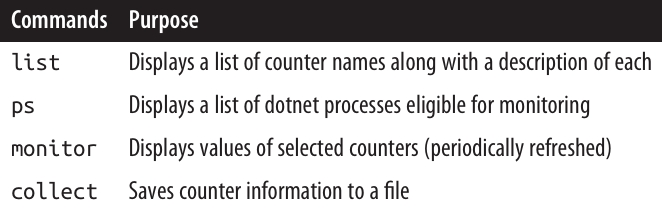
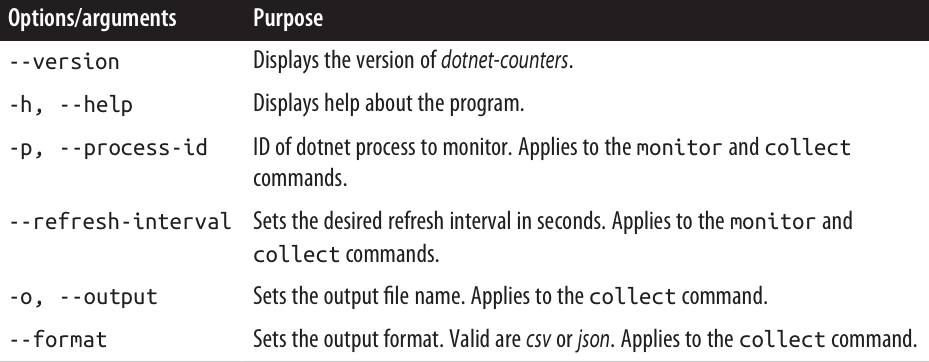
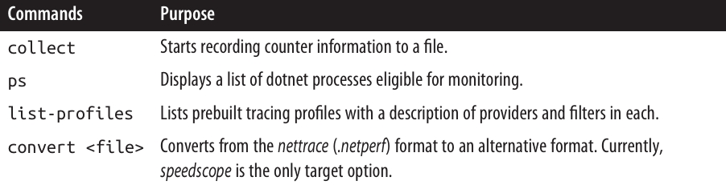

<div dir="rtl">
# فصل سیزدهم: تشخیص (Diagnostics) 

وقتی چیزی اشتباه پیش می‌رود، خیلی مهم است که اطلاعات لازم برای کمک به **تشخیص (diagnosing) مشکل** در دسترس باشد. یک **محیط توسعه یکپارچه (Integrated Development Environment – IDE)** یا یک **دیباگر (debugger)** می‌تواند در این زمینه بسیار کمک‌کننده باشد—اما معمولاً فقط در طول توسعه موجود است.
پس از انتشار (ship) یک برنامه، خودِ برنامه باید اطلاعات تشخیصی را جمع‌آوری و ثبت کند. برای برآورده کردن این نیاز، **.NET** مجموعه‌ای از امکانات را فراهم می‌کند تا بتوان اطلاعات تشخیصی را لاگ‌گیری کرد، رفتار برنامه را مانیتور کرد، خطاهای زمان اجرا را شناسایی کرد و در صورت موجود بودن، با ابزارهای دیباگ یکپارچه شد.

برخی ابزارها و APIهای تشخیصی، مخصوص **Windows** هستند زیرا به قابلیت‌های سیستم‌عامل ویندوز وابسته‌اند. برای جلوگیری از شلوغ شدن **BCL (.NET Base Class Library)** با APIهای مختص پلتفرم، مایکروسافت آن‌ها را در پکیج‌های جداگانه‌ی **NuGet** عرضه کرده است که می‌توانید به صورت اختیاری به آن‌ها ارجاع دهید. بیش از دوازده پکیج مخصوص ویندوز وجود دارد که می‌توانید همه‌ی آن‌ها را یکجا با پکیج اصلی **Microsoft.Windows.Compatibility** استفاده کنید.

انواع (types) معرفی‌شده در این فصل، عمدتاً در **namespace به نام System.Diagnostics** تعریف شده‌اند.

---

### ✂️ کامپایل شرطی (Conditional Compilation)

شما می‌توانید هر بخش از کد در C# را با استفاده از **دستورات پیش‌پردازنده (preprocessor directives)** به صورت شرطی کامپایل کنید.
این دستورات، دستورالعمل‌های خاصی برای کامپایلر هستند که با نماد `#` شروع می‌شوند (و برخلاف سایر ساختارهای C#، باید در یک خط جداگانه قرار گیرند). از نظر منطقی، این دستورات قبل از انجام کامپایل اصلی اجرا می‌شوند (هرچند در عمل، کامپایلر آن‌ها را در مرحله‌ی **lexical parsing** پردازش می‌کند).

دستورات پیش‌پردازنده برای کامپایل شرطی عبارت‌اند از:

* `#if`
* `#else`
* `#endif`
* `#elif`

✅ دستور `#if` به کامپایلر می‌گوید بخشی از کد را نادیده بگیرد مگر این‌که یک **symbol** مشخص تعریف شده باشد.
می‌توانید یک symbol را به دو روش تعریف کنید:

1. در سورس‌کد با استفاده از دستور `#define` (که فقط به همان فایل اعمال می‌شود).
2. در فایل **.csproj** با استفاده از عنصر `<DefineConstants>` (که در این صورت، به کل assembly اعمال می‌شود).

مثال:
</div>

```csharp
#define TESTMODE
// #define باید در بالای فایل نوشته شود
// طبق قرارداد، نام symbol ها با حروف بزرگ نوشته می‌شوند.
using System;
class Program
{
    static void Main()
    {
        #if TESTMODE
        Console.WriteLine("in test mode!");   // OUTPUT: in test mode!
        #endif
    }
}
```

<div dir="rtl">
اگر خط اول (یعنی `#define TESTMODE`) را حذف کنیم، برنامه بدون خط `Console.WriteLine` کامپایل خواهد شد—انگار که کلاً کامنت شده باشد.

👉 دستور `#else` مشابه دستور `else` در C# است و `#elif` هم معادل `#else` به همراه یک `#if` است.
عملگرهای `||`, `&&`, و `!` نیز به ترتیب **or**، **and** و **not** عمل می‌کنند:
</div>

```csharp
#if TESTMODE && !PLAYMODE      // اگر TESTMODE فعال باشد و PLAYMODE فعال نباشد
   ...
#endif
```

<div dir="rtl">
اما یادتان باشد: این یک عبارت معمولی C# نیست و symbolهایی که روی آن‌ها عمل می‌کنید هیچ ارتباطی به متغیرها—چه استاتیک و چه غیر از آن—ندارند.

---

### 🗂️ تعریف symbolها در سطح assembly

می‌توانید symbolهایی را که در تمام فایل‌های یک assembly اعمال می‌شوند، در فایل `.csproj` تعریف کنید (یا در Visual Studio، از طریق تب **Build** در پنجره‌ی **Project Properties**).

مثال:
</div>

```xml
<PropertyGroup>
   <DefineConstants>TESTMODE;PLAYMODE</DefineConstants>
</PropertyGroup>
```

<div dir="rtl">
اگر یک symbol را در سطح assembly تعریف کرده باشید و بخواهید آن را برای یک فایل خاص **لغو (undefine)** کنید، می‌توانید از دستور `#undef` استفاده کنید.

---

### ⚖️ کامپایل شرطی در برابر پرچم‌های متغیر استاتیک

شما می‌توانید همان مثال قبلی را با یک فیلد استاتیک ساده هم پیاده‌سازی کنید:
</div>

```csharp
static internal bool TestMode = true;
static void Main()
{
    if (TestMode) Console.WriteLine("in test mode!");
}
```

<div dir="rtl">
این روش مزیت **پیکربندی در زمان اجرا (runtime configuration)** را دارد.
پس چرا باید کامپایل شرطی را انتخاب کنیم؟

دلیل این است که **کامپایل شرطی می‌تواند کارهایی انجام دهد که پرچم‌های متغیر نمی‌توانند**، مثل:

* درج شرطی یک **attribute**
* تغییر نوع اعلان‌شده‌ی یک متغیر
* تغییر بین namespaceها یا type aliasها در یک دستور `using`

مثال:
</div>

```csharp
using TestType =
#if V2
    MyCompany.Widgets.GadgetV2;
#else
    MyCompany.Widgets.Gadget;
#endif
```

<div dir="rtl">
شما حتی می‌توانید **رفکتورینگ‌های بزرگ** را زیر یک دستور کامپایل شرطی قرار دهید، طوری که بتوانید بلافاصله بین نسخه‌ی قدیمی و جدید جابه‌جا شوید. همچنین می‌توانید کتابخانه‌هایی بنویسید که در برابر چند نسخه‌ی مختلف runtime کامپایل شوند و هر جا که امکان دارد، از قابلیت‌های جدید بهره ببرند.

یکی دیگر از مزایای کامپایل شرطی این است که **کدهای دیباگ می‌توانند به انواع (types) در assemblyهایی اشاره کنند که در نسخه‌ی نهایی (deployment) گنجانده نمی‌شوند.** 🔍

### 📌 ویژگی **Conditional Attribute**

ویژگی **Conditional** به کامپایلر دستور می‌دهد که اگر یک **symbol** مشخص تعریف نشده باشد، هر فراخوانی (call) به یک کلاس یا متد خاص را نادیده بگیرد.

برای دیدن کاربرد این ویژگی، فرض کنید متدی برای ثبت وضعیت (logging status) نوشته‌اید:
</div>

```csharp
static void LogStatus (string msg)
{
    string logFilePath = ...
    System.IO.File.AppendAllText (logFilePath, msg + "\r\n");
}
```

<div dir="rtl">
حالا تصور کنید می‌خواهید این متد فقط زمانی اجرا شود که symbol به نام **LOGGINGMODE** تعریف شده باشد.

راه‌حل اول این است که همه‌ی فراخوانی‌های `LogStatus` را داخل یک دستور `#if` قرار دهید:
</div>

```csharp
#if LOGGINGMODE
LogStatus("Message Headers: " + GetMsgHeaders());
#endif
```

<div dir="rtl">
این کار نتیجه‌ی ایده‌آل می‌دهد، اما خسته‌کننده و وقت‌گیر است.
راه‌حل دوم این است که دستور `#if` را داخل خود متد `LogStatus` قرار دهیم. اما این مشکل دارد؛ چرا که اگر این‌طور فراخوانی شود:
</div>

```csharp
LogStatus("Message Headers: " + GetComplexMessageHeaders());
```

<div dir="rtl">
در این حالت، متد `GetComplexMessageHeaders` همیشه فراخوانی خواهد شد—که ممکن است باعث افت کارایی (performance hit) شود.

---

### 🔗 ترکیب دو راه‌حل با **Conditional Attribute**

می‌توانیم عملکرد راه‌حل اول (نتیجه‌ی مطلوب) و راحتی راه‌حل دوم را با افزودن ویژگی **Conditional** (که در `System.Diagnostics` تعریف شده) به متد `LogStatus` به دست بیاوریم:
</div>

```csharp
[Conditional("LOGGINGMODE")]
static void LogStatus (string msg)
{
    ...
}
```

<div dir="rtl">
این کار به کامپایلر دستور می‌دهد که تمام فراخوانی‌های `LogStatus` را طوری در نظر بگیرد که گویی داخل یک دستور `#if LOGGINGMODE` قرار دارند.
اگر symbol تعریف نشده باشد، **هرگونه فراخوانی به `LogStatus` کلاً از خروجی نهایی کامپایل حذف خواهد شد**—از جمله **evaluation** آرگومان‌ها.
بنابراین هر عبارتی که اثر جانبی (side effect) داشته باشد نیز کلاً اجرا نمی‌شود. ✨

این ویژگی حتی زمانی که `LogStatus` و متد فراخواننده در دو assembly متفاوت باشند نیز به درستی کار می‌کند.

---

### 📦 یک مزیت دیگر

مزیت دیگر `[Conditional]` این است که بررسی شرط در زمان **کامپایل کد فراخواننده** انجام می‌شود، نه در زمان کامپایل متد مقصد. این یعنی شما می‌توانید کتابخانه‌ای حاوی متدهایی مثل `LogStatus` بنویسید و فقط **یک نسخه از آن کتابخانه** را بسازید.

👉 ویژگی `Conditional` در زمان اجرا هیچ تأثیری ندارد—این فقط یک دستورالعمل برای کامپایلر است.

---

### 🔄 جایگزین‌های **Conditional Attribute**

ویژگی `Conditional` زمانی بی‌فایده است که بخواهید عملکردی را به‌طور **پویا (runtime)** فعال یا غیرفعال کنید.
در این حالت باید از یک راه‌حل مبتنی بر **متغیر (variable-based)** استفاده کنید.

سؤال بعدی این است که چطور می‌توانیم از اجرای آرگومان‌ها در هنگام فراخوانی متدهای لاگ‌گیری شرطی جلوگیری کنیم؟
راه‌حل تابعی (functional approach) این مشکل را برطرف می‌کند:
</div>

```csharp
using System;
using System.Linq;
class Program
{
    public static bool EnableLogging;
    static void LogStatus (Func<string> message)
    {
        string logFilePath = ...
        if (EnableLogging)
            System.IO.File.AppendAllText (logFilePath, message() + "\r\n");
    }
}
```

<div dir="rtl">
با استفاده از **lambda expression**، می‌توانیم این متد را بدون شلوغی اضافی سینتکس فراخوانی کنیم:
</div>

```csharp
LogStatus(() => "Message Headers: " + GetComplexMessageHeaders());
```

<div dir="rtl">
اگر مقدار `EnableLogging` برابر `false` باشد، متد `GetComplexMessageHeaders` هیچ‌وقت اجرا نخواهد شد. 🚀

---

### 🐞 کلاس‌های **Debug** و **Trace**

کلاس‌های استاتیک **Debug** و **Trace** قابلیت‌های پایه‌ای برای **logging** و **assertion** فراهم می‌کنند.
این دو کلاس بسیار شبیه یکدیگر هستند؛ تفاوت اصلی در **هدف استفاده** است:

* کلاس **Debug** برای **buildهای دیباگ** در نظر گرفته شده است.
* کلاس **Trace** برای هر دو حالت **دیباگ** و **release** طراحی شده است.

برای همین:

* تمام متدهای کلاس `Debug` با `[Conditional("DEBUG")]` تعریف شده‌اند.
* تمام متدهای کلاس `Trace` با `[Conditional("TRACE")]` تعریف شده‌اند.

یعنی: تمام فراخوانی‌هایی که به `Debug` یا `Trace` انجام می‌دهید، توسط کامپایلر حذف می‌شوند مگر این‌که symbolهای `DEBUG` یا `TRACE` تعریف شده باشند.
(در **Visual Studio** می‌توانید این symbolها را از طریق تب **Build** در پنجره‌ی **Project Properties** فعال کنید. در پروژه‌های جدید، symbol `TRACE` به‌طور پیش‌فرض فعال است.)

---

### 📝 متدهای مهم Debug و Trace

هر دو کلاس **Debug** و **Trace** متدهای زیر را ارائه می‌دهند:

* `Write`
* `WriteLine`
* `WriteIf`

این متدها به طور پیش‌فرض پیام‌ها را به پنجره‌ی **خروجی دیباگر (debugger’s output window)** ارسال می‌کنند:
</div>

```csharp
Debug.Write("Data");
Debug.WriteLine(23 * 34);
int x = 5, y = 3;
Debug.WriteIf(x > y, "x is greater than y");
```

<div dir="rtl">
کلاس **Trace** علاوه بر این‌ها، متدهای زیر را هم دارد:

* `TraceInformation`
* `TraceWarning`
* `TraceError`

تفاوت رفتار این متدها با متدهای `Write` بستگی به **TraceListeners فعال** دارد (که در بخش «TraceListener» در صفحه‌ی ۶۱۲ توضیح داده شده است).

### 🐞 Fail و Assert

کلاس‌های **Debug** و **Trace** هر دو متدهای **Fail** و **Assert** را فراهم می‌کنند.

* متد **Fail** پیام را به هر **TraceListener** موجود در مجموعه‌ی **Listeners** کلاس Debug یا Trace ارسال می‌کند (بخش بعدی را ببینید). این متد به‌طور پیش‌فرض پیام را در خروجی دیباگر می‌نویسد:
</div>

```csharp
Debug.Fail("File data.txt does not exist!");
```

<div dir="rtl">
* متد **Assert** در صورتی که آرگومان بولی آن `false` باشد، متد Fail را فراخوانی می‌کند. این عمل را **assertion** می‌نامند و اگر نقض شود، نشان‌دهنده‌ی وجود **باگ** در کد است. مشخص کردن پیام خطا اختیاری است:
</div>

```csharp
Debug.Assert(File.Exists("data.txt"), "File data.txt does not exist!");
var result = ...
Debug.Assert(result != null);
```

<div dir="rtl">
متدهای **Write**، **Fail** و **Assert** همگی overloadهایی دارند که علاوه بر پیام، یک **category string** هم می‌پذیرند—چیزی که می‌تواند در پردازش خروجی مفید باشد.

---

### ⚖️ جایگزین assertion با Exception

یک جایگزین برای assertion این است که وقتی شرط برعکس برقرار بود، یک **exception** پرتاب کنید.
این روش در هنگام اعتبارسنجی آرگومان‌های متد بسیار رایج است:
</div>

```csharp
public void ShowMessage(string message)
{
    if (message == null) throw new ArgumentNullException("message");
    ...
}
```

<div dir="rtl">
اما تفاوت‌ها:

* این نوع «assertion» بدون قید و شرط کامپایل می‌شود و انعطاف‌پذیری کمتری دارد (چون نتیجه‌ی شکست assertion را نمی‌توانید با **TraceListeners** کنترل کنید).
* از نظر فنی، این اصلاً assertion نیست.
* **Assertion** نشان‌دهنده‌ی باگ در **کد متد جاری** است اگر نقض شود.
* **Exception** در هنگام اعتبارسنجی آرگومان، نشان‌دهنده‌ی باگ در **کد فراخواننده** است.

---

### 📡 TraceListener

کلاس **Trace** یک ویژگی استاتیک به نام **Listeners** دارد که مجموعه‌ای از نمونه‌های **TraceListener** را برمی‌گرداند. این listenerها مسئول پردازش محتوای خروجی متدهای **Write**، **Fail** و **Trace** هستند.

به طور پیش‌فرض، مجموعه‌ی **Listeners** شامل یک listener واحد است: **DefaultTraceListener**.

این listener پیش‌فرض دو ویژگی مهم دارد:

1. وقتی به دیباگری مثل Visual Studio متصل باشد، پیام‌ها به **خروجی دیباگر** نوشته می‌شوند؛ در غیر این صورت، پیام‌ها نادیده گرفته می‌شوند.
2. وقتی متد **Fail** فراخوانی شود (یا یک assertion شکست بخورد)، برنامه متوقف می‌شود.

---

### 📝 تغییر رفتار TraceListener

می‌توانید این رفتار را تغییر دهید؛ به این صورت که listener پیش‌فرض را حذف کنید و listenerهای دلخواهتان را اضافه کنید.

✅ شما می‌توانید:

* از ابتدا یک listener بسازید (با **زیرکلاس‌گیری از TraceListener**).
* یا از یکی از انواع از پیش تعریف‌شده استفاده کنید:

  * **TextWriterTraceListener** → نوشتن در یک **Stream** یا **TextWriter** یا اضافه کردن به یک فایل.
  * **EventLogTraceListener** → نوشتن در **Windows Event Log** (فقط ویندوز).
  * **EventProviderTraceListener** → نوشتن در زیرسیستم **ETW (Event Tracing for Windows)** (پشتیبانی چند سکویی).

علاوه بر این، **TextWriterTraceListener** خود به چند نوع دیگر زیرکلاس شده است:

* **ConsoleTraceListener**
* **DelimitedListTraceListener**
* **XmlWriterTraceListener**
* **EventSchemaTraceListener**

---

### ✍️ مثال: افزودن چند Listener

مثال زیر listener پیش‌فرض Trace را پاک می‌کند و سپس سه listener اضافه می‌کند:

1. یک listener که به فایل اضافه می‌کند.
2. یک listener که روی کنسول می‌نویسد.
3. یک listener که در Windows Event Log می‌نویسد.
</div>

```csharp
// پاک کردن listener پیش‌فرض:
Trace.Listeners.Clear();

// افزودن writer که در فایل trace.txt لاگ می‌نویسد:
Trace.Listeners.Add(new TextWriterTraceListener("trace.txt"));

// گرفتن خروجی کنسول و افزودن به عنوان listener:
System.IO.TextWriter tw = Console.Out;
Trace.Listeners.Add(new TextWriterTraceListener(tw));

// تنظیم Windows Event Log و افزودن listener
// توجه: CreateEventSource نیازمند دسترسی admin است
if (!EventLog.SourceExists("DemoApp"))
    EventLog.CreateEventSource("DemoApp", "Application");

Trace.Listeners.Add(new EventLogTraceListener("DemoApp"));
```

<div dir="rtl">
🔹 در مورد **Windows Event Log**:

* پیام‌هایی که با **Write**، **Fail** یا **Assert** می‌نویسید، همیشه به عنوان پیام **Information** در Event Viewer نمایش داده می‌شوند.
* پیام‌هایی که با **TraceWarning** یا **TraceError** می‌نویسید، به ترتیب به صورت **warning** یا **error** نمایش داده می‌شوند.

---

### 🎛️ فیلتر و تنظیمات TraceListener

کلاس **TraceListener** یک ویژگی به نام **Filter** (از نوع `TraceFilter`) دارد که می‌توانید برای کنترل نوشتن پیام‌ها روی آن listener استفاده کنید.

برای این کار می‌توانید:

* یکی از زیرکلاس‌های آماده‌ی `TraceFilter` مثل **EventTypeFilter** یا **SourceFilter** را استفاده کنید.
* یا یک کلاس سفارشی از `TraceFilter` بسازید و متد **ShouldTrace** را override کنید.

(مثلاً می‌توانید پیام‌ها را بر اساس category فیلتر کنید.)

---

### 🧩 ویژگی‌های دیگر TraceListener

* ویژگی‌های **IndentLevel** و **IndentSize** → برای کنترل تورفتگی (indentation).
* ویژگی **TraceOutputOptions** → برای نوشتن داده‌های اضافه.

مثال:
</div>

```csharp
TextWriterTraceListener tl = new TextWriterTraceListener(Console.Out);
tl.TraceOutputOptions = TraceOptions.DateTime | TraceOptions.Callstack;

Trace.TraceWarning("Orange alert");
```

<div dir="rtl">
خروجی:
</div>

```
DiagTest.vshost.exe Warning: 0 : Orange alert
    DateTime=2007-03-08T05:57:13.6250000Z
    Callstack=   at System.Environment.GetStackTrace(Exception e, Boolean needFileInfo)
                 at System.Environment.get_StackTrace()
                 at ...
```

<div dir="rtl">
### 🚦 پاک‌سازی و بستن Listeners

برخی از **listeners**‌ها مثل `TextWriterTraceListener` در نهایت خروجی را درون یک **stream** می‌نویسند که تحت **cache** قرار دارد. این موضوع دو پیامد دارد:

* ✍️ یک پیام ممکن است بلافاصله در **خروجی stream یا فایل** ظاهر نشود.
* 🗑️ شما باید قبل از پایان برنامه، **listener** را ببندید یا حداقل **flush** کنید؛ در غیر این صورت، آنچه در cache است از دست می‌رود (به‌طور پیش‌فرض تا **۴ KB** اگر در حال نوشتن در فایل باشید).

کلاس‌های **Trace** و **Debug** متدهای استاتیک `Close` و `Flush` را فراهم می‌کنند که به‌ترتیب روی همه‌ی listeners اعمال می‌شوند (که به نوبه‌ی خود `Close` یا `Flush` را روی writers و streams زیرین صدا می‌زنند).

* `Close` به‌طور ضمنی `Flush` را فراخوانی می‌کند، **file handle**ها را می‌بندد و از نوشتن داده‌ی بیشتر جلوگیری می‌کند.

🔑 به‌طور کلی:

* قبل از پایان برنامه، از `Close` استفاده کنید.
* هر زمان که خواستید مطمئن شوید داده‌های فعلی نوشته شده‌اند، از `Flush` استفاده کنید.

این موضوع زمانی اهمیت دارد که از listeners مبتنی بر **stream** یا **file** استفاده کنید.

همچنین، کلاس‌های **Trace** و **Debug** یک ویژگی به نام `AutoFlush` دارند. اگر مقدار آن `true` باشد، بعد از هر پیام، یک `Flush` انجام می‌شود.

📝 توصیه مهم:
اگر از **listeners** مبتنی بر فایل یا stream استفاده می‌کنید، بهتر است `AutoFlush` را روی `true` بگذارید. در غیر این صورت، اگر یک **Unhandled Exception** یا خطای بحرانی رخ دهد، آخرین **۴ KB اطلاعات تشخیصی** ممکن است از دست برود.

---

### 🐞 یکپارچگی با Debugger

گاهی اوقات مفید است که یک برنامه در صورت موجود بودن، با **Debugger** تعامل داشته باشد.

* در زمان توسعه، Debugger معمولاً همان IDE شماست (مثلاً **Visual Studio**).
* در زمان استقرار، Debugger احتمالاً ابزارهای سطح پایین‌تری مثل **WinDbg**، **Cordbg** یا **MDbg** خواهد بود.

---

#### 🛑 Attach و Break

کلاس استاتیک `Debugger` در **System.Diagnostics** توابع اصلی زیر را برای تعامل با Debugger فراهم می‌کند:

* `Break`
* `Launch`
* `Log`
* `IsAttached`

🔹 برای دیباگ کردن یک برنامه، ابتدا باید **Debugger به آن attach شود**. اگر برنامه را از داخل IDE اجرا کنید، این کار به‌طور خودکار انجام می‌شود (مگر اینکه عمداً گزینه‌ی “Start without debugging” را انتخاب کنید).

اما گاهی شروع برنامه در حالت دیباگ از داخل IDE امکان‌پذیر یا راحت نیست (مثلاً در **Windows Service** یا حتی در یک **Visual Studio Designer**).

🔑 راه‌حل:

* برنامه را به‌صورت عادی اجرا کنید.
* سپس از داخل IDE گزینه‌ی **Debug Process** را انتخاب کنید.

البته این روش اجازه نمی‌دهد در مراحل اولیه‌ی اجرای برنامه، Breakpoint بگذارید.

✔️ روش جایگزین: فراخوانی `Debugger.Break` از داخل برنامه. این متد باعث می‌شود یک Debugger راه‌اندازی شود، به برنامه attach شود و اجرای آن را متوقف کند.

* `Launch` مشابه است اما اجرای برنامه را متوقف نمی‌کند.
* بعد از attach شدن، می‌توانید با متد `Log` پیام‌ها را مستقیماً به **پنجره‌ی خروجی Debugger** بفرستید.
* وضعیت attach بودن Debugger را هم می‌توانید با ویژگی `IsAttached` بررسی کنید.

---

#### 🎛️ ویژگی‌های Debugger

دو Attribute مهم وجود دارند:

* `DebuggerStepThrough`
* `DebuggerHidden`

این‌ها به Debugger پیشنهاد می‌دهند هنگام **Single-Stepping** (اجرای خط‌به‌خط) با یک متد، سازنده یا کلاس خاص چگونه رفتار کند.

* `DebuggerStepThrough` به Debugger می‌گوید **بدون تعامل کاربر، از روی یک متد عبور کند**.
  ➡️ این موضوع در متدهای **خودکار تولیدشده** و متدهای **Proxy** که کار اصلی را به جای دیگری پاس می‌دهند مفید است.

* اگر در متد واقعی (real method) Breakpoint تنظیم شود، Debugger همچنان متد Proxy را در Call Stack نشان می‌دهد—مگر اینکه Attribute `DebuggerHidden` هم اضافه شود.

🔀 ترکیب این دو Attribute در Proxyها کمک می‌کند کاربر تمرکز بیشتری روی **منطق برنامه** داشته باشد و کمتر درگیر جزئیات شود:
</div>

```csharp
[DebuggerStepThrough, DebuggerHidden]
void DoWorkProxy()
{
  // setup...
  DoWork();
  // teardown...
}

void DoWork() {...}   // متد اصلی
```

<div dir="rtl">
---

### ⚙️ پردازش‌ها (Processes) و Threadهای پردازش

در بخش آخر فصل ۶، توضیح دادیم که چطور با `Process.Start` یک پردازش جدید راه‌اندازی کنید.
کلاس `Process` همچنین اجازه می‌دهد پردازش‌های دیگر را روی همان کامپیوتر یا یک کامپیوتر دیگر **پرس‌وجو و مدیریت کنید**.

* کلاس `Process` بخشی از **.NET Standard 2.0** است، هرچند قابلیت‌های آن روی **UWP** محدود می‌شود.

---

#### 🔍 بررسی پردازش‌های در حال اجرا

متدهای `Process.GetProcessXXX` پردازش‌ها را بر اساس **نام** یا **شناسه‌ی پردازش (PID)** یا همه‌ی پردازش‌های در حال اجرا روی یک کامپیوتر خاص برمی‌گردانند.

این شامل پردازش‌های **Managed** و **Unmanaged** می‌شود.

هر نمونه‌ی `Process` مجموعه‌ای از ویژگی‌ها دارد که شامل موارد زیر هستند:

* نام
* ID
* اولویت
* مصرف حافظه و پردازنده
* Window Handleها
* و …

نمونه کد زیر همه‌ی پردازش‌های در حال اجرای روی کامپیوتر فعلی را لیست می‌کند:
</div>

```csharp
foreach (Process p in Process.GetProcesses())
using (p)
{
    Console.WriteLine(p.ProcessName);
    Console.WriteLine("   PID:      " + p.Id);
    Console.WriteLine("   Memory:   " + p.WorkingSet64);
    Console.WriteLine("   Threads:  " + p.Threads.Count);
}
```

<div dir="rtl">
* `Process.GetCurrentProcess` پردازش فعلی را برمی‌گرداند.
* برای پایان دادن به یک پردازش می‌توانید از متد `Kill` استفاده کنید.

### 🧵 بررسی Threadها در یک Process

شما می‌توانید با ویژگی **`Process.Threads`**، روی Threadهای پردازش‌های دیگر هم **enumerate** کنید.
اما شیءهایی که دریافت می‌کنید، **`System.Threading.Thread`** نیستند؛ بلکه از نوع **`ProcessThread`** هستند. این نوع برای **وظایف مدیریتی** (Administrative) طراحی شده است، نه برای همگام‌سازی (Synchronization).

🔹 یک **ProcessThread** اطلاعات تشخیصی (Diagnostic) درباره‌ی Thread زیربنایی ارائه می‌دهد و به شما اجازه می‌دهد برخی جنبه‌های آن را کنترل کنید (مثل اولویت و وابستگی به پردازنده).

نمونه کد:
</div>

```csharp
public void EnumerateThreads (Process p)
{
  foreach (ProcessThread pt in p.Threads)
  {
    Console.WriteLine (pt.Id);
    Console.WriteLine ("   State:    " + pt.ThreadState);
    Console.WriteLine ("   Priority: " + pt.PriorityLevel);
    Console.WriteLine ("   Started:  " + pt.StartTime);
    Console.WriteLine ("   CPU time: " + pt.TotalProcessorTime);
  }
}
```

<div dir="rtl">
---

### 📚 StackTrace و StackFrame

کلاس‌های **StackTrace** و **StackFrame** یک نمای فقط‌خواندنی از **Call Stack** اجرای برنامه ارائه می‌دهند.

🔎 شما می‌توانید Stack Trace را برای:

* Thread فعلی
* یا یک **Exception**

به‌دست آورید.

این اطلاعات بیشتر برای **تشخیص خطاها (Diagnostics)** مفید هستند، هرچند گاهی هم در برنامه‌نویسی (حیله‌ها یا Hacks) به‌کار می‌روند.

* **StackTrace** → یک Call Stack کامل را نمایش می‌دهد.
* **StackFrame** → یک فراخوانی متد منفرد درون آن Stack را نمایش می‌دهد.

💡 نکته:
اگر فقط می‌خواهید **نام و شماره خط متد فراخواننده** را بدانید، استفاده از **Caller Info Attributes** گزینه‌ای سریع‌تر و ساده‌تر است (در صفحه ۲۴۶ توضیح داده شده).

---

#### 🖼️ ساختن یک StackTrace

اگر یک شیء **StackTrace** بدون آرگومان (یا همراه با یک آرگومان bool) بسازید:

* شما یک Snapshot از Call Stack فعلی می‌گیرید.
* اگر آرگومان `true` باشد، **StackTrace** فایل‌های `.pdb` (project debug) را هم می‌خواند (اگر موجود باشند) و به شما **نام فایل، شماره خط و شماره ستون** را هم می‌دهد.

🔧 فایل‌های `.pdb` زمانی تولید می‌شوند که برنامه را با گزینه‌ی `/debug` کامپایل کنید. (Visual Studio به‌طور پیش‌فرض این کار را انجام می‌دهد، مگر اینکه در **Advanced Build Settings** خلافش را بخواهید).

پس از گرفتن یک StackTrace، می‌توانید:

* یک Frame خاص را با `GetFrame` بررسی کنید.
* یا همه‌ی Frameها را با `GetFrames` دریافت کنید.

---

#### 🔨 نمونه کد
</div>

```csharp
static void Main() { A (); }
static void A()    { B (); }
static void B()    { C (); }
static void C()
{
  StackTrace s = new StackTrace(true);
  Console.WriteLine ("Total frames:   " + s.FrameCount);
  Console.WriteLine ("Current method: " + s.GetFrame(0).GetMethod().Name);
  Console.WriteLine ("Calling method: " + s.GetFrame(1).GetMethod().Name);
  Console.WriteLine ("Entry method:   " +
                      s.GetFrame(s.FrameCount-1).GetMethod().Name);

  Console.WriteLine ("Call Stack:");
  foreach (StackFrame f in s.GetFrames())
    Console.WriteLine (
      "  File: "   + f.GetFileName() +
      "  Line: "   + f.GetFileLineNumber() +
      "  Col: "    + f.GetFileColumnNumber() +
      "  Offset: " + f.GetILOffset() +
      "  Method: " + f.GetMethod().Name);
}
```

<div dir="rtl">
---

#### 🖥️ خروجی
</div>

```
Total frames:   4
Current method: C
Calling method: B
Entry method: Main
Call stack:
  File: C:\Test\Program.cs  Line: 15  Col: 4  Offset: 7  Method: C
  File: C:\Test\Program.cs  Line: 12  Col: 22 Offset: 6  Method: B
  File: C:\Test\Program.cs  Line: 11  Col: 22 Offset: 6  Method: A
  File: C:\Test\Program.cs  Line: 10  Col: 25 Offset: 6  Method: Main
```

<div dir="rtl">
🔑 نکته‌ها:

* **IL Offset** محل دستور بعدی را نشان می‌دهد، نه دستور در حال اجرا.
* اما شماره خط و ستون (اگر فایل `.pdb` موجود باشد) معمولاً نقطه‌ی اجرای واقعی را نشان می‌دهند.
* CLR تلاش می‌کند این را با استفاده از IL استنباط کند. برای همین کامپایلر دستورهای **nop** (no-operation) را درج می‌کند.

⚠️ اما اگر با **Optimization** کامپایل کنید:

* دستورهای nop درج نمی‌شوند.
* بنابراین StackTrace ممکن است شماره خط/ستون دستور بعدی را نشان دهد.
* Optimization می‌تواند حتی متدها را ادغام کند و StackTrace را کمتر قابل‌اعتماد سازد.

---

#### 📋 راه میانبر

فراخوانی `ToString()` روی یک StackTrace همان اطلاعات ضروری را به‌صورت ساده‌تر می‌دهد:
</div>

```
at DebugTest.Program.C() in C:\Test\Program.cs:line 16
at DebugTest.Program.B() in C:\Test\Program.cs:line 12
at DebugTest.Program.A() in C:\Test\Program.cs:line 11
at DebugTest.Program.Main() in C:\Test\Program.cs:line 10
```

<div dir="rtl">
---

#### ⚠️ StackTrace روی Exception

می‌توانید StackTrace مربوط به یک Exception را هم بگیرید (برای دیدن اینکه چه چیزی منجر به پرتاب شدن Exception شد) با پاس‌دادن آن به سازنده‌ی `StackTrace`.

* خود **Exception** یک ویژگی به نام `StackTrace` دارد، اما این فقط یک **string ساده** برمی‌گرداند، نه یک شیء StackTrace.
* داشتن یک شیء StackTrace خیلی مفیدتر است، مخصوصاً برای **Log کردن Exceptionها بعد از استقرار (Deployment)** که معمولاً فایل‌های `.pdb` موجود نیستند.

✅ در این حالت می‌توانید به‌جای شماره خط/ستون، **IL Offset** را Log کنید.
و با استفاده از **ildasm**، محل دقیق خطا درون متد را بیابید.

---

### 🪟 Windows Event Logs

پلتفرم **Win32** یک مکانیزم **Log مرکزی** به‌نام **Windows Event Logs** فراهم می‌کند.

* کلاس‌های **Debug** و **Trace** که قبلاً استفاده کردیم، در صورت ثبت یک **EventLogTraceListener** می‌توانند در Windows Event Log بنویسند.
* با کلاس **EventLog**، شما می‌توانید:

  * مستقیماً در Windows Event Log بنویسید (بدون نیاز به Trace یا Debug).
  * یا داده‌های رویداد را بخوانید و پایش کنید.

🛠️ نوشتن در Event Log در **برنامه‌های Windows Service** بسیار منطقی است. چون اگر خطایی رخ دهد، نمی‌توانید یک UI باز کنید و به کاربر بگویید به فایل خاصی برای اطلاعات تشخیصی مراجعه کند. همچنین، چون نوشتن Serviceها در Event Log یک **رویه استاندارد** است، این اولین جایی خواهد بود که یک مدیر سیستم (Administrator) برای بررسی مشکل سرویس شما نگاه می‌کند.

---

📑 سه Event Log استاندارد در ویندوز وجود دارد:

* **Application**
* **System**
* **Security**

📌 معمولاً برنامه‌ها در **Application Log** می‌نویسند.

### ✍️ نوشتن در **Event Log**

برای نوشتن در **Windows Event Log** مراحل زیر را انجام دهید:

1️⃣ یکی از سه **event log** موجود را انتخاب کنید (معمولاً **Application**).
2️⃣ یک **source name** (نام منبع) مشخص کنید و در صورت نیاز آن را بسازید (ساختن نیازمند دسترسی مدیریتی است).
3️⃣ متد **EventLog.WriteEntry** را با نام لاگ، نام منبع و داده‌ی پیام فراخوانی کنید.

🔹 **Source name** یک نام مشخص و قابل شناسایی برای برنامه‌ی شماست. قبل از استفاده باید آن را ثبت کنید. این کار با متد **CreateEventSource** انجام می‌شود. سپس می‌توانید از متد **WriteEntry** استفاده کنید:
</div>

```csharp
const string SourceName = "MyCompany.WidgetServer";
// CreateEventSource نیازمند دسترسی مدیریتی است، بنابراین معمولاً در بخش نصب برنامه انجام می‌شود.
if (!EventLog.SourceExists(SourceName))
    EventLog.CreateEventSource(SourceName, "Application");

EventLog.WriteEntry(SourceName,
  "Service started; using configuration file=...",
  EventLogEntryType.Information);
```

<div dir="rtl">
🔸 مقدار **EventLogEntryType** می‌تواند یکی از موارد زیر باشد:

* **Information** ℹ️
* **Warning** ⚠️
* **Error** ❌
* **SuccessAudit** ✅
* **FailureAudit** 🚫

هرکدام در **Windows Event Viewer** با یک آیکون متفاوت نمایش داده می‌شوند. همچنین می‌توانید به‌طور اختیاری یک **Category** و **Event ID** (هر دو عددی دلخواه) و داده‌ی باینری اضافه کنید.

📌 متد **CreateEventSource** همچنین اجازه می‌دهد نام یک کامپیوتر دیگر را مشخص کنید؛ در صورتی که دسترسی کافی داشته باشید، می‌توانید در **event log** آن سیستم هم بنویسید.

---

### 📖 خواندن از **Event Log**

برای خواندن از یک **event log**:
1️⃣ کلاس **EventLog** را با نام لاگ موردنظر (و در صورت نیاز، نام یک کامپیوتر دیگر) نمونه‌سازی کنید.
2️⃣ هر ورودی را از طریق ویژگی **Entries** بخوانید:
</div>

```csharp
EventLog log = new EventLog("Application");
Console.WriteLine("Total entries: " + log.Entries.Count);

EventLogEntry last = log.Entries[log.Entries.Count - 1];
Console.WriteLine("Index:   " + last.Index);
Console.WriteLine("Source:  " + last.Source);
Console.WriteLine("Type:    " + last.EntryType);
Console.WriteLine("Time:    " + last.TimeWritten);
Console.WriteLine("Message: " + last.Message);
```

<div dir="rtl">
🔹 همچنین می‌توانید همه‌ی لاگ‌ها را برای کامپیوتر فعلی (یا یک سیستم دیگر) با متد **EventLog.GetEventLogs** پیمایش کنید (برای دسترسی کامل نیاز به دسترسی مدیریتی دارید):
</div>

```csharp
foreach (EventLog log in EventLog.GetEventLogs())
    Console.WriteLine(log.LogDisplayName);
```

<div dir="rtl">
این معمولاً حداقل شامل **Application**، **Security** و **System** خواهد بود.

---

### 🔔 مانیتورینگ **Event Log**

می‌توانید به‌محض نوشته‌شدن یک ورودی جدید در **Windows Event Log** مطلع شوید. این کار با **EntryWritten event** انجام می‌شود. این رویداد برای لاگ‌های سیستم محلی فعال می‌شود و فارغ از اینکه کدام برنامه ورودی را نوشته است، رخ خواهد داد.

برای فعال‌سازی مانیتورینگ لاگ:
1️⃣ یک نمونه از **EventLog** ایجاد کنید.
2️⃣ ویژگی **EnableRaisingEvents** را روی true قرار دهید.
3️⃣ رویداد **EntryWritten** را هندل کنید.

نمونه کد:
</div>

```csharp
using (var log = new EventLog("Application"))
{
    log.EnableRaisingEvents = true;
    log.EntryWritten += DisplayEntry;
    Console.ReadLine();
}

void DisplayEntry(object sender, EntryWrittenEventArgs e)
{
    EventLogEntry entry = e.Entry;
    Console.WriteLine(entry.Message);
}
```

<div dir="rtl">
### ⚡ **Performance Counters**

**Performance Counters** یک قابلیت اختصاصی **Windows** است و برای استفاده از آن باید پکیج **NuGet** با نام
`System.Diagnostics.PerformanceCounter` نصب شود.
اگر هدف شما **Linux** یا **macOS** باشد، باید به بخش **“Cross-Platform Diagnostic Tools”** در صفحه‌ی 625 مراجعه کنید تا ابزارهای جایگزین را ببینید.

---

#### 📊 هدف از Performance Counters

مکانیزم‌های لاگ‌گیری که تاکنون بررسی کردیم بیشتر برای **تحلیل‌های بعدی** مفید هستند.
اما اگر بخواهیم از وضعیت **فعلی** یک برنامه یا کل سیستم مطلع شویم، نیاز به رویکرد **بلادرنگ (real-time)** داریم.

🔹 راهکار **Win32** برای این نیاز، استفاده از زیرساخت **performance-monitoring** است. این زیرساخت شامل:

* مجموعه‌ای از **performance counters** است که توسط سیستم و برنامه‌ها منتشر می‌شوند.
* ابزارهایی در قالب **Microsoft Management Console (MMC) snap-ins** برای مانیتورینگ بلادرنگ این کانترها.

---

#### 🗂️ دسته‌بندی Performance Counters

کانترهای عملکرد در گروه‌هایی به نام **category** (یا **performance object** در رابط‌های گرافیکی) قرار دارند.
هر **category** مجموعه‌ای از کانترهای مرتبط را برای مانیتورینگ یک جنبه از سیستم یا برنامه گرد هم می‌آورد.

مثال‌ها:

* **System** ⚙️
* **Processor** 🖥️
* **.NET CLR Memory** 💾

در دسته‌ی **.NET CLR Memory** کانترهایی مانند:

* **% Time in GC**
* **# Bytes in All Heaps**
* **Allocated bytes/sec**

هر **category** می‌تواند یک یا چند **instance** داشته باشد که به‌صورت مستقل قابل مانیتورینگ هستند.
برای نمونه:

* کانتر **% Processor Time** در دسته‌ی **Processor** این امکان را می‌دهد که **استفاده از CPU** را مانیتور کنید.
* در یک سیستم چندپردازنده‌ای، این کانتر یک instance برای هر CPU دارد و شما می‌توانید مصرف هر CPU را جداگانه بررسی کنید.

---

#### ⚠️ نکته‌ی مهم درباره‌ی دسترسی

خواندن **performance counters** یا **categories** ممکن است نیازمند دسترسی **administrator** روی سیستم محلی یا مقصد باشد، بسته به چیزی که می‌خواهید بررسی کنید.

---

### 🔍 Enumerating the Available Counters

کد زیر همه‌ی **performance counters** موجود در سیستم را پیمایش می‌کند. اگر دسته‌ای **instance** داشته باشد، کانترهای مربوط به هر instance نیز بررسی می‌شوند:
</div>

```csharp
PerformanceCounterCategory[] cats =
    PerformanceCounterCategory.GetCategories();

foreach (PerformanceCounterCategory cat in cats)
{
    Console.WriteLine("Category: " + cat.CategoryName);
    string[] instances = cat.GetInstanceNames();

    if (instances.Length == 0)
    {
        foreach (PerformanceCounter ctr in cat.GetCounters())
            Console.WriteLine("  Counter: " + ctr.CounterName);
    }
    else   // Dump counters with instances
    {
        foreach (string instance in instances)
        {
            Console.WriteLine("  Instance: " + instance);
            if (cat.InstanceExists(instance))
                foreach (PerformanceCounter ctr in cat.GetCounters(instance))
                    Console.WriteLine("    Counter: " + ctr.CounterName);
        }
    }
}
```

<div dir="rtl">
📌 خروجی این کد بیش از **۱۰٬۰۰۰ خط** خواهد بود!
همچنین اجرای آن کمی طول می‌کشد، چون متد **PerformanceCounterCategory.InstanceExists** پیاده‌سازی کارآمدی ندارد.
در یک سیستم واقعی، بهتر است اطلاعات جزئی‌تر را فقط در صورت نیاز دریافت کنید.

---

### 📝 استخراج فقط Performance Counters مربوط به .NET

نمونه کد زیر با استفاده از **LINQ** فقط کانترهای مربوط به **.NET** را واکشی کرده و نتیجه را در یک فایل XML ذخیره می‌کند:
</div>

```csharp
var x =
  new XElement("counters",
    from PerformanceCounterCategory cat in
         PerformanceCounterCategory.GetCategories()
    where cat.CategoryName.StartsWith(".NET")
    let instances = cat.GetInstanceNames()
    select new XElement("category",
      new XAttribute("name", cat.CategoryName),
      instances.Length == 0
        ? from c in cat.GetCounters()
          select new XElement("counter",
            new XAttribute("name", c.CounterName))
        : from i in instances
          select new XElement("instance", new XAttribute("name", i),
            !cat.InstanceExists(i)
              ? null
              : from c in cat.GetCounters(i)
                select new XElement("counter",
                  new XAttribute("name", c.CounterName))
        )
    )
  );

x.Save("counters.xml");
```

<div dir="rtl">
### 📊 **خواندن داده‌های Performance Counter**

برای گرفتن مقدار یک **performance counter** باید یک شیء از کلاس **PerformanceCounter** بسازید و سپس یکی از متدهای زیر را فراخوانی کنید:

* **NextValue** → یک مقدار ساده از نوع `float` برمی‌گرداند.
* **NextSample** → یک شیء از نوع `CounterSample` برمی‌گرداند که شامل ویژگی‌های پیشرفته‌تر مثل `CounterFrequency`، `TimeStamp`، `BaseValue` و `RawValue` است.

---

#### 🖥️ نمونه: نمایش مصرف CPU

کانستراکتور کلاس **PerformanceCounter** سه پارامتر می‌گیرد:

* نام **category**
* نام **counter**
* یک **instance** اختیاری

برای نمایش درصد استفاده‌ی پردازنده (CPU) روی همه‌ی هسته‌ها:
</div>

```csharp
using PerformanceCounter pc = new PerformanceCounter(
    "Processor",
    "% Processor Time",
    "_Total");

Console.WriteLine(pc.NextValue());
```

<div dir="rtl">
---

#### 💾 نمونه: نمایش مصرف واقعی حافظه‌ی خصوصی پردازش جاری
</div>

```csharp
string procName = Process.GetCurrentProcess().ProcessName;

using PerformanceCounter pc = new PerformanceCounter(
    "Process",
    "Private Bytes",
    procName);

Console.WriteLine(pc.NextValue());
```

<div dir="rtl">
---

### 🔄 مانیتورینگ تغییرات (Polling)

کلاس **PerformanceCounter** رویداد **ValueChanged** ندارد. بنابراین برای مانیتورینگ تغییرات باید **polling** انجام دهید.
در مثال زیر، هر **۲۰۰ میلی‌ثانیه** مقدار بررسی می‌شود تا زمانی که با **EventWaitHandle** سیگنال توقف ارسال شود:
</div>

```csharp
// نیازمند import کردن System.Threading و System.Diagnostics
static void Monitor(string category, string counter, string instance,
                   EventWaitHandle stopper)
{
    if (!PerformanceCounterCategory.Exists(category))
        throw new InvalidOperationException("Category does not exist");

    if (!PerformanceCounterCategory.CounterExists(counter, category))
        throw new InvalidOperationException("Counter does not exist");

    if (instance == null) instance = "";   // "" == بدون instance (نه null!)

    if (instance != "" &&
        !PerformanceCounterCategory.InstanceExists(instance, category))
        throw new InvalidOperationException("Instance does not exist");

    float lastValue = 0f;

    using (PerformanceCounter pc = new PerformanceCounter(category, counter, instance))
        while (!stopper.WaitOne(200, false))
        {
            float value = pc.NextValue();
            if (value != lastValue)   // فقط اگر تغییر کند نمایش داده می‌شود
            {
                Console.WriteLine(value);
                lastValue = value;
            }
        }
}
```

<div dir="rtl">
---

#### ⚙️ اجرای همزمان برای CPU و دیسک
</div>

```csharp
EventWaitHandle stopper = new ManualResetEvent(false);

new Thread(() =>
    Monitor("Processor", "% Processor Time", "_Total", stopper)
).Start();

new Thread(() =>
    Monitor("LogicalDisk", "% Idle Time", "C:", stopper)
).Start();

Console.WriteLine("Monitoring - press any key to quit");
Console.ReadKey();

stopper.Set();
```

<div dir="rtl">
---

### 🛠️ ایجاد کانتر و نوشتن داده در Performance Counter

قبل از نوشتن داده باید:

1. یک **category** بسازید.
2. همه‌ی **counters** مربوط به آن دسته را **در یک مرحله** تعریف کنید.

مثال:
</div>

```csharp
string category = "Nutshell Monitoring";
// دو کانتر در این دسته تعریف می‌کنیم
string eatenPerMin = "Macadamias eaten so far";
string tooHard = "Macadamias deemed too hard";

if (!PerformanceCounterCategory.Exists(category))
{
    CounterCreationDataCollection cd = new CounterCreationDataCollection();

    cd.Add(new CounterCreationData(
        eatenPerMin,
        "Number of macadamias consumed, including shelling time",
        PerformanceCounterType.NumberOfItems32));

    cd.Add(new CounterCreationData(
        tooHard,
        "Number of macadamias that will not crack, despite much effort",
        PerformanceCounterType.NumberOfItems32));

    PerformanceCounterCategory.Create(
        category,
        "Test Category",
        PerformanceCounterCategoryType.SingleInstance,
        cd);
}
```

<div dir="rtl">
📌 این کانترها بعد از ایجاد، در ابزار مانیتورینگ Windows Performance ظاهر می‌شوند (گزینه‌ی **Add Counters**).
اگر بخواهید بعدها کانترهای بیشتری اضافه کنید، باید اول **کل category را حذف** کنید (`PerformanceCounterCategory.Delete`).

⚠️ ایجاد و حذف performance counters نیازمند **دسترسی administrator** است، و معمولاً این کار در زمان نصب برنامه انجام می‌شود.

---

### ✍️ نوشتن مقدار در Counter

بعد از ایجاد یک کانتر، می‌توانید مقدار آن را تغییر دهید. کافی است یک شیء **PerformanceCounter** بسازید، ویژگی **ReadOnly** را `false` کنید و سپس مقدار **RawValue** یا متدهای **Increment / IncrementBy** را فراخوانی کنید:
</div>

```csharp
string category = "Nutshell Monitoring";
string eatenPerMin = "Macadamias eaten so far";

using (PerformanceCounter pc = new PerformanceCounter(category, eatenPerMin, ""))
{
    pc.ReadOnly = false;

    pc.RawValue = 1000;
    pc.Increment();
    pc.IncrementBy(10);

    Console.WriteLine(pc.NextValue());    // خروجی: 1011
}
```

<div dir="rtl">
---

✨ به این ترتیب می‌توانیم هم مقادیر **performance counters** را بخوانیم و هم کانترهای اختصاصی خودمان را ایجاد و مقداردهی کنیم.
### کلاس Stopwatch ⏱️

کلاس **Stopwatch** یک مکانیزم راحت برای اندازه‌گیری زمان اجرای کد فراهم می‌کند. این کلاس از **بالاترین دقتی** که سیستم‌عامل و سخت‌افزار ارائه می‌دهند استفاده می‌کند (معمولاً کمتر از یک میکروثانیه).
🔹 در مقابل، `DateTime.Now` و `Environment.TickCount` دقتی حدود **۱۵ میلی‌ثانیه** دارند.

برای استفاده:

* می‌توانید با `StartNew` یک Stopwatch ایجاد کرده و بلافاصله شروع به کار کنید.
* یا دستی نمونه بسازید و سپس `Start` را صدا بزنید.

ویژگی `Elapsed` یک **TimeSpan** برمی‌گرداند:
</div>

```csharp
Stopwatch s = Stopwatch.StartNew();
System.IO.File.WriteAllText("test.txt", new string('*', 30000000));
Console.WriteLine(s.Elapsed);    // 00:00:01.4322661
```

<div dir="rtl">
🔹 ویژگی‌های دیگر:

* `ElapsedTicks` → تعداد تیک‌های گذشته (long).
* `ElapsedMilliseconds` → زمان گذشته به میلی‌ثانیه (معمولاً راحت‌ترین).
* برای تبدیل تیک‌ها به ثانیه: `ticks / Stopwatch.Frequency`.

فراخوانی `Stop` باعث فریز شدن `Elapsed` و `ElapsedTicks` می‌شود.
✅ توجه: حتی وقتی Stopwatch در حال اجراست، هیچ فعالیت پس‌زمینه‌ای اضافه ایجاد نمی‌کند، پس `Stop` اختیاری است.

---

### ابزارهای تشخیصی کراس‌پلتفرم 🔧🌍

در این بخش، ابزارهای تشخیصی قابل استفاده در همه پلتفرم‌ها (.NET) معرفی می‌شوند:

* **dotnet-counters** → ارائه نمای کلی از وضعیت یک اپلیکیشن در حال اجرا (حافظه و CPU).
* **dotnet-trace** → مانیتورینگ دقیق‌تر عملکرد و رویدادها.
* **dotnet-dump** → گرفتن *memory dump* هنگام نیاز یا بعد از کرش.

📌 این ابزارها نیاز به دسترسی ادمین ندارند و هم برای توسعه و هم محیط عملیاتی مناسب هستند.

---

### ابزار dotnet-counters 📊

ابزار **dotnet-counters** مصرف حافظه و CPU یک پروسه .NET را مانیتور کرده و داده‌ها را در کنسول (یا فایل) نمایش می‌دهد.

#### نصب:
</div>

```bash
dotnet tool install --global dotnet-counters
```

<div dir="rtl">
#### مانیتور کردن یک پروسه:
</div>

```bash
dotnet-counters monitor System.Runtime --process-id <<ProcessID>>
```

<div dir="rtl">
* `System.Runtime` یعنی همه‌ی کانترهای دسته **System.Runtime** را مانیتور کنیم.
* می‌توانید دسته یا نام کانتر خاصی بدهید.
* دستور `dotnet-counters list` همه دسته‌ها و کانترهای موجود را لیست می‌کند.

---

### خروجی نمونه 📟

(به‌صورت مداوم آپدیت می‌شود)
</div>

```
Press p to pause, r to resume, q to quit.
   Status: Running
[System.Runtime]
   # of Assemblies Loaded                            63
   % Time in GC (since last GC)                       0
   Allocation Rate (Bytes / sec)                244,864
   CPU Usage (%)                                      6
   Exceptions / sec                                   0
   GC Heap Size (MB)                                  8
   Gen 0 GC / sec                                     0
   Gen 0 Size (B)                               265,176
   Gen 1 GC / sec                                     0
   Gen 1 Size (B)                               451,552
   Gen 2 GC / sec                                     0
   Gen 2 Size (B)                                    24
   LOH Size (B)                               3,200,296
   Monitor Lock Contention Count / sec                0
   Number of Active Timers                            0
   ThreadPool Completed Work Items / sec             15
   ThreadPool Queue Length                            0
   ThreadPool Threads Count                           9
   Working Set (MB)                                  52
```

<div dir="rtl">
**همه‌ی دستورات موجود:**
<div align="center">
    
 
</div>

پارامترهای زیر پشتیبانی می‌شوند:

<div align="center">
    
 
</div>

dotnet-trace
ردیابی‌ها (Traces) سوابق زمان‌بندی‌شده‌ای از رویدادها در برنامه شما هستند، مانند فراخوانی یک متد یا اجرای یک پرس‌وجوی پایگاه داده. ردیابی‌ها می‌توانند شامل معیارهای عملکرد و رویدادهای سفارشی نیز باشند و می‌توانند اطلاعات محلی مانند مقادیر متغیرهای محلی را نیز در بر بگیرند. به طور سنتی، .NET Framework و فریم‌ورک‌هایی مانند ASP.NET از ETW استفاده می‌کردند. در .NET 5، ردیابی‌های برنامه هنگام اجرای روی ویندوز در ETW و روی لینوکس در LTTng نوشته می‌شوند.

برای نصب این ابزار، دستور زیر را اجرا کنید:
</div>

```
dotnet tool install --global dotnet-trace
```

<div dir="rtl">
برای شروع ضبط رویدادهای یک برنامه، دستور زیر را اجرا کنید:
</div>

```
dotnet-trace collect --process-id <<ProcessId>>
```

<div dir="rtl">
این دستور dotnet-trace را با پروفایل پیش‌فرض اجرا می‌کند که رویدادهای CPU و زمان اجرای .NET را جمع‌آوری کرده و در فایلی به نام `trace.nettrace` ذخیره می‌کند. می‌توانید با گزینه `--profile` پروفایل‌های دیگر را مشخص کنید:

* `gc-verbose` ردیابی جمع‌آوری زباله و تخصیص نمونه‌ای اشیا را انجام می‌دهد.
* `gc-collect` جمع‌آوری زباله را با سربار کم ردیابی می‌کند.

گزینه `-o` به شما اجازه می‌دهد نام فایل خروجی متفاوتی مشخص کنید.

خروجی پیش‌فرض یک فایل `.netperf` است که می‌توان آن را مستقیماً در ویندوز با ابزار **PerfView** تحلیل کرد. همچنین می‌توانید dotnet-trace را وادار کنید فایلی سازگار با **Speedscope** ایجاد کند، که یک سرویس تحلیل آنلاین رایگان در [https://speedscope.app](https://speedscope.app) است. برای ایجاد فایل Speedscope (`.speedscope.json`) از گزینه `--format speedscope` استفاده کنید.

آخرین نسخه PerfView را می‌توانید از [https://github.com/microsoft/perfview](https://github.com/microsoft/perfview) دانلود کنید. نسخه‌ای که با ویندوز 10 عرضه می‌شود ممکن است از فایل‌های `.netperf` پشتیبانی نکند.

دستورات زیر پشتیبانی می‌شوند:
<div align="center">
    
 
</div>

### رویدادهای سفارشی Trace 🎯

برنامه شما می‌تواند با تعریف یک **EventSource** سفارشی، رویدادهای اختصاصی تولید کند:
</div>

```csharp
[EventSource(Name = "MyTestSource")]
public sealed class MyEventSource : EventSource
{
    public static MyEventSource Instance = new MyEventSource();

    MyEventSource() : base(EventSourceSettings.EtwSelfDescribingEventFormat)
    {
    }

    public void Log(string message, int someNumber)
    {
        WriteEvent(1, message, someNumber);
    }
}
```

<div dir="rtl">
متد **WriteEvent** دارای چند نسخه (Overload) است و می‌تواند ترکیب‌های مختلفی از انواع ساده (به‌ویژه رشته‌ها و اعداد صحیح) را بپذیرد. سپس می‌توانید به این صورت از آن استفاده کنید:
</div>

```csharp
MyEventSource.Instance.Log("Something", 123);
```

<div dir="rtl">
هنگام استفاده از **dotnet-trace**، باید نام هر منبع رویداد سفارشی که می‌خواهید ثبت شود را مشخص کنید:
</div>

```bash
dotnet-trace collect --process-id <<ProcessId>> --providers MyTestSource
```

<div dir="rtl">
---

### dotnet-dump 💾

یک **Dump**، که گاهی به آن **Core Dump** هم گفته می‌شود، تصویری از وضعیت حافظه مجازی یک پردازش است. شما می‌توانید یک پردازش در حال اجرا را به‌صورت دستی Dump کنید یا سیستم‌عامل را تنظیم کنید تا هنگام کرش برنامه، این Dump تولید شود.

#### در اوبونتو لینوکس:

برای فعال کردن Core Dump هنگام کرش برنامه:
</div>

```bash
ulimit -c unlimited
```

<div dir="rtl">
(مراحل ممکن است بسته به توزیع لینوکس متفاوت باشد)

#### در ویندوز:

از **regedit.exe** برای ایجاد یا ویرایش کلید زیر در Hive مربوط به Local Machine استفاده کنید:
</div>

```
SOFTWARE\Microsoft\Windows\Windows Error Reporting\LocalDumps
```

<div dir="rtl">
زیر این مسیر، یک کلید با نام همان فایل اجرایی خود اضافه کنید (مثلاً `foo.exe`) و سپس کلیدهای زیر را اضافه نمایید:

* **DumpFolder (REG\_EXPAND\_SZ):** مسیر ذخیره فایل‌های Dump
* **DumpType (REG\_DWORD):** مقدار ۲ برای درخواست Full Dump
* **(اختیاری) DumpCount (REG\_DWORD):** حداکثر تعداد فایل‌های Dump قبل از حذف قدیمی‌ترین آن‌ها

برای نصب ابزار، دستور زیر را اجرا کنید:
</div>

```bash
dotnet tool install --global dotnet-dump
```

<div dir="rtl">
پس از نصب، می‌توانید یک Dump به‌صورت دستی ایجاد کنید (بدون توقف پردازش):
</div>

```bash
dotnet-dump collect --process-id <<YourProcessId>>
```

<div dir="rtl">
برای شروع یک **Interactive Shell** جهت تحلیل فایل Dump:
</div>

```bash
dotnet-dump analyze <<dumpfile>>
```

<div dir="rtl">
اگر یک Exception باعث کرش برنامه شده باشد، می‌توانید از دستور **printexceptions** (یا کوتاه شده آن **pe**) برای نمایش جزئیات Exception استفاده کنید.
Shell ابزار **dotnet-dump** دستورات متعددی دارد که می‌توانید با دستور **help** لیست کامل آن‌ها را مشاهده کنید.
</div>

