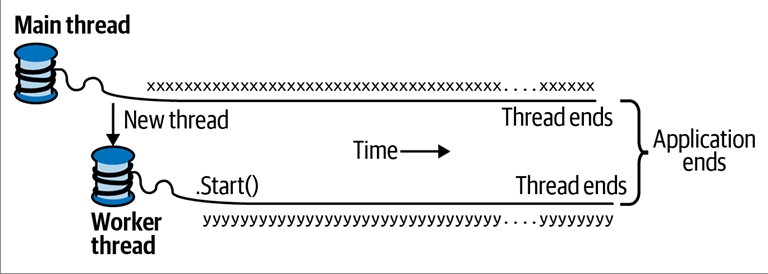

# فصل چهاردهم: هم‌زمانی و ناهم‌زمانی

بیشتر برنامه‌ها نیاز دارند با بیش از یک رویداد که به‌طور هم‌زمان رخ می‌دهد سروکار داشته باشند (هم‌زمانی یا **Concurrency**).
در این فصل، ما با پیش‌نیازهای ضروری شروع می‌کنیم، یعنی مبانی **Threading** (ایجاد و مدیریت رشته‌ها) و **Tasks** (وظایف)، و سپس اصول **Asynchrony** (ناهم‌زمانی) و توابع ناهم‌زمان در #C را با جزئیات توضیح می‌دهیم.

در **فصل ۲۱** دوباره به موضوع **Multithreading** (چند‌رشته‌ای) با جزئیات بیشتر برمی‌گردیم و در **فصل ۲۲** موضوع مرتبط یعنی **Parallel Programming** (برنامه‌نویسی موازی) را پوشش می‌دهیم.

---

## 🔹 مقدمه

در ادامه رایج‌ترین سناریوهای هم‌زمانی آورده شده است:

### 🖥️ نوشتن یک رابط کاربری پاسخ‌گو

در برنامه‌های **WPF**، موبایل و **Windows Forms** باید کارهای زمان‌بر را به‌صورت هم‌زمان با کدی که رابط کاربری شما را اجرا می‌کند انجام دهید تا رابط کاربری همچنان پاسخ‌گو باقی بماند.

### 🌐 پردازش هم‌زمان درخواست‌ها

روی یک سرور، درخواست‌های کلاینت می‌توانند به‌طور هم‌زمان برسند و بنابراین باید به‌صورت موازی پردازش شوند تا **Scalability** (مقیاس‌پذیری) حفظ شود. اگر از **ASP.NET Core** یا **Web API** استفاده کنید، زمان‌اجرا (Runtime) این کار را به‌طور خودکار برای شما انجام می‌دهد.
بااین‌حال، همچنان باید نسبت به **Shared State** (وضعیت مشترک) آگاه باشید (برای نمونه، اثر استفاده از **Static Variables** برای کش‌کردن).

### ⚡ برنامه‌نویسی موازی

کدی که محاسبات سنگینی انجام می‌دهد می‌تواند روی رایانه‌های چند‌هسته‌ای یا چند‌پردازنده‌ای سریع‌تر اجرا شود، اگر حجم کار میان هسته‌ها تقسیم شود. (فصل ۲۲ به‌طور کامل به این موضوع اختصاص دارد.)

### 🔮 اجرای حدسی (Speculative Execution)

روی ماشین‌های چند‌هسته‌ای، گاهی می‌توان با پیش‌بینی کاری که ممکن است نیاز به انجام آن باشد و انجام دادن آن از قبل، عملکرد را بهبود داد.
برنامه **LINQPad** از این تکنیک برای سرعت‌بخشیدن به ایجاد کوئری‌های جدید استفاده می‌کند.
نوع دیگری از این روش این است که چند الگوریتم مختلف را به‌طور موازی اجرا کنید که همگی یک وظیفه مشابه را حل می‌کنند. هرکدام زودتر تمام شود «برنده» خواهد بود. این روش زمانی مؤثر است که از قبل ندانید کدام الگوریتم سریع‌تر عمل خواهد کرد.

---

## 🧵 مکانیزم عمومی هم‌زمانی: Multithreading

مکانیزم عمومی‌ای که به یک برنامه اجازه می‌دهد به‌طور هم‌زمان کد را اجرا کند، **Multithreading** نام دارد.
Multithreading هم توسط **CLR** و هم توسط **سیستم‌عامل** پشتیبانی می‌شود و یک مفهوم بنیادین در هم‌زمانی است.
بنابراین درک مبانی **Threading**، و به‌ویژه تأثیر رشته‌ها بر **Shared State** (وضعیت مشترک)، ضروری است.

---

## 🧩 Threading

یک **Thread** یا «رشته»، یک مسیر اجرای مستقل است که می‌تواند جدا از سایر مسیرها پیش برود.

هر رشته درون یک **Process** (فرایند) سیستم‌عامل اجرا می‌شود که محیطی ایزوله را برای اجرای یک برنامه فراهم می‌کند.

* در یک برنامه **تک‌رشته‌ای** (Single-Threaded)، تنها یک رشته در محیط ایزوله پردازش اجرا می‌شود و بنابراین آن رشته دسترسی انحصاری به آن دارد.
* در یک برنامه **چند‌رشته‌ای** (Multi-Threaded)، چند رشته در یک فرایند واحد اجرا می‌شوند و یک محیط اجرایی مشترک (به‌ویژه حافظه) را با هم به اشتراک می‌گذارند.

این موضوع دلیل اصلی مفید بودن Multithreading است:
برای نمونه، یک رشته می‌تواند در پس‌زمینه داده‌ها را واکشی کند، درحالی‌که رشته دیگر همان داده‌ها را به‌محض رسیدن نمایش دهد. این داده‌ها به‌عنوان **Shared State** شناخته می‌شوند.

---

## 🛠️ ایجاد یک Thread

یک برنامه کلاینت (**Console**، **WPF**، **UWP** یا **Windows Forms**) در یک رشته منفرد که به‌طور خودکار توسط سیستم‌عامل ساخته می‌شود (رشته‌ی اصلی یا **Main Thread**) شروع به کار می‌کند.
این برنامه تا زمانی که شما کاری خلاف آن انجام ندهید (یعنی رشته‌های بیشتری بسازید، چه به‌طور مستقیم و چه غیرمستقیم) به‌صورت تک‌رشته‌ای باقی می‌ماند.¹

برای ایجاد و شروع یک رشته جدید، باید یک شیء از نوع **Thread** بسازید و متد **Start** آن را فراخوانی کنید.
ساده‌ترین سازنده (Constructor) برای Thread، یک **ThreadStart Delegate** می‌گیرد: متدی بدون پارامتر که نشان می‌دهد اجرای رشته از کجا آغاز شود.

### 📌 مثال:

```csharp
// توجه: همه نمونه‌های این فصل فرض می‌کنند که Namespaceهای زیر Import شده‌اند:
using System;
using System.Threading;

Thread t = new Thread (WriteY);     // ایجاد و راه‌اندازی یک رشته جدید
t.Start();                          // اجرای متد WriteY روی رشته جدید

// هم‌زمان، روی رشته اصلی هم کاری انجام می‌دهیم.
for (int i = 0; i < 1000; i++) Console.Write ("x");

void WriteY()
{
    for (int i = 0; i < 1000; i++) Console.Write ("y");
}
```

---

### 📤 خروجی نمونه:

```
xxxxxxxxxxxxxxxxyyyyyyyyyyyyyyyyyyyyyyyyyyyyyyyyyyyyy
xxxxxxxxxxxxxxxxxxxxxxxxxxxxxxxxxxxxxxxyyyyyyyyyyyyyy
yyyyyyyyyyyyyyyyyyyyyyyyyyyyyyyxxxxxxxxxxxxxxxxxxxxxx
xxxxxxxxxxxxxxxxxxxxxxxyyyyyyyyyyyyyyyyyyyyyyyyyyyyyy
yyyyyyyyyyyyyyxxxxxxxxxxxxxxxxxxxxxxxxxxxxxxxxxxxxxxx
...
```

---

رشته اصلی یک رشته جدید به نام `t` می‌سازد و روی آن متدی را اجرا می‌کند که کاراکتر `y` را به‌طور تکراری چاپ می‌کند.
به‌طور هم‌زمان، رشته اصلی نیز کاراکتر `x` را به‌طور تکراری چاپ می‌کند، همان‌طور که در شکل **۱۴-۱** نشان داده شده است.

* روی یک رایانه تک‌هسته‌ای، سیستم‌عامل باید «بُرش‌هایی» از زمان (معمولاً حدود **۲۰ میلی‌ثانیه** در ویندوز) را به هر رشته اختصاص دهد تا هم‌زمانی شبیه‌سازی شود. نتیجه این کار، بلاک‌های تکراری از `x` و `y` است.
* روی یک ماشین چند‌هسته‌ای یا چند‌پردازنده‌ای، دو رشته می‌توانند واقعاً به‌طور موازی اجرا شوند (با این شرط که دیگر پردازه‌های فعال روی رایانه هم در رقابت باشند).
  بااین‌حال در این مثال همچنان بلاک‌های تکراری از `x` و `y` مشاهده می‌کنید، زیرا جزئیات ظریفی در مکانیزمی وجود دارد که **Console** درخواست‌های هم‌زمان را مدیریت می‌کند.

<div align="center">
    
 
</div>

## 🔄 پیش‌امتیازدهی (Preemption)

وقتی اجرای یک **Thread** با اجرای کدی روی یک **Thread** دیگر در هم آمیخته می‌شود، گفته می‌شود که آن Thread **Preempted** (پیش‌امتیاز داده شده) است. این اصطلاح اغلب زمانی ظاهر می‌شود که بخواهیم توضیح دهیم چرا چیزی به‌درستی کار نکرده است!

---

## 🟢 وضعیت زنده بودن (IsAlive)

پس از شروع شدن، ویژگی (**Property**) `IsAlive` در یک Thread مقدار **true** را برمی‌گرداند تا زمانی که آن Thread پایان یابد.
یک Thread زمانی پایان می‌یابد که **Delegate**ای که به سازنده‌ی (Constructor) آن داده شده، اجرای خود را تمام کند. پس از پایان یافتن، یک Thread را نمی‌توان دوباره راه‌اندازی کرد.

---

## 📝 نام‌گذاری Threadها

هر Thread یک ویژگی به نام **Name** دارد که می‌توانید آن را برای اهداف **Debugging** تنظیم کنید.
این ویژگی در **Visual Studio** بسیار مفید است، زیرا نام Thread در **Threads Window** و نوار ابزار **Debug Location** نمایش داده می‌شود.
شما تنها یک‌بار می‌توانید نام یک Thread را تنظیم کنید؛ هر تلاش دیگری برای تغییر نام، یک **Exception** ایجاد خواهد کرد.

---

## 🔍 دسترسی به Thread فعلی

ویژگی استاتیک `Thread.CurrentThread` رشته‌ای را که در حال حاضر در حال اجراست برمی‌گرداند:

```csharp
Console.WriteLine (Thread.CurrentThread.Name);
```

---

## ⏳ Join و Sleep

### 📌 Join

می‌توانید با فراخوانی متد **Join** منتظر بمانید تا یک Thread دیگر پایان یابد:

```csharp
Thread t = new Thread (Go);
t.Start();
t.Join();
Console.WriteLine ("Thread t has ended!");

void Go() 
{ 
    for (int i = 0; i < 1000; i++) Console.Write ("y"); 
}
```

این کد ابتدا ۱۰۰۰ بار `y` چاپ می‌کند و بلافاصله پس از آن متن `"Thread t has ended!"` نمایش داده می‌شود.

همچنین می‌توانید هنگام فراخوانی **Join** یک **Timeout** مشخص کنید (برحسب میلی‌ثانیه یا یک **TimeSpan**). در این صورت متد مقدار **true** برمی‌گرداند اگر Thread پایان یافته باشد، یا **false** اگر زمان تمام شده باشد.

---

### 📌 Sleep

متد **Thread.Sleep** اجرای Thread فعلی را برای مدتی مشخص متوقف می‌کند:

```csharp
Thread.Sleep (TimeSpan.FromHours (1));  // توقف برای ۱ ساعت
Thread.Sleep (500);                     // توقف برای ۵۰۰ میلی‌ثانیه
```

فراخوانی `Thread.Sleep(0)` بلافاصله **بُرش زمانی** (Time Slice) فعلی را آزاد کرده و داوطلبانه CPU را در اختیار سایر Threadها قرار می‌دهد.
متد `Thread.Yield()` نیز همین کار را انجام می‌دهد، با این تفاوت که CPU را تنها به Threadهایی واگذار می‌کند که روی همان پردازنده در حال اجرا هستند.

* استفاده از `Sleep(0)` یا `Yield` گاهی در کدهای **Production** برای بهینه‌سازی‌های پیشرفته‌ی عملکرد مفید است.
* این‌ها همچنین ابزارهای عالی **Diagnostic** (عیب‌یابی) هستند: اگر اضافه کردن `Thread.Yield()` در هرجای کد شما باعث خراب شدن برنامه شود، تقریباً مطمئن باشید که یک **Bug** در کدتان وجود دارد.

---

## 🚫 Block شدن یک Thread

وقتی اجرای یک Thread به دلایلی متوقف شود، گفته می‌شود که آن Thread **Blocked** است؛ مثلاً هنگام اجرای **Sleep** یا منتظر ماندن برای پایان یافتن یک Thread دیگر با **Join**.

* یک Thread **Blocked** بلافاصله بُرش زمانی پردازنده‌ی خود را آزاد می‌کند.
* از آن لحظه به بعد، هیچ زمانی از CPU مصرف نمی‌کند تا زمانی که شرط Block شدن برطرف شود.

برای بررسی اینکه آیا یک Thread در حالت Block است می‌توانید از ویژگی **ThreadState** استفاده کنید:

```csharp
bool blocked = (someThread.ThreadState & ThreadState.WaitSleepJoin) != 0;
```

---

## ⚙️ ThreadState

ویژگی **ThreadState** یک **Flags Enum** است که سه «لایه» داده را به‌صورت **Bitwise** ترکیب می‌کند.
بااین‌حال بیشتر مقادیر آن زائد، بلااستفاده یا منسوخ شده‌اند.

روش توسعه‌یافته‌ی زیر یک مقدار ThreadState را به یکی از چهار مقدار مفید ساده‌سازی می‌کند:

* **Unstarted**
* **Running**
* **WaitSleepJoin**
* **Stopped**

```csharp
public static ThreadState Simplify (this ThreadState ts)
{
    return ts & (ThreadState.Unstarted |
                 ThreadState.WaitSleepJoin |
                 ThreadState.Stopped);
}
```

🔎 ویژگی ThreadState برای مقاصد **Diagnostic** مفید است، اما برای **Synchronization** مناسب نیست، زیرا وضعیت یک Thread می‌تواند بین بررسی مقدار ThreadState و عمل‌کردن بر اساس آن تغییر کند.

هنگامی‌که یک Thread **Block** یا **Unblock** می‌شود، سیستم‌عامل یک **Context Switch** انجام می‌دهد. این عمل هزینه‌ی اندکی دارد (معمولاً یک یا دو میکروثانیه).

---

## ⚖️ I/O-bound در مقابل Compute-bound

* عملیاتی که بیشتر زمان خود را در انتظار رخ‌دادن چیزی می‌گذراند، **I/O-bound** نامیده می‌شود.
  نمونه: **دانلود یک صفحه وب** یا فراخوانی `Console.ReadLine`.
  (عملیات I/O-bound معمولاً شامل ورودی یا خروجی هستند، اما این یک الزام قطعی نیست: `Thread.Sleep` هم I/O-bound محسوب می‌شود.)

* در مقابل، عملیاتی که بیشتر زمان خود را صرف انجام کارهای سنگین CPU می‌کند، **Compute-bound** نام دارد.

---

## 🔄 Blocking در مقابل Spinning

یک عملیات I/O-bound می‌تواند به دو صورت عمل کند:

1. **انتظار همگام (Synchronous)** روی Thread فعلی تا پایان عملیات (مثال: `Console.ReadLine`، `Thread.Sleep` یا `Thread.Join`).
2. **عمل ناهمگام (Asynchronous)** که با پایان عملیات در آینده، یک **Callback** اجرا می‌کند (بیشتر در ادامه این فصل توضیح داده می‌شود).

---

### 🔁 Blocking با حلقه Sleep

عملیات‌های I/O-bound که به‌صورت همگام منتظر می‌مانند بیشتر زمان خود را در حالت Block سپری می‌کنند.
گاهی این انتظار به شکل یک حلقه‌ی Sleep پیاده‌سازی می‌شود:

```csharp
while (DateTime.Now < nextStartTime)
    Thread.Sleep (100);
```

---

### 🔁 Spinning (چرخش مداوم)

گزینه‌ی دیگر این است که یک Thread به‌طور مداوم بچرخد:

```csharp
while (DateTime.Now < nextStartTime);
```

این کار به‌شدت وقت CPU را تلف می‌کند. از دید **CLR** و سیستم‌عامل، Thread در حال انجام یک محاسبه مهم است، بنابراین منابع به آن اختصاص داده می‌شود. در عمل، ما یک عملیات I/O-bound را به یک عملیات **Compute-bound** تبدیل کرده‌ایم.

---

## ✨ نکات ظریف درباره Spinning در برابر Blocking

۱. **Spinning کوتاه‌مدت** گاهی می‌تواند مؤثر باشد، زمانی که انتظار دارید شرط به‌زودی (مثلاً در چند میکروثانیه) برقرار شود. این کار از سربار و تأخیر **Context Switch** جلوگیری می‌کند.
📌 برای این منظور، .NET متدها و کلاس‌های خاصی مثل **SpinLock** و **SpinWait** را ارائه می‌دهد.

۲. **Blocking هم بی‌هزینه نیست**. هر Thread حدود **۱ مگابایت حافظه** را برای تمام مدت عمرش اشغال می‌کند و برای **CLR** و سیستم‌عامل بار مدیریتی مداوم ایجاد می‌کند.
به همین دلیل، Blocking در برنامه‌های بسیار I/O-bound که باید صدها یا هزاران عملیات هم‌زمان را مدیریت کنند می‌تواند مشکل‌ساز شود.

🔑 در چنین شرایطی، برنامه‌ها باید از رویکرد **Callback-based** استفاده کنند، یعنی هنگام انتظار، Thread خود را به‌طور کامل آزاد کنند.
این دقیقاً (بخشی از) هدف الگوهای **Asynchronous** است که در ادامه بررسی خواهیم کرد.

## 🔀 وضعیت محلی در مقابل وضعیت مشترک

**CLR** به هر Thread پشته‌ی حافظه‌ی مخصوص خودش را اختصاص می‌دهد، بنابراین متغیرهای محلی از هم جدا نگه داشته می‌شوند.

در مثال زیر، متدی با یک متغیر محلی تعریف می‌کنیم و سپس آن متد را به‌طور هم‌زمان روی **Thread اصلی** و یک **Thread جدید** فراخوانی می‌کنیم:

```csharp
new Thread (Go).Start();      // فراخوانی Go() روی یک Thread جدید
Go();                         // فراخوانی Go() روی Thread اصلی

void Go()
{
    // تعریف و استفاده از متغیر محلی - 'cycles'
    for (int cycles = 0; cycles < 5; cycles++) 
        Console.Write ('?');
}
```

برای هر Thread یک نسخه جداگانه از متغیر `cycles` روی پشته‌ی حافظه‌اش ساخته می‌شود. بنابراین، خروجی طبق انتظار ۱۰ علامت سؤال خواهد بود.

---

## 🤝 اشتراک داده بین Threadها

Threadها داده‌ها را در صورتی به اشتراک می‌گذارند که مرجع (Reference) مشترکی به یک شیء یا متغیر داشته باشند:

```csharp
bool _done = false;
new Thread (Go).Start();
Go();

void Go()
{
    if (!_done) 
    { 
        _done = true; 
        Console.WriteLine ("Done"); 
    }
}
```

در این مثال، هر دو Thread متغیر `_done` را به اشتراک می‌گذارند، پس خروجی `"Done"` فقط یک‌بار چاپ می‌شود.

---

### 📌 اشتراک‌گذاری از طریق Lambda

متغیرهای محلی که در یک **Lambda Expression** گرفته (Capture) می‌شوند نیز می‌توانند مشترک باشند:

```csharp
bool done = false;
ThreadStart action = () =>
{
    if (!done) 
    { 
        done = true; 
        Console.WriteLine ("Done"); 
    }
};

new Thread (action).Start();
action();
```

---

### 📌 اشتراک‌گذاری از طریق Fieldها

به‌طور رایج‌تر، **Fieldها** برای اشتراک داده میان Threadها استفاده می‌شوند.

```csharp
var tt = new ThreadTest();
new Thread (tt.Go).Start();
tt.Go();

class ThreadTest 
{
    bool _done;
    public void Go()
    {
        if (!_done) 
        { 
            _done = true; 
            Console.WriteLine ("Done"); 
        }
    }
}
```

---

### 📌 اشتراک‌گذاری از طریق Static Field

راه دیگر برای اشتراک داده‌ها میان Threadها استفاده از **Static Field**هاست:

```csharp
class ThreadTest 
{
    static bool _done;    // Static Fieldها میان همه Threadها در یک Process مشترک هستند

    static void Main()
    {
        new Thread (Go).Start();
        Go();
    }

    static void Go()
    {
        if (!_done) 
        { 
            _done = true; 
            Console.WriteLine ("Done"); 
        }
    }
}
```

---

## ⚠️ مشکل Thread Safety

هر چهار مثال بالا مفهوم کلیدی دیگری را نشان می‌دهند: **ایمنی Threadها** (یا بهتر بگوییم، نبود آن!).
در حقیقت خروجی **نامعین** است: این امکان (هرچند نادر) وجود دارد که `"Done"` دوبار چاپ شود.

اگر ترتیب دستورات در متد `Go` را عوض کنیم، احتمال چاپ دوباره `"Done"` به‌شدت افزایش می‌یابد:

```csharp
static void Go()
{
    if (!_done) 
    { 
        Console.WriteLine ("Done"); 
        _done = true; 
    }
}
```

مشکل اینجاست که یک Thread ممکن است در حال بررسی شرط `if` باشد در همان لحظه‌ای که Thread دیگر دارد `WriteLine` را اجرا می‌کند—قبل از آنکه فرصت کند مقدار `_done` را برابر **true** کند.

این مثال یکی از راه‌های متعدد را نشان می‌دهد که در آن **Shared Writable State** (وضعیت مشترک قابل‌نوشتن) می‌تواند خطاهای متناوبی ایجاد کند؛ همان خطاهایی که **Multithreading** به‌بدنامی برای آن‌ها مشهور است.

---

## 🔒 قفل‌گذاری و ایمنی Threadها

برای حل مثال قبلی می‌توانیم هنگام خواندن و نوشتن روی Field مشترک، یک **Exclusive Lock** بگیریم.
\#C برای این منظور دستور `lock` را فراهم کرده است:

```csharp
class ThreadSafe 
{
    static bool _done;
    static readonly object _locker = new object();

    static void Main()
    {
        new Thread (Go).Start();
        Go();
    }

    static void Go()
    {
        lock (_locker)
        {
            if (!_done) 
            { 
                Console.WriteLine ("Done"); 
                _done = true; 
            }
        }
    }
}
```

وقتی دو Thread هم‌زمان برای گرفتن یک Lock (که می‌تواند روی هر شیء از نوع Reference باشد؛ در اینجا `_locker`) رقابت کنند، یکی از آن‌ها منتظر می‌ماند (Blocked) تا Lock آزاد شود.
این کار تضمین می‌کند که فقط یک Thread می‌تواند هم‌زمان وارد بلوک کد شود، و `"Done"` فقط یک‌بار چاپ خواهد شد.

کدی که به این شکل محافظت شده باشد—در برابر عدم قطعیت در یک محیط چند‌رشته‌ای—به آن **Thread Safe** می‌گویند.

---

## ⚡ عملیات ناامن حتی در ساده‌ترین حالات

حتی عمل ساده‌ی **Auto-increment** یک متغیر هم Thread Safe نیست:

عبارت `x++` روی پردازنده به‌صورت چند عمل جداگانه (خواندن، افزایش و نوشتن) اجرا می‌شود.
بنابراین اگر دو Thread هم‌زمان `x++` را خارج از یک Lock اجرا کنند، متغیر ممکن است فقط یک‌بار افزایش یابد به‌جای دوبار (یا بدتر، مقدار `x` ممکن است در شرایط خاص به‌شکل تکه‌تکه و نادرست ذخیره شود).

---

## 🚫 محدودیت‌های قفل‌گذاری

قفل‌گذاری **گلوله نقره‌ای** برای حل همه مشکلات Thread Safety نیست:

* ممکن است فراموش کنید که در حین دسترسی به یک Field از Lock استفاده کنید.
* قفل‌گذاری خودش می‌تواند مشکلاتی مانند **Deadlock** ایجاد کند.

یک نمونه خوب برای استفاده از قفل‌گذاری، دسترسی به یک **Cache در حافظه** است که برای نگهداری اشیای پایگاه داده در یک برنامه‌ی **ASP.NET** استفاده می‌شود.
این نوع برنامه ساده است و به‌درستی کار می‌کند و هیچ خطری برای Deadlock وجود ندارد.
نمونه‌ای از این موضوع را در بخش **"Thread Safety in Application Servers"** (صفحه ۹۰۱) خواهیم دید.

## 📤 ارسال داده به یک Thread

گاهی لازم است هنگام شروع یک **Thread**، آرگومان‌هایی به متد ورودی آن ارسال کنید.
ساده‌ترین راه برای این کار استفاده از **Lambda Expression** است که متد را با آرگومان‌های مورد نظر فراخوانی می‌کند:

```csharp
Thread t = new Thread ( () => Print ("Hello from t!") );
t.Start();

void Print (string message) => Console.WriteLine (message);
```

با این روش، می‌توانید هر تعداد آرگومان را به متد ارسال کنید.
حتی می‌توانید کل پیاده‌سازی را در یک **Lambda چند‌دستوره‌ای** قرار دهید:

```csharp
new Thread (() =>
{
    Console.WriteLine ("I'm running on another thread!");
    Console.WriteLine ("This is so easy!");
}).Start();
```

---

### 🔄 روش دیگر: استفاده از `Thread.Start`

روش جایگزین (اما کمتر انعطاف‌پذیر) این است که آرگومان را به متد `Start` ارسال کنیم:

```csharp
Thread t = new Thread (Print);
t.Start ("Hello from t!");

void Print (object messageObj)
{
    string message = (string) messageObj;   // نیاز به Cast داریم
    Console.WriteLine (message);
}
```

این روش کار می‌کند چون سازنده‌ی **Thread** برای دو نوع Delegate **Overload** شده است:

```csharp
public delegate void ThreadStart();
public delegate void ParameterizedThreadStart (object obj);
```

---

## 🧩 Lambda Expressions و متغیرهای Captured

همان‌طور که دیدیم، **Lambda Expression** راحت‌ترین و قدرتمندترین روش برای ارسال داده به یک Thread است.
اما باید مراقب باشید که بعد از شروع Thread، به‌طور ناخواسته متغیرهای Captured را تغییر ندهید.

برای نمونه:

```csharp
for (int i = 0; i < 10; i++)
    new Thread (() => Console.Write (i)).Start();
```

خروجی **نامعین** است! مثالی از خروجی:

```
0223557799
```

مشکل این است که متغیر `i` در طول اجرای حلقه به یک محل حافظه‌ی مشترک اشاره دارد.
بنابراین هر Thread، متدی را روی متغیری فراخوانی می‌کند که ممکن است هم‌زمان در حال تغییر باشد!

✅ راه‌حل: استفاده از یک متغیر موقت:

```csharp
for (int i = 0; i < 10; i++)
{
    int temp = i;
    new Thread (() => Console.Write (temp)).Start();
}
```

حالا هر عدد از **۰ تا ۹** دقیقاً یک‌بار چاپ می‌شود.
(البته ترتیب هنوز مشخص نیست، چون Threadها می‌توانند در زمان‌های نامعین شروع شوند.)

این مشکل مشابه موضوع **"Captured Variables"** (صفحه ۴۳۴) است؛
مشکل هم به قوانین C# در Capture متغیرهای حلقه مربوط می‌شود و هم به Multithreading.

در این روش، متغیر `temp` محلی به هر Iteration حلقه است، پس هر Thread حافظه‌ای متفاوت Capture می‌کند و مشکلی پیش نمی‌آید.

یک مثال ساده‌تر برای نمایش مشکل:

```csharp
string text = "t1";
Thread t1 = new Thread ( () => Console.WriteLine (text) );
text = "t2";
Thread t2 = new Thread ( () => Console.WriteLine (text) );
t1.Start(); t2.Start();
```

چون هر دو Lambda متغیر `text` را Capture کرده‌اند، خروجی دوبار `"t2"` خواهد بود.

---

## ⚠️ مدیریت استثناها در Threadها

بلوک‌های **try/catch/finally** که هنگام ایجاد یک Thread در جریان هستند، هیچ تأثیری روی آن Thread هنگام اجرا ندارند.

مثال:

```csharp
try
{
    new Thread (Go).Start();
}
catch (Exception ex)
{
    // اینجا هیچ‌وقت اجرا نمی‌شود!
    Console.WriteLine ("Exception!");
}

void Go() { throw null; }   // پرتاب NullReferenceException
```

در اینجا، Thread جدید با یک **Unhandled NullReferenceException** مواجه می‌شود.
این رفتار منطقی است، چون هر Thread مسیر اجرای مستقل خود را دارد.

✅ راه‌حل این است که **Exception Handler** را داخل متد `Go` قرار دهیم:

```csharp
new Thread (Go).Start();

void Go()
{
    try
    {
        ...
        throw null;    // اینجا خطا پرتاب می‌شود
        ...
    }
    catch (Exception ex)
    {
        // معمولاً Exception را Log می‌کنیم یا به یک Thread دیگر سیگنال می‌دهیم
        ...
    }
}
```

در برنامه‌های واقعی، باید در تمام متدهای ورودی Thread **Exception Handler** داشته باشید—همان‌طور که در Thread اصلی برنامه هم نیاز دارید.
چون یک Exception مدیریت‌نشده باعث بسته‌شدن کل برنامه و نمایش یک پنجره‌ی ناخوشایند می‌شود.

---

## 🗂️ مدیریت متمرکز استثناها

در برنامه‌های **WPF، UWP و Windows Forms** می‌توانید برای مدیریت سراسری Exceptionها مشترک شوید:

* `Application.DispatcherUnhandledException`
* `Application.ThreadException`

این رویدادها پس از وقوع یک Exception مدیریت‌نشده در هر بخش برنامه که از طریق Message Loop فراخوانی شده است (یعنی تمام کدی که روی Thread اصلی در حال اجراست) فعال می‌شوند.

این روش به‌عنوان یک پشتوانه برای **Log کردن و گزارش باگ‌ها** مفید است (هرچند برای Exceptionهای مدیریت‌نشده روی Worker Threadها فعال نمی‌شود).

مدیریت این رویدادها از بسته‌شدن برنامه جلوگیری می‌کند؛ البته ممکن است تصمیم بگیرید برنامه را مجدداً راه‌اندازی کنید تا از حالت ناپایدار احتمالی جلوگیری شود.

## 🌗 Foreground در مقابل Background Threads

به‌طور پیش‌فرض، Threadهایی که شما به‌طور صریح ایجاد می‌کنید، **Foreground** هستند.

🔹 **Foreground Thread** باعث می‌شود برنامه تا زمانی که حتی یکی از آن‌ها در حال اجراست، زنده بماند.
🔹 **Background Thread** چنین اثری ندارد؛ به‌محض اینکه همه‌ی Foreground Threadها تمام شوند، برنامه پایان می‌یابد و هر Background Threadی که هنوز در حال اجراست، ناگهانی قطع می‌شود.

⚠️ وضعیت Foreground یا Background هیچ ارتباطی با **Priority** (اولویت تخصیص زمان پردازش) ندارد.

می‌توانید وضعیت یک Thread را از طریق ویژگی `IsBackground` پرس‌وجو یا تغییر دهید:

```csharp
static void Main (string[] args)
{
    Thread worker = new Thread ( () => Console.ReadLine() );
    if (args.Length > 0) worker.IsBackground = true;
    worker.Start();
}
```

* اگر برنامه بدون آرگومان اجرا شود، Thread به‌صورت **Foreground** خواهد بود و منتظر می‌ماند تا کاربر Enter بزند.
* اگر برنامه با آرگومان اجرا شود، Thread به‌صورت **Background** است و برنامه تقریباً بلافاصله تمام می‌شود (و `ReadLine` قطع می‌گردد).

❌ توجه: وقتی برنامه این‌گونه پایان یابد، بلاک‌های `finally` در پشته‌ی اجرای Background Thread اجرا نمی‌شوند.
بنابراین اگر برای پاک‌سازی (مثل حذف فایل‌های موقت) از `finally` یا `using` استفاده می‌کنید، باید مطمئن شوید هنگام خروج از برنامه، این Threadها به‌طور صحیح به پایان برسند (مثلاً با `Join` یا **Signaling**). همیشه هم باید **Timeout** تعیین کنید تا در صورت لجبازی یک Thread، برنامه بسته نشود.

---

## 🎚️ اولویت Threads

ویژگی `Priority` تعیین می‌کند یک Thread چه میزان زمان پردازش نسبت به سایر Threadها دریافت کند:

```csharp
enum ThreadPriority { Lowest, BelowNormal, Normal, AboveNormal, Highest }
```

این موضوع زمانی اهمیت دارد که چندین Thread هم‌زمان فعال باشند.

* بالا بردن اولویت می‌تواند باعث شود Threadهای دیگر **گرسنه** بمانند.
* اگر می‌خواهید Thread شما اولویتی بالاتر از سایر Processها داشته باشد، باید اولویت Process را هم بالا ببرید:

```csharp
using Process p = Process.GetCurrentProcess();
p.PriorityClass = ProcessPriorityClass.High;
```

این کار برای **پردازش‌های غیر-UI کوچک با نیاز به واکنش سریع** مناسب است. اما در برنامه‌های پرمصرف (مخصوصاً با UI)، افزایش اولویت Process می‌تواند کل سیستم را کند کند.

---

## 📡 Signaling

گاهی لازم است یک Thread منتظر بماند تا از Threadهای دیگر سیگنال دریافت کند.
ساده‌ترین سازه برای این کار **ManualResetEvent** است:

* `WaitOne` → Thread فعلی را مسدود می‌کند.
* `Set` → سیگنال را باز می‌کند و منتظرها آزاد می‌شوند.

مثال:

```csharp
var signal = new ManualResetEvent (false);

new Thread (() =>
{
    Console.WriteLine ("Waiting for signal...");
    signal.WaitOne();
    signal.Dispose();
    Console.WriteLine ("Got signal!");
}).Start();

Thread.Sleep(2000);
signal.Set();  // سیگنال باز شد
```

بعد از فراخوانی `Set`، سیگنال باز می‌ماند تا زمانی که دوباره `Reset` شود.
CLR سازه‌های Signaling متنوعی دارد که در فصل ۲۱ بررسی می‌شوند.

---

## 🖥️ Threading در برنامه‌های Rich Client

در برنامه‌های **WPF، UWP و Windows Forms**، اجرای عملیات طولانی روی Thread اصلی باعث **هنگ کردن UI** می‌شود، چون همان Thread مسئول پردازش ورودی‌ها (کیبورد/ماوس) و رندر رابط کاربری است.

راه‌حل:

* ایجاد **Worker Thread** برای کارهای زمان‌بر.
* سپس انتقال نتیجه به Thread اصلی برای به‌روزرسانی UI.

⚠️ همه‌ی این فریم‌ورک‌ها مدل Threading دارند که فقط اجازه می‌دهد UI توسط همان Threadی دسترسی یابد که آن را ساخته است (معمولاً Thread اصلی). در غیر این صورت، رفتار نامشخص یا Exception رخ می‌دهد.

برای به‌روزرسانی UI از Worker Thread باید درخواست را به UI Thread **Marshal** کنید:

* **WPF** → با `Dispatcher.BeginInvoke` یا `Dispatcher.Invoke`
* **UWP** → با `Dispatcher.RunAsync` یا `Dispatcher.Invoke`
* **Windows Forms** → با `Control.BeginInvoke` یا `Control.Invoke`

`BeginInvoke`/`RunAsync` Delegate را در صف پیام UI می‌گذارند (غیرمسدودکننده).
`Invoke` همان کار را می‌کند، اما تا پردازش Delegate توسط UI Thread صبر می‌کند (مسدودکننده و با امکان بازگشت مقدار).

---

## 📝 مثال در WPF

فرض کنید یک پنجره WPF داریم که شامل TextBoxی به نام `txtMessage` است. می‌خواهیم پس از یک کار زمان‌بر، متن آن را تغییر دهیم:

```csharp
partial class MyWindow : Window
{
    public MyWindow()
    {
        InitializeComponent();
        new Thread (Work).Start();
    }

    void Work()
    {
        Thread.Sleep (5000);           // شبیه‌سازی کار زمان‌بر
        UpdateMessage ("The answer");
    }

    void UpdateMessage (string message)
    {
        Action action = () => txtMessage.Text = message;
        Dispatcher.BeginInvoke (action);
    }
}
```

🔹 پنجره فوراً پاسخ‌گو خواهد بود.
🔹 بعد از ۵ ثانیه، TextBox به‌روزرسانی می‌شود.

در Windows Forms هم مشابه است، با این تفاوت که باید از متد `BeginInvoke` فرم استفاده کنید:

```csharp
void UpdateMessage (string message)
{
    Action action = () => txtMessage.Text = message;
    this.BeginInvoke (action);
}
```

---

## 🪟 چندین UI Thread

در یک برنامه می‌توان چندین UI Thread داشت، هرکدام مالک یک **پنجره‌ی مستقل**.
این معمولاً در **SDI Applications** (مثل Microsoft Word) استفاده می‌شود. هر پنجره‌ی مستقل می‌تواند UI Thread خودش را داشته باشد تا پاسخ‌گویی بیشتری به کاربر ارائه دهد.

### کانتکست‌های همگام‌سازی (Synchronization Contexts) 🔄

در فضای نام **System.ComponentModel** کلاسی به نام **SynchronizationContext** وجود دارد که امکان **عمومیت دادن به Thread Marshaling** را فراهم می‌کند.

📱💻 در APIهای مربوط به rich-client برای موبایل و دسکتاپ (یعنی **UWP، WPF و Windows Forms**) هرکدام زیرکلاسی از **SynchronizationContext** تعریف و ایجاد می‌کنند. شما می‌توانید این نمونه را از طریق ویژگی (Property) ایستا به نام **SynchronizationContext.Current** (وقتی روی یک UI thread در حال اجرا هستید) به‌دست آورید.

گرفتن این property به شما اجازه می‌دهد بعداً از داخل یک worker thread به کنترل‌های UI “post” کنید:

```csharp
partial class MyWindow : Window
{
    SynchronizationContext _uiSyncContext;

    public MyWindow()
    {
        InitializeComponent();
        // گرفتن کانتکست همگام‌سازی برای UI thread جاری:
        _uiSyncContext = SynchronizationContext.Current;
        new Thread(Work).Start();
    }

    void Work()
    {
        Thread.Sleep(5000);   // شبیه‌سازی یک کار زمان‌بر
        UpdateMessage("The answer");
    }

    void UpdateMessage(string message)
    {
        // Marshal کردن delegate به UI thread:
        _uiSyncContext.Post(_ => txtMessage.Text = message, null);
    }
}
```

🔑 این روش مفید است چون در همه‌ی APIهای رابط کاربری rich-client به یک شکل کار می‌کند.

فراخوانی **Post** معادل فراخوانی **BeginInvoke** روی یک Dispatcher یا Control است. همچنین متدی به نام **Send** وجود دارد که معادل **Invoke** است.

---

### Thread Pool 🏊‍♂️

وقتی یک thread جدید ایجاد می‌کنید، چند صد میکروثانیه صرف آماده‌سازی چیزهایی مثل stack متغیرهای محلی می‌شود. **Thread Pool** این overhead را کاهش می‌دهد چون شامل مجموعه‌ای از threadهای از پیش ساخته‌شده و قابل بازیافت است.

🔹 استفاده از Thread Pool برای برنامه‌نویسی موازی کارآمد و **Concurrency** ریزدانه‌ای ضروری است. این کار اجازه می‌دهد عملیات‌های کوتاه اجرا شوند بدون اینکه overhead ایجاد Thread زیاد شود.

اما هنگام استفاده از pooled threadها باید چند نکته را در نظر بگیرید:

* 🚫 نمی‌توانید خاصیت **Name** را برای pooled threadها تنظیم کنید (اشکال‌زدایی سخت‌تر می‌شود، گرچه در Visual Studio می‌توانید یک description به آن‌ها اضافه کنید).
* 🕑 pooled threadها همیشه **background thread** هستند.
* ❌ بلاک کردن pooled threadها می‌تواند عملکرد را کاهش دهد (نگاه کنید به «Hygiene in the thread pool»).

می‌توانید **Priority** یک pooled thread را تغییر دهید؛ وقتی thread آزاد شود و به Pool برگردد، مقدارش دوباره روی Normal تنظیم می‌شود.

برای بررسی اینکه آیا در حال حاضر روی یک pooled thread در حال اجرا هستید یا نه، می‌توانید از خاصیت **Thread.CurrentThread.IsThreadPoolThread** استفاده کنید.

---

### ورود به Thread Pool 🚀

ساده‌ترین راه اجرای صریح یک کار در thread pool استفاده از **Task.Run** است (این موضوع را در بخش بعدی کامل‌تر توضیح می‌دهیم):

```csharp
// Task در فضای نام System.Threading.Tasks است
Task.Run(() => Console.WriteLine("Hello from the thread pool"));
```

قبل از نسخه‌ی **.NET Framework 4.0** که Task وجود نداشت، روش رایج استفاده از **ThreadPool.QueueUserWorkItem** بود:

```csharp
ThreadPool.QueueUserWorkItem(notUsed => Console.WriteLine("Hello"));
```

همچنین استفاده‌های زیر به‌طور ضمنی از thread pool بهره می‌برند:

* 🌐 سرورهای اپلیکیشن **ASP.NET Core** و **Web API**
* ⏱️ کلاس‌های **System.Timers.Timer** و **System.Threading.Timer**
* 📊 ساختارهای برنامه‌نویسی موازی (توضیح در فصل 22)
* ⚙️ کلاس قدیمی **BackgroundWorker**

---

### رعایت بهداشت در Thread Pool 🧹

Thread Pool وظیفه دیگری هم دارد: جلوگیری از ایجاد **oversubscription**.

❗ Oversubscription یعنی تعداد threadهای فعال بیشتر از تعداد هسته‌های CPU باشد و سیستم‌عامل مجبور شود بین آن‌ها time-slice انجام دهد. این کار کارایی را کاهش می‌دهد چون context switch پرهزینه است و cacheهای CPU را هم بی‌اعتبار می‌کند.

✅ CLR از oversubscription جلوگیری می‌کند با:

* صف‌بندی (queue) کردن تسک‌ها
* و کنترل شروع آن‌ها

اول به اندازه تعداد هسته‌های سخت‌افزاری تسک‌ها را به‌طور همزمان اجرا می‌کند، سپس با استفاده از یک الگوریتم hill-climbing سطح Concurrency را تنظیم می‌کند. اگر throughput بهتر شود، در همان جهت ادامه می‌دهد وگرنه مسیرش را عوض می‌کند.

این استراتژی در صورتی بهترین عملکرد را دارد که:

1. 🕒 کارها کوتاه‌مدت باشند (کمتر از ۲۵۰ میلی‌ثانیه، و ترجیحاً زیر ۱۰۰ میلی‌ثانیه).
2. 🚫 کارهایی که بیشتر وقتشان را در حالت **Blocked** هستند، غالب نباشند.

بلاک شدن مشکل‌ساز است چون CLR تصور می‌کند CPU درگیر است. CLR هوشمند است و برای جبران threadهای بیشتری وارد Pool می‌کند؛ اما این کار می‌تواند دوباره به oversubscription منجر شود و همچنین باعث تأخیر (latency) شود، مخصوصاً در ابتدای اجرای اپلیکیشن (بیشتر در سیستم‌عامل‌های client که مصرف منابع پایین‌تری ترجیح داده می‌شود).

👌 رعایت بهداشت در Thread Pool وقتی اهمیت بیشتری دارد که بخواهید CPU را به‌طور کامل استفاده کنید (مثلاً با استفاده از APIهای برنامه‌نویسی موازی در فصل 22).
### تسک‌ها (Tasks) ⚡

🔹 یک **Thread** ابزاری سطح پایین برای ایجاد **Concurrency** است و محدودیت‌هایی دارد، از جمله:

* 📥 اگرچه فرستادن داده به داخل یک Thread که ایجاد کرده‌اید ساده است، گرفتن یک **مقدار بازگشتی (return value)** از Threadی که Join کرده‌اید آسان نیست. باید یک **فیلد مشترک** تنظیم کنید. همچنین اگر عملیات یک **Exception** پرتاب کند، گرفتن و منتقل کردن آن هم دردسر دارد.
* 🔄 نمی‌توانید به Thread بگویید وقتی تمام شد چیزی دیگری را شروع کند؛ بلکه باید آن را Join کنید (که باعث بلاک شدن Thread خودتان می‌شود).

این محدودیت‌ها باعث می‌شوند **Concurrency ریزدانه‌ای (fine-grained)** سخت شود؛ یعنی ترکیب عملیات‌های کوچک‌تر برای ساخت عملیات‌های همزمان بزرگ‌تر مشکل است (که برای **برنامه‌نویسی Asynchronous** حیاتی است). در نتیجه نیاز به **synchronization دستی** (مثل Locking، Signaling و غیره) بیشتر می‌شود که خودش مشکلات دیگری دارد.

همچنین استفاده مستقیم از Threadها اثرات منفی روی **کارایی** دارد (توضیح در بخش «Thread Pool»). اگر نیاز به اجرای صدها یا هزاران عملیات I/O همزمان داشته باشید، رویکرد Thread‌محور باعث مصرف صدها یا هزاران مگابایت حافظه صرفاً برای overhead مربوط به Threadها می‌شود.

✅ کلاس **Task** به همه این مشکلات کمک می‌کند. **Task** نسبت به Thread یک **انتزاع سطح بالاتر** است؛ یعنی نشان‌دهنده یک عملیات همزمان است که ممکن است پشتیبانی‌شده توسط Thread باشد یا نباشد.

ویژگی‌ها:

* 🔗 **Taskها ترکیب‌پذیر (compositional)** هستند (می‌توانید آن‌ها را با استفاده از Continuationها به هم زنجیر کنید).
* 🏊 می‌توانند از Thread Pool استفاده کنند تا زمان شروع را کم کنند.
* 📞 با استفاده از **TaskCompletionSource** می‌توانند رویکرد Callback را پیاده‌سازی کنند که اصلاً نیازی به Threadها ندارد (مناسب برای عملیات I/O-bound).

کلاس‌های Task در **.NET Framework 4.0** به‌عنوان بخشی از کتابخانه برنامه‌نویسی موازی معرفی شدند، و بعداً با **awaiters** بهبود پیدا کردند تا در سناریوهای عمومی Concurrency هم خوب کار کنند. آن‌ها همچنین پایه‌ی **توابع Asynchronous در C#** هستند.

(در این بخش، ویژگی‌های Task مرتبط با **برنامه‌نویسی موازی** را کنار می‌گذاریم و در فصل 22 به آن‌ها می‌پردازیم.)

---

### شروع یک Task ▶️

ساده‌ترین راه برای شروع یک Task پشتیبانی‌شده توسط Thread استفاده از متد ایستای **Task.Run** است (کلاس Task در فضای نام **System.Threading.Tasks** است):

```csharp
Task.Run(() => Console.WriteLine("Foo"));
```

به‌طور پیش‌فرض، Taskها روی **Thread Pool** اجرا می‌شوند که **background thread** هستند.
یعنی وقتی **main thread** تمام شود، همه Taskهایی که ساخته‌اید هم متوقف می‌شوند.

پس در یک **Console Application**، باید main thread را بعد از شروع Task بلاک کنید (مثلاً با **Wait** روی Task یا با **Console.ReadLine**):

```csharp
Task.Run(() => Console.WriteLine("Foo"));
Console.ReadLine();
```

در **LINQPad** نیازی به `Console.ReadLine` نیست، چون پروسه‌ی LINQPad به‌طور خودکار background threadها را زنده نگه می‌دارد.

فراخوانی **Task.Run** تقریباً شبیه به ایجاد یک Thread است:

```csharp
new Thread(() => Console.WriteLine("Foo")).Start();
```

اما `Task.Run` یک **Task object** برمی‌گرداند که می‌توانیم وضعیت پیشرفت آن را مانیتور کنیم (مشابه Thread object).
توجه کنید که بعد از `Task.Run` دیگر **Start** نمی‌زنیم چون این متد **Hot Task** ایجاد می‌کند. (می‌توانید با سازنده‌ی Task یک **Cold Task** بسازید، اما در عمل کم‌استفاده است.)

می‌توانید وضعیت اجرای Task را از طریق خاصیت **Status** بررسی کنید.

---

### Wait ⏳

فراخوانی **Wait** روی یک Task باعث بلاک شدن می‌شود تا Task کامل شود (مشابه فراخوانی **Join** روی یک Thread):

```csharp
Task task = Task.Run(() =>
{
    Thread.Sleep(2000);
    Console.WriteLine("Foo");
});
Console.WriteLine(task.IsCompleted);  // False
task.Wait();  // تا تکمیل Task بلاک می‌شود
```

متد Wait امکان تعیین **Timeout** و **CancellationToken** را هم می‌دهد (توضیح در بخش «Cancellation» صفحه 681).

---

### Long-running Tasks 🐢

به‌طور پیش‌فرض، CLR تسک‌ها را روی pooled threads اجرا می‌کند که برای کارهای **کوتاه‌مدت و compute-bound** ایده‌آل است.

برای کارهای **بلندمدت یا blocking** می‌توانید مانع استفاده از pooled thread شوید:

```csharp
Task task = Task.Factory.StartNew(() => ...,
    TaskCreationOptions.LongRunning);
```

اجرای یک تسک بلندمدت روی یک pooled thread مشکلی ندارد؛ اما اگر چندین تسک بلندمدت موازی اجرا شوند (خصوصاً آن‌هایی که Block می‌شوند)، عملکرد کاهش می‌یابد.

راهکارهای بهتر در این حالت:

* اگر تسک‌ها **I/O-bound** هستند: از **TaskCompletionSource** و توابع **Asynchronous** برای پیاده‌سازی Concurrency با Callbackها استفاده کنید.
* اگر تسک‌ها **Compute-bound** هستند: از یک **Producer/Consumer Queue** استفاده کنید تا Concurrency را کنترل کرده و جلوی گرسنگی سایر Threadها و پروسه‌ها را بگیرید (توضیح در «Producer/Consumer Queue» صفحه 970).

---

### بازگرداندن مقادیر 🔢

کلاس Task یک زیرکلاس جنریک به نام **Task<TResult>** دارد که اجازه می‌دهد یک مقدار بازگشتی تولید کند.

می‌توانید با دادن یک **Func<TResult>** (یا lambda expression سازگار) به Task.Run یک Task<TResult> بسازید:

```csharp
Task<int> task = Task.Run(() => 
{ 
    Console.WriteLine("Foo"); 
    return 3; 
});
int result = task.Result;   // بلاک می‌شود تا Task تمام شود
Console.WriteLine(result);  // 3
```

نمونه: محاسبه تعداد اعداد اول در سه میلیون عدد اول:

```csharp
Task<int> primeNumberTask = Task.Run(() =>
    Enumerable.Range(2, 3000000)
              .Count(n => Enumerable.Range(2, (int)Math.Sqrt(n)-1)
              .All(i => n % i > 0)));

Console.WriteLine("Task running...");
Console.WriteLine("The answer is " + primeNumberTask.Result);
```

خروجی:

```
Task running...
The answer is 216816
```

---

### مدیریت Exceptionها ⚠️

🔮 **Task<TResult>** شبیه یک *Future* است، یعنی نتیجه‌ای را در آینده نگه می‌دارد.
برخلاف Threadها، تسک‌ها Exceptionها را راحت منتقل می‌کنند.

اگر کد داخل Task یک Exception مدیریت‌نشده پرتاب کند:

* اگر Wait کنید یا به Result دسترسی بزنید، Exception دوباره پرتاب می‌شود.

```csharp
// شروع یک Task که NullReferenceException پرتاب می‌کند:
Task task = Task.Run(() => { throw null; });

try
{
    task.Wait();
}
catch (AggregateException aex)
{
    if (aex.InnerException is NullReferenceException)
        Console.WriteLine("Null!");
    else
        throw;
}
```

🧩 CLR Exception را در یک **AggregateException** بسته‌بندی می‌کند تا با سناریوهای برنامه‌نویسی موازی هم‌خوانی داشته باشد (توضیح در فصل 22).

می‌توانید بدون پرتاب Exception بررسی کنید که آیا Task Faulted شده یا نه، با استفاده از ویژگی‌های:

* **IsFaulted**
* **IsCanceled**

اگر هر دو `false` باشند، خطایی رخ نداده.

* اگر `IsCanceled = true` باشد، یعنی یک **OperationCanceledException** پرتاب شده (توضیح در بخش «Cancellation» صفحه 941).
* اگر `IsFaulted = true` باشد، نوع دیگری از Exception رخ داده و خاصیت **Exception** جزئیات خطا را نشان می‌دهد.

### استثناها و Taskهای مستقل 🚨

در مورد Taskهای مستقل یا همان **set-and-forget** (یعنی آن‌هایی که شما دیگر با `Wait()` یا `Result` یا continuation به سراغشان نمی‌روید)، یک **روش درست** این است که حتماً کد Task را به‌صورت صریح مدیریت استثنا بنویسید تا از شکست‌های خاموش جلوگیری کنید؛ دقیقاً همان‌طور که در یک Thread عادی عمل می‌کنید.

نادیده گرفتن استثناها زمانی مشکلی ندارد که آن استثنا فقط به معنی شکست در گرفتن نتیجه‌ای باشد که دیگر به آن علاقه‌ای ندارید.
📌 برای مثال، اگر کاربر درخواست دانلود یک صفحه وب را لغو کند، برایمان مهم نیست که در ادامه مشخص شود آن صفحه اصلاً وجود نداشته است.

اما نادیده گرفتن استثنا زمانی مشکل‌ساز می‌شود که آن استثنا نشان‌دهنده‌ی یک **باگ در برنامه** باشد؛ به دو دلیل:

* 🛑 ممکن است باگ باعث شود برنامه در یک وضعیت نامعتبر باقی بماند.
* 🧩 احتمال دارد استثناهای بیشتری در آینده رخ دهند و اگر خطای اولیه ثبت (log) نشود، تشخیص مشکل سخت خواهد شد.

شما می‌توانید استثناهای مشاهده‌نشده را در سطح سراسری مدیریت کنید، از طریق رویداد استاتیک `TaskScheduler.UnobservedTaskException`. مدیریت این رویداد و ثبت خطا می‌تواند بسیار منطقی باشد.

---

### نکات ظریف درباره‌ی استثناهای مشاهده‌نشده 🕵️‍♂️

چند نکته جالب در مورد اینکه چه چیزی **unobserved** محسوب می‌شود وجود دارد:

* اگر روی یک Task با زمان‌بندی (timeout) منتظر بمانید و خطا بعد از پایان زمان رخ دهد، آن خطا به‌عنوان استثنای مشاهده‌نشده در نظر گرفته می‌شود.
* همین که ویژگی `Exception` یک Task را بعد از fault شدن بررسی کنید، آن استثنا «observed» محسوب می‌شود.

---

### Continuations 🔗

یک Continuation به یک Task می‌گوید: «وقتی کارت تمام شد، ادامه بده و یک کار دیگر انجام بده.»
معمولاً Continuation به‌صورت یک **callback** پیاده‌سازی می‌شود که درست پس از اتمام عملیات اجرا می‌گردد.

دو روش برای اتصال Continuation به یک Task وجود دارد. روش اول اهمیت ویژه‌ای دارد، چون توسط توابع **asynchronous در C#** استفاده می‌شود. مثال زیر را در نظر بگیرید (همان مثال شمارش اعداد اول):

```csharp
Task<int> primeNumberTask = Task.Run(() =>
  Enumerable.Range(2, 3000000).Count(n => 
    Enumerable.Range(2, (int)Math.Sqrt(n) - 1).All(i => n % i > 0)));

var awaiter = primeNumberTask.GetAwaiter();
awaiter.OnCompleted(() =>
{
  int result = awaiter.GetResult();
  Console.WriteLine(result); // نمایش نتیجه
});
```

فراخوانی `GetAwaiter` روی یک Task، یک **awaiter object** برمی‌گرداند که متد `OnCompleted` آن، به Task می‌گوید پس از پایان (یا خطا)، کدام delegate اجرا شود.
حتی می‌توانید یک Continuation را روی Taskی که قبلاً کامل شده وصل کنید؛ در این صورت، Continuation بلافاصله زمان‌بندی و اجرا می‌شود.

یک **awaiter** هر شیئی است که دو متد (`OnCompleted` و `GetResult`) و یک ویژگی بولی (`IsCompleted`) داشته باشد. هیچ interface یا کلاس پایه‌ی مشترکی برای همه این موارد وجود ندارد (البته `OnCompleted` بخشی از اینترفیس `INotifyCompletion` است).

📌 اگر Task مادر fault شود، استثنا زمانی که continuation فراخوانی `GetResult()` را انجام می‌دهد دوباره پرتاب می‌شود.
برتری `GetResult` نسبت به دسترسی مستقیم به `Result` این است که استثناها را بدون بسته‌بندی در `AggregateException` پرتاب می‌کند، که باعث کدهای `catch` تمیزتر می‌شود.

---

### نکته درباره‌ی Synchronization Context 🎛️

اگر یک **SynchronizationContext** وجود داشته باشد، `OnCompleted` آن را به‌طور خودکار capture می‌کند و continuation را در همان context اجرا می‌کند. این برای اپلیکیشن‌های رابط کاربری (UI) بسیار مفید است، چون Continuation به نخ UI بازگردانده می‌شود.

اما در کتابخانه‌ها معمولاً مطلوب نیست، چون این پرش به نخ UI هزینه‌بر است.
برای جلوگیری از آن می‌توان از متد `ConfigureAwait(false)` استفاده کرد:

```csharp
var awaiter = primeNumberTask.ConfigureAwait(false).GetAwaiter();
```

اگر هیچ SynchronizationContextای وجود نداشته باشد—یا شما `ConfigureAwait(false)` استفاده کنید—Continuation به‌طور کلی روی یک **pooled thread** اجرا می‌شود.

---

### روش دوم: ContinueWith 🧩

روش دیگر اتصال Continuation، فراخوانی متد `ContinueWith` روی Task است:

```csharp
primeNumberTask.ContinueWith(antecedent =>
{
  int result = antecedent.Result;
  Console.WriteLine(result); // نمایش 123
});
```

🔹 `ContinueWith` خودش یک Task برمی‌گرداند، بنابراین می‌توانید چندین Continuation زنجیره‌ای بسازید.
اما در این حالت باید به‌صورت مستقیم با `AggregateException` سروکار داشته باشید و برای اپلیکیشن‌های UI کد اضافی برای **marshal کردن** Continuation بنویسید.
همچنین در محیط‌های غیر UI، اگر بخواهید Continuation روی همان نخ اجرا شود، باید گزینه‌ی `TaskContinuationOptions.ExecuteSynchronously` را مشخص کنید؛ در غیر این صورت به thread pool پرش خواهد کرد.

📌 `ContinueWith` به‌ویژه در سناریوهای **parallel programming** مفید است (در فصل 22 به‌طور کامل بررسی خواهد شد).

---

### TaskCompletionSource ⚡

تا اینجا دیدیم که `Task.Run` یک Task می‌سازد که delegate را روی یک نخ (pooled یا غیر pooled) اجرا می‌کند. اما روش دیگر استفاده از `TaskCompletionSource` است.

`TaskCompletionSource` به شما اجازه می‌دهد یک Task بسازید که حاصل هر عملیاتی باشد که در آینده کامل خواهد شد. این کار از طریق ساخت یک Task «وابسته» انجام می‌شود که شما به‌طور دستی کنترلش می‌کنید (با مشخص کردن زمان پایان یا fault شدن عملیات).

این روش برای عملیات‌های I/O-bound عالی است: شما همه مزایای Taskها (انتقال مقادیر بازگشتی، استثناها و Continuationها) را دارید، بدون اینکه یک نخ برای کل مدت اشغال شود.

برای استفاده، کافیست یک نمونه از کلاس بسازید. این کلاس یک ویژگی به نام `Task` دارد که همان Taskی است که می‌توانید روی آن منتظر بمانید یا Continuation وصل کنید. کنترل کامل Task هم با خود `TaskCompletionSource` است از طریق متدهای زیر:

```csharp
public class TaskCompletionSource<TResult>
{
  public void SetResult (TResult result);
  public void SetException (Exception exception);
  public void SetCanceled();
  public bool TrySetResult (TResult result);
  public bool TrySetException (Exception exception);
  public bool TrySetCanceled();
  public bool TrySetCanceled (CancellationToken cancellationToken);
  ...
}
```

فراخوانی هرکدام از این متدها Task را سیگنال می‌دهد و آن را در وضعیت **completed**، **faulted** یا **canceled** قرار می‌دهد.

📌 انتظار این است که دقیقاً یکی از این متدها یک‌بار فراخوانی شود. اگر دوباره `SetResult`, `SetException` یا `SetCanceled` صدا زده شوند، استثنا پرتاب می‌کنند. درحالی‌که متدهای `Try*` فقط مقدار `false` برمی‌گردانند.

---

### نمونه کد: چاپ عدد ۴۲ بعد از ۵ ثانیه 🕒

```csharp
var tcs = new TaskCompletionSource<int>();
new Thread(() => { Thread.Sleep(5000); tcs.SetResult(42); })
{ IsBackground = true }
.Start();
Task<int> task = tcs.Task;         
Console.WriteLine(task.Result);   // 42
```

---

### نوشتن متد Run اختصاصی 🚀

```csharp
Task<TResult> Run<TResult>(Func<TResult> function)
{
  var tcs = new TaskCompletionSource<TResult>();
  new Thread(() =>
  {
    try { tcs.SetResult(function()); }
    catch (Exception ex) { tcs.SetException(ex); }
  }).Start();
  return tcs.Task;
}
...
Task<int> task = Run(() => { Thread.Sleep(5000); return 42; });
```

این کار معادل فراخوانی `Task.Factory.StartNew` با گزینه‌ی `TaskCreationOptions.LongRunning` است.

---

### قدرت اصلی TaskCompletionSource ⚡

قدرت واقعی این روش در ساخت Taskهایی است که **نخ را اشغال نمی‌کنند**. برای مثال:
می‌خواهیم Taskی بسازیم که بعد از ۵ ثانیه مقدار ۴۲ را برگرداند. می‌توانیم بدون استفاده از Thread و فقط با استفاده از `Timer` این کار را انجام دهیم:

```csharp
Task<int> GetAnswerToLife()
{
  var tcs = new TaskCompletionSource<int>();
  var timer = new System.Timers.Timer(5000) { AutoReset = false };
  timer.Elapsed += delegate { timer.Dispose(); tcs.SetResult(42); };
  timer.Start();
  return tcs.Task;
}
```

با وصل کردن یک Continuation به این Task:

```csharp
var awaiter = GetAnswerToLife().GetAwaiter();
awaiter.OnCompleted(() => Console.WriteLine(awaiter.GetResult()));
```

---

### ساخت متد Delay عمومی ⏱️

می‌توانیم کدی بنویسیم که فقط صبر کند (بدون مقدار بازگشتی):

```csharp
Task Delay(int milliseconds)
{
  var tcs = new TaskCompletionSource<object>();
  var timer = new System.Timers.Timer(milliseconds) { AutoReset = false };
  timer.Elapsed += delegate { timer.Dispose(); tcs.SetResult(null); };
  timer.Start();
  return tcs.Task;
}
```

📌 در .NET 5 به بعد، نسخه‌ی غیر generic از TaskCompletionSource معرفی شده است، بنابراین می‌توانید به‌جای `TaskCompletionSource<object>` از آن استفاده کنید.

---

### اجرای ۱۰,۰۰۰ عملیات همزمان 🚀

از آنجایی که این روش نخ‌ها را اشغال نمی‌کند، می‌توانیم هزاران عملیات را همزمان اجرا کنیم:

```csharp
for (int i = 0; i < 10000; i++)
  Delay(5000).GetAwaiter().OnCompleted(() => Console.WriteLine(42));
```

تایمرها callbackهای خود را روی **pooled threads** اجرا می‌کنند. بنابراین بعد از ۵ ثانیه، thread pool درخواست‌های زیادی برای `SetResult(null)` دریافت می‌کند. اگر درخواست‌ها سریع‌تر از توان پردازش برسند، thread pool آن‌ها را در صف قرار می‌دهد و در سطح بهینه‌ی موازی‌سازی پردازش می‌کند.

از آنجایی که کار نخ‌ها کوتاه است (فقط فراخوانی `SetResult` و اجرای continuation)، این روش بسیار بهینه عمل می‌کند.
