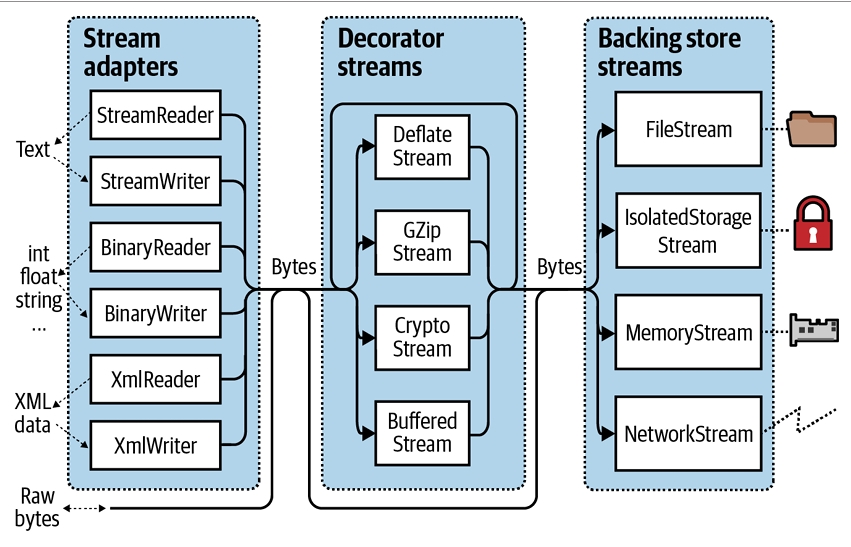
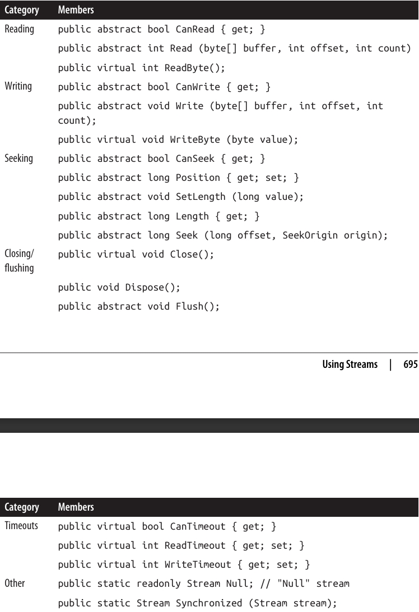
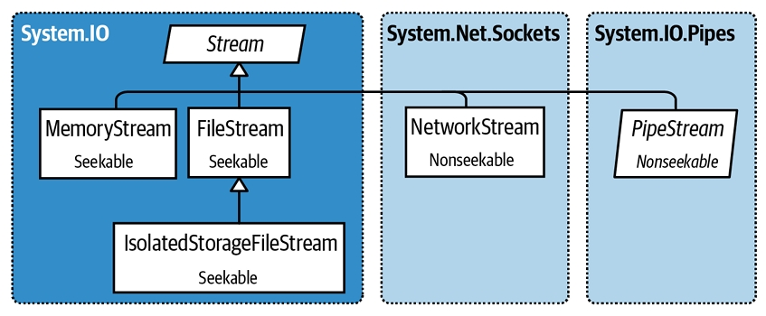
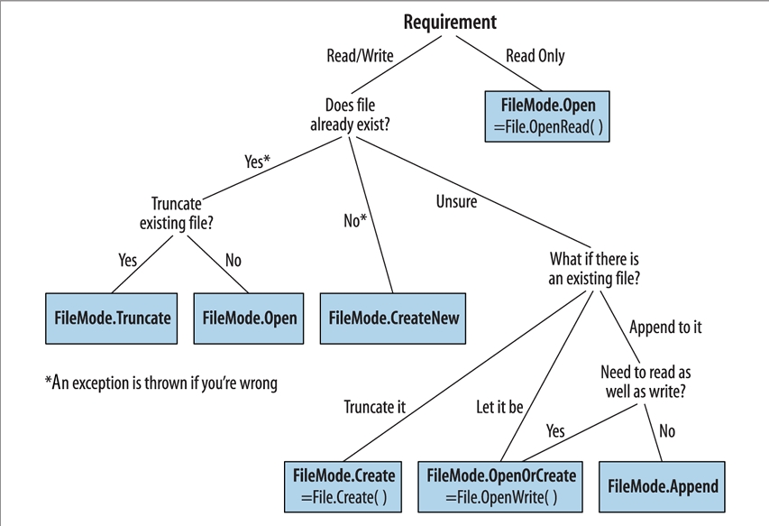
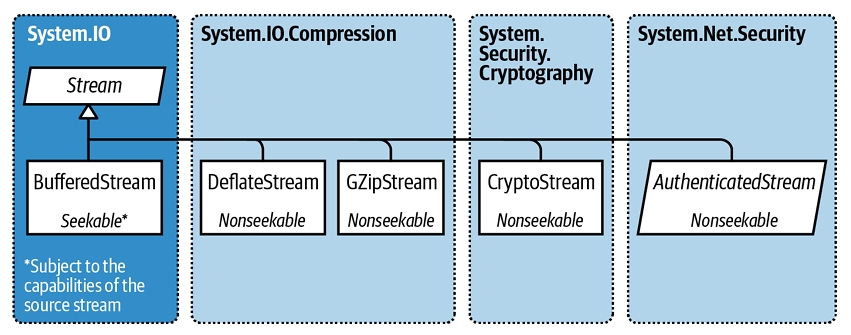
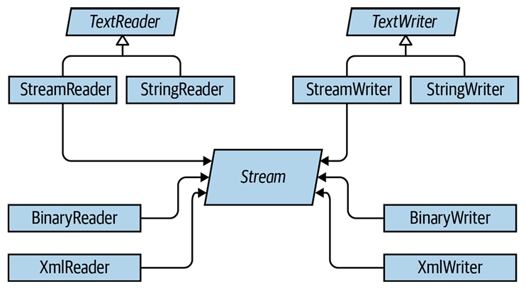
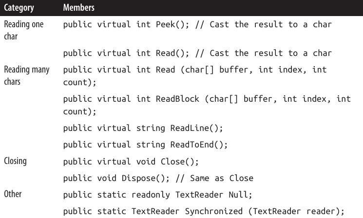
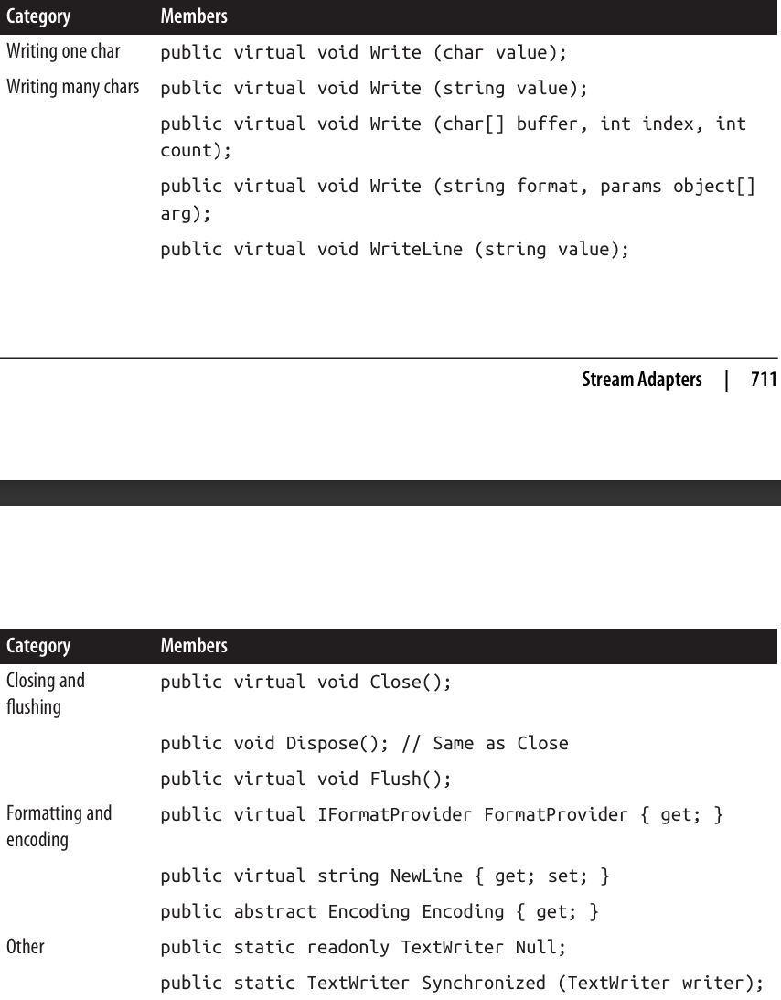
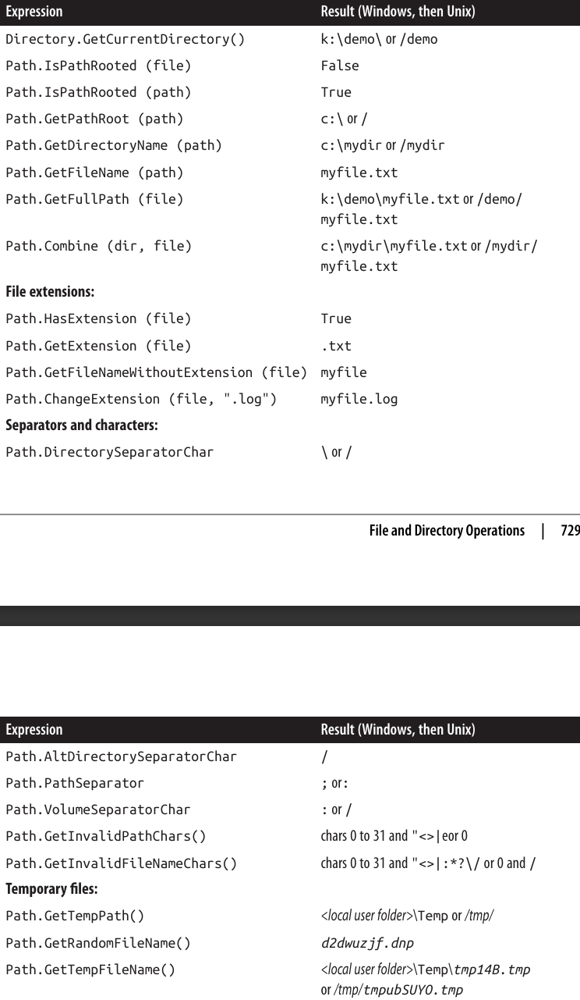

<div dir="rtl">

# فصل پانزدهم:  استریم‌ها و ورودی/خروجی (Streams and I/O)

این فصل، انواع بنیادی برای **ورودی (Input)** و **خروجی (Output)** در .NET را توضیح می‌دهد، با تمرکز ویژه روی موضوعات زیر:

* معماری **Stream** در .NET و این‌که چطور یک رابط برنامه‌نویسی (Programming Interface) یکپارچه برای **خواندن** و **نوشتن** روی انواع مختلف I/O فراهم می‌کند.
* کلاس‌ها برای کار با **فایل‌ها** و **دایرکتوری‌ها** روی دیسک.
* استریم‌های تخصصی برای **فشرده‌سازی (Compression)**، **Named Pipes**، و **Memory-Mapped Files**.

این فصل بیشتر روی نوع‌هایی در فضای نام `System.IO` تمرکز دارد؛ جایی که قابلیت‌های سطح پایین I/O قرار گرفته‌اند.

---

## 🏗️ معماری Stream

معماری Stream در .NET حول سه مفهوم اصلی می‌چرخد:

* **Backing Stores**
* **Decorators**
* **Adapters**

همان‌طور که در شکل 15-1 نشان داده شده است.

**Backing Store** همان نقطه انتهایی است که ورودی و خروجی را کاربردی می‌کند، مثل یک فایل یا اتصال شبکه. به‌طور دقیق‌تر، Backing Store می‌تواند یکی یا هر دوی موارد زیر باشد:

* یک منبع (Source) که بایت‌ها می‌توانند به‌صورت ترتیبی (Sequential) از آن خوانده شوند.
* یک مقصد (Destination) که بایت‌ها می‌توانند به‌صورت ترتیبی در آن نوشته شوند.

<div align="center">
    
 
</div>

### 📌 Backing Store

یک **Backing Store** به‌تنهایی هیچ کاربردی برای برنامه‌نویس ندارد، مگر این‌که در معرض استفاده قرار گیرد. کلاس استاندارد .NET برای این منظور، **Stream** است. این کلاس مجموعه‌ای استاندارد از متدها را برای **خواندن (Reading)**، **نوشتن (Writing)** و **مکان‌یابی (Positioning)** در اختیار قرار می‌دهد.

برخلاف **آرایه (Array)** که همه داده‌های پشتیبان آن به‌طور هم‌زمان در حافظه قرار دارند، **Stream** داده‌ها را به‌صورت **سریالی (Serially)** مدیریت می‌کند—یا یک بایت در هر بار، یا در بلوک‌هایی با اندازه قابل مدیریت. به همین دلیل، یک Stream می‌تواند بدون توجه به اندازه Backing Store، فقط از مقدار کمی حافظه ثابت استفاده کند.

---

### 🗂️ دسته‌بندی Streamها

استریم‌ها به دو دسته تقسیم می‌شوند:

1. **Backing Store Streams**
   این استریم‌ها به یک نوع خاص از Backing Store متصل هستند، مثل `FileStream` یا `NetworkStream`.

2. **Decorator Streams**
   این استریم‌ها روی یک استریم دیگر سوار می‌شوند و داده‌ها را به نوعی تغییر می‌دهند، مثل `DeflateStream` یا `CryptoStream`.

---

### 🌟 مزایای معماری Decorator Streams

* آن‌ها استریم‌های Backing Store را از نیاز به پیاده‌سازی ویژگی‌هایی مثل **فشرده‌سازی (Compression)** و **رمزنگاری (Encryption)** آزاد می‌کنند.
* وقتی یک استریم با Decorator پوشانده می‌شود، **رابط (Interface)** آن تغییر نمی‌کند.
* شما می‌توانید Decoratorها را **در زمان اجرا (Runtime)** متصل کنید.
* می‌توان چند Decorator را به هم زنجیر کرد (مثلاً یک **فشرده‌ساز** و سپس یک **رمزنگار**).

---

### 🔗 نقش Adapter

هر دو نوع استریم (Backing Store و Decorator) صرفاً با **بایت‌ها** کار می‌کنند. گرچه این رویکرد انعطاف‌پذیر و کارآمد است، ولی بسیاری از برنامه‌ها در سطوح بالاتر کار می‌کنند—مثل **متن (Text)** یا **XML**.

اینجا است که **Adapter** وارد عمل می‌شود. Adapter با **پوشاندن (Wrapping)** یک استریم، متدهایی تخصصی برای یک فرمت خاص ارائه می‌دهد.

* یک **TextReader** متدی به نام `ReadLine` دارد.
* یک **XmlWriter** متدی به نام `WriteAttributes` دارد.

Adapter درست مثل یک Decorator، یک استریم را می‌پوشاند. اما بر خلاف Decorator، خود یک استریم نیست و معمولاً متدهای **بایت‌محور** را به‌طور کامل پنهان می‌کند.

---

### 📝 خلاصه

* **Backing Store Streams** داده خام را فراهم می‌کنند.
* **Decorator Streams** تغییرات باینری شفاف مثل رمزنگاری ارائه می‌دهند.
* **Adapters** متدهای سطح بالاتر برای کار با انواعی مثل رشته‌ها (Strings) و XML فراهم می‌کنند.

📊 شکل 15-1 ارتباط میان این اجزاء را نشان می‌دهد. برای ساخت یک زنجیره، کافی است یک شیء را به سازنده (Constructor) شیء دیگر بدهید.

---

## ⚙️ استفاده از Streams

کلاس **Stream** یک کلاس **Abstract** است که پایه‌ای برای تمام استریم‌ها محسوب می‌شود. این کلاس متدها و ویژگی‌هایی برای سه عملیات بنیادی تعریف می‌کند:

* **خواندن (Reading)**
* **نوشتن (Writing)**
* **جستجو یا مکان‌یابی (Seeking)**

به‌علاوه، برای کارهای مدیریتی مثل:

* **بستن (Closing)**
* **تخلیه یا Flush کردن**
* **پیکربندی Timeoutها**

نیز متدها و ویژگی‌هایی در اختیار قرار می‌دهد (جدول 15-1 را ببینید).
<div align="center">
    
 
</div>

### ⚡ نسخه‌های Asynchronous

متدهای **Read** و **Write** نسخه‌های **Asynchronous** هم دارند که مقدار **Task** برمی‌گردانند و به‌صورت اختیاری یک **CancellationToken** می‌پذیرند. همچنین نسخه‌های Overload برای کار با نوع‌های `Span<T>` و `Memory<T>` (که در فصل ۲۳ توضیح داده می‌شوند) وجود دارد.

---

### 📂 نمونه کد: خواندن، نوشتن و Seek در FileStream

```csharp
using System;
using System.IO;

// ایجاد فایلی به نام test.txt در مسیر جاری:
using (Stream s = new FileStream("test.txt", FileMode.Create))
{
    Console.WriteLine(s.CanRead);   // True
    Console.WriteLine(s.CanWrite);  // True
    Console.WriteLine(s.CanSeek);   // True

    s.WriteByte(101);
    s.WriteByte(102);

    byte[] block = { 1, 2, 3, 4, 5 };
    s.Write(block, 0, block.Length);      // نوشتن یک بلوک 5 بایتی

    Console.WriteLine(s.Length);          // 7
    Console.WriteLine(s.Position);        // 7

    s.Position = 0;                       // بازگشت به ابتدای فایل
    Console.WriteLine(s.ReadByte());      // 101
    Console.WriteLine(s.ReadByte());      // 102

    // خواندن داده از استریم و بازنویسی در آرایه block:
    Console.WriteLine(s.Read(block, 0, block.Length));   // 5

    // چون در انتهای فایل هستیم، بار بعدی خواندن 0 برمی‌گرداند:
    Console.WriteLine(s.Read(block, 0, block.Length));   // 0
}
```

---

### 🌀 نمونه کد: استفاده از متدهای Async

خواندن یا نوشتن به‌صورت **Asynchronous** فقط به این معنی است که به‌جای **Read/Write**، از **ReadAsync/WriteAsync** استفاده کنید و نتیجه را `await` کنید (و همچنین باید متد فراخواننده `async` تعریف شود، همان‌طور که در فصل ۱۴ توضیح داده شد).

```csharp
async static void AsyncDemo()
{
    using (Stream s = new FileStream("test.txt", FileMode.Create))
    {
        byte[] block = { 1, 2, 3, 4, 5 };

        await s.WriteAsync(block, 0, block.Length);   // نوشتن به‌صورت Async
        s.Position = 0;                               // بازگشت به ابتدای فایل

        // خواندن دوباره داده‌ها از استریم به آرایه block:
        Console.WriteLine(await s.ReadAsync(block, 0, block.Length));   // 5
    }
}
```

متدهای Asynchronous کمک می‌کنند برنامه‌های **Responsive** و **Scalable** نوشته شوند که بتوانند با استریم‌های بالقوه کند (به‌ویژه استریم‌های شبکه‌ای) کار کنند، بدون این‌که یک Thread به‌طور کامل مشغول شود.

> برای سادگی، در بیشتر مثال‌های این فصل از متدهای **Synchronous** استفاده می‌کنیم. با این حال، در بیشتر سناریوهای **I/O شبکه‌ای** توصیه می‌شود از متدهای Async استفاده کنید.

---

## ✍️ خواندن و نوشتن (Reading and Writing)

یک استریم می‌تواند از **خواندن**، **نوشتن** یا هر دو پشتیبانی کند.

* اگر `CanWrite` برابر `false` باشد، استریم **فقط خواندنی** است.
* اگر `CanRead` برابر `false` باشد، استریم **فقط نوشتنی** است.

🔹 متد `Read` یک بلوک داده از استریم می‌گیرد و آن را درون یک آرایه قرار می‌دهد. این متد تعداد بایت‌های خوانده‌شده را برمی‌گرداند که همیشه **کمتر یا مساوی** با آرگومان `count` است.

* اگر مقدار کمتر از `count` باشد، یعنی یا به انتهای استریم رسیده‌ایم، یا داده‌ها در **قطعات کوچک‌تر** برگردانده می‌شوند (مثل حالت معمول در استریم‌های شبکه‌ای).
* در این شرایط، بخش باقی‌مانده از آرایه بدون تغییر باقی می‌ماند.

> رسیدن به انتهای استریم فقط زمانی قطعی است که `Read` مقدار `0` برگرداند.

---

### ❌ مثال اشتباه

فرض کنید یک استریم ۱۰۰۰ بایتی داریم:

```csharp
// فرض کنید s یک استریم است:
byte[] data = new byte[1000];
s.Read(data, 0, data.Length);
```

در این حالت، `Read` ممکن است هر مقداری بین **۱ تا ۱۰۰۰** برگرداند و بخش باقی‌مانده خوانده نشود.

---

### ✅ مثال درست

```csharp
byte[] data = new byte[1000];
// bytesRead در نهایت همیشه 1000 خواهد بود، مگر این‌که طول استریم کمتر باشد:
int bytesRead = 0;
int chunkSize = 1;

while (bytesRead < data.Length && chunkSize > 0)
    bytesRead += chunkSize = s.Read(data, bytesRead, data.Length - bytesRead);
```

---

### 🆕 متدهای جدید در .NET 7

از نسخه .NET 7، کلاس **Stream** متدهای کمکی زیر را دارد:

* `ReadExactly`
* `ReadAtLeast`

(به همراه نسخه‌های Async آن‌ها).

```csharp
byte[] data = new byte[1000];
s.ReadExactly(data);   // دقیقاً 1000 بایت می‌خواند
```

معادل:

```csharp
s.ReadExactly(data, offset: 0, count: 1000);
```

---

### 📦 BinaryReader

نوع **BinaryReader** راه‌حل دیگری برای این کار است:

```csharp
byte[] data = new BinaryReader(s).ReadBytes(1000);
```

* اگر طول استریم کمتر از ۱۰۰۰ بایت باشد، اندازه آرایه متناسب با طول واقعی استریم خواهد بود.
* اگر استریم قابلیت `Seek` داشته باشد، می‌توان با جایگزین کردن ۱۰۰۰ با `(int)s.Length` کل محتوای آن را خواند.

> جزئیات بیشتر درباره BinaryReader در بخش **“Stream Adapters”** (صفحه 709) آمده است.

---

### 🔹 ReadByte و WriteByte

* متد `ReadByte` یک بایت می‌خواند و در صورت رسیدن به انتهای استریم، `-1` برمی‌گرداند.
  (به همین دلیل مقدار بازگشتی آن `int` است، چون نوع `byte` نمی‌تواند `-1` برگرداند).

* متدهای `Write` و `WriteByte` داده را به استریم می‌فرستند. اگر ارسال کامل بایت‌ها ممکن نباشد، یک **Exception** پرتاب می‌شود.

---

## 🎯 جستجو در استریم (Seeking)

* آرگومان `offset` در متدهای **Read/Write** به اندیس شروع در آرایه **Buffer** اشاره دارد، نه به موقعیت در خود استریم.
* یک استریم **Seekable** است اگر ویژگی `CanSeek` آن `true` باشد (مثل FileStream).

با یک استریم Seekable می‌توان:

* مقدار `Length` را پرسید یا با `SetLength` تغییر داد.
* در هر لحظه `Position` را تغییر داد و مشخص کرد از کجا بخواند یا بنویسد.

🔹 ویژگی `Position` نسبت به ابتدای استریم است، اما متد `Seek` اجازه می‌دهد نسبت به موقعیت فعلی یا انتهای استریم حرکت کنید.

* تغییر `Position` در FileStream معمولاً فقط چند میکروثانیه طول می‌کشد. اگر قرار است این کار را **میلیون‌ها بار** در یک حلقه انجام دهید، استفاده از `MemoryMappedFile` انتخاب بهتری نسبت به FileStream خواهد بود (صفحه 736 را ببینید).
* در استریم‌های غیرقابل Seek (مثل استریم رمزنگاری)، تنها راه دانستن طول، خواندن کل آن است. همچنین برای خواندن دوباره یک بخش قبلی، باید استریم را ببندید و یک استریم جدید باز کنید.

---

## 🔒 بستن و Flush کردن استریم‌ها

استریم‌ها پس از استفاده باید **Dispose** شوند تا منابع زیربنایی مثل **File Handle** و **Socket Handle** آزاد شوند.

🔹 ساده‌ترین راه تضمین این موضوع، قرار دادن استریم درون یک **بلوک using** است.

قوانین کلی مدیریت استریم‌ها:

* متدهای **Dispose** و **Close** عملکرد یکسانی دارند.
* بستن یا Dispose کردن چندباره یک استریم مشکلی ایجاد نمی‌کند.
* بستن یک استریم Decorator باعث بسته شدن خودش و **Backing Store** آن می‌شود.
* در یک زنجیره از Decoratorها، بستن Decorator بیرونی کل زنجیره را می‌بندد.

برخی استریم‌ها داده‌ها را برای بهبود کارایی در حافظه **Buffer** می‌کنند (مثل FileStream). این باعث می‌شود داده‌ای که به استریم می‌نویسید، بلافاصله وارد Backing Store نشود.

* متد **Flush** باعث می‌شود داده‌های بافر شده فوراً نوشته شوند.
* `Flush` به‌صورت خودکار هنگام بسته شدن استریم صدا زده می‌شود، بنابراین هیچ‌وقت نیازی به نوشتن کدی مثل زیر ندارید:

```csharp
s.Flush();
s.Close();
```
## ⏱️ Timeoutها

یک استریم زمانی از **Timeout** پشتیبانی می‌کند که ویژگی `CanTimeout` مقدار `true` داشته باشد.

* استریم‌های **شبکه‌ای (Network Streams)** از Timeout پشتیبانی می‌کنند.
* استریم‌های **فایل (File Streams)** و **حافظه (Memory Streams)** از Timeout پشتیبانی نمی‌کنند.

برای استریم‌هایی که Timeout را پشتیبانی می‌کنند:

* ویژگی‌های `ReadTimeout` و `WriteTimeout` مدت زمان Timeout را بر حسب **میلی‌ثانیه** مشخص می‌کنند.
* مقدار `0` یعنی **بدون Timeout**.
* اگر Timeout رخ دهد، متدهای `Read` و `Write` یک **Exception** پرتاب می‌کنند.

⚠️ متدهای Asynchronous (`ReadAsync`/`WriteAsync`) از Timeout پشتیبانی نمی‌کنند. در این حالت، می‌توانید یک **CancellationToken** به این متدها بدهید.

---

## 🧵 Thread Safety

به‌طور کلی، استریم‌ها **Thread-Safe** نیستند؛ یعنی دو Thread نمی‌توانند به‌طور هم‌زمان روی یک استریم بخوانند یا بنویسند، چون احتمال خطا وجود دارد.

کلاس **Stream** یک راهکار ساده ارائه می‌دهد: متد استاتیک `Synchronized`.

* این متد یک استریم از هر نوع را می‌پذیرد و یک **Wrapper ایمن برای Thread** برمی‌گرداند.
* این Wrapper با گرفتن یک **قفل انحصاری (Exclusive Lock)** در اطراف هر عملیات خواندن، نوشتن یا Seek، تضمین می‌کند که فقط یک Thread در هر لحظه بتواند عمل مورد نظر را انجام دهد.

🔹 نتیجه عملی این است که چند Thread می‌توانند به‌طور هم‌زمان داده‌ها را به یک استریم **Append** کنند.
اما سایر فعالیت‌ها (مثل خواندن هم‌زمان) نیازمند قفل‌گذاری اضافی هستند تا مطمئن شوید هر Thread دقیقاً به بخش درستی از استریم دسترسی دارد.

📖 جزئیات کامل‌تر درباره **Thread Safety** در فصل ۲۱ توضیح داده می‌شود.

---

### 🚀 ویژگی جدید در .NET 6

از نسخه .NET 6 به بعد، می‌توانید برای عملیات **File I/O ایمن و کارآمد در برابر Thread** از کلاس **RandomAccess** استفاده کنید.

* این کلاس امکان **Thread-Safe File I/O** با کارایی بالا را فراهم می‌کند.
* همچنین اجازه می‌دهد چندین **Buffer** را برای بهبود عملکرد به‌طور هم‌زمان پاس دهید.

---

## 🗄️ Backing Store Streams

📊 شکل 15-2 استریم‌های اصلی **Backing Store** که توسط .NET ارائه می‌شوند را نشان می‌دهد.

🔹 علاوه بر این، یک **Null Stream** هم از طریق فیلد استاتیک `Stream.Null` در دسترس است.

**Null Stream** می‌تواند هنگام نوشتن **Unit Test**ها بسیار مفید باشد.

<div align="center">
    
 
</div>

## 📂 FileStream

در بخش‌های بعدی، به بررسی **FileStream** و **MemoryStream** می‌پردازیم؛ و در بخش پایانی این فصل، **IsolatedStorageStream** را معرفی می‌کنیم. در فصل ۱۶ هم به **NetworkStream** خواهیم پرداخت.

---

### ✨ ویژگی‌های FileStream

پیش‌تر استفاده‌ی پایه‌ای از **FileStream** برای خواندن و نوشتن بایت‌ها را دیدیم. حالا بیایید ویژگی‌های خاص این کلاس را دقیق‌تر بررسی کنیم.

🔹 اگر هنوز از **UWP (Universal Windows Platform)** استفاده می‌کنید، می‌توانید عملیات فایل را با نوع‌های موجود در فضای نام **Windows.Storage** انجام دهید. توضیحات بیشتر در [ضمیمه آنلاین](http://www.albahari.com/nutshell) آمده است.

---

### 🛠️ ساخت یک FileStream

ساده‌ترین راه برای نمونه‌سازی **FileStream** استفاده از متدهای استاتیک کلاس **File** است:

```csharp
FileStream fs1 = File.OpenRead("readme.bin");   // فقط خواندن
FileStream fs2 = File.OpenWrite("writeme.tmp"); // فقط نوشتن
FileStream fs3 = File.Create("readwrite.tmp");  // خواندن/نوشتن
```

⚠️ تفاوت `OpenWrite` و `Create`:

* `Create` محتوای قبلی فایل را **کامل پاک می‌کند** (truncate).
* `OpenWrite` محتوای موجود را نگه می‌دارد و مکان استریم را روی صفر قرار می‌دهد.
  اگر کمتر از اندازه‌ی قبلی داده بنویسید، نتیجه ترکیبی از داده‌های قدیمی و جدید خواهد شد.

همچنین می‌توانید مستقیم از **سازنده‌ی FileStream** استفاده کنید. سازنده‌ها امکان کنترل کامل روی:

* نام فایل یا **file handle سطح پایین**
* حالت‌های ساخت و دسترسی به فایل
* گزینه‌های اشتراک‌گذاری (sharing)، بافرینگ و امنیت

را فراهم می‌کنند. برای مثال:

```csharp
using var fs = new FileStream("readwrite.tmp", FileMode.Open);
```

(کلیدواژه‌ی `using` تضمین می‌کند که استریم پس از خروج از محدوده dispose شود).

🔎 در ادامه به جزئیات `FileMode` می‌پردازیم.

---

### ⚡ متدهای میان‌بُر کلاس File

این متدها کل محتوای فایل را در یک مرحله می‌خوانند:

* `File.ReadAllText` → بازگرداندن یک **string**
* `File.ReadAllLines` → بازگرداندن یک **آرایه از string**
* `File.ReadAllBytes` → بازگرداندن یک **آرایه‌ی بایت**

این متدها کل فایل را در یک مرحله می‌نویسند:

* `File.WriteAllText`
* `File.WriteAllLines`
* `File.WriteAllBytes`
* `File.AppendAllText` (مناسب برای اضافه‌کردن به فایل‌های لاگ)

همچنین متدی به نام `File.ReadLines` وجود دارد که مانند `ReadAllLines` است، با این تفاوت که یک `IEnumerable<string>` **Lazy** بازمی‌گرداند (به‌صورت تدریجی خوانده می‌شود، نه یک‌جا). این کارایی بهتری دارد چون کل فایل یک‌جا در حافظه بارگذاری نمی‌شود.

مثال با LINQ برای شمردن تعداد خطوطی که طول آن‌ها بیشتر از ۸۰ کاراکتر است:

```csharp
int longLines = File.ReadLines("filePath")
                   .Count(l => l.Length > 80);
```

---

### 📁 مشخص‌کردن نام فایل

نام فایل می‌تواند:

* **مطلق (Absolute)** باشد → مثل:

  * ویندوز: `c:\temp\test.txt`
  * یونیکس: `/tmp/test.txt`
* **نسبی (Relative)** به دایرکتوری فعلی → مثل:

  * `test.txt`
  * `temp\test.txt`

🔹 دایرکتوری فعلی برنامه از طریق ویژگی استاتیک:

```csharp
Environment.CurrentDirectory
```

قابل دسترسی و تغییر است.

⚠️ اما دایرکتوری فعلی **ممکن است با مسیر اجرایی برنامه یکی نباشد**. بنابراین **هیچ‌وقت** برای یافتن فایل‌های همراه executable روی آن حساب نکنید.

دایرکتوری پایه‌ی اپلیکیشن از طریق:

```csharp
AppDomain.CurrentDomain.BaseDirectory
```

دریافت می‌شود (معمولاً همان پوشه‌ی فایل اجرایی است).

برای مشخص کردن نام فایل به‌صورت نسبی نسبت به این دایرکتوری:

```csharp
string baseFolder = AppDomain.CurrentDomain.BaseDirectory;
string logoPath = Path.Combine(baseFolder, "logo.jpg");
Console.WriteLine(File.Exists(logoPath));
```

---

### 🌐 مسیرهای شبکه‌ای (UNC Path)

در ویندوز می‌توانید فایل‌ها را از طریق مسیر **UNC** بخوانید/بنویسید:

* `\\JoesPC\PicShare\pic.jpg`
* `\\10.1.1.2\PicShare\pic.jpg`

🔹 در macOS یا Unix برای دسترسی به یک Windows File Share باید ابتدا آن را به filesystem خود mount کنید، سپس مانند مسیر معمولی در C# باز کنید.

---

### ⚙️ مشخص کردن FileMode

تمام سازنده‌های `FileStream` که یک نام فایل می‌پذیرند، نیاز به یک آرگومان از نوع **FileMode enum** دارند.

📊 شکل 15-3 نشان می‌دهد چگونه باید یک FileMode انتخاب کنید. نتایج مشابه فراخوانی متدهای استاتیک کلاس **File** خواهد بود.
<div align="center">
    
 
</div>

## 📂 FileStream

🔹 اگر روی فایل‌های **Hidden** از `File.Create` یا `FileMode.Create` استفاده کنید، یک **استثنا (Exception)** پرتاب می‌شود. برای بازنویسی یک فایل مخفی، باید ابتدا آن را **حذف** و سپس دوباره ایجاد کنید:

```csharp
File.Delete("hidden.txt");
using var file = File.Create("hidden.txt");
```

---

### 📖 FileAccess

اگر فقط نام فایل و یک `FileMode` را به سازنده‌ی `FileStream` بدهید، نتیجه (با یک استثنا) یک استریم **قابل خواندن/نوشتن** خواهد بود.
اما می‌توانید با مشخص‌کردن آرگومان **FileAccess** دسترسی را محدود کنید:

```csharp
[Flags]
public enum FileAccess { Read = 1, Write = 2, ReadWrite = 3 }
```

مثال: ساختن یک استریم فقط-خواندنی (معادل `File.OpenRead`):

```csharp
using var fs = new FileStream("x.bin", FileMode.Open, FileAccess.Read);
```

⚠️ حالت خاص: `FileMode.Append` → فقط **Write-only** است.
اگر می‌خواهید داده‌ها را **اضافه (Append)** کنید و همزمان امکان خواندن داشته باشید، باید از `FileMode.Open` یا `FileMode.OpenOrCreate` استفاده کنید و سپس مکان استریم را به انتهای فایل ببرید:

```csharp
using var fs = new FileStream("myFile.bin", FileMode.Open);
fs.Seek(0, SeekOrigin.End);
```

---

### ⚙️ ویژگی‌های پیشرفته‌ی FileStream

می‌توانید هنگام ساخت یک FileStream آرگومان‌های اضافی بدهید:

* **FileShare enum** → میزان دسترسی سایر پردازش‌ها (None، Read، ReadWrite، Write).
* **Buffer size** → اندازه بافر داخلی (به‌صورت پیش‌فرض ۴KB).
* **Async flag** → واگذاری عملیات ناهمگام به سیستم‌عامل.
* **FileOptions flags** → شامل:

  * `Encrypted` → رمزنگاری توسط سیستم‌عامل
  * `DeleteOnClose` → حذف خودکار فایل هنگام بسته‌شدن
  * `RandomAccess` → بهینه‌سازی برای دسترسی تصادفی
  * `SequentialScan` → بهینه‌سازی برای اسکن ترتیبی
  * `WriteThrough` → غیرفعال کردن کش سیستم‌عامل (برای فایل‌های تراکنشی یا لاگ‌ها)

⚠️ فلگ‌هایی که سیستم‌عامل پشتیبانی نکند، بی‌صدا (silently) نادیده گرفته می‌شوند.

اگر با `FileShare.ReadWrite` فایل را باز کنید، چند پردازش یا کاربر می‌توانند همزمان بخوانند/بنویسند. برای جلوگیری از تداخل، می‌توان بخش‌هایی از فایل را قفل کرد:

```csharp
public virtual void Lock(long position, long length);
public virtual void Unlock(long position, long length);
```

متد `Lock` اگر ناحیه‌ای از فایل قبلاً قفل باشد، استثنا پرتاب می‌کند.

---

## 🧠 MemoryStream

**MemoryStream** از یک آرایه در حافظه به‌عنوان **backing store** استفاده می‌کند.
این یعنی تمام داده‌ها باید یک‌جا در حافظه باشند (برخلاف مزیت اصلی Stream).

اما همچنان مفید است، به‌خصوص وقتی:

* نیاز به دسترسی تصادفی (Random Access) به یک استریم غیرقابل Seek دارید.
* داده‌ی اصلی کوچک و قابل مدیریت است.

📌 مثال: کپی کردن داده‌ی یک استریم درون MemoryStream:

```csharp
var ms = new MemoryStream();
sourceStream.CopyTo(ms);
```

* برای گرفتن داده‌ها:

  * `ToArray()` → یک کپی از داده‌ها بازمی‌گرداند.
  * `GetBuffer()` → مرجع مستقیم به آرایه‌ی ذخیره‌سازی می‌دهد (کارآمدتر است، اما طول آن معمولاً از داده‌ی واقعی بیشتر است).

📍 بستن یا Flush کردن MemoryStream اختیاری است:

* بعد از `Close` دیگر نمی‌توانید بخوانید/بنویسید، ولی همچنان `ToArray()` کار می‌کند.
* `Flush` هیچ تأثیری ندارد.

---

## 🔗 PipeStream

**PipeStream** راهی ساده برای ارتباط بین پردازش‌ها (IPC) از طریق پروتکل **Pipe** سیستم‌عامل است.

### انواع Pipe

1. **Anonymous Pipe (سریع‌تر)** → ارتباط یک‌طرفه بین یک پردازش والد و فرزند (روی همان سیستم).
2. **Named Pipe (انعطاف‌پذیرتر)** → ارتباط دوطرفه بین پردازش‌های مختلف (روی یک سیستم یا بین سیستم‌ها در شبکه).

📌 Pipes برای IPC روی یک کامپیوتر عالی هستند:

* نیازی به پروتکل شبکه ندارند (بدون سربار شبکه).
* مشکلی با فایروال‌ها ندارند.

---

### کلاس‌ها

PipeStream یک کلاس انتزاعی است. چهار زیرکلاس اصلی دارد:

* **AnonymousPipeServerStream**
* **AnonymousPipeClientStream**
* **NamedPipeServerStream**
* **NamedPipeClientStream**

🔹 Named Pipes ساده‌ترند، پس اول آن‌ها را بررسی می‌کنیم.

---

### 📡 Named Pipes

ارتباط از طریق یک نام مشترک برقرار می‌شود. دو نقش اصلی وجود دارد:

* **Server** → نمونه‌ای از `NamedPipeServerStream` ساخته و `WaitForConnection()` را صدا می‌زند.
* **Client** → نمونه‌ای از `NamedPipeClientStream` ساخته و `Connect()` را صدا می‌زند.

سپس دو طرف از استریم برای خواندن/نوشتن استفاده می‌کنند.

📍 مثال ساده:

**Server** → ارسال یک بایت (۱۰۰) و دریافت یک بایت:

```csharp
using var s = new NamedPipeServerStream("pipedream");
s.WaitForConnection();
s.WriteByte(100);
Console.WriteLine(s.ReadByte());
```

**Client** → دریافت بایت و ارسال یک بایت (۲۰۰):

```csharp
using var s = new NamedPipeClientStream("pipedream");
s.Connect();
Console.WriteLine(s.ReadByte());
s.WriteByte(200);
```

🔹 Pipeها به‌طور پیش‌فرض **دوطرفه** هستند. پس باید یک **پروتکل توافقی** بین Client و Server وجود داشته باشد تا هر دو همزمان ننویسند یا نخوانند.

---

### 📑 Message Transmission Mode (فقط ویندوز)

برای پیام‌های طولانی‌تر، Pipeها یک حالت خاص به نام **Message Mode** دارند.
در این حالت می‌توان با ویژگی `IsMessageComplete` فهمید یک پیام کامل دریافت شده است.

📌 مثال: خواندن کل پیام:

```csharp
static byte[] ReadMessage(PipeStream s)
{
    MemoryStream ms = new MemoryStream();
    byte[] buffer = new byte[0x1000]; // 4KB
    do { ms.Write(buffer, 0, s.Read(buffer, 0, buffer.Length)); }
    while (!s.IsMessageComplete);
    return ms.ToArray();
}
```

---

### ✨ فعال‌سازی Message Mode

**Server**:

```csharp
using var s = new NamedPipeServerStream(
    "pipedream", PipeDirection.InOut, 1, PipeTransmissionMode.Message);

s.WaitForConnection();
byte[] msg = Encoding.UTF8.GetBytes("Hello");
s.Write(msg, 0, msg.Length);
Console.WriteLine(Encoding.UTF8.GetString(ReadMessage(s)));
```

**Client**:

```csharp
using var s = new NamedPipeClientStream("pipedream");
s.Connect();
s.ReadMode = PipeTransmissionMode.Message;

Console.WriteLine(Encoding.UTF8.GetString(ReadMessage(s)));
byte[] msg = Encoding.UTF8.GetBytes("Hello right back!");
s.Write(msg, 0, msg.Length);
```

⚠️ **Message Mode فقط روی ویندوز پشتیبانی می‌شود.**
در سایر سیستم‌عامل‌ها → `PlatformNotSupportedException` پرتاب می‌شود.


---

### **پایپ‌های ناشناس (Anonymous pipes)**

یک **پایپ ناشناس** یک جریان ارتباطی یک‌طرفه بین یک **پردازش والد (parent process)** و یک **پردازش فرزند (child process)** فراهم می‌کند. به‌جای استفاده از یک نام سراسری در سیستم، پایپ‌های ناشناس از طریق یک **هندل خصوصی (private handle)** با هم ارتباط برقرار می‌کنند.

همانند پایپ‌های نام‌دار، در اینجا هم نقش‌های مشخصی برای **کلاینت** و **سرور** وجود دارد. با این حال، شیوه‌ی ارتباط کمی متفاوت است و به‌صورت زیر انجام می‌شود:

1. سرور یک **AnonymousPipeServerStream** می‌سازد و به یک **PipeDirection** (جهت In یا Out) متعهد می‌شود.
2. سرور متد **GetClientHandleAsString** را صدا می‌زند تا یک شناسه برای پایپ بگیرد، سپس آن را به کلاینت می‌فرستد (معمولاً به‌عنوان آرگومان هنگام راه‌اندازی پردازش فرزند).
3. پردازش فرزند یک **AnonymousPipeClientStream** می‌سازد و جهت مخالف را مشخص می‌کند.
4. سرور هندل محلی‌ای که در مرحله‌ی ۲ ساخته شده بود را با متد **DisposeLocalCopyOfClientHandle** آزاد می‌کند.
5. حالا پردازش والد و فرزند می‌توانند از طریق خواندن/نوشتن استریم با هم ارتباط برقرار کنند.

از آنجا که پایپ‌های ناشناس یک‌طرفه هستند، یک سرور برای ارتباط دوطرفه باید **دو پایپ** بسازد.

کد زیر نشان می‌دهد که چطور دو پایپ (ورودی و خروجی) ساخته می‌شوند و سپس یک پردازش فرزند راه‌اندازی می‌شود. در ادامه، یک بایت از سرور به فرزند ارسال شده و یک بایت در پاسخ دریافت می‌شود:

```csharp
class Program
{
  static void Main (string[] args)
  {
    if (args.Length == 0)
      // بدون آرگومان = حالت سرور
      AnonymousPipeServer();
    else
      // آرگومان‌ها = شناسه‌های پایپ برای حالت کلاینت
      AnonymousPipeClient (args [0], args [1]);
  }

  static void AnonymousPipeClient (string rxID, string txID)
  {
    using var rx = new AnonymousPipeClientStream (PipeDirection.In, rxID);
    using var tx = new AnonymousPipeClientStream (PipeDirection.Out, txID);
    Console.WriteLine ("Client received: " + rx.ReadByte ());
    tx.WriteByte (200);
  }

  static void AnonymousPipeServer ()
  {
    using var tx = new AnonymousPipeServerStream (
                     PipeDirection.Out, HandleInheritability.Inheritable);
    using var rx = new AnonymousPipeServerStream (
                     PipeDirection.In, HandleInheritability.Inheritable);

    string txID = tx.GetClientHandleAsString ();
    string rxID = rx.GetClientHandleAsString ();

    // ایجاد و راه‌اندازی پردازش فرزند
    string thisAssembly = Assembly.GetEntryAssembly().Location;
    string thisExe = Path.ChangeExtension (thisAssembly, ".exe");
    var args = $"{txID} {rxID}";
    var startInfo = new ProcessStartInfo (thisExe, args);
    startInfo.UseShellExecute = false;   // الزامی برای پردازش فرزند
    Process p = Process.Start (startInfo);

    tx.DisposeLocalCopyOfClientHandle ();  // آزادسازی منابع
    rx.DisposeLocalCopyOfClientHandle ();

    tx.WriteByte (100);    // ارسال یک بایت به پردازش فرزند
    Console.WriteLine ("Server received: " + rx.ReadByte ());
    p.WaitForExit ();
  }
}
```

📌 همانند پایپ‌های نام‌دار، **کلاینت و سرور باید ارسال و دریافت خود را هماهنگ کنند** و روی طول هر انتقال توافق داشته باشند. متأسفانه پایپ‌های ناشناس از **حالت پیام (message mode)** پشتیبانی نمی‌کنند، بنابراین باید خودتان پروتکل مدیریت طول پیام را پیاده‌سازی کنید.

یکی از راه‌حل‌ها این است که در چهار بایت اول هر انتقال، یک **عدد صحیح (integer)** ارسال شود که طول پیام بعدی را مشخص کند. کلاس **BitConverter** متدهایی برای تبدیل بین یک عدد صحیح و یک آرایه‌ی ۴ بایتی فراهم می‌کند.

<div align="center">
    
 
</div>


---

### **BufferedStream (استریم بافر شده)**

بافرینگ باعث بهبود کارایی می‌شود چون تعداد دفعات رفت‌وبرگشت به **backing store** (مثل فایل یا شبکه) را کاهش می‌دهد.

در مثال زیر ما یک **FileStream** را داخل یک **BufferedStream** با اندازه‌ی بافر ۲۰ کیلوبایت می‌پیچیم:

```csharp
// نوشتن 100K در یک فایل:
File.WriteAllBytes ("myFile.bin", new byte [100000]);
using FileStream fs = File.OpenRead ("myFile.bin");
using BufferedStream bs = new BufferedStream (fs, 20000);  // بافر 20K
bs.ReadByte();
Console.WriteLine (fs.Position);   // 20000
```

🔍 در این مثال، استریم زیرین (**FileStream**) بعد از خواندن فقط **یک بایت**، به اندازه‌ی ۲۰,۰۰۰ بایت جلو می‌رود؛ این به خاطر **read-ahead buffering** است. ما می‌توانیم متد `ReadByte` را **۱۹,۹۹۹ بار دیگر** صدا بزنیم، بدون اینکه دوباره `FileStream` درگیر شود.

✅ در عمل، بستن یک **BufferedStream** به طور خودکار استریم backing store زیرین را هم می‌بندد.

⚠️ ترکیب **BufferedStream** با **FileStream** (مثل این مثال) ارزش محدودی دارد، چون **FileStream خودش بافر داخلی دارد**. تنها کاربرد آن می‌تواند زمانی باشد که بخواهیم بافر یک **FileStream** ساخته‌شده را **بزرگ‌تر کنیم**.

---

### **Stream Adapters (آداپتورهای استریم)**

از آنجا که **Stream فقط با بایت‌ها سروکار دارد**، برای خواندن یا نوشتن داده‌هایی مثل **رشته‌ها (string)**، **اعداد صحیح (int)** یا **عناصر XML** باید از **adapter** استفاده کنید.

📌 .NET آداپتورهای زیر را فراهم کرده است:

* **آداپتورهای متنی (برای داده‌های رشته و کاراکتر):**

  * `TextReader`, `TextWriter`
  * `StreamReader`, `StreamWriter`
  * `StringReader`, `StringWriter`

* **آداپتورهای باینری (برای انواع داده‌های اولیه مثل int, bool, string, float):**

  * `BinaryReader`, `BinaryWriter`

* **آداپتورهای XML (پوشش داده‌شده در فصل 11):**

  * `XmlReader`, `XmlWriter`

📖 شکل 15-5 روابط بین این نوع‌ها را نشان می‌دهد.

<div align="center">
    
 
</div>

### **آداپتورهای متنی (Text Adapters)**

`TextReader` و `TextWriter` کلاس‌های پایه‌ی انتزاعی هستند که مخصوص کار با **کاراکترها** و **رشته‌ها** طراحی شده‌اند. هر کدام در .NET دو پیاده‌سازی عمومی دارند:

* **`StreamReader` / `StreamWriter`**
  از یک **Stream** به‌عنوان منبع داده‌ی خام استفاده می‌کنند و بایت‌های استریم را به کاراکترها یا رشته‌ها تبدیل می‌کنند.

* **`StringReader` / `StringWriter`**
  `TextReader` / `TextWriter` را با استفاده از **رشته‌های درون حافظه** پیاده‌سازی می‌کنند.

📌 **جدول 15-2** اعضای `TextReader` را بر اساس دسته‌بندی نشان می‌دهد.

* متد `Peek` کاراکتر بعدی در استریم را **برمی‌گرداند بدون اینکه موقعیت را جلو ببرد**.
* هم `Peek` و هم نسخه‌ی بدون پارامتر `Read` مقدار **-1** را برمی‌گردانند اگر به انتهای استریم رسیده باشند؛ در غیر این صورت یک **عدد صحیح (int)** برمی‌گردانند که می‌توان آن را مستقیم به `char` تبدیل کرد.
* نسخه‌ی overload شده‌ی `Read` که یک `char[] buffer` می‌گیرد، دقیقاً مشابه متد `ReadBlock` عمل می‌کند.
* متد `ReadLine` می‌خواند تا زمانی که به یکی از این‌ها برسد:

  * **CR** (کد کاراکتری 13)
  * **LF** (کد کاراکتری 10)
  * یا ترکیب **CR+LF**
    سپس یک **رشته (string)** برمی‌گرداند و کاراکترهای CR/LF را حذف می‌کند.
<div align="center">
    
 
</div>

`Environment.NewLine` دنباله‌ی **new-line** مناسب برای سیستم‌عامل فعلی را برمی‌گرداند.

* در **ویندوز**، این مقدار `"\r\n"` است (به یاد “ReturN” بیفتید) و به صورت تقریبی شبیه یک ماشین تحریر مکانیکی مدل شده: ابتدا **CR** (کاراکتر ۱۳) و سپس **LF** (کاراکتر ۱۰). اگر ترتیب را برعکس کنید، یا دو خط جدید خواهید داشت یا هیچ!
* در **Unix** و **macOS**، مقدار تنها `"\n"` است.

`TextWriter` متدهای مشابهی برای نوشتن دارد، همان‌طور که در **جدول 15-3** نشان داده شده است. متدهای `Write` و `WriteLine` همچنین **overload** شده‌اند تا همه‌ی نوع‌های اولیه و نوع **object** را قبول کنند. این متدها صرفاً متد `ToString` را روی مقداری که داده شده صدا می‌زنند (اختیاری از طریق یک `IFormatProvider` که هنگام صدا زدن متد یا هنگام ساخت `TextWriter` مشخص شده باشد).

<div align="center">
    
 
</div>

متد `WriteLine` به‌سادگی متن داده‌شده را با `Environment.NewLine` الحاق می‌کند. می‌توانید این رفتار را از طریق **خاصیت `NewLine`** تغییر دهید (این می‌تواند برای **تطبیق با فرمت‌های فایل Unix** مفید باشد).

همانند `Stream`، کلاس‌های `TextReader` و `TextWriter` نسخه‌های **آسنکرون مبتنی بر Task** از متدهای خواندن و نوشتن خود را ارائه می‌دهند.

### StreamReader و StreamWriter 📄✍️

در مثال زیر، یک `StreamWriter` دو خط متن را در یک فایل می‌نویسد و سپس یک `StreamReader` فایل را دوباره می‌خواند:

```csharp
using (FileStream fs = File.Create("test.txt"))
using (TextWriter writer = new StreamWriter(fs))
{
    writer.WriteLine("Line1");
    writer.WriteLine("Line2");
}
using (FileStream fs = File.OpenRead("test.txt"))
using (TextReader reader = new StreamReader(fs))
{
    Console.WriteLine(reader.ReadLine()); // Line1
    Console.WriteLine(reader.ReadLine()); // Line2
}
```

چون **Text adapters** اغلب همراه با فایل‌ها استفاده می‌شوند، کلاس `File` متدهای **استاتیک** `CreateText`، `AppendText` و `OpenText` را برای کوتاه کردن روند فراهم می‌کند:

```csharp
using (TextWriter writer = File.CreateText("test.txt"))
{
    writer.WriteLine("Line1");
    writer.WriteLine("Line2");
}
using (TextWriter writer = File.AppendText("test.txt"))
    writer.WriteLine("Line3");

using (TextReader reader = File.OpenText("test.txt"))
    while (reader.Peek() > -1)
        Console.WriteLine(reader.ReadLine()); // Line1, Line2, Line3
```

این مثال همچنین نشان می‌دهد که چگونه پایان فایل را بررسی کنیم (`reader.Peek()`). روش دیگر این است که تا وقتی `reader.ReadLine` مقدار `null` برگرداند، ادامه دهیم.

می‌توانید انواع دیگری مانند **اعداد صحیح** را نیز بخوانید و بنویسید، اما چون `TextWriter` متد `ToString` را روی نوع شما صدا می‌زند، هنگام خواندن باید رشته را **Parse** کنید:

```csharp
using (TextWriter w = File.CreateText("data.txt"))
{
    w.WriteLine(123);      // می‌نویسد "123"
    w.WriteLine(true);     // می‌نویسد "true"
}
using (TextReader r = File.OpenText("data.txt"))
{
    int myInt = int.Parse(r.ReadLine());   // myInt == 123
    bool yes = bool.Parse(r.ReadLine());   // yes == true
}
```

### رمزگذاری کاراکترها 🔤

`TextReader` و `TextWriter` خودشان تنها کلاس‌های **abstract** هستند و ارتباطی با یک **stream** یا **backing store** ندارند. اما `StreamReader` و `StreamWriter` به یک **stream بایت‌محور** متصل‌اند و باید بین **کاراکترها و بایت‌ها** تبدیل انجام دهند. این کار از طریق کلاس `Encoding` در **System.Text** انجام می‌شود که هنگام ساخت `StreamReader` یا `StreamWriter` انتخاب می‌کنید. اگر چیزی انتخاب نکنید، **UTF-8** پیش‌فرض استفاده می‌شود.

اگر به‌طور صریح یک **Encoding** مشخص کنید، `StreamWriter` به‌طور پیش‌فرض یک پیش‌وند (prefix) برای شناسایی رمزگذاری به ابتدای جریان می‌نویسد. این معمولاً ناخواسته است و می‌توانید با ساخت Encoding به شکل زیر از آن جلوگیری کنید:

```csharp
var encoding = new UTF8Encoding(
    encoderShouldEmitUTF8Identifier: false,
    throwOnInvalidBytes: true
);
```

آرگومان دوم به `StreamWriter` یا `StreamReader` می‌گوید اگر با بایت‌هایی مواجه شد که ترجمه معتبر به رشته ندارند، **Exception** پرتاب کند، که با رفتار پیش‌فرض مطابقت دارد.

### مثال رمزگذاری ASCII و UTF-8

رمزگذاری ساده `ASCII` است، چون هر کاراکتر با یک بایت نمایش داده می‌شود. کاراکترهای غیرانگلیسی یا نمادهای ویژه قابل نمایش نیستند و به `□` تبدیل می‌شوند.

رمزگذاری پیش‌فرض `UTF-8` می‌تواند تمام کاراکترهای یونیکد را نمایش دهد. کاراکترهای ASCII (127 کاراکتر اول) با یک بایت کدگذاری می‌شوند؛ بقیه کاراکترها با تعداد بایت متغیر (معمولاً دو یا سه) کدگذاری می‌شوند. مثال:

```csharp
using (TextWriter w = File.CreateText("but.txt")) // استفاده از UTF-8 پیش‌فرض
    w.WriteLine("but-");

using (Stream s = File.OpenRead("but.txt"))
    for (int b; (b = s.ReadByte()) > -1;)
        Console.WriteLine(b);
```

برای کاراکتر **em dash (—)** که خارج از 127 کاراکتر اول یونیکد است، UTF-8 سه بایت استفاده می‌کند.

### UTF-16

UTF-16 از دو یا چهار بایت برای هر کاراکتر استفاده می‌کند. نوع `char` در C# فقط 16 بیت است، پس UTF-16 دقیقاً دو بایت برای هر char استفاده می‌کند. این امکان پرش به ایندکس کاراکتر مشخص در stream را آسان می‌کند.

UTF-16 از یک پیش‌وند دو بایتی برای مشخص کردن **little-endian** یا **big-endian** استفاده می‌کند. ترتیب پیش‌فرض little-endian برای سیستم‌های مبتنی بر ویندوز استاندارد است.

### StringReader و StringWriter

این‌ها **stream** را wrap نمی‌کنند و از یک **string** یا **StringBuilder** به‌عنوان منبع داده استفاده می‌کنند. بنابراین نیاز به ترجمه بایت نیست و کلاس‌ها تنها بر اساس همان رفتار پایه `StreamReader/StreamWriter` عمل می‌کنند.

مثال: اگر بخواهید یک رشته حاوی XML را با `XmlReader` تجزیه کنید:

```csharp
XmlReader r = XmlReader.Create(new StringReader(myString));
```

### Binary Adapters 💾

`BinaryReader` و `BinaryWriter` داده‌های native مانند `bool`، `byte`، `int`، `double`، `string` و آرایه‌های نوع‌های اولیه را می‌خوانند و می‌نویسند.
بر خلاف `StreamReader/StreamWriter`، binary adapters داده‌ها را به‌صورت **موثر در حافظه** ذخیره می‌کنند.

مثال تعریف کلاس ساده و ذخیره/بارگذاری با binary adapters:

```csharp
public class Person
{
    public string Name;
    public int Age;
    public double Height;

    public void SaveData(Stream s)
    {
        var w = new BinaryWriter(s);
        w.Write(Name);
        w.Write(Age);
        w.Write(Height);
        w.Flush(); // اطمینان از خالی شدن بافر
    }

    public void LoadData(Stream s)
    {
        var r = new BinaryReader(s);
        Name = r.ReadString();
        Age = r.ReadInt32();
        Height = r.ReadDouble();
    }
}
```

همچنین می‌توان با `BinaryReader` کل محتوای یک **stream seekable** را به آرایه بایت خواند:

```csharp
byte[] data = new BinaryReader(s).ReadBytes((int)s.Length);
```

این روش راحت‌تر از خواندن مستقیم از stream است، چون نیاز به loop برای اطمینان از خواندن تمام داده‌ها ندارد.
### بستن و آزادسازی Stream Adapters 🔒

برای **تخریب (tear down)** stream adapters، چهار گزینه دارید:

1. فقط adapter را ببندید.
2. adapter را ببندید و سپس stream را ببندید.
3. (برای writers) adapter را Flush کرده و سپس stream را ببندید.
4. (برای readers) فقط stream را ببندید.

در adapters، متدهای `Close` و `Dispose` **هم‌معنی** هستند، همانند رفتارشان در streams.

گزینه‌های 1 و 2 از نظر معنایی **یکسان** هستند، زیرا بستن یک adapter به‌طور خودکار **stream زیرین** را نیز می‌بندد. هر زمان که از **nested using statements** استفاده می‌کنید، عملاً گزینه 2 را انتخاب کرده‌اید:

```csharp
using (FileStream fs = File.Create("test.txt"))
using (TextWriter writer = new StreamWriter(fs))
    writer.WriteLine("Line");
```

چون dispose به ترتیب از داخل به بیرون انجام می‌شود، ابتدا adapter بسته می‌شود و سپس stream. همچنین اگر در **constructor** adapter استثنایی رخ دهد، stream همچنان بسته می‌شود. استفاده از nested using statements تقریباً همیشه ایمن است.

> هرگز یک stream را قبل از بستن یا Flush کردن writer آن نبندید — در غیر این صورت داده‌های بافر شده در adapter از بین می‌روند.

گزینه‌های 3 و 4 کار می‌کنند چون adapters در دسته **objects با disposal اختیاری** قرار دارند. یک مثال: ممکن است adapter را تمام کرده باشید ولی بخواهید **stream زیرین** برای استفاده‌های بعدی باز بماند:

```csharp
using (FileStream fs = new FileStream("test.txt", FileMode.Create))
{
    StreamWriter writer = new StreamWriter(fs);
    writer.WriteLine("Hello");
    writer.Flush();
    fs.Position = 0;
    Console.WriteLine(fs.ReadByte());
}
```

در اینجا، ابتدا به فایل می‌نویسیم، موقعیت stream را تغییر می‌دهیم و سپس اولین بایت را می‌خوانیم. اگر StreamWriter را dispose می‌کردیم، FileStream نیز بسته می‌شد و خواندن بعدی شکست می‌خورد. شرط این است که **Flush** را صدا بزنیم تا بافر StreamWriter به stream نوشته شود.

Stream adapters با semantics **اختیاری در disposal**، الگوی **extended disposal** که finalizer در آن Dispose را صدا می‌زند، پیاده‌سازی نمی‌کنند. این امکان را می‌دهد که adapter رهاشده هنگام رسیدن **garbage collector** به آن، خودکار dispose نشود.

همچنین یک constructor در StreamReader/StreamWriter وجود دارد که دستور می‌دهد stream بعد از disposal باز بماند. بنابراین می‌توان مثال قبل را به شکل زیر بازنویسی کرد:

```csharp
using (var fs = new FileStream("test.txt", FileMode.Create))
{
    using (var writer = new StreamWriter(fs, new UTF8Encoding(false, true), 0x400, true))
        writer.WriteLine("Hello");
    fs.Position = 0;
    Console.WriteLine(fs.ReadByte());
    Console.WriteLine(fs.Length);
}
```

---

### Compression Streams 📦

در فضای نام `System.IO.Compression` دو **compression stream** عمومی وجود دارد: `DeflateStream` و `GZipStream`. هر دو از الگوریتم فشرده‌سازی مشابه ZIP استفاده می‌کنند. تفاوتشان این است که **GZipStream** یک پروتکل اضافی در ابتدا و انتها می‌نویسد که شامل CRC برای تشخیص خطا است و با استانداردهای نرم‌افزاری دیگر سازگار است.

.NET همچنین `BrotliStream` را ارائه می‌دهد که الگوریتم Brotli را پیاده‌سازی می‌کند. **BrotliStream** بیش از 10 برابر کندتر از DeflateStream و GZipStream است اما نسبت فشرده‌سازی بهتری دارد. (این کاهش سرعت فقط برای فشرده‌سازی است؛ دیکامپرشن بسیار سریع است.)

هر سه stream قابلیت خواندن و نوشتن دارند، با این شرایط:

* هنگام فشرده‌سازی، همیشه روی stream می‌نویسید.
* هنگام دیکامپرشن، همیشه از stream می‌خوانید.

`DeflateStream`، `GZipStream` و `BrotliStream` **decorator** هستند؛ آن‌ها داده‌ها را از stream دیگری که هنگام ساخت ارائه می‌دهید، فشرده یا دیکامپر می‌کنند.

مثال فشرده‌سازی و دیکامپرشن یک سری بایت با استفاده از FileStream:

```csharp
using (Stream s = File.Create("compressed.bin"))
using (Stream ds = new DeflateStream(s, CompressionMode.Compress))
    for (byte i = 0; i < 100; i++)
        ds.WriteByte(i);

using (Stream s = File.OpenRead("compressed.bin"))
using (Stream ds = new DeflateStream(s, CompressionMode.Decompress))
    for (byte i = 0; i < 100; i++)
        Console.WriteLine(ds.ReadByte()); // 0 تا 99
```

با DeflateStream، فایل فشرده 102 بایت است: کمی بزرگتر از اصلی. BrotliStream آن را به 73 بایت فشرده می‌کند. فشرده‌سازی با داده‌های باینری **متراکم و غیرتکراری** ضعیف عمل می‌کند و با داده‌های رمزنگاری شده بدتر است. اما برای فایل‌های متنی عملکرد خوبی دارد.

مثال بعدی: فشرده و دیکامپرشن یک متن 1000 کلمه با الگوریتم Brotli:

```csharp
string[] words = "The quick brown fox jumps over the lazy dog".Split();
Random rand = new Random(0); // برای ثبات
using (Stream s = File.Create("compressed.bin"))
using (Stream ds = new BrotliStream(s, CompressionMode.Compress))
using (TextWriter w = new StreamWriter(ds))
    for (int i = 0; i < 1000; i++)
        await w.WriteAsync(words[rand.Next(words.Length)] + " ");

Console.WriteLine(new FileInfo("compressed.bin").Length); // 808

using (Stream s = File.OpenRead("compressed.bin"))
using (Stream ds = new BrotliStream(s, CompressionMode.Decompress))
using (TextReader r = new StreamReader(ds))
    Console.Write(await r.ReadToEndAsync());
```

در این حالت، BrotliStream به طور مؤثر فایل را به 808 بایت فشرده می‌کند — کمتر از یک بایت برای هر کلمه. (DeflateStream همان داده‌ها را به 885 بایت فشرده می‌کند.)

---

### فشرده‌سازی در حافظه 🧠💨

گاهی لازم است فشرده‌سازی کاملاً **در حافظه** انجام شود. نمونه با MemoryStream:

```csharp
byte[] data = new byte[1000]; // آرایه خالی برای تست فشرده‌سازی
var ms = new MemoryStream();
using (Stream ds = new DeflateStream(ms, CompressionMode.Compress))
    ds.Write(data, 0, data.Length);

byte[] compressed = ms.ToArray();
Console.WriteLine(compressed.Length); // 11

// دیکامپرشن دوباره به آرایه داده:
ms = new MemoryStream(compressed);
using (Stream ds = new DeflateStream(ms, CompressionMode.Decompress))
    for (int i = 0; i < 1000; i += ds.Read(data, i, 1000 - i));
```

استفاده از `using` روی DeflateStream آن را به‌طور استاندارد می‌بندد و هر بافر نوشته‌نشده را Flush می‌کند. این همچنین MemoryStream را می‌بندد، بنابراین برای استخراج داده‌ها باید `ToArray` را صدا بزنیم.

نسخه جایگزین که **MemoryStream را باز نگه می‌دارد** و از متدهای **آسنکرون** استفاده می‌کند:

```csharp
byte[] data = new byte[1000];
MemoryStream ms = new MemoryStream();
using (Stream ds = new DeflateStream(ms, CompressionMode.Compress, true))
    await ds.WriteAsync(data, 0, data.Length);

Console.WriteLine(ms.Length); // 113
ms.Position = 0;
using (Stream ds = new DeflateStream(ms, CompressionMode.Decompress))
    for (int i = 0; i < 1000; i += await ds.ReadAsync(data, i, 1000 - i));
```

فلگ اضافی در constructor به DeflateStream می‌گوید که **stream زیرین را در disposal نبندد**. به این ترتیب MemoryStream باز می‌ماند و می‌توانیم آن را دوباره از موقعیت صفر بخوانیم.
### فشرده‌سازی فایل‌ها در Unix با GZip 🐧📦

الگوریتم فشرده‌سازی **GZipStream** در سیستم‌های Unix به‌عنوان فرمت فشرده‌سازی فایل محبوب است. هر فایل منبع در یک فایل هدف جداگانه با پسوند `.gz` فشرده می‌شود.

روش‌های زیر همان کار **gzip** و **gunzip** در خط فرمان Unix را انجام می‌دهند:

```csharp
async Task GZip(string sourcefile, bool deleteSource = true)
{
    var gzip = $"{sourcefile}.gz";
    if (File.Exists(gzip))
        throw new Exception("Gzip file already exists");
    
    // فشرده‌سازی
    using (FileStream inStream = File.Open(sourcefile, FileMode.Open))
    using (FileStream outStream = new FileStream(gzip, FileMode.CreateNew))
    using (GZipStream gzipStream = new GZipStream(outStream, CompressionMode.Compress))
        await inStream.CopyToAsync(gzipStream); 

    if (deleteSource) File.Delete(sourcefile);
}

async Task GUnzip(string gzipfile, bool deleteGzip = true)
{
    if (Path.GetExtension(gzipfile) != ".gz")
        throw new Exception("Not a gzip file");

    var uncompressedFile = gzipfile.Substring(0, gzipfile.Length - 3);
    if (File.Exists(uncompressedFile))
        throw new Exception("Destination file already exists");
    
    // دیکامپرشن
    using (FileStream uncompressToStream = File.Open(uncompressedFile, FileMode.Create))
    using (FileStream zipfileStream = File.Open(gzipfile, FileMode.Open))
    using (var unzipStream = new GZipStream(zipfileStream, CompressionMode.Decompress))
        await unzipStream.CopyToAsync(uncompressToStream);

    if (deleteGzip) File.Delete(gzipfile);
}
```

نمونه استفاده:

```csharp
await GZip("/tmp/myfile.txt");        // ایجاد /tmp/myfile.txt.gz
await GUnzip("/tmp/myfile.txt.gz");   // بازسازی /tmp/myfile.txt
```

---

### کار با فایل‌های ZIP 🗜️

کلاس‌های **ZipArchive** و **ZipFile** در `System.IO.Compression` از فرمت ZIP پشتیبانی می‌کنند. مزیت ZIP نسبت به **DeflateStream** و **GZipStream** این است که:

* می‌تواند چندین فایل را در خود جای دهد.

* با فایل‌های ZIP ایجاد شده توسط Windows Explorer سازگار است.

* **ZipArchive** با streams کار می‌کند.

* **ZipFile** سناریوی معمول کار با فایل‌ها را پوشش می‌دهد و کلاس کمکی است برای ZipArchive.

نمونه استفاده از **CreateFromDirectory** برای افزودن تمام فایل‌های یک دایرکتوری به ZIP:

```csharp
ZipFile.CreateFromDirectory(@"d:\MyFolder", @"d:\archive.zip");
```

برای استخراج ZIP به دایرکتوری:

```csharp
ZipFile.ExtractToDirectory(@"d:\archive.zip", @"d:\MyFolder");
```

> از .NET 8 به بعد می‌توانید به جای مسیر فایل، یک Stream نیز مشخص کنید.

هنگام فشرده‌سازی، می‌توانید مشخص کنید که بهینه‌سازی برای **حجم فایل یا سرعت** انجام شود و آیا نام دایرکتوری منبع در آرشیو لحاظ شود یا نه.

برای دسترسی به ورودی‌های منفرد ZIP از **Open** استفاده می‌کنیم، که یک **ZipArchive** برمی‌گرداند. می‌توان فایل‌ها را از طریق **Entries** شمارش یا با **GetEntry** به‌صورت خاص یافت:

```csharp
using (ZipArchive zip = ZipFile.Open(@"d:\zz.zip", ZipArchiveMode.Read))
    foreach (ZipArchiveEntry entry in zip.Entries)
        Console.WriteLine(entry.FullName + " " + entry.Length);
```

**ZipArchiveEntry** همچنین متدهای `Delete`، `ExtractToFile` و `Open` را دارد. برای ایجاد ورودی جدید از `CreateEntry` یا متد اکستنشن `CreateEntryFromFile` استفاده می‌کنیم:

```csharp
byte[] data = File.ReadAllBytes(@"d:\foo.dll"); 
using (ZipArchive zip = ZipFile.Open(@"d:\zz.zip", ZipArchiveMode.Update))
    zip.CreateEntry(@"bin\X64\foo.dll").Open().Write(data, 0, data.Length);
```

می‌توان تمام این کارها را کاملاً در حافظه انجام داد با استفاده از **MemoryStream** به جای مسیر فایل.

---

### کار با فایل‌های Tar 📦🐧

کلاس‌های `System.Formats.Tar` (.NET 7 به بعد) از فرمت **.tar** پشتیبانی می‌کنند. این فرمت در Unix برای بسته‌بندی چندین فایل محبوب است.

ایجاد یک فایل tar (tarball):

```csharp
TarFile.CreateFromDirectory("/tmp/testfolder", "/tmp/test.tar", false);
```

* آرگومان سوم مشخص می‌کند که آیا نام دایرکتوری پایه در ورودی‌های آرشیو لحاظ شود یا خیر.

استخراج tarball:

```csharp
TarFile.ExtractToDirectory("/tmp/test.tar", "/tmp/testfolder", true);
```

* آرگومان سوم مشخص می‌کند که آیا فایل‌های موجود بازنویسی شوند یا خیر.

هر دو متد امکان استفاده از **Stream** به جای مسیر فایل tar را نیز دارند.

نمونه فشرده‌سازی tar به tar.gz با GZipStream:

```csharp
var ms = new MemoryStream();
TarFile.CreateFromDirectory("/tmp/testfolder", ms, false);
ms.Position = 0;

using (var fs = File.Create("/tmp/test.tar.gz"))
using (var gz = new GZipStream(fs, CompressionMode.Compress))
    ms.CopyTo(gz);
```

* این کار مفید است چون فرمت tar خودش فشرده‌سازی ندارد، بر خلاف zip.

استخراج tar.gz:

```csharp
using (var fs = File.OpenRead("/tmp/test.tar.gz"))
using (var gz = new GZipStream(fs, CompressionMode.Decompress))
    TarFile.ExtractToDirectory(gz, "/tmp/testfolder", true);
```

همچنین می‌توانید با کلاس‌های **TarReader** و **TarWriter** به سطح API دقیق‌تری دسترسی داشته باشید. نمونه استفاده از **TarReader**:

```csharp
using (FileStream archiveStream = File.OpenRead("/tmp/test.tar"))
using (TarReader reader = new(archiveStream))
{
    while (true)
    {
        TarEntry entry = reader.GetNextEntry();
        if (entry == null) break;
        Console.WriteLine($"Entry {entry.Name} is {entry.DataStream.Length} bytes long");
        entry.ExtractToFile(Path.Combine("/tmp/testfolder", entry.Name), true);
    }
}
```

---

### عملیات فایل و دایرکتوری 📁⚙️

فضای نام `System.IO` مجموعه‌ای از انواع برای انجام عملیات **utility** روی فایل و دایرکتوری ارائه می‌دهد، مانند:

* کپی و انتقال فایل‌ها
* ایجاد دایرکتوری
* تنظیم خصوصیات و دسترسی‌های فایل

برای اکثر ویژگی‌ها، می‌توانید بین دو کلاس انتخاب کنید:

* **کلاس‌های ایستا (Static):** `File` و `Directory`
* **کلاس‌های با متد نمونه:** `FileInfo` و `DirectoryInfo` (ساخته شده با نام فایل یا دایرکتوری)

علاوه بر این، کلاس ایستای **Path** وجود دارد که هیچ عملی روی فایل یا دایرکتوری انجام نمی‌دهد؛ بلکه متدهایی برای **دستکاری رشته مسیرها و نام فایل‌ها** ارائه می‌کند و همچنین با فایل‌های موقت کمک می‌کند.
### کلاس File 📁💻

کلاس **File** یک کلاس ایستا (static) است که تمام متدهای آن یک **نام فایل** می‌گیرند. نام فایل می‌تواند نسبی به دایرکتوری جاری یا کامل با مسیر دایرکتوری باشد. متدهای این کلاس (تمامی **public** و **static**) عبارت‌اند از:

```csharp
bool Exists(string path);                 // اگر فایل موجود باشد true برمی‌گرداند
void Delete(string path);                 
void Copy(string sourceFileName, string destFileName);
void Move(string sourceFileName, string destFileName);
void Replace(string sourceFileName, string destinationFileName,
             string destinationBackupFileName);
FileAttributes GetAttributes(string path);
void SetAttributes(string path, FileAttributes fileAttributes);
void Decrypt(string path);
void Encrypt(string path);
DateTime GetCreationTime(string path);      // نسخه UTC نیز وجود دارد
DateTime GetLastAccessTime(string path);    // نسخه UTC نیز وجود دارد
DateTime GetLastWriteTime(string path);
void SetCreationTime(string path, DateTime creationTime);
void SetLastAccessTime(string path, DateTime lastAccessTime);
void SetLastWriteTime(string path, DateTime lastWriteTime);
FileSecurity GetAccessControl(string path);
FileSecurity GetAccessControl(string path, AccessControlSections includeSections);
void SetAccessControl(string path, FileSecurity fileSecurity);
```

* متد **Move** اگر فایل مقصد وجود داشته باشد استثنا می‌اندازد؛ اما **Replace** این کار را نمی‌کند.
* هر دو متد امکان تغییر نام فایل یا انتقال آن به دایرکتوری دیگر را فراهم می‌کنند.
* **Delete** اگر فایل **read-only** باشد یا مجوز حذف توسط سیستم‌عامل به فرآیند شما داده نشده باشد، استثنا `UnauthorizedAccessException` پرتاب می‌کند.

تمام اعضای **FileAttributes** که توسط `GetAttributes` برگردانده می‌شوند:

```
Archive, Compressed, Device, Directory, Encrypted,
Hidden, IntegritySystem, Normal, NoScrubData, NotContentIndexed, 
Offline, ReadOnly, ReparsePoint, SparseFile, System, Temporary
```

این اعضا قابل ترکیب هستند. برای تغییر یک ویژگی فایل بدون تغییر سایر ویژگی‌ها:

```csharp
string filePath = "test.txt";
FileAttributes fa = File.GetAttributes(filePath);
if ((fa & FileAttributes.ReadOnly) != 0)
{
    // از عملگر XOR (^) برای تغییر پرچم ReadOnly استفاده می‌کنیم
    fa ^= FileAttributes.ReadOnly;
    File.SetAttributes(filePath, fa);
}

// حالا می‌توانیم فایل را حذف کنیم
File.Delete(filePath);
```

راه ساده‌تر با **FileInfo**:

```csharp
new FileInfo("test.txt").IsReadOnly = false;
```

---

### ویژگی‌های فشرده‌سازی و رمزگذاری 🔒🗜️

این قابلیت تنها در **Windows** موجود است و نیازمند پکیج NuGet `System.Management` است.

* ویژگی‌های **Compressed** و **Encrypted** متناظر با چک‌باکس‌های فشرده‌سازی و رمزگذاری در پنجره Properties فایل یا دایرکتوری در Windows Explorer هستند.
* این نوع فشرده‌سازی و رمزگذاری **شفاف** است؛ به طوری که سیستم‌عامل تمام عملیات را انجام می‌دهد و شما می‌توانید داده‌ها را به صورت plain بخوانید و بنویسید.
* نمی‌توان با `SetAttributes` ویژگی‌های **Compressed** یا **Encrypted** را تغییر داد (اگر تلاش کنید، بدون خطا شکست می‌خورد).

راه حل: برای رمزگذاری و رمزگشایی از متدهای `Encrypt()` و `Decrypt()` در کلاس **File** استفاده کنید.
برای فشرده‌سازی، استفاده از WMI در `System.Management` راه حل است:

```csharp
static uint CompressFolder(string folder, bool recursive)
{
    string path = "Win32_Directory.Name='" + folder + "'";
    using (ManagementObject dir = new ManagementObject(path))
    using (ManagementBaseObject p = dir.GetMethodParameters("CompressEx"))
    {
        p["Recursive"] = recursive;
        using (ManagementBaseObject result = dir.InvokeMethod("CompressEx", p, null))
            return (uint)result.Properties["ReturnValue"].Value;
    }
}
```

* برای استخراج، `CompressEx` را با `UncompressEx` جایگزین کنید.

**رمزگذاری شفاف** بر پایه کلیدی ساخته شده از رمز عبور کاربر لاگین شده است. تغییر رمز عبور توسط کاربر معتبر مشکلی ایجاد نمی‌کند، اما اگر رمز توسط مدیر ریست شود، داده‌های فایل‌های رمزگذاری‌شده قابل بازیابی نخواهند بود.

**NTFS** این قابلیت‌ها را پشتیبانی می‌کند؛ اما **CDFS** (روی CD-ROM) و **FAT** (روی کارت‌های قابل حمل) پشتیبانی نمی‌کنند.

برای تشخیص پشتیبانی یک حجم از فشرده‌سازی و رمزگذاری:

```csharp
using System;
using System.IO;
using System.Text;
using System.ComponentModel;
using System.Runtime.InteropServices;

class SupportsCompressionEncryption
{
    const int SupportsCompression = 0x10;
    const int SupportsEncryption = 0x20000;

    [DllImport("Kernel32.dll", SetLastError = true)]
    extern static bool GetVolumeInformation(string vol, StringBuilder name,
        int nameSize, out uint serialNum, out uint maxNameLen, out uint flags,
        StringBuilder fileSysName, int fileSysNameSize);

    static void Main()
    {
        uint serialNum, maxNameLen, flags;
        bool ok = GetVolumeInformation(@"C:\", null, 0, out serialNum,
                                       out maxNameLen, out flags, null, 0);
        if (!ok) throw new Win32Exception();

        bool canCompress = (flags & SupportsCompression) != 0;
        bool canEncrypt = (flags & SupportsEncryption) != 0;
    }
}
```

---

### امنیت فایل در Windows 🔐

این ویژگی نیز **ویندوزی** است و نیازمند پکیج NuGet `System.IO.FileSystem.AccessControl` می‌باشد.

کلاس **FileSecurity** اجازه می‌دهد مجوزهای سیستم‌عامل را برای کاربران و نقش‌ها مشاهده و تغییر دهید:

```csharp
using System;
using System.IO;
using System.Security.AccessControl;
using System.Security.Principal;

void ShowSecurity(FileSecurity sec)
{
    AuthorizationRuleCollection rules = sec.GetAccessRules(true, true, typeof(NTAccount));
    foreach (FileSystemAccessRule r in rules.Cast<FileSystemAccessRule>()
        .OrderBy(rule => rule.IdentityReference.Value))
    {
        Console.WriteLine($"  {r.IdentityReference.Value}");  // مثال: MyDomain/Joe
        Console.WriteLine($"    {r.FileSystemRights}: {r.AccessControlType}"); // FullControl
    }
}

var file = "sectest.txt";
File.WriteAllText(file, "File security test.");

var sid = new SecurityIdentifier(WellKnownSidType.BuiltinUsersSid, null);
string usersAccount = sid.Translate(typeof(NTAccount)).ToString();
Console.WriteLine($"User: {usersAccount}");

FileSecurity sec = new FileSecurity(file,
    AccessControlSections.Owner |
    AccessControlSections.Group |
    AccessControlSections.Access);

Console.WriteLine("AFTER CREATE:");
ShowSecurity(sec); // BUILTIN\Users هنوز دسترسی Write ندارد

sec.ModifyAccessRule(AccessControlModification.Add,
    new FileSystemAccessRule(usersAccount, FileSystemRights.Write, AccessControlType.Allow),
    out bool modified);

Console.WriteLine("AFTER MODIFY:");
ShowSecurity(sec); // BUILTIN\Users اکنون دسترسی Write دارد
```

مثال‌های بیشتری در بخش **Special Folders** صفحه 730 ارائه شده است.

---

### امنیت فایل در Unix 🐧

از **.NET 7** به بعد، کلاس **File** شامل متدهای **GetUnixFileMode** و **SetUnixFileMode** برای گرفتن و تعیین مجوز فایل‌ها در Unix است.

همچنین متد **Directory.CreateDirectory** اورلود شده تا بتواند مجوز Unix را بپذیرد، و هنگام ایجاد فایل می‌توان مجوز را مشخص کرد:

```csharp
var fs = new FileStream("test.txt",
    new FileStreamOptions
    {
        Mode = FileMode.Create,
        UnixCreateMode = UnixFileMode.UserRead | UnixFileMode.UserWrite
    });
```
### کلاس Directory 📂💻

کلاس **Directory** یک کلاس ایستا (static) است که مجموعه‌ای از متدها مشابه کلاس **File** ارائه می‌دهد، از جمله: بررسی وجود دایرکتوری (`Exists`)، جابجایی (`Move`)، حذف (`Delete`)، دریافت/تنظیم زمان ایجاد یا آخرین دسترسی، و دریافت/تنظیم مجوزهای امنیتی.

متدهای مهم آن عبارت‌اند از:

```csharp
string GetCurrentDirectory();                 // دایرکتوری جاری
void   SetCurrentDirectory(string path);     // تنظیم دایرکتوری جاری
DirectoryInfo CreateDirectory(string path);  // ایجاد دایرکتوری
DirectoryInfo GetParent(string path);        // دایرکتوری والد
string GetDirectoryRoot(string path);        // ریشه دایرکتوری
string[] GetLogicalDrives();                 // درایوها یا mount points در Unix

// بازگرداندن مسیرهای کامل
string[] GetFiles(string path);
string[] GetDirectories(string path);
string[] GetFileSystemEntries(string path);
IEnumerable<string> EnumerateFiles(string path);
IEnumerable<string> EnumerateDirectories(string path);
IEnumerable<string> EnumerateFileSystemEntries(string path);
```

نکات مهم:

* متدهای `Enumerate*` به صورت **lazy** عمل می‌کنند و داده‌ها را هنگام پیمایش از سیستم فایل دریافت می‌کنند، بنابراین برای **LINQ** بسیار مناسب هستند.
* این متدها می‌توانند آرگومان‌های `searchPattern` و `searchOption` بگیرند و با `SearchOption.SearchAllSubDirectories` جستجوی بازگشتی انجام دهند.
* متدهای `*FileSystemEntries` ترکیبی از فایل‌ها و دایرکتوری‌ها هستند.

ایجاد یک دایرکتوری تنها در صورت عدم وجود:

```csharp
if (!Directory.Exists(@"d:\test"))
    Directory.CreateDirectory(@"d:\test");
```

---

### FileInfo و DirectoryInfo 📝

متدهای ایستا برای عملیات یکباره مناسب هستند، اما اگر نیاز به مجموعه‌ای از عملیات پشت سر هم دارید، استفاده از کلاس‌های **FileInfo** و **DirectoryInfo** راحت‌تر است.

* **FileInfo** اکثر متدهای کلاس **File** را به صورت instance ارائه می‌دهد و ویژگی‌های اضافی مثل `Extension`، `Length`، `IsReadOnly` و `Directory` دارد:

```csharp
static string TestDirectory =>
    RuntimeInformation.IsOSPlatform(OSPlatform.Windows)
        ? @"C:\Temp" 
        : "/tmp";

Directory.CreateDirectory(TestDirectory);
FileInfo fi = new FileInfo(Path.Combine(TestDirectory, "FileInfo.txt"));

Console.WriteLine(fi.Exists);          // false
using (TextWriter w = fi.CreateText())
    w.Write("Some text");

fi.Refresh();
Console.WriteLine(fi.Exists);          // true
Console.WriteLine(fi.Name);            // FileInfo.txt
Console.WriteLine(fi.FullName);        // c:\temp\FileInfo.txt (Windows) یا /tmp/FileInfo.txt (Unix)
Console.WriteLine(fi.DirectoryName);   // c:\temp یا /tmp
Console.WriteLine(fi.Directory.Name);  // temp
Console.WriteLine(fi.Extension);       // .txt
Console.WriteLine(fi.Length);          // 9
fi.Encrypt();
fi.Attributes ^= FileAttributes.Hidden; // تغییر پرچم Hidden
fi.IsReadOnly = true;
Console.WriteLine(fi.Attributes);      // ReadOnly, Archive, Hidden, Encrypted
Console.WriteLine(fi.CreationTime);   // زمان ایجاد
fi.MoveTo(Path.Combine(TestDirectory, "FileInfoX.txt")); 
```

* **DirectoryInfo** برای پیمایش دایرکتوری‌ها و فایل‌ها مناسب است:

```csharp
DirectoryInfo di = new DirectoryInfo(@"e:\photos");

foreach (FileInfo fi in di.GetFiles("*.jpg"))
    Console.WriteLine(fi.Name);

foreach (DirectoryInfo subDir in di.GetDirectories())
    Console.WriteLine(subDir.FullName);
```

---

### کلاس Path 🛤️

کلاس **Path** به صورت ایستا متدها و فیلدهایی برای کار با مسیرها و نام فایل‌ها ارائه می‌دهد.

مثال:

```csharp
string dir  = @"c:\mydir";    // یا /mydir
string file = "myfile.txt";
string path = @"c:\mydir\myfile.txt";    // یا /mydir/myfile.txt
Directory.SetCurrentDirectory(@"k:\demo");  // یا /demo
```

با این setup می‌توان از متدهای کلاس **Path** برای دستکاری رشته‌های مسیر و نام فایل استفاده کرد، مانند ترکیب مسیر، استخراج نام فایل، استخراج پسوند، و غیره.
<div align="center">
    
 
</div>

### متدهای کلاس Path و مدیریت پوشه‌های ویژه 🛤️📁

#### ۱. **Path.Combine**

متد **Combine** بسیار مفید است؛ زیرا به شما امکان می‌دهد یک دایرکتوری و نام فایل یا دو دایرکتوری را بدون بررسی وجود یا نبودن جداکننده مسیر ترکیب کنید.

* به‌طور خودکار جداکننده مناسب سیستم عامل را استفاده می‌کند.
* اورلودهایی دارد که تا چهار مسیر یا نام فایل را می‌پذیرد.

#### ۲. **GetFullPath**

تبدیل مسیر نسبی به مسیر کامل (Absolute).

```csharp
string fullPath = Path.GetFullPath(@"..\..\file.txt");
```

#### ۳. **GetRandomFileName و GetTempFileName**

* `GetRandomFileName` نام فایل ۸.۳ منحصر به‌فرد تولید می‌کند بدون ایجاد فایل واقعی.
* `GetTempFileName` نام فایل موقت ایجاد می‌کند و فایل صفر بایتی در دایرکتوری temp می‌سازد.
  ⚠️ پس از استفاده باید آن را حذف کنید، در غیر این صورت پس از ۶۵۰۰۰ بار فراخوانی استثنا ایجاد می‌شود.

اگر مشکل ایجاد شد، می‌توان از ترکیب `GetTempPath` با `GetRandomFileName` استفاده کرد، اما مراقب پر شدن هارد باشید.

---

### پوشه‌های ویژه (Special Folders) 🌟

کلاس **Path** و **Directory** پوشه‌های ویژه مثل **My Documents** یا **Program Files** را پوشش نمی‌دهند. برای این کار از:

```csharp
string myDocPath = Environment.GetFolderPath(Environment.SpecialFolder.MyDocuments);
```

* `Environment.SpecialFolder` یک enum است که تمام پوشه‌های ویژه ویندوز را شامل می‌شود: AdminTools, ApplicationData, Fonts, StartMenu و غیره.
* مسیر runtime دات‌نت با:

```csharp
System.Runtime.InteropServices.RuntimeEnvironment.GetRuntimeDirectory()
```

#### نکات مهم در ویندوز:

* **ApplicationData:** داده‌های کاربر که در شبکه منتقل می‌شوند (روامینگ).
* **LocalApplicationData:** داده‌های محلی کاربر، بدون رامینگ.
* **CommonApplicationData:** داده‌های مشترک بین کاربران.

رعایت استاندارد: ایجاد یک زیرپوشه با نام برنامه شما برای ذخیره‌سازی داده‌ها.

```csharp
string localAppDataPath = Path.Combine(
    Environment.GetFolderPath(Environment.SpecialFolder.ApplicationData),
    "MyCoolApplication"
);
if (!Directory.Exists(localAppDataPath))
    Directory.CreateDirectory(localAppDataPath);
```

⚠️ نکته: اگر برنامه با سطح دسترسی مدیر اجرا شود و پوشه‌ها در `CommonApplicationData` ایجاد شوند، کاربران با دسترسی محدود ممکن است نتوانند فایل‌ها را بعداً تغییر دهند. راه‌حل: ایجاد پوشه‌ها با مجوز مناسب در فرآیند نصب.

---

### Querying Volume Information 💽

برای دریافت اطلاعات درایوها از **DriveInfo** استفاده می‌کنیم:

```csharp
DriveInfo c = new DriveInfo("C"); // یا "/" در Unix
long totalSize = c.TotalSize;
long freeBytes = c.TotalFreeSpace;
long freeToMe  = c.AvailableFreeSpace;

foreach (DriveInfo d in DriveInfo.GetDrives())
{
    Console.WriteLine(d.Name);          // C:\
    Console.WriteLine(d.DriveType);     // Fixed
    Console.WriteLine(d.RootDirectory); // C:\
    if (d.IsReady)
    {
        Console.WriteLine(d.VolumeLabel); // برچسب درایو
        Console.WriteLine(d.DriveFormat); // NTFS, FAT و غیره
    }
}
```

* `GetDrives` همه درایوهای تعریف‌شده، شامل CD-ROM، کارت حافظه و شبکه را بازمی‌گرداند.
* `DriveType` enum: `Unknown, NoRootDirectory, Removable, Fixed, Network, CDRom, Ram`.

---

### مانیتور کردن تغییرات فایل و دایرکتوری با FileSystemWatcher 🔔

* **FileSystemWatcher** امکان مانیتور کردن یک دایرکتوری و زیرشاخه‌های آن برای فعالیت‌ها را فراهم می‌کند.
* رویدادهایی دارد که هنگام ایجاد، تغییر، حذف، تغییر نام یا تغییر ویژگی فایل/دایرکتوری فعال می‌شوند.

مثال:

```csharp
Watch(GetTestDirectory(), "*.txt", true);

void Watch(string path, string filter, bool includeSubDirs)
{
    using var watcher = new FileSystemWatcher(path, filter);
    watcher.Created += FileCreatedChangedDeleted;
    watcher.Changed += FileCreatedChangedDeleted;
    watcher.Deleted += FileCreatedChangedDeleted;
    watcher.Renamed += FileRenamed;
    watcher.Error   += FileError;
    watcher.IncludeSubdirectories = includeSubDirs;
    watcher.EnableRaisingEvents = true;

    Console.WriteLine("Listening for events - press <enter> to end");
    Console.ReadLine();
}

void FileCreatedChangedDeleted(object o, FileSystemEventArgs e)
    => Console.WriteLine("File {0} has been {1}", e.FullPath, e.ChangeType);

void FileRenamed(object o, RenamedEventArgs e)
    => Console.WriteLine("Renamed: {0}->{1}", e.OldFullPath, e.FullPath);

void FileError(object o, ErrorEventArgs e)
    => Console.WriteLine("Error: " + e.GetException().Message);

string GetTestDirectory() =>
    RuntimeInformation.IsOSPlatform(OSPlatform.Windows) ? @"C:\Temp" : "/tmp";
```

نکات مهم:

* رویدادها در یک **Thread جداگانه** اجرا می‌شوند، بنابراین باید مدیریت استثنا داشته باشید.
* رویداد `Error` نشان‌دهنده overflow بافر داخلی است. با `InternalBufferSize` می‌توان بافر را تغییر داد.
* `IncludeSubdirectories` به صورت بازگشتی اعمال می‌شود.
* مراقب باشید فایل‌ها را قبل از اینکه کاملاً نوشته شوند، باز نکنید؛ ممکن است نیاز به استراتژی‌هایی مثل نوشتن با پسوند موقت و تغییر نام بعد از تکمیل داشته باشید.
### امنیت سیستم‌عامل (OS Security) 🛡️

همه برنامه‌ها تحت محدودیت‌های سیستم‌عامل اجرا می‌شوند و این محدودیت‌ها بر اساس سطح دسترسی کاربر اعمال می‌شوند. این محدودیت‌ها علاوه بر I/O فایل، بر دسترسی به منابع دیگر مثل **Windows Registry** هم تأثیر دارند.

---

#### ۱. **انواع حساب کاربری**

* **حساب کاربری ادمین / سوپر یوزر:** بدون محدودیت در دسترسی به کامپیوتر محلی.
* **حساب با دسترسی محدود:** عملکردهای مدیریتی محدود و دسترسی به داده‌های دیگر کاربران محدود است.

در ویندوز، ویژگی **User Account Control (UAC)** باعث می‌شود هنگام ورود، مدیر سیستم دو توکن یا “کلاه” داشته باشد:

1. کلاه مدیر (Administrative)
2. کلاه کاربر عادی (Ordinary User)

به‌طور پیش‌فرض برنامه‌ها با کلاه کاربر عادی اجرا می‌شوند مگر اینکه درخواست دسترسی مدیریتی کنند و کاربر آن را تأیید کند.

در Unix، کاربران معمولاً با حساب محدود وارد می‌شوند و برای اجرای دستورات با دسترسی بالا از `sudo` استفاده می‌کنند.

---

#### ۲. **اجرای برنامه با دسترسی محدود**

* به‌طور پیش‌فرض، برنامه‌ها با محدودیت کاربر اجرا می‌شوند. بنابراین باید:

  1. برنامه را طوری طراحی کنید که بدون دسترسی مدیر کار کند (**گزینه ایمن‌تر و راحت‌تر**)
  2. یا دسترسی مدیریتی را از طریق **Application Manifest** درخواست کنید (ویندوز)

برای تشخیص اینکه برنامه با دسترسی مدیر اجرا می‌شود:

```csharp
[DllImport("libc")]
public static extern uint getuid();

static bool IsRunningAsAdmin()
{
    if (RuntimeInformation.IsOSPlatform(OSPlatform.Windows))
    {
        using var identity = WindowsIdentity.GetCurrent();
        var principal = new WindowsPrincipal(identity);
        return principal.IsInRole(WindowsBuiltInRole.Administrator);
    }
    return getuid() == 0;
}
```

* در ویندوز، فقط در صورت فعال بودن UAC و Elevation، مقدار true برمی‌گردد.
* در لینوکس، true فقط وقتی فرآیند با sudo اجرا شود.

---

#### ۳. **محدودیت‌های حساب کاربر عادی**

کارهایی که نمی‌توان با حساب عادی انجام داد:

* نوشتن در پوشه‌های سیستم (مثلاً `\Windows` یا `/bin, /sbin`) و زیرشاخه‌ها
* نوشتن در پوشه Program Files یا `/usr/bin, /opt`
* نوشتن در ریشه درایو سیستم (`C:\` یا `/`)
* نوشتن در شاخه `HKEY_LOCAL_MACHINE` در Registry ویندوز
* خواندن داده‌های Performance Monitoring (WMI در ویندوز)

همچنین ممکن است دسترسی به فایل‌ها یا منابع دیگر کاربران محدود باشد. ویندوز از **Access Control List (ACL)** برای محافظت استفاده می‌کند و اگر دسترسی رد شود، CLR استثنای **UnauthorizedAccessException** پرتاب می‌کند.

**راهکار مقابله با محدودیت‌ها:**

* فایل‌ها را در مکان‌های توصیه‌شده کاربر ذخیره کنید.
* از Registry فقط برای HKEY\_CURRENT\_USER استفاده کنید.
* کامپوننت‌های ActiveX یا COM را در فرآیند نصب ثبت کنید.

---

#### ۴. **مکان‌های پیشنهادی ذخیره‌سازی فایل‌ها**

```csharp
string docsFolder = Environment.GetFolderPath(Environment.SpecialFolder.MyDocuments);
string path = Path.Combine(docsFolder, "test.txt");

string configFolder = Path.Combine(
    Environment.GetFolderPath(Environment.SpecialFolder.ApplicationData), // برای کاربر فعلی
    "MyApp"
);
if (!Directory.Exists(configFolder))
    Directory.CreateDirectory(configFolder);
```

⚠️ توجه: استفاده از `CommonApplicationData` برای دسترسی همه کاربران، باید با تنظیم مجوزها همراه باشد.

---

#### ۵. **Elevation مدیریتی و Virtualization ویندوز**

با **Application Manifest** می‌توانید درخواست دسترسی مدیر کنید:

```xml
<requestedExecutionLevel level="requireAdministrator" />
```

* `asInvoker`: برنامه بدون دسترسی مدیر اجرا شود و Virtualization غیرفعال است.

**Virtualization:** تغییرات در پوشه Program Files یا Windows و HKEY\_LOCAL\_MACHINE به مکان جداگانه هدایت می‌شود تا از آسیب به سیستم جلوگیری شود.

---

#### ۶. **Memory-Mapped Files** 🗄️

مزایا:

1. دسترسی سریع و تصادفی به داده‌های فایل
2. اشتراک حافظه بین فرآیندهای مختلف

در دات‌نت از **System.IO.MemoryMappedFiles** استفاده می‌کنیم که در واقع API سیستم‌عامل برای Memory-Mapped Files را پوشش می‌دهد.

### فایل‌های Memory-Mapped و دسترسی تصادفی به فایل 🗂️💨

Memory-mapped files برای دسترسی **تصادفی و سریع** به داده‌های فایل و همچنین اشتراک حافظه بین فرآیندها استفاده می‌شوند. در مقایسه با FileStream:

| نوع دسترسی          | FileStream      | Memory-Mapped File |
| ------------------- | --------------- | ------------------ |
| Sequential (متوالی) | سریع‌تر (\~10×) | کندتر              |
| Random (تصادفی)     | کندتر           | سریع‌تر (\~10×)    |

---

#### ۱. ایجاد یک Memory-Mapped File

1. یک `FileStream` معمولی بسازید.
2. یک `MemoryMappedFile` بسازید و فایل را به آن بدهید.
3. از `CreateViewAccessor` برای ایجاد **View Accessor** استفاده کنید.

```csharp
File.WriteAllBytes("long.bin", new byte[1_000_000]);
using MemoryMappedFile mmf = MemoryMappedFile.CreateFromFile("long.bin");
using MemoryMappedViewAccessor accessor = mmf.CreateViewAccessor();

accessor.Write(500_000, (byte)77);
Console.WriteLine(accessor.ReadByte(500_000));  // 77
```

* می‌توان نام Map و ظرفیت مشخص کرد تا حافظه به اشتراک گذاشته شود یا اندازه فایل بزرگ‌تر شود.

---

#### ۲. اشتراک حافظه بین فرآیندها (Windows)

* یک فرآیند `MemoryMappedFile.CreateNew` ایجاد می‌کند.
* فرآیندهای دیگر با `OpenExisting` به همان حافظه دسترسی دارند.

```csharp
// Writer
using var mmFile = MemoryMappedFile.CreateNew("Demo", 500);
using var accessor = mmFile.CreateViewAccessor();
accessor.Write(0, 12345);
Console.ReadLine(); // حافظه را زنده نگه می‌دارد

// Reader (فرآیند دیگر)
using var mmFile = MemoryMappedFile.OpenExisting("Demo");
using var accessor = mmFile.CreateViewAccessor();
Console.WriteLine(accessor.ReadInt32(0)); // 12345
```

---

#### ۳. اشتراک حافظه بین فرآیندها در Windows و Unix

* فایل را با `FileStream` باز کنید و اجازه خواندن/نوشتن مشترک بدهید (`FileShare.ReadWrite`).
* سپس `MemoryMappedFile.CreateFromFile` بسازید.

```csharp
var file = Path.Combine(TestDirectory, "interprocess.bin");
File.WriteAllBytes(file, new byte[100]);

using FileStream fs = new FileStream(file, FileMode.Open, FileAccess.ReadWrite, FileShare.ReadWrite);
using MemoryMappedFile mmf = MemoryMappedFile.CreateFromFile(fs, null, fs.Length, MemoryMappedFileAccess.ReadWrite, HandleInheritability.None, true);
using MemoryMappedViewAccessor accessor = mmf.CreateViewAccessor();
accessor.Write(0, 12345);
Console.ReadLine();
File.Delete(file);
```

---

#### ۴. کار با View Accessor

* `Read*` و `Write*` برای **نوع‌های عددی، bool، char** و آرایه‌ها/structهای Value Type استفاده می‌شوند.
* برای رشته‌ها، باید ابتدا آن‌ها را به آرایه بایت تبدیل کنید.

```csharp
byte[] data = Encoding.UTF8.GetBytes("This is a test");
accessor.Write(0, data.Length);
accessor.WriteArray(4, data, 0, data.Length);

// خواندن مجدد
byte[] readData = new byte[accessor.ReadInt32(0)];
accessor.ReadArray(4, readData, 0, readData.Length);
Console.WriteLine(Encoding.UTF8.GetString(readData)); // This is a test
```

* کار با struct:

```csharp
struct Data { public int X, Y; }
var data = new Data { X = 123, Y = 456 };
accessor.Write(0, ref data);
accessor.Read(0, out data);
Console.WriteLine(data.X + " " + data.Y); // 123 456
```

---

#### ۵. بهینه‌سازی عملکرد با اشاره‌گرها (Unsafe)

* استفاده از `SafeMemoryMappedViewHandle.AcquirePointer` بسیار سریع‌تر از `Read/Write` است، مخصوصاً برای داده‌های بزرگ:

```csharp
unsafe
{
    byte* pointer = null;
    try
    {
        accessor.SafeMemoryMappedViewHandle.AcquirePointer(ref pointer);
        int* intPointer = (int*)pointer;
        Console.WriteLine(*intPointer); // 123
    }
    finally
    {
        if (pointer != null)
            accessor.SafeMemoryMappedViewHandle.ReleasePointer();
    }
}
```

* نیاز به فعال کردن unsafe code در فایل `.csproj`:

```xml
<PropertyGroup>
  <AllowUnsafeBlocks>true</AllowUnsafeBlocks>
</PropertyGroup>
```

دلیل اصلی برتری عملکرد استفاده از **اشاره‌گرها (pointers)** وقتی با ساختارهای بزرگ کار می‌کنیم این است که اشاره‌گرها اجازه می‌دهند مستقیماً با داده‌های خام (raw data) کار کنیم، بدون اینکه مجبور باشیم از متدهای `Read` و `Write` برای کپی کردن داده‌ها بین حافظه **مدیریت‌شده (managed)** و **مدیریت‌نشده (unmanaged)** استفاده کنیم.

این کار باعث صرفه‌جویی قابل‌توجهی در زمان و منابع می‌شود، به‌ویژه وقتی حجم داده‌ها زیاد باشد. این موضوع در **فصل ۲۴** کتاب به‌طور کامل بررسی شده است.


</div>