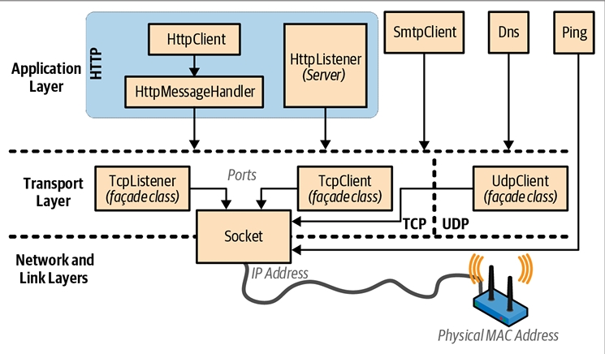
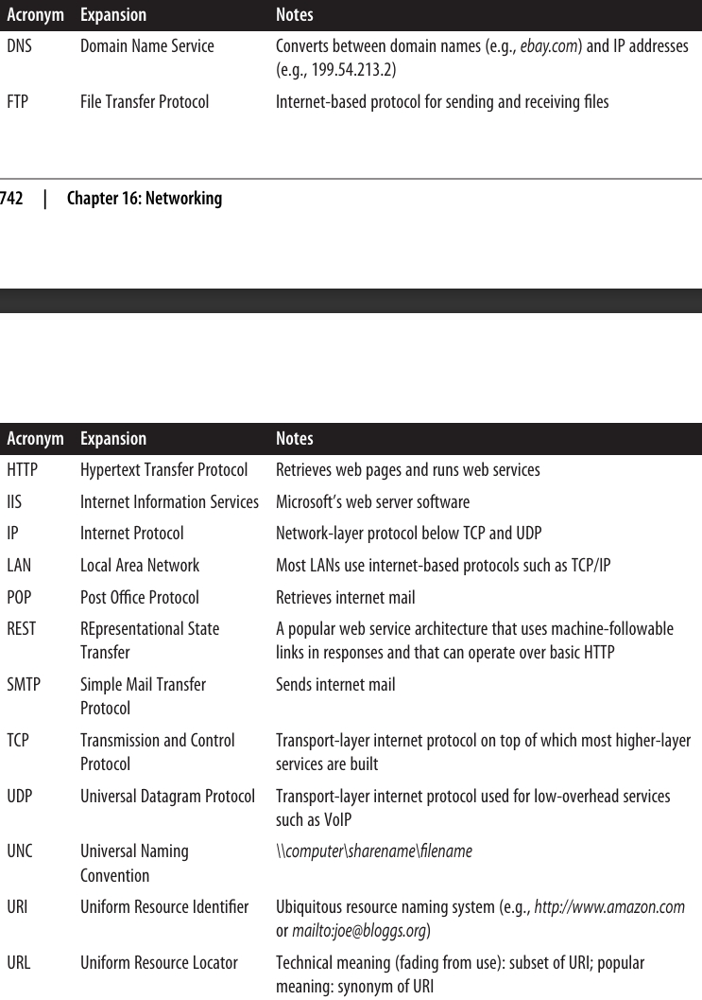
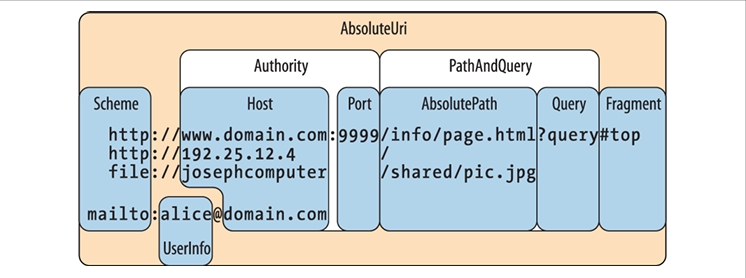
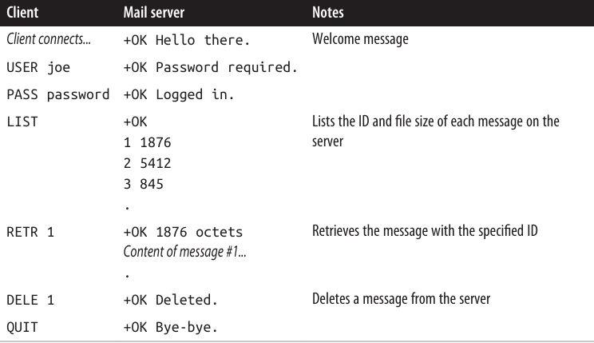

<div dir="rtl">
# فصل شانزدهم: شبکه‌سازی 

.NET مجموعه‌ای از کلاس‌ها را در فضای نام **System.Net.\*** برای برقراری ارتباط از طریق پروتکل‌های استاندارد شبکه مثل **HTTP** و **TCP/IP** ارائه می‌دهد. در اینجا خلاصه‌ای از اجزای کلیدی آورده شده است:

* **HttpClient** برای مصرف APIهای وب مبتنی بر HTTP و سرویس‌های **RESTful**
* **HttpListener** برای نوشتن یک سرور **HTTP**
* **SmtpClient** برای ساخت و ارسال پیام‌های ایمیل از طریق **SMTP**
* **Dns** برای تبدیل بین نام دامنه و آدرس‌ها
* کلاس‌های **TcpClient**، **UdpClient**، **TcpListener** و **Socket** برای دسترسی مستقیم به لایه‌های انتقال و شبکه

انواع (Types) موجود در این فصل از .NET در فضای نام‌های **System.Net.\*** و **System.IO** قرار دارند.

.NET همچنین پشتیبانی سمت کلاینت از **FTP** را فراهم می‌کند، اما فقط از طریق کلاس‌هایی که از نسخه‌ی .NET 6 به‌بعد به‌عنوان **obsolete** (منسوخ) علامت‌گذاری شده‌اند. اگر لازم باشد از **FTP** استفاده کنید، بهترین گزینه استفاده از یک کتابخانه‌ی **NuGet** مثل **FluentFTP** است.

---

### معماری شبکه 🏗️

شکل ۱۶-۱ انواع شبکه‌ای .NET و لایه‌های ارتباطی که در آن‌ها قرار دارند را نشان می‌دهد. بیشتر انواع در **لایه‌ی انتقال (Transport layer)** یا **لایه‌ی کاربرد (Application layer)** قرار دارند.

* لایه‌ی انتقال پروتکل‌های پایه‌ای برای ارسال و دریافت بایت‌ها را تعریف می‌کند (**TCP** و **UDP**).
* لایه‌ی کاربرد پروتکل‌های سطح بالاتر را تعریف می‌کند که برای برنامه‌های خاص طراحی شده‌اند، مثل:

  * بازیابی صفحات وب (**HTTP**)
  * ارسال ایمیل (**SMTP**)
  * تبدیل بین نام دامنه و آدرس‌های **IP** (**DNS**)

<div align="center">
    
 
</div>

معمولاً برنامه‌نویسی در **لایه‌ی کاربرد (Application layer)** راحت‌تر است؛ بااین‌حال، دلایلی وجود دارد که ممکن است بخواهید مستقیماً در **لایه‌ی انتقال (Transport layer)** کار کنید.

* یکی از دلایل این است که به یک پروتکل کاربردی نیاز داشته باشید که در .NET ارائه نشده است، مثل **POP3** برای دریافت ایمیل.
* دلیل دیگر این است که بخواهید یک پروتکل سفارشی برای یک برنامه‌ی خاص طراحی کنید، مثل یک **کلاینت همتا به همتا (peer-to-peer client)**.

---

### پروتکل HTTP و اهمیت آن 🌍

در بین پروتکل‌های کاربردی، **HTTP** به دلیل کاربرد عمومی‌اش اهمیت ویژه‌ای دارد. حالت پایه‌ای عملکرد آن—«این صفحه‌ی وب با این URL را به من بده»—به‌خوبی با الگوهای دیگر مثل «نتیجه‌ی فراخوانی این endpoint با این آرگومان‌ها را به من بده» سازگار می‌شود.

علاوه بر فعل **get**، افعال دیگری مثل **put**، **post** و **delete** هم وجود دارند که امکان ساخت سرویس‌های مبتنی بر **REST** را فراهم می‌کنند.

**HTTP** همچنین مجموعه‌ی گسترده‌ای از قابلیت‌ها دارد که در برنامه‌های تجاری چندلایه و معماری‌های سرویس‌محور مفید هستند، مثل:

* پروتکل‌ها برای **احراز هویت (authentication)** و **رمزنگاری (encryption)**
* **قطعه‌بندی پیام‌ها (message chunking)**
* **هدرها و کوکی‌های قابل‌گسترش (extensible headers and cookies)**
* امکان اینکه چندین برنامه‌ی سرور یک **پورت** و یک **آدرس IP** مشترک داشته باشند

به همین دلایل، **HTTP** در .NET به‌خوبی پشتیبانی می‌شود—هم به‌صورت مستقیم (همان‌طور که در این فصل توضیح داده می‌شود) و هم در سطوح بالاتر، از طریق فناوری‌هایی مثل **Web API** و **ASP.NET Core**.

---

همان‌طور که از بحث‌های بالا مشخص است، حوزه‌ی شبکه‌سازی پر از **اختصارنویسی‌ها (acronyms)** است. متداول‌ترین آن‌ها در **جدول ۱۶-۱** فهرست شده‌اند. 📑
<div align="center">
    
 
</div>

### آدرس‌ها و پورت‌ها

برای اینکه ارتباط برقرار شود، یک کامپیوتر یا دستگاه نیاز به یک **آدرس** دارد. اینترنت از دو سیستم آدرس‌دهی استفاده می‌کند:

* **IPv4**
  در حال حاضر سیستم غالب آدرس‌دهی است. آدرس‌های **IPv4** دارای عرض ۳۲ بیت هستند. وقتی به‌صورت رشته (string) قالب‌بندی می‌شوند، به شکل چهار عدد اعشاری با جداکننده‌ی نقطه نوشته می‌شوند (برای مثال: `101.102.103.104`). یک آدرس می‌تواند در کل دنیا منحصربه‌فرد باشد یا فقط در یک **زیرشبکه (subnet)** خاص (مثل یک شبکه‌ی شرکتی).

* **IPv6**
  سیستم آدرس‌دهی جدیدتر است که عرض آن **۱۲۸ بیت** می‌باشد. آدرس‌ها در قالب رشته‌ای به شکل **هگزادسیمال** نوشته می‌شوند و با **کولون (:)** از هم جدا می‌شوند (برای مثال:
  `[3EA0:FFFF:198A:E4A3:4FF2:54fA:41BC:8D31]`).
  در .NET باید براکت‌های مربعی (\[]) را دور آدرس اضافه کنید.

---

کلاس **IPAddress** در فضای نام **System.Net** یک آدرس را در هر یک از این دو پروتکل نمایش می‌دهد. این کلاس یک **سازنده (constructor)** دارد که یک آرایه‌ی بایت می‌گیرد و یک متد استاتیک به نام **Parse** که یک رشته‌ی قالب‌بندی‌شده‌ی صحیح را می‌گیرد:
</div>

```csharp
IPAddress a1 = new IPAddress (new byte[] { 101, 102, 103, 104 });
IPAddress a2 = IPAddress.Parse ("101.102.103.104");
Console.WriteLine (a1.Equals (a2));       // True

Console.WriteLine (a1.AddressFamily);     // InterNetwork

IPAddress a3 = IPAddress.Parse("[3EA0:FFFF:198A:E4A3:4FF2:54fA:41BC:8D31]");
Console.WriteLine (a3.AddressFamily);     // InterNetworkV6
```

<div dir="rtl">
---

### پورت‌ها 🔌

پروتکل‌های **TCP** و **UDP** هر آدرس IP را به **۶۵٬۵۳۵ پورت** تقسیم می‌کنند. این کار به یک کامپیوتر در یک آدرس واحد اجازه می‌دهد چندین برنامه را اجرا کند، هرکدام روی پورت خودش.

بسیاری از برنامه‌ها پورت‌های پیش‌فرض استاندارد دارند؛ برای مثال:

* **HTTP** از پورت ۸۰ استفاده می‌کند.
* **SMTP** از پورت ۲۵ استفاده می‌کند.

پورت‌های **TCP** و **UDP** از **۴۹۱۵۲ تا ۶۵۵۳۵** به‌طور رسمی بدون تخصیص هستند، بنابراین گزینه‌ی خوبی برای **آزمایش** و **استقرارهای کوچک** هستند.

ترکیب یک آدرس IP و یک پورت در .NET توسط کلاس **IPEndPoint** نمایش داده می‌شود:
</div>

```csharp
IPAddress a = IPAddress.Parse ("101.102.103.104");
IPEndPoint ep = new IPEndPoint (a, 222);      // Port 222
Console.WriteLine (ep.ToString());            // 101.102.103.104:222
```

<div dir="rtl">
---

### URI 📑

**فایروال‌ها (Firewalls)** پورت‌ها را مسدود می‌کنند. در بسیاری از محیط‌های شرکتی، فقط تعداد کمی از پورت‌ها باز هستند—معمولاً:

* پورت ۸۰ (برای **HTTP** رمزگذاری‌نشده)
* پورت ۴۴۳ (برای **HTTP** امن یا HTTPS)

**URI** یک رشته‌ی قالب‌بندی‌شده‌ی خاص است که یک منبع (resource) در اینترنت یا یک LAN را توصیف می‌کند، مثل یک صفحه‌ی وب، فایل یا آدرس ایمیل.

نمونه‌ها:

* `http://www.ietf.org`
* `ftp://myisp/doc.txt`
* `mailto:joe@bloggs.com`

قالب دقیق URI توسط **IETF (Internet Engineering Task Force)** تعریف شده است.

یک **URI** را می‌توان به مجموعه‌ای از عناصر تقسیم کرد—معمولاً شامل **scheme**، **authority** و **path**.

کلاس **Uri** در فضای نام **System** دقیقاً همین تقسیم‌بندی را انجام می‌دهد و یک property برای هر عنصر در اختیار می‌گذارد (همان‌طور که در شکل ۱۶-۲ نشان داده شده است).
<div align="center">
    
 
</div>

### کلاس Uri 🧭

کلاس **Uri** زمانی مفید است که نیاز داشته باشید قالب یک رشته‌ی **URI** را اعتبارسنجی کنید یا یک URI را به بخش‌های تشکیل‌دهنده‌اش تقسیم کنید. در غیر این صورت، می‌توانید URI را صرفاً مثل یک رشته در نظر بگیرید—بیشتر متدهای شبکه‌ای هم **overload** شده‌اند تا هم یک شیء **Uri** و هم یک رشته را بپذیرند.

می‌توانید یک شیء **Uri** را با عبور دادن هرکدام از رشته‌های زیر به سازنده‌اش ایجاد کنید:

* یک رشته‌ی **URI**، مثل:
  `http://www.ebay.com` یا `file://janespc/sharedpics/dolphin.jpg`
* یک مسیر مطلق به یک فایل روی هارد دیسک، مثل:
  `c:\myfiles\data.xlsx` (روی ویندوز) یا `/tmp/myfiles/data.xlsx` (روی یونیکس)
* یک مسیر **UNC** به یک فایل در شبکه LAN، مثل:
  `\\janespc\sharedpics\dolphin.jpg`

مسیرهای فایل و UNC به‌طور خودکار به URI تبدیل می‌شوند: پروتکل `"file:"` اضافه می‌شود و **بک‌اسلش‌ها** (`\`) به **فوروارد اسلش‌ها** (`/`) تبدیل می‌شوند. سازنده‌های **Uri** همچنین قبل از ساخت شیء، رشته‌ی شما را کمی پاک‌سازی می‌کنند، شامل:

* تبدیل **scheme** و **hostname** به حروف کوچک
* حذف پورت‌های خالی یا پیش‌فرض

اگر رشته‌ی URI را بدون scheme (مثل `www.test.com`) بدهید، یک **UriFormatException** پرتاب می‌شود.

---

کلاس **Uri** دارای propertyهای زیر است:

* **IsLoopback** → مشخص می‌کند که آیا URI به میزبان محلی (**127.0.0.1**) اشاره می‌کند یا نه.
* **IsFile** → مشخص می‌کند که آیا URI به یک مسیر محلی یا UNC اشاره دارد یا نه (با **IsUnc**).

اگر **IsFile** مقدار true برگرداند، property به نام **LocalPath** نسخه‌ای از **AbsolutePath** را بازمی‌گرداند که با سیستم‌عامل محلی سازگار است (با اسلش‌ها یا بک‌اسلش‌های مناسب)، و می‌توانید روی آن متدهایی مثل **File.Open** را فراخوانی کنید.

نمونه‌های **Uri** فقط propertyهای **read-only** دارند. برای تغییر یک URI موجود، باید یک شیء **UriBuilder** ایجاد کنید—این کلاس propertyهای قابل‌نوشتن دارد و می‌تواند دوباره به یک Uri از طریق property خودش به نام **Uri** تبدیل شود.

---

### متدها و مثال‌ها 📌

کلاس **Uri** متدهایی برای مقایسه و تفریق مسیرها فراهم می‌کند:
</div>

```csharp
Uri info = new Uri ("http://www.domain.com:80/info/");
Uri page = new Uri ("http://www.domain.com/info/page.html");

Console.WriteLine (info.Host);     // www.domain.com
Console.WriteLine (info.Port);     // 80
Console.WriteLine (page.Port);     // 80  (Uri پورت پیش‌فرض HTTP را می‌شناسد)
Console.WriteLine (info.IsBaseOf (page));   // True

Uri relative = info.MakeRelativeUri (page);
Console.WriteLine (relative.IsAbsoluteUri); // False
Console.WriteLine (relative.ToString());    // page.html
```

<div dir="rtl">
یک **URI نسبی (relative URI)** مثل `page.html` در این مثال، اگر تقریباً هر property یا متدی به‌جز **IsAbsoluteUri** و **ToString** را فراخوانی کنید، یک exception پرتاب می‌کند. می‌توانید مستقیماً یک URI نسبی بسازید:
</div>

```csharp
Uri u = new Uri ("page.html", UriKind.Relative);
```

<div dir="rtl">
---

### اهمیت اسلش انتهایی `/` ⚠️

اسلش انتهایی در یک URI مهم است و روی پردازش درخواست توسط سرور تأثیر می‌گذارد.

برای مثال، در یک سرور وب سنتی:

* URI به شکل `http://www.albahari.com/nutshell/` → سرور در پوشه‌ی `nutshell` جست‌وجو می‌کند و فایل پیش‌فرض (معمولاً `index.html`) را بازمی‌گرداند.
* URI بدون اسلش انتهایی `http://www.albahari.com/nutshell` → سرور به دنبال فایلی به نام `nutshell` (بدون پسوند) در پوشه‌ی ریشه می‌گردد. اگر چنین فایلی وجود نداشته باشد، اغلب یک خطای **301 Permanent Redirect** برمی‌گرداند و پیشنهاد می‌کند که کلاینت دوباره با اسلش انتهایی درخواست بفرستد.

کلاینت‌های HTTP در .NET به‌طور پیش‌فرض همانند مرورگرها عمل می‌کنند و به‌طور شفاف درخواست را با URI پیشنهادی دوباره ارسال می‌کنند. این یعنی اگر اسلش انتهایی را فراموش کنید، درخواست همچنان کار خواهد کرد—اما یک **رفت‌و‌برگشت اضافه‌ی غیرضروری** ایجاد می‌شود.

---

### متدهای استاتیک مفید 🌟

کلاس **Uri** متدهای کمکی استاتیک نیز دارد، مثل:

* **EscapeUriString()** → یک رشته را به یک URL معتبر تبدیل می‌کند (کاراکترهایی با مقدار ASCII بیشتر از ۱۲۷ را به نمایش هگزادسیمال تغییر می‌دهد).
* **CheckHostName()** و **CheckSchemeName()** → بررسی می‌کنند که آیا یک رشته از نظر نحوی برای property مربوطه معتبر است یا نه (اما وجود میزبان یا URI را بررسی نمی‌کنند).

---

## HttpClient 🚀

کلاس **HttpClient** یک API مدرن برای عملیات کلاینت HTTP ارائه می‌دهد و جایگزین **WebClient** و **WebRequest/WebResponse** (که اکنون **obsolete** شده‌اند) است.

این کلاس در واکنش به رشد **APIهای وب مبتنی بر HTTP** و **سرویس‌های REST** طراحی شد و تجربه‌ی بهتری برای پروتکل‌های پیچیده‌تر از فقط دریافت یک صفحه‌ی وب ارائه می‌دهد.

### قابلیت‌های کلیدی HttpClient ✅

* یک نمونه‌ی **HttpClient** می‌تواند درخواست‌های هم‌زمان را مدیریت کند و به‌خوبی با قابلیت‌هایی مثل **هدرهای سفارشی، کوکی‌ها و روش‌های احراز هویت** کار کند.
* اجازه می‌دهد **Message Handler**های سفارشی بنویسید و اضافه کنید → برای **mocking** در تست‌های واحد و ایجاد **pipelineهای سفارشی** (مثل لاگ‌برداری، فشرده‌سازی، رمزنگاری و …).
* یک سیستم نوعی (type system) غنی و قابل‌گسترش برای **Headers** و **Content** دارد.

⚠️ **HttpClient از گزارش پیشرفت (progress reporting) پشتیبانی نمی‌کند**. برای راه‌حل، می‌توانید به نمونه‌ی `HttpClient with Progress.linq` در سایت نویسنده یا گالری نمونه‌های LINQPad مراجعه کنید.

---

### استفاده‌ی ساده از HttpClient 📝

ساده‌ترین روش: نمونه‌سازی و استفاده از متدهای **Get\***:
</div>

```csharp
string html = await new HttpClient().GetStringAsync ("http://linqpad.net");
```

<div dir="rtl">
همچنین متدهای **GetByteArrayAsync** و **GetStreamAsync** وجود دارند. تمام متدهای I/O در **HttpClient** به‌صورت **asynchronous** هستند.

💡 برخلاف WebRequest/WebResponse، برای بهترین کارایی باید از **یک نمونه‌ی HttpClient** استفاده‌ی مجدد کنید؛ در غیر این صورت، عملیات‌هایی مثل **DNS resolution** دوباره و دوباره انجام می‌شوند و **ساکت‌ها** (sockets) بیشتر از حد لازم باز می‌مانند.

نمونه:
</div>

```csharp
var client = new HttpClient();
var task1 = client.GetStringAsync ("http://www.linqpad.net");
var task2 = client.GetStringAsync ("http://www.albahari.com");

Console.WriteLine (await task1);
Console.WriteLine (await task2);
```

<div dir="rtl">
---

### ویژگی‌ها و پیکربندی ⚙️

* **Timeout** → تعیین می‌کند یک درخواست چقدر می‌تواند طول بکشد.
* **BaseAddress** → یک URI پایه به همه‌ی درخواست‌ها اضافه می‌کند.

بیشتر propertyهای دیگر در کلاس **HttpClientHandler** تعریف شده‌اند. برای دسترسی به آن:
</div>

```csharp
var handler = new HttpClientHandler { UseProxy = false };
var client = new HttpClient (handler);
```

<div dir="rtl">
در این مثال، **پشتیبانی از Proxy** غیرفعال شد تا هزینه‌ی شناسایی خودکار Proxy حذف شود و کارایی افزایش یابد.

کلاس **HttpClientHandler** همچنین propertyهایی برای کنترل **کوکی‌ها، ریدایرکت خودکار، احراز هویت** و … دارد.

---

### GetAsync و Response Messages 📩

متدهای **GetStringAsync**، **GetByteArrayAsync** و **GetStreamAsync** میانبرهایی برای متد عمومی‌تر **GetAsync** هستند که یک **HttpResponseMessage** برمی‌گرداند:
</div>

```csharp
var client = new HttpClient();
// GetAsync همچنین یک CancellationToken می‌پذیرد
HttpResponseMessage response = await client.GetAsync ("http://...");

response.EnsureSuccessStatusCode();
string html = await response.Content.ReadAsStringAsync();
```

<div dir="rtl">
* **HttpResponseMessage** → دسترسی به **Headers** و **StatusCode**.
* اگر **status code ناموفق** مثل ۴۰۴ برگردد، exception پرتاب نمی‌شود مگر اینکه **EnsureSuccessStatusCode** را صریحاً فراخوانی کنید.
* خطاهای ارتباطی یا DNS → همیشه exception پرتاب می‌کنند.

همچنین، **HttpContent** متدی به نام **CopyToAsync** دارد که می‌تواند خروجی را به یک **Stream دیگر** بنویسد:
</div>

```csharp
using (var fileStream = File.Create ("linqpad.html"))
  await response.Content.CopyToAsync (fileStream);
```

<div dir="rtl">
متد **GetAsync** یکی از چهار متد متناظر با افعال HTTP است (بقیه: **PostAsync، PutAsync، DeleteAsync**).

---

### SendAsync و Request Messages 📨

متدهای **GetAsync، PostAsync، PutAsync و DeleteAsync** همگی میانبرهایی برای **SendAsync** هستند، متد سطح‌پایین که همه چیز به آن ختم می‌شود.

برای استفاده:
</div>

```csharp
var client = new HttpClient();
var request = new HttpRequestMessage (HttpMethod.Get, "http://...");
HttpResponseMessage response = await client.SendAsync (request);

response.EnsureSuccessStatusCode();
```

<div dir="rtl">
ایجاد یک **HttpRequestMessage** به شما امکان می‌دهد propertyهای درخواست مثل **Headers** و **Content** را شخصی‌سازی کنید، که شامل آپلود داده‌ها نیز می‌شود.
### 📤 آپلود داده‌ها و HttpContent

بعد از نمونه‌سازی یک شیء از نوع `HttpRequestMessage`، می‌توانید با مقداردهی به ویژگی **Content** داده‌ای برای آپلود مشخص کنید. نوع این ویژگی یک کلاس انتزاعی به نام `HttpContent` است. .NET چندین زیرکلاس مشخص برای انواع مختلف داده فراهم کرده است (و البته می‌توانید کلاس اختصاصی خودتان را هم بنویسید):

* `ByteArrayContent`
* `StringContent`
* `FormUrlEncodedContent` (بخش **Uploading Form Data** در صفحه 754 را ببینید)
* `StreamContent`

🔹 مثال:
</div>

```csharp
var client = new HttpClient (new HttpClientHandler { UseProxy = false });
var request = new HttpRequestMessage (
 HttpMethod.Post, "http://www.albahari.com/EchoPost.aspx");
request.Content = new StringContent ("This is a test");
HttpResponseMessage response = await client.SendAsync (request);
response.EnsureSuccessStatusCode();
Console.WriteLine (await response.Content.ReadAsStringAsync());
```

<div dir="rtl">
---

### ⚙️ HttpMessageHandler

قبلاً گفتیم که بیشتر ویژگی‌های سفارشی‌سازی درخواست‌ها نه در `HttpClient` بلکه در `HttpClientHandler` تعریف شده‌اند. در واقع، `HttpClientHandler` زیرکلاسی از کلاس انتزاعی `HttpMessageHandler` است که به شکل زیر تعریف می‌شود:
</div>

```csharp
public abstract class HttpMessageHandler : IDisposable
{
  protected internal abstract Task<HttpResponseMessage> SendAsync
    (HttpRequestMessage request, CancellationToken cancellationToken);
  public void Dispose();
  protected virtual void Dispose (bool disposing);
}
```

<div dir="rtl">
متد `SendAsync` درون متد `SendAsync` کلاس `HttpClient` فراخوانی می‌شود.
`HttpMessageHandler` به اندازه‌ای ساده است که بتوان به‌راحتی آن را زیرکلاس کرد و در نتیجه، یک نقطه‌ی توسعه‌پذیری برای `HttpClient` فراهم می‌کند.

---

### 🧪 Unit Testing و Mocking

می‌توانیم `HttpMessageHandler` را زیرکلاس کنیم تا یک **Mocking Handler** برای کمک به تست واحد بسازیم:
</div>

```csharp
class MockHandler : HttpMessageHandler
{
  Func <HttpRequestMessage, HttpResponseMessage> _responseGenerator;
  public MockHandler
    (Func <HttpRequestMessage, HttpResponseMessage> responseGenerator)
  {
    _responseGenerator = responseGenerator;
  }
  protected override Task <HttpResponseMessage> SendAsync
    (HttpRequestMessage request, CancellationToken cancellationToken)
  {
    cancellationToken.ThrowIfCancellationRequested();
    var response = _responseGenerator (request);
    response.RequestMessage = request;
    return Task.FromResult (response);
  }
}
```

<div dir="rtl">
🔹 سازنده‌ی این کلاس یک تابع دریافت می‌کند که مشخص می‌کند پاسخ از روی درخواست چگونه ساخته شود. این رویکرد بسیار انعطاف‌پذیر است زیرا همان هندلر می‌تواند چندین درخواست مختلف را تست کند.

متد `SendAsync` در اینجا به‌صورت **همگام** عمل می‌کند چون از `Task.FromResult` استفاده کرده‌ایم. البته می‌توانستیم با برگرداندن `Task<HttpResponseMessage>` از تابع پاسخ‌ساز، حالت **غیرهمگام** را هم حفظ کنیم، اما از آنجا که تابع Mock معمولاً کوتاه و سریع است، ضرورتی ندارد.

🔹 نحوه‌ی استفاده:
</div>

```csharp
var mocker = new MockHandler (request => 
  new HttpResponseMessage (HttpStatusCode.OK)
  {
    Content = new StringContent ("You asked for " + request.RequestUri)
  });
var client = new HttpClient (mocker);    
var response = await client.GetAsync ("http://www.linqpad.net");
string result = await response.Content.ReadAsStringAsync();
Assert.AreEqual ("You asked for http://www.linqpad.net/", result);
```

<div dir="rtl">
(`Assert.AreEqual` متدی است که معمولاً در فریم‌ورک‌های تست واحد مثل NUnit استفاده می‌شود.)

---

### 🔗 زنجیره‌سازی هندلرها با DelegatingHandler

می‌توانید یک Message Handler بسازید که یک هندلر دیگر را فراخوانی کند (و در نتیجه زنجیره‌ای از هندلرها ایجاد شود). این کار از طریق زیرکلاس کردن `DelegatingHandler` انجام می‌شود. با این روش می‌توانید پروتکل‌های سفارشی مانند **احراز هویت، فشرده‌سازی و رمزگذاری** را پیاده‌سازی کنید.

🔹 نمونه‌ی یک هندلر لاگ ساده:
</div>

```csharp
class LoggingHandler : DelegatingHandler 
{
  public LoggingHandler (HttpMessageHandler nextHandler)
  {
     InnerHandler = nextHandler;
  }
  protected async override Task <HttpResponseMessage> SendAsync
    (HttpRequestMessage request, CancellationToken cancellationToken)
  {
    Console.WriteLine ("Requesting: " + request.RequestUri);
    var response = await base.SendAsync (request, cancellationToken);
    Console.WriteLine ("Got response: " + response.StatusCode);
    return response;
  }
}
```

<div dir="rtl">
✅ در اینجا ما **غیرهمزمانی** را در Override کردن `SendAsync` حفظ کرده‌ایم. استفاده از `async` در متدهایی که خروجی Task دارند هم قانونی است و هم در اینجا مطلوب.

---

### 🌐 پروکسی (Proxy)

یک **Proxy Server** واسطه‌ای است که درخواست‌های HTTP از طریق آن مسیردهی می‌شوند. سازمان‌ها معمولاً برای دسترسی کارکنان به اینترنت از طریق یک پروکسی استفاده می‌کنند چون مدیریت امنیت را ساده‌تر می‌کند. پروکسی آدرس خودش را دارد و می‌تواند احراز هویت بخواهد تا فقط کاربران انتخاب‌شده در LAN به اینترنت دسترسی داشته باشند.

برای استفاده از Proxy در `HttpClient`:
</div>

```csharp
WebProxy p = new WebProxy ("192.178.10.49", 808);
p.Credentials = new NetworkCredential ("username", "password", "domain");
var handler = new HttpClientHandler { Proxy = p };
var client = new HttpClient (handler);
...
```

<div dir="rtl">
ویژگی `UseProxy` در `HttpClientHandler` را می‌توان روی `false` تنظیم کرد تا به جای null کردن `Proxy`، تشخیص خودکار غیرفعال شود.

اگر هنگام ساختن `NetworkCredential` یک **دامنه** مشخص کنید، پروتکل‌های احراز هویت مبتنی بر ویندوز (NTLM یا Kerberos) استفاده می‌شوند. برای استفاده از کاربر فعلی ویندوز، مقدار `CredentialCache.DefaultNetworkCredentials` را به ویژگی `Credentials` پروکسی اختصاص دهید.

همچنین به‌جای تنظیم Proxy در هر بار استفاده، می‌توانید مقدار پیش‌فرض سراسری را مشخص کنید:
</div>

```csharp
HttpClient.DefaultWebProxy = myWebProxy;
```

<div dir="rtl">
---

### 🔐 احراز هویت (Authentication)

می‌توانید نام کاربری و رمز عبور را به این صورت به `HttpClient` بدهید:
</div>

```csharp
string username = "myuser";
string password = "mypassword";
var handler = new HttpClientHandler();
handler.Credentials = new NetworkCredential (username, password);
var client = new HttpClient (handler);
...
```

<div dir="rtl">
این روش با پروتکل‌های مبتنی بر دیالوگ مثل **Basic** و **Digest** کار می‌کند و از طریق کلاس `AuthenticationManager` نیز قابل گسترش است. همچنین از **Windows NTLM** و **Kerberos** هم پشتیبانی می‌کند (اگر هنگام ساختن `NetworkCredential` دامنه وارد کرده باشید). اگر بخواهید از کاربر فعلی ویندوز استفاده کنید، کافی است ویژگی `Credentials` را مقداردهی نکنید و به‌جای آن `UseDefaultCredentials = true` تنظیم کنید.

وقتی اطلاعات ورود (Credentials) را مشخص می‌کنید، `HttpClient` به‌طور خودکار پروتکل مناسب را مذاکره می‌کند. در برخی موارد گزینه‌های مختلفی وجود دارد؛ برای مثال، پاسخ اولیه‌ی یک سرور Microsoft Exchange Web Mail ممکن است شامل هدرهای زیر باشد:
</div>

```
HTTP/1.1 401 Unauthorized
Content-Length: 83
Content-Type: text/html
Server: Microsoft-IIS/6.0
WWW-Authenticate: Negotiate
WWW-Authenticate: NTLM
WWW-Authenticate: Basic realm="exchange.somedomain.com"
X-Powered-By: ASP.NET
Date: Sat, 05 Aug 2006 12:37:23 GMT
```

<div dir="rtl">
کد **401** به معنای نیاز به احراز هویت است؛ هدرهای `WWW-Authenticate` هم نشان می‌دهند چه پروتکل‌هایی پشتیبانی می‌شوند.

اگر `HttpClientHandler` را با نام کاربری و رمز درست پیکربندی کنید، این پیام را نخواهید دید چون زمان اجرا به‌طور خودکار یک پروتکل سازگار انتخاب می‌کند، درخواست اصلی را دوباره ارسال می‌کند و یک هدر اضافی اضافه می‌کند.

مثال:
</div>

```
Authorization: Negotiate TlRMTVNTUAAABAAAt5II2gjACDArAAACAwACACgAAAAQ
ATmKAAAAD0lVDRdPUksHUq9VUA==
```

<div dir="rtl">
این مکانیزم شفاف است، اما باعث می‌شود هر درخواست یک رفت‌وبرگشت اضافی ایجاد کند. برای جلوگیری از این موضوع در درخواست‌های بعدی به همان URI، می‌توانید ویژگی `PreAuthenticate` در `HttpClientHandler` را روی true قرار دهید.
### 🔑 CredentialCache

می‌توانید با استفاده از شیء `CredentialCache` یک **پروتکل احراز هویت خاص** را مجبور کنید.
یک Credential Cache شامل یک یا چند شیء `NetworkCredential` است که هرکدام به یک پروتکل و یک **URI prefix** خاص متصل هستند.

به‌عنوان مثال، ممکن است بخواهید در هنگام ورود به **Exchange Server** از پروتکل Basic استفاده نکنید (چون رمزها را به صورت **متن ساده** ارسال می‌کند):
</div>

```csharp
CredentialCache cache = new CredentialCache();
Uri prefix = new Uri ("http://exchange.somedomain.com");
cache.Add (prefix, "Digest",  new NetworkCredential ("joe", "passwd"));
cache.Add (prefix, "Negotiate", new NetworkCredential ("joe", "passwd"));
var handler = new HttpClientHandler();
handler.Credentials = cache;
...
```

<div dir="rtl">
پروتکل احراز هویت به صورت رشته‌ای مشخص می‌شود. مقادیر معتبر شامل موارد زیر هستند:
`Basic`, `Digest`, `NTLM`, `Kerberos`, `Negotiate`

🔹 در این مثال، پروتکل **Negotiate** انتخاب می‌شود چون سرور در هدرهای احراز هویت خود پشتیبانی از Digest را اعلام نکرده است.
Negotiate یک پروتکل ویندوزی است که در عمل به **Kerberos** یا **NTLM** ترجمه می‌شود، بسته به اینکه سرور چه قابلیتی داشته باشد. این مکانیزم باعث می‌شود اپلیکیشن شما در برابر استانداردهای امنیتی آینده هم **سازگار** باقی بماند.

برای افزودن کاربر فعلی ویندوز به Credential Cache بدون نیاز به رمز عبور، می‌توانید از ویژگی ایستا `CredentialCache.DefaultNetworkCredentials` استفاده کنید:
</div>

```csharp
cache.Add (prefix, "Negotiate", CredentialCache.DefaultNetworkCredentials);
```

<div dir="rtl">
---

### 📨 احراز هویت از طریق Header

راه دیگر احراز هویت، تنظیم مستقیم **هدر احراز هویت** است:
</div>

```csharp
var client = new HttpClient();
client.DefaultRequestHeaders.Authorization = 
  new AuthenticationHeaderValue ("Basic",
    Convert.ToBase64String (Encoding.UTF8.GetBytes ("username:password")));
...
```

<div dir="rtl">
این استراتژی با سیستم‌های احراز هویت سفارشی مثل **OAuth** هم کار می‌کند.

---

### 📑 هدرها (Headers)

`HttpClient` به شما اجازه می‌دهد که به یک درخواست، هدرهای HTTP سفارشی اضافه کنید یا هدرهای پاسخ را مرور کنید.
یک هدر در اصل یک جفت **کلید/مقدار** است که شامل **متادیتا** می‌شود (مثل نوع محتوای پیام یا نرم‌افزار سرور).

* ویژگی `DefaultRequestHeaders` برای هدرهایی است که روی **همه‌ی درخواست‌ها** اعمال می‌شوند:
</div>

```csharp
var client = new HttpClient (handler);
client.DefaultRequestHeaders.UserAgent.Add (
  new ProductInfoHeaderValue ("VisualStudio", "2022"));
client.DefaultRequestHeaders.Add ("CustomHeader", "VisualStudio/2022");
```

<div dir="rtl">
* ویژگی `Headers` در کلاس `HttpRequestMessage` مخصوص هدرهای خاص همان درخواست است.

---

### ❓ Query Strings

**Query String** رشته‌ای است که به URI اضافه می‌شود (بعد از علامت سؤال) و برای ارسال داده‌های ساده به سرور استفاده می‌شود.

🔹 ساختار کلی:
</div>

```
?key1=value1&key2=value2&key3=value3...
```

<div dir="rtl">
مثال:
</div>

```csharp
string requestURI = "http://www.google.com/search?q=HttpClient&hl=fr";
```

<div dir="rtl">
اگر احتمال دارد Query شامل **کاراکترهای خاص یا فاصله** باشد، می‌توانید از متد `EscapeDataString` در کلاس `Uri` استفاده کنید تا URI معتبر تولید شود:
</div>

```csharp
string search = Uri.EscapeDataString ("(HttpClient or HttpRequestMessage)");
string language = Uri.EscapeDataString ("fr");
string requestURI = "http://www.google.com/search?q=" + search +
                   "&hl=" + language;
```

<div dir="rtl">
🔹 نتیجه:
</div>

```
http://www.google.com/search?q=(HttpClient%20OR%20HttpRequestMessage)&hl=fr
```

<div dir="rtl">
(متد `EscapeDataString` شبیه `EscapeUriString` است، با این تفاوت که کاراکترهایی مثل `&` و `=` را هم کدگذاری می‌کند، چون در غیر این صورت Query String را به‌هم می‌ریزد.)

---

### 📤 آپلود داده‌های فرم (Uploading Form Data)

برای آپلود داده‌های فرم HTML، یک شیء از نوع `FormUrlEncodedContent` بسازید و مقادیر را در آن قرار دهید. سپس می‌توانید آن را به متد `PostAsync` بدهید یا به ویژگی `Content` یک درخواست اختصاص دهید:
</div>

```csharp
string uri = "http://www.albahari.com/EchoPost.aspx";
var client = new HttpClient();
var dict = new Dictionary<string,string> 
{
    { "Name", "Joe Albahari" },
    { "Company", "O'Reilly" }
};
var values = new FormUrlEncodedContent (dict);
var response = await client.PostAsync (uri, values);
response.EnsureSuccessStatusCode();
Console.WriteLine (await response.Content.ReadAsStringAsync());
```

<div dir="rtl">
---

### 🍪 کوکی‌ها (Cookies)

یک **Cookie** جفت رشته **نام/مقدار** است که یک سرور HTTP در هدر پاسخ برای کلاینت ارسال می‌کند. مرورگرها معمولاً کوکی‌ها را ذخیره می‌کنند و در هر درخواست بعدی (به همان آدرس) دوباره به سرور می‌فرستند تا زمان انقضا.

🔹 هدف کوکی: سرور بتواند بفهمد آیا همچنان با همان کلاینت قبلی در ارتباط است یا خیر (بدون نیاز به Query String‌های اضافی).

به‌طور پیش‌فرض، `HttpClient` کوکی‌های دریافتی را **نادیده می‌گیرد**. برای پذیرش کوکی‌ها باید یک `CookieContainer` بسازید و آن را به `HttpClientHandler` اختصاص دهید:
</div>

```csharp
var cc = new CookieContainer();
var handler = new HttpClientHandler();
handler.CookieContainer = cc;
var client = new HttpClient (handler);
...
```

<div dir="rtl">
برای استفاده مجدد از کوکی‌ها در درخواست‌های بعدی، کافی است از همان `CookieContainer` دوباره استفاده کنید.
همچنین می‌توانید یک `CookieContainer` تازه بسازید و کوکی‌ها را به‌صورت دستی اضافه کنید:
</div>

```csharp
Cookie c = new Cookie ("PREF",
                       "ID=6b10df1da493a9c4:TM=1179...",
                       "/",
                       ".google.com");
freshCookieContainer.Add (c);
```

<div dir="rtl">
آرگومان سوم و چهارم به ترتیب **مسیر (Path)** و **دامنه (Domain)** صادرکننده را مشخص می‌کنند.

یک `CookieContainer` در سمت کلاینت می‌تواند کوکی‌هایی از چندین مبدا مختلف را در خود جای دهد؛ `HttpClient` فقط کوکی‌هایی را می‌فرستد که مسیر و دامنه‌شان با سرور درخواست‌شده مطابقت داشته باشند.
### 🖥️ نوشتن یک HTTP Server

اگر نیاز به نوشتن یک **HTTP server** داشته باشید، یک رویکرد سطح بالاتر (از .NET 6 به بعد) استفاده از **ASP.NET Minimal API** است. برای شروع فقط کافی است:
</div>

```csharp
var app = WebApplication.CreateBuilder().Build();
app.MapGet ("/", () => "Hello, world!");
app.Run();
```

<div dir="rtl">
همچنین می‌توانید با استفاده از کلاس **HttpListener**، سرور HTTP اختصاصی خودتان را بسازید. نمونه‌ی زیر یک سرور ساده است که روی پورت 51111 گوش می‌دهد، منتظر یک درخواست از کلاینت می‌شود و سپس یک پاسخ یک‌خطی برمی‌گرداند:
</div>

```csharp
using var server = new SimpleHttpServer();
// ارسال یک درخواست از کلاینت:
Console.WriteLine (await new HttpClient().GetStringAsync
  ("http://localhost:51111/MyApp/Request.txt"));

class SimpleHttpServer : IDisposable
{
  readonly HttpListener listener = new HttpListener();
  public SimpleHttpServer() => ListenAsync();  

  async void ListenAsync()
  {
    listener.Prefixes.Add ("http://localhost:51111/MyApp/");  // گوش دادن روی پورت 51111
    listener.Start();

    // منتظر یک درخواست کلاینت:
    HttpListenerContext context = await listener.GetContextAsync();

    // پاسخ به درخواست:
    string msg = "You asked for: " + context.Request.RawUrl;
    context.Response.ContentLength64 = Encoding.UTF8.GetByteCount (msg);
    context.Response.StatusCode = (int)HttpStatusCode.OK;
    using (Stream s = context.Response.OutputStream)
    using (StreamWriter writer = new StreamWriter (s))
      await writer.WriteAsync (msg);
  }

  public void Dispose() => listener.Close();
}
```

<div dir="rtl">
📤 **خروجی:**
</div>

```
You asked for: /MyApp/Request.txt
```

<div dir="rtl">
روی ویندوز، `HttpListener` به صورت داخلی از **.NET Socket** استفاده نمی‌کند، بلکه از **Windows HTTP Server API** کمک می‌گیرد. این موضوع باعث می‌شود چندین برنامه روی یک IP و پورت یکسان گوش بدهند، به شرطی که هر کدام پیشوندهای متفاوتی ثبت کنند (مثلاً `/myapp` یا `/anotherapp`).

ویژگی‌های اصلی:

* درخواست‌های کلاینت از طریق متد `GetContext` گرفته می‌شود.
* شما می‌توانید هدرها، کوکی‌ها و وضعیت پاسخ را تنظیم کنید.
* حداقل باید **ContentLength** و **StatusCode** را مشخص کنید.

مثال یک **وب‌سرور ساده و ناهمزمان** برای ارائه‌ی فایل‌ها:
</div>

```csharp
class WebServer
{
  HttpListener _listener;
  string _baseFolder;  // پوشه‌ی وب‌پیج‌ها
  public WebServer (string uriPrefix, string baseFolder)
  {
    _listener = new HttpListener();
    _listener.Prefixes.Add (uriPrefix);
    _baseFolder = baseFolder;
  }

  public async void Start()
  {
    _listener.Start();
    while (true)
      try 
      {
        var context = await _listener.GetContextAsync();
        Task.Run (() => ProcessRequestAsync (context));
      }
      catch (HttpListenerException)     { break; }
      catch (InvalidOperationException) { break; }
  }

  public void Stop() => _listener.Stop();

  async void ProcessRequestAsync (HttpListenerContext context)
  {
    try
    {
      string filename = Path.GetFileName (context.Request.RawUrl);
      string path = Path.Combine (_baseFolder, filename);
      byte[] msg;

      if (!File.Exists (path))
      {
        Console.WriteLine ("Resource not found: " + path);
        context.Response.StatusCode = (int) HttpStatusCode.NotFound;
        msg = Encoding.UTF8.GetBytes ("Sorry, that page does not exist");
      }
      else
      {
        context.Response.StatusCode = (int) HttpStatusCode.OK;
        msg = File.ReadAllBytes (path);
      }

      context.Response.ContentLength64 = msg.Length;
      using (Stream s = context.Response.OutputStream)
        await s.WriteAsync (msg, 0, msg.Length);
    }
    catch (Exception ex) { Console.WriteLine ("Request error: " + ex); }
  }
}
```

<div dir="rtl">
📌 راه‌اندازی:
</div>

```csharp
var server = new WebServer ("http://localhost:51111/", @"d:\webroot");
try
{
  server.Start();
  Console.WriteLine ("Server running... press Enter to stop");
  Console.ReadLine();
}
finally { server.Stop(); }
```

<div dir="rtl">
حالا می‌توانید با هر مرورگری این سرور را تست کنید.

---

### 🌐 استفاده از DNS

کلاس استاتیک **Dns** عملیات **Domain Name System** را کپسوله می‌کند.

🔹 تبدیل نام دامنه به IP:
</div>

```csharp
foreach (IPAddress a in Dns.GetHostAddresses ("albahari.com"))
  Console.WriteLine (a.ToString());  // 205.210.42.167
```

<div dir="rtl">
🔹 تبدیل IP به نام دامنه:
</div>

```csharp
IPHostEntry entry = Dns.GetHostEntry ("205.210.42.167");
Console.WriteLine (entry.HostName);  // albahari.com
```

<div dir="rtl">
🔹 روش ناهمزمان:
</div>

```csharp
foreach (IPAddress a in await Dns.GetHostAddressesAsync ("albahari.com"))
  Console.WriteLine (a.ToString());
```

<div dir="rtl">
---

### 📧 ارسال ایمیل با SmtpClient

کلاس **SmtpClient** در فضای نام `System.Net.Mail` برای ارسال ایمیل با پروتکل **SMTP** استفاده می‌شود.

مثال ساده:
</div>

```csharp
SmtpClient client = new SmtpClient();
client.Host = "mail.myserver.com";
client.Send ("from@adomain.com", "to@adomain.com", "subject", "body");
```

<div dir="rtl">
📎 افزودن پیوست‌ها:
</div>

```csharp
SmtpClient client = new SmtpClient();
client.Host = "mail.myisp.net";
MailMessage mm = new MailMessage();
mm.Sender = new MailAddress ("kay@domain.com", "Kay");
mm.From   = new MailAddress ("kay@domain.com", "Kay");
mm.To.Add  (new MailAddress ("bob@domain.com", "Bob"));
mm.CC.Add  (new MailAddress ("dan@domain.com", "Dan"));
mm.Subject = "Hello!";
mm.Body = "Hi there. Here's the photo!";
mm.IsBodyHtml = false;
mm.Priority = MailPriority.High;
Attachment a = new Attachment ("photo.jpg",
                               System.Net.Mime.MediaTypeNames.Image.Jpeg);
mm.Attachments.Add (a);
client.Send (mm);
```

<div dir="rtl">
🔐 بیشتر سرورهای SMTP فقط ارتباط‌های **احراز هویت‌شده و امن (SSL/TLS)** را قبول می‌کنند:
</div>

```csharp
var client = new SmtpClient ("smtp.myisp.com", 587)
{
  Credentials = new NetworkCredential ("me@myisp.com", "MySecurePass"),
  EnableSsl = true
};
client.Send ("me@myisp.com", "someone@somewhere.com", "Subject", "Body");
Console.WriteLine ("Sent");
```

<div dir="rtl">
📂 در زمان توسعه، می‌توانید ایمیل‌ها را به جای ارسال، در یک پوشه ذخیره کنید:
</div>

```csharp
SmtpClient client = new SmtpClient();
client.DeliveryMethod = SmtpDeliveryMethod.SpecifiedPickupDirectory;
client.PickupDirectoryLocation = @"c:\mail";
```

<div dir="rtl">
---

✨ در این بخش یاد گرفتیم چطور در .NET یک **HTTP server** ساده بنویسیم، با **DNS** کار کنیم و با استفاده از **SMTP** ایمیل ارسال کنیم.
## استفاده از TCP 🌐

TCP و UDP پروتکل‌های لایه‌ی **Transport** هستند که بیشتر سرویس‌های اینترنت و شبکه‌های محلی (LAN) بر پایه‌ی آن‌ها ساخته شده‌اند. به‌عنوان نمونه:

* پروتکل‌های HTTP (نسخه‌ی ۲ و پایین‌تر)، FTP و SMTP از **TCP** استفاده می‌کنند.
* پروتکل‌های DNS و HTTP نسخه‌ی ۳ از **UDP** استفاده می‌کنند.

TCP یک پروتکل **Connection-Oriented** است و مکانیزم‌های اطمینان (Reliability) دارد، در حالی که UDP **Connectionless** بوده، سربار (Overhead) کمتری دارد و از **Broadcasting** پشتیبانی می‌کند. برای نمونه، **BitTorrent** و **Voice over IP (VoIP)** از UDP بهره می‌برند. ⚡

لایه‌ی Transport نسبت به لایه‌های بالاتر انعطاف‌پذیری بیشتری فراهم می‌کند و می‌تواند کارایی بهتری هم داشته باشد، اما باید کارهایی مثل **Authentication** و **Encryption** را خودتان مدیریت کنید.

---

### TCP در .NET

در .NET دو انتخاب اصلی وجود دارد:

1. استفاده از کلاس‌های ساده‌تر **TcpClient** و **TcpListener**
2. یا استفاده از کلاس پیشرفته‌تر و پرامکانات‌تر **Socket**

در واقع می‌توان این دو را با هم ترکیب کرد، زیرا **TcpClient** از طریق ویژگی **Client**، شیء اصلی **Socket** را در اختیار می‌گذارد. کلاس **Socket** تنظیمات بیشتری را برای دسترسی مستقیم به لایه‌ی شبکه (IP) و حتی پروتکل‌های غیراینترنتی مثل **Novell SPX/IPX** فراهم می‌کند.

مثل سایر پروتکل‌ها، TCP هم بین **Client** و **Server** تفاوت قائل می‌شود:

* Client درخواست را آغاز می‌کند.
* Server منتظر دریافت درخواست می‌ماند.

نمونه‌ی یک **Client همگام (Synchronous TCP Client)**:
</div>

```csharp
using (TcpClient client = new TcpClient())
{
    client.Connect("address", port);
    using (NetworkStream n = client.GetStream())
    {
        // Read and write to the network stream...
    }
}
```

<div dir="rtl">
* متد **Connect** در TcpClient بلوکه می‌شود تا اتصال برقرار گردد (نسخه‌ی غیرهمگام آن **ConnectAsync** است).
* پس از آن، **NetworkStream** امکان ارتباط دوطرفه (ارسال و دریافت داده‌های باینری) با سرور را فراهم می‌کند.

---

### یک سرور ساده‌ی TCP
</div>

```csharp
TcpListener listener = new TcpListener(<ip address>, port);
listener.Start();
while (keepProcessingRequests)
    using (TcpClient c = listener.AcceptTcpClient())
    using (NetworkStream n = c.GetStream())
    {
        // Read and write to the network stream...
    }
listener.Stop();
```

<div dir="rtl">
* برای **TcpListener** باید آدرس IP محلی تعیین شود (یک کامپیوتر با دو کارت شبکه می‌تواند دو آدرس داشته باشد).
* می‌توان از **IPAddress.Any** استفاده کرد تا روی تمام آدرس‌های IP محلی گوش دهد.
* متد **AcceptTcpClient** تا دریافت درخواست از یک Client بلوکه می‌ماند (نسخه‌ی غیرهمگام آن نیز وجود دارد).
* پس از دریافت اتصال، مشابه Client، از **GetStream** برای ارتباط استفاده می‌کنیم.

⚠️ هنگام کار در لایه‌ی Transport باید یک **پروتکل مکالمه** تعریف کنید (چه کسی چه زمانی صحبت کند و چه زمانی گوش دهد). اگر هر دو طرف هم‌زمان صحبت یا هم‌زمان گوش کنند، ارتباط از کار می‌افتد—مثل واکی‌تاکی! 🎙️

---

### نمونه پروتکل ساده (Hello ↔ Hello right back!)
</div>

```csharp
using System;
using System.IO;
using System.Net;
using System.Net.Sockets;
using System.Threading;

new Thread(Server).Start();   // اجرای متد سرور به‌طور موازی
Thread.Sleep(500);            // کمی مکث برای راه‌اندازی سرور
Client();

void Client()
{
    using (TcpClient client = new TcpClient("localhost", 51111))
    using (NetworkStream n = client.GetStream())
    {
        BinaryWriter w = new BinaryWriter(n);
        w.Write("Hello");
        w.Flush();
        Console.WriteLine(new BinaryReader(n).ReadString());
    }
}

void Server()   // فقط یک درخواست را پردازش می‌کند
{
    TcpListener listener = new TcpListener(IPAddress.Any, 51111);
    listener.Start();
    using (TcpClient c = listener.AcceptTcpClient())
    using (NetworkStream n = c.GetStream())
    {
        string msg = new BinaryReader(n).ReadString();
        BinaryWriter w = new BinaryWriter(n);
        w.Write(msg + " right back!");
        w.Flush();   // حتما باید Flush شود چون Writer آزاد نمی‌شود
    }
    listener.Stop();
}

// OUTPUT: Hello right back!
```

<div dir="rtl">
* در این مثال از **localhost loopback** استفاده شده تا Client و Server روی همان سیستم اجرا شوند.
* پورتی در بازه‌ی آزاد (بالاتر از ۴۹۱۵۲) انتخاب شده است.
* برای ارسال و دریافت متن‌ها از **BinaryWriter** و **BinaryReader** استفاده کرده‌ایم.
* این ابزارها برخلاف **StreamReader/StreamWriter** رشته‌ها را با یک عدد طول (Length Prefix) ذخیره می‌کنند، بنابراین **BinaryReader** دقیقاً می‌داند چند بایت باید بخواند.

اگر از **StreamReader.ReadToEnd** استفاده کنید، ممکن است اتصال هیچ‌وقت تمام نشود و عملیات خواندن برای همیشه بلوکه شود، چون **NetworkStream** انتهای مشخصی ندارد. ⚠️
همچنین **StreamReader** به دلیل داشتن **Read-Ahead Buffer**، ممکن است بیش از حد نیاز بخواند و باعث بلوکه شدن شود. اما **FileStream** چنین مشکلی ندارد چون انتهای مشخصی دارد و متد **Read** در پایان مقدار `0` بازمی‌گرداند.

---

### هم‌زمانی (Concurrency) با TCP ⚡

کلاس‌های **TcpClient** و **TcpListener** متدهای **Asynchronous** دارند که برای مقیاس‌پذیری بهتر استفاده می‌شوند. کافی است متدهای بلوکه‌شونده را با نسخه‌ی Async جایگزین کرده و نتیجه را **await** کنید.

نمونه‌ی یک سرور **Async**:
</div>

```csharp
async void RunServerAsync()
{
    var listener = new TcpListener(IPAddress.Any, 51111);
    listener.Start();
    try
    {
        while (true)
            Accept(await listener.AcceptTcpClientAsync());
    }
    finally { listener.Stop(); }
}

async Task Accept(TcpClient client)
{
    await Task.Yield();
    try
    {
        using (client)
        using (NetworkStream n = client.GetStream())
        {
            byte[] data = new byte[5000];
            int bytesRead = 0; int chunkSize = 1;
            while (bytesRead < data.Length && chunkSize > 0)
                bytesRead += chunkSize =
                    await n.ReadAsync(data, bytesRead, data.Length - bytesRead);
            Array.Reverse(data);   // معکوس کردن آرایه‌ی بایت‌ها
            await n.WriteAsync(data, 0, data.Length);
        }
    }
    catch (Exception ex) { Console.WriteLine(ex.Message); }
}
```

<div dir="rtl">
این برنامه **Scalable** است چون برای کل مدت درخواست یک Thread اشغال نمی‌کند.
مثلاً اگر ۱۰۰۰ Client هم‌زمان متصل شوند و هرکدام چند ثانیه طول بکشد، این راهکار نیازی به ۱۰۰۰ Thread ندارد. فقط در بازه‌های کوتاه قبل و بعد از عبارت‌های `await` از Thread استفاده می‌کند. ✅

---

### دریافت ایمیل POP3 با TCP 📧

در .NET پشتیبانی در سطح **Application Layer** برای پروتکل **POP3** وجود ندارد. بنابراین باید در **TCP Layer** کدنویسی کنید. خوشبختانه، پروتکل POP3 ساده است و گفتگوی آن به‌صورت زیر پیش می‌رود:

<div align="center">
    
 
</div>

## دریافت ایمیل POP3 با TCP 📧

هر دستور و پاسخ در پروتکل **POP3** با یک خط جدید (**CR + LF**) پایان می‌یابد، به‌جز دستورات چندخطی مثل **LIST** و **RETR** که با یک نقطه (`.`) در یک خط جداگانه تمام می‌شوند.
از آن‌جا که نمی‌توانیم از **StreamReader** با **NetworkStream** استفاده کنیم، ابتدا یک متد کمکی برای خواندن یک خط متن به‌صورت **بدون بافر (Nonbuffered)** می‌نویسیم:
</div>

```csharp
string ReadLine (Stream s)
{
    List<byte> lineBuffer = new List<byte>();
    while (true)
    {
        int b = s.ReadByte();
        if (b == 10 || b < 0) break;
        if (b != 13) lineBuffer.Add((byte)b);
    }
    return Encoding.UTF8.GetString(lineBuffer.ToArray());
}
```

<div dir="rtl">
---

### متد کمکی برای ارسال دستور ✉️

همچنین یک متد کمکی برای ارسال دستور نیاز داریم. چون همیشه انتظار داریم پاسخ با **+OK** شروع شود، می‌توانیم پاسخ را در همان لحظه بخوانیم و اعتبارسنجی کنیم:
</div>

```csharp
void SendCommand (Stream stream, string line)
{
    byte[] data = Encoding.UTF8.GetBytes(line + "\r\n");
    stream.Write(data, 0, data.Length);
    string response = ReadLine(stream);
    if (!response.StartsWith("+OK"))
        throw new Exception("POP Error: " + response);
}
```

<div dir="rtl">
---

### دریافت ایمیل‌ها از سرور 📬

با داشتن این متدها، کار دریافت ایمیل ساده می‌شود. کافی است یک اتصال TCP روی پورت **۱۱۰** (پورت پیش‌فرض POP3) برقرار کنیم و با سرور گفتگو را آغاز کنیم. در این مثال، هر پیام ایمیل در یک فایل تصادفی با پسوند **.eml** ذخیره می‌شود و سپس از روی سرور حذف می‌گردد:
</div>

```csharp
using (TcpClient client = new TcpClient("mail.isp.com", 110))
using (NetworkStream n = client.GetStream())
{
    ReadLine(n);                           // خواندن پیام خوش‌آمدگویی
    SendCommand(n, "USER username");
    SendCommand(n, "PASS password");
    SendCommand(n, "LIST");                // دریافت شناسه‌های پیام‌ها

    List<int> messageIDs = new List<int>();
    while (true)
    {
        string line = ReadLine(n);         // مثلا: "1 1876"
        if (line == ".") break;
        messageIDs.Add(int.Parse(line.Split(' ')[0]));   // شناسه پیام
    }

    foreach (int id in messageIDs)         // دریافت هر پیام
    {
        SendCommand(n, "RETR " + id);
        string randomFile = Guid.NewGuid().ToString() + ".eml";
        using (StreamWriter writer = File.CreateText(randomFile))
            while (true)
            {
                string line = ReadLine(n); // خواندن خط بعدی پیام
                if (line == ".") break;    // نقطه = پایان پیام
                if (line == "..") line = "."; // جایگزینی نقطه‌ی دوتایی
                writer.WriteLine(line);    // نوشتن در فایل خروجی
            }
        SendCommand(n, "DELE " + id);      // حذف پیام از سرور
    }

    SendCommand(n, "QUIT");
}
```

<div dir="rtl">
---

### نکته 💡

در **NuGet** کتابخانه‌های متن‌باز (**Open Source**) برای POP3 وجود دارد که قابلیت‌هایی مثل:

* پشتیبانی از **Authentication**
* برقراری ارتباط امن **TLS/SSL**
* و پردازش پیام‌ها با **MIME Parsing**

را در اختیار شما قرار می‌دهند. ✅
</div>

