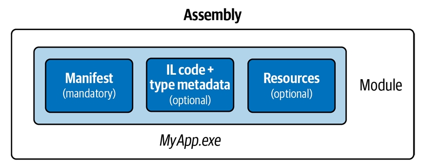
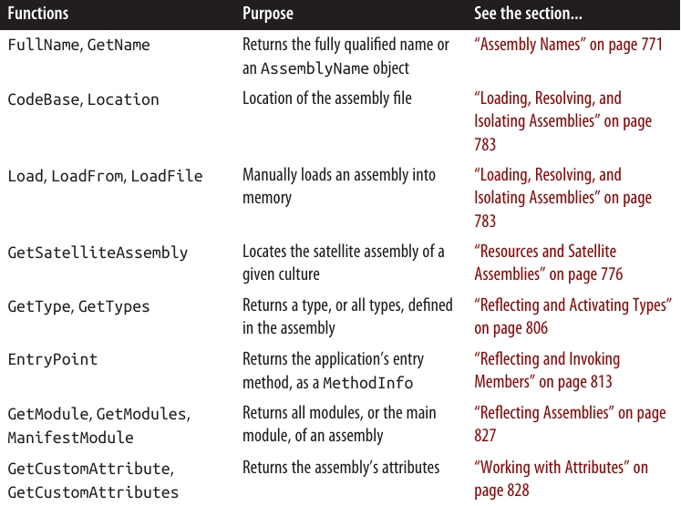
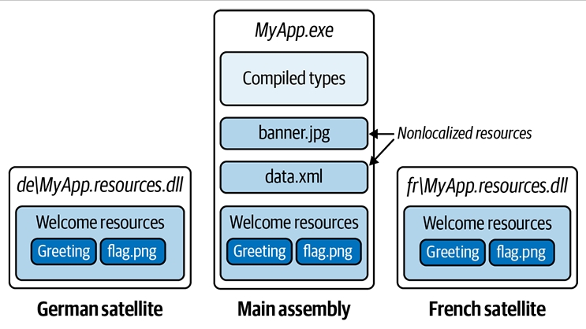

<div dir="rtl">

# درس هفدهم:  اسمبلی‌ها (Assemblies) 

یک **assembly** واحد پایه‌ای برای استقرار (deployment) در .NET است و همچنین محفظه‌ای برای تمام **type**ها به شمار می‌آید. یک اسمبلی شامل **type**های کامپایل‌شده به همراه کد **Intermediate Language (IL)**، منابع اجرایی (**runtime resources**) و اطلاعاتی برای مدیریت نسخه‌ها و ارجاع به سایر اسمبلی‌ها است. همچنین اسمبلی یک مرز برای **type resolution** تعریف می‌کند. در .NET، یک اسمبلی معمولاً شامل یک فایل با پسوند `.dll` است.

زمانی که یک برنامه اجرایی در .NET می‌سازید، دو فایل ایجاد می‌شود:

* یک اسمبلی (.dll)
* یک **executable launcher** (.exe) که متناسب با پلتفرمی است که هدف قرار داده‌اید.

این با چیزی که در **.NET Framework** اتفاق می‌افتد متفاوت است، جایی که یک **portable executable (PE) assembly** تولید می‌شود. یک PE با پسوند `.exe` هم به‌عنوان اسمبلی و هم به‌عنوان برنامه اجرایی عمل می‌کند و می‌تواند به‌طور همزمان نسخه‌های ۳۲ و ۶۴ بیتی ویندوز را هدف قرار دهد.

اکثر **type**های این فصل از فضای نام‌های زیر آمده‌اند:

* `System.Reflection`
* `System.Resources`
* `System.Globalization`

---

### 🔹 محتوای یک اسمبلی (What’s in an Assembly) 🔹

یک اسمبلی شامل چهار نوع محتوا است:

1. **Assembly Manifest**

   * اطلاعاتی به **CLR** می‌دهد، مانند نام اسمبلی، نسخه آن و سایر اسمبلی‌هایی که به آن ارجاع دارند.

2. **Application Manifest**

   * اطلاعاتی به سیستم‌عامل می‌دهد، مانند نحوه استقرار اسمبلی و این‌که آیا نیاز به دسترسی مدیریتی وجود دارد یا خیر.

3. **Compiled Types**

   * کد IL کامپایل‌شده و **metadata** مربوط به **type**های تعریف‌شده در اسمبلی.

4. **Resources**

   * سایر داده‌های تعبیه‌شده در اسمبلی، مانند تصاویر و متن‌های قابل بومی‌سازی (**localizable text**).

از این میان، تنها **assembly manifest** اجباری است، هرچند که تقریباً همیشه یک اسمبلی شامل **type**های کامپایل‌شده هم هست (مگر اینکه یک **resource assembly** باشد. برای جزئیات به بخش “Resources and Satellite Assemblies” در صفحه ۷۷۶ مراجعه کنید).

---

### 🔹 Assembly Manifest 🔹

**Assembly Manifest** دو هدف دارد:

* اسمبلی را به محیط میزبانی مدیریت‌شده (**managed hosting environment**) معرفی می‌کند.
* به‌عنوان یک فهرست برای **module**ها، **type**ها و منابع موجود در اسمبلی عمل می‌کند.

بنابراین، اسمبلی‌ها خودتوصیفی (**self-describing**) هستند. مصرف‌کننده می‌تواند تمام داده‌ها، **type**ها و عملکردهای یک اسمبلی را بدون نیاز به فایل‌های اضافی کشف کند.

**Assembly Manifest** به‌صورت دستی اضافه نمی‌شود؛ بلکه به‌طور خودکار در هنگام کامپایل داخل اسمبلی جاسازی می‌شود.

---

### 🔹 داده‌های مهم ذخیره‌شده در Manifest 🔹

* نام ساده‌ی اسمبلی
* شماره نسخه (**AssemblyVersion**)
* کلید عمومی و هش امضا شده، در صورت داشتن **strong name**
* فهرست اسمبلی‌های مرجع، شامل نسخه و کلید عمومی آن‌ها
* فهرست **type**های تعریف‌شده در اسمبلی
* فرهنگی که هدف قرار داده شده، در صورت **satellite assembly** (**AssemblyCulture**)

**داده‌های اطلاعاتی دیگر شامل:**

* عنوان و توضیحات کامل (**AssemblyTitle و AssemblyDescription**)
* اطلاعات شرکت و حق نشر (**AssemblyCompany و AssemblyCopyright**)
* نسخه نمایشی (**AssemblyInformationalVersion**)
* ویژگی‌های اضافی برای داده‌های سفارشی

بخشی از این داده‌ها از پارامترهای ورودی به کامپایلر استخراج می‌شوند، مانند فهرست اسمبلی‌های مرجع یا کلید عمومی برای امضای اسمبلی. بقیه از **assembly attributes** می‌آیند (که در پرانتز مشخص شده‌اند).

---

### 🔹 مشاهده محتویات Manifest 🔹

می‌توانید محتویات **assembly manifest** را با ابزار **.NET** به نام `ildasm.exe` مشاهده کنید. در فصل بعدی (۱۸) توضیح داده می‌شود که چگونه می‌توان این کار را به‌صورت برنامه‌نویسی با **reflection** انجام داد.

---

### 🔹 مشخص کردن Assembly Attributes 🔹

ویژگی‌های معمول اسمبلی را می‌توان در **Visual Studio**، در صفحه Properties پروژه و در تب **Package** مشخص کرد. تنظیمات این تب به فایل پروژه (.csproj) اضافه می‌شوند.

برای مشخص کردن ویژگی‌هایی که توسط تب **Package** پشتیبانی نمی‌شوند، یا در صورت عدم کار با فایل .csproj، می‌توانید **assembly attributes** را در کد منبع تعیین کنید (اغلب در فایلی به نام `AssemblyInfo.cs`).

مثال: برای دسترسی دادن به **type**های داخلی به یک پروژه تست واحد:

```csharp
using System.Runtime.CompilerServices;
[assembly: InternalsVisibleTo("MyUnitTestProject")]
```

---

### 🔹 Application Manifest (ویندوز) 🔹

**Application Manifest** یک فایل XML است که اطلاعاتی درباره‌ی اسمبلی به سیستم‌عامل منتقل می‌کند. این فایل در هنگام ساخت، به‌عنوان یک **Win32 resource** داخل فایل اجرایی قرار می‌گیرد. اگر موجود باشد، قبل از بارگذاری اسمبلی توسط CLR خوانده شده و پردازش می‌شود و می‌تواند نحوه اجرای فرآیند برنامه در ویندوز را تحت تأثیر قرار دهد.

یک **manifest** در .NET دارای عنصر ریشه‌ای به نام `assembly` در فضای نام XML زیر است:

```xml
<?xml version="1.0" encoding="utf-8"?>
<assembly manifestVersion="1.0" xmlns="urn:schemas-microsoft-com:asm.v1">
  <!-- محتوای manifest -->
</assembly>
```

مثالی که درخواست دسترسی مدیریتی (**administrative elevation**) می‌کند:

```xml
<?xml version="1.0" encoding="utf-8"?>
<assembly manifestVersion="1.0" xmlns="urn:schemas-microsoft-com:asm.v1">
  <trustInfo xmlns="urn:schemas-microsoft-com:asm.v2">
    <security>
      <requestedPrivileges>
        <requestedExecutionLevel level="requireAdministrator" />
      </requestedPrivileges>
    </security>
  </trustInfo>
</assembly>
```

> ⚠️ برنامه‌های **UWP** دارای manifest بسیار پیچیده‌تری هستند که در فایل `Package.appxmanifest` توصیف شده است و شامل اعلام قابلیت‌های برنامه است که مشخص می‌کند سیستم‌عامل چه مجوزهایی می‌دهد. ساده‌ترین روش برای ویرایش این فایل، استفاده از **Visual Studio** است که با دوبار کلیک روی فایل، یک دیالوگ نمایش می‌دهد.

---

### 🔹 استقرار Application Manifest 🔹

برای افزودن یک **application manifest** به پروژه .NET در **Visual Studio**:

1. روی پروژه در **Solution Explorer** راست‌کلیک کنید.
2. انتخاب کنید **Add → New Item**
3. گزینه **Application Manifest File** را انتخاب کنید.

پس از ساخت پروژه، **manifest** داخل **output assembly** جاسازی می‌شود.

---

### 🔹 Modules 🔹

ابزار `ildasm.exe` وجود یک **application manifest** جاسازی‌شده را تشخیص نمی‌دهد، اما **Visual Studio** هنگام دوبار کلیک روی اسمبلی در **Solution Explorer** نشان می‌دهد که آیا manifest موجود است یا خیر.

در واقع، محتویات یک اسمبلی داخل یک **container** میانی به نام **module** بسته‌بندی می‌شود. هر **module** متناظر با یک فایل حاوی محتویات اسمبلی است. دلیل این لایه اضافی این است که در **.NET Framework** امکان توزیع یک اسمبلی در چند فایل وجود دارد، اما این ویژگی در **.NET 5+ و .NET Core** وجود ندارد.

📌 شکل 17-1 رابطه بین **assembly** و **module** را نشان می‌دهد.

<div align="center">
    
 
</div>

اگرچه .NET از **multifile assemblies** پشتیبانی نمی‌کند، گاهی لازم است از لایه اضافی **containership** که **module**ها ایجاد می‌کنند، آگاه باشید. سناریوی اصلی این موضوع در **reflection** است (به بخش‌های «Reflecting Assemblies» در صفحه ۸۲۷ و «Emitting Assemblies and Types» در صفحه ۸۴۱ مراجعه کنید).

---

### 🔹 کلاس Assembly 🔹

کلاس **Assembly** در فضای نام `System.Reflection` دروازه‌ای برای دسترسی به **metadata** اسمبلی‌ها در زمان اجرا (**runtime**) است. روش‌های مختلفی برای به‌دست آوردن یک **assembly object** وجود دارد؛ ساده‌ترین روش، استفاده از ویژگی **Assembly** یک **Type** است:

```csharp
Assembly a = typeof(Program).Assembly;
```

همچنین می‌توانید با فراخوانی یکی از **static method**های کلاس **Assembly** یک شیء اسمبلی به‌دست آورید:

* **GetExecutingAssembly**
  اسمبلی نوعی را برمی‌گرداند که تابع جاری در آن تعریف شده است.

* **GetCallingAssembly**
  عملکرد مشابه **GetExecutingAssembly** را دارد، اما برای تابعی که تابع جاری را فراخوانی کرده است.

* **GetEntryAssembly**
  اسمبلی‌ای را برمی‌گرداند که متد ورود (**entry method**) اصلی برنامه را تعریف می‌کند.

پس از داشتن یک **Assembly object**، می‌توانید از **properties** و **methods** آن برای پرس‌وجوی **metadata** اسمبلی و بازتاب (**reflect**) بر روی **type**های آن استفاده کنید.

📌 جدول ۱۷-۱ خلاصه‌ای از این توابع را نشان می‌دهد.
<div align="center">
    
 
</div>

### 🔹 اسامی قوی و امضای اسمبلی (Strong Names and Assembly Signing) 🔹

داشتن **strong name** برای یک اسمبلی در **.NET Framework** اهمیت داشت، به دو دلیل:

* امکان بارگذاری اسمبلی در **Global Assembly Cache (GAC)**.
* امکان ارجاع سایر **strongly named assemblies** به آن.

در **.NET 5+** و **.NET Core** این موضوع کمتر اهمیت دارد، زیرا این **runtime**ها نه **global assembly cache** دارند و نه محدودیت دوم را اعمال می‌کنند.

یک **strongly named assembly** هویتی یکتا دارد. این کار با افزودن دو قطعه **metadata** به **manifest** انجام می‌شود:

* یک شماره یکتا متعلق به نویسندگان اسمبلی
* یک **signed hash** از اسمبلی که ثابت می‌کند صاحب شماره یکتا، اسمبلی را تولید کرده است

این فرآیند نیازمند یک جفت **کلید عمومی/خصوصی** است. کلید عمومی شماره یکتای شناسایی را فراهم می‌کند و کلید خصوصی برای امضا استفاده می‌شود.

> ⚠️ **Strong-name-signing** با **Authenticode-signing** متفاوت است. **Authenticode** بعداً در همین فصل توضیح داده خواهد شد.

کلید عمومی در تضمین یکتایی ارجاعات به اسمبلی‌ها ارزشمند است: یک **strongly named assembly** کلید عمومی را در هویت خود وارد می‌کند.

در **.NET Framework**، کلید خصوصی از تغییر و دستکاری اسمبلی جلوگیری می‌کند، زیرا بدون کلید خصوصی شما، هیچ‌کس نمی‌تواند نسخه تغییر یافته اسمبلی را منتشر کند بدون اینکه امضا خراب شود. در عمل، این برای بارگذاری اسمبلی در **GAC** کاربرد دارد. در **.NET 5+** و **.NET Core** امضا کمکی ندارد، زیرا بررسی نمی‌شود.

اضافه کردن **strong name** به یک اسمبلی قبلاً «ضعیف» نام‌گذاری‌شده، هویت آن را تغییر می‌دهد. به همین دلیل، بهتر است از ابتدا اگر احتمال می‌دهید اسمبلی در آینده به **strong name** نیاز پیدا کند، آن را از ابتدا قوی نام‌گذاری کنید.

---

### 🔹 چگونه یک اسمبلی را Strongly Name کنیم 🔹

برای دادن **strong name** به یک اسمبلی، ابتدا یک جفت کلید عمومی/خصوصی با ابزار `sn.exe` تولید کنید:

```bash
sn.exe -k MyKeyPair.snk
```

**Visual Studio** میانبری به نام **Developer Command Prompt for VS** نصب می‌کند که یک **command prompt** با مسیر ابزارهای توسعه (مانند `sn.exe`) فراهم می‌آورد.

این دستور یک جفت کلید جدید تولید می‌کند و آن را در فایلی به نام `MyKeyPair.snk` ذخیره می‌کند. اگر بعداً این فایل را از دست بدهید، توانایی کامپایل مجدد اسمبلی با همان هویت را به‌طور دائمی از دست خواهید داد.

می‌توانید با استفاده از این فایل، اسمبلی را امضا کنید. در **Visual Studio**:

1. به **Project Properties** بروید
2. در تب **Signing**، گزینه **Sign the assembly** را انتخاب کنید
3. فایل `.snk` خود را مشخص کنید

یک جفت کلید می‌تواند چندین اسمبلی را امضا کند؛ هر کدام هنوز هویت متمایزی خواهند داشت، اگر نام ساده آن‌ها متفاوت باشد.

---

### 🔹 اسامی اسمبلی (Assembly Names) 🔹

هویت یک اسمبلی شامل چهار بخش از **metadata** در **manifest** است:

* **نام ساده (Simple Name)**
* **نسخه (Version)** — اگر موجود نباشد “0.0.0.0” است
* **فرهنگ (Culture)** — اگر satellite assembly نباشد “neutral” است
* **Public Key Token** — اگر **strongly named** نباشد “null” است

نام ساده از ویژگی‌ها استخراج نمی‌شود، بلکه از نام فایل اصلی کامپایل‌شده (بدون پسوند) می‌آید. مثلاً نام ساده اسمبلی `System.Xml.dll` برابر با `System.Xml` است. تغییر نام فایل، نام ساده اسمبلی را تغییر نمی‌دهد.

شماره نسخه از ویژگی **AssemblyVersion** می‌آید و رشته‌ای شامل چهار قسمت است:

```
major.minor.build.revision
```

مثال:

```csharp
[assembly: AssemblyVersion("2.5.6.7")]
```

فرهنگ از ویژگی **AssemblyCulture** گرفته می‌شود و برای **satellite assembly**ها کاربرد دارد (در بخش «Resources and Satellite Assemblies» صفحه ۷۷۶ توضیح داده شده است).

**Public Key Token** از **strong name** هنگام کامپایل به دست می‌آید.

---

### 🔹 اسامی کامل (Fully Qualified Names) 🔹

یک نام کامل اسمبلی رشته‌ای است که شامل هر چهار بخش هویت است، به شکل:

```
simple-name, Version=version, Culture=culture, PublicKeyToken=public-key
```

مثال: نام کامل `System.Private.CoreLib.dll`:

```
System.Private.CoreLib, Version=4.0.0.0, Culture=neutral, PublicKeyToken=7cec85d7bea7798e
```

اگر ویژگی **AssemblyVersion** وجود نداشته باشد، نسخه به صورت `0.0.0.0` نمایش داده می‌شود. اگر unsigned باشد، **public key token** برابر `null` است.

ویژگی **FullName** یک **Assembly object** نام کامل آن را برمی‌گرداند. کامپایلر همیشه از نام کامل برای ثبت ارجاعات به اسمبلی در **manifest** استفاده می‌کند.

> ⚠️ نام کامل اسمبلی شامل مسیر دایرکتوری نیست. یافتن اسمبلی در دایرکتوری دیگر موضوعی جداگانه است که در بخش «Loading, Resolving, and Isolating Assemblies» صفحه ۷۸۳ توضیح داده می‌شود.

---

### 🔹 کلاس AssemblyName 🔹

کلاس **AssemblyName** دارای ویژگی‌های typed برای هر چهار بخش نام کامل اسمبلی است. دو کاربرد اصلی دارد:

* تجزیه یا ساخت نام کامل اسمبلی
* ذخیره داده‌های اضافی برای کمک به یافتن (**resolve**) اسمبلی

روش‌های به‌دست آوردن یک **AssemblyName object**:

* ساخت یک **AssemblyName** با ارائه نام کامل
* فراخوانی **GetName** روی یک **Assembly** موجود
* فراخوانی **AssemblyName.GetAssemblyName** با مسیر فایل اسمبلی

همچنین می‌توان یک **AssemblyName** بدون آرگومان ساخت و سپس هر ویژگی آن را تنظیم کرد تا یک نام کامل ساخته شود. در این حالت، **AssemblyName** قابل تغییر (**mutable**) است.

---

### 🔹 ویژگی‌ها و متدهای اصلی AssemblyName 🔹

| نوع         | نام                                       | توضیح                       |
| ----------- | ----------------------------------------- | --------------------------- |
| string      | FullName                                  | نام کامل                    |
| string      | Name                                      | نام ساده                    |
| Version     | Version                                   | نسخه اسمبلی                 |
| CultureInfo | CultureInfo                               | برای **satellite assembly** |
| string      | CodeBase                                  | مکان اسمبلی                 |
| byte\[]     | GetPublicKey()                            | کلید عمومی کامل (160 بایت)  |
| void        | SetPublicKey(byte\[] key)                 | تعیین کلید عمومی            |
| byte\[]     | GetPublicKeyToken()                       | نسخه ۸ بایتی کلید عمومی     |
| void        | SetPublicKeyToken(byte\[] publicKeyToken) | تعیین public key token      |

* **Version** خود یک شیء strongly typed با ویژگی‌های **Major, Minor, Build, Revision** است.
* **GetPublicKey** کلید عمومی رمزنگاری کامل را برمی‌گرداند.
* **GetPublicKeyToken** آخرین ۸ بایت استفاده‌شده برای تعیین هویت را برمی‌گرداند.

مثال: به‌دست آوردن نام ساده یک اسمبلی:

```csharp
Console.WriteLine(typeof(string).Assembly.GetName().Name);
// System.Private.CoreLib
```

دریافت نسخه اسمبلی:

```csharp
string v = myAssembly.GetName().Version.ToString();
```

---

### 🔹 نسخه‌های اطلاعاتی و فایل اسمبلی 🔹

دو ویژگی دیگر برای بیان اطلاعات مربوط به نسخه وجود دارد. برخلاف **AssemblyVersion**، این دو ویژگی هویت اسمبلی را تغییر نمی‌دهند و تأثیری بر کامپایل یا زمان اجرا ندارند:

* **AssemblyInformationalVersion**
  نسخه‌ای که به کاربر نهایی نمایش داده می‌شود. در دیالوگ **Windows File Properties** به‌عنوان **Product Version** دیده می‌شود. هر رشته‌ای می‌تواند باشد، مانند `"5.1 Beta 2"`. معمولاً تمام اسمبلی‌های یک برنامه دارای همین شماره نسخه اطلاعاتی هستند.

* **AssemblyFileVersion**
  معمولاً به شماره **build** آن اسمبلی اشاره دارد. در دیالوگ **Windows File Properties** به‌عنوان **File Version** دیده می‌شود. مشابه **AssemblyVersion**، باید رشته‌ای شامل حداکثر چهار عدد جداشده با نقطه باشد.

### 🔹 امضای Authenticode 🔹

**Authenticode** یک سیستم **code-signing** است که هدف آن اثبات هویت ناشر برنامه است.
امضای **Authenticode** و **strong-name signing** مستقل از هم هستند؛ می‌توانید یک اسمبلی را با هر یک یا هر دو سیستم امضا کنید.

اگرچه **strong-name signing** می‌تواند اثبات کند که اسمبلی‌های A، B و C از یک ناشر آمده‌اند (با فرض اینکه کلید خصوصی لو نرفته باشد)، اما نمی‌تواند مشخص کند آن ناشر چه کسی است. برای مثال، برای دانستن اینکه ناشر **Joe Albahari** یا **Microsoft Corporation** بوده است، به **Authenticode** نیاز دارید.

**Authenticode** هنگام دانلود برنامه‌ها از اینترنت مفید است، زیرا تضمین می‌کند برنامه دقیقاً از همان شخصی آمده که توسط **Certificate Authority** معرفی شده و در مسیر انتقال تغییر نکرده است. همچنین مانع نمایش هشدار “Unknown Publisher” هنگام اجرای برنامه دانلود شده برای اولین بار می‌شود.

> ⚠️ امضای Authenticode همچنین شرط ارسال برنامه‌ها به **Windows Store** است.

---

**Authenticode** نه تنها با اسمبلی‌های .NET کار می‌کند، بلکه با فایل‌های اجرایی unmanaged و باینری‌ها مانند فایل‌های نصب `.msi` نیز سازگار است. البته Authenticode تضمین نمی‌کند که برنامه فاقد **malware** باشد، ولی احتمال آن را کاهش می‌دهد.

یک فرد یا سازمان حاضر شده نام خود (با پشتوانه پاسپورت یا مدارک شرکت) را پشت فایل اجرایی یا کتابخانه قرار دهد.

CLR امضای **Authenticode** را به‌عنوان بخشی از هویت اسمبلی نمی‌شناسد، اما می‌تواند امضا را به‌صورت درخواستی (**on demand**) خوانده و اعتبارسنجی کند.

---

### 🔹 نحوه امضا با Authenticode 🔹

#### ۱. به‌دست آوردن و نصب گواهی‌نامه

ابتدا باید یک **code-signing certificate** از یک **Certificate Authority (CA)** دریافت کنید. سپس می‌توانید گواهی را به‌صورت فایل رمزدار استفاده کنید یا آن را در **certificate store** کامپیوتر بارگذاری کنید.

مزیت بارگذاری در **certificate store** این است که می‌توانید بدون وارد کردن رمز امضا کنید، که برای اسکریپت‌های خودکار و فایل‌های batch ایمن‌تر است.

#### ۲. محل دریافت گواهی‌نامه

تعداد کمی **CA** برای **code-signing** به‌صورت پیش‌فرض در ویندوز وجود دارند، مانند:

* Comodo
* GoDaddy
* GlobalSign
* DigiCert
* Thawte
* Symantec

همچنین فروشندگانی مانند K Software وجود دارند که گواهی‌های code-signing این CAها را با تخفیف ارائه می‌دهند.

گواهی‌های Authenticode از این فروشندگان معمولاً کمتر محدودکننده هستند و برنامه‌های غیر مایکروسافتی را نیز امضا می‌کنند. توجه داشته باشید که گواهی SSL معمولاً برای Authenticode قابل استفاده نیست، زیرا SSL مالکیت دامنه را اثبات می‌کند، اما Authenticode هویت ناشر را.

برای بارگذاری گواهی در **certificate store**:

1. **Certificate Manager** را باز کنید
2. پوشه **Personal** را باز کنید
3. روی **Certificates** راست‌کلیک و **All Tasks → Import** را انتخاب کنید
4. با **import wizard** مراحل را دنبال کنید

پس از وارد کردن گواهی، روی آن **View** کلیک کنید، به تب **Details** بروید و **thumbprint** آن را کپی کنید. این همان هش SHA-256 است که برای امضا نیاز دارید.

> ⚠️ اگر قصد دارید همزمان **strong-name** هم استفاده کنید، ابتدا باید **strong-name-signing** انجام شود، سپس Authenticode. اگر ترتیب برعکس باشد، CLR اضافه شدن strong name بعد از Authenticode را به‌عنوان تغییر غیرمجاز در نظر می‌گیرد.

---

#### ۳. امضا با signtool.exe

می‌توانید از ابزار **signtool** که همراه Visual Studio نصب می‌شود استفاده کنید.

مثال امضا فایل `LINQPad.exe` با گواهی در **My Store** به نام `"Joseph Albahari"` با الگوریتم SHA-256:

```bash
signtool sign /n "Joseph Albahari" /fd sha256 LINQPad.exe
```

همچنین می‌توانید توضیح و URL محصول را اضافه کنید:

```bash
... /d LINQPad /du http://www.linqpad.net
```

> ⚠️ معمولاً برای حفظ اعتبار پس از انقضای گواهی، باید **time-stamping server** هم مشخص شود.

#### Time Stamping

با استفاده از time-stamping، برنامه‌هایی که قبل از انقضای گواهی امضا شده‌اند، هنوز معتبر باقی می‌مانند. CA یک URI برای این منظور ارائه می‌دهد، مانند:

```bash
... /tr http://timestamp.comodoca.com/authenticode /td SHA256
```

#### بررسی امضا

ساده‌ترین روش برای مشاهده امضای Authenticode، نگاه کردن به **Digital Signatures tab** در **Windows Explorer** است. ابزار **signtool** نیز این امکان را فراهم می‌کند.

---

### 🔹 منابع و Satellite Assemblies 🔹

یک برنامه معمولاً نه تنها شامل کد اجرایی است، بلکه محتواهایی مانند متن، تصویر یا فایل XML نیز دارد. این محتواها می‌توانند در یک اسمبلی از طریق **resource** گنجانده شوند.

دو کاربرد اصلی برای **resources**:

* افزودن داده‌هایی که نمی‌توانند در کد منبع باشند، مانند تصاویر
* ذخیره داده‌هایی که ممکن است در برنامه‌های چندزبانه نیاز به ترجمه داشته باشند

یک **assembly resource** در نهایت یک **byte stream** با نام مشخص است. می‌توان یک اسمبلی را مانند یک دیکشنری از **byte arrays** در نظر گرفت که کلیدهای آن رشته هستند.

مثال در **ildasm** از اسمبلی که دو resource به نام‌های `banner.jpg` و `data.xml` دارد:

```
.mresource public banner.jpg
{
  // Offset: 0x00000F58 Length: 0x000004F6
}
.mresource public data.xml
{
  // Offset: 0x00001458 Length: 0x0000027E
}
```

در این مثال، `banner.jpg` و `data.xml` مستقیماً به اسمبلی اضافه شده‌اند، هر کدام به‌عنوان **embedded resource** خود. این ساده‌ترین روش برای کار با منابع است.

---

**.NET** همچنین اجازه می‌دهد محتوا را از طریق کانتینرهای میانی `.resources` اضافه کنید. این کانتینرها برای محتوایی طراحی شده‌اند که ممکن است نیاز به ترجمه در زبان‌های مختلف داشته باشند.

**Localized .resources** می‌توانند به‌صورت **satellite assembly** جداگانه بسته‌بندی شوند و در زمان اجرا بر اساس زبان سیستم کاربر به‌طور خودکار انتخاب شوند.

📌 شکل 17-2 یک اسمبلی را نشان می‌دهد که دو **resource** مستقیماً جاسازی‌شده و یک کانتینر `.resources` به نام `welcome.resources` دارد که برای آن دو **satellite assembly** محلی‌سازی شده ایجاد شده است.
<div align="center">
    
 
</div>

### 🔹 جاسازی مستقیم منابع 🔹

جاسازی **resources** در داخل اسمبلی‌ها در برنامه‌های **Windows Store** پشتیبانی نمی‌شود. به جای آن، فایل‌های اضافی را به **deployment package** اضافه کرده و از طریق **StorageFolder** برنامه خود (**Package.Current.InstalledLocation**) به آن‌ها دسترسی پیدا کنید.

#### نحوه جاسازی مستقیم منابع با Visual Studio:

1. فایل را به پروژه اضافه کنید.
2. **Build Action** آن را روی **Embedded Resource** تنظیم کنید.

Visual Studio همیشه نام منابع را با **namespace پیش‌فرض پروژه** و همچنین نام هر **زیرپوشه** که فایل در آن قرار دارد، پیشوند می‌کند.
مثلاً اگر namespace پیش‌فرض پروژه `Westwind.Reports` باشد و فایل `banner.jpg` در پوشه `pictures` باشد، نام resource به شکل زیر خواهد بود:

```
Westwind.Reports.pictures.banner.jpg
```

> ⚠️ نام منابع **حساس به حروف بزرگ و کوچک** است، بنابراین نام پوشه‌های پروژه که شامل منابع هستند، به‌طور مؤثر حساس به حروف خواهند بود.

---

#### دسترسی به منابع

برای دسترسی به یک resource، متد **GetManifestResourceStream** روی اسمبلی حاوی آن را صدا بزنید. این متد یک **Stream** برمی‌گرداند که می‌توانید مانند هر Stream دیگری آن را بخوانید:

```csharp
Assembly a = Assembly.GetEntryAssembly();
using (Stream s = a.GetManifestResourceStream("TestProject.data.xml"))
using (XmlReader r = XmlReader.Create(s))
{
    ...
}
```

مثال دیگر برای تصویر:

```csharp
System.Drawing.Image image;
using (Stream s = a.GetManifestResourceStream("TestProject.banner.jpg"))
    image = System.Drawing.Image.FromStream(s);
```

Stream بازگشتی قابل **seek** است، بنابراین می‌توانید به شکل زیر نیز داده‌ها را بخوانید:

```csharp
byte[] data;
using (Stream s = a.GetManifestResourceStream("TestProject.banner.jpg"))
    data = new BinaryReader(s).ReadBytes((int)s.Length);
```

> ⚠️ اگر از Visual Studio برای جاسازی resource استفاده کرده‌اید، فراموش نکنید پیشوند namespace را لحاظ کنید.
> برای کاهش خطا، می‌توانید پیشوند را با یک نوع مشخص کنید:

```csharp
using (Stream s = a.GetManifestResourceStream(typeof(X), "data.xml"))
```

`X` می‌تواند هر نوعی باشد که دارای namespace موردنظر شما است (معمولاً نوعی در همان پوشه پروژه).

---

#### تفاوت با Resource در WPF

تنظیم **Build Action** یک آیتم پروژه به **Resource** در برنامه WPF با **Embedded Resource** متفاوت است.

* **Resource** در WPF آیتم را به یک فایل `.resources` به نام `<AssemblyName>.g.resources` اضافه می‌کند.
* محتوای آن از طریق کلاس **Application** و با استفاده از URI دسترسی پیدا می‌کند.

همچنین WPF اصطلاح **resource** را به روش‌های دیگری نیز به کار می‌برد:

* **Static resources**
* **Dynamic resources**

این‌ها ارتباطی با منابع اسمبلی ندارند!

برای دریافت نام همه منابع در یک اسمبلی، می‌توان از متد **GetManifestResourceNames** استفاده کرد.

---

### 🔹 فایل‌های .resources 🔹

فایل‌های `.resources` کانتینرهایی برای محتوای قابل محلی‌سازی هستند. این فایل‌ها در نهایت به‌عنوان یک **embedded resource** داخل اسمبلی قرار می‌گیرند، درست مانند سایر فایل‌ها. تفاوت آن‌ها:

1. ابتدا محتوای خود را در فایل `.resources` بسته‌بندی می‌کنید.
2. برای دسترسی به محتوا از **ResourceManager** یا **pack URI** استفاده می‌کنید، نه از **GetManifestResourceStream**.

فایل‌های `.resources` به صورت **binary** هستند و قابل ویرایش مستقیم توسط انسان نیستند، بنابراین باید از ابزارهای .NET و Visual Studio استفاده کنید.

#### .resx Files

فایل‌های `.resx` فرمتی در زمان طراحی هستند که برای تولید `.resources` استفاده می‌شوند. این فایل‌ها با XML ساخته می‌شوند و ساختار آن‌ها به صورت **name/value pairs** است:

```xml
<root>
  <data name="Greeting">
    <value>hello</value>
  </data>
  <data name="DefaultFontSize" type="System.Int32, mscorlib">
    <value>10</value>
  </data>
</root>
```

در Visual Studio برای ایجاد `.resx`:

1. یک **project item** از نوع **Resources File** اضافه کنید.
2. Visual Studio به‌صورت خودکار:

   * هدر صحیح را ایجاد می‌کند.
   * **designer** برای اضافه کردن رشته‌ها، تصاویر و فایل‌ها ارائه می‌دهد.
   * فایل `.resx` را به `.resources` تبدیل و در اسمبلی جاسازی می‌کند.
   * کلاسی برای دسترسی به داده‌ها تولید می‌کند.

> ⚠️ designer منابع تصویری را به‌صورت typed **Image objects** (System.Drawing.dll) اضافه می‌کند که برای WPF مناسب نیستند.

---

#### خواندن فایل‌های .resources

کلاسی با همان نام `.resx` تولید می‌شود و دارای **properties** برای دسترسی به هر آیتم است.

**ResourceManager** برای خواندن فایل‌های `.resources` جاسازی‌شده در اسمبلی استفاده می‌شود:

```csharp
ResourceManager r = new ResourceManager("welcome",
                                        Assembly.GetExecutingAssembly());
```

> ⚠️ اگر resource در Visual Studio کامپایل شده، آرگومان اول باید **namespace-prefixed** باشد.

دسترسی به محتوا:

```csharp
string greeting = r.GetString("Greeting");
int fontSize = (int) r.GetObject("DefaultFontSize");
Image image = (Image) r.GetObject("flag.png");
```

برای فهرست کردن محتویات یک فایل `.resources`:

```csharp
ResourceManager r = new ResourceManager(...);
ResourceSet set = r.GetResourceSet(CultureInfo.CurrentUICulture, true, true);
foreach (System.Collections.DictionaryEntry entry in set)
    Console.WriteLine(entry.Key);
```

---

### 🔹 ایجاد resource با pack URI در Visual Studio 🔹

در برنامه‌های WPF، فایل‌های XAML باید بتوانند منابع را از طریق URI بخوانند، مانند:

```xml
<Button>
  <Image Height="50" Source="flag.png"/>
</Button>
```

یا اگر resource در اسمبلی دیگری باشد:

```xml
<Button>
  <Image Height="50" Source="UtilsAssembly;Component/flag.png"/>
</Button>
```

> ⚠️ کلمه **Component** کلیدواژه ثابت است.

برای ایجاد چنین منابعی نمی‌توان از فایل‌های `.resx` استفاده کرد. باید فایل‌ها را به پروژه اضافه کرده و **Build Action** را روی **Resource** قرار دهید (نه Embedded Resource).
Visual Studio سپس آن‌ها را به فایل `.resources` به نام `<AssemblyName>.g.resources` تبدیل می‌کند و همچنین فایل‌های XAML کامپایل‌شده (.baml) نیز در همانجا قرار می‌گیرند.

برای بارگذاری منابع با **URI-key** به‌صورت برنامه‌نویسی:

```csharp
Uri u = new Uri("flag.png", UriKind.Relative);
using (Stream s = Application.GetResourceStream(u).Stream)
{
    ...
}
```

همچنین می‌توان از **absolute URI** به شکل زیر استفاده کرد:

```csharp
Uri u = new Uri("pack://application:,,,/flag.png");
```

اگر بخواهید **Assembly object** مشخص کنید، می‌توانید از **ResourceManager** استفاده کنید:

```csharp
Assembly a = Assembly.GetExecutingAssembly();
ResourceManager r = new ResourceManager(a.GetName().Name + ".g", a);
using (Stream s = r.GetStream("flag.png"))
{
    ...
}
```

**ResourceManager** همچنین اجازه می‌دهد محتوای یک کانتینر `.g.resources` داخل یک اسمبلی را فهرست کنید.

### 🌐 اسمبلی‌های ماهواره‌ای (Satellite Assemblies) 🌐

داده‌های جاسازی‌شده در فایل‌های `.resources` **قابلیت محلی‌سازی (localizable)** دارند.
محلی‌سازی منابع زمانی اهمیت دارد که برنامه شما روی نسخه‌ای از ویندوز اجرا شود که تمام محیط آن به زبانی دیگر نمایش داده می‌شود. برای یکپارچگی، برنامه شما نیز باید از همان زبان استفاده کند.

#### ساختار معمول:

* **Main assembly** شامل منابع `.resources` برای زبان پیش‌فرض یا **fallback** است.
* **Satellite assemblies** جداگانه شامل منابع محلی‌شده برای زبان‌های مختلف هستند.

زمانی که برنامه اجرا می‌شود، .NET زبان فعلی سیستم عامل را از `CultureInfo.CurrentUICulture` بررسی می‌کند. هرگاه بخواهید یک resource را از طریق **ResourceManager** بخوانید، runtime به دنبال یک **satellite assembly** محلی‌شده می‌گردد. اگر موجود باشد و شامل کلید resource مورد نظر شما باشد، جایگزین نسخه main assembly می‌شود.

> این یعنی می‌توانید پشتیبانی از زبان‌های جدید را تنها با اضافه کردن satellite جدید فراهم کنید، بدون اینکه main assembly تغییر کند.

> ⚠️ یک satellite assembly نمی‌تواند شامل کد اجرایی باشد، تنها منابع را می‌تواند نگه دارد.

---

#### مسیرهای استقرار Satellite Assemblies

Satellite assemblies در زیرپوشه‌های فولدر اسمبلی قرار می‌گیرند:

```
programBaseFolder\MyProgram.exe
                 \MyLibrary.exe
                 \XX\MyProgram.resources.dll
                 \XX\MyLibrary.resources.dll
```

`XX` به کد دو حرفی زبان اشاره دارد (مثلاً `de` برای آلمانی) یا ترکیبی از زبان و منطقه (مثل `en-GB` برای انگلیسی در بریتانیا).
این سیستم نامگذاری به CLR اجازه می‌دهد تا به‌صورت خودکار satellite assembly مناسب را پیدا و بارگذاری کند.

---

#### ساخت Satellite Assemblies

فرض کنید مثال قبلی ما با `.resx` شامل این بود:

```xml
<root>
  ...
  <data name="Greeting">
    <value>hello</value>
  </data>
</root>
```

و در زمان اجرا آن را به شکل زیر خواندیم:

```csharp
ResourceManager r = new ResourceManager("welcome",
                                        Assembly.GetExecutingAssembly());
Console.Write(r.GetString("Greeting"));
```

حال فرض کنید می‌خواهیم وقتی برنامه روی نسخه آلمانی ویندوز اجرا شد، `hello` به `hallo` تبدیل شود.
ابتدا یک فایل `.resx` دیگر به نام `welcome.de.resx` ایجاد می‌کنیم که مقدار را جایگزین کند:

```xml
<root>
  <data name="Greeting">
    <value>hallo</value>
  </data>
</root>
```

در **Visual Studio** تنها کافی است این کار را انجام دهید. هنگام **rebuild**، به‌طور خودکار یک **satellite assembly** به نام `MyApp.resources.dll` در یک زیرپوشه `de` ساخته می‌شود.

---

#### تست Satellite Assemblies

برای شبیه‌سازی اجرای برنامه روی سیستم‌عاملی با زبان متفاوت، باید **CurrentUICulture** را با کلاس `Thread` تغییر دهید:

```csharp
System.Threading.Thread.CurrentThread.CurrentUICulture
    = new System.Globalization.CultureInfo("de");
```

> ⚠️ `CultureInfo.CurrentUICulture` نسخه فقط‌خواندنی همین property است.

یک استراتژی مفید برای تست این است که کلمات را **ℓѻ¢αℓïʐɘ** کنید؛ یعنی به شکلی که هنوز به انگلیسی قابل خواندن باشند، اما از کاراکترهای استاندارد رومی استفاده نکنند.

---

#### پشتیبانی طراح Visual Studio

طراح‌های Visual Studio امکان محلی‌سازی کامپوننت‌ها و عناصر بصری را فراهم می‌کنند:

* **WPF designer** یک workflow مخصوص برای localization دارد.
* سایر designers مبتنی بر Component از یک property در زمان طراحی استفاده می‌کنند تا شبیه **Language property** نمایش داده شود.
* برای محلی‌سازی، کافی است **Language property** را تغییر داده و سپس شروع به تغییر کامپوننت کنید.
* تمام propertyهای کنترل که دارای صفت **Localizable** هستند، در فایل `.resx` مربوط به آن زبان ذخیره می‌شوند.
* می‌توانید در هر زمان بین زبان‌ها جابجا شوید فقط با تغییر Language property.

---

#### فرهنگ‌ها و زیرفرهنگ‌ها (Cultures and Subcultures)

* **Culture** یک زبان مشخص را نشان می‌دهد.
* **Subculture** یک نسخه منطقه‌ای از همان زبان است.
* .NET مطابق استاندارد **RFC1766** از کدهای دو حرفی برای فرهنگ‌ها و زیرفرهنگ‌ها استفاده می‌کند:

**مثال کد فرهنگ‌ها:**

```
En  → انگلیسی
de  → آلمانی
```

**مثال کد زیرفرهنگ‌ها:**

```
en-AU  → انگلیسی استرالیا
de-AT  → آلمانی اتریش
```

* فرهنگ‌ها در .NET با کلاس `System.Globalization.CultureInfo` نمایش داده می‌شوند.
* بررسی فرهنگ فعلی برنامه:

```csharp
Console.WriteLine(System.Threading.Thread.CurrentThread.CurrentCulture);
Console.WriteLine(System.Threading.Thread.CurrentThread.CurrentUICulture);
```

مثال برای سیستم محلی‌سازی‌شده برای استرالیا:

```
CurrentCulture      → en-AU
CurrentUICulture    → en-US
```

> ⚠️ `CurrentCulture` تنظیمات منطقه‌ای **Control Panel ویندوز** را نشان می‌دهد، در حالی که `CurrentUICulture` زبان سیستم عامل را مشخص می‌کند.
> تنظیمات منطقه‌ای شامل **منطقه زمانی، قالب تاریخ و ارز** است. `CurrentCulture` رفتار پیش‌فرض توابعی مانند `DateTime.Parse` را تعیین می‌کند.
> `CurrentUICulture` زبانی را مشخص می‌کند که سیستم با کاربر ارتباط برقرار می‌کند.

**ResourceManager** به‌طور پیش‌فرض از property `CurrentUICulture` thread فعلی برای یافتن satellite assembly مناسب استفاده می‌کند.

* اگر satellite assembly برای subculture موجود باشد، آن استفاده می‌شود.
* در غیر این صورت، به **generic culture** بازمی‌گردد.
* اگر generic culture هم موجود نباشد، به **default culture** در main assembly بازمی‌گردد.
### ⚙️ بارگذاری، حل وابستگی و جداسازی اسمبلی‌ها (Loading, Resolving, and Isolating Assemblies) ⚙️

بارگذاری یک اسمبلی از یک مسیر مشخص نسبتاً ساده است و به آن **assembly loading** گفته می‌شود.
اما اغلب، شما یا CLR نیاز دارید که یک اسمبلی را فقط با نام کامل یا ساده‌اش بارگذاری کنید. به این کار **assembly resolution** گفته می‌شود. تفاوت اصلی بین بارگذاری و حل وابستگی این است که در **resolution** ابتدا باید اسمبلی **پیدا شود**.

---

#### 🔹 زمان‌های رخ دادن Assembly Resolution:

1. توسط CLR، وقتی نیاز به حل وابستگی (dependency) داشته باشد.
2. صریحاً، وقتی شما متدی مانند `Assembly.Load(AssemblyName)` را فراخوانی می‌کنید.

مثال: یک برنامه با اسمبلی اصلی و تعدادی کتابخانه استاتیک:

```
AdventureGame.dll    // Main assembly
Terrain.dll          // Referenced assembly
UIEngine.dll         // Referenced assembly
```

> منظور از **statically referenced** این است که AdventureGame.dll هنگام کامپایل با ارجاع به Terrain.dll و UIEngine.dll ساخته شده است.
> کامپایلر خودش نیاز به حل وابستگی ندارد، زیرا مسیرهای اسمبلی‌ها به او داده شده‌اند. اما در زمان اجرا، باید این اسمبلی‌ها **resolve** شوند.

---

### ⚙️ Assembly Load Contexts (ALC) – بارگذاری و جداسازی اسمبلی‌ها ⚙️

کلاس **`AssemblyLoadContext`** مسئول بارگذاری (loading) و حل وابستگی (resolving) اسمبلی‌ها و همچنین فراهم کردن **مکانیزم جداسازی** (isolation) است.

---

#### 🔹 هر اسمبلی متعلق به یک ALC است

هر **Assembly** در .NET دقیقاً در یک **ALC** قرار دارد.
می‌توانید ALC یک اسمبلی را به این شکل دریافت کنید:

```csharp
Assembly assem = Assembly.GetExecutingAssembly();
AssemblyLoadContext context = AssemblyLoadContext.GetLoadContext(assem);
Console.WriteLine(context.Name);
```

همچنین، می‌توانید تمام اسمبلی‌های متعلق به یک ALC را با استفاده از property `Assemblies` ببینید:

```csharp
foreach (Assembly a in context.Assemblies)
    Console.WriteLine(a.FullName);
```

کلاس **`AssemblyLoadContext`** همچنین یک property ایستاتیک **`All`** دارد که همه ALCها را فهرست می‌کند.

---

#### 🔹 ساخت و سفارشی‌سازی ALC

* می‌توانید یک **ALC جدید** فقط با نمونه‌سازی `AssemblyLoadContext` و ارائه یک نام ایجاد کنید:

```csharp
var alc = new AssemblyLoadContext("MyALC");
```

* معمولاً بهتر است کلاس را **subclass کنید** تا بتوانید منطق حل وابستگی‌ها (Load) را سفارشی‌سازی کنید و اسمبلی‌ها را از نامشان بارگذاری نمایید.

---

### 🔹 بارگذاری صریح اسمبلی‌ها

ALC دو متد مهم برای بارگذاری فراهم می‌کند:

1. **از مسیر فایل:**

```csharp
Assembly assem = alc.LoadFromAssemblyPath(@"c:\temp\foo.dll");
```

2. **از Stream (مثلاً حافظه):**

```csharp
byte[] bytes = File.ReadAllBytes(@"c:\temp\foo.dll");
var ms = new MemoryStream(bytes);
Assembly assem = alc.LoadFromStream(ms);
```

> پارامتر دوم در `LoadFromStream` می‌تواند حاوی اطلاعات debug (.pdb) باشد تا stack traceها شامل اطلاعات سورس شوند.

---

#### 🔹 محدودیت‌ها و نکات مهم

* **نام ساده اسمبلی باید در یک ALC منحصر به فرد باشد.**
  برای بارگذاری نسخه‌های مختلف، باید ALCهای جداگانه بسازید:

```csharp
var alc1 = new AssemblyLoadContext("ALC1");
var assem1 = alc1.LoadFromAssemblyPath(@"c:\temp\foo.dll");

var alc2 = new AssemblyLoadContext("ALC2");
var assem2 = alc2.LoadFromAssemblyPath(@"c:\temp\foo.dll");
```

> حتی اگر محتویات اسمبلی‌ها یکسان باشند، **typeهای آن‌ها با هم ناسازگار هستند**.

* بعد از بارگذاری، یک اسمبلی **فقط با unload کردن ALC مربوطه** آزاد می‌شود.

---

#### 🔹 تفاوت بین بارگذاری از فایل و از حافظه

* **LoadFromAssemblyPath:**

  * از **memory-mapped file** استفاده می‌کند.
  * امکان **lazy loading** و اشتراک حافظه بین پردازش‌ها وجود دارد.
  * اگر حافظه کم شود، OS می‌تواند بخش‌هایی را آزاد و مجدداً بارگذاری کند.

* **LoadFromStream:**

  * کل اسمبلی فوراً در حافظه خصوصی بارگذاری می‌شود.
  * property `Location` خالی خواهد بود.
  * مصرف حافظه سریعاً افزایش می‌یابد.

### 🔹 Assembly Resolution in .NET – بارگذاری و حل وابستگی اسمبلی‌ها

کلاس **`AssemblyLoadContext`** علاوه بر بارگذاری اسمبلی‌ها از مسیر یا استریم، یک روش دیگر هم دارد: **بارگذاری از نام اسمبلی**.

```csharp
public Assembly LoadFromAssemblyName(AssemblyName assemblyName);
```

* در این روش شما **مسیر فایل** را مشخص نمی‌کنید.
* ALC مسئول **حل وابستگی و پیدا کردن اسمبلی** است.

---

### 🔹 چگونگی حل وابستگی‌ها (Resolving Assemblies)

هنگام بارگذاری وابستگی‌ها، CLR فرآیند حل وابستگی را به صورت زیر انجام می‌دهد:

1. بررسی می‌کند که آیا همین اسمبلی قبلاً در همان ALC حل شده است یا نه.

   * اگر حل شده باشد، همان **Assembly** برگردانده می‌شود.

2. اگر حل نشده باشد، CLR متد **`Load`** کلاس ALC را فراخوانی می‌کند:

   * **در Default ALC**، قوانین از پیش تعریف‌شده هستند.
   * **در Custom ALC**، شما خودتان منطق حل وابستگی را پیاده‌سازی می‌کنید، مثلاً بررسی یک فولدر مشخص و فراخوانی `LoadFromAssemblyPath`.

3. اگر `Load` null برگرداند، CLR متد **Load متد Default ALC** را فراخوانی می‌کند (Fallback برای اسمبلی‌های Runtime و عمومی).

4. اگر هنوز حل نشد، رویدادهای **Resolving** در ALCهای مربوطه فراخوانی می‌شوند.

5. برای سازگاری با .NET Framework، در نهایت **AppDomain.CurrentDomain.AssemblyResolve** فراخوانی می‌شود.

> پس از بارگذاری، CLR بررسی می‌کند که **نام ساده و توکن کلید عمومی** با درخواست مطابقت دارد. نسخه می‌تواند بالاتر یا پایین‌تر باشد.

---

### 🔹 دو روش برای حل وابستگی در Custom ALC

1. **Override متد Load**

   * ALC شما **اولین فرصت** برای بارگذاری اسمبلی را دارد.
   * ضروری برای **ایزوله‌سازی**.

2. **Handling رویداد Resolving**

   * فقط وقتی Default ALC نتواند اسمبلی را حل کند، اجرا می‌شود.
   * اولین handler که مقدار غیر null برگرداند، برنده است.

---

### 🔹 مثال عملی: بارگذاری اسمبلی با وابستگی خصوصی

فرض کنید داریم:

* foo.dll در `c:\temp`
* bar.dll به عنوان وابستگی خصوصی foo.dll

#### روش ۱: subclass و override Load

```csharp
using System.IO;
using System.Reflection;
using System.Runtime.Loader;

class FolderBasedALC : AssemblyLoadContext
{
    readonly string _folder;
    public FolderBasedALC(string folder) => _folder = folder;

    protected override Assembly Load(AssemblyName assemblyName)
    {
        string targetPath = Path.Combine(_folder, assemblyName.Name + ".dll");
        if (File.Exists(targetPath))
            return LoadFromAssemblyPath(targetPath);

        return null; // fallback به Default ALC
    }
}

// استفاده:
var alc = new FolderBasedALC(@"c:\temp");
Assembly foo = alc.LoadFromAssemblyName(new AssemblyName("foo"));
```

> Load method با null برگرداندن، اجازه می‌دهد **وابستگی‌های BCL** توسط Default ALC حل شوند.

---

#### روش ۲: رویداد Resolving

```csharp
var alc = new AssemblyLoadContext("test");
alc.Resolving += (context, assemblyName) =>
{
    string targetPath = Path.Combine(@"c:\temp", assemblyName.Name + ".dll");
    return alc.LoadFromAssemblyPath(targetPath);
};

Assembly foo = alc.LoadFromAssemblyName(new AssemblyName("foo"));
```

* مزیت: ساده‌تر است، چون Default ALC ابتدا بررسی می‌شود.
* عیب: اگر برنامه اصلی خودش نیاز به foo.dll یا bar.dll داشته باشد، ایزوله‌سازی برقرار نمی‌شود.

---

#### 🔹 نکات کلیدی

* متد **FolderBasedALC** برای درک مفهوم حل وابستگی عالی است، اما در پروژه‌های واقعی با NuGet و وابستگی‌های platform-specific محدودیت دارد.
* راه‌حل پیشرفته‌تر: استفاده از **AssemblyDependencyResolver** برای مدیریت وابستگی‌ها در پروژه‌های واقعی.

### 🔹 ALC پیش‌فرض (The Default ALC) ⚙️

وقتی یک برنامه شروع می‌شود، **CLR** یک **ALC ویژه** را به پراپرتی ایستا **`AssemblyLoadContext.Default`** اختصاص می‌دهد.
ALC پیش‌فرض جایی است که **assembly شروع برنامه** بارگذاری می‌شود، همراه با وابستگی‌های استاتیک آن و اسمبلی‌های BCL مربوط به **.NET runtime**.

ALC پیش‌فرض ابتدا در **مسیرهای پیش‌فرض جستجو (default probing paths)** به دنبال اسمبلی‌ها می‌گردد تا آن‌ها را به‌طور خودکار حل کند (صفحه 791 را ببینید)؛ این مسیرها معمولاً همان مکان‌های مشخص‌شده در فایل‌های **.deps.json** و **.runtimeconfig.json** برنامه هستند.

اگر ALC نتواند یک اسمبلی را در مسیرهای پیش‌فرض پیدا کند، رویداد **Resolving** آن فراخوانی می‌شود. مدیریت این رویداد به شما اجازه می‌دهد تا اسمبلی را از مکان‌های دیگر بارگذاری کنید. به این ترتیب، می‌توانید وابستگی‌های برنامه را در مسیرهای اضافی مانند زیرپوشه‌ها، پوشه‌های مشترک یا حتی به‌صورت یک منبع باینری داخل **host assembly** قرار دهید:

```csharp
AssemblyLoadContext.Default.Resolving += (loadContext, assemblyName) =>
{
    // تلاش برای پیدا کردن assemblyName و برگرداندن یک Assembly یا null
    // معمولاً پس از پیدا کردن فایل، LoadFromAssemblyPath فراخوانی می‌شود
    // ...
};
```

> رویداد **Resolving** در ALC پیش‌فرض همچنین وقتی یک **Custom ALC** نتواند اسمبلی را حل کند (یعنی متد Load آن null برگرداند) و ALC پیش‌فرض نیز نتواند اسمبلی را حل کند، فراخوانی می‌شود.

---

می‌توانید اسمبلی‌ها را خارج از رویداد **Resolving** نیز در ALC پیش‌فرض بارگذاری کنید.
با این حال، قبل از انجام این کار، بهتر است بررسی کنید که آیا می‌توانید مشکل را با استفاده از یک **ALC جداگانه** یا روش‌هایی که در بخش بعدی توضیح می‌دهیم (استفاده از ALC اجرایی و زمینه‌ای) بهتر حل کنید یا خیر.

استفاده مستقیم از ALC پیش‌فرض باعث می‌شود کد شما شکننده شود، زیرا نمی‌توان آن را به طور کامل ایزوله کرد (برای مثال توسط فریم‌ورک‌های **unit testing** یا **LINQPad**).

اگر باز هم می‌خواهید ادامه دهید، بهتر است از **متد حل وابستگی** مانند `LoadFromAssemblyName` استفاده کنید تا متد بارگذاری مانند `LoadFromAssemblyPath` — مخصوصاً اگر اسمبلی شما به صورت استاتیک ارجاع شده باشد.
چرا؟ چون ممکن است اسمبلی از قبل بارگذاری شده باشد؛ در این صورت `LoadFromAssemblyName` همان اسمبلی بارگذاری‌شده را برمی‌گرداند، ولی `LoadFromAssemblyPath` باعث ایجاد **استثنا** می‌شود.

> با `LoadFromAssemblyPath` همچنین ممکن است ریسک داشته باشید که اسمبلی از مکانی بارگذاری شود که با مکان پیش‌فرض ALC همخوانی ندارد.

اگر اسمبلی در مکانی است که ALC به‌طور خودکار آن را پیدا نمی‌کند، باز هم می‌توانید همین روش را دنبال کرده و علاوه بر آن رویداد **Resolving** را مدیریت کنید.

توجه داشته باشید که هنگام فراخوانی `LoadFromAssemblyName` نیازی به ارائه نام کامل نیست؛ **نام ساده کافی است** (و حتی اگر اسمبلی دارای Strong Name باشد معتبر است):

```csharp
AssemblyLoadContext.Default.LoadFromAssemblyName("System.Xml");
```

اما اگر **Public Key Token** را در نام قرار دهید، باید با آنچه بارگذاری شده مطابقت داشته باشد.

---

### 🔹 مسیرهای پیش‌فرض جستجو (Default Probing) 🗂️

مسیرهای پیش‌فرض معمولاً شامل موارد زیر هستند:

* مسیرهای مشخص‌شده در **AppName.deps.json** (که AppName نام اسمبلی اصلی برنامه است). اگر این فایل وجود نداشته باشد، از **پوشه پایه برنامه** استفاده می‌شود.
* پوشه‌های حاوی **assemblyهای سیستم .NET runtime** (اگر برنامه شما **Framework-dependent** باشد).

**MSBuild** به‌طور خودکار فایلی به نام **AppName.deps.json** ایجاد می‌کند که مسیر پیدا کردن همه وابستگی‌ها را مشخص می‌کند.
این شامل **assemblyهای platform-agnostic** است که در پوشه پایه برنامه قرار می‌گیرند و **assemblyهای platform-specific** که در زیرپوشه `runtimes\` تحت فولدری مانند `win` یا `unix` قرار می‌گیرند.

مسیرهای مشخص‌شده در فایل `.deps.json` تولید شده نسبت به **پوشه پایه برنامه** هستند — یا هر پوشه اضافی که در بخش **additionalProbingPaths** فایل‌های `AppName.runtimeconfig.json` و/یا `AppName.runtimeconfig.dev.json` مشخص کرده‌اید.

---

### 🔹 ALC “جاری” (The “Current” ALC) 🔄

در بخش قبل، نسبت به بارگذاری مستقیم اسمبلی در **ALC پیش‌فرض** هشدار دادیم. معمولاً چیزی که می‌خواهید، بارگذاری/حل در **ALC جاری** است.

در اکثر موارد، **ALC جاری** همان ALCی است که شامل **assembly در حال اجرا** است:

```csharp
var executingAssem = Assembly.GetExecutingAssembly();
var alc = AssemblyLoadContext.GetLoadContext(executingAssem);
Assembly assem = alc.LoadFromAssemblyName(...);  // حل بر اساس نام
// یا: = alc.LoadFromAssemblyPath(...);  // بارگذاری بر اساس مسیر
```

یک روش انعطاف‌پذیر و واضح‌تر برای به‌دست آوردن ALC:

```csharp
var myAssem = typeof(SomeTypeInMyAssembly).Assembly;
var alc = AssemblyLoadContext.GetLoadContext(myAssem);
...
```

گاهی امکان تعیین “ALC جاری” وجود ندارد.
مثلاً اگر مسئول نوشتن **binary serializer** در .NET باشید، این serializer نام کامل نوع‌ها (شامل نام اسمبلی) را می‌نویسد و باید هنگام **deserialization** حل شوند. سؤال این است: از کدام ALC استفاده کنیم؟
مشکل این است که اگر به **executing assembly** اتکا کنیم، ALC همان assembly را برمی‌گرداند که serializer را دارد، نه assembly‌ای که serializer را فراخوانی می‌کند.

راه حل بهترین: **صریح بودن**:

```csharp
public object Deserialize(Stream stream, AssemblyLoadContext alc)
{
    ...
}
```

با این کار، **caller** مشخص می‌کند که چه چیزی “ALC جاری” است:

```csharp
var assem = typeof(SomeTypeThatIWillBeDeserializing).Assembly;
var alc = AssemblyLoadContext.GetLoadContext(assem);
var obj = Deserialize(someStream, alc);
```

### 🔹 Assembly.Load و ALCهای زمینه‌ای (Contextual ALCs) ⚙️

برای سناریوی رایج بارگذاری یک اسمبلی در **ALC در حال اجرای جاری**، معمولاً کد زیر را می‌نویسیم:

```csharp
var executingAssem = Assembly.GetExecutingAssembly();
var alc = AssemblyLoadContext.GetLoadContext(executingAssem);
Assembly assem = alc.LoadFromAssemblyName(...);
```

برای راحتی توسعه‌دهندگان، مایکروسافت متد زیر را در کلاس **Assembly** تعریف کرده است:

```csharp
public static Assembly Load(string assemblyString);
```

همچنین نسخه‌ای کاملاً مشابه وجود دارد که **یک شی AssemblyName** می‌پذیرد:

```csharp
public static Assembly Load(AssemblyName assemblyRef);
```

> این متدها با متد قدیمی **Load(byte\[])** که رفتار کاملاً متفاوتی دارد متفاوت هستند (صفحه 798 را ببینید).

همانند `LoadFromAssemblyName`، شما می‌توانید نام **ساده، جزئی یا کامل** اسمبلی را مشخص کنید:

```csharp
Assembly a = Assembly.Load("System.Private.Xml");
```

این دستور اسمبلی `System.Private.Xml` را در **هر ALCی که assembly در آن بارگذاری شده است**، بارگذاری می‌کند.

می‌توانیم به جای نام ساده، از رشته‌های زیر هم استفاده کنیم و نتیجه در .NET یکسان خواهد بود:

* `"System.Private.Xml, PublicKeyToken=cc7b13ffcd2ddd51"`
* `"System.Private.Xml, Version=4.0.1.0"`
* `"System.Private.Xml, Version=4.0.1.0, PublicKeyToken=cc7b13ffcd2ddd51"`

اگر **public key token** مشخص شود، باید با آنچه بارگذاری شده مطابقت داشته باشد.

> MSDN توصیه می‌کند از نام جزئی استفاده نکنید و بهتر است **نسخه دقیق و public key token** را مشخص کنید. دلیل آن مربوط به .NET Framework است، مانند تأثیرات **Global Assembly Cache** و **Code Access Security**.
> در .NET 5+ و .NET Core، این محدودیت‌ها وجود ندارد و معمولاً استفاده از نام ساده یا جزئی امن است.

هر دو متد فقط برای **حل وابستگی (resolution)** هستند، بنابراین نمی‌توانید مسیر فایل مشخص کنید. (اگر پراپرتی `CodeBase` در شی **AssemblyName** پر شود، نادیده گرفته می‌شود.)

---

> نکته مهم: از **Assembly.Load** برای بارگذاری یک اسمبلی که به صورت استاتیک ارجاع شده استفاده نکنید.
> کافی است به یک **type** در آن assembly ارجاع دهید و assembly را از آن دریافت کنید:

```csharp
Assembly a = typeof(System.Xml.Formatting).Assembly;
```

یا حتی:

```csharp
Assembly a = System.Xml.Formatting.Indented.GetType().Assembly;
```

این روش از **hardcoding نام اسمبلی** جلوگیری می‌کند و همزمان فرآیند **assembly resolution** در ALC در حال اجرای کد را فعال می‌کند (همان کاری که Assembly.Load انجام می‌دهد).

---

اگر می‌خواستید خودتان متد Assembly.Load را بنویسید، تقریباً چنین چیزی می‌شد:

```csharp
[MethodImpl(MethodImplOptions.NoInlining)]
Assembly Load(string name)
{
    Assembly callingAssembly = Assembly.GetCallingAssembly();
    var callingAlc = AssemblyLoadContext.GetLoadContext(callingAssembly);
    return callingAlc.LoadFromAssemblyName(new AssemblyName(name));
}
```

---

### 🔹 EnterContextualReflection 🌐

استراتژی Assembly.Load که از **ALC اسمبلی فراخواننده** استفاده می‌کند، زمانی شکست می‌خورد که **Assembly.Load توسط واسطه‌ای** مثل serializer یا unit test runner فراخوانی شود.
اگر واسطه در یک assembly متفاوت باشد، ALC واسطه به جای ALC فراخواننده استفاده می‌شود.

راه حل ایده‌آل: **اجبار caller به مشخص کردن ALC** به جای حدس زدن با `Assembly.Load(string)`.

اما چون .NET 5+ و .NET Core از .NET Framework تکامل یافته‌اند، جایی که **ایزوله‌سازی با application domain** انجام می‌شد و نه ALC، استفاده ایده‌آل رایج نیست و `Assembly.Load(string)` گاهی در سناریوهایی که ALC قابل اعتماد نیست، استفاده می‌شود (مثلاً در binary serializer).

برای حل این مشکل، مایکروسافت متدی به نام **EnterContextualReflection** در AssemblyLoadContext اضافه کرده است. این متد یک ALC را به **AssemblyLoadContext.CurrentContextualReflectionContext** اختصاص می‌دهد.

* این پراپرتی استاتیک است، اما مقدار آن در **AsyncLocal** ذخیره می‌شود و می‌تواند در threadهای مختلف مقادیر جداگانه داشته باشد و همچنان در عملیات‌های asynchronous حفظ شود.

اگر این پراپرتی غیر-null باشد، **Assembly.Load** به‌طور خودکار از آن استفاده می‌کند و اولویت بالاتری نسبت به ALC فراخواننده دارد:

```csharp
Method1();
var myALC = new AssemblyLoadContext("test");
using (myALC.EnterContextualReflection())
{
    Console.WriteLine(
        AssemblyLoadContext.CurrentContextualReflectionContext.Name);  // test
    Method2();
}
// پس از Dispose، EnterContextualReflection دیگر اثر ندارد
Method3();

void Method1() => Assembly.Load("..."); // از ALC فراخواننده استفاده می‌کند
void Method2() => Assembly.Load("..."); // از myALC استفاده می‌کند
void Method3() => Assembly.Load("..."); // از ALC فراخواننده استفاده می‌کند
```

---

قبلاً نشان دادیم چگونه می‌توان یک متد مشابه Assembly.Load نوشت.
نسخه‌ای دقیق‌تر که **contextual reflection** را هم در نظر می‌گیرد، چنین است:

```csharp
[MethodImpl(MethodImplOptions.NoInlining)]
Assembly Load(string name)
{
    var alc = AssemblyLoadContext.CurrentContextualReflectionContext
              ?? AssemblyLoadContext.GetLoadContext(Assembly.GetCallingAssembly());
    return alc.LoadFromAssemblyName(new AssemblyName(name));
}
```

هرچند contextual reflection برای اجرای کد legacy مفید است، **راه حل مقاوم‌تر** همان است که قبلاً گفتیم: کد فراخواننده را تغییر دهید تا **LoadFromAssemblyName** روی ALC مشخص‌شده توسط caller فراخوانی شود.

> در .NET Framework هیچ معادلی برای EnterContextualReflection وجود ندارد و نیاز هم نیست، چون ایزوله‌سازی اساساً با **application domain** انجام می‌شود، که هر domain خودش یک default load context دارد و بنابراین ایزوله‌سازی حتی با استفاده از ALC پیش‌فرض هم امکان‌پذیر است.
### 🔹 بارگذاری و حل وابستگی کتابخانه‌های unmanaged 🛠️

ALCها می‌توانند **کتابخانه‌های native** را نیز بارگذاری و حل کنند.
حل وابستگی native زمانی اتفاق می‌افتد که شما متدی خارجی را فراخوانی کنید که با صفت `[DllImport]` مشخص شده است:

```csharp
[DllImport("SomeNativeLibrary.dll")]
static extern int SomeNativeMethod(string text);
```

چون در `[DllImport]` مسیر کامل مشخص نشده، فراخوانی `SomeNativeMethod` باعث **trigger شدن حل وابستگی در همان ALC** می‌شود که اسمبلی تعریف‌کننده `SomeNativeMethod` در آن قرار دارد.

---

### 🔹 متدهای مرتبط با کتابخانه‌های unmanaged

* متد **virtual resolving** در ALC: `LoadUnmanagedDll`
* متد **بارگذاری**: `LoadUnmanagedDllFromPath`

مثال:

```csharp
protected override IntPtr LoadUnmanagedDll(string unmanagedDllName)
{
    // مسیر کامل unmanagedDllName را پیدا کنید...
    string fullPath = ...;
    return LoadUnmanagedDllFromPath(fullPath); // بارگذاری DLL
}
```

اگر نتوانید فایل را پیدا کنید، می‌توانید `IntPtr.Zero` برگردانید. در این صورت CLR رویداد `ResolvingUnmanagedDll` را در ALC فعال می‌کند.

---

### 🔹 نکته جالب

متد `LoadUnmanagedDllFromPath` **protected** است، بنابراین معمولاً نمی‌توانید از handler رویداد `ResolvingUnmanagedDll` مستقیماً آن را فراخوانی کنید.
با این حال، می‌توانید همان نتیجه را با **`NativeLibrary.Load`** استاتیک به دست آورید:

```csharp
someALC.ResolvingUnmanagedDll += (requestingAssembly, unmanagedDllName) =>
{
    return NativeLibrary.Load("(full path to unmanaged DLL)");
};
```

> کتابخانه‌های native معمولاً توسط ALC حل و بارگذاری می‌شوند، اما متعلق به ALC نیستند.
> پس از بارگذاری، هر کتابخانه native مستقل است و مسئول حل وابستگی‌های transitve خود است.
> همچنین کتابخانه‌های native برای کل **process** جهانی هستند، بنابراین نمی‌توان دو نسخه متفاوت با همان نام فایل را بارگذاری کرد.

---

### 🔹 AssemblyDependencyResolver 📦

در بخش **Default probing** گفتیم که ALC پیش‌فرض برای حل وابستگی‌های **platform-specific** و **NuGet زمان توسعه**، فایل‌های `.deps.json` و `.runtimeconfig.json` را بررسی می‌کند.

اگر بخواهید یک اسمبلی را در **ALC سفارشی** با وابستگی‌های platform-specific یا NuGet بارگذاری کنید، باید این منطق را بازتولید کنید.
می‌توانستید این کار را با پارس کردن فایل‌ها انجام دهید، اما هم سخت است و هم اگر قوانین در نسخه بعدی .NET تغییر کنند، کد شما خراب می‌شود.

**AssemblyDependencyResolver** این مشکل را حل می‌کند.
ابتدا آن را با مسیر اسمبلی مورد نظر برای بررسی وابستگی‌ها نمونه‌سازی می‌کنیم:

```csharp
var resolver = new AssemblyDependencyResolver(@"c:\temp\foo.dll");
```

سپس برای پیدا کردن مسیر یک وابستگی، متد `ResolveAssemblyToPath` را فراخوانی می‌کنیم:

```csharp
string path = resolver.ResolveAssemblyToPath(new AssemblyName("bar"));
```

اگر `.deps.json` وجود نداشته باشد یا شامل اطلاعاتی درباره `bar.dll` نباشد، مسیر به صورت پیش‌فرض به `c:\temp\bar.dll` ارزیابی می‌شود.

همین کار برای وابستگی‌های unmanaged نیز با `ResolveUnmanagedDllToPath` امکان‌پذیر است.

---

### 🔹 مثال عملی با NuGet

1. یک پروژه Console به نام `ClientApp` بسازید.
2. یک reference به `Microsoft.Data.SqlClient` اضافه کنید.
3. کلاس زیر را اضافه کنید:

```csharp
using Microsoft.Data.SqlClient;

namespace ClientApp
{
    public class Program
    {
        public static SqlConnection GetConnection() => new SqlConnection();
        static void Main() => GetConnection(); // تست که resolve می‌شود
    }
}
```

اگر برنامه را بسازید و در پوشه خروجی نگاه کنید، فایل `Microsoft.Data.SqlClient.dll` وجود دارد.
اما این فایل هنگام اجرا بارگذاری نمی‌شود و تلاش برای بارگذاری صریح آن باعث Exception می‌شود.
assembly واقعی در زیرپوشه `runtimes\win` (یا `runtimes/unix`) قرار دارد و **ALC پیش‌فرض با parsing فایل `ClientApp.deps.json` آن را بارگذاری می‌کند**.

---

اگر بخواهید `ClientApp.dll` را از برنامه دیگری بارگذاری کنید، نیاز به یک **ALC سفارشی** دارید که وابستگی آن یعنی `Microsoft.Data.SqlClient.dll` را حل کند.
کافی نیست فقط پوشه `ClientApp.dll` را بررسی کنید، بلکه باید **AssemblyDependencyResolver** مسیر دقیق فایل را برای پلتفرم فعلی پیدا کند:

```csharp
string path = @"C:\source\ClientApp\bin\Debug\netcoreapp3.0\ClientApp.dll";
var resolver = new AssemblyDependencyResolver(path);
var sqlClient = new AssemblyName("Microsoft.Data.SqlClient");
Console.WriteLine(resolver.ResolveAssemblyToPath(sqlClient));
```

خروجی در ویندوز معمولاً چنین است:

```
C:\source\ClientApp\bin\Debug\netcoreapp3.0\runtimes\win\lib\netcoreapp2.1\Microsoft.Data.SqlClient.dll
```

> یک مثال کامل در بخش **Writing a Plug-In System** در صفحه 799 ارائه شده است.
### 🔹 خارج کردن ALCها از حافظه و آزادسازی منابع 🗑️

در موارد ساده، می‌توان یک **AssemblyLoadContext غیر پیش‌فرض** را از حافظه خارج کرد تا هم حافظه آزاد شود و هم قفل فایل‌های بارگذاری‌شده رفع شود.
برای این کار، هنگام ایجاد ALC باید **پارامتر `isCollectible` را true** قرار دهید:

```csharp
var alc = new AssemblyLoadContext("test", isCollectible: true);
```

سپس می‌توانید متد `Unload` را فراخوانی کنید تا فرآیند unload آغاز شود.

> مدل unload به صورت **همکاری (cooperative)** است، نه اجباری (preemptive).
> اگر هر متدی در هر اسمبلی ALC در حال اجرا باشد، unload تا پایان اجرای آن متدها به تعویق می‌افتد.

بارگذاری واقعی هنگام **garbage collection** اتفاق می‌افتد.
اگر چیزی خارج از ALC به هر شیء داخلی ALC (شامل objectها، typeها یا assemblyها) ارجاع غیر-weak داشته باشد، unload انجام نمی‌شود.

> نکته: برخی APIها (حتی در .NET BCL) ممکن است objectها را در **فیلدهای static یا دیکشنری‌ها cache** کنند یا به eventها subscribe شوند. این می‌تواند موانعی برای unload ایجاد کند، مخصوصاً اگر کد داخل ALC از APIهای خارج از ALC به صورت پیچیده استفاده کند.
> علت failure در unload معمولاً سخت است و نیاز به ابزارهایی مثل WinDbg دارد.

---

### 🔹 متدهای Legacy برای بارگذاری 📜

اگر هنوز از **.NET Framework** استفاده می‌کنید یا لایبری می‌نویسید که باید با .NET Framework سازگار باشد، نمی‌توانید از **AssemblyLoadContext** استفاده کنید.
بارگذاری با متدهای زیر انجام می‌شود:

```csharp
public static Assembly LoadFrom(string assemblyFile);
public static Assembly LoadFile(string path);
public static Assembly Load(byte[] rawAssembly);
```

* `LoadFile` و `Load(byte[])` ایزوله‌سازی ارائه می‌دهند.
* `LoadFrom` چنین ایزوله‌سازی ندارد.

حل وابستگی‌ها با **رویداد AssemblyResolve** در AppDomain انجام می‌شود، مشابه رویداد `Resolving` در ALC پیش‌فرض.
متد `Assembly.Load(string)` نیز برای trigger کردن resolution در دسترس است و مشابه عمل می‌کند.

---

### 🔹 LoadFrom

* اسمبلی را از مسیر مشخص شده در **default ALC** بارگذاری می‌کند.
* مشابه `AssemblyLoadContext.Default.LoadFromAssemblyPath` است، با تفاوت‌های زیر:

1. اگر اسمبلی با همان **simple name** قبلاً وجود داشته باشد، `LoadFrom` همان اسمبلی را برمی‌گرداند و Exception نمی‌دهد.
2. اگر اسمبلی وجود نداشته باشد و بارگذاری صورت گیرد، به آن وضعیت ویژه‌ای به نام **LoadFrom** داده می‌شود.

   * این وضعیت روی منطق resolution ALC پیش‌فرض اثر می‌گذارد و اگر اسمبلی وابستگی‌هایی در همان پوشه داشته باشد، آن‌ها به صورت خودکار حل می‌شوند.

> در .NET Framework، اگر اسمبلی در **Global Assembly Cache (GAC)** وجود داشته باشد، CLR همیشه از آنجا بارگذاری می‌کند. این قانون برای هر سه روش بارگذاری صدق می‌کند.

مزیت `LoadFrom` این است که وابستگی‌های transitve در همان پوشه را خودکار حل می‌کند، اما ممکن است assembly نادرست بارگذاری شود.
برای کنترل بهتر، بهتر است از `Load(string)` یا `LoadFile` استفاده کنید و وابستگی‌ها را با **AssemblyResolve** حل کنید.

---

### 🔹 LoadFile و Load(byte\[])

* این متدها اسمبلی را از مسیر فایل یا آرایه بایت در **ALC جدید** بارگذاری می‌کنند.
* برخلاف `LoadFrom`، ایزوله‌سازی ارائه می‌دهند و می‌توان چند نسخه از همان اسمبلی را بارگذاری کرد.

> دو نکته مهم:

1. فراخوانی دوباره `LoadFile` با همان مسیر، همان اسمبلی قبلی را برمی‌گرداند.
2. در .NET Framework، هر دو ابتدا GAC را بررسی می‌کنند و اگر موجود باشد، از آنجا بارگذاری می‌کنند.

با `LoadFile` یا `Load(byte[])`، هر اسمبلی یک ALC جداگانه دارد. این باعث ایزوله‌سازی می‌شود، اما مدیریت آن کمی پیچیده‌تر است.

برای حل وابستگی‌ها، رویداد **AppDomain.CurrentDomain.AssemblyResolve** را مدیریت کنید:

```csharp
AppDomain.CurrentDomain.AssemblyResolve += (sender, args) =>
{
    string fullAssemblyName = args.Name;
    // یک Assembly بازگردانید یا null
    ...
};
```

> `args` شامل property ای به نام `RequestingAssembly` نیز هست که مشخص می‌کند کدام اسمبلی trigger کننده resolution بوده است.

پس از یافتن اسمبلی، می‌توانید با `Assembly.LoadFile` آن را بارگذاری کنید.
همچنین می‌توانید تمام assemblyهای بارگذاری شده در AppDomain فعلی را با `AppDomain.CurrentDomain.GetAssemblies()` فهرست کنید.
این روش در .NET 5+ نیز کار می‌کند و معادل است با:

```csharp
AssemblyLoadContext.All.SelectMany(a => a.Assemblies)
```
### 🔹 نوشتن یک سیستم پلاگین با ALCهای قابل خارج‌سازی 🧩

برای نشان دادن کامل مفاهیمی که در این بخش بررسی کردیم، بیایید یک **سیستم پلاگین** بسازیم که از **ALCهای قابل unload** استفاده می‌کند تا هر پلاگین به صورت ایزوله اجرا شود.

سیستم نمونه ما شامل سه پروژه .NET خواهد بود:

| پروژه         | نوع                | توضیح                                                        |
| ------------- | ------------------ | ------------------------------------------------------------ |
| Plugin.Common | کتابخانه (Library) | تعریف یک **interface** که پلاگین‌ها آن را پیاده‌سازی می‌کنند |
| Capitalizer   | کتابخانه (Library) | یک پلاگین که متن را **به حروف بزرگ** تبدیل می‌کند            |
| Plugin.Host   | اپلیکیشن Console   | پیدا کردن و اجرای پلاگین‌ها                                  |

فرض کنید پروژه‌ها در مسیرهای زیر قرار دارند:

```
c:\source\PluginDemo\Plugin.Common
c:\source\PluginDemo\Capitalizer
c:\source\PluginDemo\Plugin.Host
```

تمام پروژه‌ها به **Plugin.Common** ارجاع می‌دهند و هیچ ارجاع بین پروژه‌های دیگر وجود ندارد.

---

### 🔹 Plugin.Common

اگر **Plugin.Host** به **Capitalizer** ارجاع می‌داد، دیگر یک سیستم پلاگین واقعی نبود؛ ایده اصلی این است که پلاگین‌ها توسط **سوم‌شخص‌ها** پس از انتشار **Plugin.Host** و **Plugin.Common** نوشته شوند.

> اگر از Visual Studio استفاده می‌کنید، می‌توانید تمام سه پروژه را در یک **solution** قرار دهید تا مدیریت ساخت راحت‌تر شود.
> سپس روی پروژه Plugin.Host راست‌کلیک کنید، مسیر **Build Dependencies > Project Dependencies** را انتخاب کنید و پروژه Capitalizer را تیک بزنید. این باعث می‌شود Capitalizer هنگام ساخت Plugin.Host ساخته شود، بدون نیاز به افزودن ارجاع.

در **Plugin.Common**، پلاگین‌ها یک وظیفه بسیار ساده دارند: **تغییر یک رشته متن**.
این interface به شکل زیر تعریف می‌شود:

```csharp
namespace Plugin.Common
{
    public interface ITextPlugin
    {
        string TransformText(string input);
    }
}
```

همین کافی است برای Plugin.Common.

---

### 🔹 Capitalizer (پلاگین)

پلاگین **Capitalizer** به **Plugin.Common** ارجاع می‌دهد و یک کلاس دارد.
برای ساده نگه داشتن، هیچ وابستگی اضافی ندارد:

```csharp
public class CapitalizerPlugin : Plugin.Common.ITextPlugin
{
    public string TransformText(string input) => input.ToUpper();
}
```

اگر هر دو پروژه را بسازید و به پوشه خروجی **Capitalizer** نگاه کنید، دو اسمبلی زیر را خواهید دید:

```
Capitalizer.dll      // اسمبلی پلاگین ما
Plugin.Common.dll    // اسمبلی ارجاع داده شده
```
### 🔹 Plugin.Host 🖥️

**Plugin.Host** یک اپلیکیشن Console است که شامل دو کلاس است.
کلاس اول یک **ALC سفارشی** برای بارگذاری پلاگین‌ها است:

```csharp
class PluginLoadContext : AssemblyLoadContext
{
    AssemblyDependencyResolver _resolver;

    public PluginLoadContext(string pluginPath, bool collectible)
        // نام دوستانه برای کمک به دیباگ:
        : base(name: Path.GetFileName(pluginPath), collectible)
    {
        // ایجاد یک resolver برای پیدا کردن وابستگی‌ها
        _resolver = new AssemblyDependencyResolver(pluginPath);
    }

    protected override Assembly Load(AssemblyName assemblyName)
    {
        // بررسی اسمبلی مشترک
        if (assemblyName.Name == typeof(ITextPlugin).Assembly.GetName().Name)
            return null;

        string target = _resolver.ResolveAssemblyToPath(assemblyName);
        if (target != null)
            return LoadFromAssemblyPath(target);

        // ممکن است یک اسمبلی BCL باشد. اجازه بدهید Default ALC آن را حل کند
        return null;
    }

    protected override IntPtr LoadUnmanagedDll(string unmanagedDllName)
    {
        string path = _resolver.ResolveUnmanagedDllToPath(unmanagedDllName);
        return path == null
            ? IntPtr.Zero
            : LoadUnmanagedDllFromPath(path);
    }
}
```

در **constructor**، مسیر اصلی اسمبلی پلاگین و یک flag برای تعیین اینکه ALC قابل unload باشد یا خیر، دریافت می‌شود.

* متد **Load** جایی است که وابستگی‌ها مدیریت می‌شوند.
* تمام پلاگین‌ها باید به **Plugin.Common** ارجاع دهند تا بتوانند **ITextPlugin** را پیاده‌سازی کنند.
* بنابراین، Load ممکن است برای حل Plugin.Common فراخوانی شود.
* اگر نسخه‌ای از Plugin.Common.dll در پوشه خروجی پلاگین باشد و ما آن را بارگذاری کنیم، دو نسخه از همان اسمبلی وجود خواهد داشت: یکی در Default ALC میزبان و دیگری در PluginLoadContext پلاگین. این باعث ناسازگاری و خطا می‌شود.

برای حل این مشکل، بررسی می‌کنیم:

```csharp
if (assemblyName.Name == typeof(ITextPlugin).Assembly.GetName().Name)
    return null;
```

> بازگرداندن **null** باعث می‌شود Default ALC میزبان، اسمبلی را حل کند.
> می‌توانستیم typeof(ITextPlugin).Assembly را هم برگردانیم و نتیجه درست بود. چون PluginLoadContext در **Plugin.Host** تعریف شده، هر نوعی که مستقیماً از این کلاس ارجاع شود، در Default ALC میزبان حل می‌شود.

سپس از **AssemblyDependencyResolver** برای پیدا کردن هر وابستگی خصوصی پلاگین استفاده می‌کنیم.
همچنین **LoadUnmanagedDll** override شده تا اگر پلاگین وابستگی unmanaged داشته باشد، درست بارگذاری شود.

---

### 🔹 کلاس Program

برای سادگی، مسیر پلاگین Capitalizer به صورت hardcode شده است (در عمل، مسیرها را می‌توان با جستجوی DLLها یا خواندن فایل کانفیگ پیدا کرد):

```csharp
class Program
{
    const bool UseCollectibleContexts = true;

    static void Main()
    {
        const string capitalizer = @"C:\source\PluginDemo\Capitalizer\bin\Debug\netcoreapp3.0\Capitalizer.dll";
        Console.WriteLine(TransformText("big apple", capitalizer));
    }

    static string TransformText(string text, string pluginPath)
    {
        var alc = new PluginLoadContext(pluginPath, UseCollectibleContexts);
        try
        {
            Assembly assem = alc.LoadFromAssemblyPath(pluginPath);

            // پیدا کردن نوعی که ITextPlugin را پیاده‌سازی می‌کند
            Type pluginType = assem.ExportedTypes.Single(
                t => typeof(ITextPlugin).IsAssignableFrom(t));

            // ایجاد نمونه‌ای از پلاگین
            var plugin = (ITextPlugin)Activator.CreateInstance(pluginType);

            // فراخوانی متد TransformText
            return plugin.TransformText(text);
        }
        finally
        {
            if (UseCollectibleContexts) alc.Unload(); // unload کردن ALC
        }
    }
}
```

* ابتدا یک **ALC جدید** برای پلاگین ساخته می‌شود.
* سپس اسمبلی پلاگین بارگذاری می‌شود.
* با **Reflection** نوعی که ITextPlugin را پیاده‌سازی می‌کند پیدا می‌کنیم.
* پلاگین را نمونه‌سازی کرده، متد **TransformText** را فراخوانی می‌کنیم و ALC را unload می‌کنیم.

> اگر نیاز به فراخوانی مکرر TransformText داشتید، بهتر است **ALC را کش کنید** و بعد از هر فراخوانی unload نکنید.

خروجی:

```
BIG APPLE
```

---

### 🔹 افزودن وابستگی‌ها

کد ما اکنون قابلیت حل و ایزوله‌سازی وابستگی‌ها را دارد.
برای مثال، ابتدا یک **NuGet reference** به **Humanizer.Core** نسخه 2.6.2 اضافه کنید:

```xml
<ItemGroup>
    <PackageReference Include="Humanizer.Core" Version="2.6.2" />
</ItemGroup>
```

سپس کلاس **CapitalizerPlugin** را به شکل زیر تغییر دهید:

```csharp
using Humanizer;
namespace Capitalizer
{
    public class CapitalizerPlugin : Plugin.Common.ITextPlugin
    {
        public string TransformText(string input) => input.Pascalize();
    }
}
```

خروجی برنامه اکنون:

```
BigApple
```

---

### 🔹 پلاگین جدید: Pluralizer

یک پروژه کتابخانه جدید ایجاد کنید و NuGet reference به **Humanizer.Core** نسخه 2.7.9 اضافه کنید:

```xml
<ItemGroup>
    <PackageReference Include="Humanizer.Core" Version="2.7.9" />
</ItemGroup>
```

کلاس **PluralizerPlugin** را اضافه کنید که مشابه Capitalizer است، اما متد **Pluralize** را فراخوانی می‌کند:

```csharp
using Humanizer;
namespace Pluralizer
{
    public class PluralizerPlugin : Plugin.Common.ITextPlugin
    {
        public string TransformText(string input) => input.Pluralize();
    }
}
```

---

### 🔹 فراخوانی پلاگین Pluralizer در Main

```csharp
static void Main()
{
    const string capitalizer = @"C:\source\PluginDemo\Capitalizer\bin\Debug\netcoreapp3.0\Capitalizer.dll";
    Console.WriteLine(TransformText("big apple", capitalizer));

    const string pluralizer = @"C:\source\PluginDemo\Pluralizer\bin\Debug\netcoreapp3.0\Pluralizer.dll";
    Console.WriteLine(TransformText("big apple", pluralizer));
}
```

خروجی:

```
BigApple
big apples
```

---

### 🔹 مشاهده ALCها و اسمبلی‌ها

اگر **UseCollectibleContexts** را **false** کنید و کد زیر را به Main اضافه کنید:

```csharp
foreach (var context in AssemblyLoadContext.All)
{
    Console.WriteLine($"Context: {context.GetType().Name} {context.Name}");
    foreach (var assembly in context.Assemblies)
        Console.WriteLine($"  Assembly: {assembly.FullName}");
}
```

* دو نسخه مختلف از **Humanizer** را مشاهده خواهید کرد، هر کدام در **ALC جداگانه**:

```
Context: PluginLoadContext Capitalizer.dll
  Assembly: Capitalizer, Version=1.0.0.0, ...
  Assembly: Humanizer, Version=2.6.0.0, ...
Context: PluginLoadContext Pluralizer.dll
  Assembly: Pluralizer, Version=1.0.0.0, ...
  Assembly: Humanizer, Version=2.7.0.0, ...
Context: DefaultAssemblyLoadContext Default
  Assembly: System.Private.CoreLib, ...
  Assembly: Host, Version=1.0.0.0, ...
```

حتی اگر هر دو پلاگین نسخه یکسان Humanizer را استفاده کنند، **ایزوله‌سازی ALCها** مزیت دارد، زیرا **متغیرهای static هر پلاگین جدا خواهند بود**.


</div>