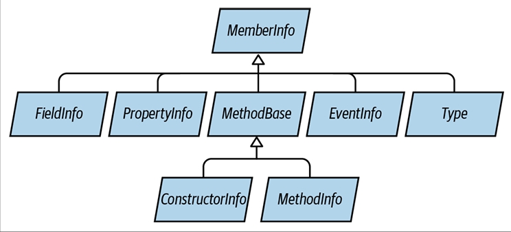
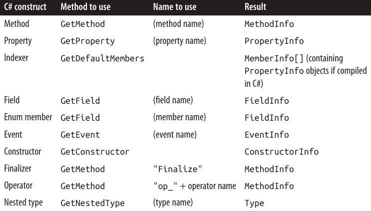
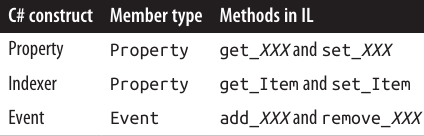
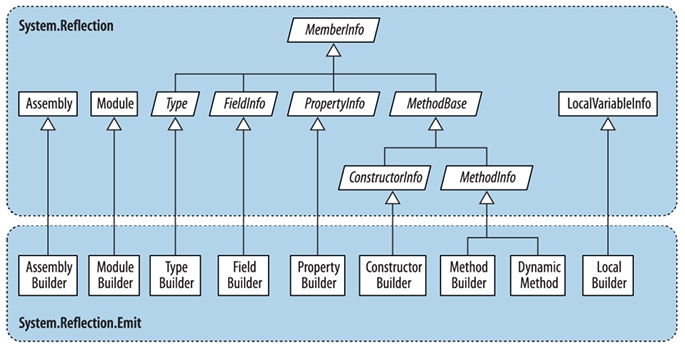

<div dir="rtl">

# فصل هجدهم:  بازتاب (Reflection) و متادیتا

همان‌طور که در فصل ۱۷ دیدیم، یک برنامه‌ی C# به یک **Assembly** کامپایل می‌شود که شامل **متادیتا (Metadata)**، کد کامپایل‌شده و منابع (Resources) است. بررسی متادیتا و کد کامپایل‌شده در زمان اجرا را **Reflection (بازتاب)** می‌نامند.

کد کامپایل‌شده در یک Assembly تقریباً تمام محتوای کد منبع اصلی را در بر دارد. با این حال، برخی اطلاعات مانند نام متغیرهای محلی، توضیحات (Comments) و دستورهای پیش‌پردازنده (Preprocessor Directives) از دست می‌روند. اما بازتاب به ما امکان دسترسی به تقریباً تمام موارد دیگر را می‌دهد—حتی تا حدی که می‌توان یک **Decompiler** (دی‌کامپایلر) نوشت. 🔎

بسیاری از سرویس‌های موجود در .NET و در دسترس از طریق C# (مانند **Dynamic Binding**، **Serialization** و **Data Binding**) به وجود متادیتا وابسته هستند. همچنین برنامه‌های شما نیز می‌توانند از این متادیتا استفاده کنند و حتی آن را با اطلاعات جدید از طریق **Custom Attributes** گسترش دهند. فضای نام `System.Reflection` شامل API مربوط به Reflection است. علاوه بر این، در زمان اجرا می‌توان متادیتا و دستورالعمل‌های اجرایی جدیدی در سطح **Intermediate Language (IL)** با استفاده از کلاس‌های موجود در فضای نام `System.Reflection.Emit` ایجاد کرد.

نمونه‌های این فصل فرض می‌کنند که شما فضای نام‌های `System` و `System.Reflection` و همچنین `System.Reflection.Emit` را وارد کرده‌اید.

وقتی در این فصل از اصطلاح **«به‌صورت دینامیکی» (Dynamically)** استفاده می‌کنیم، منظور این است که عملی را با Reflection انجام دهیم که **ایمنی نوع (Type Safety)** آن فقط در زمان اجرا کنترل می‌شود. این موضوع از نظر اصول مشابه **Dynamic Binding** در C# با کلیدواژه‌ی `dynamic` است، اما مکانیزم و عملکرد آن متفاوت است.

* **Dynamic Binding** استفاده‌ی آسان‌تری دارد و از **Dynamic Language Runtime (DLR)** برای سازگاری با زبان‌های پویا استفاده می‌کند.
* **Reflection** نسبت به آن کمی دست‌وپاگیرتر است، اما انعطاف بیشتری در ارتباط با **CLR** ارائه می‌دهد.

برای مثال، Reflection به شما اجازه می‌دهد:
✔️ فهرستی از **Types** و **Members** دریافت کنید.
✔️ یک شیء را با نامی که از یک رشته (String) می‌آید بسازید.
✔️ در لحظه (On the fly) Assembly تولید کنید.

---

## 🔍 Reflecting and Activating Types

در این بخش بررسی می‌کنیم که چگونه می‌توان یک **Type** را به دست آورد، متادیتای آن را بررسی کرد و از آن برای ایجاد دینامیکی یک شیء استفاده نمود.

### 📌 Obtaining a Type

یک نمونه از `System.Type` نمایانگر متادیتای یک Type است. از آن‌جا که **Type** بسیار پرکاربرد است، در فضای نام `System` قرار دارد، نه در `System.Reflection`.

روش‌های به‌دست‌آوردن یک نمونه‌ی `System.Type`:

۱. فراخوانی متد `GetType` روی هر شیء:

```csharp
Type t1 = DateTime.Now.GetType();     // Type بدست‌آمده در زمان اجرا
```

۲. استفاده از عملگر `typeof` در C#:

```csharp
Type t2 = typeof(DateTime);          // Type بدست‌آمده در زمان کامپایل
```

با استفاده از `typeof` می‌توانید Type آرایه‌ها و Typeهای جنریک را نیز بگیرید:

```csharp
Type t3 = typeof(DateTime[]);          // آرایه یک‌بعدی
Type t4 = typeof(DateTime[,]);         // آرایه دوبعدی
Type t5 = typeof(Dictionary<int,int>); // جنریک بسته (Closed Generic Type)
Type t6 = typeof(Dictionary<,>);       // جنریک باز (Unbound Generic Type)
```

۳. دریافت Type از طریق نام (Name):
اگر یک مرجع به Assembly داشته باشید:

```csharp
Type t = Assembly.GetExecutingAssembly().GetType("Demos.TestProgram");
```

اگر Assembly را نداشته باشید، می‌توانید از **Assembly Qualified Name** استفاده کنید (نام کامل Type به‌همراه نام کامل یا جزئی Assembly). در این حالت Assembly به‌طور ضمنی بارگذاری می‌شود:

```csharp
Type t = Type.GetType("System.Int32, System.Private.CoreLib");
```

پس از در اختیار داشتن یک شیء `System.Type`، می‌توانید با استفاده از ویژگی‌های آن به اطلاعاتی مانند نام، Assembly، Base Type، سطح دسترسی (Visibility) و ... دسترسی داشته باشید:

```csharp
Type stringType = typeof(string);
string name     = stringType.Name;          // String
Type baseType   = stringType.BaseType;      // typeof(Object)
Assembly assem  = stringType.Assembly;      // System.Private.CoreLib
bool isPublic   = stringType.IsPublic;      // true
```

یک شیء از نوع `System.Type` در واقع پنجره‌ای به تمام متادیتای مربوط به آن Type و Assembly حاوی آن است.

> `System.Type` یک کلاس **Abstract** است، بنابراین عملگر `typeof` در واقع یک زیرکلاس از Type را برمی‌گرداند. زیرکلاسی که CLR استفاده می‌کند داخلی (Internal) بوده و نام آن **RuntimeType** است.

---

## 📘 TypeInfo

اگر شما هدف‌گذاری روی **.NET Core 1.x** (یا پروفایل‌های قدیمی‌تر Windows Store) داشته باشید، بسیاری از اعضای `Type` در دسترس نیستند. این اعضا به جای آن در کلاسی به نام `TypeInfo` ارائه می‌شوند که از طریق فراخوانی `GetTypeInfo` به‌دست می‌آید.

برای اجرای مثال قبلی در چنین محیطی، کد شما این‌گونه خواهد بود:

```csharp
Type stringType = typeof(string);
string name = stringType.Name;
Type baseType = stringType.GetTypeInfo().BaseType;
Assembly assem = stringType.GetTypeInfo().Assembly;
bool isPublic = stringType.GetTypeInfo().IsPublic;
```

کلاس `TypeInfo` در **.NET Core 2 و 3** و **.NET 5+** (و همچنین در **.NET Framework 4.5+** و تمامی نسخه‌های **.NET Standard**) نیز وجود دارد. بنابراین کد بالا تقریباً به‌طور جهانی (Universal) قابل اجراست.

همچنین `TypeInfo` ویژگی‌ها و متدهای اضافی برای بازتاب روی اعضا (Reflecting over Members) در اختیار قرار می‌دهد.

## 📦 به‌دست‌آوردن انواع آرایه‌ها (Obtaining Array Types)

همان‌طور که دیدیم، `typeof` و `GetType` با آرایه‌ها کار می‌کنند. علاوه بر این می‌توانید با فراخوانی `MakeArrayType` روی **نوع المنت (Element Type)**، یک نوع آرایه بسازید:

```csharp
Type simpleArrayType = typeof(int).MakeArrayType();
Console.WriteLine(simpleArrayType == typeof(int[]));  // True
```

برای ایجاد آرایه‌های چندبعدی، کافی است یک آرگومان عدد صحیح به `MakeArrayType` بدهید:

```csharp
Type cubeType = typeof(int).MakeArrayType(3);   // آرایه سه‌بعدی (شکل مکعب)
Console.WriteLine(cubeType == typeof(int[,,])); // True
```

متد `GetElementType` عمل معکوس را انجام می‌دهد: نوع المنت یک آرایه را بازمی‌گرداند:

```csharp
Type e = typeof(int[]).GetElementType();   // e == typeof(int)
```

متد `GetArrayRank` تعداد ابعاد یک آرایه مستطیلی را برمی‌گرداند:

```csharp
int rank = typeof(int[,,]).GetArrayRank();  // 3
```

---

## 🧩 به‌دست‌آوردن نوع‌های تو در تو (Obtaining Nested Types)

برای گرفتن نوع‌های تو در تو (Nested Types)، متد `GetNestedTypes` را روی نوع حاوی (Containing Type) فراخوانی کنید:

```csharp
foreach (Type t in typeof(System.Environment).GetNestedTypes())
    Console.WriteLine(t.FullName);
```

**خروجی:**

```
System.Environment+SpecialFolder
```

یا به روش دیگر:

```csharp
foreach (TypeInfo t in typeof(System.Environment)
                        .GetTypeInfo().DeclaredNestedTypes)
    Debug.WriteLine(t.FullName);
```

⚠️ تنها نکته این است که CLR یک نوع تو در تو را با سطوح دسترسی ویژه «Nested» در نظر می‌گیرد:

```csharp
Type t = typeof(System.Environment.SpecialFolder);
Console.WriteLine(t.IsPublic);       // False
Console.WriteLine(t.IsNestedPublic); // True
```

---

## 🏷 نام انواع (Type Names)

یک Type دارای ویژگی‌های `Namespace`، `Name` و `FullName` است. در بیشتر موارد، `FullName` ترکیبی از دو مورد اول است:

```csharp
Type t = typeof(System.Text.StringBuilder);
Console.WriteLine(t.Namespace);  // System.Text
Console.WriteLine(t.Name);       // StringBuilder
Console.WriteLine(t.FullName);   // System.Text.StringBuilder
```

🔑 دو استثنا وجود دارد:

1. نوع‌های تو در تو (Nested Types)
2. نوع‌های جنریک بسته (Closed Generic Types)

همچنین ویژگی `AssemblyQualifiedName` وجود دارد که `FullName` را به‌همراه نام Assembly برمی‌گرداند. این همان رشته‌ای است که می‌توانید به `Type.GetType` بدهید و به‌طور منحصربه‌فرد یک Type را در محدوده‌ی بارگذاری پیش‌فرض مشخص می‌کند.

---

### 🔗 نام نوع‌های تو در تو (Nested Type Names)

در نوع‌های تو در تو، نوع حاوی تنها در `FullName` ظاهر می‌شود:

```csharp
Type t = typeof(System.Environment.SpecialFolder);
Console.WriteLine(t.Namespace);  // System
Console.WriteLine(t.Name);       // SpecialFolder
Console.WriteLine(t.FullName);   // System.Environment+SpecialFolder
```

🔹 علامت `+` نوع حاوی را از فضای نام تو در تو جدا می‌کند.

---

### 🌀 نام نوع‌های جنریک (Generic Type Names)

نام نوع‌های جنریک با علامت بک‌تیک (`` ` ``) و سپس تعداد پارامترهای نوع مشخص می‌شوند.

* اگر جنریک باز (Unbound) باشد، این قانون برای `Name` و `FullName` اعمال می‌شود:

```csharp
Type t = typeof(Dictionary<,>);
Console.WriteLine(t.Name);     // Dictionary`2
Console.WriteLine(t.FullName); // System.Collections.Generic.Dictionary`2
```

* اگر جنریک بسته (Closed) باشد، تنها `FullName` یک بخش اضافی طولانی شامل نام کامل Assembly هر پارامتر نوع را دریافت می‌کند:

```csharp
Console.WriteLine(typeof(Dictionary<int,string>).FullName);
```

**خروجی:**

```
System.Collections.Generic.Dictionary`2[
 [System.Int32, System.Private.CoreLib, Version=4.0.0.0, Culture=neutral, PublicKeyToken=7cec85d7bea7798e],
 [System.String, System.Private.CoreLib, Version=4.0.0.0, Culture=neutral, PublicKeyToken=7cec85d7bea7798e]
]
```

این تضمین می‌کند که `AssemblyQualifiedName` اطلاعات کافی برای شناسایی کامل نوع جنریک و پارامترهای آن دارد.

---

### 📚 نام انواع آرایه و پوینتر (Array and Pointer Type Names)

آرایه‌ها با همان پسوندی نمایش داده می‌شوند که در عبارت `typeof` استفاده می‌کنید:

```csharp
Console.WriteLine(typeof(int[]).Name);     // Int32[]
Console.WriteLine(typeof(int[,]).Name);    // Int32[,]
Console.WriteLine(typeof(int[,]).FullName);// System.Int32[,]
```

نوع‌های پوینتر مشابه هستند:

```csharp
Console.WriteLine(typeof(byte*).Name);     // Byte*
```

---

### 🔄 نام انواع پارامترهای ref و out

یک `Type` که نماینده‌ی پارامتر `ref` یا `out` باشد، پسوند `&` دارد:

```csharp
public void RefMethod(ref int p)
{
    Type t = MethodInfo.GetCurrentMethod().GetParameters()[0].ParameterType;
    Console.WriteLine(t.Name);   // Int32&
}
```

(جزئیات بیشتر در بخش «Reflecting and Invoking Members» در صفحه 813 توضیح داده می‌شود.)

---

## 🧬 Base Types و Interfaces

کلاس `Type` یک ویژگی به نام `BaseType` دارد:

```csharp
Type base1 = typeof(System.String).BaseType;
Type base2 = typeof(System.IO.FileStream).BaseType;
Console.WriteLine(base1.Name);  // Object
Console.WriteLine(base2.Name);  // Stream
```

متد `GetInterfaces` رابط‌هایی (Interfaces) را که یک Type پیاده‌سازی می‌کند برمی‌گرداند:

```csharp
foreach (Type iType in typeof(Guid).GetInterfaces())
    Console.WriteLine(iType.Name);
```

**خروجی:**

```
IFormattable
IComparable
IComparable`1
IEquatable`1
```

(متد `GetInterfaceMap` یک ساختار بازمی‌گرداند که نشان می‌دهد هر عضو از یک Interface چگونه در یک کلاس یا Struct پیاده‌سازی شده است—نمونه‌ی آن در بخش «Calling Static Virtual/Abstract Interface Members» در صفحه 826 آمده است.)

---

## ⚖️ معادل‌های پویا برای عملگر is در C\#

Reflection سه معادل پویا برای عملگر ایستای `is` در C# ارائه می‌دهد:

* `IsInstanceOfType` → یک Type و یک نمونه را می‌پذیرد.
* `IsAssignableFrom` و (از .NET 5) `IsAssignableTo` → دو Type را می‌پذیرند.

### مثال ۱:

```csharp
object obj  = Guid.NewGuid();
Type target = typeof(IFormattable);

bool isTrue   = obj is IFormattable;            // عملگر ایستای C#
bool alsoTrue = target.IsInstanceOfType(obj);   // معادل پویا
```

### مثال ۲:

```csharp
Type target = typeof(IComparable), source = typeof(string);
Console.WriteLine(target.IsAssignableFrom(source));  // True
```

متد `IsSubclassOf` هم بر اساس همان اصل `IsAssignableFrom` کار می‌کند، با این تفاوت که Interfaceها را در نظر نمی‌گیرد.
## 🏗 ایجاد نمونه از انواع (Instantiating Types)

دو روش برای ایجاد دینامیکی یک شیء از روی نوع (Type) وجود دارد:

1. فراخوانی متد استاتیک `Activator.CreateInstance`
2. فراخوانی `Invoke` روی یک شیء از نوع `ConstructorInfo` که از متد `GetConstructor` روی یک Type به‌دست آمده است (برای سناریوهای پیشرفته)

---

### 🔹 استفاده از Activator.CreateInstance

متد `Activator.CreateInstance` یک Type و آرگومان‌های اختیاری دریافت می‌کند و آن‌ها را به سازنده (Constructor) پاس می‌دهد:

```csharp
int i = (int)Activator.CreateInstance(typeof(int));

DateTime dt = (DateTime)Activator.CreateInstance(typeof(DateTime),
                                                 2000, 1, 1);
```

این متد گزینه‌های بیشتری نیز فراهم می‌کند، مانند مشخص‌کردن Assembly برای بارگذاری نوع یا امکان اتصال به سازنده‌های **Nonpublic**.
اگر CLR نتواند سازنده‌ی مناسب پیدا کند، یک استثناء از نوع `MissingMethodException` پرتاب می‌شود. ⚠️

---

### 🔹 استفاده از ConstructorInfo.Invoke

گاهی اوقات باید از `ConstructorInfo.Invoke` استفاده کنید، به‌ویژه زمانی که مقدار آرگومان‌ها نمی‌تواند بین سازنده‌های Overload تمایز ایجاد کند.

فرض کنید کلاس `X` دو سازنده دارد:

* یکی با پارامتر `string`
* دیگری با پارامتر `StringBuilder`

در این حالت اگر مقدار `null` را به `Activator.CreateInstance` بدهید، نتیجه مبهم خواهد بود. پس باید مستقیماً از `ConstructorInfo` استفاده کنید:

```csharp
// گرفتن سازنده‌ای که یک پارامتر از نوع string دارد:
ConstructorInfo ci = typeof(X).GetConstructor(new[] { typeof(string) });

// ساخت شیء با همان overload و پاس دادن null:
object foo = ci.Invoke(new object[] { null });
```

اگر هدف شما **.NET Core 1** یا پروفایل‌های قدیمی Windows Store باشد:

```csharp
ConstructorInfo ci = typeof(X).GetTypeInfo().DeclaredConstructors
    .FirstOrDefault(c =>
        c.GetParameters().Length == 1 &&
        c.GetParameters()[0].ParameterType == typeof(string));
```

برای گرفتن سازنده‌های **Nonpublic** باید از **BindingFlags** استفاده کنید (توضیح در بخش «Accessing Nonpublic Members» در صفحه 822).

---

### ⚡ نکته‌ی عملکردی

ایجاد نمونه‌ی دینامیکی چند **میکروثانیه** به زمان ساخت شیء اضافه می‌کند. این مقدار در مقیاس نسبی زیاد است، چون CLR به‌طور عادی بسیار سریع در ایجاد اشیاء عمل می‌کند (یک `new` ساده روی یک کلاس کوچک در حد چند **نانوسانیه** زمان می‌برد).

---

### 📚 ایجاد دینامیکی آرایه‌ها و جنریک‌ها

برای ایجاد آرایه‌ها به‌صورت دینامیکی، ابتدا باید `MakeArrayType` را فراخوانی کنید.
ایجاد نوع‌های جنریک نیز ممکن است (در بخش بعدی توضیح داده می‌شود).

---

### 🪝 ایجاد دینامیکی Delegateها

برای ایجاد Delegate به‌صورت دینامیکی، متد `Delegate.CreateDelegate` را فراخوانی کنید. مثال زیر ایجاد هر دو نوع Delegate (استاتیک و Instance) را نشان می‌دهد:

```csharp
class Program
{
    delegate int IntFunc(int x);

    static int Square(int x) => x * x;        // متد استاتیک
    int        Cube  (int x) => x * x * x;    // متد Instance

    static void Main()
    {
        Delegate staticD = Delegate.CreateDelegate(
            typeof(IntFunc), typeof(Program), "Square");

        Delegate instanceD = Delegate.CreateDelegate(
            typeof(IntFunc), new Program(), "Cube");

        Console.WriteLine(staticD.DynamicInvoke(3));   // 9
        Console.WriteLine(instanceD.DynamicInvoke(3)); // 27
    }
}
```

برای فراخوانی Delegate ایجادشده، می‌توانید از `DynamicInvoke` استفاده کنید (همان‌طور که در مثال بالا دیدیم) یا آن را به نوع Delegate اصلی Cast کنید:

```csharp
IntFunc f = (IntFunc)staticD;
Console.WriteLine(f(3));   // 9 (اما بسیار سریع‌تر!)
```

همچنین می‌توانید به‌جای نام متد، یک `MethodInfo` به `CreateDelegate` بدهید. جزئیات مربوط به `MethodInfo` در بخش **“Reflecting and Invoking Members”** در صفحه 813 آمده است، همراه با دلیل اینکه چرا بهتر است یک Delegate ایجادشده‌ی دینامیکی را دوباره به نوع Delegate ایستای خودش Cast کنیم.
## 🧩 انواع جنریک (Generic Types)

یک شیء از نوع `Type` می‌تواند نشان‌دهنده‌ی یک نوع جنریک **بسته (Closed)** یا **باز (Unbound)** باشد.
همانند زمان کامپایل، فقط نوع جنریک بسته را می‌توان نمونه‌سازی کرد، در حالی‌که نوع باز غیرقابل نمونه‌سازی است:

```csharp
Type closed = typeof(List<int>);
List<int> list = (List<int>)Activator.CreateInstance(closed);  // OK ✅

Type unbound = typeof(List<>);
object anError = Activator.CreateInstance(unbound);            // خطای زمان اجرا ❌
```

برای تبدیل یک نوع جنریک باز به بسته از متد `MakeGenericType` استفاده می‌کنیم:

```csharp
Type unbound = typeof(List<>);
Type closed = unbound.MakeGenericType(typeof(int));
```

برعکس آن، متد `GetGenericTypeDefinition` یک نوع بسته را دوباره به شکل باز برمی‌گرداند:

```csharp
Type unbound2 = closed.GetGenericTypeDefinition();  // unbound == unbound2
```

🔎 ویژگی‌های کلیدی:

* `IsGenericType` → بررسی می‌کند که آیا یک نوع، جنریک است یا نه.
* `IsGenericTypeDefinition` → بررسی می‌کند که آیا نوع، **باز (unbound)** است یا نه.

مثال بررسی نوع Nullable:

```csharp
Type nullable = typeof(bool?);
Console.WriteLine(
    nullable.IsGenericType &&
    nullable.GetGenericTypeDefinition() == typeof(Nullable<>));   // True
```

همچنین، متد `GetGenericArguments` آرگومان‌های نوع را بازمی‌گرداند:

```csharp
Console.WriteLine(closed.GetGenericArguments()[0]);   // System.Int32
Console.WriteLine(nullable.GetGenericArguments()[0]); // System.Boolean
Console.WriteLine(unbound.GetGenericArguments()[0]);  // T (پلا‌یس‌هولدر)
```

📌 در زمان اجرا، تمام انواع جنریک یا **باز (Unbound)** هستند یا **بسته (Closed)**.

* حالت باز فقط در موارد نادری مثل `typeof(Foo<>)` رخ می‌دهد.
* هیچ‌وقت نوع «باز» واقعی در زمان اجرا وجود ندارد؛ کامپایلر همه را به نوع بسته تبدیل می‌کند.

مثال زیر همیشه False چاپ می‌کند:

```csharp
class Foo<T>
{
    public void Test()
        => Console.Write(GetType().IsGenericTypeDefinition);  
}
```

---

## 🔍 بازتاب اعضا (Reflecting and Invoking Members)

برای بازتاب اعضای یک نوع، از متد `GetMembers` استفاده می‌کنیم.

```csharp
class Walnut
{
    private bool cracked;
    public void Crack() { cracked = true; }
}

MemberInfo[] members = typeof(Walnut).GetMembers();
foreach (MemberInfo m in members)
    Console.WriteLine(m);
```

نتیجه:

```
Void Crack()
System.Type GetType()
System.String ToString()
Boolean Equals(System.Object)
Int32 GetHashCode()
Void .ctor()
```

---

### 🔹 TypeInfo و بازتاب اعضا

کلاس `TypeInfo` یک پروتکل ساده‌تر برای بازتاب اعضا ارائه می‌دهد.

* به جای متدهایی مثل `GetMembers` که آرایه بازمی‌گردانند، این کلاس ویژگی‌هایی از نوع `IEnumerable<T>` ارائه می‌دهد که معمولاً با **LINQ** استفاده می‌شوند.

مثال:

```csharp
IEnumerable<MemberInfo> members =
    typeof(Walnut).GetTypeInfo().DeclaredMembers;
```

نتیجه (برخلاف `GetMembers` که اعضای ارث‌برده‌شده را هم برمی‌گرداند):

```
Void Crack()
Void .ctor()
Boolean cracked
```

همچنین ویژگی‌های خاصی برای گرفتن نوع مشخصی از اعضا وجود دارد (مثل `DeclaredMethods`, `DeclaredProperties` و غیره).
برای گرفتن یک متد خاص با نام (اما بدون امکان تعیین پارامترها)، از `GetDeclaredMethod` استفاده می‌شود.

برای متدهای overload باید از LINQ استفاده کرد:

```csharp
MethodInfo method = typeof(int).GetTypeInfo().DeclaredMethods
    .FirstOrDefault(m => m.Name == "ToString" &&
                         m.GetParameters().Length == 0);
```

---

### 🔹 جزئیات بیشتر در مورد GetMembers

* بدون آرگومان → تمام اعضای public نوع و پایه‌هایش برگردانده می‌شوند.
* `GetMember("Crack")` → عضو خاصی را با نام می‌گیرد (اما به‌صورت آرایه برمی‌گرداند چون ممکن است overload داشته باشد).

```csharp
MemberInfo[] m = typeof(Walnut).GetMember("Crack");
Console.WriteLine(m[0]);   // Void Crack()
```

`MemberInfo.MemberType` یک enum از نوع `MemberTypes` است که مقادیر زیر را دارد:

```
All, Constructor, Custom, Event, Field, Method,
NestedType, Property, TypeInfo
```

می‌توان با استفاده از این enum نتیجه‌ی متد `GetMembers` را محدود کرد یا مستقیماً از متدهای اختصاصی مثل `GetMethods`, `GetFields`, `GetProperties` و ... استفاده کرد.

✅ توصیه: همیشه هنگام گرفتن اعضا، تا جای ممکن دقیق باشید. مثلاً هنگام گرفتن متدی با نام خاص، نوع همه‌ی پارامترها را مشخص کنید تا اگر بعداً متد overload شد، کد شما همچنان درست کار کند.

---

### 🔹 DeclaringType و ReflectedType

یک شیء `MemberInfo` دو ویژگی دارد:

* `DeclaringType` → نوعی که عضو را تعریف کرده.
* `ReflectedType` → نوعی که متد `GetMembers` روی آن فراخوانی شده.

مثال:

```csharp
MethodInfo test = typeof(Program).GetMethod("ToString");
MethodInfo obj  = typeof(object).GetMethod("ToString");

Console.WriteLine(test.DeclaringType);   // System.Object
Console.WriteLine(obj.DeclaringType);    // System.Object
Console.WriteLine(test.ReflectedType);   // Program
Console.WriteLine(obj.ReflectedType);    // System.Object
Console.WriteLine(test == obj);          // False
```

در اینجا، تفاوت فقط به خاطر Reflection API است؛ در حقیقت `Program` هیچ متد جدیدی به نام `ToString` ندارد.

برای بررسی اینکه آیا دو متد واقعاً یکی هستند:

```csharp
Console.WriteLine(test.MethodHandle == obj.MethodHandle); // True
Console.WriteLine(test.MetadataToken == obj.MetadataToken
                  && test.Module == obj.Module);           // True
```

---

### 📝 نکات پایانی

* `MethodHandle` → برای هر متد متمایز در یک پروسه یکتا است.
* `MetadataToken` → برای تمام انواع و اعضا در یک Assembly Module یکتا است.
* `MemberInfo` متدهایی برای دریافت Attributeهای سفارشی هم دارد (بخش «Retrieving Attributes at Runtime» در صفحه 832).
* متد `MethodBase.GetCurrentMethod`، متد در حال اجرا را بازمی‌گرداند.

📌 در نهایت، `MemberInfo` خودش انتزاعی است و پایه‌ای برای انواع دیگر است (به شکل **Figure 18-1** در کتاب).
<div align="center">
    
 
</div>

شما می‌توانید یک MemberInfo را بر اساس ویژگی MemberType آن به زیرکلاس مناسبش Cast کنید. اگر یک عضو را از طریق GetMethod, GetField, GetProperty, GetEvent, GetConstructor یا GetNestedType (یا نسخه‌های جمع آن‌ها) به دست آورده باشید، نیازی به Cast نیست.

<div align="center">
    
 
</div>

هر زیرکلاس از `MemberInfo` مجموعه‌ای غنی از ویژگی‌ها و متدها دارد که تمام جنبه‌های متادیتای یک عضو را آشکار می‌کند. این شامل مواردی مثل سطح دسترسی (visibility)، اصلاح‌کننده‌ها (modifiers)، آرگومان‌های نوع جنریک، پارامترها، نوع بازگشتی و ویژگی‌های سفارشی (custom attributes) می‌شود.

نمونه‌ای از استفاده از `GetMethod`:

```csharp
MethodInfo m = typeof (Walnut).GetMethod ("Crack");
Console.WriteLine (m);            // Void Crack()
Console.WriteLine (m.ReturnType); // System.Void
```

تمام نمونه‌های \*Info توسط Reflection API در اولین استفاده کش می‌شوند:

```csharp
MethodInfo method = typeof (Walnut).GetMethod ("Crack");
MemberInfo member = typeof (Walnut).GetMember ("Crack")[0];
Console.Write (method == member);   // True
```

این کش شدن علاوه بر حفظ هویت شیء، کارایی را هم در یک API نسبتاً کند بهبود می‌دهد.

### اعضای C# در برابر اعضای CLR ⚖️

جدول قبلی نشان داد که برخی از ساختارهای C# به‌طور مستقیم و یک‌به‌یک (1:1) با ساختارهای CLR متناظر نیستند. این منطقی است چون CLR و Reflection API برای تمام زبان‌های .NET طراحی شده‌اند—حتی می‌توان از Reflection در Visual Basic هم استفاده کرد.

برخی ساختارهای C# (مثل indexer، enum، operator و finalizer) در CLR به شکل متفاوتی پیاده‌سازی می‌شوند:

* یک **C# indexer** به پراپرتی‌ای ترجمه می‌شود که یک یا چند آرگومان می‌گیرد و با `[DefaultMember]` مشخص می‌شود.
* یک **C# enum** به زیرکلاسی از `System.Enum` ترجمه می‌شود که برای هر عضو یک فیلد استاتیک دارد.
* یک **C# operator** به متدی استاتیک با نامی خاص (شروع‌شده با `op_` مثل `"op_Addition"`) ترجمه می‌شود.
* یک **C# finalizer** به متدی ترجمه می‌شود که `Finalize` را override می‌کند.

❗ پیچیدگی دیگر این است که پراپرتی‌ها و رویدادها در واقع شامل دو چیز هستند:

* متادیتایی که پراپرتی یا رویداد را توصیف می‌کند (در قالب `PropertyInfo` یا `EventInfo`)
* یک یا دو متد پشتیبان (backing methods)

در برنامه C#، این متدهای پشتیبان داخل تعریف پراپرتی یا رویداد قرار دارند. اما وقتی به IL کامپایل می‌شود، این متدها مثل متدهای عادی دیده می‌شوند و می‌توان آن‌ها را فراخوانی کرد.

به همین دلیل `GetMethods` علاوه بر متدهای عادی، متدهای پشتیبان پراپرتی و رویدادها را هم برمی‌گرداند:

```csharp
class Test { public int X { get { return 0; } set {} } }

void Demo()
{
  foreach (MethodInfo mi in typeof (Test).GetMethods())
    Console.Write (mi.Name + "  ");
}
// OUTPUT:
// get_X  set_X  GetType  ToString  Equals  GetHashCode
```

برای شناسایی این متدها می‌توان از ویژگی `IsSpecialName` در `MethodInfo` استفاده کرد. مقدار آن برای متدهای پراپرتی، ایندکسر، رویداد و عملگرها **true** است. برای متدهای معمولی C# (و متد `Finalize` در صورت وجود finalizer) مقدار آن **false** خواهد بود.

در ادامه، متدهای پشتیبانی که C# تولید می‌کند را خواهیم دید.
<div align="center">
    
 
</div>

هر متد پشتیبان (backing method) شیء مخصوص به خودش از نوع `MethodInfo` دارد. می‌توانید به این صورت به آن‌ها دسترسی پیدا کنید:

```csharp
PropertyInfo pi = typeof (Console).GetProperty ("Title");
MethodInfo getter = pi.GetGetMethod();                   // get_Title
MethodInfo setter = pi.GetSetMethod();                   // set_Title
MethodInfo[] both = pi.GetAccessors();                   // Length==2
```

برای رویدادها (Event)، متدهای `GetAddMethod` و `GetRemoveMethod` کار مشابهی برای `EventInfo` انجام می‌دهند.

برای حرکت در جهت عکس—یعنی رفتن از یک `MethodInfo` به `PropertyInfo` یا `EventInfo` مربوطه—باید یک کوئری انجام دهید. در اینجا LINQ برای این کار ایدئال است:

```csharp
PropertyInfo p = mi.DeclaringType.GetProperties()
                  .First (x => x.GetAccessors (true).Contains (mi));
```

---

### پراپرتی‌های Init-only 🛠️

پراپرتی‌های Init-only که در C# 9 معرفی شدند، می‌توانند از طریق **object initializer** مقداردهی شوند، اما بعد از آن توسط کامپایلر فقط به‌عنوان *فقط-خواندنی* در نظر گرفته می‌شوند.

از دید CLR، یک **init accessor** درست مثل یک **set accessor** عادی است، با این تفاوت که یک فلگ خاص روی نوع بازگشتی متد `set` اعمال می‌شود (این فلگ برای کامپایلر معنا دارد).

نکته جالب این است که این فلگ به شکل یک **attribute قراردادی** رمزگذاری نشده است. در عوض، از یک مکانیزم کمتر شناخته‌شده به نام **modreq** استفاده می‌کند. این باعث می‌شود که نسخه‌های قدیمی‌تر کامپایلر C# (که modreq جدید را نمی‌شناسند) آن accessor را نادیده بگیرند، به‌جای اینکه پراپرتی را قابل نوشتن در نظر بگیرند.

نام modreq برای accessorهای init-only برابر است با `IsExternalInit` و می‌توانید به این صورت آن را بررسی کنید:

```csharp
bool IsInitOnly (PropertyInfo pi) => pi
 .GetSetMethod().ReturnParameter.GetRequiredCustomModifiers()
 .Any (t => t.Name == "IsExternalInit");
```

---

### NullabilityInfoContext ☑️

از .NET 6 به بعد، می‌توانید با کلاس `NullabilityInfoContext` اطلاعاتی درباره **annotation**‌های nullability برای فیلد، پراپرتی، رویداد یا پارامترها به دست آورید:

```csharp
void PrintPropertyNullability (PropertyInfo pi)
{
 var info = new NullabilityInfoContext().Create (pi);
 Console.WriteLine (pi.Name + " read " + info.ReadState);
 Console.WriteLine (pi.Name + " write " + info.WriteState);
 // از info.Element برای گرفتن اطلاعات nullability عناصر آرایه استفاده کنید
}
```

---

### اعضای نوع جنریک 🔁

می‌توانید متادیتای اعضا را هم برای **انواع جنریک باز (unbound generic types)** و هم برای **انواع جنریک بسته (closed generic types)** به دست آورید:

```csharp
PropertyInfo unbound = typeof (IEnumerator<>)  .GetProperty ("Current");
PropertyInfo closed = typeof (IEnumerator<int>).GetProperty ("Current");
Console.WriteLine (unbound);   // T Current
Console.WriteLine (closed);    // Int32 Current
Console.WriteLine (unbound.PropertyType.IsGenericParameter);  // True
Console.WriteLine (closed.PropertyType.IsGenericParameter);   // False
```

شیءهای `MemberInfo` که از انواع جنریک باز و بسته بازگردانده می‌شوند همیشه متمایز هستند، حتی اگر امضای اعضا شامل پارامترهای نوع جنریک نباشد:

```csharp
PropertyInfo unbound = typeof (List<>)  .GetProperty ("Count");
PropertyInfo closed = typeof (List<int>).GetProperty ("Count");
Console.WriteLine (unbound);   // Int32 Count
Console.WriteLine (closed);    // Int32 Count
Console.WriteLine (unbound == closed);   // False
Console.WriteLine (unbound.DeclaringType.IsGenericTypeDefinition); // True
Console.WriteLine (closed.DeclaringType.IsGenericTypeDefinition); // False
```

❌ اعضای انواع جنریک باز (**unbound generic types**) را نمی‌توان به‌صورت داینامیک invoke کرد.
### فراخوانی پویا اعضا ⚡

فراخوانی پویا یک عضو می‌تواند با استفاده از کتابخانه‌ی **Uncapsulator** (متن‌باز و موجود در NuGet و GitHub) بسیار راحت‌تر انجام شود. این کتابخانه که توسط نویسنده‌ی کتاب نوشته شده، یک API روان برای فراخوانی اعضای عمومی و غیرعمومی از طریق Reflection، با استفاده از یک **dynamic binder** سفارشی ارائه می‌دهد.

پس از آنکه یک شیء از نوع `MethodInfo`، `PropertyInfo` یا `FieldInfo` داشته باشید، می‌توانید آن را به‌صورت پویا فراخوانی کنید یا مقدارش را بگیرید/تعیین کنید. این کار **late binding** نام دارد، زیرا شما انتخاب می‌کنید کدام عضو در زمان اجرا (runtime) فراخوانی شود، نه در زمان کامپایل.

برای نمونه، این کد با **static binding** عادی نوشته شده است:

```csharp
string s = "Hello";
int length = s.Length;
```

و همین کار با **late binding** پویا چنین خواهد بود:

```csharp
object s = "Hello";
PropertyInfo prop = s.GetType().GetProperty ("Length");
int length = (int) prop.GetValue (s, null);   // 5
```

متدهای `GetValue` و `SetValue` مقدار یک `PropertyInfo` یا `FieldInfo` را می‌گیرند یا تنظیم می‌کنند. آرگومان اول نمونه (instance) است، که برای اعضای `static` می‌تواند `null` باشد.

برای دسترسی به **Indexer** نیز درست مثل پراپرتی‌ای به نام `"Item"` رفتار می‌شود، با این تفاوت که مقادیر indexer به‌عنوان آرگومان دوم به `GetValue` یا `SetValue` داده می‌شوند.

برای فراخوانی پویا یک متد، متد `Invoke` را روی یک `MethodInfo` صدا می‌زنید و یک آرایه از آرگومان‌ها به آن می‌دهید. اگر نوع یکی از آرگومان‌ها اشتباه باشد، یک **exception** در زمان اجرا رخ خواهد داد. با فراخوانی پویا، ایمنی نوع در زمان کامپایل را از دست می‌دهید، اما همچنان ایمنی نوع در زمان اجرا را دارید (دقیقاً مثل استفاده از کلیدواژه‌ی `dynamic`).

---

### پارامترهای متد 📑

فرض کنید بخواهیم متد `Substring` رشته را پویا فراخوانی کنیم. در حالت عادی (static):

```csharp
Console.WriteLine ("stamp".Substring(2));   // "amp"
```

معادل پویا با reflection و late binding:

```csharp
Type type = typeof (string);
Type[] parameterTypes = { typeof (int) };
MethodInfo method = type.GetMethod ("Substring", parameterTypes);
object[] arguments = { 2 };
object returnValue = method.Invoke ("stamp", arguments);
Console.WriteLine (returnValue);   // "amp"
```

از آنجا که متد `Substring` overload دارد، مجبور شدیم یک آرایه از نوع پارامترها بدهیم تا مشخص شود کدام نسخه‌ی متد را می‌خواهیم. در غیر این صورت، `GetMethod` خطای `AmbiguousMatchException` خواهد داد.

متد `GetParameters` که در کلاس پایه‌ی `MethodBase` (برای `MethodInfo` و `ConstructorInfo`) تعریف شده، اطلاعات متادیتا درباره‌ی پارامترها را برمی‌گرداند:

```csharp
ParameterInfo[] paramList = method.GetParameters();
foreach (ParameterInfo x in paramList)
{
 Console.WriteLine (x.Name);          // startIndex
 Console.WriteLine (x.ParameterType); // System.Int32
}
```

---

### برخورد با پارامترهای ref و out 🔄

برای پاس دادن پارامترهای `ref` یا `out`، باید قبل از گرفتن متد، متد `MakeByRefType` را روی نوع صدا بزنید. برای نمونه، اجرای پویا کد زیر:

```csharp
int x;
bool successfulParse = int.TryParse ("23", out x);
```

به شکل زیر خواهد بود:

```csharp
object[] args = { "23", 0 };
Type[] argTypes = { typeof (string), typeof (int).MakeByRefType() };
MethodInfo tryParse = typeof (int).GetMethod ("TryParse", argTypes);
bool successfulParse = (bool) tryParse.Invoke (null, args);
Console.WriteLine (successfulParse + " " + args[1]);   // True 23
```

همین روش برای هر دو نوع `ref` و `out` کار می‌کند.

---

### بازیابی و فراخوانی متدهای جنریک 🔧

گاهی لازم است هنگام فراخوانی `GetMethod` نوع پارامترها را مشخص کنیم تا بین متدهای overload تمایز قائل شویم. اما امکان مشخص کردن **نوع‌های جنریک** به‌طور مستقیم وجود ندارد.

برای نمونه، کلاس `System.Linq.Enumerable` دو overload برای متد `Where` دارد:

```csharp
public static IEnumerable<TSource> Where<TSource>
 (this IEnumerable<TSource> source, Func<TSource, bool> predicate);

public static IEnumerable<TSource> Where<TSource>
 (this IEnumerable<TSource> source, Func<TSource, int, bool> predicate);
```

برای بازیابی یک overload خاص، باید همه‌ی متدها را بگیریم و سپس مورد دلخواه را دستی انتخاب کنیم. کوئری زیر overload اول را برمی‌گرداند:

```csharp
from m in typeof (Enumerable).GetMethods()
where m.Name == "Where" && m.IsGenericMethod 
let parameters = m.GetParameters()
where parameters.Length == 2
let genArg = m.GetGenericArguments().First()
let enumerableOfT = typeof (IEnumerable<>).MakeGenericType (genArg)
let funcOfTBool = typeof (Func<,>).MakeGenericType (genArg, typeof (bool))
where parameters[0].ParameterType == enumerableOfT
  && parameters[1].ParameterType == funcOfTBool
select m
```

فراخوانی `.Single()` روی این کوئری، شیء `MethodInfo` درست با پارامترهای نوع باز (unbound) را برمی‌گرداند. گام بعدی بستن پارامترهای نوعی است، با استفاده از `MakeGenericMethod`:

```csharp
var closedMethod = unboundMethod.MakeGenericMethod (typeof (int));
```

در این حالت، نوع `TSource` با `int` بسته شده و می‌توانیم `Enumerable.Where` را با منبعی از نوع `IEnumerable<int>` و شرطی از نوع `Func<int,bool>` صدا بزنیم:

```csharp
int[] source = { 3, 4, 5, 6, 7, 8 };
Func<int, bool> predicate = n => n % 2 == 1;   // فقط اعداد فرد
var query = (IEnumerable<int>) closedMethod.Invoke 
 (null, new object[] { source, predicate });
foreach (int element in query) Console.Write (element + "|");   // 3|5|7|
```

---

### استفاده از System.Linq.Expressions 🎭

اگر از API مربوط به `System.Linq.Expressions` برای ساخت داینامیک expressionها استفاده کنید (فصل ۸)، دیگر نیازی به این کارهای دستی برای مشخص کردن متد جنریک ندارید. متد `Expression.Call` overloadهایی دارد که اجازه می‌دهد نوع‌های بسته‌ی جنریک را مشخص کنید:

```csharp
int[] source = { 3, 4, 5, 6, 7, 8 };
Func<int, bool> predicate = n => n % 2 == 1;
var sourceExpr = Expression.Constant (source);
var predicateExpr = Expression.Constant (predicate);
var callExpression = Expression.Call (
 typeof (Enumerable), "Where",
 new[] { typeof (int) },  // نوع جنریک بسته
 sourceExpr, predicateExpr);
```
### استفاده از Delegate برای بهبود عملکرد ⚡

فراخوانی‌های داینامیک نسبتاً کم‌کارآمد هستند و معمولاً overhead آن‌ها در محدوده‌ی چند میکروثانیه است. اگر یک متد را بارها در یک حلقه فراخوانی می‌کنید، می‌توانید این overhead را به سطح نانوثانیه کاهش دهید، با ایجاد یک **delegate داینامیک** که به متد داینامیک شما اشاره می‌کند.

مثال زیر، متد `Trim` رشته را یک میلیون بار بدون overhead قابل توجه فراخوانی می‌کند:

```csharp
delegate string StringToString(string s);

MethodInfo trimMethod = typeof(string).GetMethod("Trim", new Type[0]);
var trim = (StringToString) Delegate.CreateDelegate(typeof(StringToString), trimMethod);

for (int i = 0; i < 1000000; i++)
    trim("test");
```

این روش سریع‌تر است زیرا **late binding** پرهزینه فقط یک بار اتفاق می‌افتد.

---

### دسترسی به اعضای غیرعمومی 🔒

تمام متدهای بازتابی برای بررسی metadata (مثل `GetProperty`, `GetField` و غیره) overloadهایی دارند که یک `BindingFlags` می‌گیرند. این enum به‌عنوان یک فیلتر عمل می‌کند و اجازه می‌دهد معیارهای انتخاب پیش‌فرض را تغییر دهید. رایج‌ترین کاربرد، بازیابی اعضای غیرعمومی است (کار می‌کند فقط در اپلیکیشن‌های دسکتاپ).

نمونه:

```csharp
class Walnut
{
    private bool cracked;
    public void Crack() { cracked = true; }
    public override string ToString() { return cracked.ToString(); }
}

Type t = typeof(Walnut);
Walnut w = new Walnut();
w.Crack();

FieldInfo f = t.GetField("cracked", BindingFlags.NonPublic | BindingFlags.Instance);
f.SetValue(w, false);

Console.WriteLine(w);   // False
```

دسترسی به اعضای غیرعمومی با reflection قدرتمند است، اما خطرناک هم هست؛ زیرا می‌توانید **encapsulation** را دور بزنید و وابستگی به پیاده‌سازی داخلی ایجاد کنید.

---

### مقدمه‌ای بر BindingFlags 🏷

`BindingFlags` برای ترکیب بیتی طراحی شده است. برای اینکه چیزی پیدا شود، باید یکی از چهار ترکیب زیر را انتخاب کنید:

* `BindingFlags.Public | BindingFlags.Instance`
* `BindingFlags.Public | BindingFlags.Static`
* `BindingFlags.NonPublic | BindingFlags.Instance`
* `BindingFlags.NonPublic | BindingFlags.Static`

`NonPublic` شامل internal، protected، protected internal و private می‌شود.

مثال:

```csharp
// همه اعضای public و static
BindingFlags publicStatic = BindingFlags.Public | BindingFlags.Static;
MemberInfo[] members = typeof(object).GetMembers(publicStatic);

// همه اعضای nonpublic (static و instance)
BindingFlags nonPublicBinding = BindingFlags.NonPublic | BindingFlags.Static | BindingFlags.Instance;
members = typeof(object).GetMembers(nonPublicBinding);
```

پرچم `DeclaredOnly` اعضای ارث‌بری شده را کنار می‌گذارد، مگر اینکه override شده باشند. این flag کمی گیج‌کننده است زیرا **مجموعه نتیجه را محدود می‌کند**، در حالی که بقیه flagها مجموعه نتیجه را گسترش می‌دهند.

---

### فراخوانی متدهای جنریک 🎯

شما نمی‌توانید مستقیماً متدهای جنریک را Invoke کنید؛ مثال زیر خطا می‌دهد:

```csharp
class Program
{
    public static T Echo<T>(T x) { return x; }
    static void Main()
    {
        MethodInfo echo = typeof(Program).GetMethod("Echo");
        Console.WriteLine(echo.IsGenericMethodDefinition);    // True
        echo.Invoke(null, new object[] { 123 });             // Exception
    }
}
```

راه حل: ابتدا متد `MakeGenericMethod` را روی `MethodInfo` صدا بزنید و **نوع‌های جنریک مشخص** بدهید. این یک `MethodInfo` جدید برمی‌گرداند که می‌توان آن را فراخوانی کرد:

```csharp
MethodInfo echo = typeof(Program).GetMethod("Echo");
MethodInfo intEcho = echo.MakeGenericMethod(typeof(int));

Console.WriteLine(intEcho.IsGenericMethodDefinition);          // False
Console.WriteLine(intEcho.Invoke(null, new object[] { 3 }));   // 3
```
گاهی لازم است تا یک عضو از **رابط جنریک** را فراخوانی کنیم ولی پارامترهای نوع آن تا زمان اجرا مشخص نیستند. این مورد در طراحی‌های ایده‌آل کمیاب است، اما در عمل کاربرد دارد.

برای مثال، اگر بخواهیم نسخه‌ای قدرتمندتر از `ToString` بسازیم که نتایج LINQ را نیز گسترش دهد:

```csharp
public static string ToStringEx<T>(IEnumerable<T> sequence) { ... }
```

اما این محدود است. اگر `sequence` شامل مجموعه‌های تو در تو باشد، باید overloadهای متعدد بسازیم که عملی نیست. راه حل بهتر، نوشتن متدی است که **هر شیء دلخواهی** را پردازش کند:

```csharp
public static string ToStringEx(object value)
{
    if (value == null) return "<null>";
    StringBuilder sb = new StringBuilder();

    if (value is IList)
        sb.AppendLine("A list with " + ((IList)value).Count + " items");

    // بررسی IGrouping<,> با reflection
    Type closedIGrouping = value.GetType().GetInterfaces()
        .Where(t => t.IsGenericType &&
                    t.GetGenericTypeDefinition() == typeof(IGrouping<,>))
        .FirstOrDefault();

    if (closedIGrouping != null)
    {
        PropertyInfo pi = closedIGrouping.GetProperty("Key");
        object key = pi.GetValue(value, null);
        sb.Append("Group with key=" + key + ": ");
    }

    if (value is IEnumerable)
        foreach (object element in (IEnumerable)value)
            sb.Append(ToStringEx(element) + " ");

    if (sb.Length == 0) sb.Append(value.ToString());
    return "\r\n" + sb.ToString();
}
```

* برای `List<>` می‌توان از `IList` غیرجنریک استفاده کرد، زیرا `List<>` این رابط را پیاده‌سازی کرده است.
* برای `IGrouping<,>` باید از **نوع بسته (closed generic)** استفاده کنیم و سپس با reflection عضو `Key` را فراخوانی کنیم.

این روش پایدار است و چه `IGrouping<,>` به‌صورت **ضمنی** یا **صریح** پیاده‌سازی شده باشد، کار می‌کند.

مثال استفاده:

```csharp
Console.WriteLine(ToStringEx(new List<int> { 5, 6, 7 }));
Console.WriteLine(ToStringEx("xyyzzz".GroupBy(c => c)));
```

خروجی:

```
List of 3 items: 5 6 7
Group with key=x: x
Group with key=y: y y
Group with key=z: z z z
```
برای بازتاب یک Assembly به‌صورت دینامیک، می‌توان از `GetType` یا `GetTypes` استفاده کرد.

مثال دریافت نوع `Demos.TestProgram` از assembly جاری:

```csharp
Type t = Assembly.GetExecutingAssembly().GetType("Demos.TestProgram");
```

یا از روی یک نوع موجود:

```csharp
typeof(Foo).Assembly.GetType("Demos.TestProgram");
```

لیست تمام انواع در یک Assembly خارجی:

```csharp
Assembly a = Assembly.LoadFile(@"e:\demo\mylib.dll");
foreach (Type t in a.GetTypes())
    Console.WriteLine(t);
```

یا با `TypeInfo`:

```csharp
Assembly a = typeof(Foo).GetTypeInfo().Assembly;
foreach (Type t in a.ExportedTypes)
    Console.WriteLine(t);
```

> توجه: `GetTypes` و `ExportedTypes` فقط انواع سطح بالا را برمی‌گردانند، انواع تو در تو را خیر.
فراخوانی `GetTypes` روی یک اسمبلی چندماژوله، تمام نوع‌ها را در همه ماژول‌ها برمی‌گرداند. در نتیجه، می‌توانید وجود ماژول‌ها را نادیده بگیرید و یک اسمبلی را به‌عنوان **کانتینر نوع‌ها** در نظر بگیرید. با این حال، یک مورد وجود دارد که ماژول‌ها اهمیت پیدا می‌کنند—و آن زمانی است که با **توکن‌های متادیتا (metadata tokens)** کار می‌کنید.

توکن متادیتا یک عدد صحیح است که به‌طور یکتا به یک نوع، عضو، رشته یا منبع در محدوده یک ماژول اشاره می‌کند. IL از توکن‌های متادیتا استفاده می‌کند، بنابراین اگر در حال تحلیل IL هستید، باید بتوانید آن‌ها را حل کنید. متدهای مرتبط در نوع `Module` تعریف شده‌اند و شامل `ResolveType`، `ResolveMember`، `ResolveString` و `ResolveSignature` می‌شوند. در بخش پایانی این فصل، هنگام نوشتن **disassembler** دوباره به این موضوع بازمی‌گردیم.

می‌توانید لیست همه ماژول‌های یک اسمبلی را با فراخوانی `GetModules` به‌دست آورید. همچنین می‌توانید به ماژول اصلی یک اسمبلی مستقیماً از طریق ویژگی `ManifestModule` دسترسی داشته باشید.

### کار با Attributes 🏷️

CLR اجازه می‌دهد **متادیتای اضافی** به نوع‌ها، اعضا و اسمبلی‌ها از طریق Attributes متصل شود. این مکانیزم باعث می‌شود برخی از عملکردهای مهم CLR (مانند شناسایی اسمبلی یا marshaling نوع‌ها برای تعامل با native code) هدایت شوند و Attributes را به بخشی جدایی‌ناپذیر از برنامه تبدیل می‌کند.

یکی از ویژگی‌های کلیدی Attributes این است که شما می‌توانید **Attributes خودتان** را بنویسید و سپس مانند هر Attribute دیگری، آن‌ها را برای “تزئین” یک عنصر کد با اطلاعات اضافی استفاده کنید. این اطلاعات اضافی در اسمبلی پایه کامپایل می‌شوند و می‌توان آن‌ها را در زمان اجرا با استفاده از **reflection** بازیابی کرد تا سرویس‌هایی بسازید که به صورت **دکوراتوری و خودکار** عمل می‌کنند، مانند **تست واحد خودکار (automated unit testing)**.

سه نوع Attribute وجود دارد:

* **Bit-mapped attributes**
* **Custom attributes**
* **Pseudocustom attributes**

از میان این‌ها، تنها **custom attributes** قابل توسعه هستند.

اصطلاح «attribute» به تنهایی می‌تواند به هر سه نوع اشاره کند، اما در دنیای C# بیشتر به **custom attributes** یا **pseudocustom attributes** اشاره دارد.

**Bit-mapped attributes** (اصطلاح ما) به بیت‌های اختصاصی در متادیتای نوع نگاشت می‌شوند. اکثر کلمات کلیدی modifier در C#، مانند `public`، `abstract` و `sealed` به Bit-mapped attributes تبدیل می‌شوند. این Attributes بسیار کارآمد هستند زیرا فضای کمی در متادیتا مصرف می‌کنند (معمولاً تنها یک بیت) و CLR می‌تواند آن‌ها را با کمترین یا بدون هیچ واسطه‌ای پیدا کند.

API **reflection** آن‌ها را از طریق ویژگی‌های اختصاصی روی `Type` (و سایر زیرکلاس‌های `MemberInfo`) مانند `IsPublic`، `IsAbstract` و `IsSealed` نمایش می‌دهد. ویژگی `Attributes` یک **enum با flag** برمی‌گرداند که اکثر آن‌ها را به‌صورت یکجا توصیف می‌کند:

```csharp
static void Main()
{
    TypeAttributes ta = typeof(Console).Attributes;
    MethodAttributes ma = MethodInfo.GetCurrentMethod().Attributes;
    Console.WriteLine(ta + "\r\n" + ma);
}
```

نتیجه:

```
AutoLayout, AnsiClass, Class, Public, Abstract, Sealed, BeforeFieldInit
PrivateScope, Private, Static, HideBySig
```

در مقابل، **custom attributes** به یک Blob در متادیتای اصلی نوع متصل می‌شوند. همه Custom attributes توسط یک زیرکلاس از `System.Attribute` نمایش داده می‌شوند و برخلاف Bit-mapped attributes، **قابل توسعه** هستند. این Blob کلاس Attribute را شناسایی می‌کند و همچنین مقادیر هر آرگومان موقعیتی یا نام‌گذاری‌شده‌ای که هنگام اعمال Attribute مشخص شده را ذخیره می‌کند. Custom attributes که خودتان تعریف می‌کنید، از نظر معماری کاملاً مشابه آن‌هایی هستند که در کتابخانه‌های .NET تعریف شده‌اند.

در **فصل 4** توضیح داده شده است که چگونه می‌توان Custom attributes را به یک نوع یا عضو در C# متصل کرد. مثال زیر، Attribute از پیش تعریف‌شده `Obsolete` را به کلاس `Foo` اعمال می‌کند:

```csharp
[Obsolete] public class Foo { ... }
```

این به کامپایلر دستور می‌دهد که یک نمونه از `ObsoleteAttribute` را در متادیتای `Foo` قرار دهد، که سپس می‌توان آن را در زمان اجرا با فراخوانی `GetCustomAttributes` روی یک `Type` یا `MemberInfo` بازیابی کرد.

**Pseudocustom attributes** ظاهر و عملکردی شبیه custom attributes استاندارد دارند. آن‌ها توسط یک زیرکلاس از `System.Attribute` نمایش داده می‌شوند و به روش استاندارد متصل می‌شوند:

```csharp
[System.Runtime.InteropServices.StructLayout(LayoutKind.Sequential)]
class SystemTime { ... }
```

تفاوت این است که کامپایلر یا CLR به‌صورت داخلی، Pseudocustom attributes را با تبدیل آن‌ها به Bit-mapped attributes بهینه می‌کند. نمونه‌ها شامل `StructLayout`، `In` و `Out` هستند (فصل 24). Reflection، Pseudocustom attributes را از طریق ویژگی‌های اختصاصی مانند `IsLayoutSequential` نمایش می‌دهد و در بسیاری از موارد، وقتی `GetCustomAttributes` فراخوانی شود، به‌عنوان شیء `System.Attribute` نیز برمی‌گردند.

این بدان معناست که می‌توانید تقریباً تفاوت بین **pseudo-** و **non-pseudo custom attributes** را نادیده بگیرید (استثنای مهم، زمانی است که از `Reflection.Emit` برای تولید نوع‌ها به‌صورت داینامیک در زمان اجرا استفاده می‌کنید؛ نگاه کنید به فصل «Emitting Assemblies and Types» صفحه 841).
**AttributeUsage** یک Attribute است که روی کلاس‌های Attribute اعمال می‌شود و به کامپایلر می‌گوید چگونه باید Attribute هدف استفاده شود:

```csharp
public sealed class AttributeUsageAttribute : Attribute
{
    public AttributeUsageAttribute(AttributeTargets validOn);
    public bool AllowMultiple        { get; set; }
    public bool Inherited            { get; set; }
    public AttributeTargets ValidOn  { get; }
}
```

* `AllowMultiple` مشخص می‌کند که آیا Attribute تعریف‌شده می‌تواند بیش از یک بار روی همان هدف اعمال شود یا خیر.
* `Inherited` مشخص می‌کند که آیا Attribute اعمال‌شده روی یک کلاس پایه، به کلاس‌های مشتق نیز اعمال شود (یا در مورد متدها، آیا Attribute اعمال‌شده روی متد virtual به متدهای overriding نیز منتقل شود).
* `ValidOn` مجموعه اهدافی را تعیین می‌کند که Attribute می‌تواند به آن‌ها متصل شود، مانند کلاس‌ها، اینترفیس‌ها، Properties، متدها، پارامترها و غیره. این ویژگی هر ترکیبی از مقادیر enum `AttributeTargets` را می‌پذیرد، که شامل موارد زیر است:

```
All, Assembly, Class, Delegate, GenericParameter, Parameter,
Enum, Event, Constructor, Field, Interface, Method, Module,
Property, ReturnValue, Struct
```

مثال از نحوه استفاده توسعه‌دهندگان .NET از `AttributeUsage` روی `Serializable`:

```csharp
[AttributeUsage(AttributeTargets.Delegate |
                AttributeTargets.Enum     |
                AttributeTargets.Struct   |
                AttributeTargets.Class, Inherited = false)]
public sealed class SerializableAttribute : Attribute { }
```

این تقریباً کل تعریف Attribute `Serializable` است. نوشتن یک کلاس Attribute بدون property یا constructor ویژه، به همین سادگی است.

### تعریف Attribute سفارشی

برای تعریف Attribute خودتان مراحل زیر را دنبال کنید:

1. از کلاس `System.Attribute` یا یکی از زیرکلاس‌های آن مشتق شوید. طبق قرارداد، نام کلاس باید با `Attribute` ختم شود، اگرچه اجباری نیست.
2. Attribute `AttributeUsage` را اعمال کنید (توضیح داده شده در بخش قبل). اگر Attribute نیاز به property یا آرگومان ندارد، کار تمام است.
3. یک یا چند constructor عمومی بنویسید. پارامترهای constructor، پارامترهای موقعیتی (positional) Attribute را تعریف می‌کنند و هنگام استفاده از Attribute اجباری خواهند بود.
4. برای هر پارامتر نام‌گذاری‌شده (named parameter) که می‌خواهید پشتیبانی کنید، یک فیلد یا property عمومی تعریف کنید. پارامترهای نام‌گذاری‌شده هنگام استفاده از Attribute اختیاری هستند.

**نوع propertyها و پارامترهای constructor باید یکی از موارد زیر باشد:**

* نوع primitive بسته‌شده (sealed)، مانند `bool`، `byte`، `char`، `double`، `float`، `int`، `long`، `short` یا `string`
* نوع `Type`
* یک enum
* آرایه تک‌بعدی از هر یک از موارد بالا

هنگام اعمال Attribute، باید امکان ارزیابی **static** compiler برای هر property یا آرگومان constructor وجود داشته باشد.

مثال: یک Attribute برای پشتیبانی از سیستم **آزمون خودکار واحد (unit testing)**:

```csharp
[AttributeUsage(AttributeTargets.Method)]
public sealed class TestAttribute : Attribute
{
    public int    Repetitions;
    public string FailureMessage;
    public TestAttribute() : this(1)     { }
    public TestAttribute(int repetitions) { Repetitions = repetitions; }
}
```

و کلاس `Foo` با متدهایی که با Test Attribute تزئین شده‌اند:

```csharp
class Foo
{
    [Test]
    public void Method1() { ... }

    [Test(20)]
    public void Method2() { ... }

    [Test(20, FailureMessage="Debugging Time!")]
    public void Method3() { ... }
}
```
دو روش استاندارد برای بازیابی Attributes در زمان اجرا وجود دارد:

* فراخوانی `GetCustomAttributes` روی هر شیء `Type` یا `MemberInfo`
* فراخوانی `Attribute.GetCustomAttribute` یا `Attribute.GetCustomAttributes`

این دو متد اخیر **overload** شده‌اند تا هر شیء reflection که با یک هدف Attribute معتبر مطابقت دارد (مانند `Type`، `Assembly`، `Module`، `MemberInfo` یا `ParameterInfo`) را بپذیرند.

همچنین می‌توان از `GetCustomAttributesData()` روی یک نوع یا عضو استفاده کرد تا اطلاعات Attribute را به‌دست آورد. تفاوت آن با `GetCustomAttributes()` این است که نسخه Data به شما نشان می‌دهد Attribute چگونه ایجاد شده است:

* کدام overload از constructor استفاده شده
* مقدار هر آرگومان constructor و پارامتر نام‌گذاری‌شده

این قابلیت زمانی مفید است که بخواهید کد یا IL تولید کنید تا Attribute را به همان وضعیت بازسازی کنید (نگاه کنید به «Emitting Type Members» صفحه 844).

مثال: فهرست کردن هر متدی در کلاس `Foo` که دارای `TestAttribute` است:

```csharp
foreach (MethodInfo mi in typeof(Foo).GetMethods())
{
    TestAttribute att = (TestAttribute) Attribute.GetCustomAttribute(mi, typeof(TestAttribute));
    if (att != null)
        Console.WriteLine("Method {0} will be tested; reps={1}; msg={2}",
                          mi.Name, att.Repetitions, att.FailureMessage);
}
```

یا به شکل زیر:

```csharp
foreach (MethodInfo mi in typeof(Foo).GetTypeInfo().DeclaredMethods)
{ ... }
```

خروجی:

```
Method Method1 will be tested; reps=1; msg=
Method Method2 will be tested; reps=20; msg=
Method Method3 will be tested; reps=20; msg=Debugging Time!
```

برای تکمیل مثال و نشان دادن اینکه چگونه می‌توان از این روش برای نوشتن یک **سیستم Unit Testing خودکار** استفاده کرد، نسخه‌ای که متدها را واقعاً فراخوانی می‌کند:

```csharp
foreach (MethodInfo mi in typeof(Foo).GetMethods())
{
    TestAttribute att = (TestAttribute) Attribute.GetCustomAttribute(mi, typeof(TestAttribute));
    if (att != null)
        for (int i = 0; i < att.Repetitions; i++)
            try
            {
                mi.Invoke(new Foo(), null);  // فراخوانی متد بدون آرگومان
            }
            catch (Exception ex)
            {
                throw new Exception("Error: " + att.FailureMessage, ex);
            }
}
```

نمونه دیگر: فهرست کردن Attributes موجود روی یک نوع مشخص:

```csharp
object[] atts = Attribute.GetCustomAttributes(typeof(Test));
foreach (object att in atts) Console.WriteLine(att);

[Serializable, Obsolete]
class Test { }
```

خروجی:

```
System.ObsoleteAttribute
System.SerializableAttribute
```
فضای نام `System.Reflection.Emit` شامل کلاس‌هایی برای ایجاد **متادیتا و IL در زمان اجرا** است. تولید کد به‌صورت داینامیک برای برخی از انواع برنامه‌نویسی کاربرد دارد. به‌عنوان مثال:

* API **Regular Expressions**، که انواع بهینه‌شده برای هر عبارت منظم تولید می‌کند.
* **Entity Framework Core**، که از Reflection.Emit برای ایجاد کلاس‌های Proxy جهت فعال‌سازی **Lazy Loading** استفاده می‌کند.

### تولید IL با DynamicMethod

کلاس `DynamicMethod` یک ابزار سبک در فضای نام `System.Reflection.Emit` برای ایجاد متدها در لحظه است. برخلاف `TypeBuilder`، نیازی به تعریف ابتدا یک **Assembly داینامیک**، **Module** و **Type** برای نگهداری متد ندارد. این باعث می‌شود برای کارهای ساده مناسب باشد و همچنین معرفی خوبی برای Reflection.Emit ارائه کند.

یک `DynamicMethod` و IL مربوط به آن هنگامی که دیگر به آن ارجاعی وجود نداشته باشد، **توسط Garbage Collector پاک می‌شوند**. این یعنی می‌توانید بارها متد داینامیک تولید کنید بدون پر شدن حافظه. (برای انجام همان کار با **dynamic assemblies**، باید پرچم `AssemblyBuilderAccess.RunAndCollect` را هنگام ایجاد Assembly اعمال کنید.)

نمونه‌ای ساده از استفاده `DynamicMethod` برای ایجاد متدی که `Hello world` را در کنسول می‌نویسد:

```csharp
public class Test
{
    static void Main()
    {
        var dynMeth = new DynamicMethod("Foo", null, null, typeof(Test));
        ILGenerator gen = dynMeth.GetILGenerator();
        gen.EmitWriteLine("Hello world");
        gen.Emit(OpCodes.Ret);
        dynMeth.Invoke(null, null); // Hello world
    }
}
```

`OpCodes` شامل یک فیلد `static readonly` برای هر IL opcode است. بیشتر قابلیت‌ها از طریق این opcodes ارائه می‌شوند، اگرچه `ILGenerator` متدهای ویژه‌ای برای تولید **Labels**، **متغیرهای محلی** و **مدیریت استثناها** دارد.

یک متد همیشه با `OpCodes.Ret` که به معنی "return" است یا نوعی دستور branching/throwing پایان می‌یابد. متد `EmitWriteLine` در `ILGenerator` یک **میان‌بر** برای تولید تعدادی opcode سطح پایین‌تر است. می‌توانیم همان نتیجه را با جایگزینی آن به شکل زیر به دست آوریم:

```csharp
MethodInfo writeLineStr = typeof(Console).GetMethod("WriteLine", new Type[] { typeof(string) });
gen.Emit(OpCodes.Ldstr, "Hello world"); // بارگذاری رشته
gen.Emit(OpCodes.Call, writeLineStr);   // فراخوانی متد
```

توجه کنید که `typeof(Test)` را به سازنده `DynamicMethod` دادیم. این دسترسی متد داینامیک به **متدهای غیر عمومی** آن نوع را فراهم می‌کند، مانند مثال زیر:

```csharp
public class Test
{
    static void Main()
    {
        var dynMeth = new DynamicMethod("Foo", null, null, typeof(Test));
        ILGenerator gen = dynMeth.GetILGenerator();
        MethodInfo privateMethod = typeof(Test).GetMethod("HelloWorld", BindingFlags.Static | BindingFlags.NonPublic);
        gen.Emit(OpCodes.Call, privateMethod); // فراخوانی HelloWorld
        gen.Emit(OpCodes.Ret);
        dynMeth.Invoke(null, null); // Hello world
    }

    static void HelloWorld() // متد private، ولی می‌توان آن را فراخوانی کرد
    {
        Console.WriteLine("Hello world");
    }
}
```

### درک IL و Evaluation Stack

درک IL نیازمند **سرمایه‌گذاری زمانی قابل توجه** است. به جای فهمیدن همه opcodes، آسان‌تر است که یک برنامه C# کامپایل کنید و سپس IL آن را بررسی، کپی و تغییر دهید. ابزارهایی مانند **LINQPad** IL هر متد یا قطعه کدی را نمایش می‌دهد و ابزارهایی مانند **ILSpy** برای بررسی Assemblyهای موجود مفید هستند.

مفهوم **Evaluation Stack** در IL مرکزی است. برای فراخوانی یک متد با آرگومان‌ها:

1. ابتدا آرگومان‌ها را روی **Evaluation Stack** بارگذاری کنید.
2. سپس متد را فراخوانی کنید.

متد مقدار مورد نیاز خود را از Stack می‌گیرد. مثال مشابه با یک عدد صحیح:

```csharp
var dynMeth = new DynamicMethod("Foo", null, null, typeof(void));
ILGenerator gen = dynMeth.GetILGenerator();
MethodInfo writeLineInt = typeof(Console).GetMethod("WriteLine", new Type[] { typeof(int) });

gen.Emit(OpCodes.Ldc_I4, 123); // بارگذاری عدد 4 بایتی روی Stack
gen.Emit(OpCodes.Call, writeLineInt);
gen.Emit(OpCodes.Ret);

dynMeth.Invoke(null, null); // 123
```

برای جمع دو عدد: ابتدا هر عدد را روی Stack بارگذاری کرده و سپس `Add` را فراخوانی می‌کنیم. `Add` دو مقدار را از Stack برمی‌دارد و نتیجه را روی Stack قرار می‌دهد:

```csharp
gen.Emit(OpCodes.Ldc_I4, 2); // بارگذاری عدد 2
gen.Emit(OpCodes.Ldc_I4, 2); // بارگذاری عدد 2
gen.Emit(OpCodes.Add);        // جمع دو عدد
gen.Emit(OpCodes.Call, writeLineInt); // نمایش نتیجه
```

برای محاسبه `10 / 2 + 1` می‌توان یکی از این دو روش را انجام داد:

```csharp
gen.Emit(OpCodes.Ldc_I4, 10);
gen.Emit(OpCodes.Ldc_I4, 2);
gen.Emit(OpCodes.Div);
gen.Emit(OpCodes.Ldc_I4, 1);
gen.Emit(OpCodes.Add);
gen.Emit(OpCodes.Call, writeLineInt);
```

یا:

```csharp
gen.Emit(OpCodes.Ldc_I4, 1);
gen.Emit(OpCodes.Ldc_I4, 10);
gen.Emit(OpCodes.Ldc_I4, 2);
gen.Emit(OpCodes.Div);
gen.Emit(OpCodes.Add);
gen.Emit(OpCodes.Call, writeLineInt);
```
### ارسال آرگومان‌ها به یک متد داینامیک

Opcodeهای `Ldarg` و `Ldarg_XXX` آرگومان‌های **ارسال‌شده به متد** را روی Stack بارگذاری می‌کنند. برای بازگرداندن یک مقدار، در پایان **دقیقاً یک مقدار روی Stack** باقی بگذارید. برای این کار، هنگام ایجاد `DynamicMethod` باید **نوع بازگشتی** و **نوع آرگومان‌ها** را مشخص کنید.

نمونه ایجاد متدی که جمع دو عدد صحیح را برمی‌گرداند:

```csharp
DynamicMethod dynMeth = new DynamicMethod(
    "Foo",
    typeof(int),                          // نوع بازگشتی = int
    new[] { typeof(int), typeof(int) },   // نوع پارامترها = int, int
    typeof(void)
);

ILGenerator gen = dynMeth.GetILGenerator();
gen.Emit(OpCodes.Ldarg_0);  // بارگذاری آرگومان اول روی Stack
gen.Emit(OpCodes.Ldarg_1);  // بارگذاری آرگومان دوم روی Stack
gen.Emit(OpCodes.Add);       // جمع دو عدد (نتیجه روی Stack)
gen.Emit(OpCodes.Ret);       // بازگشت با یک مقدار روی Stack

int result = (int)dynMeth.Invoke(null, new object[] { 3, 4 }); // 7
```

اگر از قوانین Stack پیروی نکنید، CLR اجرای متد را رد می‌کند. برای حذف یک مقدار بدون پردازش آن می‌توان از `OpCodes.Pop` استفاده کرد.

### استفاده از Delegate

به جای فراخوانی `Invoke`، می‌توان از یک **delegate تایپ‌شده** استفاده کرد تا راحت‌تر کار کرد. متد `CreateDelegate` این کار را انجام می‌دهد. در مثال بالا:

```csharp
var func = (Func<int,int,int>)dynMeth.CreateDelegate(typeof(Func<int,int,int>));
int result = func(3, 4);  // 7
```

این کار همچنین **overhead فراخوانی داینامیک** را حذف می‌کند و چند میکروثانیه صرفه‌جویی می‌کند.

### تعریف متغیرهای محلی

برای تعریف یک متغیر محلی از `DeclareLocal` روی `ILGenerator` استفاده کنید. این متد یک `LocalBuilder` برمی‌گرداند که می‌توان همراه با opcodeهایی مانند `Ldloc` (بارگذاری متغیر) یا `Stloc` (ذخیره متغیر) استفاده کرد. `Ldloc` مقدار را روی Stack می‌گذارد و `Stloc` آن را از Stack برمی‌دارد.

مثال کد C#:

```csharp
int x = 6;
int y = 7;
x *= y;
Console.WriteLine(x); // 42
```

ایجاد همان کد به صورت داینامیک:

```csharp
var dynMeth = new DynamicMethod("Test", null, null, typeof(void));
ILGenerator gen = dynMeth.GetILGenerator();

LocalBuilder localX = gen.DeclareLocal(typeof(int)); // متغیر x
LocalBuilder localY = gen.DeclareLocal(typeof(int)); // متغیر y

gen.Emit(OpCodes.Ldc_I4, 6);
gen.Emit(OpCodes.Stloc, localX);

gen.Emit(OpCodes.Ldc_I4, 7);
gen.Emit(OpCodes.Stloc, localY);

gen.Emit(OpCodes.Ldloc, localX);
gen.Emit(OpCodes.Ldloc, localY);
gen.Emit(OpCodes.Mul);
gen.Emit(OpCodes.Stloc, localX);

gen.EmitWriteLine(localX);
gen.Emit(OpCodes.Ret);

dynMeth.Invoke(null, null); // 42
```

### شاخه‌بندی (Branching) 🔀

در IL، حلقه‌های `while`، `do` و `for` وجود ندارند؛ همه با **Labels** و opcodeهای مشابه `goto` و شرطی انجام می‌شود:

* `Br`: شاخه بدون شرط
* `Brtrue`: شاخه اگر مقدار روی Stack درست باشد
* `Blt`: شاخه اگر مقدار اول کمتر از مقدار دوم باشد

برای ایجاد یک شاخه:

1. با `DefineLabel` یک Label تعریف کنید.
2. با `MarkLabel` مکان Label را مشخص کنید.

مثال حلقه `while` در C#:

```csharp
int x = 5;
while (x <= 10) Console.WriteLine(x++);
```

ایجاد همان حلقه به صورت IL:

```csharp
ILGenerator gen = ...;
Label startLoop = gen.DefineLabel();
Label endLoop = gen.DefineLabel();

LocalBuilder x = gen.DeclareLocal(typeof(int));

gen.Emit(OpCodes.Ldc_I4, 5);
gen.Emit(OpCodes.Stloc, x);

gen.MarkLabel(startLoop);

gen.Emit(OpCodes.Ldc_I4, 10);
gen.Emit(OpCodes.Ldloc, x);
gen.Emit(OpCodes.Blt, endLoop); // if (x > 10) goto endLoop

gen.EmitWriteLine(x);

gen.Emit(OpCodes.Ldloc, x);
gen.Emit(OpCodes.Ldc_I4, 1);
gen.Emit(OpCodes.Add);
gen.Emit(OpCodes.Stloc, x);

gen.Emit(OpCodes.Br, startLoop);
gen.MarkLabel(endLoop);

gen.Emit(OpCodes.Ret);
```
### ساخت اشیاء

معادل IL برای `new`، opcode **Newobj** است. این opcode یک **constructor** می‌گیرد و شیء ساخته‌شده را روی **evaluation stack** قرار می‌دهد.

مثال: ساخت یک `StringBuilder` داینامیک

```csharp
var dynMeth = new DynamicMethod("Test", null, null, typeof(void));
ILGenerator gen = dynMeth.GetILGenerator();

ConstructorInfo ci = typeof(StringBuilder).GetConstructor(new Type[0]);
gen.Emit(OpCodes.Newobj, ci);
```

### فراخوانی متدهای نمونه

پس از قرار دادن شیء روی **stack**، می‌توانید با opcodeهای **Call** یا **Callvirt** متدهای نمونه آن را فراخوانی کنید.

مثال: گرفتن مقدار `MaxCapacity` و نوشتن آن روی کنسول

```csharp
gen.Emit(OpCodes.Callvirt, typeof(StringBuilder)
                           .GetProperty("MaxCapacity").GetGetMethod());
gen.Emit(OpCodes.Call, typeof(Console).GetMethod("WriteLine", new[] { typeof(int) }));
gen.Emit(OpCodes.Ret);

dynMeth.Invoke(null, null);  // 2147483647
```

* **Call** برای فراخوانی متدهای static و متدهای نمونه نوع مقدار (value type)
* **Callvirt** برای فراخوانی متدهای نمونه نوع مرجع (reference type) حتی اگر virtual نباشند

استفاده از `Callvirt` همیشه ایمن است، چون بررسی می‌کند که شیء null نباشد و خطر فراخوانی اشتباه متدهای virtual را کاهش می‌دهد.

### نمونه پیشرفته با پارامترها

ساخت یک `StringBuilder` با دو پارامتر، الحاق رشته و تبدیل به رشته:

```csharp
ConstructorInfo ci = typeof(StringBuilder).GetConstructor(new[] { typeof(string), typeof(int) });

gen.Emit(OpCodes.Ldstr, "Hello");
gen.Emit(OpCodes.Ldc_I4, 1000);
gen.Emit(OpCodes.Newobj, ci);

Type[] strT = { typeof(string) };
gen.Emit(OpCodes.Ldstr, ", world!");
gen.Emit(OpCodes.Call, typeof(StringBuilder).GetMethod("Append", strT));
gen.Emit(OpCodes.Callvirt, typeof(object).GetMethod("ToString"));
gen.Emit(OpCodes.Call, typeof(Console).GetMethod("WriteLine", strT));
gen.Emit(OpCodes.Ret);

dynMeth.Invoke(null, null);  // Hello, world!
```

توجه: اگر به‌طور غیرvirtual متد `ToString` از نوع `object` را فراخوانی می‌کردیم، نتیجه `System.Text.StringBuilder` می‌شد و بازنویسی `ToString` نادیده گرفته می‌شد.

### مدیریت استثناها (Exception Handling) ⚠️

ILGenerator متدهای مخصوص مدیریت استثنا دارد. مثال معادل IL برای کد C# زیر:

```csharp
try { throw new NotSupportedException(); }
catch (NotSupportedException ex) { Console.WriteLine(ex.Message); }
finally { Console.WriteLine("Finally"); }
```

معادل IL:

```csharp
MethodInfo getMessageProp = typeof(NotSupportedException)
                           .GetProperty("Message").GetGetMethod();
MethodInfo writeLineString = typeof(Console).GetMethod("WriteLine", new[] { typeof(object) });

gen.BeginExceptionBlock();

ConstructorInfo ci = typeof(NotSupportedException).GetConstructor(new Type[0]);
gen.Emit(OpCodes.Newobj, ci);
gen.Emit(OpCodes.Throw);

gen.BeginCatchBlock(typeof(NotSupportedException));
gen.Emit(OpCodes.Callvirt, getMessageProp);
gen.Emit(OpCodes.Call, writeLineString);

gen.BeginFinallyBlock();
gen.EmitWriteLine("Finally");
gen.EndExceptionBlock();
```

* می‌توانید چند catch block تعریف کنید.
* برای پرتاب مجدد همان استثنا از opcode `Rethrow` استفاده می‌شود.
* متد کمکی `ThrowException` فقط با **MethodBuilder** کار می‌کند و در DynamicMethod کاربرد ندارد.

اگرچه **DynamicMethod** بسیار راحت است، اما فقط قادر به تولید **متدها**ست. برای ایجاد هر ساختار دیگر یا یک **Type کامل**، باید از API “سنگین” **Reflection.Emit** استفاده کنید. این یعنی ساخت یک **assembly** و **module** داینامیک.

توجه: assembly داینامیک نیازی به وجود روی دیسک ندارد و در .NET 5+ و .NET Core نمی‌توان آن را ذخیره کرد.

### ساخت Assembly و Module

برای ایجاد یک نوع داینامیک، ابتدا باید **assembly** و **module** بسازیم:

```csharp
AssemblyName aname = new AssemblyName("MyDynamicAssembly");
AssemblyBuilder assemBuilder =
    AssemblyBuilder.DefineDynamicAssembly(aname, AssemblyBuilderAccess.Run);
ModuleBuilder modBuilder = assemBuilder.DefineDynamicModule("DynModule");
```

* نمی‌توان یک type را به assembly موجود اضافه کرد، زیرا **assembly پس از ایجاد، تغییرناپذیر است**.
* assemblyهای داینامیک معمولاً توسط **garbage collector** پاک نمی‌شوند و تا پایان فرآیند در حافظه می‌مانند، مگر اینکه هنگام تعریف، گزینه **AssemblyBuilderAccess.RunAndCollect** را استفاده کنید.

### ایجاد یک Type داینامیک

پس از داشتن module، می‌توان با **TypeBuilder** یک type ایجاد کرد:

```csharp
TypeBuilder tb = modBuilder.DefineType("Widget", TypeAttributes.Public);
```

ویژگی‌های `TypeAttributes` شامل **modifierهای CLR**، **visibility member flags** و modifierهایی مانند `Abstract`، `Sealed` و `Interface` است. همچنین `Serializable` معادل \[Serializable] در C# و `Explicit` معادل \[StructLayout(LayoutKind.Explicit)] است. سایر attributeها را در بخش “Attaching Attributes” توضیح خواهیم داد.

همچنین می‌توان base type اختیاری مشخص کرد:

* برای struct: `System.ValueType`
* برای delegate: `System.MulticastDelegate`
* برای interface: آرایه‌ای از interfaceها
* برای تعریف interface: `TypeAttributes.Interface | TypeAttributes.Abstract`

تعریف delegate نیازمند مراحل اضافی است (رجوع به مقاله Joel Pobar: “Creating delegate types via Reflection.Emit”).

### ایجاد متد در Type

می‌توان اعضا را داخل type ایجاد کرد:

```csharp
MethodBuilder methBuilder = tb.DefineMethod("SayHello",
                                             MethodAttributes.Public,
                                             null, null);
ILGenerator gen = methBuilder.GetILGenerator();
gen.EmitWriteLine("Hello world");
gen.Emit(OpCodes.Ret);
```

### نهایی‌سازی Type

```csharp
Type t = tb.CreateType();  // نهایی کردن Type
```

پس از ایجاد Type، می‌توان از **reflection معمولی** برای بازرسی و **late binding** استفاده کرد:

```csharp
object o = Activator.CreateInstance(t);
t.GetMethod("SayHello").Invoke(o, null);  // Hello world
```

### مدل شیء Reflection.Emit

هر نوع در **System.Reflection.Emit** معادل یک ساختار CLR است و پایه آن در **System.Reflection** تعریف شده. این امکان را می‌دهد که از constructs داینامیک به جای constructs معمولی هنگام ساخت type استفاده کنید.

مثال: فراخوانی متد داینامیک به جای MethodInfo معمولی:

```csharp
MethodInfo writeLine = typeof(Console).GetMethod("WriteLine", new Type[] { typeof(string) });
gen.Emit(OpCodes.Call, writeLine);
```

با استفاده از **MethodBuilder** نیز می‌توان متد داینامیک دیگری را فراخوانی کرد، که برای ایجاد تعامل بین متدهای داینامیک در یک type ضروری است.
<div align="center">
    
 
</div>

### نکته مهم درباره CreateType

پس از تکمیل تعریف یک **TypeBuilder**، باید **CreateType** را فراخوانی کنید. این کار باعث می‌شود:

* TypeBuilder و تمام اعضایش **seal** شوند (دیگر نمی‌توان چیزی اضافه یا تغییر داد).
* یک **Type واقعی** برگردانده شود که بتوان آن را instantiate کرد.

قبل از فراخوانی **CreateType**، TypeBuilder در حالت «uncreated» است و محدودیت‌های زیادی دارد:

* نمی‌توان متدهایی مانند `GetMembers`، `GetMethod` یا `GetProperty` را روی آن فراخوانی کرد، چون باعث ایجاد Exception می‌شوند.
* اگر می‌خواهید به اعضای یک type ساخته نشده اشاره کنید، باید از **MethodBuilder یا FieldBuilder اصلی** استفاده کنید:

```csharp
TypeBuilder tb = ...
MethodBuilder method1 = tb.DefineMethod("Method1", ...);
MethodBuilder method2 = tb.DefineMethod("Method2", ...);
ILGenerator gen1 = method1.GetILGenerator();

// فراخوانی درست
gen1.Emit(OpCodes.Call, method2);

// فراخوانی اشتباه (روی TypeBuilder نامعتبر)
gen1.Emit(OpCodes.Call, tb.GetMethod("Method2"));  // Wrong
```

پس از `CreateType`، می‌توان روی **Type واقعی** و حتی **TypeBuilder اولیه** بازتاب (reflect) و instantiate انجام داد. TypeBuilder به‌نوعی به proxy برای Type واقعی تبدیل می‌شود.

---

### ایجاد متدها با TypeBuilder

فرض کنید یک **TypeBuilder** داریم:

```csharp
AssemblyName aname = new AssemblyName("MyEmissions");
AssemblyBuilder assemBuilder = AssemblyBuilder.DefineDynamicAssembly(aname, AssemblyBuilderAccess.Run);
ModuleBuilder modBuilder = assemBuilder.DefineDynamicModule("MainModule");
TypeBuilder tb = modBuilder.DefineType("Widget", TypeAttributes.Public);
```

برای ایجاد یک متد مانند:

```csharp
public static double SquareRoot(double value) => Math.Sqrt(value);
```

از **DefineMethod** و ILGenerator استفاده می‌کنیم:

```csharp
MethodBuilder mb = tb.DefineMethod(
    "SquareRoot",
    MethodAttributes.Static | MethodAttributes.Public,
    CallingConventions.Standard,
    typeof(double),                // Return type
    new[] { typeof(double) }       // Parameter types
);

mb.DefineParameter(1, ParameterAttributes.None, "value"); // Assign name
ILGenerator gen = mb.GetILGenerator();
gen.Emit(OpCodes.Ldarg_0);                                // Load first arg
gen.Emit(OpCodes.Call, typeof(Math).GetMethod("Sqrt"));   
gen.Emit(OpCodes.Ret);

Type realType = tb.CreateType();
double x = (double)tb.GetMethod("SquareRoot").Invoke(null, new object[] { 10.0 });
Console.WriteLine(x);  // 3.16227766016838
```

* فراخوانی **DefineParameter** اختیاری است و فقط برای دادن نام به پارامتر استفاده می‌شود (`__p1`, `__p2` به‌صورت پیش‌فرض).
* **ParameterBuilder** برمی‌گرداند که می‌توان با `SetCustomAttribute` به آن attribute اضافه کرد.

---

### پارامترهای مرجع (ref)

برای متدی با پارامتر **ref**، از `MakeByRefType()` استفاده می‌کنیم:

```csharp
MethodBuilder mb = tb.DefineMethod(
    "SquareRoot",
    MethodAttributes.Static | MethodAttributes.Public,
    CallingConventions.Standard,
    null,
    new Type[] { typeof(double).MakeByRefType() }
);

mb.DefineParameter(1, ParameterAttributes.None, "value");
ILGenerator gen = mb.GetILGenerator();

gen.Emit(OpCodes.Ldarg_0);
gen.Emit(OpCodes.Ldarg_0);
gen.Emit(OpCodes.Ldind_R8);
gen.Emit(OpCodes.Call, typeof(Math).GetMethod("Sqrt"));
gen.Emit(OpCodes.Stind_R8);
gen.Emit(OpCodes.Ret);

Type realType = tb.CreateType();
object[] args = { 10.0 };
tb.GetMethod("SquareRoot").Invoke(null, args);
Console.WriteLine(args[0]);  // 3.16227766016838
```

* `Ldind` و `Stind` به معنی **load/store indirectly** هستند و `R8` مربوط به **عدد شناور 8 بایتی** است.

برای **out parameters** نیز روند مشابه است، تنها تفاوت این است که هنگام `DefineParameter` از `ParameterAttributes.Out` استفاده می‌کنید.
### متدهای نمونه (Instance Methods)

برای ایجاد یک متد نمونه، هنگام فراخوانی **DefineMethod** از `MethodAttributes.Instance` استفاده کنید:

```csharp
MethodBuilder mb = tb.DefineMethod(
    "SquareRoot",
    MethodAttributes.Instance | MethodAttributes.Public,
    typeof(double),
    new[] { typeof(double) }
);
```

نکات مهم:

* در متدهای نمونه، **argument صفر (Ldarg\_0)** به `this` اشاره دارد.
* آرگومان‌های واقعی از **1 شروع می‌شوند** (`Ldarg_1` اولین پارامتر واقعی را بارگذاری می‌کند).

---

### بازتعریف متدها (Overriding)

برای override یک متد مجازی در کلاس پایه:

* متدی با **همان نام، امضا و نوع بازگشتی** تعریف کنید و `MethodAttributes.Virtual` را اضافه کنید.
* برای پیاده‌سازی متدهای interface، روش مشابه اعمال می‌شود.
* اگر می‌خواهید یک متد با نام متفاوت override شود (معمولاً برای explicit interface implementation)، از `DefineMethodOverride` استفاده کنید.

### HideBySig

هنگام subclassing بهتر است `MethodAttributes.HideBySig` را اضافه کنید:

* تضمین می‌کند که **فقط متدی با امضای یکسان** در subtype، متد base را مخفی کند.
* بدون این، تنها نام متد بررسی می‌شود و ممکن است رفتار ناخواسته ایجاد شود.

---

### ایجاد فیلدها

برای تعریف فیلد از **DefineField** استفاده کنید:

```csharp
FieldBuilder field = tb.DefineField(
    "_text",
    typeof(string),
    FieldAttributes.Private
);
```

---

### ایجاد Properties

برای ایجاد یک property:

1. **DefineProperty** روی TypeBuilder فراخوانی می‌کنیم:

```csharp
PropertyBuilder prop = tb.DefineProperty(
    "Text",                     // نام property
    PropertyAttributes.None,
    typeof(string),             // نوع property
    new Type[0]                 // نوع ایندکس (برای indexer)
);
```

2. ایجاد متدهای get و set:

```csharp
// Getter
MethodBuilder getter = tb.DefineMethod(
    "get_Text",
    MethodAttributes.Public | MethodAttributes.SpecialName,
    typeof(string),
    new Type[0]
);
ILGenerator getGen = getter.GetILGenerator();
getGen.Emit(OpCodes.Ldarg_0);
getGen.Emit(OpCodes.Ldfld, field);
getGen.Emit(OpCodes.Ret);

// Setter
MethodBuilder setter = tb.DefineMethod(
    "set_Text",
    MethodAttributes.Assembly | MethodAttributes.SpecialName,
    null,
    new Type[] { typeof(string) }
);
ILGenerator setGen = setter.GetILGenerator();
setGen.Emit(OpCodes.Ldarg_0);
setGen.Emit(OpCodes.Ldarg_1);
setGen.Emit(OpCodes.Stfld, field);
setGen.Emit(OpCodes.Ret);

// اتصال متدها به property
prop.SetGetMethod(getter);
prop.SetSetMethod(setter);
```

3. تست property:

```csharp
Type t = tb.CreateType();
object o = Activator.CreateInstance(t);
t.GetProperty("Text").SetValue(o, "Good emissions!", null);
string text = (string)t.GetProperty("Text").GetValue(o, null);
Console.WriteLine(text);  // Good emissions!
```

نکات:

* `SpecialName` باعث می‌شود این متدها به صورت مستقیم در کامپایلر قابل دسترسی نباشند و توسط ابزارهای reflection و IntelliSense به درستی شناسایی شوند.

---

### Events

* برای ایجاد events، از `DefineEvent` روی TypeBuilder استفاده کنید.
* سپس متدهای add و remove را نوشته و با `SetAddOnMethod` و `SetRemoveOnMethod` به EventBuilder متصل کنید.
### تولید سازنده‌ها 🏗️

می‌توانید سازنده‌های دلخواه خود را با فراخوانی **DefineConstructor** روی یک **TypeBuilder** تعریف کنید. لازم نیست حتماً این کار را انجام دهید—اگر این کار را نکنید، یک سازنده‌ی پیش‌فرض بدون پارامتر به‌طور خودکار ارائه می‌شود. سازنده‌ی پیش‌فرض، سازنده‌ی کلاس پایه را فراخوانی می‌کند (اگر از یک کلاس دیگر ارث‌بری می‌کنید)، دقیقاً مانند C#. اما اگر یک یا چند سازنده تعریف کنید، این سازنده‌ی پیش‌فرض جایگزین می‌شود.

اگر نیاز دارید فیلدها را مقداردهی اولیه کنید، سازنده بهترین مکان برای این کار است. در واقع، تنها مکان مناسب همین است، زیرا **Field Initializers** در C# پشتیبانی ویژه‌ای در CLR ندارند—آنها صرفاً یک میان‌بر نحوی برای مقداردهی به فیلدها در سازنده هستند.

مثلاً برای تولید معادل زیر:

```csharp
class Widget
{
    int _capacity = 4000;
}
```

می‌توان یک سازنده به این شکل تعریف کرد:

```csharp
FieldBuilder field = tb.DefineField("_capacity", typeof(int), FieldAttributes.Private);

ConstructorBuilder c = tb.DefineConstructor(
    MethodAttributes.Public,
    CallingConventions.Standard,
    new Type[0]   // پارامترهای سازنده
);

ILGenerator gen = c.GetILGenerator();
gen.Emit(OpCodes.Ldarg_0);        // بارگذاری "this" روی استک ارزیابی
gen.Emit(OpCodes.Ldc_I4, 4000);   // بارگذاری عدد 4000 روی استک
gen.Emit(OpCodes.Stfld, field);   // ذخیره مقدار در فیلد
gen.Emit(OpCodes.Ret);            // بازگشت
```

---

### فراخوانی سازنده‌های پایه 🏛️

اگر از یک کلاس دیگر ارث‌بری می‌کنید، سازنده‌ای که تعریف کردیم، **سازنده‌ی کلاس پایه را نادیده می‌گیرد**. این برخلاف C# است، که سازنده‌ی کلاس پایه همیشه فراخوانی می‌شود (مستقیماً یا غیرمستقیم).

مثال در C#:

```csharp
class A { public A() { Console.Write("A"); } }
class B : A { public B() {} }
```

کامپایلر در واقع خط دوم را به شکل زیر ترجمه می‌کند:

```csharp
class B : A { public B() : base() {} }
```

در IL تولیدی، شما **باید به‌صورت صریح سازنده‌ی پایه را فراخوانی کنید** تا اجرا شود (که تقریباً همیشه می‌خواهید این کار انجام شود). فرض کنید کلاس پایه **A** است، می‌توانید این‌گونه عمل کنید:

```csharp
gen.Emit(OpCodes.Ldarg_0);
ConstructorInfo baseConstr = typeof(A).GetConstructor(new Type[0]);
gen.Emit(OpCodes.Call, baseConstr);
```

فراخوانی سازنده‌ها با پارامتر نیز دقیقاً مشابه متدها است. 🎯

---

### الحاق ویژگی‌ها (Attributes) 🏷️

می‌توانید **Custom Attribute**ها را به یک سازه‌ی داینامیک اضافه کنید با فراخوانی **SetCustomAttribute** و استفاده از **CustomAttributeBuilder**.

مثلاً اگر بخواهیم ویژگی زیر را به یک فیلد یا پراپرتی اضافه کنیم:

```csharp
[XmlElement("FirstName", Namespace="http://test/", Order=3)]
```

این ویژگی از سازنده‌ی **XmlElementAttribute** که یک رشته می‌پذیرد استفاده می‌کند. برای استفاده از **CustomAttributeBuilder**، ابتدا باید سازنده و همچنین دو پراپرتی اضافی که می‌خواهیم مقداردهی کنیم (**Namespace** و **Order**) را بازیابی کنیم:

```csharp
Type attType = typeof(XmlElementAttribute);
ConstructorInfo attConstructor = attType.GetConstructor(new Type[] { typeof(string) });

var att = new CustomAttributeBuilder(
    attConstructor,                 // سازنده
    new object[] { "FirstName" },   // آرگومان‌های سازنده
    new PropertyInfo[] 
    {
        attType.GetProperty("Namespace"),  // پراپرتی‌ها
        attType.GetProperty("Order")
    },
    new object[] { "http://test/", 3 }    // مقادیر پراپرتی
);

myFieldBuilder.SetCustomAttribute(att);
// یا
// propBuilder.SetCustomAttribute(att);
// یا
// typeBuilder.SetCustomAttribute(att);  و غیره
```

این روش به شما امکان می‌دهد ویژگی‌ها را به صورت داینامیک به فیلدها، پراپرتی‌ها و خود نوع‌ها اضافه کنید. 🛠️

### انتشار متدها و تایپ‌های جنریک 🧩

تمام مثال‌های این بخش فرض می‌کنند که **modBuilder** به شکل زیر مقداردهی اولیه شده است:

```csharp
AssemblyName aname = new AssemblyName("MyEmissions");
AssemblyBuilder assemBuilder = AssemblyBuilder.DefineDynamicAssembly(
    aname, AssemblyBuilderAccess.Run);
ModuleBuilder modBuilder = assemBuilder.DefineDynamicModule("MainModule");
```

---

#### تعریف متدهای جنریک 📝

برای انتشار یک متد جنریک:

1. روی **MethodBuilder** تابع **DefineGenericParameters** را فراخوانی کنید تا یک آرایه از **GenericTypeParameterBuilder** دریافت کنید.

2. روی **MethodBuilder** با استفاده از این پارامترهای جنریک، **SetSignature** را فراخوانی کنید.

3. به‌صورت اختیاری، نام پارامترها را همان‌طور که معمولاً انجام می‌دهید، تعیین کنید.

مثال: متد جنریک زیر

```csharp
public static T Echo<T>(T value)
{
    return value;
}
```

می‌تواند به شکل زیر منتشر شود:

```csharp
TypeBuilder tb = modBuilder.DefineType("Widget", TypeAttributes.Public);
MethodBuilder mb = tb.DefineMethod("Echo", MethodAttributes.Public |
                                          MethodAttributes.Static);

GenericTypeParameterBuilder[] genericParams
    = mb.DefineGenericParameters("T");

mb.SetSignature(
    genericParams[0],     // نوع بازگشتی
    null, null,
    genericParams,        // نوع پارامترها
    null, null
);

mb.DefineParameter(1, ParameterAttributes.None, "value");   // اختیاری

ILGenerator gen = mb.GetILGenerator();
gen.Emit(OpCodes.Ldarg_0);
gen.Emit(OpCodes.Ret);
```

---

تابع **DefineGenericParameters** هر تعداد آرگومان رشته‌ای را می‌پذیرد—این آرگومان‌ها نام‌های موردنظر برای نوع‌های جنریک هستند. در این مثال تنها یک نوع جنریک به نام **T** نیاز داشتیم.

**GenericTypeParameterBuilder** بر پایه **System.Type** ساخته شده است، بنابراین می‌توانید از آن به جای **TypeBuilder** هنگام انتشار کد IL استفاده کنید.

همچنین **GenericTypeParameterBuilder** امکان تعیین محدودیت نوع پایه را فراهم می‌کند:

```csharp
genericParams[0].SetBaseTypeConstraint(typeof(Foo));
```

و محدودیت‌های رابط‌ها:

```csharp
genericParams[0].SetInterfaceConstraints(typeof(IComparable));
```

برای بازتولید این متد:

```csharp
public static T Echo<T>(T value) where T : IComparable<T>
```

می‌توانید بنویسید:

```csharp
genericParams[0].SetInterfaceConstraints(
    typeof(IComparable<>).MakeGenericType(genericParams[0])
);
```

برای انواع دیگر محدودیت‌ها، **SetGenericParameterAttributes** را فراخوانی کنید. این تابع یک عضو از **GenericParameterAttributes** می‌پذیرد که شامل مقادیر زیر است:

* **DefaultConstructorConstraint**
* **NotNullableValueTypeConstraint**
* **ReferenceTypeConstraint**
* **Covariant**
* **Contravariant**

دو مقدار آخر معادل استفاده از **out** و **in** روی پارامترهای نوع هستند. ✅

### تعریف تایپ‌های جنریک 🏗️

می‌توانید تایپ‌های جنریک را به شکل مشابه متدها تعریف کنید. تفاوت اصلی این است که **DefineGenericParameters** را روی **TypeBuilder** فراخوانی می‌کنید، نه **MethodBuilder**.

برای بازتولید این کلاس:

```csharp
public class Widget<T>
{
    public T Value;
}
```

می‌توانید به شکل زیر عمل کنید:

```csharp
TypeBuilder tb = modBuilder.DefineType("Widget", TypeAttributes.Public);
GenericTypeParameterBuilder[] genericParams
    = tb.DefineGenericParameters("T");

tb.DefineField("Value", genericParams[0], FieldAttributes.Public);
```

محدودیت‌های جنریک را می‌توان دقیقاً همانند متدها اضافه کرد. ✅

---

### اهداف انتشار نامتعارف ⚠️

تمام مثال‌های این بخش فرض می‌کنند که **modBuilder** همانند بخش‌های قبلی مقداردهی اولیه شده است.

---

#### جنریک‌های بسته ایجاد نشده

فرض کنید می‌خواهید یک متد منتشر کنید که از یک تایپ جنریک بسته استفاده می‌کند:

```csharp
public class Widget
{
    public static void Test() { var list = new List<int>(); }
}
```

این کار نسبتاً ساده است:

```csharp
TypeBuilder tb = modBuilder.DefineType("Widget", TypeAttributes.Public);
MethodBuilder mb = tb.DefineMethod("Test", MethodAttributes.Public | MethodAttributes.Static);

ILGenerator gen = mb.GetILGenerator();
Type variableType = typeof(List<int>);
ConstructorInfo ci = variableType.GetConstructor(new Type[0]);
LocalBuilder listVar = gen.DeclareLocal(variableType);

gen.Emit(OpCodes.Newobj, ci);
gen.Emit(OpCodes.Stloc, listVar);
gen.Emit(OpCodes.Ret);
```

---

حالا فرض کنید به جای یک لیست از اعداد صحیح، می‌خواهیم لیستی از ویجت‌ها داشته باشیم:

```csharp
public class Widget
{
    public static void Test() { var list = new List<Widget>(); }
}
```

در تئوری، این تغییر ساده است؛ فقط خط زیر را جایگزین می‌کنیم:

```csharp
Type variableType = typeof(List<int>);
```

با این خط:

```csharp
Type variableType = typeof(List<>).MakeGenericType(tb);
```

اما متأسفانه این باعث پرتاب **NotSupportedException** هنگام فراخوانی **GetConstructor** می‌شود. مشکل این است که نمی‌توان **GetConstructor** را روی یک تایپ جنریک بسته با **TypeBuilder** ایجاد نشده فراخوانی کرد. همین موضوع برای **GetField** و **GetMethod** نیز صادق است.

---

#### راه حل غیر مستقیم 💡

**TypeBuilder** سه متد استاتیک ارائه می‌دهد:

```csharp
public static ConstructorInfo GetConstructor(Type, ConstructorInfo);
public static FieldInfo       GetField(Type, FieldInfo);
public static MethodInfo      GetMethod(Type, MethodInfo);
```

اگرچه به نظر نمی‌آید، این متدها دقیقاً برای گرفتن اعضای تایپ‌های جنریک بسته با **TypeBuilder** ایجاد نشده طراحی شده‌اند!

پارامتر اول: تایپ جنریک بسته
پارامتر دوم: عضوی که می‌خواهید از تایپ جنریک بدون بسته دریافت کنید

نسخه اصلاح‌شده مثال ما به شکل زیر است:

```csharp
MethodBuilder mb = tb.DefineMethod("Test", MethodAttributes.Public | MethodAttributes.Static);
ILGenerator gen = mb.GetILGenerator();

Type variableType = typeof(List<>).MakeGenericType(tb);
ConstructorInfo unbound = typeof(List<>).GetConstructor(new Type[0]);
ConstructorInfo ci = TypeBuilder.GetConstructor(variableType, unbound);

LocalBuilder listVar = gen.DeclareLocal(variableType);
gen.Emit(OpCodes.Newobj, ci);
gen.Emit(OpCodes.Stloc, listVar);
gen.Emit(OpCodes.Ret);
```

### وابستگی‌های دایره‌ای 🔄

فرض کنید می‌خواهید دو تایپ بسازید که به یکدیگر ارجاع دارند، مانند این مثال:

```csharp
class A { public B Bee; }
class B { public A Aye; }
```

می‌توانید این را به صورت داینامیک به شکل زیر ایجاد کنید:

```csharp
var publicAtt = FieldAttributes.Public;

TypeBuilder aBuilder = modBuilder.DefineType("A");
TypeBuilder bBuilder = modBuilder.DefineType("B");

FieldBuilder bee = aBuilder.DefineField("Bee", bBuilder, publicAtt);
FieldBuilder aye = bBuilder.DefineField("Aye", aBuilder, publicAtt);

Type realA = aBuilder.CreateType();
Type realB = bBuilder.CreateType();
```

توجه کنید که ما **تا زمانی که هر دو تایپ پر نشده‌اند،** روی **aBuilder** یا **bBuilder** تابع **CreateType** را فراخوانی نکردیم. اصل موضوع این است: اول همه چیز را متصل کنید، سپس **CreateType** را روی هر **TypeBuilder** فراخوانی کنید. ✅

---

جالب است بدانید که **realA** تا قبل از فراخوانی **CreateType** روی **bBuilder** معتبر اما غیرفعال است. (اگر قبل از این از **aBuilder** استفاده کنید، هنگام دسترسی به فیلد **Bee** استثنا پرتاب می‌شود.)

ممکن است بپرسید چگونه **bBuilder** می‌داند که پس از ایجاد **realB** باید **realA** را «اصلاح» کند. پاسخ این است که نمی‌داند: **realA** خودش هنگام استفاده بعدی اصلاح می‌شود. این امکان‌پذیر است زیرا پس از فراخوانی **CreateType**، **TypeBuilder** به یک پروکسی برای تایپ واقعی زمان اجرا تبدیل می‌شود. بنابراین **realA** با ارجاع به **bBuilder** می‌تواند به راحتی متادیتای مورد نیاز برای ارتقا را دریافت کند.

---

این سیستم زمانی کار می‌کند که **TypeBuilder** تنها به اطلاعات ساده از تایپ ایجاد نشده نیاز داشته باشد—اطلاعاتی که از قبل قابل تعیین هستند—مثل نوع، اعضا و ارجاعات به اشیاء.

هنگام ایجاد **realA**، **TypeBuilder** نیازی به دانستن تعداد بایت‌های اشغال‌شده توسط **realB** در حافظه ندارد. این خوب است زیرا **realB** هنوز ایجاد نشده است!

اما تصور کنید **realB** یک **struct** باشد. اندازه نهایی **realB** اطلاعات حیاتی برای ایجاد **realA** است.

---

اگر رابطه غیر دایره‌ای باشد؛ برای مثال:

```csharp
struct A { public B Bee; }
struct B { }
```

می‌توان با ایجاد اول **struct B** و سپس **struct A** مشکل را حل کرد.

اما اگر رابطه دایره‌ای باشد:

```csharp
struct A { public B Bee; }
struct B { public A Aye; }
```

ما نمی‌توانیم این را منتشر کنیم زیرا منطقی نیست که دو struct یکدیگر را شامل شوند (C# هنگام کامپایل خطا می‌دهد).

اما نسخه زیر هم قانونی و هم مفید است:

```csharp
public struct S<T> { ... }    // S می‌تواند خالی باشد و این دمو کار می‌کند.
class A { S<B> Bee; }
class B { S<A> Aye; }
```

در ایجاد **A**، **TypeBuilder** اکنون باید اندازه حافظه **B** را بداند و بالعکس. فرض کنید **struct S** به صورت استاتیک تعریف شده باشد. کد انتشار کلاس‌های **A** و **B** به شکل زیر است:

```csharp
var pub = FieldAttributes.Public;
TypeBuilder aBuilder = modBuilder.DefineType("A");
TypeBuilder bBuilder = modBuilder.DefineType("B");

aBuilder.DefineField("Bee", typeof(S<>).MakeGenericType(bBuilder), pub);
bBuilder.DefineField("Aye", typeof(S<>).MakeGenericType(aBuilder), pub);

Type realA = aBuilder.CreateType();    // خطا: نمی‌توان تایپ B را بارگذاری کرد
Type realB = bBuilder.CreateType();
```

اکنون **CreateType** یک **TypeLoadException** پرتاب می‌کند، فرقی نمی‌کند که به چه ترتیبی عمل کنید:

* اگر اول **aBuilder.CreateType** را فراخوانی کنید، می‌گوید «نمی‌توان تایپ B را بارگذاری کرد».
* اگر اول **bBuilder.CreateType** را فراخوانی کنید، می‌گوید «نمی‌توان تایپ A را بارگذاری کرد».

---

برای حل این مشکل، باید اجازه دهید **TypeBuilder** هنگام ایجاد **realA**، **realB** را به صورت موقت ایجاد کند. این کار با هندل کردن رویداد **TypeResolve** روی کلاس **AppDomain** درست قبل از فراخوانی **CreateType** انجام می‌شود.

در مثال ما، دو خط آخر را با این کد جایگزین می‌کنیم:

```csharp
TypeBuilder[] uncreatedTypes = { aBuilder, bBuilder };

ResolveEventHandler handler = delegate(object o, ResolveEventArgs args)
{
    var type = uncreatedTypes.FirstOrDefault(t => t.FullName == args.Name);
    return type == null ? null : type.CreateType().Assembly;
};

AppDomain.CurrentDomain.TypeResolve += handler;

Type realA = aBuilder.CreateType();
Type realB = bBuilder.CreateType();

AppDomain.CurrentDomain.TypeResolve -= handler;
```

رویداد **TypeResolve** هنگام فراخوانی **aBuilder.CreateType** فعال می‌شود، در نقطه‌ای که نیاز است شما **CreateType** را روی **bBuilder** فراخوانی کنید.

### تجزیه IL 🧩

می‌توانید اطلاعاتی درباره محتوای یک متد موجود با فراخوانی **GetMethodBody** روی یک شیء **MethodBase** به دست آورید. این متد یک **MethodBody** بازمی‌گرداند که دارای خصوصیات برای بررسی متغیرهای محلی، بلوک‌های مدیریت استثنا، اندازه پشته و همچنین **IL خام** است. تقریباً مانند معکوس **Reflection.Emit**!

بررسی **IL خام** یک متد می‌تواند در **پروفایلینگ کد** مفید باشد. یک استفاده ساده آن می‌تواند تعیین این باشد که هنگام به‌روزرسانی یک اسمبلی، کدام متدها تغییر کرده‌اند.

برای مثال، می‌خواهیم یک برنامه بنویسیم که **IL را به سبک ildasm جدا کند**. این می‌تواند نقطه شروعی برای یک ابزار تحلیل کد یا **دیس‌اسمبلر زبان سطح بالاتر** باشد.

به یاد داشته باشید که در **Reflection API**، تمام ساختارهای تابعی C# یا توسط یک زیرکلاس **MethodBase** نمایش داده می‌شوند یا (در مورد **properties**، **events** و **indexers**) به آنها اشیاء **MethodBase** متصل هستند.

---

### نوشتن یک دیس‌اسمبلر 🛠️

نمونه‌ای از خروجی که دیس‌اسمبلر ما تولید خواهد کرد:

```
IL_00EB:  ldfld        Disassembler._pos
IL_00F0:  ldloc.2
IL_00F1:  add
IL_00F2:  ldelema      System.Byte
IL_00F7:  ldstr        "Hello world"
IL_00FC:  call         System.Byte.ToString
IL_0101:  ldstr        " "
IL_0106:  call         System.String.Concat
```

برای به دست آوردن این خروجی، باید **توکن‌های باینری تشکیل‌دهنده IL** را تجزیه کنیم.

---

#### مرحله اول: گرفتن IL به صورت آرایه بایت

برای آسان‌تر کردن کار، این را در یک کلاس می‌نویسیم:

```csharp
public class Disassembler
{
    public static string Disassemble(MethodBase method)
        => new Disassembler(method).Dis();

    StringBuilder _output;    // خروجی که به آن اضافه می‌کنیم
    Module _module;           // بعداً به کار خواهد آمد
    byte[] _il;               // کد بایت خام
    int _pos;                 // موقعیتی که در کد بایت هستیم

    Disassembler(MethodBase method)
    {
        _module = method.DeclaringType.Module;
        _il = method.GetMethodBody().GetILAsByteArray();
    }

    string Dis()
    {
        _output = new StringBuilder();
        while (_pos < _il.Length) DisassembleNextInstruction();
        return _output.ToString();
    }
}
```

* متد استاتیک **Disassemble** تنها عضو عمومی این کلاس خواهد بود.
* بقیه اعضا خصوصی و مختص فرآیند دیس‌اسمبلی هستند.
* متد **Dis** حلقه اصلی را شامل می‌شود که هر دستور را پردازش می‌کند.

---

#### آماده‌سازی برای تجزیه دستورات

با این ساختار، تنها کاری که باقی می‌ماند نوشتن **DisassembleNextInstruction** است.

اما قبل از آن، بهتر است همه **opcodes** را در یک دیکشنری استاتیک بارگذاری کنیم تا بتوانیم بر اساس مقدار ۸ یا ۱۶ بیتی به آنها دسترسی داشته باشیم. ساده‌ترین روش، استفاده از **Reflection** برای دریافت تمام فیلدهای استاتیک از کلاس **OpCodes** است که نوع آنها **OpCode** باشد:

```csharp
static Dictionary<short, OpCode> _opcodes = new Dictionary<short, OpCode>();

static Disassembler()
{
    Dictionary<short, OpCode> opcodes = new Dictionary<short, OpCode>();
    foreach (FieldInfo fi in typeof(OpCodes).GetFields(BindingFlags.Public | BindingFlags.Static))
        if (typeof(OpCode).IsAssignableFrom(fi.FieldType))
        {
            OpCode code = (OpCode)fi.GetValue(null);   // گرفتن مقدار فیلد
            if (code.OpCodeType != OpCodeType.Nternal)
                _opcodes.Add(code.Value, code);
        }
}
```

* این کار در **سازنده استاتیک** انجام شده تا تنها یک بار اجرا شود. ✅

### نوشتن DisassembleNextInstruction 🛠️

هر دستور IL از یک **opcode یک یا دو بایتی** تشکیل شده و پس از آن یک **عملوند** با طول صفر، یک، دو، چهار یا هشت بایت می‌آید.
(استثنا: **inline switch opcodes** که پس از آن تعداد متغیری از عملوندها می‌آید.)

الگوریتم کلی این است: ابتدا opcode را می‌خوانیم، سپس عملوند را، و در نهایت نتیجه را می‌نویسیم:

```csharp
void DisassembleNextInstruction()
{
    int opStart = _pos;
    OpCode code = ReadOpCode();
    string operand = ReadOperand(code);
    _output.AppendFormat("IL_{0:X4}:  {1,-12} {2}", opStart, code.Name, operand);
    _output.AppendLine();
}
```

---

#### خواندن یک Opcode 🔍

برای خواندن یک **opcode**:

1. یک بایت جلو می‌رویم و بررسی می‌کنیم آیا دستور معتبر است.
2. اگر نبود، یک بایت دیگر جلو رفته و به دنبال دستور دو بایتی می‌گردیم:

```csharp
OpCode ReadOpCode()
{
    byte byteCode = _il[_pos++];
    if (_opcodes.ContainsKey(byteCode)) return _opcodes[byteCode];
    if (_pos == _il.Length) throw new Exception("Unexpected end of IL");
    short shortCode = (short)(byteCode * 256 + _il[_pos++]);
    if (!_opcodes.ContainsKey(shortCode))
        throw new Exception("Cannot find opcode " + shortCode);
    return _opcodes[shortCode];
}
```

---

#### خواندن عملوند ⚙️

ابتدا باید طول عملوند را تعیین کنیم. می‌توان این کار را بر اساس **نوع عملوند** انجام داد.
چون بیشتر عملوندها ۴ بایت طول دارند، استثناها به راحتی در یک شرط فیلتر می‌شوند.

سپس متد **FormatOperand** فراخوانی می‌شود تا عملوند را قالب‌بندی کند:

```csharp
string ReadOperand(OpCode c)
{
    int operandLength =
        c.OperandType == OperandType.InlineNone ? 0 :
        c.OperandType == OperandType.ShortInlineBrTarget ||
        c.OperandType == OperandType.ShortInlineI ||
        c.OperandType == OperandType.ShortInlineVar ? 1 :
        c.OperandType == OperandType.InlineVar ? 2 :
        c.OperandType == OperandType.InlineI8 ||
        c.OperandType == OperandType.InlineR ? 8 :
        c.OperandType == OperandType.InlineSwitch ? 4 * (BitConverter.ToInt32(_il, _pos) + 1) :
        4;  // بقیه عملوندها 4 بایت هستند

    if (_pos + operandLength > _il.Length)
        throw new Exception("Unexpected end of IL");

    string result = FormatOperand(c, operandLength);

    if (result == null)   // اگر قالب‌بندی خاص نیاز نباشد
    {
        result = "";
        for (int i = 0; i < operandLength; i++)
            result += _il[_pos + i].ToString("X2") + " ";
    }

    _pos += operandLength;
    return result;
}
```

* اگر **FormatOperand** مقدار **null** برگرداند، یعنی عملوند نیازی به قالب‌بندی خاص ندارد و به صورت **هگزادسیمال** نوشته می‌شود.

می‌توان دیس‌اسمبلر را در این مرحله تست کرد با یک **FormatOperand** که همیشه **null** برگرداند. خروجی شبیه به این خواهد بود:

```
IL_00A8:  ldfld        98 00 00 04
IL_00AD:  ldloc.2
IL_00AE:  add
IL_00AF:  ldelema      64 00 00 01
IL_00B4:  ldstr        26 04 00 70
IL_00B9:  call         B6 00 00 0A
IL_00BE:  ldstr        11 01 00 70
IL_00C3:  call         91 00 00 0A
```

* در این حالت، **opcodes** درست هستند اما عملوندها به درد خیلی نمی‌خورند.
* ما می‌خواهیم به جای اعداد هگزادسیمال، **نام اعضا و رشته‌ها** را ببینیم.

---

#### قالب‌بندی عملوندها 📐

متد **FormatOperand** این کار را انجام می‌دهد و موارد خاصی که نیاز به قالب‌بندی دارند، شناسایی می‌کند. این شامل اکثر عملوندهای چهار بایتی و دستورهای **short branch** است:

```csharp
string FormatOperand(OpCode c, int operandLength)
{
    if (operandLength == 0) return "";
    if (operandLength == 4)
        return Get4ByteOperand(c);
    else if (c.OperandType == OperandType.ShortInlineBrTarget)
        return GetShortRelativeTarget();
    else if (c.OperandType == OperandType.InlineSwitch)
        return GetSwitchTarget(operandLength);
    else
        return null;
}
```

---

با این روش، اکنون پایه برای **یک دیس‌اسمبلر IL کامل و قابل توسعه** آماده است. ✅
### پردازش عملوندهای چهار بایتی و شاخه‌ها 🧩

سه نوع عملوند چهار بایتی وجود دارد که باید به شکل خاصی پردازش شوند:

1. **ارجاع به اعضا یا تایپ‌ها**
   با این نوع، نام عضو یا تایپ را با فراخوانی **ResolveMember** روی ماژول تعریف‌کننده استخراج می‌کنیم.

2. **رشته‌ها**
   رشته‌ها در **metadata** ماژول اسمبلی ذخیره شده‌اند و با **ResolveString** بازیابی می‌شوند.

3. **شاخه‌ها (Branch targets)**
   عملوند به یک آفست بایتی در IL اشاره می‌کند. این‌ها را با محاسبه آدرس مطلق بعد از دستور فعلی (+ چهار بایت) قالب‌بندی می‌کنیم.

مثال کد:

```csharp
string Get4ByteOperand(OpCode c)
{
    int intOp = BitConverter.ToInt32(_il, _pos);
    switch (c.OperandType)
    {
        case OperandType.InlineTok:
        case OperandType.InlineMethod:
        case OperandType.InlineField:
        case OperandType.InlineType:
            MemberInfo mi;
            try { mi = _module.ResolveMember(intOp); }
            catch { return null; }
            if (mi == null) return null;
            if (mi.ReflectedType != null)
                return mi.ReflectedType.FullName + "." + mi.Name;
            else if (mi is Type)
                return ((Type)mi).FullName;
            else
                return mi.Name;

        case OperandType.InlineString:
            string s = _module.ResolveString(intOp);
            if (s != null) s = "'" + s + "'";
            return s;

        case OperandType.InlineBrTarget:
            return "IL_" + (_pos + intOp + 4).ToString("X4");

        default:
            return null;
    }
}
```

* نقطه‌ای که **ResolveMember** فراخوانی می‌شود، پنجره خوبی برای ابزارهای تحلیل کد است تا وابستگی‌های متدها را گزارش کنند.
* برای سایر opcodes چهار بایتی، **null** برگردانده می‌شود تا **ReadOperand** عملوند را به صورت هگزادسیمال نمایش دهد.

---

### شاخه‌های کوتاه و inline switch 🚦

* **شاخه کوتاه (Short branch target)**: آفست مقصد به صورت یک بایت با علامت نشان داده می‌شود (در انتهای دستور فعلی، + یک بایت).
* **Switch target**: پس از آن تعداد متغیری از مقاصد چهار بایتی قرار می‌گیرد.

```csharp
string GetShortRelativeTarget()
{
    int absoluteTarget = _pos + (sbyte)_il[_pos] + 1;
    return "IL_" + absoluteTarget.ToString("X4");
}

string GetSwitchTarget(int operandLength)
{
    int targetCount = BitConverter.ToInt32(_il, _pos);
    string[] targets = new string[targetCount];
    for (int i = 0; i < targetCount; i++)
    {
        int ilTarget = BitConverter.ToInt32(_il, _pos + (i + 1) * 4);
        targets[i] = "IL_" + (_pos + ilTarget + operandLength).ToString("X4");
    }
    return "(" + string.Join(", ", targets) + ")";
}
```

---

با این کد، دیس‌اسمبلر کامل می‌شود.
می‌توان آن را با دیس‌اسمبل کردن یکی از متدهای خودش تست کرد:

```csharp
MethodInfo mi = typeof(Disassembler).GetMethod(
    "ReadOperand", BindingFlags.Instance | BindingFlags.NonPublic);
Console.WriteLine(Disassembler.Disassemble(mi));
```

* این خروجی IL خوانا و مشابه **ildasm** تولید می‌کند. ✅


</dir>