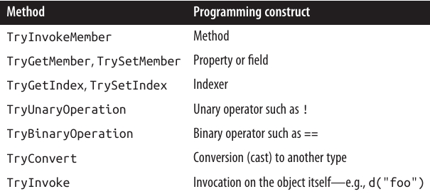

<div dir="rtl">

# فصل نوزدهم:  برنامه‌نویسی پویا (Dynamic Programming)

فصل ۴ توضیح داد که **dynamic binding** در زبان C# چگونه کار می‌کند.
در این فصل، ابتدا به‌طور مختصر به **Dynamic Language Runtime (DLR)** می‌پردازیم و سپس الگوهای زیر در برنامه‌نویسی پویا را بررسی می‌کنیم:

* **Dynamic member overload resolution**
* **Custom binding (implementing dynamic objects)**
* **Dynamic language interoperability**

در فصل ۲۴، توضیح می‌دهیم که **dynamic** چگونه می‌تواند **COM interoperability** را بهبود دهد.

انواع (types) معرفی‌شده در این فصل، در **System.Dynamic namespace** قرار دارند، به‌جز **CallSite<>** که در **System.Runtime.CompilerServices** تعریف شده است.

---

### 🌀 Dynamic Language Runtime

زبان C# برای انجام **dynamic binding** به **DLR** متکی است.

برخلاف نامش، **DLR** یک نسخه‌ی پویا از **CLR** نیست. بلکه یک **کتابخانه (library)** است که روی **CLR** قرار می‌گیرد—دقیقاً مانند هر کتابخانه‌ی دیگری مثل **System.Xml.dll**.

وظیفه‌ی اصلی DLR ارائه‌ی سرویس‌های زمان اجرا (runtime services) برای یکپارچه‌سازی برنامه‌نویسی پویا—چه در زبان‌های **statically typed** و چه **dynamically typed**—است. بنابراین، زبان‌هایی مانند:

* C#
* Visual Basic
* IronPython
* IronRuby

همگی از یک پروتکل یکسان برای **dynamic function calls** استفاده می‌کنند. این موضوع باعث می‌شود آن‌ها بتوانند کتابخانه‌ها را به اشتراک بگذارند و کدی را که به زبان دیگری نوشته شده اجرا کنند.

DLR همچنین نوشتن زبان‌های پویا جدید در **.NET** را نسبتاً آسان می‌کند. به‌جای آنکه نویسندگان زبان مجبور باشند مستقیم **Intermediate Language (IL)** تولید کنند، می‌توانند در سطح **expression trees** کار کنند (همان **expression trees** موجود در **System.Linq.Expressions** که در فصل ۸ درباره‌شان صحبت کردیم).

علاوه بر این، DLR تضمین می‌کند که همه‌ی مصرف‌کنندگان از مزیت **call-site caching** بهره‌مند شوند؛ یک بهینه‌سازی که از تکرار غیرضروری تصمیمات پرهزینه‌ی **member resolution** در طول dynamic binding جلوگیری می‌کند.

---

### ❓ Call Site چیست؟

وقتی کامپایلر با یک **dynamic expression** روبه‌رو می‌شود، نمی‌داند چه کسی آن عبارت را در زمان اجرا ارزیابی خواهد کرد.

مثلاً متد زیر را در نظر بگیرید:

```csharp
public dynamic Foo (dynamic x, dynamic y)
{
  return x / y;   // Dynamic expression
}
```

متغیرهای `x` و `y` می‌توانند هر چیزی باشند:

* یک شیء **CLR**
* یک شیء **COM**
* یا حتی یک شیء در یک زبان پویا

به همین دلیل، کامپایلر نمی‌تواند از روش معمول استاتیک خود (یعنی صدا زدن یک متد مشخص از یک نوع مشخص) استفاده کند.
در عوض، کامپایلر کدی تولید می‌کند که در نهایت یک **expression tree** می‌سازد؛ این **expression tree** عملیاتی را توصیف می‌کند که توسط یک **call site** مدیریت می‌شود و **DLR** آن را در زمان اجرا bind می‌کند.
درواقع، **call site** مانند یک واسطه (intermediary) بین **caller** و **callee** عمل می‌کند.

یک **call site** توسط کلاس **CallSite<>** در **System.Core.dll** نمایش داده می‌شود.
با **disassemble** کردن متد قبلی، نتیجه تقریباً به‌شکل زیر خواهد بود:

```csharp
static CallSite<Func<CallSite,object,object,object>> divideSite;

[return: Dynamic]
public object Foo ([Dynamic] object x, [Dynamic] object y)
{
  if (divideSite == null)
    divideSite =
      CallSite<Func<CallSite,object,object,object>>.Create (
        Microsoft.CSharp.RuntimeBinder.Binder.BinaryOperation (
          CSharpBinderFlags.None,
          ExpressionType.Divide,
          /* Remaining arguments omitted for brevity */ ));

  return divideSite.Target (divideSite, x, y);
}
```

همان‌طور که می‌بینید، **call site** در یک **static field** ذخیره می‌شود تا هزینه‌ی ساخت مجدد آن در هر بار فراخوانی اجتناب شود.
همچنین، DLR نتیجه‌ی **binding phase** و **method targets** واقعی را cache می‌کند. (ممکن است چندین target بسته به نوع‌های `x` و `y` وجود داشته باشد.)

فراخوانی پویا (dynamic call) در عمل با صدا زدن **Target** (که یک **delegate** است) انجام می‌شود و عملوندهای `x` و `y` به آن پاس داده می‌شوند.

نکته‌ی مهم: کلاس **Binder** مخصوص هر زبان است.
هر زبانی که از **dynamic binding** پشتیبانی می‌کند، یک **language-specific binder** دارد تا به DLR کمک کند عبارات را مطابق منطق آن زبان تفسیر کند و رفتار غیرمنتظره برای برنامه‌نویس ایجاد نشود.

مثلاً اگر متد `Foo` را با مقادیر عددی `5` و `2` صدا بزنیم:

* **C# binder** نتیجه‌ی `2` را برمی‌گرداند.
* اما **VB.NET binder** نتیجه‌ی `2.5` را خواهد داد.

---

### ⚡ Dynamic Member Overload Resolution

فراخوانی یک متد **statically known** با آرگومان‌های **dynamically typed** باعث می‌شود که **member overload resolution** از زمان کامپایل به زمان اجرا منتقل شود.

این ویژگی برای ساده‌سازی برخی وظایف برنامه‌نویسی مفید است—مثل ساده‌تر کردن **Visitor design pattern**.
همچنین در دور زدن محدودیت‌های اعمال‌شده توسط **static typing** در C# بسیار کاربرد دارد.


### 🎯 ساده‌سازی الگوی Visitor

به‌طور خلاصه، **Visitor pattern** این امکان را می‌دهد که بدون تغییر در کلاس‌های موجود، یک متد به یک سلسله‌مراتب کلاسی (class hierarchy) “اضافه” کنید.

اگرچه این الگو مفید است، اما نسخه‌ی **استاتیک** آن در مقایسه با بسیاری از الگوهای طراحی دیگر، ظریف و غیرمستقیم است. همچنین، این الگو نیاز دارد که کلاس‌هایی که قرار است بازدید شوند، “visitor-friendly” باشند؛ یعنی یک متد **Accept** را در اختیار قرار دهند. این موضوع زمانی غیرممکن است که کلاس‌ها تحت کنترل شما نباشند.

با استفاده از **dynamic binding** می‌توانید به همان هدف دست پیدا کنید—اما بسیار ساده‌تر و بدون نیاز به تغییر کلاس‌های موجود.

برای روشن شدن موضوع، به سلسله‌مراتب کلاس زیر دقت کنید:

```csharp
class Person
{
  public string FirstName { get; set; }
  public string LastName  { get; set; }
  // مجموعه Friends می‌تواند شامل Customers و Employees باشد:
  public readonly IList<Person> Friends = new Collection<Person> ();
}

class Customer : Person { public decimal CreditLimit { get; set; } }

class Employee : Person { public decimal Salary { get; set; } }
```

فرض کنید می‌خواهیم متدی بنویسیم که جزئیات یک **Person** را به‌صورت برنامه‌نویسی به یک **XElement** در XML صادر کند.
واضح‌ترین راه این است که در کلاس **Person** یک متد مجازی (virtual) به نام **ToXElement()** تعریف کنیم که یک **XElement** شامل propertyهای یک **Person** برگرداند.
سپس در کلاس‌های **Customer** و **Employee** آن را override کنیم تا **XElement** به ترتیب شامل **CreditLimit** و **Salary** هم باشد.

اما این الگو می‌تواند از دو جهت مشکل‌ساز باشد:

1. ممکن است مالک کلاس‌های **Person**، **Customer** و **Employee** نباشید و بنابراین نتوانید به آن‌ها متدی اضافه کنید. (و extension methodها هم رفتار polymorphic ارائه نمی‌دهند.)
2. کلاس‌های **Person**، **Customer** و **Employee** ممکن است همین حالا هم خیلی بزرگ باشند. یک **antipattern** رایج، **God Object** است؛ جایی که یک کلاسی مثل **Person** آنقدر عملکردهای مختلف به خود می‌گیرد که نگهداری آن کابوس‌وار می‌شود. یک راه‌حل خوب این است که از افزودن توابعی به **Person** که نیازی به دسترسی به وضعیت خصوصی آن ندارند، پرهیز کنیم. متد **ToXElement** می‌تواند یک کاندید عالی برای بیرون کشیده شدن باشد.

با استفاده از **dynamic member overload resolution** می‌توانیم قابلیت **ToXElement** را در یک کلاس جداگانه پیاده‌سازی کنیم، بدون آنکه مجبور شویم از switchهای زشت بر اساس نوع استفاده کنیم:

```csharp
class ToXElementPersonVisitor
{
  public XElement DynamicVisit (Person p) => Visit ((dynamic)p);

  XElement Visit (Person p)
  {
    return new XElement ("Person",
      new XAttribute ("Type", p.GetType().Name),
      new XElement ("FirstName", p.FirstName),
      new XElement ("LastName", p.LastName),
      p.Friends.Select (f => DynamicVisit (f))
    );
  }

  XElement Visit (Customer c)   // منطق اختصاصی برای Customer
  {
    XElement xe = Visit ((Person)c);   // صدا زدن متد "base"
    xe.Add (new XElement ("CreditLimit", c.CreditLimit));
    return xe;
  }

  XElement Visit (Employee e)   // منطق اختصاصی برای Employee
  {
    XElement xe = Visit ((Person)e);   // صدا زدن متد "base"
    xe.Add (new XElement ("Salary", e.Salary));
    return xe;
  }
}
```

متد **DynamicVisit** یک **dynamic dispatch** انجام می‌دهد—یعنی در زمان اجرا، دقیق‌ترین نسخه‌ی متد **Visit** را فراخوانی می‌کند.

به خطی که در آن متد **DynamicVisit** روی هر **Person** در مجموعه‌ی **Friends** صدا زده می‌شود توجه کنید. این تضمین می‌کند که اگر یک دوست از نوع **Customer** یا **Employee** باشد، overload صحیح فراخوانی شود.

---

### 📌 مثال اجرا

```csharp
var cust = new Customer
{
  FirstName = "Joe", LastName = "Bloggs", CreditLimit = 123
};

cust.Friends.Add (
  new Employee { FirstName = "Sue", LastName = "Brown", Salary = 50000 }
);

Console.WriteLine (new ToXElementPersonVisitor().DynamicVisit (cust));
```

---

### 📤 خروجی

```xml
<Person Type="Customer">
  <FirstName>Joe</FirstName>
  <LastName>Bloggs</LastName>
  <Person Type="Employee">
    <FirstName>Sue</FirstName>
    <LastName>Brown</LastName>
    <Salary>50000</Salary>
  </Person>
  <CreditLimit>123</CreditLimit>
</Person>
```

### 🔀 گونه‌ها (Variations)

اگر قصد داشته باشید بیش از یک کلاس Visitor بنویسید، یک تغییر مفید این است که یک کلاس پایه‌ی انتزاعی (**abstract base class**) برای Visitorها تعریف کنید:

```csharp
abstract class PersonVisitor<T>
{
  public T DynamicVisit (Person p) { return Visit ((dynamic)p); }

  protected abstract T Visit (Person p);
  protected virtual T Visit (Customer c) { return Visit ((Person) c); }
  protected virtual T Visit (Employee e) { return Visit ((Person) e); }
}
```

در این حالت، کلاس‌های فرزند نیازی ندارند که متد **DynamicVisit** خودشان را تعریف کنند؛ تنها کاری که باید انجام دهند این است که نسخه‌های **Visit** را که می‌خواهند منطق اختصاصی برایشان بنویسند، override کنند.

این روش دو مزیت دارد:

1. متمرکز کردن متدهایی که سلسله‌مراتب **Person** را در بر می‌گیرند.
2. اجازه دادن به پیاده‌سازان برای صدا زدن متدهای پایه (base methods) به شکلی طبیعی‌تر.

نمونه:

```csharp
class ToXElementPersonVisitor : PersonVisitor<XElement>
{
  protected override XElement Visit (Person p)
  {
    return new XElement ("Person",
      new XAttribute ("Type", p.GetType().Name),
      new XElement ("FirstName", p.FirstName),
      new XElement ("LastName", p.LastName),
      p.Friends.Select (f => DynamicVisit (f))
    );
  }

  protected override XElement Visit (Customer c)
  {
    XElement xe = base.Visit (c);
    xe.Add (new XElement ("CreditLimit", c.CreditLimit));
    return xe;
  }

  protected override XElement Visit (Employee e)
  {
    XElement xe = base.Visit (e);
    xe.Add (new XElement ("Salary", e.Salary));
    return xe;
  }
}
```

حتی می‌توانید از روی **ToXElementPersonVisitor** هم کلاس فرزند بسازید.

---

### 📌 صدا زدن ناشناس اعضای یک نوع Generic

سخت‌گیری **static typing** در C# یک شمشیر دو لبه است:

* از یک طرف در زمان کامپایل میزان مشخصی از صحت را تضمین می‌کند.
* از طرف دیگر، گاهی اوقات نوشتن برخی از انواع کد را دشوار یا غیرممکن می‌سازد، و در این مواقع باید از **reflection** استفاده کنید.

در چنین شرایطی، **dynamic binding** یک جایگزین تمیزتر و سریع‌تر از reflection است.

مثال: وقتی نیاز دارید با یک شیء از نوع `G<T>` کار کنید در حالی که نوع `T` ناشناخته است.

```csharp
public class Foo<T> { public T Value; }
```

فرض کنید متدی به شکل زیر داریم:

```csharp
static void Write (object obj)
{
  if (obj is Foo<>)                           // Illegal
    Console.WriteLine ((Foo<>) obj).Value);   // Illegal
}
```

این کد کامپایل نمی‌شود: چون نمی‌توانید اعضای یک نوع generic غیرمتحد (unbound) را فراخوانی کنید.

---

### ✨ راه‌حل با dynamic binding

راه اول این است که **Value** را به‌صورت پویا (dynamic) صدا بزنید:

```csharp
static void Write (dynamic obj)
{
  try { Console.WriteLine (obj.Value); }
  catch (Microsoft.CSharp.RuntimeBinder.RuntimeBinderException) {...}
}
```

---

### 🐾 Multiple Dispatch

زبان C# و CLR همیشه یک شکل محدود از پویایی را با **virtual method calls** پشتیبانی کرده‌اند.
تفاوت آن با **dynamic binding** در این است که در **virtual calls**، کامپایلر باید در زمان کامپایل متعهد شود که کدام عضو مجازی صدا زده خواهد شد (بر اساس نام و امضای متدی که فراخوانی شده است).

به این معنی که:

* عبارت فراخوانی باید کاملاً توسط کامپایلر درک شود (مثلاً باید در زمان کامپایل مشخص شود که آیا یک عضو هدف یک **field** است یا یک **property**).
* **Overload resolution** باید کاملاً توسط کامپایلر و بر اساس نوع‌های زمان کامپایل آرگومان‌ها انجام شود.

مثال:

```csharp
animal.Walk (owner);
```

نتیجه: توانایی انجام **virtual calls** به نام **single dispatch** شناخته می‌شود. چرا؟

چون تصمیم زمان اجرا برای اینکه متد **Walk** سگ صدا زده شود یا متد **Walk** گربه، فقط به نوع دریافت‌کننده (**receiver type**)، یعنی `animal` بستگی دارد (به همین دلیل "single").

اگر چندین overload از **Walk** وجود داشته باشد که انواع مختلفی از `owner` را بپذیرند، انتخاب آن‌ها در زمان کامپایل و بدون توجه به نوع واقعی `owner` انجام می‌شود.

---

### 💡 Dynamic Multiple Dispatch

در مقابل، یک فراخوانی پویا (dynamic call) انتخاب overload را تا زمان اجرا به تأخیر می‌اندازد:

```csharp
animal.Walk ((dynamic) owner);
```

این بار انتخاب نهایی اینکه کدام متد **Walk** فراخوانی شود به نوع‌های هر دو یعنی `animal` و `owner` بستگی دارد.
به همین دلیل به آن **multiple dispatch** می‌گویند: چون نوع‌های زمان اجرا (**runtime types**) آرگومان‌ها علاوه بر **receiver type**، در تصمیم‌گیری دخالت دارند.

---

### ⚠️ مشکلات و راه‌حل بهتر

روش قبلی این مزیت را دارد که با هر شیئی که یک **Value field** یا **Value property** داشته باشد کار می‌کند.
اما مشکلاتی هم دارد:

1. گرفتن **exception** در این روش شلوغ و ناکارآمد است (و هیچ راهی نیست که از قبل از DLR بپرسیم "آیا این عملیات موفق خواهد شد؟").
2. اگر **Foo** یک **interface** مثل `IFoo<T>` باشد و یکی از شرایط زیر برقرار باشد، این روش کار نمی‌کند:

   * **Value** به‌صورت **explicitly implemented** تعریف شده باشد.
   * نوعی که **IFoo<T>** را پیاده‌سازی کرده، غیرقابل دسترسی باشد.

---

### ✅ راه‌حل بهتر: متد کمکی overload شده

```csharp
static void Write (dynamic obj)
{
  object result = GetFooValue (obj);
  if (result != null) Console.WriteLine (result);
}

static T GetFooValue<T> (Foo<T> foo) => foo.Value;
static object GetFooValue (object foo) => null;
```

اینجا ما متد **GetFooValue** را overload کردیم تا یک پارامتر از نوع `object` هم بگیرد، که نقش fallback را دارد.

در زمان اجرا، **C# dynamic binder** بهترین overload را انتخاب می‌کند. اگر شیء داده‌شده از نوع `Foo<T>` نباشد، نسخه‌ی **object-parameter** انتخاب می‌شود و به‌جای پرتاب exception مقدار null برمی‌گرداند.

---

### 🆚 گزینه‌ی دیگر

فقط overload اول را بنویسیم و سپس **RuntimeBinderException** را catch کنیم.

* **مزیت**: می‌توانیم تمایز قائل شویم بین زمانی که `foo.Value` واقعاً null است یا اصلاً وجود ندارد.
* **عیب**: هزینه‌ی کارایی به‌خاطر پرتاب و گرفتن exception.

---

### 🔎 مثال: ToStringEx با dynamic binding

در فصل ۱۸، همین مشکل را برای یک interface با استفاده از reflection حل کردیم (که تلاش بیشتری نیاز داشت).
مثال ما طراحی نسخه‌ی قدرتمندتری از **ToString()** بود که می‌توانست اشیائی مانند **IEnumerable** و **IGrouping<,>** را درک کند.

اینجا همان مثال با dynamic binding، اما زیباتر:

```csharp
static string GetGroupKey<TKey,TElement> (IGrouping<TKey,TElement> group)
  => "Group with key=" + group.Key + ": ";

static string GetGroupKey (object source) => null;

public static string ToStringEx (object value)
{
  if (value == null) return "<null>";
  if (value is string s) return s;
  if (value.GetType().IsPrimitive) return value.ToString();

  StringBuilder sb = new StringBuilder();
  string groupKey = GetGroupKey ((dynamic)value);   // Dynamic dispatch
  if (groupKey != null) sb.Append (groupKey);

  if (value is IEnumerable)
    foreach (object element in ((IEnumerable)value))
      sb.Append (ToStringEx (element) + " ");

  if (sb.Length == 0) sb.Append (value.ToString());
  return "\r\n" + sb.ToString();
}
```

---

### ▶️ اجرای کد

```csharp
Console.WriteLine (ToStringEx ("xyyzzz".GroupBy (c => c) ));
```

🔽 خروجی:

```
Group with key=x: x
Group with key=y: y y
Group with key=z: z z z
```

---

در اینجا از **dynamic member overload resolution** برای حل مسئله استفاده کردیم.

اگر به‌جای آن، چنین کاری می‌کردیم:

```csharp
dynamic d = value;
try { groupKey = d.Value; }
catch (Microsoft.CSharp.RuntimeBinder.RuntimeBinderException) {...}
```

این روش شکست می‌خورد. چرا؟ چون عملگر **GroupBy** در LINQ یک نوعی را برمی‌گرداند که **IGrouping<,>** را پیاده‌سازی می‌کند و خودش **internal** است:

```csharp
internal class Grouping : IGrouping<TKey,TElement>, ...
{
  public TKey Key;
  ...
}
```

حتی اگر property **Key** به‌صورت public تعریف شده باشد، کلاس حاوی آن **internal** است و بنابراین فقط از طریق **IGrouping<,>** قابل دسترسی است.
و همان‌طور که در فصل ۴ توضیح دادیم، هیچ راهی وجود ندارد که به DLR بگوییم هنگام صدا زدن dynamic member، به آن interface bind شود.

### پیاده‌سازی اشیای پویا 🦆✨

یک شیء می‌تواند با پیاده‌سازی **IDynamicMetaObjectProvider** معناشناسی (binding semantics) خودش را فراهم کند—یا راحت‌تر از آن، با ارث‌بری از کلاس **DynamicObject**، که یک پیاده‌سازی پیش‌فرض از این اینترفیس ارائه می‌دهد.

این موضوع به‌طور مختصر در فصل ۴ با مثال زیر نشان داده شده است:

```csharp
dynamic d = new Duck();
d.Quack();                  // متد Quack فراخوانی شد
d.Waddle();                 // متد Waddle فراخوانی شد

public class Duck : DynamicObject
{
  public override bool TryInvokeMember(
    InvokeMemberBinder binder, object[] args, out object result)
  {
    Console.WriteLine (binder.Name + " method was called");
    result = null;
    return true;
  }
}
```

---

### DynamicObject 🛠️

در مثال بالا، ما متد **TryInvokeMember** را بازنویسی (override) کردیم، که به مصرف‌کننده اجازه می‌دهد روی شیء پویا (dynamic object) یک متد فراخوانی کند—مثل **Quack** یا **Waddle**.

کلاس **DynamicObject** متدهای مجازی (virtual methods) دیگری هم در اختیار قرار می‌دهد که به مصرف‌کننده اجازه می‌دهند از دیگر ساختارهای برنامه‌نویسی استفاده کند. موارد زیر متناظر با ساختارهایی هستند که در زبان C# نمایش دارند:

<div align="center">
    
 
</div>

### متدهای پویا در DynamicObject ⚡

این متدها باید در صورت موفقیت، مقدار **true** برگردانند. اگر مقدار **false** برگردانده شود، **DLR** (Dynamic Language Runtime) به binder زبان برمی‌گردد تا به‌دنبال عضوی هم‌نام در خود شیء پویا (زیرکلاس DynamicObject) بگردد. اگر این کار هم شکست بخورد، یک استثنای **RuntimeBinderException** پرتاب خواهد شد. 🚨

---

### نمونه با `TryGetMember` و `TrySetMember` 📝

در مثال زیر، کلاسی ساخته‌ایم که به ما امکان می‌دهد به‌صورت پویا به attributeها در یک **XElement (System.Xml.Linq)** دسترسی پیدا کنیم:

```csharp
static class XExtensions
{
  public static dynamic DynamicAttributes (this XElement e)
    => new XWrapper (e);

  class XWrapper : DynamicObject
  {
    XElement _element;
    public XWrapper (XElement e) { _element = e; }

    public override bool TryGetMember (GetMemberBinder binder,
                                       out object result)
    {
      result = _element.Attribute (binder.Name).Value;
      return true;
    }

    public override bool TrySetMember (SetMemberBinder binder,
                                       object value)
    {
      _element.SetAttributeValue (binder.Name, value);
      return true;
    }
  }
}
```

📌 نحوه‌ی استفاده:

```csharp
XElement x = XElement.Parse (@"<Label Text=""Hello"" Id=""5""/>");
dynamic da = x.DynamicAttributes();

Console.WriteLine (da.Id);        // 5
da.Text = "Foo";
Console.WriteLine (x.ToString()); // <Label Text="Foo" Id="5" />
```

---

### نمونه با `System.Data.IDataRecord` 📊

در مثال بعدی، برای ساده‌تر کردن کار با **data reader**‌ها، از DynamicObject استفاده شده است:

```csharp
public class DynamicReader : DynamicObject
{
  readonly IDataRecord _dataRecord;
  public DynamicReader (IDataRecord dr) { _dataRecord = dr; }

  public override bool TryGetMember (GetMemberBinder binder,
                                     out object result)
  {
    result = _dataRecord[binder.Name];
    return true;
  }
}
...
using (IDataReader reader = someDbCommand.ExecuteReader())
{
  dynamic dr = new DynamicReader (reader);
  while (reader.Read())
  {
    int id = dr.ID;
    string firstName = dr.FirstName;
    DateTime dob = dr.DateOfBirth;
    ...
  }
}
```

---

### نمونه با `TryBinaryOperation` و `TryInvoke` ➕🔔

```csharp
dynamic d = new Duck();
Console.WriteLine (d + d);       // foo
Console.WriteLine (d (78, 'x')); // 123

public class Duck : DynamicObject
{
  public override bool TryBinaryOperation (BinaryOperationBinder binder,
                                           object arg, out object result)
  {
    Console.WriteLine (binder.Operation);   // Add
    result = "foo";
    return true;
  }

  public override bool TryInvoke (InvokeBinder binder,
                                  object[] args, out object result)
  {
    Console.WriteLine (args[0]); // 78
    result = 123;
    return true;
  }
}
```

---

### متدهای تکمیلی برای زبان‌های پویا 🌐

کلاس **DynamicObject** همچنین چند متد مجازی دیگر را برای راحتی زبان‌های پویا فراهم می‌کند.

🔹 به‌طور خاص، بازنویسی متد **GetDynamicMemberNames** این امکان را می‌دهد که لیستی از تمام نام اعضایی که شیء پویا ارائه می‌دهد، برگردانده شود.

🔹 دلیل دیگر برای پیاده‌سازی **GetDynamicMemberNames** این است که **دیباگر Visual Studio** از این متد استفاده می‌کند تا نمایی از یک شیء پویا را نمایش دهد. 🖥️

### ExpandoObject 🪄

یک کاربرد ساده دیگر از **DynamicObject** می‌تواند این باشد که یک کلاس پویا بنویسیم که اشیاء را در یک **Dictionary** ذخیره و بازیابی کند (کلیدها از نوع string). اما این قابلیت از قبل توسط کلاس **ExpandoObject** فراهم شده است:

```csharp
dynamic x = new ExpandoObject();
x.FavoriteColor = ConsoleColor.Green;
x.FavoriteNumber = 7;

Console.WriteLine (x.FavoriteColor);   // Green
Console.WriteLine (x.FavoriteNumber);  // 7
```

🔑 در واقع، **ExpandoObject** اینترفیس **IDictionary\<string, object>** را پیاده‌سازی می‌کند. بنابراین می‌توانیم مثال بالا را این‌طور ادامه دهیم:

```csharp
var dict = (IDictionary<string,object>) x;
Console.WriteLine (dict["FavoriteColor"]);   // Green
Console.WriteLine (dict["FavoriteNumber"]);  // 7
Console.WriteLine (dict.Count);              // 2
```

---

### تعامل با زبان‌های پویا 🌍

اگرچه C# از طریق کلمه کلیدی **dynamic** از **dynamic binding** پشتیبانی می‌کند، اما اجازه نمی‌دهد یک عبارت ذخیره‌شده به شکل رشته (string) را در زمان اجرا مستقیماً اجرا کنید:

```csharp
string expr = "2 * 3";
// نمی‌توانیم expr را اجرا کنیم
```

علت این است که ترجمه‌ی یک رشته به یک **expression tree** نیازمند یک **lexical parser** و **semantic parser** است که در کامپایلر C# وجود دارند، اما به‌صورت سرویس در زمان اجرا در دسترس نیستند. در زمان اجرا، C# فقط یک **binder** فراهم می‌کند که به **DLR** می‌گوید چگونه یک expression tree از قبل ساخته‌شده را تفسیر کند.

👨‍💻 در زبان‌های واقعاً پویا مثل **IronPython** و **IronRuby**، می‌توان رشته‌ها را به‌صورت مستقیم اجرا کرد. این موضوع برای کارهایی مثل **اسکریپت‌نویسی**، ساخت **سیستم‌های پیکربندی پویا**، و پیاده‌سازی **rules engine** بسیار مفید است. بنابراین، اگرچه می‌توانید بیشتر برنامه را در C# بنویسید، اما ممکن است برای برخی وظایف خاص، به استفاده از یک زبان پویا نیاز داشته باشید.

همچنین گاهی ممکن است بخواهید از **API**ای استفاده کنید که در یک زبان پویا نوشته شده و معادل آن در **.NET** وجود ندارد.

---

### اجرای کد C# به شکل رشته با Roslyn 🧩

پکیج **Microsoft.CodeAnalysis.CSharp.Scripting** (از مجموعه Roslyn) این قابلیت را فراهم می‌کند که یک رشته C# را اجرا کنید. البته این کار با **کامپایل** رشته به یک برنامه انجام می‌شود، بنابراین سربار عملکردی بیشتری نسبت به زبان‌هایی مثل Python دارد (مگر اینکه همان عبارت بارها تکراراً اجرا شود).

---

### مثال با IronPython 🐍

در مثال زیر، از **IronPython** برای ارزیابی یک عبارت در زمان اجرا از درون C# استفاده می‌کنیم. می‌توان از این روش برای ساخت یک ماشین حساب ساده بهره برد.

📌 برای اجرای این کد، باید پکیج‌های **DynamicLanguageRuntime** (توجه کنید با System.Dynamic.Runtime فرق دارد) و **IronPython** را نصب کنید.

```csharp
using System;
using IronPython.Hosting;
using Microsoft.Scripting;
using Microsoft.Scripting.Hosting;

int result = (int) Calculate ("2 * 3");
Console.WriteLine (result);  // 6

object Calculate (string expression)
{
  ScriptEngine engine = Python.CreateEngine();
  return engine.Execute (expression);
}
```

✅ توجه کنید: چون رشته به **Python** پاس داده می‌شود، عبارت بر اساس قوانین Python ارزیابی خواهد شد، نه C#.

برای مثال، می‌توان از امکانات زبان Python مثل **لیست‌ها** استفاده کرد:

```csharp
var list = (IEnumerable) Calculate ("[1, 2, 3] + [4, 5]");
foreach (int n in list) Console.Write (n);  // 12345
```

---

### عبور وضعیت بین C# و اسکریپت 🔄

برای انتقال متغیرها از C# به Python، مراحل بیشتری نیاز است. مثال زیر این موضوع را نشان می‌دهد و می‌تواند پایه‌ای برای یک **rules engine** باشد:

```csharp
// این رشته می‌تواند از یک فایل یا دیتابیس بیاید:
string auditRule = "taxPaidLastYear / taxPaidThisYear > 2";

ScriptEngine engine = Python.CreateEngine();    
ScriptScope scope = engine.CreateScope();       

scope.SetVariable ("taxPaidLastYear", 20000m);
scope.SetVariable ("taxPaidThisYear", 8000m);

ScriptSource source = engine.CreateScriptSourceFromString (
                      auditRule, SourceCodeKind.Expression);

bool auditRequired = (bool) source.Execute (scope);
Console.WriteLine (auditRequired);   // True
```

📥 همچنین می‌توانید متغیرها را از اسکریپت به C# برگردانید:

```csharp
string code = "result = input * 3";

ScriptEngine engine = Python.CreateEngine();
ScriptScope scope = engine.CreateScope();
scope.SetVariable ("input", 2);

ScriptSource source = engine.CreateScriptSourceFromString (
                      code, SourceCodeKind.SingleStatement);

source.Execute (scope);

Console.WriteLine (scope.GetVariable ("result"));   // 6
```

در این مثال دوم، از **SourceCodeKind.SingleStatement** به‌جای **Expression** استفاده کردیم تا به موتور بگوییم قصد اجرای یک **statement** را داریم.

---

### تبادل انواع بین C# و Python 🔗

🔹 نوع‌ها به‌طور خودکار بین دنیای **.NET** و **Python** منتقل (marshal) می‌شوند.
🔹 حتی می‌توانید اعضای یک شیء .NET را از سمت اسکریپت فراخوانی کنید:

```csharp
string code = @"sb.Append (""World"")";

ScriptEngine engine = Python.CreateEngine();
ScriptScope scope = engine.CreateScope();

var sb = new StringBuilder ("Hello");
scope.SetVariable ("sb", sb);

ScriptSource source = engine.CreateScriptSourceFromString (
                      code, SourceCodeKind.SingleStatement);

source.Execute (scope);

Console.WriteLine (sb.ToString());   // HelloWorld
```


</dir>