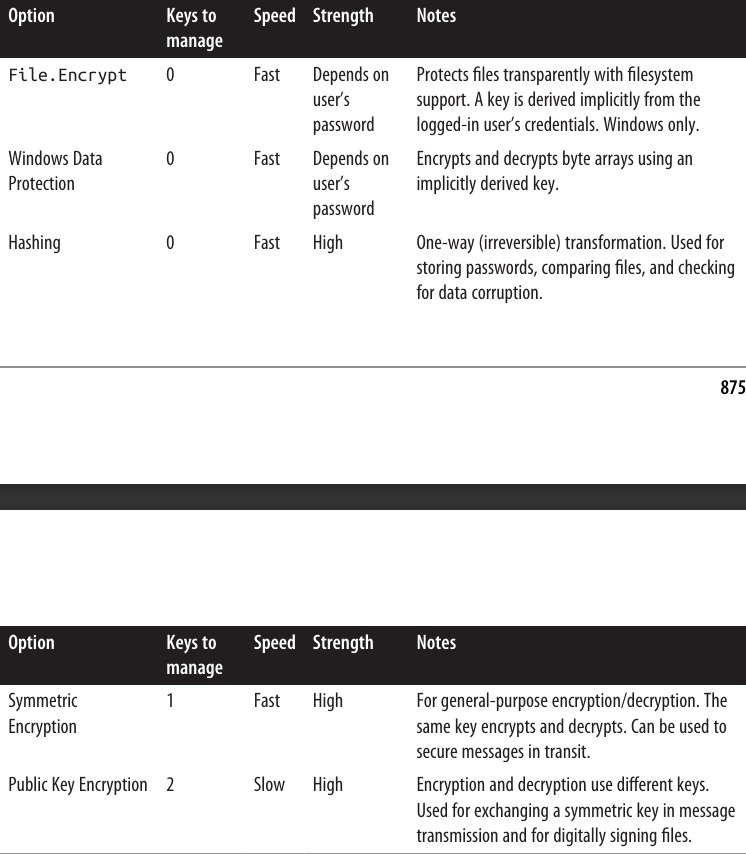

# فصل بیستم:  رمزنگاری

در این فصل، ما به بررسی APIهای اصلی **Cryptography** در .NET می‌پردازیم:

* **Windows Data Protection API (DPAPI)**
* **Hashing**
* **Symmetric encryption**
* **Public key encryption and signing**

انواع (Types) پوشش داده شده در این فصل در **namespace**های زیر تعریف شده‌اند:

```
System.Security;
System.Security.Cryptography;
```

---

### مروری کلی 📑

جدول **۲۰-۱** خلاصه‌ای از گزینه‌های **Cryptography** در .NET را نشان می‌دهد. در بخش‌های بعدی، هر یک از این موارد را به تفصیل بررسی خواهیم کرد.

 <div align="center">
    
 
</div>

