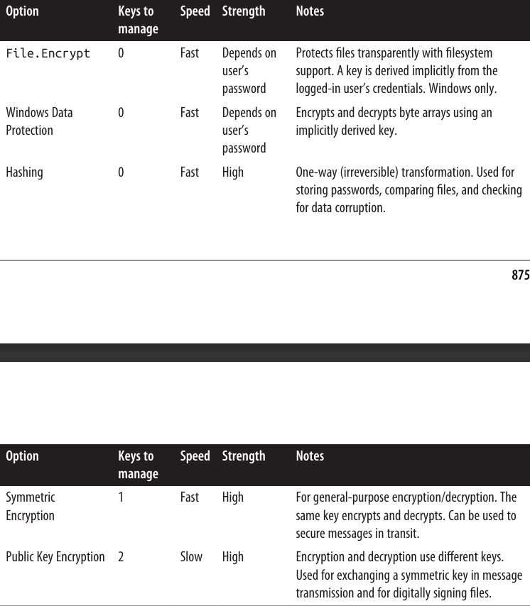
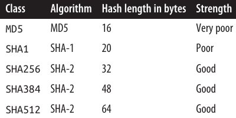
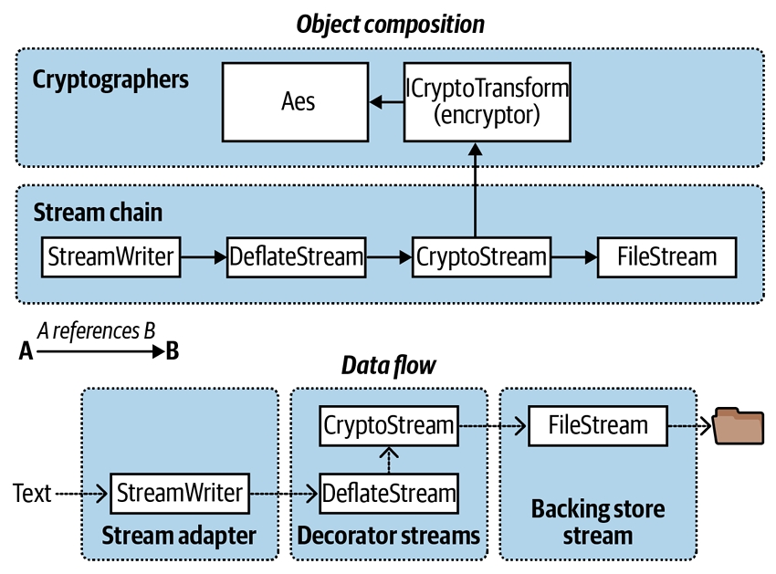

<div dir="rtl">

# فصل بیستم:  رمزنگاری

در این فصل، ما به بررسی APIهای اصلی **Cryptography** در .NET می‌پردازیم:

* **Windows Data Protection API (DPAPI)**
* **Hashing**
* **Symmetric encryption**
* **Public key encryption and signing**

انواع (Types) پوشش داده شده در این فصل در **namespace**های زیر تعریف شده‌اند:
</div>

```
System.Security;
System.Security.Cryptography;
```

<div dir="rtl">

---

### مروری کلی 📑

جدول **۲۰-۱** خلاصه‌ای از گزینه‌های **Cryptography** در .NET را نشان می‌دهد. در بخش‌های بعدی، هر یک از این موارد را به تفصیل بررسی خواهیم کرد.

 <div align="center">
    
 
</div>

### پشتیبانی‌های ویژه‌تر در .NET ✨

.NET همچنین پشتیبانی‌های تخصصی‌تری برای **ایجاد و اعتبارسنجی امضاهای مبتنی بر XML** در `System.Security.Cryptography.Xml` و همچنین **انواع (Types) مرتبط با کار با گواهی‌های دیجیتال** در `System.Security.Cryptography.X509Certificates` ارائه می‌دهد.

---

### Windows Data Protection 🪟🔐

ویژگی **Windows Data Protection** فقط روی ویندوز در دسترس است و در سیستم‌عامل‌های دیگر یک استثناء از نوع `PlatformNotSupportedException` ایجاد می‌کند.

در بخش **“File and Directory Operations”** در صفحه ۷۲۳ توضیح دادیم که چگونه می‌توانید از `File.Encrypt` برای درخواست رمزنگاری شفاف (transparent) فایل توسط سیستم‌عامل استفاده کنید:
</div>

```csharp
File.WriteAllText ("myfile.txt", "");
File.Encrypt ("myfile.txt");
File.AppendAllText ("myfile.txt", "sensitive data");
```

<div dir="rtl">

🔑 در این حالت، رمزنگاری از کلیدی استفاده می‌کند که از **رمز عبور کاربر لاگین‌شده** استخراج شده است. شما می‌توانید همین کلید استخراج‌شده ضمنی را برای رمزنگاری یک **آرایه‌ی بایت** با استفاده از **Windows Data Protection API (DPAPI)** به‌کار بگیرید.

DPAPI از طریق کلاس `ProtectedData` در دسترس قرار گرفته است؛ کلاسی ساده با دو متد **static**:
</div>

```csharp
public static byte[] Protect
 (byte[] userData, byte[] optionalEntropy, DataProtectionScope scope);

public static byte[] Unprotect
 (byte[] encryptedData, byte[] optionalEntropy, DataProtectionScope scope);
```

<div dir="rtl">

🔒 هر چیزی که در `optionalEntropy` قرار دهید به کلید اضافه می‌شود و امنیت آن را افزایش می‌دهد.
پارامتر `DataProtectionScope` دو گزینه دارد:

* **CurrentUser** → کلید از اطلاعات کاربری (credentials) کاربر فعلی استخراج می‌شود.
* **LocalMachine** → یک کلید در سطح کل سیستم (machine-wide) استفاده می‌شود که بین همه کاربران مشترک است.

➡️ این یعنی اگر **CurrentUser** انتخاب شود، داده‌های رمزنگاری‌شده توسط یک کاربر قابل رمزگشایی توسط کاربر دیگر نخواهند بود. در حالی‌که کلید **LocalMachine** امنیت کمتری دارد، اما برای سرویس‌های ویندوز یا برنامه‌هایی که باید تحت حساب‌های مختلف کار کنند، مناسب است.

---

### نمونه‌ای ساده از رمزنگاری و رمزگشایی 🧩
</div>

```csharp
byte[] original = {1, 2, 3, 4, 5};
DataProtectionScope scope = DataProtectionScope.CurrentUser;
byte[] encrypted = ProtectedData.Protect (original, null, scope);
byte[] decrypted = ProtectedData.Unprotect (encrypted, null, scope);
// decrypted is now {1, 2, 3, 4, 5}
```

<div dir="rtl">

🛡 Windows Data Protection امنیت متوسطی در برابر مهاجمی که دسترسی کامل به رایانه دارد فراهم می‌کند؛ این موضوع بستگی به قدرت رمز عبور کاربر دارد.
با **LocalMachine**، این روش فقط در برابر کسانی که دسترسی فیزیکی یا الکترونیکی محدود دارند مؤثر است.

---

### Hashing 🔑📊

یک **الگوریتم Hashing** حجم بزرگی از داده‌ها را به یک **کد ثابت و کوچک (hashcode)** تبدیل می‌کند.
این الگوریتم‌ها طوری طراحی شده‌اند که حتی اگر تنها یک بیت در داده‌ی اصلی تغییر کند، نتیجه‌ی **hashcode** کاملاً متفاوت خواهد بود.

📂 این ویژگی باعث می‌شود که hashing برای **مقایسه فایل‌ها** یا **تشخیص خرابی‌های تصادفی (یا مخرب) در فایل یا جریان داده (data stream)** بسیار مناسب باشد.

علاوه بر این، **Hashing نوعی رمزنگاری یک‌طرفه** محسوب می‌شود، زیرا بازگرداندن hashcode به داده اصلی تقریباً غیرممکن است.
به همین دلیل، ذخیره‌سازی رمز عبور در پایگاه داده به‌صورت hash یک روش ایمن است.
🔐 اگر پایگاه داده شما به خطر بیفتد، مهاجم به رمز عبورهای متنی ساده (plain-text) دسترسی پیدا نخواهد کرد.
برای احراز هویت، کافی است ورودی کاربر را hash کرده و با مقدار ذخیره‌شده در پایگاه داده مقایسه کنید.

---

### استفاده از ComputeHash 🖥

برای تولید hash، متد `ComputeHash` از یکی از زیرکلاس‌های `HashAlgorithm` (مثل `SHA1` یا `SHA256`) فراخوانی می‌شود:
</div>

```csharp
byte[] hash;
using (Stream fs = File.OpenRead ("checkme.doc"))
  hash = SHA1.Create().ComputeHash (fs);   // SHA1 hash is 20 bytes long
```

<div dir="rtl">

متد `ComputeHash` همچنین یک **آرایه‌ی بایت** را می‌پذیرد که برای hash کردن رمزهای عبور بسیار کاربردی است (روش امن‌تر در بخش **“Hashing Passwords”** در صفحه ۸۷۸ توضیح داده شده است):
</div>

```csharp
byte[] data = System.Text.Encoding.UTF8.GetBytes ("stRhong%pword");
byte[] hash = SHA256.Create().ComputeHash (data);
```

<div dir="rtl">

📌 متد `GetBytes` در یک شیء از نوع `Encoding`، یک رشته (string) را به آرایه‌ی بایت تبدیل می‌کند؛ متد `GetString` آن را برعکس برمی‌گرداند.
اما یک شیء `Encoding` نمی‌تواند یک آرایه‌ی بایت رمزنگاری‌شده یا hash شده را به رشته برگرداند، چون داده‌ی scramble شده معمولاً قوانین encoding متنی را نقض می‌کند.

به جای آن باید از متدهای زیر استفاده کنید:

* `Convert.ToBase64String`
* `Convert.FromBase64String`

این‌ها تبدیل بین هر **آرایه‌ی بایت** و یک رشته معتبر (و سازگار با XML یا JSON) را انجام می‌دهند.

---

### الگوریتم‌های Hash در .NET 🧮

`SHA1` و `SHA256` دو نمونه از زیرنوع‌های `HashAlgorithm` هستند که توسط .NET ارائه شده‌اند.
مهم‌ترین الگوریتم‌ها، به ترتیب **افزایش امنیت** عبارت‌اند از: …

 <div align="center">
    
 
</div>

### الگوریتم‌های Hash در .NET 🧮

تمامی پنج الگوریتم در پیاده‌سازی‌های فعلی تقریباً با سرعت مشابهی اجرا می‌شوند، به جز **SHA256** که حدود ۲ تا ۳ برابر سریع‌تر است (این موضوع می‌تواند بسته به سخت‌افزار و سیستم‌عامل متفاوت باشد).

📊 به‌طور تقریبی می‌توانید انتظار سرعت حداقل **۵۰۰ مگابایت در ثانیه** را روی یک دسکتاپ یا سرور سال ۲۰۲۴ از تمامی این الگوریتم‌ها داشته باشید.

🔐 هرچه طول hash بیشتر باشد، احتمال **collision** (یعنی تولید یک hash مشابه از دو فایل متفاوت) کاهش می‌یابد. بنابراین:

* هنگام **hash کردن رمز عبورها** یا داده‌های حساس امنیتی، حداقل از **SHA256** استفاده کنید.
* الگوریتم‌های **MD5** و **SHA1** از نظر امنیتی ضعیف محسوب می‌شوند و تنها برای محافظت در برابر خرابی‌های تصادفی مناسب‌اند، نه دستکاری‌های عمدی.

در .NET 8 و بالاتر، پشتیبانی از آخرین استاندارد **SHA-3** نیز اضافه شده است؛ شامل کلاس‌های:

* `SHA3_256`
* `SHA3_384`
* `SHA3_512`

الگوریتم‌های SHA-3 از الگوریتم‌های قبلی **امن‌تر (و البته کندتر)** هستند، اما به **Windows Build 25324+** یا **Linux با OpenSSL 1.1.1+** نیاز دارند.
می‌توانید پشتیبانی سیستم‌عامل را از طریق ویژگی **static** به نام `IsSupported` در این کلاس‌ها بررسی کنید.

---

### Hashing Passwords 🔑🧂

الگوریتم‌های SHA با طول بیشتر برای hash کردن رمز عبورها مناسب‌اند، به شرطی که یک **سیاست رمز عبور قوی** اعمال کنید تا از حمله‌ی **dictionary attack** جلوگیری شود.
📖 در این نوع حمله، مهاجم جدولی از رمزها ایجاد می‌کند که شامل hash تمام کلمات موجود در یک فرهنگ لغت است.

✅ یک تکنیک استاندارد هنگام hash کردن رمزها، استفاده از **salt** است:
یک دنباله‌ی طولانی از بایت‌ها که ابتدا با یک **تولیدکننده اعداد تصادفی** به دست می‌آید و سپس پیش از hash شدن، با رمز عبور ترکیب می‌شود.

این کار دو مزیت مهم دارد:

* مهاجم باید از بایت‌های salt هم اطلاع داشته باشد.
* استفاده از **rainbow tables** (پایگاه‌های داده‌ی از پیش محاسبه‌شده‌ی رمزها و hash آن‌ها) بی‌اثر می‌شود؛ هرچند حمله‌ی dictionary همچنان با قدرت محاسباتی کافی ممکن است.

---

### Password Stretching ⏳

می‌توانید امنیت را با تکنیک **stretching** تقویت کنید؛ یعنی با **تکرار چندباره hash کردن**، فرآیند تولید hash را محاسباتی‌تر کنید.

به‌عنوان مثال:
اگر ۱۰۰ بار rehash کنید، حمله‌ی dictionary که شاید یک ماه طول بکشد، اکنون حدود **۸ سال** زمان خواهد برد.

کلاس‌های زیر دقیقاً همین نوع stretching را پیاده‌سازی می‌کنند و همچنین امکان استفاده آسان از salting را فراهم می‌آورند:

* `KeyDerivation`
* `Rfc2898DeriveBytes`
* `PasswordDeriveBytes`

از میان آن‌ها، بهترین انتخاب:
**`KeyDerivation.Pbkdf2`** ✅

مثال:
</div>

```csharp
byte[] encrypted = KeyDerivation.Pbkdf2 (
   password: "stRhong%pword",
   salt: Encoding.UTF8.GetBytes ("j78Y#p)/saREN!y3@"),
   prf: KeyDerivationPrf.HMACSHA512,
   iterationCount: 100,
   numBytesRequested: 64);
```

<div dir="rtl">

📦 `KeyDerivation.Pbkdf2` نیازمند نصب بسته‌ی NuGet به نام:
`Microsoft.AspNetCore.Cryptography.KeyDerivation` است.
اگرچه این کلاس در **namespace** مربوط به ASP.NET Core قرار دارد، اما هر برنامه‌ی .NET می‌تواند از آن استفاده کند.

---

### Symmetric Encryption 🔒⚖️

در **رمزنگاری متقارن (Symmetric Encryption)**، یک کلید یکسان برای **رمزنگاری (encryption)** و **رمزگشایی (decryption)** استفاده می‌شود.

کتابخانه پایه‌ی .NET (BCL) چهار الگوریتم متقارن ارائه می‌دهد که در میان آن‌ها، **Rijndael** (تلفظ: "راین‌دال" یا "رین‌دال") بهترین گزینه است؛ دیگر الگوریتم‌ها عمدتاً برای سازگاری با برنامه‌های قدیمی استفاده می‌شوند.

✨ **Rijndael** سریع و امن است و در دو پیاده‌سازی ارائه می‌شود:

* `Rijndael`
* `Aes`

این دو تقریباً مشابه‌اند؛ با این تفاوت که `Aes` اجازه نمی‌دهد اندازه‌ی بلوک (block size) را تغییر دهید و رمزنگاری را ضعیف کنید.
🔐 تیم امنیت CLR استفاده از **Aes** را توصیه می‌کند.

هر دو الگوریتم کلیدهای متقارن با طول **۱۶، ۲۴ یا ۳۲ بایت** را پشتیبانی می‌کنند که همگی در حال حاضر ایمن محسوب می‌شوند.

---

### نمونه رمزنگاری 📝

رمزنگاری یک آرایه‌ی بایت هنگام نوشتن در فایل با کلید ۱۶ بایتی:
</div>

```csharp
byte[] key = {145,12,32,245,98,132,98,214,6,77,131,44,221,3,9,50};
byte[] iv  = {15,122,132,5,93,198,44,31,9,39,241,49,250,188,80,7};
byte[] data = { 1, 2, 3, 4, 5 };   // داده‌ای که رمزنگاری می‌کنیم.
using (SymmetricAlgorithm algorithm = Aes.Create())
using (ICryptoTransform encryptor = algorithm.CreateEncryptor (key, iv))
using (Stream f = File.Create ("encrypted.bin"))
using (Stream c = new CryptoStream (f, encryptor, CryptoStreamMode.Write))
 c.Write (data, 0, data.Length);
```

<div dir="rtl">

---

### نمونه رمزگشایی 🔓
</div>

```csharp
byte[] key = {145,12,32,245,98,132,98,214,6,77,131,44,221,3,9,50};
byte[] iv  = {15,122,132,5,93,198,44,31,9,39,241,49,250,188,80,7};
byte[] decrypted = new byte[5];
using (SymmetricAlgorithm algorithm = Aes.Create())
using (ICryptoTransform decryptor = algorithm.CreateDecryptor (key, iv))
using (Stream f = File.OpenRead ("encrypted.bin"))
using (Stream c = new CryptoStream (f, decryptor, CryptoStreamMode.Read))
 for (int b; (b = c.ReadByte()) > -1;)
   Console.Write (b + " ");   // خروجی: 1 2 3 4 5
```

<div dir="rtl">

➡️ در این مثال، یک کلید ۱۶ بایتی به‌طور تصادفی ساخته شده است. اگر کلید اشتباه برای رمزگشایی استفاده شود، `CryptoStream` یک استثناء از نوع `CryptographicException` ایجاد می‌کند. گرفتن این استثناء تنها راه برای بررسی درستی کلید است.

---

### نقش IV (Initialization Vector) 🎲

علاوه بر کلید، ما یک **IV (Initialization Vector)** هم ایجاد کردیم.
این دنباله‌ی ۱۶ بایتی بخشی از الگوریتم رمزنگاری است؛ شبیه به کلید، اما محرمانه محسوب نمی‌شود.

📩 اگر پیامی رمزنگاری‌شده را منتقل کنید، معمولاً IV را به‌صورت **plain text** (مثلاً در هدر پیام) ارسال کرده و در هر پیام آن را تغییر می‌دهید.
این کار باعث می‌شود هر پیام رمزنگاری‌شده با پیام‌های قبلی غیرقابل تشخیص باشد—even اگر نسخه‌ی متنی (unencrypted) آن‌ها مشابه یا یکسان باشند.

* اگر نمی‌خواهید از IV استفاده کنید، می‌توانید یک مقدار ۱۶ بایتی یکسان را هم به‌عنوان کلید و هم به‌عنوان IV به کار ببرید.
  ⚠️ اما استفاده از یک IV ثابت در چند پیام، رمزنگاری را ضعیف کرده و ممکن است آن را قابل نفوذ کند.

---

### نقش کلاس‌ها 👨‍🔧👨‍🏫

* **Aes** → ریاضی‌دان است؛ الگوریتم رمزنگاری و عملیات Encryptor/Decryptor را اعمال می‌کند.
* **CryptoStream** → لوله‌کش است؛ مدیریت جریان داده (stream plumbing) را بر عهده دارد.

شما می‌توانید **Aes** را با یک الگوریتم متقارن دیگر جایگزین کنید، اما همچنان از **CryptoStream** استفاده کنید.

🔄 `CryptoStream` دوطرفه است؛ بسته به انتخاب شما (`CryptoStreamMode.Read` یا `CryptoStreamMode.Write`) می‌تواند برای خواندن یا نوشتن استفاده شود.
هر دو Encryptor و Decryptor توانایی خواندن و نوشتن دارند و چهار ترکیب ممکن ایجاد می‌کنند—این می‌تواند گاهی موجب گیج شدن شما شود!

📌 اگر مطمئن نیستید:

* برای رمزنگاری از **Write** شروع کنید.
* برای رمزگشایی از **Read** شروع کنید.

این حالت معمولاً طبیعی‌ترین انتخاب است.

---

### تولید کلید و IV تصادفی 🎲

برای تولید یک کلید یا IV تصادفی، از `RandomNumberGenerator` در `System.Cryptography` استفاده کنید.
اعدادی که این کلاس تولید می‌کند واقعاً غیرقابل پیش‌بینی و **cryptographically strong** هستند (برخلاف `System.Random`).

مثال:
</div>

```csharp
byte[] key = new byte [16];
byte[] iv  = new byte [16];
RandomNumberGenerator rand = RandomNumberGenerator.Create();
rand.GetBytes (key);
rand.GetBytes (iv);
```

<div dir="rtl">

از .NET 6 به بعد:
</div>

```csharp
byte[] key = RandomNumberGenerator.GetBytes (16);
byte[] iv = RandomNumberGenerator.GetBytes (16);
```

<div dir="rtl">

اگر کلید و IV مشخص نکنید، مقادیر تصادفی قوی به‌طور خودکار تولید می‌شوند.
می‌توانید این مقادیر را از طریق ویژگی‌های `Key` و `IV` در شیء `Aes` دریافت کنید.

### 🔐 رمزنگاری در حافظه

از **.NET 6** به بعد، می‌توانید برای ساده‌سازی فرآیند رمزنگاری و رمزگشایی آرایه‌های بایت از متدهای **EncryptCbc** و **DecryptCbc** استفاده کنید:
</div>

```csharp
public static byte[] Encrypt (byte[] data, byte[] key, byte[] iv)
{
    using Aes algorithm = Aes.Create();
    algorithm.Key = key;
    return algorithm.EncryptCbc(data, iv);
}

public static byte[] Decrypt (byte[] data, byte[] key, byte[] iv)
{
    using Aes algorithm = Aes.Create();
    algorithm.Key = key;
    return algorithm.DecryptCbc(data, iv);
}
```

<div dir="rtl">

---

### ⚙️ معادل سازگار با همه نسخه‌های .NET

در نسخه‌های قدیمی‌تر، باید از **ICryptoTransform** و **CryptoStream** استفاده کنیم:
</div>

```csharp
public static byte[] Encrypt (byte[] data, byte[] key, byte[] iv)
{
    using (Aes algorithm = Aes.Create())
    using (ICryptoTransform encryptor = algorithm.CreateEncryptor(key, iv))
        return Crypt(data, encryptor);
}

public static byte[] Decrypt (byte[] data, byte[] key, byte[] iv)
{
    using (Aes algorithm = Aes.Create())
    using (ICryptoTransform decryptor = algorithm.CreateDecryptor(key, iv))
        return Crypt(data, decryptor);
}

static byte[] Crypt (byte[] data, ICryptoTransform cryptor)
{
    MemoryStream m = new MemoryStream();
    using (Stream c = new CryptoStream(m, cryptor, CryptoStreamMode.Write))
        c.Write(data, 0, data.Length);
    return m.ToArray();
}
```

<div dir="rtl">

> 🔎 توجه: حالت **CryptoStreamMode.Write** هم برای رمزنگاری و هم برای رمزگشایی مناسب است، زیرا در هر دو حالت داده‌ها را به داخل یک **MemoryStream** تازه "پوش" می‌کنیم.

---

### 📝 نسخه مخصوص رشته‌ها (String)
</div>

```csharp
public static string Encrypt (string data, byte[] key, byte[] iv)
{
    return Convert.ToBase64String(
        Encrypt(Encoding.UTF8.GetBytes(data), key, iv));
}

public static string Decrypt (string data, byte[] key, byte[] iv)
{
    return Encoding.UTF8.GetString(
        Decrypt(Convert.FromBase64String(data), key, iv));
}
```

<div dir="rtl">

**نمونه استفاده:**
</div>

```csharp
byte[] key = new byte[16];
byte[] iv = new byte[16];
var cryptoRng = RandomNumberGenerator.Create();
cryptoRng.GetBytes(key);
cryptoRng.GetBytes(iv);

string encrypted = Encrypt("Yeah!", key, iv);
Console.WriteLine(encrypted);   // R1/5gYvcxyR2vzPjnT7yaQ==
string decrypted = Decrypt(encrypted, key, iv);
Console.WriteLine(decrypted);   // Yeah!
```

<div dir="rtl">

---

### ⛓️ زنجیره‌سازی استریم‌ها (Chaining Streams)

از آن‌جایی که **CryptoStream یک دکوریتور** است، می‌توانید آن را با سایر استریم‌ها زنجیره کنید. در مثال زیر، یک متن فشرده و رمزنگاری‌شده را در فایل ذخیره کرده و سپس بازیابی می‌کنیم:
</div>

```csharp
byte[] key = new byte[16];
byte[] iv = new byte[16];
var cryptoRng = RandomNumberGenerator.Create();
cryptoRng.GetBytes(key);
cryptoRng.GetBytes(iv);

using (Aes algorithm = Aes.Create())
{
    using (ICryptoTransform encryptor = algorithm.CreateEncryptor(key, iv))
    using (Stream f = File.Create("serious.bin"))
    using (Stream c = new CryptoStream(f, encryptor, CryptoStreamMode.Write))
    using (Stream d = new DeflateStream(c, CompressionMode.Compress))
    using (StreamWriter w = new StreamWriter(d))
        await w.WriteLineAsync("Small and secure!");

    using (ICryptoTransform decryptor = algorithm.CreateDecryptor(key, iv))
    using (Stream f = File.OpenRead("serious.bin"))
    using (Stream c = new CryptoStream(f, decryptor, CryptoStreamMode.Read))
    using (Stream d = new DeflateStream(c, CompressionMode.Decompress))
    using (StreamReader r = new StreamReader(d))
        Console.WriteLine(await r.ReadLineAsync());   // Small and secure!
}
```

<div dir="rtl">

📌 در این مثال، همه متغیرهای یک‌حرفی بخشی از زنجیره هستند. اجزای اصلی مثل **algorithm**، **encryptor** و **decryptor** در واقع به **CryptoStream** کمک می‌کنند تا عملیات رمزنگاری و رمزگشایی انجام شود.

---

⚡ نکته مهم: زنجیره‌سازی استریم‌ها به این شکل، باعث می‌شود که صرف‌نظر از اندازه فایل یا داده، مصرف حافظه بسیار کم باقی بماند.

 <div align="center">
    
 
</div>

### 🧹 پاک‌سازی اشیای رمزنگاری (Disposing Encryption Objects)

وقتی یک **CryptoStream** را Dispose می‌کنید، کش داخلی آن به استریم زیرین منتقل (Flush) می‌شود. این کش داخلی برای الگوریتم‌های رمزنگاری لازم است، چون آن‌ها داده‌ها را به صورت **بلوک‌های داده** پردازش می‌کنند، نه بایت به بایت.

🔎 نکته:

* متد **Flush** در CryptoStream هیچ کاری انجام نمی‌دهد.
* برای *فلاش کردن بدون Dispose کردن* باید از **FlushFinalBlock** استفاده کنید. این متد فقط یک بار قابل فراخوانی است و بعد از آن دیگر نمی‌توانید داده‌ای بنویسید.

ما همچنین اشیای **Aes** و **ICryptoTransform** (یعنی `algorithm`, `encryptor`, `decryptor`) را Dispose می‌کنیم. وقتی این Transformها Dispose شوند، کلید متقارن و داده‌های مرتبط از حافظه پاک می‌شوند. این کار جلوی کشف کلید توسط نرم‌افزارهای مخرب را می‌گیرد.
به **Garbage Collector** نمی‌توان اعتماد کرد، چون آن فقط حافظه را *آزاد* می‌کند، نه اینکه بایت‌ها را صفر کند.

👉 ساده‌ترین راه برای Dispose کردن یک شیء **Aes** خارج از `using`، فراخوانی متد **Clear** است.
متد **Dispose** آن به صورت explicit پیاده‌سازی شده تا نشان دهد این Dispose غیرمعمول است (پاک کردن حافظه به‌جای آزادسازی منابع unmanaged).

#### 🔒 نکات امنیتی برای جلوگیری از نشت داده‌های حساس:

* ❌ از **رشته‌ها (string)** برای اطلاعات امنیتی استفاده نکنید (رشته‌ها تغییرناپذیرند و مقدارشان هرگز قابل پاک کردن نیست).
* ✅ بلافاصله بعد از بی‌استفاده شدن، بافرها را بازنویسی کنید (مثلاً با `Array.Clear`).

---

### 🔑 مدیریت کلید (Key Management)

مدیریت کلید بخش حیاتی امنیت است: اگر کلیدها لو بروند، داده‌ها هم در خطر خواهند بود.

* باید مشخص کنید چه کسانی به کلیدها دسترسی داشته باشند.
* کلیدها را در برابر دسترسی غیرمجاز محافظت کنید.
* نسخه‌های پشتیبان داشته باشید (برای مواقع خرابی سخت‌افزار).

🚫 توصیه نمی‌شود کلیدها را **سخت‌کد (hardcode)** کنید، چون ابزارهای ساده‌ای برای دیکامپایل اسمبلی‌ها وجود دارد.
✅ راه بهتر در ویندوز: تولید کلید تصادفی برای هر نصب و ذخیره آن با استفاده از **Windows Data Protection**.

در **ابر (Cloud)**، سرویس‌هایی مثل **Azure** و **AWS** سیستم‌های مدیریت کلید (KMS) ارائه می‌دهند که قابلیت‌هایی مثل ثبت لاگ دسترسی‌ها (audit trails) دارند.

---

### 🔐 رمزنگاری کلید عمومی (Public-Key Encryption and Signing)

رمزنگاری کلید عمومی **نامتقارن (asymmetric)** است؛ یعنی برای رمزنگاری و رمزگشایی از **کلیدهای متفاوت** استفاده می‌شود:

* 🔑 کلید عمومی (**public key**) → برای رمزنگاری
* 🔒 کلید خصوصی (**private key**) → برای رمزگشایی

ویژگی مهم:

* از روی کلید عمومی نمی‌توان کلید خصوصی را محاسبه کرد.
* اگر کلید خصوصی گم شود، داده‌های رمزنگاری‌شده بازیابی نمی‌شوند.
* اگر کلید خصوصی لو برود، کل سیستم رمزنگاری بی‌فایده می‌شود.

---

### 📡 مثال: ارتباط امن دو کامپیوتر از طریق کلید عمومی

فرض کنید **Origin** می‌خواهد به **Target** پیام محرمانه بفرستد:

1. **Target** یک جفت کلید عمومی/خصوصی می‌سازد و کلید عمومی را برای Origin می‌فرستد.
2. **Origin** پیام محرمانه را با کلید عمومی Target رمزنگاری کرده و ارسال می‌کند.
3. **Target** پیام را با کلید خصوصی خودش رمزگشایی می‌کند.

👀 شنودکننده (eavesdropper) فقط این‌ها را می‌بیند:

* کلید عمومی Target
* پیام رمزنگاری‌شده با آن کلید

اما بدون کلید خصوصی Target، نمی‌تواند پیام را رمزگشایی کند.

---

### ⚠️ نکته امنیتی: حمله مرد میانی (MITM)

Origin مطمئن نیست که Target واقعی است یا فرد مخرب!
راه‌حل:

* از قبل کلید عمومی Target را بشناسد.
* یا کلید عمومی را از طریق یک **گواهی دیجیتال (digital certificate)** معتبر تأیید کند.

---

### 🚀 ترکیب کلید عمومی و متقارن

رمزنگاری کلید عمومی کند است و اندازه پیام محدود دارد.
به همین دلیل معمولاً پیام اولیه فقط شامل یک کلید متقارن تازه است.

📌 روند:

* Origin → کلید متقارن را با کلید عمومی Target رمز می‌کند و می‌فرستد.
* Target → کلید متقارن را با کلید خصوصی‌اش رمزگشایی می‌کند.
* بقیه پیام‌ها → با الگوریتم متقارن (سریع‌تر) رمز می‌شوند.

اگر برای هر جلسه یک جفت کلید عمومی/خصوصی تازه ساخته شود، امنیت بالاتر می‌رود چون دیگر نیازی به ذخیره‌سازی کلیدها در هیچ‌کدام از کامپیوترها نیست.

---

### 🛑 محدودیت کلید عمومی

الگوریتم‌های کلید عمومی فقط پیام‌هایی را رمز می‌کنند که از خود کلید **کوچک‌تر باشند**.
بنابراین برای پیام‌های بزرگ (بیشتر از نصف اندازه کلید)، استثنا (Exception) پرتاب می‌شود.

### 🔑 کلاس RSA در .NET

در .NET چندین الگوریتم نامتقارن وجود دارد که **RSA** محبوب‌ترین آن‌هاست.

#### 🔒 رمزنگاری و رمزگشایی با RSA
</div>

```csharp
byte[] data = { 1, 2, 3, 4, 5 };   // داده‌ای که می‌خواهیم رمز کنیم
using (var rsa = new RSACryptoServiceProvider())
{
    byte[] encrypted = rsa.Encrypt(data, true);
    byte[] decrypted = rsa.Decrypt(encrypted, true);
}
```

<div dir="rtl">

چون هیچ کلید عمومی یا خصوصی‌ای مشخص نکردیم، فراهم‌کننده رمزنگاری به‌طور خودکار یک جفت کلید (Key Pair) با طول پیش‌فرض **١٠٢٤ بیت** ساخت.
می‌توانید کلیدهای بلندتر (در مضارب ٨ بایت) بخواهید. برای برنامه‌های امنیتی حساس، استفاده از **٢٠٤٨ بیت** توصیه می‌شود:
</div>

```csharp
var rsa = new RSACryptoServiceProvider(2048);
```

<div dir="rtl">

ساخت کلید محاسباتی سنگین است (حدود **١٠ میلی‌ثانیه** طول می‌کشد). به همین دلیل، پیاده‌سازی RSA تولید کلید را تا زمانی که واقعاً لازم باشد (مثلاً هنگام فراخوانی `Encrypt`) به تأخیر می‌اندازد. این فرصت را می‌دهد که اگر کلید موجودی دارید، آن را بارگذاری کنید.

---

### 💾 ذخیره‌سازی و بارگذاری کلیدها

* متدهای **ImportCspBlob** و **ExportCspBlob**: بارگذاری/ذخیره کلید در قالب آرایه بایت.
* متدهای **FromXmlString** و **ToXmlString**: همین کار را در قالب رشته (XML) انجام می‌دهند.

پارامتر بولی تعیین می‌کند که کلید خصوصی هم ذخیره شود یا نه.

مثال: ساخت یک جفت کلید و ذخیره آن روی دیسک:
</div>

```csharp
using (var rsa = new RSACryptoServiceProvider())
{
    File.WriteAllText("PublicKeyOnly.xml", rsa.ToXmlString(false));
    File.WriteAllText("PublicPrivate.xml", rsa.ToXmlString(true));
}
```

<div dir="rtl">

چون کلیدی نداشتیم، اولین بار `ToXmlString` مجبور شد یک جفت کلید تازه بسازد.

بارگذاری مجدد و استفاده از آن‌ها:
</div>

```csharp
byte[] data = Encoding.UTF8.GetBytes("Message to encrypt");
string publicKeyOnly = File.ReadAllText("PublicKeyOnly.xml");
string publicPrivate = File.ReadAllText("PublicPrivate.xml");
byte[] encrypted, decrypted;

using (var rsaPublicOnly = new RSACryptoServiceProvider())
{
    rsaPublicOnly.FromXmlString(publicKeyOnly);
    encrypted = rsaPublicOnly.Encrypt(data, true);

    // خطا: چون کلید خصوصی نداریم نمی‌توانیم Decrypt کنیم:
    // decrypted = rsaPublicOnly.Decrypt(encrypted, true);
}

using (var rsaPublicPrivate = new RSACryptoServiceProvider())
{
    rsaPublicPrivate.FromXmlString(publicPrivate);
    decrypted = rsaPublicPrivate.Decrypt(encrypted, true); // موفقیت‌آمیز
}
```

<div dir="rtl">

---

### 🖊️ امضای دیجیتال (Digital Signing)

الگوریتم‌های کلید عمومی برای **امضای دیجیتال** هم استفاده می‌شوند.
امضا مثل Hash است، با این تفاوت که تولید آن به کلید خصوصی نیاز دارد و جعل‌پذیر نیست. کلید عمومی برای تأیید امضا استفاده می‌شود.

مثال:
</div>

```csharp
byte[] data = Encoding.UTF8.GetBytes("Message to sign");
byte[] publicKey;
byte[] signature;
object hasher = SHA1.Create(); // الگوریتم هش انتخابی ما

// تولید جفت کلید جدید و امضای داده:
using (var publicPrivate = new RSACryptoServiceProvider())
{
    signature = publicPrivate.SignData(data, hasher);
    publicKey = publicPrivate.ExportCspBlob(false); // گرفتن کلید عمومی
}

// ساخت RSA جدید با کلید عمومی و تست امضا:
using (var publicOnly = new RSACryptoServiceProvider())
{
    publicOnly.ImportCspBlob(publicKey);
    Console.Write(publicOnly.VerifyData(data, hasher, signature)); // True

    // تغییر داده و تست دوباره:
    data[0] = 0;
    Console.Write(publicOnly.VerifyData(data, hasher, signature)); // False

    // خطا: چون کلید خصوصی نداریم نمی‌توانیم امضا تولید کنیم:
    signature = publicOnly.SignData(data, hasher);
}
```

<div dir="rtl">

---

### ⚙️ جزئیات عملکرد امضا

امضا با این مراحل انجام می‌شود:

1. داده ابتدا **هش** می‌شود.
2. الگوریتم نامتقارن (RSA) روی هش اعمال می‌شود.

از آنجا که هش اندازه کوچکی دارد، امضای اسناد بزرگ سریع انجام می‌شود (چون RSA به‌تنهایی پرهزینه‌تر است).

می‌توانید هش را خودتان محاسبه کنید و سپس از **SignHash** به‌جای `SignData` استفاده کنید:
</div>

```csharp
using (var rsa = new RSACryptoServiceProvider())
{
    byte[] hash = SHA1.Create().ComputeHash(data);
    signature = rsa.SignHash(hash, CryptoConfig.MapNameToOID("SHA1"));
}
```

<div dir="rtl">

`SignHash` باید بداند از چه الگوریتمی برای هش استفاده کرده‌اید. متد `CryptoConfig.MapNameToOID` این اطلاعات را از یک نام ساده مثل `"SHA1"` فراهم می‌کند.

📏 اندازه امضا: خروجی امضا با اندازه کلید برابر است. در حال حاضر الگوریتمی که امضای امنی کوچکتر از **١٢٨ بایت** تولید کند (برای مثال کد فعال‌سازی محصول) وجود ندارد.

---

### 📜 اعتماد به کلید عمومی

برای اینکه امضا معتبر باشد، گیرنده باید کلید عمومی فرستنده را بشناسد و به آن اعتماد کند. این می‌تواند از راه‌های زیر انجام شود:

* ارتباط قبلی
* پیکربندی از پیش
* یا استفاده از **گواهی دیجیتال (site certificate)**

🔐 یک گواهی دیجیتال رکورد الکترونیکی کلید عمومی و نام فرستنده است که خودش توسط یک مرجع معتبر مستقل امضا شده است.

📦 فضای نام `System.Security.Cryptography.X509Certificates` انواع لازم برای کار با گواهی‌ها را فراهم می‌کند.
</div>

