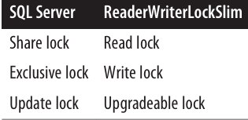
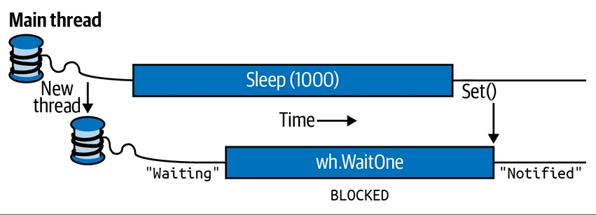
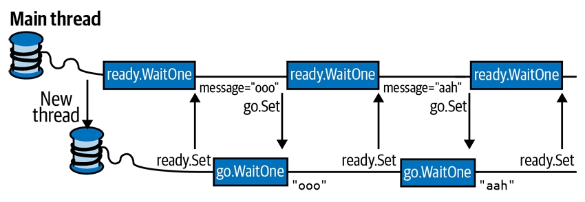
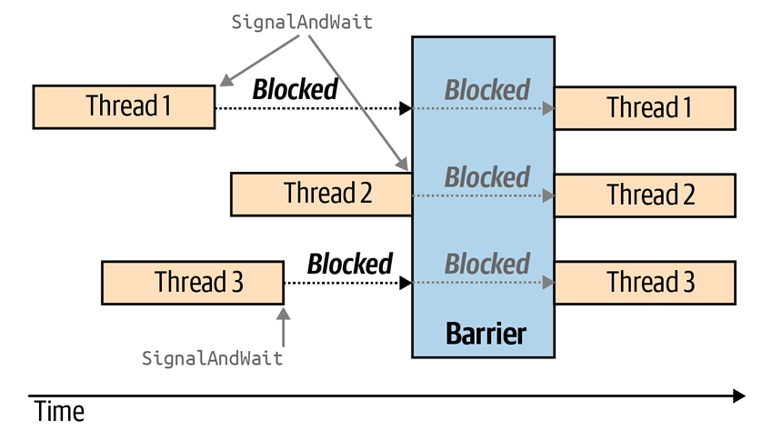

<div dir="rtl">
# فصل بیست و یکم:  Threading پیشرفته 

ما در **فصل ۱۴** با مبانی اولیه‌ی **Threading** شروع کردیم تا مقدمه‌ای برای **Tasks** و **Asynchrony** باشد. به طور مشخص، نشان دادیم چطور می‌توان یک **Thread** را شروع و پیکربندی کرد و مفاهیم اساسی مثل **Thread Pooling**، **Blocking**، **Spinning** و **Synchronization Contexts** را پوشش دادیم. همچنین به **Locking** و **Thread Safety** پرداختیم و ساده‌ترین سازه‌ی سیگنال‌دهی، یعنی **ManualResetEvent** را معرفی کردیم.

این فصل دقیقاً از همان‌جایی ادامه پیدا می‌کند که فصل ۱۴ در موضوع **Threading** متوقف شد. در سه بخش اول، به‌طور عمیق‌تر به **Synchronization**، **Locking** و **Thread Safety** می‌پردازیم. سپس موارد زیر را پوشش می‌دهیم:

* 🔓 **Nonexclusive locking** (مانند **Semaphore** و **Reader/Writer Locks**)
* 🔔 همه‌ی سازه‌های سیگنال‌دهی (**AutoResetEvent**، **ManualResetEvent**، **CountdownEvent** و **Barrier**)
* 🐢 **Lazy Initialization** (با استفاده از **Lazy<T>** و **LazyInitializer**)
* 🧩 **Thread-local storage** (مانند **ThreadStaticAttribute**، **ThreadLocal<T>** و **GetData/SetData**)
* ⏱ **Timers**

موضوع **Threading** آن‌قدر وسیع است که ما بخش‌های تکمیلی را به‌صورت آنلاین قرار داده‌ایم تا تصویر کامل‌تری ارائه شود. برای مطالعه‌ی موضوعات پیشرفته‌تر، به وب‌سایت زیر مراجعه کنید:

🔗 [http://albahari.com/threading](http://albahari.com/threading)

در آن‌جا مباحث زیر را خواهید یافت:

* ⚙️ **Monitor.Wait** و **Monitor.Pulse** برای سناریوهای خاص سیگنال‌دهی
* 🚀 تکنیک‌های **Nonblocking Synchronization** برای **Micro-Optimization** (مانند **Interlocked**، **Memory Barriers**، **volatile**)
* 🔄 **SpinLock** و **SpinWait** برای سناریوهای با **Concurrency** بالا

---

## 🔑 Synchronization Overview (مرور Synchronization)

**Synchronization** یعنی هماهنگ‌سازی عملیات همزمان برای دستیابی به یک نتیجه‌ی قابل پیش‌بینی. این موضوع به‌ویژه وقتی اهمیت پیدا می‌کند که چندین **Thread** به داده‌ی مشترک دسترسی دارند؛ در این شرایط، خیلی راحت می‌توان دچار مشکل شد.

ساده‌ترین و کاربردی‌ترین ابزارهای **Synchronization** احتمالاً همان **Continuations** و **Task Combinators** هستند که در فصل ۱۴ توضیح دادیم. با فرموله کردن برنامه‌های همزمان در قالب عملیات **Asynchronous** که با **Continuations** و **Combinators** به هم متصل می‌شوند، نیاز به **Locking** و **Signaling** کمتر می‌شود. با این حال، هنوز مواقعی وجود دارد که سازه‌های سطح پایین‌تر وارد عمل می‌شوند.

سازه‌های **Synchronization** را می‌توان به سه دسته تقسیم کرد:

1. 🔒 **Exclusive Locking**
   این سازه‌ها اجازه می‌دهند فقط یک **Thread** در هر لحظه فعالیت خاصی انجام دهد یا بخشی از کد را اجرا کند. هدف اصلی آن‌ها این است که **Threads** بتوانند به وضعیت مشترک در حال نوشتن دسترسی داشته باشند بدون این‌که مزاحم هم شوند. سازه‌های **Exclusive Locking** عبارت‌اند از:
   **lock**، **Mutex** و **SpinLock**.

2. 🔓 **Nonexclusive Locking**
   این نوع **Locking** به شما اجازه می‌دهد میزان **Concurrency** را محدود کنید. سازه‌های آن عبارت‌اند از:
   **Semaphore(Slim)** و **ReaderWriterLock(Slim)**.

3. 📢 **Signaling**
   این سازه‌ها به یک **Thread** اجازه می‌دهند تا زمانی که از یک یا چند **Thread** دیگر اطلاع (Notification) دریافت نکرده، در حالت **Block** باقی بماند. سازه‌های **Signaling** شامل **ManualResetEvent(Slim)**، **AutoResetEvent**، **CountdownEvent** و **Barrier** هستند. سه مورد اول معمولاً با عنوان **Event Wait Handles** شناخته می‌شوند.

همچنین امکان (و البته دشواری) انجام برخی عملیات همزمان روی داده‌ی مشترک بدون استفاده از **Locking** وجود دارد، با کمک سازه‌های **Nonblocking Synchronization**. این سازه‌ها عبارت‌اند از:
**Thread.MemoryBarrier**، **Thread.VolatileRead**، **Thread.VolatileWrite**، کلیدواژه‌ی **volatile** و کلاس **Interlocked**.

ما این موضوع را به همراه متدهای **Monitor.Wait/Pulse** که برای نوشتن منطق سفارشی سیگنال‌دهی کاربرد دارند، به‌صورت آنلاین پوشش داده‌ایم.

---

## 🔐 Exclusive Locking (قفل‌گذاری انحصاری)

سه سازه‌ی اصلی برای **Exclusive Locking** وجود دارد: دستور **lock**، **Mutex** و **SpinLock**.

* دستور **lock** راحت‌ترین و پرکاربردترین گزینه است.
* **Mutex** زمانی استفاده می‌شود که بخواهید قفل را بین چندین **Process** گسترش دهید (قفل‌های سطح کامپیوتر).
* **SpinLock** یک **Micro-Optimization** است که می‌تواند در سناریوهای با **Concurrency** بالا باعث کاهش **Context Switches** شود. 🔄


### 🔒 The `lock` Statement (دستور lock)

برای نشان دادن نیاز به **Locking**، کلاس زیر را در نظر بگیرید:
</div>

```csharp
class ThreadUnsafe
{
  static int _val1 = 1, _val2 = 1;
  static void Go()
  {
    if (_val2 != 0) Console.WriteLine (_val1 / _val2);
    _val2 = 0;
  }
}
```

<div dir="rtl">
این کلاس **Thread-Safe** نیست: اگر متد `Go` به‌طور همزمان توسط دو **Thread** فراخوانی شود، امکان رخ دادن خطای **Division by Zero** وجود دارد. چرا؟ چون ممکن است در همان لحظه‌ای که یک **Thread** بین اجرای دستور `if` و `Console.WriteLine` است، **Thread** دیگر مقدار `_val2` را برابر صفر قرار دهد.

اینجاست که دستور **lock** مشکل را حل می‌کند:
</div>

```csharp
class ThreadSafe
{
  static readonly object _locker = new object();
  static int _val1 = 1, _val2 = 1;
  static void Go()
  {
    lock (_locker)
    {
      if (_val2 != 0) Console.WriteLine (_val1 / _val2);
      _val2 = 0;
    }
  }
}
```

<div dir="rtl">
فقط یک **Thread** در هر لحظه می‌تواند شیء همگام‌ساز (در اینجا `_locker`) را قفل کند. هر **Thread** دیگری که برای قفل رقابت کند، **Blocked** می‌شود تا زمانی که قفل آزاد شود.

اگر بیش از یک **Thread** برای قفل رقابت کند، آن‌ها در یک **Ready Queue** قرار می‌گیرند و به ترتیب ورود، قفل به آن‌ها داده می‌شود (البته ✍️ در بعضی شرایط سیستم‌عامل **Windows** و **CLR** ممکن است این عدالت نقض شود).

به همین دلیل، قفل‌های انحصاری را گاهی اوقات طوری توصیف می‌کنند که **دسترسی سریالی** را به چیزی که توسط قفل محافظت می‌شود، اعمال می‌کنند؛ زیرا دسترسی یک **Thread** نمی‌تواند با دیگری همپوشانی داشته باشد. در این مثال، ما هم منطق داخل متد `Go` و هم فیلدهای `_val1` و `_val2` را محافظت کرده‌ایم.

---

### ⚙️ Monitor.Enter و Monitor.Exit

دستور `lock` در C# در حقیقت یک **میان‌بر نحوی (Syntactic Shortcut)** برای فراخوانی متدهای `Monitor.Enter` و `Monitor.Exit` به همراه یک بلوک `try/finally` است.

به‌طور ساده، کدی که در متد `Go` اتفاق می‌افتد، معادل زیر است:
</div>

```csharp
Monitor.Enter (_locker);
try
{
  if (_val2 != 0) Console.WriteLine (_val1 / _val2);
  _val2 = 0;
}
finally { Monitor.Exit (_locker); }
```

<div dir="rtl">
⚠️ اگر متد `Monitor.Exit` بدون این‌که قبلاً `Monitor.Enter` روی همان شیء صدا زده شده باشد، فراخوانی شود، یک **Exception** پرتاب می‌شود.

---

### 🛡 overloadهای lockTaken

کدی که در بالا دیدیم یک آسیب‌پذیری ظریف دارد. فرض کنید (هرچند بعید) یک **Exception** بین فراخوانی `Monitor.Enter` و شروع بلوک `try` رخ دهد (مثلاً یک **OutOfMemoryException** یا در **.NET Framework** اگر **Thread** متوقف شود).

در این شرایط:

* اگر قفل گرفته نشده باشد، خطری وجود ندارد.
* اما اگر قفل گرفته شده باشد، چون هیچ‌وقت وارد بلوک `try/finally` نمی‌شویم، قفل آزاد نخواهد شد. این یعنی **Leak شدن قفل**.

برای جلوگیری از این مشکل، متد زیر در **Monitor.Enter** تعریف شده است:
</div>

```csharp
public static void Enter (object obj, ref bool lockTaken);
```

<div dir="rtl">
🔎 اگر و فقط اگر متد `Enter` یک **Exception** پرتاب کند و قفل گرفته نشده باشد، مقدار `lockTaken` برابر **false** خواهد بود.

الگوی درست استفاده از آن (و همان چیزی که کامپایلر C# در پشت‌صحنه برای دستور `lock` تولید می‌کند) به شکل زیر است:
</div>

```csharp
bool lockTaken = false;
try
{
  Monitor.Enter (_locker, ref lockTaken);
  // Do your stuff...
}
finally { if (lockTaken) Monitor.Exit (_locker); }
```

<div dir="rtl">
---

### ⏱ TryEnter

کلاس **Monitor** همچنین متدی به نام **TryEnter** ارائه می‌دهد که به شما اجازه می‌دهد یک **Timeout** مشخص کنید (بر حسب **Milliseconds** یا یک **TimeSpan**).

* اگر قفل گرفته شود، مقدار **true** برمی‌گرداند.
* اگر قفل به‌دلیل **Timeout** گرفته نشود، مقدار **false** برمی‌گرداند.

علاوه بر این، متد **TryEnter** می‌تواند بدون هیچ آرگومانی فراخوانی شود. در این حالت، فقط **قفل را تست می‌کند** و اگر بلافاصله نتواند قفل را بگیرد، بدون معطلی **false** برمی‌گرداند.

📌 درست مثل متد `Enter`، متد **TryEnter** هم یک نسخه‌ی overload دارد که از آرگومان **lockTaken** پشتیبانی می‌کند.

### 🔑 Choosing the Synchronization Object (انتخاب شیء همگام‌ساز)

شما می‌توانید از هر شیئی که برای **Thread**‌های شرکت‌کننده قابل مشاهده باشد، به‌عنوان شیء همگام‌ساز استفاده کنید؛ با این شرط مهم که آن شیء باید یک **Reference Type** باشد.

شیء همگام‌ساز معمولاً **private** است (چون این کار باعث می‌شود منطق قفل‌گذاری بهتر **Encapsulate** شود) و معمولاً یک **Instance Field** یا یک **Static Field** است.

گاهی اوقات شیء همگام‌ساز همان شیء محافظت‌شده است. مانند فیلد `_list` در مثال زیر:
</div>

```csharp
class ThreadSafe
{
  List<string> _list = new List<string>();
  void Test()
  {
    lock (_list)
    {
      _list.Add("Item 1");
      ...
    }
  }
}
```

<div dir="rtl">
البته داشتن یک فیلد اختصاصی برای قفل‌گذاری (مثل `_locker` در مثال قبلی) کنترل دقیق‌تری روی **Scope** و **Granularity** قفل فراهم می‌کند.

همچنین می‌توانید از شیء حاوی (یعنی `this`) به‌عنوان شیء همگام‌ساز استفاده کنید:
</div>

```csharp
lock (this) { ... }
```

<div dir="rtl">
یا حتی از نوع کلاس استفاده کنید:
</div>

```csharp
lock (typeof(Widget)) { ... }   // برای محافظت از فیلدهای static
```

<div dir="rtl">
❌ عیب این روش‌ها این است که منطق قفل‌گذاری **Encapsulate** نمی‌شود و همین می‌تواند مدیریت **Deadlock** و **Blocking** بیش از حد را سخت‌تر کند.

شما حتی می‌توانید روی متغیرهای محلی که توسط **Lambda Expressions** یا **Anonymous Methods** گرفته شده‌اند نیز قفل بگذارید.

---

### ⏰ When to Lock (چه زمانی باید قفل کنیم)

قفل کردن دسترسی به خود شیء همگام‌ساز را محدود نمی‌کند. به عبارت دیگر، اگر متدی مثل `x.ToString()` فراخوانی شود، **Blocked** نخواهد شد فقط به این دلیل که یک **Thread** دیگر روی `lock(x)` قفل کرده است.
فقط زمانی **Blocking** اتفاق می‌افتد که هر دو **Thread** از `lock(x)` استفاده کنند.

قاعده‌ی پایه‌ای این است:
🔒 شما باید همیشه هنگام دسترسی به هر **Shared Writable Field** از قفل استفاده کنید.

حتی در ساده‌ترین حالت—مثلاً یک عمل **Assignment** روی یک فیلد—باید **Synchronization** را در نظر بگیرید.

به مثال زیر توجه کنید:
</div>

```csharp
class ThreadUnsafe
{
  static int _x;
  static void Increment() { _x++; }
  static void Assign()    { _x = 123; }
}
```

<div dir="rtl">
این کلاس **Thread-Safe** نیست. نسخه‌ی ایمن‌تر آن به شکل زیر است:
</div>

```csharp
static readonly object _locker = new object();
static int _x;

static void Increment() { lock (_locker) _x++; }
static void Assign()    { lock (_locker) _x = 123; }
```

<div dir="rtl">
---

### ⚠️ مشکلات بدون Lock

اگر قفل وجود نداشته باشد، دو مشکل رخ می‌دهد:

1. ➕ عملیات‌هایی مثل افزایش مقدار یک متغیر (یا حتی خواندن/نوشتن آن در شرایط خاص) **Atomic** نیستند.
2. ⚡ **Compiler**، **CLR** و **Processor** مجاز هستند برای بهبود کارایی، دستورات را **Reorder** کنند یا متغیرها را در **CPU Registers** کش کنند—تا زمانی که این بهینه‌سازی‌ها رفتار یک برنامه‌ی تک‌ریسمانی (یا چندریسمانی که از قفل استفاده می‌کند) را تغییر ندهد.

قفل‌ها مشکل دوم را با ایجاد یک **Memory Barrier** قبل و بعد از قفل کاهش می‌دهند.

🧱 **Memory Barrier** مانند یک حصار است که مانع عبور اثرات **Reordering** و **Caching** می‌شود.

این قاعده فقط مخصوص قفل‌ها نیست؛ بلکه برای همه‌ی سازه‌های **Synchronization** صدق می‌کند.

مثال: اگر یک سازه‌ی سیگنال‌دهی تضمین کند که فقط یک **Thread** در هر لحظه متغیری را بخواند/بنویسد، دیگر نیازی به قفل ندارید:
</div>

```csharp
var signal = new ManualResetEvent(false);
int x = 0;
new Thread(() => { x++; signal.Set(); }).Start();
signal.WaitOne();
Console.WriteLine(x);   // همیشه 1
```

<div dir="rtl">
در بخش «**Nonblocking Synchronization**» توضیح داده‌ایم که چرا چنین نیازی پیش می‌آید و چگونه **Memory Barriers** و کلاس **Interlocked** می‌توانند جایگزین قفل در این سناریوها باشند.

---

### 🔗 Locking and Atomicity (قفل‌گذاری و اتمیک بودن)

اگر گروهی از متغیرها همیشه درون یک قفل خوانده یا نوشته شوند، می‌توان گفت این متغیرها به شکل **Atomic** دسترسی دارند.

مثال:
</div>

```csharp
lock (locker) { if (x != 0) y /= x; }
```

<div dir="rtl">
در این حالت، متغیرهای `x` و `y` به‌صورت **Atomic** دسترسی داده می‌شوند؛ یعنی هیچ **Thread** دیگری نمی‌تواند در میانه‌ی این عملیات آن‌ها را تغییر دهد و نتیجه را بی‌اعتبار کند. بنابراین، شما هرگز خطای **Division by Zero** دریافت نمی‌کنید، مشروط بر این‌که `x` و `y` همیشه در همین قفل انحصاری دسترسی داده شوند.

---

### 🚨 استثناها و Atomicity

اتمیک بودن قفل نقض می‌شود اگر داخل بلوک قفل یک **Exception** رخ دهد (چه برنامه چندریسمانی باشد چه نباشد).

مثال:
</div>

```csharp
decimal _savingsBalance, _checkBalance;
void Transfer(decimal amount)
{
  lock (_locker)
  {
    _savingsBalance += amount;
    _checkBalance -= amount + GetBankFee();
  }
}
```

<div dir="rtl">
اگر متد `GetBankFee()` یک **Exception** پرتاب کند، بانک پول از دست می‌دهد! 🏦💸

در این شرایط می‌توان مشکل را با فراخوانی `GetBankFee` پیش از ورود به بلوک قفل برطرف کرد.

🔄 برای موارد پیچیده‌تر، یک راه‌حل این است که منطق **Rollback** را داخل یک بلوک `catch` یا `finally` پیاده‌سازی کنیم.

---

### ⚡ Instruction Atomicity

مفهوم **Instruction Atomicity** متفاوت اما مشابه است: یک دستور **Atomic** است اگر روی پردازنده‌ی زیرین به‌طور غیرقابل تقسیم اجرا شود.

### 🔐 قفل‌های تو در تو (Nested Locking)

یک **Thread** می‌تواند بارها یک شیء را به‌صورت تو در تو (یا **Reentrant**) قفل کند:
</div>

```csharp
lock (locker)
  lock (locker)
    lock (locker)
    {
       // Do something...
    }
```

<div dir="rtl">
یا به روش دیگر:
</div>

```csharp
Monitor.Enter (locker); 
Monitor.Enter (locker);  
Monitor.Enter (locker); 

// Do something...

Monitor.Exit (locker);  
Monitor.Exit (locker);   
Monitor.Exit (locker);
```

<div dir="rtl">
در این حالت‌ها، شیء تنها زمانی **آزاد (unlock)** می‌شود که یا خارجی‌ترین دستور `lock` پایان یافته باشد، یا تعداد متناظری از `Monitor.Exit` اجرا شده باشد.

🔁 **قفل تو در تو** زمانی مفید است که یک متد از داخل یک قفل، متد دیگری را صدا بزند:
</div>

```csharp
object locker = new object();

lock (locker)
{
    AnotherMethod();
    // هنوز قفل داریم - چون قفل‌ها Reentrant هستند
}

void AnotherMethod()
{
    lock (locker) { Console.WriteLine ("Another method"); }
}
```

<div dir="rtl">
✅ در اینجا Thread تنها روی اولین (خارجی‌ترین) قفل مسدود می‌شود.

---

### ⚠️ بن‌بست‌ها (Deadlocks)

**Deadlock** زمانی اتفاق می‌افتد که دو Thread هرکدام منتظر یک منبع باشند که توسط دیگری قفل شده است؛ در نتیجه هیچ‌کدام قادر به ادامه کار نخواهند بود.

مثال ساده با دو قفل:
</div>

```csharp
object locker1 = new object();
object locker2 = new object();

new Thread (() => {
    lock (locker1)
    {
        Thread.Sleep (1000);
        lock (locker2);   // Deadlock
    }
}).Start();

lock (locker2)
{
    Thread.Sleep (1000);
    lock (locker1);       // Deadlock
}
```

<div dir="rtl">
📌 در این حالت، هر Thread یکی از قفل‌ها را گرفته و منتظر دیگری است → **بن‌بست دائمی**.

* در محیط عادی CLR، بر خلاف SQL Server، **بن‌بست‌ها به‌صورت خودکار تشخیص و رفع نمی‌شوند**.
* اگر بن‌بست رخ دهد، Threadها به‌طور نامحدود مسدود می‌شوند (مگر این‌که زمان‌انتظار یا Timeout تعریف کرده باشید).
* در هاست SQL CLR (ادغام SQL Server با CLR)، بن‌بست‌ها شناسایی می‌شوند و یک استثنای قابل‌مدیریت روی یکی از Threadها پرتاب می‌شود.

---

### 🔎 چرا Deadlock سخت است؟

* هنگام طراحی شی‌ءگرا، ممکن است قفل‌ها در زنجیره‌ای از متدهای تو در تو گرفته شوند که ترتیب آن‌ها در زمان اجرا مشخص می‌شود.
* ممکن است شما روی فیلد `a` در کلاس `x` قفل بزنید، در حالی که فراخواننده‌ی شما قبلاً روی فیلد `b` در کلاس `y` قفل زده باشد. هم‌زمان Thread دیگری برعکس همین کار را انجام دهد → Deadlock.
* الگوهای خوب طراحی شی‌ءگرا (OOP) این مشکل را تشدید می‌کنند چون فراخوانی‌ها در زمان اجرا تعیین می‌شوند.

---

### ✅ راهکارها برای کاهش Deadlock

1. **قفل‌ها را به ترتیب ثابت بگیرید** (روش کلاسیک، ولی همیشه عملی نیست).
2. هنگام قفل کردن اطراف فراخوانی متدهای دیگر احتیاط کنید.
3. بررسی کنید آیا واقعاً لازم است هنگام فراخوانی متدهای دیگر قفل بگیرید یا خیر.
4. استفاده بیشتر از **سینکرون‌سازی سطح بالاتر** مثل:

   * Task continuations/combinators
   * Data parallelism
   * Immutable types

💡 نکته: زمانی که در حین داشتن یک قفل، کدی بیرونی را صدا می‌زنید، **کپسوله‌سازی قفل نشت می‌کند**. این یک محدودیت ذاتی مکانیزم قفل‌گذاری است، نه یک ضعف CLR.

---

### ⚡️ سناریوی خاص Deadlock در UI

* در اپلیکیشن‌های WPF: `Dispatcher.Invoke`
* در Windows Forms: `Control.Invoke`

اگر این‌ها را هنگام داشتن یک قفل صدا بزنید و Thread UI منتظر همان قفل باشد → Deadlock.

راه‌حل‌ها:

* استفاده از `BeginInvoke` به‌جای `Invoke`.
* یا آزاد کردن قفل قبل از صدا زدن `Invoke` (البته اگر قفل توسط Caller گرفته شده باشد، جواب نمی‌دهد).

---

### 🚀 کارایی (Performance)

* گرفتن و آزاد کردن قفل در حالت **بدون رقابت (uncontended)** روی سیستم‌های 2020 کمتر از **۲۰ نانوثانیه** طول می‌کشد.
* در حالت **رقابتی (contended)**، هزینه به حدود **میکروثانیه** می‌رسد (به‌خاطر Context Switch).
* زمان واقعی باززمان‌بندی Thread ممکن است حتی بیشتر طول بکشد.

### 🔒 **Mutex (موتکس)**

یک **Mutex** شبیه به دستور `lock` در C# است، با این تفاوت که می‌تواند در **چند پردازه (multi-process)** هم کار کند. یعنی:

* `lock` فقط داخل یک پردازه کاربرد دارد.
* `Mutex` هم **سراسری در سطح کامپیوتر (computer-wide)** و هم **سطح برنامه (application-wide)** قابل استفاده است.

⏱ گرفتن و آزاد کردن یک Mutex (در حالت بدون رقابت) حدود **۰.۵ میکروثانیه** طول می‌کشد؛ یعنی بیش از **۲۰ برابر کندتر از lock**.

---

### 📌 استفاده از Mutex

* برای گرفتن قفل: `WaitOne()`
* برای آزاد کردن: `ReleaseMutex()`
* دقیقاً مثل `lock`، فقط همان **Thread** که Mutex را گرفته، می‌تواند آن را آزاد کند.

⚠️ اگر `ReleaseMutex` را فراموش کنید و فقط `Close` یا `Dispose` صدا بزنید،
اولین Thread دیگری که روی آن منتظر مانده باشد، با **AbandonedMutexException** مواجه می‌شود.

---

### 🎯 کاربرد متداول: محدود کردن اجرای چندین نسخه از یک برنامه

مثال:
</div>

```csharp
// با نام‌گذاری Mutex، آن را در سطح کل کامپیوتر قابل‌دسترس می‌کنیم.
// بهتر است نام، یکتا باشد (مثلاً شامل نام شرکت یا URL).
using var mutex = new Mutex (true, @"Global\oreilly.com OneAtATimeDemo");

// اگر قفل اشغال بود، چند ثانیه صبر کنیم
// شاید نسخه قبلی برنامه در حال بستن باشد.
if (!mutex.WaitOne (TimeSpan.FromSeconds (3), false))
{
    Console.WriteLine ("Another instance of the app is running. Bye!");
    return;
}

try { RunProgram(); }
finally { mutex.ReleaseMutex(); }

void RunProgram()
{
    Console.WriteLine ("Running. Press Enter to exit");
    Console.ReadLine();
}
```

<div dir="rtl">
📌 نکته:

* در **Terminal Services** یا **کنسول‌های یونیکس جداگانه**، Mutex سراسری معمولاً فقط برای برنامه‌هایی در همان **Session** قابل‌دسترسی است.
* اگر بخواهید برای همه‌ی Sessionها در دسترس باشد، باید نام Mutex را با `"Global\"` شروع کنید (مثل نمونه کد).

---

### 🧩 Thread Safety (ایمنی در چندنخی)

یک برنامه یا متد زمانی **Thread-Safe** است که در هر سناریوی چندنخی درست کار کند.
این کار عمدتاً با **قفل‌گذاری (locking)** و **کاهش تعامل Threadها** به دست می‌آید.

#### چرا همه‌چیز همیشه Thread-Safe نیست؟

1. سربار توسعه زیاد است (اگر یک نوع تعداد زیادی فیلد داشته باشد، هر فیلد می‌تواند منبع تداخل باشد).
2. Thread-Safety هزینه‌ی کارایی دارد (حتی اگر فقط یک Thread استفاده کند).
3. حتی اگر یک کلاس Thread-Safe باشد، **برنامه‌ای که از آن استفاده می‌کند، لزوماً Thread-Safe نخواهد بود**.

➡️ بنابراین، معمولاً **فقط همان‌جایی Thread-Safe پیاده‌سازی می‌شود که لازم است**.

---

### ⚙️ راه‌های "میان‌بر" برای Thread-Safety

1. **قفل‌گذاری کلی (Coarse-Grained Locking)**

   * کل دسترسی به یک شیء را داخل یک قفل انحصاری قرار دهید.
   * این روش به‌خصوص برای استفاده از **کدهای ناامن در چندنخی** (مثل بیشتر انواع .NET یا کدهای شخص ثالث) ضروری است.
   * اگر متدهای شیء سریع باشند، این روش جواب می‌دهد. (وگرنه قفل زیاد باعث بلوکه شدن خواهد شد).

2. **کاهش تعامل Threadها با کاهش داده‌های مشترک**

   * این استراتژی در اپلیکیشن‌های Stateless (مثل وب‌سرورها یا سرویس‌های میانی) استفاده می‌شود.
   * چون داده بین درخواست‌ها ذخیره نمی‌شود، تعامل Threadها کم می‌شود.
   * تنها نقاط مشترک می‌توانند فیلدهای `static` باشند (مثلاً برای کش کردن داده یا سرویس‌های زیرساختی مثل Authentication و Auditing).

3. **اجرای کد دسترسی به داده‌های مشترک روی Thread رابط کاربری (UI Thread)**

   * در اپلیکیشن‌های کلاینت غنی (Rich Client).
   * با استفاده از **توابع Asynchronous** (که در فصل 14 دیدیم) این کار راحت‌تر می‌شود.

---

📖 جمع‌بندی:

* از **Mutex** وقتی استفاده کنید که نیاز به هماهنگی بین چند پردازه دارید (مثل اطمینان از اجرای تنها یک نسخه‌ی برنامه).
* برای **Thread-Safety**، یا باید با قفل‌ها دسترسی را کنترل کنید، یا با طراحی صحیح (مثل Stateless یا Immutable) تعامل Threadها را به حداقل برسانید.

### ایمنی نخ‌ها و انواع .NET 🧵🛡️

شما می‌توانید با استفاده از **locking** کدی که thread-unsafe است را به کدی thread-safe تبدیل کنید. یکی از کاربردهای خوب این کار در **.NET** است: تقریباً همه‌ی انواع **nonprimitive** (غیرابتدایی) در .NET زمانی که ساخته می‌شوند، thread-safe نیستند (برای چیزی بیشتر از دسترسی فقط‌خواندنی). با این حال، شما می‌توانید آن‌ها را در کد چندنخی (multithreaded) استفاده کنید، به شرطی که همه‌ی دسترسی‌ها به یک شیء مشخص با استفاده از یک **lock** محافظت شوند.

در اینجا مثالی داریم که در آن دو نخ به‌طور همزمان یک آیتم را به همان **List collection** اضافه می‌کنند و سپس آن لیست را پیمایش می‌کنند:
</div>

```csharp
class ThreadSafe
{
  static List<string> _list = new List<string>();
  static void Main()
  {
    new Thread (AddItem).Start();
    new Thread (AddItem).Start();
  }
  static void AddItem()
  {
    lock (_list) _list.Add ("Item " + _list.Count);
    string[] items;
    lock (_list) items = _list.ToArray();
    foreach (string s in items) Console.WriteLine (s);
  }
}
```

<div dir="rtl">
---

### قفل‌گذاری و ایمنی نخ‌ها 🔐

در این حالت، ما روی خود شیء **\_list** قفل می‌کنیم. اگر دو لیست مرتبط داشتیم، باید یک شیء مشترک را برای قفل انتخاب می‌کردیم (می‌توانستیم یکی از لیست‌ها را انتخاب کنیم یا بهتر: از یک فیلد مستقل استفاده کنیم).

پیمایش (enumerating) مجموعه‌های .NET نیز thread-unsafe است، به این معنا که اگر لیست هنگام پیمایش تغییر کند، یک **exception** رخ می‌دهد. به جای قفل‌گذاری در کل مدت پیمایش، در این مثال ابتدا آیتم‌ها را در یک **آرایه** کپی می‌کنیم. این کار باعث می‌شود قفل برای مدت طولانی نگه داشته نشود، مخصوصاً اگر کاری که هنگام پیمایش انجام می‌دهیم زمان‌بر باشد. (راه‌حل دیگر استفاده از یک **reader/writer lock** است؛ به بخش «Reader/Writer Locks» در صفحه ۹۰۷ مراجعه کنید.)

---

### قفل‌گذاری روی اشیاء thread-safe ⚡

گاهی لازم است حتی هنگام دسترسی به اشیاء **thread-safe** نیز از قفل استفاده کنید. برای توضیح، فرض کنید که کلاس **List** در .NET واقعاً thread-safe بود و ما می‌خواستیم یک آیتم به لیست اضافه کنیم:
</div>

```csharp
if (!_list.Contains (newItem)) _list.Add (newItem);
```

<div dir="rtl">
صرف‌نظر از اینکه لیست thread-safe باشد یا نه، این دستور قطعاً thread-safe نیست! کل عبارت **if** باید درون یک قفل قرار گیرد تا از پیش‌دستی (preemption) بین بررسی عضویت و اضافه کردن آیتم جلوگیری شود. این قفل باید در همه‌ی جاهایی که لیست را تغییر می‌دهیم استفاده شود. برای مثال، دستور زیر نیز باید در همان قفل پیچیده شود تا از پیش‌دستی نسبت به عبارت قبلی جلوگیری کند:
</div>

```csharp
_list.Clear();
```

<div dir="rtl">
به عبارت دیگر، باید دقیقاً همانند کلاس‌های مجموعه‌ی thread-unsafe قفل‌گذاری کنیم (که این موضوع ایمنی نخِ فرضیِ کلاس **List** را بی‌اثر می‌سازد).

---

### اعضای ایستا (Static Members) ⚙️

قفل‌گذاری هنگام دسترسی به یک مجموعه می‌تواند در محیط‌های با همروندی بالا (**highly concurrent environments**) باعث **blocking** بیش‌ازحد شود. برای همین، .NET یک **queue**، **stack** و **dictionary** thread-safe فراهم کرده است که در فصل ۲۲ بررسی خواهیم کرد.

پیچیدن دسترسی به یک شیء در یک قفل سفارشی فقط وقتی کار می‌کند که همه‌ی نخ‌های همروند از آن قفل آگاه باشند و از آن استفاده کنند. این ممکن است وقتی شیء در سطح وسیعی استفاده می‌شود برقرار نباشد. بدترین حالت در مورد **static members** در یک نوع عمومی (public type) رخ می‌دهد.

برای مثال، تصور کنید که ویژگی ایستای **DateTime.Now** در ساختار **DateTime** thread-safe نبود و دو فراخوانی همزمان می‌توانست خروجی درهم یا یک **exception** ایجاد کند. تنها راه‌حل با قفل‌گذاری خارجی این بود که قبل از فراخوانی DateTime.Now نوع را قفل کنیم:
</div>

```csharp
lock(typeof(DateTime))
```

<div dir="rtl">
این فقط زمانی جواب می‌دهد که همه‌ی برنامه‌نویسان با این کار موافق باشند (که بعید است). علاوه بر این، قفل‌گذاری روی یک نوع مشکلات خودش را ایجاد می‌کند.

به همین دلیل، اعضای ایستای **DateTime struct** به‌طور دقیق thread-safe پیاده‌سازی شده‌اند. این یک الگوی رایج در .NET است:

* اعضای ایستا (static members) → **thread-safe** ✅
* اعضای نمونه (instance members) → **thread-unsafe** ❌

دنبال کردن این الگو هنگام نوشتن انواع برای استفاده عمومی منطقی است تا از ایجاد معماهای غیرممکنِ ایمنی نخ جلوگیری شود. به عبارت دیگر، با thread-safe کردن متدهای ایستا، شما طوری کدنویسی می‌کنید که مانع ایمنی نخ برای مصرف‌کنندگان آن نوع نشوید.

⚠️ **ایمنی نخ در متدهای ایستا چیزی است که باید به‌طور صریح پیاده‌سازی شود؛ این ویژگی به‌طور خودکار فقط به دلیل ایستا بودن متد اتفاق نمی‌افتد!**

---

### ایمنی نخ در حالت فقط‌خواندنی 📖

ایمن کردن انواع برای دسترسی همزمان فقط‌خواندنی (در صورت امکان) سودمند است زیرا به این معناست که مصرف‌کنندگان می‌توانند از قفل‌گذاری بیش‌ازحد جلوگیری کنند. بسیاری از انواع .NET این اصل را دنبال می‌کنند: برای مثال، مجموعه‌ها برای خوانندگان همزمان thread-safe هستند.

دنبال کردن این اصل برای خودتان ساده است: اگر نوعی را به‌عنوان thread-safe برای دسترسی همزمان فقط‌خواندنی مستند می‌کنید، در متدهایی که مصرف‌کننده انتظار دارد فقط‌خواندنی باشند به فیلدها ننویسید (یا در صورت نیاز قفل‌گذاری کنید).

برای نمونه، در پیاده‌سازی یک متد **ToArray()** در یک مجموعه، ممکن است بخواهید ابتدا ساختار داخلی مجموعه را فشرده‌سازی کنید. با این حال، این کار آن را برای مصرف‌کنندگانی که انتظار داشتند فقط‌خواندنی باشد، thread-unsafe می‌کند.

ایمنی نخ در حالت فقط‌خواندنی یکی از دلایلی است که **enumerator** ها از **enumerable** ها جدا هستند: دو نخ می‌توانند به‌طور همزمان روی یک مجموعه پیمایش کنند چون هرکدام یک شیء enumerator جدا دریافت می‌کنند.

در نبود مستندات، بهتر است محتاط باشید و فرض نکنید که یک متد ذاتاً فقط‌خواندنی است. یک مثال خوب کلاس **Random** است: وقتی **Random.Next()** را فراخوانی می‌کنید، پیاده‌سازی داخلی آن نیاز دارد که مقادیر بذر خصوصی (private seed values) را به‌روزرسانی کند. بنابراین، شما باید یا هنگام استفاده از کلاس Random قفل‌گذاری کنید یا یک نمونه جداگانه برای هر نخ نگه دارید.

### ایمنی نخ در سرورهای برنامه 🖥️🧵

سرورهای برنامه (Application servers) باید **چندنخی (multithreaded)** باشند تا بتوانند درخواست‌های همزمان کلاینت‌ها را مدیریت کنند. برنامه‌های **ASP.NET Core** و **Web API** به‌صورت ضمنی چندنخی هستند. این یعنی هنگام نوشتن کد در سمت سرور، اگر احتمال تعامل میان نخ‌هایی که درخواست‌های کلاینت را پردازش می‌کنند وجود داشته باشد، باید **ایمنی نخ (thread safety)** را در نظر بگیرید. خوشبختانه، چنین احتمالی نادر است؛ یک کلاس معمولی در سرور یا **stateless** است (هیچ فیلدی ندارد) یا یک مدل فعال‌سازی دارد که برای هر کلاینت یا هر درخواست یک نمونه‌ی جدا از شیء می‌سازد. تعامل معمولاً فقط از طریق **static fields** رخ می‌دهد، که گاهی برای کش کردن بخش‌هایی از دیتابیس در حافظه جهت بهبود کارایی استفاده می‌شوند.

برای مثال، فرض کنید متدی به نام **RetrieveUser** دارید که یک دیتابیس را کوئری می‌گیرد:
</div>

```csharp
// User is a custom class with fields for user data
internal User RetrieveUser (int id) { ... }
```

<div dir="rtl">
اگر این متد به دفعات فراخوانی شود، می‌توان عملکرد را با کش کردن نتایج در یک **Dictionary** ایستا بهبود داد. در اینجا یک راه‌حل ساده‌ی مفهومی آورده شده است که ایمنی نخ را نیز در نظر می‌گیرد:
</div>

```csharp
static class UserCache
{
  static Dictionary<int, User> _users = new Dictionary<int, User>();
  internal static User GetUser (int id)
  {
    User u = null;
    lock (_users)
      if (_users.TryGetValue (id, out u))
        return u;
    u = RetrieveUser (id);           // Method to retrieve from database;
    lock (_users) _users[id] = u;
    return u;
  }
}
```

<div dir="rtl">
در اینجا باید حداقل هنگام خواندن و به‌روزرسانی دیکشنری قفل‌گذاری کنیم تا ایمنی نخ تضمین شود. این طراحی یک مصالحه‌ی عملی میان سادگی و کارایی در قفل‌گذاری است. اما یک مشکل کوچک ایجاد می‌شود: اگر دو نخ به‌طور همزمان این متد را با یک شناسه‌ی یکسان (که قبلاً واکشی نشده) فراخوانی کنند، متد **RetrieveUser** دوبار اجرا می‌شود و دیکشنری بی‌دلیل به‌روزرسانی خواهد شد.

قفل کردن کل متد جلوی این مشکل را می‌گیرد، اما ناکارآمدی بیشتری ایجاد می‌کند: کل کش برای مدت فراخوانی **RetrieveUser** قفل می‌شود و در این مدت سایر نخ‌ها برای واکشی کاربران دیگر بلاک خواهند شد.

---

### راه‌حل ایده‌آل با Task<User> ⚡

برای یک راه‌حل ایده‌آل، باید استراتژی‌ای که در بخش «Completing synchronously» صفحه ۶۷۷ توضیح داده شد را به‌کار بگیریم. به جای کش کردن **User**، ما **Task<User>** را کش می‌کنیم و فراخواننده آن را **await** می‌کند:
</div>

```csharp
static class UserCache
{
  static Dictionary<int, Task<User>> _userTasks = 
     new Dictionary<int, Task<User>>();
  internal static Task<User> GetUserAsync (int id)
  {
    lock (_userTasks)
      if (_userTasks.TryGetValue (id, out var userTask))
        return userTask;
      else
        return _userTasks[id] = Task.Run(() => RetrieveUser(id));
  }
}
```

<div dir="rtl">
در این نسخه، یک قفل واحد کل منطق متد را پوشش می‌دهد. این کار به همروندی (concurrency) آسیبی نمی‌زند زیرا تنها کاری که داخل قفل انجام می‌دهیم، دسترسی به دیکشنری و (احتمالاً) شروع یک عملیات **asynchronous** با فراخوانی **Task.Run** است.

اگر دو نخ به‌طور همزمان این متد را با همان شناسه (ID) صدا بزنند، هر دو منتظر همان **Task** خواهند ماند؛ که دقیقاً همان چیزی است که می‌خواهیم. ✅

---

### اشیاء تغییرناپذیر (Immutable Objects) 🔒

یک **immutable object** شیئی است که وضعیتش (state) چه به‌صورت خارجی و چه داخلی، قابل تغییر نباشد. فیلدهای یک شیء immutable معمولاً **read-only** تعریف می‌شوند و در طول سازنده (constructor) مقداردهی کامل می‌شوند.

تغییرناپذیری (immutability) یکی از ویژگی‌های اصلی **برنامه‌نویسی تابعی (functional programming)** است—جایی که به‌جای تغییر دادن یک شیء، یک شیء جدید با ویژگی‌های متفاوت می‌سازید. **LINQ** از این پارادایم پیروی می‌کند.

تغییرناپذیری در برنامه‌های چندنخی نیز ارزشمند است زیرا مشکل **shared writable state** (اشتراک‌گذاری وضعیت قابل‌نوشتن) را از بین می‌برد یا به حداقل می‌رساند.

یک الگوی رایج این است که از اشیاء immutable برای کپسوله کردن گروهی از فیلدهای مرتبط استفاده کنید تا مدت زمان قفل‌گذاری کاهش یابد.

---

### یک مثال ساده 📊

فرض کنید دو فیلد زیر داریم:
</div>

```csharp
int _percentComplete;
string _statusMessage;
```

<div dir="rtl">
حالا اگر بخواهیم آن‌ها را به‌طور اتمی (atomic) بخوانیم و بنویسیم، به جای قفل‌گذاری مستقیم روی این فیلدها، می‌توانیم یک کلاس immutable تعریف کنیم:
</div>

```csharp
class ProgressStatus    // Represents progress of some activity
{
  public readonly int PercentComplete;
  public readonly string StatusMessage;
  // This class might have many more fields...
  public ProgressStatus (int percentComplete, string statusMessage)
  {
    PercentComplete = percentComplete;
    StatusMessage = statusMessage;
  }
}
```

<div dir="rtl">
سپس می‌توانیم یک فیلد از این نوع به همراه یک شیء قفل تعریف کنیم:
</div>

```csharp
readonly object _statusLocker = new object();
ProgressStatus _status;
```

<div dir="rtl">
اکنون می‌توانیم مقادیر این نوع را بدون نگه داشتن قفل برای مدت طولانی بخوانیم و بنویسیم:
</div>

```csharp
var status = new ProgressStatus (50, "Working on it");
// Imagine we were assigning many more fields...
// ...
lock (_statusLocker) _status = status;    // Very brief lock
```

<div dir="rtl">
برای خواندن شیء، ابتدا یک کپی از مرجع شیء را (داخل قفل) می‌گیریم. سپس می‌توانیم مقادیرش را بدون نیاز به نگه داشتن قفل بخوانیم:
</div>

```csharp
ProgressStatus status;
lock (_statusLocker) status = _status;   // Again, a brief lock
int pc = status.PercentComplete;
string msg = status.StatusMessage;
...
```

<div dir="rtl">
### قفل غیرانحصاری (Nonexclusive Locking) 🔓

ساختارهای قفل **غیرانحصاری** برای محدود کردن هم‌زمانی (concurrency) به‌کار می‌روند. در این بخش، به **Semaphore** و **Read/Writer Locks** می‌پردازیم و نشان می‌دهیم که چگونه کلاس **SemaphoreSlim** می‌تواند هم‌زمانی را در عملیات **آسنکرون** محدود کند.

---

### Semaphore 🕺

یک **Semaphore** شبیه یک **کلاب شبانه** با ظرفیت محدود است که توسط **دربان (bouncer)** مدیریت می‌شود.

* وقتی کلاب پر است، کسی نمی‌تواند وارد شود و صفی خارج از کلاب تشکیل می‌شود.
* تعداد Semaphore برابر است با تعداد جایگاه‌ها در کلاب.
* **Release** کردن یک Semaphore تعداد را افزایش می‌دهد؛ معمولاً وقتی کسی کلاب را ترک می‌کند (مطابقت با آزاد شدن یک منبع)، یا وقتی Semaphore مقداردهی اولیه می‌شود.
* می‌توان در هر زمان **Release** کرد تا ظرفیت افزایش یابد.

**Wait کردن روی یک Semaphore** تعداد آن را کاهش می‌دهد و معمولاً قبل از گرفتن یک منبع انجام می‌شود. اگر **Wait** روی Semaphore‌ای با مقدار فعلی بزرگ‌تر از صفر انجام شود، بلافاصله تکمیل می‌شود.

Semaphore می‌تواند حداکثر تعداد (maximum count) داشته باشد که یک محدودیت سخت محسوب می‌شود. افزایش مقدار بیش از این حد باعث پرتاب استثناء خواهد شد. هنگام ایجاد Semaphore، مقدار اولیه (initial count) و اختیاری حداکثر مقدار مشخص می‌شود.

---

یک **Semaphore** با مقدار اولیه یک شبیه **Mutex** یا **lock** است، با این تفاوت که **Semaphore** مالک (owner) ندارد و مستقل از نخ است. هر نخ می‌تواند **Release** کند، در حالی که در Mutex و lock فقط نخ دریافت‌کننده‌ی قفل می‌تواند آن را آزاد کند.

دو نسخه‌ی عملکردی مشابه وجود دارد: **Semaphore** و **SemaphoreSlim**. نسخه‌ی دوم برای برنامه‌نویسی موازی با تأخیر پایین بهینه شده است و در **multithreading** سنتی نیز مفید است، زیرا اجازه می‌دهد **CancellationToken** هنگام **Wait** مشخص شود و یک متد **WaitAsync** برای برنامه‌نویسی آسنکرون ارائه می‌دهد. اما برای سیگنال‌دهی بین فرآیندها (interprocess) کاربرد ندارد.

* **Semaphore** حدود ۱ میکروثانیه برای فراخوانی **WaitOne** و **Release** صرف می‌کند.
* **SemaphoreSlim** تقریباً یک‌دهم این زمان را مصرف می‌کند.

---

### کاربرد Semaphore برای محدود کردن هم‌زمانی ⚡

Semaphore برای جلوگیری از اجرای بیش از حد نخ‌ها روی یک بخش خاص از کد مفید است.

مثالی داریم که پنج نخ تلاش می‌کنند وارد یک کلاب شوند که فقط سه نخ همزمان اجازه ورود دارند:
</div>

```csharp
class TheClub
{
  static SemaphoreSlim _sem = new SemaphoreSlim(3);    // ظرفیت ۳
  static void Main()
  {
    for (int i = 1; i <= 5; i++) new Thread(Enter).Start(i);
  }

  static void Enter(object id)
  {
    Console.WriteLine(id + " wants to enter");
    _sem.Wait();
    Console.WriteLine(id + " is in!");           // حداکثر سه نخ
    Thread.Sleep(1000 * (int)id);               // می‌توانند همزمان
    Console.WriteLine(id + " is leaving");      // در کلاب باشند
    _sem.Release();
  }
}
```

<div dir="rtl">
نمونه خروجی ممکن:
</div>

```
1 wants to enter
1 is in!
2 wants to enter
2 is in!
3 wants to enter
3 is in!
4 wants to enter
5 wants to enter
1 is leaving
4 is in!
2 is leaving
5 is in!
```

<div dir="rtl">
---

همچنین قانونی است که Semaphore را با **مقدار اولیه صفر** ایجاد کنید و سپس با **Release** تعداد آن را افزایش دهید. مثال زیر دو Semaphore معادل را نشان می‌دهد:
</div>

```csharp
var semaphore1 = new SemaphoreSlim(3);
var semaphore2 = new SemaphoreSlim(0); 
semaphore2.Release(3);
```

<div dir="rtl">
اگر Semaphore نام‌گذاری شده باشد، می‌تواند مانند Mutex بین فرآیندها نیز مورد استفاده قرار گیرد. (Semaphore نام‌گذاری شده فقط در Windows موجود است، در حالی که Mutex نام‌گذاری شده روی Unix هم کار می‌کند.)
### Semaphoreها و قفل‌های آسنکرون (Asynchronous Semaphores and Locks) ⏳

قفل کردن (lock) **در یک عبارت await غیرمجاز است**:
</div>

```csharp
lock (_locker)
{
  await Task.Delay(1000);    // خطای کامپایل
  ...
}
```

<div dir="rtl">
دلیلش ساده است: قفل‌ها به یک **نخ خاص** تعلق دارند، و هنگام بازگشت از `await` معمولاً نخ تغییر می‌کند. علاوه بر این، **lock بلوک‌کننده است** و بلوک کردن برای یک بازه طولانی دقیقاً همان چیزی است که در برنامه‌های آسنکرون نمی‌خواهید.

---

با این حال، گاهی اوقات می‌خواهیم عملیات آسنکرون **به صورت متوالی اجرا شوند** یا تعداد عملیات همزمان را محدود کنیم تا بیش از n عملیات همزمان رخ ندهد.

مثال: یک مرورگر وب ممکن است نیاز داشته باشد تا دانلودها را به‌صورت آسنکرون و همزمان انجام دهد، اما بخواهد محدودیت حداکثر ۱۰ دانلود همزمان را اعمال کند. این کار را می‌توان با **SemaphoreSlim** انجام داد:
</div>

```csharp
SemaphoreSlim _semaphore = new SemaphoreSlim(10);

async Task<byte[]> DownloadWithSemaphoreAsync(string uri)
{
    await _semaphore.WaitAsync();
    try
    {
        return await new WebClient().DownloadDataTaskAsync(uri);
    }
    finally
    {
        _semaphore.Release();
    }
}
```

<div dir="rtl">
* اگر `initialCount` Semaphore را به ۱ کاهش دهیم، حداکثر هم‌زمانی به ۱ محدود می‌شود و عملاً یک **قفل آسنکرون** ایجاد می‌کند.

---

### نوشتن یک متد extension به نام `EnterAsync`

متد extension زیر استفاده آسنکرون از **SemaphoreSlim** را ساده‌تر می‌کند، با استفاده از کلاس **Disposable** که در بخش “Anonymous Disposal” معرفی شد:
</div>

```csharp
public static async Task<IDisposable> EnterAsync(this SemaphoreSlim ss)
{
    await ss.WaitAsync().ConfigureAwait(false);
    return Disposable.Create(() => ss.Release());
}
```

<div dir="rtl">
با این متد می‌توانیم روش قبلی دانلود را به شکل ساده‌تر بازنویسی کنیم:
</div>

```csharp
async Task<byte[]> DownloadWithSemaphoreAsync(string uri)
{
    using (await _semaphore.EnterAsync())
        return await new WebClient().DownloadDataTaskAsync(uri);
}
```

<div dir="rtl">
---

### Parallel.ForEachAsync

از **.NET 6**، روش دیگری برای محدود کردن هم‌زمانی آسنکرون وجود دارد: **Parallel.ForEachAsync**.

فرض کنید آرایه‌ای از URIها داریم که می‌خواهیم دانلود کنیم. می‌توانیم آنها را به‌صورت همزمان دانلود کنیم و هم‌زمانی را به حداکثر ۱۰ عملیات محدود کنیم:
</div>

```csharp
await Parallel.ForEachAsync(
    uris,
    new ParallelOptions { MaxDegreeOfParallelism = 10 },
    async (uri, cancelToken) =>
    {
        var download = await new HttpClient().GetByteArrayAsync(uri);
        Console.WriteLine($"Downloaded {download.Length} bytes");
    });
```

<div dir="rtl">
* سایر متدهای کلاس **Parallel** بیشتر برای سناریوهای برنامه‌نویسی موازی محاسباتی (**compute-bound**) استفاده می‌شوند، که در فصل ۲۲ بررسی شده‌اند.
### قفل‌های خواندن/نوشتن (Reader/Writer Locks) 📖

اغلب اوقات، نمونه‌های یک نوع داده **برای خواندن همزمان ایمن هستند**، اما **برای به‌روزرسانی همزمان یا ترکیبی از خواندن و نوشتن ایمن نیستند**.
این موضوع می‌تواند در مورد منابعی مانند فایل‌ها هم صادق باشد.

* استفاده از یک **قفل انحصاری ساده** (exclusive lock) معمولاً مشکل را حل می‌کند،
* اما اگر تعداد زیادی خواننده و فقط به‌روزرسانی‌های گاه‌به‌گاه داشته باشیم، این کار **محدودیت زیادی روی همزمانی ایجاد می‌کند**.

مثالی از چنین سناریویی در **سرورهای تجاری** است که داده‌های پرکاربرد را در **فیلدهای static** برای دسترسی سریع کش می‌کنند.

---

### کلاس `ReaderWriterLockSlim`

این کلاس برای **حداکثر دسترسی همزمان** در چنین شرایطی طراحی شده است و جایگزین کلاس قدیمی‌تر و “چاق” **ReaderWriterLock** است:

* کلاس قدیمی چندین بار کندتر بود و یک مشکل طراحی در ارتقای قفل داشت.
* در مقایسه با یک قفل معمولی (`Monitor.Enter/Exit`) هنوز دو برابر کندتر است، اما **مزیت آن کاهش رقابت (contention) هنگام خواندن زیاد و نوشتن کم است**.

---

### انواع قفل

دو نوع اصلی قفل داریم:

* **Write lock (قفل نوشتن)**: کاملاً انحصاری است.
* **Read lock (قفل خواندن)**: با سایر read lockها سازگار است.

> اگر یک نخ write lock داشته باشد، تمام نخ‌های دیگر که قصد read یا write دارند، مسدود می‌شوند. اما اگر هیچ write lockی وجود نداشته باشد، هر تعداد نخ می‌تواند همزمان read lock بگیرد.

---

### متدهای مهم `ReaderWriterLockSlim`
</div>

```csharp
public void EnterReadLock();
public void ExitReadLock();
public void EnterWriteLock();
public void ExitWriteLock();
```

<div dir="rtl">
* نسخه‌های **Try** هم وجود دارد که timeout می‌پذیرند (مشابه `Monitor.TryEnter`)
* کلاس قدیمی ReaderWriterLock روش‌های مشابهی به نام‌های `AcquireXXX` و `ReleaseXXX` دارد که در صورت timeout **ApplicationException** پرتاب می‌کند.

---

### مثال عملی

سه نخ مرتباً یک لیست را می‌خوانند و دو نخ دیگر هر ۱۰۰ میلی‌ثانیه یک عدد تصادفی به لیست اضافه می‌کنند:
</div>

```csharp
class SlimDemo
{
    static ReaderWriterLockSlim _rw = new ReaderWriterLockSlim();
    static List<int> _items = new List<int>();
    static Random _rand = new Random();

    static void Main()
    {
        new Thread(Read).Start();
        new Thread(Read).Start();
        new Thread(Read).Start();
        new Thread(Write).Start("A");
        new Thread(Write).Start("B");
    }

    static void Read()
    {
        while (true)
        {
            _rw.EnterReadLock();
            foreach (int i in _items) Thread.Sleep(10);
            _rw.ExitReadLock();
        }
    }

    static void Write(object threadID)
    {
        while (true)
        {
            int newNumber = GetRandNum(100);
            _rw.EnterWriteLock();
            _items.Add(newNumber);
            _rw.ExitWriteLock();
            Console.WriteLine("Thread " + threadID + " added " + newNumber);
            Thread.Sleep(100);
        }
    }

    static int GetRandNum(int max) { lock (_rand) return _rand.Next(max); }
}
```

<div dir="rtl">
* در کد تولیدی واقعی، معمولاً از **try/finally** برای اطمینان از آزاد شدن قفل‌ها در صورت بروز استثنا استفاده می‌کنیم.
* خروجی نمونه:
</div>

```
Thread B added 61
Thread A added 83
Thread B added 55
Thread A added 33
...
```

<div dir="rtl">
---

### مزیت اصلی

`ReaderWriterLockSlim` **امکان خواندن همزمان بیشتری نسبت به قفل ساده فراهم می‌کند**.

* برای مشاهده تعداد نخ‌های concurrent خواننده می‌توانیم در متد Write بنویسیم:
</div>

```csharp
Console.WriteLine(_rw.CurrentReadCount + " concurrent readers");
```

<div dir="rtl">
* اغلب اوقات این مقدار ۳ concurrent readers خواهد بود، زیرا متدهای Read بیشتر زمان خود را در حلقه `foreach` می‌گذرانند.

---

### ویژگی‌ها و پروپرتی‌های مانیتورینگ
</div>

```csharp
public bool IsReadLockHeld            { get; }
public bool IsUpgradeableReadLockHeld { get; }
public bool IsWriteLockHeld           { get; }
public int  WaitingReadCount          { get; }
public int  WaitingUpgradeCount       { get; }
public int  WaitingWriteCount         { get; }
public int  RecursiveReadCount        { get; }
public int  RecursiveUpgradeCount     { get; }
public int  RecursiveWriteCount       { get; }
```

<div dir="rtl">
این ویژگی‌ها به برنامه‌نویس امکان **مانیتور کردن وضعیت قفل‌ها** و بهینه‌سازی عملکرد را می‌دهد.
### قفل‌های قابل ارتقا (Upgradeable Locks) 🔄

گاهی لازم است که **یک read lock را به write lock تبدیل کنیم** به صورت **اتمی** (atomic).
مثلاً فرض کنید می‌خواهیم یک آیتم به لیست اضافه کنیم **فقط در صورتی که قبلاً وجود نداشته باشد**.

ایده این است که زمان نگه داشتن write lock را **به حداقل برسانیم**، و معمولاً مراحل زیر را دنبال می‌کنیم:

1. گرفتن یک **read lock**.
2. بررسی اینکه آیا آیتم قبلاً در لیست هست یا نه؛ اگر هست، قفل را آزاد کرده و باز می‌گردیم.
3. آزاد کردن read lock.
4. گرفتن **write lock**.
5. اضافه کردن آیتم به لیست.

💡 مشکل: بین مراحل ۳ و ۴، **یک نخ دیگر ممکن است وارد شده و لیست را تغییر دهد** (مثلاً همان آیتم را اضافه کند).

---

### راه‌حل `ReaderWriterLockSlim`

کلاس `ReaderWriterLockSlim` برای این مشکل، **نوع سومی از قفل** ارائه می‌دهد: **upgradeable lock**.

* این قفل شبیه read lock است، اما می‌توان آن را **بعداً به write lock ارتقا داد** به صورت اتمی.

مراحل استفاده از Upgradeable Lock:

1. فراخوانی `EnterUpgradeableReadLock()`
2. انجام عملیات مبتنی بر خواندن (مثلاً بررسی وجود آیتم)
3. فراخوانی `EnterWriteLock()` → این مرحله **قفل قابل ارتقا را به write lock تبدیل می‌کند**
4. انجام عملیات نوشتن (مثلاً اضافه کردن آیتم به لیست)
5. فراخوانی `ExitWriteLock()` → write lock به upgradeable lock باز می‌گردد
6. انجام هر عملیات خواندنی دیگر
7. فراخوانی `ExitUpgradeableReadLock()`

> از دید برنامه‌نویس، این مانند **قفل‌های تو در تو یا بازگشتی (nested/recursive)** است.
> از نظر عملکرد، در مرحله ۳، `ReaderWriterLockSlim` **read lock قبلی را آزاد کرده و write lock جدید می‌گیرد به صورت اتمی**.

---

### تفاوت مهم با read lock

* یک upgradeable lock می‌تواند **همزمان با تعداد زیادی read lock** وجود داشته باشد.
* اما **تنها یک upgradeable lock می‌تواند همزمان گرفته شود**.
* این محدودیت **از deadlock هنگام تبدیل جلوگیری می‌کند**، مشابه کاری که **update lock در SQL Server** انجام می‌دهد.
 
 <div align="center">
    
 
</div>

### مثال عملی از Upgradeable Lock و قفل بازگشتی 🔄

می‌توانیم **Upgradeable Lock** را با تغییر متد `Write` در مثال قبلی نشان دهیم، به طوری که **یک عدد به لیست اضافه شود فقط اگر قبلاً وجود نداشته باشد**:
</div>

```csharp
while (true)
{
    int newNumber = GetRandNum(100);
    _rw.EnterUpgradeableReadLock();

    if (!_items.Contains(newNumber))
    {
        _rw.EnterWriteLock();
        _items.Add(newNumber);
        _rw.ExitWriteLock();
        Console.WriteLine("Thread " + threadID + " added " + newNumber);
    }

    _rw.ExitUpgradeableReadLock();
    Thread.Sleep(100);
}
```

<div dir="rtl">
---

### قفل بازگشتی (Lock Recursion) 🔁

* `ReaderWriterLock` قدیمی می‌تواند تبدیل قفل‌ها را انجام دهد، اما **غیرقابل اعتماد** است و مفهوم **upgradeable lock** را ندارد.
* `ReaderWriterLockSlim` به طور پیش‌فرض **قفل‌های بازگشتی یا تو در تو را مجاز نمی‌داند**.

مثال خطا‌دهنده:
</div>

```csharp
var rw = new ReaderWriterLockSlim();
rw.EnterReadLock();
rw.EnterReadLock();  // Exception!
rw.ExitReadLock();
rw.ExitReadLock();
```

<div dir="rtl">
برای پشتیبانی از قفل بازگشتی، باید هنگام ساخت کلاس مشخص کنیم:
</div>

```csharp
var rw = new ReaderWriterLockSlim(LockRecursionPolicy.SupportsRecursion);
```

<div dir="rtl">
💡 قانون اصلی برای قفل‌های بازگشتی: پس از گرفتن یک قفل، **قفل‌های بعدی می‌توانند کمتر اما نه بیشتر از نوع اولیه باشند**:
</div>

```
Read Lock → Upgradeable Lock → Write Lock
```

<div dir="rtl">
* ارتقاء upgradeable lock به write lock همیشه مجاز است.

مثال ترکیبی:
</div>

```csharp
rw.EnterWriteLock();
rw.EnterReadLock();
Console.WriteLine(rw.IsReadLockHeld);   // True
Console.WriteLine(rw.IsWriteLockHeld);  // True
rw.ExitReadLock();
rw.ExitWriteLock();
```

<div dir="rtl">
---

### سیگنال‌دهی با Event Wait Handles 🔔

**Event Wait Handle** ساده‌ترین ابزار برای سیگنال‌دهی بین نخ‌ها است و **مرتبط با C# events نیست**.
انواع اصلی:

* `AutoResetEvent`
* `ManualResetEvent` / `ManualResetEventSlim`
* `CountdownEvent`

تمام این‌ها از کلاس پایه `EventWaitHandle` مشتق شده‌اند.

---

#### AutoResetEvent 🎟️

* شبیه **گذرگاه بلیت (turnstile)** است: ورود بلیت فقط یک نفر را عبور می‌دهد.
* پس از عبور، گذرگاه به طور خودکار **reset** می‌شود.
* یک نخ با `WaitOne()` منتظر می‌ماند و یک نخ دیگر با `Set()` آن را آزاد می‌کند.

ساخت AutoResetEvent:
</div>

```csharp
var auto = new AutoResetEvent(false);  
// یا
var auto = new EventWaitHandle(false, EventResetMode.AutoReset);
```

<div dir="rtl">
مثال ساده:
</div>

```csharp
class BasicWaitHandle
{
    static EventWaitHandle _waitHandle = new AutoResetEvent(false);

    static void Main()
    {
        new Thread(Waiter).Start();
        Thread.Sleep(1000);       // مکث یک ثانیه
        _waitHandle.Set();        // فعال کردن Waiter
    }

    static void Waiter()
    {
        Console.WriteLine("Waiting...");
        _waitHandle.WaitOne();    // انتظار برای سیگنال
        Console.WriteLine("Notified");
    }
}
```

<div dir="rtl">
**خروجی:**
</div>

```
Waiting... (pause) Notified
```

<div dir="rtl">
<div align="center">
    
 
</div>

### رفتار `Set` وقتی هیچ نخی منتظر نیست ⚠️

* اگر `Set()` فراخوانی شود و هیچ نخ منتظری وجود نداشته باشد، **handle باز می‌ماند** تا زمانی که یک نخ `WaitOne()` فراخوانی کند.
* این رفتار از **رقابت بین نخ‌ها جلوگیری می‌کند**: نخ می‌خواهد وارد گذرگاه شود و نخ دیگر زودتر `Set()` زده باشد.
* اما، **فراخوانی مکرر `Set()` وقتی هیچ‌کس منتظر نیست، باعث عبور چند نفر نمی‌شود**؛ فقط نفر بعدی عبور می‌کند و بلیت‌های اضافی «هدر می‌روند».

---

### آزادسازی Wait Handle ♻️

* پس از پایان استفاده از wait handle، می‌توان `Close()` را صدا زد تا منبع سیستم عامل آزاد شود.
* یا می‌توان تمام ارجاعات به آن را رها کرد و اجازه داد **garbage collector** بعداً آن را جمع‌آوری کند (wait handleها از الگوی disposal پیروی می‌کنند و finalizer آن‌ها `Close()` را فراخوانی می‌کند).
* Wait handleها هنگام خروج process به طور خودکار آزاد می‌شوند.

#### نکات مهم:

* `Reset()` روی AutoResetEvent، گذرگاه را می‌بندد (اگر باز باشد) بدون انتظار یا بلاک کردن.
* `WaitOne(timeout)` می‌تواند **مدت انتظار را محدود** کند و اگر timeout رخ دهد، `false` برمی‌گرداند.
* `WaitOne(0)` می‌تواند بررسی کند که آیا wait handle «باز» است بدون بلاک کردن نخ فراخواننده.

> ⚠️ توجه: این کار باعث **reset شدن AutoResetEvent** اگر باز باشد، می‌شود.

---

### سیگنال‌دهی دوطرفه ↔️

اگر بخواهیم نخ اصلی (main thread) به یک نخ worker سه بار متوالی سیگنال بدهد:

* فراخوانی ساده `Set()` چند بار پشت سر هم ممکن است باعث **از دست رفتن سیگنال‌ها** شود، زیرا worker ممکن است زمان ببرد تا هر سیگنال را پردازش کند.
* راه‌حل: نخ اصلی **صبر کند تا worker آماده شود** قبل از ارسال سیگنال. این کار با یک `AutoResetEvent` دیگر انجام می‌شود.

مثال کامل:
</div>

```csharp
class TwoWaySignaling
{
    static EventWaitHandle _ready = new AutoResetEvent(false);
    static EventWaitHandle _go = new AutoResetEvent(false);
    static readonly object _locker = new object();
    static string _message;

    static void Main()
    {
        new Thread(Work).Start();

        _ready.WaitOne();       // منتظر می‌ماند تا worker آماده شود
        lock (_locker) _message = "ooo";
        _go.Set();              // سیگنال به worker

        _ready.WaitOne();       // منتظر می‌ماند تا worker دوباره آماده شود
        lock (_locker) _message = "ahhh";
        _go.Set();

        _ready.WaitOne();
        lock (_locker) _message = null; // سیگنال پایان
        _go.Set();
    }

    static void Work()
    {
        while (true)
        {
            _ready.Set();       // اعلام آمادگی
            _go.WaitOne();      // منتظر سیگنال

            lock (_locker)
            {
                if (_message == null) return;  // خروج کنترل‌شده
                Console.WriteLine(_message);
            }
        }
    }
}
```

<div dir="rtl">
**خروجی:**
</div>

```
ooo
ahhh
```

<div dir="rtl">
* در شکل 21-2 فرآیند آماده شدن و سیگنال‌دهی دوطرفه نشان داده شده است.
 <div align="center">
    
 
</div>

### استفاده از پیام null برای پایان دادن به worker 🛑

* در مثال قبلی، از یک پیام `null` برای مشخص کردن پایان کار worker استفاده شد.
* برای نخ‌هایی که **به‌صورت نامحدود اجرا می‌شوند**، داشتن یک استراتژی خروج ضروری است.

---

### ManualResetEvent 🏗️

* همان‌طور که در فصل ۱۴ توضیح داده شد، `ManualResetEvent` مانند یک **دروازه ساده** عمل می‌کند:

  * فراخوانی `Set()` دروازه را باز می‌کند و **هر تعداد نخ** که `WaitOne()` فراخوانی کرده‌اند، عبور می‌دهند.
  * فراخوانی `Reset()` دروازه را می‌بندد. نخ‌هایی که `WaitOne()` روی دروازه بسته صدا می‌زنند، **بلاک می‌شوند** تا دروازه باز شود.
* عملکرد کلی مشابه `AutoResetEvent` است.

#### ساخت ManualResetEvent:
</div>

```csharp
var manual1 = new ManualResetEvent(false);
var manual2 = new EventWaitHandle(false, EventResetMode.ManualReset);
```

<div dir="rtl">
* نسخه بهینه‌تری به نام `ManualResetEventSlim` وجود دارد که برای **زمان انتظار کوتاه** بهینه شده و امکان **استفاده از CancellationToken** را دارد.
* `ManualResetEventSlim` subclass از `WaitHandle` نیست اما دارای ویژگی `WaitHandle` است که یک **object مبتنی بر WaitHandle** برمی‌گرداند.

---

### عملکرد و کارایی ⏱️

* انتظار یا سیگنال دادن با `AutoResetEvent` یا `ManualResetEvent` حدود **یک میکروثانیه** طول می‌کشد (اگر بلاک نشود).
* `ManualResetEventSlim` و `CountdownEvent` می‌توانند **تا ۵۰ برابر سریع‌تر** در زمان انتظار کوتاه عمل کنند، به دلیل عدم وابستگی به OS و استفاده از **spinning constructs**.
* با این حال، در اکثر سناریوها، overhead این کلاس‌ها معمولاً **گلوگاه ایجاد نمی‌کند**.

---

### کاربرد ManualResetEvent و CountdownEvent

* `ManualResetEvent`: برای **باز کردن یک نخ برای چند نخ دیگر** مفید است.
* `CountdownEvent`: برای **منتظر ماندن روی چند نخ** استفاده می‌شود.

#### CountdownEvent
</div>

```csharp
var countdown = new CountdownEvent(3); // مقدار اولیه ۳ نخ

new Thread(SaySomething).Start("I am thread 1");
new Thread(SaySomething).Start("I am thread 2");
new Thread(SaySomething).Start("I am thread 3");

countdown.Wait(); // بلوک تا ۳ بار Signal فراخوانی شود
Console.WriteLine("All threads have finished speaking!");

void SaySomething(object thing)
{
    Thread.Sleep(1000);
    Console.WriteLine(thing);
    countdown.Signal(); // کاهش count
}
```

<div dir="rtl">
* می‌توان count را با `AddCount` افزایش داد، اما اگر شمارش به صفر رسیده باشد، **استثنا ایجاد می‌کند**.
* برای جلوگیری از خطا، از `TryAddCount` استفاده می‌کنیم که **false** برمی‌گرداند اگر شمارش صفر باشد.
* برای “unsignal” کردن یک CountdownEvent از `Reset()` استفاده می‌کنیم که **count را به مقدار اولیه بازنشانی می‌کند**.
* مشابه `ManualResetEventSlim`، CountdownEvent دارای ویژگی `WaitHandle` برای تعامل با کلاس‌هایی که **WaitHandle انتظار دارند**، است.

---

### ایجاد EventWaitHandle میان پردازشی 🌐

* می‌توان یک EventWaitHandle **نام‌دار** ایجاد کرد که بین چند پردازش کار کند.
* نام تنها یک رشته است و باید **منحصربه‌فرد باشد** تا با سایر منابع تداخل نکند.
</div>

```csharp
EventWaitHandle wh = new EventWaitHandle(
    false,
    EventResetMode.AutoReset,
    @"Global\MyCompany.MyApp.SomeName"
);
```

<div dir="rtl">
* اگر دو برنامه این کد را اجرا کنند، می‌توانند **به هم سیگنال دهند**: wait handle در همه نخ‌ها و پردازش‌ها کار می‌کند.
* توجه: **Named EventWaitHandle فقط در Windows موجود است**.
### Wait Handles و Continuations 🔄

به جای **منتظر ماندن روی یک wait handle** و بلاک کردن نخ، می‌توان یک **continuation** به آن ضمیمه کرد با استفاده از `ThreadPool.RegisterWaitForSingleObject`.

#### مثال:
</div>

```csharp
var starter = new ManualResetEvent(false);

RegisteredWaitHandle reg = ThreadPool.RegisterWaitForSingleObject(
    starter, Go, "Some Data", -1, true);

Thread.Sleep(5000);
Console.WriteLine("Signaling worker...");
starter.Set();
Console.ReadLine();

reg.Unregister(starter); // پاک‌سازی پس از اتمام

void Go(object data, bool timedOut)
{
    Console.WriteLine("Started - " + data);
    // انجام کار...
}
```

<div dir="rtl">
* زمانی که wait handle **signaled** می‌شود (یا timeout رخ می‌دهد)، delegate روی یک نخ از ThreadPool اجرا می‌شود.
* پس از آن باید `Unregister` فراخوانی شود تا **handle غیرمدیریت‌شده** آزاد شود.
* این متد همچنین یک **object “black box”** می‌گیرد که به delegate منتقل می‌شود، یک **timeout** (میلی‌ثانیه، `-1` یعنی بدون timeout) و یک **Boolean** که مشخص می‌کند آیا فراخوانی یک‌باره است یا مکرر.

⚠️ نکته:

* می‌توان `RegisterWaitForSingleObject` را **فقط یک بار برای هر wait handle** فراخوانی کرد.
* فراخوانی دوباره روی همان wait handle ممکن است باعث شود callback حتی وقتی handle signaled نشده، اجرا شود.
* به همین دلیل، wait handles غیر-Slim برای برنامه‌نویسی asynchronous مناسب نیستند.

---

### WaitAny، WaitAll و SignalAndWait ⏳🔄

علاوه بر متدهای **Set**، **WaitOne** و **Reset**، کلاس **WaitHandle** دارای متدهای استاتیک دیگری است که برای حل مسائل پیچیده‌تر همزمان‌سازی کاربرد دارند. متدهای **WaitAny**، **WaitAll** و **SignalAndWait** عملیات‌های سیگنال‌دهی و انتظار را روی چندین **wait handle** انجام می‌دهند. این **wait handle**ها می‌توانند از انواع مختلف باشند (از جمله **Mutex** و **Semaphore**، زیرا این‌ها نیز از کلاس انتزاعی **WaitHandle** مشتق شده‌اند).

همچنین، **ManualResetEventSlim** و **CountdownEvent** می‌توانند از طریق ویژگی‌های **WaitHandle** خود در این متدها شرکت کنند.

متدهای **WaitAll** و **SignalAndWait** ارتباط عجیبی با معماری قدیمی **COM** دارند: این متدها نیازمند آن هستند که فراخواننده در یک **multithreaded apartment** باشد، مدلی که برای تعامل با دیگر سیستم‌ها چندان مناسب نیست. به‌عنوان مثال، **thread اصلی** یک برنامه **WPF** یا **Windows Forms** در این حالت نمی‌تواند با **clipboard** تعامل کند. جایگزین‌ها را در ادامه بررسی خواهیم کرد.

* **WaitHandle.WaitAny** منتظر می‌ماند تا هر یک از آرایه‌ای از **wait handle**ها سیگنال بگیرند.
* **WaitHandle.WaitAll** منتظر می‌ماند تا همه **wait handle**های داده‌شده به‌صورت **اتمی** سیگنال بگیرند.

این بدان معناست که اگر روی دو **AutoResetEvent** منتظر باشید:

* **WaitAny** هرگز باعث نمی‌شود که هر دو رویداد به‌طور همزمان "قفل" شوند.
* **WaitAll** هرگز باعث نمی‌شود که تنها یکی از رویدادها "قفل" شود.

**SignalAndWait** ابتدا **Set** را روی یک **WaitHandle** فراخوانی می‌کند و سپس **WaitOne** را روی **WaitHandle** دیگر صدا می‌زند. پس از سیگنال‌دهی به **handle** اول، به ابتدای صف انتظار برای **handle** دوم می‌رود؛ این کار کمک می‌کند تا عملیات موفق شود (هرچند که عملیات واقعاً اتمی نیست). می‌توان این متد را به‌عنوان «تبادل یک سیگنال با سیگنال دیگر» تصور کرد و آن را روی یک جفت **EventWaitHandle** استفاده کرد تا دو **thread** در یک نقطه زمانی با هم ملاقات یا **rendezvous** داشته باشند. هم **AutoResetEvent** و هم **ManualResetEvent** مناسب این کار هستند.

* **Thread اول** اجرا می‌کند:
</div>

```csharp
WaitHandle.SignalAndWait (wh1, wh2);
```

<div dir="rtl">
* **Thread دوم** کار معکوس را انجام می‌دهد:
</div>

```csharp
WaitHandle.SignalAndWait (wh2, wh1);
```

<div dir="rtl">
---

### جایگزین‌ها برای WaitAll و SignalAndWait 🔁

متدهای **WaitAll** و **SignalAndWait** در یک **single-threaded apartment** کار نمی‌کنند. خوشبختانه جایگزین‌هایی وجود دارند. در مورد **SignalAndWait**، به ندرت نیاز به ویژگی‌های **queue-jumping** آن است: برای مثال در مثال **rendezvous** ما، کافی است که ابتدا **Set** را روی **wait handle** اول صدا بزنید و سپس **WaitOne** را روی دیگری فراخوانی کنید، اگر از **wait handle**ها صرفاً برای همان ملاقات استفاده می‌کنید. در بخش بعد، یک گزینه دیگر برای پیاده‌سازی **thread rendezvous** بررسی می‌کنیم.

در مورد **WaitAny** و **WaitAll**، اگر به اتمی بودن نیاز ندارید، می‌توانید از کدی که در بخش قبل نوشتیم استفاده کنید تا **wait handle**ها را به **Task** تبدیل کرده و سپس از **Task.WhenAny** و **Task.WhenAll** استفاده کنید (فصل ۱۴).

اگر به اتمی بودن نیاز دارید، می‌توانید از سطح پایین‌تر شروع کنید و منطق سیگنال‌دهی را خودتان با متدهای **Monitor.Wait** و **Monitor.Pulse** بنویسید. ما **Wait** و **Pulse** را به‌صورت مفصل در [این لینک](http://albahari.com/threading) توضیح داده‌ایم. ✅

### کلاس Barrier 🛑🧵

کلاس **Barrier** یک **مانع اجرای thread** پیاده‌سازی می‌کند که اجازه می‌دهد چندین **thread** در یک نقطه زمانی با هم **rendezvous** داشته باشند (این با **Thread.MemoryBarrier** متفاوت است).

این کلاس بسیار سریع و کارآمد است و بر اساس متدهای **Wait**، **Pulse** و **spinlock** ساخته شده است.

#### نحوه استفاده:

1. یک نمونه از کلاس ایجاد کنید و مشخص کنید که چند **thread** باید در **rendezvous** شرکت کنند (می‌توانید بعداً با متدهای **AddParticipants** یا **RemoveParticipants** این تعداد را تغییر دهید).
2. هر **thread** زمانی که می‌خواهد در **rendezvous** شرکت کند، متد **SignalAndWait** را فراخوانی کند.

اگر کلاس **Barrier** را با مقدار ۳ ایجاد کنید، فراخوانی **SignalAndWait** تا زمانی که این متد سه بار فراخوانی نشده باشد، **بلوک** می‌شود. سپس دوباره چرخه شروع می‌شود: فراخوانی بعدی **SignalAndWait** دوباره تا سه بار صدا زدن متد **بلوک** می‌شود. این کار باعث می‌شود هر **thread** همزمان با دیگر **thread**ها حرکت کند.

#### مثال عملی:

در این مثال، هر یک از سه **thread** اعداد ۰ تا ۴ را چاپ می‌کنند و هم‌زمان با دیگر **thread**ها جلو می‌روند:
</div>

```csharp
var barrier = new Barrier(3);
new Thread(Speak).Start();
new Thread(Speak).Start();
new Thread(Speak).Start();

void Speak()
{
    for (int i = 0; i < 5; i++)
    {
        Console.Write(i + " ");
        barrier.SignalAndWait();
    }
}
```

<div dir="rtl">
**خروجی:**
</div>

```
0 0 0 1 1 1 2 2 2 3 3 3 4 4 4
```

<div dir="rtl">
یک ویژگی بسیار مفید **Barrier** این است که می‌توانید **post-phase action** را هنگام ایجاد آن مشخص کنید. این یک **delegate** است که بعد از آنکه **SignalAndWait** به تعداد مشخص فراخوانی شد اجرا می‌شود، اما قبل از اینکه **threads** آزاد شوند.

در مثال ما، اگر **Barrier** را به این صورت ایجاد کنیم:
</div>

```csharp
static Barrier _barrier = new Barrier(3, barrier => Console.WriteLine());
```

<div dir="rtl">
خروجی به صورت خط به خط خواهد بود:
</div>

```
0 0 0 
1 1 1 
2 2 2 
3 3 3 
4 4 4
```

<div dir="rtl">
این ویژگی باعث می‌شود هماهنگی **threads** بسیار منظم و خوانا باشد. ✅

 <div align="center">
    
 
</div>

### عملیات پس‌فاز (Post-Phase Action) و جمع‌آوری داده‌ها 📊

یک **Post-Phase Action** می‌تواند برای **ادغام داده‌ها از هر یک از worker thread‌ها** مفید باشد. در این حالت، نگرانی‌ای از بابت **preemption** وجود ندارد، زیرا تمامی **workerها** در حین اجرای این عملیات **مسدود** هستند.

---

### مقداردهی تنبل (Lazy Initialization) 🐢💡

یکی از مشکلات رایج در **threading** این است که چگونه یک **فیلد مشترک** را به صورت **تنبل و thread-safe** مقداردهی کنیم. این نیاز زمانی ایجاد می‌شود که یک فیلد از نوعی داشته باشیم که **ساخت آن هزینه‌بر باشد**:
</div>

```csharp
class Foo
{
    public readonly Expensive Expensive = new Expensive();
    ...
}
class Expensive { /* فرض کنید ساخت این کلاس پرهزینه است */ }
```

<div dir="rtl">
مشکل این کد این است که **ساخت Foo** هزینه‌ی **ساخت Expensive** را نیز متحمل می‌شود، حتی اگر فیلد **Expensive** هیچ‌وقت دسترسی پیدا نکند.

راه حل واضح این است که **نمونه را فقط در صورت نیاز ایجاد کنیم**:
</div>

```csharp
class Foo
{
    Expensive _expensive;
    public Expensive Expensive   // مقداردهی تنبل Expensive
    {
        get
        {
            if (_expensive == null) _expensive = new Expensive();
            return _expensive;
        }
    }
    ...
}
```

<div dir="rtl">
اما سوال اینجاست: آیا این **thread-safe** است؟
اگر دو **thread** همزمان به این property دسترسی پیدا کنند، ممکن است هر دو شرط **if** را برآورده کنند و هر thread یک نمونه‌ی متفاوت از **Expensive** ایجاد کند. این می‌تواند منجر به خطاهای ظریف شود؛ بنابراین به طور کلی، این کد **امن برای thread نیست**.

راه حل **امن برای thread** این است که **چک کردن و مقداردهی را داخل یک lock** انجام دهیم:
</div>

```csharp
Expensive _expensive;
readonly object _expenseLock = new object();

public Expensive Expensive
{
    get
    {
        lock (_expenseLock)
        {
            if (_expensive == null) _expensive = new Expensive();
            return _expensive;
        }
    }
}
```

<div dir="rtl">
---

### کلاس Lazy<T> ⚡

کلاس **Lazy<T>** برای کمک به **مقداردهی تنبل** در دسترس است. اگر آن را با آرگومان **true** بسازید، **الگوی مقداردهی thread-safe** که بالاتر توضیح داده شد را پیاده‌سازی می‌کند.

**Lazy<T>** در واقع یک نسخه‌ی **micro-optimized** از این الگو، به نام **double-checked locking** را پیاده‌سازی می‌کند.
این الگو یک **خواندن volatile اضافی** انجام می‌دهد تا اگر شیء از قبل مقداردهی شده بود، هزینه‌ی گرفتن lock را نداشته باشیم.

#### نحوه استفاده از Lazy<T>:
</div>

```csharp
Lazy<Expensive> _expensive = new Lazy<Expensive>(
    () => new Expensive(), true);

public Expensive Expensive { get { return _expensive.Value; } }
```

<div dir="rtl">
اگر **false** به سازنده‌ی **Lazy<T>** بدهید، الگویی **غیر امن برای thread** ایجاد می‌کند، همانند الگویی که در ابتدای این بخش توضیح داده شد—که در محیط‌های **single-threaded** مناسب است. ✅

### کلاس LazyInitializer ⚡

کلاس **LazyInitializer** یک کلاس **static** است که دقیقاً مانند **Lazy<T>** عمل می‌کند، با این تفاوت‌ها:

* عملکرد آن از طریق یک **متد static** ارائه می‌شود که مستقیم روی **فیلد خودتان** عمل می‌کند. این باعث می‌شود یک سطح **indirection** حذف شود و در سناریوهایی که به **بهینه‌سازی شدید** نیاز دارید، عملکرد بهتر شود.
* یک **حالت مقداردهی دیگر** ارائه می‌دهد که در آن **چندین thread می‌توانند برای مقداردهی رقابت کنند**.

برای استفاده از **LazyInitializer**، قبل از دسترسی به فیلد، **EnsureInitialized** را فراخوانی کنید و **ارجاع فیلد و delegate کارخانه** را پاس دهید:
</div>

```csharp
Expensive _expensive;
public Expensive Expensive
{ 
    get          // پیاده‌سازی double-checked locking
    { 
        LazyInitializer.EnsureInitialized(ref _expensive,
                                         () => new Expensive());
        return _expensive;
    }
}
```

<div dir="rtl">
همچنین می‌توانید یک آرگومان اضافی پاس دهید تا **چند thread رقیب برای مقداردهی رقابت کنند**. این شبیه مثال thread-unsafe اولیه ما است، اما **اولین thread که تمام می‌شود همیشه برنده است** و در نهایت تنها یک نمونه خواهید داشت.

مزیت این تکنیک این است که در سیستم‌های **چند هسته‌ای** حتی سریع‌تر از **double-checked locking** است، زیرا می‌تواند **کاملاً بدون lock** پیاده‌سازی شود، با استفاده از تکنیک‌های پیشرفته‌ای که در بخش‌های «Nonblocking Synchronization» و «Lazy Initialization» در [albahari.com/threading](http://albahari.com/threading) توضیح داده شده است.

این یک بهینه‌سازی **extreme و به ندرت مورد نیاز** است که هزینه‌هایی دارد:

* وقتی تعداد threadهای رقابت‌کننده برای مقداردهی از تعداد هسته‌ها بیشتر باشد، **کندتر است**.
* ممکن است منابع CPU صرف انجام **مقداردهی تکراری** شود.
* منطق مقداردهی باید **thread-safe** باشد (مثلاً اگر constructor کلاس **Expensive** داده‌ای را به فیلدهای static می‌نوشت).
* اگر initializer شیئی ایجاد کند که نیاز به **disposal** دارد، شیء «اضافی» بدون منطق اضافه **dispose** نمی‌شود.

---

### ذخیره‌سازی محلی برای Thread‌ها (Thread-Local Storage) 🧵

بخش زیادی از این فصل روی **سینکرونیزیشن و مشکلاتی که هنگام دسترسی همزمان threadها به یک داده ایجاد می‌شود** تمرکز داشت.
گاهی اوقات، می‌خواهید داده‌ها را **ایزوله نگه دارید** و مطمئن شوید که **هر thread نسخه‌ی جداگانه‌ای دارد**.

* متغیرهای محلی دقیقاً همین کار را انجام می‌دهند، اما فقط برای داده‌های **موقت** مفید هستند.
* **راه حل:** **Thread-local storage**.

معمولاً داده‌هایی که می‌خواهید به یک thread اختصاص دهید **به طور طبیعی موقت** هستند. کاربرد اصلی آن‌ها **ذخیره‌سازی داده‌های «خارج از مسیر اصلی»** است—مثل **messaging، transaction و security tokens**.
پاس دادن چنین داده‌هایی از طریق پارامترهای متد می‌تواند **دست و پا گیر** باشد و ذخیره آن‌ها در فیلدهای static معمولی باعث **به اشتراک گذاشتن داده میان همه threadها** می‌شود.

**Thread-local storage** همچنین در **بهینه‌سازی کد موازی** مفید است، زیرا به هر thread اجازه می‌دهد **نسخه‌ی خودش از یک شیء thread-unsafe** را بدون lock و بدون نیاز به بازسازی بین فراخوانی‌های متد داشته باشد.

---

#### روش‌های پیاده‌سازی Thread-Local Storage

۱. **\[ThreadStatic]**

ساده‌ترین روش، علامت‌گذاری یک **فیلد static** با **ThreadStatic** است:
</div>

```csharp
[ThreadStatic] static int _x;
```

<div dir="rtl">
هر thread نسخه‌ی جداگانه‌ای از `_x` خواهد دید.

⚠️ محدودیت‌ها:

* \[ThreadStatic] با **فیلدهای instance** کار نمی‌کند.
* با **field initializers** خوب کار نمی‌کند؛ آن‌ها تنها یک بار در thread‌ای که static constructor اجرا می‌شود، اجرا می‌شوند.

اگر نیاز دارید با **فیلدهای instance** کار کنید یا **مقدار غیر پیش‌فرض** داشته باشید، **ThreadLocal<T>** گزینه بهتری است.

---

۲. **ThreadLocal<T>**

کلاس **ThreadLocal<T>** امکان **ذخیره‌سازی محلی برای thread** را هم برای فیلدهای static و هم instance فراهم می‌کند و اجازه می‌دهد **مقدار پیش‌فرض** مشخص کنید.

مثال: ساخت یک **ThreadLocal<int>** با مقدار پیش‌فرض ۳ برای هر thread:
</div>

```csharp
static ThreadLocal<int> _x = new ThreadLocal<int>(() => 3);
```

<div dir="rtl">
سپس از property **Value** برای دریافت یا تنظیم مقدار محلی هر thread استفاده می‌کنید.

✅ نکته: **مقداردهی تنبل** است—delegate کارخانه فقط **در اولین دسترسی هر thread** اجرا می‌شود.

### ThreadLocal<T> و فیلدهای Instance 🧵

کلاس **ThreadLocal<T>** همچنین برای **فیلدهای instance** و **local variableهای capture شده** مفید است.
برای مثال، فرض کنید می‌خواهیم در محیط **چند thread‌ای** اعداد تصادفی تولید کنیم. کلاس **Random** **thread-safe نیست**، بنابراین دو راه داریم:

1. استفاده از **lock** هنگام استفاده از Random (که **Concurrency** را محدود می‌کند).
2. تولید یک **شیء Random جداگانه برای هر thread**.

با **ThreadLocal<T>**، گزینه دوم خیلی آسان می‌شود:
</div>

```csharp
var localRandom = new ThreadLocal<Random>(() => new Random());
Console.WriteLine(localRandom.Value.Next());
```

<div dir="rtl">
🔹 نکته: تابع کارخانه ما برای ایجاد شیء **Random** کمی ساده است، چون سازنده بدون پارامتر Random از **ساعت سیستم** برای seed استفاده می‌کند. این ممکن است برای دو شیء Random که در حدود **۱۰ میلی‌ثانیه** از هم ایجاد شده‌اند، یکسان باشد.

یک روش برای رفع این مشکل:
</div>

```csharp
var localRandom = new ThreadLocal<Random>
(() => new Random(Guid.NewGuid().GetHashCode()));
```

<div dir="rtl">
این روش در **فصل ۲۲** در مثال **parallel spellchecking** (در بخش PLINQ صفحه ۹۳۵) استفاده شده است.

---

### GetData و SetData 📦

روش سوم استفاده از دو متد در کلاس **Thread** است: **GetData** و **SetData**.

* این متدها داده‌ها را در **slotهای مخصوص thread** ذخیره می‌کنند.
* **Thread.GetData** داده را از **ذخیره‌سازی ایزوله thread** می‌خواند.
* **Thread.SetData** داده را در آن می‌نویسد.
* هر دو متد نیاز به یک **LocalDataStoreSlot** برای شناسایی slot دارند.

می‌توانید از همان slot برای همه threadها استفاده کنید و هر thread همچنان **مقدار جداگانه‌ای** دریافت می‌کند. مثال:
</div>

```csharp
class Test
{
    // همان LocalDataStoreSlot می‌تواند برای همه threadها استفاده شود
    LocalDataStoreSlot _secSlot = Thread.GetNamedDataSlot("securityLevel");

    // این property برای هر thread مقدار جداگانه دارد
    int SecurityLevel
    {
        get
        {
            object data = Thread.GetData(_secSlot);
            return data == null ? 0 : (int)data; // null == مقداردهی نشده
        }
        set { Thread.SetData(_secSlot, value); }
    }
}
```

<div dir="rtl">
در این مثال، از **Thread.GetNamedDataSlot** استفاده کردیم که یک **slot نام‌گذاری‌شده** ایجاد می‌کند—این اجازه می‌دهد slot بین همه بخش‌های برنامه به اشتراک گذاشته شود.
به طور جایگزین، می‌توانید با یک slot بدون نام، که با **Thread.AllocateDataSlot** ایجاد شده است، کنترل محدوده آن را خودتان داشته باشید:
</div>

```csharp
LocalDataStoreSlot _secSlot = Thread.AllocateDataSlot();
```

<div dir="rtl">
⚠️ نکته:

* **Thread.FreeNamedDataSlot** یک slot نام‌گذاری‌شده را در همه threadها آزاد می‌کند، اما فقط وقتی که **تمام ارجاعات به آن LocalDataStoreSlot از محدوده خارج شده و garbage collected شده باشند**.
* این تضمین می‌کند که threadها slotهای داده خود را از دست ندهند، تا زمانی که **ارجاع مناسب به LocalDataStoreSlot** را نگه داشته باشند.

---

### AsyncLocal<T> 🌐

روش‌های پیشین **Thread-local storage** با **async functions** سازگار نیستند، چون بعد از **await**، اجرای کد می‌تواند روی یک thread دیگر ادامه پیدا کند.

کلاس **AsyncLocal<T>** این مشکل را حل می‌کند و مقدار خود را **بعد از await حفظ می‌کند**:
</div>

```csharp
static AsyncLocal<string> _asyncLocalTest = new AsyncLocal<string>();

async void Main()
{
    _asyncLocalTest.Value = "test";  
    await Task.Delay(1000);  
    // حتی اگر روی thread دیگری ادامه پیدا کنیم، درست کار می‌کند:
    Console.WriteLine(_asyncLocalTest.Value);   // test
}
```

<div dir="rtl">
**AsyncLocal<T>** همچنین می‌تواند عملیات شروع‌شده روی **threadهای جداگانه** را از هم جدا نگه دارد، چه توسط **Thread.Start** و چه **Task.Run**:
</div>

```csharp
static AsyncLocal<string> _asyncLocalTest = new AsyncLocal<string>();

void Main()
{
    // Test را روی دو thread همزمان صدا بزن
    new Thread(() => Test("one")).Start();
    new Thread(() => Test("two")).Start();
}

async void Test(string value)
{
    _asyncLocalTest.Value = value;
    await Task.Delay(1000);
    Console.WriteLine(value + " " + _asyncLocalTest.Value);
}
// خروجی: 
// one one
// two two
```

<div dir="rtl">
یک نکته جالب درباره **AsyncLocal<T>**:

* اگر یک شیء AsyncLocal<T> **قبلاً مقداری داشته باشد**، وقتی یک thread جدید شروع شود، thread جدید **آن مقدار را به ارث می‌برد**:
</div>

```csharp
static AsyncLocal<string> _asyncLocalTest = new AsyncLocal<string>();

void Main()
{
    _asyncLocalTest.Value = "test";
    new Thread(AnotherMethod).Start();
}

void AnotherMethod() => Console.WriteLine(_asyncLocalTest.Value);  // test
```

<div dir="rtl">
* با این حال، thread جدید **یک کپی از مقدار دریافت می‌کند**، بنابراین هر تغییری که روی آن انجام دهد، روی مقدار اصلی تأثیر نمی‌گذارد:
</div>

```csharp
static AsyncLocal<string> _asyncLocalTest = new AsyncLocal<string>();

void Main()
{
    _asyncLocalTest.Value = "test";
    var t = new Thread(AnotherMethod);
    t.Start(); t.Join();
    Console.WriteLine(_asyncLocalTest.Value);   // test
}

void AnotherMethod() => _asyncLocalTest.Value = "ha-ha!";
```

<div dir="rtl">
⚠️ توجه: thread جدید **یک کپی سطحی (shallow copy)** از مقدار دریافت می‌کند.

* بنابراین اگر **Async<string>** را با **Async<StringBuilder>** یا **Async\<List<string>>** جایگزین کنید، thread جدید می‌تواند **StringBuilder را پاک کند یا آیتم‌ها را به List اضافه/حذف کند** و این روی مقدار اصلی تأثیر خواهد گذاشت.
### Timers ⏱️

اگر نیاز دارید یک **متد** به صورت **دوره‌ای و منظم** اجرا شود، ساده‌ترین راه استفاده از **timer** است.

**Timerها** هم راحت و هم بهینه از نظر حافظه و منابع هستند، مخصوصاً در مقایسه با تکنیک‌های زیر:
</div>

```csharp
new Thread(delegate() {
    while (enabled)
    {
        DoSomeAction();
        Thread.Sleep(TimeSpan.FromHours(24));
    }
}).Start();
```

<div dir="rtl">
* این روش یک **thread** را دائماً مشغول نگه می‌دارد.
* بدون کدنویسی اضافه، متد **DoSomeAction** هر روز در زمان متفاوتی اجرا می‌شود.
* **Timers** این مشکلات را حل می‌کنند.

---

.NET پنج نوع **timer** ارائه می‌دهد:

#### ۱. Timerهای چندthread‌ای عمومی:

* **System.Threading.Timer**
* **System.Timers.Timer**

#### ۲. Timerهای تک‌thread‌ای ویژه:

* **System.Windows.Forms.Timer** (برای Windows Forms)

* **System.Windows.Threading.DispatcherTimer** (برای WPF)

* Timerهای چندthread‌ای **قدرتمندتر، دقیق‌تر و انعطاف‌پذیرتر** هستند.

* Timerهای تک‌thread‌ای برای **اجرای ساده** و به‌روزرسانی **کنترل‌های Windows Forms یا عناصر WPF** ایمن‌تر و راحت‌ترند.

* از **.NET 6**، یک Timer جدید به نام **PeriodicTimer** اضافه شده که ابتدا به آن می‌پردازیم.

---

### PeriodicTimer 🔄

**PeriodicTimer** در واقع یک timer سنتی نیست؛ بلکه **کلاسی برای ساده‌سازی حلقه‌های asynchronous** است.

با ظهور **async و await**، معمولاً به timerهای سنتی نیاز نیست. به جای آن، الگوی زیر خوب کار می‌کند:
</div>

```csharp
StartPeriodicOperation();

async void StartPeriodicOperation()
{
    while (true)
    {
        await Task.Delay(1000);
        Console.WriteLine("Tick");   // انجام یک عملیات
    }
}
```

<div dir="rtl">
* اگر این کد را از **UI thread** فراخوانی کنید، مانند یک **timer تک‌thread‌ای** رفتار خواهد کرد، چون **await** همیشه روی همان **synchronization context** برمی‌گردد.
* برای رفتار به صورت **multi-threaded timer** کافی است **.ConfigureAwait(false)** به await اضافه کنید.

**PeriodicTimer** این الگو را ساده می‌کند:
</div>

```csharp
var timer = new PeriodicTimer(TimeSpan.FromSeconds(1));
StartPeriodicOperation();

// اختیاری: وقتی می‌خواهید حلقه را متوقف کنید، timer را dispose کنید.
async void StartPeriodicOperation()
{
    while (await timer.WaitForNextTickAsync())
        Console.WriteLine("Tick");    // انجام یک عملیات
}
```

<div dir="rtl">
* همچنین می‌توان با **dispose کردن** نمونه **PeriodicTimer**، timer را متوقف کرد.
* در این صورت **WaitForNextTickAsync** مقدار **false** برمی‌گرداند و حلقه پایان می‌یابد.

### تایمرهای چند‌نخی ⏱️🧵

**System.Threading.Timer** ساده‌ترین **timer چند‌نخی** است: فقط یک **constructor** و دو **method** دارد (برای مینیمالیست‌ها و نویسندگان کتاب‌ها واقعاً لذت‌بخش!).

در مثال زیر، یک **timer** متد **Tick** را صدا می‌زند، که بعد از ۵ ثانیه `"tick..."` را چاپ می‌کند و سپس هر ثانیه یک‌بار این کار را تکرار می‌کند، تا زمانی که کاربر **Enter** را فشار دهد:
</div>

```csharp
using System;
using System.Threading;

// اولین فاصله = 5000ms؛ فواصل بعدی = 1000ms
Timer tmr = new Timer(Tick, "tick...", 5000, 1000);

Console.ReadLine();
tmr.Dispose();  // هم timer را متوقف می‌کند و هم منابع را آزاد می‌کند.

void Tick(object data)
{
    // این روی یک pooled thread اجرا می‌شود
    Console.WriteLine(data);  // چاپ "tick..."
}
```

<div dir="rtl">
* برای تغییر فاصله‌ی اجرای timer بعد از ساخت آن، می‌توان از متد **Change** استفاده کرد.
* اگر بخواهید timer فقط یک‌بار اجرا شود، از **Timeout.Infinite** در آرگومان آخر **constructor** استفاده کنید.

---

.NET یک کلاس **timer** دیگر با همان نام در فضای نام **System.Timers** دارد. این کلاس، **System.Threading.Timer** را wrap می‌کند و امکانات راحت‌تر و اضافی ارائه می‌دهد، در حالی که موتور اصلی همان است. ویژگی‌های اضافه شده عبارت‌اند از:

* پیاده‌سازی **IComponent** برای استفاده در **Designer** ویژوال استودیو
* **Interval** به جای متد **Change**
* **Elapsed event** به جای **callback delegate**
* **Enabled property** برای شروع و توقف timer (مقدار پیش‌فرض = false)
* متدهای **Start** و **Stop**
* **AutoReset flag** برای مشخص کردن اجرای دوره‌ای (مقدار پیش‌فرض = true)
* **SynchronizingObject** با متدهای **Invoke** و **BeginInvoke** برای فراخوانی ایمن متدها روی عناصر WPF و کنترل‌های Windows Forms

مثالی از آن:
</div>

```csharp
using System;
using System.Timers;  // فضای نام Timers

var tmr = new Timer(); // بدون نیاز به آرگومان
tmr.Interval = 500;
tmr.Elapsed += tmr_Elapsed;  // استفاده از event به جای delegate
tmr.Start();                 // شروع timer
Console.ReadLine();
tmr.Stop();                  // توقف timer
Console.ReadLine();
tmr.Start();                 // راه‌اندازی مجدد timer
Console.ReadLine();
tmr.Dispose();               // متوقف کردن دائم timer

void tmr_Elapsed(object sender, EventArgs e)
    => Console.WriteLine("Tick");
```

<div dir="rtl">
* **Timerهای چند‌نخی** از **thread pool** استفاده می‌کنند تا چند thread بتوانند به تعداد زیادی timer سرویس بدهند.

* بنابراین، callback یا event handler ممکن است هر بار روی **thread متفاوتی** اجرا شود.

* همچنین، **Elapsed event** تقریباً همیشه به موقع اجرا می‌شود، حتی اگر اجرای قبلی هنوز تمام نشده باشد.

* پس callbackها و event handlerها باید **thread-safe** باشند.

* دقت timerهای چند‌نخی به سیستم‌عامل وابسته است و معمولاً حدود **۱۰ تا ۲۰ میلی‌ثانیه** است.

* برای دقت بالاتر، می‌توان از **Windows multimedia timer** استفاده کرد که دقت آن تا **یک میلی‌ثانیه** است و در **winmm.dll** تعریف شده.

---

### تایمرهای تک‌نخی 🧵🖥️

.NET تایمرهایی ارائه می‌دهد که برای **حذف مشکلات thread-safety** در برنامه‌های **WPF و Windows Forms** طراحی شده‌اند:

* **System.Windows.Threading.DispatcherTimer** (WPF)

* **System.Windows.Forms.Timer** (Windows Forms)

* این تایمرها برای محیط‌های مربوطه طراحی شده‌اند و خارج از آن محیط‌ها کار نمی‌کنند.

* به عنوان مثال، استفاده از Windows Forms Timer در یک **Windows Service** باعث می‌شود event تایمر اجرا نشود!

* این تایمرها مشابه **System.Timers.Timer** عمل می‌کنند و **Interval، Start، Stop** و **Tick** دارند، اما در اجرای داخلی متفاوت هستند:

  * به جای اجرای event روی **pooled threads**، event را به **message loop** محیط WPF یا Windows Forms ارسال می‌کنند.
  * بنابراین **Tick** همیشه روی همان thread که timer ساخته شده، اجرا می‌شود.
  * این thread معمولاً همان thread مدیریت تمام عناصر و کنترل‌های UI است.

مزایای این روش:

* دیگر نیازی به نگرانی درباره **thread safety** نیست.

* اجرای بعدی Tick تا زمانی که Tick قبلی تمام نشده باشد، شروع نمی‌شود.

* می‌توان عناصر و کنترل‌های UI را مستقیماً از Tick به‌روزرسانی کرد، بدون نیاز به **Control.BeginInvoke** یا **Dispatcher.BeginInvoke**.

* برنامه‌هایی که از این تایمرها استفاده می‌کنند، واقعاً **multithreaded** نیستند؛ نوعی **pseudo-concurrency** شبیه فصل ۱۴ با asynchronous functions روی UI thread دارند.

* این تایمرها برای **کارهای کوچک** و معمولاً به‌روزرسانی UI مناسب‌اند (مثلاً نمایش ساعت یا countdown).

* از نظر دقت، تایمرهای تک‌نخی مشابه تایمرهای چند‌نخی هستند (ده‌ها میلی‌ثانیه)، اما معمولاً کمی کمتر دقیق‌اند چون ممکن است هنگام پردازش درخواست‌های دیگر UI یا eventهای تایمر تأخیر ایجاد شود.
</div>

