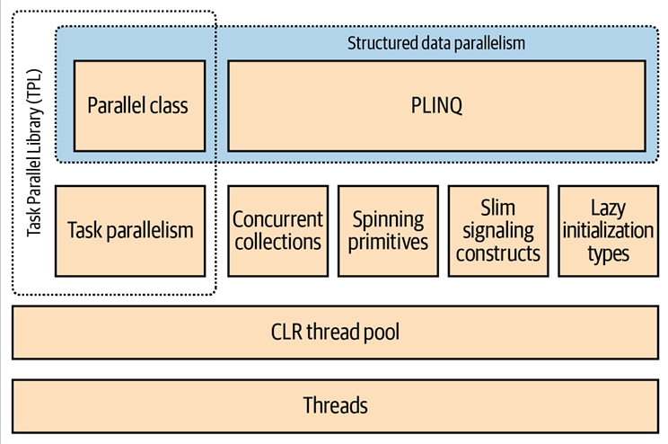

# فصل بیست و دوم:  برنامه‌نویسی موازی (Parallel Programming)

در این فصل، ما به **APIها** و ساختارهای چندنخی (multithreading) می‌پردازیم که با هدف بهره‌برداری از پردازنده‌های چند‌هسته‌ای طراحی شده‌اند:

* **Parallel LINQ (PLINQ)**
* **کلاس Parallel**
* **ساختارهای task parallelism**
* **مجموعه‌های concurrent**

این ساختارها در مجموع (به‌صورت غیررسمی) با عنوان **Parallel Framework (PFX)** شناخته می‌شوند.
کلاس **Parallel** همراه با ساختارهای **task parallelism** تحت عنوان **Task Parallel Library (TPL)** نامیده می‌شوند.

پیش از مطالعه‌ی این فصل، لازم است با مفاهیم پایه‌ای در فصل ۱۴ آشنا باشید—به‌ویژه **locking**، **ایمنی نخ‌ها (thread safety)** و کلاس **Task**.

🔧 علاوه بر این‌ها، .NET مجموعه‌ای از APIهای تخصصی دیگر را برای کمک به برنامه‌نویسی موازی و ناهمگام ارائه می‌دهد:

* **System.Threading.Channels.Channel** → یک صف تولیدکننده/مصرف‌کننده ناهمگام با کارایی بالا، که در **.NET Core 3** معرفی شد.
* **Microsoft Dataflow** (در فضای نام System.Threading.Tasks.Dataflow) → یک API پیشرفته برای ایجاد شبکه‌ای از بلوک‌های بافر شده (buffered blocks) که عملیات یا تبدیل داده‌ها را به‌صورت موازی اجرا می‌کنند و شباهت زیادی به برنامه‌نویسی actor/agent دارند.
* **Reactive Extensions** → پیاده‌سازی LINQ روی **IObservable** (جایگزینی برای **IAsyncEnumerable**) که در ترکیب جریان‌های ناهمگام بسیار قدرتمند است. این قابلیت از طریق بسته‌ی **System.Reactive NuGet** عرضه می‌شود.

---

## چرا PFX؟ 🤔

در ۱۵ سال گذشته، سازندگان CPU از پردازنده‌های تک‌هسته‌ای به چند‌هسته‌ای مهاجرت کرده‌اند. این موضوع برای ما برنامه‌نویسان مشکل‌ساز است، زیرا کدهای تک‌نخی به‌طور خودکار از هسته‌های بیشتر سریع‌تر اجرا نمی‌شوند.

استفاده از چند‌هسته در بسیاری از برنامه‌های سمت سرور ساده است، چون هر نخ می‌تواند یک درخواست مشتری جداگانه را به‌طور مستقل پردازش کند. اما روی دسکتاپ این موضوع دشوارتر است، چون معمولاً نیاز دارید کدی را که محاسبات سنگین دارد به این صورت تغییر دهید:

1. تقسیم آن به قطعه‌های کوچک‌تر.
2. اجرای این قطعه‌ها به‌صورت موازی با چندنخی.
3. جمع‌آوری نتایج در زمانی که آماده می‌شوند، به شکلی **ایمن از نظر نخ‌ها** و کارا.

البته انجام همه‌ی این مراحل با ساختارهای کلاسیک چندنخی ممکن است، اما دست‌وپاگیر است—به‌خصوص مراحل تقسیم‌بندی و جمع‌آوری نتایج. مشکل دیگر این است که استراتژی رایج **locking برای ایمنی نخ‌ها**، هنگام کار هم‌زمان چند نخ روی داده‌های مشترک، باعث ایجاد رقابت (contention) زیادی می‌شود.

کتابخانه‌های **PFX** دقیقاً برای حل این سناریوها طراحی شده‌اند.

---

## مفاهیم PFX 🧩

برنامه‌نویسی برای بهره‌برداری از چند‌هسته یا چند پردازنده، **parallel programming** نام دارد. این موضوع یک زیرمجموعه از مفهوم گسترده‌تر **multithreading** است.

دو استراتژی اصلی برای تقسیم کار بین نخ‌ها وجود دارد:

* **Data Parallelism (موازی‌سازی داده‌ها)**
* **Task Parallelism (موازی‌سازی وظایف)**

🔹 در **data parallelism**، وقتی مجموعه‌ای از وظایف باید روی داده‌های زیادی اجرا شوند، هر نخ همان مجموعه وظایف را روی بخشی از داده‌ها اجرا می‌کند. در واقع داده‌ها بین نخ‌ها تقسیم می‌شوند.

🔹 در **task parallelism**، ما وظایف را تقسیم می‌کنیم؛ به این معنا که هر نخ وظیفه‌ای متفاوت را اجرا می‌کند.

به‌طور کلی، **data parallelism** ساده‌تر است و روی سخت‌افزارهایی با قابلیت موازی‌سازی بالا بهتر مقیاس‌پذیر است، زیرا داده‌های مشترک را کاهش می‌دهد یا حذف می‌کند (در نتیجه مشکلات رقابت و ایمنی نخ‌ها نیز کمتر می‌شود). علاوه‌بر این، معمولاً داده‌ها بیش از وظایف جداگانه هستند، و این امر پتانسیل موازی‌سازی را افزایش می‌دهد.

**Data parallelism** همچنین زمینه‌ساز **structured parallelism** است؛ به این معنا که کارهای موازی در یک نقطه از برنامه شروع و در همان‌جا نیز پایان می‌یابند. در مقابل، **task parallelism** معمولاً **unstructured** است، یعنی کارهای موازی ممکن است در بخش‌های پراکنده‌ای از برنامه شروع و پایان یابند.

🔑 **Structured parallelism** ساده‌تر، کم‌خطاتر، و امکان واگذاری کارهای دشوار مانند تقسیم‌بندی، هماهنگی نخ‌ها و حتی جمع‌آوری نتایج را به کتابخانه‌ها فراهم می‌کند.

---

## اجزای PFX 🏗️

کتابخانه‌ی **PFX** از دو لایه‌ی اصلی تشکیل شده است (مطابق شکل 22-1):

* **لایه بالاتر** → شامل دو API برای data parallelism ساختاریافته:

  * **PLINQ**
  * **کلاس Parallel**

* **لایه پایین‌تر** → شامل کلاس‌های task parallelism به‌علاوه مجموعه‌ای از ساختارهای کمکی برای فعالیت‌های برنامه‌نویسی موازی.

 

    
 

