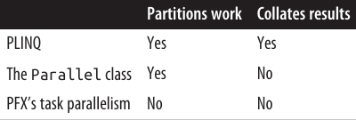

# فصل بیست و دوم:  برنامه‌نویسی موازی (Parallel Programming)

در این فصل، ما به **APIها** و ساختارهای چندنخی (multithreading) می‌پردازیم که با هدف بهره‌برداری از پردازنده‌های چند‌هسته‌ای طراحی شده‌اند:

* **Parallel LINQ (PLINQ)**
* **کلاس Parallel**
* **ساختارهای task parallelism**
* **مجموعه‌های concurrent**

این ساختارها در مجموع (به‌صورت غیررسمی) با عنوان **Parallel Framework (PFX)** شناخته می‌شوند.
کلاس **Parallel** همراه با ساختارهای **task parallelism** تحت عنوان **Task Parallel Library (TPL)** نامیده می‌شوند.

پیش از مطالعه‌ی این فصل، لازم است با مفاهیم پایه‌ای در فصل ۱۴ آشنا باشید—به‌ویژه **locking**، **ایمنی نخ‌ها (thread safety)** و کلاس **Task**.

🔧 علاوه بر این‌ها، .NET مجموعه‌ای از APIهای تخصصی دیگر را برای کمک به برنامه‌نویسی موازی و ناهمگام ارائه می‌دهد:

* **System.Threading.Channels.Channel** → یک صف تولیدکننده/مصرف‌کننده ناهمگام با کارایی بالا، که در **.NET Core 3** معرفی شد.
* **Microsoft Dataflow** (در فضای نام System.Threading.Tasks.Dataflow) → یک API پیشرفته برای ایجاد شبکه‌ای از بلوک‌های بافر شده (buffered blocks) که عملیات یا تبدیل داده‌ها را به‌صورت موازی اجرا می‌کنند و شباهت زیادی به برنامه‌نویسی actor/agent دارند.
* **Reactive Extensions** → پیاده‌سازی LINQ روی **IObservable** (جایگزینی برای **IAsyncEnumerable**) که در ترکیب جریان‌های ناهمگام بسیار قدرتمند است. این قابلیت از طریق بسته‌ی **System.Reactive NuGet** عرضه می‌شود.

---

## چرا PFX؟ 🤔

در ۱۵ سال گذشته، سازندگان CPU از پردازنده‌های تک‌هسته‌ای به چند‌هسته‌ای مهاجرت کرده‌اند. این موضوع برای ما برنامه‌نویسان مشکل‌ساز است، زیرا کدهای تک‌نخی به‌طور خودکار از هسته‌های بیشتر سریع‌تر اجرا نمی‌شوند.

استفاده از چند‌هسته در بسیاری از برنامه‌های سمت سرور ساده است، چون هر نخ می‌تواند یک درخواست مشتری جداگانه را به‌طور مستقل پردازش کند. اما روی دسکتاپ این موضوع دشوارتر است، چون معمولاً نیاز دارید کدی را که محاسبات سنگین دارد به این صورت تغییر دهید:

1. تقسیم آن به قطعه‌های کوچک‌تر.
2. اجرای این قطعه‌ها به‌صورت موازی با چندنخی.
3. جمع‌آوری نتایج در زمانی که آماده می‌شوند، به شکلی **ایمن از نظر نخ‌ها** و کارا.

البته انجام همه‌ی این مراحل با ساختارهای کلاسیک چندنخی ممکن است، اما دست‌وپاگیر است—به‌خصوص مراحل تقسیم‌بندی و جمع‌آوری نتایج. مشکل دیگر این است که استراتژی رایج **locking برای ایمنی نخ‌ها**، هنگام کار هم‌زمان چند نخ روی داده‌های مشترک، باعث ایجاد رقابت (contention) زیادی می‌شود.

کتابخانه‌های **PFX** دقیقاً برای حل این سناریوها طراحی شده‌اند.

---

## مفاهیم PFX 🧩

برنامه‌نویسی برای بهره‌برداری از چند‌هسته یا چند پردازنده، **parallel programming** نام دارد. این موضوع یک زیرمجموعه از مفهوم گسترده‌تر **multithreading** است.

دو استراتژی اصلی برای تقسیم کار بین نخ‌ها وجود دارد:

* **Data Parallelism (موازی‌سازی داده‌ها)**
* **Task Parallelism (موازی‌سازی وظایف)**

🔹 در **data parallelism**، وقتی مجموعه‌ای از وظایف باید روی داده‌های زیادی اجرا شوند، هر نخ همان مجموعه وظایف را روی بخشی از داده‌ها اجرا می‌کند. در واقع داده‌ها بین نخ‌ها تقسیم می‌شوند.

🔹 در **task parallelism**، ما وظایف را تقسیم می‌کنیم؛ به این معنا که هر نخ وظیفه‌ای متفاوت را اجرا می‌کند.

به‌طور کلی، **data parallelism** ساده‌تر است و روی سخت‌افزارهایی با قابلیت موازی‌سازی بالا بهتر مقیاس‌پذیر است، زیرا داده‌های مشترک را کاهش می‌دهد یا حذف می‌کند (در نتیجه مشکلات رقابت و ایمنی نخ‌ها نیز کمتر می‌شود). علاوه‌بر این، معمولاً داده‌ها بیش از وظایف جداگانه هستند، و این امر پتانسیل موازی‌سازی را افزایش می‌دهد.

**Data parallelism** همچنین زمینه‌ساز **structured parallelism** است؛ به این معنا که کارهای موازی در یک نقطه از برنامه شروع و در همان‌جا نیز پایان می‌یابند. در مقابل، **task parallelism** معمولاً **unstructured** است، یعنی کارهای موازی ممکن است در بخش‌های پراکنده‌ای از برنامه شروع و پایان یابند.

🔑 **Structured parallelism** ساده‌تر، کم‌خطاتر، و امکان واگذاری کارهای دشوار مانند تقسیم‌بندی، هماهنگی نخ‌ها و حتی جمع‌آوری نتایج را به کتابخانه‌ها فراهم می‌کند.

---

## اجزای PFX 🏗️

کتابخانه‌ی **PFX** از دو لایه‌ی اصلی تشکیل شده است (مطابق شکل 22-1):

* **لایه بالاتر** → شامل دو API برای data parallelism ساختاریافته:

  * **PLINQ**
  * **کلاس Parallel**

* **لایه پایین‌تر** → شامل کلاس‌های task parallelism به‌علاوه مجموعه‌ای از ساختارهای کمکی برای فعالیت‌های برنامه‌نویسی موازی.

 <div align="center">
    
 
</div>

### PLINQ ✨

**PLINQ** غنی‌ترین قابلیت‌ها را ارائه می‌دهد: این ابزار تمام مراحل موازی‌سازی را به‌طور خودکار انجام می‌دهد—از جمله:

* تقسیم کار به وظایف (tasks)
* اجرای این وظایف روی نخ‌ها (threads)
* جمع‌آوری نتایج در یک توالی خروجی واحد

به همین دلیل آن را **Declarative** می‌نامند—چون شما فقط اعلام می‌کنید که می‌خواهید کارتان موازی‌سازی شود (به‌صورت یک پرس‌و‌جوی LINQ ساختاربندی‌شده) و خودِ **runtime** جزئیات پیاده‌سازی را مدیریت می‌کند.

در مقابل، رویکردهای دیگر **Imperative** هستند؛ یعنی شما باید به‌طور صریح کدی بنویسید تا کار را تقسیم یا نتایج را جمع‌آوری کنید.

همان‌طور که خلاصه‌ی زیر نشان می‌دهد:

* در مورد **کلاس Parallel** → شما باید نتایج را خودتان جمع‌آوری کنید.
* در مورد **ساختارهای task parallelism** → شما باید علاوه بر جمع‌آوری نتایج، تقسیم کار را نیز خودتان انجام دهید.

 <div align="center">
    
 
</div>

### مجموعه‌های Concurrent و Spinning Primitives ⚙️

**مجموعه‌های concurrent** و **spinning primitives** به شما در فعالیت‌های سطح پایین‌تر برنامه‌نویسی موازی کمک می‌کنند. اهمیت این ابزارها از آنجاست که **PFX** نه‌تنها برای سخت‌افزار امروزی بلکه برای نسل‌های آینده‌ی پردازنده‌ها با تعداد هسته‌های بسیار بیشتر طراحی شده است.

فرض کنید باید یک توده چوب خردشده را جابه‌جا کنید و ۳۲ کارگر در اختیار دارید؛ بزرگ‌ترین چالش این است که کارگران بدون مزاحمت برای یکدیگر بتوانند کار کنند. دقیقا همین موضوع در تقسیم یک الگوریتم بین ۳۲ هسته رخ می‌دهد: اگر از **lockهای معمولی** برای محافظت از منابع مشترک استفاده شود، قفل شدن‌ها (blocking) باعث می‌شوند تنها بخشی از هسته‌ها واقعاً فعال باشند.

🔑 مجموعه‌های concurrent به‌طور خاص برای دسترسی‌های بسیار هم‌زمان تنظیم شده‌اند، با تمرکز بر **حداقل‌سازی یا حذف قفل شدن**.
کلاس **Parallel** و همچنین **PLINQ** خودشان برای مدیریت کار به‌صورت کارآمد، متکی بر همین مجموعه‌ها و **spinning primitives** هستند.

---

## کاربردهای دیگر PFX 🛠️

ساختارهای برنامه‌نویسی موازی تنها برای استفاده از چند‌هسته نیستند، بلکه در سناریوهای دیگر هم مفید واقع می‌شوند:

* وقتی به یک **queue**، **stack** یا **dictionary** ایمن از نظر نخ‌ها (thread-safe) نیاز دارید.
* **BlockingCollection** راهی ساده برای پیاده‌سازی ساختارهای تولیدکننده/مصرف‌کننده فراهم می‌کند و همچنین روشی مناسب برای محدودسازی هم‌زمانی است.
* **Tasks** پایه‌ی اصلی برنامه‌نویسی ناهمگام هستند (همان‌طور که در فصل ۱۴ دیدیم).

---

## چه زمانی باید از PFX استفاده کرد؟ ⏱️

مورد اصلی استفاده از **PFX**، **برنامه‌نویسی موازی** است: یعنی بهره‌برداری از چند‌هسته برای سرعت‌بخشیدن به کدهای محاسباتی سنگین.

یکی از چالش‌های مهم در برنامه‌نویسی موازی، **قانون Amdahl** است. این قانون می‌گوید بیشترین بهبود کارایی از موازی‌سازی، توسط بخشی از کد که باید به‌صورت ترتیبی (sequential) اجرا شود محدود می‌گردد.

📌 مثال: اگر تنها دوسوم زمان اجرای یک الگوریتم قابل موازی‌سازی باشد، حتی با بی‌نهایت هسته نمی‌توانید بیش از سه برابر افزایش کارایی داشته باشید.

بنابراین، پیش از ادامه باید مطمئن شوید که گلوگاه واقعاً در بخشی از کد است که قابلیت موازی‌سازی دارد. همچنین باید بررسی کنید که آیا اصلاً کد شما نیاز به محاسبات سنگین دارد یا خیر—زیرا **بهینه‌سازی** اغلب ساده‌ترین و مؤثرترین راهکار است.
البته این موضوع یک معامله دارد، چون برخی روش‌های بهینه‌سازی می‌توانند موازی‌سازی کد را سخت‌تر کنند.

بیشترین سود در مواردی به‌دست می‌آید که به آن‌ها **embarrassingly parallel problems** می‌گویند—یعنی زمانی که یک کار به‌راحتی می‌تواند به وظایف جداگانه تقسیم شود و هرکدام به‌طور مستقل و کارآمد اجرا شوند.

📷 نمونه‌ها:

* بسیاری از وظایف پردازش تصویر
* ray tracing
* روش‌های brute-force در ریاضیات یا رمزنگاری

نمونه‌ی یک **مشکل غیر embarrassingly parallel**، پیاده‌سازی یک نسخه‌ی بهینه از الگوریتم **quicksort** است—که برای رسیدن به نتیجه خوب نیازمند فکر بیشتری است و شاید به **unstructured parallelism** نیاز داشته باشد.

---

## PLINQ ⚡

**PLINQ** پرس‌و‌جوهای LINQ محلی را به‌طور خودکار موازی‌سازی می‌کند.
مزیت بزرگ آن این است که بار تقسیم کار و جمع‌آوری نتایج را به‌طور کامل به **.NET** واگذار می‌کند.

برای استفاده از PLINQ، کافیست روی توالی ورودی، متد **AsParallel()** را فراخوانی کرده و سپس پرس‌وجوی LINQ را مثل همیشه ادامه دهید.

نمونه‌ی زیر عددهای اول بین ۳ تا ۱۰۰,۰۰۰ را با استفاده کامل از تمام هسته‌های ماشین محاسبه می‌کند:

```csharp
// محاسبه اعداد اول با یک الگوریتم ساده (غیربهینه).
IEnumerable<int> numbers = Enumerable.Range (3, 100000 - 3);

var parallelQuery =
    from n in numbers.AsParallel()
    where Enumerable.Range (2, (int) Math.Sqrt(n)).All (i => n % i > 0)
    select n;

int[] primes = parallelQuery.ToArray();
```

🔍 متد **AsParallel** یک **extension method** در **System.Linq.ParallelEnumerable** است. این متد ورودی را در یک توالی بر پایه‌ی **ParallelQuery<TSource>** می‌پیچد. همین موضوع باعث می‌شود عملگرهای پرس‌وجوی LINQ که در ادامه فراخوانی می‌کنید، به مجموعه‌ای جایگزین از متدهای توسعه‌یافته در **ParallelEnumerable** متصل شوند.

این متدها پیاده‌سازی‌های موازی از هر یک از عملگرهای استاندارد پرس‌وجو را فراهم می‌کنند. اساس کار آن‌ها این است که توالی ورودی را به بخش‌هایی تقسیم می‌کنند تا روی نخ‌های مختلف اجرا شوند و سپس نتایج را دوباره در یک توالی خروجی واحد گردآوری کنند (مطابق شکل 22-2).

