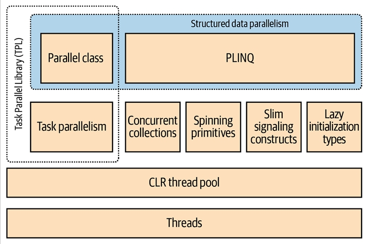
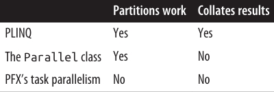
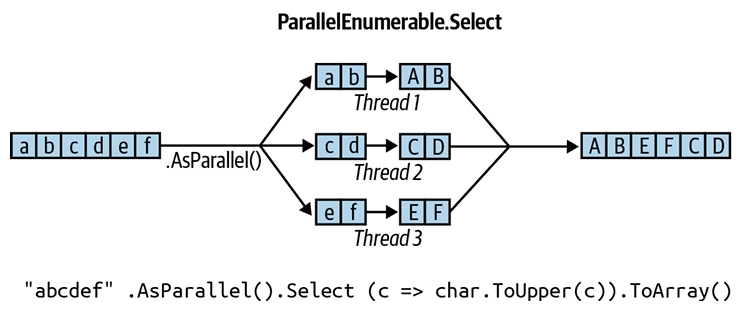
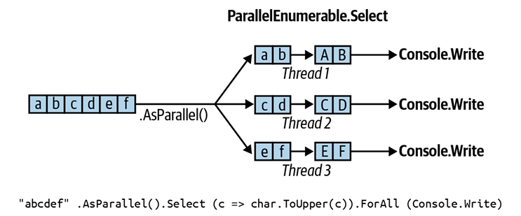
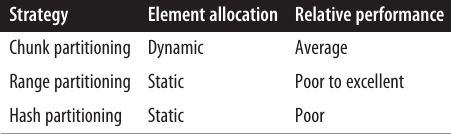
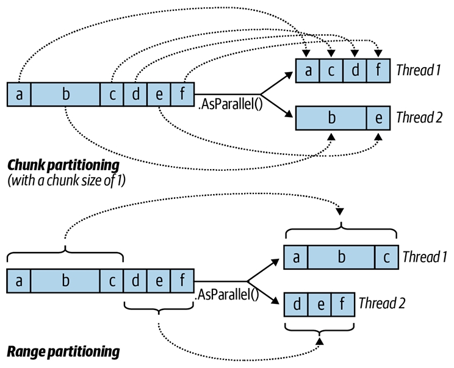
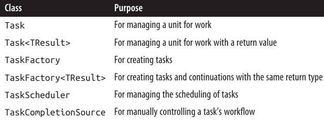
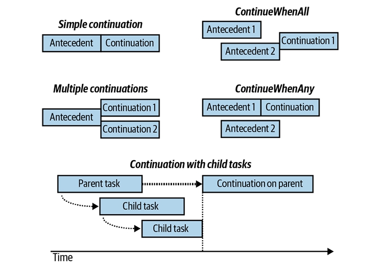
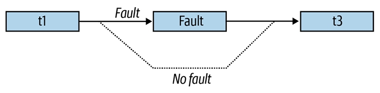
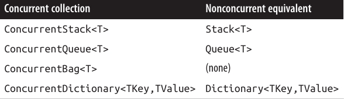

<div dir="rtl">
# فصل بیست و دوم:  برنامه‌نویسی موازی (Parallel Programming)

در این فصل، ما به **APIها** و ساختارهای چندنخی (multithreading) می‌پردازیم که با هدف بهره‌برداری از پردازنده‌های چند‌هسته‌ای طراحی شده‌اند:

* **Parallel LINQ (PLINQ)**
* **کلاس Parallel**
* **ساختارهای task parallelism**
* **مجموعه‌های concurrent**

این ساختارها در مجموع (به‌صورت غیررسمی) با عنوان **Parallel Framework (PFX)** شناخته می‌شوند.
کلاس **Parallel** همراه با ساختارهای **task parallelism** تحت عنوان **Task Parallel Library (TPL)** نامیده می‌شوند.

پیش از مطالعه‌ی این فصل، لازم است با مفاهیم پایه‌ای در فصل ۱۴ آشنا باشید—به‌ویژه **locking**، **ایمنی نخ‌ها (thread safety)** و کلاس **Task**.

🔧 علاوه بر این‌ها، .NET مجموعه‌ای از APIهای تخصصی دیگر را برای کمک به برنامه‌نویسی موازی و ناهمگام ارائه می‌دهد:

* **System.Threading.Channels.Channel** → یک صف تولیدکننده/مصرف‌کننده ناهمگام با کارایی بالا، که در **.NET Core 3** معرفی شد.
* **Microsoft Dataflow** (در فضای نام System.Threading.Tasks.Dataflow) → یک API پیشرفته برای ایجاد شبکه‌ای از بلوک‌های بافر شده (buffered blocks) که عملیات یا تبدیل داده‌ها را به‌صورت موازی اجرا می‌کنند و شباهت زیادی به برنامه‌نویسی actor/agent دارند.
* **Reactive Extensions** → پیاده‌سازی LINQ روی **IObservable** (جایگزینی برای **IAsyncEnumerable**) که در ترکیب جریان‌های ناهمگام بسیار قدرتمند است. این قابلیت از طریق بسته‌ی **System.Reactive NuGet** عرضه می‌شود.

---

## چرا PFX؟ 🤔

در ۱۵ سال گذشته، سازندگان CPU از پردازنده‌های تک‌هسته‌ای به چند‌هسته‌ای مهاجرت کرده‌اند. این موضوع برای ما برنامه‌نویسان مشکل‌ساز است، زیرا کدهای تک‌نخی به‌طور خودکار از هسته‌های بیشتر سریع‌تر اجرا نمی‌شوند.

استفاده از چند‌هسته در بسیاری از برنامه‌های سمت سرور ساده است، چون هر نخ می‌تواند یک درخواست مشتری جداگانه را به‌طور مستقل پردازش کند. اما روی دسکتاپ این موضوع دشوارتر است، چون معمولاً نیاز دارید کدی را که محاسبات سنگین دارد به این صورت تغییر دهید:

1. تقسیم آن به قطعه‌های کوچک‌تر.
2. اجرای این قطعه‌ها به‌صورت موازی با چندنخی.
3. جمع‌آوری نتایج در زمانی که آماده می‌شوند، به شکلی **ایمن از نظر نخ‌ها** و کارا.

البته انجام همه‌ی این مراحل با ساختارهای کلاسیک چندنخی ممکن است، اما دست‌وپاگیر است—به‌خصوص مراحل تقسیم‌بندی و جمع‌آوری نتایج. مشکل دیگر این است که استراتژی رایج **locking برای ایمنی نخ‌ها**، هنگام کار هم‌زمان چند نخ روی داده‌های مشترک، باعث ایجاد رقابت (contention) زیادی می‌شود.

کتابخانه‌های **PFX** دقیقاً برای حل این سناریوها طراحی شده‌اند.

---

## مفاهیم PFX 🧩

برنامه‌نویسی برای بهره‌برداری از چند‌هسته یا چند پردازنده، **parallel programming** نام دارد. این موضوع یک زیرمجموعه از مفهوم گسترده‌تر **multithreading** است.

دو استراتژی اصلی برای تقسیم کار بین نخ‌ها وجود دارد:

* **Data Parallelism (موازی‌سازی داده‌ها)**
* **Task Parallelism (موازی‌سازی وظایف)**

🔹 در **data parallelism**، وقتی مجموعه‌ای از وظایف باید روی داده‌های زیادی اجرا شوند، هر نخ همان مجموعه وظایف را روی بخشی از داده‌ها اجرا می‌کند. در واقع داده‌ها بین نخ‌ها تقسیم می‌شوند.

🔹 در **task parallelism**، ما وظایف را تقسیم می‌کنیم؛ به این معنا که هر نخ وظیفه‌ای متفاوت را اجرا می‌کند.

به‌طور کلی، **data parallelism** ساده‌تر است و روی سخت‌افزارهایی با قابلیت موازی‌سازی بالا بهتر مقیاس‌پذیر است، زیرا داده‌های مشترک را کاهش می‌دهد یا حذف می‌کند (در نتیجه مشکلات رقابت و ایمنی نخ‌ها نیز کمتر می‌شود). علاوه‌بر این، معمولاً داده‌ها بیش از وظایف جداگانه هستند، و این امر پتانسیل موازی‌سازی را افزایش می‌دهد.

**Data parallelism** همچنین زمینه‌ساز **structured parallelism** است؛ به این معنا که کارهای موازی در یک نقطه از برنامه شروع و در همان‌جا نیز پایان می‌یابند. در مقابل، **task parallelism** معمولاً **unstructured** است، یعنی کارهای موازی ممکن است در بخش‌های پراکنده‌ای از برنامه شروع و پایان یابند.

🔑 **Structured parallelism** ساده‌تر، کم‌خطاتر، و امکان واگذاری کارهای دشوار مانند تقسیم‌بندی، هماهنگی نخ‌ها و حتی جمع‌آوری نتایج را به کتابخانه‌ها فراهم می‌کند.

---

## اجزای PFX 🏗️

کتابخانه‌ی **PFX** از دو لایه‌ی اصلی تشکیل شده است (مطابق شکل 22-1):

* **لایه بالاتر** → شامل دو API برای data parallelism ساختاریافته:

  * **PLINQ**
  * **کلاس Parallel**

* **لایه پایین‌تر** → شامل کلاس‌های task parallelism به‌علاوه مجموعه‌ای از ساختارهای کمکی برای فعالیت‌های برنامه‌نویسی موازی.

 <div align="center">
    
 
</div>

### PLINQ ✨

**PLINQ** غنی‌ترین قابلیت‌ها را ارائه می‌دهد: این ابزار تمام مراحل موازی‌سازی را به‌طور خودکار انجام می‌دهد—از جمله:

* تقسیم کار به وظایف (tasks)
* اجرای این وظایف روی نخ‌ها (threads)
* جمع‌آوری نتایج در یک توالی خروجی واحد

به همین دلیل آن را **Declarative** می‌نامند—چون شما فقط اعلام می‌کنید که می‌خواهید کارتان موازی‌سازی شود (به‌صورت یک پرس‌و‌جوی LINQ ساختاربندی‌شده) و خودِ **runtime** جزئیات پیاده‌سازی را مدیریت می‌کند.

در مقابل، رویکردهای دیگر **Imperative** هستند؛ یعنی شما باید به‌طور صریح کدی بنویسید تا کار را تقسیم یا نتایج را جمع‌آوری کنید.

همان‌طور که خلاصه‌ی زیر نشان می‌دهد:

* در مورد **کلاس Parallel** → شما باید نتایج را خودتان جمع‌آوری کنید.
* در مورد **ساختارهای task parallelism** → شما باید علاوه بر جمع‌آوری نتایج، تقسیم کار را نیز خودتان انجام دهید.

 <div align="center">
    
 
</div>

### مجموعه‌های Concurrent و Spinning Primitives ⚙️

**مجموعه‌های concurrent** و **spinning primitives** به شما در فعالیت‌های سطح پایین‌تر برنامه‌نویسی موازی کمک می‌کنند. اهمیت این ابزارها از آنجاست که **PFX** نه‌تنها برای سخت‌افزار امروزی بلکه برای نسل‌های آینده‌ی پردازنده‌ها با تعداد هسته‌های بسیار بیشتر طراحی شده است.

فرض کنید باید یک توده چوب خردشده را جابه‌جا کنید و ۳۲ کارگر در اختیار دارید؛ بزرگ‌ترین چالش این است که کارگران بدون مزاحمت برای یکدیگر بتوانند کار کنند. دقیقا همین موضوع در تقسیم یک الگوریتم بین ۳۲ هسته رخ می‌دهد: اگر از **lockهای معمولی** برای محافظت از منابع مشترک استفاده شود، قفل شدن‌ها (blocking) باعث می‌شوند تنها بخشی از هسته‌ها واقعاً فعال باشند.

🔑 مجموعه‌های concurrent به‌طور خاص برای دسترسی‌های بسیار هم‌زمان تنظیم شده‌اند، با تمرکز بر **حداقل‌سازی یا حذف قفل شدن**.
کلاس **Parallel** و همچنین **PLINQ** خودشان برای مدیریت کار به‌صورت کارآمد، متکی بر همین مجموعه‌ها و **spinning primitives** هستند.

---

## کاربردهای دیگر PFX 🛠️

ساختارهای برنامه‌نویسی موازی تنها برای استفاده از چند‌هسته نیستند، بلکه در سناریوهای دیگر هم مفید واقع می‌شوند:

* وقتی به یک **queue**، **stack** یا **dictionary** ایمن از نظر نخ‌ها (thread-safe) نیاز دارید.
* **BlockingCollection** راهی ساده برای پیاده‌سازی ساختارهای تولیدکننده/مصرف‌کننده فراهم می‌کند و همچنین روشی مناسب برای محدودسازی هم‌زمانی است.
* **Tasks** پایه‌ی اصلی برنامه‌نویسی ناهمگام هستند (همان‌طور که در فصل ۱۴ دیدیم).

---

## چه زمانی باید از PFX استفاده کرد؟ ⏱️

مورد اصلی استفاده از **PFX**، **برنامه‌نویسی موازی** است: یعنی بهره‌برداری از چند‌هسته برای سرعت‌بخشیدن به کدهای محاسباتی سنگین.

یکی از چالش‌های مهم در برنامه‌نویسی موازی، **قانون Amdahl** است. این قانون می‌گوید بیشترین بهبود کارایی از موازی‌سازی، توسط بخشی از کد که باید به‌صورت ترتیبی (sequential) اجرا شود محدود می‌گردد.

📌 مثال: اگر تنها دوسوم زمان اجرای یک الگوریتم قابل موازی‌سازی باشد، حتی با بی‌نهایت هسته نمی‌توانید بیش از سه برابر افزایش کارایی داشته باشید.

بنابراین، پیش از ادامه باید مطمئن شوید که گلوگاه واقعاً در بخشی از کد است که قابلیت موازی‌سازی دارد. همچنین باید بررسی کنید که آیا اصلاً کد شما نیاز به محاسبات سنگین دارد یا خیر—زیرا **بهینه‌سازی** اغلب ساده‌ترین و مؤثرترین راهکار است.
البته این موضوع یک معامله دارد، چون برخی روش‌های بهینه‌سازی می‌توانند موازی‌سازی کد را سخت‌تر کنند.

بیشترین سود در مواردی به‌دست می‌آید که به آن‌ها **embarrassingly parallel problems** می‌گویند—یعنی زمانی که یک کار به‌راحتی می‌تواند به وظایف جداگانه تقسیم شود و هرکدام به‌طور مستقل و کارآمد اجرا شوند.

📷 نمونه‌ها:

* بسیاری از وظایف پردازش تصویر
* ray tracing
* روش‌های brute-force در ریاضیات یا رمزنگاری

نمونه‌ی یک **مشکل غیر embarrassingly parallel**، پیاده‌سازی یک نسخه‌ی بهینه از الگوریتم **quicksort** است—که برای رسیدن به نتیجه خوب نیازمند فکر بیشتری است و شاید به **unstructured parallelism** نیاز داشته باشد.

---

## PLINQ ⚡

**PLINQ** پرس‌و‌جوهای LINQ محلی را به‌طور خودکار موازی‌سازی می‌کند.
مزیت بزرگ آن این است که بار تقسیم کار و جمع‌آوری نتایج را به‌طور کامل به **.NET** واگذار می‌کند.

برای استفاده از PLINQ، کافیست روی توالی ورودی، متد **AsParallel()** را فراخوانی کرده و سپس پرس‌وجوی LINQ را مثل همیشه ادامه دهید.

نمونه‌ی زیر عددهای اول بین ۳ تا ۱۰۰,۰۰۰ را با استفاده کامل از تمام هسته‌های ماشین محاسبه می‌کند:
</div>

```csharp
// محاسبه اعداد اول با یک الگوریتم ساده (غیربهینه).
IEnumerable<int> numbers = Enumerable.Range (3, 100000 - 3);

var parallelQuery =
    from n in numbers.AsParallel()
    where Enumerable.Range (2, (int) Math.Sqrt(n)).All (i => n % i > 0)
    select n;

int[] primes = parallelQuery.ToArray();
```

<div dir="rtl">
🔍 متد **AsParallel** یک **extension method** در **System.Linq.ParallelEnumerable** است. این متد ورودی را در یک توالی بر پایه‌ی **ParallelQuery<TSource>** می‌پیچد. همین موضوع باعث می‌شود عملگرهای پرس‌وجوی LINQ که در ادامه فراخوانی می‌کنید، به مجموعه‌ای جایگزین از متدهای توسعه‌یافته در **ParallelEnumerable** متصل شوند.

این متدها پیاده‌سازی‌های موازی از هر یک از عملگرهای استاندارد پرس‌وجو را فراهم می‌کنند. اساس کار آن‌ها این است که توالی ورودی را به بخش‌هایی تقسیم می‌کنند تا روی نخ‌های مختلف اجرا شوند و سپس نتایج را دوباره در یک توالی خروجی واحد گردآوری کنند (مطابق شکل 22-2).

 <div align="center">
    
 
</div>

### استفاده از AsSequential() 🔄

فراخوانی **AsSequential()** باعث می‌شود که یک توالی **ParallelQuery** باز (unwrap) شود، به‌طوری‌که عملگرهای پرس‌و‌جو (query operators) بعدی به عملگرهای استاندارد LINQ متصل شده و به‌صورت ترتیبی (sequential) اجرا شوند.

این موضوع زمانی ضروری است که:

* بخواهید متدی را فراخوانی کنید که دارای **اثر جانبی (side effect)** باشد.
* یا متد مورد نظر **thread-safe** نباشد.

برای عملگرهای پرس‌و‌جویی که **دو توالی ورودی** دریافت می‌کنند (مثل **Join, GroupJoin, Concat, Union, Intersect, Except و Zip**) باید روی هر دو توالی ورودی، متد **AsParallel()** اعمال شود؛ در غیر این صورت خطا (exception) پرتاب خواهد شد.

نکته: نیازی نیست در طول پیشرفت یک پرس‌و‌جو مدام **AsParallel()** را اعمال کنید، زیرا عملگرهای پرس‌و‌جوی PLINQ خودشان یک **ParallelQuery** دیگر برمی‌گردانند. در واقع، فراخوانی دوباره‌ی AsParallel ناکارآمد است، چون باعث ادغام (merge) و تقسیم‌بندی مجدد پرس‌و‌جو می‌شود:
</div>

```csharp
mySequence.AsParallel()           // توالی را به ParallelQuery<int> می‌پیچد
          .Where (n => n > 100)   // یک ParallelQuery<int> دیگر تولید می‌کند
          .AsParallel()           // غیرضروری و ناکارآمد!
          .Select (n => n * n);
```

<div dir="rtl">
---

### محدودیت‌ها و نکات PLINQ ⚠️

* همه‌ی عملگرهای پرس‌و‌جو به‌طور مؤثر قابل موازی‌سازی نیستند. برای این موارد (بخش “PLINQ Limitations” در صفحه ۹۳۸)، **PLINQ** عملگر را به‌صورت ترتیبی اجرا می‌کند.
* اگر PLINQ تشخیص دهد سربار موازی‌سازی بیشتر از سود آن است، پرس‌و‌جو را به‌صورت ترتیبی اجرا خواهد کرد.
* **PLINQ فقط روی مجموعه‌های محلی کار می‌کند**؛ مثلاً با **Entity Framework** سازگار نیست، چون در آن حالت LINQ به SQL ترجمه می‌شود و روی سرور پایگاه داده اجرا خواهد شد. با این حال می‌توانید PLINQ را برای پرس‌و‌جوهای محلی روی نتایج حاصل از دیتابیس به‌کار ببرید.
* اگر یک پرس‌و‌جوی PLINQ استثنا پرتاب کند، این خطا به‌شکل **AggregateException** دوباره پرتاب می‌شود، که خاصیت **InnerExceptions** آن خطا یا خطاهای واقعی را در خود نگه می‌دارد (برای جزئیات، به “Working with AggregateException” در صفحه ۹۶۴ مراجعه کنید).

---

### چرا AsParallel به‌صورت پیش‌فرض فعال نیست؟ 🤔

با توجه به اینکه **AsParallel** پرس‌و‌جوهای LINQ را به‌طور شفاف موازی‌سازی می‌کند، این پرسش پیش می‌آید: چرا مایکروسافت عملگرهای استاندارد LINQ را به‌طور پیش‌فرض موازی نکرد و PLINQ را به حالت پیش‌فرض تبدیل نکرد؟

دلایل این رویکرد opt-in عبارتند از:

1. برای اینکه PLINQ مفید باشد، باید حجم قابل‌توجهی از کار محاسباتی سنگین وجود داشته باشد.
   اکثر پرس‌و‌جوهای LINQ-to-Objects خیلی سریع اجرا می‌شوند؛ در این حالت نه‌تنها موازی‌سازی غیرضروری است، بلکه سربار تقسیم‌بندی، جمع‌آوری و هماهنگی نخ‌های اضافی می‌تواند اجرای کد را کندتر کند.

2. تفاوت‌های رفتاری:

   * خروجی یک پرس‌و‌جوی PLINQ (به‌طور پیش‌فرض) می‌تواند از نظر **ترتیب عناصر** با LINQ عادی متفاوت باشد (بخش “PLINQ and Ordering” در صفحه ۹۳۷).
   * PLINQ استثناها را درون یک **AggregateException** می‌پیچد (چون ممکن است چند استثنا به‌طور هم‌زمان رخ دهند).
   * اگر پرس‌و‌جو متدهای غیر thread-safe را فراخوانی کند، نتایج PLINQ قابل‌اعتماد نخواهند بود.

3. PLINQ قابلیت‌های متعددی برای **تنظیم و بهینه‌سازی** دارد. افزودن این پیچیدگی‌ها به API استاندارد LINQ-to-Objects باعث شلوغی و حواس‌پرتی می‌شد.

---

### رفتار اجرایی موازی (Parallel Execution Ballistics) 🎯

مانند پرس‌و‌جوهای عادی LINQ، پرس‌و‌جوهای **PLINQ** نیز **lazy evaluation** دارند. یعنی اجرا فقط زمانی آغاز می‌شود که شروع به مصرف نتایج کنید—معمولاً با یک حلقه‌ی **foreach** (یا با یک عملگر تبدیلی مثل **ToArray** یا عملگری که یک عنصر/مقدار منفرد برمی‌گرداند).

اما هنگام شمارش نتایج، نحوه‌ی اجرا با پرس‌و‌جوهای ترتیبی معمولی متفاوت است:

* در پرس‌و‌جوی ترتیبی، همه‌چیز کاملاً توسط مصرف‌کننده و به‌صورت **pull** انجام می‌شود؛ یعنی هر عنصر دقیقاً زمانی واکشی می‌شود که مصرف‌کننده به آن نیاز دارد.
* در پرس‌و‌جوی موازی، نخ‌های مستقل عناصر ورودی را کمی زودتر از زمان نیاز مصرف‌کننده واکشی می‌کنند (مثل تله‌پرومتر برای مجریان اخبار 📺). سپس این عناصر در طول زنجیره‌ی پرس‌و‌جو به‌صورت موازی پردازش می‌شوند. نتایج در یک بافر کوچک نگه‌داری می‌شوند تا در لحظه برای مصرف‌کننده آماده باشند.
* اگر مصرف‌کننده مکث کند یا زودتر از شمارش کامل خارج شود، پردازشگر پرس‌و‌جو هم متوقف یا مکث می‌کند تا از هدر رفتن CPU و حافظه جلوگیری شود.

---

### تنظیم بافر در PLINQ 📦

می‌توانید رفتار بافر PLINQ را با فراخوانی **WithMergeOptions** بعد از **AsParallel** تغییر دهید:

* **AutoBuffered (پیش‌فرض)** → معمولاً بهترین کارایی کلی را می‌دهد.
* **NotBuffered** → بافر را غیرفعال می‌کند و برای مواقعی مناسب است که می‌خواهید نتایج را سریع‌تر و بلافاصله ببینید.
* **FullyBuffered** → کل مجموعه نتایج را قبل از ارائه به مصرف‌کننده ذخیره می‌کند (عملگرهایی مانند **OrderBy** و **Reverse** و همچنین عملگرهای مربوط به **element**، **aggregation** و **conversion** ذاتاً همین‌گونه عمل می‌کنند).

### 📌 PLINQ و ترتیب (Ordering)

یکی از عوارض جانبی موازی‌سازی عملگرهای پرس‌وجو این است که هنگام جمع‌آوری نتایج، **لزومی ندارد ترتیب عناصر مثل حالت اولیه باقی بماند** (به شکل 22-2 مراجعه کنید).
به بیان دیگر، تضمین **حفظ ترتیب** در LINQ برای توالی‌ها در PLINQ برقرار نیست.

اگر به **حفظ ترتیب** نیاز داشته باشید، می‌توانید پس از `AsParallel()` از `AsOrdered()` استفاده کنید:
</div>

```csharp
myCollection.AsParallel().AsOrdered()...
```

<div dir="rtl">
استفاده از `AsOrdered` هنگام کار با مجموعه‌های بزرگ باعث کاهش کارایی می‌شود، چون PLINQ باید موقعیت اصلی هر عنصر را دنبال کند.

می‌توانید اثر `AsOrdered` را در ادامه‌ی پرس‌وجو با استفاده از `AsUnordered` خنثی کنید. این کار یک “نقطه‌ی تصادفی در ترتیب” ایجاد می‌کند که به پرس‌وجو اجازه می‌دهد از آن نقطه به بعد کارایی بهتری داشته باشد.
برای مثال، اگر بخواهید ترتیب ورودی فقط برای دو عملگر اول حفظ شود:
</div>

```csharp
inputSequence.AsParallel().AsOrdered()
  .QueryOperator1()
  .QueryOperator2()
  .AsUnordered()
      // از اینجا به بعد ترتیب اهمیتی ندارد
  .QueryOperator3()
  ...
```

<div dir="rtl">
🔹 دلیل اینکه `AsOrdered` پیش‌فرض نیست این است که در بیشتر پرس‌وجوها، ترتیب اولیه اهمیتی ندارد. اگر قرار بود `AsOrdered` پیش‌فرض باشد، برای اکثر پرس‌وجوهای موازی باید `AsUnordered` اضافه می‌کردید تا بهترین کارایی حاصل شود، و این باعث پیچیدگی و بار اضافی می‌شد.

---

### ⚠️ محدودیت‌های PLINQ

همه‌ی عملگرهای پرس‌وجو را نمی‌توان به‌طور مؤثر موازی‌سازی کرد. موارد زیر محدودیت دارند:

* نسخه‌های اندیس‌دار `Select`، `SelectMany` و `ElementAt` فقط زمانی موازی‌سازی می‌شوند که عناصر منبع در موقعیت اندیسی اصلی خود باقی مانده باشند.

  > بیشتر عملگرها موقعیت اندیس را تغییر می‌دهند (مثل `Where` که عناصر را حذف می‌کند). بنابراین اگر می‌خواهید از عملگرهای اندیس‌دار استفاده کنید، معمولاً باید آنها در ابتدای پرس‌وجو باشند.

* عملگرهای زیر قابل موازی‌سازی هستند، اما از استراتژی تقسیم‌بندی پرهزینه‌ای استفاده می‌کنند که گاهی حتی از پردازش ترتیبی کندتر است:
  `Join`, `GroupBy`, `GroupJoin`, `Distinct`, `Union`, `Intersect`, `Except`

* نسخه‌های **Seeded** از عملگر `Aggregate` در حالت عادی قابل موازی‌سازی نیستند. PLINQ برای این مورد نسخه‌های خاصی ارائه می‌دهد (بخش *Optimizing PLINQ* در صفحه 942).

* همه‌ی عملگرهای دیگر موازی‌سازی می‌شوند، اما این تضمین نمی‌کند که پرس‌وجوی شما **حتماً** موازی شود. اگر PLINQ تشخیص دهد سربار موازی‌سازی پرس‌وجو را کند می‌کند، ممکن است آن را ترتیبی اجرا کند.
  ✅ می‌توانید با این کد رفتار را مجبور به موازی‌سازی کنید:
</div>

```csharp
.WithExecutionMode(ParallelExecutionMode.ForceParallelism)
```

<div dir="rtl">
---

### 📝 مثال: بررسی املا (Spellchecker) موازی

فرض کنید می‌خواهیم یک **بررسی‌کننده‌ی املای سریع** برای اسناد بزرگ بنویسیم که از تمام هسته‌های CPU استفاده کند. با تبدیل الگوریتم به یک پرس‌وجوی LINQ، می‌توانیم به‌راحتی آن را موازی کنیم.

🔹 مرحله‌ی اول: دانلود یک **دیکشنری از کلمات انگلیسی** و ذخیره در `HashSet` برای جست‌وجوی سریع:
</div>

```csharp
if (!File.Exists("WordLookup.txt"))    // حدود 150,000 کلمه
    File.WriteAllText("WordLookup.txt",
        await new HttpClient().GetStringAsync(
            "http://www.albahari.com/ispell/allwords.txt"));

var wordLookup = new HashSet<string>(
    File.ReadAllLines("WordLookup.txt"),
    StringComparer.InvariantCultureIgnoreCase);
```

<div dir="rtl">
🔹 مرحله‌ی دوم: ایجاد یک “سند آزمایشی” شامل یک میلیون کلمه‌ی تصادفی، سپس ایجاد چند غلط املایی عمدی:
</div>

```csharp
var random = new Random();
string[] wordList = wordLookup.ToArray();

string[] wordsToTest = Enumerable.Range(0, 1000000)
    .Select(i => wordList[random.Next(0, wordList.Length)])
    .ToArray();

wordsToTest[12345] = "woozsh";   // چند غلط املایی
wordsToTest[23456] = "wubsie";
```

<div dir="rtl">
🔹 مرحله‌ی سوم: اجرای بررسی موازی با PLINQ:
</div>

```csharp
var query = wordsToTest
    .AsParallel()
    .Select((word, index) => (word, index))
    .Where(iword => !wordLookup.Contains(iword.word))
    .OrderBy(iword => iword.index);

foreach (var mistake in query)
    Console.WriteLine(mistake.word + " - index = " + mistake.index);

// خروجی:
// woozsh - index = 12345
// wubsie - index = 23456
```

<div dir="rtl">
متد `wordLookup.Contains` در predicate به پرس‌وجو **حجم پردازشی مناسبی** می‌دهد و ارزش موازی‌سازی را ایجاد می‌کند.

---

### 📦 نکته درباره‌ی کارایی و حافظه

در پرس‌وجو از **Tuple**‌ها `(word, index)` به‌جای **نوع ناشناس (anonymous types)** استفاده شده است.
چون Tupleها به‌صورت **Value Type** پیاده‌سازی شده‌اند (نه Reference Type):

* مصرف حافظه در اوج کاهش می‌یابد ✅
* کارایی بهتر می‌شود ✅
* تخصیص‌های heap و جمع‌آوری زباله (Garbage Collection) کمتر می‌شود ✅

📊 البته بنچمارک‌ها نشان می‌دهند این مزایا در عمل **متوسط** هستند، چون مدیر حافظه بسیار کارآمد است و این تخصیص‌ها معمولاً بیش از **Generation 0** دوام نمی‌آورند.

### 🧵 استفاده از `ThreadLocal<T>`

بیایید مثال خودمان را گسترش دهیم و **ایجاد لیست تصادفی کلمات آزمایشی** را نیز موازی‌سازی کنیم.
ما آن را به‌صورت یک پرس‌وجوی LINQ ساختاربندی کردیم، پس باید ساده باشد.

🔹 نسخه‌ی ترتیبی:
</div>

```csharp
string[] wordsToTest = Enumerable.Range(0, 1000000)
    .Select(i => wordList[random.Next(0, wordList.Length)])
    .ToArray();
```

<div dir="rtl">
اما مشکل اینجاست که فراخوانی `random.Next` **Thread-Safe** نیست؛ بنابراین به‌سادگی نمی‌توانیم `AsParallel()` را در پرس‌وجو وارد کنیم.

راه‌حل احتمالی این است که متدی بنویسیم که دور `random.Next` قفل بگذارد؛ اما این باعث محدود شدن هم‌زمانی (Concurrency) می‌شود.
✅ راه‌حل بهتر این است که از `ThreadLocal<Random>` (بخش *Thread-Local Storage* صفحه 923) استفاده کنیم تا برای هر نخ یک شیء `Random` جداگانه ساخته شود.

🔹 نسخه‌ی موازی:
</div>

```csharp
var localRandom = new ThreadLocal<Random>(
    () => new Random(Guid.NewGuid().GetHashCode()));

string[] wordsToTest = Enumerable.Range(0, 1000000).AsParallel()
    .Select(i => wordList[localRandom.Value.Next(0, wordList.Length)])
    .ToArray();
```

<div dir="rtl">
در تابع کارخانه‌ای که برای ایجاد یک شیء `Random` نوشتیم، از هش (`HashCode`) یک `Guid` استفاده کردیم تا مطمئن شویم اگر دو شیء `Random` در یک بازه‌ی زمانی کوتاه ساخته شوند، دنباله‌ی اعداد تصادفی‌شان متفاوت خواهد بود. 🎲

---

### 🤔 چه زمانی از PLINQ استفاده کنیم؟

ممکن است وسوسه شوید در برنامه‌های موجود خود به‌دنبال پرس‌وجوهای LINQ بگردید و آنها را موازی‌سازی کنید.
اما این معمولاً بی‌فایده است، چون مسائلی که LINQ بهترین راه‌حل برایشان محسوب می‌شود، خیلی سریع اجرا می‌شوند و موازی‌سازی کمکی نمی‌کند.

✅ رویکرد بهتر:

* پیدا کردن یک **گلوگاه CPU-محور**
* سپس بررسی اینکه آیا می‌توان آن را به‌صورت یک پرس‌وجوی LINQ بیان کرد

🔹 یک اثر جانبی خوشایند این بازنویسی این است که کد **کوچک‌تر و خواناتر** می‌شود.

📌 PLINQ برای مسائلی که به‌طور واضح **Embarrassingly Parallel** هستند عالی است.
اما برای پردازش تصویر (Imaging) انتخاب خوبی نیست، چون جمع‌آوری میلیون‌ها پیکسل در یک توالی خروجی خودش تبدیل به گلوگاه می‌شود.
راه بهتر این است که پیکسل‌ها را مستقیماً در یک آرایه یا بلوک حافظه‌ی unmanaged بنویسیم و از **کلاس Parallel** یا **task parallelism** برای مدیریت چندریسمانی استفاده کنیم.

(با این حال می‌توان با متد `ForAll` جمع‌آوری نتایج را حذف کرد—بخش *Optimizing PLINQ* صفحه 942 توضیح می‌دهد. این کار وقتی منطقی است که الگوریتم پردازش تصویر ذاتاً مناسب LINQ باشد.)

---

### 🧼 خلوص تابعی (Functional Purity)

چون PLINQ پرس‌وجوی شما را روی نخ‌های موازی اجرا می‌کند، باید مراقب باشید عملیاتی انجام ندهید که **Thread-Safe** نیستند.

به‌ویژه، نوشتن در متغیرها اثر جانبی دارد و بنابراین ناامن است:
</div>

```csharp
// پرس‌وجوی زیر هر عنصر را در موقعیتش ضرب می‌کند.
// با ورودی Enumerable.Range(0,999) باید مربع‌ها را بدهد.
int i = 0;
var query = from n in Enumerable.Range(0,999).AsParallel()
            select n * i++;
```

<div dir="rtl">
حتی اگر افزایش `i` را با قفل ایمن کنیم، باز هم مشکل باقی می‌ماند چون `i` لزوماً با موقعیت عنصر ورودی تطابق ندارد.
افزودن `AsOrdered` هم مشکل را حل نمی‌کند؛ چون فقط تضمین می‌کند خروجی به‌ترتیب عناصر پردازش‌شده باشد، نه اینکه واقعاً پردازش ترتیبی انجام شود.

✅ راه‌حل درست: استفاده از نسخه‌ی اندیس‌دار `Select`:
</div>

```csharp
var query = Enumerable.Range(0,999).AsParallel()
                      .Select((n, i) => n * i);
```

<div dir="rtl">
🔹 برای بهترین کارایی، متدهایی که در عملگرهای پرس‌وجو فراخوانی می‌شوند باید **Thread-Safe** باشند؛

* یا به‌دلیل نداشتن اثر جانبی (خالص بودن تابع)
* یا اگر به‌وسیله‌ی قفل ایمن شده‌اند، باید بدانید که پتانسیل موازی‌سازی محدود به اثرات رقابت خواهد بود.

---

### ⚙️ تنظیم درجه‌ی موازی‌سازی (Degree of Parallelism)

به‌طور پیش‌فرض، PLINQ درجه‌ی موازی‌سازی بهینه برای پردازنده را انتخاب می‌کند.
می‌توانید آن را با متد `WithDegreeOfParallelism` تغییر دهید:
</div>

```csharp
...AsParallel().WithDegreeOfParallelism(4)...
```

<div dir="rtl">
🔹 نمونه: شاید بخواهید درجه‌ی موازی‌سازی را بالاتر از تعداد هسته‌ها افزایش دهید، وقتی کار **I/O-Bound** دارید (مثلاً دانلود هم‌زمان صفحات وب).
بااین‌حال، **Task combinators** و **توابع Asynchronous** راه‌حل مشابه اما کارآمدتری ارائه می‌دهند.

🚫 برخلاف Tasks، PLINQ نمی‌تواند کارهای I/O-Bound را بدون مسدود کردن نخ‌ها انجام دهد (و این بدتر باعث قفل شدن نخ‌های pool می‌شود).

📍 توجه:
`WithDegreeOfParallelism` را فقط **یک‌بار** می‌توان در یک پرس‌وجوی PLINQ فراخوانی کرد.
اگر نیاز دارید دوباره صدا بزنید، باید پرس‌وجو را merge و دوباره partition کنید (با صدا زدن دوباره‌ی `AsParallel`).

مثال:
</div>

```csharp
"The Quick Brown Fox"
    .AsParallel().WithDegreeOfParallelism(2)
    .Where(c => !char.IsWhiteSpace(c))
    .AsParallel().WithDegreeOfParallelism(3)   // Merge + Partition دوباره
    .Select(c => char.ToUpper(c));
```

<div dir="rtl">
---

### ⏹ لغو (Cancellation)

لغو کردن یک پرس‌وجوی PLINQ که در حال مصرف نتایجش در `foreach` هستید ساده است:
کافی است از حلقه خارج شوید (`break`) و پرس‌وجو به‌طور خودکار لغو می‌شود، چون enumerator به‌طور ضمنی Dispose می‌شود.

اما اگر پرس‌وجو با یک عملگر تبدیل، تک‌عنصر یا تجمیعی خاتمه یابد، باید آن را از یک نخ دیگر با **CancellationToken** لغو کنید.

برای درج توکن، بعد از `AsParallel` از `WithCancellation` استفاده کنید و خاصیت `Token` از یک `CancellationTokenSource` را پاس دهید.

مثال:
</div>

```csharp
IEnumerable<int> tenMillion = Enumerable.Range(3, 10_000_000);

var cancelSource = new CancellationTokenSource();
cancelSource.CancelAfter(100);   // لغو بعد از 100 میلی‌ثانیه

var primeNumberQuery =
    from n in tenMillion.AsParallel().WithCancellation(cancelSource.Token)
    where Enumerable.Range(2, (int)Math.Sqrt(n)).All(i => n % i > 0)
    select n;

try
{
    int[] primes = primeNumberQuery.ToArray();
    // هرگز به این خط نمی‌رسیم چون نخ دیگر ما را لغو می‌کند
}
catch (OperationCanceledException)
{
    Console.WriteLine("Query canceled");
}
```

<div dir="rtl">
🔹 هنگام لغو، PLINQ منتظر می‌ماند هر نخ کاری روی عنصر جاری‌اش تمام کند، سپس پرس‌وجو پایان می‌یابد.
این یعنی هر متد خارجی که پرس‌وجو فراخوانی کرده باشد، تا انتها اجرا خواهد شد.
### بهینه‌سازی PLINQ 🚀

#### بهینه‌سازی در سمت خروجی

یکی از مزیت‌های **PLINQ** این است که نتایج پردازش موازی را به‌طور مرتب در یک دنباله‌ی خروجی واحد جمع‌آوری (collate) می‌کند.
اما گاهی همه‌ی کاری که در نهایت انجام می‌دهید این است که روی هر عنصر فقط یک تابع را اجرا کنید:
</div>

```csharp
foreach (int n in parallelQuery)
    DoSomething(n);
```

<div dir="rtl">
اگر چنین شرایطی داشته باشید—و برایتان مهم نباشد که عناصر به چه ترتیبی پردازش می‌شوند—می‌توانید با استفاده از متد **ForAll** در PLINQ کارایی را بهبود بدهید ✅.

---

#### متد ForAll

متد **ForAll** یک delegate را روی هر عنصر خروجی یک `ParallelQuery` اجرا می‌کند. این متد مستقیماً به هسته‌ی داخلی PLINQ وصل می‌شود و مراحل جمع‌آوری و پیمایش نتایج (collating و enumerating) را دور می‌زند.

🔹 مثال ساده:
</div>

```csharp
"abcdef"
    .AsParallel()
    .Select(c => char.ToUpper(c))
    .ForAll(Console.Write);
```

<div dir="rtl">
---

📊 **شکل 22-3** این فرآیند را نشان می‌دهد.

 <div align="center">
    
 
</div>

### بهینه‌سازی PLINQ 🚀

#### جمع‌آوری و پیمایش نتایج (Collating & Enumerating)

عملیات جمع‌آوری (collating) و پیمایش (enumerating) نتایج، ذاتاً **خیلی پرهزینه نیستند**.
به همین دلیل، بهینه‌سازی با استفاده از متد **ForAll** بیشترین سود را زمانی به همراه دارد که:

* تعداد عناصر ورودی خیلی زیاد باشد 🔢
* و هر عنصر به‌سرعت پردازش شود ⚡

---

#### بهینه‌سازی در سمت ورودی (Input-side Optimization)

برای اینکه داده‌ها را بین رشته‌ها (threads) تقسیم کند، **PLINQ** از **سه استراتژی پارتیشن‌بندی (Partitioning Strategies)** استفاده می‌کند:

1. **Range Partitioning (پارتیشن‌بندی بازه‌ای)**

   * برای دنباله‌های عددی یا داده‌های ایندکس‌دار مناسب است.
   * ورودی به بازه‌های پیوسته تقسیم می‌شود و هر بازه به یک thread اختصاص داده می‌شود.

2. **Chunk Partitioning (پارتیشن‌بندی قطعه‌ای / تکه‌ای)**

   * داده‌ها در قطعات (chunks) کوچک تقسیم می‌شوند.
   * این روش باعث بالانس بهتر بین threadها می‌شود، مخصوصاً وقتی زمان پردازش عناصر **نامتوازن** باشد.

3. **Hash Partitioning (پارتیشن‌بندی هش)**

   * با استفاده از یک **کلید هش**، عناصر به threadهای مختلف اختصاص داده می‌شوند.
   * برای سناریوهایی که داده‌ها ساختار خاصی دارند مفید است.

 <div align="center">
    
 
</div>

### بهینه‌سازی PLINQ در پارتیشن‌بندی ⚡

#### عملگرهایی که نیاز به مقایسه دارند

برای عملگرهای LINQ که نیازمند **مقایسه عناصر** هستند (مانند:
`GroupBy`، `Join`، `GroupJoin`، `Intersect`، `Except`، `Union` و `Distinct`) ✅
هیچ انتخابی وجود ندارد: **PLINQ همیشه از Hash Partitioning استفاده می‌کند**.

* در این حالت PLINQ باید از قبل **hashcode** همه عناصر را محاسبه کند تا اطمینان یابد عناصر با hashcode مشابه روی همان thread پردازش می‌شوند.
* این روش می‌تواند نسبتاً **کند** باشد.
* اگر سرعت برایتان مسئله‌ساز شد، تنها گزینه این است که با **AsSequential** موازی‌سازی را غیرفعال کنید.

---

#### سایر عملگرهای کوئری

برای دیگر عملگرها، شما می‌توانید انتخاب کنید بین:

* **Range Partitioning** 🟦
* **Chunk Partitioning** 🟩

به‌صورت پیش‌فرض:

* اگر دنباله ورودی **ایندکس‌پذیر** باشد (مثل آرایه‌ها یا چیزی که `IList<T>` پیاده‌سازی کرده)،
  ➝ **PLINQ از Range Partitioning استفاده می‌کند**.
* در غیر این صورت،
  ➝ **Chunk Partitioning انتخاب می‌شود**.

---

#### مقایسه کلی 🔍

* **Range Partitioning** → سریع‌تر است برای دنباله‌های طولانی که پردازش هر عنصر تقریباً **یکسان** زمان می‌برد.
* **Chunk Partitioning** → در سایر مواقع معمولاً سریع‌تر است، به‌ویژه وقتی پردازش عناصر **نامتوازن** باشد.

---

#### اجبار به Range Partitioning

1. اگر کوئری با `Enumerable.Range` شروع می‌شود، آن را با `ParallelEnumerable.Range` جایگزین کنید.
2. در غیر این صورت، کافی است روی ورودی `ToList` یا `ToArray` صدا بزنید (البته این خودش هزینه‌ی کارایی دارد).

📌 نکته مهم:
`ParallelEnumerable.Range` فقط یک شورتکات برای `Enumerable.Range(...).AsParallel()` نیست؛ بلکه واقعاً باعث **فعال شدن Range Partitioning** می‌شود و رفتار کوئری را تغییر می‌دهد.

---

#### اجبار به Chunk Partitioning

برای این کار باید دنباله ورودی را با `Partitioner.Create` (از فضای نام `System.Collections.Concurrent`) بپیچید:
</div>

```csharp
int[] numbers = { 3, 4, 5, 6, 7, 8, 9 };
var parallelQuery =
    Partitioner.Create(numbers, true).AsParallel()
              .Where(...);
```

<div dir="rtl">
* آرگومان دوم (`true`) مشخص می‌کند که می‌خواهید **load balancing** فعال باشد، یعنی Chunk Partitioning استفاده شود.

---

#### نحوه کار Chunk Partitioning ⚙️

* هر thread به‌طور دوره‌ای چند عنصر (یک "chunk") را برمی‌دارد.
* در ابتدا chunkها خیلی کوچک هستند (۱ یا ۲ عنصر).
* با پیشرفت کوئری، اندازه chunkها بیشتر می‌شود.
* این روش باعث می‌شود:

  * دنباله‌های کوچک به‌خوبی موازی شوند ✅
  * و دنباله‌های بزرگ باعث **رفت‌وبرگشت بیش‌ازحد (round-tripping)** نشوند.
* اگر یک thread عناصر "ساده‌تر" بگیرد، سریع‌تر آزاد می‌شود و chunks بیشتری پردازش می‌کند.
* نتیجه → همه threads مشغول و **متعادل** می‌مانند.
* تنها مشکل → نیاز به **synchronization** (مثل lock اختصاصی) برای دسترسی به دنباله ورودی است که می‌تواند کمی overhead ایجاد کند.

---

#### نحوه کار Range Partitioning 🧮

* در Range Partitioning، ورودی از همان ابتدا بین threads تقسیم می‌شود.
* هر thread بخش **ثابتی** از داده را می‌گیرد → بدون نیاز به lock.
* مشکل: اگر بعضی threads عناصر "ساده‌تر" بگیرند و زودتر تمام کنند، بقیه هنوز در حال کار خواهند بود → و این باعث idle شدن threadها می‌شود.

📌 مثال: محاسبه اعداد اول با Range Partitioning ممکن است عملکرد ضعیفی داشته باشد.
📌 اما محاسبه ریشه دوم ۱۰ میلیون عدد اول (که زمان پردازش هر عنصر یکسان است) بسیار خوب عمل می‌کند:
</div>

```csharp
ParallelEnumerable.Range(1, 10_000_000).Sum(i => Math.Sqrt(i));
```

<div dir="rtl">
<div align="center">
    
 
</div>

### بهینه‌سازی Aggregation در PLINQ ⚙️

#### ParallelEnumerable.Range

متد `ParallelEnumerable.Range` یک `ParallelQuery<T>` برمی‌گرداند، بنابراین نیازی به فراخوانی بعدی **AsParallel** نیست.

* پارتیشن‌بندی Range لزوماً عناصر را در بلوک‌های متوالی تخصیص نمی‌دهد؛ ممکن است از استراتژی **Striping** استفاده کند.
* مثال: اگر دو worker داشته باشیم، یکی عناصر **فرد** و دیگری عناصر **زوج** را پردازش می‌کند.
* عملگر `TakeWhile` تقریباً همیشه از این استراتژی استفاده می‌کند تا از پردازش اضافی عناصر در انتهای دنباله جلوگیری کند.

---

#### بهینه‌سازی Aggregation سفارشی

PLINQ عملگرهای استاندارد مانند `Sum`، `Average`، `Min` و `Max` را به‌صورت موازی و بهینه مدیریت می‌کند.
اما **Aggregate** چالش‌های خاصی دارد.

مثال ساده از Aggregate (جمع کردن یک دنباله اعداد):
</div>

```csharp
int[] numbers = { 1, 2, 3 };
int sum = numbers.Aggregate(0, (total, n) => total + n); // 6
```

<div dir="rtl">
* برای **aggregation بدون seed**، delegate ارائه‌شده باید **associative** و **commutative** باشد.
* اگر این قانون رعایت نشود، PLINQ ممکن است نتایج اشتباه بدهد، زیرا چند seed از دنباله برای جمع‌بندی چند پارتیشن استفاده می‌کند.

---

#### Aggregate با seed چندگانه

* Aggregate با seed صریح معمولاً به‌صورت **سریالی** اجرا می‌شود زیرا فقط یک seed دارد.
* PLINQ یک overload خاص ارائه می‌دهد که **seed factory** می‌گیرد.

  * برای هر thread، این تابع یک seed محلی ایجاد می‌کند → **accumulator محلی**
  * سپس مقادیر محلی با accumulator اصلی ترکیب می‌شوند.
* این overload همچنین یک delegate برای **تبدیل نهایی** نتایج می‌گیرد.

چهار delegate به ترتیب:

1. `seedFactory` → ایجاد accumulator محلی
2. `updateAccumulatorFunc` → اضافه کردن یک عنصر به accumulator محلی
3. `combineAccumulatorFunc` → ترکیب accumulator محلی با اصلی
4. `resultSelector` → تبدیل نهایی نتیجه

مثال ساده جمع اعداد با PLINQ:
</div>

```csharp
numbers.AsParallel().Aggregate(
    () => 0,                           // seedFactory
    (localTotal, n) => localTotal + n, // updateAccumulatorFunc
    (mainTot, localTot) => mainTot + localTot, // combineAccumulatorFunc
    finalResult => finalResult          // resultSelector
);
```

<div dir="rtl">
---

#### مثال واقعی‌تر: شمارش فرکانس حروف در متن

متن:
</div>

```csharp
string text = "Let’s suppose this is a really long string";
var letterFrequencies = new int[26];
foreach (char c in text)
{
    int index = char.ToUpper(c) - 'A';
    if (index >= 0 && index < 26) letterFrequencies[index]++;
}
```

<div dir="rtl">
* برای متن‌های طولانی (مثل **gene sequencing**) این روش می‌تواند زمان‌بر باشد.
* موازی‌سازی با `Parallel.ForEach` نیازمند مدیریت همزمانی روی آرایه مشترک است، و قفل کردن می‌تواند **پتانسیل موازی‌سازی** را از بین ببرد.

PLINQ با Aggregate راه‌حل تمیزی ارائه می‌دهد:
</div>

```csharp
int[] result = text.AsParallel().Aggregate(
    () => new int[26],               // accumulator محلی
    (localFrequencies, c) =>        // جمع‌بندی در accumulator محلی
    {
        int index = char.ToUpper(c) - 'A';
        if (index >= 0 && index < 26) localFrequencies[index]++;
        return localFrequencies;
    },
    (mainFreq, localFreq) =>         // ترکیب local -> main
        mainFreq.Zip(localFreq, (f1, f2) => f1 + f2).ToArray(),
    finalResult => finalResult        // تبدیل نهایی
);
```

<div dir="rtl">
* توجه: تابع محلی `localFrequencies` عناصر را تغییر می‌دهد.
* این بهینه‌سازی امکان‌پذیر است چون هر accumulator محلی **مختص هر thread** است.

### کلاس Parallel 🟢

کتابخانه PFX یک شکل پایه از **Structured Parallelism** ارائه می‌دهد که از طریق سه متد **static** در کلاس `Parallel` قابل استفاده است:

* `Parallel.Invoke`
  اجرای یک آرایه از delegateها به‌صورت موازی

* `Parallel.For`
  معادل موازی حلقه `for` در C#

* `Parallel.ForEach`
  معادل موازی حلقه `foreach` در C#

> هر سه متد تا تکمیل همه‌ی کارها، بلاک می‌شوند. مشابه PLINQ، در صورت بروز **exception** که مدیریت نشده باشد، سایر workerها بعد از اتمام iteration فعلی متوقف می‌شوند و exceptionها به caller برمی‌گردند—که در یک `AggregateException` بسته‌بندی شده‌اند.

---

#### Parallel.Invoke

`Parallel.Invoke` یک آرایه از delegateهای **Action** را موازی اجرا کرده و منتظر اتمام آن‌ها می‌ماند. ساده‌ترین امضای متد:
</div>

```csharp
public static void Invoke(params Action[] actions);
```

<div dir="rtl">
* مشابه PLINQ، متدهای `Parallel.*` برای کارهای **compute-bound** بهینه شده‌اند، نه I/O-bound.
* مثال ساده با دانلود دو صفحه وب به صورت موازی:
</div>

```csharp
Parallel.Invoke(
    () => new WebClient().DownloadFile("http://www.linqpad.net", "lp.html"),
    () => new WebClient().DownloadFile("http://microsoft.com", "ms.html")
);
```

<div dir="rtl">
**نکته مهم:**
`Parallel.Invoke` حتی با یک میلیون delegate هم به‌صورت مؤثر کار می‌کند، زیرا عناصر را به **batch** تقسیم می‌کند و به چند Task اصلی اختصاص می‌دهد، به جای ایجاد یک Task برای هر delegate.

> مسئولیت collating نتایج بر عهده شماست؛ بنابراین باید به **Thread Safety** توجه کنید:
</div>

```csharp
var data = new List<string>();
Parallel.Invoke(
    () => data.Add(new WebClient().DownloadString("http://www.foo.com")),
    () => data.Add(new WebClient().DownloadString("http://www.far.com"))
);
```

<div dir="rtl">
* برای حل مشکل thread-unsafe، می‌توان از **locking** استفاده کرد، اما این کار در آرایه‌های بزرگ delegate باعث **bottleneck** می‌شود.
* راه بهتر: استفاده از **Thread-Safe Collections**، مانند `ConcurrentBag`.

همچنین `Parallel.Invoke` یک overload دارد که **ParallelOptions** می‌گیرد:
</div>

```csharp
public static void Invoke(ParallelOptions options, params Action[] actions);
```

<div dir="rtl">
* با `ParallelOptions` می‌توان **CancellationToken** وارد کرد، حداکثر concurrency را محدود کرد، یا یک **task scheduler** سفارشی مشخص کرد.

---

#### Parallel.For و Parallel.ForEach

این متدها معادل موازی حلقه‌های `for` و `foreach` هستند، به این معنا که هر iteration به‌صورت موازی اجرا می‌شود.

ساده‌ترین امضاها:
</div>

```csharp
public static ParallelLoopResult For(int fromInclusive, int toExclusive, Action<int> body);
public static ParallelLoopResult ForEach<TSource>(IEnumerable<TSource> source, Action<TSource> body);
```

<div dir="rtl">
مثال:

حلقه `for` معمولی:
</div>

```csharp
for (int i = 0; i < 100; i++)
    Foo(i);
```

<div dir="rtl">
معادل موازی:
</div>

```csharp
Parallel.For(0, 100, i => Foo(i));
// یا ساده‌تر
Parallel.For(0, 100, Foo);
```

<div dir="rtl">
حلقه `foreach` معمولی:
</div>

```csharp
foreach (char c in "Hello, world")
    Foo(c);
```

<div dir="rtl">
معادل موازی:
</div>

```csharp
Parallel.ForEach("Hello, world", Foo);
```

<div dir="rtl">
مثال عملی با رمزنگاری (`System.Security.Cryptography`):
</div>

```csharp
var keyPairs = new string[6];
Parallel.For(0, keyPairs.Length,
    i => keyPairs[i] = RSA.Create().ToXmlString(true));
```

<div dir="rtl">
* مشابه `Parallel.Invoke`، می‌توان تعداد زیادی work item به `Parallel.For` و `Parallel.ForEach` داد و آن‌ها به‌صورت مؤثر روی چند Task تقسیم می‌شوند.
* همان کار را می‌توان با PLINQ انجام داد:
</div>

```csharp
string[] keyPairs = ParallelEnumerable.Range(0, 6)
    .Select(i => RSA.Create().ToXmlString(true))
    .ToArray();
```

<div dir="rtl">
---

#### حلقه‌های داخلی و خارجی

* `Parallel.For` و `Parallel.ForEach` معمولاً روی **حلقه‌های خارجی** بهتر عمل می‌کنند، زیرا chunkهای بزرگتری برای موازی‌سازی ارائه می‌دهند و overhead مدیریت کمتر می‌شود.
* موازی‌سازی هر دو حلقه داخلی و خارجی معمولاً غیرضروری است.

مثال:
</div>

```csharp
Parallel.For(0, 100, i =>
{
    Parallel.For(0, 50, j => Foo(i, j));   // حلقه داخلی: معمولاً sequential بهتر است
});
```

<div dir="rtl">
### Parallel.ForEach با اندیس و مدیریت توقف حلقه 🟢

گاهی اوقات در **حلقه‌های موازی** لازم است که **اندیس iteration** را بدانیم.

#### اندیس در حلقه‌های موازی

در حلقه sequential معمولی:
</div>

```csharp
int i = 0;
foreach (char c in "Hello, world")
    Console.WriteLine(c.ToString() + i++);
```

<div dir="rtl">
اما در محیط موازی، **افزایش یک متغیر مشترک thread-safe نیست**.
راه حل: استفاده از overload ای از `Parallel.ForEach` که اندیس loop را ارائه می‌دهد:
</div>

```csharp
public static ParallelLoopResult ForEach<TSource>(
    IEnumerable<TSource> source, Action<TSource, ParallelLoopState, long> body)
```

<div dir="rtl">
* پارامتر سوم از نوع `long` اندیس هر عنصر را نشان می‌دهد.
* مثال:
</div>

```csharp
Parallel.ForEach("Hello, world", (c, state, i) =>
{
    Console.WriteLine(c.ToString() + i);
});
```

<div dir="rtl">
---

#### مثال عملی: Spellchecker موازی
</div>

```csharp
var wordLookup = new HashSet<string>(
    File.ReadAllLines("WordLookup.txt"),
    StringComparer.InvariantCultureIgnoreCase
);

var random = new Random();
string[] wordList = wordLookup.ToArray();
string[] wordsToTest = Enumerable.Range(0, 1000000)
    .Select(i => wordList[random.Next(0, wordList.Length)])
    .ToArray();

wordsToTest[12345] = "woozsh";
wordsToTest[23456] = "wubsie";

var misspellings = new ConcurrentBag<Tuple<int,string>>();

Parallel.ForEach(wordsToTest, (word, state, i) =>
{
    if (!wordLookup.Contains(word))
        misspellings.Add(Tuple.Create((int)i, word));
});
```

<div dir="rtl">
> نکته: باید نتایج را در یک **collection ایمن برای Thread** جمع‌آوری کنید.
> مزیت استفاده از indexed `ForEach` نسبت به PLINQ: اجرای **مستقیم بدون اعمال Select با اندیس** که کارایی بیشتری دارد.

---

#### ParallelLoopState: توقف زودهنگام حلقه

در حلقه موازی نمی‌توان از `break` معمولی استفاده کرد.
باید از متدهای `Break()` یا `Stop()` در شی `ParallelLoopState` استفاده کنید.
</div>

```csharp
Parallel.ForEach("Hello, world", (c, loopState) =>
{
    if (c == ',')
        loopState.Break();  // پایان حلقه بعد از iteration جاری
    else
        Console.Write(c);
});
```

<div dir="rtl">
**تفاوت Break و Stop:**

* `Break()` → حلقه بعد از iteration فعلی پایان می‌یابد، حداقل عناصر قبل از توقف اجرا می‌شوند.
* `Stop()` → حلقه بلافاصله برای تمام threadها پایان می‌یابد، ممکن است تنها زیرمجموعه‌ای از عناصر پردازش شوند.

---

#### ParallelLoopResult

متدهای `Parallel.For` و `Parallel.ForEach` یک **ParallelLoopResult** بازمی‌گردانند:

* `IsCompleted` → آیا حلقه تا انتها اجرا شده؟
* `LowestBreakIteration` → اندیس iteration که حلقه با `Break()` پایان یافته است (اگر `Stop()` باشد، null برمی‌گرداند).

---

#### مدیریت طول حلقه و توقف جزئی

* اگر بدنه حلقه طولانی است، می‌توان در نقاط مختلف کد، **poll** روی `ShouldExitCurrentIteration` انجام داد.
* این property بلافاصله بعد از `Stop()` یا کمی بعد از `Break()` درست می‌شود.
* همچنین بعد از درخواست **cancellation** یا رخداد **exception** در حلقه، `ShouldExitCurrentIteration` برابر true می‌شود.
* `IsExceptional` → اطلاع از بروز exception در سایر threadها.

> نکته: هر exception مدیریت نشده باعث توقف حلقه بعد از iteration جاری هر thread می‌شود؛ برای جلوگیری از این کار، باید **exceptionها را مدیریت کنید**.
### بهینه‌سازی با مقادیر محلی در Parallel.For / Parallel.ForEach 🟢

گاهی حلقه‌های موازی نیاز به **جمع‌آوری داده‌ها در حین iteration** دارند، مخصوصاً وقتی تعداد تکرارها زیاد است.

---

#### مشکل نمونه: جمع زدن ریشه دوم ۱۰ میلیون عدد
</div>

```csharp
object locker = new object();
double total = 0;

Parallel.For(1, 10000000, i =>
{
    lock (locker)
        total += Math.Sqrt(i);
});
```

<div dir="rtl">
* هر iteration نیاز به **lock** دارد.
* ۱۰ میلیون lock باعث **افت شدید کارایی** می‌شود.

**تشبیه:**
فرض کنید ۱۰ نفر زباله جمع می‌کنند و همه یک سطل مشترک دارند؛ زمان تلف شده برای صف‌بندی و contention بسیار زیاد است.

---

#### راه حل: **Local Value** (مقدار محلی)

* هر thread یک **مقدار محلی** دارد (مثل سطل زباله خصوصی).
* در پایان iteration‌ها، مقادیر محلی به مقدار اصلی اضافه می‌شوند.
</div>

```csharp
object locker = new object();
double grandTotal = 0;

Parallel.For(
    1, 10000000,
    () => 0.0,  // مقدار محلی جدید برای هر thread
    (i, state, localTotal) => localTotal + Math.Sqrt(i),  // بدنه حلقه: جمع به local
    localTotal => { lock (locker) grandTotal += localTotal; }  // جمع local به مقدار اصلی
);
```

<div dir="rtl">
* تنها lock با مقدار محلی انجام می‌شود، نه برای هر iteration.
* **کارایی بسیار بهتر از نسخه قبل**.

---

#### نکته:

* **PLINQ** اغلب جایگزین مناسبی است:
</div>

```csharp
ParallelEnumerable.Range(1, 10000000)
                  .Sum(i => Math.Sqrt(i));
```

<div dir="rtl">
* استفاده از `ParallelEnumerable.Range` باعث **range partitioning** می‌شود، که برای توالی‌های با زمان پردازش برابر بسیار بهینه است.
* برای الگوریتم‌های پیچیده‌تر، می‌توان از LINQ’s `Aggregate` با seed factory محلی استفاده کرد که مشابه همین مفهوم Local Value در Parallel.For عمل می‌کند.

---

#### جمع‌بندی:

* نسخه‌های `TLocal` در `Parallel.For` و `Parallel.ForEach` برای **بهینه‌سازی جمع‌آوری داده‌ها در حلقه‌های بزرگ و پرتکرار** طراحی شده‌اند.
* این روش باعث کاهش contention و overhead مربوط به lockها می‌شود.

 <div align="center">
    
 
</div>

### Task Parallelism پیشرفته در PFX ⚡

این بخش به **ویژگی‌های پیشرفته Task Parallel Library (TPL)** می‌پردازد که به برنامه‌نویسی موازی کمک می‌کنند:

* **تنظیم برنامه‌ریزی (scheduling)** task
* **ایجاد رابطه والد/فرزند** بین taskها
* **استفاده پیشرفته از Continuations**
* **TaskFactory**

---

#### کار با تعداد زیاد taskها

* TPL اجازه می‌دهد صدها یا هزاران task با overhead کم ایجاد کنید.
* برای میلیون‌ها task، باید آن‌ها را به واحدهای کاری بزرگ‌تر تقسیم کنید.
* `Parallel` و `PLINQ` این کار را به صورت خودکار انجام می‌دهند.

---

#### ایجاد و شروع task

* `Task.Run` یک task یا `Task<TResult>` ایجاد و اجرا می‌کند.
* Shortcut برای `Task.Factory.StartNew` که **گزینه‌های بیشتری** برای کنترل دارد.

##### مثال: ارسال state به task
</div>

```csharp
var task = Task.Factory.StartNew(Greet, "Hello");
task.Wait();  // منتظر تکمیل task
void Greet(object state) { Console.Write(state); }  // خروجی: Hello
```

<div dir="rtl">
* همچنین می‌توان **نام معنی‌دار** برای task اختصاص داد:
</div>

```csharp
var task = Task.Factory.StartNew(state => Greet("Hello"), "Greeting");
Console.WriteLine(task.AsyncState);  // Greeting
task.Wait();
void Greet(string message) { Console.Write(message); }
```

<div dir="rtl">
---

#### TaskCreationOptions

با این enum می‌توان **رفتار اجرای task را تنظیم کرد**:

* **LongRunning** → اختصاص یک thread ویژه به task (برای taskهای I/O یا طولانی مفید).
* **PreferFairness** → تلاش برای اجرای taskها به ترتیب ایجاد.
* **AttachedToParent** → ایجاد task به عنوان child یک task دیگر.

---

#### Child Tasks

* وقتی یک task دیگری را ایجاد می‌کند، می‌توان رابطه والد/فرزند ایجاد کرد.
* مثال:
</div>

```csharp
Task parent = Task.Factory.StartNew(() =>
{
    Console.WriteLine("I am a parent");
    Task.Factory.StartNew(() => Console.WriteLine("I am detached"));  // Detached
    Task.Factory.StartNew(() => Console.WriteLine("I am a child"), TaskCreationOptions.AttachedToParent);
});
```

<div dir="rtl">
* **ویژگی مهم:** هنگام `Wait` روی parent، taskهای child هم منتظر می‌مانند و **استثناهای child به parent منتقل می‌شوند**.
</div>

```csharp
TaskCreationOptions atp = TaskCreationOptions.AttachedToParent;
var parent = Task.Factory.StartNew(() =>
{
    Task.Factory.StartNew(() => 
        Task.Factory.StartNew(() => { throw null; }, atp), atp);
});

parent.Wait();  // NullReferenceException wrapped در AggregateException
```

<div dir="rtl">
---

#### انتظار برای چند task

* **Task.WaitAll** → منتظر تمام taskها می‌ماند.

* **Task.WaitAny** → منتظر اولین task تکمیل‌شده می‌ماند.

* `WaitAll` بهینه‌تر از انتظار یکی‌یکی است و AggregateException را برای همه taskهای خطادار تولید می‌کند.

* همچنین می‌توان **timeout** و **cancellation token** به `Wait` داد:

  * این باعث لغو انتظار می‌شود، نه خود task.

### لغو و ادامه Taskها در TPL ⏹️➡️➡️

#### لغو Task با CancellationToken

* هنگام شروع یک task می‌توانید یک **cancellation token** به آن بدهید.
* اگر با `Cancel` روی token فراخوانی شود، task وارد حالت **Canceled** می‌شود.

##### مثال:
</div>

```csharp
var cts = new CancellationTokenSource();
CancellationToken token = cts.Token;
cts.CancelAfter(500);  // لغو خودکار پس از 500ms

Task task = Task.Factory.StartNew(() =>
{
    Thread.Sleep(1000);
    token.ThrowIfCancellationRequested(); // بررسی لغو
}, token);

try { task.Wait(); }
catch (AggregateException ex)
{
    Console.WriteLine(ex.InnerException is TaskCanceledException); // True
    Console.WriteLine(task.IsCanceled);                             // True
    Console.WriteLine(task.Status);                                 // Canceled
}
```

<div dir="rtl">
* `TaskCanceledException` از `OperationCanceledException` مشتق شده است.
* اگر بخواهید خودتان یک `OperationCanceledException` پرتاب کنید، **حتماً token را به سازنده بدهید** تا وضعیت task به Canceled تغییر کند و continuations با `OnlyOnCanceled` اجرا شوند.
* اگر task قبل از شروع لغو شود، **فوری یک OperationCanceledException** تولید می‌شود و task برنامه‌ریزی نمی‌شود.

---

#### انتشار لغو به سایر APIها

* بسیاری از APIها مانند PLINQ از cancellation token پشتیبانی می‌کنند.
* مثال:
</div>

```csharp
var cancelSource = new CancellationTokenSource();
CancellationToken token = cancelSource.Token;

Task task = Task.Factory.StartNew(() =>
{
    var query = someSequence.AsParallel().WithCancellation(token);
    foreach(var item in query) { ... }
});
```

<div dir="rtl">
* فراخوانی `cancelSource.Cancel()` → لغو query و task.

---

#### Continuations (ادامه taskها) 🔗

* `ContinueWith` یک delegate را **بلافاصله بعد از پایان یک task** اجرا می‌کند.
* مثال ساده:
</div>

```csharp
Task task1 = Task.Factory.StartNew(() => Console.Write("antecedent.."));
Task task2 = task1.ContinueWith(ant => Console.Write("..continuation"));
```

<div dir="rtl">
* `ant` → ارجاع به task اصلی.
* `ContinueWith` خود task جدیدی برمی‌گرداند و می‌توان **چند continuation زنجیره‌ای** ایجاد کرد.

##### اجرای Continuation روی همان thread
</div>

```csharp
task1.ContinueWith(ant => ..., TaskContinuationOptions.ExecuteSynchronously);
```

<div dir="rtl">
---

#### Continuations با Task<TResult>

* Continuation می‌تواند **مقدار بازگرداند** و داده‌ها را پردازش کند:
</div>

```csharp
Task.Factory.StartNew<int>(() => 8)
    .ContinueWith(ant => ant.Result * 2)
    .ContinueWith(ant => Math.Sqrt(ant.Result))
    .ContinueWith(ant => Console.WriteLine(ant.Result));  // 4
```

<div dir="rtl">
---

#### Continuations و Exception

* Continuation می‌تواند بررسی کند آیا antecedent خطا داده (`ant.Exception`) یا از `Result/Wait` استفاده کند.
* اگر continuation exception را نبیند، **UnobservedTaskException** رخ می‌دهد.
* الگوی ایمن:
</div>

```csharp
Task continuation = Task.Factory.StartNew(() => { throw null; })
    .ContinueWith(ant => { ant.Wait(); /* ادامه پردازش */ });
continuation.Wait();  // exception پرتاب می‌شود
```

<div dir="rtl">
* می‌توان continuations مختلف برای **موارد خطا و غیرخطا** تعریف کرد:
</div>

```csharp
Task task1 = Task.Factory.StartNew(() => { throw null; });
Task error = task1.ContinueWith(ant => Console.Write(ant.Exception),
                                TaskContinuationOptions.OnlyOnFaulted);
Task ok = task1.ContinueWith(ant => Console.Write("Success!"),
                             TaskContinuationOptions.NotOnFaulted);
```

<div dir="rtl">
* برای صرف نظر از استثناها:
</div>

```csharp
public static void IgnoreExceptions(this Task task)
{
    task.ContinueWith(t => { var ignore = t.Exception; },
                      TaskContinuationOptions.OnlyOnFaulted);
}

Task.Factory.StartNew(() => { throw null; }).IgnoreExceptions();
```

<div dir="rtl">
---

#### Continuations و Child Tasks 👶

* Continuation **تنها زمانی اجرا می‌شود که تمام child taskها کامل شوند**.
* استثناهای childها به continuation منتقل می‌شوند:
</div>

```csharp
TaskCreationOptions atp = TaskCreationOptions.AttachedToParent;

Task.Factory.StartNew(() =>
{
    Task.Factory.StartNew(() => { throw null; }, atp);
    Task.Factory.StartNew(() => { throw null; }, atp);
    Task.Factory.StartNew(() => { throw null; }, atp);
})
.ContinueWith(p => Console.WriteLine(p.Exception),
              TaskContinuationOptions.OnlyOnFaulted);
```

<div dir="rtl">
* این امکان را می‌دهد که **چند خطای همزمان را یکجا مدیریت** کنید.

 <div align="center">
    
 
</div>

### ادامه‌های شرطی در Taskها (Conditional Continuations) ⚡

* به طور پیش‌فرض، یک **continuation** بدون شرط برنامه‌ریزی می‌شود، چه task اصلی (antecedent) موفق باشد، چه خطا دهد یا لغو شود.
* می‌توان رفتار اجرای continuation را با **TaskContinuationOptions** تغییر داد.

#### سه فلگ اصلی:

| فلگ                    | توضیح                                      |
| ---------------------- | ------------------------------------------ |
| `NotOnRanToCompletion` | اجرا نشود اگر antecedent با موفقیت کامل شد |
| `NotOnFaulted`         | اجرا نشود اگر antecedent خطا داد           |
| `NotOnCanceled`        | اجرا نشود اگر antecedent لغو شد            |

* این فلگ‌ها **حذف‌کننده** هستند: هر چه بیشتر اعمال کنید، احتمال اجرای continuation کمتر می‌شود.

#### مقادیر ترکیبی رایج:

| مقدار                   | ترکیب فلگ‌ها          |                |
| ----------------------- | --------------------- | -------------- |
| `OnlyOnRanToCompletion` | `NotOnFaulted         | NotOnCanceled` |
| `OnlyOnFaulted`         | `NotOnRanToCompletion | NotOnCanceled` |
| `OnlyOnCanceled`        | `NotOnRanToCompletion | NotOnFaulted`  |

* ترکیب همه‌ی Not*‌ها منطقی نیست، زیرا منجر به **لغو دائمی continuation** می‌شود.

---

#### معانی وضعیت antecedent:

| وضعیت             | توضیح                                                   |
| ----------------- | ------------------------------------------------------- |
| `RanToCompletion` | موفقیت بدون لغو یا exception                            |
| `Faulted`         | یک استثنا رخ داده است                                   |
| `Canceled`        | antecedent با token لغو شده یا ادامه شرطی اجرا نشده است |

> مهم: اگر continuation به دلیل این فلگ‌ها اجرا نشود، **لغو می‌شود** ولی فراموش نمی‌شود. بنابراین هر continuation روی آن continuation می‌تواند اجرا شود مگر اینکه شرط `NotOnCanceled` اعمال شده باشد.

---

#### مثال عملی
</div>

```csharp
Task t1 = Task.Factory.StartNew(() => { /* کار اصلی */ });

// ادامه فقط در صورت خطا
Task fault = t1.ContinueWith(
    ant => Console.WriteLine("fault"),
    TaskContinuationOptions.OnlyOnFaulted
);

// ادامه روی continuation قبلی
Task t3 = fault.ContinueWith(
    ant => Console.WriteLine("t3")  // این همیشه اجرا می‌شود!
);

// اگر بخواهیم t3 تنها وقتی اجرا شود که fault اجرا شده:
Task t3_conditional = fault.ContinueWith(
    ant => Console.WriteLine("t3"),
    TaskContinuationOptions.NotOnCanceled
);
```

<div dir="rtl">
* نکته کلیدی: **t3_conditional** تنها وقتی اجرا می‌شود که `fault` واقعاً اجرا شده باشد.
* بدون شرط `NotOnCanceled`، حتی اگر `fault` اجرا نشود (لغو شود)، `t3` اجرا می‌شود.

 <div align="center">
    
 
</div>

### Continuations با چند antecedent و TaskFactory 🏗️

#### 1️⃣ Continuations با چند antecedent

* می‌توان یک continuation را طوری برنامه‌ریزی کرد که بعد از اتمام **چند task** اجرا شود.
* دو روش اصلی در **TaskFactory** وجود دارد:

| روش               | توضیح                                                      |
| ----------------- | ---------------------------------------------------------- |
| `ContinueWhenAll` | continuation پس از اتمام همه antecedentها اجرا می‌شود      |
| `ContinueWhenAny` | continuation پس از اتمام هر یک از antecedentها اجرا می‌شود |

> مثال با `ContinueWhenAll`:
</div>

```csharp
var task1 = Task.Run(() => Console.Write("X"));
var task2 = Task.Run(() => Console.Write("Y"));

var continuation = Task.Factory.ContinueWhenAll(
    new[] { task1, task2 },
    tasks => Console.WriteLine("Done")
);
```

<div dir="rtl">
* همان نتیجه با **task combinator** `WhenAll`:
</div>

```csharp
var continuation = Task.WhenAll(task1, task2)
                       .ContinueWith(ant => Console.WriteLine("Done"));
```

<div dir="rtl">
---

#### 2️⃣ چند continuation روی یک antecedent

* می‌توان چند `ContinueWith` روی یک task واحد صدا زد.
* همه continuationها پس از پایان antecedent شروع می‌شوند (مگر گزینه `ExecuteSynchronously` مشخص شود).
</div>

```csharp
var t = Task.Factory.StartNew(() => Thread.Sleep(1000));
t.ContinueWith(ant => Console.Write("X"));
t.ContinueWith(ant => Console.Write("Y"));
// خروجی می‌تواند XY یا YX باشد
```

<div dir="rtl">
---

#### 3️⃣ Task Schedulers 🗂️

* **TaskScheduler** کار تخصیص task به threadها را انجام می‌دهد.
* دو پیاده‌سازی استاندارد:

  1. **Default scheduler:** با CLR thread pool کار می‌کند.
  2. **Synchronization context scheduler:** برای UI مثل WPF یا Windows Forms، تا فقط thread ایجادکننده کنترل‌ها به آنها دسترسی داشته باشد.

> مثال: اجرای یک continuation روی UI thread:
</div>

```csharp
_uiScheduler = TaskScheduler.FromCurrentSynchronizationContext();
Task.Run(() => Foo())
    .ContinueWith(ant => lblResult.Content = ant.Result, _uiScheduler);
```

<div dir="rtl">
* همچنین امکان نوشتن TaskScheduler سفارشی با subclassing وجود دارد، ولی بیشتر در سناریوهای خاص کاربرد دارد.

---

#### 4️⃣ TaskFactory 🏭

* `Task.Factory` یک **TaskFactory پیش‌فرض** بازمی‌گرداند.

* کارکرد اصلی: ایجاد سه نوع task:

  1. Ordinary tasks (`StartNew`)
  2. Continuations با چند antecedent (`ContinueWhenAll`, `ContinueWhenAny`)
  3. Tasks که متدهای قدیمی APM را wrap می‌کنند (`FromAsync`)

* می‌توان TaskFactory خود را با مقادیر پیش‌فرض سفارشی ساخت:
</div>

```csharp
var factory = new TaskFactory(
    TaskCreationOptions.LongRunning | TaskCreationOptions.AttachedToParent,
    TaskContinuationOptions.None
);

// استفاده از factory برای ایجاد taskها
Task task1 = factory.StartNew(Method1);
Task task2 = factory.StartNew(Method2);
```

<div dir="rtl">
* مزیت: ادامه‌ها و taskها به صورت یکپارچه با همان تنظیمات سفارشی اجرا می‌شوند.

### کار با AggregateException ⚠️

همان‌طور که دیدیم، **PLINQ**، کلاس **Parallel** و **Tasks** به‌صورت خودکار استثناها را به مصرف‌کننده منتقل می‌کنند. برای درک اهمیت این موضوع، فرض کنید کوئری LINQ زیر را داریم که در اولین تکرار، یک **DivideByZeroException** ایجاد می‌کند:
</div>

```csharp
try
{
    var query = from i in Enumerable.Range(0, 1000000)
                select 100 / i;
    ...
}
catch (DivideByZeroException)
{
    ...
}
```

<div dir="rtl">
اگر از PLINQ بخواهیم این کوئری را موازی‌سازی کند و رسیدگی به استثناها را نادیده بگیرد، احتمالاً **DivideByZeroException** در یک نخ (Thread) جداگانه رخ خواهد داد، بدون آن که بلاک `catch` ما اجرا شود و باعث کرش کردن برنامه خواهد شد.

بنابراین، استثناها به‌طور خودکار گرفته شده و دوباره به فراخواننده پرتاب می‌شوند. اما متأسفانه موضوع به سادگی گرفتن یک **DivideByZeroException** نیست. چون این کتابخانه‌ها از چندین نخ استفاده می‌کنند، ممکن است دو یا چند استثنا همزمان پرتاب شوند. برای اطمینان از گزارش همه استثناها، آن‌ها داخل یک **AggregateException** قرار می‌گیرند که پراپرتی **InnerExceptions** آن شامل همه استثناهای گرفته شده است:
</div>

```csharp
try
{
    var query = from i in ParallelEnumerable.Range(0, 1000000)
                select 100 / i;
    // اجرای کوئری
    ...
}
catch (AggregateException aex)
{
    foreach (Exception ex in aex.InnerExceptions)
        Console.WriteLine(ex.Message);
}
```

<div dir="rtl">
هر دو **PLINQ** و کلاس **Parallel** اجرای کوئری یا حلقه را با اولین استثنا خاتمه می‌دهند و عناصر یا بدنه حلقه‌های بعدی پردازش نمی‌شوند. ممکن است قبل از پایان چرخه جاری، استثناهای دیگری هم پرتاب شوند. اولین استثنا در **AggregateException** از طریق پراپرتی **InnerException** در دسترس است.

---

### Flatten و Handle 🛠️

کلاس **AggregateException** دو روش برای ساده‌سازی مدیریت استثنا ارائه می‌دهد: **Flatten** و **Handle**.

#### Flatten

اغلب **AggregateException** شامل **AggregateException**های دیگر نیز می‌شود. این حالت معمولاً زمانی رخ می‌دهد که یک **Child Task** استثنا پرتاب کند. با استفاده از **Flatten** می‌توان هر سطحی از تودرتویی را حذف کرد تا مدیریت ساده‌تر شود. این متد یک **AggregateException** جدید با لیست مسطحی از استثناهای داخلی برمی‌گرداند:
</div>

```csharp
catch (AggregateException aex)
{
    foreach (Exception ex in aex.Flatten().InnerExceptions)
        myLogWriter.LogException(ex);
}
```

<div dir="rtl">
#### Handle

گاهی لازم است فقط نوع خاصی از استثناها گرفته شوند و بقیه دوباره پرتاب شوند. متد **Handle** این کار را ساده می‌کند. این متد یک **predicate** از نوع `Func<Exception, bool>` می‌گیرد و روی هر استثنای داخلی اجرا می‌کند:
</div>

```csharp
public void Handle(Func<Exception, bool> predicate)
```

<div dir="rtl">
اگر **predicate** مقدار `true` برگرداند، آن استثنا "مدیریت شده" محسوب می‌شود. پس از اجرای delegate روی همه استثناها:

* اگر همه استثناها مدیریت شده باشند، دوباره پرتاب نمی‌شوند.
* اگر استثنایی مدیریت نشده باشد (`false`)، یک **AggregateException** جدید شامل آن استثناها ایجاد شده و پرتاب می‌شود.

مثال زیر یک **AggregateException** دیگر شامل یک **NullReferenceException** ایجاد می‌کند:
</div>

```csharp
var parent = Task.Factory.StartNew(() => 
{
    int[] numbers = { 0 };
    var childFactory = new TaskFactory(TaskCreationOptions.AttachedToParent, TaskContinuationOptions.None);
    childFactory.StartNew(() => 5 / numbers[0]);   // تقسیم بر صفر
    childFactory.StartNew(() => numbers[1]);       // خارج از محدوده
    childFactory.StartNew(() => { throw null; });  // ارجاع null
});

try { parent.Wait(); }
catch (AggregateException aex)
{
    aex.Flatten().Handle(ex => // نیاز به Flatten داریم
    {
        if (ex is DivideByZeroException)
        {
            Console.WriteLine("Divide by zero");
            return true; // مدیریت شد
        }
        if (ex is IndexOutOfRangeException)
        {
            Console.WriteLine("Index out of range");
            return true; // مدیریت شد
        }
        return false; // سایر استثناها دوباره پرتاب می‌شوند
    });
}
```

<div dir="rtl">
---

### مجموعه‌های همزمان (Concurrent Collections) 🗂️

.NET مجموعه‌های **Thread-Safe** را در فضای نام **System.Collections.Concurrent** ارائه می‌دهد، که برای مدیریت داده‌ها در محیط‌های چندنخی بسیار مفید هستند.

 <div align="center">
    
 
</div>

### مجموعه‌های همزمان (Concurrent Collections) 🗃️

مجموعه‌های **همزمان** برای سناریوهای **با هم‌زمانی بالا** بهینه‌سازی شده‌اند؛ با این حال، هر زمان که به یک **مجموعه Thread-Safe** نیاز داشته باشید (به جای استفاده از قفل روی یک مجموعه عادی) هم می‌توانند مفید باشند. با این حال، چند نکته مهم وجود دارد:

* مجموعه‌های **سنتی** در همه سناریوها به جز موارد با **هم‌زمانی بسیار بالا** عملکرد بهتری دارند.
* یک مجموعه **Thread-Safe** تضمین نمی‌کند که کدی که از آن استفاده می‌کند نیز **Thread-Safe** باشد (به فصل «Locking and Thread Safety» صفحه 898 مراجعه کنید).
* اگر روی یک مجموعه همزمان در حالی که نخ دیگری در حال تغییر آن است، **Enumeration** انجام دهید، هیچ استثنایی پرتاب نمی‌شود؛ بلکه ترکیبی از محتوای قدیمی و جدید مشاهده خواهید کرد.
* نسخه همزمانی از **List<T>** وجود ندارد.
* کلاس‌های **ConcurrentStack**، **ConcurrentQueue** و **ConcurrentBag** به‌صورت داخلی با **لیست‌های پیوندی** پیاده‌سازی شده‌اند. این باعث می‌شود که مصرف حافظه آن‌ها نسبت به **Stack** و **Queue** غیرهمزمان بیشتر باشد، اما دسترسی همزمان را بهینه می‌کند، زیرا لیست‌های پیوندی برای پیاده‌سازی‌های بدون قفل یا کم‌قفل مناسب‌اند. (چرا که اضافه کردن یک گره به لیست پیوندی تنها نیازمند به‌روزرسانی چند مرجع است، در حالی که اضافه کردن یک عنصر به ساختار شبیه **List<T>** ممکن است نیاز به جابه‌جایی هزاران عنصر داشته باشد.)

به عبارت دیگر، این مجموعه‌ها صرفاً جایگزینی برای استفاده از **یک مجموعه عادی با قفل** نیستند. برای مثال، اگر کد زیر را روی یک نخ اجرا کنیم:
</div>

```csharp
var d = new ConcurrentDictionary<int,int>();
for (int i = 0; i < 1000000; i++) d[i] = 123;
```

<div dir="rtl">
این کد **سه برابر کندتر** از حالت زیر اجرا می‌شود:
</div>

```csharp
var d = new Dictionary<int,int>();
for (int i = 0; i < 1000000; i++) lock (d) d[i] = 123;
```

<div dir="rtl">
(با این حال، **خواندن از ConcurrentDictionary** سریع است، زیرا بدون قفل انجام می‌شود.)

---

مجموعه‌های همزمان همچنین با مجموعه‌های معمولی متفاوت‌اند، زیرا **متدهای ویژه‌ای برای انجام عملیات‌های اتمیک Test-and-Act** ارائه می‌کنند، مانند **TryPop**. اکثر این متدها از طریق **رابط IProducerConsumerCollection<T>** یکپارچه شده‌اند.

---

### IProducerConsumerCollection<T> ⚙️

یک **مجموعه Producer/Consumer** مجموعه‌ای است که دو کاربرد اصلی دارد:

* **اضافه کردن یک عنصر ("Producing")**
* **دریافت و حذف یک عنصر ("Consuming")**

مثال‌های کلاسیک این نوع مجموعه‌ها، **Stack** و **Queue** هستند. این مجموعه‌ها در برنامه‌نویسی موازی اهمیت دارند زیرا برای پیاده‌سازی‌های **lock-free** بهینه‌اند.

رابط **IProducerConsumerCollection<T>** نمایانگر یک **مجموعه Producer/Consumer امن برای نخ‌ها** است. کلاس‌های زیر این رابط را پیاده‌سازی می‌کنند:

* **ConcurrentStack<T>**
* **ConcurrentQueue<T>**
* **ConcurrentBag<T>**

این رابط از **ICollection** ارث‌بری می‌کند و متدهای زیر را اضافه می‌کند:
</div>

```csharp
void CopyTo(T[] array, int index);
T[] ToArray();
bool TryAdd(T item);
bool TryTake(out T item);
```

<div dir="rtl">
* **TryAdd** و **TryTake** بررسی می‌کنند که آیا می‌توان عملیات افزودن یا حذف را انجام داد؛ اگر ممکن باشد، آن را انجام می‌دهند. تست و عمل به‌صورت **اتمیک** انجام می‌شود، بنابراین نیاز به قفل مانند مجموعه‌های معمولی نیست:
</div>

```csharp
int result;
lock (myStack) if (myStack.Count > 0) result = myStack.Pop();
```

<div dir="rtl">
* **TryTake** اگر مجموعه خالی باشد، مقدار `false` برمی‌گرداند.
* **TryAdd** در سه پیاده‌سازی ارائه‌شده همیشه موفق است و `true` برمی‌گرداند.
* اگر شما مجموعه همزمان خود را پیاده‌سازی کنید که عناصر تکراری را اجازه ندهد، می‌توانید **TryAdd** را طوری پیاده‌سازی کنید که در صورت وجود عنصر، `false` برگرداند (مثلاً یک **Concurrent Set**).

عنصری که **TryTake** حذف می‌کند، توسط زیرکلاس تعیین می‌شود:

* در **Stack**، آخرین عنصر اضافه‌شده حذف می‌شود.
* در **Queue**، اولین عنصر اضافه‌شده حذف می‌شود.
* در **Bag**، هر عنصری که بتواند به‌صورت بهینه حذف شود، حذف می‌شود.

سه کلاس اصلی معمولاً **TryTake** و **TryAdd** را به‌صورت صریح پیاده‌سازی می‌کنند و همان عملکرد را از طریق متدهای عمومی با نام‌های خاص‌تر مانند **TryDequeue** و **TryPop** در اختیار قرار می‌دهند.

### ConcurrentBag<T> 🎒

کلاس **ConcurrentBag<T>** یک مجموعه **بدون ترتیب** از اشیاء ذخیره می‌کند و **تکراری بودن عناصر مجاز است**. این کلاس برای مواقعی مناسب است که **برایتان مهم نیست چه عنصری هنگام فراخوانی Take یا TryTake دریافت می‌کنید**.

مزیت **ConcurrentBag<T>** نسبت به **ConcurrentQueue** یا **ConcurrentStack** این است که متد **Add** آن تقریباً هیچ **هم‌زمانی (contention)** ایجاد نمی‌کند حتی وقتی توسط چندین نخ به‌طور همزمان فراخوانی شود.

در مقابل، فراخوانی **Add** به‌صورت موازی روی **Queue** یا **Stack** کمی هم‌زمانی ایجاد می‌کند (هرچند بسیار کمتر از قفل‌گذاری روی یک مجموعه غیرهمزمان). فراخوانی **Take** روی یک **ConcurrentBag** نیز بسیار بهینه است، به شرط آن که هر نخ بیشتر از تعداد عناصری که اضافه کرده، عنصر نگیرد.

در داخل **ConcurrentBag**، هر نخ **لیست پیوندی خصوصی خود** را دارد. عناصر به لیست خصوصی همان نخی اضافه می‌شوند که **Add** را فراخوانی کرده است و این باعث حذف **هم‌زمانی** می‌شود. وقتی روی bag **Enumeration** انجام می‌دهید، Enumerator به ترتیب از هر لیست خصوصی نخ‌ها عبور می‌کند و عناصر آن‌ها را برمی‌گرداند.

وقتی **Take** را فراخوانی می‌کنید، ابتدا به **لیست خصوصی نخ جاری** نگاه می‌کند. اگر حداقل یک عنصر وجود داشته باشد، عملیات به‌راحتی و بدون هم‌زمانی انجام می‌شود. اما اگر لیست خالی باشد، باید عنصری را از لیست خصوصی نخ دیگری **"سرقت"** کند و احتمال ایجاد هم‌زمانی وجود دارد.

بنابراین، دقیقاً می‌توان گفت که **Take** عنصری را برمی‌گرداند که اخیراً توسط همان نخ اضافه شده است؛ اگر در آن نخ عنصری نباشد، عنصری از نخ دیگری به‌صورت تصادفی بازگردانده می‌شود.

**ConcurrentBag** برای مواقعی ایده‌آل است که عملیات موازی روی مجموعه شما عمدتاً شامل **افزودن عناصر** باشد، یا زمانی که **افزودن و برداشتن عناصر روی هر نخ متعادل** است. مثال قبلی از استفاده از **Parallel.ForEach** برای پیاده‌سازی **SpellChecker موازی** را به یاد بیاورید:
</div>

```csharp
var misspellings = new ConcurrentBag<Tuple<int,string>>();
Parallel.ForEach(wordsToTest, (word, state, i) =>
{
  if (!wordLookup.Contains(word))
    misspellings.Add(Tuple.Create((int)i, word));
});
```

<div dir="rtl">
اما استفاده از **ConcurrentBag** برای یک **صف Producer/Consumer** مناسب نیست، زیرا عناصر توسط نخ‌های مختلف اضافه و حذف می‌شوند.

---

### BlockingCollection<T> ⛔

اگر روی هر یک از مجموعه‌های Producer/Consumer مانند **ConcurrentStack<T>**، **ConcurrentQueue<T>** و **ConcurrentBag<T>** متد **TryTake** را فراخوانی کنید و مجموعه خالی باشد، متد مقدار `false` برمی‌گرداند. گاهی مفید است که **تا زمانی که یک عنصر موجود شود، منتظر بمانیم**.

به جای اضافه کردن این قابلیت به **TryTake** (که باعث پیچیدگی زیاد اعضا می‌شد و برای پشتیبانی از **CancellationToken** و **Timeout** مناسب نبود)، طراحان **PFX** این قابلیت را در کلاس **BlockingCollection<T>** قرار دادند.

**BlockingCollection<T>** هر مجموعه‌ای که **IProducerConsumerCollection<T>** را پیاده‌سازی کرده باشد، در خود می‌پیچاند و اجازه می‌دهد از آن **Take** انجام دهید—و اگر عنصری موجود نباشد، عملیات **Block** می‌شود.

همچنین، **BlockingCollection** می‌تواند اندازه کل مجموعه را محدود کند و اگر این اندازه رعایت نشود، تولیدکننده **Block** می‌شود. چنین مجموعه‌ای به نام **Bounded Blocking Collection** شناخته می‌شود.

---

#### نحوه استفاده از BlockingCollection<T> 📝

1. نمونه‌ای از کلاس بسازید و اختیاری **IProducerConsumerCollection<T>** برای wrap کردن و حداکثر اندازه (Bound) را مشخص کنید.
2. با **Add** یا **TryAdd** عناصر را به مجموعه داخلی اضافه کنید.
3. با **Take** یا **TryTake** عناصر را از مجموعه داخلی حذف یا مصرف کنید.

اگر سازنده بدون مجموعه داخلی فراخوانی شود، به‌صورت خودکار یک **ConcurrentQueue<T>** ساخته می‌شود. متدهای تولید و مصرف اجازه استفاده از **CancellationToken** و **Timeout** را می‌دهند. **Add** و **TryAdd** ممکن است Block شوند اگر اندازه مجموعه محدود باشد؛ **Take** و **TryTake** هنگام خالی بودن مجموعه Block می‌شوند.

روش دیگر برای مصرف عناصر، فراخوانی **GetConsumingEnumerable** است که یک **دنباله (sequence) بالقوه نامحدود** برمی‌گرداند و عناصر را به محض در دسترس شدن ارائه می‌دهد. می‌توانید با فراخوانی **CompleteAdding** دنباله را خاتمه دهید؛ این متد همچنین اجازه enqueue کردن عناصر جدید را نمی‌دهد.

**BlockingCollection** متدهای استاتیک **AddToAny** و **TakeFromAny** نیز ارائه می‌دهد که اجازه می‌دهد یک عنصر را به چند مجموعه همزمان اضافه یا از آن‌ها بردارید و اولین مجموعه‌ای که توانست این درخواست را انجام دهد، عملیات را انجام می‌دهد.

### نوشتن یک صف Producer/Consumer 🏭📥

یک **صف Producer/Consumer** ساختاری بسیار مفید است، هم در **برنامه‌نویسی موازی** و هم در **سناریوهای عمومی هم‌زمانی**. عملکرد آن به این صورت است:

* یک **Queue** برای نگهداری آیتم‌های کاری یا داده‌هایی که عملیات روی آن‌ها انجام می‌شود، ایجاد می‌کنیم.
* هرگاه یک کار نیاز به اجرا داشته باشد، در صف قرار می‌گیرد (**Enqueue**) و فراخواننده می‌تواند به کارهای دیگر بپردازد.
* یک یا چند **نخ Worker** در پس‌زمینه فعالیت می‌کنند و آیتم‌های صف را برداشته و اجرا می‌کنند.

یک **صف Producer/Consumer** کنترل دقیقی روی تعداد نخ‌هایی که هم‌زمان اجرا می‌شوند فراهم می‌کند. این قابلیت نه تنها برای محدود کردن مصرف CPU بلکه برای مدیریت منابع دیگر نیز مفید است. برای مثال، اگر کارها عملیات‌های سنگین I/O روی دیسک انجام دهند، می‌توان **Concurrency** را محدود کرد تا سیستم‌عامل و سایر برنامه‌ها دچار مشکل نشوند. همچنین می‌توان در طول عمر صف، **Workers** را به‌صورت دینامیک اضافه یا حذف کرد.

خود **Thread Pool** در CLR نوعی صف **Producer/Consumer** است که برای **کارهای کوتاه مدت و Compute-bound** بهینه شده است.

یک **صف Producer/Consumer** معمولاً شامل آیتم‌هایی است که همان **کار** روی آن‌ها انجام می‌شود. برای مثال، آیتم‌ها ممکن است نام فایل‌ها باشند و کار، رمزگذاری آن‌ها باشد. اما اگر آیتم را به شکل یک **Delegate** در نظر بگیریم، می‌توان یک **صف Producer/Consumer عمومی‌تر** نوشت که هر آیتم قادر به انجام هر عملی باشد.

در [albahari.com/threading](http://albahari.com/threading) نشان داده شده که چگونه می‌توان یک **Producer/Consumer Queue** از صفر با استفاده از **AutoResetEvent** (و بعداً با **Monitor.Wait/Pulse**) نوشت.

با این حال، نوشتن یک صف از صفر **ضروری نیست**، زیرا اکثر قابلیت‌ها توسط **BlockingCollection<T>** فراهم شده‌اند.

---

#### مثال استفاده از BlockingCollection برای صف PCQueue 🛠️
</div>

```csharp
public class PCQueue : IDisposable
{
  BlockingCollection<Action> _taskQ = new BlockingCollection<Action>();

  public PCQueue(int workerCount)
  {
    // ایجاد و شروع یک Task جداگانه برای هر مصرف‌کننده:
    for (int i = 0; i < workerCount; i++)
      Task.Factory.StartNew(Consume);
  }

  public void Enqueue(Action action) { _taskQ.Add(action); }

  void Consume()
  {
    // این دنباله هنگام نبود عنصر Block می‌شود
    // و با فراخوانی CompleteAdding خاتمه می‌یابد.
    foreach (Action action in _taskQ.GetConsumingEnumerable())
      action();  // اجرای کار
  }

  public void Dispose() { _taskQ.CompleteAdding(); }
}
```

<div dir="rtl">
چون چیزی به سازنده **BlockingCollection** ارسال نکرده‌ایم، به‌صورت خودکار یک **ConcurrentQueue** ایجاد می‌شود. اگر یک **ConcurrentStack** می‌دادیم، صف به یک **Producer/Consumer Stack** تبدیل می‌شد.

---

### استفاده از Tasks در صف Producer/Consumer 🔄

صفی که نوشتیم کمی **غیر منعطف** است، زیرا بعد از قرار دادن کارها در صف نمی‌توانیم وضعیت آن‌ها را دنبال کنیم. مثلاً خوب است اگر بتوانیم:

* بدانیم یک کار **تمام شده است** (و بتوانیم await کنیم)
* یک کار را **لغو کنیم**
* به شکلی زیبا با **استثناهای** پرتاب شده توسط کار برخورد کنیم

راه حل ایده‌آل این است که متد **Enqueue** یک **Task** برگرداند تا بتوانیم همه این قابلیت‌ها را داشته باشیم. خوشبختانه کلاس **Task** دقیقاً این کار را انجام می‌دهد و می‌توان آن را با **TaskCompletionSource** یا با **ایجاد مستقیم** یک Task (Cold/Unstarted) تولید کرد.

---

#### مثال PCQueue با Task 🎯
</div>

```csharp
public class PCQueue : IDisposable
{
  BlockingCollection<Task> _taskQ = new BlockingCollection<Task>();

  public PCQueue(int workerCount)
  {
    for (int i = 0; i < workerCount; i++)
      Task.Factory.StartNew(Consume);
  }

  public Task Enqueue(Action action, CancellationToken cancelToken = default)
  {
    var task = new Task(action, cancelToken);
    _taskQ.Add(task);
    return task;
  }

  public Task<TResult> Enqueue<TResult>(Func<TResult> func, CancellationToken cancelToken = default)
  {
    var task = new Task<TResult>(func, cancelToken);
    _taskQ.Add(task);
    return task;
  }

  void Consume()
  {
    foreach (var task in _taskQ.GetConsumingEnumerable())
      try 
      {
          if (!task.IsCanceled) task.RunSynchronously();
      } 
      catch (InvalidOperationException) { }  // شرایط نادر Race Condition
  }

  public void Dispose() { _taskQ.CompleteAdding(); }
}
```

<div dir="rtl">
در متد **Enqueue**، یک **Task** ایجاد می‌کنیم، آن را در صف قرار می‌دهیم و به فراخواننده برمی‌گردانیم بدون اینکه اجرا شود. در متد **Consume**، **Task** روی نخ مصرف‌کننده **به‌صورت هم‌زمان اجرا** می‌شود. با گرفتن **InvalidOperationException**، شرایط نادر لغو هم‌زمان Task مدیریت می‌شود.

---

#### نمونه استفاده
</div>

```csharp
var pcQ = new PCQueue(2);    // حداکثر concurrency برابر ۲
string result = await pcQ.Enqueue(() => "That was easy!");
```

<div dir="rtl">
با این روش، **تمام مزایای Task** از جمله **انتشار استثناها، بازگشت مقادیر و لغو** را داریم، در حالی که **کنترل کامل روی زمان‌بندی اجرای کارها** نیز در اختیارمان است.
</div>

