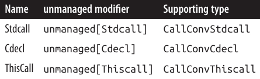

<div dir="rtl">
# فصل بیست و چهارم: یکپارچه‌سازی با Native و COM 

این فصل توضیح می‌دهد چگونه با کتابخانه‌های Native (غیرمدیریت‌شده) Dynamic-Link (DLL) و کامپوننت‌های Component Object Model (COM) یکپارچه شوید. مگر اینکه خلاف آن ذکر شده باشد، انواع داده‌ای که در این فصل آمده‌اند در فضای نام **System** یا **System.Runtime.InteropServices** وجود دارند.

---

#### فراخوانی DLLهای Native 📦

**P/Invoke**، کوتاه شده‌ی **Platform Invocation Services**، به شما اجازه می‌دهد به توابع، ساختارها و callback‌ها در DLLهای غیرمدیریت‌شده (کتابخانه‌های مشترک در Unix) دسترسی پیدا کنید.

برای مثال، تابع `MessageBox` که در DLL ویندوز **user32.dll** تعریف شده است به شکل زیر است:
</div>

```c
int MessageBox(HWND hWnd, LPCTSTR lpText, LPCTSTR lpCaption, UINT uType);
```

<div dir="rtl">
می‌توانید این تابع را مستقیماً با تعریف یک متد **static** با همان نام، استفاده از کلمه کلیدی `extern` و افزودن attribute `DllImport` فراخوانی کنید:
</div>

```csharp
using System;
using System.Runtime.InteropServices;

MessageBox(IntPtr.Zero, 
           "Please do not press this again.", "Attention", 0);

[DllImport("user32.dll")]
static extern int MessageBox(IntPtr hWnd, string text, string caption, int type);
```

<div dir="rtl">
کلاس‌های `MessageBox` در فضای نام‌های **System.Windows** و **System.Windows.Forms** خودشان متدهای مشابه غیرمدیریت‌شده را فراخوانی می‌کنند.

نمونه‌ای از `DllImport` برای **Ubuntu Linux**:
</div>

```csharp
Console.WriteLine($"User ID: {getuid()}");

[DllImport("libc")]
static extern uint getuid();
```

<div dir="rtl">
CLR شامل یک **marshaler** است که می‌داند چگونه پارامترها و مقادیر بازگشتی بین انواع .NET و انواع غیرمدیریت‌شده تبدیل شوند. در مثال ویندوز، پارامترهای `int` مستقیماً به عدد صحیح چهار بایتی که تابع انتظار دارد تبدیل می‌شوند و پارامترهای `string` به آرایه‌های Unicode پایان‌یافته با null (UTF-16) تبدیل می‌شوند.
`IntPtr` یک struct است که برای پوشش یک **handle** غیرمدیریت‌شده طراحی شده؛ در پلتفرم‌های ۳۲ بیتی، ۳۲ بیت و در پلتفرم‌های ۶۴ بیتی، ۶۴ بیت عرض دارد. تبدیل مشابهی در Unix نیز انجام می‌شود. (از C# 9 به بعد، می‌توانید از نوع `nint` هم استفاده کنید که به `IntPtr` نگاشت می‌شود.)

---

#### Marshaling انواع و پارامترها ⚙️

##### Marshaling انواع رایج

در سمت غیرمدیریت‌شده، ممکن است برای نمایش یک نوع داده بیش از یک روش وجود داشته باشد.
برای مثال، یک رشته (`string`) می‌تواند شامل کاراکترهای تک‌بایتی ANSI یا کاراکترهای Unicode UTF-16 باشد و طول آن می‌تواند با پیش‌وند مشخص شود، یا null-terminated باشد، یا طول ثابت داشته باشد.

با استفاده از attribute `MarshalAs` می‌توانید به marshaler CLR مشخص کنید کدام حالت استفاده شود تا تبدیل صحیح انجام گیرد. مثال:
</div>

```csharp
[DllImport("...")]
static extern int Foo([MarshalAs(UnmanagedType.LPStr)] string s);
```

<div dir="rtl">
enum `UnmanagedType` شامل تمام انواع Win32 و COM است که marshaler آن‌ها را می‌شناسد. در این مثال، marshaler به ترجمه به `LPStr` دستور داده شد، که یک رشته تک‌بایتی ANSI پایان‌یافته با null است.

در سمت .NET نیز شما می‌توانید نوع داده‌ای که استفاده می‌کنید را انتخاب کنید. **Handles** غیرمدیریت‌شده، برای مثال، می‌توانند به `IntPtr`، `int`، `uint`، `long` یا `ulong` نگاشت شوند.

بیشتر handles غیرمدیریت‌شده یک آدرس یا pointer را در بر دارند و بنابراین برای سازگاری با سیستم‌عامل‌های ۳۲ و ۶۴ بیتی باید به `IntPtr` نگاشت شوند. یک مثال معمول، `HWND` است.

اغلب در توابع Win32 و POSIX، با پارامترهای عدد صحیح مواجه می‌شوید که مجموعه‌ای از **constants** را می‌پذیرند، که در فایل هدر C++ مانند `WinUser.h` تعریف شده‌اند. به جای تعریف آن‌ها به عنوان constants ساده در C#، می‌توانید آن‌ها را در یک **enum** تعریف کنید. استفاده از enum باعث تمیزتر شدن کد و افزایش ایمنی نوعی می‌شود. نمونه‌ای در بخش «Shared Memory» در صفحه ۹۹۵ ارائه شده است.

---

هنگام نصب **Microsoft Visual Studio**، حتماً فایل‌های هدر C++ را نصب کنید—حتی اگر هیچ مورد دیگری از دسته C++ انتخاب نکرده باشید. اینجا جایی است که تمام constants بومی Win32 تعریف شده‌اند. سپس می‌توانید همه فایل‌های هدر را با جستجوی `*.h` در دایرکتوری برنامه Visual Studio پیدا کنید.

در Unix، استاندارد POSIX نام‌های constants را تعریف می‌کند، اما پیاده‌سازی‌های فردی سیستم‌های Unix سازگار با POSIX ممکن است مقادیر عددی متفاوتی برای این constants اختصاص دهند. باید از مقدار عددی صحیح برای سیستم‌عامل خود استفاده کنید. همچنین، POSIX یک استاندارد برای structهای استفاده‌شده در فراخوانی interop تعریف می‌کند. ترتیب فیلدها در struct توسط استاندارد ثابت نشده و ممکن است پیاده‌سازی Unix فیلدهای اضافی اضافه کند. فایل‌های هدر C++ که توابع و انواع را تعریف می‌کنند معمولاً در `/usr/include` یا `/usr/local/include` نصب می‌شوند.

---

دریافت رشته‌ها از کد غیرمدیریت‌شده به .NET نیازمند مدیریت حافظه است. marshaler به طور خودکار این کار را انجام می‌دهد اگر متد خارجی را با `StringBuilder` به جای `string` اعلام کنید، مانند:
</div>

```csharp
StringBuilder s = new StringBuilder(256);
GetWindowsDirectory(s, 256);
Console.WriteLine(s);

[DllImport("kernel32.dll")]
static extern int GetWindowsDirectory(StringBuilder sb, int maxChars);
```

<div dir="rtl">
در Unix نیز مشابه عمل می‌کند. مثال زیر تابع `getcwd` را فراخوانی می‌کند تا مسیر جاری را بازگرداند:
</div>

```csharp
var sb = new StringBuilder(256);
Console.WriteLine(getcwd(sb, sb.Capacity));

[DllImport("libc")]
static extern string getcwd(StringBuilder buf, int size);
```

<div dir="rtl">
اگرچه استفاده از `StringBuilder` راحت است، اما کمی ناکارآمد است زیرا CLR باید تخصیص‌های حافظه اضافی و کپی‌کردن‌ها را انجام دهد. در نقاط حساس عملکرد، می‌توانید با استفاده از `char[]` این سربار را کاهش دهید:
</div>

```csharp
[DllImport("kernel32.dll", CharSet = CharSet.Unicode)]
static extern int GetWindowsDirectory(char[] buffer, int maxChars);
```

<div dir="rtl">
توجه کنید که باید `CharSet` را در attribute `DllImport` مشخص کنید. همچنین پس از فراخوانی تابع، باید رشته خروجی را به طول مناسب برش دهید. می‌توانید این کار را با حداقل تخصیص حافظه با استفاده از **array pooling** (صفحه ۵۹۹) انجام دهید:
</div>

```csharp
string GetWindowsDirectory()
{
    var array = ArrayPool<char>.Shared.Rent(256);
    try
    {
        int length = GetWindowsDirectory(array, 256);
        return new string(array, 0, length).ToString();
    }
    finally { ArrayPool<char>.Shared.Return(array); }
}
```

<div dir="rtl">
(البته، این مثال صرفاً آموزشی است و شما می‌توانید مسیر Windows را از طریق متد داخلی `Environment.GetFolderPath` دریافت کنید.)

اگر مطمئن نیستید چگونه یک متد خاص Win32 یا Unix را فراخوانی کنید، معمولاً با جستجوی نام تابع و `DllImport` در اینترنت، نمونه‌ای پیدا خواهید کرد. برای ویندوز، سایت [http://www.pinvoke.net](http://www.pinvoke.net) یک ویکی است که هدف آن مستندسازی تمام signatureهای Win32 است.
 
### Marshaling کلاس‌ها و Structها 📦

گاهی اوقات نیاز دارید یک **struct** را به یک متد غیرمدیریت‌شده ارسال کنید. برای مثال، تابع `GetSystemTime` در API ویندوز به شکل زیر تعریف شده است:
</div>

```c
void GetSystemTime(LPSYSTEMTIME lpSystemTime);
```

<div dir="rtl">
`LPSYSTEMTIME` مطابق با این struct در C است:
</div>

```c
typedef struct _SYSTEMTIME {
  WORD wYear;
  WORD wMonth;
  WORD wDayOfWeek;
  WORD wDay;
  WORD wHour;
  WORD wMinute;
  WORD wSecond;
  WORD wMilliseconds;
} SYSTEMTIME, *PSYSTEMTIME;
```

<div dir="rtl">
برای فراخوانی `GetSystemTime`، باید یک کلاس یا struct در .NET تعریف کنیم که با این struct در C مطابقت داشته باشد:
</div>

```csharp
using System;
using System.Runtime.InteropServices;

[StructLayout(LayoutKind.Sequential)]
class SystemTime
{
    public ushort Year;
    public ushort Month;
    public ushort DayOfWeek;
    public ushort Day;
    public ushort Hour;
    public ushort Minute;
    public ushort Second;
    public ushort Milliseconds;
}
```

<div dir="rtl">
Attribute `StructLayout` به marshaler می‌گوید چگونه هر فیلد را به معادل غیرمدیریت‌شده‌اش نگاشت کند. `LayoutKind.Sequential` به این معنی است که فیلدها به ترتیب پشت سر هم و روی مرزهای **pack-size** قرار می‌گیرند (که بعداً توضیح داده می‌شود)، درست مانند struct در C. نام فیلدها اهمیت ندارد، بلکه **ترتیب فیلدها** مهم است.

حالا می‌توانیم `GetSystemTime` را فراخوانی کنیم:
</div>

```csharp
SystemTime t = new SystemTime();
GetSystemTime(t);
Console.WriteLine(t.Year);

[DllImport("kernel32.dll")]
static extern void GetSystemTime(SystemTime t);
```

<div dir="rtl">
به‌طور مشابه، در Unix:
</div>

```csharp
Console.WriteLine(GetSystemTime());

static DateTime GetSystemTime()
{
    DateTime startOfUnixTime = new DateTime(1970, 1, 1, 0, 0, 0, 0, System.DateTimeKind.Utc);
    Timespec tp = new Timespec();
    int success = clock_gettime(0, ref tp);
    if (success != 0) throw new Exception("Error checking the time.");
    return startOfUnixTime.AddSeconds(tp.tv_sec).ToLocalTime();  
}

[DllImport("libc")]
static extern int clock_gettime(int clk_id, ref Timespec tp);

[StructLayout(LayoutKind.Sequential)]
struct Timespec
{
    public long tv_sec;   /* ثانیه */
    public long tv_nsec;  /* نانوثانیه */
}
```

<div dir="rtl">
در هر دو زبان C و C#، فیلدهای یک شیء در فاصله‌ای از آدرس آن شیء قرار دارند. تفاوت در این است که در برنامه C#، CLR این **offset** را با استفاده از token فیلد پیدا می‌کند؛ اما در C، نام فیلد مستقیماً به offset کامپایل می‌شود.
برای مثال، در C، `wDay` فقط یک token است که نشان می‌دهد چه چیزی در آدرس یک نمونه `SystemTime` به اضافه ۲۴ بایت قرار دارد.

برای سرعت دسترسی، هر فیلد در offsetی قرار می‌گیرد که مضربی از اندازه فیلد است. این ضریب حداکثر به x بایت محدود است، که x اندازه **pack** است. در پیاده‌سازی فعلی، pack پیش‌فرض ۸ بایت است، بنابراین یک struct شامل `sbyte` و سپس یک `long` (۸ بایت) به ۱۶ بایت اشغال می‌شود و ۷ بایت بعد از `sbyte` هدر می‌رود. با تعیین اندازه pack از طریق ویژگی `Pack` در attribute `StructLayout` می‌توان این هدر رفت را کاهش یا حذف کرد. برای مثال، با pack برابر ۱، همان struct تنها ۹ بایت اشغال می‌کند. می‌توانید pack‌های ۱، ۲، ۴، ۸ یا ۱۶ بایت تعیین کنید.

Attribute `StructLayout` همچنین اجازه می‌دهد **offsetهای صریح فیلدها** را مشخص کنید (صفحه ۹۹۴: «Simulating a C Union»).

---

#### In و Out Marshaling ↔️

در مثال قبلی، `SystemTime` به صورت کلاس پیاده‌سازی شد. می‌توانستیم به جای آن struct انتخاب کنیم—مشروط بر اینکه `GetSystemTime` با پارامتر `ref` یا `out` اعلام شود:
</div>

```csharp
[DllImport("kernel32.dll")]
static extern void GetSystemTime(out SystemTime t);
```

<div dir="rtl">
در اکثر موارد، semantics پارامترهای جهت‌دار C# با متدهای خارجی یکسان است:

* پارامترهای **Pass-by-value** کپی می‌شوند،
* پارامترهای `ref` کپی در/خارج می‌شوند،
* پارامترهای `out` کپی خروجی می‌شوند.

با این حال، برای برخی نوع‌ها که تبدیل خاصی دارند، استثنا وجود دارد. برای مثال، کلاس‌های آرایه و `StringBuilder` هنگام خروج از تابع نیاز به کپی دارند، بنابراین رفتارشان **in/out** است. گاهی اوقات مفید است که این رفتار را با attributes `In` و `Out` بازنویسی کنیم.

برای مثال، اگر یک آرایه باید **فقط خواندنی** باشد، modifier `in` مشخص می‌کند که فقط کپی ورودی آرایه به تابع انجام شود، نه خروجی آن:
</div>

```csharp
static extern void Foo([In] int[] array);
```

<div dir="rtl">
### Calling Conventions ⚙️

متدهای غیرمدیریت‌شده آرگومان‌ها و مقادیر بازگشتی را از طریق **stack** و (اختیاری) **CPU registers** دریافت می‌کنند. از آنجا که چندین روش برای انجام این کار وجود دارد، پروتکل‌های مختلفی شکل گرفته‌اند که به آن‌ها **calling conventions** گفته می‌شود.

CLR در حال حاضر از سه calling convention پشتیبانی می‌کند:

* `StdCall`
* `Cdecl`
* `ThisCall`

به طور پیش‌فرض، CLR از **calling convention پیش‌فرض پلتفرم** استفاده می‌کند (convention استاندارد برای آن پلتفرم). در ویندوز، این convention برابر با `StdCall` است و در لینوکس x86 برابر با `Cdecl`.

اگر یک متد غیرمدیریت‌شده از این پیش‌فرض پیروی نکند، می‌توانید به صورت صریح calling convention آن را مشخص کنید:
</div>

```csharp
[DllImport("MyLib.dll", CallingConvention=CallingConvention.Cdecl)]
static extern void SomeFunc(...);
```

<div dir="rtl">
توجه داشته باشید که نام somewhat misleading `CallingConvention.WinApi` به convention پیش‌فرض پلتفرم اشاره دارد.

---

### فراخوانی بازگشتی از کد غیرمدیریت‌شده 🔄

C# همچنین اجازه می‌دهد توابع خارجی، کد C# را فراخوانی کنند، از طریق **callbacks**. دو روش برای پیاده‌سازی callbacks وجود دارد:

* از طریق **function pointers**
* از طریق **delegates**

برای مثال، تابع زیر در `User32.dll` ویندوز، تمام handles پنجره‌های سطح بالا را enumerate می‌کند:
</div>

```c
BOOL EnumWindows(WNDENUMPROC lpEnumFunc, LPARAM lParam);
```

<div dir="rtl">
`WNDENUMPROC` یک callback است که برای هر handle پنجره به ترتیب فراخوانی می‌شود (یا تا زمانی که callback `false` بازگرداند). تعریف آن به شکل زیر است:
</div>

```c
BOOL CALLBACK EnumWindowsProc(HWND hwnd, LPARAM lParam);
```

<div dir="rtl">
---

#### Callbacks با Function Pointers 🔹

از **C# 9**، ساده‌ترین و سریع‌ترین گزینه—وقتی callback شما یک متد **static** است—استفاده از function pointer است. در مورد callback `WNDENUMPROC`، می‌توان از function pointer زیر استفاده کرد:
</div>

```csharp
delegate*<IntPtr, IntPtr, bool>
```

<div dir="rtl">
این یک تابع را نشان می‌دهد که دو آرگومان `IntPtr` می‌گیرد و `bool` برمی‌گرداند. سپس می‌توانید با استفاده از عملگر `&` آن را به یک متد static اختصاص دهید:
</div>

```csharp
using System;
using System.Runtime.InteropServices;

unsafe
{
    EnumWindows(&PrintWindow, IntPtr.Zero);

    [DllImport("user32.dll")]
    static extern int EnumWindows(delegate*<IntPtr, IntPtr, bool> hWnd, IntPtr lParam);

    static bool PrintWindow(IntPtr hWnd, IntPtr lParam)
    {
        Console.WriteLine(hWnd.ToInt64());
        return true;
    }
}
```

<div dir="rtl">
با function pointers، callback باید یک متد **static** باشد (یا یک **static local function** همانند مثال بالا).

---

#### UnmanagedCallersOnly ⚡

می‌توانید با اعمال **unmanaged** به declaration function pointer و attribute `[UnmanagedCallersOnly]` به متد callback، عملکرد را بهبود دهید:
</div>

```csharp
using System;
using System.Runtime.CompilerServices;
using System.Runtime.InteropServices;

unsafe
{
    EnumWindows(&PrintWindow, IntPtr.Zero);

    [DllImport("user32.dll")]
    static extern int EnumWindows(delegate* unmanaged<IntPtr, IntPtr, byte> hWnd, IntPtr lParam);

    [UnmanagedCallersOnly]
    static byte PrintWindow(IntPtr hWnd, IntPtr lParam)
    {
        Console.WriteLine(hWnd.ToInt64());
        return 1;
    }
}
```

<div dir="rtl">
این attribute به CLR اطلاع می‌دهد که متد `PrintWindow` تنها از کد غیرمدیریت‌شده قابل فراخوانی است و اجازه می‌دهد runtime برخی shortcuts را اعمال کند. توجه کنید که نوع بازگشتی متد از `bool` به `byte` تغییر کرده است، زیرا متدهایی که `[UnmanagedCallersOnly]` دارند، تنها می‌توانند از **blittable value types** در signature استفاده کنند.

**Blittable types** آن‌هایی هستند که نیاز به marshaling خاص ندارند، زیرا در محیط‌های مدیریت‌شده و غیرمدیریت‌شده به یک شکل نمایش داده می‌شوند. این نوع‌ها شامل:

* انواع صحیح ابتدایی (primitive integral types)
* `float` و `double`
* structهایی که تنها شامل blittable types هستند

نوع `char` نیز blittable است، اگر بخشی از structی باشد که attribute `StructLayout` آن **CharSet.Unicode** را مشخص کرده باشد:
</div>

```csharp
[StructLayout(LayoutKind.Sequential, CharSet=CharSet.Unicode)]
```

<div dir="rtl">
### Nondefault Calling Conventions ⚙️

به طور پیش‌فرض، کامپایلر فرض می‌کند که callback غیرمدیریت‌شده از **calling convention پیش‌فرض پلتفرم** پیروی می‌کند. اگر این‌گونه نباشد، می‌توانید به صورت صریح calling convention آن را با استفاده از پارامتر `CallConvs` در attribute `[UnmanagedCallersOnly]` مشخص کنید:
</div>

```csharp
[UnmanagedCallersOnly(CallConvs = new[] { typeof(CallConvStdcall) })]
static byte PrintWindow(IntPtr hWnd, IntPtr lParam) ...
```

<div dir="rtl">
همچنین باید نوع function pointer را با درج یک **modifier خاص** بعد از کلمه کلیدی `unmanaged` به‌روزرسانی کنید:
</div>

```csharp
delegate* unmanaged[Stdcall]<IntPtr, IntPtr, byte> hWnd, IntPtr lParam);
```

<div dir="rtl">
کامپایلر اجازه می‌دهد هر شناسه‌ای (مثل `XYZ`) را داخل کروشه‌ها قرار دهید، مشروط بر اینکه یک نوع .NET به نام `CallConvXYZ` وجود داشته باشد که توسط runtime درک شود و با چیزی که هنگام اعمال `[UnmanagedCallersOnly]` مشخص کرده‌اید مطابقت داشته باشد. این ویژگی به مایکروسافت اجازه می‌دهد در آینده **calling conventions** جدید اضافه کند.

در این مثال، ما `StdCall` را مشخص کردیم، که **calling convention پیش‌فرض ویندوز** است (در لینوکس x86، پیش‌فرض `Cdecl` است).
در ادامه، تمام گزینه‌هایی که در حال حاضر پشتیبانی می‌شوند ارائه شده‌اند:
 <div align="center">
    
 
</div>

### Callbacks با Delegates 🔄

می‌توان callbacks غیرمدیریت‌شده را با استفاده از **delegates** نیز پیاده‌سازی کرد. این روش در تمام نسخه‌های C# کار می‌کند و اجازه می‌دهد callbackهایی که به متدهای **instance** اشاره دارند نیز استفاده شوند.

برای انجام این کار، ابتدا یک نوع delegate با signature مشابه callback تعریف می‌کنیم. سپس می‌توان یک نمونه delegate را به متد خارجی پاس داد:
</div>

```csharp
class CallbackFun
{
    delegate bool EnumWindowsCallback(IntPtr hWnd, IntPtr lParam);

    [DllImport("user32.dll")]
    static extern int EnumWindows(EnumWindowsCallback hWnd, IntPtr lParam);

    static bool PrintWindow(IntPtr hWnd, IntPtr lParam)
    {
        Console.WriteLine(hWnd.ToInt64());
        return true;
    }

    static readonly EnumWindowsCallback printWindowFunc = PrintWindow;

    static void Main() => EnumWindows(printWindowFunc, IntPtr.Zero);
}
```

<div dir="rtl">
استفاده از delegates برای callbacks غیرمدیریت‌شده **ironically unsafe** است، زیرا ممکن است callback بعد از خارج شدن نمونه delegate از scope رخ دهد و در این صورت delegate واجد شرایط **garbage collection** می‌شود. این می‌تواند منجر به شدیدترین نوع exception در runtime شود—یکی بدون **stack trace** مفید.

در مورد callbackهای متد static، می‌توان با اختصاص نمونه delegate به یک **read-only static field** از این مشکل جلوگیری کرد (همانند مثال بالا). اما برای callbackهای متد instance، این روش کافی نیست و باید با دقت کدنویسی کنید تا حداقل یک reference به نمونه delegate برای مدت زمان هر callback احتمالی حفظ شود. حتی در این حالت، اگر یک باگ در سمت غیرمدیریت‌شده وجود داشته باشد—که callback را بعد از اینکه به آن گفته‌اید اجرا کند—ممکن است همچنان با یک exception غیرقابل ردیابی مواجه شوید. یک راهکار این است که برای هر تابع غیرمدیریت‌شده، یک نوع delegate منحصر به فرد تعریف کنید؛ این کار در تشخیص مشکلات کمک می‌کند، زیرا نوع delegate در exception گزارش می‌شود.

---

می‌توانید **calling convention** callback را از پیش‌فرض پلتفرم تغییر دهید با اعمال attribute `[UnmanagedFunctionPointer]` روی delegate:
</div>

```csharp
[UnmanagedFunctionPointer(CallingConvention.Cdecl)]
delegate void MyCallback(int foo, short bar);
```

<div dir="rtl">
---

### شبیه‌سازی C Union 🔧

هر فیلد در یک struct فضای کافی برای ذخیره داده خود دارد.
فرض کنید structی شامل یک `int` و یک `char` داریم. `int` احتمالاً از offset صفر شروع می‌شود و حداقل چهار بایت فضا دارد. بنابراین `char` حداقل از offset ۴ شروع می‌شود. اگر به هر دلیلی `char` از offset ۲ شروع شود، مقدار `int` تغییر می‌کند. عجیب است، اما زبان C نوعی variation از struct به نام **union** دارد که دقیقاً همین کار را انجام می‌دهد.

در C# می‌توان این کار را با `LayoutKind.Explicit` و attribute `FieldOffset` شبیه‌سازی کرد.

---

ممکن است سخت باشد موردی پیدا کنید که این کاربردی باشد. اما فرض کنید می‌خواهید یک نت موسیقی را روی یک **synthesizer خارجی** پخش کنید. Windows Multimedia API یک تابع برای این کار از طریق پروتکل MIDI فراهم می‌کند:
</div>

```csharp
[DllImport("winmm.dll")]
public static extern uint midiOutShortMsg(IntPtr handle, uint message);
```

<div dir="rtl">
آرگومان دوم، `message`، مشخص می‌کند چه نتی پخش شود. مشکل در ساخت این عدد ۳۲ بیتی unsigned است: این عدد به بایت‌هایی تقسیم می‌شود که نماینده **کانال MIDI، نت، و سرعت ضربه** هستند.

راه حل کلاسیک، استفاده از عملگرهای بیتی `<<`, `>>`, `&`, `|` برای تبدیل بین بایت‌ها و عدد ۳۲ بیتی است. اما روش ساده‌تر، تعریف یک struct با **layout صریح** است:
</div>

```csharp
[StructLayout(LayoutKind.Explicit)]
public struct NoteMessage
{
    [FieldOffset(0)] public uint PackedMsg;    // 4 بایت
    [FieldOffset(0)] public byte Channel;      // FieldOffset نیز 0
    [FieldOffset(1)] public byte Note;
    [FieldOffset(2)] public byte Velocity;
}
```

<div dir="rtl">
فیلدهای `Channel`, `Note` و `Velocity` عمداً با عدد ۳۲ بیتی packed overlap دارند. این امکان را می‌دهد که بتوانید از هر دو روش خواندن و نوشتن کنید، بدون نیاز به محاسبات اضافی برای هماهنگی فیلدها:
</div>

```csharp
NoteMessage n = new NoteMessage();
Console.WriteLine(n.PackedMsg);  // 0

n.Channel = 10;
n.Note = 100;
n.Velocity = 50;
Console.WriteLine(n.PackedMsg);  // 3302410

n.PackedMsg = 3328010;
Console.WriteLine(n.Note);       // 200
```

<div dir="rtl">
### Shared Memory 🗂️

**Memory-mapped files** یا **shared memory** قابلیتی در ویندوز است که به چندین فرآیند روی یک کامپیوتر اجازه می‌دهد داده‌ها را با هم به اشتراک بگذارند. Shared memory بسیار سریع است و بر خلاف **pipes**، امکان **دسترسی تصادفی** به داده‌های مشترک را فراهم می‌کند. در فصل ۱۵ دیدیم که چگونه می‌توان از کلاس `MemoryMappedFile` برای دسترسی به فایل‌های memory-mapped استفاده کرد؛ اما عبور از این کلاس و فراخوانی مستقیم متدهای Win32، راهی عالی برای نشان دادن **P/Invoke** است.

تابع Win32 به نام `CreateFileMapping` حافظه مشترک اختصاص می‌دهد. شما تعداد بایت مورد نیاز و نامی که برای شناسایی share استفاده می‌شود را مشخص می‌کنید. سپس یک برنامه دیگر می‌تواند با فراخوانی `OpenFileMapping` و استفاده از همان نام، به این حافظه مشترک متصل شود. هر دو متد یک **handle** بازمی‌گردانند که با فراخوانی `MapViewOfFile` می‌توان آن را به یک **pointer** تبدیل کرد.

در ادامه، یک کلاس که دسترسی به shared memory را encapsulate می‌کند مشاهده می‌کنید:
</div>

```csharp
using System;
using System.Runtime.InteropServices;
using System.ComponentModel;

public sealed class SharedMem : IDisposable
{
    // استفاده از enum برای امنیت بیشتر نسبت به constants
    enum FileProtection : uint      // constants از winnt.h
    {
        ReadOnly = 2,
        ReadWrite = 4
    }
    
    enum FileRights : uint          // constants از WinBASE.h
    {
        Read = 4,
        Write = 2,
        ReadWrite = Read + Write
    }

    static readonly IntPtr NoFileHandle = new IntPtr(-1);

    [DllImport("kernel32.dll", SetLastError = true)]
    static extern IntPtr CreateFileMapping(IntPtr hFile,
                                           int lpAttributes,
                                           FileProtection flProtect,
                                           uint dwMaximumSizeHigh,
                                           uint dwMaximumSizeLow,
                                           string lpName);

    [DllImport("kernel32.dll", SetLastError=true)]
    static extern IntPtr OpenFileMapping(FileRights dwDesiredAccess,
                                         bool bInheritHandle,
                                         string lpName);

    [DllImport("kernel32.dll", SetLastError = true)]
    static extern IntPtr MapViewOfFile(IntPtr hFileMappingObject,
                                       FileRights dwDesiredAccess,
                                       uint dwFileOffsetHigh,
                                       uint dwFileOffsetLow,
                                       uint dwNumberOfBytesToMap);

    [DllImport("Kernel32.dll", SetLastError = true)]
    static extern bool UnmapViewOfFile(IntPtr map);

    [DllImport("kernel32.dll", SetLastError = true)]
    static extern int CloseHandle(IntPtr hObject);

    IntPtr fileHandle, fileMap;

    public IntPtr Root => fileMap;

    public SharedMem(string name, bool existing, uint sizeInBytes)
    {
        if (existing)
            fileHandle = OpenFileMapping(FileRights.ReadWrite, false, name);
        else
            fileHandle = CreateFileMapping(NoFileHandle, 0,
                                           FileProtection.ReadWrite,
                                           0, sizeInBytes, name);
        if (fileHandle == IntPtr.Zero)
            throw new Win32Exception();

        // ایجاد map خواندن/نوشتن برای کل فایل
        fileMap = MapViewOfFile(fileHandle, FileRights.ReadWrite, 0, 0, 0);
        if (fileMap == IntPtr.Zero)
            throw new Win32Exception();
    }

    public void Dispose()
    {
        if (fileMap != IntPtr.Zero) UnmapViewOfFile(fileMap);
        if (fileHandle != IntPtr.Zero) CloseHandle(fileHandle);
        fileMap = fileHandle = IntPtr.Zero;
    }
}
```

<div dir="rtl">
در این مثال، برای متدهای `DllImport` که از پروتکل `SetLastError` برای ارائه کدهای خطا استفاده می‌کنند، `SetLastError=true` تنظیم شده است. این باعث می‌شود که هنگام ایجاد **Win32Exception**، جزئیات خطا به درستی پر شود. همچنین می‌توان خطا را به صورت صریح با فراخوانی `Marshal.GetLastWin32Error` پرس و جو کرد.

---

برای آزمایش این کلاس، نیاز به اجرای دو برنامه داریم:

1. برنامه اول shared memory را ایجاد می‌کند:
</div>

```csharp
using (SharedMem sm = new SharedMem("MyShare", false, 1000))
{
    IntPtr root = sm.Root;
    // حافظه مشترک آماده است!
    Console.ReadLine(); // در اینجا برنامه دوم شروع می‌شود...
}
```

<div dir="rtl">
2. برنامه دوم با ساخت یک شیء `SharedMem` با همان نام و مقدار `existing = true` به حافظه مشترک متصل می‌شود:
</div>

```csharp
using (SharedMem sm = new SharedMem("MyShare", true, 1000))
{
    IntPtr root = sm.Root;
    // من هم به همان حافظه مشترک دسترسی دارم!
    // ...
}
```

<div dir="rtl">
نتیجه این است که هر برنامه یک `IntPtr`—یک pointer به همان حافظه unmanaged—دارد. حالا دو برنامه می‌توانند داده‌ها را از طریق این pointer مشترک بخوانند و بنویسند.

یک روش این است که یک کلاس برای encapsulate کل داده‌های مشترک تعریف کنید و سپس داده‌ها را با استفاده از `UnmanagedMemoryStream` **serialize** و **deserialize** کنید. اما اگر حجم داده زیاد باشد، این روش ناکارآمد است.
مثلاً اگر کلاس حافظه مشترک یک مگابایت داده داشته باشد و فقط یک عدد صحیح نیاز به بروزرسانی داشته باشد، این روش بسیار سنگین خواهد بود.

روش بهتر این است که داده‌های مشترک را به صورت یک **struct** تعریف کنید و سپس آن را مستقیماً در حافظه مشترک map کنید. این موضوع در بخش بعدی توضیح داده خواهد شد.
### Mapping a Struct to Unmanaged Memory 🧩

می‌توان یک **struct** با `StructLayout` از نوع `Sequential` یا `Explicit` را مستقیماً به حافظه غیرمدیریت‌شده map کرد. به مثال زیر توجه کنید:
</div>

```csharp
[StructLayout(LayoutKind.Sequential)]
unsafe struct MySharedData
{
    public int Value;
    public char Letter;
    public fixed float Numbers[50];
}
```

<div dir="rtl">
دستور `fixed` به ما اجازه می‌دهد **آرایه‌هایی با طول ثابت از نوع value** را درون struct تعریف کنیم، و همین ویژگی ما را وارد فضای **unsafe** می‌کند. فضای لازم برای ۵۰ عدد اعشاری (float) به صورت inline در struct اختصاص می‌یابد. بر خلاف آرایه‌های معمولی C#، `Numbers` یک reference به آرایه نیست—خود آرایه است.

اگر کد زیر را اجرا کنیم:
</div>

```csharp
static unsafe void Main() => Console.WriteLine(sizeof(MySharedData));
```

<div dir="rtl">
نتیجه برابر با **208** خواهد بود:

* ۵۰ عدد float چهار بایتی
* ۴ بایت برای `Value`
* ۲ بایت برای `Letter`

مجموع ۲۰۶ بایت به دلیل alignment بر روی مرزهای چهار بایتی، به ۲۰۸ بایت گرد شده است (اندازه float = ۴ بایت).

---

می‌توانیم `MySharedData` را در یک **context unsafe** با حافظه تخصیص‌یافته روی stack آزمایش کنیم:
</div>

```csharp
MySharedData d;
MySharedData* data = &d;  // گرفتن آدرس d
data->Value = 123;
data->Letter = 'X';
data->Numbers[10] = 1.45f;
```

<div dir="rtl">
یا:
</div>

```csharp
// تخصیص آرایه روی stack
MySharedData* data = stackalloc MySharedData[1];
data->Value = 123;
data->Letter = 'X';
data->Numbers[10] = 1.45f;
```

<div dir="rtl">
البته، این روش چیزی بیش از آنچه در managed context می‌توان انجام داد، نشان نمی‌دهد. اما اگر بخواهیم یک نمونه از `MySharedData` را روی **heap غیرمدیریت‌شده** ذخیره کنیم، خارج از محدوده garbage collector CLR، اینجاست که **pointers** واقعاً مفید می‌شوند:
</div>

```csharp
MySharedData* data = (MySharedData*) Marshal.AllocHGlobal(sizeof(MySharedData)).ToPointer();
data->Value = 123;
data->Letter = 'X';
data->Numbers[10] = 1.45f;
```

<div dir="rtl">
تابع `Marshal.AllocHGlobal` حافظه‌ای روی **heap غیرمدیریت‌شده** اختصاص می‌دهد. برای آزاد کردن این حافظه:
</div>

```csharp
Marshal.FreeHGlobal(new IntPtr(data));
```

<div dir="rtl">
(فراموش کردن آزادسازی حافظه، منجر به **memory leak** می‌شود.)

---

از **.NET 6** به بعد، می‌توان از کلاس `NativeMemory` برای تخصیص و آزادسازی حافظه غیرمدیریت‌شده استفاده کرد. این کلاس از API جدیدتر و بهتری نسبت به `AllocHGlobal` بهره می‌برد و متدهایی برای تخصیص aligned نیز ارائه می‌کند.

---

در ادامه، ما `MySharedData` را با کلاس `SharedMem` که در بخش قبل نوشتیم، ترکیب می‌کنیم. برنامه زیر یک بلوک حافظه مشترک تخصیص می‌دهد و struct را مستقیماً در آن map می‌کند:
</div>

```csharp
static unsafe void Main()
{
    using (SharedMem sm = new SharedMem("MyShare", false, (uint)sizeof(MySharedData)))
    {
        void* root = sm.Root.ToPointer();
        MySharedData* data = (MySharedData*)root;

        data->Value = 123;
        data->Letter = 'X';
        data->Numbers[10] = 1.45f;

        Console.WriteLine("Written to shared memory");
        Console.ReadLine();

        Console.WriteLine("Value is " + data->Value);
        Console.WriteLine("Letter is " + data->Letter);
        Console.WriteLine("11th Number is " + data->Numbers[10]);
        Console.ReadLine();
    }
}
```

<div dir="rtl">
می‌توان به جای `SharedMem` از کلاس built-in `MemoryMappedFile` نیز استفاده کرد:
</div>

```csharp
using (MemoryMappedFile mmFile = MemoryMappedFile.CreateNew("MyShare", 1000))
using (MemoryMappedViewAccessor accessor = mmFile.CreateViewAccessor())
{
    byte* pointer = null;
    accessor.SafeMemoryMappedViewHandle.AcquirePointer(ref pointer);
    void* root = pointer;
    ...
}
```

<div dir="rtl">
---

برنامه دوم می‌تواند به همان حافظه مشترک متصل شود و مقادیر نوشته شده توسط برنامه اول را بخواند:
</div>

```csharp
static unsafe void Main()
{
    using (SharedMem sm = new SharedMem("MyShare", true, (uint)sizeof(MySharedData)))
    {
        void* root = sm.Root.ToPointer();
        MySharedData* data = (MySharedData*)root;

        Console.WriteLine("Value is " + data->Value);
        Console.WriteLine("Letter is " + data->Letter);
        Console.WriteLine("11th Number is " + data->Numbers[10]);

        // نوبت ما برای بروزرسانی حافظه مشترک
        data->Value++;
        data->Letter = '!';
        data->Numbers[10] = 987.5f;

        Console.WriteLine("Updated shared memory");
        Console.ReadLine();
    }
}
```

<div dir="rtl">
خروجی هر دو برنامه:

* **برنامه اول**:
</div>

```
  Written to shared memory
  Value is 124
  Letter is !
  11th Number is 987.5
  ```

<div dir="rtl">
* **برنامه دوم**:
</div>

```
  Value is 123
  Letter is X
  11th Number is 1.45
  Updated shared memory
  ```

<div dir="rtl">
---

نگران pointers نباشید: برنامه‌نویسان C++ از آن‌ها در سراسر برنامه‌ها استفاده می‌کنند و معمولاً همه چیز را درست اجرا می‌کنند. کاربرد ما نسبتاً ساده است.

به علاوه، این مثال از نظر **thread-safety** (یا دقیق‌تر، **process-safety**) unsafe است، زیرا دو برنامه همزمان به همان حافظه دسترسی دارند. برای استفاده در برنامه‌های واقعی، باید keyword `volatile` را به فیلدهای `Value` و `Letter` اضافه کنیم تا از cache شدن آن‌ها توسط **JIT compiler** یا سخت‌افزار CPU جلوگیری شود.

همچنین، در تعامل پیچیده‌تر با فیلدها، احتمالاً نیاز است دسترسی به آن‌ها را با یک **cross-process Mutex** محافظت کنیم، درست همانند استفاده از **lock** برای محافظت از دسترسی به فیلدها در برنامه‌های multithreaded. در فصل ۲۱ به طور کامل درباره thread safety صحبت کرده‌ایم.
### fixed و fixed {...} 🔒

یکی از محدودیت‌های **map کردن مستقیم struct به حافظه** این است که struct تنها می‌تواند شامل **unmanaged types** باشد. اگر نیاز دارید داده‌ای از نوع **string** را به اشتراک بگذارید، باید به جای آن از **آرایه‌ای از کاراکترهای ثابت** استفاده کنید. این یعنی تبدیل دستی بین string و آرایه. مثال:
</div>

```csharp
[StructLayout(LayoutKind.Sequential)]
unsafe struct MySharedData
{
    ...
    // اختصاص فضا برای 200 کاراکتر (معادل 400 بایت)
    const int MessageSize = 200;
    fixed char message[MessageSize];

    // معمولاً این کد در یک helper class قرار می‌گیرد
    public string Message
    {
        get { fixed (char* cp = message) return new string(cp); }
        set
        {
            fixed (char* cp = message)
            {
                int i = 0;
                for (; i < value.Length && i < MessageSize - 1; i++)
                    cp[i] = value[i];
                // اضافه کردن null terminator
                cp[i] = '\0';
            }
        }
    }
}
```

<div dir="rtl">
هیچ مفهومی به نام **reference به یک آرایه fixed** وجود ندارد؛ به جای آن، یک **pointer** دریافت می‌کنید. وقتی به یک آرایه fixed اندیس‌دهی می‌کنید، در واقع **arithmetics pointer** انجام می‌دهید!

در اولین استفاده از keyword `fixed`، ما فضای لازم برای ۲۰۰ کاراکتر را **inline** در struct اختصاص دادیم. همین keyword در property معنای متفاوتی دارد: به CLR می‌گوید که **object را pin کند** تا اگر garbage collection رخ داد، محتوای struct جابجا نشود، زیرا داریم مستقیماً با memory pointers به آن دسترسی پیدا می‌کنیم.

ممکن است بپرسید چرا MySharedData می‌تواند در managed memory جابجا شود، وقتی که در unmanaged memory قرار دارد. پاسخ این است که **کامپایلر نمی‌داند** و فرض می‌کند ممکن است MySharedData در context مدیریت‌شده استفاده شود، پس insist می‌کند که `fixed` اضافه شود تا کد unsafe ما در managed context امن شود. و واقعاً هم درست است، زیرا کافی است:
</div>

```csharp
object obj = new MySharedData();
```

<div dir="rtl">
این باعث می‌شود MySharedData روی heap قرار گیرد و **boxed** شود و تحت تاثیر garbage collection قرار گیرد.

این مثال نشان می‌دهد چگونه می‌توان یک **string** را در structی که به unmanaged memory map شده است، نمایش داد. برای نوع داده‌های پیچیده‌تر، می‌توان از **کدهای serialization موجود** استفاده کرد، با این شرط که طول داده serialize شده از فضای اختصاص‌یافته در struct تجاوز نکند؛ در غیر این صورت، نتیجه می‌تواند **تداخل ناخواسته با فیلدهای بعدی** باشد.

---

### COM Interoperability 🖥️

**Runtime .NET** پشتیبانی ویژه‌ای از COM ارائه می‌دهد و اجازه می‌دهد **COM objects** از .NET استفاده شوند و بالعکس. COM تنها در Windows در دسترس است.

---

#### هدف COM

COM مخفف **Component Object Model** است؛ یک استاندارد باینری برای تعامل با کتابخانه‌ها که توسط مایکروسافت در سال ۱۹۹۳ ارائه شد. هدف از ایجاد COM این بود که **کامپوننت‌ها بتوانند به صورت مستقل از زبان و مقاوم در برابر نسخه‌بندی با هم ارتباط برقرار کنند**.

قبل از COM، در Windows معمولاً DLLهایی منتشر می‌شدند که ساختارها و توابع را با زبان C تعریف می‌کردند. این روش:

* **مختص زبان بود**
* **ضعیف و شکننده** بود؛ حتی اضافه کردن یک فیلد جدید به یک struct، specification آن را خراب می‌کرد.

زیبایی COM در این بود که specification یک نوع را از پیاده‌سازی آن جدا کرد **از طریق COM interface**. COM همچنین اجازه می‌دهد که **متدهای stateful objects** فراخوانی شوند، نه فقط procedureهای ساده.

به نوعی، مدل برنامه‌نویسی .NET یک **تکامل از اصول برنامه‌نویسی COM** است:

* توسعه cross-language
* امکان تغییر binary components بدون شکستن برنامه‌هایی که به آن‌ها وابسته‌اند.

---

#### اصول سیستم نوع COM

سیستم نوع COM حول **interfaces** می‌چرخد. یک COM interface شبیه یک .NET interface است، اما کاربرد آن گسترده‌تر است، زیرا COM تنها از طریق interface قابلیت‌های خود را ارائه می‌دهد.

مثال در دنیای .NET:
</div>

```csharp
public class Foo
{
    public string Test() => "Hello, world";
}
```

<div dir="rtl">
کاربران می‌توانند Foo را مستقیم استفاده کنند. اگر بعدها implementation تابع Test() تغییر کند، assemblyهای فراخوان نیازی به recompile ندارند.

در COM، Foo برای جداسازی interface از implementation، **قابلیت‌های خود را از طریق یک interface ارائه می‌دهد**:
</div>

```csharp
public interface IFoo { string Test(); }
```

<div dir="rtl">
اضافه کردن overload در COM پیچیده‌تر است، زیرا:

* interfaces منتشرشده immutable هستند.
* COM اجازه method overloading نمی‌دهد.

راه‌حل: ایجاد interface دوم:
</div>

```csharp
public interface IFoo2 { string Test(string s); }
```

<div dir="rtl">
پشتیبانی از چندین interface کلیدی است تا **کتابخانه‌های COM versionable** شوند.

---

#### IUnknown و IDispatch

تمام COM interfaces با یک **GUID (Globally Unique Identifier)** شناسایی می‌شوند.

* **IUnknown**: root interface در COM است و تمام COM objects باید آن را پیاده‌سازی کنند. متدهای آن:

  * `AddRef` و `Release` برای مدیریت طول عمر (COM از reference counting استفاده می‌کند، نه garbage collection خودکار).
  * `QueryInterface` برای بازگرداندن reference به یک interface پشتیبانی‌شده.

* **IDispatch**: برای برنامه‌نویسی داینامیک (مانند scripting و automation). امکان فراخوانی late-bound مشابه dynamic در C# را فراهم می‌کند (برای simple invocations).

### فراخوانی یک کامپوننت COM از C# 🖥️

CLR در **پشتیبانی داخلی از COM** به شما اجازه نمی‌دهد مستقیماً با `IUnknown` و `IDispatch` کار کنید. به جای آن، شما با **CLR objects** کار می‌کنید و runtime فراخوانی‌های شما را به دنیای COM **از طریق Runtime-Callable Wrappers (RCWs)** منتقل می‌کند.

* **مدیریت طول عمر**: runtime هنگام finalize شدن شیء .NET، به صورت خودکار `AddRef` و `Release` را فراخوانی می‌کند.
* **تبدیل نوع داده‌ها**: primitive types مثل int و string بین دنیای managed و unmanaged به شکل مناسب تبدیل می‌شوند.

---

### COM Interop Types

برای دسترسی به RCWs به صورت **type-safe**، از **COM interop types** استفاده می‌کنیم. این‌ها **proxy types** هستند که برای هر member COM، یک member .NET ایجاد می‌کنند.

* ابزار `tlbimp.exe` می‌تواند COM interop types را از **type library** بسازد و آن‌ها را در یک **COM interop assembly** قرار دهد.
* اگر یک کامپوننت COM چندین interface داشته باشد، `tlbimp.exe` یک type واحد ایجاد می‌کند که شامل **union اعضا از همه interfaces** است.

در **Visual Studio**:

* از **Add Reference** > COM tab، کتابخانه مورد نظر را انتخاب کنید (مثلاً Microsoft Excel Object Library).
* کد نمونه برای ایجاد یک Workbook و پر کردن یک سلول در Excel:
</div>

```csharp
using System;
using Excel = Microsoft.Office.Interop.Excel;

var excel = new Excel.Application();
excel.Visible = true;
excel.WindowState = Excel.XlWindowState.xlMaximized;

Excel.Workbook workBook = excel.Workbooks.Add();
((Excel.Range)excel.Cells[1, 1]).Font.FontStyle = "Bold";
((Excel.Range)excel.Cells[1, 1]).Value2 = "Hello World";

workBook.SaveAs(@"d:\temp.xlsx");
```

<div dir="rtl">
**نکته مهم:** برای اینکه runtime بتواند interop types را پیدا کند، باید **Embed Interop Types** را فعال کنید.

* در Visual Studio: روی COM reference کلیک کنید و `Embed Interop Types = true` تنظیم کنید.
* یا در `.csproj`:
</div>

```xml
<ItemGroup>
  <COMReference Include="Microsoft.Office.Excel.dll">
    <EmbedInteropTypes>true</EmbedInteropTypes>
  </COMReference>
</ItemGroup>
```

<div dir="rtl">
---

### Optional Parameters و Named Arguments

COM APIs معمولاً تابع‌هایی با **تعداد زیادی پارامتر اختیاری** دارند، زیرا overloading ندارند.

* C# **COM-aware** است و می‌توانید از optional parameters استفاده کنید:
</div>

```csharp
workBook.SaveAs(@"d:\temp.xlsx");
```

<div dir="rtl">
* **Named arguments** امکان مشخص کردن پارامترها بدون توجه به موقعیت را فراهم می‌کنند:
</div>

```csharp
workBook.SaveAs(@"d:\test.xlsx", Password: "foo");
```

<div dir="rtl">
---

### Implicit ref Parameters

برخی COM APIs (مثل Microsoft Word) **تمام پارامترها را به صورت pass-by-reference** تعریف می‌کنند، حتی اگر تغییر ندهند.

* قبلاً مجبور بودید `ref` را برای هر پارامتر استفاده کنید، که optional parameters را غیرممکن می‌کرد:
</div>

```csharp
object filename = "foo.doc";
object notUsed = Missing.Value;
word.Open(ref filename, ref notUsed, ...);
```

<div dir="rtl">
* با implicit ref parameters در C#، می‌توانید بدون `ref` فراخوانی کنید:
</div>

```csharp
word.Open("foo.doc");
```

<div dir="rtl">
> هشدار: اگر COM method واقعا یک پارامتر را تغییر دهد، هیچ خطای compile-time یا runtime دریافت نمی‌کنید.

---

### Indexers

* حذف نیاز به `ref` اجازه می‌دهد COM **indexers با پارامتر ref** را به شکل ordinary C# indexer استفاده کنید:
</div>

```csharp
myComObject.Foo[123] = "Hello";
```

<div dir="rtl">
* خودتان نمی‌توانید چنین indexerهایی بسازید؛ فقط COM می‌تواند چنین propertyهایی ارائه دهد که خودشان indexer دارند.

---

### Dynamic Binding

* اجازه دسترسی به COM component بدون **COM interop type**:
</div>

```csharp
Type excelAppType = Type.GetTypeFromProgID("Excel.Application", true);
dynamic excel = Activator.CreateInstance(excelAppType);
excel.Visible = true;
dynamic wb = excel.Workbooks.Add();
excel.Cells[1, 1].Value2 = "foo";
```

<div dir="rtl">
* جایگزین قدیمی و سخت‌تر: استفاده از reflection به جای dynamic.
* Dynamic همچنین می‌تواند با **COM variant type** بهتر کار کند (معادل object در .NET). با فعال کردن **Embed Interop Types**، variant به dynamic map می‌شود و نیازی به cast نیست:
</div>

```csharp
excel.Cells[1, 1].Font.FontStyle = "Bold";
```

<div dir="rtl">
* معایب dynamic: **از دست دادن IntelliSense** و چک‌های compile-time.
* راه معمول: تبدیل نتیجه به interop type شناخته شده:
</div>

```csharp
Excel.Range range = excel.Cells[1, 1];
range.Font.FontStyle = "Bold";
```

<div dir="rtl">
> mapping variant → dynamic پیش‌فرض است و وابسته به فعال بودن Embed Interop Types می‌باشد.
### جاسازی Interop Types در C# 🧩

در گذشته، C# برای فراخوانی کامپوننت‌های COM نیاز داشت که **Interop Assemblies** را به پروژه اضافه کند (مثلاً با `tlbimp.exe`). اما این کار مشکلاتی داشت:

* این Interop Assemblies گاهی بسیار بزرگ می‌شدند.
* حتی یک add-in کوچک برای Word می‌توانست Interop Assembly چندین برابر خودش حجم داشته باشد.

به جای افزودن کل Assembly، می‌توانید فقط بخش‌هایی که استفاده می‌کنید را **embed** کنید:

* **کامپایلر** فقط memberهایی که استفاده می‌کنید را تحلیل کرده و مستقیماً در برنامه شما جاسازی می‌کند.
* این کار باعث کاهش حجم و عدم نیاز به فایل اضافی می‌شود.

**فعال‌سازی در Visual Studio:**

* روی COM reference کلیک کرده و `Embed Interop Types = true` را در Properties فعال کنید.
* یا در `.csproj`:
</div>

```xml
<ItemGroup>
  <COMReference Include="Microsoft.Office.Excel.dll">
    <EmbedInteropTypes>true</EmbedInteropTypes>
  </COMReference>
</ItemGroup>
```

<div dir="rtl">
---

### Type Equivalence ⚖️

CLR از **Type Equivalence** برای linked interop types پشتیبانی می‌کند:

* اگر دو Assembly به یک COM type لینک شوند، آن‌ها **معادل** در نظر گرفته می‌شوند حتی اگر Interop Assemblies جداگانه تولید شده باشند.
* این ویژگی بر پایه `TypeIdentifierAttribute` در فضای نام `System.Runtime.InteropServices` کار می‌کند.
* COM types با **GUID یکسان** برابر در نظر گرفته می‌شوند.

---

### انتشار اشیاء C# به COM (CCW)

برای اینکه یک کلاس C# در دنیای COM قابل استفاده باشد:

* از **COM-Callable Wrapper (CCW)** استفاده می‌شود که type‌ها را بین دنیای managed و unmanaged marshaling می‌کند.
* CCW `IUnknown` و در صورت نیاز `IDispatch` را پیاده‌سازی می‌کند.
* طول عمر از سمت COM با **reference counting** کنترل می‌شود.

#### مراحل:

1. ایجاد یک interface و اختصاص GUID یکتا به آن:
</div>

```csharp
namespace MyCom
{
  [ComVisible(true)]
  [Guid("226E5561-C68E-4B2B-BD28-25103ABCA3B1")]
  [InterfaceType(ComInterfaceType.InterfaceIsIUnknown)]
  public interface IServer
  {
      int Fibonacci();
  }
}
```

<div dir="rtl">
2. پیاده‌سازی interface و اختصاص GUID به کلاس:
</div>

```csharp
namespace MyCom
{
  [ComVisible(true)]
  [Guid("09E01FCD-9970-4DB3-B537-0EC555967DD9")]
  public class Server : IServer
  {
      public ulong Fibonacci(ulong whichTerm)
      {
          if (whichTerm < 1) throw new ArgumentException("...");
          ulong a = 0, b = 1;
          for (ulong i = 0; i < whichTerm; i++)
          {
              ulong tmp = a;
              a = b;
              b = tmp + b;
          }
          return a;
      }
  }
}
```

<div dir="rtl">
3. فعال کردن COM hosting در `.csproj`:
</div>

```xml
<PropertyGroup>
  <EnableComHosting>true</EnableComHosting>
</PropertyGroup>
```

<div dir="rtl">
4. فایل تولید شده (`MyCom.comhost.dll`) را با `regsvr32` ثبت کنید.

---

### مصرف COM از سایر زبان‌ها

مثال با **VBScript**:
</div>

```vb
REM Save as ComClient.vbs
Dim obj
Set obj = CreateObject("MyCom.Server")
result = obj.Fibonacci(12)
Wscript.Echo result
```

<div dir="rtl">
> توجه: .NET Framework و .NET 5+ / .NET Core نمی‌توانند در یک process بارگذاری شوند؛ بنابراین COM server در .NET 5+ نمی‌تواند در .NET Framework client فراخوانی شود.

---

### COM بدون رجیستری (Registry-Free COM) 🗂️

* به جای ثبت COM object در رجیستری، از **manifest فایل** استفاده می‌شود.
* فعال‌سازی در `.csproj`:
</div>

```xml
<PropertyGroup>
  <TargetFramework>netcoreapp3.0</TargetFramework>
  <EnableComHosting>true</EnableComHosting>
  <EnableRegFreeCom>true</EnableRegFreeCom>
</PropertyGroup>
```

<div dir="rtl">
* در این حالت فایل `MyCom.X.manifest` ساخته می‌شود.

> در .NET 5+ امکان تولید **COM type library (*.tlb)** به صورت خودکار وجود ندارد. باید دستی IDL یا header C++ ایجاد کنید.
</div>

