<div dir="rtl">
# فصل بیست و پنجم: Regular Expressions

زبان **Regular Expressions** الگوهای کاراکتری را شناسایی می‌کند. تایپ‌های .NET که از Regular Expressions پشتیبانی می‌کنند، بر اساس **Perl 5 Regular Expressions** ساخته شده‌اند و هم قابلیت جستجو (**search**) و هم جستجو/جایگزینی (**search/replace**) را پشتیبانی می‌کنند.

Regular Expressions برای کارهایی مثل موارد زیر استفاده می‌شوند:

* ✅ اعتبارسنجی ورودی متنی مثل رمز عبور یا شماره تلفن
* ✅ تجزیه داده‌های متنی به فرم‌های ساختارمندتر (مثلاً یک رشته نسخه NuGet)
* ✅ جایگزینی الگوهای متنی در یک سند (برای مثال فقط کلمات کامل)

این فصل به دو بخش تقسیم شده است:

1. بخش‌های مفهومی برای آموزش مبانی Regular Expressions در .NET.
2. بخش‌های مرجع که زبان Regular Expressions را توضیح می‌دهد.

تمام تایپ‌های Regular Expression در فضای نام **System.Text.RegularExpressions** تعریف شده‌اند.

📌 نمونه‌های این فصل از قبل در **LINQPad** بارگذاری شده‌اند. این ابزار همچنین یک ابزار تعاملی برای Regular Expressions دارد (کلیدهای `Ctrl+Shift+F1`). یک ابزار آنلاین هم در دسترس است: 🌐 [http://regexstorm.net/tester](http://regexstorm.net/tester).

---

## 🧩 مبانی Regular Expression

یکی از رایج‌ترین عملگرهای Regular Expression چیزی است به نام **Quantifier** (تکرارگر).
علامت `?` یک Quantifier است که آیتم قبلی را **۰ یا ۱ بار** تطبیق می‌دهد. به عبارت دیگر `?` به معنای «اختیاری بودن» است.

🔹 یک آیتم می‌تواند یک کاراکتر ساده یا یک ساختار پیچیده از کاراکترها داخل کروشه‌ها `[]` باشد.

مثال: عبارت `"colou?r"` می‌تواند **color** و **colour** را تطبیق دهد، اما **colouur** را نه:
</div>

```csharp
Console.WriteLine (Regex.Match ("color",   @"colou?r").Success);  // True
Console.WriteLine (Regex.Match ("colour",  @"colou?r").Success);  // True
Console.WriteLine (Regex.Match ("colouur", @"colou?r").Success);  // False
```

<div dir="rtl">
متد **Regex.Match** در یک رشته بزرگ‌تر جستجو می‌کند. شیء برگردانده‌شده ویژگی‌هایی مثل **Index** (مکان شروع تطبیق)، **Length** (طول تطبیق)، و **Value** (رشته واقعی تطبیق داده‌شده) دارد:
</div>

```csharp
Match m = Regex.Match ("any colour you like", @"colou?r");
Console.WriteLine (m.Success);     // True
Console.WriteLine (m.Index);       // 4
Console.WriteLine (m.Length);      // 6
Console.WriteLine (m.Value);       // colour
Console.WriteLine (m.ToString());  // colour
```

<div dir="rtl">
می‌توانید به **Regex.Match** مثل نسخه قوی‌تر متد **IndexOf** در رشته نگاه کنید. تفاوت این است که **Regex.Match** به‌جای رشته‌ی ثابت، یک **الگو** را جستجو می‌کند.

متد **IsMatch** یک میانبر است برای صدا زدن Match و سپس بررسی ویژگی Success.

🔸 موتور Regular Expressions به صورت پیش‌فرض از **چپ به راست** کار می‌کند، بنابراین فقط اولین تطبیق بازگردانده می‌شود.
با متد **NextMatch** می‌توان تطبیق‌های بعدی را گرفت:
</div>

```csharp
Match m1 = Regex.Match ("One color? There are two colours in my head!",
                        @"colou?rs?");
Match m2 = m1.NextMatch();
Console.WriteLine (m1);         // color
Console.WriteLine (m2);         // colours
```

<div dir="rtl">
متد **Matches** همه تطبیق‌ها را در یک آرایه برمی‌گرداند. پس می‌توان مثال قبلی را به شکل زیر بازنویسی کرد:
</div>

```csharp
foreach (Match m in Regex.Matches
          ("One color? There are two colours in my head!", @"colou?rs?"))
  Console.WriteLine (m);
```

<div dir="rtl">
---

## 🔀 عملگر Alternator

یکی دیگر از عملگرهای متداول در Regular Expressions چیزی است به نام **Alternator** که با خط عمودی `|` نمایش داده می‌شود. این عملگر نشان‌دهنده **گزینه‌های جایگزین** است.

مثال: الگوی زیر **Jen**، **Jenny** و **Jennifer** را تطبیق می‌دهد:
</div>

```csharp
Console.WriteLine (Regex.IsMatch ("Jenny", "Jen(ny|nifer)?"));  // True
```

<div dir="rtl">
🔹 پرانتزها در اطراف Alternator باعث می‌شوند این گزینه‌ها از بقیه عبارت جدا شوند.

---

## ⏳ Timeout در Regular Expressions

شما می‌توانید هنگام تطبیق Regular Expressions یک **Timeout** تعیین کنید.

اگر یک عملیات تطبیق بیشتر از **TimeSpan** مشخص‌شده طول بکشد، یک استثنای **RegexMatchTimeoutException** رخ می‌دهد.

این ویژگی مخصوصاً زمانی مفید است که برنامه شما Regular Expressions را از کاربر دریافت می‌کند، چون از اجرای بی‌پایان الگوهای خراب یا مخرب جلوگیری می‌کند.

---

# ⚡ Compiled Regular Expressions

در بعضی از مثال‌های قبلی، بارها یک متد استاتیک **Regex** را با همان الگو صدا زدیم. یک روش جایگزین این است که یک شیء **Regex** با الگو و گزینه **RegexOptions.Compiled** ایجاد کرده و سپس متدهای نمونه را صدا بزنیم:
</div>

```csharp
Regex r = new Regex (@"sausages?", RegexOptions.Compiled);
Console.WriteLine (r.Match ("sausage"));   // sausage
Console.WriteLine (r.Match ("sausages"));  // sausages
```

<div dir="rtl">
گزینه **RegexOptions.Compiled** به نمونه Regex می‌گوید از **تولید کد سبک‌وزن** (با استفاده از DynamicMethod در Reflection.Emit) برای ساخت و کامپایل پویا کدی که مخصوص همان Regular Expression است استفاده کند.

🔹 نتیجه این کار: تطبیق سریع‌تر، اما با هزینه اولیه‌ی کامپایل.

همچنین می‌توانید یک شیء Regex بدون استفاده از **RegexOptions.Compiled** بسازید. شیء Regex **تغییرناپذیر (Immutable)** است.

---

# ⚙️ RegexOptions

موتور Regular Expressions سریع است. حتی بدون کامپایل، یک تطبیق ساده معمولاً کمتر از یک میکروثانیه طول می‌کشد.

🔸 **RegexOptions** یک enum از نوع flags است که به شما امکان می‌دهد رفتار تطبیق را تنظیم کنید.

یکی از استفاده‌های رایج آن انجام جستجوی **Case-Insensitive** (غیرحساس به بزرگی/کوچکی حروف) است:
</div>

```csharp
Console.WriteLine (Regex.Match ("a", "A", RegexOptions.IgnoreCase)); // a
```

<div dir="rtl">
این کار قوانین فرهنگ (Culture) فعلی را برای معادل‌سازی حروف اعمال می‌کند. اگر بخواهید از **Invariant Culture** استفاده کنید، می‌توانید از گزینه **CultureInvariant** کمک بگیرید:
</div>

```csharp
Console.WriteLine (Regex.Match ("a", "A", RegexOptions.IgnoreCase
                                        | RegexOptions.CultureInvariant));
```

<div dir="rtl">
🔹 بیشتر گزینه‌های RegexOptions را می‌توان داخل خود عبارت Regular Expression با کد تک‌حرفی فعال کرد:
</div>

```csharp
Console.WriteLine (Regex.Match ("a", @"(?i)A"));                     // a
```

<div dir="rtl">
می‌توانید گزینه‌ها را در طول یک عبارت روشن و خاموش کنید:
</div>

```csharp
Console.WriteLine (Regex.Match ("AAAa", @"(?i)a(?-i)a"));            // Aa
```

<div dir="rtl">
یک گزینه مفید دیگر **IgnorePatternWhitespace** یا `(?x)` است. این گزینه به شما اجازه می‌دهد برای خوانایی بهتر، فاصله (Whitespace) داخل عبارت قرار دهید—بدون اینکه آن فاصله به‌عنوان بخشی از الگو در نظر گرفته شود.

🔸 گزینه **NonBacktracking** (از .NET 7) به موتور Regex می‌گوید فقط از الگوریتم تطبیق رو‌به‌جلو استفاده کند. این کار معمولاً سرعت را کمتر می‌کند و بعضی قابلیت‌های پیشرفته مثل Lookahead یا Lookbehind را غیرفعال می‌کند. اما از اجرای تقریباً بی‌نهایت الگوهای خراب یا مخرب جلوگیری کرده و جلوی حمله‌های **ReDOS** (Regular Expression Denial of Service) را می‌گیرد. در این شرایط تعیین Timeout هم بسیار مفید است.

📊 جدول **25-1** تمام مقادیر **RegexOptions** را همراه با کد تک‌حرفی آن‌ها فهرست می‌کند.

 <div align="center">
    
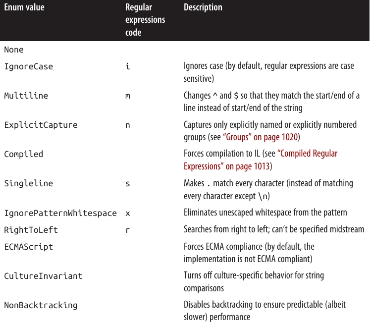 
</div>


## 🔤 Character Escapes

در **Regular Expressions** تعدادی **متاکاراکتر (Metacharacter)** وجود دارند که معنای ویژه‌ای دارند و به صورت **لیترال (literal)** تفسیر نمی‌شوند:
</div>

```
\   *   +   ?   |   {   [   (   )   ^   $   .   #
```

<div dir="rtl">
برای اینکه یک متاکاراکتر را به صورت **لیترال** (یعنی دقیقاً همان کاراکتر) استفاده کنیم، باید قبل از آن یک **بک‌اسلش** (`\`) قرار دهیم (اصطلاحاً Escape کنیم).

مثال: در کد زیر، علامت `?` را Escape می‌کنیم تا بتوانیم دقیقاً رشته `"what?"` را تطبیق دهیم:
</div>

```csharp
Console.WriteLine (Regex.Match ("what?", @"what\?")); // what? (درست)
Console.WriteLine (Regex.Match ("what?", @"what?"));  // what  (نادرست)
```

<div dir="rtl">
📌 نکته: اگر کاراکتر داخل یک **مجموعه (Set)** باشد (یعنی داخل براکت‌های `[]` نوشته شده باشد)، این قانون اعمال نمی‌شود و متاکاراکترها همان‌طور که هستند به صورت **لیترال** در نظر گرفته می‌شوند. (مجموعه‌ها را در بخش بعدی بررسی می‌کنیم).

---

## 🛠️ متدهای Escape و Unescape در Regex

کلاس **Regex** دو متد مهم دارد:

* **Escape** → رشته‌ای را که شامل متاکاراکترهای Regular Expression است، گرفته و آن‌ها را به معادل Escape‌شده تبدیل می‌کند.
* **Unescape** → دقیقاً برعکس کار بالا را انجام می‌دهد (Escapeها را حذف می‌کند).

مثال:
</div>

```csharp
Console.WriteLine (Regex.Escape   (@"?"));     // \?
Console.WriteLine (Regex.Unescape (@"\?"));    // ?>
```

<div dir="rtl">
---

## 💡 نکته درباره @ در رشته‌های C#

تمام رشته‌های Regular Expression در این فصل با پیشوند **@** در C# نوشته شده‌اند. دلیلش این است که مکانیزم Escape خود زبان C# هم از **بک‌اسلش** استفاده می‌کند.

اگر `@` استفاده نشود، برای نمایش یک بک‌اسلش ساده باید چهار تا بک‌اسلش بنویسید! 😅

مثال:
</div>

```csharp
Console.WriteLine (Regex.Match ("\\", "\\\\"));    // \
```

<div dir="rtl">
---

## ⚠️ فاصله‌ها در Regular Expressions

مگر اینکه گزینه `(?x)` فعال باشد، فاصله‌ها (Space) در Regular Expressions **به صورت لیترال** در نظر گرفته می‌شوند.

مثال:
</div>

```csharp
Console.Write (Regex.IsMatch ("hello world", @"hello world"));  // True
```

<div dir="rtl">
---

## 🎭 Character Sets

**Character Sets** (مجموعه کاراکترها) مثل **Wildcards** عمل می‌کنند، با این تفاوت که فقط برای یک مجموعه خاص از کاراکترها استفاده می‌شوند.

 <div align="center">
    
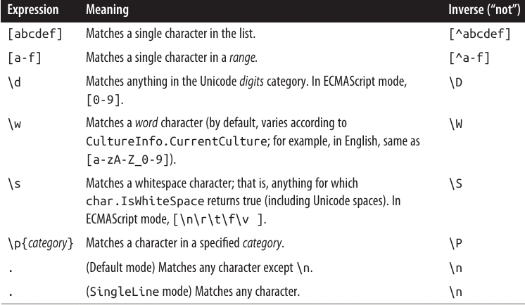 
</div>


## 🎭 Character Sets (مجموعه کاراکترها)

برای تطبیق دقیقاً یکی از کاراکترهای یک مجموعه، باید آن مجموعه را داخل براکت‌های مربعی `[]` قرار دهید:
</div>

```csharp
Console.Write (Regex.Matches ("That is that.", "[Tt]hat").Count);   // 2
```

<div dir="rtl">
🔹 در مثال بالا، الگو `[Tt]hat` هم کلمه **That** (با T بزرگ) و هم **that** (با t کوچک) را پیدا می‌کند. نتیجه برابر **۲** خواهد بود.

---

### ❌ مجموعه‌های منفی

برای تطبیق هر کاراکتری به‌جز آن‌هایی که در یک مجموعه هستند، کافیست علامت `^` را در ابتدای مجموعه قرار دهید:
</div>

```csharp
Console.Write (Regex.Match ("quiz qwerty", "q[^aeiou]").Index);    // 5
```

<div dir="rtl">
🔹 در اینجا الگو `q[^aeiou]` به دنبال یک حرف `q` است که بعد از آن **هیچ‌کدام از حروف صدادار a, e, i, o, u** نیاید. نتیجه این است که تطبیق از ایندکس ۵ پیدا می‌شود.

---

### 🔡 محدوده کاراکترها

شما می‌توانید یک محدوده از کاراکترها را با استفاده از **خط فاصله (hyphen)** مشخص کنید. مثال زیر یک حرکت شطرنج را تطبیق می‌دهد:
</div>

```csharp
Console.Write (Regex.Match ("b1-c4", @"[a-h]\d-[a-h]\d").Success);  // True
```

<div dir="rtl">
🔹 در اینجا `[a-h]` یعنی هر حرفی بین **a تا h**، و `\d` یعنی یک عدد (رقم). بنابراین عبارت کل حرکت شطرنج **b1-c4** را شناسایی می‌کند ✅.

---

## 🔢 شورتکات‌های پرکاربرد در Regular Expressions

* `\d` → نشان‌دهنده یک کاراکتر **رقم (Digit)** است.
  🔹 پس `\d` هر عددی را تطبیق می‌دهد.

* `\D` → نشان‌دهنده هر کاراکتری است که **عدد نباشد**.

---

* `\w` → نشان‌دهنده یک کاراکتر **کلمه‌ای (Word character)** است، یعنی:
  **حروف (Letters)** + **اعداد (Numbers)** + **زیرخط (_) یا Underscore**.

* `\W` → نشان‌دهنده هر کاراکتری است که **کلمه‌ای نباشد**.

📌 این‌ها برای حروف غیرانگلیسی (مثل الفبای سیریلیک) هم همان‌طور که انتظار می‌رود عمل می‌کنند.

---

* `.` → هر کاراکتری به جز `\n` (خط جدید) را تطبیق می‌دهد.
  🔹 البته `\r` (Carriage return) را مجاز می‌داند.

---

* `\p{Category}` → یک کاراکتر را بر اساس **دسته‌بندی (Category)** مشخص‌شده تطبیق می‌دهد.

مثلاً:

* `{Lu}` = حرف بزرگ (Uppercase letter)
* `{P}` = علائم نگارشی (Punctuation)
</div>

```csharp
Console.Write (Regex.IsMatch ("Yes, please", @"\p{P}"));   // True
```

<div dir="rtl">
🔹 در اینجا چون رشته `"Yes, please"` شامل علامت ویرگول (,) است، نتیجه `True` خواهد بود.

---

💡 ما در ادامه، وقتی این موارد (`\d`, `\w`, `.`) را با **Quantifiers** (تکرارگرها) ترکیب کنیم، استفاده‌های بیشتری از آن‌ها خواهیم دید.

---

## 🔁 Quantifiers (تکرارگرها)

**Quantifiers** مشخص می‌کنند که یک آیتم چند بار باید تطبیق داده شود.

 <div align="center">
    
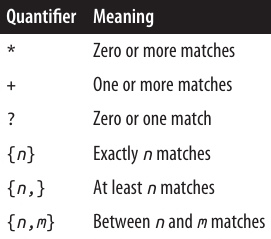 
</div>

## 🔢 Quantifiers (تکرارگرها)

تکرارگر `*` کاراکتر یا گروه قبلی را **صفر بار یا بیشتر** تطبیق می‌دهد. مثال زیر `cv.docx` را تطبیق می‌دهد، همراه با هر نسخه‌ی شماره‌گذاری‌شده‌ی همان فایل (مثلاً `cv2.docx`، `cv15.docx`):
</div>

```csharp
Console.Write (Regex.Match ("cv15.docx", @"cv\d*\.docx").Success);  // True
```

<div dir="rtl">
توجه کنید که باید نقطه را در پسوند فایل با `\` فرار (escape) بدهیم.

مثال زیر هر چیزی بین `cv` و `.docx` را مجاز می‌داند و معادل دستور زیر است:
`dir cv*.docx`
</div>

```csharp
Console.Write (Regex.Match ("cvjoint.docx", @"cv.*\.docx").Success); // True
```

<div dir="rtl">
تکرارگر `+` کاراکتر یا گروه قبلی را **یک بار یا بیشتر** تطبیق می‌دهد. برای نمونه:
</div>

```csharp
Console.Write (Regex.Matches ("slow! yeah slooow!", "slo+w").Count);  // 2
```

<div dir="rtl">
---

تکرارگر `{}` یک **تعداد مشخص (یا بازه‌ای)** از تکرارها را تطبیق می‌دهد. مثال زیر یک فشار خون را تطبیق می‌دهد:
</div>

```csharp
Regex bp = new Regex (@"\d{2,3}/\d{2,3}");
Console.WriteLine (bp.Match ("It used to be 160/110"));  // 160/110
Console.WriteLine (bp.Match ("Now it's only 115/75"));   // 115/75
```

<div dir="rtl">
---

## ⚖️ Greedy در مقابل Lazy Quantifiers

به‌طور پیش‌فرض، تکرارگرها **Greedy (حریص)** هستند، نه **Lazy (تنبل)**.

* یک **Greedy quantifier** تا جایی که می‌تواند تکرار می‌شود قبل از اینکه جلو برود.
* یک **Lazy quantifier** تا حداقل تعداد ممکن تکرار می‌شود قبل از اینکه جلو برود.

شما می‌توانید هر تکرارگری را با اضافه کردن نماد `?` به حالت Lazy تبدیل کنید.

برای نشان دادن تفاوت، این قطعه‌ی HTML را در نظر بگیرید:
</div>

```csharp
string html = "<i>By default</i> quantifiers are <i>greedy</i> creatures";
```

<div dir="rtl">
فرض کنید می‌خواهیم دو عبارت ایتالیک را استخراج کنیم. اگر کد زیر را اجرا کنیم:
</div>

```csharp
foreach (Match m in Regex.Matches (html, @"<i>.*</i>"))
  Console.WriteLine (m);
```

<div dir="rtl">
نتیجه دو تطبیق نیست، بلکه **یک تطبیق** است:
</div>

```
<i>By default</i> quantifiers are <i>greedy</i>
```

<div dir="rtl">
مشکل اینجاست که `*` به‌صورت greedy تا جایی که می‌تواند تکرار می‌شود قبل از اینکه به `</i>` برسد. بنابراین از اولین `</i>` عبور می‌کند و فقط در آخرین `</i>` متوقف می‌شود.

اگر تکرارگر را Lazy کنیم، `*` در همان اولین جایی که بقیه‌ی عبارت می‌تواند تطبیق پیدا کند متوقف می‌شود:
</div>

```csharp
foreach (Match m in Regex.Matches (html, @"<i>.*?</i>"))
  Console.WriteLine (m);
```

<div dir="rtl">
نتیجه:
</div>

```
<i>By default</i>
<i>greedy</i>
```

<div dir="rtl">
---

## 🪝 Zero-Width Assertions

زبان Regular Expressions اجازه می‌دهد شرط‌هایی روی آنچه قبل یا بعد از یک تطبیق رخ می‌دهد اعمال کنیم، از طریق **lookbehind**، **lookahead**، **anchors** و **word boundaries**.
به این‌ها **zero-width assertions** گفته می‌شود، چون طول (یا اندازه) تطبیق را افزایش نمی‌دهند.

---

### 🔮 Lookahead و Lookbehind

ساختار `(?=expr)` بررسی می‌کند که آیا متن بعدی با `expr` مطابقت دارد، بدون اینکه `expr` را در نتیجه برگرداند. این را **positive lookahead** می‌نامند.

در مثال زیر، به دنبال عددی هستیم که بعد از آن کلمه‌ی `"miles"` بیاید:
</div>

```csharp
Console.WriteLine (Regex.Match ("say 25 miles more", @"\d+\s(?=miles)"));
```

<div dir="rtl">
📤 خروجی:
</div>

```
25
```

<div dir="rtl">
دقت کنید که کلمه‌ی `"miles"` در نتیجه برگردانده نشد، حتی اگر برای تطبیق لازم بود.

پس از یک lookahead موفق، تطبیق ادامه پیدا می‌کند، انگار که این پیش‌نمایش اصلاً اتفاق نیفتاده است. پس اگر عبارت را این‌طور بنویسیم:
</div>

```csharp
Console.WriteLine (Regex.Match ("say 25 miles more", @"\d+\s(?=miles).*"));
```

<div dir="rtl">
📤 خروجی:
</div>

```
25 miles more
```

<div dir="rtl">
---

✅ Lookahead می‌تواند برای اعمال قوانین روی پسوردهای قوی مفید باشد. فرض کنید پسورد باید حداقل ۶ کاراکتر باشد و حداقل یک عدد داشته باشد. با یک lookahead می‌توانیم این شرط را برقرار کنیم:
</div>

```csharp
string password = "...";
bool ok = Regex.IsMatch (password, @"(?=.*\d).{6,}");
```

<div dir="rtl">
این ابتدا یک lookahead انجام می‌دهد تا مطمئن شود که حداقل یک رقم در رشته وجود دارد. اگر برقرار بود، به جای قبلی خود برمی‌گردد و سپس حداقل ۶ کاراکتر را تطبیق می‌دهد.

---

ساختار مخالف آن، **negative lookahead** یعنی `(?!expr)` است. این می‌گوید تطبیق نباید با `expr` دنبال شود.

عبارت زیر `"good"` را تطبیق می‌دهد—مگر اینکه `"however"` یا `"but"` بعداً در رشته بیاید:
</div>

```csharp
string regex = "(?i)good(?!.*(however|but))";
Console.WriteLine (Regex.IsMatch ("Good work! But...",  regex));  // False
Console.WriteLine (Regex.IsMatch ("Good work! Thanks!", regex));  // True
```

<div dir="rtl">
---

ساختار `(?<=expr)` به معنای **positive lookbehind** است و نیاز دارد که تطبیق با یک عبارت خاص **قبل از آن** باشد.
ساختار مخالفش، `(?<!expr)`، یعنی **negative lookbehind** است و نیاز دارد که تطبیق قبل از یک عبارت مشخص **نباشد**.

برای مثال، عبارت زیر `"good"` را تطبیق می‌دهد—مگر اینکه `"however"` قبل از آن آمده باشد:
</div>

```csharp
string regex = "(?i)(?<!however.*)good";
Console.WriteLine (Regex.IsMatch ("However good, we...", regex)); // False
Console.WriteLine (Regex.IsMatch ("Very good, thanks!", regex));  // True
```

<div dir="rtl">
---

🔖 ما می‌توانیم این مثال‌ها را با اضافه کردن **word boundary assertions** (که به‌زودی معرفی می‌کنیم) بهبود دهیم.
## ⚓ Anchors (لنگرها)

لنگرهای `^` و `$` یک موقعیت خاص را تطبیق می‌دهند. به‌طور پیش‌فرض:

* `^` تطبیق ابتدای رشته
* `$` تطبیق انتهای رشته

برای نمونه:
</div>

```csharp
Console.WriteLine (Regex.Match ("Not now", "^[Nn]o"));   // No
Console.WriteLine (Regex.Match ("f = 0.2F", "[Ff]$"));   // F
```

<div dir="rtl">
🔹 `^` دو معنای وابسته به متن دارد: **یک لنگر** و **علامت نفی در کلاس کاراکتر**.
🔹 `$` هم دو معنای وابسته به متن دارد: **یک لنگر** و **نشانه‌ی گروه جایگزین (replacement group denoter)**.

---

وقتی `RegexOptions.Multiline` را مشخص کنید یا `(?m)` را در عبارت بیاورید:

* `^` ابتدای رشته یا ابتدای خط (بلافاصله بعد از `\n`) را تطبیق می‌دهد.
* `$` انتهای رشته یا انتهای خط (بلافاصله قبل از `\n`) را تطبیق می‌دهد.

اما یک نکته وجود دارد ⚠️: در ویندوز، پایان خط معمولاً با `\r\n` مشخص می‌شود نه فقط `\n`. بنابراین برای اینکه `$` در حالت چندخطی مفید باشد، باید معمولاً `\r` را هم با یک **positive lookahead** تطبیق دهید:
</div>

```
(?=\r?$)
```

<div dir="rtl">
این **positive lookahead** تضمین می‌کند که `\r` جزئی از نتیجه نشود.

مثال زیر خطوطی را که به ".txt" ختم می‌شوند، تطبیق می‌دهد:
</div>

```csharp
string fileNames = "a.txt" + "\r\n" + "b.docx" + "\r\n" + "c.txt";
string r = @".+\.txt(?=\r?$)";
foreach (Match m in Regex.Matches (fileNames, r, RegexOptions.Multiline))
  Console.Write (m + " ");
```

<div dir="rtl">
📤 خروجی:
</div>

```
a.txt c.txt
```

<div dir="rtl">
---

مثال بعدی همه‌ی خطوط خالی را در رشته‌ی `s` پیدا می‌کند:
</div>

```csharp
MatchCollection emptyLines = Regex.Matches (s, "^(?=\r?$)",
                                            RegexOptions.Multiline);
```

<div dir="rtl">
و این یکی همه‌ی خطوطی را که خالی هستند یا فقط شامل فاصله یا tab می‌باشند:
</div>

```csharp
MatchCollection blankLines = Regex.Matches (s, "^[ \t]*(?=\r?$)",
                                            RegexOptions.Multiline);
```

<div dir="rtl">
از آنجا که یک anchor یک **موقعیت** را تطبیق می‌دهد و نه یک کاراکتر، مشخص کردن یک anchor به‌تنهایی باعث تطبیق با یک رشته‌ی خالی می‌شود:
</div>

```csharp
Console.WriteLine (Regex.Match ("x", "$").Length);   // 0
```

<div dir="rtl">
---

## 🔠 Word Boundaries (مرزهای کلمه)

عبارت `\b` جایی را تطبیق می‌دهد که کاراکترهای کلمه (`\w`) در کنار یکی از این موارد باشند:

* کاراکترهای غیرکلمه (`\W`)
* ابتدای یا انتهای رشته (`^` و `$`)

`\b` اغلب برای تطبیق کل کلمات استفاده می‌شود:
</div>

```csharp
foreach (Match m in Regex.Matches ("Wedding in Sarajevo", @"\b\w+\b"))
  Console.WriteLine (m);
```

<div dir="rtl">
📤 خروجی:
</div>

```
Wedding
in
Sarajevo
```

<div dir="rtl">
---

این دستورات اثر `\b` را روشن‌تر می‌کنند:
</div>

```csharp
int one = Regex.Matches ("Wedding in Sarajevo", @"\bin\b").Count; // 1
int two = Regex.Matches ("Wedding in Sarajevo", @"in").Count;     // 2
```

<div dir="rtl">
---

در این مثال، یک **positive lookahead** استفاده شده تا کلماتی را برگرداند که بعد از آن‌ها "(sic)" آمده است:
</div>

```csharp
string text = "Don't loose (sic) your cool";
Console.Write (Regex.Match (text, @"\b\w+\b\s(?=\(sic\))"));  // loose
```

<div dir="rtl">
---

## 🧩 Groups (گروه‌ها)

گاهی مفید است که یک عبارت باقاعده را به مجموعه‌ای از زیربخش‌ها یا **گروه‌ها** تقسیم کنیم.

برای مثال، این عبارت یک شماره تلفن در آمریکا مانند `206-465-1918` را نشان می‌دهد:
</div>

```
\d{3}-\d{3}-\d{4}
```

<div dir="rtl">
فرض کنید می‌خواهیم آن را به دو گروه تقسیم کنیم: **کد منطقه** و **شماره محلی**.
می‌توانیم با استفاده از پرانتزها این کار را انجام دهیم:
</div>

```
(\d{3})-(\d{3}-\d{4})
```

<div dir="rtl">
سپس گروه‌ها را به‌صورت برنامه‌نویسی بازیابی می‌کنیم:
</div>

```csharp
Match m = Regex.Match ("206-465-1918", @"(\d{3})-(\d{3}-\d{4})");
Console.WriteLine (m.Groups[1]);   // 206
Console.WriteLine (m.Groups[2]);   // 465-1918
```

<div dir="rtl">
🔹 گروه صفر، کل تطبیق را نمایش می‌دهد. یعنی همان مقداری که در `Value` وجود دارد:
</div>

```csharp
Console.WriteLine (m.Groups[0]);   // 206-465-1918
Console.WriteLine (m);             // 206-465-1918
```

<div dir="rtl">
---

گروه‌ها بخشی از خود زبان Regular Expressions هستند. این یعنی می‌توانید به یک گروه در داخل یک عبارت اشاره کنید.

سینتکس `\n` اجازه می‌دهد یک گروه را با شماره‌ی آن در داخل عبارت فراخوانی کنید.

برای نمونه، عبارت `(\w)ee\1` کلمات `deed` و `peep` را تطبیق می‌دهد.

مثال زیر همه‌ی کلماتی را پیدا می‌کند که با همان حرف شروع و تمام می‌شوند:
</div>

```csharp
foreach (Match m in Regex.Matches ("pop pope peep", @"\b(\w)\w+\1\b"))
  Console.Write (m + " ");  // pop peep
```

<div dir="rtl">
🔎 پرانتزهای اطراف `\w` به موتور Regular Expressions می‌گویند که این زیربخش (در اینجا یک حرف) را در یک گروه ذخیره کند تا بعداً استفاده شود.
ما بعداً با `\1` به آن گروه اشاره می‌کنیم، یعنی گروه اول در عبارت.
## 🏷 Named Groups (گروه‌های نام‌گذاری‌شده)

در یک عبارت طولانی یا پیچیده، کار با گروه‌ها با **نام** به جای اندیس می‌تواند راحت‌تر باشد.
در مثال زیر، نسخه‌ی قبلی با یک گروه به نام `'letter'` بازنویسی شده است:
</div>

```csharp
string regEx =
 @"\b"             +  // word boundary
 @"(?'letter'\w)"  +  // تطبیق اولین حرف و نامگذاری آن به 'letter'
 @"\w+"            +  // تطبیق حروف میانی
 @"\k'letter'"     +  // تطبیق حرف آخر مطابق با 'letter'
 @"\b";               // word boundary

foreach (Match m in Regex.Matches ("bob pope peep", regEx))
  Console.Write (m + " ");  // bob peep
```

<div dir="rtl">
### چگونگی نامگذاری گروه‌ها:
</div>

```
(?'group-name'group-expr)  یا  (?<group-name>group-expr)
```

<div dir="rtl">
### چگونگی ارجاع به یک گروه:
</div>

```
\k'group-name'  یا  \k<group-name>
```

<div dir="rtl">
---

مثال بعدی، تطبیق یک عنصر ساده‌ی XML/HTML (غیرتو درتو) با جستجوی تگ آغاز و پایان با نام مشابه است:
</div>

```csharp
string regFind =
 @"<(?'tag'\w+?).*>" +  // تطبیق lazy اولین تگ و نامگذاری آن به 'tag'
 @"(?'text'.*?)"     +  // تطبیق lazy محتوای متن، نامگذاری به 'text'
 @"</\k'tag'>";         // تطبیق تگ پایانی مطابق با 'tag'

Match m = Regex.Match ("<h1>hello</h1>", regFind);
Console.WriteLine (m.Groups ["tag"]);          // h1
Console.WriteLine (m.Groups ["text"]);         // hello
```

<div dir="rtl">
📌 توجه: تطبیق تمام حالات ممکن در ساختار XML، مانند عناصر تو در تو، پیچیده‌تر است. موتور Regular Expressions در .NET از ویژگی پیشرفته‌ای به نام **matched balanced constructs** پشتیبانی می‌کند که می‌تواند در این موارد کمک کند.

---

## 🔄 Replacing and Splitting Text (جایگزینی و تقسیم متن)

### جایگزینی متن

`RegEx.Replace` مشابه `string.Replace` عمل می‌کند، اما از **عبارت منظم** استفاده می‌کند.

مثال زیر، `"cat"` را با `"dog"` جایگزین می‌کند. برخلاف `string.Replace`، `"catapult"` به `"dogapult"` تبدیل نمی‌شود، زیرا ما از **word boundaries** استفاده کرده‌ایم:
</div>

```csharp
string find = @"\bcat\b";
string replace = "dog";
Console.WriteLine (Regex.Replace ("catapult the cat", find, replace));
```

<div dir="rtl">
📤 خروجی:
</div>

```
catapult the dog
```

<div dir="rtl">
---

می‌توان از `$0` برای ارجاع به تطبیق اصلی استفاده کرد. مثال زیر اعداد داخل رشته را در `< >` قرار می‌دهد:
</div>

```csharp
string text = "10 plus 20 makes 30";
Console.WriteLine (Regex.Replace (text, @"\d+", @"<$0>"));
```

<div dir="rtl">
📤 خروجی:
</div>

```
<10> plus <20> makes <30>
```

<div dir="rtl">
🔹 می‌توان به گروه‌های گرفته‌شده با `$1, $2, $3` یا `${name}` برای گروه‌های نام‌گذاری‌شده دسترسی داشت.

مثال قبل با XML ساده را می‌توان با جابه‌جایی گروه‌ها جایگزین کرد تا محتوای عنصر به یک **attribute** منتقل شود:
</div>

```csharp
string regReplace =
 @"<${tag}"         +  // <tag
 @"value="""        +  // value="
 @"${text}"         +  // محتوای متن
 @"""/>";              // "/>

Console.Write (Regex.Replace ("<msg>hello</msg>", regFind, regReplace));
```

<div dir="rtl">
📤 خروجی:
</div>

```
<msg value="hello"/>
```

<div dir="rtl">
---

### MatchEvaluator Delegate

`Replace` یک overload دارد که یک **delegate از نوع MatchEvaluator** می‌گیرد و برای هر تطبیق فراخوانی می‌شود. این امکان را می‌دهد که محتوای رشته‌ی جایگزین توسط **کد C#** تعیین شود:
</div>

```csharp
Console.WriteLine (Regex.Replace ("5 is less than 10", @"\d+",
                   m => (int.Parse (m.Value) * 10).ToString()) );
```

<div dir="rtl">
📤 خروجی:
</div>

```
50 is less than 100
```

<div dir="rtl">
در کتاب **Cookbook Regular Expressions** صفحه 1023، نمونه‌ای از استفاده‌ی MatchEvaluator برای **Escape کردن کاراکترهای Unicode مناسب HTML** ارائه شده است.

---

### تقسیم متن (Splitting Text)

متد `Regex.Split` نسخه‌ی قدرتمندتری از `string.Split` است که **الگوی جداکننده** توسط یک عبارت منظم تعیین می‌شود.

مثال:
</div>

```csharp
foreach (string s in Regex.Split ("a5b7c", @"\d"))
  Console.Write (s + " ");     // a b c
```

<div dir="rtl">
در اینجا جداکننده‌ها در خروجی نیستند. برای شامل کردن جداکننده‌ها، می‌توان از **positive lookahead** استفاده کرد:
</div>

```csharp
foreach (string s in Regex.Split ("oneTwoThree", @"(?=[A-Z])"))
  Console.Write (s + " ");    // one Two Three
```

<div dir="rtl">
---

## 📖 Cookbook Regular Expressions (دستورالعمل‌ها)

### تطبیق شماره SSN / شماره تلفن آمریکا
</div>

```csharp
string ssNum = @"\d{3}-\d{2}-\d{4}";
Console.WriteLine (Regex.IsMatch ("123-45-6789", ssNum));      // True

string phone = @"(?x)
  ( \d{3}[-\s] | \(\d{3}\)\s? )
    \d{3}[-\s]?
    \d{4}";

Console.WriteLine (Regex.IsMatch ("123-456-7890",   phone));   // True
Console.WriteLine (Regex.IsMatch ("(123) 456-7890", phone));   // True
```

<div dir="rtl">
## 🔹 استخراج زوج‌های "name = value" (یک مورد در هر خط)

توجه داشته باشید که این مثال با **multiline directive** شروع می‌شود:
</div>

```csharp
string r = @"(?m)^\s*(?'name'\w+)\s*=\s*(?'value'.*)\s*(?=\r?$)";
string text =
 @"id = 3
   secure = true
   timeout = 30";

foreach (Match m in Regex.Matches (text, r))
  Console.WriteLine (m.Groups["name"] + " is " + m.Groups["value"]);
```

<div dir="rtl">
📤 خروجی:
</div>

```
id is 3
secure is true
timeout is 30
```

<div dir="rtl">
---

## 🔐 اعتبارسنجی پسورد قوی

این مثال بررسی می‌کند که آیا یک پسورد حداقل **شش کاراکتر** دارد و حداقل یک **عدد، نماد یا علامت نگارشی** شامل می‌شود:
</div>

```csharp
string r = @"(?x)^(?=.*(\d|\p{P}|\p{S})).{6,}";
Console.WriteLine (Regex.IsMatch ("abc12", r));     // False
Console.WriteLine (Regex.IsMatch ("abcdef", r));    // False
Console.WriteLine (Regex.IsMatch ("ab88yz", r));    // True
```

<div dir="rtl">
---

## 📏 خطوط حداقل ۸۰ کاراکتری
</div>

```csharp
string r = @"(?m)^.{80,}(?=\r?$)";
string fifty = new string ('x', 50);
string eighty = new string ('x', 80);
string text = eighty + "\r\n" + fifty + "\r\n" + eighty;
Console.WriteLine (Regex.Matches (text, r).Count);   // 2
```

<div dir="rtl">
---

## 📅 تجزیه تاریخ/زمان (N/N/N H:M:S AM/PM)

این عبارت از فرمت‌های مختلف عددی تاریخ پشتیبانی می‌کند و فرقی نمی‌کند که سال اول باشد یا آخر.

* `(?x)` باعث خواناتر شدن عبارت می‌شود (فضای خالی نادیده گرفته می‌شود)
* `(?i)` حساسیت به حروف را خاموش می‌کند (برای AM/PM اختیاری)
</div>

```csharp
string r = @"(?x)(?i)
 (\d{1,4}) [./-]
 (\d{1,2}) [./-]
 (\d{1,4}) [\sT]
 (\d+):(\d+):(\d+) \s? (A\.?M\.?|P\.?M\.?)?";
string text = "01/02/2008 5:20:50 PM";

foreach (Group g in Regex.Match (text, r).Groups)
  Console.WriteLine (g.Value + " ");
```

<div dir="rtl">
📤 خروجی:
</div>

```
01/02/2008 5:20:50 PM 01 02 2008 5 20 50 PM
```

<div dir="rtl">
*(البته این بررسی نمی‌کند که تاریخ/زمان درست باشد)*

---

## 🏛 تطبیق اعداد رومی
</div>

```csharp
string r =
 @"(?i)\bm*"         +
 @"(d?c{0,3}|c[dm])" +
 @"(l?x{0,3}|x[lc])" +
 @"(v?i{0,3}|i[vx])" +
 @"\b";

Console.WriteLine (Regex.IsMatch ("MCMLXXXIV", r));   // True
```

<div dir="rtl">
---

## 🔁 حذف کلمات تکراری

در این مثال، یک گروه نامگذاری‌شده به نام `dupe` گرفته می‌شود:
</div>

```csharp
string r = @"(?'dupe'\w+)\W\k'dupe'";
string text = "In the the beginning...";
Console.WriteLine (Regex.Replace (text, r, "${dupe}"));
```

<div dir="rtl">
📤 خروجی:
</div>

```
In the beginning
```

<div dir="rtl">
---

## 🔢 شمارش کلمات
</div>

```csharp
string r = @"\b(\w|[-'])+\b";
string text = "It's all mumbo-jumbo to me";
Console.WriteLine (Regex.Matches (text, r).Count);   // 5
```

<div dir="rtl">
---

## 🧩 تطبیق GUID
</div>

```csharp
string r =
 @"(?i)\b"           +
 @"[0-9a-fA-F]{8}\-" +
 @"[0-9a-fA-F]{4}\-" +
 @"[0-9a-fA-F]{4}\-" +
 @"[0-9a-fA-F]{4}\-" +
 @"[0-9a-fA-F]{12}"  +
 @"\b";

string text = "Its key is {3F2504E0-4F89-11D3-9A0C-0305E82C3301}.";
Console.WriteLine (Regex.Match (text, r).Index);                    // 12
```

<div dir="rtl">
---

## 🏷 تجزیه تگ XML/HTML

عبارت منظم می‌تواند برای تجزیه **HTML fragments** مفید باشد، مخصوصاً وقتی سند ناقص باشد:
</div>

```csharp
string r =
 @"<(?'tag'\w+?).*>"  +  // lazy-match اولین تگ، نامگذاری به 'tag'
 @"(?'text'.*?)"      +  // lazy-match محتوای متن، نامگذاری به 'text'
 @"</\k'tag'>";          // تطبیق تگ پایانی مطابق با 'tag'

string text = "<h1>hello</h1>";
Match m = Regex.Match (text, r);
Console.WriteLine (m.Groups ["tag"]);       // h1
Console.WriteLine (m.Groups ["text"]);      // hello
```

<div dir="rtl">
---

## 🐫 تقسیم کلمات CamelCase

برای شامل کردن جداکننده‌های بزرگ، نیاز به **positive lookahead** داریم:
</div>

```csharp
string r = @"(?=[A-Z])";
foreach (string s in Regex.Split ("oneTwoThree", r))
  Console.Write (s + " ");    // one Two Three
```

<div dir="rtl">
---

## 🗂 به‌دست آوردن نام فایل معتبر
</div>

```csharp
string input = "My \"good\" <recipes>.txt";
char[] invalidChars = System.IO.Path.GetInvalidFileNameChars();
string invalidString = Regex.Escape (new string (invalidChars));
string valid = Regex.Replace (input, "[" + invalidString + "]", "");
Console.WriteLine (valid);
```

<div dir="rtl">
📤 خروجی:
</div>

```
My good recipes.txt
```

<div dir="rtl">
---

## 🌐 Escape کردن کاراکترهای Unicode برای HTML
</div>

```csharp
string htmlFragment = "© 2007";
string result = Regex.Replace (htmlFragment, @"[\u0080-\uFFFF]",
               m => @"&#" + ((int)m.Value[0]).ToString() + ";");
Console.WriteLine (result);        // &#169; 2007
```

<div dir="rtl">
## 🔓 تبدیل کاراکترهای Escape شده در یک **HTTP query string**
</div>

```csharp
string sample = "C%23 rocks";
string result = Regex.Replace (
   sample,
   @"%[0-9a-f][0-9a-f]", 
   m => ((char) Convert.ToByte (m.Value.Substring (1), 16)).ToString(),
   RegexOptions.IgnoreCase
);
Console.WriteLine (result);   // C# rocks
```

<div dir="rtl">
---

## 🔍 استخراج عبارت‌های جستجوی Google از یک **web stats log**

این مثال معمولاً همراه با نمونه‌ی قبلی استفاده می‌شود تا کاراکترهای Escape شده در **query string** بازگردانده شوند:
</div>

```csharp
string sample = 
 "http://google.com/search?hl=en&q=greedy+quantifiers+regex&btnG=Search";

Match m = Regex.Match (sample, @"(?<=google\..+search\?.*q=).+?(?=(&|$))");
string[] keywords = m.Value.Split (
 new[] { '+' }, StringSplitOptions.RemoveEmptyEntries);

foreach (string keyword in keywords)
  Console.Write (keyword + " ");       // greedy quantifiers regex
```

<div dir="rtl">
---

## 📚 مرجع زبان **Regular Expressions**

جداول **25-2 تا 25-12** دستور زبان و سینتکس **regular expressions** پشتیبانی شده در پیاده‌سازی **.NET** را خلاصه می‌کنند.
 <div align="center">
    
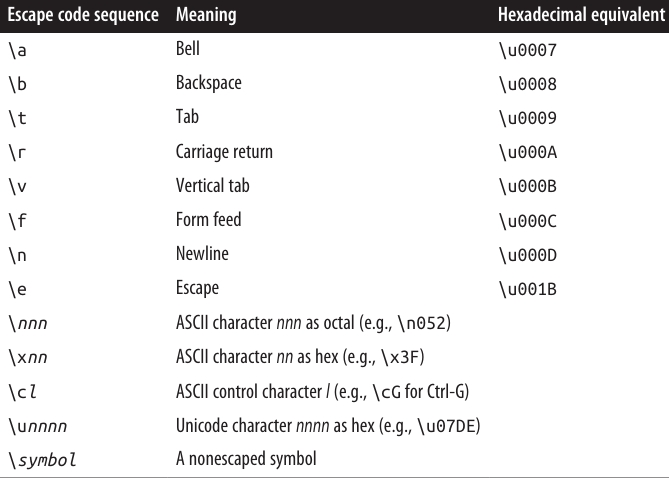 
</div>

💡 **حالت ویژه**

در یک **regular expression**، `\b` به معنای **word boundary** است، **به جز زمانی که داخل یک مجموعه `[ ]` قرار گیرد**، که در آن صورت `\b` به معنای **کاراکتر backspace** است.
 <div align="center">
    
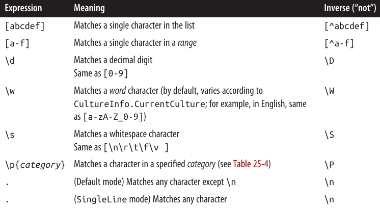 
</div>

 <div align="center">
    
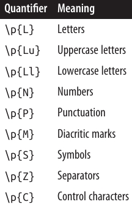 
</div>

 <div align="center">
    
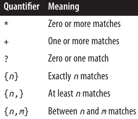 
</div>

❓ پسوند `?` می‌تواند به هر یک از **quantifierها** اعمال شود تا آن‌ها را **lazy** کند، به جای اینکه **greedy** باشند.
 <div align="center">
    
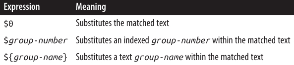 
</div>

🔄 **Substitutions** تنها درون **replacement pattern** مشخص می‌شوند.
 <div align="center">
    
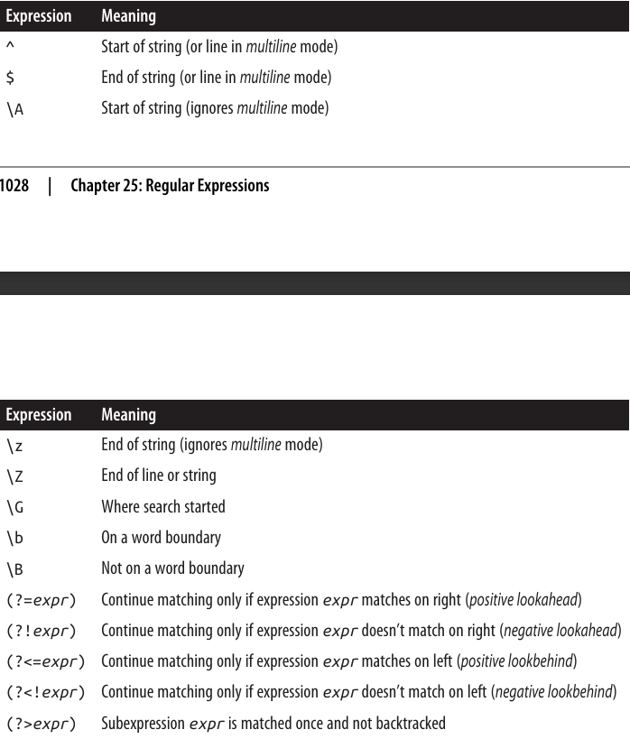 
</div>

 <div align="center">
    
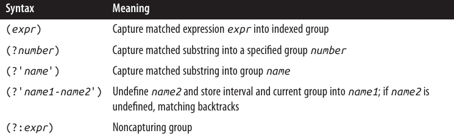 
</div>

 <div align="center">
    
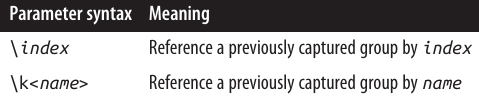 
</div>

 <div align="center">
    
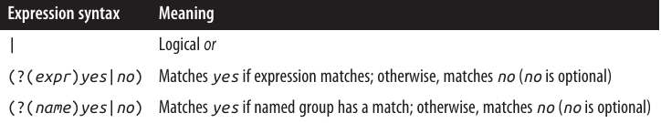 
</div>

 <div align="center">
    
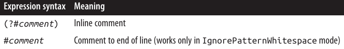 
</div>

 <div align="center">
    
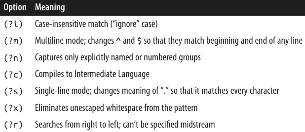 
</div>
</div>

