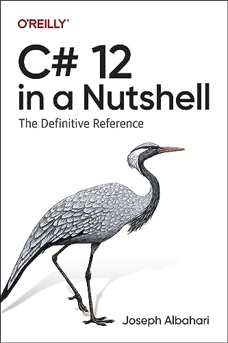

  

<h1 align="center">📘 ترجمه فارسی کتاب C# 12 in a Nutshell</h1>

  مرجع کامل و کاربردی برای توسعه‌دهندگان سی‌شارپ و دات‌نت

  
  
  
  

<h1>

   <a href="https://hheydarian.github.io/Gitab/" target="_blank"><strong>  گیتاب —  نسخه آنلاین کتاب </strong></a>

 </h1>
 
---
## ✨ معرفی پروژه

کتاب "C# 12 in a Nutshell" نوشته Joseph Albahari یکی از جامع‌ترین و معتبرترین مراجع برای یادگیری زبان #C و فریم‌ورک .NET به شمار می‌رود.

این ریپازیتوری تلاشی‌ست برای ارائه نسخه‌ای فارسی، جامع و دقیق از این کتاب مرجع برای جامعه فارسی‌زبان برنامه‌نویسان. امیدواریم با کمک هم بتونیم یادگیری زبان #C و اکوسیستم .NET رو برای علاقه‌مندان ساده‌تر و عمیق‌تر کنیم 🚀

---
## ⚙️ پیش‌نیاز مطالعه

🔹 برای تجربه خوانایی بهتر در مرورگر، توصیه می‌کنیم افزونه [فونت ایران](https://chromewebstore.google.com/detail/fontiran/edbchgkbejkdkdkpgenlaciegoidmjoh) رو نصب کنید.

---

## 🙌 راه‌های مشارکت

ما به حضور شما تو این پروژه افتخار می‌کنیم! مشارکت‌تون می‌تونه از راه‌های زیر باشه:

- 🔎 **بازبینی و اصلاح ترجمه‌های فعلی**
- 💡 **پیشنهادات فنی یا ادبی برای بهبود متن**
- 🎨 **مرتب‌سازی و فرمت‌دهی کدها برای خوانایی بیشتر**
- 🗨️ **اگر قصد داشتید از هوش مصنوعی استفاده کنید در ترجمه، می تونید این متن [پرامپت](assets/prompt.md ) رو بهش بدید.**

---
## 🔗 فصل‌های کتاب (با لینک)

  
| شماره | نام فصل (انگلیسی)                         | نام فصل (فارسی)                            | وضعیت | لینک                                               |
|-------|-------------------------------------------|---------------------------------------------|--------|----------------------------------------------------|
| 00    | Preface                                   | مقدمه                                      | ✅     | [Preface](Book/00/Preface.md)                     |
| 01    | Introducing C# and .NET                   | معرفی سی‌شارپ و دات‌نت                      | ✅    | [Introducing-C#-and-.NET](Book/01/Introducing-C%23-and-.NET.md) |
| 02    | C# Language Basics                        | مبانی زبان سی‌شارپ                          | ✅     | [C#-Language-Basics](Book/02/C%23-Language-Basics.md)           |
| 03    | Creating Types in C#                      | ساخت انواع در سی‌شارپ                       | ✅     | [Creating-Types-in-C#](Book/03/Creating-Types-in-C%23.md)       |
| 04    | Advanced C#                               | سی‌شارپ پیشرفته                            | ✅     | [Advanced-C#](Book/04/Advanced-C%23.md)                         |
| 05    | .NET Overview                             | نمای کلی دات‌نت                             | ✅     | [.NET-Overview](Book/05/.NET-Overview.md)                       |
| 06    | .NET Fundamentals                         | مبانی دات‌نت                                | ✅     | [.NET-Fundamentals](Book/06/.NET-Fundamentals.md)               |
| 07    | Collections                               | مجموعه‌ها                                   | ✅     | [Collections](Book/07/Collections.md)                           |
| 08    | LINQ Queries                              | کوئری‌های LINQ                              | ✅     | [LINQ-Queries](Book/08/LINQ-Queries.md)                         |
| 09    | LINQ Operators                            | عملگرهای LINQ                               | ✅     | [LINQ-Operators](Book/09/LINQ-Operators.md)                     |
| 10    | LINQ to XML                               | LINQ به XML                                 | ✅     | [LINQ-to-XML](Book/10/LINQ-to-XML.md)                           |
| 11    | Other XML and JSON                        | دیگر فرمت‌های XML و JSON                    | ✅     | [Other-XML-and-JSON](Book/11/Other-XML-and-JSON.md)             |
| 12    | Disposal and Garbage Collection           | حذف منابع و جمع‌آوری زباله                  | ✅     | [Disposal-and-Garbage-Collection](Book/12/Disposal-and-Garbage-Collection.md) |
| 13    | Diagnostics                               | عیب‌یابی                                     | ✅     | [Diagnostics](Book/13/Diagnostics.md)                           |
| 14    | Concurrency and Asynchrony               | همزمانی و برنامه‌نویسی ناهمگام             | ✅     | [Concurrency-and-Asynchrony](Book/14/Concurrency-and-Asynchrony.md) |
| 15    | Streams and IO                            | جریان‌ها و ورودی/خروجی                      | ✅     | [Streams-and-IO](Book/15/Streams-and-IO.md)                     |
| 16    | Networking                                | شبکه‌سازی                                   | ✅     | [Networking](Book/16/Networking.md)                             |
| 17    | Assemblies                                | اسمبلی‌ها                                   | ✅     | [Assemblies](Book/17/Assemblies.md)                             |
| 18    | Reflection and Metadata                   | بازتاب و فراداده                            | ✅     | [Reflection-and-Metadata](Book/18/Reflection-and-Metadata.md)   |
| 19    | Dynamic Programming                       | برنامه‌نویسی داینامیک                       | ✅     | [Dynamic-Programming](Book/19/Dynamic-Programming.md)           |
| 20    | Cryptography                              | رمزنگاری                                    | ✅     | [Cryptography](Book/20/Cryptography.md)                         |
| 21    | Advanced Threading                        | رشته‌بندی پیشرفته                           | ✅     | [Advanced-Threading](Book/21/Advanced-Threading.md)             |
| 22    | Parallel Programming                      | برنامه‌نویسی موازی                          | ✅     | [Parallel-Programming](Book/22/Parallel-Programming.md)         |
| 23    | Span<T> and Memory<T>                     | Span<T> و Memory<T>                          | ✅     | [SpanT-and-MemoryT](Book/23/SpanT-and-MemoryT.md)               |
| 24    | Native and COM Interoperability           | ارتباط با کد بومی و COM                     | ✅     | [Native-and-COM-Interoperability](Book/24/Native-and-COM-Interoperability.md) |
| 25    | Regular Expressions                       | عبارات باقاعده                              | ✅     | [Regular-Expressions](Book/25/Regular-Expressions.md)           |

---
## 🧩 اصول ساختاری پروژه

- فایل‌ها با فرمت `.md` نوشته شدند
- عکس‌ها داخل پوشه `assets/image/` ذخیره شدند
-  یادگیری [Markdown](https://markdown-fa-book.vercel.app/)

---
## 🛡️ مجوز و حقوق نشر
<ul dir="rtl">
<li><b>حقوق نشر و کپی‌رایت کتاب اصلی: </b> حقوق نشر و کپی‌رایت کتاب اصلی متعلق به  (Joseph Albahari) است. 
  </li>
<li><b>متن ترجمه: </b> متن ترجمه شده این کتاب (توسط مترجم) تحت مجوز (CC BY-NC-SA 4.0) منتشر می‌شود.   </li>
<li><b>نمونه کدهای داخل کتاب: </b> تمامی نمونه کدهای موجود در این پروژه، تحت MIT License منتشر شده‌اند. 
    </li>
</ul>

---

## 🌟 قدردانی

سپاس ویژه از همه عزیزانی که وقت گذاشتن و مشارکت کردن. شما هستید که این پروژه رو زنده نگه می‌دارید. 🌱

---

ساخته شده با ❤️ توسط حامد برای برنامه‌نویسان

